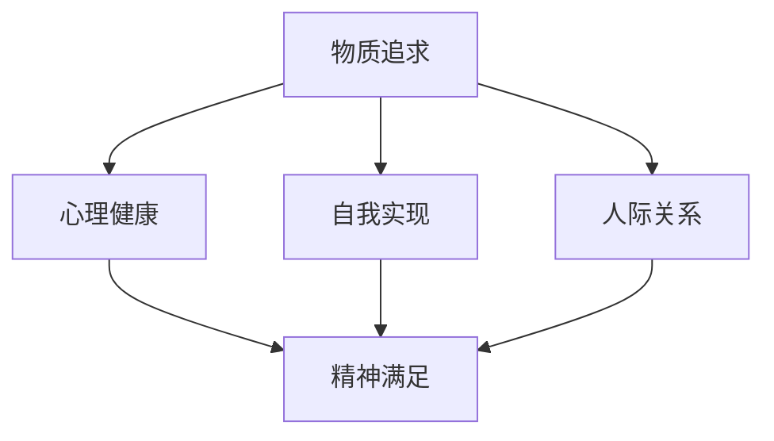

                 

# 从物质追求到精神满足的转变

## 关键词：精神满足，物质追求，自我认知，心理健康，社交

## 摘要：

本文将探讨从物质追求到精神满足的转变。首先，我们明确了物质追求的现状及其带来的负面影响，以及精神满足的迫切性。接着，分析了物质追求与精神满足的矛盾，并提出了转变的必要性和可能性。随后，我们介绍了精神满足的理论基础，以及心理健康与精神满足的关系，以及社交对精神满足的影响。最后，通过自我探索和实践，总结出转变的步骤和成功案例，并展望了未来的发展方向。

## 第1章: 引言

### 1.1 问题背景

#### 1.1.1 物质追求的现状

在现代社会，物质追求已经成为人们生活的重要组成部分。人们追求财富、地位、名誉，希望通过物质的积累来满足自己的需求。然而，这种追求往往导致人们忽视精神层面的需求，使得心理健康问题日益突出。

#### 1.1.2 精神满足的迫切性

随着物质生活的丰富，人们开始意识到精神满足的重要性。精神满足不仅能够提升个人的幸福感，还能促进社会的和谐与进步。因此，从物质追求到精神满足的转变显得尤为迫切。

### 1.2 问题描述

#### 1.2.1 物质追求与精神满足的矛盾

物质追求往往导致精神满足的缺失。人们为了追求物质财富，往往牺牲了时间、健康和人际关系，导致内心的空虚和焦虑。这种矛盾使得人们开始寻求精神层面的满足。

#### 1.2.2 转变的必要性与可能性

转变的必要性在于解决物质追求带来的负面影响，提高精神满足度。转变的可能性在于人们逐渐认识到精神满足的重要性，并有意愿和资源进行转变。

### 1.3 问题解决

#### 1.3.1 理论基础与实践方法

本文将介绍精神满足的理论基础，包括心理学、社会学和人文主义理论。同时，提供实践方法，如自我探索、心理健康维护和社交等方面的建议。

#### 1.3.2 转变的路径与策略

本文将分析转变的路径和策略，包括如何调整价值观、培养积极心态、建立健康的人际关系等。

### 1.4 边界与外延

#### 1.4.1 物质追求的范畴

物质追求包括财富、地位、名誉等。本文主要关注物质追求对精神满足的影响。

#### 1.4.2 精神满足的范畴

精神满足包括心理健康、自我实现、人际关系等方面。本文主要探讨如何通过自我探索和实践，实现从物质追求到精神满足的转变。

### 1.5 概念结构与核心要素组成

#### 1.5.1 物质追求的核心要素

物质追求的核心要素包括财富、地位、名誉等。

#### 1.5.2 精神满足的核心要素

精神满足的核心要素包括心理健康、自我实现、人际关系等。

## 第2章: 从物质追求到精神满足的转变

### 2.1 核心概念

#### 2.1.1 物质追求的概念

物质追求是指人们通过获取物质财富、地位、名誉等来满足自己的需求。

#### 2.1.2 精神满足的概念

精神满足是指人们在心理健康、自我实现、人际关系等方面得到满足。

### 2.2 概念属性特征对比表格

| 特征         | 物质追求                          | 精神满足                          |
|--------------|----------------------------------|----------------------------------|
| 目的         | 满足物质需求                     | 提升精神层面                    |
| 方法         | 通过获取物质财富、地位、名誉等实现 | 通过自我探索、心理健康维护、社交等实现 |
| 后果         | 物质满足但精神空虚              | 精神满足且物质稳定               |
| 对个人影响    | 增加压力、焦虑、抑郁             | 增加幸福感、满足感、成就感          |
| 对社会影响    | 社会不公、资源分配不均           | 社会和谐、人际关系融洽           |

### 2.3 ER实体关系图架构

## 第3章: 精神满足的理论基础

### 3.1 相关理论介绍

#### 3.1.1 心理学理论

心理学理论认为，人的心理健康是精神满足的基础。包括认知心理学、人格心理学、发展心理学等，都从不同角度探讨了如何实现心理健康。

#### 3.1.2 社会学理论

社会学理论关注社会环境对个人精神满足的影响。包括社会支持、社会角色、社会认同等概念，揭示了社会因素在精神满足中的重要作用。

#### 3.1.3 人文主义理论

人文主义理论强调人的自我实现和自由发展。包括存在主义、人本主义等，为精神满足提供了哲学基础。

### 3.2 理论关联性分析

#### 3.2.1 心理学与社会学的交叉点

心理学与社会学的交叉点在于对个体与社会关系的探讨。两者共同关注心理健康、社会支持、人际关系等概念，为精神满足提供了多维度的基础。

#### 3.2.2 人文主义理论与现实生活的融合

人文主义理论强调人的自由发展和自我实现，与现代社会生活密切相关。通过将人文主义理论融入现实生活，有助于实现精神满足。

### 3.3 理论在实际应用中的体现

#### 3.3.1 心理学在个人成长中的应用

心理学理论在个人成长中的应用包括自我认知、情感管理、压力应对等方面。通过应用心理学理论，个人可以更好地实现精神满足。

#### 3.3.2 社会学在人际关系中的作用

社会学理论在人际关系中的应用包括社会支持、社会认同、沟通技巧等方面。通过应用社会学理论，个人可以建立更健康的人际关系，实现精神满足。

#### 3.3.3 人文主义理论在生活态度的影响

人文主义理论对生活态度的影响包括价值观的转变、生活目标的设定、自我价值的实现等方面。通过融入人文主义理论，个人可以树立积极的生活态度，实现精神满足。

## 第4章: 转变过程中的自我探索

### 4.1 自我认知的重要性

#### 4.1.1 自我认知的定义

自我认知是指个体对自己的认知，包括性格、能力、价值观等方面。

#### 4.1.2 自我认知在转变过程中的作用

自我认知在转变过程中的作用包括：明确个人目标、调整心态、找到合适的转变路径等。

### 4.2 自我探索的方法

#### 4.2.1 内省法

内省法是指通过反思自己的行为、思想和情感，了解自己的内心世界。

#### 4.2.2 记录法

记录法是指通过日记、笔记等方式，记录自己的成长过程和内心体验。

#### 4.2.3 反馈法

反馈法是指通过他人的评价和反馈，了解自己的优点和不足，进行自我改进。

### 4.3 自我探索的挑战

#### 4.3.1 面对未知的不安

自我探索过程中，面对未知的领域和挑战，容易产生不安和恐惧。

#### 4.3.2 面对自我的恐惧

自我探索需要面对自己的缺点和不足，这可能会引发恐惧和抵触情绪。

#### 4.3.3 如何处理负面情绪

负面情绪如焦虑、抑郁等在自我探索过程中可能会出现，如何处理这些情绪是自我探索的挑战之一。

## 第5章: 心理健康与精神满足的关系

### 5.1 心理健康的重要性

#### 5.1.1 心理健康的定义

心理健康是指个体在情感、认知和行为等方面处于良好状态，能够适应生活中的各种挑战。

#### 5.1.2 心理健康对精神满足的影响

心理健康对精神满足有着重要影响。只有心理健康，个体才能更好地实现精神满足。

### 5.2 心理健康的指标

#### 5.2.1 情感指标

情感指标包括情绪稳定性、积极情绪、消极情绪等。情绪稳定性和积极情绪是心理健康的重要指标。

#### 5.2.2 认知指标

认知指标包括思维清晰度、记忆力、注意力等。这些指标反映了个体在认知方面的心理健康状态。

#### 5.2.3 行为指标

行为指标包括社交行为、工作表现、生活习惯等。这些指标反映了个体在行为方面的心理健康状态。

### 5.3 心理健康与精神满足的关联

#### 5.3.1 双向影响

心理健康与精神满足之间存在双向影响。心理健康有助于实现精神满足，而精神满足也有助于维持心理健康。

#### 5.3.2 互动机制

心理健康与精神满足之间的互动机制包括：自我认知的提升、积极心态的养成、社会支持的获取等。

#### 5.3.3 具体案例

通过具体案例，我们可以看到心理健康与精神满足之间的密切关系。如一个心理健康的人更容易实现精神满足，而一个精神满足的人也更容易保持心理健康。

## 第6章: 社交与精神满足的关系

### 6.1 社交的意义

#### 6.1.1 社交的定义

社交是指个体与他人进行互动和交流的过程。

#### 6.1.2 社交的意义

社交对于个体的心理健康和精神满足具有重要意义。通过社交，个体可以获取社会支持、建立人际关系，从而提高心理健康水平。

### 6.2 社交的方式

#### 6.2.1 面对面社交

面对面社交是指通过面对面的交流和互动来建立和维护人际关系。

#### 6.2.2 网络社交

网络社交是指通过互联网平台进行社交活动，如社交媒体、论坛、即时通讯工具等。

#### 6.2.3 其他社交方式

其他社交方式包括团体活动、公益活动等，这些活动有助于扩大社交圈子，提高社交质量。

### 6.3 社交对精神满足的影响

#### 6.3.1 社交对心理健康的影响

社交有助于缓解压力、提高自尊心、增强归属感，从而改善心理健康状态。

#### 6.3.2 社交对精神满足的影响

社交可以提供情感支持、增加社交经验、促进个人成长，从而实现精神满足。

#### 6.3.3 社交的负面影响

过度社交可能会导致焦虑、依赖等问题，影响心理健康和精神满足。因此，需要适度社交，保持社交质量。

## 第7章: 实践与总结

### 7.1 转变的步骤

#### 7.1.1 明确目标

首先，要明确自己希望实现的精神满足目标，这有助于指导转变过程。

#### 7.1.2 自我认知

进行自我认知，了解自己的性格、能力和价值观，为转变打下基础。

#### 7.1.3 培养积极心态

培养积极心态，学会面对挑战和困难，保持乐观和自信。

#### 7.1.4 建立健康的人际关系

建立健康的人际关系，获取社会支持，提高心理健康水平。

#### 7.1.5 持续学习和成长

持续学习和成长，提升自己的能力和素质，实现自我价值。

### 7.2 转变的误区

#### 7.2.1 过度追求物质

过度追求物质会导致精神满足的缺失，陷入物质追求的困境。

#### 7.2.2 忽视心理健康

忽视心理健康，导致精神满足难以实现。

#### 7.2.3 依赖外部评价

依赖外部评价，忽视自我认知和自我价值的实现。

### 7.3 转变的成功案例

通过分析成功案例，我们可以看到，转变的关键在于明确目标、自我认知、积极心态和健康人际关系。这些成功案例为我们提供了宝贵的经验，指导我们在实现精神满足的道路上不断前行。

### 7.4 总结与展望

从物质追求到精神满足的转变，是一个长期而复杂的过程。在这个过程中，我们需要明确目标、自我认知、积极心态和健康人际关系。同时，我们也需要警惕误区，避免过度追求物质、忽视心理健康和依赖外部评价。通过不断实践和总结，我们可以实现从物质追求到精神满足的转变，提升自己的心理健康水平，实现真正的幸福和满足。

## 作者

作者：AI天才研究院/AI Genius Institute & 禅与计算机程序设计艺术 /Zen And The Art of Computer Programming

