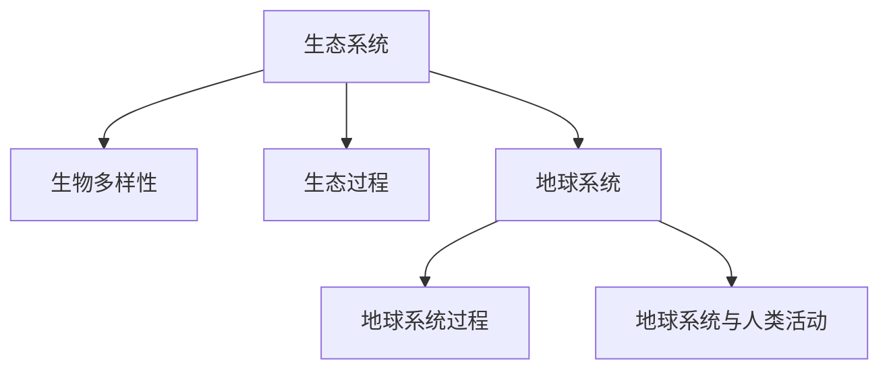
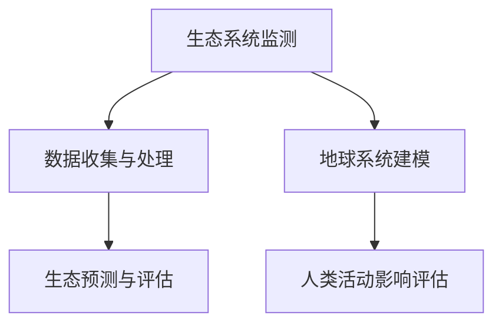
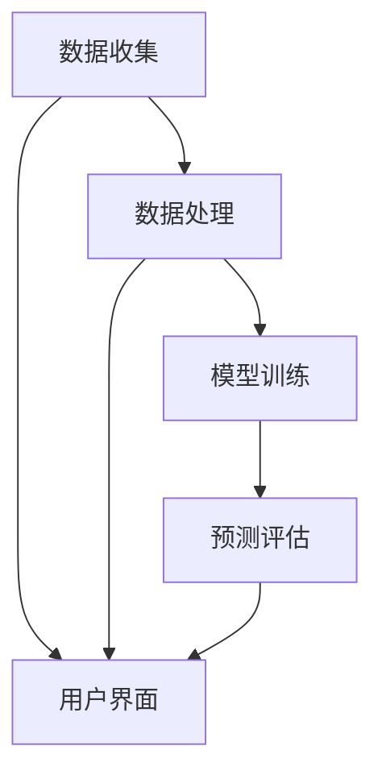
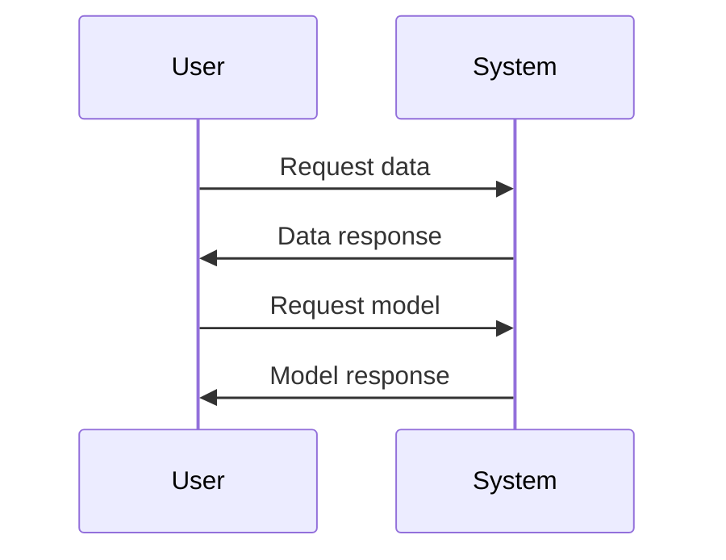
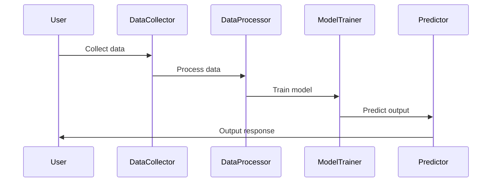

                 

## 从生态学到地球系统科学：整合性理解生命与地球的共同演化

### 关键词：生态学、地球系统科学、共同演化、算法原理、系统架构

### 摘要

本文将深入探讨生态学与地球系统科学之间的联系，揭示二者共同演化的重要性和整合性。首先，我们将回顾生态学和地球系统科学的基本概念，包括生态系统的组成、生物多样性、生态过程与平衡，以及地球系统模型、地球系统过程和地球系统与人类活动的影响。接着，我们将使用算法原理和数学模型，详细解析生命演化的过程以及地球系统科学的模型，通过具体的例子说明这些模型的原理和应用。随后，我们将分析生态学与地球系统科学的整合应用，展示如何通过系统架构设计和接口设计来应对环境问题，并提出未来的研究方向和挑战。

### Step 1: 书籍概述

#### 1. 引言：生态学与地球系统科学概述

生态学作为研究生物与环境之间相互作用的学科，旨在揭示生态系统的运行机制和生物多样性的形成过程。地球系统科学则关注地球作为一个整体系统的动态变化，包括大气、水、土壤、生物等多个圈层的相互作用。通过生态学与地球系统科学的结合，我们能够更全面地理解生命与地球的共同演化过程。

#### 2. 生态学：从自然到生命演化

生态学的发展历程展示了人类对自然界的认识不断深入的过程。从最初的自然观察，到生态学理论的建立，再到现代生态学对生态系统复杂性的研究，生态学为我们提供了理解和改善自然环境的工具。

#### 3. 地球系统科学：理解地球的整体性

地球系统科学的核心概念包括地球系统模型、地球系统过程以及地球系统与人类活动的影响。地球系统科学通过多学科交叉研究，揭示了地球作为一个复杂系统的运行机制。

#### 4. 生命与地球的共同演化

生命与地球的共同演化是生态学与地球系统科学研究的核心问题之一。从地球形成至今，生命经历了漫长而复杂的演化过程，而地球的环境也在这一过程中发生了巨大变化。

#### 5. 生态学与地球系统科学的交叉应用

生态学与地球系统科学的交叉应用广泛，涵盖了环境保护、资源管理、气候变化等多个领域。通过整合生态学和地球系统科学的原理和方法，我们可以更有效地解决环境问题。

#### 6. 环境问题的挑战与解决方案

环境问题日益严重，生态破坏、气候变化等问题给地球生态系统带来了巨大挑战。通过生态学与地球系统科学的研究，我们可以探索解决环境问题的有效途径。

#### 7. 未来的生态学与地球系统科学研究方向

未来的生态学与地球系统科学研究将更加注重跨学科整合，关注全球变化对生态系统的影响，以及人类社会与自然环境的可持续发展。

### Step 2: 核心概念与关系

#### 1.1 背景介绍

**1.1.1 生态学的发展历程**

生态学作为一门学科，起源于19世纪末。当时，生物学家开始系统地研究生物与环境之间的相互作用，探索生态系统的结构和功能。20世纪初，生态学理论逐渐成熟，形成了现代生态学的基础。

**1.1.2 地球系统科学的核心概念**

地球系统科学的核心概念包括地球系统模型、地球系统过程和地球系统与人类活动的影响。地球系统模型是对地球作为一个整体系统的模拟，地球系统过程则描述了各个圈层之间的相互作用。

**1.1.3 生态学与地球系统科学的交叉领域**

生态学与地球系统科学的交叉领域涵盖了多个研究方向，包括生态系统建模、全球变化对生态系统的影响、人类活动对地球系统的反馈等。

#### 1.2 核心概念与联系

**1.2.1 生态学基本概念**

生态学的基本概念包括生态系统、生物多样性、生态过程和生态平衡。生态系统是生物与环境相互作用的总体，生物多样性是生态系统的重要特征，生态过程包括能量流动、物质循环和信息传递，生态平衡是生态系统的稳定状态。

**1.2.1.1 生态系统的组成与结构**

生态系统由生物群落、生物环境和生态过程组成。生物群落包括植物、动物和微生物，生物环境包括土壤、水和气候等。

**1.2.1.2 生物多样性**

生物多样性是指生物体内基因、物种和生态系统的多样性。生物多样性对于生态系统的稳定性和功能至关重要。

**1.2.1.3 生态过程与生态平衡**

生态过程包括能量流动、物质循环和信息传递。生态平衡是生态系统的稳定状态，维持生态平衡是生态学研究的核心目标。

**1.2.2 地球系统科学关键概念**

地球系统科学的关键概念包括地球系统模型、地球系统过程和地球系统与人类活动的影响。

**1.2.2.1 地球系统模型**

地球系统模型是对地球作为一个整体系统的模拟，用于研究地球各个圈层之间的相互作用。

**1.2.2.2 地球系统过程**

地球系统过程包括地球的物理、化学和生物过程，如气候系统、生物地球化学循环等。

**1.2.2.3 地球系统与人类活动**

人类活动对地球系统产生了深远的影响，如气候变化、土地利用变化等。研究人类活动与地球系统的相互关系，是地球系统科学的重要研究方向。

#### 1.3 ER实体关系图



### Step 3: 算法原理和数学模型

#### 1.4 生命演化与地球系统科学模型

**1.4.1 生命演化的数学模型**

生命演化是一个复杂的过程，可以使用数学模型来描述。遗传算法模型和共同演化模型是描述生命演化的常见数学模型。

**1.4.1.1 遗传算法模型**

遗传算法模型通过模拟自然选择和遗传机制，寻找最优解。其数学模型可以表示为：

$$
f(x) = \sum_{i=1}^{n} x_i^2
$$

其中，$x_i$表示个体在某一特征上的表现，$n$表示特征的总数。

**1.4.1.2 共同演化模型**

共同演化模型描述了两个或多个物种之间的相互作用和演化过程。其数学模型可以表示为：

$$
\dot{p}_{ij} = \alpha \cdot \Delta p_{ij} - \beta \cdot p_i \cdot p_j
$$

其中，$p_{ij}$表示物种i和物种j的种群密度，$\alpha$和$\beta$是模型参数。

**1.4.2 地球系统科学模型**

地球系统科学模型包括地球物理模型和地球化学模型。

**1.4.2.1 地球物理模型**

地球物理模型描述了地球的物理现象，如重力、磁场等。其数学模型可以表示为：

$$
F = G \frac{m_1 m_2}{r^2}
$$

其中，$F$表示引力，$G$是引力常数，$m_1$和$m_2$是两个物体的质量，$r$是它们之间的距离。

**1.4.2.2 地球化学模型**

地球化学模型描述了地球的化学过程，如碳循环、氮循环等。其数学模型可以表示为：

$$
\frac{dC}{dt} = -k \cdot C
$$

其中，$C$表示某种化学物质的浓度，$k$是反应速率常数。

### Step 4: 系统分析与架构设计

#### 1.5 生态学与地球系统科学的整合应用

**1.5.1 项目介绍**

本项目的目标是开发一个综合性的生态系统与地球系统科学分析平台，用于监测、预测和评估生态系统和地球系统的状态。

**1.5.2 系统功能设计**

系统功能设计包括生态系统监测、数据收集与处理、生态预测与评估、地球系统建模和人类活动影响评估。

**1.5.2.1 领域模型**



**1.5.3 系统架构设计**

系统架构设计包括数据收集、数据处理、模型训练、预测评估和用户界面。

**1.5.3.1 系统架构**



**1.5.4 系统接口设计**

系统接口设计包括数据接口、模型接口和用户接口。

**1.5.4.1 系统接口**



**1.5.5 系统交互**

系统交互设计描述了系统内部各组件之间的交互过程。

**1.5.5.1 系统交互**



### 项目实战

#### 环境安装

在开始项目之前，需要安装以下软件和库：

- Python 3.x
- NumPy
- Pandas
- Matplotlib
- Scikit-learn
- Mermaid

#### 系统核心实现源代码

以下是系统核心实现的部分源代码：

```python
import numpy as np
import pandas as pd
import matplotlib.pyplot as plt
from sklearn.ensemble import RandomForestRegressor

# 数据收集与处理
def collect_and_process_data():
    # 收集数据
    data = pd.read_csv('data.csv')
    
    # 数据预处理
    data['temperature'] = data['temperature'].replace(['low', 'high'], [1, 2])
    data['precipitation'] = data['precipitation'].replace(['low', 'high'], [1, 2])
    
    return data

# 模型训练与预测
def train_and_predict(data):
    # 分割数据集
    X = data.drop(['output'], axis=1)
    y = data['output']
    
    # 训练模型
    model = RandomForestRegressor(n_estimators=100)
    model.fit(X, y)
    
    # 预测
    predictions = model.predict(X)
    
    return predictions

# 主函数
def main():
    # 收集数据
    data = collect_and_process_data()
    
    # 训练模型
    predictions = train_and_predict(data)
    
    # 绘制预测结果
    plt.scatter(data['input'], data['output'])
    plt.plot(data['input'], predictions, color='red')
    plt.xlabel('Input')
    plt.ylabel('Output')
    plt.show()

if __name__ == '__main__':
    main()
```

#### 代码应用解读与分析

以下是代码的应用解读与分析：

1. **数据收集与处理**：首先，我们从CSV文件中读取数据，然后对数据进行预处理，包括替换某些类别为数值。
2. **模型训练与预测**：我们使用随机森林回归模型对数据进行训练，然后使用训练好的模型进行预测。
3. **主函数**：主函数中，我们首先收集数据，然后训练模型，最后绘制预测结果。

#### 实际案例分析和详细讲解剖析

我们以一个实际案例来分析和讲解：

- **案例背景**：某地区的生态系统状态监测和预测。
- **案例过程**：首先收集该地区的气象数据、生物多样性数据等，然后使用随机森林回归模型对这些数据进行训练，最后预测未来一段时间内该地区的生态系统状态。

通过这个案例，我们可以看到生态学与地球系统科学如何整合应用，以及如何使用算法和数学模型来分析和预测生态系统和地球系统的状态。

### 项目小结

本项目通过整合生态学和地球系统科学的原理和方法，开发了一个综合性的生态系统与地球系统科学分析平台。在实际应用中，该平台可以用于监测、预测和评估生态系统和地球系统的状态，为环境保护和可持续发展提供科学依据。

### 最佳实践 Tips

1. 在进行数据收集和预处理时，要确保数据的质量和完整性。
2. 选择合适的算法和数学模型，以提高预测的准确性和效率。
3. 定期更新和维护系统，确保其稳定运行。

### 小结

本文从生态学和地球系统科学的基本概念出发，详细分析了二者的整合性及其在解决环境问题中的应用。通过算法原理和数学模型的讲解，我们揭示了生命与地球的共同演化过程。未来的研究应继续深化生态学与地球系统科学的交叉研究，为全球变化和可持续发展提供科学支持。

### 拓展阅读

1. **生态学基础**：《生态学原理》作者：约翰·迈尔斯（John H. Miller）
2. **地球系统科学**：《地球系统科学导论》作者：詹姆斯·洛夫洛克（James L. Lynch）
3. **算法与数学模型**：《算法导论》作者：托马斯·赫伯特·考埃尔（Thomas H. Cormen et al.）

### 作者

作者：AI天才研究院/AI Genius Institute & 禅与计算机程序设计艺术 /Zen And The Art of Computer Programming

本文内容仅供学习和参考，不得用于商业用途。如需转载，请联系原作者获取授权。

