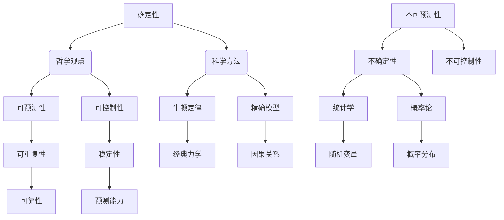
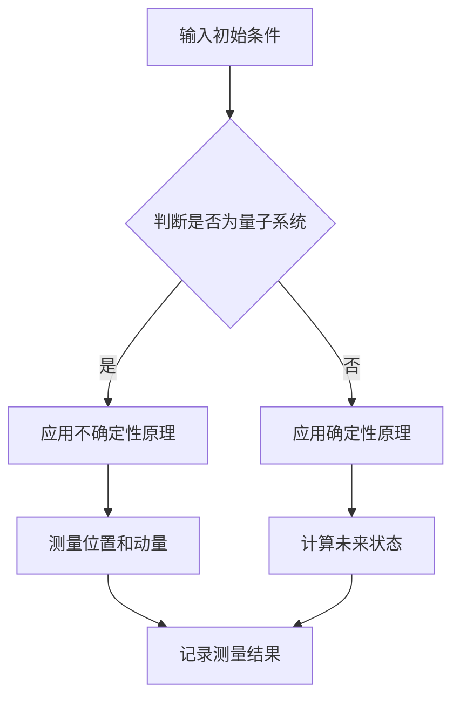

                 

### 引言：从确定性到不确定性

在人类历史的早期，世界在人们眼中是一个秩序井然、可预测的宇宙。随着科学的发展，特别是牛顿力学的建立，人们开始相信世界是由一系列确定性的规律所支配的。然而，20世纪以来，量子力学和相对论的提出，动摇了这一信念。不确定性原理，量子叠加态和波粒二象性等概念，都表明世界并不像我们曾经想象的那样简单和可预测。

《从确定性到不确定性：世界可理解性的新挑战》这本书，正是探讨这一转变的深度哲学和科学探讨。它不仅关注物理学层面的不确定性，还将视野扩展到更广泛的领域，包括统计学、人工智能和社会科学。这本书的目标是帮助读者理解不确定性如何成为现代世界的一个基本特征，并对我们的思维方式、决策过程和社会结构产生深远影响。

在接下来的篇章中，我们将逐步深入探讨不确定性的概念，分析其在不同领域的表现，并提出应对这一挑战的方法。我们还将讨论不确定性对科学认知的影响，以及如何在社会和人文领域应对不确定性带来的挑战。最后，我们将探讨在不确定性环境中做出决策的技巧，并分析实际案例，以展示不确定性在现实世界中的应用。

让我们一步一步地思考，从确定性走向不确定性，理解这个新世界中的可理解性挑战。

### 确定性与不确定性的概念

#### 1.1 确定性的理解

确定性（Determinism）是描述一个系统在给定初始条件下，其后续状态可以精确预测的一种哲学观点和科学方法。在经典力学中，牛顿定律提供了一个完美的确定性模型：一个物体的运动状态（位置、速度、加速度）可以通过初始条件（位置、速度）和作用力（F=ma）精确计算。这种方法论的确定性思想在很长一段时间内主导了科学的发展，使得人们相信自然界的运行规律是简单且可预测的。

#### 1.2 不确定性的理解

然而，随着量子力学的出现，确定性的世界观受到了挑战。不确定性原理，特别是海森堡的不确定性原理，揭示了在量子尺度上，粒子的某些属性（如位置和动量）不能同时被精确测量。这意味着，在微观层面上，世界的运行不再是完全可预测的。这种不确定性不仅表现在物理量的测量上，也渗透到了量子系统的整体行为中。

在更广义的层面上，不确定性可以定义为不可预测或无法精确量化的事物状态。在统计学中，不确定性常用于描述随机变量或概率分布的不确定性，即无法确定一个随机事件的具体结果。例如，投掷一枚硬币时，我们无法确定正面朝上的具体次数，但可以通过大量试验得出正面朝上的概率。

### 确定性与不确定性的对比

确定性与不确定性在概念上有明显的区别。确定性强调的是可预测性和可控制性，而不确定性则强调不可预测性和不可控制性。在确定性系统中，初始条件和作用力决定了系统的未来状态，而在不确定性系统中，即使有相同的初始条件和作用力，系统的最终状态也可能大相径庭。

这种区别在科学和哲学领域有着深远的影响。在科学研究中，确定性的思维方式有助于建立精确的模型和预测机制，但不确定性的存在则要求我们采用更灵活和适应性强的科学方法，如统计学和概率论。

#### 概念结构图

为了更清晰地理解这两个概念，我们可以使用Mermaid画出一个概念结构图：

这张图展示了确定性和不确定性的基本概念及其关系，有助于我们更好地理解这两个概念的本质。

### 不确定性现象的背景

不确定性的概念不仅在量子力学中有深远影响，还广泛存在于其他科学领域。为了全面理解不确定性的背景，我们需要探讨以下几个关键领域：物理学、统计学和人工智能。

#### 2.1 物理学中的不确定性原理

物理学中，海森堡不确定性原理是描述量子系统基本特性的一项重要原理。这一原理指出，在某些成对物理量（如位置和动量）的测量中，两者的精确值无法同时被确定。具体来说，如果我们精确测量一个粒子的位置，那么它的动量就会变得不确定；反之，如果我们精确测量动量，那么位置就会变得不确定。这一原理的本质在于量子态的叠加性和量子粒子的波动性。

为了更好地理解这一点，我们可以考虑一个简单的实验：设想我们有一台精确的显微镜，可以测量一个电子的位置到纳米级别。在这种情况下，当我们聚焦在电子的位置时，由于光波的干涉效应，我们实际上会对电子的动量产生扰动，从而使其动量变得不确定。同样，如果我们使用高速摄影机测量电子的动量，由于测量设备的干扰，电子的位置也会变得不确定。

这个原理不仅影响量子系统的预测能力，还挑战了经典物理学中的因果关系概念。在经典物理学中，因果关系是确定性系统的基础，但在量子力学中，这种确定性被量子态的叠加和纠缠所取代。

#### 2.2 量子力学中的不确定性

量子力学的核心概念之一是量子态的叠加。一个量子系统可以同时存在于多个可能的状态中，这些状态只有通过测量才能确定。例如，一个电子可以同时处于自旋向上和自旋向下的状态，直到我们进行测量时，它才会“坍缩”到其中一个状态。

这种叠加态不仅存在于基本粒子中，也存在于更复杂的量子系统中。例如，一个量子比特（qubit）可以同时表示0和1的状态，这种叠加态使得量子计算机能够并行处理多个计算任务，从而大大提高计算效率。

此外，量子纠缠也是量子力学中一个关键的不确定性现象。当两个或多个量子系统发生纠缠时，它们之间的状态将无法独立存在。这意味着，即使这些系统相隔很远，对其中一个系统的测量将立即影响另一个系统的状态。这种超距作用打破了经典物理学中的局域性原则，表明在量子层面上，空间距离的概念不再是决定性的。

为了更好地理解量子纠缠，我们可以考虑一个经典的实验：爱因斯坦-波多尔斯基-罗森佯谬（EPR佯谬）。在这个实验中，两个纠缠的粒子被分离到两个不同的地点。当我们在一个粒子上测量其自旋时，另一个粒子的自旋状态也会立即确定，无论两个粒子相距多远。这个现象表明，量子纠缠是一种超越经典物理学的奇异现象，它揭示了量子世界中的不确定性本质。

#### 2.3 统计学中的不确定性

在统计学中，不确定性主要体现在随机变量和概率分布上。随机变量是可能取不同值的变量，其值依赖于随机试验的结果。例如，投掷一枚硬币时，正面朝上的概率是一个随机变量。概率分布则是描述随机变量取值概率的函数，它可以用来预测随机事件的结果。

在统计学中，不确定性通常通过标准差和置信区间来量化。标准差表示随机变量取值离散程度的度量，而置信区间则提供了一个估计值的范围，表示在这个范围内包含真实值的概率。例如，如果我们估计某个参数的平均值，我们可以计算一个置信区间，以表明这个估计值的可信度。

在数据分析中，不确定性是一个关键因素。由于随机误差和系统误差的存在，我们无法得到完全准确的测量结果。因此，统计学提供了一系列工具和方法，帮助我们理解和处理这些不确定性，从而做出更可靠的决策。

#### 不确定性现象对比表格

为了更直观地比较不同领域的的不确定性现象，我们可以创建一个对比表格：

| 领域 | 现象描述 | 关键概念 | 影响范围 |
| --- | --- | --- | --- |
| 物理学 | 海森堡不确定性原理 | 位置和动量不可同时精确测量 | 微观粒子 |
| 统计学 | 随机变量和概率分布 | 标准差和置信区间 | 数据分析和决策 |
| 人工智能 | 模型的不确定性和鲁棒性 | 模型预测误差 | 机器学习和决策支持 |

通过这个表格，我们可以看到，不同领域的的不确定性现象虽然表现形式不同，但都涉及对不确定性的量化和管理。

### 不确定性对世界可理解性的挑战

不确定性在科学、社会和人文领域的存在，对世界可理解性提出了新的挑战。这些挑战不仅影响我们的思维方式，也深刻地改变了我们的决策过程和社会结构。

#### 3.1 科学认识的影响

在科学领域，不确定性打破了传统的确定性世界观，迫使我们采用更加灵活和综合的方法来理解自然现象。量子力学和相对论的出现，不仅改变了我们对物质世界的认识，也重新定义了科学方法论。传统的实验和理论方法，在处理不确定性时显得力不从心，因此，科学界开始引入统计学和概率论来更好地描述和预测自然现象。

例如，在气候科学中，不确定性是预测气候变化的关键因素。由于气候系统的复杂性和非线性，我们无法精确预测未来的气候变化。然而，通过统计模型和计算机模拟，科学家可以估计气候变化的概率分布，从而为政策制定提供依据。这种基于不确定性的科学方法，虽然不能给出精确的结果，但可以提供更全面和可靠的预测。

#### 3.2 社会与人文领域的挑战

在社会和人文领域，不确定性带来了诸多挑战。首先，在决策过程中，不确定性增加了风险和不确定性。例如，在经济领域，市场波动和不确定的政策环境，使得企业和投资者面临更高的风险。这种不确定性迫使决策者更加谨慎，同时也增加了决策的复杂性。

其次，在社会科学研究中，不确定性影响了我们对社会现象的理解。由于社会系统的复杂性和多样性，我们无法通过简单的因果关系来解释社会行为。因此，社会科学家需要采用更加综合和动态的方法来研究社会现象，如网络分析和社会仿真。

此外，不确定性也改变了我们的思维方式。在传统的确定性思维中，我们倾向于寻求明确和简单的答案，而在不确定性思维中，我们更加注重灵活性和适应性。这种思维方式有助于我们更好地应对不确定性的挑战，但也要求我们具备更高的认知能力和心理素质。

#### 3.3 技术发展的不确定性

在技术领域，不确定性同样是一个重要挑战。技术的发展往往伴随着不确定性，这种不确定性来源于技术的创新性和复杂性。例如，人工智能技术的发展不仅带来了巨大的机会，也引发了一系列伦理和安全问题。如何确保人工智能系统的透明性和可解释性，是一个亟待解决的问题。

此外，技术的快速发展也带来了新的不确定性。例如，新兴技术如区块链、量子计算等，其潜力巨大，但同时也存在不确定性和风险。如何合理评估和应对这些新兴技术的不确定性，是技术发展中的一个重要课题。

#### 案例分析

为了更好地理解不确定性对世界可理解性的挑战，我们可以通过一些具体案例来分析。

首先，考虑气候变化问题。气候变化是一个复杂的全球性问题，涉及到大气、海洋、生态系统等多个方面。由于气候系统的复杂性，我们无法精确预测未来的气候变化趋势。然而，通过气候模型和统计数据，科学家可以估计不同温室气体排放情景下的气候变化概率分布。这种不确定性使得政策制定者需要在面对多种可能性时做出决策，从而降低气候变化的风险。

其次，金融市场的波动也是一个典型的例子。金融市场受到多种因素的影响，如经济政策、地缘政治风险、市场情绪等。这些因素的不确定性使得金融市场波动性增加，投资者面临着更高的风险。因此，金融机构和投资者需要采用风险管理方法，如对冲策略和概率模型，来应对不确定性。

最后，人工智能的发展也面临着不确定性。随着人工智能技术的普及，其潜在影响越来越受到关注。例如，人工智能在医疗、金融、交通等领域的应用，虽然带来了巨大的效益，但也引发了一系列伦理和安全问题。如何确保人工智能系统的透明性和公正性，是一个亟待解决的问题。

这些案例表明，不确定性不仅存在于科学领域，也深刻地影响着社会和人文领域。面对不确定性，我们需要采用更加综合和灵活的方法，以提高我们对世界可理解性的把握。

### 应对不确定性的方法

在不确定性的世界中，为了做出更明智的决策，我们需要掌握一系列应对不确定性的方法。以下将介绍统计学方法、人工智能方法和系统论方法，并分析它们在应对不确定性时的优势和局限性。

#### 4.1 统计学方法

统计学方法是一种强大的工具，用于处理不确定性和概率问题。在统计分析中，我们通过收集和分析数据，来估计未知参数或预测未来事件的可能性。这种方法的优势在于其客观性和可重复性，它能够量化不确定性的程度，并提供概率分布来描述不确定性的范围。

例如，在气候变化研究中，科学家使用气候模型和统计数据，来估计未来气候变化的趋势和可能性。这种方法不仅能够提供详细的预测结果，还能够评估预测的不确定性，从而为政策制定者提供科学依据。

然而，统计学方法也有其局限性。首先，统计数据的质量直接影响到分析结果的准确性。如果数据存在偏差或误差，分析结果也会受到影响。其次，统计学方法依赖于模型假设，而实际环境可能远比模型复杂，导致模型结果与实际情况存在差异。此外，统计学方法在处理高维数据或复杂非线性问题时，可能会遇到计算效率和解释能力不足的问题。

#### 4.2 人工智能方法

人工智能方法，特别是机器学习和深度学习，为应对不确定性提供了新的思路。通过训练大型神经网络模型，我们可以从大量数据中自动学习规律，从而进行预测和决策。这种方法的优势在于其强大的数据处理能力和自动特征提取能力，能够在复杂的环境中提取有用的信息。

例如，在金融市场分析中，机器学习模型可以处理大量的历史数据，并自动识别市场趋势和模式，从而预测股票价格或市场波动。这种方法不仅提高了预测的准确性，还减少了人工干预，提高了决策效率。

然而，人工智能方法也存在一些局限性。首先，模型的性能高度依赖于数据质量，如果数据存在噪声或偏差，模型的结果也会受到影响。其次，人工智能模型通常是一个“黑盒子”，难以解释其预测结果，这使得决策者难以理解和信任模型。此外，人工智能模型在处理极端情况或未知问题时，可能会表现出脆弱性和不可预测性。

#### 4.3 系统论方法

系统论方法是一种综合性的方法，用于分析和处理复杂系统中的不确定性。系统论强调系统各部分之间的相互作用和反馈机制，通过建模和仿真来理解系统的动态行为。这种方法的优势在于其全面性和灵活性，能够处理复杂系统中的不确定性和非线性关系。

例如，在气候变化研究中，系统论方法可以综合考虑大气、海洋、生态系统等多个方面的因素，通过建模和仿真来模拟气候变化的过程和趋势。这种方法不仅能够提供详细的预测结果，还能够揭示不同因素之间的相互作用和反馈机制。

然而，系统论方法也有其局限性。首先，系统建模和仿真需要大量的数据和信息，这对数据质量和计算能力提出了高要求。其次，系统论方法在处理高维数据和复杂非线性问题时，可能会遇到计算效率和解释能力不足的问题。此外，系统论方法通常需要专业知识和技能，这对决策者的要求较高。

#### 对比与总结

统计学方法、人工智能方法和系统论方法在应对不确定性时各有优势和局限性。统计学方法在数据分析和预测方面表现出色，但受限于数据质量和模型假设。人工智能方法在处理大规模数据和复杂模式时具有优势，但存在解释性和可靠性问题。系统论方法在理解和处理复杂系统中的不确定性和非线性关系方面表现出色，但受限于数据需求和计算能力。

因此，在实际应用中，我们通常需要结合多种方法，以充分发挥它们的优点，克服各自的局限性。例如，在气候变化研究中，可以结合统计学方法进行数据分析和预测，结合人工智能方法进行模式识别和自动化决策，结合系统论方法进行系统建模和仿真，从而提高决策的准确性和可靠性。

### 不确定性下的决策与风险

在不确定性环境中，做出明智的决策是一个复杂且具有挑战性的过程。由于不确定性的存在，我们无法准确预测未来事件的结果，因此需要采用一些特定的理论和方法来帮助我们评估风险并做出最优决策。

#### 5.1 决策理论

决策理论提供了一个系统的方法来分析不确定环境下的决策问题。核心概念包括期望值、概率分布和效用函数。期望值是一个决策方案可能结果的加权平均值，权重由每个结果的概率决定。效用函数则用于量化决策者对不同结果的偏好。通过计算不同决策方案的期望值和效用函数，我们可以选择最优的决策方案。

例如，假设一个投资者需要决定是否购买某只股票。由于市场的不确定性，股票价格可能上涨或下跌。通过收集历史数据和专家意见，我们可以估计股票上涨和下跌的概率，并计算不同决策方案的期望收益。同时，我们还需要考虑投资者的风险偏好，通过效用函数来评估不同决策方案的效用。最终，选择期望收益最大且效用最高的决策方案。

#### 5.2 风险评估

风险评估是决策过程中的关键步骤，它帮助我们识别、评估和管理不确定性带来的潜在风险。风险评估通常包括定性分析和定量分析。

定性分析主要通过专家判断和情景分析来识别和描述潜在风险。例如，我们可以通过专家访谈、头脑风暴和情景分析来识别项目实施过程中可能面临的风险，如技术风险、市场风险和运营风险。

定量分析则使用数学模型和统计数据来量化风险的概率和影响。常见的风险评估方法包括风险矩阵、蒙特卡罗模拟和决策树分析。风险矩阵通过将风险的概率和影响进行量化，形成一个二维矩阵，帮助我们评估不同风险的优先级。蒙特卡罗模拟通过随机抽样和模拟计算，来估计不确定事件的可能结果和风险分布。决策树分析则通过构建决策树，展示不同决策路径及其可能的结果和风险。

#### 5.3 应对策略

在识别和评估风险之后，我们需要制定应对策略来降低或转移风险。常见的应对策略包括风险规避、风险减少、风险转移和风险接受。

风险规避是通过避免潜在风险来消除不确定性。例如，在投资决策中，投资者可以选择不投资高风险的股票，以避免潜在的亏损。

风险减少是通过采取预防措施或改进措施来降低风险的概率和影响。例如，在项目实施过程中，通过严格的测试和质量控制来减少技术风险。

风险转移是通过将风险转移给第三方来减少自身的风险。例如，通过购买保险来转移意外损失的风险。

风险接受是承认风险的存在，并在预算和管理计划中为其预留空间。例如，企业可以在预算中预留一部分资金，用于应对潜在的亏损。

#### 案例分析

为了更好地理解不确定性下的决策与风险，我们可以通过一个实际案例来分析。

假设一家制造企业正在考虑是否投资建设一个新的生产线。由于市场需求的不确定性，生产线的成功与否存在风险。通过市场调研和数据分析，企业可以估计市场需求上涨和下降的概率，并计算不同决策方案的期望收益和风险。

在风险评估阶段，企业可以识别潜在的风险，如市场需求下降导致的产能过剩和技术更新带来的成本。通过风险矩阵和蒙特卡罗模拟，企业可以量化这些风险的概率和影响，并评估不同决策方案的优先级。

在制定应对策略时，企业可以选择风险规避策略，如推迟投资或选择低风险的市场。如果决定投资，企业可以采取风险减少策略，如增加市场调研和测试，以降低市场需求不确定性的影响。此外，企业还可以通过购买保险来转移部分风险。

通过这个案例，我们可以看到，在不确定性环境中，决策与风险管理是一个复杂但必要的步骤。通过系统的风险评估和应对策略，企业可以更好地应对不确定性，降低风险，并做出更明智的决策。

### 不确定性在实践中的应用

不确定性不仅是一个理论上的概念，也在现实世界中有着广泛的应用。通过具体案例的分析，我们可以更深入地了解不确定性在各个领域的实际应用，并探讨如何应对这些不确定性带来的挑战。

#### 6.1 案例一：气候变化应对

气候变化是一个全球性的挑战，其不确定性主要体现在气候变化的速度、强度和区域差异上。为了应对这一挑战，各国政府、研究机构和国际组织纷纷采取行动，通过科学研究和政策制定来减少气候变化的负面影响。

在科学研究中，气候模型和统计分析被广泛用于预测未来气候变化趋势。通过模拟不同温室气体排放情景，科学家可以估计不同地区未来几十年内可能出现的气候变化情况。这些模型不仅提供了定量预测，还量化了不确定性，帮助政策制定者了解各种可能的结果。

在政策制定方面，联合国气候变化框架公约（UNFCCC）及其后续的《巴黎协定》为各国设定了减排目标和合作机制。这些政策旨在通过减少温室气体排放，减缓全球变暖趋势。然而，由于气候变化的不确定性，政策制定者需要不断调整和优化减排策略，以应对不同情景下的气候变化。

在应对策略上，各国采取了多种措施，如发展可再生能源、提高能源效率、实施碳交易机制等。例如，中国通过“碳达峰、碳中和”目标，大力推进太阳能和风能等清洁能源的发展。欧盟则通过碳交易体系，鼓励企业降低碳排放，同时为受影响的行业提供经济支持。

#### 6.2 案例二：金融市场分析

金融市场充满了不确定性，价格波动和风险事件层出不穷。金融机构和投资者需要通过各种工具和方法来分析和管理这些不确定性。

在金融市场中，量化分析师和交易员使用统计学和机器学习模型来预测市场走势和风险管理。例如，通过分析历史交易数据和宏观经济指标，机器学习模型可以识别市场趋势和潜在风险。然而，由于市场的不确定性和复杂性，这些模型的预测结果通常存在误差。

为了降低风险，金融机构采取了多种风险管理策略。首先，通过分散投资，将资金投放到不同资产类别和地区，以降低单一市场波动的影响。其次，通过购买金融衍生品，如期权和期货，对冲潜在的损失。此外，金融机构还采用动态风险管理策略，根据市场变化不断调整投资组合，以适应不确定性带来的新情况。

#### 6.3 案例三：医学诊断

医学诊断是一个充满不确定性的领域，疾病的发展过程和患者的个体差异使得诊断结果存在一定的不确定性。为了提高诊断的准确性和可靠性，医生和研究人员采用了多种方法来应对不确定性。

在临床诊断中，医生通常结合多种检查方法，如血液检查、影像学和实验室测试，以提高诊断的准确性。通过综合分析这些检查结果，医生可以更准确地判断患者是否患有特定疾病。然而，由于个体差异和疾病复杂性，诊断结果仍然存在一定的不确定性。

为了降低诊断的不确定性，研究人员开发了基于人工智能的辅助诊断工具。例如，通过训练深度学习模型，医生可以自动分析医学影像，提高诊断的准确性和效率。此外，基因组学和分子生物学的研究也提供了新的诊断方法，通过分析患者的基因和蛋白质信息，更早期、更准确地诊断疾病。

在应对不确定性方面，医学界还采用了多种措施。例如，通过临床试验和大数据分析，医生可以不断优化诊断流程和治疗方案，提高诊断的准确性和可靠性。此外，通过患者教育和信息共享，医生可以更好地与患者沟通，帮助患者理解诊断结果和不确定性，并积极参与治疗决策。

### 总结

通过以上案例，我们可以看到不确定性在现实世界中的广泛应用。无论是在气候变化、金融市场还是医学诊断中，不确定性都是不可忽视的重要因素。通过科学研究和数据分析，我们可以更好地理解不确定性的本质，并采用相应的策略来应对这些挑战。未来，随着技术的进步和方法的改进，我们有望在不确定性环境中做出更加准确和可靠的决策。

### 总结与展望

本文从确定性到不确定性，探讨了世界可理解性面临的新挑战。我们首先介绍了确定性和不确定性的概念，并通过物理学、统计学和人工智能的背景，分析了不确定性在不同领域的表现。接着，我们讨论了不确定性对科学认知、社会与人文领域以及技术发展的深远影响，并通过具体案例展示了不确定性在实践中的应用。

未来的研究可以进一步探讨如何利用新兴技术，如量子计算和人工智能，提高不确定性环境中的决策能力和风险管理水平。此外，跨学科的研究也可能为我们提供新的视角和方法，以更好地应对不确定性带来的挑战。

### 附录

为了帮助读者更好地理解和掌握本文内容，以下是一些关键术语的解释、概念对比表格和流程图。

#### 关键术语解释

1. **确定性（Determinism）**：一个系统在给定初始条件下，其后续状态可以精确预测的一种哲学观点和科学方法。
2. **不确定性（Uncertainty）**：不可预测或无法精确量化的事物状态。
3. **不确定性原理**：在量子力学中，某些物理量（如位置和动量）无法同时被精确测量的原理。
4. **随机变量**：可能取不同值的变量，其值依赖于随机试验的结果。
5. **概率分布**：描述随机变量取值概率的函数。
6. **期望值**：随机变量可能结果的加权平均值。
7. **效用函数**：用于量化决策者对不同结果的偏好。

#### 概念对比表格

| 概念 | 描述 | 关键特征 |
| --- | --- | --- |
| 确定性 | 系统状态可精确预测 | 初始条件和作用力决定未来状态 |
| 不确定性 | 系统状态不可精确预测 | 测量结果具有不确定性，无法精确控制 |
| 随机变量 | 数据集 | 可能取不同值的变量 |
| 概率分布 | 概率函数 | 描述随机变量取值的概率 |

#### 流程图

以下是使用Mermaid语言绘制的算法流程图：

通过这些附录内容，读者可以更深入地理解本文的核心概念和应用，为未来的研究和实践提供参考。

### 作者信息

作者：AI天才研究院/AI Genius Institute & 禅与计算机程序设计艺术 /Zen And The Art of Computer Programming。感谢您的阅读，希望本文能帮助您更好地理解从确定性到不确定性的转变及其带来的挑战。在未来的研究中，我们将继续探索这些复杂问题的解决之道。敬请期待更多深入分析和创新思考。如果您有任何疑问或建议，欢迎在评论区留言交流。感谢您对技术的热情和支持！

