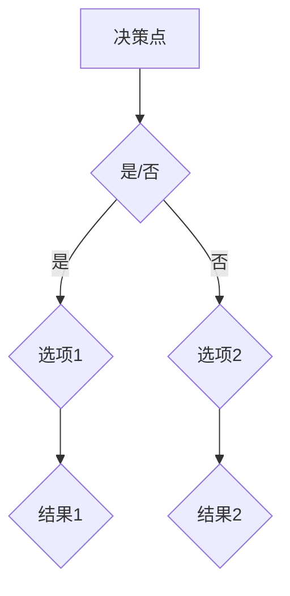

                 

### 《从确定性到概率性：理解不确定的世界》

> 关键词：不确定性、概率性、决策、人工智能、风险管理

> 摘要：本文从确定性和概率性的对比出发，深入探讨了不确定性在现实世界中的应用与影响。通过对不确定性量化方法的解析，提出了应对不确定性的策略与方法。同时，本文还探讨了概率性思维在科学研究和工程实践中的应用，为读者提供了全面的理解和应对不确定性世界的实用指南。

### 目录

#### 第一部分：不确定性的基础

- **第1章：不确定性概述**
  - 1.1 不确定性的背景与重要性
  - 1.2 不确定性与概率论
  - 1.3 不确定性与统计学
  - 1.4 不确定性量化方法
  - 1.5 不确定性在现实世界中的应用场景
  - 1.6 本章小结

#### 第二部分：确定性与概率性的比较

- **第2章：确定性与概率性的概念对比**
  - 2.1 确定性的概念与特征
  - 2.2 概率性的概念与特征
  - 2.3 确定性与概率性的区别
  - 2.4 确定性与概率性的相互转化
  - 2.5 本章小结

- **第3章：不确定世界中的决策**
  - 3.1 决策的基本概念
  - 3.2 决策中的不确定性处理
  - 3.3 决策支持系统
  - 3.4 案例分析：不确定性决策的应用
  - 3.5 本章小结

#### 第三部分：概率性思维的应用

- **第4章：概率性思维的基本原理**
  - 4.1 概率性思维的定义
  - 4.2 概率性思维的培养
  - 4.3 概率性思维与直觉思维的比较
  - 4.4 概率性思维在科学研究和工程中的应用
  - 4.5 本章小结

- **第5章：概率性思维在人工智能中的应用**
  - 5.1 概率性思维与人工智能概述
  - 5.2 贝叶斯网络与概率性思维
  - 5.3 机器学习中的概率性思维
  - 5.4 概率性思维在自然语言处理中的应用
  - 5.5 本章小结

#### 第四部分：应对不确定性的策略

- **第6章：应对不确定性的策略与方法**
  - 6.1 风险管理的基本策略
  - 6.2 决策树与风险决策
  - 6.3 预测与规划
  - 6.4 模拟与蒙特卡洛方法
  - 6.5 案例研究：不确定性管理实践
  - 6.6 本章小结

##### 第7章：未来展望与趋势

- **7.1 不确定性的未来研究方向**
  - 7.1.1 新的概率性理论发展
  - 7.1.2 不确定性量化技术的进步

- **7.2 不确定性的社会与经济影响**
  - 7.2.1 不确定性对经济活动的影响
  - 7.2.2 不确定性对社会治理的挑战

- **7.3 不确定性与科技创新**
  - 7.3.1 不确定性在科技创新中的作用
  - 7.3.2 科技创新的不确定性管理

- **7.4 个人与组织的应对策略**
  - 7.4.1 个人应对不确定性的策略
  - 7.4.2 组织应对不确定性的策略

- **7.5 本章小结**

### 附录

- **附录A：概率分布表**
  - 常见概率分布表

- **附录B：数学公式索引**
  - 主要数学公式及其应用场景

---

### 引言

在复杂多变的世界中，我们经常面临各种不确定性。无论是自然界中的天气变化，还是经济活动中的市场波动，不确定性无处不在。因此，理解不确定性、掌握应对不确定性的方法，对于我们做出科学合理的决策至关重要。

本文将首先介绍不确定性的基础，包括不确定性的概念、概率论和统计学在不确定性量化中的应用，以及不确定性在现实世界中的应用场景。接着，我们将探讨确定性与概率性的区别与联系，分析不确定世界中的决策过程。随后，本文将深入探讨概率性思维的基本原理和应用，特别是在人工智能和自然语言处理领域中的应用。最后，本文将提出应对不确定性的策略与方法，并通过案例研究展示这些方法在实际中的应用。

通过本文的阅读，读者将能够对不确定性有一个全面而深入的理解，并掌握应对不确定性的策略和方法，为在复杂多变的环境中做出科学合理的决策提供有力支持。

### 第一部分：不确定性的基础

在深入探讨不确定性的概念和影响之前，我们需要首先了解不确定性的基础。这一部分将介绍不确定性的概念、概率论和统计学在不确定性量化中的应用，以及不确定性在现实世界中的应用场景。

#### 第1章：不确定性概述

##### 1.1 不确定性的背景与重要性

不确定性的概念历史悠久，可以追溯到古希腊哲学家泰勒斯的时代。泰勒斯曾用“如果船在航行中遭遇风暴，那么船就不会到达目的地”来描述不确定性。然而，现代科学对不确定性的系统研究始于20世纪初，特别是量子力学的出现，彻底改变了人们对不确定性本质的认识。

在现实生活中，不确定性无处不在。天气预测的不确定性让我们无法精确预测未来几天内的天气情况；金融市场的不确定性使得投资决策变得复杂；医疗诊断的不确定性影响着疾病的治疗和预防措施；甚至是我们日常生活中的许多决策也充满了不确定性。

不确定性的重要性不仅体现在其广泛的现实应用中，还在于其对决策的影响。在高度不确定的环境中，正确理解和处理不确定性是做出有效决策的关键。

##### 1.2 不确定性与概率论

概率论是研究随机事件及其概率的数学分支，它为不确定性提供了量化工具。概率论的基本原理可以描述为：随机事件在一次试验中可能发生，也可能不发生，但其发生的机会可以用概率来量化。

概率论的基本概念包括：

- **样本空间（Sample Space）**：所有可能结果的集合。
- **事件（Event）**：样本空间的一个子集。
- **概率（Probability）**：事件发生的可能性，用0到1之间的实数表示。

概率分布是概率论的核心概念之一，它描述了随机变量取不同值的概率分布情况。常见的概率分布包括：

- **离散概率分布**：如二项分布、泊松分布等。
- **连续概率分布**：如正态分布、均匀分布等。

概率分布的应用广泛，例如在风险评估、质量控制、信号处理等领域中，概率分布为预测和分析提供了重要的数学工具。

##### 1.3 不确定性与统计学

统计学是另一门重要的量化不确定性的工具，它通过对数据的收集、分析和解释，帮助我们理解不确定性。统计学中的不确定性通常通过误差分析、置信区间和假设检验等方法来量化。

- **误差分析（Error Analysis）**：误差分析是评估测量结果准确性和可靠性的过程。通过误差分析，我们可以了解测量结果的误差范围，从而对结果进行合理的判断。

- **置信区间（Confidence Interval）**：置信区间是一种估计参数范围的方法，它通过样本数据来估计总体参数的可能范围。置信区间提供了对总体参数不确定性的度量。

- **假设检验（Hypothesis Testing）**：假设检验是一种用于判断样本数据是否支持某一假设的方法。通过假设检验，我们可以评估某一假设的可靠性，从而在不确定性的环境中做出决策。

##### 1.4 不确定性量化方法

不确定性的量化是处理不确定性的关键步骤。以下是一些常用的不确定性量化方法：

- **误差分析（Error Analysis）**：通过误差分析，我们可以评估测量结果的误差范围。误差分析包括系统误差和随机误差的评估。

- **罚则与损失函数（Penalty and Loss Function）**：在决策过程中，罚则与损失函数用于评估不同决策的结果。罚则是对错误决策的惩罚，损失函数是评估决策结果的量化指标。

- **贝叶斯估计（Bayesian Estimation）**：贝叶斯估计是一种基于先验概率和观测数据来更新概率估计的方法。贝叶斯估计在不确定性量化中具有广泛的应用，特别是在机器学习和数据科学领域。

##### 1.5 不确定性在现实世界中的应用场景

不确定性在现实世界中的应用场景非常广泛，以下是一些典型的例子：

- **经济学中的应用**：在经济活动中，不确定性体现在市场波动、供需变化等方面。经济学家通过概率模型和统计学方法来预测市场趋势，为投资决策提供依据。

- **决策制定中的不确定性**：在决策过程中，不确定性体现在风险和机会的评估上。通过风险评估和决策树方法，我们可以更全面地考虑不确定性的影响，做出更为合理的决策。

- **医疗诊断中的不确定性**：在医疗诊断中，不确定性体现在疾病检测和预测上。医生通过概率模型和统计方法来评估疾病发生的可能性，为诊断和治疗提供支持。

- **工程中的不确定性**：在工程领域，不确定性体现在设计、建造和维护过程中。通过模拟和蒙特卡洛方法，我们可以评估工程项目的风险和不确定性，确保项目的顺利进行。

##### 1.6 本章小结

本章介绍了不确定性的基础，包括不确定性的概念、概率论和统计学在不确定性量化中的应用，以及不确定性在现实世界中的应用场景。通过对不确定性的深入理解，我们可以更好地应对现实世界中的不确定性，做出科学合理的决策。

### 第二部分：确定性与概率性的比较

在深入探讨不确定性的同时，我们需要对确定性和概率性进行深入分析，理解两者的本质区别和联系。确定性和概率性在概念上有所不同，但在实际应用中却常常交织在一起，共同影响我们的决策过程。

#### 第2章：确定性与概率性的概念对比

##### 2.1 确定性的概念与特征

确定性是指系统在给定初始条件下，其未来状态是唯一确定的。确定性系统具有以下特征：

- **唯一性**：在确定性系统中，给定初始状态，未来的发展路径是唯一的。
- **可预测性**：确定性系统可以通过精确的数学模型和计算方法进行预测。
- **稳定性**：确定性系统在一定条件下能够保持稳定状态，不会出现大幅波动。
- **可重复性**：确定性实验或过程在相同条件下可以重复得到相同的结果。

例如，在经典的物理学中，牛顿运动定律描述了一个确定性系统，给定物体的初始状态和作用力，可以精确预测物体的未来位置。

##### 2.2 概率性的概念与特征

概率性是指系统在给定初始条件下，其未来状态有多种可能性，每种可能性发生的概率可以通过概率论进行量化。概率性系统具有以下特征：

- **多样性**：在概率性系统中，给定初始状态，可能存在多种不同的未来状态。
- **不可预测性**：概率性系统无法通过简单的数学模型和计算方法进行精确预测。
- **波动性**：概率性系统在运行过程中可能会出现波动和不确定性。
- **随机性**：概率性系统中的事件发生具有随机性，每种结果发生的概率可以通过概率分布进行描述。

例如，在金融市场分析中，股票价格的波动具有概率性特征，投资者通过概率模型来预测市场趋势和投资风险。

##### 2.3 确定性与概率性的区别

确定性与概率性在形式和实际应用中存在显著区别，主要表现在以下几个方面：

- **形式上的区别**：
  - 确定性系统具有唯一确定的未来状态，而概率性系统具有多种可能的未来状态。
  - 确定性系统可以通过精确的数学模型进行预测，而概率性系统需要通过概率分布来描述不确定性的范围。

- **实际应用中的区别**：
  - 确定性系统适用于可以精确描述和控制的场景，如经典物理学中的运动学问题。
  - 概率性系统适用于具有不确定性和随机性的场景，如经济学、金融学、医学和工程学等领域。

##### 2.4 确定性与概率性的相互转化

在实际应用中，确定性与概率性之间存在相互转化的可能性。以下是一些具体的转化条件和转化方法：

- **转化条件**：
  - 在某些特定条件下，不确定性可以通过概率性模型进行量化，从而转化为概率性问题。
  - 在其他条件下，确定性系统可能在一定范围内表现出概率性特征。

- **转化方法**：
  - **模型选择**：通过选择适当的概率性模型，可以将确定性系统的问题转化为概率性问题。
  - **概率分布拟合**：通过拟合实际数据，可以得到概率分布，从而将不确定性问题转化为概率性问题。

例如，在经济学中，市场预测模型常常通过历史数据拟合概率分布，从而对市场波动进行概率性预测。

##### 2.5 本章小结

本章通过对比确定性与概率性的概念、特征和应用，深入探讨了不确定性的本质。确定性和概率性在形式和实际应用中存在显著区别，但它们在实际决策过程中常常相互转化。理解这两种概念的区别和联系，有助于我们更好地应对复杂多变的世界，做出科学合理的决策。

#### 第3章：不确定世界中的决策

在不确定的世界中，决策变得更加复杂和具有挑战性。由于不确定性，传统的确定性决策方法可能不再适用，我们需要借助概率性思维和决策理论来应对各种不确定性。

##### 3.1 决策的基本概念

决策是人们在不确定条件下选择行动的过程。一个完整的决策过程包括以下步骤：

- **问题定义**：明确需要解决的问题或目标。
- **备选方案**：列举所有可能的备选方案。
- **方案评估**：评估每个备选方案的优缺点，通常包括成本、风险、收益等方面。
- **选择方案**：根据评估结果选择最优或最合适的方案。
- **实施与反馈**：执行决策方案，并收集反馈信息以进行后续调整。

在不确定性环境中，决策过程需要特别关注以下几个方面：

- **概率性评估**：在评估备选方案时，考虑各种可能结果的概率，而不是仅仅基于确定性的预期结果。
- **风险评估**：识别和评估潜在的风险，包括可能的风险事件和其对决策目标的影响。
- **灵活性**：设计灵活的决策方案，以便在不确定性条件下能够进行调整和适应。

##### 3.2 决策中的不确定性处理

处理不确定性是决策过程中至关重要的一环。以下是一些常用的方法：

- **概率性思维**：概率性思维是一种基于概率论和统计学的方法，用于量化不确定性。通过概率性思维，我们可以对各种可能的结果进行评估和预测。

- **模型选择**：选择适当的概率模型来描述不确定性。例如，可以使用贝叶斯网络、蒙特卡洛模拟等模型来模拟不确定性。

- **风险评估**：对各种可能的风险进行评估，包括风险的概率和影响。通过风险评估，我们可以识别出最关键的潜在风险，并制定相应的应对措施。

- **决策树**：决策树是一种图形化工具，用于表示决策过程和结果。通过决策树，我们可以清晰地看到不同决策路径和可能的结果，从而更好地理解不确定性。

##### 3.3 决策支持系统

决策支持系统（Decision Support System, DSS）是一种计算机系统，用于辅助决策者进行决策。DSS通常包含以下几个核心组件：

- **数据仓库**：存储和管理各种数据，包括历史数据、市场数据、内部数据等。
- **模型库**：包含各种数学模型、统计模型和模拟模型，用于分析数据和预测结果。
- **用户界面**：提供用户交互的界面，使用户可以方便地输入数据、选择模型和查看结果。

决策支持系统的优势在于：

- **数据整合**：通过整合不同来源的数据，DSS可以提供更全面和准确的信息。
- **分析能力**：DSS可以快速执行复杂的分析和模拟，帮助决策者更好地理解不确定性。
- **可视化**：DSS通过图形和图表将复杂的信息直观地展示给用户，使其更容易理解。

##### 3.4 案例分析：不确定性决策的应用

为了更好地理解不确定性决策的应用，我们来看两个具体的案例：

**案例一：企业投资决策**

假设某企业计划投资一个新项目，该项目可能成功也可能失败。通过分析市场数据、技术条件和风险因素，我们可以构建一个概率性模型来评估项目的成功率。例如，我们可以使用贝叶斯网络来模拟各种因素对项目成功的影响，并计算出项目成功的概率。

在此基础上，企业可以制定不同的投资方案，并评估每种方案的风险和收益。例如，企业可以选择全额投资、部分投资或推迟投资。通过决策树，企业可以清晰地看到不同投资方案的可能结果和不确定性。

**案例二：医疗诊断决策**

在医疗诊断中，不确定性常常体现在疾病的检测和预测上。医生可以通过分析患者的病史、体检数据和实验室检测结果，构建一个概率性模型来预测疾病的发生概率。

例如，医生可以使用贝叶斯网络来模拟不同疾病检测结果的概率，并计算出患者患有某种特定疾病的风险。基于这个模型，医生可以制定不同的诊断策略，如进一步检查、药物治疗或观察等待。通过决策树，医生可以清晰地看到不同诊断策略的可能结果和不确定性。

##### 3.5 本章小结

本章讨论了不确定世界中的决策，包括决策的基本概念、不确定性处理方法和决策支持系统的应用。通过案例分析，我们展示了如何在实际中应用这些方法和工具来应对不确定性。理解不确定性决策的原理和方法，有助于我们在复杂多变的环境中做出科学合理的决策。

#### 第三部分：概率性思维的应用

概率性思维是一种重要的思维方式，它帮助我们理解和处理不确定性。通过概率性思维，我们可以更好地评估风险、预测未来，并做出更加科学的决策。这一部分将探讨概率性思维的基本原理、培养方法以及在科学研究和工程实践中的应用。

##### 第4章：概率性思维的基本原理

##### 4.1 概率性思维的定义

概率性思维是一种基于概率论和统计学的方法，用于评估不确定性并做出合理的判断和预测。它强调对各种可能性进行量化和分析，而不是仅仅依赖于直觉或经验。

概率性思维的核心概念包括：

- **概率分布**：描述随机变量取不同值的概率分布情况。
- **条件概率**：在已知某些条件下，事件发生的概率。
- **贝叶斯定理**：用于更新概率估计，基于先验概率和观测数据。
- **风险与收益**：评估决策的潜在风险和收益。

概率性思维要求我们改变传统的思维模式，从确定性的角度转向概率性的角度来考虑问题。这种方法使我们能够更好地处理复杂和不确定的环境。

##### 4.2 概率性思维的培养

培养概率性思维需要不断地练习和实践。以下是一些培养概率性思维的方法：

- **数据分析**：通过学习数据分析的基础知识，了解概率分布、统计模型和假设检验等概念，掌握数据分析的方法和技巧。
- **案例研究**：分析实际案例，了解概率性思维在决策和风险评估中的应用。通过案例研究，我们可以看到概率性思维在实际问题中的具体应用。
- **模拟练习**：使用计算机模拟和概率模型进行练习，通过模拟实验来理解概率性思维的基本原理。例如，可以使用蒙特卡洛模拟来模拟随机事件和评估风险。
- **阅读书籍和论文**：阅读相关的书籍和学术论文，了解概率性思维的理论基础和应用领域。这些资料可以帮助我们深入理解概率性思维的原理和方法。

##### 4.3 概率性思维与直觉思维的比较

直觉思维是一种基于经验和直觉的思维方式，它强调快速判断和决策。与概率性思维相比，直觉思维具有以下特点：

- **快速性**：直觉思维可以在短时间内做出判断，而不需要进行复杂的数据分析和模型构建。
- **经验依赖**：直觉思维依赖于个人的经验和知识，往往依赖于过去的经验和成功的案例。
- **不确定性处理**：直觉思维通常不涉及概率性分析和量化，因此在处理不确定性时可能存在较大的偏差。

虽然直觉思维在某些情况下非常有效，但在高度不确定的环境中，概率性思维更为可靠和科学。概率性思维通过量化和分析不确定性，可以提供更准确的预测和评估。

##### 4.4 概率性思维在科学研究和工程中的应用

概率性思维在科学研究和工程实践中具有广泛的应用。以下是一些具体的例子：

- **科学研究**：在科学研究领域，概率性思维用于评估实验结果的不确定性、进行假设检验和构建统计模型。通过概率性思维，科学家可以更好地理解实验数据的统计意义，得出可靠的结论。
- **工程实践**：在工程实践中，概率性思维用于评估项目风险、进行可靠性分析和优化设计。例如，在工程设计中，可以通过概率性模型来评估系统在各种运行条件下的可靠性和安全性。
- **金融领域**：在金融领域，概率性思维用于风险评估、市场预测和投资决策。通过概率性思维，投资者可以更好地理解市场波动的不确定性，制定合理的投资策略。

##### 4.5 本章小结

本章介绍了概率性思维的基本原理、培养方法以及在科学研究和工程实践中的应用。通过概率性思维，我们可以更好地理解和处理不确定性，做出更加科学的决策。培养概率性思维需要不断地练习和实践，通过数据分析、案例研究和模拟练习，我们可以逐步提高概率性思维的运用能力。

#### 第5章：概率性思维在人工智能中的应用

随着人工智能技术的迅速发展，概率性思维在人工智能领域中的应用变得越来越广泛。概率性思维为人工智能系统提供了处理不确定性和进行预测的能力，使得这些系统能够更好地适应复杂多变的环境。本章节将探讨概率性思维在人工智能中的核心概念、具体应用，以及其在机器学习和自然语言处理领域的重要性。

##### 5.1 概率性思维与人工智能概述

人工智能（Artificial Intelligence, AI）是模拟人类智能行为的计算机系统。传统的确定性算法在处理确定性问题时非常有效，但在面对不确定性和复杂环境时，其表现往往有限。概率性思维为人工智能提供了新的工具，使得系统能够更好地应对不确定性的挑战。

概率性思维在人工智能中的应用主要包括以下几个方面：

- **概率模型**：通过建立概率模型，人工智能系统能够对不确定事件进行概率预测和分析。
- **不确定性量化**：概率性思维帮助人工智能系统量化不确定性，为决策和优化提供依据。
- **学习与适应**：概率性思维使得人工智能系统能够通过学习历史数据和模型，不断适应新的环境和情况。

##### 5.2 贝叶斯网络与概率性思维

贝叶斯网络是一种基于概率论的图形模型，用于表示变量之间的条件依赖关系。贝叶斯网络的核心概念包括节点、边和条件概率表。节点表示变量，边表示变量之间的依赖关系，条件概率表则提供了变量之间的概率关系。

贝叶斯网络在人工智能中的应用非常广泛，主要包括以下几个方面：

- **推理与预测**：贝叶斯网络可以用于推理和预测，通过条件概率表和贝叶斯定理，系统可以计算出变量之间的依赖关系和概率分布。
- **不确定性处理**：贝叶斯网络能够有效地处理不确定性，通过概率模型，系统可以量化不确定性的程度，并基于这些概率关系进行决策。
- **数据分析和建模**：贝叶斯网络可以用于数据分析和建模，通过学习历史数据，系统可以建立复杂的概率模型，用于预测和分析。

以下是一个简单的贝叶斯网络示例，用于描述疾病的诊断过程：

1. **节点**：疾病（Disease）、症状1（Symptom1）、症状2（Symptom2）。
2. **边**：症状1和症状2依赖于疾病。
3. **条件概率表**：
   - $P(Disease) = 0.1$（疾病发生的概率）
   - $P(Symptom1|Disease) = 0.8$（在疾病存在时症状1发生的概率）
   - $P(Symptom2|Disease) = 0.6$（在疾病存在时症状2发生的概率）
   - $P(Symptom1|\neg Disease) = 0.2$（在疾病不存在时症状1发生的概率）
   - $P(Symptom2|\neg Disease) = 0.3$（在疾病不存在时症状2发生的概率）

通过贝叶斯网络，我们可以计算出给定症状1和症状2，疾病发生的概率。例如，如果观察到症状1和症状2，我们可以使用贝叶斯定理计算疾病发生的条件概率：

$$P(Disease|Symptom1, Symptom2) = \frac{P(Symptom1|Disease) \cdot P(Disease) \cdot P(Symptom2|Disease)}{P(Symptom1) \cdot P(Symptom2)}$$

##### 5.3 机器学习中的概率性思维

概率性思维在机器学习中具有重要意义。机器学习是一种通过数据训练模型来模拟和预测复杂系统的方法。概率性思维为机器学习提供了以下几个关键方面：

- **模型选择**：在机器学习中，选择合适的模型至关重要。概率性思维可以帮助我们评估不同模型的性能和不确定性。
- **误差分析**：概率性思维通过误差分析来评估模型的预测能力，并识别不确定性来源。
- **不确定性量化**：概率性思维可以量化模型预测的不确定性，为决策和优化提供依据。

在机器学习中，常见的概率性方法包括：

- **贝叶斯优化**：贝叶斯优化是一种基于概率模型的优化方法，通过概率分布来评估和选择优化路径。
- **概率图模型**：概率图模型，如贝叶斯网络和马尔可夫网络，用于表示变量之间的概率关系，并用于推理和预测。
- **随机梯度下降（SGD）**：在机器学习训练过程中，随机梯度下降是一种基于概率性思维的优化算法，通过随机采样和梯度下降来更新模型参数。

##### 5.4 概率性思维在自然语言处理中的应用

自然语言处理（Natural Language Processing, NLP）是人工智能的重要领域，它涉及语言的理解、生成和交互。概率性思维在NLP中具有广泛应用，主要体现在以下几个方面：

- **语言模型**：语言模型是一种用于预测下一个单词或短语的模型，它基于概率性思维来量化语言的不确定性。
- **文本分类**：概率性思维可以帮助我们评估文本分类的不确定性，从而更好地处理误分类问题。
- **语义分析**：概率性思维可以用于语义分析，通过概率分布来表示语义关系，从而提高语义理解和处理能力。

在NLP中，常见的概率性方法包括：

- **隐马尔可夫模型（HMM）**：隐马尔可夫模型用于处理序列数据，如语音信号和文本序列。它通过概率分布来描述状态转移和观测概率。
- **条件随机场（CRF）**：条件随机场用于处理文本序列中的标注问题，如命名实体识别和词性标注。它通过概率分布来描述变量之间的条件依赖关系。
- **生成对抗网络（GAN）**：生成对抗网络是一种基于概率性思维的生成模型，它可以生成高质量的文本数据，用于训练和评估语言模型。

##### 5.5 本章小结

本章介绍了概率性思维在人工智能中的应用，包括贝叶斯网络、机器学习和自然语言处理。概率性思维为人工智能系统提供了处理不确定性和进行预测的能力，使得这些系统更加适应复杂多变的环境。通过概率性思维，我们可以更好地理解和处理不确定性，从而提高人工智能系统的性能和可靠性。

### 第四部分：应对不确定性的策略

在复杂多变的环境中，应对不确定性是决策过程中至关重要的一环。为了更好地管理风险和做出科学合理的决策，我们需要掌握一系列应对不确定性的策略和方法。本部分将详细讨论风险管理的基本策略、决策树与风险决策、预测与规划、模拟与蒙特卡洛方法，并通过实际案例研究展示这些策略的具体应用。

#### 第6章：应对不确定性的策略与方法

##### 6.1 风险管理的基本策略

风险管理是应对不确定性的一种系统方法，旨在识别、评估和应对潜在的风险。以下是一些风险管理的基本策略：

- **风险识别（Risk Identification）**：这是风险管理的第一步，旨在识别项目或组织可能面临的各种风险。风险识别可以通过历史数据、专家判断和情景分析等方法进行。

- **风险评估（Risk Assessment）**：在识别风险后，需要对风险进行评估，包括评估风险的概率和影响。风险评估可以通过定量分析（如概率分布和损失函数）和定性分析（如风险矩阵）进行。

- **风险应对（Risk Mitigation）**：根据风险评估的结果，制定相应的风险应对策略。常见的风险应对策略包括避免、转移、减轻和接受。

- **监控与审查（Monitoring and Review）**：在风险应对过程中，需要定期监控风险的进展，并根据实际情况进行调整。监控与审查有助于确保风险管理的有效性。

##### 6.2 决策树与风险决策

决策树是一种图形化工具，用于表示决策过程和结果。通过决策树，我们可以系统地分析各种可能的决策路径和结果，从而在不确定环境中做出更为合理的决策。

决策树的基本结构包括：

- **决策节点**：表示一个决策点，通常表示为方框。
- **机会节点**：表示一个随机事件，通常表示为圆圈。
- **结果节点**：表示决策或事件的结果，通常表示为三角形。
- **分支**：表示决策或事件的可能结果或分支。

以下是一个简单的决策树示例：



通过决策树，我们可以评估不同决策路径的风险和收益，从而做出最优的决策。

##### 6.3 预测与规划

预测与规划是应对不确定性的一种重要手段。通过预测，我们可以提前了解未来的变化和趋势，从而更好地制定规划和应对策略。

以下是一些常见的预测方法：

- **时间序列分析**：通过分析历史数据，预测未来的变化趋势。常用的模型包括ARIMA、季节性模型和周期性模型。
- **回归分析**：通过建立自变量和因变量之间的关系，预测未来的变化。常用的模型包括线性回归、多项式回归和逻辑回归。
- **机器学习模型**：通过训练机器学习模型，预测未来的变化。常见的模型包括决策树、随机森林和神经网络。

规划是基于预测结果制定具体的行动计划。规划需要考虑资源的分配、时间的安排和风险的应对。通过有效的规划，我们可以更好地应对不确定性，确保目标的实现。

##### 6.4 模拟与蒙特卡洛方法

模拟与蒙特卡洛方法是一种基于概率论的数学工具，用于评估复杂系统的性能和不确定性。通过模拟，我们可以生成大量的随机样本，从而对系统的行为进行预测和评估。

蒙特卡洛方法的基本步骤包括：

1. **随机样本生成**：生成随机样本，用于模拟系统的行为。
2. **结果计算**：对每个样本进行计算，得到系统的性能指标。
3. **结果分析**：对计算结果进行分析，评估系统的性能和不确定性。

以下是一个简单的蒙特卡洛模拟示例：

```python
import random

# 假设我们模拟一个二项分布的过程
n = 1000  # 模拟次数
p = 0.5  # 成功概率

# 生成随机样本
samples = [random.random() < p for _ in range(n)]

# 计算成功次数
successes = sum(samples)

# 输出结果
print("成功的次数:", successes)
print("成功概率的估计:", successes / n)
```

通过模拟和蒙特卡洛方法，我们可以量化系统的性能和不确定性，为决策提供依据。

##### 6.5 案例研究：不确定性管理实践

以下是通过案例研究展示不确定性管理实践的具体应用：

**案例一：企业投资决策**

某企业计划投资一个新项目，但该项目存在较高的不确定性。通过以下步骤，企业进行了不确定性管理：

1. **风险识别**：识别项目可能面临的市场波动、技术风险和财务风险。
2. **风险评估**：使用风险矩阵评估各风险的概率和影响。
3. **决策树分析**：通过决策树分析不同决策路径的风险和收益。
4. **蒙特卡洛模拟**：使用蒙特卡洛模拟预测项目成功的概率和预期收益。
5. **风险应对**：根据模拟结果，制定了风险应对策略，包括风险转移和风险减轻措施。

**案例二：医疗诊断决策**

在医疗诊断中，医生面临不确定性的挑战。通过以下步骤，医生进行了不确定性管理：

1. **病例分析**：分析患者的病史和检查结果，识别可能的诊断。
2. **贝叶斯网络构建**：构建贝叶斯网络，表示不同诊断的概率和相互依赖关系。
3. **概率性思维**：使用贝叶斯定理计算不同诊断的概率，为医生提供诊断依据。
4. **决策树分析**：使用决策树分析不同诊断方案的风险和收益。
5. **预测与规划**：基于概率性思维和决策树分析，医生制定了详细的诊断和治疗计划。

##### 6.6 本章小结

本章介绍了应对不确定性的策略与方法，包括风险管理的基本策略、决策树与风险决策、预测与规划、模拟与蒙特卡洛方法，并通过实际案例研究展示了这些策略的具体应用。通过掌握这些策略和方法，我们可以更好地应对不确定性，做出科学合理的决策。

#### 第7章：未来展望与趋势

在不确定性的背景下，未来研究和实践的方向将继续深化和扩展。本章节将探讨不确定性的未来研究方向、社会与经济影响、科技创新中的不确定性管理，以及个人和组织应对不确定性的策略。

##### 7.1 不确定性的未来研究方向

未来不确定性研究将聚焦于以下几个方面：

1. **新概率性理论的发展**：随着数学和统计学的发展，新的概率性理论将继续出现，为不确定性量化提供更精细的工具和方法。例如，随机过程理论、量子概率论和贝叶斯非参数模型等。

2. **不确定性量化技术的进步**：随着计算能力的提升和大数据技术的发展，不确定性量化技术将更加成熟。新的算法和模型将能够更高效地处理大规模数据，提供更精确的概率预测。

3. **人工智能与不确定性的结合**：人工智能技术在不确定性处理中的应用将不断深入。通过深度学习和强化学习，人工智能系统将能够更好地理解和应对不确定性，从而在复杂决策环境中提供更有价值的支持。

##### 7.2 不确定性的社会与经济影响

不确定性对社会和经济活动具有深远的影响：

1. **经济活动的影响**：不确定性会降低市场效率和投资决策的准确性。例如，金融市场的不确定性可能导致资产价格波动加剧，影响投资回报和资本流动。

2. **社会治理的挑战**：不确定性增加了社会治理的难度。政府需要制定灵活的政策和法规来应对不确定性带来的挑战，例如自然灾害、公共卫生事件和金融市场波动。

3. **社会心理影响**：不确定性可能会引起人们的焦虑和不安。在社会层面，不确定性可能导致信任危机和社会动荡。因此，提高公众对不确定性的认知和应对能力是重要的社会任务。

##### 7.3 不确定性与科技创新

在科技创新中，不确定性管理至关重要：

1. **科技创新中的作用**：不确定性是科技创新过程中的一个重要因素。创新往往需要突破现有的技术和市场限制，这本身就伴随着高度的不确定性。

2. **不确定性管理**：科技创新中的不确定性管理包括风险管理、情景分析和未来预测。通过有效的管理，科技企业可以降低创新风险，提高创新的成功率。

3. **跨学科合作**：不确定性管理需要跨学科的合作，包括数学、统计学、计算机科学、经济学和管理学等。这种跨学科合作将推动不确定性研究的前沿发展。

##### 7.4 个人与组织的应对策略

个人和组织应对不确定性的策略包括：

1. **个人应对不确定性的策略**：个人可以通过提高自身技能和知识储备来增强应对不确定性的能力。例如，学习概率论、统计学和决策科学，掌握应对不确定性的方法和工具。

2. **组织应对不确定性的策略**：组织可以通过以下策略来应对不确定性：

   - **灵活的组织结构**：建立灵活的组织结构，以便快速应对环境变化。
   - **风险管理文化**：培养风险管理的文化，提高员工对不确定性的认识和应对能力。
   - **持续学习和创新**：通过持续学习和创新，组织可以保持竞争力，应对不确定性带来的挑战。

##### 7.5 本章小结

未来，不确定性研究将继续深入，新概率性理论、不确定性量化技术和人工智能的应用将不断推动不确定性管理的进步。同时，不确定性对社会和经济活动的影响，以及科技创新中的不确定性管理，都将是未来研究和实践的重要方向。个人和组织需要通过提升应对不确定性的能力，制定有效的策略，以应对日益复杂和不确定的环境。

### 附录

#### 附录A：概率分布表

以下是一些常见的概率分布及其参数：

- **二项分布（Binomial Distribution）**：
  - 参数：n（试验次数），p（成功概率）
  - 概率质量函数：P(X=k) = C(n,k) * p^k * (1-p)^(n-k)

- **泊松分布（Poisson Distribution）**：
  - 参数：λ（事件发生率）
  - 概率质量函数：P(X=k) = (e^(-λ) * λ^k) / k!

- **正态分布（Normal Distribution）**：
  - 参数：μ（均值），σ（标准差）
  - 概率质量函数：P(X≤x) = Φ((x-μ)/σ)，其中Φ是标准正态分布的累积分布函数

- **均匀分布（Uniform Distribution）**：
  - 参数：a（下限），b（上限）
  - 概率质量函数：P(a≤X≤b) = (b-a) / (b-a) = 1

#### 附录B：数学公式索引

以下是一些常用的数学公式及其应用场景：

- **贝叶斯定理**：$$P(A|B) = \frac{P(B|A) \cdot P(A)}{P(B)}$$
  - 应用场景：概率估计和决策支持

- **条件概率**：$$P(B|A) = \frac{P(A \cap B)}{P(A)}$$
  - 应用场景：概率关系和条件依赖

- **期望值**：$$E(X) = \sum_{i=1}^{n} x_i \cdot P(x_i)$$
  - 应用场景：概率分布和统计特性

- **方差**：$$Var(X) = E((X - E(X))^2)$$
  - 应用场景：概率分布和风险分析

- **标准差**：$$\sigma = \sqrt{Var(X)}$$
  - 应用场景：概率分布和不确定性度量

- **置信区间**：$$CI = (\bar{x} - z_{\alpha/2} \cdot \frac{\sigma}{\sqrt{n}}, \bar{x} + z_{\alpha/2} \cdot \frac{\sigma}{\sqrt{n}})$$
  - 应用场景：参数估计和误差分析

### 作者信息

- **作者：AI天才研究院/AI Genius Institute & 禅与计算机程序设计艺术 /Zen And The Art of Computer Programming**

