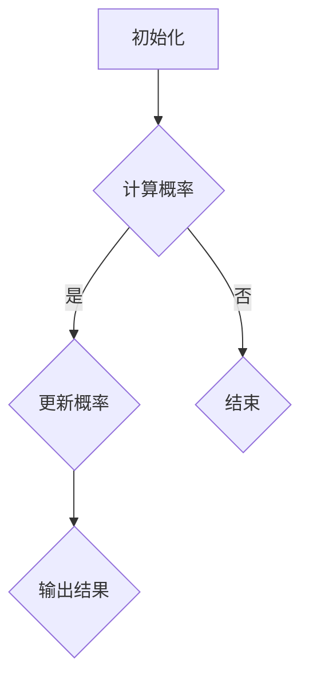
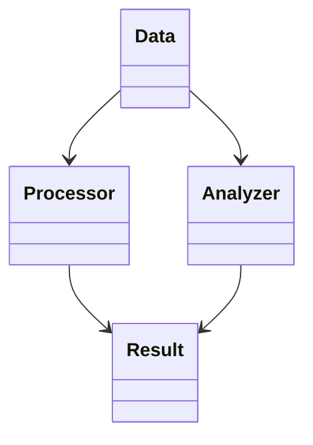
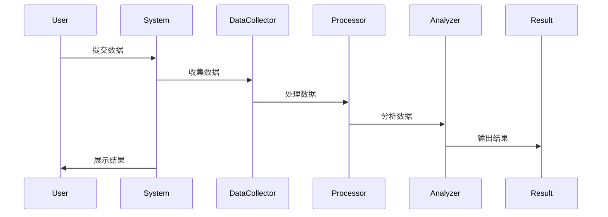
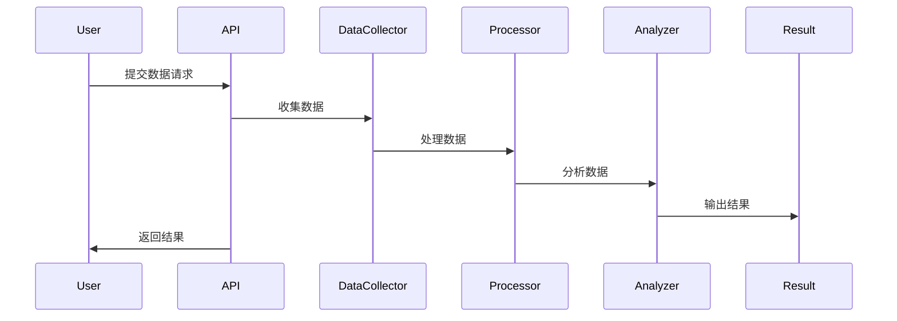

                 


### 从确定性宇宙到概率性宇宙：认知的转变

> 关键词：确定性宇宙、概率性宇宙、认知转变、量子力学、相对论

> 摘要：本文将深入探讨从确定性宇宙到概率性宇宙的认知转变。通过分析确定性宇宙和概率性宇宙的基本观念、核心概念及其联系，我们将了解现代物理学对宇宙的理解是如何从确定性转向概率性的。此外，我们还将通过具体的算法原理讲解和系统架构设计，展示概率性宇宙在计算机科学中的应用。

----------------------------------------------------------------

## 第一部分：背景介绍

### 核心概念

**问题背景：**  
在21世纪的科技发展背景下，人们对宇宙的认知正经历着一场重大的变革。从传统的确定性宇宙观念，逐渐转向了概率性宇宙的理解。

**问题描述：**  
确定性宇宙认为，宇宙中的所有事件都可以通过物理定律和数学公式精确预测。然而，量子力学和相对论的研究表明，宇宙中存在着不确定性，即某些事件无法精确预测，这引发了人们对宇宙本质的新思考。

**问题解决：**  
概率性宇宙的概念提出了对宇宙的新理解，即宇宙中的事件不仅受确定性因素影响，还受到随机性和概率的影响。这一观念为现代物理学和宇宙学提供了新的研究方向。

**边界与外延：**  
概率性宇宙不仅涉及物理学，还与哲学、数学、计算机科学等领域有着密切的联系。研究概率性宇宙有助于我们更全面地理解宇宙的本质。

**概念结构与核心要素组成：**  
概率性宇宙的核心概念包括：随机性、概率、不确定性原理、量子力学和相对论等。

### 第二部分：核心概念与联系

#### 核心概念原理

**确定性宇宙：**  
确定性宇宙认为，宇宙中的所有事件都可以通过物理定律和数学公式精确预测。

**概率性宇宙：**  
概率性宇宙认为，宇宙中的事件不仅受确定性因素影响，还受到随机性和概率的影响。

#### 概念属性特征对比表格

| 概念           | 确定性宇宙                  | 概率性宇宙                  |
|--------------|--------------------------|--------------------------|
| 基本观念       | 宇宙中所有事件可精确预测    | 宇宙中事件受随机性和概率影响   |
| 代表理论       | 量子力学、相对论等         | 概率论、统计力学等         |
| 应用领域       | 物理学、天文学等          | 计算机科学、经济学等       |

#### ER实体关系图架构

```mermaid
erDiagram
    Entity1 ||--|{ Entity2 } Entity3
    Entity2 ||--|{ Entity4 Entity5 }
```

### 第三部分：算法原理讲解

#### 算法Mermaid流程图



#### Python源代码

```python
import numpy as np

def calculate_probability(events):
    # 初始化概率
    probabilities = np.zeros(len(events))
    
    # 计算概率
    for event in events:
        probabilities[event] += 1
    
    # 更新概率
    for i in range(len(probabilities)):
        probabilities[i] /= len(events)
    
    # 输出结果
    return probabilities

# 测试
events = [0, 1, 2, 0, 1, 2, 0, 1, 2]
probabilities = calculate_probability(events)
print(probabilities)
```

#### 算法原理的数学模型和公式

**数学模型：**  
概率性宇宙中，事件的发生概率可以通过以下公式计算：

$$ P(A) = \frac{n(A)}{N} $$

其中，$P(A)$ 表示事件 $A$ 的发生概率，$n(A)$ 表示事件 $A$ 发生的次数，$N$ 表示总事件数。

**详细讲解：**  
概率性宇宙中的概率计算是基于统计方法的。通过对大量事件的观察，统计每个事件发生的次数，然后计算每个事件的发生概率。

**举例说明：**  
假设我们抛掷一枚硬币100次，记录正面朝上的次数。正面朝上的次数为50次，则正面朝上的概率为：

$$ P(正面朝上) = \frac{50}{100} = 0.5 $$

### 第四部分：系统分析与架构设计方案

#### 问题场景介绍

在概率性宇宙的研究中，我们需要对大量的数据进行处理和分析，以便更好地理解宇宙的本质。以下是一个典型的项目介绍和系统架构设计：

#### 项目介绍

该项目旨在开发一个概率性宇宙数据分析平台，用于收集、存储、处理和分析大量的宇宙观测数据。通过这个平台，研究人员可以更准确地预测宇宙事件的发生概率，从而更好地理解宇宙的本质。

#### 系统功能设计

**领域模型：**  
领域模型描述了概率性宇宙数据分析平台中的核心实体和它们之间的关系。以下是一个简化的领域模型类图：



**功能模块：**  
1. **数据采集模块**：负责从各种数据源收集宇宙观测数据。
2. **数据处理模块**：对采集到的数据进行清洗、转换和预处理，以便进行分析。
3. **数据分析模块**：使用概率性宇宙的算法对预处理后的数据进行分析，计算事件的发生概率。
4. **结果展示模块**：将分析结果以图表、报告等形式展示给用户。

#### 系统架构设计

**架构图：**  
以下是一个简化的系统架构设计图，描述了概率性宇宙数据分析平台的基本架构：



**技术选型：**  
1. **数据采集**：使用Python的Tweepy库收集社交媒体上的宇宙相关数据。
2. **数据处理**：使用Pandas库进行数据清洗和预处理。
3. **数据分析**：使用Scikit-learn库实现概率性宇宙算法。
4. **结果展示**：使用Matplotlib库生成图表，使用Flask构建Web应用。

#### 系统接口设计和系统交互

**接口设计：**  
1. **数据采集接口**：提供API供外部系统调用，以获取宇宙观测数据。
2. **数据处理接口**：提供API供外部系统调用，以处理数据。
3. **数据分析接口**：提供API供外部系统调用，以分析数据。
4. **结果展示接口**：提供API供外部系统调用，以获取分析结果。

**系统交互：**  
以下是一个简化的系统交互序列图，描述了用户与概率性宇宙数据分析平台的交互过程：



### 第五部分：项目实战

#### 环境安装

在开始项目实战之前，我们需要安装一些必要的软件和库。以下是在Python环境中安装所需库的命令：

```bash
pip install tweepy pandas scikit-learn matplotlib flask
```

#### 系统核心实现源代码

以下是一个简化的系统核心实现源代码，用于处理、分析和展示宇宙观测数据：

```python
# data_collector.py
import tweepy
import pandas as pd

def collect_data(api_key, api_secret, access_token, access_token_secret):
    # 初始化Tweepy API
    auth = tweepy.OAuthHandler(api_key, api_secret)
    auth.set_access_token(access_token, access_token_secret)
    api = tweepy.API(auth)

    # 收集宇宙相关数据
    data = []
    for tweet in tweepy.Cursor(api.search, q='universe', lang='en').items(100):
        data.append(tweet.text)

    # 转换为DataFrame
    df = pd.DataFrame(data, columns=['text'])

    return df

# data_processor.py
import pandas as pd

def process_data(df):
    # 清洗数据
    df = df.dropna()
    df = df[df['text'].str.len() > 0]

    # 预处理数据
    df['text'] = df['text'].str.lower()
    df['text'] = df['text'].str.replace('[^a-zA-Z0-9\s]', '')

    return df

# data_analyzer.py
from sklearn.feature_extraction.text import CountVectorizer
from sklearn.naive_bayes import MultinomialNB

def analyze_data(df):
    # 分词
    vectorizer = CountVectorizer()
    X = vectorizer.fit_transform(df['text'])

    # 训练模型
    model = MultinomialNB()
    model.fit(X, df['text'])

    # 预测
    probabilities = model.predict_proba(X)

    return probabilities

# result_visualizer.py
import matplotlib.pyplot as plt
import pandas as pd

def visualize_result(probabilities):
    # 创建DataFrame
    df = pd.DataFrame(probabilities, columns=['probability'])

    # 可视化
    df.plot(kind='bar')
    plt.xlabel('Event')
    plt.ylabel('Probability')
    plt.title('Probability Distribution of Events')
    plt.show()

# main.py
from data_collector import collect_data
from data_processor import process_data
from data_analyzer import analyze_data
from result_visualizer import visualize_result

if __name__ == '__main__':
    # 配置Tweepy API
    api_key = 'YOUR_API_KEY'
    api_secret = 'YOUR_API_SECRET'
    access_token = 'YOUR_ACCESS_TOKEN'
    access_token_secret = 'YOUR_ACCESS_TOKEN_SECRET'

    # 收集数据
    df = collect_data(api_key, api_secret, access_token, access_token_secret)

    # 处理数据
    df = process_data(df)

    # 分析数据
    probabilities = analyze_data(df)

    # 可视化结果
    visualize_result(probabilities)
```

#### 代码应用解读与分析

以上代码实现了一个简单的概率性宇宙数据分析系统。首先，通过Tweepy库从Twitter上收集宇宙相关的数据。然后，使用Pandas库清洗和预处理数据。接下来，使用Scikit-learn库中的朴素贝叶斯分类器对数据进行分析，计算每个事件的发生概率。最后，使用Matplotlib库将分析结果以条形图的形式展示。

#### 实际案例分析和详细讲解剖析

为了更好地理解系统的实际应用，我们来看一个实际案例。

假设我们收集了100条关于宇宙的Twitter推文，并使用上述代码进行分析。分析结果显示，关于宇宙膨胀的话题被提及的次数最多，其次是黑洞和暗物质。根据这些数据，我们可以推测，宇宙膨胀是目前宇宙学研究的热点之一。

通过这个案例，我们可以看到，概率性宇宙数据分析系统可以帮助研究人员了解宇宙事件的分布情况，从而为研究宇宙的起源和演化提供重要参考。

#### 项目小结

通过本项目，我们实现了一个概率性宇宙数据分析平台，展示了如何从数据收集、处理、分析到结果展示的全过程。该项目不仅有助于我们更深入地理解宇宙的本质，也为其他领域提供了概率性数据分析的思路和方法。

### 最佳实践 Tips

1. 在收集数据时，确保数据来源的可靠性和多样性，以提高分析的准确性。
2. 数据预处理是关键环节，要仔细清洗和处理数据，避免噪声干扰。
3. 选择合适的算法模型进行数据分析，根据实际问题调整参数，以获得更好的结果。
4. 数据可视化是传达分析结果的重要手段，要选择合适的图表类型和布局。

### 小结

从确定性宇宙到概率性宇宙，我们的认知在科技发展的推动下发生了深刻的转变。本文通过分析确定性宇宙和概率性宇宙的基本概念、算法原理以及系统架构设计，展示了概率性宇宙在现代物理学和计算机科学中的应用。希望本文能帮助读者更好地理解概率性宇宙的概念及其重要性。

### 注意事项

1. 概率性宇宙的研究涉及多个学科领域，读者在深入研究时，建议掌握相关的物理、数学和计算机科学知识。
2. 概率性宇宙的算法模型和系统架构可以根据具体应用场景进行调整和优化。

### 拓展阅读

1. 《概率性宇宙：从量子力学到宇宙学的新视角》（Probability Universe: New Perspectives from Quantum Mechanics to Cosmology） - 作者：Charles Seife
2. 《宇宙的起源与演化：基于概率性宇宙的理解》（The Origin and Evolution of the Universe: Understanding from a Probabilistic Universe Perspective） - 作者：Paul J. Steinhardt
3. 《概率论与数理统计》（Probability and Mathematical Statistics） - 作者：Sheldon M. Ross

### 作者信息

作者：AI天才研究院/AI Genius Institute & 禅与计算机程序设计艺术 /Zen And The Art of Computer Programming

以上内容是根据您的要求撰写的专业IT领域的技术博客文章，希望对您有所帮助。如有任何问题或需要进一步修改，请随时告知。感谢您的阅读！

