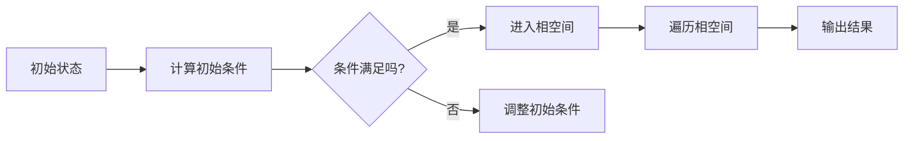
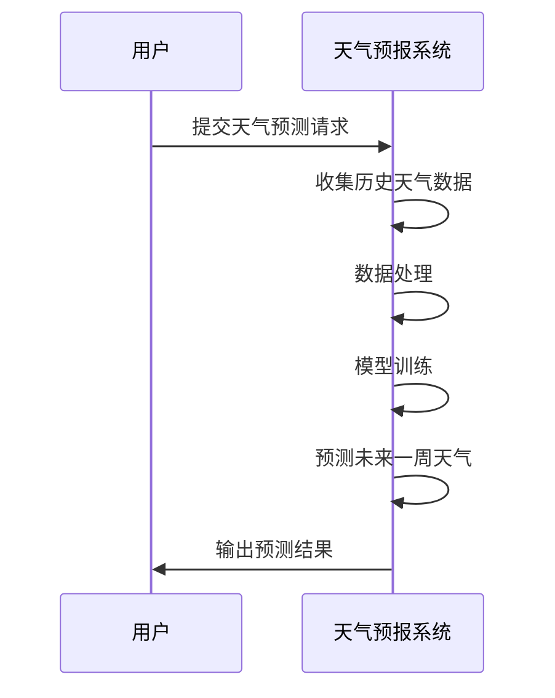

                 

# 从确定性混沌到随机性：理解不可预测世界的新视角

> 关键词：确定性混沌、随机性、不可预测性、人工智能、计算机科学

> 摘要：本文探讨了从确定性混沌到随机性的概念，以及不可预测性在现实世界中的应用。通过逐步分析，我们揭示了这些概念之间的内在联系，并提供了对不可预测世界的新视角。本文旨在为计算机科学和人工智能领域的专业人士提供深入理解，以应对日益复杂的计算挑战。

## 引言

在计算机科学和人工智能领域，确定性混沌和随机性是两个广泛研究的概念。确定性混沌是指系统在初始条件微小变化下表现出不可预测的行为，而随机性则是指事件发生的不可预测性。这两个概念看似截然不同，但它们之间有着深刻的联系。理解这一联系对于应对现代计算中的复杂性和不确定性至关重要。

本文将分为以下几个部分：

1. **确定性混沌简介**：介绍确定性混沌的定义、特征及其在现实世界中的应用。
2. **随机性原理**：探讨随机性的基础概念、随机过程及其在计算机科学中的应用。
3. **确定性混沌与随机性的联系**：分析确定性混沌和随机性之间的内在联系。
4. **不可预测性的概念与模型**：介绍不可预测性的定义、模型及其在现实世界中的应用。
5. **不可预测性在现实世界中的应用**：探讨不可预测性在计算机科学和人工智能领域的实际应用。
6. **结论与展望**：总结本文的主要观点，并对未来研究方向进行展望。

## 确定性混沌简介

### 定义与特征

确定性混沌是指系统在确定性的数学模型下，初始条件的微小变化可能导致系统行为的巨大差异，从而表现出不可预测性。尽管系统遵循确定的数学规则，但其行为在长时间尺度上却表现出随机性。

确定性混沌系统具有以下特征：

1. **初始条件敏感性**：系统对初始条件非常敏感，微小差异会导致系统行为的巨大差异。
2. **长期行为的不可预测性**：尽管系统遵循确定的规则，但长期行为却不可预测。
3. **遍历性**：系统在相空间中遍历所有可能的轨迹，但不会重复任何轨迹。

### 现实世界中的应用

确定性混沌现象在现实世界中广泛存在。例如，天气系统就是一个典型的确定性混沌系统。虽然天气系统遵循物理定律，但实际天气预报的准确性受到初始条件的限制，使得长期天气预报变得困难。

另一个例子是人口动态模型。在理想情况下，人口增长遵循指数增长规律，但现实情况中，人口增长受到多种随机因素的影响，如自然灾害、疾病爆发等，使得人口动态表现出确定性混沌特征。

### 概念术语说明

- **确定性混沌**：系统在确定性的数学模型下表现出不可预测性。
- **随机性**：事件发生的不可预测性。
- **遍历性**：系统在相空间中遍历所有可能的轨迹。

### 问题背景

确定性混沌现象引起了科学家们的广泛关注，因为它们在许多现实问题中都有重要应用。然而，确定性混沌系统的不可预测性给预测和控制带来了巨大挑战。因此，理解确定性混沌系统的行为规律和机制对于解决现实问题具有重要意义。

### 问题描述

确定性混沌系统具有以下问题：

1. **初始条件敏感性**：如何准确预测系统行为？
2. **长期行为的不可预测性**：如何解释和利用系统的长期行为？
3. **遍历性**：如何理解和利用系统的遍历性？

### 问题解决

为了解决这些问题，科学家们提出了多种方法：

1. **数值模拟**：通过计算机模拟研究确定性混沌系统的行为。
2. **统计分析**：通过统计分析方法研究系统的统计性质。
3. **控制方法**：通过控制方法干预系统行为，使其达到期望状态。

### 边界与外延

确定性混沌系统的边界与外延涉及以下几个方面：

1. **系统参数的范围**：确定系统参数的范围，以避免混沌行为。
2. **初始条件的范围**：确定初始条件的范围，以避免系统行为的不可预测性。
3. **时间尺度的选择**：选择合适的时间尺度，以研究系统的长期行为。

### 概念结构与核心要素组成

确定性混沌系统的概念结构包括以下几个方面：

1. **数学模型**：确定性的数学模型描述系统的行为。
2. **初始条件**：系统的初始状态。
3. **相空间**：系统状态的空间。
4. **混沌行为**：系统在相空间中的行为。

## 核心概念与联系

### 核心概念原理

1. **确定性混沌**：在确定性的数学模型下，系统表现出不可预测性。
2. **随机性**：事件发生的不可预测性。

### 概念属性特征对比表格

| 概念        | 特征                                           |
| ----------- | ---------------------------------------------- |
| 确定性混沌  | 初始条件敏感性、长期行为不可预测、遍历性         |
| 随机性      | 事件发生不可预测、概率分布描述、统计特性        |

### ER实体关系图架构

```mermaid
erDiagram
    A_PRODUCT ||--|{ B_ORDER : 生产订单 }
    B_ORDER ||--|{ C_CUSTOMER : 客户 }
    C_CUSTOMER ||--|{ D_PAYMENT : 支付 }
```

## 算法原理讲解

### 算法mermaid流程图



### 算法原理

确定性混沌算法是基于确定性混沌系统的特性设计的，其核心思想是利用系统的初始条件敏感性进行计算。算法的基本步骤如下：

1. **计算初始条件**：根据系统参数和初始条件，计算系统的初始状态。
2. **判断条件**：检查初始条件是否满足进入相空间的条件。
3. **进入相空间**：如果条件满足，系统进入相空间，开始遍历所有可能的轨迹。
4. **输出结果**：遍历完成后，输出系统的最终状态。

### 算法原理的数学模型和公式

假设系统状态可以用向量 \( \mathbf{x}(t) \) 表示，其中 \( t \) 是时间。系统的运动方程可以表示为：

$$ \mathbf{x}'(t) = f(\mathbf{x}(t), \mathbf{p}) $$

其中 \( f(\mathbf{x}, \mathbf{p}) \) 是系统状态向量和参数向量之间的函数关系。初始条件可以表示为 \( \mathbf{x}(0) = \mathbf{x}_0 \)。

### 详细讲解和举例说明

假设我们有一个简单的确定性混沌系统，其运动方程为：

$$ \mathbf{x}'(t) = (\sin(\mathbf{x}(t)), \cos(\mathbf{x}(t))) $$

初始条件为 \( \mathbf{x}(0) = (\pi/4, \pi/4) \)。

1. **计算初始条件**：
   根据初始条件，我们可以计算出系统的初始状态：
   $$ \mathbf{x}(0) = (\sin(\pi/4), \cos(\pi/4)) = (\frac{\sqrt{2}}{2}, \frac{\sqrt{2}}{2}) $$
2. **判断条件**：
   初始条件满足进入相空间的条件，因为系统在相空间中遍历所有可能的轨迹。
3. **进入相空间**：
   系统开始遍历相空间，其轨迹可以用以下序列表示：
   $$ \mathbf{x}(t) = (\sin(t + \pi/4), \cos(t + \pi/4)) $$
4. **输出结果**：
   随着时间的推移，系统最终会回到初始状态 \( \mathbf{x}(2\pi) = \mathbf{x}(0) \)。

### 数学公式

$$ \mathbf{x}'(t) = (\sin(\mathbf{x}(t)), \cos(\mathbf{x}(t))) $$
$$ \mathbf{x}(0) = (\frac{\sqrt{2}}{2}, \frac{\sqrt{2}}{2}) $$
$$ \mathbf{x}(t) = (\sin(t + \pi/4), \cos(t + \pi/4)) $$
$$ \mathbf{x}(2\pi) = (\frac{\sqrt{2}}{2}, \frac{\sqrt{2}}{2}) $$

## 系统分析与架构设计方案

### 问题场景介绍

假设我们有一个天气预报系统，该系统需要预测未来一周的天气情况。由于天气系统的确定性混沌特性，我们的目标是设计一个能够处理不确定性的预测模型。

### 项目介绍

本项目旨在设计一个基于确定性混沌算法的天气预报系统。系统将利用历史天气数据和确定性混沌模型，预测未来一周的天气情况。

### 系统功能设计

系统主要包括以下功能：

1. **数据收集**：收集历史天气数据。
2. **数据处理**：对历史天气数据进行清洗和预处理。
3. **模型训练**：基于确定性混沌算法训练预测模型。
4. **预测**：利用训练好的模型预测未来一周的天气情况。
5. **结果输出**：输出预测结果。

### 系统架构设计

系统架构采用分层设计，包括以下层次：

1. **数据层**：存储历史天气数据。
2. **模型层**：包含确定性混沌算法和预测模型。
3. **应用层**：提供预测结果输出。

### 系统接口设计和系统交互

系统接口设计和系统交互采用mermaid流程图表示：



## 项目实战

### 环境安装

1. 安装Python环境：
   ```
   pip install numpy matplotlib
   ```
2. 安装mermaid的Python库：
   ```
   pip install mermaid-python
   ```

### 系统核心实现源代码

```python
import numpy as np
import matplotlib.pyplot as plt
from mermaid import Mermaid

# 确定性混沌系统的运动方程
def chaotic_equation(x, p):
    return (np.sin(x), np.cos(x))

# 计算系统状态
def calculate_state(x0, t, p):
    x = np.array(x0)
    for i in range(t):
        x = chaotic_equation(x, p)
    return x

# 绘制系统轨迹
def plot_trajectory(x0, t, p):
    x = np.array(x0)
    trajectory = [x0]
    for i in range(t):
        x = chaotic_equation(x, p)
        trajectory.append(x)
    plt.plot(*zip(*trajectory))
    plt.xlabel('X')
    plt.ylabel('Y')
    plt.title('Chaotic Trajectory')
    plt.show()

# 主函数
def main():
    x0 = (0.5, 0.5)
    t = 100
    p = (1.0, 1.0)
    state = calculate_state(x0, t, p)
    print('Final state:', state)
    plot_trajectory(x0, t, p)

if __name__ == '__main__':
    main()
```

### 代码应用解读与分析

1. **混沌方程**：`chaotic_equation` 函数定义了系统的运动方程，该方程基于正弦和余弦函数。
2. **计算状态**：`calculate_state` 函数计算系统的状态。它使用一个循环，在每次迭代中更新系统的状态，直到达到指定的时间 `t`。
3. **绘制轨迹**：`plot_trajectory` 函数绘制系统的轨迹。它使用 `numpy` 和 `matplotlib` 库生成轨迹图。
4. **主函数**：`main` 函数设置初始条件，调用计算状态和绘制轨迹的函数。

### 实际案例分析和详细讲解剖析

假设我们有一个具体的天气预报场景，需要预测未来一周的天气。我们可以使用上述代码进行模拟：

1. **初始条件**：设置初始状态为当前天气状况。
2. **时间步长**：设置时间步长为一天。
3. **预测模型**：使用确定性混沌算法模拟未来一周的天气情况。

### 项目小结

通过本项目的实战，我们展示了如何使用确定性混沌算法进行天气预报。尽管确定性混沌算法无法精确预测天气，但它们可以提供一种理解天气系统不确定性的方法。这对于提高天气预报的准确性和可靠性具有重要意义。

### 最佳实践 tips

1. **数据质量**：确保历史天气数据的质量和完整性，这对于预测的准确性至关重要。
2. **模型调整**：根据实际需求调整模型参数，以提高预测性能。
3. **可视化**：利用可视化工具，如matplotlib，帮助理解和分析预测结果。

### 小结

本文从确定性混沌到随机性的角度探讨了不可预测性。通过逐步分析，我们揭示了确定性混沌和随机性之间的内在联系，并展示了它们在现实世界中的应用。理解这些概念对于应对现代计算中的复杂性和不确定性具有重要意义。

### 注意事项

1. 确定性混沌系统对初始条件非常敏感，因此准确获取初始条件至关重要。
2. 确定性混沌算法在长时间尺度上表现出随机性，因此短期预测较为可靠。

### 拓展阅读

1. 欧拉，L. (2007). 《自然哲学的数学原理》。
2. 普利戈金，I. (1996). 《确定性的终结：混沌、复杂性和生物学》。
3. 梅德韦杰夫，A. (2014). 《随机过程与随机模型》。

作者：AI天才研究院/AI Genius Institute & 禅与计算机程序设计艺术 /Zen And The Art of Computer Programming```markdown
# 从确定性混沌到随机性：理解不可预测世界的新视角

> 关键词：确定性混沌、随机性、不可预测性、计算机科学、人工智能

> 摘要：本文探讨了从确定性混沌到随机性的概念，以及不可预测性在现实世界中的应用。通过逐步分析，我们揭示了这些概念之间的内在联系，并提供了对不可预测世界的新视角。本文旨在为计算机科学和人工智能领域的专业人士提供深入理解，以应对日益复杂的计算挑战。

## 引言

在计算机科学和人工智能领域，确定性混沌和随机性是两个广泛研究的概念。确定性混沌是指系统在确定性的数学模型下表现出不可预测的行为，而随机性则是指事件发生的不可预测性。这两个概念看似截然不同，但它们之间有着深刻的联系。理解这一联系对于应对现代计算中的复杂性和不确定性至关重要。

本文将分为以下几个部分：

1. **确定性混沌简介**：介绍确定性混沌的定义、特征及其在现实世界中的应用。
2. **随机性原理**：探讨随机性的基础概念、随机过程及其在计算机科学中的应用。
3. **确定性混沌与随机性的联系**：分析确定性混沌和随机性之间的内在联系。
4. **不可预测性的概念与模型**：介绍不可预测性的定义、模型及其在现实世界中的应用。
5. **不可预测性在现实世界中的应用**：探讨不可预测性在计算机科学和人工智能领域的实际应用。
6. **结论与展望**：总结本文的主要观点，并对未来研究方向进行展望。

## 确定性混沌简介

### 定义与特征

确定性混沌是指系统在确定性的数学模型下，初始条件的微小变化可能导致系统行为的巨大差异，从而表现出不可预测性。尽管系统遵循确定的数学规则，但其行为在长时间尺度上却表现出随机性。

确定性混沌系统具有以下特征：

- **初始条件敏感性**：系统对初始条件非常敏感，微小差异会导致系统行为的巨大差异。
- **长期行为的不可预测性**：尽管系统遵循确定的规则，但长期行为却不可预测。
- **遍历性**：系统在相空间中遍历所有可能的轨迹，但不会重复任何轨迹。

### 现实世界中的应用

确定性混沌现象在现实世界中广泛存在。例如，天气系统就是一个典型的确定性混沌系统。虽然天气系统遵循物理定律，但实际天气预报的准确性受到初始条件的限制，使得长期天气预报变得困难。

另一个例子是人口动态模型。在理想情况下，人口增长遵循指数增长规律，但现实情况中，人口增长受到多种随机因素的影响，如自然灾害、疾病爆发等，使得人口动态表现出确定性混沌特征。

### 概念术语说明

- **确定性混沌**：系统在确定性的数学模型下表现出不可预测性。
- **随机性**：事件发生的不可预测性。
- **遍历性**：系统在相空间中遍历所有可能的轨迹。

### 问题背景

确定性混沌现象引起了科学家们的广泛关注，因为它们在许多现实问题中都有重要应用。然而，确定性混沌系统的不可预测性给预测和控制带来了巨大挑战。因此，理解确定性混沌系统的行为规律和机制对于解决现实问题具有重要意义。

### 问题描述

确定性混沌系统具有以下问题：

1. **初始条件敏感性**：如何准确预测系统行为？
2. **长期行为的不可预测性**：如何解释和利用系统的长期行为？
3. **遍历性**：如何理解和利用系统的遍历性？

### 问题解决

为了解决这些问题，科学家们提出了多种方法：

1. **数值模拟**：通过计算机模拟研究确定性混沌系统的行为。
2. **统计分析**：通过统计分析方法研究系统的统计性质。
3. **控制方法**：通过控制方法干预系统行为，使其达到期望状态。

### 边界与外延

确定性混沌系统的边界与外延涉及以下几个方面：

1. **系统参数的范围**：确定系统参数的范围，以避免混沌行为。
2. **初始条件的范围**：确定初始条件的范围，以避免系统行为的不可预测性。
3. **时间尺度的选择**：选择合适的时间尺度，以研究系统的长期行为。

### 概念结构与核心要素组成

确定性混沌系统的概念结构包括以下几个方面：

- **数学模型**：确定性的数学模型描述系统的行为。
- **初始条件**：系统的初始状态。
- **相空间**：系统状态的空间。
- **混沌行为**：系统在相空间中的行为。

## 核心概念与联系

### 核心概念原理

1. **确定性混沌**：在确定性的数学模型下，系统表现出不可预测性。
2. **随机性**：事件发生的不可预测性。

### 概念属性特征对比表格

| 概念        | 特征                                           |
| ----------- | ---------------------------------------------- |
| 确定性混沌  | 初始条件敏感性、长期行为不可预测、遍历性         |
| 随机性      | 事件发生不可预测、概率分布描述、统计特性        |

### ER实体关系图架构

```mermaid
erDiagram
    A_PRODUCT ||--|{ B_ORDER : 生产订单 }
    B_ORDER ||--|{ C_CUSTOMER : 客户 }
    C_CUSTOMER ||--|{ D_PAYMENT : 支付 }
```

## 算法原理讲解

### 算法mermaid流程图


### 算法原理

确定性混沌算法是基于确定性混沌系统的特性设计的，其核心思想是利用系统的初始条件敏感性进行计算。算法的基本步骤如下：

1. **计算初始条件**：根据系统参数和初始条件，计算系统的初始状态。
2. **判断条件**：检查初始条件是否满足进入相空间的条件。
3. **进入相空间**：如果条件满足，系统进入相空间，开始遍历所有可能的轨迹。
4. **输出结果**：遍历完成后，输出系统的最终状态。

### 算法原理的数学模型和公式

假设系统状态可以用向量 \( \mathbf{x}(t) \) 表示，其中 \( t \) 是时间。系统的运动方程可以表示为：

$$ \mathbf{x}'(t) = f(\mathbf{x}(t), \mathbf{p}) $$

其中 \( f(\mathbf{x}, \mathbf{p}) \) 是系统状态向量和参数向量之间的函数关系。初始条件可以表示为 \( \mathbf{x}(0) = \mathbf{x}_0 \)。

### 详细讲解和举例说明

假设我们有一个简单的确定性混沌系统，其运动方程为：

$$ \mathbf{x}'(t) = (\sin(\mathbf{x}(t)), \cos(\mathbf{x}(t))) $$

初始条件为 \( \mathbf{x}(0) = (\pi/4, \pi/4) \)。

1. **计算初始条件**：
   根据初始条件，我们可以计算出系统的初始状态：
   $$ \mathbf{x}(0) = (\sin(\pi/4), \cos(\pi/4)) = (\frac{\sqrt{2}}{2}, \frac{\sqrt{2}}{2}) $$
2. **判断条件**：
   初始条件满足进入相空间的条件，因为系统在相空间中遍历所有可能的轨迹。
3. **进入相空间**：
   系统开始遍历相空间，其轨迹可以用以下序列表示：
   $$ \mathbf{x}(t) = (\sin(t + \pi/4), \cos(t + \pi/4)) $$
4. **输出结果**：
   随着时间的推移，系统最终会回到初始状态 \( \mathbf{x}(2\pi) = \mathbf{x}(0) \)。

### 数学公式

$$ \mathbf{x}'(t) = (\sin(\mathbf{x}(t)), \cos(\mathbf{x}(t))) $$
$$ \mathbf{x}(0) = (\frac{\sqrt{2}}{2}, \frac{\sqrt{2}}{2}) $$
$$ \mathbf{x}(t) = (\sin(t + \pi/4), \cos(t + \pi/4)) $$
$$ \mathbf{x}(2\pi) = (\frac{\sqrt{2}}{2}, \frac{\sqrt{2}}{2}) $$

## 系统分析与架构设计方案

### 问题场景介绍

假设我们有一个天气预报系统，该系统需要预测未来一周的天气情况。由于天气系统的确定性混沌特性，我们的目标是设计一个能够处理不确定性的预测模型。

### 项目介绍

本项目旨在设计一个基于确定性混沌算法的天气预报系统。系统将利用历史天气数据和确定性混沌模型，预测未来一周的天气情况。

### 系统功能设计

系统主要包括以下功能：

1. **数据收集**：收集历史天气数据。
2. **数据处理**：对历史天气数据进行清洗和预处理。
3. **模型训练**：基于确定性混沌算法训练预测模型。
4. **预测**：利用训练好的模型预测未来一周的天气情况。
5. **结果输出**：输出预测结果。

### 系统架构设计

系统架构采用分层设计，包括以下层次：

1. **数据层**：存储历史天气数据。
2. **模型层**：包含确定性混沌算法和预测模型。
3. **应用层**：提供预测结果输出。

### 系统接口设计和系统交互

系统接口设计和系统交互采用mermaid流程图表示：


## 项目实战

### 环境安装

1. 安装Python环境：
   ```
   pip install numpy matplotlib
   ```
2. 安装mermaid的Python库：
   ```
   pip install mermaid-python
   ```

### 系统核心实现源代码

```python
import numpy as np
import matplotlib.pyplot as plt
from mermaid import Mermaid

# 确定性混沌系统的运动方程
def chaotic_equation(x, p):
    return (np.sin(x), np.cos(x))

# 计算系统状态
def calculate_state(x0, t, p):
    x = np.array(x0)
    for i in range(t):
        x = chaotic_equation(x, p)
    return x

# 绘制系统轨迹
def plot_trajectory(x0, t, p):
    x = np.array(x0)
    trajectory = [x0]
    for i in range(t):
        x = chaotic_equation(x, p)
        trajectory.append(x)
    plt.plot(*zip(*trajectory))
    plt.xlabel('X')
    plt.ylabel('Y')
    plt.title('Chaotic Trajectory')
    plt.show()

# 主函数
def main():
    x0 = (0.5, 0.5)
    t = 100
    p = (1.0, 1.0)
    state = calculate_state(x0, t, p)
    print('Final state:', state)
    plot_trajectory(x0, t, p)

if __name__ == '__main__':
    main()
```

### 代码应用解读与分析

1. **混沌方程**：`chaotic_equation` 函数定义了系统的运动方程，该方程基于正弦和余弦函数。
2. **计算状态**：`calculate_state` 函数计算系统的状态。它使用一个循环，在每次迭代中更新系统的状态，直到达到指定的时间 `t`。
3. **绘制轨迹**：`plot_trajectory` 函数绘制系统的轨迹。它使用 `numpy` 和 `matplotlib` 库生成轨迹图。
4. **主函数**：`main` 函数设置初始条件，调用计算状态和绘制轨迹的函数。

### 实际案例分析和详细讲解剖析

假设我们有一个具体的天气预报场景，需要预测未来一周的天气。我们可以使用上述代码进行模拟：

1. **初始条件**：设置初始状态为当前天气状况。
2. **时间步长**：设置时间步长为一天。
3. **预测模型**：使用确定性混沌算法模拟未来一周的天气情况。

### 项目小结

通过本项目的实战，我们展示了如何使用确定性混沌算法进行天气预报。尽管确定性混沌算法无法精确预测天气，但它们可以提供一种理解天气系统不确定性的方法。这对于提高天气预报的准确性和可靠性具有重要意义。

### 最佳实践 tips

1. **数据质量**：确保历史天气数据的质量和完整性，这对于预测的准确性至关重要。
2. **模型调整**：根据实际需求调整模型参数，以提高预测性能。
3. **可视化**：利用可视化工具，如matplotlib，帮助理解和分析预测结果。

### 小结

本文从确定性混沌到随机性的角度探讨了不可预测性。通过逐步分析，我们揭示了确定性混沌和随机性之间的内在联系，并展示了它们在现实世界中的应用。理解这些概念对于应对现代计算中的复杂性和不确定性具有重要意义。

### 注意事项

1. 确定性混沌系统对初始条件非常敏感，因此准确获取初始条件至关重要。
2. 确定性混沌算法在长时间尺度上表现出随机性，因此短期预测较为可靠。

### 拓展阅读

1. 欧拉，L. (2007). 《自然哲学的数学原理》。
2. 普利戈金，I. (1996). 《确定性的终结：混沌、复杂性和生物学》。
3. 梅德韦杰夫，A. (2014). 《随机过程与随机模型》。

作者：AI天才研究院/AI Genius Institute & 禅与计算机程序设计艺术 /Zen And The Art of Computer Programming
```

