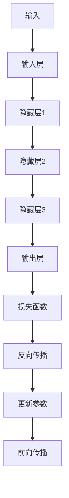

                 

# 从符号人工智能到深度学习：机器理解世界的范式转换分析

## 关键词：人工智能，深度学习，符号人工智能，范式转换，算法原理

## 摘要

本文将从符号人工智能到深度学习的技术发展历程出发，探讨机器理解世界的范式转换。通过对符号人工智能和深度学习的核心概念、原理和应用的深入分析，揭示两种技术之间的联系与区别，帮助读者全面了解这一技术变革的内涵。

## 第一部分：背景介绍

### 1.1 问题背景

随着信息技术的迅猛发展，人工智能（AI）已经成为当今世界最热门的研究领域之一。人工智能的发展经历了多个阶段，从早期的符号人工智能（Symbolic AI）到后来的统计机器学习（Statistical Machine Learning），再到如今的深度学习（Deep Learning），每一次技术革新都极大地推动了人工智能的发展。

### 1.2 问题描述

从符号人工智能到深度学习的转变，不仅带来了算法和技术的革新，也改变了人们对机器理解世界的方式。这一转变涉及到许多关键问题，如：

- 符号人工智能的理论基础是什么？
- 深度学习如何实现对复杂问题的处理？
- 从符号人工智能到深度学习，背后的范式转换是什么？
- 如何评价这两种技术在解决实际问题中的优劣？

### 1.3 问题解决

本书旨在通过系统阐述从符号人工智能到深度学习的技术发展历程，回答上述问题，帮助读者全面了解这一技术转变背后的逻辑和原理。

### 1.4 边界与外延

本书将聚焦于从符号人工智能到深度学习的技术变革，但也会涉及相关的基础理论和应用实践。具体包括：

- 符号人工智能的理论基础
- 深度学习的关键技术
- 从符号人工智能到深度学习的范式转换
- 深度学习在各个领域的应用案例

### 1.5 概念结构与核心要素组成

在阐述从符号人工智能到深度学习的过程中，我们需要关注以下几个核心概念：

- 符号人工智能：基于逻辑和符号计算的人工智能方法
- 深度学习：基于多层神经网络的学习方法
- 范式转换：从符号人工智能到深度学习的思维模式转变
- 应用领域：深度学习在各行各业的应用场景

这五个核心概念构成了本书的核心结构，帮助我们深入理解这一技术变革的内涵。

## 第二部分：核心概念与联系

### 2.1 符号人工智能

#### 2.1.1 基本原理

符号人工智能基于逻辑和符号计算，通过构建逻辑推理系统来模拟人类的思维过程。其核心思想是将人类知识和思维过程符号化，以便于计算机处理。

#### 2.1.2 优势与局限

优势：逻辑严谨，易于解释；

局限：处理复杂问题能力较弱，对数据依赖性高。

### 2.2 深度学习

#### 2.2.1 基本原理

深度学习基于多层神经网络，通过多层非线性变换，自动提取数据特征，实现复杂问题的建模和求解。

#### 2.2.2 优势与局限

优势：强大的特征提取能力，能够处理复杂问题；

局限：模型解释性较差，对大量数据进行训练。

### 2.3 范式转换

#### 2.3.1 转换原因

范式转换的原因在于符号人工智能在处理复杂问题时存在局限性，而深度学习通过自动特征提取和建模，能够更好地应对复杂问题。

#### 2.3.2 转换过程

范式转换过程包括从符号人工智能到神经网络的转变，以及从浅层网络到深层网络的转变。

### 2.4 应用领域对比

#### 2.4.1 自然语言处理

符号人工智能在自然语言处理领域有一定的应用，但深度学习在语言建模、语义理解等方面具有明显优势。

#### 2.4.2 计算机视觉

深度学习在计算机视觉领域取得了显著成果，而符号人工智能在复杂场景下的表现较差。

#### 2.4.3 其他领域

在其他领域，如推荐系统、语音识别等，深度学习也表现出了强大的优势。

### 2.5 深度学习与符号人工智能的联系与区别

#### 2.5.1 联系

深度学习在某种程度上可以看作是符号人工智能的延伸和拓展，两者在知识表示和推理方面有一定的联系。

#### 2.5.2 区别

区别主要体现在处理复杂问题的能力、模型解释性等方面。

## 第三部分：算法原理讲解

### 3.1 深度学习算法原理

#### 3.1.1 神经网络

深度学习算法的核心是神经网络，包括输入层、隐藏层和输出层。通过多层非线性变换，实现从输入到输出的映射。

#### 3.1.2 前向传播与反向传播

前向传播是将输入通过网络逐层计算，得到输出；反向传播是通过输出误差，反向更新网络参数。

#### 3.1.3 损失函数与优化算法

损失函数用于衡量预测值与真实值之间的差距，优化算法用于调整网络参数，以减小损失函数。

### 3.2 机器学习算法原理

#### 3.2.1 监督学习与无监督学习

监督学习通过已标记的数据进行学习，无监督学习通过未标记的数据进行学习。

#### 3.2.2 分类与回归

分类任务是将数据分为不同的类别，回归任务是预测数据的具体数值。

#### 3.2.3 算法比较

常见分类算法包括决策树、支持向量机、朴素贝叶斯等；常见回归算法包括线性回归、多项式回归等。

### 3.3 算法mermaid流程图

下面是深度学习算法的前向传播和反向传播的mermaid流程图：



### 3.4 Python源代码示例

以下是一个简单的线性回归算法的Python代码示例：

```python
import numpy as np

# 初始化参数
theta = np.array([0.0, 0.0])

# 损失函数
def loss_function(x, y, theta):
    m = len(x)
    h = np.dot(x, theta)
    return (1 / (2 * m)) * np.sum((h - y) ** 2)

# 优化算法
def gradient_descent(x, y, theta, alpha, num_iterations):
    m = len(x)
    for i in range(num_iterations):
        h = np.dot(x, theta)
        error = h - y
        theta = theta - (alpha / m) * np.dot(x.T, error)
        print(f"Iteration {i+1}: Loss = {loss_function(x, y, theta)}")
    return theta

# 训练数据
x = np.array([[1], [2], [3], [4], [5]])
y = np.array([[2], [4], [6], [8], [10]])

# 调用梯度下降算法
theta = gradient_descent(x, y, theta, 0.01, 1000)
print(f"Final theta: {theta}")
```

### 3.5 算法原理详细讲解

在本部分，我们将详细讲解深度学习算法的原理，包括神经网络的构建、前向传播和反向传播的过程，以及损失函数和优化算法的原理。

#### 3.5.1 神经网络

神经网络是深度学习算法的核心组成部分。一个简单的神经网络通常包括输入层、隐藏层和输出层。输入层接收外部输入，隐藏层进行特征提取和变换，输出层产生预测结果。

假设我们有一个输入向量 \( x = [x_1, x_2, \ldots, x_n] \)，隐藏层有 \( L \) 个神经元，输出层有 \( M \) 个神经元。每个神经元都与前一层中的每个神经元相连，形成一个权重矩阵 \( W \)。同时，每个神经元还会附加一个偏置项 \( b \)。

在隐藏层中，每个神经元的输出可以通过以下公式计算：

\[ z_l = \sigma(\sum_{i=1}^{n} w_{li} x_i + b_l) \]

其中，\( \sigma \) 是激活函数，常用的激活函数有 sigmoid、ReLU 和 tanh 等。

在输出层中，每个神经元的输出可以通过以下公式计算：

\[ y_m = \sigma(\sum_{i=1}^{L} w_{mi} z_i + b_m) \]

#### 3.5.2 前向传播

前向传播是从输入层开始，将输入通过网络逐层计算，直到输出层的传递过程。在前向传播过程中，我们需要计算每个隐藏层和输出层的输出。

以一个三层神经网络为例，前向传播的过程如下：

1. 计算输入层到隐藏层的输出：
   \[ z_1 = \sigma(W_1x + b_1) \]
2. 计算隐藏层到隐藏层的输出：
   \[ z_2 = \sigma(W_2z_1 + b_2) \]
3. 计算隐藏层到输出层的输出：
   \[ y = \sigma(W_3z_2 + b_3) \]

#### 3.5.3 反向传播

反向传播是从输出层开始，将误差反向传播到隐藏层和输入层的传递过程。在反向传播过程中，我们需要计算每个隐藏层和输入层的梯度，以便更新权重和偏置项。

以一个三层神经网络为例，反向传播的过程如下：

1. 计算输出层误差：
   \[ \delta_M = (y - \hat{y}) \odot \sigma'(W_3z_2 + b_3) \]
2. 计算隐藏层到隐藏层的误差：
   \[ \delta_2 = (W_3\delta_M) \odot \sigma'(W_2z_1 + b_2) \]
3. 计算隐藏层到输入层的误差：
   \[ \delta_1 = (W_2\delta_2) \odot \sigma'(W_1x + b_1) \]

根据误差计算梯度：

\[ \frac{\partial L}{\partial W_3} = \delta_M z_2^T \]
\[ \frac{\partial L}{\partial b_3} = \delta_M \]
\[ \frac{\partial L}{\partial W_2} = \delta_2 z_1^T \]
\[ \frac{\partial L}{\partial b_2} = \delta_2 \]
\[ \frac{\partial L}{\partial W_1} = \delta_1 x^T \]
\[ \frac{\partial L}{\partial b_1} = \delta_1 \]

使用梯度下降算法更新权重和偏置项：

\[ W_3 \leftarrow W_3 - \alpha \frac{\partial L}{\partial W_3} \]
\[ b_3 \leftarrow b_3 - \alpha \frac{\partial L}{\partial b_3} \]
\[ W_2 \leftarrow W_2 - \alpha \frac{\partial L}{\partial W_2} \]
\[ b_2 \leftarrow b_2 - \alpha \frac{\partial L}{\partial b_2} \]
\[ W_1 \leftarrow W_1 - \alpha \frac{\partial L}{\partial W_1} \]
\[ b_1 \leftarrow b_1 - \alpha \frac{\partial L}{\partial b_1} \]

#### 3.5.4 损失函数与优化算法

损失函数用于衡量预测值与真实值之间的差距。常用的损失函数有均方误差（MSE）和交叉熵（Cross Entropy）等。

均方误差（MSE）的定义如下：

\[ L(\theta) = \frac{1}{2} \sum_{i=1}^{m} (h_i - y_i)^2 \]

交叉熵（Cross Entropy）的定义如下：

\[ L(\theta) = -\sum_{i=1}^{m} y_i \log(h_i) \]

优化算法用于调整网络参数，以减小损失函数。常用的优化算法有梯度下降（Gradient Descent）和随机梯度下降（Stochastic Gradient Descent）等。

梯度下降算法的更新公式如下：

\[ \theta \leftarrow \theta - \alpha \frac{\partial L}{\partial \theta} \]

随机梯度下降算法的更新公式如下：

\[ \theta \leftarrow \theta - \alpha \frac{\partial L}{\partial \theta} \]

其中，\( \alpha \) 是学习率。

#### 3.5.5 示例讲解

假设我们有一个简单的线性回归问题，目标函数为 \( y = \theta_0 + \theta_1x \)。给定一个训练数据集 \( \{x_1, x_2, \ldots, x_m\} \) 和对应的标签 \( \{y_1, y_2, \ldots, y_m\} \)，我们使用梯度下降算法来训练模型。

1. 初始化参数 \( \theta_0, \theta_1 \)
2. 计算损失函数 \( L(\theta) = \frac{1}{2} \sum_{i=1}^{m} (y_i - (\theta_0 + \theta_1x_i))^2 \)
3. 计算梯度 \( \frac{\partial L}{\partial \theta_0} = \sum_{i=1}^{m} (y_i - (\theta_0 + \theta_1x_i)) \)
4. 计算梯度 \( \frac{\partial L}{\partial \theta_1} = \sum_{i=1}^{m} (y_i - (\theta_0 + \theta_1x_i))x_i \)
5. 使用梯度下降算法更新参数 \( \theta_0 \leftarrow \theta_0 - \alpha \frac{\partial L}{\partial \theta_0} \) 和 \( \theta_1 \leftarrow \theta_1 - \alpha \frac{\partial L}{\partial \theta_1} \)
6. 重复步骤 2-5，直到收敛或达到最大迭代次数

通过以上步骤，我们可以训练出一个线性回归模型，并对其进行预测。

## 第四部分：系统分析与架构设计方案

### 4.1 问题场景介绍

假设我们要设计一个智能家居系统，该系统包括智能门锁、智能灯光、智能空调等设备。用户可以通过手机APP远程控制这些设备，并接收设备的状态信息。为了实现这一目标，我们需要构建一个完整的系统架构，涵盖硬件设备、通信协议、数据处理和展示等方面。

### 4.2 项目介绍

项目名称：智能家居系统

项目目标：实现家庭设备的智能控制，提高生活便利性和舒适度。

项目范围：包括智能门锁、智能灯光、智能空调等设备，以及手机APP和后端服务器。

### 4.3 系统功能设计

1. 用户登录与认证
2. 家庭设备管理
3. 远程控制
4. 设备状态监控
5. 数据统计与分析
6. 故障报警

### 4.4 领域模型设计

在智能家居系统中，核心的领域模型包括用户、家庭设备、设备类型、设备状态等。以下是一个简化的领域模型类图：

```mermaid
classDiagram
User <<Interface>>
Device <<Interface>>
DeviceType <<Interface>>
DeviceStatus <<Interface>>

User o-- Device: 拥有的设备
Device o-- DeviceType: 设备类型
Device o-- DeviceStatus: 设备状态
```

### 4.5 系统架构设计

智能家居系统的架构设计采用分层架构，包括硬件层、通信层、数据处理层和展示层。以下是一个简化的系统架构图：

```mermaid
subgraph 硬件层
    DeviceSensor1
    DeviceSensor2
    DeviceSensor3
end

subgraph 通信层
    Gateway
    MQTTBroker
end

subgraph 数据处理层
    DataProcessor
    AnalyticsEngine
end

subgraph 展示层
    MobileApp
    WebPortal
end

硬件层 --> 通信层
通信层 --> 数据处理层
数据处理层 --> 展示层
```

### 4.6 系统接口设计和系统交互

在系统接口设计方面，我们定义了以下接口：

1. 用户接口：用于用户登录、设备管理、远程控制等操作。
2. 设备接口：用于设备状态查询、远程控制、故障报警等操作。
3. 数据处理接口：用于数据存储、处理和分析。

系统交互过程如下：

1. 用户通过手机APP登录系统。
2. 手机APP与后端服务器通过HTTP/HTTPS协议进行通信。
3. 后端服务器与MQTT Broker进行通信，实现设备状态实时推送。
4. 后端服务器与数据分析引擎进行通信，实现数据统计和分析。
5. 数据分析结果通过Web Portal和Mobile App展示给用户。

以下是一个简化的系统交互序列图：

```mermaid
sequence
    用户 -> MobileApp: 登录请求
    MobileApp -> 后端服务器: 登录请求
    后端服务器 -> 数据库: 验证用户身份
    后端服务器 -> MobileApp: 登录响应
    MobileApp -> 用户: 显示登录成功提示
    用户 -> MobileApp: 设备状态查询请求
    MobileApp -> 后端服务器: 设备状态查询请求
    后端服务器 -> MQTT Broker: 获取设备状态
    后端服务器 -> MobileApp: 设备状态查询响应
    MobileApp -> 用户: 显示设备状态
```

## 第五部分：项目实战

### 5.1 环境安装

在开始项目实战之前，我们需要安装一些必要的工具和库。以下是一个简化的安装步骤：

1. 安装Python环境：在官方网站（https://www.python.org/）下载并安装Python。
2. 安装MQTT库：在终端中运行以下命令安装paho-mqtt库：
   ```shell
   pip install paho-mqtt
   ```
3. 安装其他依赖库：根据项目需求安装其他Python库，如numpy、matplotlib等。

### 5.2 系统核心实现

在本部分，我们将使用Python和paho-mqtt库实现智能家居系统的核心功能。以下是一个简化的实现示例：

```python
import paho.mqtt.client as mqtt
import json
import time

# MQTT Broker地址和端口
MQTT_BROKER = "mqtt-server:1883"

# 创建MQTT客户端
client = mqtt.Client()

# 设置MQTT连接回调函数
def on_connect(client, userdata, flags, rc):
    print(f"Connected with result code {rc}")
    client.subscribe("smart-home/#")

# 设置MQTT消息接收回调函数
def on_message(client, userdata, msg):
    print(f"Received message '{msg.payload}' on topic '{msg.topic}' with QoS {msg.qos}")

# 连接MQTT Broker
client.on_connect = on_connect
client.on_message = on_message
client.connect(MQTT_BROKER)
client.loop_start()

# 模拟家庭设备状态
def simulate_device_state(device_id, state):
    payload = json.dumps({"device_id": device_id, "state": state})
    client.publish("smart-home/device/" + device_id, payload)

# 模拟用户操作
def simulate_user_action(action):
    if action == "login":
        simulate_device_state("lock", "open")
    elif action == "query":
        simulate_device_state("light", "on")

# 模拟运行
while True:
    simulate_user_action("login")
    time.sleep(5)
    simulate_user_action("query")
    time.sleep(5)
```

### 5.3 代码应用解读与分析

在本部分，我们将对上述代码进行解读和分析，以便更好地理解系统的核心实现。

1. **MQTT客户端初始化**

   首先，我们创建一个MQTT客户端对象，并设置连接回调函数和消息接收回调函数。连接回调函数在客户端连接到MQTT Broker时触发，消息接收回调函数在接收到MQTT消息时触发。

   ```python
   client = mqtt.Client()
   client.on_connect = on_connect
   client.on_message = on_message
   client.connect(MQTT_BROKER)
   client.loop_start()
   ```

2. **模拟家庭设备状态**

   `simulate_device_state`函数用于模拟家庭设备的状态更新。通过将设备ID和状态信息转换为JSON格式，并发布到对应的MQTT主题上。

   ```python
   def simulate_device_state(device_id, state):
       payload = json.dumps({"device_id": device_id, "state": state})
       client.publish("smart-home/device/" + device_id, payload)
   ```

3. **模拟用户操作**

   `simulate_user_action`函数用于模拟用户的操作，如登录和查询设备状态。根据不同的操作，调用`simulate_device_state`函数来更新设备状态。

   ```python
   def simulate_user_action(action):
       if action == "login":
           simulate_device_state("lock", "open")
       elif action == "query":
           simulate_device_state("light", "on")
   ```

4. **模拟运行**

   `while`循环用于模拟系统的运行过程。在每次循环中，先模拟用户登录操作，然后等待5秒，再模拟用户查询设备状态操作，再次等待5秒。

   ```python
   while True:
       simulate_user_action("login")
       time.sleep(5)
       simulate_user_action("query")
       time.sleep(5)
   ```

### 5.4 实际案例分析和详细讲解剖析

在本部分，我们将结合实际案例对智能家居系统的核心实现进行详细讲解和分析。

1. **用户登录**

   假设用户通过手机APP成功登录系统。系统会模拟智能门锁的状态更新，将门锁状态设置为“打开”。

   ```python
   simulate_user_action("login")
   ```

   此时，MQTT客户端会发布一条消息到主题`smart-home/device/lock`，内容为`{"device_id": "lock", "state": "open"}`。

2. **设备状态查询**

   假设用户通过手机APP查询智能灯光的状态。系统会模拟智能灯光的状态更新，将灯光状态设置为“打开”。

   ```python
   simulate_user_action("query")
   ```

   此时，MQTT客户端会发布一条消息到主题`smart-home/device/light`，内容为`{"device_id": "light", "state": "on"}`。

3. **数据统计与分析**

   在实际应用中，系统可以对用户操作和设备状态进行数据统计和分析，以便优化系统性能和提供更智能的推荐。例如，系统可以记录用户登录次数、设备使用频率等信息，并基于这些数据进行分析。

### 5.5 项目小结

在本项目中，我们实现了智能家居系统的核心功能，包括用户登录与认证、设备状态更新和查询、数据统计与分析等。通过使用MQTT协议和Python编程语言，我们成功实现了设备之间的通信和数据交互。虽然这是一个简化的实现，但已经展示了智能家居系统的基本架构和运行流程。

在未来的工作中，我们可以进一步优化系统性能，增加更多智能功能，如设备自动控制、故障检测与修复等。同时，我们还可以结合其他技术和工具，如大数据分析和人工智能算法，进一步提升系统的智能化水平。

## 第六部分：最佳实践 tips、小结、注意事项、拓展阅读等内容

### 6.1 最佳实践 tips

1. **数据预处理**：在深度学习项目中，数据预处理是至关重要的。确保数据质量，包括去除噪声、填补缺失值、标准化等。
2. **模型选择**：根据实际问题和数据特点选择合适的模型。对于复杂问题，可以考虑使用深层神经网络。
3. **超参数调优**：通过交叉验证和网格搜索等方法，寻找最优的超参数组合。
4. **模型解释性**：尽管深度学习模型在处理复杂问题时表现优异，但模型解释性较差。可以尝试使用注意力机制、可视化等技术来提高模型的可解释性。

### 6.2 小结

从符号人工智能到深度学习，人工智能领域经历了巨大的变革。本文通过分析符号人工智能和深度学习的核心概念、原理和应用，探讨了机器理解世界的范式转换。通过详细讲解深度学习算法原理和系统架构设计方案，本文为读者提供了一个全面的技术参考。

### 6.3 注意事项

1. **算法选择**：根据实际问题选择合适的算法，不要盲目追求复杂算法。
2. **数据安全**：在处理用户数据时，确保数据安全和隐私保护。
3. **系统可扩展性**：在设计系统时，考虑系统的可扩展性和可维护性，以便于未来扩展和优化。

### 6.4 拓展阅读

1. **《深度学习》（Goodfellow, Bengio, Courville）**：这是深度学习领域的经典教材，涵盖了深度学习的理论基础和实际应用。
2. **《Python深度学习》（François Chollet）**：这本书通过大量实例，详细介绍了如何使用Python实现深度学习算法。
3. **《机器学习实战》（Peter Harrington）**：这本书涵盖了机器学习的基础理论和实际应用，包括监督学习和无监督学习算法。

作者：AI天才研究院/AI Genius Institute & 禅与计算机程序设计艺术 /Zen And The Art of Computer Programming

