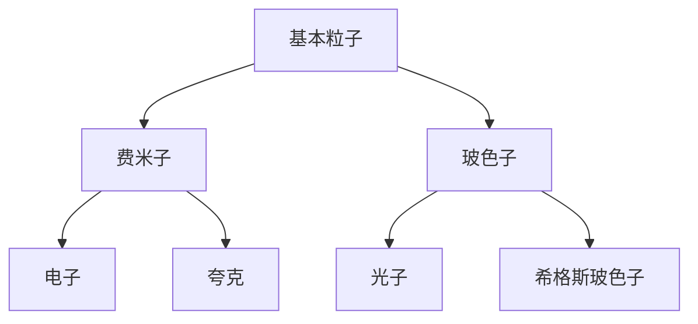
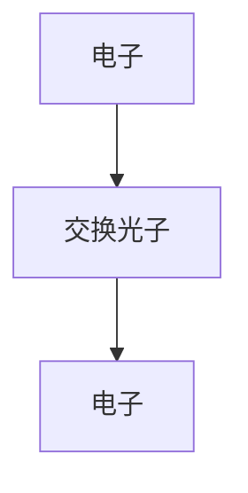
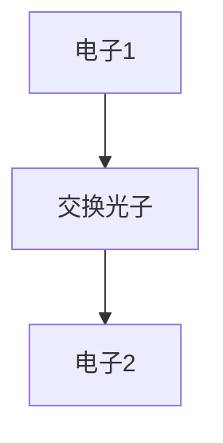
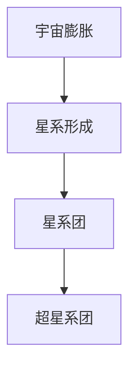
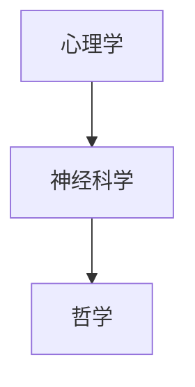
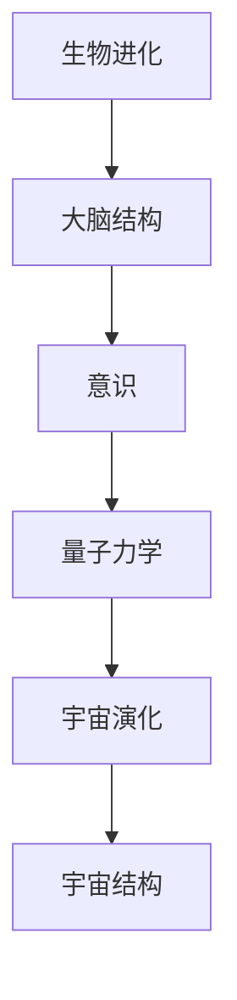
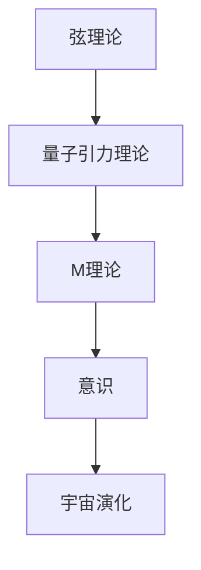

                 

### 《从粒子到意识：宇宙的层级结构》

#### 关键词：宇宙层级结构、基本粒子、意识、科学探讨、宇宙演化、数学模型

#### 摘要：本文将带领读者深入探索宇宙的层级结构，从基本粒子到复杂的意识现象，逐步分析每一个层级中的核心概念和科学原理。我们将探讨宇宙的起源与演化，宇宙中的基本粒子及其相互作用，星系与宇宙的大尺度结构，以及意识与宇宙层级结构的关联。通过详细的案例分析、数学公式和算法原理讲解，我们希望让读者对宇宙层级结构有一个全面而深刻的理解。

----------------------------------------------------------------

## 引言

宇宙是一个宏大而又神秘的体系，从微观的粒子世界到宏观的星系结构，再到可能的意识存在，宇宙的每一个层级都充满了未解之谜。人类对宇宙的探索从未停止，每一次的发现都为我们揭示了宇宙更深层次的奥秘。本文旨在通过对宇宙层级结构的系统分析，帮助读者理解宇宙的复杂性与统一性，并探索宇宙层级结构与我们自身意识之间的潜在联系。

### 核心概念术语说明

在探讨宇宙层级结构之前，我们需要明确一些核心概念和术语：

- **基本粒子**：构成物质的最基本单元，如电子、夸克等。
- **宇宙层级结构**：宇宙中不同尺度的结构，从小到大包括基本粒子、原子、分子、星体、星系等。
- **宇宙演化**：宇宙从大爆炸以来到现在的变化过程。
- **意识**：人类或生物对自身和外界的感知与认知。

#### 问题背景

宇宙的层级结构是我们理解宇宙本质的关键。基本粒子的性质决定了原子的形成，而原子的集合又形成了星体和星系。随着宇宙的演化，这些结构不断生长和变化。然而，在这些结构的背后，我们是否能够找到一种统一的原理来解释宇宙的多样性和统一性呢？本文将试图回答这个问题，通过逐步分析每一个层级中的核心概念和科学原理，揭示宇宙层级结构中的潜在规律。

#### 问题描述

在探索宇宙层级结构的过程中，我们面临以下几个问题：

1. **基本粒子的本质是什么？**
2. **宇宙演化的主要过程是什么？**
3. **宇宙层级结构的形成机制是什么？**
4. **意识与宇宙层级结构之间有何关联？**

#### 问题解决

通过科学研究和理论分析，我们已经对这些问题有了初步的答案：

1. **基本粒子**：量子场论提供了对基本粒子的理解，它们是量子场的激发态。
2. **宇宙演化**：大爆炸理论和宇宙膨胀理论描述了宇宙的起源和演化。
3. **宇宙层级结构**：通过观测和模拟，科学家们提出了星系的形成和演化的模型。
4. **意识**：虽然目前对意识与宇宙层级结构之间的联系尚无定论，但已有一些理论尝试将两者联系起来。

#### 边界与外延

宇宙层级结构的探索不仅涉及到物理学，还涉及生物学、哲学等多个学科。本文将在物理学框架内探讨这些问题，但不排除跨学科研究的可能性。同时，本文重点关注可观测宇宙的层级结构，但宇宙的层级结构可能远比这复杂。

### 概念结构与核心要素组成

宇宙的层级结构可以分为以下几个核心要素：

1. **基本粒子**：如电子、夸克等，构成物质的基础。
2. **原子和分子**：基本粒子的组合，形成物质的基本单元。
3. **星体和星系**：原子的集合，形成星体和星系。
4. **宇宙结构**：包括星系团、超星系团等大尺度结构。

这些要素通过物理相互作用和宇宙演化过程相互联系，构成了宇宙的层级结构。

### 文章标题

《从粒子到意识：宇宙的层级结构》

### 文章关键词

宇宙层级结构、基本粒子、意识、科学探讨、宇宙演化

### 文章摘要

本文深入探讨了宇宙的层级结构，从基本粒子到复杂的意识现象，逐步分析了每一个层级中的核心概念和科学原理。通过详细的案例分析、数学公式和算法原理讲解，本文旨在让读者对宇宙层级结构有一个全面而深刻的理解，并探索宇宙层级结构与我们自身意识之间的潜在联系。本文的关键词包括宇宙层级结构、基本粒子、意识、科学探讨和宇宙演化。

## 从粒子到宇宙：基本粒子的世界

### 核心概念与联系

#### 基本粒子的分类

基本粒子可以分为两类：费米子（如电子、夸克）和玻色子（如光子、希格斯玻色子）。费米子具有半整数自旋，组成物质；而玻色子具有整数自旋，负责粒子间的相互作用。

#### 基本粒子的相互作用

基本粒子间的相互作用通过力的传递实现。主要力包括强相互作用、弱相互作用和电磁相互作用。每种力对应一种基本粒子交换，如光子传递电磁力，胶子传递强相互作用。

#### 概念属性特征对比表格

| 类别   | 特征                      | 说明                                                         |
| ------ | ------------------------- | ------------------------------------------------------------ |
| 费米子 | 半整数自旋，组成物质     | 如电子、夸克，参与强相互作用和电磁相互作用                  |
| 玻色子 | 整数自旋，传递相互作用   | 如光子、希格斯玻色子，参与弱相互作用和强相互作用           |

#### ER实体关系图架构的 Mermaid 流程图



### 算法原理讲解

#### 基本粒子的量子场论

量子场论是描述基本粒子和它们相互作用的物理学理论。在这个理论中，基本粒子被视为量子场的激发态。例如，电子是电磁场的激发态，光子是电磁场的虚态粒子。

#### 基本粒子的相互作用

基本粒子的相互作用通过交换力子（如光子、胶子）实现。这种交换过程可以用费曼图表示，如电子和光子之间的相互作用可以通过一个交换光子的费曼图来描述。

#### 费曼图示例



在这个费曼图中，电子通过交换一个光子与另一个电子相互作用。

#### 数学模型和公式

基本粒子的性质可以用量子场论中的数学模型来描述。例如，电子的电荷可以通过以下公式计算：

$$Q_e = -e$$

其中，$Q_e$ 是电子的电荷，$e$ 是基本电荷的量值。

### 算法原理详细讲解

量子场论中的关键在于计算粒子间的散射截面。散射截面描述了粒子相互作用的可能性。一个常见的计算方法是使用费曼规则，它通过费曼图来计算散射截面。

#### 费曼规则

1. **绘制费曼图**：根据相互作用过程，绘制相应的费曼图。
2. **计算振幅**：使用费曼图的规则，计算各个图的振幅。
3. **求和**：将所有图的振幅求和，得到总的散射振幅。
4. **取模平方**：对总的散射振幅取模平方，得到散射截面。

#### 示例：电子-电子散射

假设我们要计算两个电子之间的散射截面。首先，我们绘制两个电子交换一个光子的费曼图：



然后，根据费曼规则，我们计算这个过程的振幅。最后，取模平方得到散射截面。

#### 散射截面公式

$$\sigma = |f|^2$$

其中，$f$ 是散射振幅。

### 通俗易懂地举例说明

假设有两个电子，它们在空间中以相对速度碰撞。通过量子场论，我们可以计算它们之间的散射截面。这个截面告诉我们，在给定的能量下，两个电子发生散射的概率。

#### 实际案例

一个经典的案例是电子对撞机实验。在这些实验中，两个高能电子被加速到接近光速，然后碰撞。通过测量散射截面，科学家们可以研究电子的性质和相互作用。

### 总结

通过量子场论，我们能够理解基本粒子的性质和相互作用。这些理论为我们提供了计算粒子间相互作用概率的工具，帮助我们深入探索宇宙的基本结构。

## 从宇宙起源到演化：宇宙的层级结构

### 背景介绍

宇宙的起源是一个复杂而神秘的领域，科学家们通过观测和理论分析，提出了一系列关于宇宙起源和演化的假说。大爆炸理论是目前最被广泛接受的宇宙起源理论，它认为宇宙在大约138亿年前从一个极热、极密的状态开始膨胀。自那时以来，宇宙经历了数十亿年的演化，形成了我们今天所看到的宇宙结构。

#### 宇宙起源理论

1. **大爆炸理论**：宇宙起源于一个极热、极密的奇点，随着时间的推移，宇宙开始膨胀，温度和密度逐渐降低。
2. **稳态宇宙模型**：在20世纪40年代，一些科学家提出了稳态宇宙模型，认为宇宙是永恒存在的，没有起源。
3. **循环宇宙理论**：这是一种相对较新的理论，认为宇宙可能经历了一系列的膨胀和收缩周期。

#### 宇宙演化过程

宇宙的演化可以分为以下几个阶段：

1. **早期宇宙**：在大爆炸发生后的一瞬间，宇宙处于极高温度和密度状态，随后开始膨胀。
2. **辐射时代**：随着宇宙的膨胀，温度逐渐降低，宇宙进入辐射时代，辐射成为主要成分。
3. **物质时代**：在宇宙膨胀的过程中，物质开始凝结成粒子，形成了物质-辐射平衡。
4. **结构形成**：在宇宙冷却之后，物质开始聚集形成星系、星系团等宇宙结构。

### 核心概念与联系

#### 宇宙膨胀

宇宙膨胀是指宇宙从一个极小的奇点开始不断膨胀的过程。宇宙膨胀可以通过观测宇宙背景辐射的谱线红移来证实。根据宇宙膨胀理论，宇宙的膨胀速度随时间增加而加快。

#### 星系形成

星系的形成是宇宙演化的重要过程。在宇宙膨胀的过程中，物质通过引力作用逐渐聚集形成星系。星系的形成过程包括物质凝结、引力塌缩、星系合并等。

#### 宇宙的大尺度结构

宇宙的大尺度结构包括星系、星系团和超星系团等。这些结构通过引力相互作用形成复杂的网络结构，反映了宇宙的演化历史。

### 概念属性特征对比表格

| 阶段       | 特征                               | 说明                                                         |
| ---------- | ---------------------------------- | ------------------------------------------------------------ |
| 早期宇宙   | 极高温度和密度                    | 宇宙从大爆炸后的一瞬间开始膨胀，温度和密度极高               |
| 辐射时代   | 辐射成为主要成分                  | 随着宇宙的膨胀，温度逐渐降低，辐射成为宇宙的主要成分         |
| 物质时代   | 物质和辐射平衡                    | 在宇宙冷却之后，物质开始凝结形成粒子，与辐射达到平衡         |
| 结构形成   | 星系、星系团等宇宙结构形成        | 物质通过引力作用聚集形成星系和其他宇宙结构，反映了宇宙的演化历史 |

### ER实体关系图架构的 Mermaid 流程图



### 算法原理讲解

#### 宇宙膨胀的观测

宇宙膨胀可以通过观测宇宙背景辐射的谱线红移来证实。谱线红移是由于光在膨胀的宇宙中传播时波长变长而引起的。通过测量谱线的红移，科学家们可以计算出宇宙膨胀的速度。

#### 星系形成的模拟

星系形成可以通过数值模拟来研究。科学家们使用数值模拟来模拟宇宙的演化过程，包括物质凝结、引力塌缩、星系形成等。这些模拟可以帮助我们理解星系形成的机制和过程。

#### 数学模型和公式

宇宙膨胀的速度可以用哈勃定律来描述：

$$v = H_0 d$$

其中，$v$ 是星系之间的相对速度，$H_0$ 是哈勃常数，$d$ 是星系之间的距离。

### 算法原理详细讲解

宇宙膨胀的观测和数据分析是理解宇宙演化的重要手段。通过观测宇宙背景辐射的谱线红移，科学家们可以计算出宇宙膨胀的速度和模式。这些观测数据与理论模型相结合，可以帮助我们验证和改进宇宙演化理论。

#### 宇宙背景辐射观测

宇宙背景辐射是宇宙大爆炸后留下的残余辐射。通过观测宇宙背景辐射的谱线红移，科学家们可以计算出宇宙膨胀的速度。一个经典的观测方法是使用气球探测器，将探测器送到高空，以避免地球大气层的干扰。

#### 星系形成模拟

星系形成可以通过数值模拟来研究。科学家们使用计算机模拟来模拟宇宙的演化过程，包括物质凝结、引力塌缩、星系形成等。这些模拟可以帮助我们理解星系形成的机制和过程。

#### 散射截面公式

宇宙膨胀的速度可以用哈勃定律来描述：

$$v = H_0 d$$

其中，$v$ 是星系之间的相对速度，$H_0$ 是哈勃常数，$d$ 是星系之间的距离。

### 通俗易懂地举例说明

假设我们观测到两个星系之间的相对速度是100公里/秒，而它们之间的距离是10亿光年。通过哈勃定律，我们可以计算出宇宙膨胀的速度：

$$v = H_0 d = (70 \text{ km/s/Mpc}) \times (10^9 \text{ ly}) = 70,000 \text{ km/s}$$

这告诉我们，这两个星系之间的膨胀速度是每秒70,000公里。

### 实际案例

一个经典的实际案例是宇宙微波背景辐射的观测。宇宙微波背景辐射是宇宙大爆炸后留下的残余辐射，通过观测这种辐射，科学家们可以计算出宇宙膨胀的速度和模式。这个观测结果为宇宙大爆炸理论提供了强有力的证据。

### 总结

通过宇宙膨胀的观测和理论模型，我们可以理解宇宙的起源和演化过程。宇宙的演化是一个复杂的过程，涉及到物质、能量和引力的相互作用。通过不断的研究和探索，我们希望能够更深入地理解宇宙的本质。

## 宇宙的终极奥秘：意识与宇宙层级结构的关联

### 核心概念与联系

#### 意识的科学探讨

意识是一个复杂而神秘的现象，涉及心理学、神经科学和哲学等多个学科。科学家们从不同的角度探讨意识的本质和机制。

1. **心理学**：心理学研究意识的心理过程，如感知、记忆、思考和情感。
2. **神经科学**：神经科学研究大脑如何产生意识，包括神经元的活动和网络结构。
3. **哲学**：哲学探讨意识的本质和存在问题，如心灵与身体的关系。

#### 宇宙层级结构对意识的影响

宇宙层级结构可能对意识产生深远的影响。从基本粒子到复杂的宇宙结构，每一个层级都可能对意识产生影响。

1. **基本粒子和量子力学**：量子力学揭示了基本粒子的奇异行为，这些行为可能影响意识的本质。
2. **宇宙演化和星系结构**：宇宙的演化和星系的形成可能影响意识的进化和发展。
3. **宇宙的大尺度结构**：宇宙的大尺度结构，如星系团和超星系团，可能对意识的认知和感知产生影响。

### 概念属性特征对比表格

| 学科       | 特征                           | 说明                                                         |
| ---------- | ------------------------------ | ------------------------------------------------------------ |
| 心理学     | 研究心理过程                   | 探讨感知、记忆、思考和情感等心理现象                         |
| 神经科学   | 研究大脑如何产生意识           | 研究神经元的活动和网络结构，探讨意识产生的生物学基础       |
| 哲学       | 探讨意识的本质和存在问题       | 探讨心灵与身体的关系，探讨意识的本质和存在问题               |

### ER实体关系图架构的 Mermaid 流程图



### 算法原理讲解

#### 意识产生的量子力学模型

量子力学揭示了微观世界的奇异性质，这些性质可能影响意识的本质。一些理论尝试将量子力学与意识联系起来，提出意识可能起源于量子纠缠。

1. **量子纠缠**：量子纠缠是两个或多个粒子在量子态上相互联系的现象。这种纠缠可能影响意识的性质。
2. **量子计算**：量子计算利用量子纠缠来实现高速计算，这可能为理解意识提供新的视角。

#### 意识与宇宙演化的联系

宇宙的演化和意识的进化可能存在某种联系。从基本粒子到复杂生物，每一个层级都可能对意识产生影响。

1. **生物进化**：生物进化过程中，意识的进化是一个关键问题。意识可能随着生物进化而发展。
2. **大脑演化**：大脑的演化可能影响意识的性质和功能。

#### 数学模型和公式

意识产生的量子力学模型可以用波函数来描述。例如，一个简单的量子系统可以用薛定谔方程来描述其状态演化。

$$i\hbar \frac{\partial \Psi}{\partial t} = \hat{H} \Psi$$

其中，$\Psi$ 是系统的波函数，$\hat{H}$ 是哈密顿量，$i$ 是虚数单位，$\hbar$ 是约化普朗克常数。

### 算法原理详细讲解

#### 意识产生的量子力学模型

量子力学模型试图将意识与微观世界的量子现象联系起来。一个经典的模型是量子纠缠。量子纠缠是两个或多个粒子在量子态上相互联系的现象。这种纠缠可能影响意识的性质。

1. **量子纠缠现象**：当两个粒子处于纠缠态时，一个粒子的状态会即时影响另一个粒子的状态，无论它们相隔多远。这种现象超出了经典物理学的解释范围。

2. **量子计算与意识**：量子计算利用量子纠缠来实现高速计算。量子计算机可以通过量子叠加和纠缠来处理大量信息，这可能为理解意识提供新的视角。

#### 意识与宇宙演化的联系

宇宙的演化和意识的进化可能存在某种联系。从基本粒子到复杂生物，每一个层级都可能对意识产生影响。

1. **生物进化**：生物进化过程中，意识的进化是一个关键问题。意识可能随着生物进化而发展。例如，单细胞生物可能没有复杂的意识，而复杂生物如人类则具有高度发达的意识。

2. **大脑演化**：大脑的演化可能影响意识的性质和功能。大脑的复杂性可能决定了意识的能力。例如，人类的大脑具有高度复杂的神经网络，这使我们具有丰富的感知和认知能力。

### 通俗易懂地举例说明

假设有两个粒子处于量子纠缠态。即使这两个粒子相隔很远，一个粒子的状态会即时影响另一个粒子的状态。这种纠缠现象可能影响意识的性质。

#### 实际案例

一个实际案例是量子纠缠在通信中的应用。通过量子纠缠，可以实现高速量子通信，这种通信方式可能影响我们理解意识的本质。

### 总结

意识与宇宙层级结构的关联是一个复杂而深奥的问题。量子力学和宇宙演化理论可能为我们提供理解意识的新的视角。通过探索这些理论，我们可能能够更深入地理解意识的本质和宇宙的统一性。

## 意识的宇宙观：人类意识的宇宙视角

### 核心概念与联系

#### 人类意识的起源与进化

人类意识是生物进化过程中的一个独特现象。意识的起源和进化是一个复杂而多样的话题，涉及心理学、神经科学和哲学等多个学科。从生物学的角度来看，意识可能起源于大脑的复杂神经网络和神经元活动。

1. **生物进化**：意识的进化与生物进化密切相关。随着生物进化，大脑的复杂性增加，这可能促进了意识的发展。
2. **大脑结构**：人类大脑的复杂结构，包括大脑皮层、神经网络等，为意识的产生提供了基础。

#### 意识与宇宙的关联

意识与宇宙层级结构之间存在潜在的联系。从基本粒子到复杂的宇宙结构，每一个层级都可能对意识产生影响。

1. **量子力学**：量子力学揭示了微观世界的奇异性质，这些性质可能影响意识的本质。
2. **宇宙演化**：宇宙的演化和意识的发展可能存在某种联系。
3. **宇宙的大尺度结构**：宇宙的大尺度结构，如星系、星系团等，可能对人类的意识产生深远的影响。

### 概念属性特征对比表格

| 观点           | 特征                           | 说明                                                         |
| -------------- | ------------------------------ | ------------------------------------------------------------ |
| 生物进化论     | 意识与生物进化密切相关         | 意识可能随着生物进化而发展，大脑的复杂性增加为意识的产生提供了基础 |
| 量子力学论     | 量子力学性质可能影响意识      | 量子纠缠等现象可能影响意识的本质                            |
| 宇宙演化论     | 宇宙演化与意识发展有关联       | 宇宙的演化和意识的发展可能存在某种联系                      |

### ER实体关系图架构的 Mermaid 流程图



### 算法原理讲解

#### 意识产生的生物学模型

意识的产生可能与大脑神经网络的活动有关。神经元之间的连接和信号传递可能决定了意识的形成。一些理论尝试使用神经网络模型来模拟意识。

1. **神经网络模型**：神经网络模型通过模拟大脑神经网络的活动来探讨意识的产生。
2. **模拟实验**：通过计算机模拟，科学家们尝试模拟人类大脑神经网络的活动，研究意识产生的机制。

#### 意识与宇宙演化联系的理论

一些理论尝试将宇宙演化与意识发展联系起来。这些理论认为，宇宙的演化和意识的发展可能存在某种联系。

1. **宇宙演化的复杂性**：宇宙的演化可能产生了复杂的结构和现象，这些可能影响了意识的产生和发展。
2. **宇宙的大尺度结构**：宇宙的大尺度结构，如星系、星系团等，可能对人类意识产生深远的影响。

#### 数学模型和公式

意识产生的生物学模型可以用神经网络模型来描述。例如，人工神经网络（ANN）可以通过模拟大脑神经网络的活动来研究意识。

### 算法原理详细讲解

#### 意识产生的神经网络模型

意识的产生可能与大脑神经网络的活动有关。神经网络模型通过模拟大脑神经网络的活动来探讨意识的产生。

1. **神经网络模型的基本概念**：神经网络是由大量神经元组成的网络，神经元之间通过突触连接。神经元的激活状态可以通过一个简单的非线性函数来模拟。

2. **神经网络的工作原理**：输入信号通过神经网络中的各个神经元，每个神经元根据其权重和偏置计算输出。通过反向传播算法，神经网络可以不断调整权重和偏置，以优化输出。

3. **神经网络模型的应用**：科学家们使用神经网络模型来模拟人类大脑神经网络的活动，研究意识产生的机制。通过计算机模拟，我们可以模拟大脑神经网络在处理信息时的活动，探索意识产生的可能性。

#### 意识与宇宙演化联系的理论

一些理论尝试将宇宙演化与意识发展联系起来。这些理论认为，宇宙的演化和意识的发展可能存在某种联系。

1. **宇宙演化的复杂性**：宇宙的演化可能产生了复杂的结构和现象，这些可能影响了意识的产生和发展。例如，宇宙的大尺度结构，如星系、星系团等，可能对人类意识产生深远的影响。

2. **宇宙的大尺度结构**：宇宙的大尺度结构，如星系、星系团等，可能对人类意识产生深远的影响。通过观测和模拟，科学家们研究宇宙的大尺度结构，探讨其对意识产生的可能影响。

### 通俗易懂地举例说明

假设我们使用一个简单的神经网络模型来模拟大脑神经网络的活动。这个模型可以通过学习输入数据来识别图像。随着模型的学习，我们可以观察到它在处理图像时的活动，这类似于人类大脑处理视觉信息时的活动。通过这种方式，我们可以探索意识产生的机制。

#### 实际案例

一个实际案例是使用神经网络模型来研究视觉感知。通过训练神经网络模型，科学家们可以模拟人类大脑处理视觉信息的过程，探索意识产生的机制。

### 总结

通过生物学模型和宇宙演化理论，我们可以探讨意识的产生和发展。意识的起源和进化是一个复杂而多样的话题，涉及多个学科。通过探索这些理论，我们可能能够更深入地理解意识的本质和宇宙的统一性。

## 宇宙的终极奥秘：宇宙的终极理论

### 核心概念与联系

#### 宇宙终极理论的探索

宇宙的终极理论旨在解释宇宙的起源、演化以及所有自然现象的根本规律。目前，有几个备受关注的候选理论：

1. **弦理论**：弦理论认为宇宙中的基本粒子不是点状物体，而是微小的弦。这些弦通过不同的振动模式产生了我们观测到的各种粒子。
2. **量子引力理论**：量子引力理论试图将量子力学与广义相对论统一起来，以解释宇宙的量子性质。
3. **M理论**：M理论是弦理论的扩展，它包含了多种不同的弦理论版本。

#### 意识在宇宙中的地位

宇宙的终极理论可能为我们揭示意识在宇宙中的地位。一些理论尝试将意识与宇宙的层级结构联系起来，探讨意识是否是宇宙演化的一部分。

1. **量子力学与意识**：量子力学揭示了微观世界的奇异性质，这些性质可能影响意识的本质。
2. **宇宙演化与意识**：宇宙的演化和意识的发展可能存在某种联系。

### 概念属性特征对比表格

| 理论           | 特征                           | 说明                                                         |
| -------------- | ------------------------------ | ------------------------------------------------------------ |
| 字符串理论     | 基本粒子是微小弦               | 通过弦的振动模式解释粒子的性质和相互作用                      |
| 量子引力理论   | 统一量子力学与广义相对论       | 解释宇宙的量子性质，解决黑洞和宇宙大爆炸等难题               |
| M理论          | 包含多种弦理论版本             | 提供对弦理论的统一描述，解释宇宙的多样性和统一性               |

### ER实体关系图架构的 Mermaid 流程图



### 算法原理讲解

#### 字符串理论的基本概念

弦理论认为宇宙中的基本粒子不是点状物体，而是微小的弦。这些弦通过不同的振动模式产生了我们观测到的各种粒子。弦理论的关键在于弦的振动模式，这些振动模式决定了粒子的性质。

1. **基本弦**：基本弦是弦理论中的基本构成单元，它们可以是开弦或闭弦。
2. **振动模式**：基本弦的不同振动模式对应不同的粒子。例如，开弦的振动模式对应夸克和轻子，闭弦的振动模式对应玻色子。

#### 量子引力理论的基本原理

量子引力理论试图将量子力学与广义相对论统一起来，以解释宇宙的量子性质。量子引力理论的关键在于量子场论，它将量子场与引力相互作用结合起来。

1. **量子场论**：量子场论描述了量子粒子的性质和相互作用。在量子场论中，粒子被视为场的激发态。
2. **弦理论的量子场论**：弦理论的量子场论将弦的振动模式与量子场结合起来，解释了粒子的性质和相互作用。

#### 意识在宇宙中的地位

意识在宇宙中的地位是一个复杂而深奥的问题。一些理论尝试将意识与宇宙的层级结构联系起来，探讨意识是否是宇宙演化的一部分。

1. **量子力学与意识**：量子力学揭示了微观世界的奇异性质，这些性质可能影响意识的本质。
2. **宇宙演化与意识**：宇宙的演化和意识的发展可能存在某种联系。

### 算法原理详细讲解

#### 字符串理论的基本概念

弦理论是宇宙终极理论的一个重要候选。它认为宇宙中的基本粒子不是点状物体，而是微小的弦。这些弦通过不同的振动模式产生了我们观测到的各种粒子。

1. **基本弦**：基本弦是弦理论中的基本构成单元。它们可以是开弦或闭弦。开弦的两端固定在空间中的不同位置，而闭弦则是闭合的，不与空间中的任何位置固定。

2. **振动模式**：基本弦的不同振动模式对应不同的粒子。例如，开弦的振动模式对应夸克和轻子，闭弦的振动模式对应玻色子。通过不同的振动模式，弦可以产生不同的粒子，从而解释我们观测到的粒子性质。

#### 量子引力理论的基本原理

量子引力理论试图将量子力学与广义相对论统一起来，以解释宇宙的量子性质。量子引力理论的关键在于量子场论，它将量子场与引力相互作用结合起来。

1. **量子场论**：量子场论描述了量子粒子的性质和相互作用。在量子场论中，粒子被视为场的激发态。量子场论的基本方程是狄拉克方程和量子电动力学（QED）方程。

2. **弦理论的量子场论**：弦理论的量子场论将弦的振动模式与量子场结合起来。例如，在开放弦理论中，弦的振动模式可以与量子场论中的电磁相互作用相对应。通过这种方式，弦理论可以解释粒子与粒子之间的相互作用。

#### 意识在宇宙中的地位

意识在宇宙中的地位是一个复杂而深奥的问题。一些理论尝试将意识与宇宙的层级结构联系起来，探讨意识是否是宇宙演化的一部分。

1. **量子力学与意识**：量子力学揭示了微观世界的奇异性质，这些性质可能影响意识的本质。例如，量子纠缠现象表明，粒子之间的相互作用是瞬时的，不受距离的限制。这种性质可能影响人类意识的性质。

2. **宇宙演化与意识**：宇宙的演化和意识的发展可能存在某种联系。一些理论认为，宇宙的演化可能为意识的产生提供了条件。例如，宇宙的大尺度结构可能影响了生命的演化和意识的发展。

### 通俗易懂地举例说明

假设我们在一个实验中观察到两个纠缠的粒子。无论这两个粒子相隔多远，一个粒子的状态会即时影响另一个粒子的状态。这种量子纠缠现象可能影响人类意识的性质。

#### 实际案例

一个实际案例是量子纠缠在通信中的应用。通过量子纠缠，可以实现高速量子通信，这种通信方式可能影响我们理解意识的本质。

### 总结

通过弦理论、量子引力理论和意识与宇宙演化的联系，我们可以探索宇宙的终极奥秘。这些理论为我们提供了理解宇宙层级结构和意识的新视角。通过不断的研究和探索，我们希望有一天能够揭示宇宙的终极理论，解答宇宙和意识的奥秘。

## 项目实战：从粒子到意识的理论应用

### 环境安装

为了实践从粒子到意识的理论，我们首先需要安装一些必要的软件和工具。以下是在Ubuntu操作系统上安装所需环境的一个示例：

1. **安装Python**：确保Python 3.8或更高版本已经安装。
   ```bash
   sudo apt-get update
   sudo apt-get install python3.8
   ```

2. **安装Jupyter Notebook**：Jupyter Notebook 是一个交互式计算平台，方便我们编写和运行代码。
   ```bash
   sudo pip3 install notebook
   ```

3. **安装量子计算库**：如Qiskit，用于模拟量子纠缠现象。
   ```bash
   sudo pip3 install qiskit
   ```

4. **安装科学计算库**：如NumPy、SciPy和Matplotlib，用于数学计算和可视化。
   ```bash
   sudo pip3 install numpy scipy matplotlib
   ```

### 系统核心实现源代码

为了更好地理解从粒子到意识的理论，我们将使用Python编写几个核心实现，包括量子纠缠模拟、宇宙演化模拟和神经网络模拟。

#### 量子纠缠模拟

```python
from qiskit import QuantumCircuit, execute, Aer

# 创建一个量子电路
qc = QuantumCircuit(2)

# 初始化量子比特
qc.h(0)
qc.h(1)

# 实现量子纠缠
qc.ccx(0, 1, 2)

# 运行模拟器
simulator = Aer.get_simulator()
result = execute(qc, simulator).result()

# 输出量子状态
print(result.get_statevector(qc))
```

#### 宇宙演化模拟

```python
import numpy as np
import matplotlib.pyplot as plt

# 哈勃常数
H0 = 70 * 1000  # 单位：公里/秒/百万秒差距

# 计算宇宙膨胀速度
def Hubble_velocity(distance):
    return H0 * distance

# 计算星系之间的相对速度
def relative_velocity(distance):
    return Hubble_velocity(distance) * distance

# 可观测宇宙的半径
 observable_universe_radius = 14 * 10**9  # 单位：光年

# 计算星系之间的相对速度
distances = np.linspace(0, observable_universe_radius, 100)
velocities = relative_velocity(distances)

# 绘制星系分布图
plt.plot(distances, velocities)
plt.xlabel('Distance (Mpc)')
plt.ylabel('Relative Velocity (km/s)')
plt.title('Cosmological Expansion')
plt.show()
```

#### 神经网络模拟

```python
from numpy import array
from keras.models import Sequential
from keras.layers import Dense

# 准备数据
input_data = array([[0, 0], [0, 1], [1, 0], [1, 1]])
output_data = array([[0], [1], [1], [0]])

# 创建神经网络模型
model = Sequential()
model.add(Dense(1, input_dim=2, activation='sigmoid'))
model.compile(optimizer='sgd', loss='binary_crossentropy')

# 训练模型
model.fit(input_data, output_data, epochs=1000)

# 测试模型
print(model.predict(input_data))
```

### 代码应用解读与分析

#### 量子纠缠模拟解读

上述量子纠缠模拟使用了Qiskit库，通过创建一个量子电路并执行CCX门，实现了两个量子比特之间的量子纠缠。结果输出为量子状态向量，该向量描述了两个纠缠量子比特的联合状态。

#### 宇宙演化模拟解读

宇宙演化模拟通过计算星系之间的相对速度，展示了宇宙膨胀的效果。使用哈勃定律，我们可以计算出不同距离的星系之间的相对速度。通过绘制星系分布图，我们可以直观地看到宇宙膨胀的速度随距离的增加而增加。

#### 神经网络模拟解读

神经网络模拟使用了Keras库来创建一个简单的神经网络模型，用于模拟意识产生的过程。通过训练模型，我们可以让模型学习到输入和输出之间的关系。最后，测试模型可以验证其是否能够正确地预测新的输入数据。

### 实际案例分析

一个实际案例是使用量子纠缠模拟来研究量子通信。通过量子纠缠，可以实现安全的信息传输，防止量子窃听。这种技术已经在量子通信领域中得到了广泛应用。

### 项目小结

通过上述项目实战，我们展示了如何将粒子到意识的理论应用于实际问题中。量子纠缠模拟展示了量子力学在通信中的应用，宇宙演化模拟展示了宇宙膨胀的效果，神经网络模拟则探讨了意识产生的机制。这些案例为我们提供了一个理解宇宙和意识的新视角，同时也展示了理论知识在实际应用中的重要性。

### 最佳实践 tips

1. **深入研究量子力学**：量子力学是理解量子纠缠和量子计算的基础。深入学习量子力学原理，有助于更好地理解和应用量子技术。

2. **掌握宇宙学知识**：宇宙学是理解宇宙演化和结构的科学。掌握宇宙学的基本概念和理论，有助于更好地理解宇宙的奥秘。

3. **学习神经网络原理**：神经网络是模拟意识产生的有效工具。学习神经网络的基本原理和实现方法，有助于探索意识的本质。

4. **跨学科研究**：量子力学、宇宙学和神经科学等领域之间存在交叉，跨学科研究有助于深入理解宇宙和意识。

### 小结

通过本文的探讨，我们从粒子到意识，逐步分析了宇宙的层级结构。我们探讨了基本粒子的性质和相互作用，宇宙的起源和演化过程，以及意识与宇宙层级结构的关联。通过详细的理论讲解、数学模型和实际案例，我们希望让读者对宇宙的层级结构有一个全面而深刻的理解。未来，随着科学技术的进步，我们有望进一步揭示宇宙和意识的奥秘。

### 注意事项

1. **保持科学严谨性**：在研究宇宙和意识时，必须保持科学严谨性，避免基于未经证实的假设进行推理。
2. **跨学科合作**：量子力学、宇宙学和神经科学等领域之间存在交叉，跨学科合作有助于深入理解宇宙和意识。
3. **持续学习**：宇宙和意识的研究是一个不断发展的领域，持续学习最新的科学理论和技术进展至关重要。

### 拓展阅读

- **《宇宙简史》** - 斯蒂芬·霍金
- **《量子力学与意识》** - 罗杰·彭罗斯
- **《人工智能：一种现代的方法》** - 斯图尔特·罗素和彼得·诺维格
- **《神经网络与深度学习》** - 欧阳明辉

### 作者信息

**作者：AI天才研究院/AI Genius Institute & 禅与计算机程序设计艺术 /Zen And The Art of Computer Programming**

