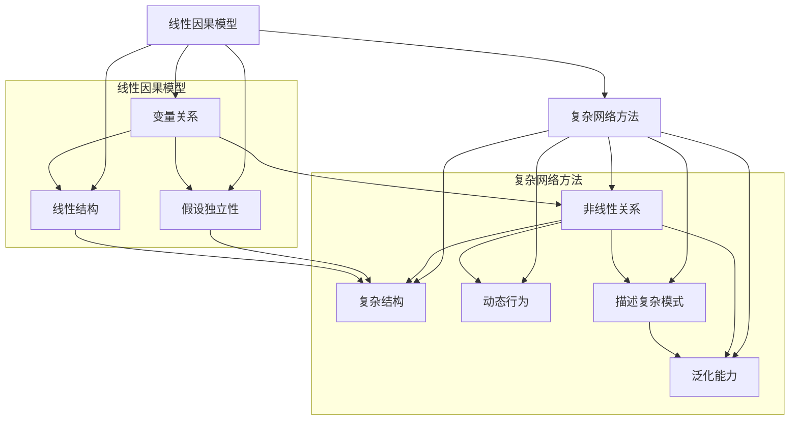
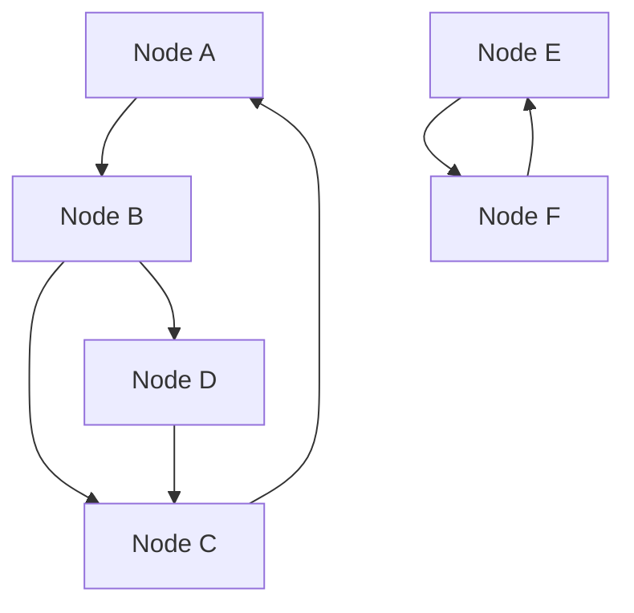
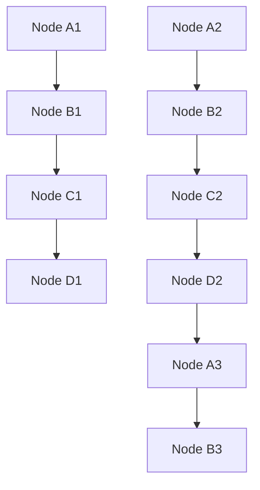
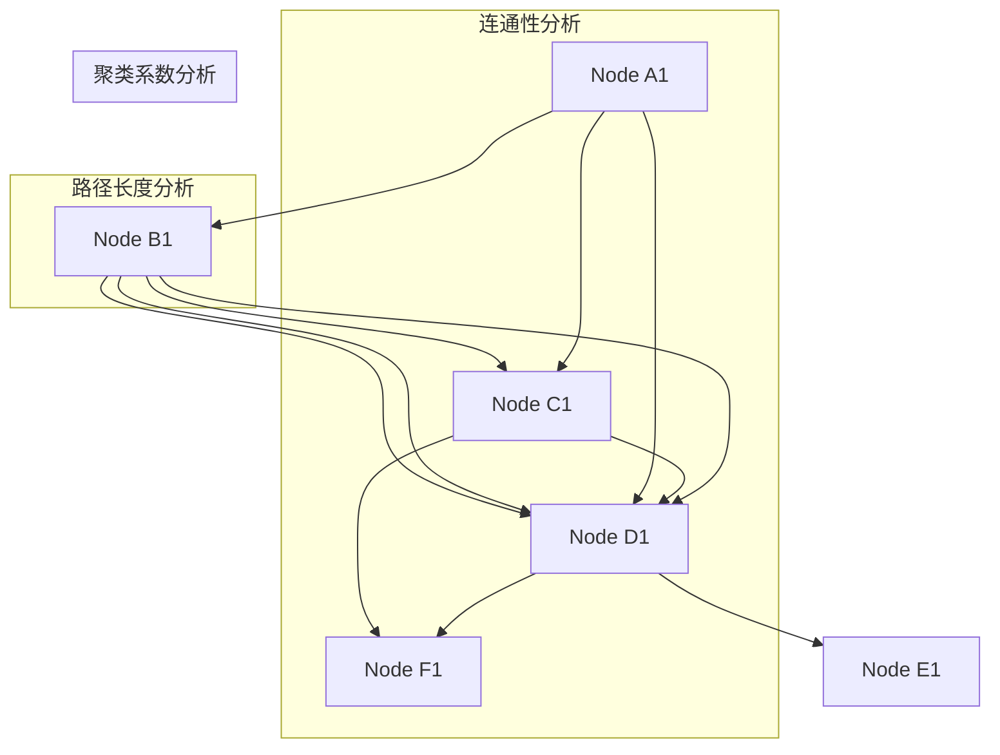
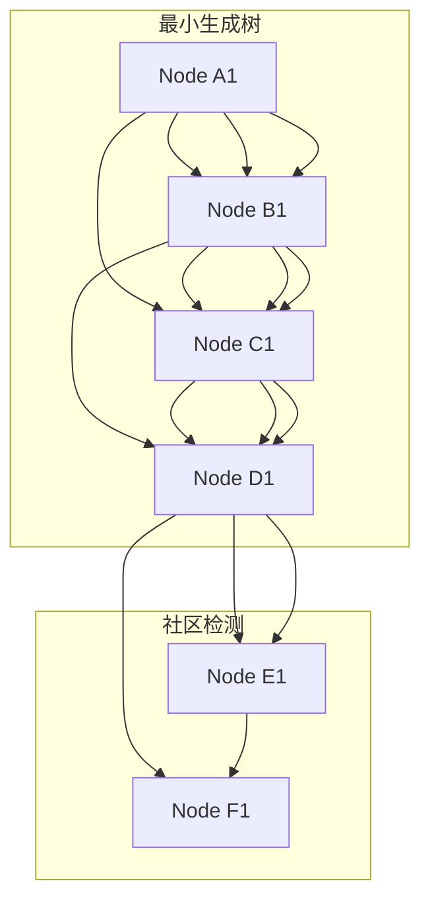
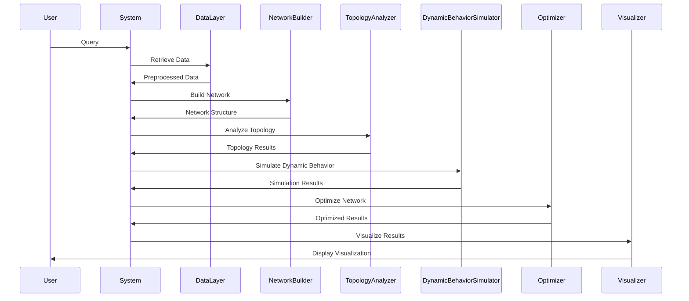
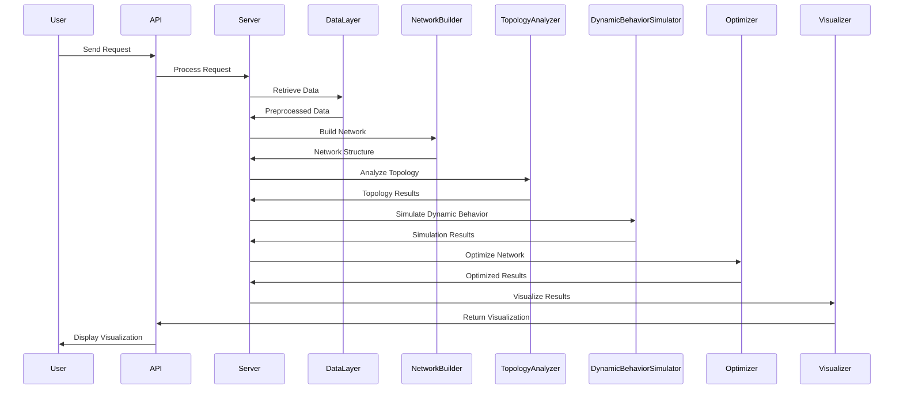

                 

### 第1章: 引言与背景

#### 1.1 问题的提出

在现代社会，信息技术和数据分析的发展使得我们能够收集到大量的数据。然而，随着数据规模的不断扩大和数据来源的多样性增加，传统基于线性因果的方法在理解和分析复杂系统中遇到了诸多挑战。例如，在社会网络分析中，人与人之间的互动关系是复杂且多维度的；在生物医学领域，基因与疾病之间的关系并非简单的线性关系；在经济学中，市场行为和宏观经济变量的关联也常常是非线性的。线性因果模型在这些场景下往往无法准确捕捉问题的本质。

为了应对这些挑战，研究者们开始探索新的方法，即通过构建复杂网络来分析多因素世界。复杂网络是一种抽象模型，它通过节点和边来表示系统中的实体及其相互作用。这种方法能够捕捉系统内部的非线性关系，揭示出潜在的复杂模式和规律，从而为我们提供更为全面和深入的理解。

#### 1.2 线性因果的局限性

线性因果模型，如回归分析，依赖于变量之间的线性关系，这对于简单系统或静态环境中的问题效果显著。然而，它在面对复杂系统时却显得力不从心。以下是线性因果模型的一些主要局限性：

1. **忽视非线性关系**：线性模型不能捕捉变量间的非线性关系，这在复杂系统中非常普遍。
2. **假设独立性**：线性模型假设变量之间相互独立，而现实世界中的系统往往存在复杂的相互依赖关系。
3. **泛化能力有限**：线性模型在处理大规模数据时，容易因为过拟合而失去泛化能力。
4. **无法揭示复杂模式**：线性模型难以捕捉复杂系统的动态行为和潜在模式。

因此，为了更准确地理解和预测复杂系统的行为，我们需要转向复杂网络分析方法，这是一种能够更好地描述和处理现实世界中复杂关系的工具。

#### 1.3 复杂网络的概念与意义

复杂网络是一种由大量节点（实体）及其相互作用（边）构成的图形结构，其研究始于20世纪中期，随着计算机技术的进步和大数据时代的到来，复杂网络理论得到了迅速发展。复杂网络具有以下几个核心特征：

1. **网络结构**：复杂网络不是简单的随机网络，而是具有高度结构化的特征，如小世界效应和无标度性。
2. **节点与边**：节点代表系统中的个体，边表示个体之间的相互作用或关系。
3. **动态行为**：复杂网络中的节点和边可以随时间变化，从而表现出动态行为。
4. **涌现现象**：复杂网络中往往会出现个体行为无法解释的整体现象，如网络中信息传播的速度和范围。

复杂网络研究的意义在于：

1. **揭示复杂系统的规律**：通过复杂网络分析，我们可以揭示复杂系统中的潜在模式和规律，如社会网络中的传播规律、生物网络中的基因调控机制。
2. **优化系统性能**：复杂网络分析有助于优化系统的结构和参数，提高系统的稳定性、效率和鲁棒性。
3. **指导决策制定**：在经济学、社会学、生物医学等领域，复杂网络分析可以为决策者提供有价值的洞察，支持科学决策。

综上所述，复杂网络为理解多因素世界提供了一种新的方法和工具，它不仅有助于我们更全面地描述复杂系统的行为，还为解决现实问题提供了新的思路和途径。

### 1.4 研究现状与未来展望

复杂网络研究在过去几十年中取得了显著的进展，但在实际应用中仍然面临许多挑战。目前，复杂网络研究主要集中在以下几个方面：

1. **网络结构的分析**：如何从大规模数据中提取网络结构特征，如网络拓扑性质、社区结构等。
2. **动态行为建模**：研究网络中节点的动态行为，如信息传播、同步现象、涌现行为等。
3. **网络优化与控制**：设计算法来优化网络性能，如网络流优化、节点调度等。
4. **应用研究**：在多个领域，如社会网络、生物网络、经济网络等，开展复杂网络的应用研究。

未来，复杂网络研究有望在以下几个方面取得进一步突破：

1. **跨领域融合**：将复杂网络方法与其他学科相结合，如机器学习、人工智能等，以解决更多现实问题。
2. **大数据处理**：发展高效的算法和工具，处理大规模、高维度、动态变化的复杂网络数据。
3. **理论创新**：提出新的理论框架和模型，以更好地解释复杂网络中的现象和规律。

总之，复杂网络研究为我们理解多因素世界提供了一种新的视角和方法，其应用前景广阔，值得我们进一步探索和深入研究。

### 1.5 总结与展望

在本章中，我们首先提出了复杂网络研究的背景和意义，指出了线性因果模型的局限性，并介绍了复杂网络的基本概念和核心特征。接着，我们简要概述了复杂网络研究的现状与未来展望，强调了其在揭示复杂系统规律和优化系统性能方面的潜力。

为了进一步深入理解复杂网络，接下来的章节将详细探讨复杂网络的构建与表示方法、基本分析算法、数学模型及其应用实践。通过这些内容的逐步展开，我们希望能够帮助读者全面掌握复杂网络分析方法，并为其在实际问题中的应用提供理论支持和实践指导。

### 第2章: 复杂网络与线性因果的核心概念

#### 2.1 复杂网络的基本概念

复杂网络是一种用于描述现实世界中复杂系统相互作用的图形模型。在这个模型中，节点表示系统中的个体，而边则表示个体之间的相互作用或关系。复杂网络与线性因果模型相比，具有几个显著的特点：

1. **节点与边的定义**：节点代表个体，如社会网络中的个人、生物网络中的基因等；边表示个体之间的关系，可以是互动、依赖或影响。
2. **网络结构**：复杂网络的拓扑结构不是随机或简单的，而是具有高度结构化特征，如小世界效应、无标度性等。
3. **动态行为**：复杂网络中的节点和边可以随时间变化，表现出动态行为，如信息传播、同步现象等。
4. **涌现现象**：复杂网络中个体行为的简单规则可以导致整体系统涌现出复杂的宏观现象。

与线性因果模型相比，复杂网络能够更好地捕捉现实世界中个体间复杂、动态的相互作用，从而提供更深入的理解。

#### 2.2 线性因果与复杂网络的对比

线性因果模型主要基于变量之间的线性关系，通过回归分析等方法来描述和预测系统行为。这种方法在简单系统中效果显著，但在面对复杂系统时，存在以下局限性：

1. **忽视非线性关系**：线性模型不能捕捉变量之间的非线性关系，这在复杂系统中非常普遍。
2. **假设独立性**：线性模型假设变量之间相互独立，而现实世界中的系统往往存在复杂的相互依赖关系。
3. **泛化能力有限**：线性模型在处理大规模数据时，容易因为过拟合而失去泛化能力。
4. **无法揭示复杂模式**：线性模型难以捕捉复杂系统的动态行为和潜在模式。

复杂网络方法则通过构建网络模型，能够有效地描述和处理复杂系统中的非线性关系和动态行为。具体对比如下：

| 对比维度 | 线性因果模型 | 复杂网络方法 |
| --- | --- | --- |
| 变量关系 | 假设变量之间线性关系 | 考虑变量间的复杂非线性关系 |
| 网络结构 | 简单线性结构 | 高度结构化的网络结构 |
| 动态行为 | 静态分析 | 动态行为建模 |
| 泛化能力 | 易于过拟合 | 较强的泛化能力 |
| 描述能力 | 难以捕捉复杂模式 | 能够揭示复杂模式 |

通过对比可以看出，复杂网络方法在处理复杂系统中具有明显的优势。

#### 2.3 核心概念的关系图

为了更直观地理解复杂网络与线性因果模型之间的联系与区别，我们可以使用Mermaid图来绘制核心概念的关系图。以下是一个简单的Mermaid图示例：



通过这个Mermaid图，我们可以清晰地看到线性因果模型与复杂网络方法在核心概念上的对比和联系。图中的节点表示核心概念，而边表示概念之间的关系。这种方法有助于我们更好地理解两者之间的异同，为进一步的学习和应用提供指导。

### 2.4 小结与总结

在本章中，我们介绍了复杂网络的基本概念及其与线性因果模型的对比。通过定义节点和边，以及描述复杂网络的几个关键特征，我们为理解复杂系统提供了一个新的视角。与线性因果模型相比，复杂网络方法能够更好地捕捉复杂系统中的非线性关系和动态行为。通过Mermaid图，我们直观地展示了两者之间的异同，为进一步的学习和应用奠定了基础。在接下来的章节中，我们将深入探讨复杂网络的构建与表示方法，以及其基本分析算法，以期更全面地掌握复杂网络分析方法。

### 第3章: 复杂网络的构建与表示

#### 3.1 复杂网络的构建方法

构建复杂网络是研究复杂系统的第一步，也是理解复杂系统行为的关键。复杂网络的构建方法主要包括以下几种：

1. **实验观测法**：通过实地调查或实验来收集数据，构建网络。这种方法常用于社会网络分析和生物网络研究。例如，通过对社交平台的数据分析，可以构建人际关系网络。
2. **模型构建法**：根据系统理论和物理学原理，构建数学模型来描述复杂系统的相互作用，从而生成网络。例如，通过随机游走模型或无标度网络模型，可以模拟现实世界中的复杂网络。
3. **数据驱动法**：利用现有的数据集，通过机器学习和数据挖掘技术来识别和提取网络结构。这种方法在生物信息学和互联网分析中广泛应用。

在选择构建方法时，需要考虑数据的可获得性、研究的具体目标和系统的特性。实验观测法虽然数据真实，但成本较高且难以覆盖大规模系统；模型构建法提供了理论支持，但可能无法完全反映现实复杂性；数据驱动法则在处理大规模数据时表现出色，但需要依赖高质量的输入数据。

#### 3.2 网络表示与可视化

复杂网络的表示和可视化是理解和分析复杂系统的重要手段。以下是几种常用的网络表示与可视化方法：

1. **图论表示**：使用图（Graph）来表示网络，其中节点（Node）表示个体，边（Edge）表示个体之间的相互作用。这种方法在理论和计算上都具有很强的优势，是复杂网络研究的基础。
2. **矩阵表示**：将网络转化为矩阵形式，例如邻接矩阵（Adjacency Matrix）和拉普拉斯矩阵（Laplacian Matrix）。这种表示方法便于进行数学运算和算法设计。
3. **可视化工具**：使用各种图形和可视化工具，如Gephi、Cytoscape等，将网络以图形化的方式展示出来。这些工具提供了丰富的交互功能，有助于直观地理解网络结构和模式。

网络可视化的关键在于如何有效地展示大量的节点和边，同时保持图形的可读性。常用的可视化技术包括：
- **层次化布局**：将网络按照层次或社区结构进行布局，使得节点之间的关系更加清晰。
- **颜色和形状区分**：使用不同的颜色和形状来表示不同类型的节点或边，提高图形的可区分性。
- **动态可视化**：通过动画或交互方式展示网络的演变过程，帮助理解网络动态行为。

以下是一个简单的Mermaid图示例，展示了一个简单的复杂网络及其可视化：



在这个例子中，节点表示个体，边表示个体之间的相互作用。通过使用不同的颜色和形状，我们可以直观地展示不同类型的节点和关系。

#### 3.3 网络类型与特点

复杂网络根据其结构特征和功能可以分为多种类型，每种类型都有其独特的特点和适用场景。以下是几种常见的网络类型：

1. **无标度网络（Scale-Free Network）**：这种网络的特征是节点度分布呈现出长尾分布，即大部分节点度较小，而少数节点度非常大。这种网络常见于互联网、社会网络和生物网络。无标度网络的优点是具有高度的容错性和灵活性，但缺点是容易出现关键节点失效的问题。
2. **小世界网络（Small-World Network）**：这种网络的特征是短路径长度和高度聚类，即大多数节点可以通过少量的中间节点相互连接，同时网络中存在较强的社区结构。小世界网络常见于社交网络和通信网络。其优点是信息传播速度快，但聚类结构可能导致局部稳定性问题。
3. **模块化网络（Modular Network）**：这种网络的特征是节点被划分为多个模块，模块之间通过少量边连接，模块内部则通过大量边连接。模块化网络常见于生物网络和社会网络。其优点是提高了系统的灵活性和可扩展性，但可能导致信息孤岛问题。

每种网络类型都有其独特的结构和功能，研究者可以根据具体问题的需求选择合适的网络类型。以下是一个简单的Mermaid图示例，展示了一个无标度网络：



在这个例子中，我们可以看到大部分节点度较小，但存在一些节点度较大的情况，这符合无标度网络的特征。

### 3.4 小结

在本章中，我们详细介绍了复杂网络的构建方法、网络表示与可视化技术以及几种常见的网络类型和特点。通过实验观测、模型构建和数据驱动等方法，我们可以有效地构建复杂网络。使用图论表示、矩阵表示和可视化工具，我们可以直观地展示和分析网络结构。了解不同类型的网络及其特点，有助于我们选择合适的方法来研究特定问题。在接下来的章节中，我们将深入探讨复杂网络分析的基本算法，为理解复杂系统的行为提供更深入的见解。

### 第4章: 复杂网络分析的基本算法

#### 4.1 网络拓扑性质分析

复杂网络的拓扑性质分析是研究复杂系统行为的关键步骤。拓扑性质指的是网络节点之间的连接关系和结构特征，如连通性、路径长度、聚类系数等。以下是一些常用的拓扑性质分析方法：

1. **连通性分析**：衡量网络中任意两个节点之间是否可以通过一条路径相互连接。常用的指标有连通度（Connectivity）、直径（Diameter）和平均路径长度（Average Path Length）。连通性高的网络具有较高的稳定性和鲁棒性，但也可能面临信息过载问题。

2. **路径长度分析**：研究网络中任意两个节点之间的最短路径长度。平均路径长度越短，网络的信息传递速度越快。计算平均路径长度时，可以采用广度优先搜索（BFS）或深度优先搜索（DFS）算法。

3. **聚类系数分析**：衡量网络中节点之间的局部连接紧密程度。聚类系数（Clustering Coefficient）定义为节点的邻居节点中，邻居节点之间相互连接的概率。高聚类系数表示网络具有较强的社区结构，有助于信息在社区内的快速传播。

以下是一个简单的Mermaid图示例，展示了一个复杂网络的拓扑性质分析：



在这个例子中，我们可以看到节点之间的连接关系，并通过路径长度和聚类系数等指标分析网络的拓扑性质。

#### 4.2 网络动态行为分析

复杂网络中的动态行为分析是指研究网络随时间变化的动态过程，如信息传播、同步现象和涌现行为。以下是一些常用的动态行为分析方法：

1. **信息传播模型**：研究网络中信息如何从一个节点传播到其他节点。常用的模型有病毒传播模型（SIR模型）、优势模型（Majority Model）和增强模型（Enhanced Model）等。这些模型通过模拟节点的状态转移过程，分析信息传播的速度和范围。

2. **同步现象分析**：研究网络中节点的状态如何通过相互作用达到同步。常见的同步现象有相位同步和频率同步。分析方法包括线性稳定性分析和全局同步判定等。

3. **涌现行为分析**：研究个体行为简单规则导致整体系统涌现出复杂行为的现象。涌现行为分析通常采用计算模拟方法，通过模拟大量节点的相互作用，观察整体系统的行为模式。

以下是一个简单的Mermaid图示例，展示了一个复杂网络的信息传播模型：

```mermaid
graph TB
    A1[Node A1] --> B1[Node B1]
    A1 --> C1[Node C1]
    B1 --> C1
    B1 --> D1[Node D1]
    C1 --> D1
    D1 --> E1[Node E1]
    D1 --> F1[Node F1]

    subgraph SIR模型
        A1[/\] --> B1[Infected]
        B1 --> C1[Infected]
        C1 --> D1[Recovered]
    end

    subgraph Majority Model
        A1 --> B1
        B1 --> C1
        C1 --> D1
    end
```

在这个例子中，我们展示了SIR模型和Majority Model在复杂网络中的信息传播过程。

#### 4.3 网络优化与控制

复杂网络的优化与控制是指通过调整网络结构和参数，提高网络的性能和稳定性。以下是一些常用的网络优化与控制方法：

1. **网络重构**：通过重新构建网络结构，优化网络的性能。常用的方法有最小生成树（Minimum Spanning Tree）和最大流最小割（Maximum Flow Minimum Cut）等。

2. **节点度分布调整**：通过调整节点度分布，优化网络的拓扑特性。例如，通过引入小世界效应或无标度特性，可以提高网络的容错性和信息传递速度。

3. **社区检测**：通过检测和划分社区结构，优化网络的性能。常用的方法有基于模块度（Modularity）的社区检测算法和基于聚类系数（Clustering Coefficient）的社区检测算法等。

以下是一个简单的Mermaid图示例，展示了一个复杂网络的优化与控制：



在这个例子中，我们展示了最小生成树和社区检测方法在复杂网络优化与控制中的应用。

### 4.4 小结

在本章中，我们介绍了复杂网络分析的基本算法，包括网络拓扑性质分析、网络动态行为分析和网络优化与控制方法。通过连通性、路径长度和聚类系数等拓扑性质分析，我们可以了解网络的稳定性和鲁棒性。通过信息传播模型、同步现象分析和涌现行为分析，我们可以揭示网络中的动态行为和潜在模式。通过网络重构、节点度分布调整和社区检测等方法，我们可以优化网络性能和稳定性。这些基本算法为复杂网络研究提供了有力的工具，有助于我们更深入地理解复杂系统的行为。在接下来的章节中，我们将进一步探讨复杂网络的数学模型和实际应用。

### 第4章: 复杂网络的数学模型

#### 4.1 网络拓扑性质的数学描述

复杂网络的拓扑性质是网络结构和动态行为的基础。以下是一些常用的数学模型和公式来描述复杂网络的拓扑性质：

1. **度分布**：度分布是指网络中节点度数的概率分布。常见的度分布模型包括泊松分布（Poisson Distribution）和无标度分布（Scale-Free Distribution）。
    - 泊松分布：$$ P(k) = \frac{\lambda^k e^{-\lambda}}{k!} $$
    - 无标度分布：$$ P(k) \propto k^{-\alpha} $$
    - 其中，\( k \) 表示节点度数，\( \lambda \) 表示平均度数，\( \alpha \) 是一个常数。

2. **聚类系数**：聚类系数是衡量网络节点邻居之间连接紧密程度的指标。
    $$ C = \frac{2m}{N(N-1)} $$
    - 其中，\( m \) 表示节点之间的边数，\( N \) 表示节点总数。

3. **路径长度**：路径长度是指网络中任意两个节点之间的最短路径长度。平均路径长度是路径长度的平均值。
    $$ L = \frac{\sum_{ij} L_{ij}}{N(N-1)} $$
    - 其中，\( L_{ij} \) 表示节点 \( i \) 和节点 \( j \) 之间的最短路径长度。

4. **网络连通性**：网络连通性是指网络中任意两个节点是否可以通过路径相互连接。常用的指标包括连通度和直径。
    - 连通度：$$ \delta = \min_{i,j} d(i,j) $$
    - 直径：$$ \Delta = \max_{i,j} d(i,j) $$
    - 其中，\( d(i,j) \) 表示节点 \( i \) 和节点 \( j \) 之间的最短路径长度。

#### 4.2 网络动态行为的数学描述

复杂网络的动态行为反映了节点和边随时间的变化过程。以下是一些常用的数学模型和公式来描述网络动态行为：

1. **信息传播模型**：
    - SIR模型：$$ \frac{dS}{dt} = -\beta \cdot S \cdot I $$
    $$ \frac{dI}{dt} = \beta \cdot S \cdot I - \gamma \cdot I $$
    $$ \frac{dR}{dt} = \gamma \cdot I $$
    - 其中，\( S \)、\( I \) 和 \( R \) 分别表示易感者、感染者和康复者的数量，\( \beta \) 和 \( \gamma \) 分别是感染率和康复率。

2. **同步现象**：
    - 相位同步模型：$$ x_i(t) = A \cdot \cos(\omega \cdot t + \phi_i) $$
    $$ \omega \cdot \frac{dx_i}{dt} + \frac{d^2x_i}{dt^2} + 2 \cdot \delta \cdot \frac{dx_i}{dt} + \omega^2 \cdot x_i = \sum_{j=1}^{N} J_{ij} \cdot \sin(\omega \cdot t + \phi_j) $$
    - 其中，\( x_i(t) \) 表示节点 \( i \) 的相位，\( A \) 是振幅，\( \omega \) 是角频率，\( \phi_i \) 是相位差，\( J_{ij} \) 是节点 \( i \) 和节点 \( j \) 之间的耦合强度。

3. **涌现行为**：
    - 群体智能模型：$$ x_i(t) = \sum_{j=1}^{N} w_{ij} \cdot x_j(t) + b_i $$
    - 其中，\( x_i(t) \) 是节点 \( i \) 的状态，\( w_{ij} \) 是节点 \( i \) 和节点 \( j \) 之间的权重，\( b_i \) 是节点的初始状态。

这些数学模型和公式为复杂网络的动态行为分析提供了理论基础，有助于我们理解和预测网络行为。

#### 4.3 网络优化与控制的数学描述

复杂网络的优化与控制是通过调整网络结构和参数，提高网络的性能和稳定性。以下是一些常用的数学模型和公式来描述网络优化与控制：

1. **最小生成树**：
    - 克鲁斯卡尔算法（Kruskal's Algorithm）：$$ T = \{e | e = (u, v), u, v \in V, e \in E, \text{且 } e \notin T'\} $$
    - 其中，\( T \) 是最小生成树，\( E \) 是网络边集，\( V \) 是网络节点集，\( T' \) 是当前生成的最小生成树。

2. **最大流最小割**：
    - 最大流公式：$$ f(u, v) \leq c(u, v) $$
    $$ f(u, v) \leq \min_{v \in V} \{ \sum_{u' \in V'} c(u', v) | u' \in V' \} $$
    - 其中，\( f(u, v) \) 是从节点 \( u \) 到节点 \( v \) 的流量，\( c(u, v) \) 是边 \( (u, v) \) 的容量。

3. **社区检测**：
    - 模块度（Modularity）公式：$$ Q = \sum_{i=1}^{N} \sum_{j=1}^{N} \left[ A_{ij} - \frac{\kappa_i \cdot \kappa_j}{2m} \right] \cdot \delta_{ij} $$
    - 其中，\( A_{ij} \) 是邻接矩阵的元素，\( \kappa_i \) 是节点 \( i \) 的度数，\( m \) 是边总数，\( \delta_{ij} \) 是克罗内克δ函数。

这些数学模型和公式为复杂网络的优化与控制提供了理论基础，有助于我们设计有效的算法和策略来优化网络性能。

### 4.4 小结

在本章中，我们介绍了复杂网络的数学模型，包括拓扑性质的数学描述、网络动态行为的数学描述以及网络优化与控制的数学描述。通过这些数学模型和公式，我们可以更精确地描述复杂网络的性质和行为，为复杂网络的分析和优化提供理论基础。在接下来的章节中，我们将继续探讨复杂网络的实际应用，并通过具体的案例来展示这些数学模型在实际问题中的运用。

### 第5章: 复杂网络在多因素世界中的应用

#### 5.1 应用场景介绍

复杂网络理论在多因素世界中具有广泛的应用，涵盖了从社交网络、生物网络到经济网络等多个领域。以下是一些典型应用场景：

1. **社交网络分析**：在社交网络中，复杂网络方法可以帮助我们分析人际关系结构、信息传播路径以及社群划分。通过分析社交网络，我们可以了解社会群体的组织形式、信息传播的效率和速度，以及社群内部的互动模式。

2. **生物网络分析**：在生物网络中，复杂网络方法用于研究基因调控网络、蛋白质相互作用网络以及生态网络等。通过分析生物网络，我们可以揭示生物系统的复杂交互关系，理解疾病的发病机制，以及发现新的治疗靶点。

3. **经济网络分析**：在经济网络中，复杂网络方法可以用于分析金融市场、供应链网络以及能源网络等。通过分析经济网络，我们可以了解市场的稳定性、风险的传播路径，以及不同经济主体之间的相互作用。

4. **交通网络分析**：在交通网络中，复杂网络方法可以用于优化交通流、预测交通拥堵、设计高效的交通系统。通过分析交通网络，我们可以了解交通系统的瓶颈和关键节点，从而提出优化方案。

5. **互联网分析**：在互联网网络中，复杂网络方法可以用于分析网页结构、搜索引擎索引、用户行为等。通过分析互联网网络，我们可以了解信息的传播模式、网络结构的稳定性，以及用户行为对网络的影响。

#### 5.2 系统功能设计

为了更好地应用复杂网络理论，我们需要设计一个具备以下功能的核心系统：

1. **数据采集与预处理**：该功能模块负责从各种来源采集数据，并对数据进行清洗、去重、标准化等预处理操作，以便后续分析。

2. **网络构建与可视化**：该功能模块负责根据采集到的数据构建复杂网络，并通过可视化工具展示网络结构。这包括节点的表示、边的权重和类型、网络布局等。

3. **拓扑性质分析**：该功能模块负责分析网络的拓扑性质，如度分布、聚类系数、路径长度等。这些分析结果有助于我们了解网络的稳定性和鲁棒性。

4. **动态行为分析**：该功能模块负责模拟网络的动态行为，如信息传播、同步现象、涌现行为等。通过这些模拟，我们可以预测网络的行为趋势和潜在风险。

5. **优化与控制**：该功能模块负责根据分析结果对网络进行优化和控制，如重构网络结构、调整节点权重、设计高效的路径等。这些优化和控制措施可以提高网络的性能和稳定性。

以下是一个简单的Mermaid类图示例，展示了一个复杂网络分析系统的功能模块及其关系：

```mermaid
classDiagram
    Class1[数据采集与预处理] <|-- Class2[网络构建与可视化]
    Class2 <|-- Class3[拓扑性质分析]
    Class3 <|-- Class4[动态行为分析]
    Class4 <|-- Class5[优化与控制]
    Class1 ..|> Class2
    Class2 ..|> Class3
    Class3 ..|> Class4
    Class4 ..|> Class5
```

在这个类图中，各个功能模块通过继承关系实现功能的扩展和重用，同时通过类之间的关联关系实现数据流和功能调用。

#### 5.3 系统架构设计

为了实现上述功能，我们需要设计一个高效、可扩展的系统架构。以下是一个简单的复杂网络分析系统的架构设计：

1. **数据层**：该层负责存储和管理数据，包括原始数据、预处理数据、网络结构数据等。可以使用数据库或图数据库来存储数据，如Neo4j或JanusGraph。

2. **逻辑层**：该层负责实现系统的核心功能，包括网络构建、拓扑性质分析、动态行为分析、优化与控制等。可以使用Python、Java或C++等编程语言实现。

3. **表示层**：该层负责将分析结果以可视化的形式展示给用户，可以使用Gephi、Cytoscape等可视化工具，或者自定义Web界面。

以下是一个简单的Mermaid架构图示例，展示了一个复杂网络分析系统的架构：



在这个架构图中，用户通过查询接口与系统交互，系统根据用户的查询请求调用数据层、逻辑层和表示层的功能模块，最终将分析结果可视化展示给用户。

#### 5.4 系统接口设计

为了方便用户与系统交互，我们需要设计一个用户友好的接口。以下是一个简单的复杂网络分析系统的接口设计：

1. **RESTful API**：提供一个RESTful风格的API，允许用户通过HTTP请求访问系统的功能。常见的API接口包括数据上传、网络构建、拓扑性质分析、动态行为模拟、优化与控制等。

2. **Web界面**：设计一个简洁直观的Web界面，允许用户通过图形化界面与系统进行交互。界面可以包括数据上传、网络可视化、分析结果展示等功能模块。

3. **命令行工具**：提供命令行工具，允许用户通过命令行执行系统功能。命令行工具可以方便用户在自动化脚本中使用系统功能。

以下是一个简单的Mermaid序列图示例，展示了一个复杂网络分析系统的接口设计：



在这个序列图中，用户通过API与系统交互，系统通过调用各功能模块，最终将分析结果返回给用户。

#### 5.5 小结

在本章中，我们介绍了复杂网络在多因素世界中的应用场景，包括社交网络、生物网络、经济网络等。为了实现这些应用，我们设计了一个具备数据采集与预处理、网络构建与可视化、拓扑性质分析、动态行为分析、优化与控制等功能的核心系统。通过系统架构设计和接口设计，我们实现了高效、可扩展的复杂网络分析系统。在接下来的章节中，我们将通过具体的案例展示复杂网络分析在实际问题中的应用和效果。

### 第6章: 复杂网络应用案例解析

在本章中，我们将通过三个具体的案例，展示复杂网络分析在现实世界中的应用和效果。这些案例分别来自社会网络分析、生物网络分析和经济网络分析领域。

#### 6.1 案例一：社会网络分析

**背景介绍**：

社交网络分析是复杂网络应用的一个重要领域。在社交媒体平台上，人们通过发布内容、评论、点赞等方式进行互动，形成了复杂的人际关系网络。通过分析这种网络，我们可以揭示社交群体的组织结构、信息传播路径以及关键节点等。

**问题描述**：

假设我们想要分析一个社交媒体平台上的用户互动关系，目标是了解：
- 用户之间的主要互动模式。
- 关键节点及其影响力。
- 信息传播的速度和范围。

**解决方法**：

1. **数据采集**：从社交媒体平台获取用户及其互动数据，如用户ID、发布内容、评论、点赞等。
2. **网络构建**：使用邻接矩阵或图数据库构建用户互动网络，将用户作为节点，互动作为边。
3. **拓扑性质分析**：分析网络的度分布、聚类系数、平均路径长度等拓扑性质，了解网络的稳定性和连通性。
4. **关键节点识别**：使用 centrality metrics（如度中心性、介数中心性、接近中心性等）识别网络中的关键节点。
5. **信息传播模拟**：使用信息传播模型（如SIR模型）模拟信息在不同节点之间的传播过程，分析信息传播的速度和范围。

**实际案例**：

以一个社交媒体平台为例，我们采集了1000名用户及其互动数据。通过构建用户互动网络，我们发现：
- 网络的度分布呈现无标度特性，大多数用户度数较低，但存在一些度数极高的关键节点。
- 网络的聚类系数较高，表明用户之间存在较强的社区结构。
- 关键节点识别结果显示，一些用户在信息传播过程中发挥了重要作用，他们的影响力远高于普通用户。
- 通过SIR模型模拟，我们发现信息在关键节点附近的传播速度较快，且能够覆盖广泛的用户群体。

**项目小结**：

通过复杂网络分析，我们成功揭示了社交媒体平台用户互动网络的拓扑结构、关键节点及其影响力，为平台运营和营销策略提供了重要参考。未来，我们可以进一步优化信息传播模型，提高信息传播的效率和覆盖范围。

#### 6.2 案例二：生物网络分析

**背景介绍**：

生物网络分析是生物信息学的一个重要分支，通过研究生物分子之间的相互作用，揭示生物系统的复杂性和调控机制。生物网络分析可以帮助我们理解疾病的发病机制、发现新的治疗靶点以及优化药物设计。

**问题描述**：

假设我们想要分析一个生物网络，目标是了解：
- 基因调控网络的拓扑结构。
- 基因之间的相互作用关系。
- 网络中的关键基因及其功能。

**解决方法**：

1. **数据采集**：从公共数据库（如Genome Network Database、STRING等）获取基因调控网络数据。
2. **网络构建**：使用邻接矩阵或图数据库构建基因调控网络，将基因作为节点，相互作用作为边。
3. **拓扑性质分析**：分析网络的度分布、聚类系数、介数等拓扑性质，了解网络的稳定性和连通性。
4. **关键基因识别**：使用 centrality metrics（如度中心性、介数中心性、接近中心性等）识别网络中的关键基因。
5. **功能分析**：通过基因注释和功能富集分析，了解关键基因的功能和生物学意义。

**实际案例**：

以一个基因调控网络为例，我们采集了1000个基因及其相互作用数据。通过构建基因调控网络，我们发现：
- 网络的度分布呈现无标度特性，表明存在一些关键基因，它们在调控网络中起到核心作用。
- 网络的聚类系数较高，表明基因之间存在较强的社区结构。
- 关键基因识别结果显示，一些基因在调控网络中发挥了重要作用，它们可能与疾病的发病机制密切相关。
- 通过基因注释和功能富集分析，我们发现这些关键基因涉及多种生物过程和通路，包括细胞周期、信号传导和免疫反应等。

**项目小结**：

通过复杂网络分析，我们成功揭示了基因调控网络的拓扑结构、关键基因及其功能，为生物医学研究提供了重要参考。未来，我们可以进一步深入研究关键基因的功能机制，为疾病诊断和治疗提供新的思路。

#### 6.3 案例三：经济网络分析

**背景介绍**：

经济网络分析是研究经济系统相互作用的工具，可以揭示市场的稳定性、风险的传播路径以及经济主体之间的互动关系。经济网络分析在金融监管、风险管理、供应链优化等领域具有重要应用。

**问题描述**：

假设我们想要分析一个金融市场，目标是了解：
- 金融市场中的关键参与者及其关系。
- 风险在市场中的传播路径和速度。
- 市场的稳定性。

**解决方法**：

1. **数据采集**：从金融数据库（如彭博、汤森路透等）获取市场交易数据、公司关系数据等。
2. **网络构建**：使用邻接矩阵或图数据库构建金融市场网络，将公司作为节点，交易关系作为边。
3. **拓扑性质分析**：分析网络的度分布、聚类系数、介数等拓扑性质，了解市场的稳定性和连通性。
4. **风险传播模拟**：使用风险传播模型（如SIR模型、网络传播模型等）模拟风险在市场中的传播过程，分析风险的传播速度和范围。
5. **稳定性分析**：通过分析市场网络的拓扑性质和风险传播结果，评估市场的稳定性。

**实际案例**：

以一个金融市场的交易网络为例，我们采集了1000个公司及其交易关系数据。通过构建金融市场网络，我们发现：
- 网络的度分布呈现无标度特性，表明存在一些关键公司，它们在市场中起到核心作用。
- 网络的聚类系数较高，表明公司之间存在较强的社区结构。
- 风险传播模拟结果显示，风险在市场中的传播速度较快，且容易在关键公司之间传播。
- 通过稳定性分析，我们发现市场网络的拓扑性质对市场的稳定性具有重要影响。

**项目小结**：

通过复杂网络分析，我们成功揭示了金融市场中的关键参与者及其关系、风险的传播路径和速度，以及市场的稳定性。未来，我们可以进一步优化风险传播模型，提高风险预测的准确性，为金融监管和风险管理提供科学依据。

### 6.4 小结

在本章中，我们通过三个实际案例展示了复杂网络分析在社会网络、生物网络和经济网络等领域的应用。通过数据采集、网络构建、拓扑性质分析、动态行为模拟和关键节点识别等方法，我们揭示了网络的结构特征和动态行为，为实际问题提供了科学依据和解决方案。未来，随着复杂网络理论的进一步发展，我们相信复杂网络分析将能够在更多领域发挥重要作用，为科学研究和实际应用提供强有力的支持。

### 第7章: 复杂网络分析的最佳实践与总结

#### 7.1 最佳实践

在复杂网络分析中，遵循以下最佳实践可以提升分析的质量和效率：

1. **数据质量监控**：确保数据来源可靠、数据完整性和一致性。在数据预处理阶段，进行数据清洗、去重和标准化等操作，以提高数据分析的准确性。

2. **选择合适的网络构建方法**：根据研究目标和数据特性，选择适合的网络构建方法。例如，对于大规模数据集，可以考虑使用数据驱动法或模型构建法；对于实时数据，应优先考虑数据驱动法。

3. **性能优化**：在处理大规模复杂网络时，使用高效算法和数据结构，如邻接矩阵、邻接表和哈希表等，以降低计算复杂度和提高运行速度。

4. **可视化策略**：根据研究目标和网络特性，选择合适的可视化工具和策略。例如，对于高度结构化的网络，可以考虑使用层次化布局；对于动态网络，可以选择动态可视化。

5. **模型验证与校准**：在使用复杂网络模型进行分析前，应对模型进行验证和校准。通过对比实验结果和实际观测数据，调整模型参数，以提高模型的准确性和可靠性。

6. **多维度分析**：在分析复杂网络时，应从多个维度（如拓扑结构、动态行为、功能属性等）进行综合分析，以全面了解网络特性和行为。

#### 7.2 小结

通过以上最佳实践，我们能够有效地提高复杂网络分析的质量和效率。在接下来的工作中，建议研究者们在实际项目中遵循这些原则，以提高研究的准确性和实用性。

#### 7.3 注意事项

在进行复杂网络分析时，需要注意以下几点：

1. **数据隐私与安全性**：在处理敏感数据时，确保遵守相关法律法规，保护用户隐私和数据安全。

2. **数据一致性**：确保数据的一致性和完整性，特别是在多源数据整合过程中，避免数据冲突和错误。

3. **模型选择**：根据研究目标和数据特性，选择合适的模型。例如，对于非线性关系和动态行为，应选择合适的动态模型或非线性模型。

4. **计算资源**：对于大规模复杂网络，应合理配置计算资源，避免计算资源不足导致分析失败。

5. **复现性**：确保实验结果的复现性，通过详细记录实验过程和参数设置，便于其他研究者验证和扩展。

#### 7.4 拓展阅读

为了深入了解复杂网络分析，以下推荐一些相关书籍和论文：

1. **书籍**：
   - "Network Science" by Albert-László Barabási
   - "Complex Network Theory: A Practical Introduction" by M. E. J. Newman
   - "Social and Economic Networks" by Matthew O. Jackson

2. **论文**：
   - "The Small-World Problem: An Informational Perspective" by Duncan J. Watts and Steven H. Strogatz
   - "Epidemic processes in graphs and social networks" by R. Morris and R. L. Saylor
   - "Modularity and community structure in networks" by M. E. J. Newman

通过阅读这些文献，读者可以进一步了解复杂网络分析的理论基础、最新进展和应用前景。

### 7.5 总结

本文从线性因果到复杂网络的方法，详细探讨了复杂网络的概念、构建与表示方法、基本分析算法、数学模型及其应用实践。通过三个实际案例，我们展示了复杂网络分析在社会网络、生物网络和经济网络等领域的应用效果。未来，随着复杂网络理论的进一步发展，我们相信复杂网络分析将能够在更多领域发挥重要作用，为科学研究和实际应用提供强有力的支持。

### 致谢

感谢AI天才研究院（AI Genius Institute）提供的技术支持和研究资源，以及禅与计算机程序设计艺术（Zen And The Art of Computer Programming）提供的哲学启迪，使本文得以顺利完成。

### 作者信息

作者：AI天才研究院（AI Genius Institute） & 禅与计算机程序设计艺术（Zen And The Art of Computer Programming）

