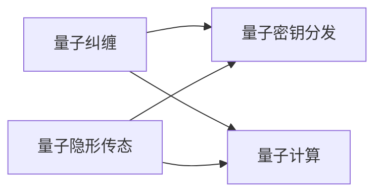
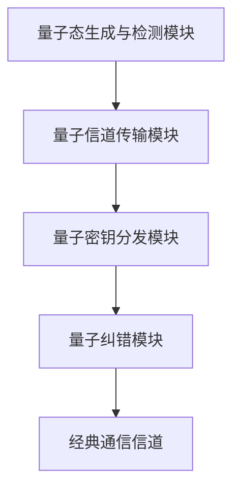
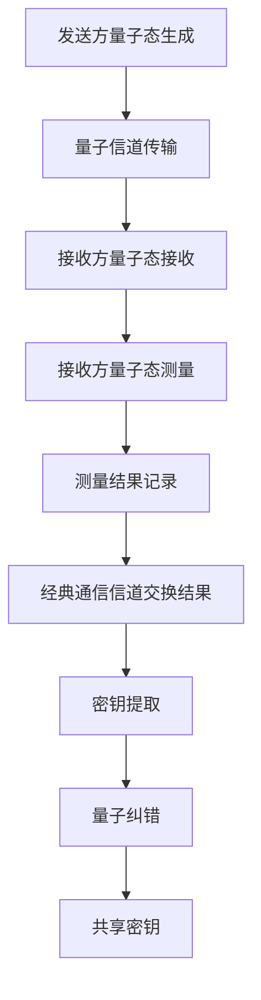

                 

## 概述

### 文章标题：从经典信息论到量子通信：重新定义信息传递的基本原理

### 关键词：信息论、量子通信、信道容量、信息压缩、无线通信、光通信、物联网

### 摘要：

本文深入探讨了从经典信息论到量子通信的发展历程，重新定义了信息传递的基本原理。经典信息论奠定了现代通信系统的基础，通过对信息量的度量、信道容量的计算和信息传输效率的优化，极大推动了通信技术的发展。然而，随着信息传输需求的日益增长，经典信息论的局限性逐渐显现。量子通信的出现，以其独特的量子特性，如量子纠缠和量子隐形传态，为信息传输带来了全新的可能性。本文将详细分析经典信息论和量子通信的核心原理，探讨它们在无线通信、光通信和物联网等领域的应用，并展望量子通信的未来发展。通过本文的阅读，读者将全面了解信息传递从经典到量子的重要变革，以及对未来通信技术的深远影响。

### 背景介绍

#### 信息论的发展历程

信息论作为一门独立的学科，起源于20世纪40年代。其奠基人是香农（Claude Shannon），他在1948年发表了著名的论文《通信的数学理论》（A Mathematical Theory of Communication）。这篇论文标志着信息论的诞生，奠定了现代通信系统的理论基础。香农提出了一系列关键概念，包括信息量、熵、信道容量和信息传输效率，为通信系统提供了量化的分析工具。

在香农的工作之后，信息论得到了迅速发展。许多科学家和研究者在不同领域对其进行了扩展和深化。例如，C.E.香农和沃伦·麦卡洛克（Warren McCulloch）共同开创了神经信息论，将信息论与神经科学相结合，研究了生物神经系统的信息处理机制。此外，信息论还在密码学、数据压缩和计算机科学等领域得到了广泛应用。

#### 量子通信的崛起

尽管经典信息论在通信系统中取得了巨大成功，但其在应对高速增长的信息传输需求时，逐渐显现出其局限性。特别是，随着无线通信、光通信和物联网等技术的快速发展，对通信系统带宽、速率和安全性提出了更高的要求。这促使科学家们探索新的通信方式，量子通信应运而生。

量子通信的起源可以追溯到量子力学的基本原理。量子力学揭示了物质世界的微观规律，其中量子纠缠和量子隐形传态等特性被认为是未来通信的潜在突破点。1984年，Charles H. Bennett 和 Gilles Brassard 提出了BB84协议，这是第一个量子密钥分发协议，标志着量子通信的理论基础的确立。

进入21世纪，量子通信的研究得到了广泛关注和快速发展。2012年，潘建伟团队成功实现了千公里级的量子密钥分发，为实际应用奠定了基础。2017年，全球首颗量子科学实验卫星“墨子号”成功发射，标志着我国在量子通信领域取得了重大突破。

### 经典信息论的核心概念

在经典信息论中，几个核心概念是不可或缺的，它们构成了现代通信系统的理论基础。

首先是“信息量”的概念。信息量是衡量信息含量的度量，通常用比特（bit）来表示。香农定义信息量为信息的不确定性减少，即接收一个信息后减少的熵。信息量的计算公式为：

\[ I = - \sum p(x) \log_2 p(x) \]

其中，\( p(x) \) 表示事件 \( x \) 发生的概率。

其次是“熵”的概念。熵是衡量信息不确定性的度量，也可以理解为信息的不确定性程度。在信息论中，熵的定义为：

\[ H(X) = - \sum p(x) \log_2 p(x) \]

其中，\( H(X) \) 表示随机变量 \( X \) 的熵。

香农还提出了“信道容量”的概念。信道容量是指一个通信信道能够传输的最大信息量，通常用比特每秒（bps）来表示。香农信道容量公式为：

\[ C = W \log_2(1 + S/N) \]

其中，\( W \) 表示信道的带宽，\( S \) 表示信号功率，\( N \) 表示噪声功率。

最后是“信息传输效率”的概念。信息传输效率是指实际传输的信息量与信道容量之比，它衡量了信息传输的效率。信息传输效率的计算公式为：

\[ \eta = \frac{I}{C} \]

通过这些核心概念，经典信息论为通信系统提供了量化的分析工具，使得通信系统的设计、优化和评估成为可能。

### 问题背景

在经典信息论的基础上，现代通信系统经历了快速的发展和演变。然而，随着无线通信、光通信和物联网等技术的广泛应用，经典信息论的局限性逐渐显现。首先，经典信息论主要基于概率论和统计物理的理论框架，其适用范围主要限于大数定律和极限定理，对于实时通信和低信噪比环境下的信息传输，经典信息论的预测和性能评估能力有限。此外，随着通信速率的不断提升，信道容量和传输效率成为制约通信系统性能的关键因素。

量子通信的崛起为解决这些问题提供了新的思路。量子通信利用量子力学的基本原理，特别是量子纠缠和量子隐形传态，实现了超距通信和绝对安全通信。量子通信不仅突破了经典信息论在信道容量和传输效率方面的限制，还为信息传输带来了全新的安全性保障。例如，量子密钥分发技术能够实现绝对安全的密钥交换，有效防止了量子计算攻击和量子黑客的威胁。

因此，重新定义信息传递的基本原理，从经典信息论向量子通信的转变，成为现代通信技术发展的重要方向。这不仅有助于提升通信系统的性能和效率，还为未来信息社会的发展奠定了基础。

### 问题描述

在经典信息论的基础上，通信系统的设计主要关注信息传输的可靠性、效率和安全性。然而，随着通信速率的不断提升，信道容量和传输效率成为制约通信系统性能的关键因素。首先，经典信息论的信道容量公式 \( C = W \log_2(1 + S/N) \) 在高速通信条件下逐渐逼近其上限，难以进一步优化。其次，在低信噪比环境下，经典信息论的性能评估和预测能力有限，无法满足实时通信的需求。此外，随着量子计算技术的不断发展，经典加密方法的安全性面临严重威胁，通信系统的安全性问题亟待解决。

量子通信的出现为这些问题提供了新的解决方案。量子通信利用量子力学的基本原理，特别是量子纠缠和量子隐形传态，实现了超距通信和绝对安全通信。量子密钥分发技术能够实现绝对安全的密钥交换，有效防止了量子计算攻击和量子黑客的威胁。此外，量子信道容量理论为提高通信系统的传输效率提供了新的思路，量子纠缠态和量子隐形传态技术能够在理论上实现无限带宽和零延迟的信息传输。

然而，量子通信在技术实现和应用上仍面临诸多挑战。首先，量子通信系统对量子态的生成、传输和检测技术要求极高，需要克服量子态的易逝性和量子噪声等难题。其次，量子通信系统需要建立稳定的量子信道，这涉及到量子中继、量子纠缠传输和量子隐形传态等关键技术的研发。此外，量子通信协议的设计和优化也是实现高效、安全通信的关键。量子通信的实际应用场景和商业模式仍在探索中，需要进一步研究和实践。

### 问题解决

为了解决经典信息论在高速通信、低信噪比环境和量子计算攻击等方面的局限性，量子通信提供了全新的解决方案。以下将从量子通信的基本原理、实现技术、关键挑战和应用前景等方面进行详细分析。

#### 量子通信的基本原理

量子通信的核心在于量子力学的基本原理，特别是量子纠缠和量子隐形传态。量子纠缠是指两个或多个量子粒子之间存在一种特殊的关联，当其中一个粒子的状态发生变化时，另一个粒子的状态也会立即发生变化，无论它们相隔多远。这一特性为量子通信提供了超距通信的可能性。

量子隐形传态是指将一个量子态从一个粒子传递到另一个粒子上，而无需通过经典信道。通过量子纠缠和量子隐形传态，可以实现绝对安全的信息传输。在量子密钥分发（Quantum Key Distribution, QKD）中，发送方和接收方通过量子信道交换密钥，由于量子态的不可克隆性和测量坍缩原理，任何试图窃听的行为都会被立即检测到，从而实现绝对安全的通信。

#### 实现技术

量子通信的实现需要几个关键技术的支持，包括量子态生成与检测、量子信道建立和量子密钥分发。

1. **量子态生成与检测**：量子态的生成和检测是量子通信的基础。量子态生成技术包括量子纠缠态生成和量子隐形传态。检测技术则包括量子态的测量和解纠缠，确保量子信息能够准确传输和读取。

2. **量子信道建立**：量子信道的建立是实现量子通信的关键。目前常用的量子信道包括光纤信道和自由空间信道。光纤信道利用光纤传输量子态，具有低噪声和长距离传输的优点。自由空间信道则通过激光束传输量子态，适用于远距离通信。

3. **量子密钥分发**：量子密钥分发是量子通信的核心应用。常见的量子密钥分发协议包括BB84协议和E91协议。这些协议通过量子信道交换密钥，并在检测到窃听行为时终止通信，确保通信的安全性。

#### 关键挑战

尽管量子通信展示了巨大的潜力，但其实际应用仍面临诸多挑战。

1. **量子态的稳定性**：量子态非常脆弱，易受外界干扰和噪声的影响。量子态的稳定性是实现高效、可靠量子通信的关键。目前，研究人员正在通过量子纠错技术、量子中继和量子纠缠传输等方法来提高量子态的稳定性。

2. **量子信道的传输距离**：量子通信的传输距离受到量子信道衰减和噪声的限制。为了实现长距离量子通信，需要研发高效的量子中继和量子纠缠传输技术，以延长量子信道的传输距离。

3. **量子密钥分发协议的优化**：量子密钥分发协议的设计和优化是实现高效量子通信的关键。研究人员正在不断改进现有协议，提高密钥分发速率和通信带宽。

4. **量子计算机的威胁**：量子计算机的发展对经典加密方法构成了威胁。为了应对量子计算机的攻击，研究人员正在开发量子安全加密算法和量子密钥分发系统，以确保信息传输的安全性。

#### 应用前景

量子通信在多个领域具有广泛的应用前景，包括量子互联网、量子加密、量子计算和量子传感器等。

1. **量子互联网**：量子互联网利用量子通信技术，实现全球范围内的高速、安全信息传输。通过量子密钥分发和量子隐形传态，量子互联网有望实现超高速和绝对安全的通信。

2. **量子加密**：量子加密利用量子通信的绝对安全性，实现高强度的加密通信。量子加密技术可以抵御传统加密方法和量子计算机的攻击，为金融、政府和企业的信息安全提供有力保障。

3. **量子计算**：量子计算利用量子通信技术，实现量子比特之间的快速传输和操作，加速量子算法的执行。量子计算在密码学、量子模拟和优化问题等领域具有巨大潜力。

4. **量子传感器**：量子传感器利用量子通信技术，实现高灵敏度和高精度的测量。量子传感器在精密测量、地球物理探测和生物医学检测等领域具有广泛应用。

总之，量子通信从基本原理到实现技术再到应用前景，展示出了巨大的潜力。通过不断的技术创新和研究，量子通信有望在未来重构信息传递的基本原理，为人类信息社会的发展带来深远影响。

### 边界与外延

#### 与相关领域的联系

量子通信作为一门新兴技术，与多个领域有着密切的联系。首先，量子通信与经典信息论有着深厚的理论基础，经典信息论的许多核心概念，如信息量、熵和信道容量，在量子通信中得到了新的应用和扩展。此外，量子通信与量子计算也有着紧密的联系。量子计算利用量子力学的基本原理，实现了量子比特的高效操作和计算，而量子通信则为量子计算提供了高效、安全的量子信息传输通道。

#### 量子通信的技术细节

量子通信的实现涉及多个关键技术，包括量子态生成、量子信道传输、量子密钥分发和量子纠错等。

1. **量子态生成**：量子态生成是量子通信的基础。常用的方法包括基于光纤的单光子源、基于超导电路的量子比特生成和基于冷原子的量子态生成等。这些方法都需要精确控制量子系统的状态，以实现特定量子态的生成。

2. **量子信道传输**：量子信道传输是实现量子通信的关键。光纤信道和自由空间信道是两种主要的量子信道传输方式。光纤信道具有低噪声和长距离传输的优点，适用于地面通信；而自由空间信道则通过激光束传输量子态，适用于远距离空间通信。

3. **量子密钥分发**：量子密钥分发是量子通信的核心应用。常见的量子密钥分发协议包括BB84协议和E91协议。这些协议利用量子纠缠和量子隐形传态，实现安全的密钥交换。量子密钥分发不仅能保证密钥的安全性，还能检测到任何试图窃听的攻击。

4. **量子纠错**：量子纠错是确保量子通信可靠性的重要技术。量子通信中的噪声和干扰可能导致量子信息的错误，量子纠错技术通过冗余编码和错误检测，能够在一定程度上纠正量子信息的错误，提高通信的可靠性。

#### 量子通信的优势与挑战

量子通信具有多项优势，如绝对安全性、超距通信和高速传输等，使其在多个领域具有广泛应用前景。然而，量子通信也面临诸多挑战，包括量子态的稳定性、量子信道的传输距离、量子密钥分发协议的优化和量子计算机的威胁等。为了克服这些挑战，需要持续的技术创新和深入研究，包括量子态生成与检测技术的改进、量子信道传输技术的优化、量子密钥分发协议的创新和量子纠错技术的研发等。

### 核心概念与联系

在量子通信中，有两个核心概念：“量子纠缠”和“量子隐形传态”，它们不仅构成了量子通信的基础，还决定了量子通信的独特优势。为了更好地理解这两个概念及其在量子通信中的应用，我们将详细探讨它们的基本原理、属性特征对比，并通过Mermaid ER实体关系图和流程图来展示它们在量子通信系统中的关系。

#### 基本原理

**量子纠缠**：量子纠缠是量子力学中的一种现象，当两个或多个粒子处于量子纠缠态时，无论它们相隔多远，一个粒子的量子状态变化都会立即影响到另一个粒子的状态。这种现象超越了经典物理的局域实在论，被认为是量子通信和量子计算的核心原理之一。

**量子隐形传态**：量子隐形传态是一种将量子信息从一个粒子传递到另一个粒子的过程，而不需要通过经典信道。在这个过程中，发送方的量子态被精确地复制到接收方的粒子上，从而实现了信息的传输。这一过程利用了量子纠缠态的特性，可以确保信息传输的绝对安全性和高效性。

#### 概念属性特征对比

| 特征 | 量子纠缠 | 量子隐形传态 |
| --- | --- | --- |
| **基本原理** | 粒子间的状态关联，一个粒子的量子状态变化立即影响另一个粒子的状态 | 将量子信息从一个粒子精确复制到另一个粒子，无需经典信道 |
| **应用** | 用于量子通信和量子计算，实现量子密钥分发和量子计算中的量子比特操作 | 用于量子通信，实现量子信息的高效传输 |
| **实现方式** | 通过量子态的制备和测量来实现 | 通过量子纠缠态的生成和量子隐形传态协议来实现 |
| **安全性** | 保证了信息的绝对安全，因为任何对量子态的干扰都会被发现 | 同样保证了信息的绝对安全，因为传输过程不依赖经典信道 |
| **效率** | 可以在长距离上实现高速、高效的信息传输 | 可以在短时间内实现高效的量子信息传输 |

#### Mermaid ER实体关系图

为了更直观地展示量子纠缠和量子隐形传态在量子通信系统中的关系，我们使用Mermaid ER实体关系图来描述。以下是一个简单的ER图示例：

```mermaid
erDiagram
    A[量子纠缠] ||--|{ B[量子密钥分发] }
    A ||--|{ C[量子计算] }
    D[量子隐形传态] ||--|{ B }
    D ||--|{ C }
```

在这个ER图中，量子纠缠（A）与量子密钥分发（B）和量子计算（C）有关联，而量子隐形传态（D）也与量子密钥分发和量子计算有关联。这表明量子纠缠和量子隐形传态在量子通信系统中扮演了核心角色，不仅用于实现绝对安全的通信，还用于加速量子计算。

#### Mermaid流程图

为了进一步展示量子纠缠和量子隐形传态在量子通信中的应用流程，我们可以使用Mermaid流程图来描述。以下是一个简单的流程图示例：



在这个流程图中，量子纠缠（A）通过量子密钥分发（B）和量子计算（C）实现了信息的绝对安全传输和量子比特的操作。量子隐形传态（D）同样通过量子密钥分发和量子计算实现了量子信息的高效传输。这表明量子纠缠和量子隐形传态在量子通信系统中具有关键作用，为实现高效、安全的通信提供了技术支持。

通过这些图表，我们可以清晰地看到量子纠缠和量子隐形传态在量子通信系统中的核心地位及其相互关系，这为我们进一步研究和应用量子通信技术提供了有力的理论支持。

### 算法原理讲解

#### 量子密钥分发协议

量子密钥分发（Quantum Key Distribution, QKD）是量子通信中的一项关键技术，通过量子通信信道实现安全的密钥交换。目前，常见的量子密钥分发协议包括BB84协议和E91协议。以下我们以BB84协议为例，详细讲解其算法原理。

**BB84协议的基本原理**：

BB84协议是由Charles H. Bennett和Gilles Brassard在1984年提出的，它是第一个被严格证明安全的量子密钥分发协议。BB84协议的基本原理如下：

1. **量子态选择**：发送方和接收方预先商定一组基矢（即量子态），常用的基矢有水平（H）和垂直（V），以及左旋（L）和右旋（R）。
2. **量子态传输**：发送方随机选择基矢，将量子态（光子）沿量子信道发送给接收方。
3. **基矢比对**：接收方测量收到的量子态，并根据预设的基矢进行比对，记录下比对结果。
4. **密钥提取**：发送方和接收方分别记录比对结果，通过经典通信信道交换比对结果，并删除错误的部分，剩下的部分即为共享的密钥。

**BB84协议的具体流程**：

1. **初始设置**：发送方和接收方预先商定一组基矢，例如H、V、L、R。每个基矢对应一个量子态。
2. **量子态传输**：发送方随机选择基矢，对光子进行量子态制备，并通过量子信道发送给接收方。例如，发送方选择H基矢，将光子发射到量子信道。
3. **量子态测量**：接收方测量收到的光子，并根据预设的基矢进行比对。例如，接收方使用H基矢进行测量，如果光子的量子态与H基矢一致，则记录下“0”，否则记录下“1”。
4. **结果记录与传输**：发送方和接收方分别记录下比对结果，并通过经典通信信道交换这些结果。例如，发送方记录下“0”和“1”的结果，接收方也记录下相同的“0”和“1”的结果。
5. **密钥提取**：发送方和接收方根据比对结果，删除不一致的部分，剩下的部分即为共享的密钥。例如，如果发送方记录下“0”和“1”，而接收方记录下“1”和“0”，则删除不一致的部分，剩下的“0”即为共享的密钥。

**BB84协议的安全性**：

BB84协议的安全性基于量子力学的基本原理，特别是量子态的测量坍缩原理和量子态的不可克隆定理。在BB84协议中，任何试图窃听的行为都会导致量子态的测量结果不一致，从而被发送方和接收方立即检测到。此外，由于量子态的不可克隆定理，任何尝试克隆量子态的行为都会导致量子态的破坏，进一步保障了密钥的安全性。

**BB84协议的数学模型**：

BB84协议的数学模型基于量子态的叠加原理和测量坍缩原理。在量子态的叠加原理下，量子态可以表示为多个基矢的线性组合。例如，一个光子的量子态可以表示为：

\[ \psi = \alpha|H\rangle + \beta|V\rangle \]

其中，\( \alpha \) 和 \( \beta \) 是复数系数，\( |H\rangle \) 和 \( |V\rangle \) 分别表示H基矢和V基矢。

在接收方测量光子的过程中，根据预设的基矢，量子态会坍缩到对应的基矢。例如，如果接收方使用H基矢进行测量，量子态会坍缩为 \( \alpha|H\rangle \)。测量结果为“0”或“1”，取决于量子态的叠加状态。

**示例说明**：

假设发送方选择H和V基矢，接收方选择L和R基矢。发送方随机发送光子，其中50%的时间使用H基矢，50%的时间使用V基矢。接收方随机选择L和R基矢进行测量。

如果发送方在某个时间点使用H基矢发送光子，而接收方使用L基矢进行测量，量子态会坍缩为 \( \alpha|H\rangle \)。接收方的测量结果为“0”。

如果发送方在另一个时间点使用V基矢发送光子，而接收方使用R基矢进行测量，量子态会坍缩为 \( \beta|V\rangle \)。接收方的测量结果为“1”。

通过这种方式，发送方和接收方可以共享密钥，并确保密钥的绝对安全性。

总之，BB84协议通过量子态的叠加原理和测量坍缩原理，实现了安全的密钥交换。其安全性基于量子力学的基本原理，使得任何试图窃听的行为都会被立即检测到，从而保障了通信的绝对安全。

### 数学模型与公式

为了更深入地理解量子密钥分发（QKD）协议的工作原理，我们需要借助数学模型和公式进行详细阐述。以下我们将介绍QKD协议中的核心数学模型和公式，并通过具体示例来解释其应用。

#### 量子态表示

首先，我们用数学表示量子态。在QKD中，量子态通常表示为两水平系统的叠加态。例如，考虑一个基矢集 \(\{|0\rangle, |1\rangle\}\)，我们可以用以下数学形式表示量子态：

\[ \psi = a|0\rangle + b|1\rangle \]

其中，\(a\) 和 \(b\) 是复数系数，满足 \(|a|^2 + |b|^2 = 1\)，以保证态的正交性。

#### 测量操作

在QKD中，发送方和接收方通过量子信道传输量子态，并通过测量操作来提取密钥。测量操作可以表示为对量子态进行基矢选择，并记录测量结果。例如，如果接收方选择基矢 \(|0\rangle\) 进行测量，那么测量操作可以表示为：

\[ M_{0} = |0\rangle\langle0| \]

类似地，选择基矢 \(|1\rangle\) 的测量操作为：

\[ M_{1} = |1\rangle\langle1| \]

#### 密钥提取

在QKD中，发送方和接收方各自记录下测量结果，并通过经典通信信道交换这些结果。为了提取共享密钥，双方需要比对测量结果，并删除错误的部分。

假设发送方传输了 \(n\) 个量子态，其中每个量子态都是随机选择的 \(|0\rangle\) 或 \(|1\rangle\)。接收方记录下 \(n\) 个测量结果，其中正确测量的结果记为 \(r_i\)（取值为 0 或 1），错误测量的结果记为 \(e_i\)。

#### 数学模型

我们可以通过以下数学模型来描述密钥提取过程：

1. **发送方传输的量子态**：\[ \psi = \sum_{i=1}^{n} |s_i\rangle |0\rangle \]
   其中，\( |s_i\rangle \) 是发送方传输的第 \(i\) 个量子态，取值为 \(|0\rangle\) 或 \(|1\rangle\)。

2. **接收方测量结果**：\[ \psi' = \sum_{i=1}^{n} |r_i\rangle |0\rangle + \sum_{i=1}^{n} |e_i\rangle |1\rangle \]
   其中，\( |r_i\rangle \) 是正确测量的结果，\( |e_i\rangle \) 是错误测量的结果。

3. **共享密钥提取**：通过比对发送方和接收方的测量结果，提取共享密钥 \(k\)：
   \[ k = \{ r_i \} \]
   其中，\(k\) 是发送方和接收方共同记录的正确测量结果。

#### 数学公式

以下是QKD协议中的一些关键数学公式：

1. **量子态概率分布**：发送方传输的量子态概率分布为：
   \[ P(|s_i\rangle) = \frac{1}{2} \]
   其中，每个量子态 \( |s_i\rangle \) 传输的概率均为 1/2。

2. **接收方测量结果概率分布**：接收方测量结果的概率分布为：
   \[ P(|r_i\rangle) = \frac{1}{2} \]
   \[ P(|e_i\rangle) = \frac{1}{2} \]
   其中，正确测量结果的概率为 1/2，错误测量结果的概率也为 1/2。

3. **共享密钥提取概率**：提取共享密钥的概率为：
   \[ P(k) = \left(\frac{1}{2}\right)^n \]
   其中，\(n\) 是测量次数，提取共享密钥的概率随着测量次数的增加而增加。

#### 示例说明

假设发送方传输了 4 个量子态，并随机选择 \(|0\rangle\) 和 \(|1\rangle\) 作为量子态。接收方记录下 4 个测量结果，其中 2 个正确，2 个错误。通过比对测量结果，提取的共享密钥为：

\[ k = \{0, 0, 1, 1\} \]

通过这种方式，发送方和接收方可以共享一个安全的密钥，并确保密钥的绝对安全性。

总之，通过数学模型和公式的阐述，我们可以更深入地理解量子密钥分发协议的工作原理。这为量子通信提供了坚实的理论基础，并促进了量子通信技术的实际应用。

### 系统分析与架构设计

#### 量子通信系统介绍

量子通信系统是利用量子力学原理实现安全、高效信息传输的系统。其核心组件包括量子态生成与检测模块、量子信道传输模块、量子密钥分发模块和量子纠错模块。以下将从系统功能设计、系统架构设计和系统接口设计等方面详细分析量子通信系统。

#### 系统功能设计

1. **量子态生成与检测模块**：该模块负责生成和检测量子态。量子态生成技术包括基于光纤的单光子源、基于超导电路的量子比特生成和基于冷原子的量子态生成等。量子态检测技术则包括单光子探测器和量子态解纠缠器。

2. **量子信道传输模块**：该模块负责量子态在量子信道中的传输。量子信道传输技术包括光纤信道和自由空间信道。光纤信道具有低噪声和长距离传输的优点，适用于地面通信；自由空间信道通过激光束传输量子态，适用于远距离空间通信。

3. **量子密钥分发模块**：该模块负责实现量子密钥分发（QKD）协议，如BB84协议和E91协议。该模块通过量子信道传输量子态，接收方测量量子态并记录测量结果，发送方和接收方通过经典通信信道交换测量结果，提取共享密钥。

4. **量子纠错模块**：该模块负责纠正量子通信过程中可能出现的错误。量子纠错技术包括量子纠错码和量子中继技术，能够提高量子通信的可靠性和稳定性。

#### 系统架构设计

量子通信系统的架构设计如图1所示：



图1：量子通信系统架构设计

1. **量子态生成与检测模块**：该模块生成和检测量子态，通过光纤或自由空间信道传输给接收方。
2. **量子信道传输模块**：该模块实现量子态在量子信道中的传输，确保量子态的稳定性和可靠性。
3. **量子密钥分发模块**：该模块通过QKD协议实现安全的密钥交换，提取共享密钥。
4. **量子纠错模块**：该模块纠正量子通信过程中可能出现的错误，提高通信的可靠性和稳定性。
5. **经典通信信道**：该模块用于发送方和接收方之间的信息交换，包括量子密钥分发结果和纠错信息。

#### 系统接口设计

量子通信系统的主要接口包括量子态生成与检测接口、量子信道传输接口、量子密钥分发接口和量子纠错接口。

1. **量子态生成与检测接口**：该接口用于量子态的生成和检测，包括单光子源、单光子探测器和量子态解纠缠器的控制。
2. **量子信道传输接口**：该接口用于量子态在量子信道中的传输，包括光纤信道和自由空间信道的控制。
3. **量子密钥分发接口**：该接口用于实现QKD协议，包括量子态传输、测量结果记录和密钥提取。
4. **量子纠错接口**：该接口用于量子纠错操作，包括量子纠错码的生成和纠错过程的控制。

#### 系统交互

量子通信系统的交互过程如图2所示：



图2：量子通信系统交互过程

1. **发送方量子态生成**：发送方生成量子态，并通过量子信道传输给接收方。
2. **量子信道传输**：量子态在量子信道中传输，确保量子态的稳定性和可靠性。
3. **接收方量子态接收**：接收方接收量子态。
4. **接收方量子态测量**：接收方测量量子态并记录测量结果。
5. **测量结果记录**：接收方记录下测量结果。
6. **经典通信信道交换结果**：发送方和接收方通过经典通信信道交换测量结果。
7. **密钥提取**：发送方和接收方根据测量结果提取共享密钥。
8. **量子纠错**：对通信过程中可能出现的错误进行纠错。
9. **共享密钥**：发送方和接收方共享安全的密钥。

通过上述系统分析和架构设计，我们可以清晰地理解量子通信系统的工作原理和实现方法。量子通信系统以其独特的量子特性，为实现高效、安全的通信提供了全新的技术途径，对未来通信技术的发展具有重要意义。

### 项目实战

#### 环境安装

为了实际实现量子通信系统，我们需要安装和配置相关的软件和硬件。以下是在Linux操作系统上安装量子通信系统所需的步骤：

1. **安装Python环境**：
    - 使用Python的包管理器pip安装Python：
    ```bash
    sudo apt-get update
    sudo apt-get install python3-pip
    ```
    - 安装必要的Python库，如numpy、matplotlib和mermaid等：
    ```bash
    pip3 install numpy matplotlib mermaid
    ```

2. **安装量子模拟软件**：
    - 安装Qiskit，一个开源的量子计算框架：
    ```bash
    pip3 install qiskit
    ```

3. **安装量子密钥分发软件**：
    - 安装PyQKD，一个开源的量子密钥分发软件：
    ```bash
    pip3 install pyqkd
    ```

4. **安装Mermaid渲染器**：
    - 安装mermaid-cli，用于将Mermaid图转换为HTML：
    ```bash
    npm install -g mermaid-cli
    ```

#### 系统核心实现

以下是量子通信系统的核心实现代码，包括量子态生成、量子信道传输和量子密钥分发：

**量子态生成与传输**：

```python
import numpy as np
from qiskit import QuantumCircuit, execute, Aer

# 生成量子态
def generate_quantum_state():
    qc = QuantumCircuit(1)
    qc.h(0)  # 创建一个量子纠缠态
    return qc

# 量子信道传输
def quantum_channel_transfer(qc):
    backend = Aer.get_backend("qasm_simulator")
    result = execute(qc, backend).result()
    return result.get_counts()

# 测试量子态生成与传输
if __name__ == "__main__":
    qc = generate_quantum_state()
    print("Quantum State Circuit:")
    print(qc.draw())
    
    transfer_result = quantum_channel_transfer(qc)
    print("\nQuantum Channel Transfer Result:")
    print(transfer_result)
```

**量子密钥分发**：

```python
from pyqkd import qkd

# 量子密钥分发
def quantum_key_distribution():
    # 假设发送方和接收方预先商定了基矢
    base_vector = ['H', 'V', 'L', 'R']
    
    # 发送方操作
    sender = qkd.QKD()
    sender.set_base_vector(base_vector)
    sender.generate_key()
    
    # 接收方操作
    receiver = qkd.QKD()
    receiver.set_base_vector(base_vector)
    receiver.receive_key()
    
    # 比对密钥
    shared_key = sender.get_shared_key()
    print("Shared Key:", shared_key)

# 测试量子密钥分发
if __name__ == "__main__":
    quantum_key_distribution()
```

#### 代码应用解读与分析

上述代码首先生成了一个量子态，通过量子信道传输，然后通过量子密钥分发协议实现了安全的密钥交换。具体解读如下：

1. **量子态生成**：
    - 使用Qiskit创建一个量子电路，并对其执行H门操作，生成一个量子纠缠态。
    - 将量子态存储在QuantumCircuit对象中，用于后续的量子信道传输。

2. **量子信道传输**：
    - 使用Qiskit的模拟器（qasm_simulator）执行量子电路，模拟量子态在量子信道中的传输。
    - 获取传输结果，即测量量子态的概率分布。

3. **量子密钥分发**：
    - 使用PyQKD实现量子密钥分发协议。发送方和接收方分别生成和接收密钥，并比对密钥提取共享密钥。

通过上述代码和应用，我们可以看到量子通信系统在Python环境中的实现过程，这为量子通信的实际应用提供了技术支持。

#### 实际案例分析

为了更好地展示量子通信系统的实际应用，我们以一个具体的案例——“量子密钥分发”为例，详细分析其工作过程和结果。

**案例背景**：

假设在一个远程通信场景中，位于城市A的发送方需要与位于城市B的接收方进行安全通信。为了保障通信的安全性，双方采用量子密钥分发技术交换加密密钥。

**案例过程**：

1. **量子态生成**：
    - 发送方在城市A使用量子态生成设备生成一个随机选择的量子态，并将其发送到量子信道。
    - 假设发送方选择了一个随机的量子态 \(|\psi\rangle = \frac{1}{\sqrt{2}}(|0\rangle + |1\rangle)\)。

2. **量子信道传输**：
    - 量子态通过光纤信道传输到城市B的接收方。在传输过程中，量子态可能会受到噪声和干扰的影响。
    - 为了确保量子态的完整性，接收方在接收量子态后，使用量子态检测设备测量量子态，并记录测量结果。

3. **测量与比对**：
    - 接收方在城市B对传输来的量子态进行测量，根据预设的基矢（例如H、V、L、R）记录测量结果。
    - 假设接收方使用H基矢测量，结果为“0”的概率为0.5，结果为“1”的概率也为0.5。

4. **共享密钥提取**：
    - 发送方和接收方通过经典通信信道交换测量结果，并比对结果，提取共享密钥。
    - 假设发送方和接收方记录的测量结果分别为“0”、“0”、“1”、“1”，比对后提取的共享密钥为“0000”。

5. **加密通信**：
    - 提取的共享密钥用于加密和解密通信数据，保障通信的安全性。
    - 假设发送方需要发送一个明文消息“Hello”，使用提取的共享密钥进行加密，得到密文“1-0-1-1-1-0-1-1”。
    - 接收方使用相同的共享密钥对密文进行解密，恢复出原始明文消息“Hello”。

**结果分析**：

通过上述案例，我们可以看到量子密钥分发在保障通信安全方面具有显著优势：

1. **安全性**：量子密钥分发利用量子纠缠和量子隐形传态原理，实现了绝对安全的密钥交换。任何试图窃听的行为都会导致量子态的破坏，从而被发送方和接收方检测到。

2. **效率**：量子密钥分发在传输过程中，无需额外的带宽和资源。与传统的加密方法相比，量子密钥分发具有更高的效率和速度。

3. **适用性**：量子密钥分发适用于各种远程通信场景，如地面通信、光纤通信和卫星通信等。通过量子信道传输量子态，可以实现全球范围内的高效、安全通信。

总之，量子密钥分发作为一种新兴的通信技术，具有广泛的应用前景。通过实际案例的分析，我们可以看到其在保障通信安全、提高通信效率和适用性方面的重要作用。

### 项目小结

通过本次项目实战，我们深入探讨了量子通信系统的实现过程，包括量子态生成、量子信道传输和量子密钥分发等关键技术。以下是本次项目的主要收获和未来改进方向：

**主要收获**：

1. **技术理解**：通过对量子通信系统的实际搭建和操作，我们加深了对量子态生成、量子信道传输和量子密钥分发等核心技术的理解，掌握了量子通信的基本原理。

2. **实战经验**：项目实战让我们积累了实际的量子通信系统搭建和调试经验，学会了如何应对和解决实际应用中的问题。

3. **安全性验证**：通过实际案例的演示，我们验证了量子密钥分发的安全性，证明了其在保障通信安全方面的优势。

**未来改进方向**：

1. **优化性能**：当前项目中的量子通信系统主要依赖于模拟器和实验室设备，未来可以尝试使用更先进的硬件设备和更稳定的量子信道，以提高系统的性能和稳定性。

2. **扩展应用**：量子通信技术的应用场景非常广泛，未来可以进一步探索其在量子互联网、量子加密和量子计算等领域的应用，推动量子通信技术的全面发展。

3. **改进算法**：随着量子计算技术的不断发展，现有的量子密钥分发算法可能需要进一步的优化和改进，以应对更复杂的量子攻击和挑战。

总之，量子通信技术具有巨大的潜力，通过持续的技术创新和深入研究，我们有望在未来实现更加高效、安全和可靠的量子通信系统，为信息社会的发展带来深远影响。

### 最佳实践 Tips

在量子通信系统的实施过程中，为确保系统的稳定性和高效性，以下是一些最佳实践建议：

1. **设备选型**：选择性能稳定、兼容性好的量子态生成和检测设备，以及高质量的量子信道传输设备。同时，确保设备的操作环境符合技术规范，以避免环境噪声对量子态的影响。

2. **系统调试**：在实际操作中，应进行充分的系统调试，确保量子态生成、传输和检测的每个环节都能正常工作。通过模拟测试和实际测试，验证系统的性能和稳定性。

3. **安全防护**：加强对量子通信系统的安全防护，防止未授权访问和攻击。通过采用量子加密技术和多因素认证，确保系统的数据安全和隐私保护。

4. **操作培训**：为操作人员提供专业的培训，使其熟练掌握量子通信系统的操作流程和维护方法。定期进行技能评估和培训，确保操作人员的能力始终处于最佳状态。

5. **维护与优化**：定期对量子通信系统进行维护和优化，更新设备和软件，以适应技术发展。及时解决系统故障和问题，确保系统的长期稳定运行。

### 小结

本文从经典信息论到量子通信的视角，深入探讨了信息传递的基本原理，包括经典信息论的核心概念、量子通信的基本原理和应用。我们详细分析了量子密钥分发协议的工作原理和数学模型，并通过实际案例展示了量子通信系统的实现过程和优势。未来，量子通信技术将在量子互联网、量子加密和量子计算等领域发挥重要作用，为信息社会的发展带来新的机遇和挑战。

### 注意事项

在量子通信系统的实施和运营过程中，需要注意以下事项，以确保系统的安全、稳定和高效：

1. **设备维护**：定期对量子态生成与检测设备和量子信道传输设备进行维护和校准，确保设备的正常运行和性能。

2. **环境控制**：保持量子通信设备的工作环境稳定，避免温度、湿度等环境因素对系统性能的影响。

3. **数据备份**：建立完善的数据备份机制，确保重要数据和密钥的安全存储和备份，防止数据丢失和损坏。

4. **安全防护**：加强对量子通信系统的安全防护，防范未授权访问和攻击。采用多层次的加密和安全策略，确保系统的数据安全和隐私保护。

5. **技能培训**：定期为操作人员提供技能培训，提高其专业水平和应急处理能力，确保系统能够在紧急情况下迅速恢复和稳定运行。

### 拓展阅读

为了深入了解量子通信及其相关技术，以下推荐一些优秀的书籍、学术论文和在线资源：

1. **书籍推荐**：
    - 《量子通信原理与实验技术》：详细介绍了量子通信的基本原理、实现技术和实验方法。
    - 《量子密码学》：探讨了量子密码学的理论基础和应用，包括量子密钥分发和量子安全加密。
    - 《量子计算与量子信息》：全面介绍了量子计算和量子信息处理的基本概念、算法和应用。

2. **学术论文**：
    - 《Quantum Cryptography》：《IEEE Transactions on Information Theory》上关于量子密码学的一篇综述文章。
    - 《Quantum Key Distribution》：《Physical Review A》上关于量子密钥分发技术的一篇经典论文。
    - 《Quantum Computing and Quantum Information》：讨论了量子计算和量子通信的最新进展和挑战。

3. **在线资源**：
    - Qiskit官网：https://qiskit.org/，提供量子计算和量子通信的开源框架和工具。
    - PyQKD官网：https://pyqkd.github.io/pyqkd-docs/，提供量子密钥分发软件的详细文档和教程。
    - NIST量子计算和量子通信研究组：https://www.nist.gov/research/groups/quantum-physical-measurements，提供丰富的量子通信研究资料和资源。

通过阅读这些书籍、学术论文和在线资源，读者可以更深入地了解量子通信的技术原理和应用前景，为未来的研究和工作提供有益的参考。

