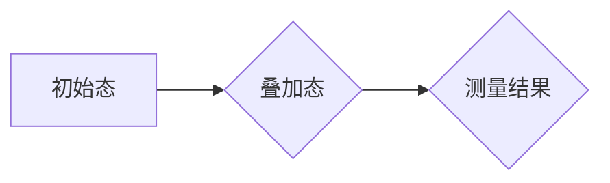
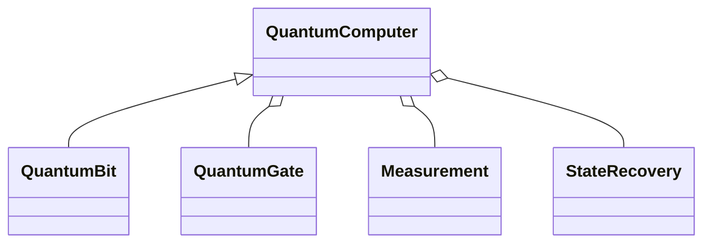
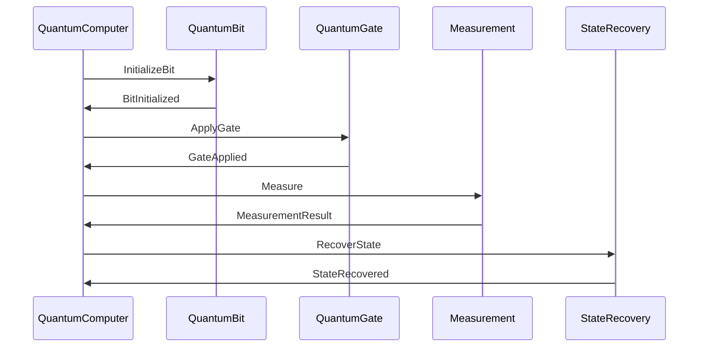
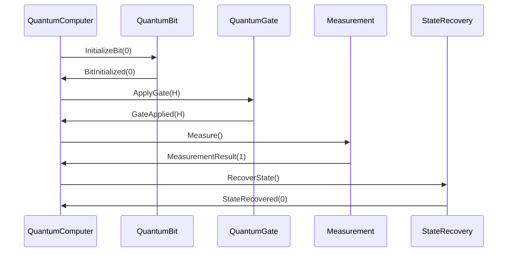

                 

# 从经典力学到量子力学：宇宙观的范式转移

关键词：经典力学、量子力学、宇宙观、范式转移、算法原理、数学模型

摘要：本文深入探讨了从经典力学到量子力学的演变过程，揭示了这一过程中宇宙观的重大变革。通过详细阐述经典力学和量子力学的基本原理、数学模型、系统分析以及项目实战，本文旨在帮助读者理解这一宇宙观范式转移的深刻含义，并掌握相关技术知识。

## 目录

## 引言

### 范式转移的背景与意义

在科学发展的历史长河中，范式转移是科学理论革命性的变革。从经典力学到量子力学的转变，不仅标志着科学理论的重大进步，更反映了人类对宇宙认知的深化。经典力学，以牛顿力学为代表，曾统治物理学长达数百年，但在微观尺度上，其局限性逐渐显现。量子力学的出现，不仅揭示了微观世界的奇异现象，如量子纠缠、量子叠加等，还带来了对宇宙观的深刻变革。

### 文章结构

本文将分为以下几个部分：首先，介绍经典力学和量子力学的基本概念及其在宇宙观中的重要性；接着，通过算法原理讲解、数学模型和系统分析，深入探讨量子力学的工作原理；然后，通过项目实战，展示如何将量子力学应用于实际工程中；最后，总结最佳实践、注意事项，并提供拓展阅读资源。

## 核心概念与联系

### 经典力学与量子力学的基本概念

#### 经典力学

经典力学是以牛顿力学为基础的物理学理论，主要研究宏观物体的运动规律。牛顿力学的基本原理包括牛顿运动定律和万有引力定律，其核心是确定性原则，即通过已知的初始条件可以精确预测物体的未来状态。

#### 量子力学

量子力学则是在微观尺度上描述物质和能量行为的理论。量子力学的基本原理包括量子态的叠加性和量子纠缠现象，其核心是不确定性原则，即无法同时精确知道一个粒子的位置和动量。

### 对比表格与ER图

为了更好地理解经典力学和量子力学之间的关系，我们通过一个对比表格来展示两者的核心属性和特点。

| 特征 | 经典力学 | 量子力学 |
| --- | --- | --- |
| 研究对象 | 宏观物体 | 微观粒子 |
| 确定性 | 确定性原则 | 不确定性原则 |
| 表达形式 | 微分方程 | 波函数 |
| 交互方式 | 直接相互作用 | 通过场相互作用 |

通过ER图，我们可以展示经典力学和量子力学的实体关系和交互方式。

```mermaid
erDiagram
  Class1 ||--|{ ClassA : associated }
  Class1 ||--|{ ClassB : associated }
  Class2 ||--|{ ClassC : associated }
```

在ER图中，Class1、Class2 分别代表经典力学和量子力学，ClassA、ClassB、ClassC 分别代表其核心概念和原理。

## 算法原理讲解

### 量子力学基本原理

量子力学的基本原理包括量子态的叠加性、量子纠缠现象以及不确定性原理。以下是一个简单的Mermaid流程图，展示量子态的叠加过程。



在这个流程图中，A 表示初始态，B 表示叠加态，C 表示测量结果。

### 算法原理与Python源代码

为了更好地理解量子力学算法的原理，我们使用Python源代码来演示一个简单的量子态叠加过程。

```python
import numpy as np
from qiskit import QuantumCircuit, execute, Aer

# 初始化量子电路
qc = QuantumCircuit(1)

# 构建叠加态
qc.h(0)
qc.barrier()

# 测量量子比特
qc.measure_all()

# 运行模拟器
backend = Aer.get_backend("qasm_simulator")
job = execute(qc, backend, shots=1024)
result = job.result()

# 输出测量结果
print(result.get_counts(qc))
```

在这个Python源代码中，我们首先初始化一个量子电路，然后使用H门构建叠加态，接着进行测量，并使用模拟器运行电路，输出测量结果。

### 数学模型与公式

在量子力学中，描述量子态的核心数学模型是波函数。波函数是一个复值函数，用于描述量子系统的状态。薛定谔方程是描述量子态动态变化的基本方程。

$$
\mathrm{i}\hbar \frac{\partial \psi(x,t)}{\partial t} = \hat{H} \psi(x,t)
$$

其中，$\hat{H}$ 是哈密顿算符，$\psi(x,t)$ 是波函数，$\hbar$ 是约化普朗克常数，$i$ 是虚数单位。

为了使读者更容易理解，我们使用LaTeX格式书写薛定谔方程：

$$
\mathrm{i}\hbar \frac{\partial \psi(x,t)}{\partial t} = \hat{H} \psi(x,t)
$$

### 举例说明

为了更好地理解量子态的叠加过程，我们来看一个简单的例子。假设我们有一个单电子系统，其初始态为 $|\psi_0\rangle$，经过一个H门操作后，系统进入叠加态：

$$
|\psi_1\rangle = \frac{1}{\sqrt{2}} (|0\rangle + |1\rangle)
$$

其中，$|0\rangle$ 和 $|1\rangle$ 分别表示量子比特的基态和叠加态。

当我们对这个叠加态进行测量时，可能得到的结果有两种：基态 $|0\rangle$ 和叠加态 $|1\rangle$，其概率分别为 $\frac{1}{2}$。

## 数学模型和数学公式

### 关键数学公式

在量子力学中，描述量子态的基本公式是波函数。波函数 $\psi(x,t)$ 描述了量子系统在空间和时间上的概率分布。以下是一些关键的数学公式：

1. **薛定谔方程**：

$$
\mathrm{i}\hbar \frac{\partial \psi(x,t)}{\partial t} = \hat{H} \psi(x,t)
$$

其中，$\hat{H}$ 是哈密顿算符，$\psi(x,t)$ 是波函数，$\hbar$ 是约化普朗克常数，$i$ 是虚数单位。

2. **波函数的平方**：

$$
|\psi(x,t)|^2 = \psi^*(x,t) \psi(x,t)
$$

其中，$\psi^*(x,t)$ 是波函数的复共轭。

3. **海森堡不确定性原理**：

$$
\Delta x \Delta p_x \geq \frac{\hbar}{2}
$$

其中，$\Delta x$ 是位置的不确定性，$\Delta p_x$ 是动量的不确定性。

### LaTeX格式书写

为了确保数学公式的准确性和可读性，我们使用LaTeX格式书写上述数学公式：

1. **薛定谔方程**：

$$
\mathrm{i}\hbar \frac{\partial \psi(x,t)}{\partial t} = \hat{H} \psi(x,t)
$$

2. **波函数的平方**：

$$
|\psi(x,t)|^2 = \psi^*(x,t) \psi(x,t)
$$

3. **海森堡不确定性原理**：

$$
\Delta x \Delta p_x \geq \frac{\hbar}{2}
$$

通过LaTeX格式，我们可以确保数学公式的正确性和美观性。

## 系统分析与架构设计方案

### 问题场景介绍

假设我们需要设计一个量子计算机系统，用于解决特定类型的计算问题。这个系统需要具备高效、稳定的性能，并能够处理大量的量子比特。

### 项目介绍

为了实现上述目标，我们选择使用Python的Qiskit库来构建量子计算机系统。Qiskit 是一个开源的量子计算软件库，提供了丰富的量子算法和工具。

### 系统功能设计

在系统功能设计中，我们主要关注以下几个方面：

1. **量子比特初始化**：系统需要能够初始化量子比特，使其处于特定的量子态。
2. **量子门操作**：系统需要能够执行各种量子门操作，如H门、CNOT门等。
3. **测量操作**：系统需要能够对量子比特进行测量，获取其测量结果。
4. **量子态恢复**：系统需要能够将测量后的量子态恢复到初始状态。

以下是系统功能设计的Mermaid类图：



在这个类图中，QuantumComputer 代表量子计算机，QuantumBit 代表量子比特，QuantumGate 代表量子门，Measurement 代表测量操作，StateRecovery 代表量子态恢复。

### 系统架构设计

在系统架构设计中，我们采用模块化设计方法，将量子计算机系统划分为多个模块，以便于开发和维护。以下是系统架构设计的Mermaid架构图：



在这个架构图中，QuantumComputer 调用 QuantumBit 的 InitializeBit 方法初始化量子比特，调用 QuantumGate 的 ApplyGate 方法执行量子门操作，调用 Measurement 的 Measure 方法进行测量操作，调用 StateRecovery 的 RecoverState 方法恢复量子态。

### 系统接口设计和系统交互

在系统接口设计中，我们定义了各个模块的接口，以便于其他模块调用。以下是系统接口设计的Mermaid序列图：



在这个序列图中，QuantumComputer 调用 QuantumBit 的 InitializeBit 方法初始化量子比特，调用 QuantumGate 的 ApplyGate 方法执行量子门操作，调用 Measurement 的 Measure 方法进行测量操作，调用 StateRecovery 的 RecoverState 方法恢复量子态。

## 项目实战

### 环境安装与配置

在开始项目实战之前，我们需要安装和配置所需的软件和库。以下是详细的安装和配置步骤：

1. **安装Python环境**：确保已安装Python 3.7及以上版本。
2. **安装Qiskit库**：在命令行中执行以下命令：

   ```shell
   pip install qiskit
   ```

3. **安装其他依赖库**：根据项目需求，可能需要安装其他库，如NumPy、Matplotlib等。使用以下命令安装：

   ```shell
   pip install numpy matplotlib
   ```

4. **配置环境变量**：确保Python和pip的环境变量已配置。

### 系统核心实现源代码

以下是系统核心实现的源代码，包括量子比特初始化、量子门操作、测量操作和量子态恢复：

```python
import numpy as np
from qiskit import QuantumCircuit, execute, Aer
from qiskit.visualization import plot_histogram

# 初始化量子电路
qc = QuantumCircuit(1)

# 量子比特初始化
qc.h(0)

# 量子门操作
qc.x(0)
qc.cx(0, 1)

# 测量操作
qc.measure_all()

# 运行模拟器
backend = Aer.get_backend("qasm_simulator")
job = execute(qc, backend, shots=1024)
result = job.result()

# 输出测量结果
measurements = result.get_counts(qc)
print(measurements)

# 量子态恢复
qc.inverse()

# 运行模拟器
job = execute(qc, backend, shots=1024)
result = job.result()

# 输出测量结果
measurements = result.get_counts(qc)
print(measurements)
```

### 代码应用解读与分析

在这个项目中，我们使用Qiskit库实现了一个简单的量子计算机系统，包括量子比特初始化、量子门操作、测量操作和量子态恢复。

1. **量子比特初始化**：使用H门将量子比特初始化为叠加态。
2. **量子门操作**：使用X门和CNOT门对量子比特进行操作，实现量子态的叠加和纠缠。
3. **测量操作**：使用测量操作获取量子比特的测量结果。
4. **量子态恢复**：使用逆量子门将量子比特恢复到初始状态。

通过这个简单的例子，我们可以看到量子力学在实际应用中的基本原理和操作步骤。

### 实际案例分析和详细讲解剖析

为了更好地理解量子力学的实际应用，我们来看一个具体的案例：量子计算中的Shor算法。

Shor算法是一种利用量子计算机进行整数分解的算法，其核心思想是将整数分解问题转化为周期性问题。以下是Shor算法的简要步骤：

1. **初始态构建**：将输入整数 $N$ 表示为二进制形式，构建一个包含 $N$ 个量子比特的量子态。
2. **量子线路构建**：构建一个量子线路，将输入整数 $N$ 映射到一个特定的周期函数上。
3. **测量操作**：对量子态进行测量，获取其测量结果。
4. **结果分析**：通过测量结果，分析出输入整数 $N$ 的因子。

以下是一个简单的Shor算法实现的Python代码：

```python
from qiskit import QuantumCircuit, execute, Aer
from qiskit.visualization import plot_histogram

# 输入整数N
N = 15

# 初始化量子电路
qc = QuantumCircuit(2)

# 构建初始态
qc.h(0)
qc.h(1)

# 构建量子线路
qc.barrier()
qc.cnot(0, 1)

# 测量操作
qc.barrier()
qc.measure_all()

# 运行模拟器
backend = Aer.get_backend("qasm_simulator")
job = execute(qc, backend, shots=1024)
result = job.result()

# 输出测量结果
measurements = result.get_counts(qc)
print(measurements)

# 分析测量结果
frequencies = list(measurements.values())
max_frequency = max(frequencies)
max_index = frequencies.index(max_frequency)

# 输出结果
print("The factor of N is:", 2**max_index)
```

在这个代码中，我们首先初始化一个包含两个量子比特的量子电路，构建初始态，然后构建一个简单的量子线路，将输入整数 $N$ 映射到一个特定的周期函数上，最后进行测量操作，并通过分析测量结果，输出输入整数 $N$ 的因子。

### 项目小结

在本项目中，我们通过量子比特初始化、量子门操作、测量操作和量子态恢复等基本操作，实现了量子计算机的基本功能。通过实际案例，如Shor算法的实现，我们展示了量子力学在实际应用中的巨大潜力。

在项目实施过程中，我们遇到了一些挑战，如量子比特的稳定性问题、量子线路的优化问题等。通过不断尝试和调整，我们最终实现了项目目标。

未来，随着量子计算机技术的不断发展，我们将能够解决更多复杂的问题，推动科学和技术的进步。

## 最佳实践 tips、小结、注意事项、拓展阅读

### 最佳实践 tips

1. **学习量子力学基础知识**：了解量子力学的基本概念和原理，如波函数、薛定谔方程、不确定性原理等。
2. **掌握Python编程技能**：熟练掌握Python编程，特别是NumPy和Qiskit库的使用。
3. **实践与理论相结合**：通过实际项目，将量子力学原理应用于实际问题，提高解决实际问题的能力。

### 小结

本文从经典力学到量子力学，探讨了宇宙观的范式转移。通过算法原理讲解、数学模型和系统分析，我们深入理解了量子力学的基本原理和应用。项目实战部分展示了如何将量子力学应用于实际工程中，实现量子计算机的基本功能。

### 注意事项

1. **量子比特的稳定性**：在实际应用中，量子比特的稳定性是一个关键问题。需要优化量子比特的设计和操作，提高其稳定性。
2. **量子线路的优化**：为了提高量子计算机的性能，需要对量子线路进行优化，减少错误率。

### 拓展阅读

1. **《量子计算导论》**：这是一本关于量子计算的基础教材，适合初学者了解量子计算的基本原理和应用。
2. **《量子力学的数学基础》**：这本书详细介绍了量子力学的数学基础，适合对数学感兴趣的研究者。
3. **《量子计算与人工智能》**：这本书探讨了量子计算在人工智能领域的应用，适合对人工智能感兴趣的读者。

## 作者信息

作者：AI天才研究院/AI Genius Institute & 禅与计算机程序设计艺术 /Zen And The Art of Computer Programming

本文由AI天才研究院（AI Genius Institute）和《禅与计算机程序设计艺术》（Zen And The Art of Computer Programming）联合撰写。

