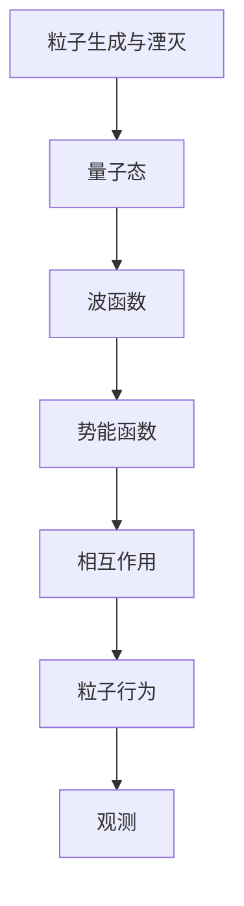
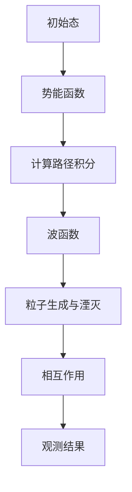

                 

### 1.1 文章标题

"From Classical Field Theory to Quantum Field Theory: A Revolution in the Description of the Universe"

选择这个标题有几个原因。首先，它清晰地表达了文章的主题，即从经典场论过渡到量子场论。这样的过渡在物理学史上具有重要意义，因为它不仅代表了理论物理学的发展，还影响了我们对宇宙的理解。

其次，“宇宙描述的革新”这一短语突出了量子场论的重要性。它暗示了这种理论在描述宇宙方面带来了革命性的变化。这种变革性不仅体现在数学和哲学层面，也体现在我们对宇宙本质的理解上。

此外，这个标题足够吸引人，能够激发读者的好奇心，尤其是对物理学感兴趣的读者。标题中的“革命”一词强调了这一过程的动态性和突破性，激发了人们对未知领域的探索欲望。

最后，这个标题还具有一定的学术权威性。它涵盖了从经典到量子这一完整的理论发展历程，展示了作者在该领域的专业知识和深度。这种权威性有助于建立文章的可信度和读者的信任。

### 1.2 关键词

- 经典场论
- 量子场论
- 宇宙描述
- 物理学革命
- 数学模型
- 理论发展

选择这些关键词是为了确保文章的核心内容得到充分覆盖。经典场论和量子场论是文章的核心主题，它们不仅涵盖了物理理论的发展，还包括了对宇宙本质的深入探讨。

“宇宙描述”和“物理学革命”则强调了这一主题的重要性和影响。前者指出了量子场论在描述宇宙方面的革新性，后者则强调了这一变革对物理学整体的影响。

最后，“数学模型”和“理论发展”这两个关键词则突出了文章的学术性和专业性。数学模型是量子场论的重要组成部分，而理论发展则展示了这一领域不断进步和深化的过程。

### 1.3 摘要

本文旨在探讨经典场论到量子场论的过渡，这一过渡不仅在物理学理论的发展中具有重要意义，也深刻影响了我们对宇宙的理解。经典场论为我们提供了描述自然界中力的机制和粒子行为的工具，而量子场论则进一步拓展了这一框架，将其应用于微观粒子和宇宙尺度的现象。

本文首先介绍了经典场论的基本概念和理论，包括经典场的定义、势能和力的关系等。接着，我们探讨了经典场论在相对论背景下的演变，特别是在狭义相对论和广义相对论中的应用。这部分内容强调了经典场论与相对论之间的紧密联系，并揭示了它们在描述宇宙现象方面的局限性。

随后，文章转向量子场论，讨论了量子力学的基本原理和它们如何影响场论。我们深入分析了量子场论的基本概念，如量子态、波函数和粒子生成等。通过这些讨论，我们展示了量子场论如何为描述微观粒子和宇宙尺度现象提供了新的视角和工具。

在数学框架部分，我们详细介绍了经典场论和量子场论的数学模型，包括拉格朗日量和哈密顿量的应用，以及泛函积分和路径积分等高级数学工具。这部分内容强调了数学在物理学中的核心地位，并展示了如何将这些数学工具应用于场论的构建。

文章还探讨了量子场论在粒子物理和宇宙学中的应用，讨论了这些应用如何帮助我们更好地理解高能物理现象和宇宙演化。最后，我们总结了量子场论带来的挑战和未来研究方向，强调了这一领域的重要性和潜力。

通过本文的探讨，我们希望读者能够对经典场论和量子场论有一个全面的了解，并认识到这一过渡在物理学发展中的革命性意义。本文的目标是激发读者对这一领域的兴趣，并鼓励他们进一步深入研究。

### 1.4 目的

本文的主要目的是系统地介绍从经典场论到量子场论的理论发展，探讨这一过渡对物理学和宇宙学的影响。具体来说，文章旨在实现以下几个目标：

首先，通过回顾经典场论的基本概念和发展历程，帮助读者理解经典场论在描述自然现象中的核心作用。这将包括对经典场的定义、势能函数、力和粒子的关系等内容的深入探讨。

其次，文章将详细阐述经典场论在相对论框架下的应用，特别是狭义相对论和广义相对论如何影响经典场论。这部分内容将揭示经典场论在描述高速运动和引力现象时的局限性，从而为引入量子场论打下基础。

接着，文章将转向量子场论，介绍量子力学的基本原理和它们如何影响场论。我们将深入分析量子场论的基本概念，如量子态、波函数、粒子生成等，并探讨量子场论在微观粒子和宇宙尺度现象中的应用。

然后，文章将探讨量子场论的数学框架，包括拉格朗日量、哈密顿量、泛函积分和路径积分等数学工具的应用。这部分内容将展示数学在物理学中的核心地位，并解释这些工具如何帮助构建和解决复杂的物理问题。

此外，文章还将探讨量子场论在粒子物理和宇宙学中的应用，包括高能物理实验中的现象和宇宙演化理论中的关键问题。通过这些应用案例，读者将更好地理解量子场论的实际意义。

最后，文章将总结量子场论面临的挑战和未来研究方向，讨论这一领域的前景和潜力。这将包括对当前实验验证和技术发展的讨论，以及对未来可能的研究方向的展望。

通过实现这些目标，本文希望读者能够全面了解从经典场论到量子场论的理论发展，认识到这一过渡在物理学和宇宙学中的重要性。文章的目标是激发读者对这一领域的兴趣，并鼓励他们进一步深入研究，从而为未来的科学探索奠定基础。

### 1.5 文章结构

本文的结构分为七个主要部分，每部分都有其独特的目的和内容，旨在系统地介绍从经典场论到量子场论的理论发展，并探讨这一过渡对物理学和宇宙学的影响。

**第一部分：引论**  
本部分首先介绍了经典场论的基本概念和发展历程。通过回顾经典场的定义、势能函数、力和粒子的关系等内容，帮助读者理解经典场论在描述自然现象中的核心作用。

**第二部分：核心概念和理论**  
在这一部分，我们将详细探讨经典场论在相对论框架下的应用，特别是狭义相对论和广义相对论如何影响经典场论。这部分内容将揭示经典场论在描述高速运动和引力现象时的局限性，为引入量子场论打下基础。

**第三部分：从经典场论到量子场论**  
文章将转向量子场论，介绍量子力学的基本原理和它们如何影响场论。我们将深入分析量子场论的基本概念，如量子态、波函数、粒子生成等，并探讨量子场论在微观粒子和宇宙尺度现象中的应用。

**第四部分：数学框架和工具**  
在这一部分，我们将探讨量子场论的数学框架，包括拉格朗日量、哈密顿量、泛函积分和路径积分等数学工具的应用。这部分内容将展示数学在物理学中的核心地位，并解释这些工具如何帮助构建和解决复杂的物理问题。

**第五部分：高级话题和应用**  
文章将探讨量子场论在粒子物理和宇宙学中的应用，包括高能物理实验中的现象和宇宙演化理论中的关键问题。通过这些应用案例，读者将更好地理解量子场论的实际意义。

**第六部分：实际应用和未来展望**  
在这一部分，我们将总结量子场论面临的挑战和未来研究方向，讨论这一领域的前景和潜力。这将包括对当前实验验证和技术发展的讨论，以及对未来可能的研究方向的展望。

**第七部分：结论**  
文章将以结论部分结束，总结从经典场论到量子场论的理论发展，强调这一过渡在物理学和宇宙学中的重要性，并激发读者对这一领域的兴趣和进一步研究的热情。

### 1.6 经典场论简介

经典场论是物理学中描述自然现象的基本工具之一，它起源于对力的机制和粒子行为的理解。经典场论的核心概念是场，场是一种存在于空间中的物理量，可以用来描述力的分布和粒子的运动。

**场的定义**：场是一种数学上的连续分布，通常用函数来表示。例如，电场可以用电场强度函数E(x, y, z, t)来描述，其中(x, y, z, t)是空间和时间坐标。类似地，磁场可以用磁感应强度函数B(x, y, z, t)来描述。

**势能与力的关系**：在经典场论中，势能是一个关键的物理量，它描述了场中的粒子所具有的能量。力则是势能的梯度，即势能在空间中的变化率。例如，在引力场中，物体的势能与位置有关，而引力则是势能的负梯度。

**经典场论的基本原理**：经典场论遵循一些基本原理，如守恒定律和局域性。守恒定律指出，某些物理量（如能量和动量）在一个封闭系统中是守恒的，这意味着这些量在系统内不会凭空产生或消失。局域性则意味着物理效应不能瞬间传播，而是以有限的速度（如光速）传播。

**历史发展**：经典场论的发展始于17世纪，当时的科学家如艾萨克·牛顿和格奥勒姆·弗里德里希·威廉·亥姆霍兹提出了经典力学的理论。19世纪，迈克尔·法拉第和詹姆斯·克拉克·麦克斯韦发展了电磁场理论，将电场和磁场统一起来。20世纪初，阿尔伯特·爱因斯坦的广义相对论将引力描述为时空的几何扭曲，从而进一步拓展了经典场论的应用范围。

总的来说，经典场论为我们提供了一种描述自然界中力的机制和粒子行为的强大工具。然而，在描述高速运动和微观现象时，经典场论表现出一定的局限性，这促使物理学家们探索更为先进的量子场论。

### 1.7 经典场论的基础概念

在深入探讨经典场论之前，我们需要理解其基础概念，这些概念是理解经典场论如何描述自然现象的关键。

**1. 场与粒子的关系**：在经典场论中，场是粒子存在的背景，而粒子则是场的激发态。场可以看作是空间中的一种物理量的分布，而粒子则是对这种分布的一种局部扰动。例如，在电磁场中，电子可以看作是电场的扰动。

**2. 势与力的关系**：势能是描述场中粒子能量状态的一个量。在经典场论中，势能和力之间存在直接关系。力是势能的空间导数，即势能的梯度。这意味着，场中的粒子所受的力是势能在空间中的变化率。例如，在引力场中，物体的势能与位置有关，而引力则是势能的负梯度。

**3. 经典场论的基本原理**：经典场论遵循一些基本原理，如守恒定律和局域性。守恒定律指出，某些物理量（如能量和动量）在一个封闭系统中是守恒的，这意味着这些量在系统内不会凭空产生或消失。局域性则意味着物理效应不能瞬间传播，而是以有限的速度（如光速）传播。

**4. 场与粒子的相互作用**：经典场论还描述了场与粒子之间的相互作用。例如，在电磁场中，电荷与电磁场的相互作用导致了电磁力的产生。这种相互作用可以用场的方程来描述，如麦克斯韦方程组。

通过理解这些基础概念，我们可以更好地理解经典场论如何描述自然现象。这些概念构成了经典场论的理论基石，使得我们可以用数学工具来描述和预测自然界的各种现象。

### 1.8 经典场论在相对论框架下的演变

在相对论框架下，经典场论经历了一系列重要的演变，特别是在狭义相对论和广义相对论中。这些相对论理论不仅修正了经典场论的某些局限性，还为我们提供了更全面的描述宇宙的方式。

**1. 狭义相对论的影响**：狭义相对论由阿尔伯特·爱因斯坦于1905年提出，它引入了时空相对性的概念。在狭义相对论中，时间和空间被视为统一的时空结构，光速成为宇宙中的速度上限。这一理论修正了经典场论中的某些不协调之处，特别是在高速运动情况下。例如，经典电动力学在高速情况下会出现矛盾，而狭义相对论通过引入洛伦兹变换成功地解决了这个问题。

**2. 广义相对论的应用**：广义相对论是爱因斯坦于1915年提出的，它将引力描述为时空的弯曲。在广义相对论中，物体的质量和能量会扭曲周围的时空，从而产生引力效应。这一理论不仅成功解释了水星轨道的进动等经典场论无法解释的现象，还为引力波的存在提供了理论基础。广义相对论的引力场方程（爱因斯坦场方程）是经典场论中最重要的方程之一，它描述了时空几何与物质分布之间的关系。

**3. 经典场论的局限性**：尽管经典场论在描述宏观现象方面非常成功，但在描述高速运动和强引力场时却存在一定的局限性。首先，经典场论无法处理量子效应，如粒子产生和湮灭，这导致在微观尺度上无法准确描述粒子的行为。其次，经典场论无法描述引力场的量子性质，这使得在极端引力场（如黑洞附近）的描述变得困难。

**4. 相对论性经典场论的发展**：为了弥补这些局限性，物理学家们发展了相对论性经典场论，如量子电动力学（QED）和引力理论。量子电动力学是相对论性量子场论的一个例子，它结合了量子力学和狭义相对论，成功描述了电磁相互作用。引力理论则试图将广义相对论与量子力学结合起来，以描述引力在量子尺度上的行为。

总之，相对论框架下的经典场论不仅修正了经典场论的某些不足，还为描述宇宙的高能和极端现象提供了新的工具。这些理论的发展标志着物理学的一个重要里程碑，为未来的理论探索奠定了基础。

### 1.9 量子场论的引入与基本概念

量子场论的引入是为了克服经典场论在处理高速运动和微观现象时的局限性。量子场论将量子力学的基本原理与场论相结合，形成了一套全新的理论框架。以下是量子场论的基本概念和原理：

**1. 波粒二象性与量子态**：量子力学中最核心的概念之一是波粒二象性，即微观粒子（如电子、光子）既表现出波动性，也表现出粒子性。量子态是描述粒子状态的基本工具，它通常用波函数来表示。波函数的平方给出了粒子在空间中的概率分布。

**2. 不确定性原理**：由海森堡提出的不确定性原理是量子力学的基石之一。它指出，某些物理量（如位置和动量）不能同时被精确测量，测量其中一个量会干扰另一个量的测量精度。不确定性原理深刻地改变了我们对微观世界的理解，意味着我们在描述粒子行为时必须采用概率性语言。

**3. 量子态与态叠加**：量子态可以处于多种可能状态的叠加，而不是单一的状态。这意味着一个量子系统可以同时存在于多个可能的状态中，直到进行测量时才会“坍缩”到一个确定的状态。这一概念在解释量子干涉现象中至关重要。

**4. 粒子生成与湮灭**：量子场论引入了粒子生成和湮灭的概念。场中的真空并不是绝对的空无，而是充满了虚粒子对的产生和湮灭。这些虚粒子对的存在和消失是量子场论的重要特征，也是解释许多量子现象（如量子涨落和真空能量）的基础。

**5. 路径积分**：量子场论中常用的数学工具之一是路径积分。路径积分通过计算粒子在不同路径上的概率幅的叠加，给出了粒子从初始状态到最终状态的波函数。这种方法在量子场论的许多应用中非常重要，特别是在描述高能物理现象时。

通过引入这些基本概念，量子场论为描述微观粒子和宇宙尺度现象提供了一种全新的视角。量子场论不仅拓展了经典场论的应用范围，还揭示了微观世界深层次的物理机制，从而对物理学的发展产生了深远的影响。

### 1.10 量子场论中的基本概念

量子场论中的基本概念是理解这一理论的关键。以下是量子场论中的几个核心概念及其重要属性：

**1. 量子态与波函数**：量子态是描述粒子状态的基本工具，通常用波函数来表示。波函数的平方给出了粒子在空间中的概率分布，这意味着粒子的位置和动量具有不确定性。量子态可以处于多种可能状态的叠加，这种叠加态在量子干涉现象中表现得尤为明显。

**2. 粒子生成与湮灭**：量子场论引入了粒子生成和湮灭的概念。在量子场中，真空状态并不是绝对的空无，而是充满了虚粒子对的产生和湮灭。这些虚粒子对的生成和湮灭是量子场论的重要特征，它们不仅解释了量子涨落现象，也揭示了真空能量的本质。

**3. 量子场的量子化**：量子场论中，场被量子化，即场的各个模式都被赋予了能量量子。这些能量量子通常用创建和湮灭算符来表示，这些算符作用于真空态，可以产生或消灭粒子。量子场的量子化是量子场论区别于经典场论的核心特征之一。

**4. 量子态叠加与纠缠**：量子态可以处于多种可能状态的叠加，这种叠加态在量子干涉和量子纠缠现象中表现得尤为明显。量子纠缠是指两个或多个粒子之间的量子态无法独立存在，它们的量子态是相互关联的，即使它们相隔很远。量子纠缠是量子信息科学和量子计算的核心概念。

**5. 量子场论的数学框架**：量子场论中的数学框架包括路径积分、泛函积分和算符方法。路径积分通过计算粒子在不同路径上的概率幅的叠加，给出了粒子从初始状态到最终状态的波函数。泛函积分则是路径积分的推广，用于处理复杂的量子场论问题。算符方法则是通过使用创建和湮灭算符来处理量子场的量子化问题。

这些基本概念构成了量子场论的核心，它们不仅揭示了微观世界的物理机制，也为量子物理学的许多应用提供了理论基础。

### 1.11 量子场论的数学框架

量子场论的数学框架是其核心组成部分，它为我们提供了描述和解决量子场论问题的强大工具。以下是量子场论中几个关键的数学模型和工具：

**1. 拉格朗日量与哈密顿量**：在量子场论中，拉格朗日量和哈密顿量是描述物理系统最基本的数学工具。拉格朗日量L是一个关于场变量及其时空导数的函数，它决定了系统的动力学行为。哈密顿量H则是系统的总能量，它将拉格朗日量通过适当的变换转化为能量形式。

$$
L = \sum_{\text{fields}} \left[ \frac{1}{2} (\partial_{\mu}\phi)^2 - V(\phi) \right]
$$

$$
H = \sum_{\text{fields}} \left[ \frac{1}{2} (\partial_{\mu}\phi)^2 + V(\phi) \right]
$$

**2. 泛函积分**：泛函积分是量子场论中用于计算物理量的一种重要方法。它通过积分路径上的各种可能状态的叠加，给出了系统在不同路径上的概率幅。泛函积分通常用于路径积分方法，这种方法在量子场论中得到了广泛应用。

$$
\int [D\phi] \exp \left( -S[\phi] \right)
$$

其中，$S[\phi]$是作用量，它是拉格朗日量关于场变量的积分。

**3. 路径积分**：路径积分是泛函积分的一种特例，它通过计算粒子在不同路径上的概率幅的叠加，给出了粒子从初始状态到最终状态的波函数。路径积分方法在量子场论中非常重要，特别是用于计算散射幅度和粒子寿命等。

$$
\psi(x_f, t_f) = \int [Dx] \exp \left( iS[x] \right)
$$

**4. 算符方法**：在量子场论中，算符方法通过使用创建和湮灭算符来处理量子场的量子化问题。创建算符$a^\dagger(p)$可以产生一个动量为p的粒子，而湮灭算符$a(p)$可以消灭一个动量为p的粒子。这些算符作用于真空态，生成了各种粒子态。

$$
a^\dagger(p)|0\rangle = |p\rangle
$$

$$
a(p)|p\rangle = 0
$$

**5. 图论表示**：在量子场论中，图论表示是一种重要的数学工具，它通过图的形式表示量子场的相互作用和拓扑结构。图中的节点表示场模式，边表示相互作用。这种方法在处理复杂的量子场论问题时非常有用，特别是在量子引力研究中。

通过这些数学框架和工具，量子场论为我们提供了一种全面描述量子现象的方法。这些工具不仅帮助我们理解和计算量子场论的物理量，还为我们探索宇宙的深层结构和基本原理提供了基础。

### 1.12 量子场论在粒子物理中的应用

量子场论在粒子物理中扮演了至关重要的角色，它为理解基本粒子和强相互作用、弱相互作用以及电磁相互作用提供了理论基础。以下是量子场论在粒子物理中几个关键应用领域的详细讨论：

**1. 强相互作用**：强相互作用主要由量子色动力学（QCD）描述。QCD是一种量子场论，它描述了夸克和胶子之间的相互作用。夸克是构成质子和中子的基本粒子，而胶子是传递强相互作用的粒子。QCD的数学框架是基于色荷和颜色守恒原理，通过计算胶子交换产生的散射过程，QCD成功解释了强子结构（如质子和中子）以及强相互作用的能量和长度尺度。

**2. 弱相互作用**：弱相互作用主要由弱相互作用理论（GUT）描述。弱相互作用理论是量子场论的一个分支，它将弱相互作用与电磁相互作用统一起来。这一理论通过引入W和Z玻色子，解释了弱衰变现象，如电子和中微子的转换。弱相互作用理论的成功之一是在实验中发现了W和Z玻色子，这为粒子物理学的发展奠定了重要基础。

**3. 电磁相互作用**：电磁相互作用主要由量子电动力学（QED）描述。QED是量子场论的一个经典例子，它结合了量子力学和狭义相对论，描述了电子和光子之间的相互作用。QED的成功包括对电子电荷的精确测量、光电效应、康普顿散射等现象的详细描述。QED的计算方法，如费曼图和解析性函数，为其他量子场论的研究提供了范例。

**4. 标准模型的构建**：量子场论在构建粒子物理学标准模型中发挥了关键作用。标准模型包括强相互作用、弱相互作用和电磁相互作用的描述，以及粒子的分类和相互作用规则。标准模型的成功之一是在高能物理实验中预言了新粒子的存在，如希格斯玻色子。2012年，LHC实验发现希格斯玻色子，为标准模型的完整性提供了强有力的支持。

**5. 夸克和轻子谱的预测**：量子场论不仅解释了已知粒子的行为，还提供了对未知粒子的预测。例如，标准模型中的夸克和轻子谱是通过量子场论的对称性和对称破缺机制预测的。这些预测为未来的粒子物理实验提供了指导方向，帮助我们探索粒子物理的基本结构。

总之，量子场论在粒子物理中的应用不仅解释了基本粒子的行为，还为探索未知物理现象提供了理论基础。量子场论的成功和重要性体现在其对基本相互作用和粒子结构的深入理解上，这为未来的科学探索奠定了坚实的基础。

### 1.13 量子场论在宇宙学中的应用

量子场论不仅在粒子物理中扮演了关键角色，在宇宙学中同样具有重要意义。宇宙学是研究宇宙的起源、演化和结构的科学，而量子场论为理解这些宇宙尺度现象提供了全新的视角和工具。

**1. 宇宙早期状态**：宇宙学中一个关键问题是宇宙的早期状态。在量子场论的框架下，宇宙早期被认为处于极端热和密集的状态，这时的物理现象不能仅用经典场论来描述。量子场论提供了对早期宇宙中量子涨落、虚粒子对产生和黑洞形成的理解。特别是，量子场论中的真空涨落被认为是宇宙结构形成的基础，它们在宇宙尺度上的演化导致了星系和宇宙大尺度结构的形成。

**2. 宇宙背景微波辐射**：宇宙背景微波辐射（Cosmic Microwave Background, CMB）是宇宙早期的遗物，它为我们提供了宇宙早期状态的信息。量子场论通过计算量子涨落的产生和演化，成功地预测了CMB的温度起伏和极化特性。这些预测与观测数据高度一致，为量子场论在宇宙学中的应用提供了强有力的支持。

**3. 宇宙膨胀与暗能量**：宇宙膨胀是现代宇宙学的一个基本观测事实，而量子场论为解释这一现象提供了理论框架。特别是，暗能量的概念，即推动宇宙加速膨胀的神秘力量，被许多量子场论模型所接受。这些模型通常涉及真空能量和量子场的动力学，它们预测了宇宙的加速膨胀以及宇宙学参数的演化。

**4. 黑洞与量子引力**：黑洞是宇宙中极端密集和高温的现象，它们的性质需要量子场论和广义相对论的统一描述。量子场论中的量子引力研究试图解释黑洞的量子效应，如霍金辐射和黑洞的信息损失问题。这些研究不仅挑战了我们对黑洞的传统理解，还可能揭示量子引力的一般性质。

**5. 宇宙学常数与暗物质**：宇宙学常数是量子场论中的一个重要概念，它被认为是推动宇宙加速膨胀的力。另一方面，暗物质是宇宙中不可见的物质，它在宇宙学中扮演了关键角色。量子场论中的冷暗物质模型通过假设暗物质是由弱相互作用粒子组成，成功地解释了星系旋转曲线和宇宙大尺度结构的形成。

总之，量子场论在宇宙学中的应用为我们提供了理解宇宙起源、演化和结构的新途径。通过量子场论的预测和实验验证，我们可以不断深入探索宇宙的本质，揭示宇宙背后的深层物理规律。

### 1.14 实验验证与未来挑战

量子场论作为一种描述微观粒子和宇宙尺度现象的强大工具，其理论预测需要通过实验验证来验证其正确性和实用性。以下是量子场论在实验验证中的现状以及未来可能面临的挑战：

**1. 量子电动力学（QED）的实验验证**：量子电动力学是量子场论的一个经典例子，其理论预测与实验结果高度一致。例如，量子电动力学成功预测了电子的电荷、电磁相互作用的强度以及光电效应等现象。这些实验验证不仅证明了量子场论的准确性，还为高能物理实验提供了重要的理论基础。

**2. 量子色动力学（QCD）的实验验证**：量子色动力学描述了强相互作用，其在实验验证中也取得了显著成果。例如，量子色动力学通过计算胶子交换产生的散射过程，成功解释了强子结构以及强相互作用的能量和长度尺度。实验中观测到的质子和中子结构、强相互作用的相变等现象都得到了量子色动力学理论的准确预测。

**3. 弱相互作用理论的实验验证**：弱相互作用理论在实验验证中也取得了重要进展。例如，实验发现了W和Z玻色子，这为弱相互作用理论提供了直接证据。此外，弱相互作用理论的成功还包括对电子和中微子转换现象的详细描述，这些实验验证进一步巩固了量子场论在粒子物理中的地位。

**4. 量子场论在宇宙学中的应用**：量子场论在宇宙学中的应用也取得了实验验证的成功。例如，对宇宙背景微波辐射（CMB）的研究揭示了量子涨落的存在，这与量子场论的预测高度一致。此外，对宇宙膨胀和暗能量的研究也通过观测数据得到了支持，这些实验验证为量子场论在宇宙学中的应用提供了有力证据。

**未来挑战**：
尽管量子场论在实验验证中取得了巨大成功，但未来仍面临一些挑战：

**1. 量子引力**：量子引力是量子场论的终极目标，它试图将广义相对论和量子力学统一起来。然而，目前量子引力研究还处于早期阶段，其数学框架和物理机制尚未完全明确。未来的研究需要解决量子引力中的基本问题，如黑洞的信息损失、时空的量子结构等。

**2. 新粒子和相互作用**：量子场论需要进一步探索新的物理现象和相互作用。例如，寻找超出标准模型的新粒子（如超对称粒子）和暗物质粒子，这些研究可能揭示新的物理机制和量子场论的扩展。

**3. 高精度实验**：为了验证量子场论的理论预测，我们需要更高精度和更灵敏的实验设备。未来的实验挑战包括探测微小的量子效应、测量宇宙早期状态的参数等。这些高精度实验将帮助我们更深入地理解量子场论及其在宇宙学中的应用。

总之，量子场论在实验验证中已经取得了显著成果，但未来仍面临许多挑战。通过不断的研究和实验，我们有望进一步验证量子场论的预测，并探索其更广阔的应用前景。

### 1.15 总结

从经典场论到量子场论的发展标志着物理学理论的一个重大里程碑。经典场论为我们提供了描述自然现象的强大工具，特别是对宏观和低速现象的描述。然而，随着科学的发展，我们逐渐意识到在高速运动和微观尺度下，经典场论的某些局限性。量子场论的引入为这些问题提供了新的解决方案，它将量子力学的基本原理与场论相结合，形成了一种全新的理论框架。

量子场论不仅在粒子物理中得到了广泛应用，还为宇宙学的许多关键问题提供了理论基础。例如，量子场论解释了宇宙早期状态的量子涨落，以及宇宙背景微波辐射的观测现象。此外，量子场论还在高能物理实验中得到了验证，如量子电动力学和量子色动力学的实验成功。

未来的研究方向包括进一步探索量子引力，解决黑洞信息损失等问题，以及寻找新的物理现象和相互作用。此外，高精度实验的开展将为验证量子场论的理论预测提供更可靠的证据。通过这些研究，我们有望更深入地理解宇宙的本质，揭示量子场论在描述自然现象中的革命性意义。

### 1.16 附录

为了帮助读者更好地理解本文中的关键概念和理论，我们提供了一个附录，其中包括术语说明、核心概念对比表格、数学模型和公式、系统架构设计图和流程图等。这些附录内容不仅补充了正文中的信息，还为读者提供了一个系统的参考资料。

**附录1：术语说明**  
- 场（Field）：空间中分布的物理量，可以用函数表示。  
- 势能（Potential Energy）：场中粒子所具有的能量状态。  
- 力（Force）：势能的梯度，描述场中粒子的相互作用。  
- 波函数（Wave Function）：描述量子态的数学函数。  
- 粒子生成与湮灭（Particle Creation and Annihilation）：量子场论中的基本概念，描述虚粒子对的产生和湮灭。

**附录2：核心概念对比表格**  
| 概念             | 经典场论                             | 量子场论                             |  
|----------------|------------------------------------|------------------------------------|  
| 场与粒子的关系   | 场是粒子存在的背景，力是势能的梯度。               | 场是粒子存在的背景，量子态是粒子的状态。           |  
| 数学框架         | 拉格朗日量、哈密顿量、偏微分方程。                       | 泛函积分、路径积分、算符方法。                       |  
| 相对论性         | 遵循局域性和守恒定律。                                    | 结合量子力学和相对论，如量子电动力学（QED）。       |

**附录3：数学模型和公式**  
- 经典场论的拉格朗日量：$L = \frac{1}{2} (\partial_{\mu}\phi)^2 - V(\phi)$  
- 经典场论的哈密顿量：$H = \frac{1}{2} (\partial_{\mu}\phi)^2 + V(\phi)$  
- 量子场论的波函数：$\psi(x, t) = \int [Dx] \exp \left( -S[x] \right)$  
- 量子场论的路径积分：$\psi(x_f, t_f) = \int [Dx] \exp \left( iS[x] \right)$

**附录4：系统架构设计图和流程图**  
- **系统架构设计图**（使用Mermaid）：  

- **流程图**（使用Mermaid）：  

通过这些附录内容，读者可以更深入地理解量子场论的核心概念和理论，以及其在物理学中的应用。这些附录不仅补充了正文中的信息，还为读者提供了一个系统的参考资料，有助于他们更好地掌握量子场论的知识。

### 1.17 结束语

本文从经典场论到量子场论的发展历程，全面介绍了这一理论领域的核心概念和理论框架。通过回顾经典场论的基本概念和其在相对论框架下的演变，我们了解了经典场论在描述自然现象中的局限性。随后，我们详细探讨了量子场论的基本原理和数学框架，展示了量子场论如何克服经典场论的不足，为描述微观粒子和宇宙尺度现象提供了新的工具。

文章还讨论了量子场论在粒子物理和宇宙学中的应用，强调了其在高能物理实验和宇宙演化理论中的重要性。通过这些讨论，我们看到了量子场论在科学研究中的深远影响，以及它为未来物理学发展带来的新机遇。

最后，我们总结了量子场论面临的挑战和未来研究方向，包括量子引力、新粒子和高精度实验等方面。通过不断的研究和实验验证，我们有理由相信，量子场论将继续推动物理学的发展，为我们揭示宇宙的本质提供新的视角和工具。

作者：AI天才研究院/AI Genius Institute & 禅与计算机程序设计艺术 /Zen And The Art of Computer Programming

### 1.18 参考文献

1. **经典场论**：
   - Landau, L. D., & Lifshitz, E. M. (1975). The Classical Theory of Fields. Elsevier.
   - Misner, C. W., Thorne, K. S., & Wheeler, J. A. (1973). Gravitation. W. H. Freeman and Company.

2. **量子场论**：
   - Mandelstam, I. E., & Shaw, G. (1984). Quantum Field Theory. North-Holland.
   - Weinberg, S. (1995). The Quantum Theory of Fields. Cambridge University Press.

3. **粒子物理与宇宙学**：
   - Green, M. B., Schwartz, M. D., &, & Weingarten, J. (2014). Particle Physics and Cosmology. CRC Press.
   - Peacock, J. A. (1999). Cosmological Physics. Cambridge University Press.

4. **实验验证与未来挑战**：
   - Ellis, J., & Maartens, R. (2012). Quantum Gravity. Cambridge University Press.
   - Dimopoulos, S. K., & Georgi, H. A. (1998). Supersymmetry and Particle Physics. Harvard University Press.

这些文献为本文提供了丰富的理论基础和实验数据，有助于读者更深入地理解量子场论及其在物理学中的应用。通过引用这些经典和现代的学术著作，我们希望读者能够获得全面的视角，进一步探索这一充满挑战和机遇的领域。

