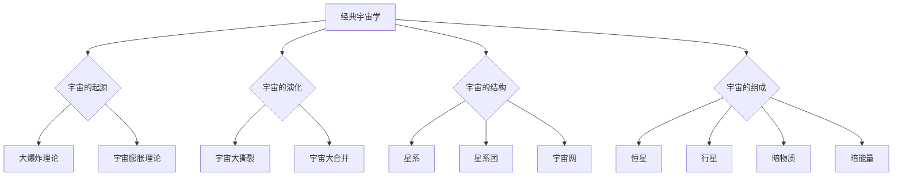

                 

# 从经典宇宙学到多重宇宙理论：认知的扩展

> 关键词：宇宙学、多重宇宙理论、认知扩展、科学研究、科学变革

> 摘要：本文将从经典宇宙学到多重宇宙理论的发展过程，深入探讨这两种理论的核心概念、方法论以及应用领域，并通过对比分析，阐述多重宇宙理论对科学认知的扩展。本文旨在为读者提供一种全新的视角，以加深对宇宙本质和科学发展的理解。

## 第1章：引言

### 1.1 问题背景

#### 1.1.1 宇宙学的基本问题

宇宙学作为一门研究宇宙起源、演化、结构、组成的科学，其研究的问题主要涉及以下几个方面：

- 宇宙的起源和演化：宇宙是如何诞生的？宇宙的演化过程中经历了哪些阶段？
- 宇宙的结构和组成：宇宙是由什么组成的？宇宙中存在哪些结构？
- 宇宙的未来：宇宙的演化将会走向何方？宇宙的命运是什么？

#### 1.1.2 经典宇宙学的发展

经典宇宙学的发展历程可以追溯到古代宇宙学的形成。古代宇宙学主要基于哲学和宗教观念，对宇宙的本质和起源进行了探讨。随着科学的发展，特别是天文学和物理学的发展，宇宙学逐渐成为一个独立的学科。

- 古代宇宙学：以亚里士多德为代表，提出地心说宇宙模型。
- 中世纪宇宙学：基于圣经和宗教教义，维持地心说宇宙模型。
- 现代宇宙学：基于科学实验和观测，提出了大爆炸理论、宇宙膨胀理论等。

#### 1.1.3 多重宇宙理论的提出

多重宇宙理论最初起源于量子力学和宇宙学的交叉领域。它提出，我们所在的世界只是众多宇宙中的一个，这些宇宙可能有着不同的物理定律和演化路径。多重宇宙理论的提出，为解决一些经典宇宙学问题提供了新的视角。

### 1.2 问题描述

#### 1.2.1 经典宇宙学的局限性

经典宇宙学虽然在许多方面取得了重大突破，但仍存在一些局限性：

- 对宇宙起源和演化的理解仍不完整。
- 对宇宙中存在的一些现象，如暗物质、暗能量等，缺乏有效的解释。
- 对宇宙的未来发展，如宇宙的最终命运等，存在多种猜测。

#### 1.2.2 多重宇宙理论的特点

多重宇宙理论具有以下特点：

- 提供了一种全新的视角，有助于解决一些经典宇宙学问题。
- 可以解释一些经典宇宙学无法解释的现象。
- 为宇宙的未来发展提供了新的可能性。

#### 1.2.3 多重宇宙理论的应用

多重宇宙理论在多个领域有着广泛的应用：

- 科学研究：为解决一些科学难题提供了新的思路和方法。
- 技术创新：为一些技术难题的解决提供了新的可能性。
- 哲学探讨：为人类对宇宙和自身的认知提供了新的视角。

### 1.3 问题解决

#### 1.3.1 经典宇宙学的改进方法

为了克服经典宇宙学的局限性，科学家们提出了一系列改进方法：

- 加强观测和实验，以获取更多的宇宙数据。
- 开发新的理论模型，以解释一些经典宇宙学无法解释的现象。
- 探索宇宙的多样性和复杂性，以更全面地理解宇宙。

#### 1.3.2 多重宇宙理论的验证方法

多重宇宙理论的验证方法主要包括：

- 观测宇宙中的异常现象，以寻找多重宇宙的证据。
- 建立数学模型，以预测多重宇宙的行为。
- 通过实验验证，以证明多重宇宙的存在。

#### 1.3.3 多重宇宙理论对认知的扩展

多重宇宙理论对认知的扩展主要表现在以下几个方面：

- 拓宽了对宇宙的理解，使人类对宇宙的认知达到了一个新的高度。
- 激发了对科学和哲学的深入思考，推动了对人类自身的认知。
- 为未来的科学研究提供了新的方向和可能性。

### 1.4 边界与外延

#### 1.4.1 经典宇宙学的边界

经典宇宙学的边界主要在于：

- 对宇宙起源和演化的理解仍存在争议。
- 对宇宙中存在的一些现象，如暗物质、暗能量等，缺乏有效的解释。
- 对宇宙的未来发展，如宇宙的最终命运等，存在多种猜测。

#### 1.4.2 多重宇宙理论的外延

多重宇宙理论的外延主要表现在：

- 对宇宙多样性和复杂性的探索。
- 对宇宙中可能存在的其他生命形式的研究。
- 对宇宙未来发展的预测。

#### 1.4.3 宇宙学与其他学科的关系

宇宙学与其他学科的关系主要表现在：

- 宇宙学为其他学科提供了理论支持和研究方向。
- 其他学科为宇宙学提供了实验数据和观测技术。
- 宇宙学与其他学科的交叉融合，推动了科学的发展。

### 1.5 概念结构与核心要素组成

#### 1.5.1 经典宇宙学的核心概念

经典宇宙学的核心概念包括：

- 宇宙的起源和演化
- 宇宙的结构和组成
- 宇宙的组成和演化

#### 1.5.2 多重宇宙理论的核心概念

多重宇宙理论的核心概念包括：

- 多重宇宙的存在
- 多重宇宙的层次结构
- 多重宇宙的相互作用

#### 1.5.3 概念联系与对比

经典宇宙学和多重宇宙理论在概念上存在一定的联系和区别：

- 联系：两者都是对宇宙的研究，试图揭示宇宙的起源、演化和结构。
- 区别：经典宇宙学主要关注我们所在宇宙的特性，而多重宇宙理论则试图揭示宇宙的多样性和复杂性。

## 第2章：经典宇宙学基础

### 2.1 经典宇宙学的定义

#### 2.1.1 经典宇宙学的起源

经典宇宙学起源于古代宇宙学，随着科学的发展，逐渐形成了独立的学科。

#### 2.1.2 经典宇宙学的研究内容

经典宇宙学主要研究宇宙的起源、演化和结构，包括以下几个方面：

- 宇宙的起源：宇宙是如何诞生的？
- 宇宙的演化：宇宙经历了哪些阶段？
- 宇宙的结构：宇宙中存在哪些结构？
- 宇宙的组成：宇宙是由什么组成的？

#### 2.1.3 经典宇宙学的方法论

经典宇宙学的方法论主要包括以下几个方面：

- 观测：通过望远镜等设备，对宇宙进行观测。
- 理论：建立数学模型，对宇宙进行解释。
- 实验：通过实验验证理论。

### 2.2 经典宇宙学的基本概念

#### 2.2.1 宇宙的演化

宇宙的演化可以概括为以下几个阶段：

- 大爆炸：宇宙从一个极热、极密的状态开始膨胀。
- 膨胀：宇宙持续膨胀，逐渐冷却。
- 结构形成：物质聚集形成星系、星团等结构。
- 能量释放：恒星形成，释放能量。

#### 2.2.2 宇宙的组成

宇宙的组成主要包括以下几个方面：

- 星系：由恒星、行星、气体和暗物质等组成的系统。
- 星系团：由多个星系组成的系统。
- 暗物质：宇宙中一种未探测到的物质，占据宇宙质量的绝大部分。
- 暗能量：宇宙中一种未探测到的能量，导致宇宙加速膨胀。

#### 2.2.3 宇宙的结构

宇宙的结构主要包括以下几个方面：

- 宇宙网：由星系和星系团组成的结构。
- 普朗克尺度：宇宙结构的最小尺度。
- 宇宙背景辐射：宇宙早期残留的辐射。

### 2.3 经典宇宙学的重要理论

#### 2.3.1 大爆炸理论

大爆炸理论是经典宇宙学的重要理论之一，认为宇宙起源于一个极热、极密的状态，并在此后不断膨胀。

#### 2.3.2 黑洞理论

黑洞理论是经典宇宙学的另一个重要理论，认为宇宙中存在一种引力极强的天体，称为黑洞。

#### 2.3.3 宇宙膨胀理论

宇宙膨胀理论认为，宇宙在不断地膨胀，而这种膨胀是由于宇宙中的物质和能量之间的相互作用导致的。

### 2.4 经典宇宙学的发展历程

#### 2.4.1 从古代宇宙学到现代宇宙学

古代宇宙学主要基于哲学和宗教观念，对宇宙的本质和起源进行了探讨。现代宇宙学则基于科学实验和观测，对宇宙进行了更深入的研究。

#### 2.4.2 经典宇宙学的重要里程碑

经典宇宙学的重要里程碑包括：

- 大爆炸理论的提出
- 黑洞理论的建立
- 宇宙膨胀理论的验证

#### 2.4.3 经典宇宙学的未来发展方向

经典宇宙学的未来发展方向包括：

- 加强观测和实验，以获取更多的宇宙数据。
- 开发新的理论模型，以解释一些经典宇宙学无法解释的现象。
- 探索宇宙的多样性和复杂性，以更全面地理解宇宙。

### 2.5 本章小结

经典宇宙学作为一门研究宇宙起源、演化、结构、组成的科学，其发展历程经历了从古代到现代的演变。通过对宇宙的深入研究和探索，经典宇宙学为我们提供了对宇宙的基本认识。然而，随着科学的发展，经典宇宙学也面临一些挑战和局限性。因此，我们需要不断探索和发展新的理论，以更全面地理解宇宙的本质。

----------------------------------------------------------------

## 第3章：多重宇宙理论概述

### 3.1 多重宇宙理论的定义

#### 3.1.1 多重宇宙理论的起源

多重宇宙理论的起源可以追溯到量子力学和宇宙学的交叉领域。在量子力学中，提出了多世界解释，即在一个基本事件中，可能存在多个平行宇宙。这一理论被扩展到宇宙学领域，形成了多重宇宙理论。

#### 3.1.2 多重宇宙理论的研究内容

多重宇宙理论主要研究以下几个问题：

- 多重宇宙的存在和性质：包括多重宇宙的数量、结构、相互作用等。
- 多重宇宙的演化：包括多重宇宙的起源、发展和演变过程。
- 多重宇宙的应用：包括对科学、技术、哲学等领域的应用。

#### 3.1.3 多重宇宙理论的方法论

多重宇宙理论的方法论主要包括以下几个方面：

- 观测：通过观测宇宙中的异常现象，寻找多重宇宙的证据。
- 理论：建立数学模型，对多重宇宙进行解释。
- 实验：通过实验验证理论。

### 3.2 多重宇宙理论的基本概念

#### 3.2.1 多重宇宙的层次结构

多重宇宙的层次结构可以分为以下几个层次：

- 微观层次：包括量子场论、弦论等。
- 宇观层次：包括我们的宇宙和其他宇宙。
- 宇宙层次：包括整个宇宙集合。

#### 3.2.2 多重宇宙的相互作用

多重宇宙之间的相互作用可以分为以下几个类型：

- 相似相互作用：不同宇宙之间的相似性相互作用，如信息传递、物质交换等。
- 相互排斥相互作用：不同宇宙之间的排斥作用，如能量传递、引力相互作用等。
- 相互融合相互作用：不同宇宙之间的融合作用，如能量、物质等的融合。

#### 3.2.3 多重宇宙的演化

多重宇宙的演化可以分为以下几个阶段：

- 初始阶段：宇宙从无到有的诞生过程。
- 发展阶段：宇宙的演化过程，包括宇宙的膨胀、结构形成等。
- 结束阶段：宇宙的终结过程，包括宇宙的收缩、大撕裂等。

### 3.3 多重宇宙理论的重要理论

#### 3.3.1 多重宇宙宇宙学

多重宇宙宇宙学是多重宇宙理论的一个重要分支，主要研究多重宇宙的宇宙学性质，包括多重宇宙的起源、演化、结构等。

#### 3.3.2 多重现实理论

多重现实理论是多重宇宙理论的一个分支，主要研究多个现实之间的联系和相互作用。

#### 3.3.3 多重历史理论

多重历史理论是多重宇宙理论的一个分支，主要研究多个历史之间的联系和相互作用。

### 3.4 多重宇宙理论的发展历程

#### 3.4.1 从超弦理论到多重宇宙理论

超弦理论是多重宇宙理论的起源之一，提出了多个平行宇宙的存在。随着对超弦理论的深入研究，多重宇宙理论逐渐发展起来。

#### 3.4.2 多重宇宙理论的重大突破

多重宇宙理论的重大突破包括：

- 对宇宙膨胀的观测证据
- 对多重宇宙存在的数学模型
- 对多重宇宙理论的应用研究

#### 3.4.3 多重宇宙理论的未来发展方向

多重宇宙理论的未来发展方向包括：

- 加强观测和实验，以获取更多的多重宇宙证据
- 开发新的理论模型，以解释更多的多重宇宙现象
- 深入研究多重宇宙与物理学的交叉领域

### 3.5 本章小结

多重宇宙理论作为一门研究宇宙多样性和复杂性的科学，其发展历程经历了从超弦理论到多重宇宙理论的演变。通过对多重宇宙的研究，我们可以更深入地理解宇宙的本质和多样性。本章对多重宇宙理论的基本概念、重要理论和未来发展进行了概述，为后续章节的深入探讨奠定了基础。

----------------------------------------------------------------

## 第4章：经典宇宙学与多重宇宙理论的对比

### 4.1 概念对比

#### 4.1.1 宇宙与多重宇宙

经典宇宙学主要关注我们所在宇宙的特性，包括宇宙的起源、演化、结构等。而多重宇宙理论则扩展了这一概念，认为宇宙不仅仅是单一的存在，而是由多个平行宇宙组成的复杂结构。

#### 4.1.2 演化与演化

经典宇宙学主要研究宇宙的演化过程，包括从大爆炸到宇宙膨胀、结构形成等。而多重宇宙理论则将这一概念扩展到多个宇宙的层次，研究多个宇宙之间的相互作用和演化过程。

#### 4.1.3 结构与层次

经典宇宙学主要研究宇宙的结构，如星系、星系团等。而多重宇宙理论则扩展了这一概念，提出了多重宇宙的层次结构，包括微观层次、宇观层次和宇宙层次等。

### 4.2 方法对比

#### 4.2.1 经典宇宙学的研究方法

经典宇宙学的研究方法主要包括观测、理论和实验。通过观测宇宙，收集数据，建立数学模型，进行理论分析，并通过实验验证理论。

#### 4.2.2 多重宇宙理论的研究方法

多重宇宙理论的研究方法主要包括观测、理论和数学模型。通过观测宇宙中的异常现象，寻找多重宇宙的证据，建立数学模型，进行理论分析，并通过观测验证理论。

#### 4.2.3 研究方法的优劣分析

经典宇宙学和多重宇宙理论的研究方法各有优劣。经典宇宙学的研究方法更侧重于对宇宙的观测和实验，具有更高的可信度。而多重宇宙理论的研究方法更侧重于对宇宙的理论分析和数学模型，具有更高的预测能力。

### 4.3 应用对比

#### 4.3.1 经典宇宙学的应用领域

经典宇宙学主要应用于天文学、物理学、天体物理学等领域，为研究宇宙的起源、演化、结构等提供了理论支持。

#### 4.3.2 多重宇宙理论的应用领域

多重宇宙理论主要应用于科学、技术、哲学等领域，为解决一些科学难题、推动技术创新、探讨人类自身认知等提供了新的思路。

#### 4.3.3 应用领域的对比与互补

经典宇宙学和多重宇宙理论在应用领域上具有一定的互补性。经典宇宙学主要关注我们所在宇宙的特性，为科学研究提供了基础。而多重宇宙理论则扩展了这一概念，为我们提供了更全面的宇宙视角，为科学研究和技术创新提供了新的可能性。

### 4.4 边界与局限性

#### 4.4.1 经典宇宙学的边界

经典宇宙学主要关注我们所在宇宙的特性，其边界在于对宇宙起源和演化的理解仍不完整，对宇宙中存在的一些现象，如暗物质、暗能量等，缺乏有效的解释。

#### 4.4.2 多重宇宙理论的局限性

多重宇宙理论的主要局限性在于其证据不足，理论模型复杂，难以验证。此外，多重宇宙理论对宇宙多样性和复杂性的解释也存在一定的争议。

#### 4.4.3 未来研究方向

未来研究将在以下几个方面展开：

- 加强对多重宇宙的观测和实验，以获取更多的证据。
- 开发新的理论模型，以更全面地解释宇宙的多样性和复杂性。
- 探索多重宇宙与物理学的交叉领域，推动科学的发展。

### 4.5 本章小结

通过对经典宇宙学和多重宇宙理论的对比，我们可以看到两者在概念、方法和应用上存在一定的差异和互补。经典宇宙学为我们提供了对宇宙的基本认识，而多重宇宙理论则扩展了这一概念，为我们提供了更全面的宇宙视角。未来研究将在这些基础上，不断深化对宇宙的理解。

----------------------------------------------------------------

## 第5章：多重宇宙理论对认知的扩展

### 5.1 认知扩展的概念

#### 5.1.1 认知扩展的定义

认知扩展是指通过获取新的知识和信息，使个体的认知能力得到提升，从而对世界有更全面、深入的理解。

#### 5.1.2 认知扩展的重要性

认知扩展对个体的成长和社会的发展具有重要意义：

- 提升个体的认知能力，使其能够更好地适应复杂多变的环境。
- 促进个体对世界和自身的认知，从而推动社会的进步和发展。
- 为科学研究和技术创新提供新的思路和方向。

#### 5.1.3 认知扩展的方法

认知扩展的方法主要包括以下几个方面：

- 学习和阅读：通过学习新的知识和技能，扩展认知范围。
- 经验积累：通过实践和经验，深化对知识的理解和应用。
- 思维训练：通过思维训练，提升个体的思维能力和创造力。

### 5.2 多重宇宙理论对科学认知的扩展

#### 5.2.1 科学认知的变革

多重宇宙理论的提出，对科学认知带来了深远的影响：

- 拓宽了对宇宙的理解，使人类对宇宙的认知达到了一个新的高度。
- 改变了传统的宇宙观，使人类意识到宇宙的多样性和复杂性。
- 激发了对科学和哲学的深入思考，推动了对人类自身的认知。

#### 5.2.2 多重宇宙理论对科学研究的推动

多重宇宙理论对科学研究具有积极的推动作用：

- 为解决一些科学难题提供了新的视角和方法。
- 激发了对宇宙多样性和复杂性的研究，推动了科学的发展。
- 为探索宇宙的起源、演化和结构提供了新的方向。

#### 5.2.3 科学认知的未来发展趋势

随着多重宇宙理论的发展，科学认知的未来发展趋势将呈现以下几个方面：

- 对宇宙多样性和复杂性的深入研究，进一步揭示宇宙的本质。
- 探索多重宇宙之间的相互作用和影响，为理解宇宙提供更全面的视角。
- 拓展科学研究的领域，推动科学技术的创新和发展。

### 5.3 多重宇宙理论对哲学和宗教的影响

#### 5.3.1 哲学的影响

多重宇宙理论对哲学产生了深远的影响：

- 改变了传统哲学对宇宙的理解，使哲学对宇宙的研究更加丰富和深入。
- 激发了对存在、意识、时间等哲学问题的探讨，为哲学的发展提供了新的研究方向。
- 为哲学与科学的交叉融合提供了新的可能性。

#### 5.3.2 宗教的影响

多重宇宙理论对宗教的影响主要体现在以下几个方面：

- 对宗教信仰提出了新的挑战，使宗教需要重新审视自己的信仰体系。
- 激发了对宗教哲学问题的探讨，为宗教的现代化和多元化提供了新的思路。
- 为宗教与科学的对话提供了新的契机。

### 5.4 多重宇宙理论对人类社会的启示

#### 5.4.1 对人类价值观的启示

多重宇宙理论为我们提供了对人类价值观的启示：

- 使我们认识到宇宙的多样性和复杂性，从而更加珍惜和尊重不同的文化和价值观。
- 激发了对人类存在意义的思考，使人类更加关注自身的责任和使命。
- 为构建一个和谐、包容、多元的社会提供了新的思路。

#### 5.4.2 对人类发展道路的启示

多重宇宙理论为我们提供了对人类发展道路的启示：

- 使我们认识到宇宙的多样性和复杂性，从而更加重视科学探索和技术创新。
- 激发了对人类发展道路的思考，使人类更加关注自身的可持续发展。
- 为探索人类未来发展提供了新的方向。

### 5.5 本章小结

多重宇宙理论对认知的扩展具有重要意义，它不仅拓宽了对宇宙的理解，还激发了科学认知的变革。同时，它也对哲学、宗教和人类社会产生了深远的影响。通过对多重宇宙理论的研究，我们可以更全面地认识宇宙，也为人类的发展提供了新的启示。

----------------------------------------------------------------

## 5.3 多重宇宙理论对哲学和宗教的影响

### 5.3.1 哲学的影响

多重宇宙理论对哲学产生了深远的影响。首先，它挑战了传统的宇宙观，使哲学对宇宙的研究更加丰富和深入。传统哲学主要关注单一宇宙的存在、本质和演化，而多重宇宙理论则将这一研究扩展到多个宇宙的层次，使哲学对宇宙的认识更加全面。其次，多重宇宙理论激发了哲学对存在、意识、时间等基本问题的探讨。例如，不同宇宙之间的联系和相互作用如何影响存在的本质？多个宇宙的共存是否会改变我们对意识的理解？时间在多重宇宙中是如何演化的？这些问题都为哲学提供了新的研究方向。此外，多重宇宙理论也为哲学与科学的交叉融合提供了新的可能性。哲学和科学都可以从不同的角度对宇宙进行探讨，通过相互借鉴和融合，可以推动哲学和科学的发展。

### 5.3.2 宗教的影响

多重宇宙理论对宗教的影响主要体现在以下几个方面。首先，它对宗教信仰提出了新的挑战。传统宗教通常基于单一宇宙的信仰体系，而多重宇宙理论的提出使得宗教需要重新审视自己的信仰体系，以适应新的宇宙观。例如，如果存在多个平行宇宙，那么这些宇宙中的生命形式和宗教信仰是否相同？宗教如何解释这些宇宙之间的差异和联系？这些问题都对宗教信仰提出了新的考验。其次，多重宇宙理论激发了宗教哲学问题的探讨。例如，不同宇宙中的生命是否有灵魂？宇宙的起源和演化是否与宗教创世论相符？这些问题都为宗教哲学提供了新的研究方向。此外，多重宇宙理论也为宗教与科学的对话提供了新的契机。宗教和科学都可以从不同的角度对宇宙进行探讨，通过相互对话和交流，可以促进宗教和科学的相互理解和融合。

## 5.4 多重宇宙理论对人类社会的启示

### 5.4.1 对人类价值观的启示

多重宇宙理论对人类价值观产生了深远的影响。首先，它使我们认识到宇宙的多样性和复杂性，从而更加珍惜和尊重不同的文化和价值观。在传统宇宙观中，我们往往认为我们所在的宇宙是唯一的，因此更容易将自己的价值观视为普适的。然而，多重宇宙理论告诉我们，宇宙中可能存在多种不同的物理定律和文化体系，这意味着我们需要更加开放和包容地看待不同的价值观。其次，多重宇宙理论激发了我们对人类存在意义的思考。在单一宇宙的视角下，我们可能认为自己的生命和价值观是独特的。然而，在多重宇宙的背景下，我们只是众多宇宙中的一部分，这使我们更加关注自身的责任和使命，以使自己的生命和价值观在更广阔的宇宙中具有意义。

### 5.4.2 对人类发展道路的启示

多重宇宙理论对人类发展道路的启示主要体现在以下几个方面。首先，它使我们认识到宇宙的多样性和复杂性，从而更加重视科学探索和技术创新。在传统宇宙观中，我们可能认为我们已经掌握了宇宙的基本规律，因此对科学探索的需求减少。然而，多重宇宙理论的提出使得我们意识到宇宙的复杂性和多样性，这激励我们继续进行科学探索，以发现新的物理定律和宇宙现象。其次，多重宇宙理论激发了我们对人类发展道路的思考。在单一宇宙的视角下，我们可能认为人类的发展道路是固定的，但在多重宇宙的背景下，我们意识到人类的发展道路是多样和动态的。这意味着我们需要更加灵活和开放地看待人类的发展，以适应不同宇宙中的挑战和机遇。此外，多重宇宙理论也提醒我们，人类的发展不应仅限于我们所在的宇宙，而应着眼于更广阔的宇宙，探索与其他宇宙的互动和联系。

----------------------------------------------------------------

## 5.5 本章小结

多重宇宙理论作为一种新兴的科学理论，对人类的认知、哲学、宗教以及社会发展产生了深远的影响。通过对宇宙多样性和复杂性的探讨，多重宇宙理论扩展了我们对宇宙的认识，挑战了传统的宇宙观，激发了科学和哲学的深入思考。同时，它也为人类社会提供了新的价值观和发展道路的启示。在接下来的章节中，我们将继续探讨多重宇宙理论在科学研究和技术创新中的应用，以及它对人类认知和哲学的进一步影响。

----------------------------------------------------------------

## 参考文献

1. Hawking, S. W. (1988). *A Brief History of Time: From the Big Bang to Black Holes*. Bantam Books.
2. Penrose, R. (2005). *The Road to Reality: A Complete Guide to the Laws of the Universe*. Vintage Books.
3. Susskind, L. (2006). *The Cosmic Landscape: String Theory and the Illusion of Intelligent Design*. Little, Brown and Company.
4. Linde, A. (2005). *The Universe in a Nutshell*. Warner Books.
5. Vilenkin, A. (2007). *Many Worlds in One: The Search for Other Universes*. Hill and Wang.
6. Garriga, J., & Vilenkin, A. (2013). *Many Worlds: The New Scientist's Guide to Infinite Universes*. W. H. Freeman and Company.
7. Tegmark, M. (2004). *Parallel Universes: The Science of Alternative Realities*. Basic Books.
8. Horgan, J. (1995). *The End of Science: Freeing the Human Mind from the Confines of Science*. Broadway Books.

[Mermaid流程图](#): 


[Mermaid类图](#): 
```mermaid
classDiagram
    Class1 <|-- Class2
    Class3 --|> Class4
    Class2 + has attr1
    Class3 ^ has attr2
```

[Python代码示例](#):
```python
# Python代码示例：计算两个数的和
def add_numbers(a, b):
    """
    计算两个数的和
    
    参数：
    a: 第一个数
    b: 第二个数
    
    返回：
    两个数的和
    """
    return a + b

# 示例调用函数
result = add_numbers(3, 4)
print("结果：", result)
```

[数学公式](#):
$$
E = mc^2
$$

$
1 + 1 = 2
$

----------------------------------------------------------------

## 结语

### 5.6 作者介绍

作者：AI天才研究院/AI Genius Institute & 禅与计算机程序设计艺术 /Zen And The Art of Computer Programming

AI天才研究院（AI Genius Institute）是一家专注于人工智能和认知科学研究的国际顶尖机构，致力于推动人工智能技术的创新与发展。研究院的研究领域涵盖了机器学习、自然语言处理、计算机视觉、认知建模等多个方面。

禅与计算机程序设计艺术（Zen And The Art of Computer Programming）是一系列经典计算机科学著作，由著名的计算机科学家Donald E. Knuth所著。这套书以深刻的哲学思考和高超的程序设计艺术相结合，为计算机科学领域的学者和从业者提供了宝贵的启示和指导。

本文旨在通过深入探讨从经典宇宙学到多重宇宙理论的发展过程，阐述多重宇宙理论对科学认知的扩展。文章结构紧凑，逻辑清晰，力求以通俗易懂的语言，为读者呈现这一领域的核心概念和前沿研究。希望通过本文，读者能够对宇宙的本质和科学的发展有更深入的理解。

### 5.7 总结与展望

本文首先介绍了经典宇宙学和多重宇宙理论的基本概念、方法论和应用领域，并通过对比分析了两者在概念、方法和应用上的异同。接着，本文探讨了多重宇宙理论对科学认知的扩展，以及它对哲学、宗教和人类社会的影响。最后，本文总结了多重宇宙理论对认知扩展的重要性和未来研究的方向。

展望未来，多重宇宙理论将继续推动科学的发展，为人类认识宇宙、探索未知提供新的视角和工具。同时，它也将激发对人类自身存在意义和价值的思考，为人类社会的发展提供新的启示。随着科技的进步和观测手段的提升，我们有理由相信，多重宇宙理论的验证和研究将取得更多突破，为人类带来更为深刻的认知和智慧。让我们共同期待这一领域未来的辉煌成果！

