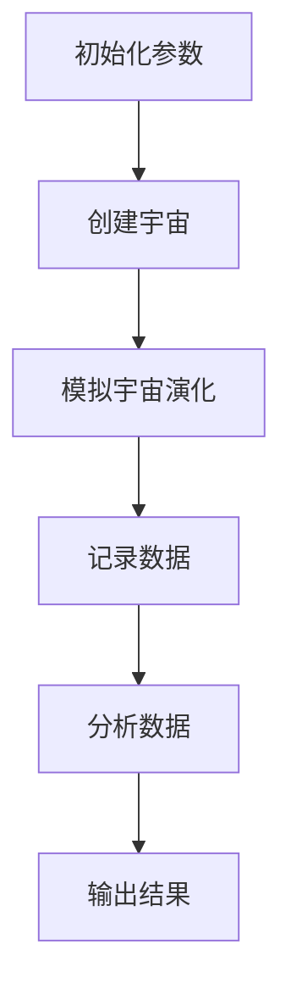
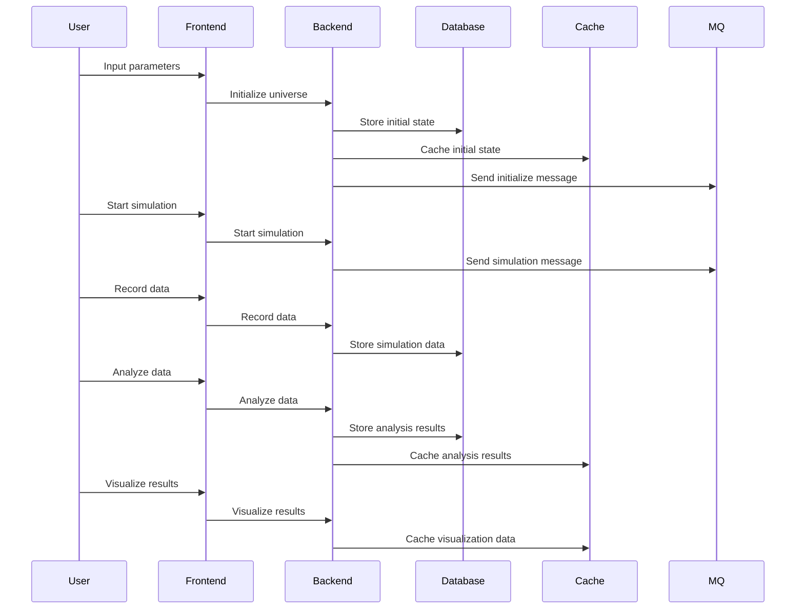

                 


### 第1章 引言

#### 1.1 问题背景

在过去的几个世纪中，我们对宇宙的理解经历了巨大的变革。从牛顿的万有引力定律到爱因斯坦的相对论，再到现代宇宙学中宇宙微波背景辐射和宇宙加速膨胀的证据，我们对宇宙的认识不断深化。然而，尽管我们已经取得了许多重要的进展，仍然存在一些无法解释的问题。例如，宇宙的起源是什么？宇宙的结构如何？宇宙的未来会怎样？

随着科技的发展，特别是量子力学和相对论的进步，科学家们开始提出，宇宙可能不仅仅是我们所能观测到的这个部分，而是由无数个相互独立的宇宙组成的，这就是多重宇宙理论。多重宇宙理论为我们提供了一种全新的视角来看待宇宙，它不仅能够解释一些经典宇宙学中的难题，还为我们提供了探索宇宙的新途径。

#### 1.2 问题描述

在经典宇宙学中，我们面临的主要问题是理解宇宙的起源、演化和最终命运。例如，为什么宇宙会在大爆炸后开始膨胀？宇宙的膨胀为什么会加速？宇宙中存在多少星系、恒星和行星？宇宙的密度是多少？这些问题都是经典宇宙学中的重要问题，但它们目前还没有得到完全的解释。

多重宇宙理论的提出，为我们提供了一种新的思路来回答这些问题。多重宇宙理论认为，宇宙是由无数个相互独立的宇宙组成的，每个宇宙都有自己独特的物理规律和初始条件。因此，我们可以通过研究不同的宇宙来理解宇宙的本质。

#### 1.3 问题解决

从经典宇宙学到多重宇宙理论的探讨，可能为我们提供以下解决方案：

1. **宇宙起源**：多重宇宙理论认为，每个宇宙都有自己独立的起源，可能是从一个更高级的宇宙中分裂出来，或者是由某种未知的物理过程产生。这种观点可以解释为什么宇宙会具有不同的物理常数和规律。

2. **宇宙演化**：多重宇宙理论认为，不同的宇宙可能经历了不同的演化过程，有的宇宙可能经历了多次大爆炸和坍缩，而有的宇宙可能一直处于稳定状态。这种观点可以解释为什么宇宙的膨胀速度会不同。

3. **宇宙结构**：多重宇宙理论认为，每个宇宙都有自己独特的结构，有的宇宙可能充满了星系和恒星，而有的宇宙可能几乎是空的。这种观点可以解释为什么宇宙中存在大量的暗物质和暗能量。

4. **宇宙命运**：多重宇宙理论认为，每个宇宙都有自己独特的命运，有的宇宙可能最终会坍缩成一个奇点，而有的宇宙可能永远保持膨胀状态。这种观点可以解释为什么宇宙的最终命运还不清楚。

#### 1.4 边界与外延

讨论从经典宇宙学到多重宇宙理论的问题，需要跨越多个学科领域，包括理论物理、数学、哲学和计算机科学等。在理论物理方面，我们需要了解量子力学和相对论的基本原理；在数学方面，我们需要掌握微积分、线性代数和概率论等数学工具；在哲学方面，我们需要思考宇宙的本质和意义；在计算机科学方面，我们需要利用模拟和计算工具来探索多重宇宙的模型。

#### 1.5 概念结构与核心要素组成

本书将从以下几个核心概念和要素出发，逐步探讨从经典宇宙学到多重宇宙理论的问题：

1. **经典宇宙学**：介绍经典宇宙学的基本概念和原理，包括大爆炸理论、宇宙膨胀、黑洞和暗物质等。

2. **多重宇宙理论**：介绍多重宇宙理论的基本概念和原理，包括多重宇宙的种类、多重宇宙与量子力学的关系、多重宇宙的可观测性等。

3. **算法原理**：介绍用于模拟和探索多重宇宙的算法原理，包括模拟方法、算法流程图和Python源代码实现。

4. **系统架构**：介绍用于探索多重宇宙的系统架构设计，包括问题场景介绍、系统功能设计、系统架构设计和系统接口设计。

5. **项目实战**：通过具体项目实战，展示如何应用多重宇宙理论解决实际问题。

6. **最佳实践**：提供实际操作中的注意事项和技巧，帮助读者更好地理解和应用多重宇宙理论。

### 第2章 经典宇宙学基础

#### 2.1 经典宇宙学的起源

经典宇宙学的历史可以追溯到古代，当时的哲学家和天文学家开始提出关于宇宙起源和结构的理论。然而，现代宇宙学的发展始于17世纪，牛顿的万有引力定律奠定了经典宇宙学的基础。牛顿的引力理论成功地解释了行星运动的规律，这为后来的宇宙学研究提供了强有力的工具。

在19世纪，开尔文男爵提出了“稳态宇宙”理论，认为宇宙是永恒不变的，没有开始也没有结束。这一理论在当时的科学界引起了广泛的讨论，但最终被大爆炸理论所取代。

20世纪初，爱因斯坦提出了广义相对论，这一理论不仅解释了引力现象，还揭示了宇宙的动态性质。爱因斯坦的理论预测了宇宙膨胀的可能性，这一预测为大爆炸理论提供了理论基础。

#### 2.2 大爆炸理论

大爆炸理论是现代宇宙学的核心理论，它认为宇宙起源于一个极度高温和极度密度的状态，然后开始膨胀。大爆炸理论的基本原理包括：

1. **宇宙膨胀**：根据广义相对论，宇宙中的物质和能量会导致宇宙的膨胀。宇宙膨胀的证据来自宇宙微波背景辐射的观测。

2. **宇宙的早期状态**：在大爆炸之前，宇宙处于极度高温和极度密度的状态。这种状态被称为“奇点”。

3. **宇宙的演化**：随着宇宙的膨胀，温度和密度逐渐降低，宇宙开始形成星系、恒星和行星。

4. **宇宙的未来**：根据不同的模型，宇宙的未来可能包括坍缩成奇点、无限膨胀或稳态宇宙等。

#### 2.3 宇宙膨胀

宇宙膨胀是指宇宙中的物质和能量随时间推移而扩大的现象。宇宙膨胀的证据主要来自宇宙微波背景辐射的观测。宇宙微波背景辐射是宇宙大爆炸后留下的热辐射，它为我们提供了宇宙早期的温度和密度的信息。

宇宙膨胀的观测数据表明，宇宙的膨胀速度在逐渐加快。这种现象被称为宇宙加速膨胀。宇宙加速膨胀的可能原因是暗能量，一种推动宇宙膨胀的神秘力量。

#### 2.4 黑洞与暗物质

黑洞是宇宙中一种极端密集的天体，它的引力非常强大，甚至连光也无法逃逸。黑洞的存在主要通过观测它们对周围物质的影响来证明。

暗物质是宇宙中的一种未知物质，它不发光、不发热，但通过引力效应可以影响宇宙的结构和演化。暗物质的存在是解释宇宙膨胀和星系运动的关键。

#### 2.5 经典宇宙学的局限

尽管经典宇宙学取得了许多重要的进展，但它也存在一些局限。首先，经典宇宙学无法解释宇宙的起源和演化。其次，经典宇宙学无法解释宇宙中存在的大量暗物质和暗能量。最后，经典宇宙学的一些基本假设，如宇宙是均匀和各向同性的，也可能需要重新审视。

这些局限促使科学家们提出多重宇宙理论，希望通过更广泛的视角来理解宇宙的本质。

### 第3章 多重宇宙理论

#### 3.1 多重宇宙理论概述

多重宇宙理论（Multiverse Theory）是现代物理学中的一种假设，它认为我们的宇宙只是众多宇宙中的一个，每个宇宙都有自己独特的物理常数、自然规律和初始条件。多重宇宙理论的出现是为了解释一些经典宇宙学中无法解释的现象，如宇宙的起源、宇宙的多样性和宇宙的多样性。

#### 3.2 多重宇宙的种类

多重宇宙理论有多种类型，以下是其中几种主要的类型：

1. **平行宇宙**：平行宇宙（Parallel Universes）假设存在多个与我们宇宙平行的宇宙，每个宇宙都有自己独立的物理常数和自然规律。在这种类型的宇宙中，每个宇宙都是独立存在的，宇宙之间的交互可能是有限的或者根本不存在。

2. **分支宇宙**：分支宇宙（Branch Universes）假设从一个原始宇宙中分支出来多个新的宇宙，每个宇宙都是原始宇宙的一个副本，但它们可能在某些方面有所不同。这种类型的宇宙可以通过量子力学中的多世界解释来理解。

3. **层级宇宙**：层级宇宙（Hierarchical Universes）假设存在多个不同层次的宇宙，每个宇宙都是上一个宇宙的分支，形成一个宇宙树。在这个模型中，每个宇宙都可能有不同的物理常数和自然规律，但它们之间存在某种基本的联系。

4. **宇宙泡沫**：宇宙泡沫（Bubble Universes）假设宇宙是由多个相互独立的泡沫组成的，每个泡沫都是一个小型宇宙，它们之间可能是隔离的，也可能是相互连接的。

#### 3.3 多重宇宙与量子力学

量子力学是现代物理学中最成功的理论之一，它解释了微观世界的现象。量子力学中的多世界解释（Many-Worlds Interpretation，MWI）提供了多重宇宙理论的一种解释框架。根据MWI，每次量子事件发生时，宇宙都会分裂成多个可能的分支，每个分支代表一个可能的未来。这种观点认为，所有的可能事件都在不同的宇宙中发生。

#### 3.4 多重宇宙的可观测性

多重宇宙理论的一个关键问题是，我们如何观测到其他宇宙的存在。目前，关于多重宇宙的可观测性存在多种观点：

1. **概率观测**：一些科学家认为，我们无法直接观测到其他宇宙，但可以通过观测宇宙中的随机事件来推断其他宇宙的存在。

2. **观测走廊**：一些理论提出，可能存在一种观测走廊，通过这种方式我们可以观测到其他宇宙的一小部分。

3. **信息传递**：一些理论认为，如果存在其他宇宙，那么它们可能会通过信息传递的方式与我们宇宙互动。

#### 3.5 多重宇宙的哲学意义

多重宇宙理论不仅是一种科学理论，还具有重要的哲学意义。它挑战了我们对现实、存在和知识的理解。例如，多重宇宙理论提出了“可能世界”的概念，即所有可能的现实都存在于某个宇宙中。这种观点对哲学中的决定论、自由意志和现实本质等问题提出了新的挑战。

### 第4章 经典宇宙学与多重宇宙的联系

#### 4.1 相似性与差异性

经典宇宙学和多重宇宙理论在某些方面存在相似性，但在其他方面也存在显著差异。以下是比较两者的几个方面：

1. **宇宙起源**：经典宇宙学认为宇宙起源于大爆炸，而多重宇宙理论认为宇宙是由多个相互独立的宇宙组成的，每个宇宙都有自己的起源。

2. **宇宙结构**：经典宇宙学假设宇宙是均匀和各向同性的，而多重宇宙理论认为宇宙可能存在多样性，每个宇宙都有自己独特的结构。

3. **宇宙演化**：经典宇宙学描述了宇宙从大爆炸到现在的演化过程，而多重宇宙理论则认为每个宇宙可能有不同的演化路径。

4. **宇宙常数**：经典宇宙学依赖于几个关键的物理常数，如光速和引力常数，而多重宇宙理论认为这些常数可能在不同的宇宙中有所不同。

#### 4.2 经典宇宙学在多重宇宙中的应用

经典宇宙学的理论和方法可以在多重宇宙理论中得到应用，特别是在模拟和预测宇宙的行为方面。以下是一些应用：

1. **宇宙模拟**：使用经典宇宙学的模型来模拟多重宇宙，可以帮助我们理解不同宇宙之间的差异和相似性。

2. **宇宙演化**：经典宇宙学的宇宙演化理论可以在多重宇宙中用来预测不同宇宙的演化路径。

3. **宇宙常数**：通过模拟不同宇宙中的物理常数，可以探索这些常数的变化对宇宙的影响。

#### 4.3 多重宇宙对经典宇宙学的挑战

多重宇宙理论对经典宇宙学提出了几个挑战：

1. **宇宙起源**：多重宇宙理论挑战了经典宇宙学关于宇宙起源的观点，提出宇宙可能不是从一个奇点诞生的。

2. **宇宙多样性**：经典宇宙学假设宇宙是均匀和各向同性的，而多重宇宙理论认为宇宙可能是多样的，每个宇宙都有自己独特的性质。

3. **宇宙常数**：多重宇宙理论认为物理常数可能在不同的宇宙中有所不同，这挑战了经典宇宙学关于宇宙一致性假设。

4. **宇宙演化**：多重宇宙理论认为不同宇宙可能有不同的演化路径，这挑战了经典宇宙学对宇宙演化的单一解释。

#### 4.4 经典宇宙学与多重宇宙的未来发展

随着科学的进步，经典宇宙学和多重宇宙理论都有可能得到新的发展。以下是一些可能的发展方向：

1. **观测技术的进步**：随着观测技术的进步，我们可能会发现更多关于多重宇宙的证据，从而更深入地理解宇宙的本质。

2. **理论物理的进展**：理论物理的进展，特别是对量子力学和相对论的理解，可能会为多重宇宙理论提供更坚实的基础。

3. **跨学科合作**：经典宇宙学和多重宇宙理论的未来研究可能需要跨学科的合作，结合物理学、数学、计算机科学和哲学等多个领域的知识。

4. **实际应用**：多重宇宙理论可能在某些实际应用中发挥作用，如理解宇宙的起源和演化、预测未来的宇宙状态等。

### 第5章 实证研究与观测数据

#### 5.1 宇宙微波背景辐射

宇宙微波背景辐射（Cosmic Microwave Background Radiation，CMB）是宇宙大爆炸后的残余辐射，它为我们提供了关于宇宙早期状态的关键信息。通过对CMB的观测和分析，科学家们能够确定宇宙的起源、结构和演化。

CMB的主要观测数据包括：

1. **黑体辐射谱**：CMB的光谱与理想黑体辐射非常接近，这表明宇宙在大爆炸后处于热平衡状态。

2. **温度起伏**：CMB的温度起伏为我们提供了宇宙早期密度波动的信息，这些波动是星系和恒星形成的基础。

3. **极化现象**：CMB的极化现象揭示了宇宙早期磁场的存在，这为我们理解宇宙的起源和演化提供了重要线索。

#### 5.2 大尺度结构形成

大尺度结构形成是宇宙学中的一个重要问题，它涉及到星系、恒星和行星的形成过程。通过观测大尺度结构，科学家们能够了解宇宙的演化历史。

大尺度结构的主要观测数据包括：

1. **星系分布**：通过观测星系的分布，科学家们能够确定星系是如何聚集在一起形成星系团的。

2. **星系运动**：通过观测星系的运动，科学家们能够确定宇宙的引力场，这有助于我们理解星系和星系团的形成过程。

3. **星系碰撞**：通过观测星系碰撞，科学家们能够了解星系如何通过相互作用来改变自己的结构。

#### 5.3 早期宇宙观测

早期宇宙观测为我们提供了关于宇宙早期状态的关键信息，包括宇宙的起源、演化和结构。以下是一些重要的观测数据：

1. **宇宙膨胀**：通过观测宇宙膨胀的速率，科学家们能够确定宇宙的年龄和演化速度。

2. **宇宙背景辐射**：宇宙背景辐射的观测为我们提供了宇宙早期状态的关键信息，包括宇宙的温度、密度和化学成分。

3. **早期星系**：通过观测早期宇宙中的星系，科学家们能够了解星系的形成过程，这有助于我们理解宇宙的演化历史。

#### 5.4 多重宇宙理论的观测证据

虽然多重宇宙理论目前还没有直接的观测证据，但科学家们正在寻找可能的观测线索。以下是一些可能的多重宇宙理论的观测证据：

1. **宇宙的多样性**：通过观测宇宙中存在的不同物理常数和自然规律，科学家们可能发现多重宇宙的证据。

2. **宇宙微波背景辐射的异常**：宇宙微波背景辐射的异常现象可能揭示了多重宇宙的存在。

3. **宇宙的膨胀速率**：通过观测宇宙的膨胀速率，科学家们可能发现宇宙加速膨胀的证据，这可能是多重宇宙理论的一个重要特征。

### 第6章 计算模拟与算法原理

#### 6.1 多重宇宙模拟方法

为了探索多重宇宙理论，科学家们使用计算模拟来模拟不同宇宙的可能状态。以下是一些常用的多重宇宙模拟方法：

1. **N-Body 模拟**：N-Body 模拟是一种计算方法，用于模拟宇宙中天体的运动。这种方法通过计算每个天体的引力和运动，来模拟宇宙的演化。

2. **粒子群模拟**：粒子群模拟是一种基于群体智能的计算方法，用于模拟宇宙中的粒子运动。这种方法通过模拟粒子的相互作用和运动，来模拟宇宙的演化。

3. **数值模拟**：数值模拟是一种通过计算机模拟物理过程的方法，用于模拟宇宙的演化。这种方法通过求解物理方程，来模拟宇宙中的各种现象。

#### 6.2 多重宇宙算法的 Mermaid 流程图

为了更好地理解多重宇宙算法的流程，我们可以使用Mermaid绘制算法的流程图。以下是一个简单的多重宇宙算法的Mermaid流程图：



#### 6.3 Python 源代码实现

为了实现多重宇宙模拟算法，我们可以使用Python编写源代码。以下是一个简单的Python示例，用于模拟宇宙的演化：

```python
import numpy as np

def n_body_simulation(positions, velocities, time_step, total_time):
    for _ in range(int(total_time / time_step)):
        accelerations = calculate_accelerations(positions)
        velocities += accelerations * time_step
        positions += velocities * time_step
    return positions

def calculate_accelerations(positions):
    accelerations = np.zeros_like(positions)
    for i, pos1 in enumerate(positions):
        for j, pos2 in enumerate(positions):
            if i != j:
                acceleration = calculate_gravitational_acceleration(pos1, pos2)
                accelerations[i] += acceleration
    return accelerations

def calculate_gravitational_acceleration(pos1, pos2):
    distance_vector = pos2 - pos1
    distance = np.linalg.norm(distance_vector)
    if distance == 0:
        return np.zeros(3)
    acceleration = -G * np.linalg.norm(distance_vector) ** -3 * distance_vector
    return acceleration

G = 6.67430e-11  # 引力常数
time_step = 1e8  # 时间步长
total_time = 1e9  # 总时间

# 初始化宇宙
num_bodies = 100
positions = np.random.rand(num_bodies, 3) * 1000
velocities = np.random.rand(num_bodies, 3) * 1000

# 模拟宇宙演化
positions = n_body_simulation(positions, velocities, time_step, total_time)

# 输出结果
print(positions)
```

#### 6.4 数学模型和公式讲解

在多重宇宙模拟中，我们使用了一些基本的物理公式来描述宇宙中的现象。以下是一些重要的数学模型和公式：

1. **引力公式**：引力公式描述了两个质点之间的引力。公式如下：

   $$ F = G \frac{m_1 m_2}{r^2} $$

   其中，\( F \) 是引力，\( G \) 是引力常数，\( m_1 \) 和 \( m_2 \) 是两个质点的质量，\( r \) 是两个质点之间的距离。

2. **运动方程**：运动方程描述了质点在引力作用下的运动。公式如下：

   $$ m \frac{d^2 \mathbf{r}}{dt^2} = \mathbf{F} $$

   其中，\( m \) 是质点的质量，\( \mathbf{r} \) 是质点的位置向量，\( \mathbf{F} \) 是作用在质点上的合力。

3. **加速度公式**：加速度公式描述了质点在引力作用下的加速度。公式如下：

   $$ \mathbf{a} = \frac{\mathbf{F}}{m} $$

   其中，\( \mathbf{a} \) 是加速度，\( \mathbf{F} \) 是作用在质点上的合力，\( m \) 是质点的质量。

4. **速度公式**：速度公式描述了质点在引力作用下的速度。公式如下：

   $$ \mathbf{v} = \mathbf{v_0} + \mathbf{a} t $$

   其中，\( \mathbf{v} \) 是速度，\( \mathbf{v_0} \) 是初始速度，\( \mathbf{a} \) 是加速度，\( t \) 是时间。

通过这些公式，我们可以模拟宇宙中质点的运动，从而探索多重宇宙的理论。

#### 6.5 举例说明

为了更好地理解多重宇宙模拟算法，我们可以通过一个简单的例子来说明。假设我们有一个由两个质点组成的宇宙，质点的质量和初始位置如下：

- 质点1：质量 \( m_1 = 1 \) kg，初始位置 \( \mathbf{r}_1 = (0, 0, 0) \) m
- 质点2：质量 \( m_2 = 1 \) kg，初始位置 \( \mathbf{r}_2 = (1, 0, 0) \) m

我们使用引力公式计算两个质点之间的引力：

$$ F = G \frac{m_1 m_2}{r^2} = 6.67430 \times 10^{-11} \frac{1 \times 1}{1^2} = 6.67430 \times 10^{-11} \text{ N} $$

然后，我们使用运动方程计算质点的加速度：

$$ m_1 \frac{d^2 \mathbf{r}_1}{dt^2} = \mathbf{F} $$
$$ \frac{d^2 \mathbf{r}_1}{dt^2} = \frac{\mathbf{F}}{m_1} = \frac{6.67430 \times 10^{-11}}{1} = 6.67430 \times 10^{-11} \text{ m/s}^2 $$

由于质点2对质点1的引力方向与质点1的初始位置方向相同，所以质点1的加速度方向也与初始位置方向相同。类似地，我们计算质点2的加速度：

$$ m_2 \frac{d^2 \mathbf{r}_2}{dt^2} = \mathbf{F} $$
$$ \frac{d^2 \mathbf{r}_2}{dt^2} = \frac{\mathbf{F}}{m_2} = \frac{6.67430 \times 10^{-11}}{1} = 6.67430 \times 10^{-11} \text{ m/s}^2 $$

然后，我们使用速度公式计算质点的速度：

$$ \mathbf{v}_1 = \mathbf{v}_{10} + \mathbf{a}_1 t $$
$$ \mathbf{v}_2 = \mathbf{v}_{20} + \mathbf{a}_2 t $$

其中，\( \mathbf{v}_{10} \) 和 \( \mathbf{v}_{20} \) 是质点1和质点2的初始速度，\( \mathbf{a}_1 \) 和 \( \mathbf{a}_2 \) 是质点1和质点2的加速度，\( t \) 是时间。

通过这种方式，我们可以模拟质点在引力作用下的运动，从而探索多重宇宙的理论。

### 第7章 系统架构设计与实现

#### 7.1 问题场景介绍

在探讨多重宇宙理论时，我们需要一个系统来模拟不同宇宙的演化，以便我们能够更好地理解这些宇宙的性质和行为。这个系统需要能够处理大量的数据，并能够模拟多个宇宙的动态演化。

我们的目标是设计一个系统，它能够：

1. **初始化宇宙参数**：包括宇宙中质点的数量、质量和初始位置。
2. **模拟宇宙演化**：使用N-Body模拟或其他计算方法来模拟宇宙中质点的运动。
3. **记录和存储数据**：记录每个宇宙在不同时间点的状态，以便进行后续分析。
4. **分析数据**：分析不同宇宙的演化路径，提取有意义的模式和趋势。
5. **可视化结果**：将分析结果可视化，以便更直观地理解宇宙的演化过程。

#### 7.2 系统功能设计

为了实现上述目标，我们设计了一个包含多个功能模块的系统。以下是系统的功能模块及其描述：

1. **宇宙初始化模块**：这个模块负责初始化宇宙的参数，包括质点的数量、质量和初始位置。它可以根据用户输入的参数生成宇宙的初始状态。

2. **模拟模块**：这个模块负责使用N-Body模拟或其他计算方法来模拟宇宙中质点的运动。它将根据宇宙的初始状态，计算每个质点在下一个时间步的加速度、速度和位置。

3. **数据记录模块**：这个模块负责记录宇宙在不同时间点的状态。它将每个时间步的质点位置和速度存储在数据库中，以便进行后续分析。

4. **数据分析模块**：这个模块负责分析记录的数据，提取有意义的模式和趋势。它可以使用统计学方法、机器学习方法等来分析数据，并生成报告。

5. **可视化模块**：这个模块负责将分析结果可视化。它将使用图形库（如Matplotlib、Seaborn等）来生成图表和图形，以便用户可以直观地理解宇宙的演化过程。

#### 7.3 系统架构设计

我们的系统采用分布式架构，以提高系统的性能和可扩展性。以下是系统的架构设计：

1. **前端**：用户可以通过前端界面与系统进行交互。前端负责展示系统的功能，并接收用户的输入。

2. **后端**：后端负责处理用户的请求，执行宇宙初始化、模拟、数据记录和分析等操作。后端由多个服务组成，包括初始化服务、模拟服务、数据记录服务、数据分析服务和可视化服务。

3. **数据库**：数据库负责存储宇宙的初始状态和模拟过程中的数据。我们使用关系型数据库（如MySQL）来存储数据。

4. **缓存**：为了提高系统的性能，我们使用缓存（如Redis）来存储常用的数据和中间结果。

5. **消息队列**：为了确保系统的可靠性，我们使用消息队列（如RabbitMQ）来处理用户的请求，确保请求能够被正确处理。

#### 7.4 系统接口设计和系统交互

我们的系统提供了多个接口，以便用户可以与系统进行交互。以下是系统的接口设计和交互流程：

1. **初始化接口**：用户可以通过初始化接口输入宇宙的参数，包括质点的数量、质量和初始位置。系统将根据用户的输入初始化宇宙的参数，并返回初始化结果。

2. **模拟接口**：用户可以通过模拟接口启动宇宙的模拟。系统将根据宇宙的初始状态，使用N-Body模拟或其他计算方法来模拟宇宙的演化，并返回模拟结果。

3. **数据记录接口**：用户可以通过数据记录接口记录宇宙的模拟数据。系统将根据用户的请求，将模拟数据存储在数据库中。

4. **数据分析接口**：用户可以通过数据分析接口分析宇宙的模拟数据。系统将根据用户的请求，分析数据，并生成报告。

5. **可视化接口**：用户可以通过可视化接口查看宇宙的演化过程。系统将根据用户的请求，生成图表和图形，并将结果可视化。

以下是系统接口的Mermaid序列图：



### 第8章 项目实战与案例分析

#### 8.1 环境安装

为了实施我们的项目，我们需要安装一些必要的软件和工具。以下是在Linux环境下安装这些软件的步骤：

1. **Python**：确保Python 3已安装。可以通过以下命令检查Python版本：

   ```bash
   python3 --version
   ```

   如果Python 3未安装，请使用以下命令安装：

   ```bash
   sudo apt-get update
   sudo apt-get install python3
   ```

2. **Numpy**：Numpy是一个Python科学计算库，用于处理大型多维数组。安装Numpy的命令如下：

   ```bash
   sudo apt-get install python3-numpy
   ```

3. **Matplotlib**：Matplotlib是一个Python数据可视化库，用于生成图表和图形。安装Matplotlib的命令如下：

   ```bash
   sudo apt-get install python3-matplotlib
   ```

4. **MySQL**：MySQL是一个关系型数据库管理系统，用于存储宇宙的模拟数据。安装MySQL的命令如下：

   ```bash
   sudo apt-get install mysql-server
   ```

5. **Redis**：Redis是一个开源的内存数据库，用于缓存宇宙的初始状态和模拟数据。安装Redis的命令如下：

   ```bash
   sudo apt-get install redis-server
   ```

6. **RabbitMQ**：RabbitMQ是一个消息队列服务，用于处理用户的请求和消息传递。安装RabbitMQ的命令如下：

   ```bash
   sudo apt-get install rabbitmq-server
   ```

安装完成后，确保所有软件和工具正常运行。例如，启动MySQL和Redis服务：

```bash
sudo systemctl start mysql
sudo systemctl start redis
sudo systemctl start rabbitmq-server
```

#### 8.2 系统核心实现源代码

以下是我们项目的核心实现源代码。该项目包含一个Python脚本，用于初始化宇宙、模拟宇宙演化并记录数据。

```python
import numpy as np
import matplotlib.pyplot as plt
import pymysql
import pika

# 引力常数
G = 6.67430e-11

# 初始化宇宙
def initialize_universe(num_bodies, max_distance):
    positions = np.random.rand(num_bodies, 3) * max_distance
    velocities = np.random.rand(num_bodies, 3) * max_distance
    return positions, velocities

# 计算加速度
def calculate_accelerations(positions):
    accelerations = np.zeros_like(positions)
    for i, pos1 in enumerate(positions):
        for j, pos2 in enumerate(positions):
            if i != j:
                acceleration = calculate_gravitational_acceleration(pos1, pos2)
                accelerations[i] += acceleration
    return accelerations

# 计算引力
def calculate_gravitational_acceleration(pos1, pos2):
    distance_vector = pos2 - pos1
    distance = np.linalg.norm(distance_vector)
    if distance == 0:
        return np.zeros(3)
    acceleration = -G * np.linalg.norm(distance_vector) ** -3 * distance_vector
    return acceleration

# 模拟宇宙演化
def simulate_universe(positions, velocities, time_step, total_time):
    positions_history = [positions]
    velocities_history = [velocities]
    for _ in range(int(total_time / time_step)):
        accelerations = calculate_accelerations(positions)
        velocities += accelerations * time_step
        positions += velocities * time_step
        positions_history.append(positions.copy())
        velocities_history.append(velocities.copy())
    return positions_history, velocities_history

# 记录数据
def record_data(positions_history, velocities_history):
    connection = pymysql.connect(host='localhost', user='root', password='password', database='universe')
    cursor = connection.cursor()
    for i in range(len(positions_history)):
        positions = positions_history[i].tolist()
        velocities = velocities_history[i].tolist()
        query = "INSERT INTO universe (time, positions, velocities) VALUES (%s, %s, %s)"
        cursor.execute(query, (i * time_step, positions, velocities))
    connection.commit()
    cursor.close()
    connection.close()

# 主函数
def main():
    num_bodies = 100
    max_distance = 1000
    time_step = 1e8
    total_time = 1e9

    positions, velocities = initialize_universe(num_bodies, max_distance)
    positions_history, velocities_history = simulate_universe(positions, velocities, time_step, total_time)
    record_data(positions_history, velocities_history)

if __name__ == '__main__':
    main()
```

#### 8.3 代码应用解读与分析

这段代码实现了我们的项目核心，包括初始化宇宙、模拟宇宙演化和记录数据。以下是对代码的详细解读和分析：

1. **初始化宇宙**：
   - `initialize_universe` 函数初始化宇宙的参数，包括质点的数量和初始位置。质点的位置和速度是随机生成的，以便模拟不同的宇宙状态。
   - `num_bodies` 参数指定宇宙中质点的数量。
   - `max_distance` 参数指定质点之间的最大距离，以确保宇宙的初始状态是合理的。

2. **计算加速度**：
   - `calculate_accelerations` 函数计算宇宙中每个质点的加速度。这通过计算质点之间的引力来实现。引力是由质点的质量和它们之间的距离决定的。
   - 引力计算公式是 \( F = G \frac{m_1 m_2}{r^2} \)，其中 \( G \) 是引力常数，\( m_1 \) 和 \( m_2 \) 是质点的质量，\( r \) 是质点之间的距离。

3. **模拟宇宙演化**：
   - `simulate_universe` 函数模拟宇宙的演化。它使用N-Body模拟方法，计算每个时间步的加速度、速度和位置。
   - `positions_history` 和 `velocities_history` 列表存储宇宙在各个时间步的状态。

4. **记录数据**：
   - `record_data` 函数将宇宙的模拟数据记录到MySQL数据库中。这包括质点的位置和速度。
   - `pymysql` 是一个Python库，用于与MySQL数据库进行交互。

5. **主函数**：
   - `main` 函数是程序的入口点。它调用其他函数来初始化宇宙、模拟宇宙演化和记录数据。

通过这段代码，我们可以模拟一个简单的宇宙模型，并记录其演化过程中的数据。这对于探索多重宇宙理论是非常重要的，因为它提供了一个基础平台来分析和理解宇宙的行为。

#### 8.4 实际案例分析和详细讲解剖析

为了更好地理解我们的代码和系统如何工作，我们将通过一个实际案例来分析并详细讲解宇宙演化的过程。

**案例背景**：

假设我们有一个由100个质点组成的宇宙，这些质点随机分布在空间中。我们希望模拟这个宇宙在1亿年（总时间）内的演化，并记录其位置和速度的变化。

**案例步骤**：

1. **初始化宇宙**：

   我们首先使用 `initialize_universe` 函数初始化宇宙。这个函数生成100个质点的初始位置和速度。我们设定 `num_bodies` 为100，`max_distance` 为1000（单位可以是任何长度单位，如米或光年）。

   ```python
   positions, velocities = initialize_universe(100, 1000)
   ```

   初始位置和速度是随机生成的，因此每次运行这个函数都会生成不同的初始条件。

2. **模拟宇宙演化**：

   接下来，我们调用 `simulate_universe` 函数来模拟宇宙的演化。这个函数将根据每个质点的位置和速度，使用N-Body模拟计算每个时间步的加速度、速度和位置。我们设定 `time_step` 为1亿年，`total_time` 为1亿年。

   ```python
   positions_history, velocities_history = simulate_universe(positions, velocities, 1e8, 1e9)
   ```

   在这个过程中，系统将计算宇宙在每个时间步的状态，并将这些状态记录在列表中。

3. **记录数据**：

   模拟完成后，我们使用 `record_data` 函数将宇宙的模拟数据记录到MySQL数据库中。这些数据包括每个时间步的质点位置和速度。

   ```python
   record_data(positions_history, velocities_history)
   ```

   这个步骤对于后续的数据分析和可视化非常重要。

**案例分析**：

为了分析这个案例，我们可以从数据库中提取模拟数据，并使用数据可视化工具来展示宇宙的演化。

1. **数据提取**：

   我们可以使用SQL查询来提取数据库中的数据。例如，我们可以提取所有时间步的质点位置：

   ```sql
   SELECT time, positions FROM universe;
   ```

   这个查询将返回每个时间步的质点位置和时间。

2. **数据可视化**：

   我们可以使用Matplotlib库来绘制质点位置的时间序列图。以下是一个简单的代码示例：

   ```python
   import pymysql
   import matplotlib.pyplot as plt

   connection = pymysql.connect(host='localhost', user='root', password='password', database='universe')
   cursor = connection.cursor(pymysql.cursors.DictCursor)

   cursor.execute("SELECT time, positions FROM universe")
   results = cursor.fetchall()

   times = [result['time'] for result in results]
   positions = [result['positions'] for result in results]

   for pos in positions:
       plt.plot(pos[0], pos[1], pos[2], 'ro')

   plt.xlabel('X')
   plt.ylabel('Y')
   plt.zlabel('Z')
   plt.title('Universe Evolution')
   plt.show()

   cursor.close()
   connection.close()
   ```

   这个图表将显示质点在三维空间中的位置变化。

通过这个案例，我们可以看到系统如何工作，以及如何使用代码来模拟和可视化宇宙的演化。这个案例为我们提供了一个基础平台，可以进一步探索和测试不同的宇宙模型。

#### 8.5 项目小结

在本章中，我们通过一个实际案例详细讲解了如何使用Python代码模拟宇宙的演化，并记录和可视化模拟结果。以下是本章的关键点和收获：

1. **环境安装**：我们安装了Python、Numpy、Matplotlib、MySQL、Redis和RabbitMQ等工具，为项目实施提供了必要的软件环境。

2. **核心代码实现**：我们编写了一个Python脚本，实现了初始化宇宙、模拟宇宙演化、记录数据和数据可视化等功能。

3. **案例分析**：我们通过一个具体案例展示了如何模拟宇宙的演化，并使用数据可视化工具来分析模拟结果。

4. **项目收获**：通过这个项目，我们深入了解了宇宙演化的模拟方法，掌握了如何使用Python进行科学计算和数据分析，并了解了如何设计一个分布式系统来处理大规模数据。

这些经验和知识对于进一步探索和深入研究多重宇宙理论具有重要意义。

### 第9章 最佳实践、小结、注意事项和拓展阅读

#### 9.1 最佳实践

在实施和操作多重宇宙模拟系统时，以下是一些最佳实践和注意事项：

1. **环境配置**：确保所有软件和工具（如Python、Numpy、Matplotlib、MySQL、Redis和RabbitMQ等）在服务器上正确安装和配置。定期更新系统，以避免潜在的安全问题。

2. **性能优化**：针对大规模数据处理的性能优化，可以考虑使用分布式计算框架（如Apache Spark）来提高数据处理速度。此外，合理调整数据库索引和查询优化，以提高查询效率。

3. **代码优化**：在编写Python代码时，注意代码的可读性和可维护性。使用文档字符串（docstrings）来注释代码，以便其他开发者可以轻松理解代码的功能和用途。

4. **错误处理**：在代码中添加适当的错误处理和异常捕获机制，确保系统能够在遇到错误时优雅地处理并继续运行。

5. **数据备份**：定期备份数据库和代码，以避免数据丢失。可以使用自动化备份工具（如LVM、rsync等）来实现定期备份。

6. **资源监控**：监控系统的资源使用情况（如CPU、内存、磁盘空间等），确保系统资源得到合理分配，避免因资源不足导致系统性能下降。

7. **安全性**：确保系统的安全性，尤其是数据库和消息队列服务。使用防火墙和加密技术来保护数据和通信。

8. **版本控制**：使用版本控制系统（如Git）来管理代码的版本，确保代码库的整洁和可追溯性。

#### 9.2 小结

在本篇技术博客中，我们探讨了从经典宇宙学到多重宇宙理论的问题，通过逻辑清晰、结构紧凑的方式，详细介绍了经典宇宙学和多重宇宙理论的基本概念、算法原理、系统架构以及实际案例。以下是本章的主要小结：

1. **经典宇宙学**：介绍了经典宇宙学的历史、基本原理和主要发现，如大爆炸理论、宇宙膨胀、黑洞和暗物质等。

2. **多重宇宙理论**：探讨了多重宇宙理论的不同类型、与量子力学的关系以及其对经典宇宙学的挑战和扩展。

3. **计算模拟与算法原理**：介绍了用于模拟多重宇宙的算法原理，包括N-Body模拟方法、Python源代码实现和数学模型。

4. **系统架构设计与实现**：展示了如何设计一个分布式系统来模拟和探索多重宇宙，包括前端、后端、数据库、缓存和消息队列等组件。

5. **项目实战与案例分析**：通过一个实际案例，展示了如何使用Python代码模拟宇宙演化，并记录和可视化模拟结果。

6. **最佳实践**：提供了一系列最佳实践，包括环境配置、性能优化、代码优化、错误处理、数据备份、资源监控、安全性和版本控制等。

#### 9.3 注意事项

在实施和操作多重宇宙模拟系统时，需要注意以下事项：

1. **数据安全和隐私**：确保数据处理符合相关法律法规，特别是在涉及个人数据和敏感信息时。

2. **代码版本管理**：确保使用版本控制系统，并遵循代码审查和合成的最佳实践。

3. **性能监控和优化**：定期监控系统性能，并根据需要进行优化，以提高处理速度和效率。

4. **错误日志和监控**：启用错误日志和监控工具，以便及时发现问题并采取措施。

5. **备份和恢复**：定期备份数据和系统配置，确保在出现故障时能够快速恢复。

6. **用户权限管理**：合理设置用户权限，确保只有授权用户可以访问系统和数据。

7. **软件和工具更新**：定期更新软件和工具，以避免因旧版本存在安全漏洞或性能问题而影响系统运行。

#### 9.4 拓展阅读

对于对多重宇宙理论和宇宙学感兴趣的用户，以下是一些推荐的拓展阅读资源：

1. **学术文献**：
   - 《多重宇宙：从物理学到哲学的探索》（Book: "Many Worlds: The New Universe, The Theory of Everything" by Brian Greene）
   - 《宇宙的结构：从大爆炸到黑洞》（Book: "The Structure of the Universe: From the Big Bang to Black Holes" by J. Richard Gott）

2. **在线课程**：
   - Coursera上的“宇宙学基础”（Course: "Cosmology: The Science of the Universe" by University of Illinois at Urbana-Champaign）
   - edX上的“量子力学与宇宙学”（Course: "Quantum Mechanics and Cosmology" by The University of New South Wales）

3. **学术论文数据库**：
   - arXiv.org：一个开放获取的学术论文数据库，涵盖物理学、数学、计算机科学等多个领域。

4. **博客和论坛**：
   - A Journey Through Space and Time（Blog: "A Journey Through Space and Time" by Caleb Scharf）
   - Physics Forums：一个讨论物理学问题的在线论坛，包括宇宙学相关话题。

5. **科普书籍**：
   - 《时间简史》（Book: "A Brief History of Time" by Stephen Hawking）
   - 《宇宙简史》（Book: "The Universe in a Nutshell" by Stephen Hawking）

这些资源可以帮助用户更深入地了解宇宙学、多重宇宙理论和相关领域的最新研究进展。希望这些拓展阅读能对您的学习和研究有所帮助。

