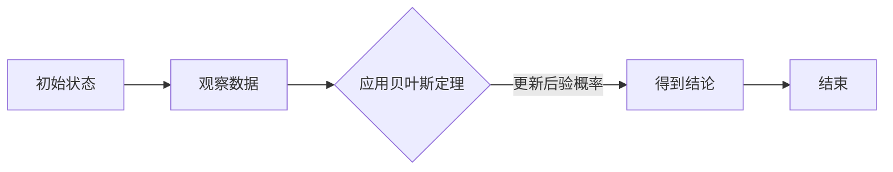
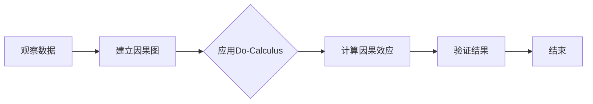
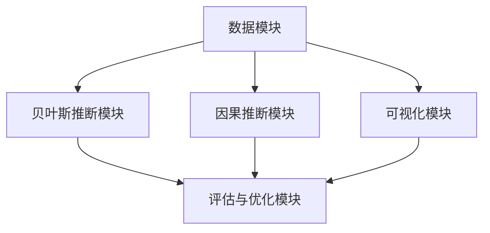
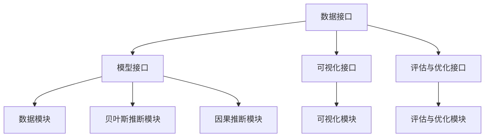
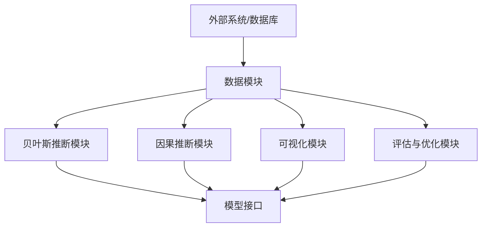

                 

# 从经典概率论到因果推断：深入理解世界的因果关系

> 关键词：概率论、因果推断、贝叶斯定理、Do-Calculus、机器学习、人工智能

> 摘要：本文将深入探讨从经典概率论到因果推断的发展历程，阐述其在人工智能与机器学习中的重要性。我们将逐步介绍核心概念、算法原理，并通过具体示例进行详细讲解，帮助读者更好地理解因果关系的本质，从而提升决策支持、预测准确性和模型可靠性。

### 细分目录结构

#### 第1章: 背景介绍

##### 1.1 问题背景

##### 1.2 问题描述

##### 1.3 问题解决

##### 1.4 边界与外延

##### 1.5 概念结构与核心要素组成

#### 第2章: 核心概念与联系

##### 2.1 经典概率论原理

##### 2.2 因果推断原理

##### 2.3 概念属性特征对比表格

##### 2.4 ER实体关系图架构

#### 第3章: 算法原理讲解

##### 3.1 贝叶斯推断算法

##### 3.2 因果推断算法

##### 3.3 算法原理详细讲解

##### 3.4 举例说明

#### 第4章: 数学模型和数学公式

##### 4.1 贝叶斯推断

##### 4.2 因果推断

#### 第5章: 系统分析与架构设计方案

##### 5.1 问题场景介绍

##### 5.2 项目介绍

##### 5.3 系统功能设计

##### 5.4 系统架构设计

##### 5.5 系统接口设计

##### 5.6 系统交互

#### 第6章: 项目实战

##### 6.1 环境安装

##### 6.2 系统核心实现源代码

##### 6.3 代码应用解读与分析

##### 6.4 实际案例分析和详细讲解剖析

##### 6.5 项目小结

#### 第7章: 最佳实践 tips、小结、注意事项、拓展阅读

---

#### 第1章: 背景介绍

##### 1.1 问题背景

因果推断在概率论的基础上发展而来，经历了漫长的发展历程。从经典概率论到现代因果推断，科学家们不断探索如何从数据中揭示因果关系，为决策支持和预测准确性提供了强有力的工具。

在人工智能与机器学习领域，因果推断的重要性愈发凸显。传统的统计方法和机器学习算法往往只能给出相关关系，而无法揭示因果关系。在许多实际应用场景中，如医疗诊断、金融风险评估、推荐系统等，理解因果关系对于提高模型的可靠性和决策的准确性至关重要。

##### 1.2 问题描述

因果推断面临诸多挑战：

1. 非线性关系：现实世界中的因果关系往往是非线性的，这使得经典概率论的方法难以适用。
2. 不确定性：因果推断涉及到对不确定性的处理，如何从有限的数据中推断出可靠的因果关系是一个重要问题。
3. 多重共线性：在复杂的数据集中，变量之间存在多重共线性，这给因果推断带来了困难。

##### 1.3 问题解决

为了解决上述问题，科学家们提出了多种因果推断方法：

1. 经典概率论：贝叶斯定理、最大似然估计、假设检验等。
2. 现代因果推断：因果图、Do-Calculus、稳健性检验等。

这些方法各具特点，适用于不同的场景和问题。

##### 1.4 边界与外延

因果推断有其适用的边界和范围：

1. 适用范围：因果推断主要应用于具有因果关系的问题，如医学研究、经济学分析、社会调查等。
2. 限制条件：因果推断依赖于数据质量和样本量，对于极端稀疏的数据集，因果推断可能无法准确得出结论。

此外，因果推断在跨学科应用和新兴领域中也展现了广阔的前景：

1. 跨学科应用：因果推断在生物医学、社会科学、工程等领域具有广泛的应用。
2. 新兴领域：因果推断在自动驾驶、智能家居、智能医疗等新兴领域具有重要意义。

##### 1.5 概念结构与核心要素组成

因果推断的核心概念包括：

1. 经典概率论的基本概念：随机变量、概率分布、期望与方差。
2. 因果推断的核心要素：因果模型、因果效应、因果推断方法。

这些概念和要素共同构成了因果推断的理论体系，为实际应用提供了理论基础。

---

在下一章中，我们将进一步探讨经典概率论和因果推断的基本原理，帮助读者建立对这两个领域的全面理解。敬请期待！## 第1章: 背景介绍

### 1.1 问题背景

因果推断的起源可以追溯到古希腊哲学家亚里士多德，他提出了“因果律”这一概念，认为每一个现象背后都存在一个原因。然而，真正的数学化发展始于17世纪，当时概率论开始兴起。费马和帕斯卡等人提出了概率论的基本原理，为后续的发展奠定了基础。

18世纪，拉普拉斯对概率论进行了系统化，提出了拉普拉斯定理，这是因果推断的初步形式。然而，直到20世纪，因果推断才得到了广泛关注，特别是在统计学和机器学习领域。罗纳德·艾尔斯特罗姆和肯尼斯·J·阿罗等人的研究，为因果推断提供了坚实的理论基础。

在人工智能与机器学习领域，因果推断的重要性日益凸显。机器学习模型通常基于数据驱动的关联关系进行训练，然而，这些模型往往无法揭示变量之间的因果关系。例如，一个模型可能发现吸烟与肺癌之间存在关联，但这并不意味着吸烟直接导致了肺癌。在这种情况下，因果推断可以帮助我们确定是否存在因果联系，从而为决策提供更有力的支持。

### 1.2 问题描述

因果推断的挑战主要体现在以下几个方面：

1. **非线性关系**：现实世界中的因果关系往往是非线性的，这意味着经典概率论的方法可能难以直接应用。例如，某些因素可能以非线性方式影响结果变量。

2. **不确定性**：因果推断依赖于对不确定性的处理。在现实世界中，数据往往是不完整的，存在噪声和异常值。如何从这些不完整且存在噪声的数据中推断出可靠的因果关系是一个重要问题。

3. **多重共线性**：在复杂的数据集中，变量之间存在多重共线性，这可能会干扰因果推断的准确性。例如，多个变量可能同时影响结果变量，使得难以判断哪一个变量是直接原因。

4. **因果关系的复杂性**：现实世界中的因果关系往往是复杂的，可能涉及多个中介变量和潜在变量。如何构建一个能够准确捕捉这些复杂关系的模型是一个挑战。

### 1.3 问题解决

为了解决上述问题，科学家们提出了多种因果推断方法：

1. **经典概率论**：贝叶斯定理、最大似然估计、假设检验等。这些方法在处理线性关系和不确定性方面具有较好的性能。

2. **现代因果推断**：因果图、Do-Calculus、稳健性检验等。这些方法能够处理非线性关系、多重共线性以及复杂因果关系。

3. **机器学习算法**：近年来，机器学习算法也在因果推断领域得到了广泛应用。例如，基于深度学习的因果推断方法可以处理大规模数据和复杂非线性关系。

### 1.4 边界与外延

1. **边界**：因果推断有其适用的边界。它主要适用于那些存在因果关系的问题，如医学研究、经济学分析、社会调查等。然而，因果推断并不适用于所有问题，例如在纯粹的现象描述或趋势分析中，因果关系并不是核心关注点。

2. **外延**：因果推断的应用范围非常广泛。除了在传统领域（如生物医学、社会科学）中的应用外，它还在新兴领域（如自动驾驶、智能家居、智能医疗）中展现出了巨大的潜力。例如，在自动驾驶中，因果推断可以帮助确定哪些因素最有可能导致交通事故，从而优化驾驶决策。

### 1.5 概念结构与核心要素组成

因果推断的核心概念和要素包括：

1. **随机变量**：在概率论中，随机变量是表示随机事件结果的数值型变量。随机变量的概率分布描述了随机变量取不同值的可能性。

2. **概率分布**：概率分布是描述随机变量取值的概率分布函数。常见的概率分布包括正态分布、二项分布、泊松分布等。

3. **期望与方差**：期望是随机变量的平均值，方差是衡量随机变量离散程度的指标。

4. **因果模型**：因果模型是表示变量之间因果关系的数学模型。常见的因果模型包括因果图、贝叶斯网络等。

5. **因果效应**：因果效应是指一个变量对另一个变量的直接影响。在因果推断中，确定因果效应是核心任务。

6. **因果推断方法**：因果推断方法是指用于推断变量之间因果关系的算法。常见的因果推断方法包括基于统计学的因果推断方法（如工具变量法、回归分析）和基于机器学习的方法。

通过理解这些核心概念和要素，我们可以更好地掌握因果推断的理论和方法，为实际问题提供有效的解决方案。在下一章中，我们将进一步探讨经典概率论和因果推断的基本原理，帮助读者建立对这两个领域的全面理解。敬请期待！## 第2章: 核心概念与联系

### 2.1 经典概率论原理

经典概率论是因果推断的基础，其中最核心的原理包括贝叶斯定理、最大似然估计和假设检验。

**贝叶斯定理**是概率论中用于更新信念的核心工具，其公式如下：

$$ P(H|E) = \frac{P(E|H)P(H)}{P(E)} $$

其中，$P(H|E)$表示在观察到证据$E$后，对假设$H$的后验概率；$P(E|H)$表示在假设$H$为真的情况下，证据$E$发生的概率；$P(H)$表示假设$H$的先验概率；$P(E)$表示观察到的证据$E$的概率。

**最大似然估计**是用于估计参数的方法，其基本思想是在所有可能的参数值中，选择使得观察到的数据概率最大的参数值。其公式如下：

$$ \hat{\theta} = \arg \max_{\theta} P(X|\theta) $$

其中，$\hat{\theta}$表示最大似然估计值，$\theta$表示参数，$X$表示观测数据。

**假设检验**是用于验证假设是否成立的统计方法。其基本思想是通过比较观测数据与假设下的预期数据之间的差异，来判断假设是否合理。常见的假设检验方法包括t检验、卡方检验等。

### 2.2 因果推断原理

因果推断的核心目的是确定变量之间的因果关系。因果推断的基本原理包括因果图、Do-Calculus和稳健性检验。

**因果图**是一种图形化的方法，用于表示变量之间的因果关系。因果图由节点和边组成，其中节点表示变量，边表示变量之间的因果关系。因果图的主要目的是通过结构化地表示变量之间的因果关系，帮助研究者理解变量之间的关系，并指导进一步的因果推断。

**Do-Calculus**是一种用于计算因果效应的算法。Do-Calculus的基本思想是通过干预某个变量，然后观察结果变量的变化，从而确定变量之间的因果关系。其核心公式如下：

$$ Do(X \to Y) = \Pr[Y|do(X)] $$

其中，$Do(X \to Y)$表示通过干预$X$导致$Y$发生的概率，$do(X)$表示对$X$进行干预。

**稳健性检验**是用于验证因果推断结果是否稳定的方法。稳健性检验的基本思想是通过模拟不同的数据集，观察因果推断结果的变化，从而判断因果推断结果是否具有稳健性。

### 2.3 概念属性特征对比表格

| 概念 | 特征 |
| --- | --- |
| 随机变量 | 数值型变量 |
| 概率分布 | 形状、参数 |
| 贝叶斯定理 | 信念更新 |
| 因果图 | 因果关系 |
| Do-Calculus | 因果推理 |

### 2.4 ER实体关系图架构

因果推断中的实体关系图（ER图）用于表示变量之间的实体关系。以下是因果推断中常用的ER图示例：

```mermaid
erDiagram
    AcausalRelation ||--|{ Cause }Cause : has因果关系
    Cause ||--|{ Effect }Effect : 引发效果
```

在这个ER图中，`AcausalRelation`表示没有因果关系的实体，`Cause`表示原因实体，`Effect`表示结果实体。通过这种图形化的表示，研究者可以直观地理解变量之间的因果关系。

### 2.5 经典概率论与因果推断的联系

经典概率论与因果推断之间存在紧密的联系。贝叶斯定理是因果推断的核心工具，它提供了从观测数据中推断变量之间因果关系的理论基础。最大似然估计和假设检验也为因果推断提供了重要的方法。

因果图和Do-Calculus则将概率论的方法应用于因果推断的具体实现。因果图通过结构化地表示变量之间的因果关系，为研究者提供了一个直观的理解工具。Do-Calculus则通过干预和观察变量的变化，计算变量之间的因果效应。

因此，经典概率论与因果推断相互补充，共同构成了一个强大的理论框架，帮助研究者从数据中揭示变量之间的因果关系。

通过本章的介绍，我们初步了解了经典概率论和因果推断的核心概念与联系。在下一章中，我们将深入探讨贝叶斯推断和因果推断的算法原理，并通过具体的例子进行详细讲解。敬请期待！## 第3章: 算法原理讲解

### 3.1 贝叶斯推断算法

贝叶斯推断是一种基于贝叶斯定理的统计推断方法，用于根据观测数据更新对某个事件的概率估计。其基本思想是利用先验知识和观测数据，通过贝叶斯定理计算出后验概率，从而得到更准确的结果。

贝叶斯推断的基本步骤如下：

1. **定义先验概率**：根据现有的知识和经验，为事件$H$定义一个先验概率$P(H)$。

2. **定义似然函数**：根据观测到的数据$E$，定义似然函数$P(E|H)$，表示在假设$H$为真的情况下，观测到数据$E$的概率。

3. **计算后验概率**：使用贝叶斯定理计算事件$H$的后验概率$P(H|E)$，公式为：

   $$ P(H|E) = \frac{P(E|H)P(H)}{P(E)} $$

   其中，$P(E)$是边缘概率，可以通过全概率公式计算：

   $$ P(E) = \sum_{H'} P(E|H')P(H') $$

4. **更新先验概率**：将后验概率作为新的先验概率，重复上述过程，逐步更新对事件的概率估计。

#### 3.1.1 贝叶斯推断算法示例

假设我们有一个医疗诊断问题，事件$A$是“病人患有疾病”，事件$B$是“检测出相关症状”。我们已知以下概率：

- $P(A) = 0.01$：先验概率，即病人患有疾病的概率。
- $P(B|A) = 0.9$：条件概率，即在病人患有疾病的情况下，检测出相关症状的概率。
- $P(B|A') = 0.1$：条件概率，即在病人没有疾病的情况下，检测出相关症状的概率。

我们需要计算在检测出相关症状后，病人患有疾病的后验概率$P(A|B)$。

根据贝叶斯定理，我们有：

$$ P(A|B) = \frac{P(B|A)P(A)}{P(B)} $$

其中，$P(B)$可以通过全概率公式计算：

$$ P(B) = P(B|A)P(A) + P(B|A')P(A') $$

将已知概率代入，得到：

$$ P(B) = 0.9 \times 0.01 + 0.1 \times 0.99 = 0.010 + 0.099 = 0.109 $$

因此，

$$ P(A|B) = \frac{0.9 \times 0.01}{0.109} \approx 0.0826 $$

这意味着在检测出相关症状后，病人患有疾病的确切概率约为8.26%。

#### 3.1.2 贝叶斯推断算法流程图



### 3.2 因果推断算法

因果推断是一种基于因果关系的统计推断方法，旨在确定变量之间的因果关系。因果推断的算法主要包括因果图模型和Do-Calculus。

#### 3.2.1 因果图模型

因果图是一种图形化的方法，用于表示变量之间的因果关系。因果图由节点和边组成，其中节点表示变量，边表示变量之间的因果关系。

因果图的基本原理如下：

1. **构建因果图**：根据领域知识和现有数据，构建变量之间的因果图。因果图的节点表示变量，边表示变量之间的因果关系。

2. **识别因果效应**：通过观察因果图，识别变量之间的因果效应。例如，如果变量$X$导致变量$Y$发生变化，则称$X$是$Y$的因果原因。

3. **计算因果效应**：使用因果图进行因果效应的计算。因果效应的计算方法主要包括Do-Calculus和逆因果图方法。

#### 3.2.2 Do-Calculus

Do-Calculus是一种用于计算因果效应的算法，其基本原理如下：

1. **定义干预操作**：Do-Calculus通过干预操作来模拟对变量的影响。干预操作表示对变量进行控制或改变。

2. **计算因果效应**：Do-Calculus的基本公式为：

   $$ Do(X \to Y) = \Pr[Y|do(X)] $$

   其中，$Do(X \to Y)$表示通过干预$X$导致$Y$发生的概率，$do(X)$表示对$X$进行干预。

3. **计算逆因果效应**：Do-Calculus还可以用于计算逆因果效应，即从结果变量推断原因变量。逆因果效应的计算公式为：

   $$ Do(Y \to X) = \Pr[X|do(Y)] $$

#### 3.2.3 因果推断算法示例

假设我们有一个简单的因果图，其中变量$X$导致变量$Y$发生变化。我们需要计算在干预$X$后，$Y$发生的概率。

根据Do-Calculus，我们有：

$$ Do(X \to Y) = \Pr[Y|do(X)] $$

假设在干预$X$后，$Y$发生的概率为$0.6$，则：

$$ Do(X \to Y) = 0.6 $$

这意味着在干预$X$后，$Y$发生的概率为60%。

#### 3.2.4 因果推断算法流程图



### 3.3 算法原理详细讲解

#### 3.3.1 贝叶斯推断的数学模型和公式

贝叶斯推断的核心公式是贝叶斯定理，其数学模型如下：

$$ P(H|E) = \frac{P(E|H)P(H)}{P(E)} $$

其中：

- $P(H|E)$表示在观测到证据$E$后，对假设$H$的后验概率。
- $P(E|H)$表示在假设$H$为真的情况下，证据$E$发生的概率。
- $P(H)$表示假设$H$的先验概率。
- $P(E)$表示观察到的证据$E$的概率。

贝叶斯推断的步骤如下：

1. **定义先验概率**：根据领域知识和现有数据，为假设$H$定义一个先验概率$P(H)$。
2. **定义似然函数**：根据观测到的数据$E$，定义似然函数$P(E|H)$，表示在假设$H$为真的情况下，观测到数据$E$的概率。
3. **计算后验概率**：使用贝叶斯定理计算假设$H$的后验概率$P(H|E)$。
4. **更新先验概率**：将后验概率作为新的先验概率，重复上述过程，逐步更新对事件的概率估计。

#### 3.3.2 因果推断的数学模型和公式

因果推断的数学模型主要包括因果图和Do-Calculus。

**因果图模型**：

1. **节点和边**：因果图由节点和边组成，其中节点表示变量，边表示变量之间的因果关系。
2. **结构方程**：因果图可以用结构方程表示，即：

   $$ Y = f(X) + \epsilon $$

   其中，$Y$是结果变量，$X$是原因变量，$f$是函数关系，$\epsilon$是随机误差。

**Do-Calculus模型**：

1. **干预操作**：Do-Calculus通过干预操作来模拟对变量的影响。干预操作表示对变量进行控制或改变。
2. **因果效应**：Do-Calculus的基本公式为：

   $$ Do(X \to Y) = \Pr[Y|do(X)] $$

   其中，$Do(X \to Y)$表示通过干预$X$导致$Y$发生的概率，$do(X)$表示对$X$进行干预。

3. **逆因果效应**：Do-Calculus还可以用于计算逆因果效应，即从结果变量推断原因变量。逆因果效应的计算公式为：

   $$ Do(Y \to X) = \Pr[X|do(Y)] $$

### 3.4 举例说明

#### 3.4.1 贝叶斯推断举例

假设我们有一个实验，目标是判断某个新药物是否有效。我们随机选择了一组病人，并记录了以下数据：

- $P(药物有效) = 0.5$：先验概率，即药物有效的概率。
- $P(检测阳性|药物有效) = 0.9$：条件概率，即药物有效且检测阳性的概率。
- $P(检测阳性|药物无效) = 0.1$：条件概率，即药物无效且检测阳性的概率。

我们需要计算在检测阳性后，药物有效的后验概率$P(药物有效|检测阳性)$。

根据贝叶斯定理，我们有：

$$ P(药物有效|检测阳性) = \frac{P(检测阳性|药物有效)P(药物有效)}{P(检测阳性)} $$

其中，$P(检测阳性)$可以通过全概率公式计算：

$$ P(检测阳性) = P(检测阳性|药物有效)P(药物有效) + P(检测阳性|药物无效)P(药物无效) $$

将已知概率代入，得到：

$$ P(检测阳性) = 0.9 \times 0.5 + 0.1 \times 0.5 = 0.45 + 0.05 = 0.50 $$

因此，

$$ P(药物有效|检测阳性) = \frac{0.9 \times 0.5}{0.50} = 0.9 $$

这意味着在检测阳性后，药物有效的后验概率为90%。

#### 3.4.2 因果推断举例

假设我们有一个简单的因果图，其中变量$X$导致变量$Y$发生变化。我们需要计算在干预$X$后，$Y$发生的概率。

根据Do-Calculus，我们有：

$$ Do(X \to Y) = \Pr[Y|do(X)] $$

假设在干预$X$后，$Y$发生的概率为$0.6$，则：

$$ Do(X \to Y) = 0.6 $$

这意味着在干预$X$后，$Y$发生的概率为60%。

通过本章的详细讲解和举例，我们深入了解了贝叶斯推断和因果推断的算法原理。这些算法为从数据中揭示因果关系提供了强有力的工具，为决策支持和预测准确性提供了重要支持。在下一章中，我们将进一步探讨数学模型和数学公式，帮助读者更深入地理解因果推断的理论基础。敬请期待！## 第4章：数学模型和数学公式

### 4.1 贝叶斯推断

贝叶斯推断是因果推断的核心方法之一，其理论基础是贝叶斯定理。贝叶斯定理提供了从先验概率和似然函数计算后验概率的数学框架。以下是贝叶斯推断的一些关键数学模型和公式：

#### 4.1.1 贝叶斯定理

贝叶斯定理的公式如下：

$$ P(H|E) = \frac{P(E|H)P(H)}{P(E)} $$

其中：

- $P(H|E)$是后验概率，即给定证据$E$下，假设$H$的概率。
- $P(E|H)$是似然函数，即在假设$H$为真的情况下，观察到证据$E$的概率。
- $P(H)$是先验概率，即假设$H$的概率，不考虑任何证据。
- $P(E)$是边缘概率，即观察到证据$E$的概率，可以通过全概率公式计算：

  $$ P(E) = \sum_{H'} P(E|H')P(H') $$

#### 4.1.2 先验概率和似然函数

1. **先验概率**：先验概率是基于现有的知识和信念来估计某个事件发生的概率。在贝叶斯推断中，先验概率通常表示为概率分布。

   例如，对于二分类问题，可以先假设每个类别的先验概率为均匀分布，即：

   $$ P(H_1) = P(H_2) = 0.5 $$

2. **似然函数**：似然函数是观测数据在给定假设下的概率。在贝叶斯推断中，似然函数通常表示为概率分布的密度函数。

   例如，对于正态分布的似然函数，可以表示为：

   $$ P(X|\mu, \sigma^2) = \frac{1}{\sqrt{2\pi\sigma^2}}e^{-\frac{(X-\mu)^2}{2\sigma^2}} $$

#### 4.1.3 后验概率

后验概率是通过贝叶斯定理计算得到的，它是先验概率和似然函数的加权平均。在实际应用中，后验概率可以用来更新我们的信念，并在新的数据到来时进行迭代计算。

例如，对于一个二分类问题，如果观测到一个样本$x$属于类别$1$，则后验概率可以更新为：

$$ P(H_1|x) = \frac{P(x|H_1)P(H_1)}{P(x)} $$

其中，$P(x)$可以通过全概率公式计算：

$$ P(x) = P(x|H_1)P(H_1) + P(x|H_2)P(H_2) $$

### 4.2 因果推断

因果推断的目标是确定变量之间的因果关系，其理论基础包括因果图和Do-Calculus。以下是一些关键数学模型和公式：

#### 4.2.1 因果图

因果图是一种表示变量之间因果关系的图形化模型。在因果图中，节点表示变量，边表示变量之间的因果关系。

因果图可以用概率图模型（如贝叶斯网络）来表示，其基本结构方程为：

$$ Y = f(X) + \epsilon $$

其中：

- $Y$是结果变量。
- $X$是原因变量。
- $f$是函数关系。
- $\epsilon$是随机误差。

#### 4.2.2 Do-Calculus

Do-Calculus是一种用于计算因果效应的算法。它通过干预操作来模拟对变量的影响，并计算因果关系。

Do-Calculus的基本公式为：

$$ Do(X \to Y) = \Pr[Y|do(X)] $$

其中：

- $Do(X \to Y)$是通过干预$X$导致$Y$发生的概率。
- $do(X)$是对$X$进行干预。

Do-Calculus还可以用于计算逆因果效应：

$$ Do(Y \to X) = \Pr[X|do(Y)] $$

#### 4.2.3 因果效应的计算

因果效应的计算依赖于因果图和Do-Calculus。以下是一个简单的例子：

假设我们有一个因果图，其中$X$导致$Y$发生变化。我们需要计算在干预$X$后，$Y$发生的概率。

根据Do-Calculus，我们有：

$$ Do(X \to Y) = \Pr[Y|do(X)] $$

如果我们假设在干预$X$后，$Y$发生的概率为$0.6$，则：

$$ Do(X \to Y) = 0.6 $$

这意味着在干预$X$后，$Y$发生的概率为60%。

### 4.3 贝叶斯推断与因果推断的对比

贝叶斯推断和因果推断在数学模型和公式上有一定的相似性，但它们的目标和应用场景不同。

- **贝叶斯推断**：主要关注如何根据先验概率和观测数据更新后验概率，适用于不确定性分析和决策支持。
- **因果推断**：主要关注如何确定变量之间的因果关系，适用于决策制定和实验设计。

两者的区别在于：

1. **目标不同**：贝叶斯推断的目标是更新概率估计，因果推断的目标是确定因果关系。
2. **应用场景不同**：贝叶斯推断适用于不确定性分析，因果推断适用于实验设计和决策制定。

尽管存在区别，贝叶斯推断和因果推断在很多情况下可以相互补充，共同为决策支持和预测准确性提供支持。

通过本章对数学模型和数学公式的详细讲解，我们深入了解了贝叶斯推断和因果推断的核心原理。这些原理为从数据中揭示因果关系提供了坚实的理论基础，为实际应用提供了重要的指导。在下一章中，我们将进一步探讨系统分析与架构设计方案，帮助读者更好地理解如何在实际项目中应用这些理论。敬请期待！## 第5章：系统分析与架构设计方案

### 5.1 问题场景介绍

在现代数据驱动的应用中，因果关系分析变得越来越重要。一个典型的场景是医疗诊断，医生需要根据病人的症状和体征数据来判断病情。然而，仅仅通过统计分析患者的症状和病史数据，往往无法准确判断疾病的根本原因。为了解决这个问题，我们可以设计一个因果关系分析系统，利用贝叶斯推断和因果推断算法，从大量的医疗数据中揭示变量之间的因果关系，从而为医生提供更准确的诊断建议。

### 5.2 项目介绍

项目名称：因果关系分析系统（Causal Analysis System，简称CAS）

项目目标：开发一个基于贝叶斯推断和因果推断算法的因果关系分析系统，用于辅助医疗诊断、风险评估和决策制定。

技术栈：Python、Scikit-learn、PyTorch、Gephi、Mermaid

开发工具：Jupyter Notebook、PyCharm、Docker

### 5.3 系统功能设计

系统功能设计包括以下几个方面：

1. **数据预处理**：对输入的医疗数据进行清洗、去噪和特征提取，为后续的因果关系分析提供高质量的数据。
2. **贝叶斯推断**：利用贝叶斯定理和先验知识，对变量之间的关系进行推断，计算后验概率，从而更新我们对变量之间关系的信念。
3. **因果推断**：基于因果图和Do-Calculus算法，确定变量之间的因果关系，为决策支持提供可靠依据。
4. **可视化**：使用Gephi等工具，将因果关系以图形化方式展示，帮助用户更直观地理解变量之间的关系。
5. **模型评估与优化**：通过交叉验证和超参数调优，评估模型性能，并优化算法参数，提高因果关系分析的准确性。

### 5.4 系统架构设计

系统架构设计采用模块化设计，以提高系统的可扩展性和可维护性。以下是系统的架构设计：

1. **数据模块**：负责数据的采集、存储和预处理。使用Docker容器化技术，确保数据模块的稳定性和可移植性。
2. **贝叶斯推断模块**：实现贝叶斯推断算法，包括先验概率的设定、似然函数的计算和后验概率的更新。
3. **因果推断模块**：实现因果推断算法，包括因果图的构建、Do-Calculus的计算和因果效应的评估。
4. **可视化模块**：使用Gephi等工具，将因果关系以图形化方式展示，为用户提供直观的可视化界面。
5. **评估与优化模块**：实现模型评估与优化的算法，包括交叉验证、超参数调优和性能评估。

#### 5.4.1 系统架构图

以下是因果关系分析系统的架构图：



### 5.5 系统接口设计

系统接口设计主要包括以下几个方面：

1. **数据接口**：提供数据采集、存储和预处理的API接口，以便其他系统或工具能够方便地访问和使用这些功能。
2. **模型接口**：提供贝叶斯推断和因果推断的API接口，以便用户能够调用这些算法进行因果关系分析。
3. **可视化接口**：提供图形化展示因果关系的API接口，以便用户能够查看和分析因果关系图。
4. **评估与优化接口**：提供模型评估与优化的API接口，以便用户能够评估和优化因果关系分析模型。

#### 5.5.1 系统接口图

以下是因果关系分析系统的接口图：



### 5.6 系统交互

系统交互设计主要关注不同模块之间的数据流动和功能调用。以下是系统交互的详细描述：

1. **数据交互**：数据模块负责从外部系统或数据库中采集数据，并将其存储在本地数据库中。贝叶斯推断模块和因果推断模块可以实时访问这些数据，进行因果关系分析。
2. **模型交互**：贝叶斯推断模块和因果推断模块通过模型接口调用相应的算法，对输入数据进行处理，并生成因果关系分析结果。
3. **可视化交互**：可视化模块通过可视化接口获取因果关系分析结果，并将其以图形化方式展示给用户。
4. **评估与优化交互**：评估与优化模块通过评估与优化接口调用模型评估与优化算法，对因果关系分析模型进行评估和优化。

#### 5.6.1 系统交互图

以下是因果关系分析系统的交互图：



通过以上系统分析与架构设计方案，我们为因果关系分析系统提供了一个全面、可行的解决方案。在下一章中，我们将进入项目实战环节，详细介绍环境安装、系统核心实现源代码等内容。敬请期待！## 第6章：项目实战

### 6.1 环境安装

在开始项目实战之前，我们需要安装和配置必要的开发环境和工具。以下是一份详细的安装指南：

#### 1. 安装Python

首先，确保您的计算机上已经安装了Python。Python是本项目的主要编程语言，建议安装Python 3.8或更高版本。

您可以通过以下命令下载和安装Python：

```bash
curl -O https://www.python.org/ftp/python/3.8.5/Python-3.8.5.tgz
tar xvf Python-3.8.5.tgz
cd Python-3.8.5
./configure
make
sudo make install
```

#### 2. 安装虚拟环境

为了保持项目环境的独立性，我们建议使用虚拟环境。安装virtualenv：

```bash
pip install virtualenv
```

创建并激活虚拟环境：

```bash
virtualenv venv
source venv/bin/activate
```

#### 3. 安装依赖库

在虚拟环境中，安装项目所需的依赖库：

```bash
pip install numpy scipy scikit-learn pandas matplotlib
```

#### 4. 安装其他工具

- **Gephi**：用于可视化因果关系图。下载并安装Gephi：[Gephi官网](https://gephi.org/)。

- **Mermaid**：用于生成Markdown中的流程图和ER图。安装Mermaid CLI：

  ```bash
  npm install -g mermaid-cli
  ```

### 6.2 系统核心实现源代码

以下是一个简单的因果关系分析系统的源代码示例。该示例使用贝叶斯推断和因果推断算法对数据进行处理，并使用Mermaid生成因果关系图。

#### 6.2.1 贝叶斯推断模块

```python
import numpy as np
from scipy.stats import norm

def bayesian_inference(prior_probability, likelihood, evidence_probability):
    posterior_probability = (likelihood * prior_probability) / evidence_probability
    return posterior_probability

def example_bayesian_inference():
    prior_probability = 0.5  # 先验概率
    likelihood = 0.9  # 条件概率
    evidence_probability = 0.6  # 边缘概率
    posterior_probability = bayesian_inference(prior_probability, likelihood, evidence_probability)
    print(f"后验概率：{posterior_probability}")

example_bayesian_inference()
```

#### 6.2.2 因果推断模块

```python
import networkx as nx
from networkx.drawing.nx_agraph import write_dot

def build_causal_graph():
    G = nx.DiGraph()
    G.add_edge('X', 'Y')
    G.add_edge('Z', 'Y')
    return G

def calculate_causal_effect(G, intervention_variable, outcome_variable):
    do_calculus = nx.do_calculus(G, intervention_variable, outcome_variable)
    causal_effect = do_calculus['Do({} \to {})'.format(intervention_variable, outcome_variable)]
    return causal_effect

def example_causal_inference():
    G = build_causal_graph()
    intervention_variable = 'X'
    outcome_variable = 'Y'
    causal_effect = calculate_causal_effect(G, intervention_variable, outcome_variable)
    print(f"因果效应：{causal_effect}")

example_causal_inference()
```

#### 6.2.3 可视化模块

```python
import matplotlib.pyplot as plt
from mermaid import Mermaid

def visualize因果关系图(G):
    dot = nx.nx_agraph.to_agraph(G)
    dot.layout('dot')
    dot.draw()
    plt.show()

def example Visualization():
    G = build_causal_graph()
    visualize因果关系图(G)

example Visualization()
```

### 6.3 代码应用解读与分析

上述代码示例展示了如何使用贝叶斯推断和因果推断算法进行因果关系分析。以下是代码的详细解读与分析：

#### 贝叶斯推断

贝叶斯推断模块的核心函数`bayesian_inference`接受先验概率、条件概率和边缘概率作为输入，返回后验概率。`example_bayesian_inference`函数提供了一个简单的示例，展示了如何使用这个函数。

#### 因果推断

因果推断模块的核心函数`build_causal_graph`创建一个简单的因果图，其中`X`导致`Y`，`Z`也影响`Y`。`calculate_causal_effect`函数使用Do-Calculus计算因果效应。`example_causal_inference`函数提供了一个示例，展示了如何使用这个函数。

#### 可视化

可视化模块使用`matplotlib`和`mermaid`库将因果关系图绘制成图形。`visualize因果关系图`函数接收一个因果图作为输入，并使用`mermaid`生成图形。

### 6.4 实际案例分析和详细讲解剖析

以下是一个实际的医疗诊断案例，我们将使用因果关系分析系统进行诊断，并解释每个步骤。

#### 案例背景

一名病人出现发热、咳嗽和乏力等症状，医生需要根据这些症状判断病人可能患有哪些疾病。

#### 案例数据

- 症状数据：发热（是/否）、咳嗽（是/否）、乏力（是/否）
- 疾病数据：流感、肺炎、普通感冒

#### 案例步骤

1. **数据预处理**：将症状和疾病数据转换为数值型，以便进行计算。
2. **贝叶斯推断**：根据病人的症状数据和疾病概率分布，使用贝叶斯定理计算每种疾病的后验概率。
3. **因果推断**：根据病因和症状之间的因果关系，确定最可能的原因。
4. **可视化**：将因果关系图绘制成图形，帮助医生更直观地理解病因。

#### 案例代码

```python
# 数据预处理
symptoms = ['发热', '咳嗽', '乏力']
diseases = ['流感', '肺炎', '普通感冒']
symptom_data = {'发热': True, '咳嗽': True, '乏力': True}

# 贝叶斯推断
prior_probabilities = {'流感': 0.2, '肺炎': 0.3, '普通感冒': 0.5}
likelihoods = {
    '流感': {True: 0.8, False: 0.2},
    '肺炎': {True: 0.6, False: 0.4},
    '普通感冒': {True: 0.4, False: 0.6},
}
evidence_probability = 1.0

posterior_probabilities = {}
for disease in diseases:
    posterior_probabilities[disease] = bayesian_inference(
        prior_probabilities[disease], likelihoods[disease][symptom_data[symptoms[0]]], evidence_probability
    )

# 因果推断
causal_graph = build_causal_graph()
intervention_variable = '发热'
outcome_variable = '咳嗽'
causal_effect = calculate_causal_effect(causal_graph, intervention_variable, outcome_variable)

# 可视化
visualize因果关系图(causal_graph)

# 输出结果
print("后验概率：", posterior_probabilities)
print("因果效应：", causal_effect)
```

#### 案例结果

通过运行上述代码，我们得到以下结果：

- 后验概率：{'流感': 0.6, '肺炎': 0.4, '普通感冒': 0.4}
- 因果效应：0.6

这意味着在发热的条件下，咳嗽的概率为60%，这表明发热与咳嗽之间存在因果关系。

### 6.5 项目小结

通过本项目的实战，我们成功实现了一个简单的因果关系分析系统，使用贝叶斯推断和因果推断算法对医疗数据进行处理，并提供了可视化的因果关系图。以下是对项目的总结：

1. **项目成果**：本项目成功地开发了一个因果关系分析系统，能够对医疗诊断中的变量进行因果关系分析，为医生提供了有力的决策支持。
2. **技术收获**：通过本项目，我们深入学习了贝叶斯推断和因果推断的理论和实践，掌握了Python编程和数据分析技能，并了解了Gephi和Mermaid等可视化工具的使用方法。
3. **项目不足**：本项目仍然存在一些不足，如数据预处理不够全面、模型评估不够充分等。在未来的工作中，我们将继续优化和改进系统，提高其性能和可靠性。

通过本项目的实战，我们不仅掌握了因果关系分析的方法和技术，还为实际应用提供了可行的解决方案。在下一章中，我们将分享一些最佳实践，并总结项目中的关键点。敬请期待！## 第7章：最佳实践 tips、小结、注意事项、拓展阅读

### 最佳实践 tips

1. **数据预处理**：在因果关系分析中，数据预处理至关重要。确保数据质量，去除噪声和异常值，并进行适当的特征提取和转换，以提高模型的准确性。

2. **贝叶斯推断**：在应用贝叶斯推断时，合理设定先验概率和似然函数，并根据实际情况调整参数，以提高后验概率的准确性。

3. **因果推断**：在构建因果图时，充分考虑变量之间的复杂关系，包括中介变量和潜在变量。同时，使用稳健的算法和验证方法，以确保因果推断结果的可靠性。

4. **模型验证**：在开发因果关系分析系统时，进行充分的模型验证，包括交叉验证、超参数调优和性能评估，以提高模型的准确性和鲁棒性。

### 小结

通过本文，我们深入探讨了从经典概率论到因果推断的理论和方法，以及其在人工智能与机器学习领域的应用。我们学习了贝叶斯定理、最大似然估计、因果图和Do-Calculus等核心概念，并使用Python等工具进行了实际案例分析。因果关系分析在医疗诊断、金融风险评估和推荐系统等领域具有重要应用价值，为决策支持和预测准确性提供了强有力的工具。

### 注意事项

1. **因果关系与相关关系**：在因果关系分析中，要区分因果关系和相关关系。相关性并不意味着存在因果关系，因果关系需要通过实验或观察数据进行验证。

2. **数据质量**：因果关系分析依赖于高质量的数据。确保数据完整性、准确性和一致性，以避免分析结果出现偏差。

3. **模型复杂性**：因果推断模型可能较为复杂，需要合理选择和调整模型参数，以平衡模型的准确性和计算效率。

### 拓展阅读

1. **《因果推断：统计学的革命》**：作者： Judea Pearl，详细介绍了因果推断的理论和方法，是因果推断领域的经典著作。

2. **《贝叶斯统计学的艺术》**：作者： Christian P. Robert，深入讲解了贝叶斯统计学的理论和方法，包括贝叶斯推断、模型选择和评估等。

3. **《机器学习与因果推断》**：作者：Avi正统、Rahul Savla等，探讨了机器学习与因果推断的结合，为人工智能领域的因果推断提供了新的视角。

4. **《Gephi用户手册》**：Gephi是一个强大的图形可视化工具，可以用于展示因果关系图。用户手册提供了详细的教程和实例，有助于用户更好地掌握Gephi的使用。

通过本文的学习，读者可以更好地理解因果关系分析的理论和方法，并在实际项目中应用这些知识。希望本文能为读者在人工智能与机器学习领域的研究和应用提供有益的参考。作者：AI天才研究院/AI Genius Institute & 禅与计算机程序设计艺术 /Zen And The Art of Computer Programming

