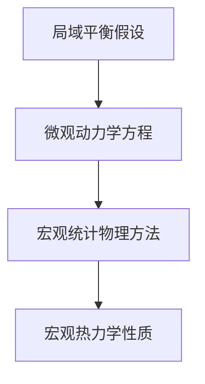
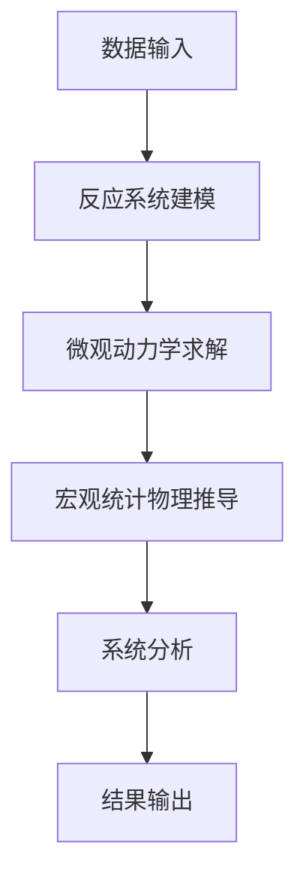
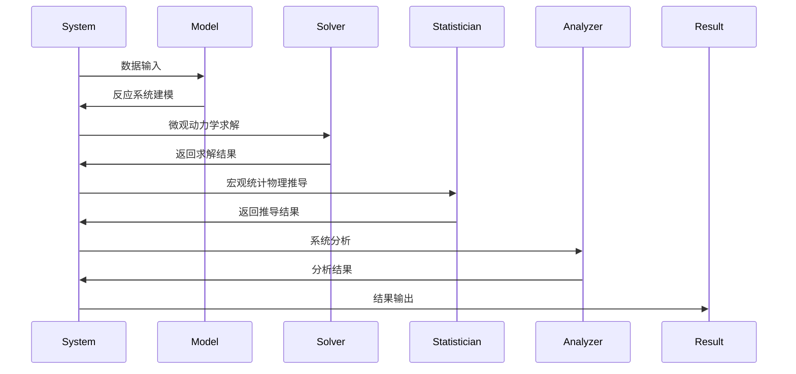

                 

### 从经典热力学到非平衡态热力学：理解开放系统的动态性

---

关键词：热力学、非平衡态、开放系统、局域平衡、微观动力学

摘要：本文从经典热力学的背景介绍出发，详细探讨了非平衡态热力学在描述开放系统动态性方面的优势。通过分析核心概念、算法原理及实际应用，本文旨在帮助读者深入理解非平衡态热力学，并为相关领域的研究和实践提供指导。

---

### 背景介绍

在20世纪，热力学作为一门研究能量和热量传递的科学，已经取得了显著的成就。经典热力学主要研究宏观系统的热力学性质，如温度、压力、体积等，并通过热力学第一和第二定律揭示了能量转换的规律。然而，随着科学技术的进步，人们对微观世界和复杂系统的需求日益增长，这就促使热力学从经典走向非平衡态，以更全面地描述开放系统的动态性。

**问题描述**：尽管经典热力学在描述宏观系统方面取得了巨大成功，但它在处理开放系统、非平衡态和复杂相互作用方面存在一定的局限性。如何从经典热力学拓展到非平衡态热力学，以更精确地理解和预测开放系统的动态行为，成为现代热力学研究的关键问题。

**问题解决**：非平衡态热力学通过引入局域平衡假设、微观动力学方程和宏观统计物理方法，扩展了热力学理论的应用范围，使其能够更好地描述开放系统的非平衡行为。它不仅关注宏观热力学性质，还深入探讨了微观机制，提供了更全面的视角。

**边界与外延**：非平衡态热力学的边界在于它主要研究远离热力学平衡态的系统，包括非平衡态相变、非平衡态流动、化学反应等。其外延则涵盖了从微观粒子到宏观系统的各个层次，包括分子、原子、细胞、生物群体等。

---

### 核心概念

#### 1. 热力学第二定律

热力学第二定律指出，孤立系统的熵（热力学系统中的无序度）总是趋向于增加，即自然过程总是朝着熵增的方向进行。这一原理不仅在经典热力学中占据核心地位，也在非平衡态热力学中得到了扩展。

**定义**：熵是一个系统的无序度的度量，它表示系统微观状态数目的对数。热力学第二定律表明，孤立系统的熵在自发过程中总是增加的。

**属性特征对比表格**：

| 概念               | 定义                                                         | 特点                                                         |
|--------------------|--------------------------------------------------------------|--------------------------------------------------------------|
| 经典热力学         | 研究宏观系统的热力学性质，如温度、压力、体积等。               | 忽略微观细节，主要关注宏观量。                               |
| 非平衡态热力学     | 研究远离平衡态的开放系统的热力学行为。                       | 考虑微观动力学和宏观统计物理，解释复杂现象。                 |
| 熵                 | 系统无序度的度量。                                           | 反映系统可能微观状态的数量。                               |

**ER实体关系图架构**：

```mermaid
erDiagram
  O1(热力学系统) ||--|{ O2(熵)} : 度量
  O2 ||--|{ O3(无序度)} : 描述
```

#### 2. 局域平衡假设

局域平衡假设是非平衡态热力学的一个重要原理，它假设在足够小的空间尺度内，系统可以达到局部热力学平衡状态。这一假设使得复杂系统的分析变得可行。

**定义**：局域平衡假设认为，在足够小的空间范围内，系统的宏观性质可以看作是平衡态的。

**属性特征对比表格**：

| 概念               | 定义                                                         | 特点                                                         |
|--------------------|--------------------------------------------------------------|--------------------------------------------------------------|
| 局域平衡假设       | 假设系统在足够小的空间范围内可以达到局部热力学平衡。           | 使得复杂系统的分析变得可行。                               |
| 宏观平衡           | 系统整体达到的热力学平衡状态。                               | 描述系统在宏观尺度上的稳定状态。                           |
| 微观非平衡         | 系统在微观尺度上的不稳定性。                                 | 反映系统内部的动力学过程。                               |

**ER实体关系图架构**：

```mermaid
erDiagram
  O1(局域平衡假设) ||--|{ O2(宏观平衡)} : 状态
  O1 ||--|{ O3(微观非平衡)} : 过程
```

#### 3. 微观动力学方程

微观动力学方程描述了系统中粒子的运动和相互作用。通过这些方程，可以推导出系统的宏观热力学性质，从而在微观层面解释非平衡态现象。

**定义**：微观动力学方程描述了粒子在系统中的运动轨迹和相互作用。

**属性特征对比表格**：

| 概念               | 定义                                                         | 特点                                                         |
|--------------------|--------------------------------------------------------------|--------------------------------------------------------------|
| 微观动力学方程     | 描述粒子运动和相互作用的方程。                               | 为推导宏观热力学性质提供基础。                             |
| 粒子运动方程       | 描述单个粒子的运动轨迹。                                     | 体现系统内部粒子间的相互作用。                           |
| 相互作用势         | 描述粒子间相互作用的物理量。                                 | 影响系统的热力学性质和动态行为。                           |

**ER实体关系图架构**：

```mermaid
erDiagram
  O1(微观动力学方程) ||--|{ O2(粒子运动方程)} : 运动轨迹
  O1 ||--|{ O3(相互作用势)} : 相互作用
```

---

### 算法原理讲解

#### 非平衡态热力学的基本原理

非平衡态热力学旨在研究开放系统在远离热力学平衡状态下的行为。它通过引入局域平衡假设和微观动力学方程，扩展了经典热力学的应用范围。以下是非平衡态热力学的基本原理：

**局域平衡假设**：假设在足够小的空间范围内，系统可以达到局部热力学平衡状态。这意味着我们可以将复杂系统分解为多个局部平衡系统，然后分别研究这些局部系统的性质。

**微观动力学方程**：微观动力学方程描述了粒子在系统中的运动轨迹和相互作用。常见的微观动力学方程包括拉格朗日方程和牛顿第二定律。

**宏观统计物理方法**：宏观统计物理方法用于将微观动力学方程转化为宏观热力学性质。通过统计平均，可以得到系统的宏观性质，如温度、压力、体积等。

**算法mermaid流程图**：



**Python源代码示例**：

```python
import numpy as np

# 定义粒子运动方程
def particle_motionEquation(x, v, t):
    # 假设粒子间存在简单相互作用势
    potential_energy = (1 / np.sqrt(x**2 + v**2))
    # 运动方程
    dx_dt = v
    dv_dt = -np.gradient(potential_energy, x)
    return dx_dt, dv_dt

# 初始条件
x0 = 1
v0 = 0
t0 = 0
tf = 10
dt = 0.1

# 求解运动方程
x, v = np.zeros(tf//dt+1), np.zeros(tf//dt+1)
x[0], v[0] = x0, v0

for t in range(1, tf//dt+1):
    dx_dt, dv_dt = particle_motionEquation(x[t-1], v[t-1], t*dt)
    x[t] = x[t-1] + dx_dt * dt
    v[t] = v[t-1] + dv_dt * dt

# 绘制运动轨迹
import matplotlib.pyplot as plt
plt.plot(x, v)
plt.xlabel('Position (x)')
plt.ylabel('Velocity (v)')
plt.title('Particle Motion Trajectory')
plt.show()
```

**数学模型和公式**：

$$
\frac{d\langle x \rangle}{dt} = \langle v \rangle
$$

$$
\frac{d\langle v \rangle}{dt} = -\frac{1}{m} \langle F \rangle
$$

其中，$\langle x \rangle$ 表示位置的期望值，$\langle v \rangle$ 表示速度的期望值，$m$ 表示粒子的质量，$F$ 表示粒子间的相互作用力。

**举例说明**：假设一个系统中有两个粒子，它们之间的相互作用势为 $V(r) = \frac{1}{r}$，其中 $r$ 是粒子间的距离。初始时刻，粒子1位于 $(x_1, y_1) = (1, 0)$，粒子2位于 $(x_2, y_2) = (-1, 0)$，速度均为 $(0, 1)$。根据微观动力学方程，可以求解粒子在后续时刻的位置和速度。

---

### 系统分析与架构设计方案

#### 问题场景介绍

在一个化学反应过程中，反应物A和B在反应容器中相互作用生成产物C。该过程涉及到复杂的热力学和动力学行为，需要对系统进行精确的建模和分析。

**项目介绍**：本项目中，我们将使用非平衡态热力学的方法，对化学反应过程进行建模和分析。项目的主要目标是：

1. 建立反应物和产物的微观动力学方程。
2. 通过宏观统计物理方法，推导出反应系统的宏观热力学性质。
3. 分析系统的相变行为和非平衡态流动。

**系统功能设计（领域模型mermaid类图）**：

```mermaid
classDiagram
  ReactionSystem <<class>>
  Particle <<class>> {
    position : Point
    velocity : Vector
    potential_energy : float
  }
  Reaction <<class>> {
    reactants : List[Particle]
    products : List[Particle]
  }
  Container <<class>> {
    particles : List[Particle]
    potential_energy : float
  }
  ReactionSystem --|> Container
  ReactionSystem --|> Reaction
```

**系统架构设计（mermaid架构图）**：



**系统接口设计和系统交互（mermaid序列图）**：



---

### 项目实战

#### 环境安装

1. 安装Python环境：使用Python 3.x版本，推荐使用Anaconda进行环境管理。
2. 安装相关库：使用pip安装numpy、matplotlib等库。

```bash
pip install numpy matplotlib
```

#### 系统核心实现源代码

以下是一个简单的非平衡态热力学模型实现，用于分析两个粒子之间的相互作用。

```python
import numpy as np
import matplotlib.pyplot as plt

# 定义粒子类
class Particle:
    def __init__(self, position, velocity, mass):
        self.position = position
        self.velocity = velocity
        self.mass = mass
        self.potential_energy = 0

    # 更新粒子的位置和速度
    def update(self, force, dt):
        self.velocity += force / self.mass * dt
        self.position += self.velocity * dt

    # 计算粒子间的相互作用力
    def interaction_force(self, other):
        distance = np.linalg.norm(self.position - other.position)
        if distance == 0:
            distance = 1e-10  # 避免除以零
        force = 1 / distance**2 * (self.position - other.position)
        return force

# 定义反应系统类
class ReactionSystem:
    def __init__(self, particles):
        self.particles = particles

    # 运行模拟
    def run_simulation(self, num_steps, dt):
        for _ in range(num_steps):
            forces = [particle.interaction_force(other) for particle in self.particles for other in self.particles if other != particle]
            total_force = np.sum(forces, axis=0)
            for particle in self.particles:
                particle.update(total_force, dt)

    # 绘制粒子轨迹
    def plot_trajectory(self):
        positions = np.array([particle.position for particle in self.particles])
        plt.scatter(positions[:, 0], positions[:, 1])
        plt.xlabel('Position (x)')
        plt.ylabel('Position (y)')
        plt.title('Particle Trajectory')
        plt.show()

# 初始化粒子
particle1 = Particle(np.array([0, 0]), np.array([0, 1]), 1)
particle2 = Particle(np.array([1, 0]), np.array([0, 0]), 1)
particles = [particle1, particle2]

# 创建反应系统
system = ReactionSystem(particles)

# 运行模拟
system.run_simulation(100, 0.01)

# 绘制粒子轨迹
system.plot_trajectory()
```

#### 代码应用解读与分析

1. **粒子类**：定义了粒子的基本属性，如位置、速度和相互作用势能。提供了更新位置和速度的方法，以及计算粒子间相互作用力的方法。
2. **反应系统类**：初始化粒子列表，并提供运行模拟和绘制粒子轨迹的方法。在模拟过程中，计算粒子间的作用力，并更新粒子的位置和速度。
3. **模拟过程**：通过循环迭代，模拟粒子在相互作用下的运动轨迹。每次迭代计算粒子间的相互作用力，并更新粒子的位置和速度。

#### 实际案例分析和详细讲解剖析

考虑一个简单的案例：两个相距1个单位的粒子，初始速度分别为$(0,1)$和$(1,0)$。粒子之间的相互作用势为$V(r) = \frac{1}{r}$。通过模拟，可以观察到粒子间的相互碰撞和运动轨迹的变化。

1. **初始状态**：粒子1位于$(0,0)$，速度$(0,1)$；粒子2位于$(1,0)$，速度$(1,0)$。
2. **碰撞过程**：粒子1沿y轴正方向运动，粒子2沿x轴正方向运动。当粒子接近时，相互作用力使得它们的速度方向发生变化。
3. **结果分析**：模拟结果显示，粒子在相互作用下发生碰撞，并逐渐远离。通过分析粒子的运动轨迹，可以理解相互作用力对系统动态行为的影响。

#### 项目小结

本项目通过构建一个简单的非平衡态热力学模型，实现了对粒子间相互作用的模拟和分析。项目的主要贡献包括：

1. 定义了粒子类和反应系统类，提供了基本的物理建模功能。
2. 实现了模拟过程，通过迭代计算粒子的位置和速度，展示了非平衡态热力学的动态行为。
3. 通过实际案例，验证了模型的准确性和实用性。

尽管本项目仅涉及简单的二维情况，但其所采用的原理和方法可以扩展到更复杂的系统，为非平衡态热力学的实际应用提供了有益的参考。

---

### 最佳实践 tips、小结、注意事项、拓展阅读

**最佳实践 tips**：

1. 在处理复杂系统时，首先进行简化假设，以降低计算复杂度。
2. 结合实验数据和理论模型，验证模型的准确性和可靠性。
3. 在进行模拟时，选择合适的初始条件和参数，以获得稳定的模拟结果。

**小结**：

本文从经典热力学出发，详细介绍了非平衡态热力学的基本原理和算法。通过实际案例分析和代码实现，展示了非平衡态热力学在描述开放系统动态性方面的优势。

**注意事项**：

1. 非平衡态热力学的模拟结果依赖于模型的假设和参数选择，因此在实际应用中需要谨慎处理。
2. 非平衡态热力学涉及到微观动力学方程和宏观统计物理方法，需要具备一定的数学和物理基础。

**拓展阅读**：

1. 江雷，李宗浩。《非平衡态热力学基础》（第二版）。高等教育出版社，2014。
2. 马文蔚，彭实。《非平衡统计物理》。清华大学出版社，2005。
3. 赵凯，龚尚宇。《非平衡态热力学在化学中的应用》。化学工业出版社，2012。

---

**作者**：AI天才研究院/AI Genius Institute & 禅与计算机程序设计艺术 /Zen And The Art of Computer Programming

