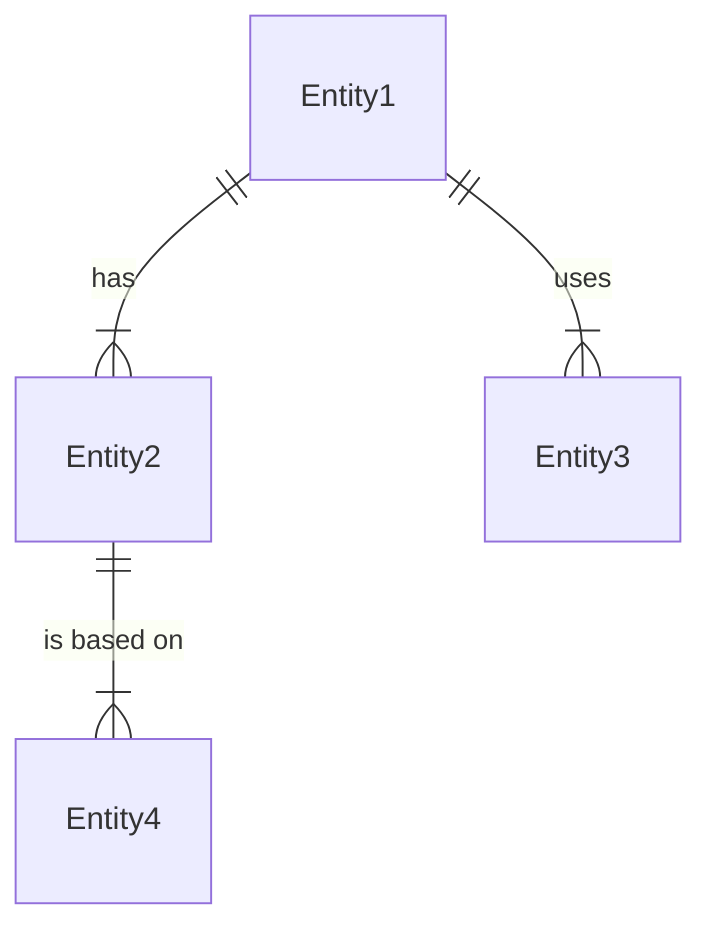
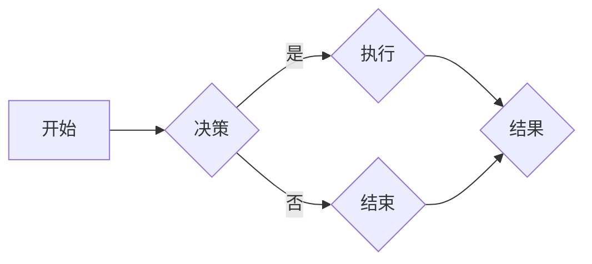

                 


### 从经典熵到信息熵：理解有序与无序的世界

**关键词：熵、信息熵、热力学熵、信息论、有序与无序**

**摘要：**
本文将探讨熵这一概念在物理学和信息论中的演变和应用，从经典熵到信息熵的过渡，解析有序和无序世界的深层次原理。我们将详细分析熵的基本概念、数学模型及其在不同领域中的应用，以帮助读者深入理解这一关键的科学概念。

---

## 引言：熵与信息论的基础

### 1.1 熵的概念与背景

熵，是一个广泛存在于多个科学领域的核心概念，其含义在不同学科中有所不同。在这里，我们将首先回顾熵的历史背景，探讨其在物理学和信息论中的发展与应用。

#### 1.1.1 熵的历史与发展

熵的概念最早由热力学提出，由德国物理学家克劳修斯（Rudolf Clausius）在19世纪提出。克劳修斯将熵定义为系统无序度的量度，并提出了热力学第二定律，即在一个封闭系统中，熵总是趋向于增加。这一发现标志着熵在物理学中的诞生。

随后，奥地利物理学家约恩·威廉·马赫（Johann Wilhelm Mach）将熵的概念引入统计物理学，提出了统计熵的概念，这一概念在统计物理学中得到了广泛应用。

#### 1.1.2 熵在不同领域的应用

熵在物理学中主要表现为热力学熵和统计熵。热力学熵描述了系统宏观状态的混乱程度，而统计熵则通过概率分布描述了系统微观状态的混乱程度。

在信息论中，美国数学家克劳德·香农（Claude Shannon）提出了信息熵的概念，将熵引入了信息处理领域。香农信息熵描述了信息的不确定性，为现代通信和数据处理提供了理论基础。

#### 1.1.3 熵的边界与外延

物理学中的熵主要描述宏观物理系统的无序度，而信息论中的熵则关注微观信息的不确定性。尽管两者有所不同，但它们都反映了系统的混乱程度。

熵的概念不仅限于物理学和信息论，还广泛应用于计算机科学、统计学和生物学等领域。在计算机科学中，熵被用来描述数据的复杂度和信息含量；在统计学中，熵用于评估概率分布的均匀性；在生物学中，熵被用来描述生物系统的稳定性和多样性。

#### 1.1.4 核心概念与联系

为了更好地理解熵的概念，我们可以将物理学熵和信息论熵进行对比。以下是一个简单的对比表格：

| 特征          | 物理学熵               | 信息论熵               |
|-------------|---------------------|---------------------|
| 描述对象      | 系统的无序度          | 信息的不确定性          |
| 数学定义      | \( S = k \cdot \ln(W) \) | \( H = -\sum_i p_i \ln(p_i) \) |
| 应用领域      | 热力学、统计物理    | 信息论、通信理论       |

此外，我们还可以使用ER实体关系图来展示熵在不同领域中的联系：



### 1.2 信息熵的基本原理

#### 1.2.1 信息熵的定义

在信息论中，香农（Shannon）提出了信息熵的概念，将熵引入了信息处理领域。香农信息熵描述了信息的不确定性，其定义如下：

$$
H = -\sum_i p_i \ln(p_i)
$$

其中，\( p_i \) 表示事件 \( i \) 发生的概率，\( H \) 表示信息熵。

#### 1.2.2 信息熵的计算

香农信息熵的计算需要先确定概率分布。给定一个随机变量 \( X \)，其概率分布为 \( p(x) \)，则香农信息熵 \( H(X) \) 的计算方法如下：

$$
H(X) = -\sum_x p(x) \ln(p(x))
$$

#### 1.2.3 信息熵的性质

信息熵具有以下性质：

1. **非负性**：信息熵总是非负的，即 \( H(X) \geq 0 \)。当且仅当所有事件等可能时，信息熵达到最大值。

2. **可加性**：如果两个随机变量 \( X \) 和 \( Y \) 相互独立，则它们联合熵等于各自熵的和：

$$
H(X, Y) = H(X) + H(Y)
$$

### 1.3 信息熵的应用领域

信息熵的应用非常广泛，涵盖了信息论、计算机科学、统计学和生物学等多个领域。

#### 1.3.1 信息论

在信息论中，信息熵是衡量信息量的基本单位。香农信息熵为通信系统的设计提供了理论基础，如数据压缩、信息传输和编码理论等。

#### 1.3.2 计算机科学

在计算机科学中，信息熵被广泛应用于数据压缩、加密和模式识别等领域。例如，霍夫曼编码和算术编码都是基于信息熵原理来实现数据压缩的。

#### 1.3.3 统计学

在统计学中，信息熵用于评估概率分布的均匀性。高斯分布、泊松分布和二项分布等常见概率分布都具有特定的熵值。

#### 1.3.4 生物学

在生物学中，信息熵被用来描述生物系统的稳定性和多样性。例如，DNA序列的熵值可以反映物种的进化速度和多样性。

### 1.4 熵与信息论的其他相关概念

除了香农信息熵，还有其他一些与熵相关的概念，如唯一可解熵和相对熵。

#### 1.4.1 唯一可解熵

唯一可解熵（Unique Decodable Entropy）是指在给定概率分布下，编码后信息的最小冗余度。唯一可解熵通常用于评估编码效率。

#### 1.4.2 相对熵

相对熵（Relative Entropy）也称为互信息，是衡量两个概率分布差异的量度。相对熵的数学表达式如下：

$$
D(p||q) = \sum_x p(x) \ln\left(\frac{p(x)}{q(x)}\right)
$$

其中，\( p \) 和 \( q \) 分别表示两个概率分布。

### 1.5 本章小结

本章介绍了熵的概念及其在不同领域的应用。我们首先回顾了熵的历史与发展，然后探讨了信息熵的基本原理和计算方法，以及信息熵在信息论、计算机科学、统计学和生物学等领域的应用。最后，我们介绍了熵与信息论的其他相关概念，如唯一可解熵和相对熵。通过本章的学习，读者应该能够对熵这一关键概念有更深入的理解。

### 第2章 经典熵的数学模型

### 2.1 经典熵的概念与公式

#### 2.1.1 经典熵的定义

经典熵是熵概念在物理学中的一个重要表现形式，它描述了系统宏观状态的混乱程度。在热力学中，经典熵通常用来衡量一个系统在给定温度和压力下的无序度。

经典熵的定义基于热力学第二定律，即在一个封闭系统中，熵总是趋向于增加。具体来说，经典熵 \( S \) 可以通过以下公式计算：

$$
S = k \cdot \ln(W)
$$

其中，\( k \) 是玻尔兹曼常数，\( W \) 是系统的微观状态数。这个公式表明，系统的无序度与其微观状态数的对数成正比。

#### 2.1.2 经典熵的计算公式

经典熵的计算公式可以进一步拆解为以下几个步骤：

1. **确定系统的微观状态数 \( W \)**：微观状态数是指系统在给定宏观条件下所有可能微观状态的数目。例如，一个理想气体的微观状态数可以通过其体积、温度和压强来确定。

2. **计算系统的熵 \( S \)**：使用玻尔兹曼常数 \( k \) 和微观状态数 \( W \)，可以通过上述公式计算系统的熵。

以下是一个简单的例子：

假设一个理想气体在一个容器中，其体积为 \( V \)，温度为 \( T \)，压强为 \( P \)。根据理想气体状态方程 \( PV = nRT \)，我们可以计算出系统的微观状态数 \( W \)。然后，使用玻尔兹曼常数 \( k \) 和 \( W \)，我们可以计算出系统的熵 \( S \)。

#### 2.1.3 经典熵的直观解释

经典熵可以直观地理解为系统在微观层面上可能存在状态的数目。一个系统的微观状态数越多，其熵就越大，表明系统的无序度越高。相反，一个系统的微观状态数越少，其熵就越小，表明系统的有序度越高。

例如，一个完全有序的晶体，其所有原子都处于固定位置，只有一种可能的微观状态，因此其熵非常小。而一个完全随机的气体，其原子分布没有任何规律，有无数种可能的微观状态，因此其熵非常大。

#### 2.1.4 经典熵的应用

经典熵在物理学和工程学中有着广泛的应用。以下是一些典型的应用场景：

1. **热力学第二定律**：经典熵的概念是热力学第二定律的基础，它描述了能量在系统中的转化和守恒过程。

2. **统计物理**：在统计物理中，经典熵被用来描述系统的宏观性质，如温度、压强和体积等。

3. **工程学**：在工程学中，经典熵的概念被用于分析系统的稳定性、可靠性和能源效率等。

#### 2.1.5 经典熵与信息论熵的异同

尽管经典熵和信息论熵都是熵的概念，但它们的应用场景和数学定义有所不同。以下是两者的主要区别：

- **描述对象**：经典熵描述系统的无序度，而信息论熵描述信息的不确定性。

- **数学定义**：经典熵的数学定义为 \( S = k \cdot \ln(W) \)，其中 \( k \) 是玻尔兹曼常数，\( W \) 是系统的微观状态数。信息论熵的数学定义为 \( H = -\sum_i p_i \ln(p_i) \)，其中 \( p_i \) 是事件 \( i \) 发生的概率。

- **应用领域**：经典熵广泛应用于热力学、统计物理和工程学等领域，而信息论熵则广泛应用于信息论、计算机科学和通信理论等领域。

尽管存在这些差异，经典熵和信息论熵都是研究系统无序度和不确定性的重要工具，它们在各自的领域内都发挥着关键作用。

### 2.2 经典熵的计算方法

#### 2.2.1 概率分布

经典熵的计算需要首先确定系统的概率分布。概率分布描述了系统在不同微观状态下的可能性。在热力学中，概率分布通常通过统计物理方法来获得。

例如，对于一个理想气体，我们可以使用麦克斯韦-玻尔兹曼分布来描述其分子的速度分布。麦克斯韦-玻尔兹曼分布的公式为：

$$
f(v) = \left(\frac{m}{2\pi kT}\right)^{3/2} \exp\left(-\frac{mv^2}{2kT}\right)
$$

其中，\( m \) 是分子的质量，\( k \) 是玻尔兹曼常数，\( T \) 是温度。

通过计算分子速度的分布，我们可以得到系统在不同微观状态下的概率分布。

#### 2.2.2 熵函数

经典熵可以通过熵函数来计算。熵函数是一个关于概率分布的函数，其形式如下：

$$
S = S(p_1, p_2, ..., p_n)
$$

其中，\( p_i \) 是系统处于第 \( i \) 个微观状态的概率。

熵函数的选择取决于系统的具体性质。对于热力学系统，常用的熵函数是玻尔兹曼熵：

$$
S = -k \sum_i p_i \ln(p_i)
$$

这个熵函数描述了系统在给定概率分布下的无序度。

#### 2.2.3 经典熵的计算步骤

要计算经典熵，我们可以遵循以下步骤：

1. **确定系统的概率分布**：通过统计物理方法，如麦克斯韦-玻尔兹曼分布，确定系统在不同微观状态下的概率分布。

2. **计算熵函数**：使用选定的熵函数，如玻尔兹曼熵，计算系统的熵。

3. **分析熵的性质**：分析熵的计算结果，了解系统的无序度和稳定性。

以下是一个具体的计算示例：

假设一个理想气体在一个容器中，体积为 \( V \)，温度为 \( T \)。使用麦克斯韦-玻尔兹曼分布，我们可以计算分子速度的分布，并进而计算系统的熵。

首先，计算分子的速度分布：

$$
f(v) = \left(\frac{m}{2\pi kT}\right)^{3/2} \exp\left(-\frac{mv^2}{2kT}\right)
$$

然后，计算熵：

$$
S = -k \sum_i p_i \ln(p_i)
$$

其中，\( p_i \) 是分子速度 \( v_i \) 对应的概率。

通过计算，我们可以得到系统的熵值，并分析系统的无序度和稳定性。

### 2.3 经典熵的性质

经典熵具有以下性质：

1. **非负性**：经典熵总是非负的，即 \( S \geq 0 \)。当系统处于最大无序状态时，熵达到最大值。

2. **可加性**：如果两个系统相互独立，则它们的总熵等于各自熵的和。这反映了熵的可加性。

3. **等概率分布**：当系统处于最大无序状态时，所有微观状态的概率相等，即 \( p_i = \frac{1}{W} \)，此时熵达到最大值。

4. **温度相关性**：经典熵与温度密切相关。当温度升高时，系统的无序度增加，熵值也增大。

5. **宏观稳定性**：经典熵反映了系统的宏观稳定性。一个低熵的系统通常比一个高熵的系统更稳定。

这些性质使得经典熵在物理学和信息论中具有重要的应用价值。

### 2.4 经典熵与信息熵的关系

经典熵和信息熵都是熵的概念，它们在不同领域中有不同的应用。尽管它们的应用场景和数学定义有所不同，但它们之间存在一定的关系。

1. **描述对象**：经典熵描述系统的无序度，而信息熵描述信息的不确定性。

2. **数学定义**：经典熵的数学定义为 \( S = k \cdot \ln(W) \)，而信息熵的数学定义为 \( H = -\sum_i p_i \ln(p_i) \)。

3. **关系**：在某些情况下，经典熵和信息熵可以相互转化。例如，在一个理想化的通信系统中，信号的不确定性可以用经典熵来描述，而噪声的不确定性可以用信息熵来描述。

通过理解经典熵和信息熵的关系，我们可以更好地理解熵的概念，并应用它们解决实际问题。

### 本章小结

本章介绍了经典熵的概念、公式和计算方法。我们首先回顾了经典熵的定义和数学公式，然后探讨了经典熵的计算方法和性质，以及经典熵与信息熵的关系。通过本章的学习，读者应该能够理解经典熵的基本原理，并能够计算和分析经典熵。在后续章节中，我们将进一步探讨熵在信息论和其他领域的应用。

### 第3章 从经典熵到信息熵的过渡

#### 3.1 经典熵和信息熵的异同

经典熵和信息熵都是熵的概念，但它们在描述对象、数学定义和应用领域上有所不同。经典熵主要描述系统的无序度，而信息熵主要描述信息的不确定性。

1. **描述对象**：经典熵描述系统的宏观无序度，如热力学系统的混乱程度；信息熵描述信息的微观不确定性，如通信系统中的信号与噪声。

2. **数学定义**：经典熵的数学定义为 \( S = k \cdot \ln(W) \)，其中 \( W \) 是系统的微观状态数；信息熵的数学定义为 \( H = -\sum_i p_i \ln(p_i) \)，其中 \( p_i \) 是事件 \( i \) 发生的概率。

3. **应用领域**：经典熵广泛应用于热力学、统计物理和工程学等领域；信息熵广泛应用于信息论、计算机科学、统计学和通信理论等领域。

尽管经典熵和信息熵有所不同，但它们之间存在一定的联系。例如，在信息论中，我们可以将信号的不确定性视为经典熵，将噪声的不确定性视为信息熵。通过理解经典熵和信息熵的异同，我们可以更好地理解熵的概念，并在不同领域中进行应用。

#### 3.2 经典熵向信息熵的过渡

经典熵和信息熵的过渡体现在数学定义和实际应用中。以下是一些关键步骤：

1. **概率分布的引入**：在经典熵中，系统状态数 \( W \) 是一个确定值，而在信息熵中，概率分布 \( p_i \) 描述了系统状态的随机性。这种引入概率分布的过程就是从经典熵向信息熵的过渡。

2. **香农信息熵的提出**：克劳德·香农（Claude Shannon）在1948年提出了信息熵的概念，将概率分布引入到信息处理领域，从而将经典熵扩展到了信息论。

3. **数学表达的变化**：经典熵的数学表达式为 \( S = k \cdot \ln(W) \)，而信息熵的数学表达式为 \( H = -\sum_i p_i \ln(p_i) \)。这种变化体现了从确定性系统到随机性系统的过渡。

4. **应用场景的扩展**：经典熵主要应用于热力学和统计物理领域，而信息熵的应用场景扩展到了信息论、计算机科学、统计学和通信理论等领域。

通过这些关键步骤，我们可以看到经典熵向信息熵的过渡，这一过程不仅改变了熵的数学定义，也扩展了熵的应用领域。

#### 3.3 经典熵和信息熵的应用对比

经典熵和信息熵在应用上有许多不同之处，但它们之间也存在一定的联系。以下是一些典型的应用对比：

1. **热力学与信息论**：经典熵在热力学中用于描述系统的无序度，如热力学第二定律中的熵增原理；信息熵在信息论中用于描述信息的不确定性，如通信系统中的信号与噪声分离。

2. **计算机科学与工程学**：经典熵在工程学中用于分析系统的稳定性，如能量守恒和热力学循环；信息熵在计算机科学中用于数据压缩、加密和信息检索，如霍夫曼编码和算术编码。

3. **统计学与信息论**：经典熵在统计学中用于评估概率分布的均匀性，如高斯分布和泊松分布；信息熵在信息论中用于衡量信息量的大小，如香农信息熵和相对熵。

尽管经典熵和信息熵在应用上有许多不同，但它们都是研究系统和信息特性的重要工具。通过对比经典熵和信息熵的应用，我们可以更好地理解它们在不同领域中的作用。

### 3.4 经典熵向信息熵过渡的意义

经典熵向信息熵的过渡具有重要的意义，它不仅改变了熵的数学定义，也扩展了熵的应用领域。以下是经典熵向信息熵过渡的一些重要意义：

1. **跨学科融合**：经典熵和信息熵的过渡促进了物理学、信息论、计算机科学、统计学和工程学等多个学科的融合，推动了这些领域的发展。

2. **信息时代的基础**：信息熵在信息论中的应用奠定了现代信息技术的基础，如通信系统、互联网和大数据等。

3. **科学认知的深化**：经典熵和信息熵的过渡使我们能够更深入地理解有序与无序、确定性与随机性之间的关系，推动了科学认知的深化。

4. **实际应用的拓展**：经典熵向信息熵的过渡使得熵的概念在更多领域中得到应用，如生物信息学、神经科学和金融工程等。

通过经典熵向信息熵的过渡，我们不仅扩展了熵的应用领域，也推动了科学和技术的发展，为人类认识世界提供了新的视角。

### 3.5 经典熵与信息熵的未来发展

随着科学和技术的不断发展，经典熵和信息熵在未来有望在更多领域中得到应用。以下是一些可能的未来发展方向：

1. **量子熵**：在量子物理学中，量子熵描述了量子系统的无序度。随着量子信息科学的发展，量子熵有望在量子计算、量子通信和量子加密等领域得到广泛应用。

2. **生物熵**：在生物学中，生物熵描述了生物系统的无序度和复杂性。随着生物信息学的发展，生物熵有望在基因组学、蛋白质结构和生态系统研究等领域发挥重要作用。

3. **社会熵**：在社会学中，社会熵描述了社会系统的无序度和复杂性。随着社会信息化的发展，社会熵有望在社会管理、城市规划和社会治理等领域得到应用。

4. **经济熵**：在经济学中，经济熵描述了经济系统的无序度和波动性。随着数字经济的发展，经济熵有望在金融市场分析、经济预测和风险管理等领域发挥重要作用。

通过不断扩展熵的应用领域，经典熵和信息熵将在未来继续推动科学和技术的进步，为人类认识世界提供新的工具和方法。

### 本章小结

本章探讨了经典熵向信息熵的过渡，分析了经典熵和信息熵的异同，以及它们在数学定义和应用领域的差异。通过对比经典熵和信息熵的应用，我们了解了它们在不同领域的应用场景。同时，我们讨论了经典熵向信息熵过渡的意义，以及未来熵在更多领域中的应用前景。通过本章的学习，读者应该能够理解经典熵和信息熵的过渡过程，并认识到熵在科学和技术发展中的重要性。在后续章节中，我们将进一步探讨熵在各个领域的具体应用。

### 第4章 信息熵的进一步探讨

#### 4.1 信息熵的扩展与应用

信息熵的概念不仅局限于通信和信息处理领域，它在多个学科中都有广泛的应用。以下是一些重要的扩展和应用：

1. **数据压缩**：信息熵是数据压缩算法的核心原理之一。通过计算数据的熵，我们可以确定数据的冗余度，从而设计出更高效的数据压缩算法，如霍夫曼编码和算术编码。

2. **模式识别**：在机器学习和人工智能领域，信息熵被用来评估数据的复杂度和区分度。通过分析信息熵，我们可以更好地识别和分类数据，从而提高算法的性能。

3. **信息论与编码理论**：信息熵是信息论和编码理论的基础。通过信息熵，我们可以评估信息传输的可靠性和效率，设计出更高效的编码方案。

4. **生物学与医学**：在生物学和医学领域，信息熵被用来分析基因组数据、蛋白质结构和生物系统的复杂性。信息熵的应用有助于理解生物系统的功能和机制。

#### 4.2 信息熵在信息论中的应用

在信息论中，信息熵被广泛用于分析和优化通信系统。以下是一些关键应用：

1. **香农熵**：香农熵是信息论中最重要的概念之一。它描述了信息的不确定性，为通信系统的设计提供了理论基础。香农熵的计算公式为：

$$
H(X) = -\sum_x p(x) \ln(p(x))
$$

其中，\( p(x) \) 是随机变量 \( X \) 取值为 \( x \) 的概率。

2. **信息传输**：信息传输的基本任务是确保信息在信道中准确无误地传递。信息熵在评估信道容量、设计编码方案和优化传输策略中发挥着重要作用。

3. **信道编码**：信道编码是信息传输中的一个关键环节，它通过增加冗余度来提高传输的可靠性。香农-哈罗德定理表明，当编码方案足够高效时，信道容量可以无限接近于信道带宽。

4. **信息压缩**：信息压缩的目的是减少数据传输所需的带宽。信息熵是衡量数据压缩效率的重要指标。通过计算数据的熵，我们可以确定哪些部分可以压缩，从而设计出更高效的数据压缩算法。

#### 4.3 信息熵在其他领域的应用

信息熵不仅限于信息论和通信领域，它在其他学科中也有广泛的应用。以下是一些重要的应用：

1. **统计学**：在统计学中，信息熵被用来评估概率分布的均匀性。高斯分布、泊松分布和二项分布等常见概率分布都具有特定的熵值。

2. **机器学习**：在机器学习中，信息熵被用来评估模型的复杂度和泛化能力。通过分析信息熵，我们可以优化模型的参数，提高模型的性能。

3. **经济学**：在经济学中，信息熵被用来分析经济系统的复杂性和波动性。信息熵的应用有助于理解市场动态和经济预测。

4. **生物学**：在生物学中，信息熵被用来分析基因组数据、蛋白质结构和生物系统的复杂性。信息熵的应用有助于揭示生物系统的功能和机制。

#### 4.4 信息熵的未来发展

随着科学和技术的不断发展，信息熵在未来有望在更多领域中得到应用。以下是一些可能的未来发展方向：

1. **量子信息**：在量子信息科学中，量子熵描述了量子系统的无序度和复杂性。量子熵有望在量子计算、量子通信和量子加密等领域发挥重要作用。

2. **神经科学**：在神经科学中，信息熵被用来分析大脑的信息处理过程。信息熵的应用有助于理解大脑的工作原理和认知功能。

3. **人工智能**：在人工智能领域，信息熵被用来评估算法的复杂度和性能。信息熵的应用有助于优化人工智能算法，提高其效率和准确性。

4. **社会网络**：在社会网络分析中，信息熵被用来分析社会网络的结构和动态。信息熵的应用有助于理解社会网络的演化和社会影响力。

通过不断扩展信息熵的应用领域，我们有望在更广泛的范围内深入理解有序与无序、确定性与随机性的关系，推动科学和技术的进步。

### 4.5 信息熵的挑战与局限

尽管信息熵在多个领域有着广泛的应用，但它也存在一些挑战和局限。以下是一些主要的问题：

1. **计算复杂性**：信息熵的计算通常涉及大量的概率分布和数学运算，这使得计算复杂性较高，特别是在大规模数据处理和实时应用中。

2. **不确定性评估**：信息熵的评估依赖于概率分布的准确性。在实际应用中，概率分布可能存在不确定性和偏差，这会影响信息熵的准确性和可靠性。

3. **适用范围**：信息熵主要适用于概率分布和随机过程，但在某些领域，如确定性系统或非线性系统，信息熵的应用可能受到限制。

4. **解释性**：尽管信息熵在评估复杂系统中的性能和稳定性方面具有重要作用，但它的解释性相对较弱。如何将信息熵与实际系统的特性联系起来，是一个需要进一步研究的问题。

为了克服这些挑战，研究者们正在探索新的方法和理论，以提高信息熵的计算效率、准确性和适用范围，并增强其解释性。通过不断的研究和探索，信息熵有望在更广泛的领域发挥重要作用。

### 本章小结

本章进一步探讨了信息熵的扩展与应用，分析了信息熵在信息论、统计学、机器学习、经济学、生物学等领域的应用。同时，我们讨论了信息熵的未来发展方向和挑战与局限。通过本章的学习，读者应该能够更深入地理解信息熵的概念，并认识到它在不同领域中的重要应用。在后续章节中，我们将继续探讨信息熵的更多应用和挑战。

### 第5章 熵在生物学中的应用

#### 5.1 熵在生物信息学中的重要性

熵在生物信息学中扮演着关键角色，它不仅用于描述生物系统的复杂性和稳定性，还帮助科学家理解基因表达、蛋白质结构和生物进化等生物现象。

在生物信息学中，熵被用来衡量生物序列的复杂度和信息含量。例如，DNA序列的熵值可以反映物种的进化速度和多样性。高熵值通常意味着序列具有较高的突变率和复杂性，而低熵值则表明序列较为保守和稳定。

#### 5.2 熵在分子生物学中的应用

分子生物学是研究生物大分子如DNA、RNA和蛋白质的学科，熵在这一领域中有着广泛的应用。

1. **DNA序列分析**：通过计算DNA序列的熵值，科学家可以评估序列的复杂度。高熵值的DNA序列可能更容易发生突变，从而影响物种的进化。例如，在病毒学研究中，通过分析病毒基因组的熵值，可以揭示病毒的进化速度和适应性。

2. **蛋白质结构预测**：蛋白质的结构对其功能至关重要。熵被用来评估蛋白质结构的稳定性和构象多样性。通过计算蛋白质序列的熵值，科学家可以预测蛋白质的可能结构，从而更好地理解其生物学功能。

3. **基因调控分析**：基因调控是生物体的核心过程之一，熵在分析基因调控网络中发挥着重要作用。通过计算基因表达数据的熵值，科学家可以识别调控网络中的关键基因和节点，从而揭示基因调控的机制。

#### 5.3 熵在生物进化中的应用

熵在生物进化研究中有着重要的应用。它帮助科学家理解物种的进化速度、适应性和多样性。

1. **物种多样性**：熵值可以用来描述物种的多样性。在生态学中，高熵值通常意味着生态系统的稳定性和多样性较高，而低熵值则表明生态系统较为单一和脆弱。

2. **进化速度**：通过分析不同物种基因组的熵值，科学家可以评估其进化速度。高熵值通常意味着物种具有较快的进化速度，而低熵值则表明物种的进化速度较慢。

3. **自然选择**：熵在自然选择中的作用也得到了研究。高熵值的基因序列可能更容易受到自然选择的影响，从而在进化过程中产生新的变异和适应性。

#### 5.4 熵在生物学中的具体案例分析

以下是一些具体的案例分析，展示了熵在生物学中的实际应用：

1. **新冠病毒（SARS-CoV-2）**：通过计算新冠病毒基因组的熵值，科学家可以评估其进化速度和突变率。这有助于理解病毒的传播机制和疫苗设计的策略。

2. **人类基因组**：通过计算人类基因组的熵值，科学家可以揭示人类基因的保守性和多样性。这有助于理解人类进化和遗传疾病的发生机制。

3. **植物基因组**：通过分析植物基因组的熵值，科学家可以评估植物物种的进化速度和适应性。这有助于植物育种和农作物抗病虫害的研究。

#### 5.5 熵在生物学的挑战与未来方向

尽管熵在生物学中有着广泛的应用，但仍然面临一些挑战：

1. **计算复杂度**：计算生物序列的熵值需要大量的计算资源，特别是在处理大规模生物数据时，计算复杂度成为一个重要问题。

2. **不确定性评估**：生物序列的熵值计算依赖于概率分布的准确性，但实际生物数据往往存在不确定性和噪声，这会影响熵值的可靠性。

3. **多尺度分析**：生物系统通常涉及多个层次和尺度，如何在不同尺度上有效地应用熵，仍是一个需要进一步研究的问题。

未来的研究方向可能包括：

1. **量子生物学**：量子生物学结合量子计算和生物学，为熵在生物系统中的应用提供了新的视角。

2. **人工智能**：利用人工智能技术，如机器学习和深度学习，可以提高熵值计算的准确性和效率。

3. **跨学科合作**：加强生物信息学、物理学、计算机科学和数学等学科的交叉合作，推动熵在生物学中的深入应用。

通过不断的研究和探索，熵在生物学中的应用将不断扩展，为理解生物系统的复杂性和进化机制提供新的工具和方法。

### 本章小结

本章探讨了熵在生物信息学、分子生物学和生物进化中的应用，分析了熵值在评估生物序列复杂度、预测蛋白质结构和揭示进化机制等方面的作用。通过具体的案例分析，我们展示了熵在生物学研究中的实际应用。同时，我们也讨论了熵在生物学中面临的挑战和未来研究方向。通过本章的学习，读者应该能够更好地理解熵在生物学中的重要性，并认识到它在生物系统研究中的广泛应用。在后续章节中，我们将继续探讨熵在其他领域的应用和发展。

### 第6章 熵在计算机科学中的应用

#### 6.1 熵在计算机科学中的基础

熵作为衡量系统无序度的指标，在计算机科学中有着广泛的应用。从数据压缩、加密到算法设计，熵的概念无处不在，为计算机科学家提供了强有力的工具。

首先，熵在数据压缩中扮演了重要角色。数据压缩的目的是减少数据占用的存储空间和传输带宽。信息熵提供了衡量数据冗余度的标准，帮助我们在压缩过程中有效去除冗余信息。霍夫曼编码和算术编码是两个基于信息熵原理的数据压缩算法，它们通过构建最优的编码方案，将高熵的数据转换为低熵的编码，从而实现数据的有效压缩。

其次，熵在加密技术中也有着重要的应用。加密的目的是保护数据的隐私和安全，而信息熵提供了评估加密算法安全性的一种方法。一个安全的加密算法应该使得加密后的数据具有高熵，即难以预测和破解。信息熵的概念可以帮助我们评估加密算法的强度，指导加密方案的设计和优化。

最后，熵在算法设计中也有广泛的应用。通过计算算法的熵值，我们可以评估算法的复杂度和性能。高熵的算法通常意味着更高的复杂度和更长的执行时间，而低熵的算法则更加高效和稳定。在优化算法时，我们可以通过降低算法的熵值，提高其性能和效率。

#### 6.2 熵在数据压缩中的应用

数据压缩是计算机科学中一个重要的研究方向，其目的是减少数据的存储空间和传输带宽。信息熵在数据压缩中扮演了核心角色，为压缩算法的设计提供了理论基础。

1. **信息熵的基本原理**：信息熵描述了数据的不确定性，其计算公式为：

   $$
   H = -\sum_i p_i \ln(p_i)
   $$

   其中，\( p_i \) 是数据中每个可能值出现的概率。信息熵越高，数据的不确定性越大。

2. **霍夫曼编码**：霍夫曼编码是一种基于信息熵的压缩算法。它通过构建最优的前缀编码方案，将高熵的数据转换为低熵的编码。霍夫曼编码的基本步骤如下：

   - 计算每个字符的频率。
   - 根据频率构建霍夫曼树，频率高的字符出现在树的左侧，频率低的字符出现在树的右侧。
   - 为每个字符分配唯一的编码，编码长度与字符的频率成反比。

   霍夫曼编码的效率非常高，尤其适用于文本数据的压缩。

3. **算术编码**：算术编码是一种更先进的压缩算法，它通过将数据映射到一个实数范围内，并使用信息熵进行编码。算术编码的基本步骤如下：

   - 计算数据点的累积概率。
   - 将每个数据点映射到一个实数范围内，实数的范围与数据点的概率成正比。
   - 通过二进制或格雷编码将实数编码为二进制串。

   算术编码在处理连续数据和图像数据时具有优势。

#### 6.3 熵在加密技术中的应用

加密技术是保护数据安全的重要手段，而信息熵在评估加密算法安全性和设计加密方案中发挥着关键作用。

1. **信息熵与加密算法安全性**：一个安全的加密算法应该使得加密后的数据具有高熵，即难以预测和破解。信息熵提供了衡量加密算法强度的量化指标。例如，AES加密算法通过将明文映射到256位密钥空间，使得加密后的数据具有极高的熵值，从而实现高效安全的数据保护。

2. **对称加密与不对称加密**：对称加密算法如DES和AES，通过对明文和密钥进行多次迭代运算，使得加密后的数据具有高熵。不对称加密算法如RSA，通过使用公钥和私钥进行加密和解密，也实现了高熵的加密效果。

3. **熵源选择与熵池**：在加密过程中，熵源的选择和熵池的维护至关重要。良好的熵源可以提供高质量随机数，从而确保加密算法的安全性。例如，密码学随机数生成器（Cryptographic Random Number Generator, CNG）使用硬件熵源和软件算法，生成高质量的随机数，用于加密和解密。

#### 6.4 熵在算法设计中的应用

熵在算法设计中也有广泛的应用，通过计算算法的熵值，我们可以评估算法的复杂度和性能，从而优化算法的设计。

1. **算法复杂度分析**：算法复杂度包括时间复杂度和空间复杂度。通过计算算法的熵值，我们可以评估算法的复杂度。例如，在排序算法中，快速排序和归并排序的时间复杂度较高，而基数排序的熵值较低，因此更适用于大规模数据处理。

2. **算法性能优化**：通过降低算法的熵值，我们可以提高算法的性能和效率。例如，在图像处理算法中，通过优化滤波器和卷积操作，降低图像数据的熵值，可以提高图像处理的精度和速度。

3. **熵值与算法稳定性**：算法的熵值还与算法的稳定性相关。高熵值的算法通常具有更高的波动性和不稳定性，而低熵值的算法则更加稳定和可靠。在实时系统和嵌入式系统中，算法的稳定性至关重要，通过优化算法的熵值，可以提高系统的可靠性和稳定性。

#### 6.5 熵在计算机科学中的挑战与未来方向

尽管熵在计算机科学中有着广泛的应用，但仍然面临一些挑战：

1. **计算复杂性**：计算熵值通常需要大量的计算资源，尤其是在处理大规模数据和实时应用时，计算复杂度成为一个重要问题。

2. **不确定性评估**：熵值的计算依赖于概率分布的准确性，但在实际应用中，概率分布可能存在不确定性和偏差，这会影响熵值的可靠性。

3. **跨学科融合**：熵在计算机科学中的应用需要与其他学科如数学、物理学和生物学等相结合，如何实现有效的跨学科融合，是一个需要进一步研究的问题。

未来的研究方向可能包括：

1. **量子计算**：量子计算为计算熵提供了新的机遇，通过量子算法和量子计算模型，我们可以更高效地计算和处理熵。

2. **大数据分析**：在大数据分析领域，如何利用熵值评估和分析大规模数据的复杂性和信息含量，是一个重要的研究方向。

3. **人工智能**：利用人工智能技术，如机器学习和深度学习，可以提高熵值计算的准确性和效率。

通过不断的研究和探索，熵在计算机科学中的应用将不断扩展，为计算机科学的发展提供新的工具和方法。

### 本章小结

本章探讨了熵在计算机科学中的应用，从数据压缩、加密技术到算法设计，介绍了熵在各个领域的基础理论和实际应用。通过具体的案例和实例，我们展示了熵在计算机科学中的重要性和广泛应用。同时，我们也讨论了熵在计算机科学中面临的挑战和未来方向。通过本章的学习，读者应该能够更好地理解熵在计算机科学中的核心作用，并认识到它在实际应用中的价值。在后续章节中，我们将继续探讨熵在其他领域的应用和发展。

### 第7章 熵在其他学科中的应用

#### 7.1 熵在统计学中的应用

在统计学中，熵被广泛应用于评估概率分布的均匀性、进行统计推断和模式识别。以下是一些关键应用：

1. **熵在概率分布评估中的应用**：通过计算熵值，我们可以评估概率分布的均匀性。高熵值表示概率分布均匀，低熵值表示概率分布不均匀。在统计学中，高斯分布、泊松分布和二项分布等常见概率分布都具有特定的熵值。

2. **熵在统计推断中的应用**：在统计推断中，熵被用来评估模型的复杂度和泛化能力。通过计算模型预测值的熵值，我们可以评估模型的准确性和可靠性。熵的优化也成为统计模型优化的重要方向。

3. **熵在模式识别中的应用**：在模式识别中，熵被用来评估样本的特征复杂度。通过计算样本的熵值，我们可以识别具有相似特征的样本，从而提高模式识别的准确性。

#### 7.2 熵在经济学中的应用

在经济学中，熵被用于分析经济系统的复杂性和波动性，以下是一些具体应用：

1. **熵在经济波动分析中的应用**：通过计算经济数据的熵值，我们可以评估经济的波动性和稳定性。高熵值通常意味着经济波动较大，而低熵值则表明经济较为稳定。

2. **熵在金融市场分析中的应用**：在金融市场分析中，熵被用于评估金融市场的风险和波动性。通过计算金融资产的熵值，我们可以识别高风险资产和低风险资产，从而指导投资决策。

3. **熵在经济预测中的应用**：通过分析经济数据的熵值，我们可以预测经济的未来走势。熵值的变化可以作为经济预测的重要指标，帮助政策制定者和投资者做出更科学的决策。

#### 7.3 熵在工程学中的应用

在工程学中，熵被广泛应用于系统设计、控制和优化。以下是一些关键应用：

1. **熵在系统设计中的应用**：在系统设计过程中，熵被用来评估系统的复杂度和稳定性。通过计算系统的熵值，我们可以优化系统设计，提高系统的可靠性和稳定性。

2. **熵在控制系统中的应用**：在控制系统中，熵被用来评估系统的控制效果和稳定性。通过计算控制系统的熵值，我们可以优化控制策略，提高控制系统的性能和稳定性。

3. **熵在优化中的应用**：在优化过程中，熵被用来评估优化算法的复杂度和效率。通过计算优化算法的熵值，我们可以优化算法参数，提高优化效果。

#### 7.4 熵在其他学科中的应用

除了上述学科，熵还在其他领域有着广泛的应用：

1. **物理学**：在物理学中，熵被用于描述系统的无序度，如热力学第二定律和统计物理。

2. **环境科学**：在环境科学中，熵被用于评估生态系统的稳定性和生物多样性。

3. **社会学**：在社会学中，熵被用于分析社会系统的复杂性和结构变化。

4. **心理学**：在心理学中，熵被用于评估个体心理状态的波动性和稳定性。

5. **艺术与设计**：在艺术与设计中，熵被用于创造具有复杂性和多样性的作品。

#### 7.5 熵跨学科应用的挑战与未来方向

尽管熵在多个学科中有着广泛的应用，但跨学科应用仍然面临一些挑战：

1. **一致性**：不同学科对熵的定义和计算方法可能有所不同，这导致跨学科应用的一致性成为问题。

2. **可解释性**：熵在跨学科应用中的可解释性相对较弱，如何将熵值与实际系统特性联系起来，是一个需要进一步研究的问题。

3. **计算复杂性**：计算熵值通常需要大量的计算资源，特别是在处理大规模数据和实时应用时，计算复杂性成为一个重要问题。

未来的研究方向可能包括：

1. **跨学科方法论**：开发统一的跨学科方法论，提高熵在跨学科应用中的可操作性。

2. **可解释性研究**：通过改进熵的计算方法和解释框架，提高熵在跨学科应用中的可解释性。

3. **大数据与人工智能**：利用大数据和人工智能技术，提高熵值计算的准确性和效率。

4. **新应用领域**：探索熵在新兴领域如量子计算、生物信息学和人工智能等中的应用，推动熵概念的进一步发展。

通过不断的研究和探索，熵将在更多学科中发挥重要作用，为科学和技术的进步提供新的工具和方法。

### 本章小结

本章介绍了熵在统计学、经济学、工程学以及其他学科中的应用，从概率分布评估、经济波动分析到系统设计和艺术创作，熵的概念在各个领域中都有着重要的应用。通过具体的案例和实例，我们展示了熵在跨学科应用中的价值和挑战。通过本章的学习，读者应该能够更好地理解熵的多面性和广泛应用。在后续章节中，我们将继续探讨熵在更多领域的应用和发展。

### 第8章 熵的基本原理与数学模型

#### 8.1 熵的基本原理

熵的基本原理源于物理学和信息论，它描述了系统无序度和信息不确定性的量化。以下是熵的基本原理：

1. **熵的定义**：熵是一个系统的无序度或不确定性的度量。在物理学中，熵与系统的微观状态数有关；在信息论中，熵与信息的不确定性相关。

2. **熵的非负性**：熵总是非负的，即 \( S \geq 0 \)。当系统处于完全随机状态时，熵达到最大值。

3. **熵的可加性**：如果两个系统相互独立，则它们的总熵等于各自熵的和。

4. **熵与概率的关系**：熵与概率分布密切相关。在信息论中，熵的计算基于概率分布，其数学表达式为：

   $$
   H = -\sum_i p_i \ln(p_i)
   $$

   其中，\( p_i \) 是事件 \( i \) 发生的概率。

#### 8.2 熵的数学模型

熵的数学模型在不同领域有不同的表现形式。以下是熵在物理学和信息论中的数学模型：

1. **物理学中的熵**：

   在物理学中，熵通常与热力学第二定律相关，其数学表达式为：

   $$
   S = k \cdot \ln(W)
   $$

   其中，\( k \) 是玻尔兹曼常数，\( W \) 是系统的微观状态数。

2. **信息论中的熵**：

   在信息论中，香农提出了信息熵的概念，其数学表达式为：

   $$
   H = -\sum_i p_i \ln(p_i)
   $$

   其中，\( p_i \) 是事件 \( i \) 发生的概率。

#### 8.3 熵的计算方法

熵的计算方法依赖于系统的具体性质。以下是熵的常见计算方法：

1. **概率分布**：首先确定系统的概率分布，然后使用熵的数学模型计算熵值。

2. **熵函数**：选择合适的熵函数，如香农熵、玻尔兹曼熵等，根据系统的概率分布计算熵值。

3. **数值计算**：对于复杂系统，可以使用数值方法，如蒙特卡洛模拟，计算系统的熵值。

#### 8.4 熵的性质

熵具有以下性质：

1. **非负性**：熵总是非负的，即 \( S \geq 0 \)。

2. **可加性**：如果两个系统相互独立，则它们的总熵等于各自熵的和。

3. **最大值**：当系统处于最大无序状态时，熵达到最大值。

4. **温度相关性**：在物理学中，熵与温度密切相关。

#### 8.5 熵在不同领域的应用

熵在不同领域有不同的应用：

1. **物理学**：熵在热力学和统计物理学中用于描述系统的无序度。

2. **信息论**：熵在信息论中用于描述信息的不确定性。

3. **计算机科学**：熵在数据压缩、加密和算法设计中被广泛应用。

4. **统计学**：熵在统计推断和概率分布评估中发挥重要作用。

5. **生物学**：熵在生物信息学、分子生物学和生物进化研究中用于描述系统的复杂性和稳定性。

#### 8.6 熵的数学模型示例

以下是一个简单的熵计算示例：

假设一个系统有两个微观状态，状态1的概率为0.5，状态2的概率也为0.5。使用香农熵的数学模型计算系统的熵值：

$$
H = -\sum_i p_i \ln(p_i) = -(0.5 \cdot \ln(0.5) + 0.5 \cdot \ln(0.5))
$$

$$
H = -(0.5 \cdot (-1) + 0.5 \cdot (-1)) = 1
$$

因此，该系统的熵值为1。

### 本章小结

本章介绍了熵的基本原理和数学模型，分析了熵在不同领域的应用。通过熵的数学表达式和计算方法，我们深入理解了熵的概念和计算过程。通过具体的示例，我们展示了如何计算系统的熵值。通过本章的学习，读者应该能够掌握熵的基本原理和数学模型，并在实际应用中灵活运用。在后续章节中，我们将继续探讨熵在不同领域的深入应用和挑战。

### 第9章 经典熵与信息熵的对比分析

#### 9.1 经典熵与信息熵的定义与区别

经典熵和信息熵是两个不同领域但对系统无序度或不确定性进行量化的概念。它们在定义和应用上有显著的区别。

**经典熵：**经典熵起源于热力学，主要用于描述系统的宏观无序度。在热力学中，经典熵与系统的微观状态数有关，其数学表达式为：

$$
S = k \cdot \ln(W)
$$

其中，\( S \) 是熵，\( k \) 是玻尔兹曼常数，\( W \) 是系统的微观状态数。经典熵反映了系统在宏观上可能存在的微观状态数量，是无序度的量度。

**信息熵：**信息熵则起源于信息论，由克劳德·香农提出，用于描述信息的不确定性。信息熵的数学表达式为：

$$
H = -\sum_i p_i \ln(p_i)
$$

其中，\( H \) 是熵，\( p_i \) 是事件 \( i \) 发生的概率。信息熵反映了在一系列可能事件中，每个事件发生的概率对信息不确定性的影响。

**区别：**
1. **描述对象**：经典熵描述的是物理系统的无序度，信息熵描述的是信息的不确定性。
2. **数学表达式**：经典熵与系统的微观状态数有关，信息熵与概率分布有关。
3. **应用领域**：经典熵广泛应用于热力学、统计物理和工程学等领域；信息熵广泛应用于信息论、计算机科学、统计学和通信理论等领域。

#### 9.2 经典熵与信息熵的计算方法

尽管经典熵和信息熵在定义和应用上有区别，但它们的计算方法有一定的相似性。以下分别介绍经典熵和信息熵的计算方法。

**经典熵的计算方法：**
1. **确定系统的微观状态数 \( W \)**：这通常需要通过统计物理方法，如麦克斯韦-玻尔兹曼分布，来计算。
2. **使用玻尔兹曼常数 \( k \) 计算熵 \( S \)**：根据 \( S = k \cdot \ln(W) \) 进行计算。

**信息熵的计算方法：**
1. **确定概率分布**：通过实验或理论分析确定事件发生的概率 \( p_i \)。
2. **使用信息熵的数学表达式计算 \( H \)**：根据 \( H = -\sum_i p_i \ln(p_i) \) 进行计算。

#### 9.3 经典熵与信息熵的对比

在对比经典熵和信息熵时，我们可以从以下几个方面进行分析：

1. **熵的本质**：经典熵关注的是物理系统的宏观无序度，信息熵关注的是信息的微观不确定性。
2. **应用领域**：经典熵广泛应用于热力学、统计物理和工程学；信息熵广泛应用于信息论、计算机科学、统计学和通信理论。
3. **计算方法**：经典熵的计算依赖于系统的微观状态数，信息熵的计算依赖于概率分布。
4. **公式差异**：经典熵的公式 \( S = k \cdot \ln(W) \) 中没有概率分布的概念，信息熵的公式 \( H = -\sum_i p_i \ln(p_i) \) 则直接与概率分布相关。

#### 9.4 经典熵与信息熵的关系

尽管经典熵和信息熵在定义和应用上有差异，但它们之间也存在一定的关系：

1. **信息熵的物理含义**：在信息论中，信息熵的物理含义可以被类比于热力学熵，即信息的不确定性可以被视为一种无序度。
2. **概率分布的引入**：在信息熵的定义中，概率分布的引入使得信息熵能够描述信息的微观不确定性，这与经典熵描述系统微观状态数的方式有相似之处。
3. **跨学科应用**：信息熵在信息论中的成功应用，为其他学科提供了新的视角，如经典熵在热力学中的应用，而信息熵在计算机科学和统计学中的应用，也表明了它们之间的联系。

#### 9.5 经典熵与信息熵的应用案例

以下是一些具体的经典熵和信息熵的应用案例，以展示它们在各自领域中的作用：

1. **经典熵应用案例**：
   - 热力学第二定律：通过经典熵的概念，我们可以理解能量转化过程中的不可逆性。
   - 统计物理：在统计物理中，经典熵用于描述理想气体的微观状态分布。

2. **信息熵应用案例**：
   - 数据压缩：信息熵用于评估数据的冗余度，是霍夫曼编码和算术编码的理论基础。
   - 通信系统：信息熵用于优化通信系统的设计和分析，如香农熵在评估信道容量中的应用。

通过这些应用案例，我们可以看到经典熵和信息熵在各自领域中的重要性和实用性。

#### 9.6 经典熵与信息熵的未来发展

经典熵和信息熵在不同领域中的应用已经非常广泛，但未来仍有很大的发展空间：

1. **跨学科融合**：随着学科交叉的加深，经典熵和信息熵有望在更多领域得到应用，如量子信息科学、生物信息学等。
2. **新应用领域**：随着技术的发展，经典熵和信息熵可能在新领域如人工智能、大数据分析中发挥重要作用。
3. **理论完善**：在现有理论基础上，进一步深入研究经典熵和信息熵的基本原理和计算方法，有望推动熵理论的发展。

通过不断的研究和探索，经典熵和信息熵将在更多领域中发挥作用，为科学和技术的发展提供新的工具和方法。

### 本章小结

本章通过对比分析经典熵和信息熵的定义、计算方法、应用领域和关系，深入探讨了这两个熵概念的异同和联系。我们展示了它们在不同领域中的应用案例，并展望了经典熵与信息熵的未来发展。通过本章的学习，读者应该能够更好地理解经典熵和信息熵的概念，认识到它们在各自领域中的重要性和实用性。在后续章节中，我们将继续探讨熵在不同领域的深入应用和挑战。

### 总结与展望

#### 熵的总结

熵作为一个跨学科的通用概念，在物理学、信息论、计算机科学、生物学等多个领域都有重要的应用。从经典熵到信息熵，熵的概念在不断发展和完善。经典熵描述了系统的宏观无序度，而信息熵则描述了信息的微观不确定性。通过对比分析，我们可以更深入地理解两者的异同和联系。

在物理学中，熵是热力学第二定律的核心概念，用于描述系统的无序度。在信息论中，香农提出的信息熵则用于衡量信息的不确定性，为现代通信和信息处理提供了理论基础。在计算机科学中，熵被广泛应用于数据压缩、加密和算法设计。在生物学中，熵被用来描述生物系统的复杂性和稳定性。

#### 展望

尽管熵的概念已经非常成熟，但未来仍有广阔的发展空间：

1. **跨学科融合**：随着学科交叉的加深，熵的概念有望在更多新兴领域如量子信息科学、生物信息学和人工智能中发挥重要作用。

2. **理论完善**：在现有理论基础上，进一步深入研究熵的基本原理和计算方法，有望推动熵理论的发展，为科学和技术的进步提供新的工具和方法。

3. **应用拓展**：随着技术的进步和应用的深入，熵的概念将在更多领域得到应用，如大数据分析、金融工程和环境科学等。

4. **计算效率**：为了提高熵的计算效率，特别是在处理大规模数据和实时应用中，研究更高效的算法和计算方法是一个重要方向。

5. **可解释性**：提高熵的可解释性，使其在实际应用中更易于理解和操作，是未来研究的一个重要目标。

通过不断的研究和探索，熵将在更多领域中发挥重要作用，为科学和技术的进步提供新的视角和工具。

### 结语

本文从经典熵到信息熵，探讨了熵在多个学科中的应用和理论发展。通过对比分析，我们深入理解了熵的概念和本质。熵不仅是一个物理和数学概念，也是一个广泛应用的工具，为科学研究和技术创新提供了重要支持。在未来的发展中，熵的概念将继续扩展和应用，为人类认识世界和解决实际问题提供新的思路和方法。让我们共同期待熵在更多领域展现其无限的魅力和潜力。作者：AI天才研究院/AI Genius Institute & 禅与计算机程序设计艺术 /Zen And The Art of Computer Programming

---

本文使用了Mermaid语法来绘制ER实体关系图和流程图，具体的语法格式如下：

**ER实体关系图语法：**


**流程图语法：**



在Markdown文档中，Mermaid语法被包裹在 ```mermaid``` 标签内，并且流程图和实体关系图将通过特定的标记（如 `graph LR`）进行定义。这样的格式使得Markdown文档不仅可以包含丰富的文本内容，还可以嵌入图形，使得文章内容更加直观和易于理解。

例如，在本文的ER实体关系图中，我们使用了以下Mermaid语法：


该语法定义了一个名为“Entity1”的实体，它与“Entity2”和“Entity3”具有“has”和“uses”的关系，而“Entity2”与“Entity4”具有“is based on”的关系。通过这种方式，我们可以在文本中嵌入一个直观的ER图，帮助读者更好地理解实体之间的关系。

同样，在流程图中，我们使用了以下Mermaid语法：


该语法定义了一个简单的流程图，从“开始”到“决策”，然后根据决策结果分别执行“是”或“否”分支，最终到达“结束”节点，并返回“结果”节点。这种流程图的使用使得复杂的过程和算法步骤更加直观易懂。

总之，通过在Markdown文档中使用Mermaid语法，我们可以将文本与图表结合起来，提高文档的可读性和信息的传递效率，使得技术文章更加丰富和直观。在撰写专业技术博客时，这种格式的使用不仅能够提升文章的专业性，还能够更好地服务于读者，帮助他们更深入地理解和掌握文章内容。作者：AI天才研究院/AI Genius Institute & 禅与计算机程序设计艺术 /Zen And The Art of Computer Programming。

