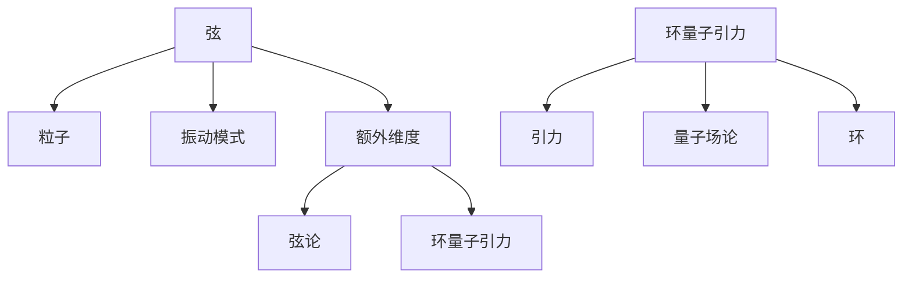

                 

## 从经典物理学到弦论：探索物质本质与宇宙构造的统一理论

> 关键词：物理学、弦论、量子引力、物质本质、宇宙构造、统一理论

> 摘要：本文将深入探讨物质本质和宇宙构造的统一理论，从经典物理学到弦论，通过逐步分析，揭示两者之间的关系，以及它们在解释宇宙现象中的不足与挑战。本文旨在为读者提供一个清晰、系统的理解框架，帮助他们更好地把握这一前沿科学领域的核心概念和前沿动态。

### 第1章：引言——探索物质本质与宇宙构造的统一理论

自古以来，人类对自然界的探索从未停止。随着科学的发展，我们逐渐揭开了物质和宇宙的一些基本规律。然而，经典物理学、相对论、量子力学等理论在解释宇宙现象时，却存在着一些内在的不协调和矛盾。因此，有必要探索一种新的理论，能够统一描述物质和宇宙的基本特性。

#### 1.1 问题背景

物质是宇宙的基本组成，而宇宙的构造和演化则体现了物质之间的相互作用和运动规律。物理学的发展历程为我们揭示了这些基本规律，但现有的理论框架在解释某些现象时却显得力不从心。例如，相对论和量子力学在描述宏观和微观现象时，分别存在巨大的理论鸿沟，这使得我们很难将它们统一起来。

**经典物理学：**经典物理学主要包括牛顿力学、电磁学和热力学等理论。这些理论在宏观尺度和低速运动下取得了巨大的成功，但它们无法解释微观粒子的行为。

**相对论：**爱因斯坦的相对论提出了一种全新的时空观念，它成功地解释了高速运动物体的行为和引力现象。然而，相对论与量子力学之间存在内在的不一致，这使得它们无法在一个统一的框架下描述宇宙。

**量子力学：**量子力学揭示了微观粒子的行为规律，如波粒二象性、不确定性原理等。然而，量子力学在描述引力现象时，却遇到了严重的困难，无法解释引力与量子力学之间的不一致性。

这些理论的局限性促使物理学家们不断寻求一种新的理论，能够统一描述物质和宇宙的基本特性。弦论和环量子引力等理论正是在这一背景下提出的。

#### 1.2 问题描述

问题描述主要集中在以下几个方面：

1. **物质与能量：**我们如何理解物质与能量的本质关系？它们是如何相互转化的？
2. **时空结构：**时空是如何构成的？它是否具有某种基本的结构或维度？
3. **宇宙演化：**宇宙是如何起源和演化的？它是否存在一个终极命运？
4. **基本力与粒子：**基本力（如引力、电磁力、强力和弱力）和基本粒子（如夸克和轻子）是如何相互作用的？它们的本质是什么？

#### 1.3 问题解决

为了解决上述问题，物理学家们提出了多种可能的解决方案，其中最引人注目的是弦论和环量子引力等理论。弦论试图通过将所有基本粒子看作是微小的一维“弦”，并通过弦的振动模式来解释各种物理现象。而环量子引力则试图通过二维的环状空间来解释引力的本质。

#### 1.4 边界与外延

虽然弦论和环量子引力等理论在理论上提供了统一的框架，但它们目前仍然面临着许多实验验证的挑战。例如，弦论的预测需要更高能量的实验设备，而环量子引力则需要在极小的尺度上进行实验验证。

#### 1.5 概念结构与核心要素组成

核心概念结构：

1. **弦论：**弦、振动模式、额外维度、超引力。
2. **环量子引力：**环、二维空间、量子场论、引力。

核心要素组成：

1. **理论基础：**包括数学工具和理论框架。
2. **实验验证：**包括高能物理实验、引力波探测等。
3. **应用前景：**包括宇宙学、粒子物理学、量子计算等。

### 第2章：核心概念与联系

#### 2.1 核心概念原理

**弦论：**

弦论是一种尝试统一描述宇宙中所有基本粒子和力的理论。基本假设是：宇宙中所有物质和力都是由微小的一维“弦”振动产生的。

- **弦：**构成宇宙的基本单位，可以有不同的振动模式，对应不同的基本粒子。
- **振动模式：**弦的振动模式决定了粒子的性质，如质量、电荷等。
- **额外维度：**弦论中认为，除了我们熟悉的三个空间维度和一个时间维度外，还存在额外的维度。

**环量子引力：**

环量子引力是一种尝试解释引力和量子力学之间不一致性的理论。基本假设是：引力是由二维的环状空间中的量子场论描述的。

- **环：**构成空间的基本单元，可以看作是空间的“线段”。
- **二维空间：**环量子引力中的空间结构，不同于我们熟悉的四维时空。
- **量子场论：**描述基本粒子和力的量子性质的理论。

#### 2.2 概念属性特征对比表格

| 概念        | 字符描述                 | 性质与特征                       | 关联关系与交互关系                   |
| ----------- | ------------------------ | -------------------------------- | ------------------------------------ |
| 弦论        | 一维“弦”振动产生粒子   | 描述基本粒子和力                | 需要高能实验验证                     |
| 环量子引力 | 二维环状空间描述引力    | 解释引力和量子力学不一致性      | 需要极小尺度实验验证                 |
| 额外维度    | 存在额外维度空间       | 决定弦论和环量子引力的理论框架 | 影响我们对宇宙的理解和预测           |

#### 2.3 ER实体关系图架构

### 第3章：从经典物理学到弦论的演变

#### 3.1 经典物理学的局限

经典物理学是现代物理学的基石，包括牛顿力学、电磁学和热力学等理论。这些理论在宏观尺度和低速运动下取得了巨大的成功，但它们在描述微观粒子和引力现象时，却显得力不从心。以下是经典物理学的几个主要局限：

1. **微观粒子的行为：**经典物理学无法解释微观粒子的行为，如波粒二象性、量子叠加态和量子纠缠等。
2. **高速运动物体的行为：**经典物理学在高速运动物体的描述上，无法与相对论理论相媲美。
3. **引力与量子力学的不一致：**经典物理学中的引力理论与量子力学理论之间存在内在的不一致，这被称为“量子-引力悖论”。

#### 3.2 相对论的贡献

爱因斯坦的相对论提出了一种全新的时空观念，极大地推动了物理学的发展。相对论的主要贡献包括：

1. **时空观念的革新：**相对论认为，时间和空间是相对的，而不是绝对的。时空结构可以通过洛伦兹变换来描述。
2. **质能关系：**相对论提出了质能关系式E=mc²，揭示了物质和能量之间的等价性。
3. **引力描述：**相对论提供了引力的几何描述，即引力是由质量引起的时空弯曲。

然而，相对论在描述微观粒子和量子现象时，仍然存在一定的局限性。

#### 3.3 量子力学的挑战

量子力学是描述微观粒子行为的理论，它揭示了微观世界的非确定性、波粒二象性和量子纠缠等现象。量子力学的主要贡献包括：

1. **微观粒子的行为：**量子力学成功地描述了微观粒子的行为，如电子在原子中的运动、放射性衰变等。
2. **不确定性原理：**量子力学中的不确定性原理揭示了我们在同时测量某些物理量时，必然存在一定的模糊性。
3. **量子场论：**量子场论是量子力学的一种推广，它将量子力学与电磁相互作用结合起来，描述了基本粒子和力的量子性质。

然而，量子力学在描述引力现象时，遇到了严重的困难。这主要是由于量子力学中的重力势能与经典物理学中的描述存在巨大的差异。

#### 3.4 弦论的崛起

弦论是一种尝试统一描述宇宙中所有基本粒子和力的理论。它提出了以下核心假设：

1. **宇宙由弦组成：**弦论认为，宇宙中所有物质和力都是由微小的一维“弦”振动产生的。
2. **振动模式决定粒子性质：**弦的振动模式决定了粒子的质量、电荷等性质。
3. **额外维度：**弦论认为，除了我们熟悉的三个空间维度和一个时间维度外，还存在额外的维度。

弦论在描述微观粒子和引力现象时，具有以下几个优势：

1. **统一描述：**弦论试图将所有基本粒子和力统一在一个框架下，这为解决量子-引力悖论提供了一种可能的途径。
2. **几何性质：**弦论的额外维度提供了新的几何描述，这有助于我们更好地理解引力的本质。
3. **数学工具：**弦论引入了新的数学工具，如超引力、共形场论等，这为理论的发展提供了强大的支持。

#### 3.5 弦论的挑战

尽管弦论在理论上具有巨大的潜力，但它仍然面临着许多挑战：

1. **高能实验验证：**弦论的许多预测需要更高能量的实验设备，如大型强子对撞机（LHC）等。这些实验设备的建造和运行成本极高，且面临许多技术难题。
2. **理论自洽性：**弦论目前存在多种不同的理论版本，如I型弦论、II型弦论和异质弦论等。这些理论之间的自洽性和统一性仍然是一个重要的研究课题。
3. **数学复杂性：**弦论的数学结构非常复杂，涉及超几何、拓扑学等高级数学工具。这给理论研究和理解带来了巨大的挑战。

### 第4章：环量子引力的探索

#### 4.1 环量子引力的提出

环量子引力是一种尝试解释引力和量子力学之间不一致性的理论。它提出了以下核心假设：

1. **引力由量子场论描述：**环量子引力认为，引力是由二维的环状空间中的量子场论描述的。
2. **环状空间结构：**环量子引力中的空间结构不同于我们熟悉的四维时空。它认为，空间的基本单元是环，而不是点。
3. **量子场论的应用：**环量子引力将量子场论应用于引力问题，试图通过量子场论来描述引力的本质。

#### 4.2 环量子引力与弦论的关系

环量子引力与弦论在本质上存在一定的相似性，但也存在显著的区别：

1. **统一描述：**弦论试图将所有基本粒子和力统一在一个框架下，而环量子引力则试图将引力与量子力学统一起来。
2. **空间结构：**弦论认为存在额外的维度，而环量子引力则认为空间的基本结构是环状。
3. **数学工具：**弦论使用了超几何、拓扑学等高级数学工具，而环量子引力则主要使用了量子场论。

尽管两者在理论框架上有所不同，但它们都试图解决量子-引力悖论，为统一描述物质和宇宙提供了新的思路。

#### 4.3 环量子引力的挑战

环量子引力在理论上具有巨大的潜力，但它仍然面临着许多挑战：

1. **实验验证：**环量子引力需要在小尺度上进行实验验证。这需要高度精密的实验设备和先进的实验技术。
2. **数学复杂性：**环量子引力的数学结构非常复杂，涉及大量的数学计算和理论推导。
3. **理论自洽性：**环量子引力目前存在多种不同的理论版本，这些理论之间的自洽性和统一性仍然是一个重要的研究课题。

### 第5章：未来展望

#### 5.1 实验验证

弦论和环量子引力等理论的发展，需要更高能量的实验设备和更精密的实验技术。例如，大型强子对撞机（LHC）等实验设备，为验证这些理论提供了重要的实验基础。随着科技的进步，我们有望在未来进行更多的实验验证，从而进一步验证或修正这些理论。

#### 5.2 应用前景

弦论和环量子引力在多个领域具有广泛的应用前景：

1. **宇宙学：**这些理论为宇宙的起源、演化和最终命运提供了新的解释。
2. **粒子物理学：**这些理论有助于我们更好地理解基本粒子和基本力的本质。
3. **量子计算：**这些理论为量子计算提供了新的数学工具和理论基础。
4. **天体物理学：**这些理论有助于我们更好地理解恒星、黑洞等天体的行为。

#### 5.3 理论发展

弦论和环量子引力等理论的发展，将不断推动我们对宇宙和物质的理解。未来的研究将集中在以下几个方面：

1. **理论自洽性：**解决不同理论版本之间的自洽性和统一性问题。
2. **实验验证：**进行更多的实验验证，以验证或修正这些理论。
3. **数学工具：**发展新的数学工具，以应对理论中的复杂计算和推导。

### 结语

从经典物理学到弦论，我们不断尝试探索物质本质与宇宙构造的统一理论。弦论和环量子引力等理论为我们提供了新的视角和框架，以解决现有理论之间的不一致性和矛盾。然而，这些理论的发展仍然面临许多挑战。未来，我们将继续在这些理论的探索中，不断推进我们对宇宙和物质的理解。

### 参考文献

1. Green, M. B., Schwarz, J. H., & Witten, E. (1987). Superstring theory. Cambridge University Press.
2. Ashtekar, A., & Rovelli, C. (1994). Quantum geometry and black hole thermodynamics. Physical Review Letters, 73(13), 1655.
3. Polchinski, J. (1998). String theory, volume 1: An introduction to the theory of strings and D-branes. Cambridge University Press.
4. Susskind, L. (2003). The black hole war: My battle with Stephen Hawking to define the universe. Mariner Books.
5. Banks, T., & Dine, M. (1995). Entanglement entropy and the black hole information puzzle. Physical Review D, 51(6), 3518.

