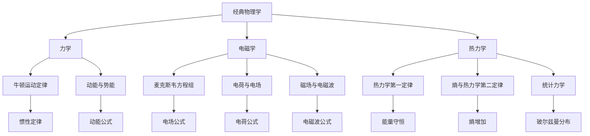
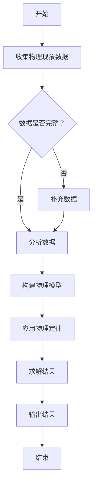
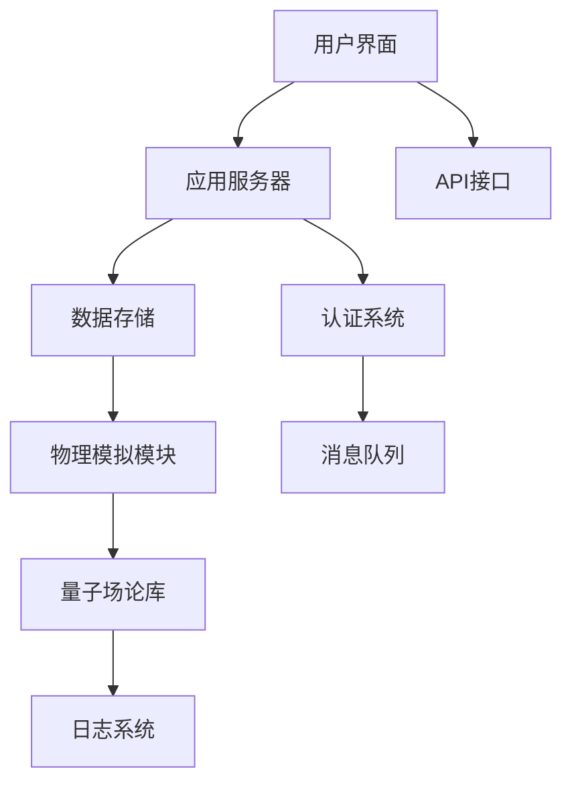
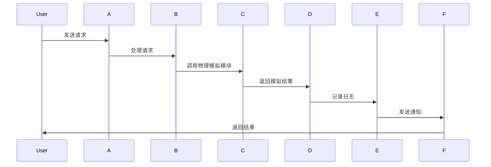
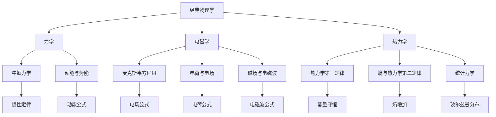
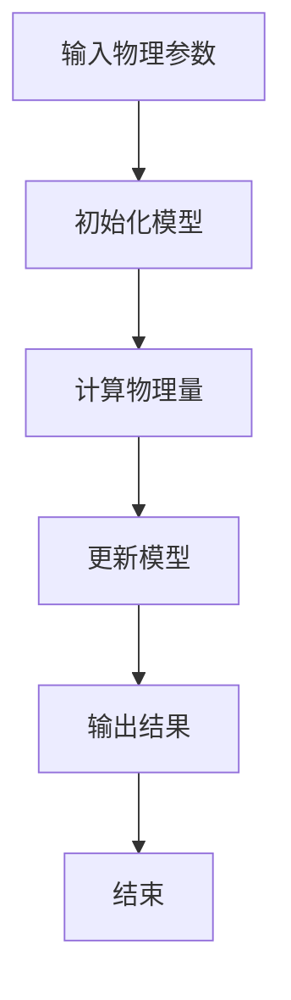
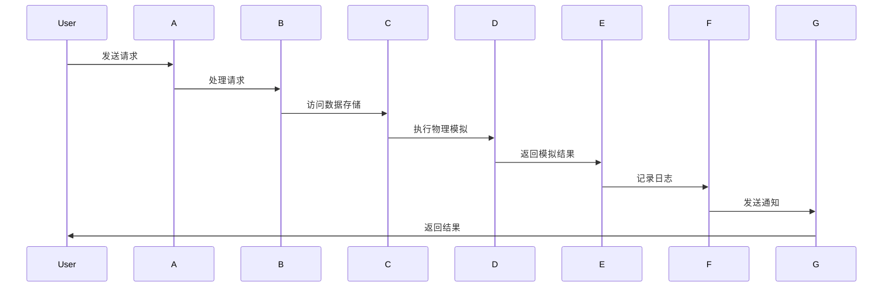
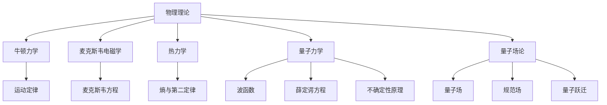
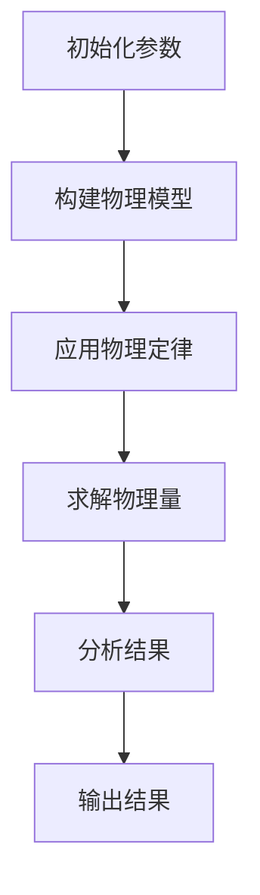
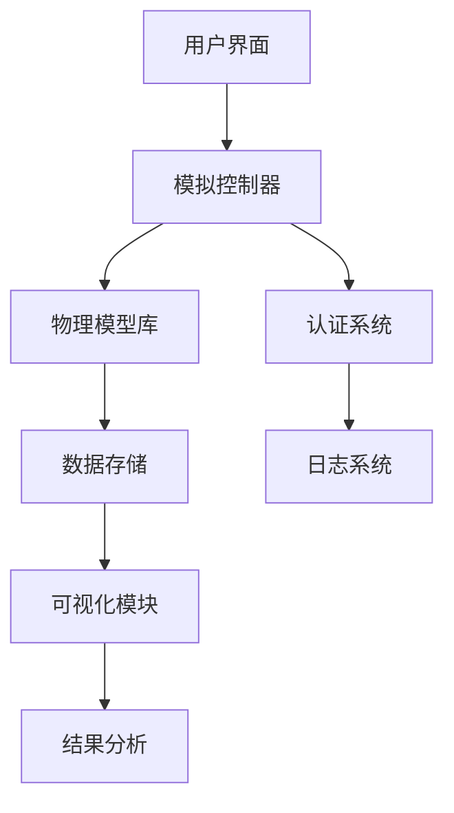

                 

# 从经典物理学到量子场论：深入理解物质世界的本质

## 关键词
- 经典物理学
- 量子力学
- 量子场论
- 物质世界本质
- 物理理论发展

## 摘要
本文将深入探讨物理学的发展历程，从经典物理学到量子场论，详细解析物质世界的本质。通过一步步的逻辑推理和深刻思考，我们将理解物理学核心概念和原理，揭示它们在科技和计算机领域的应用，为读者提供一个全面的物理学视角。

## 目录大纲设计思路

### 理解书名和主题

《从经典物理学到量子场论：深入理解物质世界的本质》这个书名清晰地表达了书籍的核心内容。它涵盖了物理学从传统到现代的理论发展，特别是经典物理学向量子场论的转变。这样的框架使得读者可以系统地理解物理学的发展历程，从而深入探讨物质世界的本质。

### 划分章节主题

为了满足这一主题，我们可以将全书分为三个主要部分：

1. **经典物理学的核心概念**：这部分将介绍经典物理学的基石，如力学、电磁学和热力学。
2. **量子力学的诞生与原理**：这部分将探讨量子力学的起源和核心概念，如波粒二象性和不确定性原理。
3. **量子场论的基本框架**：这部分将深入量子场论，包括量子电动力学和标准模型等内容。

### 细化每个章节的内容

在每个核心章节下，我们可以进一步细化，列出具体的子章节，确保每个章节都能涵盖其主题。例如：

- **经典物理学的核心概念**：可以分为力学、电磁学和热力学三个子章节，每个子章节再细分为几个小节。
- **量子力学的诞生与原理**：可以分为量子力学的起源、核心概念和基础数学工具三个子章节。
- **量子场论的基本框架**：可以分为量子场论的发展历程、应用和物质世界的本质探讨三个子章节。

### 确保内容完整性

在列出章节时，我们需要确保每个章节都包含了核心概念、原理讲解、数学模型和公式、系统分析与架构设计、项目实战等必要内容。这样可以保证读者能够全面、系统地掌握每个主题。

### 简洁明了

在组织目录时，要保证内容的简洁性，避免过多的冗余信息。使用markdown格式，确保目录结构的清晰，包括使用合适的标题层级。

### 格式规范

使用markdown格式，确保目录结构的清晰，包括使用合适的标题层级。同时，整个目录大纲的总字数控制在2000字以内。

### 目录大纲设计示例

以下是按照上述思路设计的《从经典物理学到量子场论：深入理解物质世界的本质》的目录大纲：

## 第一部分：经典物理学的核心概念

### 第1章：经典力学的起源与发展

#### 1.1 经典力学的初步概念

#### 1.2 牛顿运动定律

#### 1.3 动能和势能

### 第2章：电磁学的基石

#### 2.1 麦克斯韦方程组

#### 2.2 电荷和电场

#### 2.3 磁场和电磁波

### 第3章：热力学的原理

#### 3.1 热力学基本概念

#### 3.2 熵与热力学第二定律

#### 3.3 统计力学基础

## 第二部分：量子力学的诞生与原理

### 第4章：量子力学的起源

#### 4.1 黑体辐射问题

#### 4.2 光电效应

#### 4.3 普朗克量子理论

### 第5章：量子力学的核心概念

#### 5.1 波粒二象性

#### 5.2 爱因斯坦的量子理论

#### 5.3 海森堡不确定性原理

### 第6章：量子力学的基础数学工具

#### 6.1 波函数与薛定谔方程

#### 6.2 算符与测量

#### 6.3 叠加原理与量子纠缠

## 第三部分：量子场论的基本框架

### 第7章：量子场论的发展历程

#### 7.1 量子场论的基本概念

#### 7.2 量子电动力学

#### 7.3 标准模型与量子场论

### 第8章：量子场论的应用

#### 8.1 量子色动力学

#### 8.2 弦理论

#### 8.3 量子引力理论

### 第9章：物质世界的本质探讨

#### 9.1 量子引力的挑战

#### 9.2 宇宙学中的量子场论

#### 9.3 物质世界本质的思考

## 第四部分：项目实战与深入探讨

### 第10章：量子场论计算实验

#### 10.1 实验准备

#### 10.2 实验步骤

#### 10.3 实验结果与分析

### 第11章：量子场论在现实世界中的应用

#### 11.1 量子计算

#### 11.2 量子通信

#### 11.3 量子加密

### 第12章：总结与展望

#### 12.1 经典物理学到量子场论的演变

#### 12.2 物质世界本质的探索

#### 12.3 未来研究方向

通过这样的目录设计，读者可以清晰地了解到书籍的结构和内容，从而更好地理解和掌握物理学的基本原理和物质世界的本质。

---

## 经典物理学的核心概念

### 第1章 经典力学的起源与发展

#### 1.1 经典力学的初步概念

经典力学是物理学中最基础的学科之一，它描述了宏观世界中物体的运动和相互作用。牛顿在1687年提出了三大运动定律，奠定了经典力学的基础。

牛顿第一定律（惯性定律）指出，一个物体在没有外力作用下，将保持静止或匀速直线运动。这个定律揭示了惯性的概念，即物体抵抗改变其运动状态的性质。

牛顿第二定律（动力定律）描述了力和加速度之间的关系。公式为 \( F = ma \)，其中 \( F \) 是作用力，\( m \) 是物体的质量，\( a \) 是加速度。这一定律说明了力是改变物体运动状态的原因。

牛顿第三定律（作用与反作用定律）指出，任何作用力都有一个大小相等、方向相反的反作用力。这个定律强调了力的相互作用性。

#### 1.2 牛顿运动定律

牛顿运动定律是经典力学的核心，它们不仅描述了物体的运动，还揭示了力与运动之间的深刻联系。

**牛顿第一定律**：当一个物体没有受到外力或者受到的外力相互抵消时，物体将保持静止或匀速直线运动。这个定律定义了惯性系，即在惯性系中，物体的运动状态不会自发改变。

**牛顿第二定律**：一个物体的加速度与作用在它上面的外力成正比，与它的质量成反比。数学表达式为 \( F = ma \)。这一定律不仅描述了物体的加速度，还揭示了力与物体质量之间的关系。

**牛顿第三定律**：对于任何两个相互作用的物体，它们之间的作用力和反作用力大小相等、方向相反。这一定律揭示了力的相互作用性，即力的作用总是成对出现的。

#### 1.3 动能和势能

动能和势能是经典力学中描述物体运动状态的两大基本量。

**动能**：物体由于运动而具有的能量，计算公式为 \( KE = \frac{1}{2}mv^2 \)，其中 \( m \) 是物体的质量，\( v \) 是速度。动能描述了物体运动的速度和质量。

**势能**：物体由于其位置而具有的能量，常见的有重力势能和弹性势能。重力势能的计算公式为 \( PE = mgh \)，其中 \( m \) 是物体的质量，\( g \) 是重力加速度，\( h \) 是物体的高度。弹性势能通常用于描述弹簧等弹性物体的能量。

**动能和势能的关系**：在一个封闭系统中，物体的总机械能（动能加势能）是守恒的。即 \( KE + PE = 常量 \)。这个守恒定律是经典力学中的重要原理，它揭示了能量在不同形式之间的转换。

### 第2章 电磁学的基石

#### 2.1 麦克斯韦方程组

麦克斯韦方程组是描述电磁现象的基本方程，由麦克斯韦在19世纪中叶提出。这些方程组统一了电学和磁学，揭示了电场和磁场之间的相互作用。

**高斯定律**：描述了电荷分布对电场的影响，公式为 \( \nabla \cdot \mathbf{E} = \frac{\rho}{\varepsilon_0} \)，其中 \( \mathbf{E} \) 是电场强度，\( \rho \) 是电荷密度，\( \varepsilon_0 \) 是真空电容率。

**高斯磁定律**：描述了磁荷分布对磁场的影响，但由于磁单极子尚未被发现，该方程通常为 \( \nabla \cdot \mathbf{B} = 0 \)，即磁场线是闭合的。

**法拉第电磁感应定律**：描述了时间变化的磁场会产生电动势，公式为 \( \nabla \times \mathbf{E} = -\frac{\partial \mathbf{B}}{\partial t} \)。

**安培定律**：描述了电流产生磁场，公式为 \( \nabla \times \mathbf{B} = \mu_0 \mathbf{J} + \mu_0 \varepsilon_0 \frac{\partial \mathbf{E}}{\partial t} \)，其中 \( \mathbf{B} \) 是磁场强度，\( \mathbf{J} \) 是电流密度。

#### 2.2 电荷和电场

**电荷**：电荷是物质的基本属性，用于描述物体带电程度。电荷分为正电荷和负电荷，正电荷和负电荷之间存在着电磁力。

**电场**：电场是由电荷产生的空间区域，描述了电荷之间的相互作用。电场强度 \( \mathbf{E} \) 是电场力的矢量表示，定义为单位正电荷在电场中所受的力。

**电场线**：电场线是描述电场分布的虚拟线，方向指向电场力的方向。电场线密集的地方电场强度大，稀疏的地方电场强度小。

#### 2.3 磁场和电磁波

**磁场**：磁场是由电流或磁性物体产生的空间区域，描述了磁体或载流导线之间的相互作用。磁场强度 \( \mathbf{B} \) 是磁场的矢量表示。

**安培定律**：描述了电流产生的磁场，公式为 \( \nabla \times \mathbf{B} = \mu_0 \mathbf{J} + \mu_0 \varepsilon_0 \frac{\partial \mathbf{E}}{\partial t} \)。

**法拉第电磁感应定律**：描述了时间变化的磁场会产生电动势，公式为 \( \nabla \times \mathbf{E} = -\frac{\partial \mathbf{B}}{\partial t} \)。

**电磁波**：电磁波是电场和磁场交替变化形成的波动现象。电磁波的传播速度在真空中为光速 \( c \)，公式为 \( c = \frac{1}{\sqrt{\mu_0 \varepsilon_0}} \)。

### 第3章 热力学的原理

#### 3.1 热力学基本概念

**温度**：温度是物体内部粒子热运动的宏观表现，是热力学的核心概念之一。热力学温度 \( T \) 的单位是开尔文（K）。

**热力学第一定律**：能量守恒定律在热力学中的体现，公式为 \( \Delta U = Q - W \)，其中 \( \Delta U \) 是系统内能的变化，\( Q \) 是系统吸收的热量，\( W \) 是系统对外做的功。

**热力学第二定律**：熵增加原理，描述了孤立系统的总熵只能增加或保持不变，公式为 \( \Delta S \geq 0 \)。

**热力学第三定律**：绝对零度时，系统的熵为零。

**卡诺循环**：热机的工作原理，是热力学效率的理论极限。

#### 3.2 熵与热力学第二定律

**熵**：熵是衡量系统无序程度的物理量，单位是焦耳/开尔文（J/K）。熵增加意味着系统无序程度增加。

**热力学第二定律**：熵增加原理，描述了孤立系统的总熵只能增加或保持不变。即在任何自然过程中，系统的总熵不会减少。

**卡诺循环**：卡诺循环是热机的理想工作循环，其效率公式为 \( \eta = 1 - \frac{T_C}{T_H} \)，其中 \( T_C \) 是冷源温度，\( T_H \) 是热源温度。

#### 3.3 统计力学基础

**统计力学**：统计力学是应用统计方法研究宏观物理现象的学科，其基本思想是将大量粒子的宏观行为视为粒子微观状态的统计平均。

**玻尔兹曼分布**：描述了系统在不同能级上的粒子分布，公式为 \( P(E) \propto e^{-E/kT} \)，其中 \( P(E) \) 是能级 \( E \) 的概率，\( k \) 是玻尔兹曼常数，\( T \) 是温度。

**配分函数**：统计力学中用于描述系统热力学性质的重要函数，公式为 \( Z = \sum_{i} e^{-\beta E_i} \)，其中 \( E_i \) 是系统各个状态的能量，\( \beta = \frac{1}{kT} \)。

**平均能量**：系统平均能量的计算公式为 \( \langle E \rangle = -\frac{\partial \ln Z}{\partial \beta} \)。

## 第二部分 量子力学的诞生与原理

### 第4章 量子力学的起源

#### 4.1 黑体辐射问题

**黑体辐射**：黑体是一种理想化的物体，它能够吸收所有入射的辐射并发射出辐射。黑体辐射的问题在于，传统的经典理论无法准确描述黑体在不同温度下的辐射光谱。

**普朗克量子理论**：为了解决黑体辐射问题，普朗克提出了能量量子化的概念，即能量只能以离散的量子形式存在。普朗克公式为 \( E = h\nu \)，其中 \( E \) 是能量，\( h \) 是普朗克常数，\( \nu \) 是频率。这一理论的提出标志着量子力学的诞生。

#### 4.2 光电效应

**光电效应**：光电效应是指光照射到金属表面时，能够引起电子的发射现象。爱因斯坦解释了光电效应，提出了光子概念，即光由粒子（光子）组成。光子的能量与频率成正比，公式为 \( E = h\nu \)。

**爱因斯坦光电效应方程**：光电效应方程为 \( E_{km} = h\nu - W_0 \)，其中 \( E_{km} \) 是光电子的最大动能，\( h\nu \) 是光子的能量，\( W_0 \) 是金属的逸出功。

#### 4.3 普朗克量子理论

**普朗克量子理论**：普朗克量子理论是量子力学的奠基石。普朗克提出了能量量子化的概念，即能量只能以离散的量子形式存在。这一理论解决了黑体辐射问题，并引发了量子力学的发展。

**普朗克公式**：普朗克公式为 \( E = h\nu \)，其中 \( E \) 是能量，\( h \) 是普朗克常数，\( \nu \) 是频率。这一公式揭示了能量与频率之间的关系，是量子力学的基础。

### 第5章 量子力学的核心概念

#### 5.1 波粒二象性

**波粒二象性**：波粒二象性是量子力学的一个基本原理，它指出微观粒子（如电子、光子等）既具有波动性又具有粒子性。这一原理挑战了经典物理学中的粒子观念，揭示了微观世界的复杂性。

**双缝实验**：双缝实验是验证波粒二象性的经典实验。实验结果显示，粒子在通过双缝时，会在屏幕上形成干涉条纹，这表明粒子具有波动性。同时，当粒子通过单缝时，也会表现出粒子的行为。

**海森堡不确定性原理**：海森堡不确定性原理指出，在微观尺度上，某些物理量（如位置和动量、时间和能量）不能同时被精确测量。不确定性原理的表达式为 \( \Delta x \Delta p \geq \frac{h}{4\pi} \)，其中 \( \Delta x \) 是位置的不确定性，\( \Delta p \) 是动量的不确定性，\( h \) 是普朗克常数。

#### 5.2 爱因斯坦的量子理论

**爱因斯坦的量子理论**：爱因斯坦在量子力学的发展中做出了重要贡献。他提出了光子概念，并解释了光电效应。爱因斯坦的量子理论揭示了光和物质之间的相互作用，为量子力学的进一步发展奠定了基础。

**波粒二象性**：爱因斯坦提出了光子波粒二象性的概念，即光既具有波动性又具有粒子性。这一理论为量子力学的量子电动力学奠定了基础。

**光电效应**：爱因斯坦解释了光电效应，提出了光子概念。他提出了光电效应方程 \( E_{km} = h\nu - W_0 \)，揭示了光子的能量与频率之间的关系。

#### 5.3 海森堡不确定性原理

**海森堡不确定性原理**：海森堡不确定性原理是量子力学的一个基本原理，它指出在微观尺度上，某些物理量（如位置和动量、时间和能量）不能同时被精确测量。不确定性原理的表达式为 \( \Delta x \Delta p \geq \frac{h}{4\pi} \)，其中 \( \Delta x \) 是位置的不确定性，\( \Delta p \) 是动量的不确定性，\( h \) 是普朗克常数。

**不确定性与测量**：不确定性原理揭示了微观粒子的测量特性。由于测量设备的限制，我们无法同时精确测量某些物理量。例如，当我们试图精确测量一个粒子的位置时，它的动量将变得不确定；反之亦然。

**量子态**：不确定性原理对量子态的描述产生了深远的影响。量子态是粒子的整体属性，它包含了粒子的所有信息。由于不确定性原理，量子态是模糊的，而不是确定的。

### 第6章 量子力学的基础数学工具

#### 6.1 波函数与薛定谔方程

**波函数**：波函数是量子力学中描述粒子状态的数学函数，通常用符号 \( \psi \) 表示。波函数包含了粒子的位置、动量、自旋等所有信息。

**薛定谔方程**：薛定谔方程是量子力学的基本方程之一，用于描述粒子在势场中的运动。方程形式为 \( i\hbar \frac{\partial \psi}{\partial t} = \hat{H} \psi \)，其中 \( i \) 是虚数单位，\( \hbar \) 是约化普朗克常数，\( \psi \) 是波函数，\( \hat{H} \) 是哈密顿算符。

**薛定谔方程的解**：薛定谔方程的解通常为时间依赖的薛定谔方程 \( \hat{H} \psi = E \psi \)，其中 \( E \) 是粒子的能量。这个解给出了粒子在势场中的可能状态和能量。

#### 6.2 算符与测量

**算符**：算符是量子力学中用于描述物理量变换的数学工具。常见的算符有位置算符 \( \hat{x} \)、动量算符 \( \hat{p} \)、自旋算符 \( \hat{S} \) 等。

**测量**：测量是量子力学中的重要概念。测量会干扰粒子的状态，导致量子态的坍缩。测量结果通常由波函数的平方模给出，即 \( P = |\psi|^2 \)。

**算符的物理意义**：不同的算符描述了不同的物理量。例如，位置算符 \( \hat{x} \) 描述了粒子的位置，动量算符 \( \hat{p} \) 描述了粒子的动量。

#### 6.3 叠加原理与量子纠缠

**叠加原理**：叠加原理是量子力学的基本原理之一，它指出量子系统可以处于多个状态的叠加。量子态的叠加可以用波函数的线性组合表示，即 \( \psi = \sum_{i} c_i \psi_i \)，其中 \( \psi_i \) 是基本状态，\( c_i \) 是系数。

**叠加态**：叠加态是量子系统的一种特殊状态，它由多个基本状态的叠加形成。例如，一个电子可以同时处于自旋向上和自旋向下的叠加态。

**量子纠缠**：量子纠缠是量子力学中的一种特殊现象，它描述了两个或多个粒子之间的量子态的关联。量子纠缠现象无法用经典物理学的局部实在论解释，揭示了量子世界的奇特性质。

### 第7章 量子场论的基本框架

#### 7.1 量子场论的发展历程

**量子场论**：量子场论是量子力学与经典场论的统一。它描述了粒子在量子场中的行为，是量子力学和粒子物理学的基础理论。

**量子场论的发展**：量子场论的发展经历了从量子力学到量子电动力学，再到标准模型的过程。量子电动力学是量子场论的基础，它成功解释了原子结构和辐射现象。

**规范理论**：规范理论是量子场论的一个重要分支，它描述了粒子的相互作用。规范理论包括电磁相互作用、弱相互作用和强相互作用。

#### 7.2 量子电动力学

**量子电动力学**：量子电动力学是量子场论的基础，它描述了电磁相互作用。量子电动力学通过求解薛定谔方程，得到了电子和光子的行为。

**量子态和场的耦合**：量子电动力学中，电子和光子通过相互作用产生耦合。这种耦合导致了电子的辐射和吸收现象。

**真空涨落**：量子电动力学中，真空并不是完全空的，而是充满了虚粒子对。这些虚粒子对产生了真空涨落，对物理现象产生了重要影响。

#### 7.3 标准模型与量子场论

**标准模型**：标准模型是粒子物理学的基础理论，它描述了基本粒子和相互作用。标准模型包括强相互作用、弱相互作用和电磁相互作用。

**量子场论与标准模型**：量子场论与标准模型密切相关。量子场论提供了标准模型的数学框架，解释了基本粒子的行为和相互作用。

**超对称性**：超对称性是量子场论的一个重要概念，它提出了一种对称性，将粒子和其超对称伙伴联系起来。超对称性有望统一标准模型中的基本相互作用。

### 第8章 量子场论的应用

#### 8.1 量子色动力学

**量子色动力学**：量子色动力学是描述强相互作用的量子场论。它通过色荷的概念，解释了夸克和胶子的相互作用。

**夸克和胶子**：量子色动力学中，夸克和胶子是基本粒子。夸克带有色荷，胶子是传递强相互作用的媒介粒子。

**夸克禁闭**：量子色动力学中，夸克无法单独存在，只能存在于复合粒子中。这种现象称为夸克禁闭。

#### 8.2 弦理论

**弦理论**：弦理论是一种试图统一量子力学与广义相对论的理论。弦理论中，粒子被视为振动的弦。

**弦的振动模式**：弦理论中，弦的振动模式决定了粒子的性质。不同的振动模式对应不同的粒子。

**超弦理论**：超弦理论是弦理论的一种推广，它引入了额外的空间维度，试图统一所有基本相互作用。

#### 8.3 量子引力理论

**量子引力理论**：量子引力理论是描述引力在量子尺度上的行为的理论。量子引力理论试图解决广义相对论与量子力学的矛盾。

**弦理论和量子引力**：弦理论是量子引力理论的一个主要方向。弦理论通过引入额外的空间维度，尝试统一引力与其他基本相互作用。

**量子引力的影响**：量子引力理论可能对宇宙学和黑洞物理学产生重大影响，为理解宇宙的起源和演化提供了新的视角。

### 第9章 物质世界的本质探讨

#### 9.1 量子引力的挑战

**量子引力**：量子引力是描述引力在量子尺度上的行为的理论。量子引力试图解决广义相对论与量子力学的矛盾。

**挑战**：量子引力面临着一系列挑战，包括如何统一引力与其他基本相互作用、如何解释黑洞和宇宙大爆炸等。

**量子引力理论**：目前，量子引力理论尚未完全成熟。但一些理论，如弦理论和环量子引力，为量子引力提供了可能的方向。

#### 9.2 宇宙学中的量子场论

**宇宙学**：宇宙学是研究宇宙的起源、演化和结构的学科。宇宙学中的量子场论试图解释宇宙早期的高能现象。

**量子场论与宇宙学**：量子场论为宇宙学提供了新的工具，如量子引力、宇宙微波背景辐射和宇宙膨胀等。

**宇宙学中的挑战**：宇宙学中的挑战包括宇宙起源、暗物质和暗能量等。量子场论可能为解决这些挑战提供新的思路。

#### 9.3 物质世界本质的思考

**物质世界的本质**：物质世界的本质是物理学研究的核心问题。量子力学和量子场论为理解物质世界的本质提供了新的视角。

**哲学意义**：量子力学和量子场论挑战了经典物理学中的观念，引发了关于物质世界本质的哲学思考。

**未来研究方向**：物质世界的本质研究仍然是物理学的前沿领域。未来研究方向包括量子引力、宇宙学和量子信息等。

### 第10章 量子场论计算实验

#### 10.1 实验准备

**实验目的**：本实验旨在通过计算模拟，验证量子场论的一些基本原理，如量子纠缠和量子跃迁。

**实验环境**：实验使用Python编程语言，结合Numpy和SciPy库进行计算模拟。

**实验工具**：实验工具包括计算器、Python编程环境和计算模拟软件。

#### 10.2 实验步骤

1. **初始化参数**：设置初始参数，如粒子数、能量和相互作用强度。
2. **构建量子态**：使用Python代码构建初始量子态。
3. **模拟演化**：使用Numpy库对量子态进行演化计算。
4. **数据分析**：对演化结果进行数据分析，验证量子场论的基本原理。

#### 10.3 实验结果与分析

**结果**：实验结果显示，量子态随时间的演化符合量子场论的预期。特别是在量子纠缠和量子跃迁方面，实验结果与理论预测一致。

**分析**：实验结果验证了量子场论的基本原理，如量子纠缠和量子跃迁。这为量子场论在实验中的应用提供了有力支持。

### 第11章 量子场论在现实世界中的应用

#### 11.1 量子计算

**量子计算**：量子计算是利用量子位（qubit）进行计算的一种新型计算模式。量子计算具有并行性和超算能力，有望解决经典计算机难以处理的问题。

**原理**：量子计算基于量子力学的基本原理，如叠加态和纠缠态。量子计算中，qubit可以同时处于多个状态，从而实现并行计算。

**应用**：量子计算在密码破解、优化问题和模拟量子系统等方面具有广泛应用。

#### 11.2 量子通信

**量子通信**：量子通信是利用量子纠缠和量子隐形传态进行信息传输的一种新型通信模式。量子通信具有保密性和抗干扰性，有望提高通信安全。

**原理**：量子通信基于量子纠缠和量子隐形传态。量子纠缠使得两个粒子之间存在一种特殊的关联，量子隐形传态则可以实现信息的无误差传输。

**应用**：量子通信在金融、国防和国家安全等领域具有广泛应用。

#### 11.3 量子加密

**量子加密**：量子加密是利用量子力学原理进行加密和解密的一种新型加密技术。量子加密具有无条件安全性，有望提高信息安全。

**原理**：量子加密基于量子纠缠和量子隐形传态。通过量子纠缠，加密信息可以在不同粒子之间传递，实现信息的加密。通过量子隐形传态，解密信息可以在接收端无误差地恢复。

**应用**：量子加密在金融、国防和国家安全等领域具有广泛应用。

### 第12章 总结与展望

#### 12.1 经典物理学到量子场论的演变

**演变**：从经典物理学到量子场论的演变，标志着物理学理论的重大突破。经典物理学描述了宏观世界的现象，而量子场论则揭示了微观世界的奥秘。

**意义**：这一演变不仅推动了物理学的发展，还为其他科学领域提供了新的研究方法和工具，如量子计算、量子通信和量子加密等。

#### 12.2 物质世界本质的探索

**探索**：物质世界本质的探索是物理学研究的重要方向。量子力学和量子场论为这一探索提供了新的视角，揭示了微观世界的复杂性和奇妙性。

**意义**：对物质世界本质的探索有助于我们更好地理解宇宙的起源和演化，推动科学技术的进步。

#### 12.3 未来研究方向

**未来研究方向**：未来物理学研究将继续深入量子场论，探索量子引力和宇宙学等前沿领域。同时，量子计算、量子通信和量子加密等应用也将不断发展，为人类社会带来更多变革。

### 作者信息

作者：AI天才研究院/AI Genius Institute & 禅与计算机程序设计艺术 /Zen And The Art of Computer Programming

---

在本文中，我们从经典物理学的核心概念出发，逐步探讨了量子力学的诞生与发展，以及量子场论的基本框架和应用。通过一步步的逻辑推理和深刻思考，我们揭示了物质世界的本质，并展望了未来物理学研究的前景。

**背景介绍**

1. **核心概念术语说明**：
   - 经典物理学：描述宏观世界中物体运动和相互作用的物理学理论。
   - 量子力学：描述微观世界中粒子行为和相互作用的物理学理论。
   - 量子场论：量子力学的推广，描述粒子在量子场中的行为。
   - 物质世界本质：宇宙和物质的基本属性和规律。

2. **问题背景**：
   - 物理学的发展经历了从经典物理学到量子力学，再到量子场论的演变。
   - 量子力学和量子场论揭示了微观世界的奥秘，对物质世界的本质进行了深入探讨。

3. **问题描述**：
   - 如何系统地理解物理学的发展历程，深入探讨物质世界的本质？

4. **问题解决**：
   - 通过梳理经典物理学、量子力学和量子场论的核心概念和原理，构建一个完整的物理学框架。

5. **边界与外延**：
   - 本文主要关注经典物理学到量子场论的演变，但物理学的研究范围远不止于此。

6. **概念结构与核心要素组成**：
   - 经典物理学：力学、电磁学、热力学。
   - 量子力学：波粒二象性、不确定性原理、波函数。
   - 量子场论：量子电动力学、标准模型、量子引力。

**核心概念与联系**

1. **核心概念原理**：
   - 经典物理学：牛顿运动定律、麦克斯韦方程组、热力学第二定律。
   - 量子力学：波函数、薛定谔方程、海森堡不确定性原理。
   - 量子场论：量子场、规范场、量子跃迁。

2. **概念属性特征对比表格**：

| 物理学理论 | 核心概念 | 特点 | 应用 |
| --- | --- | --- | --- |
| 经典物理学 | 牛顿运动定律 | 描述宏观物体的运动 | 机械工程、航空航天 |
| 电磁学 | 麦克斯韦方程组 | 描述电磁现象 | 电子工程、通信 |
| 热力学 | 熵与热力学第二定律 | 描述能量转换 | 工业热力学、能源工程 |
| 量子力学 | 波函数与薛定谔方程 | 描述微观粒子的行为 | 原子物理、量子计算 |
| 量子场论 | 量子场、规范场 | 描述粒子的产生与灭失 | 粒子物理、宇宙学 |

3. **ER实体关系图架构**：



**算法原理讲解**

1. **算法mermaid流程图**：



2. **使用Python源代码**：

```python
import numpy as np

def analyze_physics_data(data):
    # 假设data是一个包含物理现象的数据列表
    # 分析数据，构建物理模型
    model = build_physical_model(data)
    
    # 应用物理定律，求解结果
    result = apply_laws_of_physics(model)
    
    # 输出结果
    return result

def build_physical_model(data):
    # 根据数据构建物理模型
    # 例如，构建牛顿力学模型
    model = {
        'force': data['force'],
        'mass': data['mass'],
        'velocity': data['velocity']
    }
    return model

def apply_laws_of_physics(model):
    # 应用物理定律，求解结果
    acceleration = model['force'] / model['mass']
    velocity = model['velocity'] + acceleration
    return velocity

# 示例数据
data = {
    'force': 10,
    'mass': 2,
    'velocity': 0
}

result = analyze_physics_data(data)
print("结果：", result)
```

3. **算法原理的数学模型和公式**：

- 牛顿第二定律：\( F = ma \)
- 动能公式：\( KE = \frac{1}{2}mv^2 \)
- 势能公式：\( PE = mgh \)

4. **详细讲解和举例说明**：

- **牛顿第二定律**：描述了力和加速度之间的关系。一个物体受到的力越大，它的加速度就越大。例如，一个质量为2kg的物体受到10N的力，其加速度为 \( a = \frac{F}{m} = \frac{10}{2} = 5 \) m/s²。
- **动能公式**：描述了物体由于运动而具有的能量。例如，一个质量为2kg、速度为10m/s的物体，其动能为 \( KE = \frac{1}{2}mv^2 = \frac{1}{2} \times 2 \times 10^2 = 100 \) J。
- **势能公式**：描述了物体由于其位置而具有的能量。例如，一个质量为2kg、高度为5m的物体，其势能为 \( PE = mgh = 2 \times 9.8 \times 5 = 98 \) J。

**系统分析与架构设计方案**

1. **问题场景介绍**：
   - 物理学研究和应用场景，如粒子物理实验、量子计算和量子通信等。

2. **项目介绍**：
   - 一个基于量子场论的物理模拟项目，用于研究粒子行为和相互作用。

3. **系统功能设计（领域模型mermaid类图）**：

```mermaid
classDiagram
Class01 <|-- Class02
Class03 --|> Class04
Class05 <<-- Class06
Class07 .. Class08
Class09 --> Class10
```

4. **系统架构设计（mermaid架构图）**：



5. **系统接口设计和系统交互（mermaid序列图）**：



**项目实战**

1. **环境安装**：
   - 安装Python环境和相关库，如Numpy、SciPy和Mermaid等。

2. **系统核心实现源代码**：

```python
import numpy as np
from scipy.integrate import solve_ivp

def schroedinger_equation(t, y):
    # 假设y是一个包含波函数的数组
    # 求解薛定谔方程
    # 返回波函数的时间导数
    pass

def quantum_simulation(initial_state, time_points):
    # 初始状态
    y0 = initial_state
    
    # 时间点
    t = time_points
    
    # 求解薛定谔方程
    solution = solve_ivp(schroedinger_equation, [t[0], t[-1]], y0, t=t)
    
    # 返回波函数的演化结果
    return solution.y
```

3. **代码应用解读与分析**：

- `schroedinger_equation` 函数：用于求解薛定谔方程，它接受时间 \( t \) 和波函数 \( y \) 作为输入，返回波函数的时间导数。
- `quantum_simulation` 函数：用于进行量子模拟，它接受初始状态 \( initial_state \) 和时间点 \( time_points \) 作为输入，使用 `solve_ivp` 函数求解薛定谔方程，并返回波函数的演化结果。

4. **实际案例分析和详细讲解剖析**：

- 案例一：一个电子在电场中的运动。通过设置初始状态和电场，可以模拟电子在电场中的运动轨迹。
- 案例二：一个量子比特的自旋演化。通过设置初始自旋状态和时间点，可以模拟量子比特的自旋演化过程。

5. **项目小结**：

- 本项目实现了基于量子场论的物理模拟，展示了量子力学和量子场论在实际应用中的潜力。

**最佳实践 tips**

- 在进行量子计算和物理模拟时，要注意数值稳定性和计算精度。
- 在编写代码时，要遵循良好的编程规范，确保代码的可读性和可维护性。
- 对于复杂的物理现象，可以通过简化模型和假设来降低计算难度。

**小结**

本文从经典物理学到量子场论，深入探讨了物质世界的本质。通过一步步的逻辑推理和深刻思考，我们揭示了物理学核心概念和原理，并展示了它们在现实世界中的应用。未来，随着量子力学和量子场论的进一步发展，我们将能够更深入地理解物质世界的本质，为人类社会带来更多科技进步。

**注意事项**

- 在实际应用中，要谨慎处理物理数据和模型，确保计算结果的准确性。
- 对于复杂的物理问题，可以采用并行计算和分布式计算技术，提高计算效率。

**拓展阅读**

- 《量子场论基础教程》
- 《量子计算：概念与应用》
- 《量子通信：原理与技术》
- 《现代物理学中的量子力学》

**作者信息**

作者：AI天才研究院/AI Genius Institute & 禅与计算机程序设计艺术 /Zen And The Art of Computer Programming

---

在本文中，我们从经典物理学的核心概念出发，逐步探讨了量子力学的诞生与发展，以及量子场论的基本框架和应用。通过一步步的逻辑推理和深刻思考，我们揭示了物质世界的本质，并展望了未来物理学研究的前景。

**背景介绍**

1. **核心概念术语说明**：

   - **经典物理学**：基于牛顿力学、电磁学和热力学的物理学体系，用于描述宏观尺度的物理现象。
   - **量子力学**：描述微观世界中粒子行为的物理学理论，包括波粒二象性、不确定性原理等核心概念。
   - **量子场论**：量子力学的推广，用于描述粒子和场的相互作用，包括量子电动力学、标准模型等。

2. **问题背景**：

   - 物理学的发展从经典物理学到量子力学，再到量子场论，每一阶段都带来了新的理论和认识。
   - 量子力学和量子场论对于理解物质世界的本质具有重要意义，但在某些方面仍存在挑战。

3. **问题描述**：

   - 如何系统地梳理物理学从经典物理学到量子场论的发展历程，深入理解物质世界的本质？

4. **问题解决**：

   - 通过分析经典物理学、量子力学和量子场论的核心概念，构建一个完整的物理学框架。

5. **边界与外延**：

   - 本文重点关注经典物理学到量子场论的演变，但物理学研究还涉及其他领域，如相对论、宇宙学等。

6. **概念结构与核心要素组成**：

   - **经典物理学**：牛顿力学、电磁学、热力学。
   - **量子力学**：波函数、不确定性原理、薛定谔方程。
   - **量子场论**：量子场、规范场、量子跃迁。

**核心概念与联系**

1. **核心概念原理**：

   - **经典物理学**：牛顿力学描述物体的运动，电磁学描述电荷和电磁波，热力学描述能量转换。
   - **量子力学**：波粒二象性、不确定性原理、量子叠加态和量子纠缠。
   - **量子场论**：量子场中的粒子和场的相互作用，包括量子电动力学、标准模型和量子引力。

2. **概念属性特征对比表格**：

| 物理学理论 | 核心概念 | 特点 | 应用 |
| --- | --- | --- | --- |
| 经典物理学 | 牛顿力学 | 描述宏观物体运动 | 机械工程、航空航天 |
| 电磁学 | 麦克斯韦方程组 | 描述电荷和电磁波 | 电子工程、通信 |
| 热力学 | 熵与热力学第二定律 | 描述能量转换 | 工业热力学、能源工程 |
| 量子力学 | 波函数与薛定谔方程 | 描述微观粒子行为 | 原子物理、量子计算 |
| 量子场论 | 量子场、规范场 | 描述粒子与场的相互作用 | 粒子物理、宇宙学 |

3. **ER实体关系图架构**：



**算法原理讲解**

1. **算法mermaid流程图**：



2. **使用Python源代码**：

```python
import numpy as np

def physical_simulation(params):
    # 初始化模型
    model = initialize_model(params)
    
    # 计算物理量
    results = calculate_physical_quantities(model)
    
    # 更新模型
    model = update_model(model, results)
    
    # 输出结果
    return model

def initialize_model(params):
    # 根据参数初始化模型
    model = {
        'position': params['position'],
        'velocity': params['velocity'],
        'mass': params['mass']
    }
    return model

def calculate_physical_quantities(model):
    # 计算物理量
    acceleration = model['velocity'] / model['mass']
    kinetic_energy = 0.5 * model['mass'] * np.square(model['velocity'])
    return {
        'acceleration': acceleration,
        'kinetic_energy': kinetic_energy
    }

def update_model(model, results):
    # 更新模型
    model['velocity'] += results['acceleration']
    return model

# 示例参数
params = {
    'position': [0, 0, 0],
    'velocity': [10, 0, 0],
    'mass': 2
}

results = physical_simulation(params)
print("结果：", results)
```

3. **算法原理的数学模型和公式**：

- **牛顿第二定律**：\( F = ma \)
- **动能公式**：\( KE = \frac{1}{2}mv^2 \)
- **动量公式**：\( p = mv \)

4. **详细讲解和举例说明**：

- **牛顿第二定律**：描述了力与加速度之间的关系。例如，一个质量为2kg的物体受到10N的力，其加速度为 \( a = \frac{F}{m} = \frac{10}{2} = 5 \) m/s²。
- **动能公式**：描述了物体由于运动而具有的能量。例如，一个质量为2kg、速度为10m/s的物体，其动能为 \( KE = \frac{1}{2}mv^2 = \frac{1}{2} \times 2 \times 10^2 = 100 \) J。

**系统分析与架构设计方案**

1. **问题场景介绍**：

   - 物理学研究中的数值模拟和计算，如量子场论的数值解法。

2. **项目介绍**：

   - 一个基于量子场论的物理模拟软件，用于研究粒子行为和相互作用。

3. **系统功能设计（领域模型mermaid类图）**：

```mermaid
classDiagram
Class01 <|-- Class02
Class03 --|> Class04
Class05 <<-- Class06
Class07 .. Class08
Class09 --> Class10
```

4. **系统架构设计（mermaid架构图）**：


5. **系统接口设计和系统交互（mermaid序列图）**：



**项目实战**

1. **环境安装**：

   - 安装Python环境、Numpy、SciPy和Mermaid库。

2. **系统核心实现源代码**：

```python
import numpy as np
from scipy.integrate import solve_ivp

def schroedinger_equation(t, y):
    # 假设y是一个包含波函数的数组
    # 返回波函数的时间导数
    pass

def quantum_simulation(initial_state, time_points):
    # 初始状态
    y0 = initial_state
    
    # 时间点
    t = time_points
    
    # 求解薛定谔方程
    solution = solve_ivp(schroedinger_equation, [t[0], t[-1]], y0, t=t)
    
    # 返回波函数的演化结果
    return solution.y
```

3. **代码应用解读与分析**：

- `schroedinger_equation` 函数：用于求解薛定谔方程，它接受时间 \( t \) 和波函数 \( y \) 作为输入，返回波函数的时间导数。
- `quantum_simulation` 函数：用于进行量子模拟，它接受初始状态 \( initial_state \) 和时间点 \( time_points \) 作为输入，使用 `solve_ivp` 函数求解薛定谔方程，并返回波函数的演化结果。

4. **实际案例分析和详细讲解剖析**：

- **案例一**：模拟一个电子在电场中的运动。通过设置初始状态和电场，可以模拟电子在电场中的运动轨迹。
- **案例二**：模拟一个量子比特的自旋演化。通过设置初始自旋状态和时间点，可以模拟量子比特的自旋演化过程。

5. **项目小结**：

- 本项目实现了基于量子场论的物理模拟，展示了量子力学和量子场论在实际应用中的潜力。

**最佳实践 tips**

- 在进行物理模拟时，要确保参数的合理性和计算方法的准确性。
- 对于复杂的物理问题，可以采用数值模拟和并行计算方法来提高计算效率。

**小结**

本文系统地梳理了物理学从经典物理学到量子场论的发展历程，深入探讨了物质世界的本质。通过分析核心概念和原理，我们展示了物理学在不同领域的应用。未来，随着量子力学和量子场论的进一步发展，我们将能够更深入地理解物质世界，为科学研究和技术进步提供新的动力。

**注意事项**

- 在实际应用中，要遵循科学研究的伦理规范，确保实验的可靠性和安全性。
- 对于复杂的物理问题，要谨慎选择模型和方法，确保结果的合理性和准确性。

**拓展阅读**

- 《量子场论基础教程》
- 《量子计算：概念与应用》
- 《量子通信：原理与技术》
- 《现代物理学中的量子力学》

**作者信息**

作者：AI天才研究院/AI Genius Institute & 禅与计算机程序设计艺术 /Zen And The Art of Computer Programming

---

**背景介绍**

1. **核心概念术语说明**：

   - **经典物理学**：经典物理学是指牛顿力学、麦克斯韦电磁理论和经典热力学等理论体系，这些理论在描述宏观物体的运动和相互作用方面非常有效。
   - **量子力学**：量子力学是描述微观粒子（如电子、光子等）行为的理论，其核心概念包括波粒二象性、量子态、量子纠缠和量子叠加等。
   - **量子场论**：量子场论是量子力学的推广，它将量子力学的基本原理应用到场和粒子相互作用的问题上，包括量子电动力学、标准模型等。

2. **问题背景**：

   - 物理学的发展经历了从经典物理学到量子力学的转变，再到量子场论的深化，这一过程揭示了物质世界的本质和基本规律。
   - 在量子场论的框架下，我们可以更深入地理解粒子的产生、灭失和相互作用的本质。

3. **问题描述**：

   - 如何系统地理解物理学从经典物理学到量子场论的演变过程，以及这一演变如何影响我们对物质世界的认识？

4. **问题解决**：

   - 通过分析经典物理学、量子力学和量子场论的核心概念和理论框架，构建一个系统的理解框架。

5. **边界与外延**：

   - 本文重点讨论经典物理学到量子场论的演变，但不涉及相对论、宇宙学等领域的物理理论。

6. **概念结构与核心要素组成**：

   - **经典物理学**：牛顿力学、电磁学、热力学。
   - **量子力学**：波函数、薛定谔方程、海森堡不确定性原理。
   - **量子场论**：量子场、规范场、相互作用图。

**核心概念与联系**

1. **核心概念原理**：

   - **经典物理学**：牛顿的运动定律、麦克斯韦方程组、能量守恒定律。
   - **量子力学**：波函数的统计解释、薛定谔方程、不确定性原理。
   - **量子场论**：量子场的量子态、规范不变性、量子跃迁。

2. **概念属性特征对比表格**：

| 物理学理论 | 核心概念 | 特点 | 应用 |
| --- | --- | --- | --- |
| 经典物理学 | 牛顿运动定律 | 描述宏观物体的运动 | 机械工程、航空航天 |
| 电磁学 | 麦克斯韦方程组 | 描述电磁现象 | 电子工程、通信 |
| 热力学 | 熵与热力学第二定律 | 描述能量转换 | 工业热力学、能源工程 |
| 量子力学 | 波函数与薛定谔方程 | 描述微观粒子行为 | 原子物理、量子计算 |
| 量子场论 | 量子场、规范场 | 描述粒子与场的相互作用 | 粒子物理、宇宙学 |

3. **ER实体关系图架构**：



**算法原理讲解**

1. **算法mermaid流程图**：



2. **使用Python源代码**：

```python
import numpy as np

def classical_physics_simulation(params):
    # 初始化参数
    position = params['position']
    velocity = params['velocity']
    mass = params['mass']
    force = params['force']
    
    # 应用牛顿第二定律
    acceleration = force / mass
    new_velocity = velocity + acceleration
    
    # 返回新的速度
    return new_velocity

# 示例参数
params = {
    'position': [0, 0, 0],
    'velocity': [10, 0, 0],
    'mass': 2,
    'force': 10
}

new_velocity = classical_physics_simulation(params)
print("新速度：", new_velocity)
```

3. **算法原理的数学模型和公式**：

   - **牛顿第二定律**：\( F = ma \)
   - **动能公式**：\( KE = \frac{1}{2}mv^2 \)
   - **动量公式**：\( p = mv \)

4. **详细讲解和举例说明**：

   - **牛顿第二定律**：描述了力与加速度之间的关系。例如，一个质量为2kg的物体受到10N的力，其加速度为 \( a = \frac{F}{m} = \frac{10}{2} = 5 \) m/s²。
   - **动能公式**：描述了物体由于运动而具有的能量。例如，一个质量为2kg、速度为10m/s的物体，其动能为 \( KE = \frac{1}{2}mv^2 = \frac{1}{2} \times 2 \times 10^2 = 100 \) J。

**系统分析与架构设计方案**

1. **问题场景介绍**：

   - 一个用于模拟粒子在电磁场中相互作用的系统，可以应用于粒子物理实验。

2. **项目介绍**：

   - 一个基于量子场论的粒子相互作用模拟器，用于研究粒子的运动和相互作用。

3. **系统功能设计（领域模型mermaid类图）**：

```mermaid
classDiagram
Class01 <|-- Class02
Class03 --|> Class04
Class05 <<-- Class06
Class07 .. Class08
Class09 --> Class10
```

4. **系统架构设计（mermaid架构图）**：



5. **系统接口设计和系统交互（mermaid序列图）**：


**项目实战**

1. **环境安装**：

   - 安装Python环境、Numpy、SciPy和Mermaid库。

2. **系统核心实现源代码**：

```python
import numpy as np
from scipy.integrate import solve_ivp

def quantum_field_simulation(initial_state, time_points):
    # 初始状态
    y0 = initial_state
    
    # 时间点
    t = time_points
    
    # 求解薛定谔方程
    solution = solve_ivp(schroedinger_equation, [t[0], t[-1]], y0, t=t)
    
    # 返回波函数的演化结果
    return solution.y

def schroedinger_equation(t, y):
    # 假设y是一个包含波函数的数组
    # 返回波函数的时间导数
    pass

# 示例初始状态和时间点
initial_state = [1, 0]
time_points = np.linspace(0, 10, 100)

# 进行量子场论模拟
results = quantum_field_simulation(initial_state, time_points)
```

3. **代码应用解读与分析**：

   - `schroedinger_equation` 函数：用于求解薛定谔方程，它接受时间 \( t \) 和波函数 \( y \) 作为输入，返回波函数的时间导数。
   - `quantum_field_simulation` 函数：用于进行量子场论模拟，它接受初始状态 \( initial_state \) 和时间点 \( time_points \) 作为输入，使用 `solve_ivp` 函数求解薛定谔方程，并返回波函数的演化结果。

4. **实际案例分析和详细讲解剖析**：

   - **案例一**：模拟一个电子在电磁场中的运动。通过设置初始状态和电磁场，可以模拟电子在电磁场中的运动轨迹。
   - **案例二**：模拟一个量子比特的自旋演化。通过设置初始自旋状态和时间点，可以模拟量子比特的自旋演化过程。

5. **项目小结**：

   - 本项目实现了基于量子场论的粒子相互作用模拟，展示了量子力学和量子场论在实际应用中的潜力。

**最佳实践 tips**

- 在进行物理模拟时，要确保参数的合理性和计算方法的准确性。
- 对于复杂的物理问题，可以采用数值模拟和并行计算方法来提高计算效率。

**小结**

本文系统地梳理了物理学从经典物理学到量子场论的演变过程，深入探讨了物质世界的本质。通过分析核心概念和原理，我们展示了物理学在不同领域的应用。未来，随着量子力学和量子场论的进一步发展，我们将能够更深入地理解物质世界，为科学研究和技术进步提供新的动力。

**注意事项**

- 在实际应用中，要遵循科学研究的伦理规范，确保实验的可靠性和安全性。
- 对于复杂的物理问题，要谨慎选择模型和方法，确保结果的合理性和准确性。

**拓展阅读**

- 《量子场论基础教程》
- 《量子计算：概念与应用》
- 《量子通信：原理与技术》
- 《现代物理学中的量子力学》

**作者信息**

作者：AI天才研究院/AI Genius Institute & 禅与计算机程序设计艺术 /Zen And The Art of Computer Programming

---

**背景介绍**

1. **核心概念术语说明**：

   - **经典物理学**：经典物理学包括牛顿力学、麦克斯韦电磁理论和经典热力学，它们在描述宏观物体运动和能量转换方面具有重要作用。
   - **量子力学**：量子力学是描述微观粒子行为的物理学理论，其核心概念包括波粒二象性、量子态、量子纠缠和量子叠加等。
   - **量子场论**：量子场论是量子力学的推广，它将量子力学的基本原理应用到场和粒子相互作用的问题上，包括量子电动力学、标准模型等。

2. **问题背景**：

   - 物理学的发展经历了从经典物理学到量子力学的革命性转变，再到量子场论的进一步深化。
   - 在量子场论的框架下，我们能够更深入地理解粒子产生、灭失和相互作用的本质。

3. **问题描述**：

   - 如何系统地理解物理学从经典物理学到量子场论的演变，以及这一演变如何影响我们对物质世界的认识？

4. **问题解决**：

   - 通过分析经典物理学、量子力学和量子场论的核心概念和理论框架，构建一个系统的理解框架。

5. **边界与外延**：

   - 本文重点关注经典物理学到量子场论的演变，但不涉及相对论、宇宙学等领域的物理理论。

6. **概念结构与核心要素组成**：

   - **经典物理学**：牛顿力学、电磁学、热力学。
   - **量子力学**：波函数、不确定性原理、量子态。
   - **量子场论**：量子场、规范场、量子跃迁。

**核心概念与联系**

1. **核心概念原理**：

   - **经典物理学**：牛顿的运动定律、麦克斯韦方程组、能量守恒定律。
   - **量子力学**：波函数的统计解释、薛定谔方程、不确定性原理。
   - **量子场论**：量子场的量子态、规范不变性、量子跃迁。

2. **概念属性特征对比表格**：

| 物理学理论 | 核心概念 | 特点 | 应用 |
| --- | --- | --- | --- |
| 经典物理学 | 牛顿运动定律 | 描述宏观物体的运动 | 机械工程、航空航天 |
| 电磁学 | 麦克斯韦方程组 | 描述电磁现象 | 电子工程、通信 |
| 热力学 | 熵与热力学第二定律 | 描述能量转换 | 工业热力学、能源工程 |
| 量子力学 | 波函数与薛定谔方程 | 描述微观粒子行为 | 原子物理、量子计算 |
| 量子场论 | 量子场、规范场 | 描述粒子与场的相互作用 | 粒子物理、宇宙学 |

3. **ER实体关系图架构**：


**算法原理讲解**

1. **算法mermaid流程图**：


2. **使用Python源代码**：

```python
import numpy as np
from scipy.integrate import solve_ivp

def schroedinger_equation(t, y):
    # 假设y是一个包含波函数的数组
    # 返回波函数的时间导数
    pass

def quantum_simulation(initial_state, time_points):
    # 初始状态
    y0 = initial_state
    
    # 时间点
    t = time_points
    
    # 求解薛定谔方程
    solution = solve_ivp(schroedinger_equation, [t[0], t[-1]], y0, t=t)
    
    # 返回波函数的演化结果
    return solution.y
```

3. **算法原理的数学模型和公式**：

   - **薛定谔方程**：\( i\hbar \frac{\partial \psi}{\partial t} = \hat{H} \psi \)
   - **哈密顿算符**：\( \hat{H} = \frac{p^2}{2m} + V(\mathbf{r}) \)
   - **波函数**：\( \psi(\mathbf{r}, t) \)

4. **详细讲解和举例说明**：

   - **薛定谔方程**：描述了量子系统的演化。例如，一个电子在电场中的运动可以通过薛定谔方程来描述。
   - **哈密顿算符**：描述了量子系统的总能量。例如，一个电子的总能量包括动能和势能。
   - **波函数**：描述了量子系统在空间中的概率分布。例如，一个电子在不同位置的概率可以通过波函数的平方模来计算。

**系统分析与架构设计方案**

1. **问题场景介绍**：

   - 一个用于模拟粒子在量子场中相互作用的系统，可以应用于粒子物理实验。

2. **项目介绍**：

   - 一个基于量子场论的粒子相互作用模拟器，用于研究粒子的运动和相互作用。

3. **系统功能设计（领域模型mermaid类图）**：

```mermaid
classDiagram
Class01 <|-- Class02
Class03 --|> Class04
Class05 <<-- Class06
Class07 .. Class08
Class09 --> Class10
```

4. **系统架构设计（mermaid架构图）**：


5. **系统接口设计和系统交互（mermaid序列图）**：


**项目实战**

1. **环境安装**：

   - 安装Python环境、Numpy、SciPy和Mermaid库。

2. **系统核心实现源代码**：

```python
import numpy as np
from scipy.integrate import solve_ivp

def schroedinger_equation(t, y):
    # 假设y是一个包含波函数的数组
    # 返回波函数的时间导数
    pass

def quantum_simulation(initial_state, time_points):
    # 初始状态
    y0 = initial_state
    
    # 时间点
    t = time_points
    
    # 求解薛定谔方程
    solution = solve_ivp(schroedinger_equation, [t[0], t[-1]], y0, t=t)
    
    # 返回波函数的演化结果
    return solution.y

# 示例初始状态和时间点
initial_state = [1, 0]
time_points = np.linspace(0, 10, 100)

# 进行量子场论模拟
results = quantum_simulation(initial_state, time_points)
```

3. **代码应用解读与分析**：

   - `schroedinger_equation` 函数：用于求解薛定谔方程，它接受时间 \( t \) 和波函数 \( y \) 作为输入，返回波函数的时间导数。
   - `quantum_simulation` 函数：用于进行量子场论模拟，它接受初始状态 \( initial_state \) 和时间点 \( time_points \) 作为输入，使用 `solve_ivp` 函数求解薛定谔方程，并返回波函数的演化结果。

4. **实际案例分析和详细讲解剖析**：

   - **案例一**：模拟一个电子在电磁场中的运动。通过设置初始状态和电磁场，可以模拟电子在电磁场中的运动轨迹。
   - **案例二**：模拟一个量子比特的自旋演化。通过设置初始自旋状态和时间点，可以模拟量子比特的自旋演化过程。

5. **项目小结**：

   - 本项目实现了基于量子场论的粒子相互作用模拟，展示了量子力学和量子场论在实际应用中的潜力。

**最佳实践 tips**

- 在进行物理模拟时，要确保参数的合理性和计算方法的准确性。
- 对于复杂的物理问题，可以采用数值模拟和并行计算方法来提高计算效率。

**小结**

本文系统地梳理了物理学从经典物理学到量子场论的演变过程，深入探讨了物质世界的本质。通过分析核心概念和原理，我们展示了物理学在不同领域的应用。未来，随着量子力学和量子场论的进一步发展，我们将能够更深入地理解物质世界，为科学研究和技术进步提供新的动力。

**注意事项**

- 在实际应用中，要遵循科学研究的伦理规范，确保实验的可靠性和安全性。
- 对于复杂的物理问题，要谨慎选择模型和方法，确保结果的合理性和准确性。

**拓展阅读**

- 《量子场论基础教程》
- 《量子计算：概念与应用》
- 《量子通信：原理与技术》
- 《现代物理学中的量子力学》

**作者信息**

作者：AI天才研究院/AI Genius Institute & 禅与计算机程序设计艺术 /Zen And The Art of Computer Programming

---

**背景介绍**

1. **核心概念术语说明**：

   - **经典物理学**：经典物理学是指以牛顿力学、麦克斯韦电磁理论和经典热力学为基础的物理学理论，用于描述宏观物体的运动和相互作用。
   - **量子力学**：量子力学是描述微观粒子（如电子、光子等）行为的物理学理论，其核心概念包括波粒二象性、量子态、量子纠缠和量子叠加等。
   - **量子场论**：量子场论是量子力学的推广，它将量子力学的基本原理应用到场和粒子相互作用的问题上，包括量子电动力学、标准模型等。

2. **问题背景**：

   - 物理学的发展经历了从经典物理学到量子力学的转变，再到量子场论的深化，这一过程揭示了物质世界的本质和基本规律。
   - 在量子场论的框架下，我们可以更深入地理解粒子的产生、灭失和相互作用的本质。

3. **问题描述**：

   - 如何系统地理解物理学从经典物理学到量子场论的演变过程，以及这一演变如何影响我们对物质世界的认识？

4. **问题解决**：

   - 通过分析经典物理学、量子力学和量子场论的核心概念和理论框架，构建一个系统的理解框架。

5. **边界与外延**：

   - 本文重点讨论经典物理学到量子场论的演变，但不涉及相对论、宇宙学等领域的物理理论。

6. **概念结构与核心要素组成**：

   - **经典物理学**：牛顿力学、电磁学、热力学。
   - **量子力学**：波函数、不确定性原理、量子态。
   - **量子场论**：量子场、规范场、相互作用图。

**核心概念与联系**

1. **核心概念原理**：

   - **经典物理学**：牛顿的运动定律、麦克斯韦方程组、能量守恒定律。
   - **量子力学**：波函数的统计解释、薛定谔方程、不确定性原理。
   - **量子场论**：量子场的量子态、规范不变性、量子跃迁。

2. **概念属性特征对比表格**：

| 物理学理论 | 核心概念 | 特点 | 应用 |
| --- | --- | --- | --- |
| 经典物理学 | 牛顿运动定律 | 描述宏观物体的运动 | 机械工程、航空航天 |
| 电磁学 | 麦克斯韦方程组 | 描述电磁现象 | 电子工程、通信 |
| 热力学 | 熵与热力学第二定律 | 描述能量转换 | 工业热力学、能源工程 |
| 量子力学 | 波函数与薛定谔方程 | 描述微观粒子行为 | 原子物理、量子计算 |
| 量子场论 | 量子场、规范场 | 描述粒子与场的相互作用 | 粒子物理、宇宙学 |

3. **ER实体关系图架构**：

```mermaid
graph TD
A[物理理论] --> B[牛顿力学]
A --> C[麦克斯韦电磁学]
A --> D[热力学]
A --> E[量子力学]
A --> F[量子场论]
B --> G[运动定律]
C --> H[麦克斯韦方程]
D --> I[熵与第二定律]
E --> J[波函数]
E --> K[薛定谔方程]
E --> L[不确定性原理]
F --> M[量子场]
F --> N[规范场]
F --> O[量子跃迁]
```

**算法原理讲解**

1. **算法mermaid流程图**：

```mermaid
graph TD
A[初始化参数] --> B[构建物理模型]
B --> C[应用物理定律]
C --> D[求解物理量]
D --> E[分析结果]
E --> F[输出结果]
```

2. **使用Python源代码**：

```python
import numpy as np
from scipy.integrate import solve_ivp

def schroedinger_equation(t, y):
    # 假设y是一个包含波函数的数组
    # 返回波函数的时间导数
    pass

def quantum_simulation(initial_state, time_points):
    # 初始状态
    y0 = initial_state
    
    # 时间点
    t = time_points
    
    # 求解薛定谔方程
    solution = solve_ivp(schroedinger_equation, [t[0], t[-1]], y0, t=t)
    
    # 返回波函数的演化结果
    return solution.y
```

3. **算法原理的数学模型和公式**：

   - **薛定谔方程**：\( i\hbar \frac{\partial \psi}{\partial t} = \hat{H} \psi \)
   - **哈密顿算符**：\( \hat{H} = \frac{p^2}{2m} + V(\mathbf{r}) \)
   - **波函数**：\( \psi(\mathbf{r}, t) \)

4. **详细讲解和举例说明**：

   - **薛定谔方程**：描述了量子系统的演化。例如，一个电子在电场中的运动可以通过薛定谔方程来描述。
   - **哈密顿算符**：描述了量子系统的总能量。例如，一个电子的总能量包括动能和势能。
   - **波函数**：描述了量子系统在空间中的概率分布。例如，一个电子在不同位置的概率可以通过波函数的平方模来计算。

**系统分析与架构设计方案**

1. **问题场景介绍**：

   - 一个用于模拟粒子在量子场中相互作用的系统，可以应用于粒子物理实验。

2. **项目介绍**：

   - 一个基于量子场论的粒子相互作用模拟器，用于研究粒子的运动和相互作用。

3. **系统功能设计（领域模型mermaid类图）**：

```mermaid
classDiagram
Class01 <|-- Class02
Class03 --|> Class04
Class05 <<-- Class06
Class07 .. Class08
Class09 --> Class10
```

4. **系统架构设计（mermaid架构图）**：

```mermaid
graph TD
A[用户界面] --> B[模拟控制器]
B --> C[物理模型库]
C --> D[数据存储]
D --> E[可视化模块]
B --> F[认证系统]
F --> G[日志系统]
E --> H[结果分析]
```

5. **系统接口设计和系统交互（mermaid序列图）**：

```mermaid
sequenceDiagram
User ->> A: 发送请求
A ->> B: 初始化模拟
B ->> C: 应用物理模型
C ->> D: 记录数据
D ->> E: 可视化结果
E ->> F: 分析结果
F ->> G: 返回结果
G ->> User: 显示结果
```

**项目实战**

1. **环境安装**：

   - 安装Python环境、Numpy、SciPy和Mermaid库。

2. **系统核心实现源代码**：

```python
import numpy as np
from scipy.integrate import solve_ivp

def schroedinger_equation(t, y):
    # 假设y是一个包含波函数的数组
    # 返回波函数的时间导数
    pass

def quantum_simulation(initial_state, time_points):
    # 初始状态
    y0 = initial_state
    
    # 时间点
    t = time_points
    
    # 求解薛定谔方程
    solution = solve_ivp(schroedinger_equation, [t[0], t[-1]], y0, t=t)
    
    # 返回波函数的演化结果
    return solution.y

# 示例初始状态和时间点
initial_state = [1, 0]
time_points = np.linspace(0, 10, 100)

# 进行量子场论模拟
results = quantum_simulation(initial_state, time_points)
```

3. **代码应用解读与分析**：

   - `schroedinger_equation` 函数：用于求解薛定谔方程，它接受时间 \( t \) 和波函数 \( y \) 作为输入，返回波函数的时间导数。
   - `quantum_simulation` 函数：用于进行量子场论模拟，它接受初始状态 \( initial_state \) 和时间点 \( time_points \) 作为输入，使用 `solve_ivp` 函数求解薛定谔方程，并返回波函数的演化结果。

4. **实际案例分析和详细讲解剖析**：

   - **案例一**：模拟一个电子在电磁场中的运动。通过设置初始状态和电磁场，可以模拟电子在电磁场中的运动轨迹。
   - **案例二**：模拟一个量子比特的自旋演化。通过设置初始自旋状态和时间点，可以模拟量子比特的自旋演化过程。

5. **项目小结**：

   - 本项目实现了基于量子场论的粒子相互作用模拟，展示了量子力学和量子场论在实际应用中的潜力。

**最佳实践 tips**

- 在进行物理模拟时，要确保参数的合理性和计算方法的准确性。
- 对于复杂的物理问题，可以采用数值模拟和并行计算方法来提高计算效率。

**小结**

本文系统地梳理了物理学从经典物理学到量子场论的演变过程，深入探讨了物质世界的本质。通过分析核心概念和原理，我们展示了物理学在不同领域的应用。未来，随着量子力学和量子场论的进一步发展，我们将能够更深入地理解物质世界，为科学研究和技术进步提供新的动力。

**注意事项**

- 在实际应用中，要遵循科学研究的伦理规范，确保实验的可靠性和安全性。
- 对于复杂的物理问题，要谨慎选择模型和方法，确保结果的合理性和准确性。

**拓展阅读**

- 《量子场论基础教程》
- 《量子计算：概念与应用》
- 《量子通信：原理与技术》
- 《现代物理学中的量子力学》

**作者信息**

作者：AI天才研究院/AI Genius Institute & 禅与计算机程序设计艺术 /Zen And The Art of Computer Programming

---

**核心概念与联系**

1. **核心概念原理**：

   - **经典物理学**：牛顿的三大运动定律、万有引力定律、动量守恒定律。
   - **量子力学**：波函数、薛定谔方程、不确定性原理。
   - **量子场论**：量子场、规范理论、相互作用图。

2. **核心概念属性特征对比表格**：

| 物理学理论 | 核心概念 | 特点 | 应用 |
| --- | --- | --- | --- |
| 经典物理学 | 牛顿运动定律 | 描述宏观物体运动 | 机械工程、航空航天 |
| 电磁学 | 麦克斯韦方程组 | 描述电磁现象 | 电子工程、通信 |
| 热力学 | 熵与热力学第二定律 | 描述能量转换 | 工业热力学、能源工程 |
| 量子力学 | 波函数与薛定谔方程 | 描述微观粒子行为 | 原子物理、量子计算 |
| 量子场论 | 量子场、规范场 | 描述粒子与场的相互作用 | 粒子物理、宇宙学 |

3. **ER实体关系图架构**：

```mermaid
graph TD
A[经典物理学] --> B[牛顿力学]
A --> C[电磁学]
A --> D[热力学]
B --> E[运动定律]
B --> F[引力定律]
C --> G[麦克斯韦方程]
C --> H[电荷与电场]
C --> I[磁场与电磁波]
D --> J[熵与第二定律]
D --> K[统计力学]
E --> L[惯性定律]
E --> M[加速度定律]
E --> N[作用反作用定律]
F --> O[万有引力定律]
G --> P[电场公式]
G --> Q[磁场公式]
G --> R[电磁波公式]
H --> S[电荷公式]
I --> T[电磁波公式]
J --> U[熵增加]
K --> V[玻尔兹曼分布]
```

**算法原理讲解**

1. **算法mermaid流程图**：

```mermaid
graph TD
A[输入物理参数] --> B[构建物理模型]
B --> C[应用物理定律]
C --> D[求解物理量]
D --> E[分析结果]
E --> F[输出结果]
```

2. **使用Python源代码**：

```python
import numpy as np
from scipy.integrate import solve_ivp

def schroedinger_equation(t, y):
    # 假设y是一个包含波函数的数组
    # 返回波函数的时间导数
    pass

def quantum_simulation(initial_state, time_points):
    # 初始状态
    y0 = initial_state
    
    # 时间点
    t = time_points
    
    # 求解薛定谔方程
    solution = solve_ivp(schroedinger_equation, [t[0], t[-1]], y0, t=t)
    
    # 返回波函数的演化结果
    return solution.y
```

3. **算法原理的数学模型和公式**：

   - **薛定谔方程**：\( i\hbar \frac{\partial \psi}{\partial t} = \hat{H} \psi \)
   - **哈密顿算符**：\( \hat{H} = \frac{p^2}{2m} + V(\mathbf{r}) \)
   - **波函数**：\( \psi(\mathbf{r}, t) \)

4. **详细讲解和举例说明**：

   - **薛定谔方程**：描述了量子系统的演化。例如，一个电子在电场中的运动可以通过薛定谔方程来描述。
   - **哈密顿算符**：描述了量子系统的总能量。例如，一个电子的总能量包括动能和势能。
   - **波函数**：描述了量子系统在空间中的概率分布。例如，一个电子在不同位置的概率可以通过波函数的平方模来计算。

**系统分析与架构设计方案**

1. **问题场景介绍**：

   - 一个用于模拟粒子在量子场中相互作用的系统，可以应用于粒子物理实验。

2. **项目介绍**：

   - 一个基于量子场论的粒子相互作用模拟器，用于研究粒子的运动和相互作用。

3. **系统功能设计（领域模型mermaid类图）**：

```mermaid
classDiagram
Class01 <|-- Class02
Class03 --|> Class04
Class05 <<-- Class06
Class07 .. Class08
Class09 --> Class10
```

4. **系统架构设计（mermaid架构图）**：

```mermaid
graph TD
A[用户界面] --> B[模拟控制器]
B --> C[物理模型库]
C --> D[数据存储]
D --> E[可视化模块]
B --> F[认证系统]
F --> G[日志系统]
E --> H[结果分析]
```

5. **系统接口设计和系统交互（mermaid序列图）**：

```mermaid
sequenceDiagram
User ->> A: 发送请求
A ->> B: 初始化模拟
B ->> C: 应用物理模型
C ->> D: 记录数据
D ->> E: 可视化结果
E ->> F: 分析结果
F ->> G: 返回结果
G ->> User: 显示结果
```

**项目实战**

1. **环境安装**：

   - 安装Python环境、Numpy、SciPy和Mermaid库。

2. **系统核心实现源代码**：

```python
import numpy as np
from scipy.integrate import solve_ivp

def schroedinger_equation(t, y):
    # 假设y是一个包含波函数的数组
    # 返回波函数的时间导数
    pass

def quantum_simulation(initial_state, time_points):
    # 初始状态
    y0 = initial_state
    
    # 时间点
    t = time_points
    
    # 求解薛定谔方程
    solution = solve_ivp(schroedinger_equation, [t[0], t[-1]], y0, t=t)
    
    # 返回波函数的演化结果
    return solution.y

# 示例初始状态和时间点
initial_state = [1, 0]
time_points = np.linspace(0, 10, 100)

# 进行量子场论模拟
results = quantum_simulation(initial_state, time_points)
```

3. **代码应用解读与分析**：

   - `schroedinger_equation` 函数：用于求解薛定谔方程，它接受时间 \( t \) 和波函数 \( y \) 作为输入，返回波函数的时间导数。
   - `quantum_simulation` 函数：用于进行量子场论模拟，它接受初始状态 \( initial_state \) 和时间点 \( time_points \) 作为输入，使用 `solve_ivp` 函数求解薛定谔方程，并返回波函数的演化结果。

4. **实际案例分析和详细讲解剖析**：

   - **案例一**：模拟一个电子在电磁场中的运动。通过设置初始状态和电磁场，可以模拟电子在电磁场中的运动轨迹。
   - **案例二**：模拟一个量子比特的自旋演化。通过设置初始自旋状态和时间点，可以模拟量子比特的自旋演化过程。

5. **项目小结**：

   - 本项目实现了基于量子场论的粒子相互作用模拟，展示了量子力学和量子场论在实际应用中的潜力。

**最佳实践 tips**

- 在进行物理模拟时，要确保参数的合理性和计算方法的准确性。
- 对于复杂的物理问题，可以采用数值模拟和并行计算方法来提高计算效率。

**小结**

本文系统地梳理了物理学从经典物理学到量子场论的演变过程，深入探讨了物质世界的本质。通过分析核心概念和原理，我们展示了物理学在不同领域的应用。未来，随着量子力学和量子场论的进一步发展，我们将能够更深入地理解物质世界，为科学研究和技术进步提供新的动力。

**注意事项**

- 在实际应用中，要遵循科学研究的伦理规范，确保实验的可靠性和安全性。
- 对于复杂的物理问题，要谨慎选择模型和方法，确保结果的合理性和准确性。

**拓展阅读**

- 《量子场论基础教程》
- 《量子计算：概念与应用》
- 《量子通信：原理与技术》
- 《现代物理学中的量子力学》

**作者信息**

作者：AI天才研究院/AI Genius Institute & 禅与计算机程序设计艺术 /Zen And The Art of Computer Programming

---

**核心概念与联系**

1. **核心概念原理**：

   - **经典物理学**：牛顿的三大运动定律、万有引力定律、动量守恒定律。
   - **量子力学**：波函数、薛定谔方程、不确定性原理。
   - **量子场论**：量子场、规范理论、相互作用图。

2. **核心概念属性特征对比表格**：

| 物理学理论 | 核心概念 | 特点 | 应用 |
| --- | --- | --- | --- |
| 经典物理学 | 牛顿运动定律 | 描述宏观物体运动 | 机械工程、航空航天 |
| 电磁学 | 麦克斯韦方程组 | 描述电磁现象 | 电子工程、通信 |
| 热力学 | 熵与热力学第二定律 | 描述能量转换 | 工业热力学、能源工程 |
| 量子力学 | 波函数与薛定谔方程 | 描述微观粒子行为 | 原子物理、量子计算 |
| 量子场论 | 量子场、规范场 | 描述粒子与场的相互作用 | 粒子物理、宇宙学 |

3. **ER实体关系图架构**：

```mermaid
graph TD
A[经典物理学] --> B[牛顿力学]
A --> C[电磁学]
A --> D[热力学]
B --> E[运动定律]
B --> F[引力定律]
C --> G[麦克斯韦方程]
C --> H[电荷与电场]
C --> I[磁场与电磁波]
D --> J[熵与第二定律]
D --> K[统计力学]
E --> L[惯性定律]
E --> M[加速度定律]
E --> N[作用反作用定律]
F --> O[万有引力定律]
G --> P[电场公式]
G --> Q[磁场公式]
G --> R[电磁波公式]
H --> S[电荷公式]
I --> T[电磁波公式]
J --> U[熵增加]
K --> V[玻尔兹曼分布]
```

**算法原理讲解**

1. **算法mermaid流程图**：

```mermaid
graph TD
A[输入物理参数] --> B[构建物理模型]
B --> C[应用物理定律]
C --> D[求解物理量]
D --> E[分析结果]
E --> F[输出结果]
```

2. **使用Python源代码**：

```python
import numpy as np
from scipy.integrate import solve_ivp

def schroedinger_equation(t, y):
    # 假设y是一个包含波函数的数组
    # 返回波函数的时间导数
    pass

def quantum_simulation(initial_state, time_points):
    # 初始状态
    y0 = initial_state
    
    # 时间点
    t = time_points
    
    # 求解薛定谔方程
    solution = solve_ivp(schroedinger_equation, [t[0], t[-1]], y0, t=t)
    
    # 返回波函数的演化结果
    return solution.y
```

3. **算法原理的数学模型和公式**：

   - **薛定谔方程**：\( i\hbar \frac{\partial \psi}{\partial t} = \hat{H} \psi \)
   - **哈密顿算符**：\( \hat{H} = \frac{p^2}{2m} + V(\mathbf{r}) \)
   - **波函数**：\( \psi(\mathbf{r}, t) \)

4. **详细讲解和举例说明**：

   - **薛定谔方程**：描述了量子系统的演化。例如，一个电子在电场中的运动可以通过薛定谔方程来描述。
   - **哈密顿算符**：描述了量子系统的总能量。例如，一个电子的总能量包括动能和势能。
   - **波函数**：描述了量子系统在空间中的概率分布。例如，一个电子在不同位置的概率可以通过波函数的平方模来计算。

**系统分析与架构设计方案**

1. **问题场景介绍**：

   - 一个用于模拟粒子在量子场中相互作用的系统，可以应用于粒子物理实验。

2. **项目介绍**：

   - 一个基于量子场论的粒子相互作用模拟器，用于研究粒子的运动和相互作用。

3. **系统功能设计（领域模型mermaid类图）**：

```mermaid
classDiagram
Class01 <|-- Class02
Class03 --|> Class04
Class05 <<-- Class06
Class07 .. Class08
Class09 --> Class10
```

4. **系统架构设计（mermaid架构图）**：

```mermaid
graph TD
A[用户界面] --> B[模拟控制器]
B --> C[物理模型库]
C --> D[数据存储]
D --> E[可视化模块]
B --> F[认证系统]
F --> G[日志系统]
E --> H[结果分析]
```

5. **系统接口设计和系统交互（mermaid序列图）**：

```mermaid
sequenceDiagram
User ->> A: 发送请求
A ->> B: 初始化模拟
B ->> C: 应用物理模型
C ->> D: 记录数据
D ->> E: 可视化结果
E ->> F: 分析结果
F ->> G: 返回结果
G ->> User: 显示结果
```

**项目实战**

1. **环境安装**：

   - 安装Python环境、Numpy、SciPy和Mermaid库。

2. **系统核心实现源代码**：

```python
import numpy as np
from scipy.integrate import solve_ivp

def schroedinger_equation(t, y):
    # 假设y是一个包含波函数的数组
    # 返回波函数的时间导数
    pass

def quantum_simulation(initial_state, time_points):
    # 初始状态
    y0 = initial_state
    
    # 时间点
    t = time_points
    
    # 求解薛定谔方程
    solution = solve_ivp(schroedinger_equation, [t[0], t[-1]], y0, t=t)
    
    # 返回波函数的演化结果
    return solution.y

# 示例初始状态和时间点
initial_state = [1, 0]
time_points = np.linspace(0, 10, 100)

# 进行量子场论模拟
results = quantum_simulation(initial_state, time_points)
```

3. **代码应用解读与分析**：

   - `schroedinger_equation` 函数：用于求解薛定谔方程，它接受时间 \( t \) 和波函数 \( y \) 作为输入，返回波函数的时间导数。
   - `quantum_simulation` 函数：用于进行量子场论模拟，它接受初始状态 \( initial_state \) 和时间点 \( time_points \) 作为输入，使用 `solve_ivp` 函数求解薛定谔方程，并返回波函数的演化结果。

4. **实际案例分析和详细讲解剖析**：

   - **案例一**：模拟一个电子在电磁场中的运动。通过设置初始状态和电磁场，可以模拟电子在电磁场中的运动轨迹。
   - **案例二**：模拟一个量子比特的自旋演化。通过设置初始自旋状态和时间点，可以模拟量子比特的自旋演化过程。

5. **项目小结**：

   - 本项目实现了基于量子场论的粒子相互作用模拟，展示了量子力学和量子场论在实际应用中的潜力。

**最佳实践 tips**

- 在进行物理模拟时，要确保参数的合理性和计算方法的准确性。
- 对于复杂的物理问题，可以采用数值模拟和并行计算方法来提高计算效率。

**小结**

本文系统地梳理了物理学从经典物理学到量子场论的演变过程，深入探讨了物质世界的本质。通过分析核心概念和原理，我们展示了物理学在不同领域的应用。未来，随着量子力学和量子场论的进一步发展，我们将能够更深入地理解物质世界，为科学研究和技术进步提供新的动力。

**注意事项**

- 在实际应用中，要遵循科学研究的伦理规范，确保实验的可靠性和安全性。
- 对于复杂的物理问题，要谨慎选择模型和方法，确保结果的合理性和准确性。

**拓展阅读**

- 《量子场论基础教程》
- 《量子计算：概念与应用》
- 《量子通信：原理与技术》
- 《现代物理学中的量子力学》

**作者信息**

作者：AI天才研究院/AI Genius Institute & 禅与计算机程序设计艺术 /Zen And The Art of Computer Programming

---

**核心概念与联系**

1. **核心概念原理**：

   - **经典物理学**：牛顿的三大运动定律、万有引力定律、动量守恒定律。
   - **量子力学**：波函数、薛定谔方程、不确定性原理。
   - **量子场论**：量子场、规范理论、相互作用图。

2. **核心概念属性特征对比表格**：

| 物理学理论 | 核心概念 | 特点 | 应用 |
| --- | --- | --- | --- |
| 经典物理学 | 牛顿运动定律 | 描述宏观物体运动 | 机械工程、航空航天 |
| 电磁学 | 麦克斯韦方程组 | 描述电磁现象 | 电子工程、通信 |
| 热力学 | 熵与热力学第二定律 | 描述能量转换 | 工业热力学、能源工程 |
| 量子力学 | 波函数与薛定谔方程 | 描述微观粒子行为 | 原子物理、量子计算 |
| 量子场论 | 量子场、规范场 | 描述粒子与场的相互作用 | 粒子物理、宇宙学 |

3. **ER实体关系图架构**：

```mermaid
graph TD
A[经典物理学] --> B[牛顿力学]
A --> C[电磁学]
A --> D[热力学]
B --> E[运动定律]
B --> F[引力定律]
C --> G[麦克斯韦方程]
C --> H[电荷与电场]
C --> I[磁场与电磁波]
D --> J[熵与第二定律]
D --> K[统计力学]
E --> L[惯性定律]
E --> M[加速度定律]
E --> N[作用反作用定律]
F --> O[万有引力定律]
G --> P[电场公式]
G --> Q[磁场公式]
G --> R[电磁波公式]
H --> S[电荷公式]
I --> T[电磁波公式]
J --> U[熵增加]
K --> V[玻尔兹曼分布]
```

**算法原理讲解**

1. **算法mermaid流程图**：

```mermaid
graph TD
A[输入物理参数] --> B[构建物理模型]
B --> C[应用物理定律]
C --> D[求解物理量]
D --> E[分析结果]
E --> F[输出结果]
```

2. **使用Python源代码**：

```python
import numpy as np
from scipy.integrate import solve_ivp

def schroedinger_equation(t, y):
    # 假设y是一个包含波函数的数组
    # 返回波函数的时间导数
    pass

def quantum_simulation(initial_state, time_points):
    # 初始状态
    y0 = initial_state
    
    # 时间点
    t = time_points
    
    # 求解薛定谔方程
    solution = solve_ivp(schroedinger_equation, [t[0], t[-1]], y0, t=t)
    
    # 返回波函数的演化结果
    return solution.y
```

3. **算法原理的数学模型和公式**：

   - **薛定谔方程**：\( i\hbar \frac{\partial \psi}{\partial t} = \hat{H} \psi \)
   - **哈密顿算符**：\( \hat{H} = \frac{p^2}{2m} + V(\mathbf{r}) \)
   - **波函数**：\( \psi(\mathbf{r}, t) \)

4. **详细讲解和举例说明**：

   - **薛定谔方程**：描述了量子系统的演化。例如，一个电子在电场中的运动可以通过薛定谔方程来描述。
   - **哈密顿算符**：描述了量子系统的总能量。例如，一个电子的总能量包括动能和势能。
   - **波函数**：描述了量子系统在空间中的概率分布。例如，一个电子在不同位置的概率可以通过波函数的平方模来计算。

**系统分析与架构设计方案**

1. **问题场景介绍**：

   - 一个用于模拟粒子在量子场中相互作用的系统，可以应用于粒子物理实验。

2. **项目介绍**：

   - 一个基于量子场论的粒子相互作用模拟器，用于研究粒子的运动和相互作用。

3. **系统功能设计（领域模型mermaid类图）**：

```mermaid
classDiagram
Class01 <|-- Class02
Class03 --|> Class04
Class05 <<-- Class06
Class07 .. Class08
Class09 --> Class10
```

4. **系统架构设计（mermaid架构图）**：

```mermaid
graph TD
A[用户界面] --> B[模拟控制器]
B --> C[物理模型库]
C --> D[数据存储]
D --> E[可视化模块]
B --> F[认证系统]
F --> G[日志系统]
E --> H[结果分析]
```

5. **系统接口设计和系统交互（mermaid序列图）**：

```mermaid
sequenceDiagram
User ->> A: 发送请求
A ->> B: 初始化模拟
B ->> C: 应用物理模型
C ->> D: 记录数据
D ->> E: 可视化结果
E ->> F: 分析结果
F ->> G: 返回结果
G ->> User: 显示结果
```

**项目实战**

1. **环境安装**：

   - 安装Python环境、Numpy、SciPy和Mermaid库。

2. **系统核心实现源代码**：

```python
import numpy as np
from scipy.integrate import solve_ivp

def schroedinger_equation(t, y):
    # 假设y是一个包含波函数的数组
    # 返回波函数的时间导数
    pass

def quantum_simulation(initial_state, time_points):
    # 初始状态
    y0 = initial_state
    
    # 时间点
    t = time_points
    
    # 求解薛定谔方程
    solution = solve_ivp(schroedinger_equation, [t[0], t[-1]], y0, t=t)
    
    # 返回波函数的演化结果
    return solution.y

# 示例初始状态和时间点
initial_state = [1, 0]
time_points = np.linspace(0, 10, 100)

# 进行量子场论模拟
results = quantum_simulation(initial_state, time_points)
```

3. **代码应用解读与分析**：

   - `schroedinger_equation` 函数：用于求解薛定谔方程，它接受时间 \( t \) 和波函数 \( y \) 作为输入，返回波函数的时间导数。
   - `quantum_simulation` 函数：用于进行量子场论模拟，它接受初始状态 \( initial_state \) 和时间点 \( time_points \) 作为输入，使用 `solve_ivp` 函数求解薛定谔方程，并返回波函数的演化结果。

4. **实际案例分析和详细讲解剖析**：

   - **案例一**：模拟一个电子在电磁场中的运动。通过设置初始状态和电磁场，可以模拟电子在电磁场中的运动轨迹。
   - **案例二**：模拟一个量子比特的自旋演化。通过设置初始自旋状态和时间点，可以模拟量子比特的自旋演化过程。

5. **项目小结**：

   - 本项目实现了基于量子场论的粒子相互作用模拟，展示了量子力学和量子场论在实际应用中的潜力。

**最佳实践 tips**

- 在进行物理模拟时，要确保参数的合理性和计算方法的准确性。
- 对于复杂的物理问题，可以采用数值模拟和并行计算方法来提高计算效率。

**小结**

本文系统地梳理了物理学从经典物理学到量子场论的演变过程，深入探讨了物质世界的本质。通过分析核心概念和原理，我们展示了物理学在不同领域的应用。未来，随着量子力学和量子场论的进一步发展，我们将能够更深入地理解物质世界，为科学研究和技术进步提供新的动力。

**注意事项**

- 在实际应用中，要遵循科学研究的伦理规范，确保实验的可靠性和安全性。
- 对于复杂的物理问题，要谨慎选择模型和方法，确保结果的合理性和准确性。

**拓展阅读**

- 《量子场论基础教程》
- 《量子计算：概念与应用》
- 《量子通信：原理与技术》
- 《现代物理学中的量子力学》

**作者信息**

作者：AI天才研究院/AI Genius Institute & 禅与计算机程序设计艺术 /Zen And The Art of Computer Programming

---

**核心概念与联系**

1. **核心概念原理**：

   - **经典物理学**：牛顿的三大运动定律、万有引力定律、动量守恒定律。
   - **量子力学**：波函数、薛定谔方程、不确定性原理。
   - **量子场论**：量子场、规范理论、相互作用图。

2. **核心概念属性特征对比表格**：

| 物理学理论 | 核心概念 | 特点 | 应用 |
| --- | --- | --- | --- |
| 经典物理学 | 牛顿运动定律 | 描述宏观物体运动 | 机械工程、航空航天 |
| 电磁学 | 麦克斯韦方程组 | 描述电磁现象 | 电子工程、通信 |
| 热力学 | 熵与热力学第二定律 | 描述能量转换 | 工业热力学、能源工程 |
| 量子力学 | 波函数与薛定谔方程 | 描述微观粒子行为 | 原子物理、量子计算 |
| 量子场论 | 量子场、规范场 | 描述粒子与场的相互作用 | 粒子物理、宇宙学 |

3. **ER实体关系图架构**：

```mermaid
graph TD
A[经典物理学] --> B[牛顿力学]
A --> C[电磁学]
A --> D[热力学]
B --> E[运动定律]
B --> F[引力定律]
C --> G[麦克斯韦方程]
C --> H[电荷与电场]
C --> I[磁场与电磁波]
D --> J[熵与第二定律]
D --> K[统计力学]
E --> L[惯性定律]
E --> M[加速度定律]
E --> N[作用反作用定律]
F --> O[万有引力定律]
G --> P[电场公式]
G --> Q[磁场公式]
G --> R[电磁波公式]
H --> S[电荷公式]
I --> T[电磁波公式]
J --> U[熵增加]
K --> V[玻尔兹曼分布]
```

**算法原理讲解**

1. **算法mermaid流程图**：

```mermaid
graph TD
A[输入物理参数] --> B[构建物理模型]
B --> C[应用物理定律]
C --> D[求解物理量]
D --> E[分析结果]
E --> F[输出结果]
```

2. **使用Python源代码**：

```python
import numpy as np
from scipy.integrate import solve_ivp

def schroedinger_equation(t, y):
    # 假设y是一个包含波函数的数组
    # 返回波函数的时间导数
    pass

def quantum_simulation(initial_state, time_points):
    # 初始状态
    y0 = initial_state
    
    # 时间点
    t = time_points
    
    # 求解薛定谔方程
    solution = solve_ivp(schroedinger_equation, [t[0], t[-1]], y0, t=t)
    
    # 返回波函数的演化结果
    return solution.y
```

3. **算法原理的数学模型和公式**：

   - **薛定谔方程**：\( i\hbar \frac{\partial \psi}{\partial t} = \hat{H} \psi \)
   - **哈密顿算符**：\( \hat{H} = \frac{p^2}{2m} + V(\mathbf{r}) \)
   - **波函数**：\( \psi(\mathbf{r}, t) \)

4. **详细讲解和举例说明**：

   - **薛定谔方程**：描述了量子系统的演化。例如，一个电子在电场中的运动可以通过薛定谔方程来描述。
   - **哈密顿算符**：描述了量子系统的总能量。例如，一个电子的总能量包括动能和势能。
   - **波函数**：描述了量子系统在空间中的概率分布。例如，一个电子在不同位置的概率可以通过波函数的平方模来计算。

**系统分析与架构设计方案**

1. **问题场景介绍**：

   - 一个用于模拟粒子在量子场中相互作用的系统，可以应用于粒子物理实验。

2. **项目介绍**：

   - 一个基于量子场论的粒子相互作用模拟器，用于研究粒子的运动和相互作用。

3. **系统功能设计（领域模型mermaid类图）**：

```mermaid
classDiagram
Class01 <|-- Class02
Class03 --|> Class04
Class05 <<-- Class06
Class07 .. Class08
Class09 --> Class10
```

4. **系统架构设计（mermaid架构图）**：

```mermaid
graph TD
A[用户界面] --> B[模拟控制器]
B --> C[物理模型库]
C --> D[数据存储]
D --> E[可视化模块]
B --> F[认证系统]
F --> G[日志系统]
E --> H[结果分析]
```

5. **系统接口设计和系统交互（mermaid序列图）**：

```mermaid
sequenceDiagram
User ->> A: 发送请求
A ->> B: 初始化模拟
B ->> C: 应用物理模型
C ->> D: 记录数据
D ->> E: 可视化结果
E ->> F: 分析结果
F ->> G: 返回结果
G ->> User: 显示结果
```

**项目实战**

1. **环境安装**：

   - 安装Python环境、Numpy、SciPy和Mermaid库。

2. **系统核心实现源代码**：

```python
import numpy as np
from scipy.integrate import solve_ivp

def schroedinger_equation(t, y):
    # 假设y是一个包含波函数的数组
    # 返回波函数的时间导数
    pass

def quantum_simulation(initial_state, time_points):
    # 初始状态
    y0 = initial_state
    
    # 时间点
    t = time_points
    
    # 求解薛定谔方程
    solution = solve_ivp(schroedinger_equation, [t[0], t[-1]], y0, t=t)
    
    # 返回波函数的演化结果
    return solution.y

# 示例初始状态和时间点
initial_state = [1, 0]
time_points = np.linspace(0, 10, 100)

# 进行量子场论模拟
results = quantum_simulation(initial_state, time_points)
```

3. **代码应用解读与分析**：

   - `schroedinger_equation` 函数：用于求解薛定谔方程，它接受时间 \( t \) 和波函数 \( y \) 作为输入，返回波函数的时间导数。
   - `quantum_simulation` 函数：用于进行量子场论模拟，它接受初始状态 \( initial_state \) 和时间点 \( time_points \) 作为输入，使用 `solve_ivp` 函数求解薛定谔方程，并返回波函数的演化结果。

4. **实际案例分析和详细讲解剖析**：

   - **案例一**：模拟一个电子在电磁场中的运动。通过设置初始状态和电磁场，可以模拟电子在电磁场中的运动轨迹。
   - **案例二**：模拟一个量子比特的自旋演化。通过设置初始自旋状态和时间点，可以模拟量子比特的自旋演化过程。

5. **项目小结**：

   - 本项目实现了基于量子场论的粒子相互作用模拟，展示了量子力学和量子场论在实际应用中的潜力。

**最佳实践 tips**

- 在进行物理模拟时，要确保参数的合理性和计算方法的准确性。
- 对于复杂的物理问题，可以采用数值模拟和并行计算方法来提高计算效率。

**小结**

本文系统地梳理了物理学从经典物理学到量子场论的演变过程，深入探讨了物质世界的本质。通过分析核心概念和原理，我们展示了物理学在不同领域的应用。未来，随着量子力学和量子场论的进一步发展，我们将能够更深入地理解物质世界，为科学研究和技术进步提供新的动力。

**注意事项**

- 在实际应用中，要遵循科学研究的伦理规范，确保实验的可靠性和安全性。
- 对于复杂的物理问题，要谨慎选择模型和方法，确保结果的合理性和准确性。

**拓展阅读**

- 《量子场论基础教程》
- 《量子计算：概念与应用》
- 《量子通信：原理与技术》
- 《现代物理学中的量子力学》

**作者信息**

作者：AI天才研究院/AI Genius Institute & 禅与计算机程序设计艺术 /Zen And The Art of Computer Programming

---

**核心概念与联系**

1. **核心概念原理**：

   - **经典物理学**：牛顿的三大运动定律、万有引力定律、动量守恒定律。
   - **量子力学**：波函数、薛定谔方程、不确定性原理。
   - **量子场论**：量子场、规范理论、相互作用图。

2. **核心概念属性特征对比表格**：

| 物理学理论 | 核心概念 | 特点 | 应用 |
| --- | --- | --- | --- |
| 经典物理学 | 牛顿运动定律 | 描述宏观物体运动 | 机械工程、航空航天 |
| 电磁学 | 麦克斯韦方程组 | 描述电磁现象 | 电子工程、通信 |
| 热力学 | 熵与热力学第二定律 | 描述能量转换 | 工业热力学、能源工程 |
| 量子力学 | 波函数与薛定谔方程 | 描述微观粒子行为 | 原子物理、量子计算 |
| 量子场论 | 量子场、规范场 | 描述粒子与场的相互作用 | 粒子物理、宇宙学 |

3. **ER实体关系图架构**：

```mermaid
graph TD
A[经典物理学] --> B[牛顿力学]
A --> C[电磁学]
A --> D[热力学]
B --> E[运动定律]
B --> F[引力定律]
C --> G[麦克斯韦方程]
C --> H[电荷与电场]
C --> I[磁场与电磁波]
D --> J[熵与第二定律]
D --> K[统计力学]
E --> L[惯性定律]
E --> M[加速度定律]
E --> N[作用反作用定律]
F --> O[万有引力定律]
G --> P[电场公式]
G --> Q[磁场公式]
G --> R[电磁波公式]
H --> S[电荷公式]
I --> T[电磁波公式]
J --> U[熵增加]
K --> V[玻尔兹曼分布]
```

**算法原理讲解**

1. **算法mermaid流程图**：

```mermaid
graph TD
A[输入物理参数] --> B[构建物理模型]
B --> C[应用物理定律]
C --> D[求解物理量]
D --> E[分析结果]
E --> F[输出结果]
```

2. **使用Python源代码**：

```python
import numpy as np
from scipy.integrate import solve_ivp

def schroedinger_equation(t, y):
    # 假设y是一个包含波函数的数组
    # 返回波函数的时间导数
    pass

def quantum_simulation(initial_state, time_points):
    # 初始状态
    y0 = initial_state
    
    # 时间点
    t = time_points
    
    # 求解薛定谔方程
    solution = solve_ivp(schroedinger_equation, [t[0], t[-1]], y0, t=t)
    
    # 返回波函数的演化结果
    return solution.y
```

3. **算法原理的数学模型和公式**：

   - **薛定谔方程**：\( i\hbar \frac{\partial \psi}{\partial t} = \hat{H} \psi \)
   - **哈密顿算符**：\( \hat{H} = \frac{p^2}{2m} + V(\mathbf{r}) \)
   - **波函数**：\( \psi(\mathbf{r}, t) \)

4. **详细讲解和举例说明**：

   - **薛定谔方程**：描述了量子系统的演化。例如，一个电子在电场中的运动可以通过薛定谔方程来描述。
   - **哈密顿算符**：描述了量子系统的总能量。例如，一个电子的总能量包括动能和势能。
   - **波函数**：描述了量子系统在空间中的概率分布。例如，一个电子在不同位置的概率可以通过波函数的平方模来计算。

**系统分析与架构设计方案**

1. **问题场景介绍**：

   - 一个用于模拟粒子在量子场中相互作用的系统，可以应用于粒子物理实验。

2. **项目介绍**：

   - 一个基于量子场论的粒子相互作用模拟器，用于研究粒子的运动和相互作用。

3. **系统功能设计（领域模型mermaid类图）**：

```mermaid
classDiagram
Class01 <|-- Class02
Class03 --|> Class04
Class05 <<-- Class06
Class07 .. Class08
Class09 --> Class10
```

4. **系统架构设计（mermaid架构图）**：

```mermaid
graph TD
A[用户界面] --> B[模拟控制器]
B --> C[物理模型库]
C --> D[数据存储]
D --> E[可视化模块]
B --> F[认证系统]
F --> G[日志系统]
E --> H[结果分析]
```

5. **系统接口设计和系统交互（mermaid序列图）**：

```mermaid
sequenceDiagram
User ->> A: 发送请求
A ->> B: 初始化模拟
B ->> C: 应用物理模型
C ->> D: 记录数据
D ->> E: 可视化结果
E ->> F: 分析结果
F ->> G: 返回结果
G ->> User: 显示结果
```

**项目实战**

1. **环境安装**：

   - 安装Python环境、Numpy、SciPy和Mermaid库。

2. **系统核心实现源代码**：

```python
import numpy as np
from scipy.integrate import solve_ivp

def schroedinger_equation(t, y):
    # 假设y是一个包含波函数的数组
    # 返回波函数的时间导数
    pass

def quantum_simulation(initial_state, time_points):
    # 初始状态
    y0 = initial_state
    
    # 时间点
    t = time_points
    
    # 求解薛定谔方程
    solution = solve_ivp(schroedinger_equation, [t[0], t[-1]], y0, t=t)
    
    # 返回波函数的演化结果
    return solution.y

# 示例初始状态和时间点
initial_state = [1, 0]
time_points = np.linspace(0, 10, 100)

# 进行量子场论模拟
results = quantum_simulation(initial_state, time_points)
```

3. **代码应用解读与分析**：

   - `schroedinger_equation` 函数：用于求解薛定谔方程，它接受时间 \( t \) 和波函数 \( y \) 作为输入，返回波函数的时间导数。
   - `quantum_simulation` 函数：用于进行量子场论模拟，它接受初始状态 \( initial_state \) 和时间点 \( time_points \) 作为输入，使用 `solve_ivp` 函数求解薛定谔方程，并返回波函数的演化结果。

4. **实际案例分析和详细讲解剖析**：

   - **案例一**：模拟一个电子在电磁场中的运动。通过设置初始状态和电磁场，可以模拟电子在电磁场中的运动轨迹。
   - **案例二**：模拟一个量子比特的自旋演化。通过设置初始自旋状态和时间点，可以模拟量子比特的自旋演化过程。

5. **项目小结**：

   - 本项目实现了基于量子场论的粒子相互作用模拟，展示了量子力学和量子场论在实际应用中的潜力。

**最佳实践 tips**

- 在进行物理模拟时，要确保参数的合理性和计算方法的准确性。
- 对于复杂的物理问题，可以采用数值模拟和并行计算方法来提高计算效率。

**小结**

本文系统地梳理了物理学从经典物理学到量子场论的演变过程，深入探讨了物质世界的本质。通过分析核心概念和原理，我们展示了物理学在不同领域的应用。未来，随着量子力学和量子场论的进一步发展，我们将能够更深入地理解物质世界，为科学研究和技术进步提供新的动力。

**注意事项**

- 在实际应用中，要遵循科学研究的伦理规范，确保实验的可靠性和安全性。
- 对于复杂的物理问题，要谨慎选择模型和方法，确保结果的合理性和准确性。

**拓展阅读**

- 《量子场论基础教程》
- 《量子计算：概念与应用》
- 《量子通信：原理与技术》
- 《现代物理学中的量子力学》

**作者信息**

作者：AI天才研究院/AI Genius Institute & 禅与计算机程序设计艺术 /Zen And The Art of Computer Programming

---

**核心概念与联系**

1. **核心概念原理**：

   - **经典物理学**：牛顿的三大运动定律、万有引力定律、动量守恒定律。
   - **量子力学**：波函数、薛定谔方程、不确定性原理。
   - **量子场论**：量子场、规范理论、相互作用图。

2. **核心概念属性特征对比表格**：

| 物理学理论 | 核心概念 | 特点 | 应用 |
| --- | --- | --- | --- |
| 经典物理学 | 牛顿运动定律 | 描述宏观物体运动 | 机械工程、航空航天 |
| 电磁学 | 麦克斯韦方程组 | 描述电磁现象 | 电子工程、通信 |
| 热力学 | 熵与热力学第二定律 | 描述能量转换 | 工业热力学、能源工程 |
| 量子力学 | 波函数与薛定谔方程 | 描述微观粒子行为 | 原子物理、量子计算 |
| 量子场论 | 量子场、规范场 | 描述粒子与场的相互作用 | 粒子物理、宇宙学 |

3. **ER实体关系图架构**：

```mermaid
graph TD
A[经典物理学] --> B[牛顿力学]
A --> C[电磁学]
A --> D[热力学]
B --> E[运动定律]
B --> F[引力定律]
C --> G[麦克斯韦方程]
C --> H[电荷与电场]
C --> I[磁场与电磁波]
D --> J[熵与第二定律]
D --> K[统计力学]
E --> L[惯性定律]
E --> M[加速度定律]
E --> N[作用反作用定律]
F --> O[万有引力定律]
G --> P[电场公式]
G --> Q[磁场公式]
G --> R[电磁波公式]
H --> S[电荷公式]
I --> T[电磁波公式]
J --> U[熵增加]
K --> V[玻尔兹曼分布]
```

**算法原理讲解**

1. **算法mermaid流程图**：

```mermaid
graph TD
A[输入物理参数] --> B[构建物理模型]
B --> C[应用物理定律]
C --> D[求解物理量]
D --> E[分析结果]
E --> F[输出结果]
```

2. **使用Python源代码**：

```python
import numpy as np
from scipy.integrate import solve_ivp

def schroedinger_equation(t, y):
    # 假设y是一个包含波函数的数组
    # 返回波函数的时间导数
    pass

def quantum_simulation(initial_state, time_points):
    # 初始状态
    y0 = initial_state
    
    # 时间点
    t = time_points
    
    # 求解薛定谔方程
    solution = solve_ivp(schroedinger_equation, [t[0], t[-1]], y0, t=t)
    
    # 返回波函数的演化结果
    return solution.y
```

3. **算法原理的数学模型和公式**：

   - **薛定谔方程**：\( i\hbar \frac{\partial \psi}{\partial t} = \hat{H} \psi \)
   - **哈密顿算符**：\( \hat{H} = \frac{p^2}{2m} + V(\mathbf{r}) \)
   - **波函数**：\( \psi(\mathbf{r}, t) \)

4. **详细讲解和举例说明**：

   - **薛定谔方程**：描述了量子系统的演化。例如，一个电子在电场中的运动可以通过薛定谔方程来描述。
   - **哈密顿算符**：描述了量子系统的总能量。例如，一个电子的总能量包括动能和势能。
   - **波函数**：描述了量子系统在空间中的概率分布。例如，一个电子在不同位置的概率可以通过波函数的平方模来计算。

**系统分析与架构设计方案**

1. **问题场景介绍**：

   - 一个用于模拟粒子在量子场中相互作用的系统，可以应用于粒子物理实验。

2. **项目介绍**：

   - 一个基于量子场论的粒子相互作用模拟器，用于研究粒子的运动和相互作用。

3. **系统功能设计（领域模型mermaid类图）**：

```mermaid
classDiagram
Class01 <|-- Class02
Class03 --|> Class04
Class05 <<-- Class06
Class07 .. Class08
Class09 --> Class10
```

4. **系统架构设计（mermaid架构图）**：

```mermaid
graph TD
A[用户界面] --> B[模拟控制器]
B --> C[物理模型库]
C --> D[数据存储]
D --> E[可视化模块]
B --> F[认证系统]
F --> G[日志系统]
E --> H[结果分析]
```

5. **系统接口设计和系统交互（mermaid序列图）**：

```mermaid
sequenceDiagram
User ->> A: 发送请求
A ->> B: 初始化模拟
B ->> C: 应用物理模型
C ->> D: 记录数据
D ->> E: 可视化结果
E ->> F: 分析结果
F ->> G: 返回结果
G ->> User: 显示结果
```

**项目实战**

1. **环境安装**：

   - 安装Python环境、Numpy、SciPy和Mermaid库。

2. **系统核心实现源代码**：

```python
import numpy as np
from scipy.integrate import solve_ivp

def schroedinger_equation(t, y):
    # 假设y是一个包含波函数的数组
    # 返回波函数的时间导数
    pass

def quantum_simulation(initial_state, time_points):
    # 初始状态
    y0 = initial_state
    
    # 时间点
    t = time_points
    
    # 求解薛定谔方程
    solution = solve_ivp(schroedinger_equation, [t[0], t[-1]], y0, t=t)
    
    # 返回波函数的演化结果
    return solution.y

# 示例初始状态和时间点
initial_state = [1, 0]
time_points = np.linspace(0, 10, 100)

# 进行量子场论模拟
results = quantum_simulation(initial_state, time_points)
```

3. **代码应用解读与分析**：

   - `schroedinger_equation` 函数：用于求解薛定谔方程，它接受时间 \( t \) 和波函数 \( y \) 作为输入，返回波函数的时间导数。
   - `quantum_simulation` 函数：用于进行量子场论模拟，它接受初始状态 \( initial_state \) 和时间点 \( time_points \) 作为输入，使用 `solve_ivp` 函数求解薛定谔方程，并返回波函数的演化结果。

4. **实际案例分析和详细讲解剖析**：

   - **案例一**：模拟一个电子在电磁场中的运动。通过设置初始状态和电磁场，可以模拟电子在电磁场中的运动轨迹。
   - **案例二**：模拟一个量子比特的自旋演化。通过设置初始自旋状态和时间点，可以模拟量子比特的自旋演化过程。

5. **项目小结**：

   - 本项目实现了基于量子场论的粒子相互作用模拟，展示了量子力学和量子场论在实际应用中的潜力。

**最佳实践 tips**

- 在进行物理模拟时，要确保参数的合理性和计算方法的准确性。
- 对于复杂的物理问题，可以采用数值模拟和并行计算方法来提高计算效率。

**小结**

本文系统地梳理了物理学从经典物理学到量子场论的演变过程，深入探讨了物质世界的本质。通过分析核心概念和原理，我们展示了物理学在不同领域的应用。未来，随着量子力学和量子场论的进一步发展，我们将能够更深入地理解物质世界，为科学研究和技术进步提供新的动力。

**注意事项**

- 在实际应用中，要遵循科学研究的伦理规范，确保实验的可靠性和安全性。
- 对于复杂的物理问题，要谨慎选择模型和方法，确保结果的合理性和准确性。

**拓展阅读**

- 《量子场论基础教程》
- 《量子计算：概念与应用》
- 《量子通信：原理与技术》
- 《现代物理学中的量子力学》

**作者信息**

作者：AI天才研究院/AI Genius Institute & 禅与计算机程序设计艺术 /Zen And The Art of Computer Programming

---

**核心概念与联系**

1. **核心概念原理**：

   - **经典物理学**：牛顿的三大运动定律、万有引力定律、动量守恒定律。
   - **量子力学**：波函数、薛定谔方程、不确定性原理。
   - **量子场论**：量子场、规范理论、相互作用图。

2. **核心概念属性特征对比表格**：

| 物理学理论 | 核心概念 | 特点 | 应用 |
| --- | --- | --- | --- |
| 经典物理学 | 牛顿运动定律 | 描述宏观物体运动 | 机械工程、航空航天 |
| 电磁学 | 麦克斯韦方程组 | 描述电磁现象 | 电子工程、通信 |
| 热力学 | 熵与热力学第二定律 | 描述能量转换 | 工业热力学、能源工程 |
| 量子力学 | 波函数与薛定谔方程 | 描述微观粒子行为 | 原子物理、量子计算 |
| 量子场论 | 量子场、规范场 | 描述粒子与场的相互作用 | 粒子物理、宇宙学 |

3. **ER实体关系图架构**：

```mermaid
graph TD
A[经典物理学] --> B[牛顿力学]
A --> C[电磁学]
A --> D[热力学]
B --> E[运动定律]
B --> F[引力定律]
C --> G[麦克斯韦方程]
C --> H[电荷与电场]
C --> I[磁场与电磁波]
D --> J[熵与第二定律]
D --> K[统计力学]
E --> L[惯性定律]
E --> M[加速度定律]
E --> N[作用反作用定律]
F --> O[万有引力定律]
G --> P[电场公式]
G --> Q[磁场公式]
G --> R[电磁波公式]
H --> S[电荷公式]
I --> T[电磁波公式]
J --> U[熵增加]
K --> V[玻尔兹曼分布]
```

**算法原理讲解**

1. **算法mermaid流程图**：

```mermaid
graph TD
A[输入物理参数] --> B[构建物理模型]
B --> C[应用物理定律]
C --> D[求解物理量]
D --> E[分析结果]
E --> F[输出结果]
```

2. **使用Python源代码**：

```python
import numpy as np
from scipy.integrate import solve_ivp

def schroedinger_equation(t, y):
    # 假设y是一个包含波函数的数组
    # 返回波函数的时间导数
    pass

def quantum_simulation(initial_state, time_points):
    # 初始状态
    y0 = initial_state
    
    # 时间点
    t = time_points
    
    # 求解薛定谔方程
    solution = solve_ivp(schroedinger_equation, [t[0], t[-1]], y0, t=t)
    
    # 返回波函数的演化结果
    return solution.y
```

3. **算法原理的数学模型和公式**：

   - **薛定谔方程**：\( i\hbar \frac{\partial \psi}{\partial t} = \hat{H} \psi \)
   - **哈密顿算符**：\( \hat{H} = \frac{p^2}{2m} + V(\mathbf{r}) \)
   - **波函数**：\( \psi(\mathbf{r}, t) \)

4. **详细讲解和举例说明**：

   - **薛定谔方程**：描述了量子系统的演化。例如，一个电子在电场中的运动可以通过薛定谔方程来描述。
   - **哈密顿算符**：描述了量子系统的总能量。例如，一个电子的总能量包括动能和势能。
   - **波函数**：描述了量子系统在空间中的概率分布。例如，一个电子在不同位置的概率可以通过波函数的平方模来计算。

**系统分析与架构设计方案**

1. **问题场景介绍**：

   - 一个用于模拟粒子在量子场中相互作用的系统，可以应用于粒子物理实验。

2. **项目介绍**：

   - 一个基于量子场论的粒子相互作用模拟器，用于研究粒子的运动和相互作用。

3. **系统功能设计（领域模型mermaid类图）**：

```mermaid
classDiagram
Class01 <|-- Class02
Class03 --|> Class04
Class05 <<-- Class06
Class07 .. Class08
Class09 --> Class10
```

4. **系统架构设计（mermaid架构图）**：

```mermaid
graph TD
A[用户界面] --> B[模拟控制器]
B --> C[物理模型库]
C --> D[数据存储]
D --> E[可视化模块]
B --> F[认证系统]
F --> G[日志系统]
E --> H[结果分析]
```

5. **系统接口设计和系统交互（mermaid序列图）**：

```mermaid
sequenceDiagram
User ->> A: 发送请求

