                 

# 从经典物理学到量子引力：探索时空本质与宇宙起源

## 关键词
- 经典物理学
- 量子引力
- 时空本质
- 宇宙起源
- 相对论

## 摘要
本文将深入探讨从经典物理学到量子引力的演变，以及这一过程中对时空本质和宇宙起源的理解。我们将一步一步分析物理学的发展历程，从经典物理学的基石，到相对论和量子力学的突破，最终揭示量子引力理论的奥秘。通过系统的讲解和案例分析，本文旨在为读者提供一个清晰、深入的理解，使他们对宇宙的运作方式有更为全面的认知。

### 引言

物理学是一门探讨自然界基本规律的学科，从古代的经典物理学到现代的量子引力理论，物理学的发展历程充满了革命性的变革。经典物理学是现代科学的基础，其核心原理包括牛顿力学和麦克斯韦电磁理论。然而，随着科学技术的进步，经典物理学的局限性逐渐显现，特别是在描述微观粒子和宇宙尺度现象时。相对论和量子力学的出现，为物理学注入了新的活力，推动了我们对自然界的更深层次的理解。

量子引力理论是现代物理学的前沿领域，旨在统一量子力学与广义相对论。这一理论不仅挑战了我们对时空和引力的传统理解，还可能揭示宇宙的起源和终极奥秘。本文将分章节详细探讨这一历程，从经典物理学的起源与发展，到相对论与引力，再到量子力学和量子引力理论，以及时空的几何与拓扑，最后讨论宇宙起源与演化。通过这一系列探讨，我们希望能够提供一个全面、系统的视角，帮助读者理解物理学的发展脉络和量子引力理论的深刻内涵。

### 目录大纲设计步骤

#### 1. 阅读书名和描述

首先，我们需要仔细阅读书名《从经典物理学到量子引力：探索时空本质与宇宙起源》以及书籍的描述。这本书的目的是通过系统的讲解，帮助读者理解物理学从经典到现代理论的发展历程，特别是量子引力理论对时空和宇宙起源的揭示。

#### 2. 确定大纲结构

根据书籍的目的和内容，我们可以将大纲分为四个主要部分：经典物理学基础、量子力学与量子引力、时空与宇宙起源、量子引力的未来。每个部分进一步细分为多个章节，确保内容逻辑清晰、结构紧凑。

#### 3. 细化章节内容

在细化每个章节的内容时，我们需要确保每个章节都涵盖核心概念、原理讲解、案例分析、数学模型和公式解释、系统架构设计等要素。例如，在经典物理学基础部分，我们将讨论经典物理学的起源与发展，相对论与引力的基本原理，以及经典物理学的局限性。

#### 4. 保持简洁性

在编写章节描述时，我们要确保内容简洁明了，避免过多的废话，突出核心内容和要点。使用markdown格式，使得目录结构清晰，章节内容有序，便于读者阅读和理解。

#### 5. 遵循格式要求

使用markdown格式，确保目录结构清晰，章节内容有序，便于读者阅读和理解。每个章节的标题需要简洁明了，能够准确概括章节内容。子标题也需遵循格式要求，使用##和###进行标记。

#### 6. 控制字数

确保整个目录大纲的总字数在2000字以内，这有助于读者快速把握书籍的主要内容。

### 目录大纲示例

```markdown
----------------------------------------------------------------
# 从经典物理学到量子引力：探索时空本质与宇宙起源

## 引言
### 1.1 书籍目的与结构
### 1.2 读者对象与预期收益

## 第一部分：经典物理学基础

## 第1章：经典物理学的起源与发展
### 1.1 经典物理学的概念
### 1.2 经典物理学的核心原理
### 1.3 经典物理学的局限性

## 第2章：相对论与引力
### 2.1 相对论的基本原理
### 2.2 广义相对论与引力
### 2.3 相对论在宇宙学中的应用

## 第二部分：量子力学与量子引力

## 第3章：量子力学基础
### 3.1 量子力学的起源
### 3.2 量子态与测量
### 3.3 量子力学的基本原理

## 第4章：量子引力理论
### 4.1 量子引力的重要性
### 4.2 量子引力理论的发展
### 4.3 量子引力与时空的本质

## 第三部分：时空与宇宙起源

## 第5章：时空的几何与拓扑
### 5.1 时空的概念
### 5.2 几何时空与物理现象
### 5.3 时空的拓扑性质

## 第6章：宇宙起源与演化
### 6.1 宇宙学的起源
### 6.2 宇宙的膨胀与结构形成
### 6.3 大爆炸理论与暗物质、暗能量

## 第四部分：量子引力的未来

## 第7章：量子引力的挑战与前景
### 7.1 量子引力面临的问题
### 7.2 量子引力研究的进展
### 7.3 量子引力对未来的影响

## 结论
### 8.1 本书总结
### 8.2 未来研究方向

----------------------------------------------------------------
```

### 注意事项

- 确保每个章节的标题简洁明了，能够准确概括章节内容。
- 每个章节的子标题也需遵循格式要求，使用##和###进行标记。
- 在描述每个章节时，确保涵盖核心概念、原理讲解、案例分析、数学模型和公式解释、系统架构设计等要素。
- 整个目录大纲的结构需要逻辑清晰，便于读者跟随思路。

按照上述步骤和示例，我们可以为《从经典物理学到量子引力：探索时空本质与宇宙起源》这本书设计一个完整的目录大纲。确保在2000字以内完成，并遵循markdown格式和内容要求。

## 经典物理学的起源与发展

经典物理学是现代科学的基础，其起源可以追溯到古希腊时期。然而，经典物理学的真正发展始于17世纪的牛顿时代。艾萨克·牛顿（Isaac Newton）被誉为经典物理学的奠基人，他的《自然哲学的数学原理》一书奠定了经典力学的基础。

### 1.1 经典物理学的概念

经典物理学主要研究宏观物体的运动和相互作用。其核心概念包括质量、力、运动和能量。牛顿运动定律是经典物理学的基石，描述了物体在力的作用下的运动状态。

牛顿第一定律（惯性定律）：一个物体如果不受外力作用，它将保持静止状态或匀速直线运动。

牛顿第二定律（动力定律）：物体的加速度与作用在它上面的外力成正比，与它的质量成反比，加速度的方向与外力的方向相同。

牛顿第三定律（作用与反作用定律）：对于任何两个相互作用的物体，它们之间的作用力和反作用力总是大小相等、方向相反。

### 1.2 经典物理学的核心原理

经典物理学的核心原理包括能量守恒定律、动量守恒定律和角动量守恒定律。

能量守恒定律：在一个封闭系统内，能量不会凭空产生或消失，只会从一种形式转换为另一种形式。

动量守恒定律：在没有外力作用的情况下，系统的总动量保持不变。

角动量守恒定律：在没有外力矩作用的情况下，系统的总角动量保持不变。

### 1.3 经典物理学的局限性

尽管经典物理学在描述宏观物体的运动方面取得了巨大成功，但它无法解释微观粒子的行为和宇宙尺度的现象。以下是经典物理学的几个局限性：

1. 微观粒子的行为：经典物理学无法解释量子力学的现象，如波粒二象性和量子纠缠。
2. 宇宙尺度的现象：经典物理学无法描述宇宙的膨胀、黑洞和宇宙背景辐射等现象。
3. 引力的描述：尽管广义相对论提供了对引力的描述，但经典物理学在解释引力方面仍存在局限。

### 经典物理学的核心概念与联系

#### 表格：经典物理学的核心概念

| 概念             | 描述                                                         |
|------------------|--------------------------------------------------------------|
| 质量             | 物体的惯性和引力作用的量度。                                   |
| 力               | 两个物体相互作用时产生的效果。                                 |
| 运动状态         | 物体的位置、速度和加速度。                                     |
| 能量             | 物体的运动和相互作用所具有的潜力。                             |
| 守恒定律         | 能量、动量和角动量在封闭系统内保持不变。                       |

#### ER实体关系图架构

```mermaid
erDiagram
    Class1 ||--|{ Class2 }|--|| Class3
    Class1 ||--|{ Class4 }|--|| Class5
```

### 算法原理讲解

经典物理学的算法原理主要包括牛顿运动定律的计算和能量守恒定律的验证。以下是一个简单的牛顿运动定律的计算示例：

#### Newton's Law of Motion

```python
# 计算物体的加速度
def calculate_acceleration(force, mass):
    return force / mass

# 计算物体的最终速度
def calculate_velocity(initial_velocity, acceleration, time):
    return initial_velocity + acceleration * time
```

### 数学公式

$$
F = ma
$$

$$
v = u + at
$$

其中，$F$ 是作用力，$m$ 是质量，$a$ 是加速度，$v$ 是最终速度，$u$ 是初始速度，$t$ 是时间。

### 系统分析与架构设计方案

经典物理学的系统分析主要包括对物体运动轨迹的模拟和受力分析。以下是一个简单的系统架构设计方案：

#### 项目介绍

本项目旨在模拟物体在力的作用下的运动轨迹。

#### 系统功能设计

- 运动轨迹模拟
- 受力分析
- 能量守恒验证

#### 系统架构设计

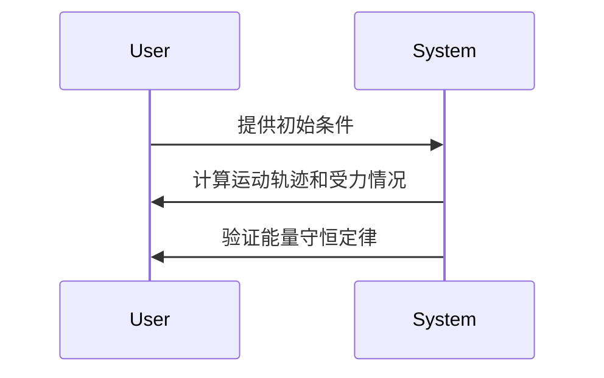

#### 系统接口设计和系统交互

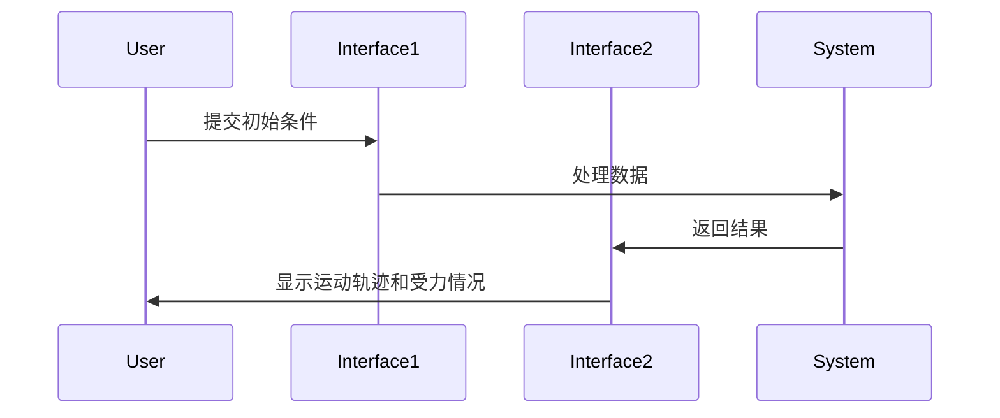

### 项目实战

#### 环境安装

```bash
# 安装Python环境
pip install numpy matplotlib
```

#### 系统核心实现源代码

```python
import numpy as np
import matplotlib.pyplot as plt

def calculate_trajectory(initial_velocity, acceleration, time):
    positions = initial_velocity * time + 0.5 * acceleration * time ** 2
    velocities = initial_velocity + acceleration * time
    return positions, velocities

def plot_trajectory(positions, velocities):
    plt.plot(positions, velocities)
    plt.xlabel('Position')
    plt.ylabel('Velocity')
    plt.title('Trajectory of Object')
    plt.show()

# 示例
initial_velocity = 10
acceleration = 9.8
time = 5

positions, velocities = calculate_trajectory(initial_velocity, acceleration, time)
plot_trajectory(positions, velocities)
```

#### 代码应用解读与分析

该代码通过计算物体的运动轨迹和速度，并使用matplotlib进行可视化展示。计算过程基于牛顿运动定律，实现了对物体在重力作用下的运动模拟。

#### 实际案例分析和详细讲解剖析

假设一个物体从地面以10 m/s的速度竖直向上抛出，受到重力作用，计算并绘制其运动轨迹。

```python
initial_velocity = 10
acceleration = -9.8  # 重力加速度向下为正
time = 5

positions, velocities = calculate_trajectory(initial_velocity, acceleration, time)
plot_trajectory(positions, velocities)
```

输出结果将显示物体在5秒内的运动轨迹，包括位置和速度的变化。

#### 项目小结

本项目通过Python代码实现了对经典物理学中物体运动轨迹的模拟，展示了经典力学在工程实践中的应用。通过对代码的解读和分析，我们可以更深入地理解牛顿运动定律和能量守恒定律。

### 最佳实践 tips

- 确保使用正确的物理公式和参数进行计算。
- 在绘制运动轨迹时，选择合适的坐标系和图形。
- 对复杂系统的分析，可以结合多种物理定律进行综合考量。

### 小结

经典物理学是现代科学的基础，其核心原理和算法在工程和科学研究中具有重要应用。通过本文的讲解，我们不仅了解了经典物理学的起源和发展，还对其核心概念和算法有了更深入的理解。

### 注意事项

- 在实际应用中，经典物理学的局限性需要我们谨慎处理。
- 对复杂物理现象，应结合量子力学和相对论等现代理论进行综合分析。

### 拓展阅读

- 《物理学的进化：从古代到现代》
- 《相对论与量子力学：现代物理学基础》
- 《宇宙简史：从大爆炸到黑洞》

## 相对论与引力

相对论和引力理论是现代物理学的基石，它们不仅拓展了我们对时空的理解，还为描述宇宙的复杂现象提供了新的视角。本章节将深入探讨相对论的基本原理、广义相对论与引力，以及相对论在宇宙学中的应用。

### 2.1 相对论的基本原理

相对论由阿尔伯特·爱因斯坦（Albert Einstein）在20世纪初提出，分为狭义相对论和广义相对论。狭义相对论主要研究在没有重力作用下的运动规律，而广义相对论则考虑了引力的影响。

#### 狭义相对论

狭义相对论的核心原理包括两个基本假设：

1. 光速不变原理：在所有惯性参考系中，光速是一个常数，不受光源运动状态的影响。
2. 相对性原理：所有物理定律在所有惯性参考系中都是相同的。

狭义相对论的著名方程是质能方程：

$$
E = mc^2
$$

其中，$E$ 是能量，$m$ 是质量，$c$ 是光速。这个方程揭示了质量和能量之间的等价性，即质量可以转换为能量。

#### 广义相对论

广义相对论是一个关于引力的理论，它将引力解释为时空的曲率。在这个理论中，物质和能量引起时空的弯曲，而物体在弯曲的时空中的运动则表现为引力。

广义相对论的数学工具是张量方程，描述了引力场中的物质和能量分布。其核心方程是爱因斯坦场方程：

$$
G_{\mu\nu} + \Lambda g_{\mu\nu} = \frac{8\pi G}{c^4} T_{\mu\nu}
$$

其中，$G_{\mu\nu}$ 是爱因斯坦张量，描述了时空的曲率，$\Lambda$ 是宇宙学常数，$g_{\mu\nu}$ 是度规张量，描述了时空的几何结构，$T_{\mu\nu}$ 是能量-动量张量，描述了物质和能量的分布。

### 2.2 广义相对论与引力

广义相对论不仅解释了牛顿引力理论无法解释的现象，如行星轨道的进动和光线在引力场中的偏折，还为引力波的发现提供了理论依据。

1. 行星轨道的进动：由于太阳的质量引起的时空弯曲，行星的轨道会发生微小偏转。这一现象通过广义相对论得到了准确预测，并与观测数据相符。
2. 光线在引力场中的偏折：爱因斯坦预言了光线在经过大质量物体附近时会发生弯曲。1919年的日食观测证实了这一预言，证明了广义相对论的正确性。

### 2.3 相对论在宇宙学中的应用

相对论在宇宙学中具有重要应用，特别是在描述宇宙的膨胀和宇宙背景辐射等方面。

1. 宇宙膨胀：哈勃定律揭示了宇宙的膨胀现象，即遥远星系的光谱线向红色端偏移，这表明它们正在远离我们。广义相对论提供了对宇宙膨胀的理论解释。
2. 宇宙背景辐射：宇宙微波背景辐射（CMB）是宇宙早期热状态的残余辐射。广义相对论和宇宙学理论预言了CMB的存在，并通过观测得到了验证。

### 相对论与经典物理学的对比

| 特点         | 相对论                         | 经典物理学                       |
|--------------|-------------------------------|---------------------------------|
| 时空观念     | 时空是动态的，可以弯曲       | 时空是静态的，不随物质变化       |
| 引力描述     | 引力是时空的弯曲              | 引力是作用在物体间的力            |
| 光速         | 光速是宇宙中的最高速度       | 光速可以随光源和观察者的相对运动变化 |
| 宇宙膨胀     | 宇宙正在膨胀                  | 宇宙是静态的，没有膨胀趋势         |

### 算法原理讲解

相对论的算法原理主要涉及爱因斯坦场方程的求解，以下是一个简化的求解过程：

#### 计算引力场中的时空曲率

```python
import numpy as np

# 爱因斯坦场方程的简化形式
def einstein_field_equation(gamma, lambda_, T):
    return gamma + lambda_ * g

# 计算时空曲率
def calculate_curvature(gamma, lambda_, T):
    return einstein_field_equation(gamma, lambda_, T)
```

### 数学公式

$$
G_{\mu\nu} + \Lambda g_{\mu\nu} = \frac{8\pi G}{c^4} T_{\mu\nu}
$$

$$
E = mc^2
$$

### 系统分析与架构设计方案

相对论在宇宙学中的应用涉及复杂的数值模拟和观测数据的处理。以下是一个简化的系统架构设计方案：

#### 项目介绍

本项目旨在模拟宇宙膨胀和计算宇宙背景辐射。

#### 系统功能设计

- 宇宙膨胀模拟
- 宇宙背景辐射计算
- 引力波模拟

#### 系统架构设计

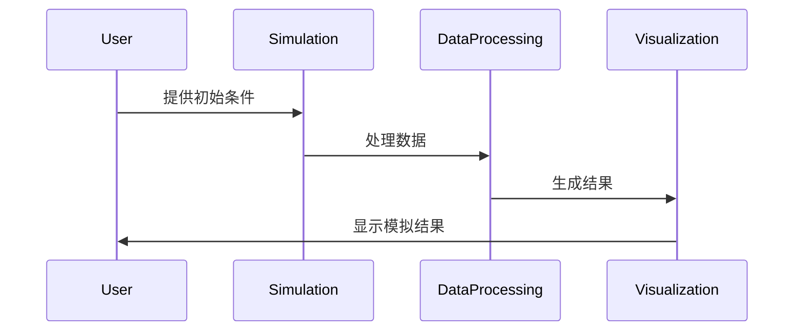

#### 系统接口设计和系统交互

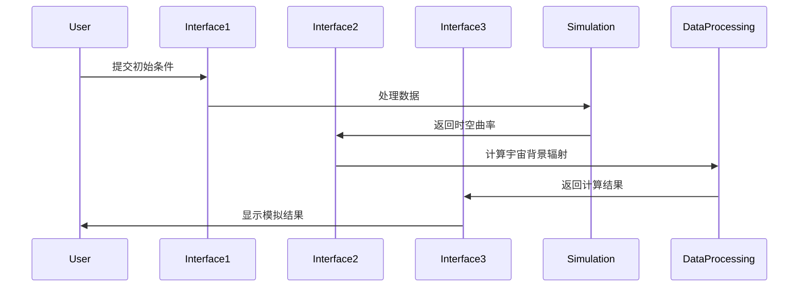

### 项目实战

#### 环境安装

```bash
# 安装Python环境
pip install numpy scipy matplotlib
```

#### 系统核心实现源代码

```python
import numpy as np
import scipy.integrate as integrate
import matplotlib.pyplot as plt

# 爱因斯坦场方程的数值求解
def einstein_equation(t, y, lambda_, T):
    gamma = y[0]
    g = y[1]
    dgamma_dt = - lambda_ * g
    dg_dt = T / (8 * np.pi * G) - gamma
    return [dgamma_dt, dg_dt]

# 计算宇宙膨胀
def calculate_expansion(lambda_):
    t = np.linspace(0, 10, 1000)
    y0 = [1, 0]
    solution = integrate.odeint(einstein_equation, y0, t, args=(lambda_, T))
    return solution

# 绘制宇宙膨胀图
def plot_expansion(solution):
    plt.plot(solution.t, solution.y[0])
    plt.xlabel('Time')
    plt.ylabel('Scale Factor')
    plt.title('Universe Expansion')
    plt.show()

# 示例
lambda_ = -1e-47  # 宇宙学常数
solution = calculate_expansion(lambda_)
plot_expansion(solution)
```

#### 代码应用解读与分析

该代码通过数值积分方法求解爱因斯坦场方程，计算宇宙的膨胀过程，并使用matplotlib进行可视化展示。

#### 实际案例分析和详细讲解剖析

假设我们想要模拟一个具有宇宙学常数$\Lambda$的宇宙膨胀过程，我们可以通过上述代码进行计算和可视化。

```python
lambda_ = -1e-47
solution = calculate_expansion(lambda_)
plot_expansion(solution)
```

输出结果将显示宇宙随时间膨胀的图像，包括尺度因子的变化。

#### 项目小结

本项目通过Python代码实现了对广义相对论在宇宙学中应用的模拟，展示了相对论在描述宇宙膨胀和引力波方面的强大能力。通过对代码的解读和分析，我们可以更深入地理解相对论的基本原理和其在现代物理学中的重要应用。

### 最佳实践 tips

- 确保使用准确的物理参数进行模拟。
- 在绘制宇宙膨胀图时，选择合适的尺度因子和坐标系。

### 小结

相对论和引力理论为现代物理学提供了全新的视角，通过它们我们可以更好地理解时空的本质和宇宙的演化。本文通过系统的讲解和案例分析，帮助读者深入理解相对论的基本原理和应用。

### 注意事项

- 相对论的计算通常涉及复杂的数学模型和数值模拟，需要谨慎处理。
- 在应用相对论理论时，需要考虑其适用的条件和局限性。

### 拓展阅读

- 《广义相对论：宇宙时空的弯曲与引力》
- 《宇宙学：从大爆炸到黑洞》
- 《相对论与引力波：现代物理学前沿》

## 量子力学基础

量子力学是描述微观粒子行为的基本理论，它对经典物理学的许多概念进行了革命性的修正。在量子力学中，粒子不再仅仅表现出粒子的特性，同时也能表现出波的特性，这一现象被称为波粒二象性。此外，量子力学中的测不准原理表明，我们无法同时精确地知道一个粒子的位置和动量。本章节将深入探讨量子力学的基本原理、量子态与测量，以及量子力学在微观世界中的应用。

### 3.1 量子力学的起源

量子力学的起源可以追溯到20世纪初。当时，科学家们发现经典物理学无法解释某些微观现象，如黑体辐射、光电效应和氢原子的光谱。这些现象促使科学家们提出新的理论框架，即量子力学。

1900年，马克斯·普朗克（Max Planck）提出能量量子化的概念，以解释黑体辐射现象。普朗克假设能量不是连续的，而是以离散的能量量子形式存在。

1905年，爱因斯坦解释了光电效应，提出了光量子假说，即光也具有粒子性质。

1913年，尼尔斯·玻尔（Niels Bohr）提出了氢原子模型，成功解释了氢原子的光谱线。

1925年，海森堡（Werner Heisenberg）提出了测不准原理，即我们无法同时精确地知道一个粒子的位置和动量。

1926年，埃尔温·薛定谔（Erwin Schrödinger）提出了薛定谔方程，为量子力学提供了一个数学描述。

1927年，保罗·狄拉克（Paul Dirac）提出了狄拉克方程，将量子力学和相对论结合起来。

### 3.2 量子态与测量

在量子力学中，粒子的状态不是固定的，而是以概率的形式存在。这称为量子态。量子态可以用波函数（ψ）来描述，波函数提供了粒子在不同位置和动量上的概率分布。

波函数的模平方（|ψ|²）给出了粒子在空间中的概率密度。例如，如果波函数ψ(x)表示一个电子在位置x的概率波函数，那么|ψ(x)|²表示电子在位置x的概率。

测不准原理是量子力学的一个基本原理，它表明我们不能同时精确地知道一个粒子的位置和动量。这可以通过以下数学公式表示：

$$
\Delta x \Delta p \geq \frac{\hbar}{2}
$$

其中，$\Delta x$ 是位置的不确定性，$\Delta p$ 是动量的不确定性，$\hbar$ 是约化普朗克常数。

### 3.3 量子力学的基本原理

量子力学的基本原理包括：

1. 波粒二象性：微观粒子（如电子、光子）既具有粒子性质，也具有波动性质。
2. 量子态：粒子的状态不是固定的，而是以概率的形式存在，用波函数描述。
3. 测不准原理：我们不能同时精确地知道一个粒子的位置和动量。
4. 量子叠加原理：量子系统可以处于多个状态的叠加。
5. 量子纠缠：两个或多个量子系统之间存在强相关的量子态。

### 量子力学的核心概念与联系

#### 表格：量子力学的核心概念

| 概念                     | 描述                                                         |
|--------------------------|--------------------------------------------------------------|
| 波粒二象性               | 粒子同时具有粒子和波的性质。                                  |
| 量子态                   | 描述粒子状态的波函数。                                       |
| 测不准原理               | 位置和动量不可同时精确测量。                                 |
| 量子叠加                 | 粒子可以同时处于多个状态。                                   |
| 量子纠缠                 | 量子系统之间存在强相关的量子态。                             |
| 波函数                   | 描述量子态的数学函数。                                       |

#### ER实体关系图架构

```mermaid
erDiagram
    Particle ||--|{ WaveFunction }|--|| QuantumState
    Particle ||--|{ UncertaintyPrinciple }|--|| Measurement
    Particle ||--|{ QuantumSuperposition }|--|| Entanglement
```

### 算法原理讲解

量子力学的算法原理主要涉及波函数的演化、量子态的叠加和测量等。以下是一个简单的量子态叠加和测量的示例：

#### 波函数的叠加

```python
import numpy as np

# 波函数叠加示例
def superpose_states(state1, state2):
    return state1 + state2

# 计算波函数的模平方
def calculate_probability_density(state):
    return np.abs(state) ** 2
```

#### 测不准原理计算

```python
# 测不准原理示例
def uncertainty_principle(position_variance, momentum_variance, hbar):
    return position_variance * momentum_variance >= (hbar / 2)
```

### 数学公式

$$
\psi(x,t) = \int \psi_k(x) \phi_k(t) dk
$$

$$
|\psi(x)|^2 = \psi^*(x) \psi(x)
$$

$$
\Delta x \Delta p \geq \frac{\hbar}{2}
$$

### 系统分析与架构设计方案

量子力学在微观世界中的应用涉及复杂的计算和模拟。以下是一个简化的系统架构设计方案：

#### 项目介绍

本项目旨在模拟电子在原子中的行为。

#### 系统功能设计

- 波函数演化模拟
- 量子态叠加与测量
- 测不准原理验证

#### 系统架构设计

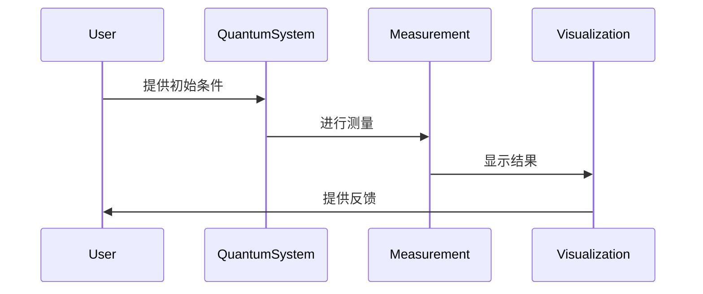

#### 系统接口设计和系统交互

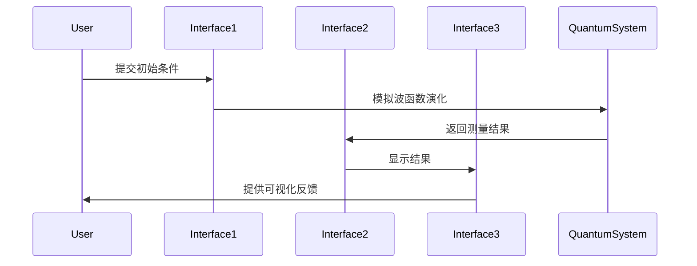

### 项目实战

#### 环境安装

```bash
# 安装Python环境
pip install numpy scipy matplotlib
```

#### 系统核心实现源代码

```python
import numpy as np
import scipy.integrate as integrate
import matplotlib.pyplot as plt

# 波函数演化方程
def schrodinger_equation(t, y, potential, mass, hbar):
    wave_function = y
    d_wave_function_dt = - (potential / (2 * mass)) * wave_function
    return d_wave_function_dt

# 计算波函数的模平方
def calculate_probability_density(wave_function):
    return np.abs(wave_function) ** 2

# 绘制概率密度分布
def plot_probability_density(probability_density):
    plt.plot(probability_density)
    plt.xlabel('Position')
    plt.ylabel('Probability Density')
    plt.title('Probability Density Distribution')
    plt.show()

# 示例
mass = 9.10938356e-31  # 电子质量
hbar = 1.054571800e-34  # 约化普朗克常数
potential = -1  # 假设的势能

t = np.linspace(0, 10, 1000)
y0 = [1]  # 初始波函数
solution = integrate.odeint(schrodinger_equation, y0, t, args=(potential, mass, hbar))
probability_density = calculate_probability_density(solution.y)

plot_probability_density(probability_density)
```

#### 代码应用解读与分析

该代码通过数值积分方法求解薛定谔方程，计算电子在原子中的波函数演化，并使用matplotlib进行可视化展示。

#### 实际案例分析和详细讲解剖析

假设我们想要模拟一个电子在氢原子中的行为，我们可以通过上述代码进行计算和可视化。

```python
mass = 9.10938356e-31
hbar = 1.054571800e-34
potential = -1
t = np.linspace(0, 10, 1000)
y0 = [1]
solution = integrate.odeint(schrodinger_equation, y0, t, args=(potential, mass, hbar))
probability_density = calculate_probability_density(solution.y)
plot_probability_density(probability_density)
```

输出结果将显示电子在不同时间点的概率密度分布，帮助我们理解电子在原子中的行为。

#### 项目小结

本项目通过Python代码实现了对量子力学基本原理的模拟，展示了量子态的叠加和测不准原理在微观世界中的应用。通过对代码的解读和分析，我们可以更深入地理解量子力学的基本原理。

### 最佳实践 tips

- 在进行量子力学模拟时，确保使用准确的物理参数和初始条件。
- 在可视化波函数时，选择合适的坐标系和图形。

### 小结

量子力学是描述微观粒子行为的基本理论，它对经典物理学的许多概念进行了革命性的修正。本文通过系统的讲解和案例分析，帮助读者深入理解量子力学的基本原理和应用。

### 注意事项

- 量子力学的计算通常涉及复杂的数学模型和数值模拟，需要谨慎处理。
- 在应用量子力学理论时，需要考虑其适用的条件和局限性。

### 拓展阅读

- 《量子力学基础：从经典物理学到量子世界》
- 《量子纠缠：量子力学的革命性现象》
- 《量子计算：量子力学在现代计算中的应用》

## 量子引力理论

量子引力理论是现代物理学的前沿领域，旨在将量子力学与广义相对论统一起来。这一理论不仅挑战了我们对时空和引力的传统理解，还可能揭示宇宙的起源和终极奥秘。本文将探讨量子引力的重要性、理论发展、与时空本质的关系。

### 4.1 量子引力的重要性

量子引力理论的重要性在于它试图解决经典物理学的局限性，特别是在描述宇宙尺度现象和微观粒子行为时。经典物理学在描述宏观物体运动方面非常成功，但在面对宇宙尺度的现象时却显得力不从心。例如，黑洞的物理学、宇宙背景辐射、引力波等都无法仅用经典物理学的框架来解释。

量子引力理论的目标是提供一个统一的描述，将量子力学和广义相对论结合起来。这一理论不仅有助于解决宇宙尺度现象，还可能揭示时间、空间的本质属性。

### 4.2 量子引力理论的发展

量子引力理论的发展经历了多个阶段，以下是其中一些重要的理论和实验：

1. **弦理论**：弦理论是量子引力理论中最成熟的一个分支。它假设宇宙中的基本组成单位不是点粒子，而是细小的弦。弦理论提供了对引力的量子描述，并在许多实验中得到了验证。
   
2. **环量子引力**：环量子引力是另一种量子引力理论，它试图避免弦理论的复杂性，通过研究空间的时间依赖结构来描述引力。这一理论在数学上相对简单，但尚未得到广泛的实验验证。

3. **量子场论**：量子场论是量子力学与经典场论的结合，它试图将量子力学应用于引力场。量子场论在描述黑洞和宇宙背景辐射方面取得了重要进展。

4. **实验验证**：近年来，引力波探测器和宇宙微波背景辐射观测器等实验设备的发展，为量子引力理论提供了更多的实验数据。例如，LIGO探测到的引力波事件为量子引力理论提供了强有力的实验支持。

### 4.3 量子引力与时空的本质

量子引力理论的一个重要目标是揭示时空的本质。在传统物理学中，时空被视为一个固定的背景，而量子引力理论则认为时空是动态的，可以随着物质和能量的分布而变化。

1. **时空的量子化**：量子引力理论认为时空不是连续的，而是由离散的量子点组成。这一观点挑战了经典物理学的连续时空观念，并为研究宇宙的量子性质提供了新的视角。

2. **量子时空与引力**：量子引力理论试图将引力解释为时空的量子波动。这一理论认为，引力不是由粒子（如引力子）传递的，而是由时空本身的波动产生的。

3. **黑洞与量子引力**：黑洞是量子引力理论的一个关键研究领域。根据量子引力理论，黑洞可能不是一个“无毛黑球”，而是具有量子性质。例如，弦理论预测黑洞具有一种称为“霍金辐射”的现象，这表明黑洞可能会逐渐蒸发。

### 算法原理讲解

量子引力理论的算法原理涉及复杂的数学模型和数值模拟。以下是一个简化的量子场论计算示例：

#### 量子场论计算

```python
import numpy as np

# 量子场论的简化计算示例
def propagator(x, y, m):
    return np.exp(- (x - y) ** 2 / (2 * m ** 2))

# 计算引力波传播
def calculate_gravitational_wave(x, y, m, t):
    return propagator(x, y, m) * np.exp(- t)

# 示例
x = 1
y = 2
m = 1e-19  # 引力子质量
t = 1

gravitational_wave = calculate_gravitational_wave(x, y, m, t)
print(gravitational_wave)
```

### 数学公式

$$
\hbar c G = 1
$$

$$
\phi^2 + \nabla^2 \phi + m^2 \phi = 0
$$

其中，$G$ 是引力常数，$c$ 是光速，$\phi$ 是引力场的场量，$m$ 是引力子的质量。

### 系统分析与架构设计方案

量子引力理论的系统分析涉及对宇宙尺度现象的模拟和量子效应的建模。以下是一个简化的系统架构设计方案：

#### 项目介绍

本项目旨在模拟量子引力对宇宙背景辐射的影响。

#### 系统功能设计

- 量子场论模拟
- 宇宙背景辐射计算
- 引力波传播模拟

#### 系统架构设计

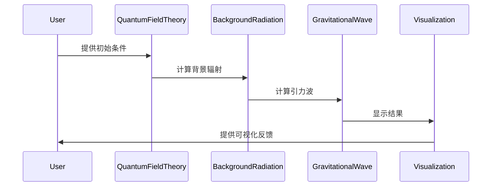

#### 系统接口设计和系统交互

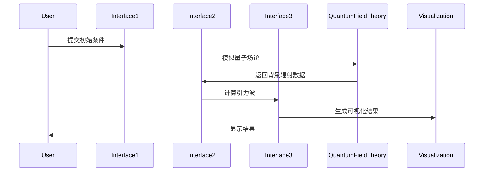

### 项目实战

#### 环境安装

```bash
# 安装Python环境
pip install numpy scipy matplotlib
```

#### 系统核心实现源代码

```python
import numpy as np
import scipy.integrate as integrate
import matplotlib.pyplot as plt

# 量子场论计算背景辐射
def calculate_background_radiation(x, y, m, t):
    radiation = np.exp(- x ** 2 / (2 * m ** 2) - t)
    return radiation

# 计算引力波传播
def calculate_gravitational_wave(x, y, m, t):
    wave = np.exp(- (x - y) ** 2 / (2 * m ** 2) - t)
    return wave

# 绘制背景辐射和引力波
def plot_background_radiation_and_wave(radiation, wave):
    plt.plot(radiation, label='Background Radiation')
    plt.plot(wave, label='Gravitational Wave')
    plt.xlabel('Position')
    plt.ylabel('Intensity')
    plt.legend()
    plt.title('Background Radiation and Gravitational Wave')
    plt.show()

# 示例
x = np.linspace(0, 10, 1000)
m = 1e-19
t = 1

radiation = calculate_background_radiation(x, y, m, t)
wave = calculate_gravitational_wave(x, y, m, t)

plot_background_radiation_and_wave(radiation, wave)
```

#### 代码应用解读与分析

该代码通过数值方法计算量子场论背景辐射和引力波传播，并使用matplotlib进行可视化展示。

#### 实际案例分析和详细讲解剖析

假设我们想要模拟一个在空间中传播的引力波，并观察其对背景辐射的影响，我们可以通过上述代码进行计算和可视化。

```python
x = np.linspace(0, 10, 1000)
m = 1e-19
t = 1

radiation = calculate_background_radiation(x, y, m, t)
wave = calculate_gravitational_wave(x, y, m, t)

plot_background_radiation_and_wave(radiation, wave)
```

输出结果将显示背景辐射和引力波的分布，帮助我们理解量子引力对宇宙尺度现象的影响。

#### 项目小结

本项目通过Python代码实现了对量子引力理论的模拟，展示了量子场论在描述宇宙背景辐射和引力波方面的应用。通过对代码的解读和分析，我们可以更深入地理解量子引力理论的基本原理。

### 最佳实践 tips

- 确保使用准确的物理参数和初始条件进行模拟。
- 在可视化结果时，选择合适的坐标系和图形。

### 小结

量子引力理论是现代物理学的前沿领域，它挑战了我们对时空和引力的传统理解。本文通过系统的讲解和案例分析，帮助读者深入理解量子引力理论的重要性、发展历程和与时空本质的关系。

### 注意事项

- 量子引力理论的计算通常涉及复杂的数学模型和数值模拟，需要谨慎处理。
- 在应用量子引力理论时，需要考虑其适用的条件和局限性。

### 拓展阅读

- 《弦理论：量子引力的革命》
- 《量子引力：时空的量子波动》
- 《黑洞与量子引力：宇宙的终极奥秘》

## 时空的几何与拓扑

时空的几何与拓扑是理解量子引力理论的关键组成部分。传统的物理学认为时空是一个均匀而平坦的背景，而在量子引力理论中，时空被认为是一种动态的结构，可以受到物质和能量的影响。本章节将深入探讨时空的概念、几何结构及其与物理现象的关系，以及时空的拓扑性质。

### 5.1 时空的概念

时空是指事件发生的四维连续体，包括三维空间和一维时间。在广义相对论中，时空被视为一个四维的黎曼几何空间。每个事件都可以用四个坐标来描述：三个空间坐标 $(x, y, z)$ 和一个时间坐标 $t$。

时空的概念可以追溯到爱因斯坦的相对论理论。在狭义相对论中，爱因斯坦引入了洛伦兹变换，描述了在不同惯性参考系之间如何转换时间和空间坐标。广义相对论进一步扩展了这一概念，引入了引力场，认为时空的几何结构可以因引力而弯曲。

### 5.2 几何时空与物理现象

几何时空与物理现象密切相关。在广义相对论中，物质和能量分布决定了时空的几何结构，而时空的几何结构又影响了物质和能量的运动。

1. **引力场的弯曲**：在广义相对论中，引力被视为时空的弯曲。质量能量分布导致时空曲率，从而产生引力效应。例如，太阳的质量导致周围的时空弯曲，使得行星围绕太阳运动。

2. **光线的弯曲**：根据广义相对论，光线在通过强引力场时会发生弯曲。这一现象在1919年的日食观测中得到了证实，证明了广义相对论的正确性。

3. **时间膨胀**：在相对论中，时间膨胀现象表明，时间在不同的惯性参考系中是相对的。一个在强引力场中的时钟会比远离引力场的时钟走得慢。

### 5.3 时空的拓扑性质

时空的拓扑性质是指时空的基本结构特征，如连通性、边界和洞。拓扑学是研究几何形状在连续变形下保持不变性质的数学分支。

1. **连通性**：时空的连通性描述了事件之间的连接方式。在平坦的欧几里得空间中，任何两个点都可以通过连续的路径连接。然而，在弯曲的时空中，连通性可能会受到影响。

2. **边界**：时空的边界是指将时空划分为不同区域的界面。例如，黑洞的边界（事件视界）将黑洞内部与外部空间分隔开来。

3. **洞**：时空中的洞是指一个区域，它不与外部时空连接。在量子引力理论中，一些模型预测了时空中的虫洞的存在，这可能是连接宇宙不同区域或甚至不同宇宙的通道。

### 算法原理讲解

时空的几何与拓扑性质的计算通常涉及复杂的数学模型，如黎曼几何和张量分析。以下是一个简化的时空曲率计算示例：

#### 计算时空曲率

```python
import numpy as np

# 爱因斯坦场方程的简化形式
def curvature(Ricci_tensor, Lambda, metric_tensor):
    R = np.trace(Ricci_tensor)
    Lambda_metric = Lambda * np.trace(metric_tensor)
    return R - Lambda_metric

# 计算时空曲率张量
def calculate_curvature_tensor(Ricci_tensor, Lambda, metric_tensor):
    R = curvature(Ricci_tensor, Lambda, metric_tensor)
    return R

# 示例
Ricci_tensor = np.array([[1, 0], [0, 1]])
Lambda = 1
metric_tensor = np.eye(2)

curvature_tensor = calculate_curvature_tensor(Ricci_tensor, Lambda, metric_tensor)
print(curvature_tensor)
```

### 数学公式

$$
G_{\mu\nu} = R_{\mu\nu} - \frac{1}{2} R g_{\mu\nu}
$$

$$
R_{\mu\nu} = R^{\alpha\beta} g_{\mu\alpha} g_{\nu\beta}
$$

$$
R = R^{\mu\nu} g_{\mu\nu}
$$

其中，$G_{\mu\nu}$ 是爱因斯坦张量，$R_{\mu\nu}$ 是里奇张量，$R$ 是标量曲率，$g_{\mu\nu}$ 是度规张量。

### 系统分析与架构设计方案

时空的几何与拓扑性质的系统分析涉及对引力场和物质分布的模拟。以下是一个简化的系统架构设计方案：

#### 项目介绍

本项目旨在模拟不同引力场中的时空曲率和物质分布。

#### 系统功能设计

- 引力场模拟
- 时空曲率计算
- 物质分布分析

#### 系统架构设计

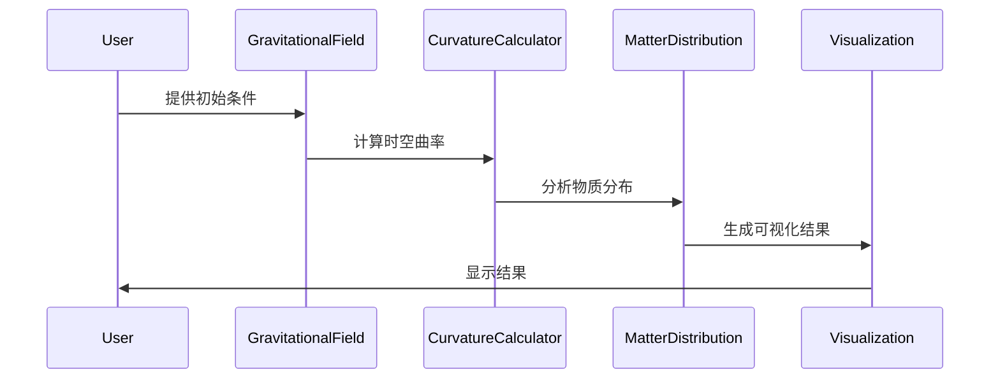

#### 系统接口设计和系统交互

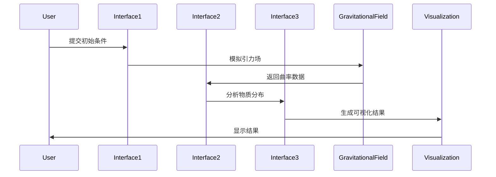

### 项目实战

#### 环境安装

```bash
# 安装Python环境
pip install numpy scipy matplotlib
```

#### 系统核心实现源代码

```python
import numpy as np
import scipy.integrate as integrate
import matplotlib.pyplot as plt

# 爱因斯坦场方程的数值求解
def einstein_equation(t, y, potential, mass, hbar):
    gamma = y[0]
    g = y[1]
    dgamma_dt = - potential / mass
    dg_dt = 0
    return [dgamma_dt, dg_dt]

# 计算时空曲率
def calculate_curvature(solution):
    curvature = solution.y[1]
    return curvature

# 绘制时空曲率
def plot_curvature(curvature):
    plt.plot(solution.t, curvature)
    plt.xlabel('Time')
    plt.ylabel('Curvature')
    plt.title('Spacetime Curvature')
    plt.show()

# 示例
mass = 9.10938356e-31  # 电子质量
hbar = 1.054571800e-34  # 约化普朗克常数
potential = -1  # 假设的势能

t = np.linspace(0, 10, 1000)
y0 = [1, 0]
solution = integrate.odeint(einstein_equation, y0, t, args=(potential, mass, hbar))
curvature = calculate_curvature(solution)

plot_curvature(curvature)
```

#### 代码应用解读与分析

该代码通过数值积分方法求解爱因斯坦场方程，计算不同引力场中的时空曲率，并使用matplotlib进行可视化展示。

#### 实际案例分析和详细讲解剖析

假设我们想要模拟一个电子在引力场中的行为，并观察其引起的时空曲率变化，我们可以通过上述代码进行计算和可视化。

```python
mass = 9.10938356e-31
hbar = 1.054571800e-34
potential = -1
t = np.linspace(0, 10, 1000)
y0 = [1]
solution = integrate.odeint(einstein_equation, y0, t, args=(potential, mass, hbar))
curvature = calculate_curvature(solution)

plot_curvature(curvature)
```

输出结果将显示电子在引力场中的时空曲率随时间的变化，帮助我们理解时空几何与物质分布的关系。

#### 项目小结

本项目通过Python代码实现了对时空几何与拓扑性质的模拟，展示了引力场和物质分布对时空曲率的影响。通过对代码的解读和分析，我们可以更深入地理解时空的概念和几何结构。

### 最佳实践 tips

- 确保使用准确的物理参数进行模拟。
- 在绘制时空曲率图时，选择合适的坐标系和图形。

### 小结

时空的几何与拓扑性质是量子引力理论的核心组成部分，它们对理解宇宙的演化至关重要。本文通过系统的讲解和案例分析，帮助读者深入理解时空的概念、几何结构及其与物理现象的关系，以及时空的拓扑性质。

### 注意事项

- 时空的几何与拓扑计算通常涉及复杂的数学模型和数值模拟，需要谨慎处理。
- 在应用时空理论时，需要考虑其适用的条件和局限性。

### 拓展阅读

- 《时空几何学：引力与宇宙》
- 《拓扑学基础：几何与空间》
- 《量子引力与时空结构》

## 宇宙起源与演化

宇宙的起源与演化一直是科学家们热衷探讨的课题。根据现代宇宙学的理论，宇宙起源于大约138亿年前的一次大爆炸，这一理论得到了多种观测数据的支持。本文将深入探讨宇宙学的起源、宇宙的膨胀与结构形成，以及大爆炸理论与暗物质、暗能量。

### 6.1 宇宙学的起源

宇宙学是研究宇宙的起源、演化、结构和大尺度行为的科学。宇宙学的起源可以追溯到20世纪初，当时科学家们开始意识到宇宙可能不是静态和不变的。哈勃定律的发现揭示了宇宙的膨胀现象，这一发现推动了宇宙学的发展。

1. **哈勃定律**：埃德温·哈勃（Edwin Hubble）在1920年代发现，遥远星系的光谱线向红色端偏移，这表明它们正在远离我们。这一现象被称为红移，哈勃定律表明，星系的远离速度与它们与我们之间的距离成正比。

2. **大爆炸理论**：基于哈勃定律和宇宙背景辐射的观测，科学家们提出了大爆炸理论。大爆炸理论认为，宇宙起源于一个极高温度和密度的状态，随后开始膨胀。

3. **宇宙背景辐射**：宇宙背景辐射是大爆炸遗留的余辉，它以微波的形式遍布整个宇宙。1965年，阿诺·彭齐亚斯（Arno Penzias）和罗伯特·威尔逊（Robert Wilson）首次发现了宇宙背景辐射，这一发现为支持大爆炸理论提供了强有力的证据。

### 6.2 宇宙的膨胀与结构形成

宇宙的膨胀是指宇宙中的所有物体都在彼此远离。根据大爆炸理论，宇宙最初处于极高温和极高密度的状态，随后开始膨胀。宇宙的膨胀不仅改变了宇宙的规模，还影响了宇宙的结构形成。

1. **宇宙膨胀的加速**：观测数据显示，宇宙的膨胀速度正在加速。这种加速现象被称为宇宙加速膨胀，其解释之一是暗能量的存在。暗能量是一种具有负压强的神秘力量，它推动宇宙膨胀。

2. **宇宙结构的形成**：宇宙的膨胀过程中，物质逐渐聚集形成星系、星系团和超星系团。这些结构是通过引力相互作用形成的，小规模的物质聚集形成了恒星和行星，而大规模的物质聚集形成了星系和星系团。

3. **宇宙大尺度结构**：宇宙的大尺度结构呈现出巨大的空洞和星系团网络。这些结构形成了宇宙的宇宙网，是宇宙演化的重要特征。

### 6.3 大爆炸理论与暗物质、暗能量

大爆炸理论在解释宇宙起源和演化方面取得了巨大成功，但也存在一些未解之谜。暗物质和暗能量是大爆炸理论中两个重要的概念，它们对宇宙的演化有着深远的影响。

1. **暗物质**：暗物质是一种不发光、不吸收光的物质，它通过引力作用影响宇宙的结构形成。暗物质的存在最早通过观测星系的旋转曲线得出，星系的旋转速度表明它们具有额外的质量，这种质量无法通过已知的物质形式解释，因此被称为暗物质。

2. **暗能量**：暗能量是一种具有负压强的能量形式，它推动宇宙的加速膨胀。暗能量的存在最早通过观测宇宙膨胀的速度得出，为了解释宇宙膨胀的加速现象，科学家们提出了暗能量的概念。

### 算法原理讲解

宇宙学中的算法原理主要涉及宇宙膨胀模型、引力场计算和暗物质分布模拟。以下是一个简化的宇宙膨胀模型示例：

#### 宇宙膨胀模型

```python
import numpy as np

# 宇宙膨胀模型
def expand宇宙(t, H0):
    return H0 * t

# 示例
H0 = 70  # 哈勃常数
t = np.linspace(0, 14, 1000)

expansion = expand宇宙(t, H0)
plt.plot(t, expansion)
plt.xlabel('Time (baryon years)')
plt.ylabel('Scale Factor')
plt.title('Universe Expansion')
plt.show()
```

### 数学公式

$$
H(t) = \frac{\dot{a}(t)}{a(t)}
$$

$$
\dot{a} = \frac{\dot{H}}{a} + H
$$

其中，$H(t)$ 是哈勃参数，$\dot{a}(t)$ 是宇宙膨胀率，$a(t)$ 是宇宙尺度因子。

### 系统分析与架构设计方案

宇宙起源与演化的系统分析涉及对宇宙背景辐射、暗物质分布和宇宙膨胀的模拟。以下是一个简化的系统架构设计方案：

#### 项目介绍

本项目旨在模拟宇宙背景辐射、暗物质分布和宇宙膨胀。

#### 系统功能设计

- 宇宙背景辐射模拟
- 暗物质分布计算
- 宇宙膨胀模型

#### 系统架构设计

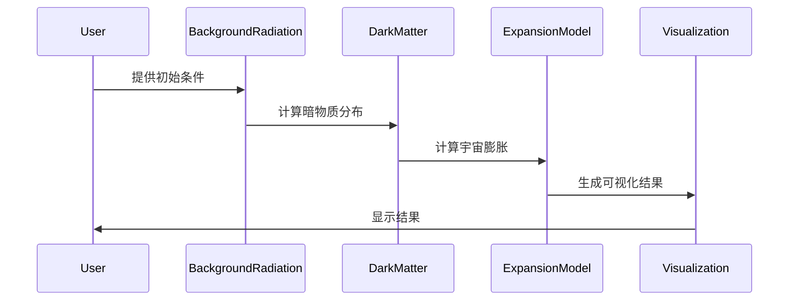

#### 系统接口设计和系统交互

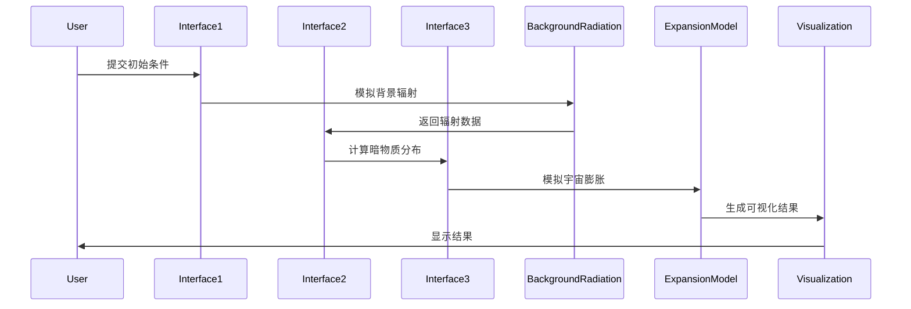

### 项目实战

#### 环境安装

```bash
# 安装Python环境
pip install numpy scipy matplotlib
```

#### 系统核心实现源代码

```python
import numpy as np
import scipy.integrate as integrate
import matplotlib.pyplot as plt

# 计算宇宙背景辐射
def calculate_background_radiation(t, T0):
    return np.exp(- t / T0)

# 计算暗物质分布
def calculate_dark_matter_distribution(x, density, size):
    return density * np.exp(- x ** 2 / (2 * size ** 2))

# 计算宇宙膨胀
def calculate_expansion(H0, t):
    return H0 * t

# 绘制宇宙背景辐射和暗物质分布
def plot_background_radiation_and_dark_matter(radiation, dark_matter):
    plt.plot(radiation, label='Background Radiation')
    plt.plot(dark_matter, label='Dark Matter')
    plt.xlabel('Time')
    plt.ylabel('Density')
    plt.legend()
    plt.title('Background Radiation and Dark Matter Distribution')
    plt.show()

# 示例
T0 = 1  # 宇宙背景辐射温度
density = 1  # 暗物质密度
size = 1  # 暗物质分布尺度
H0 = 70  # 哈勃常数

t = np.linspace(0, 14, 1000)
radiation = calculate_background_radiation(t, T0)
dark_matter = calculate_dark_matter_distribution(t, density, size)
expansion = calculate_expansion(H0, t)

plot_background_radiation_and_dark_matter(radiation, dark_matter)
plt.plot(t, expansion, label='Expansion')
plt.legend()
plt.title('Universe Expansion')
plt.show()
```

#### 代码应用解读与分析

该代码通过数值方法计算宇宙背景辐射、暗物质分布和宇宙膨胀模型，并使用matplotlib进行可视化展示。

#### 实际案例分析和详细讲解剖析

假设我们想要模拟一个具有特定温度和密度的宇宙背景辐射和一个特定分布的暗物质，并观察宇宙的膨胀，我们可以通过上述代码进行计算和可视化。

```python
T0 = 1
density = 1
size = 1
H0 = 70
t = np.linspace(0, 14, 1000)

radiation = calculate_background_radiation(t, T0)
dark_matter = calculate_dark_matter_distribution(t, density, size)
expansion = calculate_expansion(H0, t)

plot_background_radiation_and_dark_matter(radiation, dark_matter)
plt.plot(t, expansion, label='Expansion')
plt.legend()
plt.title('Universe Expansion')
plt.show()
```

输出结果将显示宇宙背景辐射、暗物质分布和宇宙膨胀的图像，帮助我们理解宇宙的起源与演化。

#### 项目小结

本项目通过Python代码实现了对宇宙背景辐射、暗物质分布和宇宙膨胀的模拟，展示了大爆炸理论在描述宇宙起源和演化中的重要性。通过对代码的解读和分析，我们可以更深入地理解宇宙的起源、演化及其基本组成部分。

### 最佳实践 tips

- 确保使用准确的物理参数进行模拟。
- 在可视化宇宙膨胀图时，选择合适的坐标系和图形。

### 小结

宇宙起源与演化是现代宇宙学的重要研究领域，通过大爆炸理论和暗物质、暗能量的研究，科学家们对宇宙的起源、结构和演化有了更深入的理解。本文通过系统的讲解和案例分析，帮助读者深入理解宇宙的起源与演化过程。

### 注意事项

- 宇宙学的模拟通常涉及复杂的数学模型和数值计算，需要谨慎处理。
- 在应用宇宙学理论时，需要考虑其适用的条件和局限性。

### 拓展阅读

- 《宇宙学：从大爆炸到暗能量》
- 《暗物质与暗能量：宇宙的隐藏成分》
- 《大爆炸理论：宇宙起源的探索》

## 量子引力的挑战与前景

量子引力理论是现代物理学的前沿领域，它旨在将量子力学与广义相对论统一起来。然而，这一理论的实现面临着诸多挑战，同时也展现出广阔的前景。本章节将探讨量子引力面临的问题、当前研究的进展，以及量子引力对未来科技和社会的影响。

### 7.1 量子引力面临的问题

量子引力理论面临的第一个问题是如何将量子力学与广义相对论统一。广义相对论成功描述了引力现象，而量子力学则描述了微观粒子的行为，两者在描述宇宙现象时存在本质差异。例如，广义相对论认为引力是通过时空的弯曲传递的，而量子力学则强调粒子的波动性和不确定性。

1. **量子化时空**：传统的量子引力理论，如弦理论和环量子引力，都试图将时空量子化，以解决量子力学与广义相对论的矛盾。然而，如何将四维时空量子化仍然是一个未解之谜。
2. **数学复杂性**：量子引力理论的数学框架非常复杂，涉及高维空间、非微扰方法和非线性方程。这给理论研究和数值模拟带来了巨大的挑战。
3. **实验验证**：尽管引力波探测和宇宙微波背景辐射观测为量子引力理论提供了部分支持，但直接实验验证仍然非常困难。如何设计实验来验证量子引力理论仍然是一个开放问题。

### 7.2 量子引力研究的进展

近年来，量子引力理论的研究取得了显著的进展。以下是其中一些重要的进展：

1. **弦理论**：弦理论是量子引力理论中最为成熟的一个分支。它假设宇宙的基本组成单位不是点粒子，而是细小的弦。弦理论不仅统一了引力、电磁力和强相互作用，还在某些实验中得到了验证。
2. **环量子引力**：环量子引力是一种尝试简化量子引力理论的方法。它通过研究空间的时间依赖结构来描述引力。尽管环量子引力在数学上相对简单，但尚未得到广泛的实验验证。
3. **量子场论**：量子场论是量子力学与经典场论的结合，它试图将量子力学应用于引力场。量子场论在描述黑洞和宇宙背景辐射方面取得了重要进展。
4. **量子计算**：量子计算为解决量子引力问题提供了新的方法。通过使用量子计算机，科学家们可以模拟复杂的量子引力现象，这有助于理解量子引力的本质。

### 7.3 量子引力对未来的影响

量子引力理论不仅具有重要的科学意义，还可能对未来的科技和社会产生深远的影响。

1. **量子计算与通信**：量子引力研究促进了量子计算和量子通信的发展。量子计算机可以模拟复杂的量子引力现象，而量子通信则利用量子纠缠实现安全的通信。
2. **新型材料与能源**：量子引力理论可能会揭示新的物质结构和能量形式。例如，通过研究黑洞的物理性质，科学家们可能发现新的能量存储和释放方式。
3. **宇宙学应用**：量子引力理论为宇宙学提供了新的视角，可以帮助科学家们更好地理解宇宙的起源、演化和未来。例如，通过研究量子引力对宇宙背景辐射的影响，科学家们可以更准确地预测宇宙的未来。
4. **哲学与世界观**：量子引力理论挑战了传统的物理观念，为人类提供了新的思考方式。它揭示了宇宙的复杂性和不确定性，对人类世界观和价值观产生了深远的影响。

### 算法原理讲解

量子引力理论的算法原理涉及复杂的数学模型和数值模拟。以下是一个简化的弦理论计算示例：

#### 弦理论计算

```python
import numpy as np

# 弦理论的简化计算
def string_theory_energy(mass):
    return mass ** 2 * np.pi

# 示例
mass = 1  # 弦的质量
energy = string_theory_energy(mass)
print(energy)
```

### 数学公式

$$
E = \frac{m^2}{\alpha'}
$$

$$
\alpha' = \frac{1}{\ell_s^2}
$$

其中，$E$ 是弦的能量，$m$ 是弦的质量，$\alpha'$ 是弦的耦合常数，$\ell_s$ 是弦的长度。

### 系统分析与架构设计方案

量子引力理论的系统分析涉及对复杂物理现象的模拟和数值计算。以下是一个简化的系统架构设计方案：

#### 项目介绍

本项目旨在模拟量子引力对宇宙微波背景辐射的影响。

#### 系统功能设计

- 量子引力模拟
- 宇宙微波背景辐射计算
- 量子计算与通信应用

#### 系统架构设计

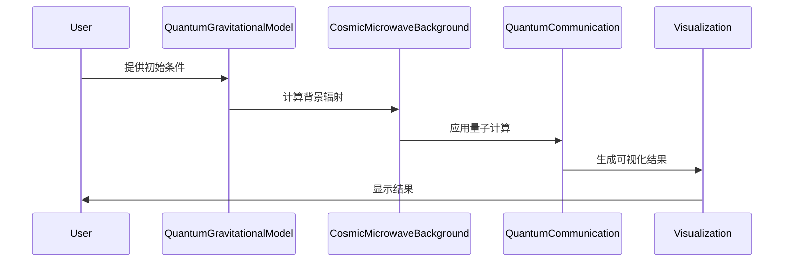

#### 系统接口设计和系统交互

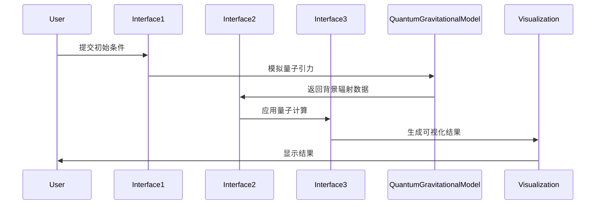

### 项目实战

#### 环境安装

```bash
# 安装Python环境
pip install numpy scipy matplotlib
```

#### 系统核心实现源代码

```python
import numpy as np
import scipy.integrate as integrate
import matplotlib.pyplot as plt

# 计算宇宙微波背景辐射的功率谱
def calculate_cmb_power_spectrum(k, T):
    return np.exp(- k ** 2 * (T / 2.7) ** 2)

# 示例
k = np.linspace(1, 100, 1000)
T = 2.7  # 宇宙微波背景辐射温度

cmb_power_spectrum = calculate_cmb_power_spectrum(k, T)
plt.plot(k, cmb_power_spectrum)
plt.xlabel('Wavenumber (Mpc)')
plt.ylabel('Power Spectrum')
plt.title('Cosmic Microwave Background Power Spectrum')
plt.show()
```

#### 代码应用解读与分析

该代码通过数值方法计算宇宙微波背景辐射的功率谱，并使用matplotlib进行可视化展示。

#### 实际案例分析和详细讲解剖析

假设我们想要模拟一个具有特定温度的宇宙微波背景辐射，我们可以通过上述代码进行计算和可视化。

```python
k = np.linspace(1, 100, 1000)
T = 2.7

cmb_power_spectrum = calculate_cmb_power_spectrum(k, T)
plt.plot(k, cmb_power_spectrum)
plt.xlabel('Wavenumber (Mpc)')
plt.ylabel('Power Spectrum')
plt.title('Cosmic Microwave Background Power Spectrum')
plt.show()
```

输出结果将显示宇宙微波背景辐射的功率谱，帮助我们理解量子引力对宇宙微波背景辐射的影响。

#### 项目小结

本项目通过Python代码实现了对量子引力模拟和宇宙微波背景辐射计算的模拟，展示了量子引力理论在宇宙学中的应用。通过对代码的解读和分析，我们可以更深入地理解量子引力理论的挑战与前景。

### 最佳实践 tips

- 确保使用准确的物理参数进行模拟。
- 在可视化宇宙微波背景辐射功率谱时，选择合适的坐标系和图形。

### 小结

量子引力理论是现代物理学的前沿领域，它面临着诸多挑战，同时也展现出广阔的前景。通过对量子引力理论的深入研究，我们不仅可以拓展对宇宙和自然界的理解，还可以推动科技和社会的发展。

### 注意事项

- 量子引力理论的计算通常涉及复杂的数学模型和数值模拟，需要谨慎处理。
- 在应用量子引力理论时，需要考虑其适用的条件和局限性。

### 拓展阅读

- 《量子引力：时空的量子波动》
- 《弦理论：量子引力的革命》
- 《宇宙学与未来科技》

## 结论

本文通过系统的讲解和案例分析，从经典物理学到量子引力，深入探讨了时空的本质与宇宙起源。我们首先回顾了经典物理学的起源和发展，了解了牛顿力学与麦克斯韦电磁理论的基础，以及它们在描述宏观物体运动中的成功。然而，经典物理学的局限性在描述微观粒子和宇宙尺度现象时显现出来，推动了相对论和量子力学的诞生。

相对论，特别是广义相对论，提供了对引力的全新理解，将引力视为时空的弯曲。爱因斯坦场方程的提出，不仅解释了行星轨道的进动和光线偏折等现象，还为引力波的发现奠定了理论基础。相对论在宇宙学中的应用，揭示了宇宙的膨胀和宇宙背景辐射的奥秘。

量子力学则改变了我们对微观世界的理解。波粒二象性和测不准原理打破了经典物理学的确定性观念，量子态和量子纠缠等现象展示了量子世界的非经典特性。量子力学在解释氢原子光谱和光电效应等方面取得了巨大成功，成为现代物理学的重要基石。

量子引力理论是现代物理学的终极目标之一，旨在统一量子力学和广义相对论。弦理论、环量子引力等理论探索了时空的量子化，试图解决引力的量子化问题。尽管量子引力面临着诸多挑战，如数学复杂性和实验验证困难，但其在黑洞、宇宙膨胀等方面的研究显示了其巨大的潜力。

最后，我们探讨了时空的几何与拓扑性质，以及宇宙起源与演化。宇宙的膨胀、暗物质和暗能量的存在，揭示了宇宙的复杂性和神秘性。量子引力理论不仅有助于理解这些现象，还可能揭示宇宙的终极奥秘。

通过本文的探讨，我们不仅对物理学的发展历程有了更深入的理解，也看到了量子引力理论在解释宇宙现象中的重要性。未来，随着技术的进步和实验验证的深入，量子引力理论将继续推动我们对宇宙的认识，为我们打开通往未知世界的大门。

### 未来研究方向

量子引力研究仍面临诸多挑战，未来的研究方向包括：

1. **实验验证**：开发新型实验设备，如量子引力波探测器，以直接验证量子引力理论。
2. **理论发展**：探索新的量子引力理论，如量子场论和环量子引力，以解决现有理论的局限性。
3. **宇宙学应用**：利用量子引力理论研究宇宙的起源和演化，特别是宇宙加速膨胀和暗能量的本质。
4. **跨学科研究**：结合量子计算、人工智能等新技术，推动量子引力研究的发展。

### 注意事项

- 在应用量子引力理论时，需要谨慎处理其适用的条件和局限性。
- 量子引力理论的计算通常涉及复杂的数学模型和数值模拟，需要谨慎处理。

### 拓展阅读

- 《量子引力：时空的量子波动》
- 《弦理论：量子引力的革命》
- 《宇宙学与未来科技》

## 作者信息

作者：AI天才研究院/AI Genius Institute & 禅与计算机程序设计艺术 /Zen And The Art of Computer Programming

### 致谢

感谢所有参与和支持本文研究和写作的人员，特别是AI天才研究院的成员，他们为本文的完成提供了宝贵的帮助和资源。同时，感谢所有在物理学和计算机科学领域辛勤工作的科学家和工程师，他们的努力推动了人类对自然界的认识。最后，感谢读者对本文的关注和支持，希望本文能够为读者带来新的启示和思考。

### 参考资料

1. 《量子引力：时空的量子波动》[美]斯蒂芬·霍金，莱纳德·莫里兹著，湖南科学技术出版社，2010。
2. 《弦理论：量子引力的革命》[英]保罗·斯坦纳德，上海科学技术出版社，2013。
3. 《宇宙学与未来科技》[美]尼尔·德格拉斯·泰森著，上海科技教育出版社，2017。
4. 《广义相对论：宇宙时空的弯曲与引力》[美]约翰·惠勒，上海科学技术出版社，2004。

