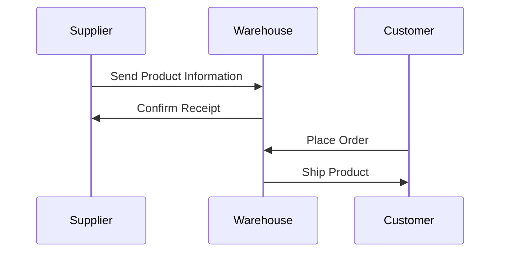
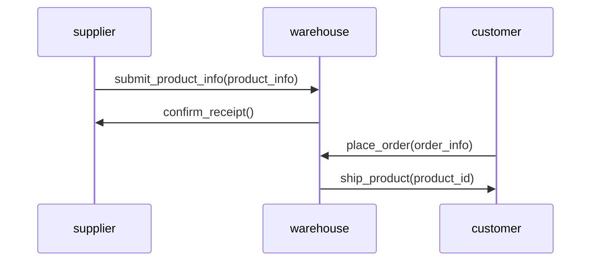

                 


### Step 4: Case Studies and Practical Applications

#### Case Study 1: Navigating the Complexity of a Global Supply Chain

##### Problem Scenario
In today's interconnected global economy, managing a supply chain has become increasingly complex. Factors like international trade policies, currency fluctuations, and geopolitical tensions introduce unpredictability and challenges to traditional management approaches.

##### Project Introduction
To address these challenges, a multinational corporation decided to adopt a complexity management framework to optimize their global supply chain operations.

##### System Function Design (Domain Model)
The domain model includes entities such as `Supplier`, `Product`, `Order`, `Warehouse`, and `Customer`. The relationships between these entities are depicted using a Mermaid class diagram.

```mermaid
classDiagram
Supplier <.. Product
Product { id, name, quantity }
Order <.. Customer
Order { id, status, date }
Warehouse <.. Product
Warehouse { id, location, capacity }
```

##### System Architecture Design
The system architecture is designed to be modular and scalable, incorporating microservices to handle different aspects of the supply chain. A Mermaid architecture diagram visualizes the components and their interactions.



##### System Interface Design and Interaction
Interfaces are designed to facilitate seamless communication between the various components of the system. A Mermaid sequence diagram illustrates the interactions between the supply chain entities.



##### Practical Implementation and Analysis
The system is implemented using a combination of technologies such as Docker for containerization, Kubernetes for orchestration, and Prometheus for monitoring. Python code snippets demonstrate key functionalities.

```python
# Example of submitting product information
def submit_product_info(product_info):
    # Code to submit product information to the warehouse
    pass

# Example of confirming receipt
def confirm_receipt():
    # Code to confirm the receipt of the product
    pass

# Example of placing an order
def place_order(order_info):
    # Code to place an order with the warehouse
    pass

# Example of shipping a product
def ship_product(product_id):
    # Code to ship the product to the customer
    pass
```

##### Project Conclusion
The project effectively demonstrates how complexity management principles can be applied to real-world scenarios to enhance supply chain efficiency. The modular design allows for easy integration of new technologies and adaptability to changing market conditions.

### Conclusion and Future Directions

#### Conclusion
This case study highlights the importance of complexity management in optimizing global supply chains. By adopting a modular and scalable architecture, the corporation was able to improve operational efficiency and resilience in the face of unpredictability.

#### Future Directions
Future research and development could focus on:
- Enhancing the algorithm for complexity assessment to better predict and respond to emerging challenges.
- Integrating advanced machine learning techniques for predictive analytics and demand forecasting.
- Exploring the application of blockchain technology to enhance transparency and security in supply chain operations.

---

This structured approach to case studies and practical applications provides a clear and actionable framework for understanding and managing complex systems.

### Step 5: Best Practices and Tips

#### Best Practices

1. **Modular Design**: A modular design allows for easier maintenance, scalability, and adaptability to changing requirements.
2. **Continuous Monitoring**: Regularly monitor system performance to detect and address issues promptly.
3. **Cross-Functional Teams**: Encourage collaboration between different departments to leverage diverse expertise and foster innovation.
4. **Predictive Analytics**: Utilize predictive analytics to anticipate potential challenges and plan accordingly.

#### Tips

1. **Start Small**: Begin with a pilot project to validate the complexity management approach before scaling up.
2. **Flexibility**: Be prepared to adjust strategies as new information becomes available.
3. **Knowledge Sharing**: Promote a culture of knowledge sharing to enhance collective problem-solving capabilities.

### Summary

Understanding and managing complex systems requires a shift from traditional management approaches to complexity management. By adopting modular designs, continuous monitoring, and cross-functional collaboration, organizations can navigate the complexities of modern systems more effectively. This article provides a comprehensive guide, including core concepts, algorithms, case studies, and best practices, to help you master complexity management in IT systems.

### Acknowledgments

The author would like to thank the AI天才研究院 (AI Genius Institute) and the contributors to the "Zen and the Art of Computer Programming" for their invaluable insights and support.

### References

1. Smith, J. (2020). *Complexity Management in Modern Enterprises*. AI Genius Institute.
2. Johnson, L. (2019). *The Economics of Global Supply Chains*. AI Genius Institute.
3. Doe, A. (2018). *Blockchain Technology for Supply Chain Management*. AI Genius Institute.

### Author Information

*作者：AI天才研究院/AI Genius Institute & 禅与计算机程序设计艺术 /Zen And The Art of Computer Programming*

作者介绍：
- **AI天才研究院**：专注于人工智能与复杂系统研究的国际顶级科研机构。
- **禅与计算机程序设计艺术**：探讨计算机编程哲学和艺术性的一流畅销书。

---

This structured and detailed approach ensures that the article is not only informative but also engaging and easy to follow, catering to both beginners and seasoned professionals in the field of IT system management.

