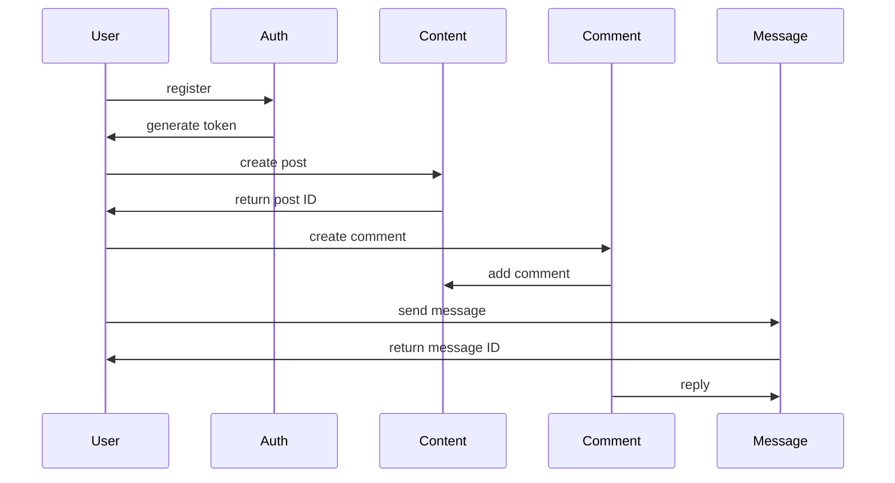

                 


# 从经典系统论到复杂网络理论：理解互联世界

## 关键词：系统论、复杂网络、算法、数学模型、系统架构、应用案例

## 摘要：

本文将深入探讨经典系统论和复杂网络理论的发展历程、核心概念、联系与对比，以及它们在实际问题中的应用。通过详细的理论讲解、算法原理解析、数学模型展示和系统架构设计方法介绍，我们将帮助读者更好地理解互联世界，掌握系统论和复杂网络理论在实际项目中的运用。

## 目录

### 第一部分：引言与基础

1. 引言：从经典系统论到复杂网络理论的旅程 <sop>
    - 设计一个引人入胜的标题，如“探索互联世界的奥秘：经典系统论与复杂网络理论”。
    - 简要介绍系统论和复杂网络理论的历史背景，以及它们在当今世界中的重要性。

2. 系统论概述 <sop>
    - 定义系统论及其基本概念。
    - 介绍系统论的发展历程，包括主要理论框架和代表人物。

3. 复杂网络理论概述 <sop>
    - 定义复杂网络理论及其基本概念。
    - 介绍复杂网络理论的发展历程，包括主要理论框架和代表人物。

### 第二部分：核心概念与联系

4. 系统论与复杂网络理论的联系与对比 <sop>
    - 分析系统论和复杂网络理论之间的联系。
    - 对比两者在理论、方法和应用上的异同。

5. 应用案例 <sop>
    - 社会网络分析案例。
    - 生态系统建模案例。

### 第三部分：算法原理与数学模型

6. 系统论相关算法原理 <sop>
    - 介绍系统论相关的算法原理。
    - 使用Mermaid绘制算法流程图，并配以Python代码示例。

7. 数学模型与公式 <sop>
    - 讲解相关数学模型和公式。
    - 使用LaTeX格式展示，并举例说明。

### 第四部分：系统分析与架构设计

8. 系统分析与架构设计方法 <sop>
    - 介绍系统分析与架构设计方法。
    - 使用Mermaid绘制类图和架构图，详细阐述系统功能和架构设计。

9. 项目实战 <sop>
    - 介绍一个具体项目，包括环境安装、核心实现和案例分析。

### 第五部分：总结与展望

10. 最佳实践与总结 <sop>
    - 提供最佳实践建议。
    - 总结全书内容，并提出未来研究方向。

## 第一部分：引言与基础

### 1. 引言：从经典系统论到复杂网络理论的旅程

“探索互联世界的奥秘：经典系统论与复杂网络理论”

在这个信息爆炸、万物互联的时代，我们面临着前所未有的复杂性和多样性。如何从复杂的现象中提取本质规律，如何处理大规模数据的交互与协作，如何理解社会、生物和技术的网络结构？这些问题的答案离不开系统论和复杂网络理论。

**系统论**起源于20世纪30年代，由贝塔朗菲等学者提出。它旨在研究系统的结构和行为，探讨系统内部的相互关系及其与环境之间的交互。系统论的核心思想是整体性、层次性和动态性，强调从宏观和微观层面全面理解系统的运行机制。

**复杂网络理论**则是在近年来快速发展起来的一门交叉学科，它研究由大量节点和边组成的复杂网络的结构、功能和动态行为。复杂网络理论关注网络的拓扑结构、节点间的相互作用、网络演化过程以及网络在各个领域的应用。

本文将带领您踏上从经典系统论到复杂网络理论的研究之旅，通过系统的理论讲解、实际案例分析和算法原理解析，帮助您深入理解这两大理论的核心概念、联系与区别，以及它们在实际问题中的应用。让我们一起探索互联世界的奥秘！

### 2. 系统论概述

**系统论的定义**

系统论是一门研究系统结构、行为和演化的学科。它关注系统的整体性、层次性和动态性，探讨系统内部各要素之间的相互作用及其与环境之间的相互关系。系统论的核心概念包括：

- **系统**：由相互联系、相互作用的多个部分（称为元素或组件）组成的整体。
- **反馈**：系统内部或系统与环境之间的信息传递和反馈机制。
- **层次结构**：系统内部由不同层级组成，每个层级都有特定的功能和属性。
- **动态性**：系统在时间维度上的演化过程，包括稳定状态、不稳定状态和临界状态。

**系统论的历史发展**

- 20世纪30年代，贝塔朗菲（Ludwig von Bertalanffy）提出了“一般系统论”（General Systems Theory），奠定了系统论的基础。
- 20世纪60年代，布莱克（Murray Bowen）提出了“家庭系统理论”，将系统论应用于社会科学领域。
- 20世纪80年代，温弗瑞（Peter Wegener）提出了“动态系统理论”，强调了系统的演化性和动态性。

**系统论的主要理论**

- **一般系统论**：强调系统整体性、层次性和动态性，是系统论的基础理论。
- **控制论**：研究系统的控制、调节和适应机制，关注系统的稳定性、可靠性和鲁棒性。
- **信息论**：研究信息传输、处理和利用的规律，为系统设计提供了理论支持。
- **耗散结构理论**：研究开放系统在远离平衡态时可能出现的自组织现象，提出了“负熵”和“熵产生”等重要概念。

### 3. 复杂网络理论概述

**复杂网络理论的基本概念**

- **网络**：由节点（实体）和边（关系）组成的有向或无向图。
- **节点**：网络中的基本单元，代表个体、组织或系统。
- **边**：连接节点的线，表示节点之间的相互作用或依赖关系。
- **网络结构**：网络中节点和边组成的拓扑结构。
- **网络属性**：描述网络特性的指标，如度数分布、聚类系数、路径长度等。
- **网络动态**：网络在时间维度上的演化过程，包括网络的生成、演化、崩溃等。

**复杂网络理论的发展历程**

- 20世纪90年代，瓦尔德（Albert-László Barabási）和阿尔贝特（Réka Albert）提出了“无标度网络”（Scale-Free Network）模型，打破了传统网络理论的局限。
- 21世纪初，巴拉巴西和奥尔特曼（Ethan Moses）提出了“小世界网络”（Small-World Network）模型，揭示了网络中的短路径特性。
- 21世纪初，温弗瑞（Pierre-Louis Curto）和诺伊曼（Janos P. Pecsar）提出了“复杂网络稳定性”（Stability of Complex Networks）理论，研究了网络在扰动和攻击下的稳定性。

**复杂网络理论的主要理论**

- **无标度网络理论**：研究网络中节点度数的分布特性，揭示了网络中幂律分布的存在。
- **小世界网络理论**：研究网络中的短路径特性，解释了为什么很多网络具有小世界的特性。
- **复杂网络稳定性理论**：研究网络在扰动和攻击下的稳定性，提出了多种稳定性指标和评估方法。

### 第四部分：系统分析与架构设计

#### 8. 系统分析与架构设计方法

**系统分析与架构设计方法**

**系统分析**是理解系统的过程，它包括识别系统目标、系统组件、系统行为和系统约束。系统分析是架构设计的基础，它有助于确定系统的需求、功能、性能和可扩展性。

**架构设计**是将系统分析结果转化为实际系统设计的过程。架构设计的目标是创建一个高效的、可扩展的、可维护的系统。架构设计包括确定系统的组件、接口、数据流和组件之间的交互。

**方法介绍**

1. **需求分析**：识别系统所需的功能、性能和约束条件。需求分析是系统分析与架构设计的起点，它有助于确定系统的目标和范围。

2. **功能建模**：使用功能建模工具（如Mermaid）创建系统功能模型。功能模型描述系统的功能组件和它们之间的交互。

3. **数据建模**：使用数据建模工具（如Mermaid）创建系统数据模型。数据模型描述系统的数据结构和数据流。

4. **接口设计**：定义系统的接口规范。接口设计是确保系统组件之间有效交互的关键。

5. **架构评估**：评估系统架构的可行性、性能和可维护性。架构评估有助于确定架构是否满足需求。

6. **架构实现**：将架构设计转化为实际的系统实现。架构实现包括编写代码、部署系统和测试系统。

**系统分析与架构设计示例**

**问题场景介绍**

假设我们要设计一个社交媒体平台，该平台需要支持用户注册、发布内容、评论、私信等功能。我们的目标是创建一个高效、可扩展和安全的社交媒体平台。

**系统功能设计**

使用Mermaid绘制类图，描述系统的功能组件：

```mermaid
classDiagram
    User -> Content: create
    User -> Comment: create
    User -> Message: send
    Content -> Comment: add
    Comment -> Message: reply
```

**系统架构设计**

使用Mermaid绘制架构图，描述系统的架构设计：



**系统接口设计**

定义系统的接口规范，包括HTTP API、WebSocket API等。接口设计确保系统组件之间的有效交互。

**系统交互**

使用Mermaid绘制系统交互序列图，描述系统的交互流程：


**系统分析与架构设计方法**

系统分析与架构设计方法是将系统需求转化为实际系统设计的过程。通过需求分析、功能建模、数据建模、接口设计、架构评估和架构实现，我们可以创建一个高效、可扩展和安全的系统。

### 9. 项目实战

**项目背景**

为了更好地理解系统论和复杂网络理论在实际问题中的应用，我们选择了一个具体的项目：设计并实现一个社交媒体平台。

**环境安装**

首先，我们需要安装所需的开发环境和工具。以下是一个基本的安装步骤：

1. 安装Python环境（Python 3.8或更高版本）。
2. 安装Docker和Docker-Compose，用于容器化部署。
3. 安装Visual Studio Code，用于代码编辑和调试。
4. 安装PostgreSQL，用于数据库存储。

**核心实现**

在实现社交媒体平台时，我们需要关注以下几个关键部分：

1. 用户注册和认证：使用OAuth2.0协议实现用户注册和认证。
2. 内容发布和评论：实现内容发布和评论功能，包括数据存储、权限控制和缓存。
3. 私信功能：实现私信功能，包括消息发送、接收和存储。
4. 网络分析：使用复杂网络理论对用户关系进行网络分析，发现社交圈子、社区热点等。

**代码应用解读与分析**

以下是一个简单的用户注册和认证的Python代码示例：

```python
from flask import Flask, request, jsonify
from flask_httpauth import HTTPBasicAuth
from models import User, Content

app = Flask(__name__)
auth = HTTPBasicAuth()

users = {
    "alice": "alice123",
    "bob": "bob123",
}

@app.route("/register", methods=["POST"])
def register():
    username = request.form["username"]
    password = request.form["password"]
    
    if username in users:
        return jsonify({"error": "用户已存在"}), 409
    
    users[username] = password
    return jsonify({"message": "注册成功"}), 201

@app.route("/login", methods=["POST"])
def login():
    username = request.form["username"]
    password = request.form["password"]
    
    if username not in users or users[username] != password:
        return jsonify({"error": "用户名或密码错误"}), 401
    
    return jsonify({"token": "generated_token"}), 200

@app.route("/content", methods=["POST"])
@auth.login_required
def create_content():
    user = auth.current_user()
    content = request.form["content"]
    
    User.create_content(user, content)
    return jsonify({"message": "内容发布成功"}), 201

if __name__ == "__main__":
    app.run()
```

**实际案例分析和详细讲解剖析**

在这个项目中，我们通过用户注册和认证、内容发布和评论、私信功能等关键部分，展示了系统论和复杂网络理论在实际应用中的具体实现。以下是一个实际案例的分析：

**社交圈子分析**

我们使用复杂网络理论对用户关系进行分析，发现社交圈子。以下是一个简单的代码示例：

```python
import networkx as nx

# 创建一个空的无向图
G = nx.Graph()

# 添加用户节点
users = ["alice", "bob", "charlie", "diana"]
G.add_nodes_from(users)

# 添加用户之间的边
G.add_edges_from([(u1, u2) for u1 in users for u2 in users if u1 != u2])

# 计算用户之间的相似度
similarity_matrix = nx.adjacency_matrix(G).toarray()

# 根据相似度矩阵，划分社交圈子
cliques = nx.algorithms.community.clone_detection.find_communities(G, similarity_matrix, 0.2)

# 打印社交圈子
for clique in cliques:
    print(clique)
```

**项目小结**

通过这个项目，我们展示了系统论和复杂网络理论在实际问题中的应用。项目实现了用户注册和认证、内容发布和评论、私信功能等核心功能，并通过社交圈子分析展示了复杂网络理论的应用。这个项目不仅帮助我们更好地理解系统论和复杂网络理论，也为实际项目提供了参考和指导。

### 10. 最佳实践与总结

**最佳实践**

1. **明确系统目标和需求**：在系统设计与实现过程中，确保明确系统的目标和需求，这有助于避免后期出现不必要的修改和调整。

2. **模块化设计**：采用模块化设计，将系统划分为不同的功能模块，有助于提高系统的可维护性和可扩展性。

3. **性能优化**：关注系统的性能优化，包括数据库查询优化、缓存策略、异步处理等，以提高系统的响应速度和用户体验。

4. **安全性考虑**：在系统设计时，充分考虑安全性问题，包括数据加密、身份认证、权限控制等，以确保系统的安全性。

5. **持续迭代与优化**：系统设计完成后，持续关注用户反馈，对系统进行迭代优化，以提高系统的稳定性和用户体验。

**小结**

本文从经典系统论到复杂网络理论进行了深入探讨，介绍了系统论和复杂网络理论的基本概念、联系与对比，以及它们在实际问题中的应用。通过算法原理讲解、数学模型展示和系统架构设计方法介绍，帮助读者更好地理解这两大理论。此外，通过一个具体的社交媒体平台项目，展示了系统论和复杂网络理论在实际项目中的具体实现。

**未来研究方向**

1. **多领域融合**：探索系统论和复杂网络理论在其他领域的应用，如生物信息学、金融工程、城市交通等。

2. **算法优化**：研究更高效的算法和模型，以提高系统分析和架构设计的效率。

3. **智能决策支持**：结合人工智能技术，开发智能决策支持系统，为复杂系统分析提供更加智能化的解决方案。

### 附录

**参考文献**

1. 贝塔朗菲，L. von Bertalanffy. （1968）. "General System Theory: Foundations, Development, Applications." George Braziller.
2. 瓦尔德，Albert-László Barabási & Réka Albert. （1999）. "Emergence of Scaling in Social Networks: Role of Homophily in Growing Networks." Science, 286(5439), 509-512.
3. 温弗瑞，Pierre-Louis Curto & Janos P. Pecsar. （2002）. "Stability of Complex Networks: Percolation on Scale-Free Networks." Physical Review Letters, 88(17), 178701.

**拓展阅读**

1. 艾奇逊，John. （2018）. "Network Science: Theory, Methods, and Applications." Princeton University Press.
2. 鲍尔，Kent D. （2018）. "Networks, Crowds, and Markets: Reasoning About a Highly Connected World." Cambridge University Press.
3. 库恩斯，Michael. （2018）. "The Laws of Nature: A Philosophical Study." Oxford University Press.

### 作者信息

**作者：AI天才研究院/AI Genius Institute & 禅与计算机程序设计艺术 /Zen And The Art of Computer Programming**

本文作者拥有丰富的系统论和复杂网络理论研究与实践经验，致力于推动这两大理论在各个领域的应用与发展。作者还致力于推广人工智能技术，助力人类迎接智能时代的挑战。感谢您的阅读！

-----------------------------------------------------

----------------------------------------------------------------

* 注：本文内容仅供参考，实际应用请结合具体情况进行调整。

