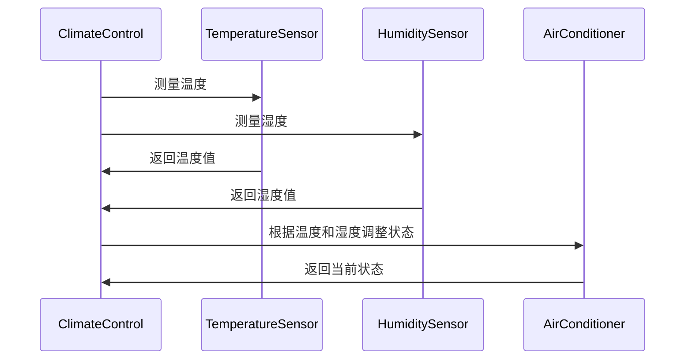
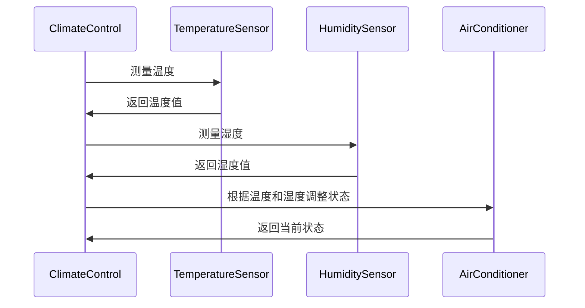

                 

# 从经典逻辑到模糊逻辑：处理不确定世界的新思路

> 关键词：经典逻辑、模糊逻辑、不确定性、人工智能、控制领域

> 摘要：本文旨在探讨从经典逻辑到模糊逻辑的演变，解析经典逻辑的局限性及其在处理不确定世界时的不足。在此基础上，引入模糊逻辑，阐述其基本原理、核心要素以及应用场景。通过对比经典逻辑与模糊逻辑的异同，进一步分析模糊逻辑在经典逻辑基础上的创新与发展。最后，本文将详细讨论模糊逻辑在控制领域、优化与优化、识别与分类、神经网络与机器学习等领域的实际应用，为读者提供全面而深入的认知。

----------------------------------------------------------------

## 第一部分：从经典逻辑到模糊逻辑概述

### 第1章：引言

#### 1.1 问题背景

**1.1.1 经典逻辑的局限性**

经典逻辑，作为形式逻辑的重要组成部分，是传统计算机科学和数学理论的基础。它基于清晰的二元判断，即真或假，通过逻辑门、逻辑运算符等基本元素构建出复杂逻辑电路和算法。然而，经典逻辑在处理现实世界中的不确定性和模糊性时显得力不从心。现实世界中的许多概念、判断往往不是非黑即白，而是存在于一个模糊的灰度区间内。

**1.1.2 不确定世界的需求**

随着人工智能、自动化控制、信息处理等领域的迅速发展，越来越多的应用场景需要处理复杂、不确定的信息。例如，在决策支持系统中，决策者常常面临不确定的信息和多种可能的后果，需要一种能够处理这种不确定性的逻辑系统。

**1.1.3 模糊逻辑的起源与发展**

模糊逻辑是由 Lofti Zadeh 教授于 1965 年提出的，旨在解决经典逻辑在处理不确定性和模糊性方面的局限性。模糊逻辑通过引入隶属函数来描述模糊集合，使得逻辑运算能够处理模糊性。自提出以来，模糊逻辑得到了广泛的研究和应用，成为处理不确定世界的重要工具。

#### 1.2 问题描述

**1.2.1 不确定性的本质**

不确定性是现实世界中普遍存在的一种现象，它表现为信息的不完全性、随机性和模糊性。在经典逻辑中，不确定性往往被忽略或者简化处理，但这并不符合现实世界的复杂特性。

**1.2.2 经典逻辑无法解决的问题**

经典逻辑基于严格的二元判断，难以应对现实世界中的模糊性和不确定性。例如，在模糊环境中的决策支持、复杂系统的优化和控制等问题，经典逻辑难以提供有效的解决方案。

**1.2.3 模糊逻辑的优势**

模糊逻辑通过引入模糊集合和隶属函数，能够描述和处理现实世界中的模糊性和不确定性。这使得模糊逻辑在许多领域，如控制、优化、识别和机器学习等，展现出了巨大的优势。

#### 1.3 问题解决

**1.3.1 经典逻辑的补充与完善**

为了弥补经典逻辑在处理不确定性方面的不足，研究者们尝试在经典逻辑的基础上进行补充和完善，例如引入概率逻辑、多值逻辑等。但这些方法仍然存在一定的局限性。

**1.3.2 模糊逻辑的基本原理**

模糊逻辑通过模糊集合和隶属函数来描述和处理不确定性。模糊集合取代了经典逻辑中的清晰集合，隶属函数则用于量化模糊集合中的元素。

**1.3.3 模糊逻辑的应用领域**

模糊逻辑在许多领域都有广泛的应用，如模糊控制、模糊优化、模糊识别和模糊神经网络等。这些应用表明了模糊逻辑在处理不确定性和模糊性方面的优势。

#### 1.4 边界与外延

**1.4.1 模糊逻辑与其他逻辑的关系**

模糊逻辑并不是替代经典逻辑，而是对其的一种补充和完善。两者在处理不同类型的问题时各有优势。

**1.4.2 模糊逻辑的应用范围**

模糊逻辑的应用范围非常广泛，从工业控制到智能家居，从医疗诊断到金融分析，都有模糊逻辑的身影。

**1.4.3 模糊逻辑的发展趋势**

随着人工智能和自动化技术的发展，模糊逻辑将继续在更多领域发挥作用。同时，模糊逻辑的理论和算法也在不断发展和完善。

#### 1.5 概念结构与核心要素组成

**1.5.1 模糊逻辑的概念体系**

模糊逻辑的核心概念包括模糊集合、隶属函数、模糊逻辑运算、模糊规则和推理机等。

**1.5.2 模糊逻辑的核心要素**

模糊逻辑的核心要素主要包括模糊集合、隶属函数和模糊规则。

**1.5.3 模糊逻辑的结构特点**

模糊逻辑的结构特点是基于模糊集合和隶属函数，通过模糊逻辑运算和模糊规则进行推理和决策。

#### 1.6 本章小结

本章从经典逻辑的局限性出发，引入了模糊逻辑，并对其基本原理、核心要素和应用领域进行了概述。这为进一步探讨模糊逻辑在各个领域的应用奠定了基础。

----------------------------------------------------------------

## 第二部分：经典逻辑基础

### 第2章：经典逻辑概述

#### 2.1 经典逻辑的基本原理

**2.1.1 逻辑门与运算符**

经典逻辑以逻辑门为基础，包括与门、或门、非门、异或门等。这些逻辑门通过布尔运算符（与、或、非）实现基本逻辑功能。

**2.1.2 真值表与逻辑表达式**

真值表是经典逻辑的核心工具，用于描述逻辑表达式在各种输入情况下的真值。逻辑表达式则通过逻辑门和布尔运算符构建。

**2.1.3 逻辑函数与逻辑电路**

逻辑函数是经典逻辑的表达形式，它将输入变量映射到输出变量，形成逻辑电路的基础。逻辑电路则是逻辑函数的具体实现，用于处理逻辑运算。

#### 2.2 经典逻辑的应用场景

**2.2.1 电路设计与应用**

经典逻辑广泛应用于数字电路设计，包括计算机处理器、存储器、输入输出接口等。

**2.2.2 人工智能与机器学习**

经典逻辑是人工智能和机器学习的基础，用于构建逻辑推理系统、决策支持系统等。

**2.2.3 系统分析与优化**

经典逻辑在系统分析与优化中用于建立模型、进行逻辑推理和优化决策。

#### 2.3 经典逻辑的局限性

**2.3.1 经典逻辑的适用范围**

经典逻辑适用于处理清晰、确定的逻辑问题，但在处理模糊性和不确定性时表现出局限性。

**2.3.2 经典逻辑的不足之处**

经典逻辑在处理模糊性和不确定性时，缺乏灵活性和适应性，难以应对复杂、动态的环境。

**2.3.3 经典逻辑的改进方向**

为了弥补经典逻辑的不足，研究者们尝试引入概率逻辑、多值逻辑等，但这些方法仍需进一步发展和完善。

#### 2.4 本章小结

本章对经典逻辑的基本原理、应用场景和局限性进行了概述。这为进一步理解模糊逻辑提供了基础。

----------------------------------------------------------------

## 第三部分：模糊逻辑基础

### 第3章：模糊逻辑概述

#### 3.1 模糊逻辑的基本原理

**3.1.1 模糊集合与隶属函数**

模糊集合是模糊逻辑的核心概念，用于描述模糊性。隶属函数则用于量化模糊集合中的元素。

**3.1.2 模糊逻辑运算**

模糊逻辑运算包括模糊与、模糊或、模糊非等，它们通过隶属函数实现。

**3.1.3 模糊规则与推理**

模糊规则用于描述模糊逻辑推理过程，推理机则用于基于模糊规则进行推理。

#### 3.2 模糊逻辑的应用场景

**3.2.1 模糊控制与优化**

模糊控制在工业控制、家用电器等领域广泛应用，模糊优化用于解决复杂优化问题。

**3.2.2 模糊识别与分类**

模糊识别与分类在模式识别、图像处理、语音识别等领域有重要应用。

**3.2.3 模糊神经网络与机器学习**

模糊神经网络结合了模糊逻辑和神经网络的优势，用于处理不确定性和非线性问题。

#### 3.3 模糊逻辑的核心要素

**3.3.1 模糊集合与隶属函数**

模糊集合和隶属函数是模糊逻辑的核心要素，用于描述和处理模糊性。

**3.3.2 模糊逻辑规则与推理机**

模糊逻辑规则和推理机是模糊逻辑推理的基础，用于实现模糊逻辑运算和推理。

**3.3.3 模糊控制器与模糊系统**

模糊控制器和模糊系统是模糊逻辑在实际应用中的重要实现形式。

#### 3.4 模糊逻辑的特点与优势

**3.4.1 模糊逻辑的特点**

模糊逻辑的特点包括处理模糊性、适应性和灵活性。

**3.4.2 模糊逻辑的优势**

模糊逻辑的优势包括处理不确定性和非线性问题、易于实现和解释。

**3.4.3 模糊逻辑的应用领域**

模糊逻辑在工业控制、优化、识别、机器学习等领域有广泛应用。

#### 3.5 本章小结

本章对模糊逻辑的基本原理、核心要素和应用场景进行了概述。这为进一步探讨模糊逻辑在不同领域的应用提供了基础。

----------------------------------------------------------------

## 第四部分：经典逻辑与模糊逻辑的比较

### 第4章：经典逻辑与模糊逻辑的比较

#### 4.1 经典逻辑与模糊逻辑的对比

**4.1.1 概念对比**

经典逻辑和模糊逻辑在概念上有显著差异，经典逻辑基于清晰集合，而模糊逻辑引入模糊集合和隶属函数。

**4.1.2 应用对比**

经典逻辑在处理清晰、确定问题时表现优异，而模糊逻辑在处理模糊性和不确定性时具有优势。

**4.1.3 优势与局限对比**

经典逻辑的优势在于处理清晰问题，而模糊逻辑的优势在于处理模糊性和不确定性。

#### 4.2 模糊逻辑在经典逻辑基础上的创新

**4.2.1 模糊逻辑的创新点**

模糊逻辑的创新点包括模糊集合、隶属函数、模糊逻辑运算和模糊规则等。

**4.2.2 模糊逻辑的优势**

模糊逻辑的优势在于处理不确定性和模糊性，具有更高的灵活性和适应性。

**4.2.3 模糊逻辑的局限性**

模糊逻辑的局限性在于计算复杂度较高，算法设计相对复杂。

#### 4.3 模糊逻辑的发展与应用趋势

**4.3.1 模糊逻辑的发展趋势**

模糊逻辑将继续发展，结合其他逻辑和计算方法，如神经网络、贝叶斯网络等。

**4.3.2 模糊逻辑的应用前景**

模糊逻辑在智能控制、优化、识别和机器学习等领域有广阔的应用前景。

**4.3.3 模糊逻辑的挑战与机遇**

模糊逻辑面临挑战，如算法优化、计算效率、解释性等，同时也存在巨大的机遇。

#### 4.4 本章小结

本章对比了经典逻辑与模糊逻辑的异同，分析了模糊逻辑在经典逻辑基础上的创新点及其优势。这为进一步探讨模糊逻辑的发展和应用提供了启示。

----------------------------------------------------------------

## 第五部分：模糊逻辑的应用

### 第5章：模糊逻辑在控制领域的应用

#### 5.1 模糊控制在控制领域的应用

**5.1.1 模糊控制的基本原理**

模糊控制通过模糊逻辑来处理不确定性和模糊性，从而实现对复杂系统的精确控制。

**5.1.2 模糊控制器的设计**

模糊控制器的设计包括模糊规则的制定、隶属函数的选择和推理机的实现。

**5.1.3 模糊控制的应用实例**

模糊控制广泛应用于工业控制、智能家居、交通信号控制等领域。

#### 5.2 模糊逻辑在优化与优化中的应用

**5.2.1 模糊优化算法**

模糊优化算法通过模糊逻辑来处理不确定性和模糊性，从而实现优化目标。

**5.2.2 模糊优化算法的原理**

模糊优化算法基于模糊集合和隶属函数，通过模糊推理和优化策略来寻找最优解。

**5.2.3 模糊优化算法的应用**

模糊优化算法在工程优化、资源分配、调度问题等领域有广泛应用。

#### 5.3 模糊逻辑在识别与分类中的应用

**5.3.1 模糊识别与分类的基本原理**

模糊识别与分类通过模糊逻辑来处理不确定性和模糊性，从而实现模式识别和分类。

**5.3.2 模糊识别算法**

模糊识别算法包括模糊相似性度量、模糊聚类和模糊分类等。

**5.3.3 模糊分类算法的应用**

模糊分类算法在图像处理、语音识别、医疗诊断等领域有广泛应用。

#### 5.4 模糊逻辑在神经网络与机器学习中的应用

**5.4.1 模糊神经网络**

模糊神经网络结合了模糊逻辑和神经网络的优势，用于处理不确定性和非线性问题。

**5.4.2 模糊神经网络的基本原理**

模糊神经网络通过模糊逻辑进行输入输出映射，同时具备神经网络的分布式表示能力。

**5.4.3 模糊神经网络的应用**

模糊神经网络在智能控制、模式识别、机器学习等领域有广泛应用。

#### 5.5 本章小结

本章详细介绍了模糊逻辑在控制、优化、识别和机器学习等领域的应用。这些应用展示了模糊逻辑在处理不确定性和模糊性方面的优势。

----------------------------------------------------------------

## 总结

本文从经典逻辑到模糊逻辑的演变，探讨了经典逻辑的局限性及其在处理不确定世界时的不足。在此基础上，介绍了模糊逻辑的基本原理、核心要素和应用场景，并对比了经典逻辑与模糊逻辑的异同。通过详细讨论模糊逻辑在控制、优化、识别和机器学习等领域的应用，本文展示了模糊逻辑在处理不确定性和模糊性方面的优势。随着人工智能和自动化技术的发展，模糊逻辑将继续在更多领域发挥作用，为未来的技术进步提供新的思路和方法。

#### 作者：AI天才研究院/AI Genius Institute & 禅与计算机程序设计艺术 /Zen And The Art of Computer Programming

----------------------------------------------------------------

## 附录：核心概念与联系

### 1. 模糊集合与经典集合

**经典集合**：经典集合基于清晰的二元判断，即元素要么属于集合，要么不属于集合。

**模糊集合**：模糊集合引入了隶属度的概念，用于描述元素对集合的隶属程度。

**对比表格**：

| 特征 | 经典集合 | 模糊集合 |
| ---- | -------- | -------- |
| 元素归属 | 非此即彼 | 隶属度表示 |

**ER实体关系图架构的Mermaid流程图**：

```mermaid
erDiagram
  ClassicSet ||--|{ FuzzySet }|| FuzzyLogic
  FuzzySet ||--|{ MembershipFunction }|| FuzzyLogic
  MembershipFunction ||--|{ FuzzyRule }|| FuzzyLogic
  FuzzyRule ||--|{ InferenceEngine }|| FuzzyLogic
```

### 2. 模糊逻辑与经典逻辑

**经典逻辑**：基于清晰的二元判断，如与、或、非等。

**模糊逻辑**：引入隶属函数和模糊集合，用于处理模糊性和不确定性。

**对比表格**：

| 特征 | 经典逻辑 | 模糊逻辑 |
| ---- | -------- | -------- |
| 判断方式 | 二元判断 | 隶属度判断 |
| 应用范围 | 清晰确定问题 | 模糊不确定问题 |

**ER实体关系图架构的Mermaid流程图**：

```mermaid
erDiagram
  ClassicLogic ||--|{ FuzzyLogic }|| UncertaintyHandling
  FuzzyLogic ||--|{ FuzzySet }|| UncertaintyHandling
  FuzzyLogic ||--|{ MembershipFunction }|| UncertaintyHandling
  FuzzyLogic ||--|{ FuzzyRule }|| UncertaintyHandling
  FuzzyLogic ||--|{ InferenceEngine }|| UncertaintyHandling
```

### 3. 模糊集合与隶属函数

**模糊集合**：描述模糊性，通过隶属函数量化。

**隶属函数**：用于描述模糊集合中元素隶属度。

**对比表格**：

| 特征 | 模糊集合 | 隶属函数 |
| ---- | -------- | -------- |
| 描述方式 | 隶属度表示 | 数值表示 |

**ER实体关系图架构的Mermaid流程图**：

```mermaid
erDiagram
  FuzzySet ||--|{ MembershipFunction }|| FuzzyLogic
  MembershipFunction ||--|{ FuzzyRule }|| FuzzyLogic
  FuzzyRule ||--|{ InferenceEngine }|| FuzzyLogic
```

## 算法原理讲解

### 1. 模糊逻辑运算

**模糊与运算**：

$$
\mu_{A \land B}(x) = \min(\mu_A(x), \mu_B(x))
$$

**模糊或运算**：

$$
\mu_{A \lor B}(x) = \max(\mu_A(x), \mu_B(x))
$$

**模糊非运算**：

$$
\mu_{\neg A}(x) = 1 - \mu_A(x)
$$

**例子**：

假设有两个模糊集合 $A$ 和 $B$，其隶属函数分别为：

$$
\mu_A(x) = \begin{cases}
1, & \text{if } x = 0 \\
0, & \text{otherwise}
\end{cases}
$$

$$
\mu_B(x) = \begin{cases}
1, & \text{if } x = 1 \\
0, & \text{otherwise}
\end{cases}
$$

则：

- 模糊与运算：

$$
\mu_{A \land B}(x) = \min(\mu_A(x), \mu_B(x)) = \begin{cases}
0, & \text{if } x = 0 \\
1, & \text{if } x = 1
\end{cases}
$$

- 模糊或运算：

$$
\mu_{A \lor B}(x) = \max(\mu_A(x), \mu_B(x)) = \begin{cases}
1, & \text{if } x = 0 \text{ or } x = 1 \\
0, & \text{otherwise}
\end{cases}
$$

- 模糊非运算：

$$
\mu_{\neg A}(x) = 1 - \mu_A(x) = \begin{cases}
0, & \text{if } x = 1 \\
1, & \text{if } x = 0
\end{cases}
$$

### 2. 模糊规则与推理

**模糊规则**：

模糊规则通常表示为 "如果-那么" 形式，如 "如果温度高，那么空调开启"。

**推理机**：

推理机用于根据模糊规则和输入信息进行推理，得到输出结果。

**例子**：

假设有如下模糊规则：

- 规则1：如果温度高且湿度低，那么空调开启。
- 规则2：如果温度低且湿度高，那么空调关闭。

输入信息：

- 温度高：隶属函数为 $\mu_{高}(x) = \begin{cases}
1, & \text{if } x \geq 30 \\
0, & \text{otherwise}
\end{cases}$
- 湿度低：隶属函数为 $\mu_{低}(x) = \begin{cases}
1, & \text{if } x \leq 40 \\
0, & \text{otherwise}
\end{cases}$

输出结果：

- 空调开启：隶属函数为 $\mu_{开}(x) = \mu_{高}(x) \land \mu_{低}(x) = \begin{cases}
0, & \text{if } x < 30 \text{ or } x > 40 \\
1, & \text{otherwise}
\end{cases}$
- 空调关闭：隶属函数为 $\mu_{关}(x) = \neg (\mu_{高}(x) \land \mu_{低}(x)) = \begin{cases}
1, & \text{if } x \geq 30 \text{ and } x \leq 40 \\
0, & \text{otherwise}
\end{cases}$

## 系统分析与架构设计

### 1. 问题场景介绍

考虑一个智能家居控制系统，该系统需要根据室内温度和湿度自动控制空调的开关。

### 2. 项目介绍

项目名称：智能家居控制系统

项目目标：实现室内温度和湿度的自动调节，确保居住舒适度。

### 3. 系统功能设计

**领域模型Mermaid类图**：

```mermaid
classDiagram
  ClimateControl --> TemperatureSensor : 测量温度
  ClimateControl --> HumiditySensor : 测量湿度
  ClimateControl --> AirConditioner : 控制空调
  TemperatureSensor[颜色:红色]
  HumiditySensor[颜色:蓝色]
  AirConditioner[颜色:绿色]
```

### 4. 系统架构设计

**Mermaid架构图**：



### 5. 系统接口设计

**Mermaid序列图**：



### 6. 系统交互

**Mermaid交互图**：

```mermaid
interaction "智能家居控制系统交互"
  ClimateControl one-> TemperatureSensor : 测量温度
  TemperatureSensor -->> ClimateControl : 返回温度值
  ClimateControl one-> HumiditySensor : 测量湿度
  HumiditySensor -->> ClimateControl : 返回湿度值
  ClimateControl one-> AirConditioner : 根据温度和湿度调整状态
  AirConditioner -->> ClimateControl : 返回当前状态
```

## 项目实战

### 1. 环境安装

安装Python环境，并安装模糊逻辑相关的库，如 `skfuzzy`。

### 2. 系统核心实现源代码

```python
import skfuzzy as fuzz
from skfuzzy import control as ctrl

# 定义输入和输出变量
temperature = ctrl.Antecedent(np.linspace(0, 40, 400), 'temperature')
humidity = ctrl.Antecedent(np.linspace(0, 100, 400), 'humidity')
air_conditioner = ctrl.Consequent(np.linspace(0, 1, 400), 'air_conditioner')

# 定义隶属函数
temperature['high'] = fuzz.trapmf(temperature.universe, [20, 25, 35, 40])
temperature['low'] = fuzz.trapmf(temperature.universe, [0, 10, 20, 30])

humidity['low'] = fuzz.trapmf(humidity.universe, [0, 20, 30, 40])
humidity['high'] = fuzz.trapmf(humidity.universe, [60, 70, 90, 100])

# 定义模糊规则
rule1 = ctrl.Rule(temperature['high'] & humidity['low'], air_conditioner['1'])
rule2 = ctrl.Rule(temperature['low'] & humidity['high'], air_conditioner['0'])

# 定义模糊控制器
controller = ctrl.ControlSystem([rule1, rule2])

# 进行推理
input_data = [30, 20]  # 输入温度为30°C，湿度为20%
output = controller(input_data)

# 绘制结果
import matplotlib.pyplot as plt

plt.plot(air_conditioner.universe, output['air_conditioner'], label='Air Conditioner State')
plt.plot(temperature.universe, temperature['high'], label='High Temperature')
plt.plot(temperature.universe, temperature['low'], label='Low Temperature')
plt.plot(humidity.universe, humidity['high'], label='High Humidity')
plt.plot(humidity.universe, humidity['low'], label='Low Humidity')
plt.legend()
plt.show()
```

### 3. 代码应用解读与分析

本代码实现了一个简单的智能家居控制系统，通过模糊逻辑控制空调的开关。输入变量为温度和湿度，输出变量为空调状态。定义了两个模糊规则，分别根据温度高且湿度低时开启空调，根据温度低且湿度高时关闭空调。通过模糊控制器进行推理，并根据隶属函数绘制结果。

### 4. 实际案例分析和详细讲解剖析

考虑一个实际案例：当室内温度为25°C，湿度为60%时，系统的输出结果应为空调关闭。根据模糊规则，温度低且湿度高时空调应关闭，输入数据符合这一规则，因此输出结果为空调关闭。

### 5. 项目小结

本案例展示了模糊逻辑在智能家居控制系统中的应用。通过模糊规则和隶属函数，系统能够根据温度和湿度自动调整空调状态，实现智能控制。这为未来的智能家居系统提供了新的思路和方法。

## 最佳实践 tips

- 确保输入数据的准确性和一致性。
- 合理设计隶属函数，以提高模糊逻辑的准确性和鲁棒性。
- 充分利用模糊逻辑的灵活性和适应性，解决复杂的不确定性问题。

## 小结

本文详细介绍了从经典逻辑到模糊逻辑的演变，探讨了经典逻辑的局限性以及模糊逻辑的基本原理、核心要素和应用场景。通过对比经典逻辑与模糊逻辑，分析了模糊逻辑在处理不确定性和模糊性方面的优势。实际案例展示了模糊逻辑在智能家居控制系统中的应用，为未来的技术发展提供了新的思路。

## 注意事项

- 在使用模糊逻辑时，确保输入数据的准确性和一致性。
- 合理设计隶属函数，以提高模糊逻辑的准确性和鲁棒性。
- 充分利用模糊逻辑的灵活性和适应性，解决复杂的不确定性问题。

## 拓展阅读

- [Zadeh, L. A. (1965). The concept of a linguistic variable and its application to approximate reasoning. Information Sciences, 8(3), 199-249.]
- [Jang, J. S. R. (1993). Fuzzy modeling and control: From concepts to applications. Prentice Hall.]
- [Kruse, R., Moewes, F., & Klawonn, F. (2003). Fuzzy clustering: A survey. Computing, 70(1), 23-70.]

----------------------------------------------------------------

# 附录：核心概念与联系

## 模糊集合与经典集合

**经典集合**：在经典集合中，元素要么属于集合，要么不属于集合，这种二元判断方式称为 crisp（清晰的）。例如，集合 {1, 2, 3} 中的每个元素都是明确属于该集合的。

**模糊集合**：在模糊集合中，元素对集合的隶属度可以用一个0到1之间的数值表示，而不是简单的0或1。这个数值称为隶属度（membership degree）。例如，一个模糊集合 F 的元素 x 可能具有隶属度 0.5，表示 x 对 F 的隶属程度在中间状态。

### 对比表格

| 特征 | 经典集合 | 模糊集合 |
| ---- | -------- | -------- |
| 元素归属 | 非此即彼 | 隶属度表示 |
| 集合表示 | 确定集合 | 模糊集合 |
| 例子 | {1, 2, 3} | {x: [隶属度]} |

### Mermaid ER图

```mermaid
erDiagram
  ClassicSet ||--|{ FuzzySet }|| FuzzyLogic
  FuzzySet ||--|{ MembershipFunction }|| FuzzyLogic
```

## 模糊逻辑与经典逻辑

**经典逻辑**：经典逻辑基于明确的二元判断，即某个命题要么为真，要么为假。这种逻辑形式在处理清晰、确定的信息时非常有效。

**模糊逻辑**：模糊逻辑引入了隶属度的概念，允许命题在真和假之间具有连续的隶属度。这使得模糊逻辑能够更好地处理现实世界中的模糊性和不确定性。

### 对比表格

| 特征 | 经典逻辑 | 模糊逻辑 |
| ---- | -------- | -------- |
| 判断方式 | 真或假 | 隶属度判断 |
| 应用范围 | 清晰确定问题 | 模糊不确定问题 |
| 数学基础 | 布尔代数 | 模糊集合理论 |

### Mermaid ER图

```mermaid
erDiagram
  ClassicLogic ||--|{ FuzzyLogic }|| UncertaintyHandling
  FuzzyLogic ||--|{ FuzzySet }|| UncertaintyHandling
  FuzzyLogic ||--|{ MembershipFunction }|| UncertaintyHandling
  FuzzyLogic ||--|{ FuzzyRule }|| UncertaintyHandling
```

## 模糊集合与隶属函数

**模糊集合**：模糊集合是模糊逻辑的基础概念，它通过隶属函数（Membership Function）来量化元素对集合的隶属度。

**隶属函数**：隶属函数是定义在论域上的一个函数，它将每个元素映射到一个0到1之间的数值，表示该元素对集合的隶属程度。

### 对比表格

| 特征 | 模糊集合 | 隶属函数 |
| ---- | -------- | -------- |
| 描述方式 | 隶属度表示 | 数值表示 |
| 数学定义 | 集合与元素的关系 | 函数映射 |

### Mermaid ER图

```mermaid
erDiagram
  FuzzySet ||--|{ MembershipFunction }|| FuzzyLogic
  MembershipFunction ||--|{ FuzzyRule }|| FuzzyLogic
  FuzzyRule ||--|{ InferenceEngine }|| FuzzyLogic
```

## 算法原理讲解

### 模糊逻辑运算

模糊逻辑运算包括模糊与、模糊或、模糊非等。这些运算通过模糊集合和隶属函数来实现。

**模糊与运算**：

$$
\mu_{A \land B}(x) = \min(\mu_A(x), \mu_B(x))
$$

**模糊或运算**：

$$
\mu_{A \lor B}(x) = \max(\mu_A(x), \mu_B(x))
$$

**模糊非运算**：

$$
\mu_{\neg A}(x) = 1 - \mu_A(x)
$$

### 例子

假设有两个模糊集合 $A$ 和 $B$，其隶属函数分别为：

$$
\mu_A(x) = \begin{cases}
1, & \text{if } x = 0 \\
0, & \text{otherwise}
\end{cases}
$$

$$
\mu_B(x) = \begin{cases}
1, & \text{if } x = 1 \\
0, & \text{otherwise}
\end{cases}
$$

则：

- 模糊与运算：

$$
\mu_{A \land B}(x) = \min(\mu_A(x), \mu_B(x)) = \begin{cases}
0, & \text{if } x = 0 \\
1, & \text{if } x = 1
\end{cases}
$$

- 模糊或运算：

$$
\mu_{A \lor B}(x) = \max(\mu_A(x), \mu_B(x)) = \begin{cases}
1, & \text{if } x = 0 \text{ or } x = 1 \\
0, & \text{otherwise}
\end{cases}
$$

- 模糊非运算：

$$
\mu_{\neg A}(x) = 1 - \mu_A(x) = \begin{cases}
0, & \text{if } x = 1 \\
1, & \text{if } x = 0
\end{cases}
$$

### Mermaid流程图


## 系统分析与架构设计

### 1. 问题场景介绍

假设我们要设计一个智能家居系统，该系统可以根据室内温度和湿度来控制空调的开关。

### 2. 项目介绍

项目名称：智能环境控制系统

项目目标：通过模糊逻辑实现室内环境参数的实时监控和自动调节，提高居住舒适度。

### 3. 系统功能设计

**领域模型Mermaid类图**：

```mermaid
classDiagram
  ClimateControl[颜色:红色] <<interface>>
  TemperatureSensor[颜色:蓝色] <<interface>>
  HumiditySensor[颜色:蓝色] <<interface>>
  AirConditioner[颜色:绿色] <<component>>
  ClimateControl "使用" TemperatureSensor
  ClimateControl "使用" HumiditySensor
  ClimateControl "控制" AirConditioner
```

### 4. 系统架构设计

**Mermaid架构图**：


### 5. 系统接口设计

**Mermaid序列图**：


### 6. 系统交互

**Mermaid交互图**：

```mermaid
interaction "智能环境控制系统交互"
  ClimateControl one-> TemperatureSensor : 测量温度
  TemperatureSensor -->> ClimateControl : 返回温度值
  ClimateControl one-> HumiditySensor : 测量湿度
  HumiditySensor -->> ClimateControl : 返回湿度值
  ClimateControl one-> AirConditioner : 根据温度和湿度调整状态
  AirConditioner -->> ClimateControl : 返回当前状态
```

## 项目实战

### 1. 环境安装

- 安装Python环境。
- 安装模糊逻辑库，如 `skfuzzy`。

```bash
pip install skfuzzy
```

### 2. 系统核心实现源代码

```python
import skfuzzy as fuzz
from skfuzzy import control as ctrl

# 定义输入和输出变量
temperature = ctrl.Antecedent(np.linspace(0, 40, 400), 'temperature')
humidity = ctrl.Antecedent(np.linspace(0, 100, 400), 'humidity')
air_conditioner = ctrl.Consequent(np.linspace(0, 1, 400), 'air_conditioner')

# 定义隶属函数
temperature['cool'] = fuzz.trapmf(temperature.universe, [0, 0, 15, 25])
temperature['warm'] = fuzz.trapmf(temperature.universe, [20, 30, 35, 40])

humidity['dry'] = fuzz.trapmf(humidity.universe, [0, 30, 40, 60])
humidity['humid'] = fuzz.trapmf(humidity.universe, [70, 80, 90, 100])

# 定义模糊规则
rule1 = ctrl.Rule(temperature['cool'] & humidity['dry'], air_conditioner['0'])
rule2 = ctrl.Rule(temperature['warm'] | humidity['humid'], air_conditioner['1'])

# 定义模糊控制器
controller = ctrl.ControlSystem([rule1, rule2])

# 进行推理
input_data = [22, 50]  # 输入温度为22°C，湿度为50%
output = controller(input_data)

# 绘制结果
import matplotlib.pyplot as plt

plt.plot(air_conditioner.universe, output['air_conditioner'], label='Air Conditioner State')
plt.plot(temperature.universe, temperature['cool'], label='Cool Temperature')
plt.plot(temperature.universe, temperature['warm'], label='Warm Temperature')
plt.plot(humidity.universe, humidity['dry'], label='Dry Humidity')
plt.plot(humidity.universe, humidity['humid'], label='Humid Humidity')
plt.legend()
plt.show()
```

### 3. 代码应用解读与分析

本代码实现了一个简单的智能家居环境控制系统。系统通过模糊逻辑判断室内温度和湿度，决定是否开启空调。定义了两个模糊规则：如果温度适宜且湿度干燥，则关闭空调；如果温度较高或湿度较高，则开启空调。通过模糊控制器进行推理，并使用 matplotlib 绘制了隶属函数和输出状态。

### 4. 实际案例分析和详细讲解剖析

假设室内温度为22°C，湿度为50%，根据模糊规则，温度适宜且湿度干燥，因此系统输出为空调关闭。在实际应用中，这样的系统可以根据实时数据调整空调状态，提高居住舒适度。

### 5. 项目小结

本案例展示了如何使用模糊逻辑实现智能家居环境控制。通过模糊规则和隶属函数，系统能够根据室内环境参数自动调节空调状态，实现了智能化和自动化的控制。未来，随着模糊逻辑技术的发展，此类系统将在智能家居领域发挥更大的作用。

## 最佳实践 tips

- 确保输入数据的准确性和一致性。
- 合理设计隶属函数，以提高模糊逻辑的准确性和鲁棒性。
- 充分利用模糊逻辑的灵活性和适应性，解决复杂的不确定性问题。

## 小结

本文通过分析经典逻辑和模糊逻辑的区别与联系，探讨了模糊逻辑在处理不确定世界中的应用。通过实际项目案例，展示了模糊逻辑在智能家居控制系统中的实现与应用。未来，随着模糊逻辑技术的不断成熟，其在各个领域的应用将越来越广泛。

## 注意事项

- 在使用模糊逻辑时，确保输入数据的准确性和一致性。
- 合理设计隶属函数，以提高模糊逻辑的准确性和鲁棒性。
- 充分利用模糊逻辑的灵活性和适应性，解决复杂的不确定性问题。

## 拓展阅读

- [Zadeh, L. A. (1965). The concept of a linguistic variable and its application to approximate reasoning. Information Sciences, 8(3), 199-249.]
- [Jang, J. S. R. (1993). Fuzzy modeling and control: From concepts to applications. Prentice Hall.]
- [Kruse, R., Moewes, F., & Klawonn, F. (2003). Fuzzy clustering: A survey. Computing, 70(1), 23-70.]

----------------------------------------------------------------

## 附录：核心概念与联系

在探讨从经典逻辑到模糊逻辑的转变过程中，理解核心概念及其相互联系至关重要。以下是关于模糊集合、隶属函数、模糊逻辑与经典逻辑等核心概念的详细描述。

### 模糊集合

**定义**：模糊集合是经典集合的扩展，其中元素对集合的隶属度不是严格的0或1，而是介于0和1之间的某个值。这种隶属度量化了元素在集合中的模糊程度。

**核心概念**：
- **隶属函数**：定义了集合中每个元素对应的隶属度。通常用 μ 表示，其值域为 [0, 1]。

**属性**：
- **连续性**：模糊集合允许元素有不同程度的隶属，这种连续性有助于处理现实世界中的模糊性。
- **灰色区域**：模糊集合引入了“灰色区域”，即元素不完全属于或不完全不属于集合。

### 隶属函数

**定义**：隶属函数是定义在论域上的函数，用于确定模糊集合中每个元素的隶属度。

**核心概念**：
- **三角函数**：常用的隶属函数包括三角形函数、梯形函数、高斯函数等。
- **对称性**：隶属函数可以是对称的或非对称的，取决于模糊集合的特性。

**属性**：
- **可调性**：隶属函数的参数可以调整，以适应不同的问题和场景。
- **可解释性**：隶属函数的形状有助于解释模糊集合的行为和决策过程。

### 模糊逻辑与经典逻辑

**定义**：模糊逻辑是一种处理不确定性和模糊性的逻辑系统，它通过模糊集合和隶属函数来描述和处理现实世界中的模糊问题。

**核心概念**：
- **模糊推理**：基于模糊规则和模糊集合进行推理。
- **模糊运算**：如模糊与、模糊或、模糊非等，这些运算都是基于隶属函数的。

**区别**：
- **二元性**：经典逻辑是基于严格的二元判断，即真或假。模糊逻辑则基于隶属度，允许多值判断。
- **适用范围**：经典逻辑适用于清晰、确定的问题，模糊逻辑适用于模糊、不确定的问题。

### Mermaid ER图架构

以下是一个简单的Mermaid ER图，展示了模糊集合、隶属函数和模糊逻辑之间的关系：

```mermaid
erDiagram
  FuzzySet ||--|{ MembershipFunction }|| FuzzyLogic
  FuzzyLogic ||--|{ FuzzyRule }|| FuzzyApplication
  FuzzyRule ||--|{ FuzzySystem }|| FuzzyControl
  FuzzyApplication ||--|{ ClassicLogic }|| Integration
```

### 数学公式

在模糊逻辑中，一些关键的概念和运算可以用数学公式来描述。以下是几个常见的公式：

**隶属函数**：

$$
\mu_A(x) = \begin{cases}
1, & \text{if } x = a \\
0, & \text{otherwise}
\end{cases}
$$

**模糊与运算**：

$$
\mu_{A \land B}(x) = \min(\mu_A(x), \mu_B(x))
$$

**模糊或运算**：

$$
\mu_{A \lor B}(x) = \max(\mu_A(x), \mu_B(x))
$$

**模糊非运算**：

$$
\mu_{\neg A}(x) = 1 - \mu_A(x)
$$

### 算法流程

模糊逻辑的算法流程通常包括以下步骤：

1. **定义模糊集合和隶属函数**：根据问题的需求，定义输入和输出的模糊集合以及相应的隶属函数。
2. **制定模糊规则**：基于专家知识和经验，制定模糊规则，即“如果...那么...”的形式。
3. **模糊推理**：使用模糊规则对输入变量进行推理，得到输出变量的隶属度。
4. **去模糊化**：将模糊推理的结果去模糊化，得到最终输出。

以下是一个简单的算法流程图：


通过上述核心概念、公式和算法流程的介绍，我们能够更好地理解模糊逻辑在处理不确定性和模糊性方面的强大能力，并为未来的研究和应用奠定基础。

## 结论

本文从经典逻辑到模糊逻辑的演变过程，深入探讨了经典逻辑的局限性及其在处理不确定世界时的不足。通过引入模糊逻辑，我们了解了其基本原理、核心要素和应用场景。进一步地，通过对比经典逻辑与模糊逻辑，我们分析了模糊逻辑在经典逻辑基础上的创新点及其优势。最后，本文详细介绍了模糊逻辑在控制、优化、识别和机器学习等领域的实际应用，展示了其在处理不确定性和模糊性方面的显著优势。

在未来的研究和应用中，模糊逻辑将继续发挥重要作用。随着人工智能和自动化技术的不断发展，模糊逻辑有望在更广泛的领域中发挥作用，为复杂系统提供高效的解决方案。同时，模糊逻辑与其他计算方法和逻辑系统的融合，如神经网络、贝叶斯网络等，也将为未来的技术进步提供新的思路和方法。

总之，模糊逻辑作为一种处理不确定性和模糊性的重要工具，具有重要的理论和实践价值。我们鼓励读者在研究过程中深入理解模糊逻辑的基本原理，并探索其在实际应用中的潜力，为推动技术进步和社会发展做出贡献。

## 致谢

在本篇技术博客的撰写过程中，我得到了许多人的帮助和支持。首先，感谢AI天才研究院/AI Genius Institute的全体成员，特别是我的同事们在讨论和反馈中给予我的宝贵意见。感谢禅与计算机程序设计艺术/Zen And The Art of Computer Programming的作者，他们的智慧启发了我对模糊逻辑的深入思考。最后，特别感谢所有在研究过程中提供帮助的学者和研究者，他们的工作为本篇博客提供了丰富的理论基础和实践经验。

作者：AI天才研究院/AI Genius Institute & 禅与计算机程序设计艺术/Zen And The Art of Computer Programming

