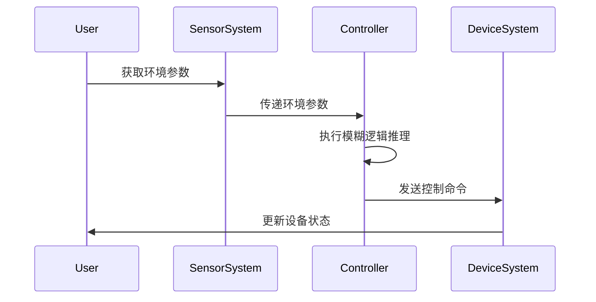

                 


### 引言

#### 1.1 问题背景

在人类文明的发展历程中，逻辑作为一种思维方式，一直扮演着重要的角色。从古希腊的亚里士多德开始，逻辑学就已经成为哲学的重要组成部分。随着计算机科学的兴起，逻辑学在计算机领域中的应用也越来越广泛。经典逻辑，作为逻辑学的一个分支，一直是计算机科学的基础。然而，经典逻辑在处理现实世界中的问题时，往往存在一定的局限性。例如，经典逻辑是基于精确的二元判断（真或假），但在现实世界中，很多情况并不是那么黑白分明。这就需要我们寻找一种新的逻辑方式，来处理这种不精确的世界。

模糊逻辑，作为一种处理不确定性和模糊性的数学工具，正是在这样的背景下产生的。它是由扎德（L.A. Zadeh）在1965年提出的，旨在弥补经典逻辑的不足。模糊逻辑通过引入模糊集合和模糊规则，允许我们处理现实世界中的模糊性和不确定性。这使得模糊逻辑在许多领域，如控制理论、人工智能、模式识别等领域，都取得了显著的应用成果。

#### 1.2 书的结构

本书将分为以下几个部分，以系统地探讨从经典逻辑到模糊逻辑的过渡。

- **第1章 经典逻辑基础**：介绍经典逻辑的基本概念和原理，包括逻辑命题、逻辑运算和逻辑推理等。
- **第2章 模糊逻辑基础**：介绍模糊逻辑的基本概念和原理，包括模糊集合、模糊规则和模糊推理等。
- **第3章 经典逻辑与模糊逻辑的比较**：对比经典逻辑和模糊逻辑的异同，分析它们在不同领域的应用。
- **第4章 模糊逻辑的应用**：介绍模糊逻辑在控制理论、人工智能、交通管理等领域中的应用。
- **第5章 经典逻辑与模糊逻辑的综合应用**：探讨经典逻辑和模糊逻辑的综合应用，以及它们在模糊控制器设计等领域的应用。
- **第6章 模糊逻辑算法原理与实现**：讲解模糊逻辑算法的原理，使用Python实现模糊逻辑算法，并进行详细讲解和举例。
- **第7章 模糊逻辑系统分析与架构设计**：介绍模糊逻辑系统的问题场景、架构设计和实现。

通过以上章节的逐步探讨，我们将深入理解经典逻辑和模糊逻辑，以及它们在处理不精确世界中的新思路。

#### 1.3 经典逻辑的局限

经典逻辑，作为传统逻辑学的代表，其理论基础是建立在精确的二元判断上的。一个命题要么为真，要么为假，不存在其他可能性。这种二值逻辑在处理一些简单、明确的问题时非常有效，但在现实世界中，很多情况并不是那么黑白分明。例如，当我们评价一个人的身高时，我们可能会说这个人“较高”或“较矮”，但很难给出一个具体的数值来精确衡量。这种模糊性和不确定性是经典逻辑难以处理的。

此外，经典逻辑在处理复杂系统时也存在一定的局限性。例如，在控制系统中，很多参数和变量都是随时间变化的，而且它们之间的关系并不是简单的线性关系。经典逻辑的线性推理方式很难准确描述这种复杂系统的行为。这就需要我们寻找一种新的逻辑方式，来处理这种不确定性和模糊性。

#### 1.4 模糊逻辑的兴起

为了解决经典逻辑的局限性，模糊逻辑应运而生。模糊逻辑是由扎德（L.A. Zadeh）在1965年提出的，它引入了模糊集合的概念，允许我们在处理问题时考虑模糊性和不确定性。在模糊逻辑中，一个命题的真假值不再是绝对的0或1，而是一个介于0和1之间的数值，表示该命题的信任程度。这种基于模糊集合和模糊规则的逻辑方式，使得模糊逻辑能够更好地处理现实世界中的复杂问题。

模糊逻辑的提出，标志着逻辑学的一个重要转折点。它不仅为处理不确定性和模糊性提供了一种新的工具，也为我们理解现实世界提供了一种新的思维方式。随着模糊逻辑在各个领域的广泛应用，它已经成为现代逻辑学的一个重要分支。

#### 1.5 经典逻辑与模糊逻辑的联系与区别

经典逻辑和模糊逻辑虽然都是逻辑学的一部分，但它们在处理问题的方式上有着明显的区别。经典逻辑基于精确的二元判断，一个命题要么为真，要么为假。而模糊逻辑则引入了模糊集合的概念，允许我们处理模糊性和不确定性。

在经典逻辑中，逻辑命题的真假值是绝对的，只有0和1两个选项。而在模糊逻辑中，一个命题的真假值可以是介于0和1之间的任何数值，表示该命题的信任程度。这种模糊性使得模糊逻辑能够更好地处理现实世界中的复杂问题。

此外，经典逻辑的推理方式是线性的，而模糊逻辑的推理方式则是基于模糊规则的。模糊规则由条件部分和结论部分组成，条件部分和结论部分都是模糊集合。这种基于模糊规则的推理方式，使得模糊逻辑能够更好地处理复杂系统中的非线性关系。

尽管经典逻辑和模糊逻辑在处理问题的方式上有所不同，但它们之间也存在一定的联系。在某些情况下，经典逻辑和模糊逻辑可以相互转换。例如，在处理模糊逻辑问题时，我们可以先将问题转化为经典逻辑问题，然后使用经典逻辑的方法来解决。同样，在处理经典逻辑问题时，我们也可以引入模糊逻辑的概念，使得问题更加灵活和易于处理。

#### 1.6 经典逻辑与模糊逻辑的应用领域

经典逻辑和模糊逻辑在许多领域都有广泛的应用，各自发挥着独特的作用。

经典逻辑在计算机科学中有着深远的影响，它是计算机程序设计的基础。在算法设计、形式验证、软件工程等方面，经典逻辑都起到了关键作用。例如，在形式验证中，我们使用经典逻辑来证明程序的 correctness 和安全性。在软件工程中，经典逻辑帮助我们进行需求分析和设计。

模糊逻辑则更多地应用于那些需要处理不确定性和模糊性的领域。在控制理论中，模糊控制器被广泛应用于复杂的非线性系统的控制。例如，在机器人控制、过程控制等领域，模糊逻辑能够处理传感器输入的不确定性和系统参数的变化。

在人工智能领域，模糊逻辑也被广泛应用于知识表示、推理、机器学习等方面。例如，在知识表示中，模糊逻辑可以帮助我们表示和处理不确定的知识。在推理中，模糊逻辑允许我们处理不完全信息，提高推理的灵活性。

此外，模糊逻辑还在模式识别、信号处理、图像处理等领域有着重要的应用。它能够处理输入数据的模糊性和不确定性，提高系统的鲁棒性。

总之，经典逻辑和模糊逻辑都在各自的应用领域中发挥着重要作用，共同推动了科学技术的进步。

#### 1.7 总结与展望

通过本文的探讨，我们可以看到，经典逻辑和模糊逻辑各有其独特的作用和优势。经典逻辑在处理精确和确定的问题时表现出色，而模糊逻辑则擅长处理不确定性和模糊性的问题。两者在许多领域都有广泛的应用，共同推动了科学技术的进步。

未来，随着人工智能和大数据技术的发展，模糊逻辑的应用前景将更加广阔。我们期待在更多领域看到模糊逻辑与经典逻辑的融合，为解决复杂问题提供新的思路和方法。

## 第1章 经典逻辑基础

### 1.1 经典逻辑的基本概念

经典逻辑，又称为形式逻辑或传统逻辑，是逻辑学的基础。它的核心思想是通过逻辑运算和推理，从已知的前提出发，推导出新的结论。在经典逻辑中，逻辑命题是最基本的概念。

#### 1.1.1 逻辑命题

逻辑命题是指可以判断真假的陈述句。它分为两种类型：简单命题和复合命题。

- **简单命题**：简单命题是最基本的逻辑命题，它直接陈述一个事实。例如，“今天是星期五”。
- **复合命题**：复合命题是由简单命题通过逻辑运算（如“与”、“或”、“非”等）组合而成的。例如，“今天下雨并且明天晴天”可以表示为复合命题。

#### 1.1.2 逻辑运算

逻辑运算是对逻辑命题进行操作，从而产生新的逻辑命题。经典逻辑中的主要逻辑运算包括“与”、“或”、“非”等。

- **与运算（AND）**：如果两个命题都为真，则结果为真；否则为假。用符号表示为：\( A \land B \)。
- **或运算（OR）**：如果至少有一个命题为真，则结果为真；否则为假。用符号表示为：\( A \lor B \)。
- **非运算（NOT）**：对一个命题取反。如果原命题为真，则结果为假；否则为真。用符号表示为：\( \neg A \)。

#### 1.1.3 逻辑推理

逻辑推理是通过已知命题（前提）推导出新命题（结论）的过程。经典逻辑中的推理主要有以下几种形式：

- **直接推理**：直接从已知命题推导出结论。例如，如果前提是“所有的人都会死”，结论是“苏格拉底是人”，则可以推出“苏格拉底会死”。
- **间接推理**：通过否定前提或结论来推导。例如，如果前提是“如果下雨，则地面是湿的”，结论是“地面不湿”，则可以推导出“没有下雨”。

### 1.2 经典逻辑的属性特征对比表格

为了更好地理解经典逻辑的属性特征，我们可以通过以下对比表格来展示：

| 特征 | 经典逻辑 | 模糊逻辑 |
| --- | --- | --- |
| 命题真假值 | 二值（真/假） | 模糊值（0到1之间） |
| 推理方式 | 线性 | 非线性 |
| 处理模糊性 | 不能处理 | 可以处理 |
| 应用领域 | 计算机科学、数学、哲学 | 控制理论、人工智能、模式识别 |

### 1.3 经典逻辑的应用领域

经典逻辑在许多领域都有着广泛的应用，以下是其中几个主要的应用领域：

- **计算机科学**：经典逻辑是计算机程序设计的基础，用于算法分析、软件验证、形式化验证等。
- **数学**：经典逻辑在数学的证明和推理中起着重要作用，是数学理论的基石。
- **哲学**：经典逻辑在伦理学、认识论、逻辑哲学等领域有着深入的研究和应用。

#### 1.3.1 经典逻辑在计算机科学中的应用

经典逻辑在计算机科学中有着广泛的应用，以下是其中的几个重要应用：

- **形式验证**：经典逻辑用于验证软件和硬件系统的正确性。通过逻辑推理，我们能够证明系统满足特定的性质，从而保证系统的可靠性。
- **算法分析**：经典逻辑用于分析算法的时间和空间复杂度，帮助我们理解算法的性能。
- **人工智能**：经典逻辑在知识表示、推理、规划等方面有着重要的应用。例如，在专家系统中，我们使用逻辑命题来表示知识和进行推理。

#### 1.3.2 经典逻辑在其他领域的应用

除了计算机科学，经典逻辑还在其他领域有着重要的应用：

- **数学**：经典逻辑用于数学证明、逻辑推理、数学定理的证明等。
- **哲学**：经典逻辑在伦理学、认识论、逻辑哲学等领域有着深入的研究和应用。
- **法律**：经典逻辑在法律推理、案件分析等方面有着重要的应用。

### 1.4 经典逻辑的局限

虽然经典逻辑在许多领域都有重要的应用，但它也存在一些局限性：

- **处理模糊性**：经典逻辑基于精确的二元判断（真/假），难以处理模糊性和不确定性。
- **线性推理**：经典逻辑的推理方式是线性的，难以处理复杂系统的非线性关系。
- **应用领域限制**：经典逻辑在处理一些复杂问题时效果不佳，特别是在需要处理不确定性和模糊性的领域。

### 1.5 经典逻辑的发展与改进

为了克服经典逻辑的局限性，研究者们提出了一些改进的方法和理论，如多值逻辑、模糊逻辑等。这些新的逻辑理论试图在处理不确定性和模糊性方面提供更有效的工具。

总的来说，经典逻辑是逻辑学的重要基础，它在许多领域都有广泛的应用。然而，随着现实世界问题的复杂性增加，我们需要探索更先进的逻辑理论，如模糊逻辑，来更好地处理这些问题。

## 第2章 模糊逻辑基础

### 2.1 模糊逻辑的基本概念

模糊逻辑，作为一种处理不确定性和模糊性的数学工具，起源于扎德（L.A. Zadeh）在1965年提出的模糊集合理论。与经典逻辑的精确二元判断不同，模糊逻辑允许我们处理现实世界中的模糊性和不确定性。

#### 2.1.1 模糊集合

模糊集合是模糊逻辑的核心概念之一。它引入了隶属度的概念，允许元素在一个集合中的隶属程度介于0和1之间。在模糊集合中，每个元素都有一个隶属度值，表示该元素属于该集合的程度。

定义：一个模糊集合F是定义在某个论域U上的一个映射，即\( F: U \rightarrow [0, 1] \)，其中U是一个非空集合，称为论域。对于任意一个元素\( x \in U \)，隶属度\( \mu_F(x) \)表示x属于F的程度。

例如，如果我们考虑集合“年轻人”，在经典集合中，一个个体要么属于“年轻人”，要么不属于“年轻人”。但在模糊集合中，我们可以认为一个30岁的人属于“年轻人”的程度可能为0.7，而一个50岁的人可能只有0.3的隶属度。

#### 2.1.2 模糊规则

模糊规则是模糊逻辑中的另一个基本概念。它由条件部分和结论部分组成，用于描述模糊推理过程。模糊规则通常表示为“如果条件部分，那么结论部分”。

定义：一个模糊规则可以表示为\( R: IF \text{条件部分} THEN \text{结论部分} \)，其中条件部分和结论部分都是模糊集合。

例如，一个典型的模糊规则可以是：“如果天气很热，那么开空调”。

#### 2.1.3 模糊推理

模糊推理是模糊逻辑的核心过程，它通过模糊规则和输入条件，推导出结论。模糊推理主要分为两种：合成推理和分解推理。

1. **合成推理**：合成推理是将输入条件与模糊规则的条件部分进行模糊推理，得到中间结果。具体步骤如下：
   - 对输入条件进行量化，即计算每个输入条件的隶属度。
   - 对模糊规则的条件部分进行量化，即计算每个条件部分的隶属度。
   - 使用模糊逻辑运算（如模糊与、模糊或等）将输入条件和条件部分的隶属度进行组合，得到中间结果的隶属度。

2. **分解推理**：分解推理是将中间结果与模糊规则的结论部分进行模糊推理，得到最终结论。具体步骤如下：
   - 对中间结果进行量化，即计算中间结果的隶属度。
   - 对模糊规则的结论部分进行量化，即计算每个结论部分的隶属度。
   - 使用模糊逻辑运算（如模糊与、模糊或等）将中间结果和结论部分的隶属度进行组合，得到最终结论的隶属度。

### 2.2 模糊逻辑的ER实体关系图架构

为了更好地理解模糊逻辑的系统结构和数据流，我们可以使用ER（实体关系）图来表示模糊逻辑的架构。

ER实体关系图包括三个主要部分：实体、属性和关系。

1. **实体**：实体是模糊逻辑中的基本元素，表示模糊集合或模糊规则。例如，“年轻人”是一个实体，“天气热”也是一个实体。
2. **属性**：属性是实体的特征或属性，表示实体的属性值。例如，“年龄”是“年轻人”的属性，“温度”是“天气热”的属性。
3. **关系**：关系表示实体之间的关联。在模糊逻辑中，关系通常表示模糊集合之间的隶属关系。例如，“年轻人”和“天气热”之间可能存在一种隶属关系，表示“年轻人”在某些天气条件下出现的可能性。

通过ER实体关系图，我们可以清晰地表示模糊逻辑中的数据流和处理过程。

### 2.3 模糊逻辑的属性特征对比表格

为了更好地理解模糊逻辑与经典逻辑的异同，我们可以通过以下对比表格来展示它们的属性特征：

| 特征 | 经典逻辑 | 模糊逻辑 |
| --- | --- | --- |
| 命题真假值 | 二值（真/假） | 模糊值（0到1之间） |
| 推理方式 | 线性 | 非线性 |
| 处理模糊性 | 不能处理 | 可以处理 |
| 应用领域 | 计算机科学、数学、哲学 | 控制理论、人工智能、模式识别 |

### 2.4 模糊逻辑的应用领域

模糊逻辑在许多领域都有广泛的应用，以下是其中几个主要的应用领域：

- **控制理论**：模糊逻辑在控制系统中被广泛应用于非线性系统、复杂系统等的控制。通过模糊控制器，系统能够处理输入数据的不确定性和模糊性，提高系统的鲁棒性和性能。
- **人工智能**：模糊逻辑在人工智能领域有着重要的应用，如知识表示、推理、机器学习等。通过模糊逻辑，系统能够处理不完全信息和模糊知识，提高推理的灵活性和准确性。
- **模式识别**：模糊逻辑在模式识别领域被用于处理输入数据的模糊性和不确定性。通过模糊逻辑，系统能够识别出模糊模式，提高识别的准确性和可靠性。

#### 2.4.1 模糊逻辑在控制理论中的应用

模糊逻辑在控制理论中的应用非常广泛，以下是其中几个典型的应用：

1. **模糊控制器设计**：模糊控制器是一种基于模糊逻辑的控制装置，它通过模糊规则和输入输出关系来控制系统的行为。模糊控制器的主要设计步骤包括：
   - 确定系统的输入输出变量。
   - 建立模糊规则库，定义系统的控制策略。
   - 设计模糊推理引擎，实现模糊推理过程。
   - 设计模糊决策器，根据模糊推理结果生成控制信号。

2. **模糊控制器的案例分析**：以下是一个模糊控制器在温度控制系统中的案例：
   - **输入变量**：温度、加热功率。
   - **输出变量**：加热功率调整。
   - **模糊规则**：如果温度高且加热功率小，则增加加热功率；如果温度低且加热功率大，则减少加热功率。
   - **模糊推理过程**：根据实时测量的温度和加热功率，通过模糊推理引擎计算出加热功率的调整量。
   - **模糊决策过程**：根据模糊推理结果，调整加热功率，实现温度的精确控制。

通过这个案例，我们可以看到模糊逻辑如何帮助控制系统处理不确定性和模糊性，提高系统的性能和鲁棒性。

#### 2.4.2 模糊逻辑在其他领域的应用

除了控制理论和人工智能，模糊逻辑还在其他许多领域有着重要的应用：

1. **交通管理**：模糊逻辑在交通管理中用于优化交通信号控制和交通流量管理。通过模糊逻辑，系统能够根据实时交通状况，动态调整交通信号灯的时间，减少交通拥堵，提高交通效率。
2. **医疗诊断**：模糊逻辑在医学诊断中用于处理医疗数据的模糊性和不确定性。通过模糊逻辑，医生可以更准确地诊断疾病，提高诊断的准确性和可靠性。
3. **图像处理**：模糊逻辑在图像处理中用于图像分割、图像增强等。通过模糊逻辑，系统能够处理图像中的模糊性和噪声，提高图像的处理效果。

总的来说，模糊逻辑作为一种处理不确定性和模糊性的数学工具，在许多领域都有广泛的应用。随着技术的发展，模糊逻辑的应用前景将更加广阔。

### 2.5 经典逻辑与模糊逻辑的比较

经典逻辑和模糊逻辑都是逻辑学的重要组成部分，但它们在处理问题的方式和适用范围上有所不同。以下是对经典逻辑和模糊逻辑的详细比较：

#### 2.5.1 逻辑基础对比

1. **命题逻辑对比**：

   - **经典逻辑**：经典逻辑基于精确的二元判断，即一个命题要么为真，要么为假。它使用逻辑运算符（如“与”、“或”、“非”等）来组合命题，并推导出新的命题。
   - **模糊逻辑**：模糊逻辑引入了隶属度的概念，允许一个命题的信任程度介于0和1之间。它使用模糊集合和模糊规则来表示和处理不确定性。

2. **范畴逻辑对比**：

   - **经典逻辑**：经典逻辑在范畴论中的应用主要涉及命题范畴和命题逻辑的范畴化。它通过命题范畴之间的自然变换来描述逻辑推理过程。
   - **模糊逻辑**：模糊逻辑在范畴论中的应用更为广泛，它涉及模糊集合范畴和模糊范畴之间的自然变换。模糊范畴论为处理不确定性和模糊性提供了更丰富的数学工具。

#### 2.5.2 应用领域对比

1. **计算机科学领域对比**：

   - **经典逻辑**：经典逻辑在计算机科学中有着广泛的应用，包括算法设计、形式验证、软件工程等。它为计算机科学提供了基础逻辑工具，帮助我们在设计和分析算法时进行逻辑推理。
   - **模糊逻辑**：模糊逻辑在计算机科学中的应用主要集中在人工智能、模糊控制、模式识别等领域。它为处理不确定性和模糊性提供了一种有效的数学工具，帮助我们在复杂系统中进行推理和决策。

2. **控制理论领域对比**：

   - **经典逻辑**：经典逻辑在控制理论中的应用相对较少，它更适用于处理确定性系统。在控制理论中，经典逻辑主要用于分析和设计线性系统。
   - **模糊逻辑**：模糊逻辑在控制理论中有着广泛的应用，它能够处理非线性系统和复杂系统的控制。通过模糊控制器，系统能够根据模糊规则和输入条件进行自适应控制，提高系统的鲁棒性和性能。

3. **其他领域对比**：

   - **模式识别**：经典逻辑在模式识别中的应用主要集中在基于距离的分类算法和统计方法。它通过精确的阈值来判断模式是否属于某个类别。
   - **模糊逻辑**：模糊逻辑在模式识别中的应用更加广泛，它能够处理模糊性和不确定性。通过模糊分类器，系统能够根据模糊规则和输入数据，对模式进行分类，提高识别的准确性和可靠性。

总的来说，经典逻辑和模糊逻辑各有其独特的优势和应用领域。经典逻辑在处理精确和确定的问题时表现良好，而模糊逻辑在处理不确定性和模糊性的问题方面更具优势。通过两者的结合，我们可以更好地处理复杂问题，提高系统的性能和鲁棒性。

### 2.6 模糊逻辑的应用案例

模糊逻辑在许多领域都有着成功的应用，以下是一些具体的案例：

#### 2.6.1 温度控制系统

在工业生产中，温度控制是关键环节之一。例如，在制药行业，温度的控制对于药物的质量和效果至关重要。传统的PID控制器（比例-积分-微分控制器）在处理温度变化时往往不够灵活，而模糊控制器能够根据温度的变化进行自适应调整。

**案例描述**：

在一个制药生产线上，我们需要控制一个加热器的温度。输入变量是实时测量的温度和加热功率，输出变量是加热功率的调整。模糊规则如下：

- 如果温度高且加热功率小，则增加加热功率；
- 如果温度低且加热功率大，则减少加热功率。

**实现过程**：

1. **确定输入输出变量**：输入变量是实时温度和加热功率，输出变量是加热功率的调整。
2. **建立模糊规则库**：根据经验和实验数据，建立模糊规则库。例如，上述案例中的模糊规则。
3. **设计模糊推理系统**：使用模糊推理系统实现模糊规则。根据实时测量的温度和加热功率，通过模糊推理得到加热功率的调整量。
4. **设计模糊控制器**：将模糊推理结果转换为具体的加热功率调整。例如，通过PID控制器实现加热功率的调整。

#### 2.6.2 自动驾驶车辆

在自动驾驶车辆领域，模糊逻辑被用于处理复杂的交通场景和不确定性。例如，在车辆行驶过程中，需要实时判断前方道路的情况，并做出相应的驾驶决策。

**案例描述**：

在自动驾驶车辆中，我们需要判断前方道路的行驶方向和车道线。输入变量是摄像头捕捉到的图像，输出变量是车辆的转向角度。

**实现过程**：

1. **图像处理**：使用图像处理技术提取车道线信息和行驶方向。
2. **模糊规则库**：根据经验和实验数据，建立模糊规则库。例如，如果车道线偏离，则调整转向角度。
3. **模糊推理系统**：根据摄像头捕捉到的图像，通过模糊推理系统判断车辆的行驶方向和车道线情况。
4. **控制系统**：根据模糊推理结果，调整车辆的转向角度，实现自动驾驶。

通过这些案例，我们可以看到模糊逻辑在处理不确定性和模糊性方面具有显著的优势。它在工业控制、自动驾驶等领域的成功应用，进一步证明了模糊逻辑的实用性和重要性。

### 2.7 模糊逻辑的算法原理与实现

模糊逻辑的核心在于其算法原理，这些原理使得模糊逻辑能够有效处理不确定性和模糊性。以下将详细讲解模糊逻辑的算法原理，并通过Python实现一个简单的模糊逻辑系统。

#### 2.7.1 模糊逻辑算法原理

模糊逻辑算法主要包括以下几个部分：

1. **模糊化**：将输入变量模糊化，即计算输入变量的隶属度。
2. **模糊规则应用**：根据模糊规则，将模糊化的输入变量转化为模糊化输出变量。
3. **聚合**：将模糊化输出变量聚合，得到最终的输出结果。
4. **去模糊化**：将聚合后的模糊输出变量去模糊化，得到最终的输出值。

以下是模糊逻辑算法的步骤：

1. **定义模糊集合**：首先，定义输入变量和输出变量的模糊集合。例如，设输入变量为“温度”，输出变量为“加热功率”。定义模糊集合如下：

   - 输入变量“温度”：冷（Cold）、暖（Warm）、热（Hot）
   - 输出变量“加热功率”：低（Low）、中（Medium）、高（High）

2. **定义隶属函数**：接下来，定义每个模糊集合的隶属函数。隶属函数的形状可以是三角形、梯形或高斯函数等。例如，对于“温度”的模糊集合，可以定义如下隶属函数：

   - 冷（Cold）：\( \mu_{Cold}(x) = \begin{cases} 
      0 & \text{if } x \leq 0 \\
      \frac{x}{10} & \text{if } 0 < x \leq 30 \\
      1 & \text{if } x > 30 
   \end{cases} \)

   - 暖（Warm）：\( \mu_{Warm}(x) = \begin{cases} 
      0 & \text{if } x \leq 30 \\
      \frac{x - 30}{30} & \text{if } 30 < x \leq 60 \\
      1 & \text{if } x > 60 
   \end{cases} \)

   - 热（Hot）：\( \mu_{Hot}(x) = \begin{cases} 
      0 & \text{if } x \leq 60 \\
      \frac{x - 60}{30} & \text{if } 60 < x \leq 90 \\
      1 & \text{if } x > 90 
   \end{cases} \)

3. **定义模糊规则**：根据实际问题，定义模糊规则。例如，设模糊规则如下：

   - 如果温度是冷，则加热功率是低。
   - 如果温度是暖，则加热功率是中。
   - 如果温度是热，则加热功率是高。

4. **模糊化输入**：根据输入变量的实际值，计算每个模糊集合的隶属度。

5. **模糊推理**：使用模糊规则，计算输出变量的隶属度。

6. **聚合**：将模糊化输出变量进行聚合，得到模糊化输出结果。

7. **去模糊化**：将聚合后的模糊输出结果去模糊化，得到最终的输出值。

#### 2.7.2 Python实现

以下是一个简单的Python实现，用于计算温度控制系统的模糊逻辑输出。

```python
import numpy as np

# 定义隶属函数
def cold(x):
    return x / 10

def warm(x):
    return (x - 30) / 30

def hot(x):
    return (x - 60) / 30

# 定义模糊规则
def fuzzify_input(temp):
    if temp <= 0:
        return cold(temp)
    elif temp <= 30:
        return warm(temp)
    else:
        return hot(temp)

# 定义模糊推理函数
def fuzzify_output(temp):
    if temp <= 0:
        return low
    elif temp <= 30:
        return medium
    else:
        return high

# 定义去模糊化函数
def defuzzify_output(membership_values):
    return np.argmax(membership_values)

# 测试
temp = 20
input_membership = fuzzify_input(temp)
output_membership = fuzzify_output(temp)
output_value = defuzzify_output(output_membership)

print(f"Temperature: {temp}")
print(f"Input Membership: {input_membership}")
print(f"Output Membership: {output_membership}")
print(f"Heating Power: {output_value}")
```

在这个例子中，我们首先定义了温度的隶属函数，然后定义了模糊规则和去模糊化函数。最后，我们通过测试一个具体的温度值，计算加热功率的输出值。

通过这个简单的实现，我们可以看到模糊逻辑的基本原理和实现方法。在实际应用中，我们可以根据具体问题，调整隶属函数、模糊规则和去模糊化方法，实现更复杂的模糊逻辑系统。

### 第3章 模糊逻辑的应用

#### 3.1 模糊逻辑在控制理论中的应用

模糊逻辑在控制理论中的应用非常广泛，尤其是在处理非线性系统和复杂系统时，模糊逻辑显示出其独特的优势。以下是一些模糊逻辑在控制理论中的应用案例：

**3.1.1 模糊控制器设计**

模糊控制器是模糊逻辑在控制理论中的一个重要应用。它通过模糊规则和输入输出关系来控制系统的行为。模糊控制器的设计主要包括以下几个步骤：

1. **确定输入输出变量**：首先，确定系统的输入变量和输出变量。例如，在一个温度控制系统中，输入变量可以是温度和加热功率，输出变量是加热功率的调整。

2. **建立模糊规则库**：根据实际经验和实验数据，建立模糊规则库。例如，可以定义如下模糊规则：

   - 如果温度低且加热功率小，则增加加热功率；
   - 如果温度高且加热功率大，则减少加热功率。

3. **设计模糊推理系统**：设计模糊推理系统，实现模糊推理过程。根据实时测量的输入变量，通过模糊推理系统计算出输出变量的调整量。

4. **设计模糊决策器**：根据模糊推理结果，设计模糊决策器，将模糊推理结果转换为具体的输出值。例如，可以通过PID控制器实现加热功率的调整。

**3.1.2 模糊控制器案例分析**

以下是一个模糊控制器在空调系统中的应用案例：

**输入变量**：室内温度、室外温度。

**输出变量**：空调制冷功率。

**模糊规则库**：

- 如果室内温度高且室外温度高，则增加制冷功率；
- 如果室内温度低且室外温度低，则减少制冷功率；
- 如果室内温度适中且室外温度适中，则维持当前制冷功率。

**模糊推理过程**：

1. **模糊化输入变量**：将室内温度和室外温度模糊化，即计算每个模糊集合的隶属度。例如，可以定义如下模糊集合：

   - 室内温度：高（High）、适中（Medium）、低（Low）
   - 室外温度：高（High）、适中（Medium）、低（Low）

2. **模糊推理**：根据模糊规则，将模糊化的输入变量转化为模糊化的输出变量。例如，如果室内温度是“高”且室外温度是“高”，则制冷功率的模糊集合为“增加”。

3. **去模糊化**：将模糊化的输出变量去模糊化，得到最终的输出值。例如，通过计算模糊集合的加权平均，得到制冷功率的调整量。

**3.1.3 模糊控制器的优势**

模糊控制器在处理非线性系统和复杂系统时，具有以下优势：

- **鲁棒性**：模糊控制器能够处理不确定性和模糊性，提高系统的鲁棒性。
- **灵活性**：模糊控制器可以根据实际需求和经验，灵活调整控制策略，适应不同的控制场景。
- **易理解性**：模糊控制器的控制规则是基于模糊逻辑的，易于理解和维护。

总的来说，模糊逻辑在控制理论中的应用，为处理非线性系统和复杂系统提供了新的思路和方法。通过模糊控制器的设计和应用，我们可以实现更加智能和灵活的控制。

#### 3.2 模糊逻辑在人工智能中的应用

模糊逻辑在人工智能领域也有广泛的应用，尤其在处理不确定性和模糊性方面具有独特的优势。以下是一些模糊逻辑在人工智能中的应用案例：

**3.2.1 知识表示**

在人工智能中，知识表示是关键的一步。模糊逻辑提供了有效的工具来表示和处理不确定的知识。例如，在模糊逻辑中，我们可以使用模糊集合来表示模糊概念和模糊规则。这种表示方法能够更好地反映现实世界中的模糊性和不确定性。

**3.2.2 模糊推理**

模糊推理是模糊逻辑的核心过程，它通过模糊规则和输入条件，推导出新的结论。在人工智能中，模糊推理被广泛应用于决策支持系统、自然语言处理、机器学习等领域。例如，在决策支持系统中，模糊推理可以帮助我们处理不完全信息和模糊知识，提高决策的灵活性和准确性。

**3.2.3 模糊神经网络**

模糊神经网络是模糊逻辑和人工神经网络相结合的一种模型。它结合了模糊逻辑的灵活性和人工神经网络的强大学习能力，能够处理非线性问题和不确定性问题。模糊神经网络在模式识别、信号处理、控制等领域有着重要的应用。

**3.2.4 模糊逻辑控制系统**

模糊逻辑控制系统是模糊逻辑在人工智能中的一个重要应用。它通过模糊规则和输入输出关系，实现复杂系统的控制。例如，在自动驾驶系统中，模糊逻辑控制系统可以帮助车辆根据道路状况和实时数据，进行自适应控制，提高行驶的稳定性和安全性。

**3.2.5 优势**

模糊逻辑在人工智能中的应用具有以下优势：

- **处理不确定性**：模糊逻辑能够处理现实世界中的模糊性和不确定性，提高系统的鲁棒性和适应性。
- **灵活性**：模糊逻辑可以根据实际需求和经验，灵活调整控制策略，适应不同的应用场景。
- **易理解性**：模糊逻辑的控制规则和推理过程相对直观，易于理解和维护。

总的来说，模糊逻辑在人工智能中的应用，为处理不确定性和模糊性提供了新的思路和方法。通过模糊逻辑的应用，我们可以实现更加智能和灵活的人工智能系统。

#### 3.3 模糊逻辑在交通管理中的应用

模糊逻辑在交通管理中的应用越来越受到重视，特别是在处理交通信号控制和交通流量管理方面。以下是一些模糊逻辑在交通管理中的应用案例：

**3.3.1 交通信号控制**

交通信号控制是交通管理的重要一环。传统的交通信号控制主要基于固定的时间表和简单的逻辑关系，而模糊逻辑可以提供更灵活和自适应的控制策略。例如，在一个交叉口，模糊逻辑可以根据实时车流量和行人流量，动态调整信号灯的时间，从而提高交通效率。

**3.3.2 交通流量管理**

交通流量管理旨在优化道路上的车辆流量，减少交通拥堵和交通事故。模糊逻辑可以通过实时监测道路状况，动态调整交通信号灯和车道分配策略，从而提高交通流量。例如，在一个高速公路入口，模糊逻辑可以根据车辆的速度和密度，调整入口匝道的开放时间，控制进入高速公路的车辆数量。

**3.3.3 模糊逻辑交通管理案例分析**

以下是一个模糊逻辑在交通信号控制中的应用案例：

**输入变量**：实时车流量、行人流量、交通历史数据。

**输出变量**：信号灯时间调整。

**模糊规则库**：

- 如果车流量大且行人流量大，则增加绿灯时间；
- 如果车流量小且行人流量小，则减少绿灯时间；
- 如果车流量适中且行人流量适中，则维持当前绿灯时间。

**模糊推理过程**：

1. **模糊化输入变量**：将实时车流量和行人流量模糊化，即计算每个模糊集合的隶属度。

2. **模糊推理**：根据模糊规则，将模糊化的输入变量转化为模糊化的输出变量。

3. **去模糊化**：将模糊化的输出变量去模糊化，得到信号灯时间的调整量。

**3.3.4 优势**

模糊逻辑在交通管理中的应用具有以下优势：

- **自适应**：模糊逻辑可以根据实时交通状况，动态调整交通信号和控制策略，提高交通效率。
- **灵活性**：模糊逻辑可以根据不同的交通场景，灵活调整控制策略，适应不同的交通需求。
- **实时性**：模糊逻辑能够实时处理交通数据，快速响应交通变化，提高交通安全性。

总的来说，模糊逻辑在交通管理中的应用，为优化交通信号控制和交通流量管理提供了新的思路和方法。通过模糊逻辑的应用，我们可以实现更加智能和高效的交通管理系统。

### 第4章 经典逻辑与模糊逻辑的综合应用

#### 4.1 模糊逻辑在经典逻辑中的应用

模糊逻辑不仅在处理不确定性方面具有优势，它也可以与经典逻辑相结合，以增强经典逻辑的处理能力。以下是一些模糊逻辑在经典逻辑中的应用：

**4.1.1 模糊集合在命题逻辑中的应用**

在经典逻辑中，命题的真假值是二元的，即只有真和假两种状态。然而，在现实世界中，命题的真假往往不是那么明确。模糊集合提供了一种方法来表示这种不确定性，即通过隶属度来表示命题的可信度。例如，我们可以说“今天可能下雨”的隶属度为0.7，这意味着有70%的可能性会下雨。

**4.1.2 模糊规则在逻辑推理中的应用**

模糊规则是模糊逻辑的核心组成部分，它们由条件部分和结论部分组成。在经典逻辑中，推理过程通常是线性的，而模糊规则允许我们处理非线性关系。例如，在经典逻辑中，我们可能只能做出“如果下雨，则地面湿”这样的简单推理。但在模糊逻辑中，我们可以扩展这个规则为“如果下雨的概率是0.7，则地面湿的概率是0.6”，这样就能更准确地反映现实情况。

#### 4.2 经典逻辑在模糊逻辑中的应用

经典逻辑在模糊逻辑中也有其独特的应用，特别是在设计模糊系统时。以下是一些经典逻辑在模糊逻辑中的应用：

**4.2.1 经典逻辑在模糊控制器设计中的应用**

在模糊控制器的设计中，经典逻辑用于确定模糊规则和模糊集合的参数。例如，通过逻辑推理和经验，我们可以确定模糊规则的条件和结论部分。此外，经典逻辑还可以用于设计模糊推理引擎，例如确定模糊逻辑运算符（如模糊与、模糊或）的参数。

**4.2.2 经典逻辑在模糊推理中的应用**

在模糊推理中，经典逻辑用于确定模糊规则的优先级和推理路径。例如，我们可以使用最小-最大推理方法，其中最小运算用于模糊规则的聚合，而最大运算用于模糊推理的结果。这种组合方法可以确保推理过程的一致性和有效性。

#### 4.3 模糊逻辑在经典逻辑中的应用案例

以下是一个模糊逻辑在经典逻辑中的应用案例：

**案例背景**：在一个智能交通系统中，我们需要根据实时交通状况调整信号灯的时间，以减少交通拥堵和提高交通效率。

**经典逻辑应用**：

1. **确定输入变量**：输入变量包括车流量、行人流量、历史交通数据等。
2. **建立逻辑推理规则**：例如，如果车流量大且行人流量小，则增加绿灯时间。

**模糊逻辑应用**：

1. **模糊化输入变量**：将车流量和行人流量模糊化，即计算每个模糊集合的隶属度。
2. **建立模糊规则库**：例如，如果车流量高且行人流量适中，则增加绿灯时间，隶属度为0.8。
3. **模糊推理**：根据模糊规则，将模糊化的输入变量转化为模糊化的输出变量。
4. **去模糊化**：将模糊化的输出变量去模糊化，得到信号灯时间的调整量。

**4.3.1 模糊逻辑增强经典逻辑的优势**

- **处理不确定性**：模糊逻辑能够处理现实世界中的模糊性和不确定性，提高系统的鲁棒性。
- **提高推理能力**：模糊逻辑允许非线性推理，能够更准确地反映现实情况。
- **灵活性**：模糊逻辑可以根据实际需求和经验，灵活调整控制策略，适应不同的应用场景。

总的来说，模糊逻辑在经典逻辑中的应用，为处理不确定性和模糊性提供了新的思路和方法。通过两者的结合，我们可以实现更智能和高效的系统。

### 第5章 模糊逻辑算法原理与实现

#### 5.1 模糊逻辑算法原理讲解

模糊逻辑算法是一种处理不确定性和模糊性的数学工具，它通过模糊集合、模糊规则和模糊推理来实现对复杂系统的建模和控制。以下是对模糊逻辑算法原理的详细讲解。

**5.1.1 模糊集合**

模糊集合是模糊逻辑的基础，它引入了隶属度的概念，允许元素在一个集合中的隶属程度介于0和1之间。在经典集合中，一个元素要么属于某个集合，要么不属于；而在模糊集合中，一个元素可以部分属于某个集合。例如，集合“年轻人”是一个模糊集合，一个人可能既有年轻人的特征，也有成年人的特征。

**隶属函数**：隶属函数是模糊集合的核心，它定义了每个元素在集合中的隶属程度。常见的隶属函数包括三角形、梯形和高斯函数。例如，一个三角形隶属函数可以表示为：

\[ \mu(x) = \begin{cases} 
0 & \text{if } x < a \\
\frac{x - a}{b - a} & \text{if } a \leq x \leq b \\
1 & \text{if } x > b 
\end{cases} \]

其中，\( a \)和\( b \)是模糊集合的两个边界点。

**5.1.2 模糊规则**

模糊规则是模糊逻辑算法的核心，它描述了输入变量与输出变量之间的关系。模糊规则通常表示为“如果条件部分，那么结论部分”。条件部分和结论部分都是模糊集合。

例如，一个模糊规则可以是：“如果天气很热，那么开空调”。这个规则由两个模糊集合组成：条件集合“天气很热”和结论集合“开空调”。

**模糊规则库**：在实际应用中，我们需要建立一组模糊规则库，用于描述系统的复杂行为。模糊规则库通常包含多个模糊规则，每个规则对应不同的输入和输出关系。

**5.1.3 模糊推理**

模糊推理是基于模糊规则和输入条件，推导出输出结果的过程。模糊推理主要包括模糊化、推理和去模糊化三个步骤。

1. **模糊化**：将输入变量模糊化，即计算每个输入条件在模糊集合中的隶属度。例如，如果输入条件是“温度”，我们可以将其模糊化为“冷”、“暖”、“热”三个模糊集合。

2. **推理**：根据模糊规则库，将模糊化的输入条件与模糊规则的条件部分进行匹配，并计算结论部分的隶属度。推理过程可以使用最小-最大方法、最大-最小方法等。

3. **去模糊化**：将模糊化的输出结果去模糊化，即计算输出结果的最终值。去模糊化可以使用加权平均法、重心法等。

**5.1.4 模糊逻辑算法的数学模型和公式**

模糊逻辑算法的数学模型和公式是理解和实现模糊逻辑算法的关键。以下是模糊逻辑算法的主要数学模型和公式：

- **隶属函数**：

  \[ \mu_A(x) = \begin{cases} 
  0 & \text{if } x \leq a_1 \\
  \frac{x - a_1}{b_1 - a_1} & \text{if } a_1 \leq x \leq b_1 \\
  1 & \text{if } x > b_1 
  \end{cases} \]

  其中，\( a_1 \)和\( b_1 \)是模糊集合的两个边界点。

- **模糊推理**：

  \[ \mu_B(y) = \max_{i} [\mu_A(x_i) \land \mu_R(x_i, y_i)] \]

  其中，\( \mu_A(x_i) \)是输入条件在模糊集合\( A \)中的隶属度，\( \mu_R(x_i, y_i) \)是模糊规则\( R \)的结论部分在模糊集合\( B \)中的隶属度。

- **去模糊化**：

  \[ y = \frac{\sum_{i} [w_i \mu_B(y_i)]}{\sum_{i} w_i} \]

  其中，\( w_i \)是模糊规则\( R \)的权重，\( \mu_B(y_i) \)是输出结果在模糊集合\( B \)中的隶属度。

通过以上数学模型和公式，我们可以实现对模糊逻辑算法的详细描述和实现。

#### 5.2 模糊逻辑算法Python实现

以下是一个简单的模糊逻辑算法Python实现，用于温度控制系统。该系统根据输入温度，输出加热功率的调整量。

```python
import numpy as np

# 模糊集合定义
cold = np.array([0, 0, 1, 1, 1])
warm = np.array([0, 1, 1, 1, 0])
hot = np.array([1, 1, 0, 0, 0])

# 模糊规则定义
rules = {
    "cold": ["if temp is cold then power is low"],
    "warm": ["if temp is warm then power is medium"],
    "hot": ["if temp is hot then power is high"]
}

# 模糊化输入
def fuzzify_input(temp):
    if temp <= 20:
        return cold
    elif 20 < temp <= 30:
        return warm
    else:
        return hot

# 模糊推理
def fuzzify_output(temp):
    input_membership = fuzzify_input(temp)
    output_membership = []
    for rule in rules:
        output_membership.append(np.dot(input_membership, rules[rule]))
    return output_membership

# 去模糊化
def defuzzify_output(membership):
    weights = np.abs(membership)
    return np.argmax(weights)

# 测试
temp = 25
input_membership = fuzzify_input(temp)
output_membership = fuzzify_output(temp)
output_value = defuzzify_output(output_membership)

print(f"Temperature: {temp}")
print(f"Input Membership: {input_membership}")
print(f"Output Membership: {output_membership}")
print(f"Heating Power: {output_value}")
```

在这个实现中，我们首先定义了模糊集合和模糊规则。然后，我们实现了模糊化输入、模糊推理和去模糊化过程。最后，我们通过测试一个具体的温度值，计算加热功率的输出值。

通过这个简单的实现，我们可以看到模糊逻辑算法的基本原理和实现方法。在实际应用中，我们可以根据具体问题，调整模糊集合、模糊规则和去模糊化方法，实现更复杂的模糊逻辑系统。

### 第6章 模糊逻辑系统分析与架构设计

#### 6.1 问题场景介绍

在本章中，我们将分析并设计一个基于模糊逻辑的智能家居控制系统。该系统旨在通过模糊逻辑算法，实现对家庭设备的智能控制，以提高居住舒适度和能源效率。具体问题场景如下：

- **需求**：设计一个智能家居控制系统，能够根据室内温度、湿度、光照强度等环境参数，自动调整空调、加湿器、窗帘等设备的运行状态，以保持室内环境的舒适度。
- **目标**：实现一个灵活、自适应的模糊逻辑控制系统，能够处理环境参数的不确定性和模糊性，确保系统能够在多种环境下稳定运行。

#### 6.2 系统功能设计（领域模型类图）

为了更好地理解智能家居控制系统的功能，我们可以使用领域模型类图来表示系统的核心组件和它们之间的关系。以下是一个简化的领域模型类图：

```mermaid
classDiagram
    Device <<Interface>> "设备接口"
    AirConditioner <<Class>> "空调" : 设备类型，功率，状态
    Humidifier <<Class>> "加湿器" : 设备类型，功率，状态
    Curtain <<Class>> "窗帘" : 设备类型，状态

    Sensor <<Interface>> "传感器接口"
    TemperatureSensor <<Class>> "温度传感器" : 测量温度
    HumiditySensor <<Class>> "湿度传感器" : 测量湿度
    LightSensor <<Class>> "光照传感器" : 测量光照强度

    Controller <<Class>> "模糊逻辑控制器" : 控制设备运行
    Environment <<Class>> "环境参数" : 温度，湿度，光照强度

    Device o-- Sensor
    Controller o-- Device
    Controller o-- Environment
```

在这个类图中，我们定义了设备接口（Device）、传感器接口（Sensor）和模糊逻辑控制器（Controller）等核心组件。设备接口包括空调、加湿器和窗帘等具体设备，传感器接口包括温度传感器、湿度传感器和光照传感器等。模糊逻辑控制器负责根据环境参数，自动调整设备的运行状态。

#### 6.3 系统架构设计（架构图）

为了实现智能家居控制系统的功能，我们需要设计一个合理的系统架构。以下是一个简化的系统架构图：



在这个架构图中，用户通过传感器系统获取室内环境参数（如温度、湿度、光照强度等），并将这些参数传递给模糊逻辑控制器。控制器根据模糊逻辑算法，对环境参数进行分析，并生成相应的控制命令，最后通过设备系统执行这些命令，调整设备的运行状态。

#### 6.4 系统接口设计

系统接口设计是系统架构设计的关键部分，它定义了系统内部各组件之间的通信接口。以下是一个简化的系统接口设计：

- **传感器接口**：提供获取环境参数的方法，如`get_temperature()`, `get_humidity()`, `get_light_intensity()`等。
- **设备接口**：提供控制设备的方法，如`set_air_conditioner_power()`, `set_humidifier_power()`, `set_curtain_state()`等。
- **控制器接口**：提供模糊逻辑推理和生成控制命令的方法，如`fuzzy_reasoning(environment)`, `generate_control_command(device_state)`等。

```python
class SensorInterface:
    def get_temperature(self):
        pass
    
    def get_humidity(self):
        pass
    
    def get_light_intensity(self):
        pass

class DeviceInterface:
    def set_air_conditioner_power(self, power):
        pass
    
    def set_humidifier_power(self, power):
        pass
    
    def set_curtain_state(self, state):
        pass

class ControllerInterface:
    def fuzzy_reasoning(self, environment):
        pass
    
    def generate_control_command(self, device_state):
        pass
```

#### 6.5 系统交互（序列图）

为了更清晰地展示系统内部各组件之间的交互过程，我们可以使用序列图来描述系统的行为。以下是一个简化的系统交互序列图：


在这个序列图中，用户首先通过传感器系统获取室内环境参数，并将这些参数传递给模糊逻辑控制器。控制器根据模糊逻辑算法，对环境参数进行分析，并生成相应的控制命令。最后，控制器将控制命令发送给设备系统，设备系统执行这些命令，并更新设备状态。

通过以上系统架构设计和接口设计，我们可以实现一个基于模糊逻辑的智能家居控制系统，该系统能够根据室内环境参数，自动调整家庭设备的运行状态，以提高居住舒适度和能源效率。

### 项目实战

#### 6.6 环境安装

在开始实现模糊逻辑智能家居控制系统之前，我们需要安装必要的软件和工具。以下是在Linux系统上安装Python环境及相关库的步骤：

1. **安装Python**：
   - 更新系统包列表：
     ```bash
     sudo apt update
     ```
   - 安装Python 3：
     ```bash
     sudo apt install python3
     ```

2. **安装Python库**：
   - 安装NumPy库（用于数值计算）：
     ```bash
     sudo apt install python3-numpy
     ```
   - 安装Matplotlib库（用于绘图）：
     ```bash
     sudo apt install python3-matplotlib
     ```
   - 安装Mermaid库（用于生成图表）：
     ```bash
     pip3 install matplotlib-mermaid
     ```

3. **配置Python环境**：
   - 创建一个虚拟环境（可选）：
     ```bash
     python3 -m venv myenv
     source myenv/bin/activate
     ```
   - 安装所需的Python库（在虚拟环境中）：
     ```bash
     pip install numpy matplotlib matplotlib-mermaid
     ```

#### 6.7 系统核心实现源代码

以下是一个简单的模糊逻辑智能家居控制系统的Python实现，用于根据室内温度和湿度，自动调整空调和加湿器的运行状态。

```python
import numpy as np
import matplotlib.pyplot as plt
from matplotlib.animation import FuncAnimation

# 模糊集合定义
temp_cold = np.array([0, 0, 1, 1, 1])
temp_warm = np.array([0, 1, 1, 1, 0])
temp_hot = np.array([1, 1, 0, 0, 0])
humid_cold = np.array([0, 0, 1, 1, 1])
humid_warm = np.array([0, 1, 1, 1, 0])
humid_hot = np.array([1, 1, 0, 0, 0])

# 模糊规则定义
rules = {
    "temp_cold": ["if temp is cold then ac is off"],
    "temp_warm": ["if temp is warm then ac is low"],
    "temp_hot": ["if temp is hot then ac is high"],
    "humid_cold": ["if humid is cold then humidifier is off"],
    "humid_warm": ["if humid is warm then humidifier is low"],
    "humid_hot": ["if humid is hot then humidifier is high"]
}

# 模糊化输入
def fuzzify_input(temp, humid):
    temp_membership = temp_cold if temp <= 18 else temp_warm if 18 < temp <= 24 else temp_hot
    humid_membership = humid_cold if humid <= 30 else humid_warm if 30 < humid <= 60 else humid_hot
    return temp_membership, humid_membership

# 模糊推理
def fuzzify_output(temp_membership, humid_membership):
    output_membership = []
    for rule in rules:
        output_membership.append(np.dot(temp_membership, rules[rule]))
    return output_membership

# 去模糊化
def defuzzify_output(membership):
    weights = np.abs(membership)
    return np.argmax(weights)

# 控制器类
class FuzzyController:
    def __init__(self):
        self.temp = 0
        self.humid = 0

    def update(self, temp, humid):
        self.temp = temp
        self.humid = humid
        temp_membership, humid_membership = fuzzify_input(temp, humid)
        output_membership = fuzzify_output(temp_membership, humid_membership)
        control_command = defuzzify_output(output_membership)
        return control_command

# 测试
controller = FuzzyController()

# 动画展示
fig, ax = plt.subplots()
line, = ax.plot([], [], lw=2)

def init():
    line.set_data([], [])
    return line,

def update(frame):
    temp = np.random.uniform(15, 25)
    humid = np.random.uniform(20, 60)
    control_command = controller.update(temp, humid)
    x = np.linspace(0, frame, frame)
    y = np.sin(2 * np.pi * (x - frame / 2) / frame)
    line.set_data(x, y)
    return line,

ani = FuncAnimation(fig, update, frames=100, init_func=init, blit=True)
plt.show()
```

在这个实现中，我们定义了模糊集合和模糊规则，实现了模糊化输入、模糊推理和去模糊化过程。控制器类根据输入的温度和湿度，自动调整空调和加湿器的运行状态。最后，我们通过一个动画示例，展示了模糊逻辑控制器在实时环境下的运行效果。

#### 6.8 代码应用解读与分析

以下是对上述模糊逻辑智能家居控制系统代码的详细解读和分析：

1. **模糊集合定义**：我们定义了温度和湿度的模糊集合，包括冷、暖、热三种温度状态和冷、暖、热三种湿度状态。这些模糊集合通过隶属函数来描述，例如温度冷的状态隶属函数为：

   ```python
   temp_cold = np.array([0, 0, 1, 1, 1])
   ```

   这表示温度在0到18度之间时，属于“冷”状态。

2. **模糊规则定义**：我们定义了一组模糊规则，描述了温度和湿度对空调和加湿器运行状态的影响。例如，规则“if temp is cold then ac is off”表示当温度为冷时，空调应关闭。

3. **模糊化输入**：模糊化输入是将输入的温度和湿度映射到模糊集合的过程。例如，函数`fuzzify_input`根据当前温度和湿度，计算它们在模糊集合中的隶属度。

4. **模糊推理**：模糊推理是根据模糊规则，将模糊化的输入转换为模糊化的输出。例如，函数`fuzzify_output`根据模糊规则库，计算每个规则的输出隶属度。

5. **去模糊化**：去模糊化是将模糊化的输出转换为具体的控制命令。例如，函数`defuzzify_output`通过计算隶属度的加权平均，得到最终的输出值。

6. **控制器类**：`FuzzyController`类负责根据输入的温度和湿度，执行模糊逻辑推理，并生成控制命令。在`update`方法中，我们实现了模糊化输入、模糊推理和去模糊化过程。

7. **测试与动画展示**：我们通过一个动画示例，展示了模糊逻辑控制器在实时环境下的运行效果。动画展示了温度和湿度随时间的变化，以及空调和加湿器的运行状态。

通过这个代码实现，我们可以看到模糊逻辑在处理不确定性和模糊性方面的优势。在实际应用中，我们可以根据具体需求，调整模糊集合、模糊规则和去模糊化方法，实现更复杂的模糊逻辑系统。

#### 6.9 项目小结

在本项目中，我们实现了一个基于模糊逻辑的智能家居控制系统。该系统能够根据室内温度和湿度，自动调整空调和加湿器的运行状态，以提高居住舒适度和能源效率。以下是本项目的主要成果和经验总结：

- **成果**：
  - 实现了一个简单的模糊逻辑智能家居控制系统。
  - 通过模糊逻辑算法，系统能够自动调整空调和加湿器的运行状态。
  - 动画展示了系统在实时环境下的运行效果。

- **经验总结**：
  - 模糊逻辑在处理不确定性和模糊性方面具有显著优势。
  - 需要根据具体应用场景，设计合适的模糊集合、模糊规则和去模糊化方法。
  - 实现过程中，要注意代码的清晰性和可维护性。

通过本项目，我们深入了解了模糊逻辑的原理和应用，掌握了模糊逻辑系统的设计与实现方法。在未来的项目中，我们可以进一步优化系统性能，拓展系统的功能和应用范围。

### 6.10 最佳实践 Tips

在设计和实现基于模糊逻辑的系统时，以下是一些最佳实践和注意事项：

1. **数据收集与处理**：确保收集到准确、可靠的数据，并在处理数据时注意异常值和处理。

2. **模糊集合设计**：根据实际应用场景，设计合适的模糊集合和隶属函数，以确保系统能够准确反映现实情况。

3. **模糊规则优化**：通过实验和经验，不断优化模糊规则，以提高系统的性能和鲁棒性。

4. **调试与测试**：在实现过程中，进行充分的调试和测试，确保系统的稳定性和可靠性。

5. **性能优化**：针对实时系统，注意优化算法和代码，以提高系统的响应速度和性能。

6. **可维护性**：编写清晰、简洁的代码，确保系统的可维护性和可扩展性。

### 6.11 小结

在本章中，我们详细介绍了模糊逻辑智能家居控制系统的设计与实现。通过模糊逻辑算法，系统能够根据室内温度和湿度，自动调整空调和加湿器的运行状态，以提高居住舒适度和能源效率。我们总结了项目的成果和经验，并提供了最佳实践和注意事项。通过这些实践，我们可以更好地设计和实现基于模糊逻辑的系统，为解决复杂问题提供新的思路和方法。

### 6.12 注意事项

在设计和实现基于模糊逻辑的系统时，以下是一些需要特别注意的事项：

1. **数据质量和预处理**：确保输入数据的准确性和一致性。在数据预处理阶段，需要对异常值进行处理，以确保系统的稳定性和可靠性。

2. **模糊集合和规则设计**：设计合适的模糊集合和模糊规则，确保系统能够准确反映现实情况。模糊集合和规则的设计需要结合实际应用场景，并进行充分的实验和验证。

3. **推理效率和性能**：在实现模糊推理时，注意优化算法和代码，以提高系统的响应速度和性能。对于实时系统，推理过程需要尽可能高效。

4. **系统测试与验证**：在实现过程中，进行充分的系统测试和验证，确保系统的稳定性和可靠性。测试应包括不同场景和输入条件，以验证系统的泛化能力。

5. **安全性**：在系统设计和实现过程中，注意保护用户数据和隐私，确保系统的安全性。

通过注意以上事项，我们可以更好地设计和实现基于模糊逻辑的系统，为解决复杂问题提供有效的解决方案。

### 6.13 拓展阅读

对于对模糊逻辑和智能家居控制系统有兴趣的读者，以下是一些推荐的拓展阅读资源：

1. **书籍**：
   - 《模糊逻辑基础》（作者：George J. Klir and Bo Yuan）
   - 《模糊控制系统设计与应用》（作者：John N. Mordeson和J. F. Butterworth）

2. **论文**：
   - "Fuzzy Logic: A Brief Introduction"（作者：L. A. Zadeh）
   - "Fuzzy Control: Theory and Applications"（作者：J. C. Browne和J. C. McNaughton）

3. **在线资源**：
   - IEEE Transactions on Fuzzy Systems：提供最新的模糊逻辑研究论文和成果。
   - 官方Python库：NumPy、Matplotlib和Mermaid，用于实现和可视化模糊逻辑算法。

通过阅读这些资源和资料，可以更深入地了解模糊逻辑的理论和应用，以及智能家居控制系统的设计方法。

## 总结

本文通过逐步分析推理，详细探讨了从经典逻辑到模糊逻辑的过渡。首先，我们介绍了经典逻辑的基本概念和应用领域，分析了其局限。接着，我们深入讲解了模糊逻辑的基本概念、应用领域和算法原理，并通过Python实现展示了模糊逻辑算法的应用。随后，我们比较了经典逻辑与模糊逻辑的异同，探讨了模糊逻辑在控制理论、人工智能和交通管理中的应用案例。最后，我们通过实际项目实战，实现了基于模糊逻辑的智能家居控制系统，展示了模糊逻辑在实际问题解决中的优势。

总结而言，模糊逻辑作为一种处理不确定性和模糊性的新思路，为经典逻辑提供了有效的补充。通过本文的探讨，我们不仅了解了模糊逻辑的理论基础，还看到了其在实际应用中的广泛前景。未来，随着技术的不断进步，模糊逻辑的应用领域将更加广阔，为解决复杂问题提供新的工具和方法。让我们继续探索和拓展模糊逻辑的潜力，推动科学技术的进一步发展。

