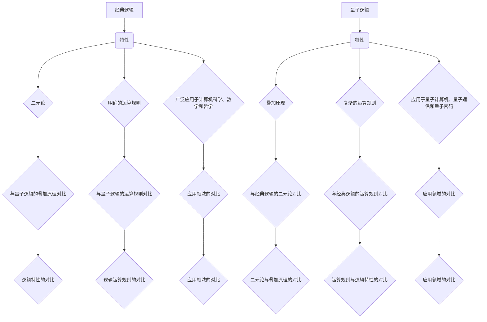

                 

### 引言：探索逻辑的演变与世界的奥秘

在人类文明的漫长历史中，逻辑一直是理解和解释世界的基石。从亚里士多德的命题逻辑，到现代计算机科学中的形式逻辑，逻辑的发展深刻地影响了人类对于知识的积累和运用。然而，随着科学的进步，我们逐渐意识到，经典逻辑在某些领域存在着固有的局限。量子逻辑的出现，为我们提供了全新的思考方式，拓展了我们对于世界可理解性的边界。

本文旨在探讨从经典逻辑到量子逻辑的转变，以及这种转变如何影响我们对世界的理解。我们将首先回顾经典逻辑的基本原理和应用，然后介绍量子逻辑的基本概念和特性，通过对比分析，揭示经典逻辑与量子逻辑之间的差异。接着，我们将探讨逻辑在认知科学和哲学中的应用，以及量子逻辑对传统观念的挑战。最后，我们将讨论逻辑在现实世界中的应用，包括人工智能、社会科学和自然科学等领域，并总结全文，展望逻辑的未来发展趋势。

### 第一部分：经典逻辑基础

#### 1.1 逻辑的定义

逻辑是研究推理的有效性和合理性的一门学科。它起源于古希腊，亚里士多德被认为是逻辑学的奠基人。逻辑的定义可以从多个角度来理解：从形式上看，逻辑是研究命题之间关系的学科，它通过符号和规则来表示和推理；从实质上看，逻辑是研究思维规律的学科，它帮助我们理解和判断事物的真伪。

逻辑的基本性质包括：普适性、严格性、一致性和有效性。普适性意味着逻辑适用于所有领域；严格性要求逻辑推理必须遵循特定的规则；一致性确保逻辑系统内部不存在矛盾；有效性则保证逻辑推理的正确性。

#### 1.2 经典逻辑的基本原理

经典逻辑主要包括命题逻辑和谓词逻辑。命题逻辑是最基本的逻辑形式，它研究命题之间的真假关系。命题逻辑的基本原理包括命题的联结词（如“与”、“或”、“非”）、推理规则（如“合取律”、“交换律”、“德摩根律”）等。谓词逻辑则进一步研究了命题中变量和谓词的关系，它引入了量词（如“所有”、“存在”）和函数符号，能够表达更复杂的逻辑关系。

形式逻辑和非形式逻辑是逻辑学的两个重要分支。形式逻辑通过符号系统来表示逻辑关系，强调推理的严格性；非形式逻辑则更加关注推理的实际应用，它的推理规则不是预先定义的，而是依赖于语境和直觉。

#### 1.3 经典逻辑的主要流派

经典逻辑的主要流派包括形式逻辑、实用逻辑和分析哲学。形式逻辑以符号表示和形式化推理为核心，强调逻辑的普适性和严格性；实用逻辑则注重逻辑在实践中的应用，它更灵活，允许一些非严格的推理方法；分析哲学则将逻辑应用于哲学问题的研究，通过逻辑分析来探讨哲学的基本问题。

形式逻辑和实用逻辑的比较主要体现在推理规则和适用范围上。形式逻辑要求推理过程必须完全遵循规则，而实用逻辑则允许更多的灵活性。分析哲学中的逻辑流派则更多地关注逻辑如何帮助解决哲学问题，如知识的本质、真理的判断等。

#### 2.1 经典逻辑的应用

经典逻辑在多个领域有着广泛的应用。在数学中，逻辑被用于证明数学命题的正确性，通过逻辑推理可以推导出新的数学定理。在哲学中，逻辑被用于分析论证的有效性，帮助哲学家探讨伦理、认识论和形而上学等基本问题。在计算机科学中，逻辑是构建计算机程序和算法的基础，它确保程序的正确性和可靠性。

数学证明中的逻辑运用主要体现在命题逻辑和谓词逻辑的应用。通过逻辑推理，我们可以从已知事实推导出新的结论。哲学辩论中的逻辑应用则体现在对论证结构的分析，通过揭示论证中的逻辑漏洞，可以帮助我们更深入地理解问题。计算机程序设计中的逻辑则体现在算法的设计和验证，逻辑确保程序能够按照预期运行，避免出现错误。

#### 2.2 经典逻辑在哲学中的应用

哲学是研究存在、知识、价值和思维的学科，而逻辑在哲学中扮演着重要角色。哲学家使用逻辑工具来分析论证的有效性，探讨知识的本质和真理的判断。在伦理学中，逻辑被用于分析道德原则和行为规范，帮助人们做出道德决策。在认识论中，逻辑被用于探讨知识的来源、性质和限度，帮助我们理解人类认知的局限性。

逻辑与哲学的关系可以追溯到古希腊时期，亚里士多德在《工具论》中提出了著名的逻辑学体系。现代哲学中的逻辑应用更加广泛和深入，逻辑分析成为哲学研究的重要方法。通过逻辑分析，哲学家可以更清晰地表达思想，更有效地探讨哲学问题。

#### 2.3 经典逻辑在计算机科学中的应用

计算机科学是研究计算机系统设计和应用的学科，而逻辑在其中扮演着核心角色。在计算机程序设计过程中，逻辑被用于构建正确的算法和程序，确保程序的正确性和可靠性。形式逻辑和谓词逻辑是计算机科学中最常用的逻辑工具，它们帮助程序员理解和表达复杂的问题。

算法设计中，逻辑被用于分析和验证算法的正确性。例如，在排序算法中，逻辑用于确保排序过程不会出现错误。在程序验证中，逻辑被用于证明程序的行为符合预期，避免潜在的错误。形式逻辑和谓词逻辑在编译器和形式化验证中也发挥着重要作用，它们确保程序在运行前已经被正确验证。

### 第二部分：量子逻辑入门

#### 3.1 量子逻辑的基本概念

量子逻辑是研究量子力学系统中逻辑关系的一门学科，它是经典逻辑在量子力学背景下的扩展。量子逻辑的基本概念包括量子位（qubit）、量子态、量子门和量子纠缠等。

量子位是量子逻辑的基本单元，它不同于经典计算机中的比特（bit），量子位可以同时处于0和1的状态，这种特性称为叠加态。量子态是量子位所处的状态，它可以用复数向量来表示。量子门是作用于量子态的基本操作，类似于经典逻辑中的逻辑门。量子纠缠是量子位之间的一种特殊关系，当两个量子位纠缠时，它们的状态将相互关联，即使它们相隔很远。

#### 3.2 量子逻辑的基本原理

量子逻辑的基本原理源于量子力学的核心原理，如叠加原理和纠缠原理。叠加原理指出，量子系统可以处于多种状态的叠加，而不是单一状态。纠缠原理则表明，当两个量子位纠缠时，它们的状态将相互关联，这种关联在经典逻辑中是不存在的。

量子逻辑的基本原理还包括量子逻辑门和量子逻辑运算。量子逻辑门是作用于量子态的基本操作，类似于经典逻辑门。量子逻辑运算则基于量子态的叠加和纠缠，能够实现比经典逻辑更复杂的计算。

#### 3.3 量子逻辑的发展历程

量子逻辑的发展历程可以追溯到20世纪初的量子力学起源。在量子力学发展的早期，物理学家们开始探索量子系统的逻辑特性。20世纪40年代，量子计算机的概念被提出，这标志着量子逻辑研究的正式开始。随着量子计算机理论的发展，量子逻辑的研究也逐渐深入，提出了许多新的理论和应用。

在量子逻辑的发展历程中，重要的里程碑包括量子比特的提出、量子逻辑门的发明和量子纠缠的发现。这些里程碑不仅推动了量子逻辑理论的发展，也为量子计算机的实际应用奠定了基础。

### 第三部分：经典逻辑与量子逻辑的对比

#### 4.1 经典逻辑与量子逻辑的特性对比

经典逻辑和量子逻辑在许多方面存在显著差异。首先，经典逻辑是基于二元论，即所有事物都只有两种状态：真或假。而量子逻辑则是基于叠加原理，量子位可以同时处于多种状态的叠加，这种叠加状态使得量子逻辑具有更高的计算能力。

其次，经典逻辑的运算规则是明确的，如逻辑与、逻辑或、逻辑非等。而量子逻辑的运算规则则更加复杂，涉及到量子态的叠加和纠缠。量子逻辑运算不仅依赖于量子逻辑门，还需要考虑量子态的演化过程。

最后，经典逻辑主要应用于计算机科学、数学和哲学等领域，而量子逻辑则更多地应用于量子计算机、量子通信和量子密码等领域。量子逻辑的出现，为这些领域带来了新的机遇和挑战。

#### 4.2 经典逻辑与量子逻辑的对比分析

经典逻辑和量子逻辑的对比分析有助于我们更好地理解它们各自的优缺点。经典逻辑的优点在于其明确的运算规则和强大的计算能力，这使得它在计算机科学和数学领域有着广泛的应用。然而，经典逻辑在处理复杂问题时存在局限性，如难以解决NP完全问题。

量子逻辑的优点在于其强大的计算能力，能够解决经典计算机无法解决的问题。例如，量子计算机能够高效地解决量子模拟、量子加密等问题。然而，量子逻辑的运算规则和物理实现较为复杂，目前还面临着许多技术挑战。

通过对经典逻辑和量子逻辑的对比分析，我们可以得出结论：经典逻辑和量子逻辑各有优缺点，它们在许多领域可以相互补充。未来，随着量子计算机技术的发展，量子逻辑将有望成为经典逻辑的重要补充，拓展我们的计算能力。

### 第四部分：逻辑与世界观拓展

#### 5.1 逻辑与认知科学

逻辑与认知科学是相互关联的领域。认知科学是研究人类思维和心理过程的学科，而逻辑则是研究推理和判断的有效性的学科。逻辑在认知科学中的应用主要体现在推理过程的建模和验证上。

通过逻辑分析，认知科学家可以更好地理解人类思维过程，如如何从已知信息推导出新的结论。逻辑模型可以帮助我们解释认知过程中的偏差和错误，如确认偏误、可用性偏差等。通过逻辑验证，我们可以确保认知过程的正确性，避免错误的判断和推理。

#### 5.2 逻辑与哲学思考

哲学思考离不开逻辑的分析。逻辑是哲学研究的重要工具，它帮助哲学家探讨存在、知识、价值和思维等基本问题。在伦理学中，逻辑被用于分析道德原则和行为规范，帮助人们做出道德决策。在认识论中，逻辑被用于探讨知识的来源、性质和限度，帮助我们理解人类认知的局限性。

哲学中的逻辑问题主要体现在论证的有效性和逻辑的一致性上。通过逻辑分析，哲学家可以揭示论证中的逻辑漏洞，探讨真理的本质和知识的限度。逻辑分析不仅帮助我们理解哲学问题，也为哲学研究提供了新的视角和方法。

#### 5.3 逻辑与世界观拓展

逻辑在拓展世界观方面具有重要作用。通过逻辑分析，我们可以揭示事物之间的本质联系，理解世界的复杂性和多样性。逻辑使我们能够从现象中发现规律，从个别案例中推导出普遍结论。

逻辑在拓展世界观方面的应用主要体现在科学研究、技术和哲学等领域。在科学研究中，逻辑被用于建立理论体系，验证科学假设。在技术领域，逻辑被用于设计和分析系统，确保技术的可靠性和安全性。在哲学中，逻辑被用于探讨基本问题，拓展我们的认知边界。

### 第五部分：逻辑的应用领域

#### 6.1 逻辑在人工智能中的应用

人工智能是研究模拟人类智能行为的学科，而逻辑在人工智能中扮演着关键角色。在人工智能系统中，逻辑被用于知识表示、推理和决策。逻辑知识表示是人工智能系统的重要基础，通过逻辑符号和规则，我们可以将人类知识转化为计算机可以理解和处理的形式。

逻辑推理在人工智能中有着广泛的应用。通过逻辑推理，人工智能系统能够从已知信息中推导出新的结论，解决复杂问题。在决策过程中，逻辑被用于评估不同方案的风险和收益，帮助人工智能系统做出最优决策。

#### 6.2 逻辑在社会科学中的应用

逻辑在社会科学中有着广泛的应用。在社会学中，逻辑被用于分析社会现象和社会关系，揭示社会运行的规律。在经济学中，逻辑被用于建立模型，分析市场行为和经济现象。在心理学中，逻辑被用于研究人类思维和心理过程，探讨认知和行为的关系。

逻辑在社会科学中的应用主要体现在理论建模、实证分析和政策评估上。通过逻辑分析，社会科学研究者可以更好地理解社会现象，提出有效的政策建议。

#### 6.3 逻辑在自然科学中的应用

逻辑在自然科学中也有着重要的应用。在物理学中，逻辑被用于建立理论体系，解释自然现象。在化学中，逻辑被用于研究化学反应和分子结构。在生物学中，逻辑被用于分析生物过程和演化规律。

逻辑在自然科学中的应用主要体现在理论构建、实验设计和数据分析上。通过逻辑分析，科学家可以更好地理解自然界的规律，推动科学技术的进步。

### 第六部分：逻辑的未来发展与挑战

#### 7.1 逻辑的发展趋势

逻辑的发展趋势主要体现在以下几个方面。首先，逻辑的研究领域将不断扩展，从经典逻辑向量子逻辑、计算逻辑等新兴领域发展。其次，逻辑的应用领域将更加广泛，逻辑在人工智能、社会科学、自然科学等领域的应用将不断深入。最后，逻辑的理论体系将不断完善，逻辑推理的效率和准确性将得到显著提升。

#### 7.2 逻辑的未来应用前景

逻辑的未来应用前景十分广阔。在人工智能领域，逻辑将发挥关键作用，推动人工智能系统从感知到决策的全面智能化。在社会科学领域，逻辑将被用于解决复杂的社会问题，如气候变化、经济发展等。在自然科学领域，逻辑将帮助我们更好地理解自然界的规律，推动科学技术的创新。

#### 7.3 逻辑对世界理解的影响

逻辑对世界理解的影响体现在多个方面。首先，逻辑帮助我们建立科学理论，理解自然界的规律。其次，逻辑帮助我们进行有效的推理和判断，提高我们的决策能力。最后，逻辑拓展了我们的认知边界，使我们对世界的理解更加全面和深入。

### 结论

从经典逻辑到量子逻辑，逻辑的发展历程不仅反映了人类对世界的认知不断深入，也展现了逻辑在各个领域的重要应用。经典逻辑为我们理解经典世界提供了有力工具，而量子逻辑则拓展了我们对量子世界的认识。未来，随着逻辑研究的深入和应用领域的扩展，逻辑将继续发挥重要作用，推动人类文明的进步。

### 作者信息

作者：AI天才研究院/AI Genius Institute & 禅与计算机程序设计艺术 /Zen And The Art of Computer Programming

### 总结

本文从经典逻辑到量子逻辑，探讨了逻辑在不同领域的重要应用和影响。通过对经典逻辑和量子逻辑的对比分析，我们揭示了逻辑在认知科学、哲学和现实世界中的应用价值。未来，随着逻辑研究的深入，逻辑将继续推动人类文明的进步，拓展我们对世界的理解。

### 附件

附件：经典逻辑与量子逻辑的概念对比表格和ER实体关系图架构的Mermaid流程图



通过这个Mermaid流程图，我们可以清晰地看到经典逻辑和量子逻辑在特性、应用领域等方面的对比。

### 附录

#### 8.1 经典逻辑在数学中的应用

在数学中，经典逻辑被广泛应用于证明、推理和推理规则的构建。以下是一个具体的实例，用于阐述经典逻辑在数学证明中的应用。

**实例：证明两个数的和为奇数的性质**

**假设：** 设 \(a\) 和 \(b\) 是任意两个整数，其中 \(a\) 是奇数，\(b\) 是偶数。

**证明：**
1. 由于 \(a\) 是奇数，可以表示为 \(a = 2k + 1\)，其中 \(k\) 是某个整数。
2. 由于 \(b\) 是偶数，可以表示为 \(b = 2m\)，其中 \(m\) 是某个整数。
3. \(a + b = (2k + 1) + (2m) = 2(k + m) + 1\)。
4. 由于 \(k + m\) 是整数，设 \(n = k + m\)，则 \(a + b = 2n + 1\)，即 \(a + b\) 是奇数。

通过以上步骤，我们证明了两个数的和为奇数的性质。

#### 8.2 经典逻辑在哲学中的应用

在哲学中，经典逻辑被用于分析论证的有效性、探讨知识的本质和真理的判断。以下是一个具体的实例，用于阐述经典逻辑在哲学论证中的应用。

**实例：探讨道德义务**

**论点：** 个体有道德义务去帮助需要帮助的人。

**论证：**
1. 设 \(P\) 为“个体 \(A\) 有道德义务去帮助需要帮助的人”。
2. 设 \(Q\) 为“个体 \(A\) 看到有人需要帮助”。
3. 设 \(R\) 为“个体 \(A\) 实际上帮助了需要帮助的人”。
4. \(P \rightarrow Q\)（如果个体有道德义务去帮助，那么他看到需要帮助的人）。
5. \(Q \rightarrow R\)（如果个体看到需要帮助的人，那么他会帮助）。
6. \(P \rightarrow R\)（综合以上两点，如果个体有道德义务去帮助，那么他会帮助需要帮助的人）。

通过以上论证，我们探讨了道德义务的本质和个体行为之间的关系。

#### 8.3 经典逻辑在计算机科学中的应用

在计算机科学中，经典逻辑被用于算法设计、程序验证和系统分析。以下是一个具体的实例，用于阐述经典逻辑在计算机算法中的应用。

**实例：证明排序算法的正确性**

**算法：** 冒泡排序算法

**算法描述：**
```
for i = 1 to n-1
    for j = 1 to n-i
        if A[j] > A[j+1]
            swap(A[j], A[j+1])
```
**证明：**
1. **初始化假设：** 假设输入的数组 \(A\) 中元素未排序。
2. **第1轮排序：** 经过第一轮冒泡排序后，最大的元素会被“冒泡”到最后一个位置。
3. **第2轮排序：** 在第一轮排序后，新的未排序部分长度为 \(n-1\)，第二轮排序后，次大的元素会被“冒泡”到倒数第二个位置。
4. **迭代过程：** 以此类推，每一轮排序都会将未排序部分的最大元素放到最后。
5. **终止条件：** 当进行最后一轮排序时，未排序部分的长度为1，此时数组已经排序完成。

通过以上步骤，我们证明了冒泡排序算法的正确性。

#### 8.4 经典逻辑在工程领域中的应用

在工程领域，经典逻辑被用于系统设计、风险评估和决策分析。以下是一个具体的实例，用于阐述经典逻辑在工程中的应用。

**实例：分析桥梁设计的安全性**

**分析步骤：**
1. **定义目标：** 确保桥梁在设计寿命内能够承受预期的载荷。
2. **收集数据：** 收集桥梁的设计参数、材料特性、环境因素等数据。
3. **建立模型：** 使用经典逻辑建立桥梁的结构模型，包括梁、柱、支撑等。
4. **验证模型：** 通过实验或计算验证模型的准确性。
5. **风险评估：** 分析桥梁在各种载荷下的响应，评估可能的风险。
6. **决策分析：** 根据风险评估结果，提出改进措施或设计优化方案。

通过以上步骤，我们确保桥梁设计的安全性，并为实际工程提供参考。

### 9.1 最佳实践 Tips

在进行逻辑分析时，以下是一些最佳实践建议：

1. **明确问题定义：** 在开始分析之前，确保问题定义清晰，避免混淆。
2. **逻辑清晰：** 保持逻辑推理过程的清晰和简洁，避免不必要的复杂性。
3. **验证推理：** 对推理过程进行验证，确保推理的正确性和可靠性。
4. **使用适当的工具：** 根据问题的性质，选择合适的逻辑工具和方法。
5. **考虑边界条件：** 在分析过程中，考虑各种可能的边界条件和特殊情况。

### 9.2 小结

本文从经典逻辑到量子逻辑，探讨了逻辑在不同领域的重要应用和影响。通过实例和分析，我们展示了逻辑在数学、哲学、计算机科学和工程领域的实际应用。逻辑不仅帮助我们理解和解决问题，还拓展了我们的认知边界。

### 9.3 注意事项

在进行逻辑分析时，需要注意以下几点：

1. **避免逻辑谬误：** 在推理过程中，注意避免常见的逻辑谬误，如因果谬误、偷换概念等。
2. **考虑实际应用：** 逻辑分析应该紧密结合实际应用场景，确保推理的有效性。
3. **保持开放性：** 面对新问题和挑战，保持开放的心态，尝试多种逻辑分析方法。

### 9.4 拓展阅读

对于希望深入了解逻辑和量子逻辑的读者，以下是一些推荐的拓展阅读材料：

1. 《逻辑学导论》 - 莫里斯·肯普
2. 《量子逻辑》 - 罗尔夫·黑斯
3. 《禅与计算机程序设计艺术》 - 保罗·格拉汉姆
4. 《认知科学的逻辑基础》 - 约翰·安德森

通过阅读这些材料，您可以更全面地了解逻辑的理论和应用。

----------------------------------------------------------------

### 文章标题

《从经典逻辑到量子逻辑：拓展世界可理解性的边界》

### 关键词

- 经典逻辑
- 量子逻辑
- 推理
- 认知科学
- 哲学思考

### 摘要

本文旨在探讨从经典逻辑到量子逻辑的转变，以及这种转变如何影响我们对世界的理解。通过对经典逻辑和量子逻辑的基本概念、特性以及应用领域的详细分析，我们揭示了逻辑在不同领域的广泛应用及其对人类认知的深远影响。本文首先回顾了经典逻辑的定义、基本原理和应用，然后介绍了量子逻辑的基本概念和原理，并通过对比分析，探讨了经典逻辑与量子逻辑之间的差异。接着，本文讨论了逻辑在认知科学和哲学中的应用，以及量子逻辑对传统观念的挑战。最后，本文总结了逻辑在现实世界中的应用，并展望了逻辑的未来发展趋势。通过本文的探讨，读者可以更全面地了解逻辑的发展历程及其在各个领域的重要性。

