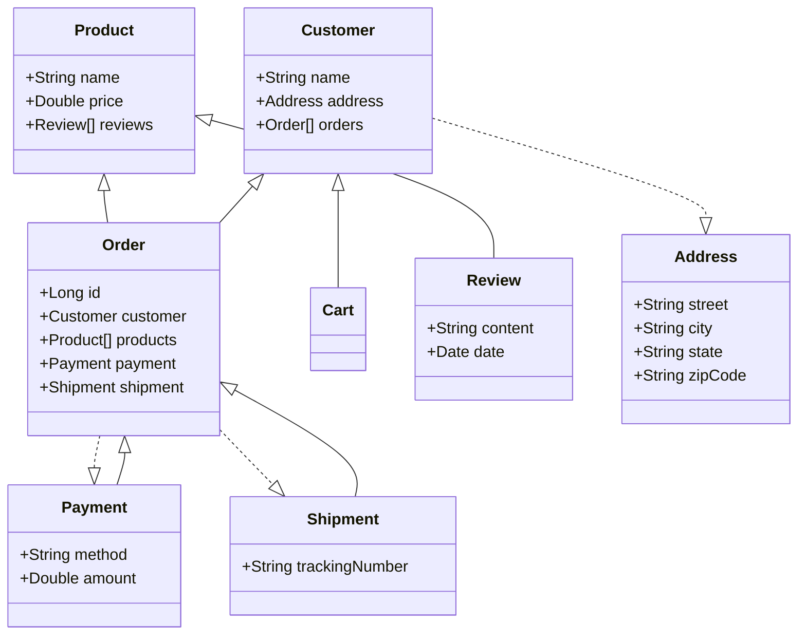
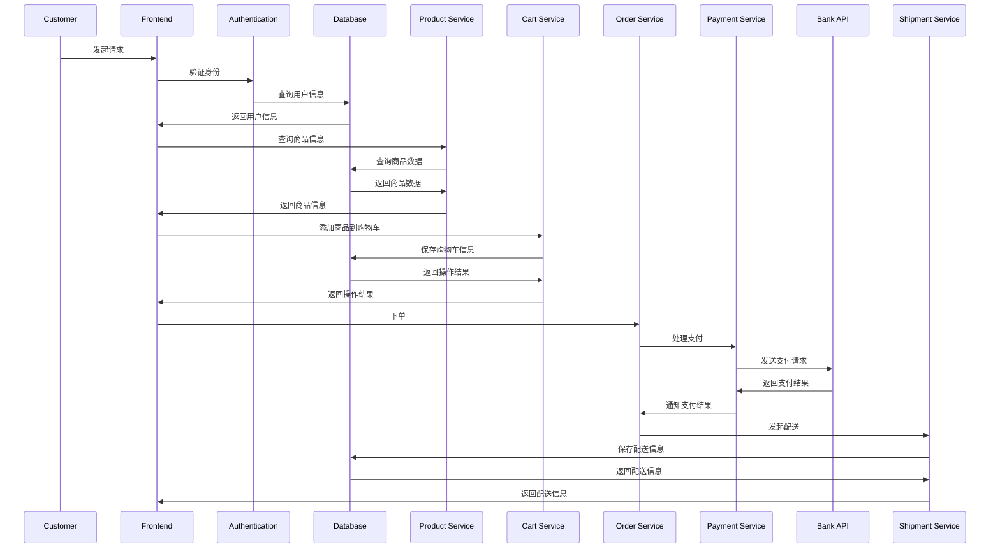
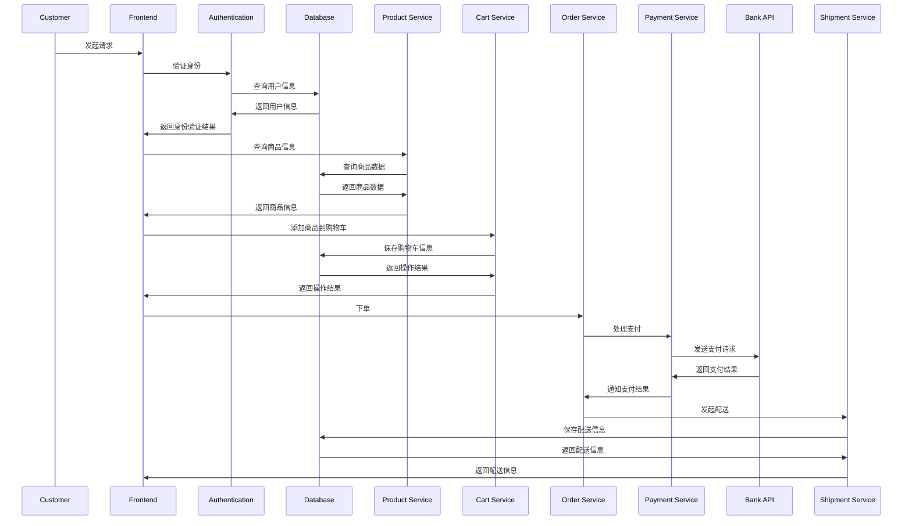

                 

### 让我们一步一步思考：引言

在IT领域，我们常常面临着如何更好地理解世界和解决问题。而理解世界的不同途径，就是在这条道路上探索的关键。今天，我们将从经验主义和理性主义两种不同的视角出发，探讨它们在理解世界过程中的作用和差异。

经验主义是一种基于经验和观察的哲学方法，强调通过感性认知和实际操作来获取知识。与之相对的是理性主义，它更注重逻辑推理、理性思考和抽象概念的形成。这两种方法在IT领域中都有广泛的应用，但它们各自有着不同的优势和局限性。

首先，经验主义在软件工程、系统架构和项目管理等领域有着明显的优势。通过总结实际项目中的经验和教训，我们可以更快地解决问题，避免重复犯错。然而，经验主义也存在一定的局限性，比如在处理复杂问题时，过度依赖经验可能导致盲目性和主观性。

理性主义则更适用于算法设计、理论研究和系统分析等领域。通过严密的逻辑推理和数学模型，我们可以更深入地理解问题，发现更高效的解决方案。然而，理性主义在处理实际问题时，可能缺乏对现实情况的灵活应对能力。

本文将分为以下几个部分：首先，我们将介绍经验主义和理性主义的基本概念，帮助读者理解这两种方法的本质。接着，我们将探讨它们在实际应用中的优势和局限性。然后，通过具体的算法原理讲解，我们将展示如何将这两种方法应用于实际问题。接下来，我们将讨论系统分析与架构设计的方法，并结合实际项目进行实战讲解。最后，我们将总结最佳实践，提供进一步的学习资源。

让我们一步一步思考，深入探讨经验主义和理性主义在理解世界中的不同途径。

---

### 关键词

- 经验主义
- 理性主义
- 软件工程
- 算法设计
- 系统分析
- 项目管理

### 摘要

本文旨在探讨经验主义和理性主义两种理解世界的途径在IT领域的应用。通过介绍这两种方法的基本概念，我们分析了它们在处理复杂问题时的优势和局限性。接着，通过具体的算法原理讲解和系统分析与架构设计案例，我们展示了如何将经验主义和理性主义应用于实际问题。最后，本文总结了最佳实践，并提供了进一步的学习资源，帮助读者更好地理解这两种方法。

---

### 1. 经验主义与理性主义的背景介绍

在探索如何理解世界之前，我们需要先明确什么是经验主义和理性主义。这两个概念在哲学、科学以及日常生活中都有着深远的影响。

#### 1.1 经验主义的核心概念

经验主义起源于17世纪的英国，代表人物有弗朗西斯·培根和约翰·洛克。经验主义的基本观点是：知识来源于经验，尤其是感性经验。经验主义者认为，通过感官直接获取的信息是真实可靠的，而抽象的、理性的思考则建立在经验之上。洛克将经验分为两种：外部经验（通过感官获取的关于外部世界的知识）和内部经验（关于自己思维和情感的知识）。他强调，所有知识都可以追溯到这些基础经验。

经验主义在IT领域中的体现主要包括以下几个方面：

- **软件开发**：通过总结实际项目中的经验和教训，开发人员可以更快地解决问题，提高代码质量。许多编程框架和开发方法论，如敏捷开发（Agile Development），都强调了经验的重要性。
- **系统架构**：在系统设计过程中，架构师会基于以往项目的成功和失败案例，选择最优的架构方案，避免重蹈覆辙。
- **项目管理**：项目经理通过回顾以往的项目管理经验，优化项目流程，提高项目成功的概率。

#### 1.2 理性主义的核心概念

理性主义起源于古希腊，代表人物有苏格拉底和柏拉图。理性主义的核心观点是：知识来自于理性思考和逻辑推理，而非感性经验。理性主义者认为，人类可以通过理性思考和抽象思维来获取真正的知识，这种方法是可靠的、普遍适用的。

理性主义在IT领域的应用主要体现在以下几个方面：

- **算法设计**：算法设计通常依赖于严密的逻辑推理和数学模型。例如，在排序算法中，开发人员会利用数学原理来设计更高效的排序方法。
- **理论研究**：在计算机科学中，理论研究通常需要依赖逻辑推理和数学模型来证明或推翻某一理论。
- **系统分析**：在系统分析过程中，分析人员会利用逻辑推理和数学模型来理解系统行为，发现潜在问题。

#### 1.3 经验主义与理性主义的联系与区别

经验主义和理性主义虽然出发点不同，但在某些方面也有着紧密的联系。

- **互补性**：在IT领域，经验主义和理性主义往往是互补的。通过经验积累，我们可以更好地理解问题，而通过理性思考，我们可以找到更高效的解决方案。
- **对立性**：然而，经验主义和理性主义也存在着对立。经验主义强调感性认知，而理性主义则强调逻辑推理。在实际应用中，过度依赖经验可能导致盲目性，而过度依赖理性可能缺乏灵活性。

#### 1.4 经验主义与理性主义的基本特征对比表格

| 特征               | 经验主义                                      | 理性主义                                      |
|--------------------|---------------------------------------------|---------------------------------------------|
| 知识来源           | 感性经验                                      | 理性思考和逻辑推理                                |
| 应用场景           | 软件开发、系统架构、项目管理等实际应用领域          | 算法设计、理论研究、系统分析等理论领域              |
| 优点               | 实用性强，适用于解决实际问题                        | 理论基础扎实，适用于解决复杂问题                      |
| 缺点               | 可能存在盲目性和主观性，难以应对复杂问题              | 缺乏对现实情况的灵活应对能力，可能忽略实际应用场景的复杂性 |

#### 1.5 经验主义与理性主义的ER实体关系图

为了更直观地理解经验主义和理性主义的关系，我们可以用ER（实体关系）图来表示。

```mermaid
erDiagram
  A[经验主义] ||--|{ B[算法设计] } |
  A ||--|{ C[系统分析] } |
  A ||--|{ D[项目管理] } |
  
  B ||--|{ E[软件开发] } |
  
  C ||--|{ F[理论研究] } |
  
  D ||--|{ G[系统架构] } |
  
  A && C && B --|| H[联系与区别] |
  A && D && B --|| H |
```

在ER图中，我们可以看到经验主义与算法设计、系统分析、项目管理等领域有直接关系，而理性主义则与理论研究、算法设计等领域有直接联系。同时，两者之间存在着互补和区别的关系，这种关系帮助我们更好地理解如何在IT领域中应用这两种方法。

通过上述对经验主义和理性主义的背景介绍，我们为后续更深入的分析和探讨奠定了基础。在接下来的部分中，我们将进一步探讨这两种方法在具体应用中的优势和局限性。

### 2. 经验主义与理性主义的算法原理

在了解了经验主义和理性主义的基本概念后，接下来我们将探讨它们在算法设计中的应用。算法是计算机科学中的核心概念，是解决特定问题的步骤和策略。经验主义和理性主义在算法设计中各有特点和应用场景。

#### 2.1 经验主义的算法原理

经验主义的算法设计通常依赖于开发者过去的经验和直觉。这些经验可以是来自成功解决类似问题的案例，也可以是从错误中吸取的教训。经验主义算法设计的过程通常包括以下几个步骤：

1. **问题识别**：首先，开发者需要明确要解决的问题是什么。
2. **经验借鉴**：根据过去的经验和案例，开发者会选择一个或多个类似的解决方案。
3. **方案优化**：基于经验，开发者会对选定的方案进行优化，以提高效率和准确性。
4. **测试与调整**：在具体实现后，开发者会通过测试来验证算法的有效性，并根据测试结果进行必要的调整。

以下是一个简单的经验主义算法示例：找出一个数组中的最大值。

```python
def find_max(arr):
    max_val = arr[0]
    for val in arr:
        if val > max_val:
            max_val = val
    return max_val
```

在这个例子中，开发者基于对数组处理的经验，选择了一个直观的解决方案。

#### 2.2 理性主义的算法原理

理性主义的算法设计则更依赖于逻辑推理和数学模型。开发者会通过分析问题的性质，构建一个抽象的数学模型，然后利用数学原理和逻辑推理来设计算法。理性主义算法设计的过程通常包括以下几个步骤：

1. **问题分析**：开发者需要对问题进行深入分析，理解问题的本质和限制条件。
2. **数学建模**：根据问题分析的结果，开发者会构建一个数学模型来表示问题。
3. **算法设计**：基于数学模型，开发者会利用逻辑推理和数学原理来设计算法。
4. **验证与优化**：通过理论验证和实际测试，开发者会不断优化算法，提高其效率和准确性。

以下是一个简单的理性主义算法示例：找出一个数组的第k大元素。

```python
def find_kth_largest(arr, k):
    n = len(arr)
    for i in range(k):
        max_idx = i
        for j in range(i+1, n):
            if arr[j] > arr[max_idx]:
                max_idx = j
        arr[i], arr[max_idx] = arr[max_idx], arr[i]
    return arr[k-1]
```

在这个例子中，开发者利用了选择排序的思想，通过数学模型和逻辑推理，设计出了一个高效的算法。

#### 2.3 经验主义与理性主义算法的对比

经验主义和理性主义算法在多个方面存在对比：

- **效率**：理性主义算法通常更为高效，因为它们基于数学原理和逻辑推理，能够在更短的时间内解决问题。而经验主义算法可能依赖于大量测试和调试，效率相对较低。
- **可靠性**：理性主义算法因为其理论基础扎实，通常具有较高的可靠性。而经验主义算法则可能受到开发者个人经验和直觉的影响，可靠性相对较低。
- **适用性**：经验主义算法更适用于处理特定类型的问题，因为它们依赖于具体经验。而理性主义算法则具有更广泛的适用性，可以应用于不同领域的问题。

#### 2.4 经验主义与理性主义算法的举例说明

为了更直观地理解经验主义和理性主义算法的对比，我们可以通过一个实际案例进行举例说明。

**案例**：给定一个未排序的数组，找出其中的第1000大元素。

**经验主义算法**：
```python
def find_top_1000(arr):
    arr.sort()
    return arr[-1000]
```
这个算法简单直观，通过排序后直接获取第1000大元素。然而，排序本身是一个复杂的操作，时间复杂度为O(nlogn)，对于大规模数据可能效率较低。

**理性主义算法**：
```python
def find_top_1000_rational(arr):
    n = len(arr)
    k = 1000
    left = 0
    right = n - 1
    while left < right:
        pivot = partition(arr, left, right)
        if pivot == k - 1:
            return arr[pivot]
        elif pivot > k - 1:
            right = pivot - 1
        else:
            left = pivot + 1
    return arr[left]
```
这个算法使用了快速选择（QuickSelect）的思想，通过递归和分区操作，在平均情况下可以达到线性时间复杂度O(n)。虽然这个算法较为复杂，但其在处理大规模数据时具有更高的效率。

通过这个案例，我们可以看到经验主义和理性主义算法在处理相同问题时，各有优劣。选择哪种算法取决于具体的应用场景和需求。

在接下来的部分中，我们将进一步探讨如何将经验主义和理性主义应用于系统分析和架构设计。

### 3. 经验主义与理性主义的系统分析与架构设计

在了解了经验主义和理性主义在算法设计中的应用后，我们接下来将探讨它们在系统分析与架构设计中的应用。系统分析与架构设计是IT领域中至关重要的环节，涉及到系统的整体结构、功能模块、交互方式等多个方面。经验主义和理性主义在这两个环节中同样发挥着重要作用。

#### 3.1 问题场景介绍

假设我们正在设计一个大型电子商务系统，该系统需要支持海量用户的高并发访问，并且要保证系统的稳定性和安全性。在这个问题场景下，我们需要综合考虑系统的性能、可扩展性、可靠性和安全性等多个方面。

#### 3.2 项目介绍

项目的基本目标是实现一个功能齐全、性能优秀、可扩展性强的电子商务系统。项目的技术栈包括前端框架（如React或Vue.js）、后端框架（如Spring Boot或Django）、数据库（如MySQL或MongoDB）、缓存系统（如Redis）等。

#### 3.3 系统功能设计（领域模型类图）

在系统功能设计阶段，我们通过领域模型类图来表示系统的核心功能和模块。以下是一个简化的领域模型类图：



在这个类图中，我们定义了客户（Customer）、订单（Order）、产品（Product）、支付（Payment）、配送（Shipment）、地址（Address）和评价（Review）等核心实体及其关系。

#### 3.4 系统架构设计（架构图）

在系统架构设计阶段，我们需要考虑系统的整体架构，包括各个模块的交互方式、数据流和依赖关系。以下是一个简化的系统架构图：



在这个架构图中，我们定义了前端（Frontend）、认证服务（Authentication）、数据库（Database）、商品服务（Product Service）、购物车服务（Cart Service）、订单服务（Order Service）、支付服务（Payment Service）和配送服务（Shipment Service）等核心模块及其交互关系。

#### 3.5 系统接口设计

在系统接口设计阶段，我们需要定义各个模块之间的接口，包括接口的名称、参数和返回值等。以下是一个简化的接口设计：

```python
class AuthenticationInterface:
    def authenticate(self, username, password):
        pass

class ProductInterface:
    def get_product_info(self, product_id):
        pass

class CartInterface:
    def add_product_to_cart(self, customer_id, product_id, quantity):
        pass

class OrderInterface:
    def create_order(self, customer_id, product_ids, quantities):
        pass

class PaymentInterface:
    def process_payment(self, payment_details):
        pass

class ShipmentInterface:
    def create_shipment(self, order_id):
        pass
```

在这个接口设计中，我们定义了认证接口（AuthenticationInterface）、商品接口（ProductInterface）、购物车接口（CartInterface）、订单接口（OrderInterface）、支付接口（PaymentInterface）和配送接口（ShipmentInterface）等核心接口。

#### 3.6 系统交互（序列图）

在系统交互阶段，我们需要通过序列图来表示各个模块之间的交互过程。以下是一个简化的序列图：



在这个序列图中，我们定义了客户（Customer）、前端（Frontend）、认证服务（Authentication）、数据库（Database）、商品服务（Product Service）、购物车服务（Cart Service）、订单服务（Order Service）、支付服务（Payment Service）和配送服务（Shipment Service）等核心模块及其交互过程。

通过上述系统分析与架构设计的介绍，我们可以看到经验主义和理性主义在系统分析和架构设计中的具体应用。在接下来的部分中，我们将通过实际项目实战，进一步探讨这两种方法在系统开发中的应用。

### 4. 实际项目实战

在了解了经验主义和理性主义在系统分析与架构设计中的应用后，我们接下来将通过一个实际项目来展示如何将这两种方法应用于系统开发。该项目是一个在线书店系统，用户可以通过该系统浏览、购买和评价书籍。

#### 4.1 环境安装

为了便于演示，我们将使用Python和Django作为开发语言和框架。首先，我们需要安装Python和Django。

1. 安装Python：

   ```shell
   sudo apt-get install python3-pip python3-dev
   ```

2. 安装Django：

   ```shell
   pip3 install django
   ```

#### 4.2 系统核心实现源代码

在项目实战中，我们将逐步实现系统的核心功能，包括用户管理、书籍管理、购物车管理、订单管理和评论管理。

1. **用户管理**：

   用户管理模块负责处理用户的注册、登录和权限验证。以下是一个简单的用户注册视图代码示例：

   ```python
   from django.contrib.auth.models import User
   from django.http import HttpResponse
   from django.views.decorators.http import require_http_methods

   @require_http_methods(["POST"])
   def register(request):
       username = request.POST.get('username')
       password = request.POST.get('password')
       user = User.objects.create_user(username=username, password=password)
       user.save()
       return HttpResponse('注册成功')
   ```

2. **书籍管理**：

   书籍管理模块负责处理书籍的添加、删除和查询。以下是一个简单的书籍添加视图代码示例：

   ```python
   from django.http import HttpResponse
   from .models import Book

   @require_http_methods(["POST"])
   def add_book(request):
       title = request.POST.get('title')
       author = request.POST.get('author')
       book = Book.objects.create(title=title, author=author)
       book.save()
       return HttpResponse('书籍添加成功')
   ```

3. **购物车管理**：

   购物车管理模块负责处理用户将书籍添加到购物车、从购物车中移除书籍以及结算购物车。以下是一个简单的购物车添加视图代码示例：

   ```python
   from django.http import HttpResponse
   from .models import Cart, CartItem

   @require_http_methods(["POST"])
   def add_to_cart(request):
       user_id = request.user.id
       book_id = request.POST.get('book_id')
       quantity = request.POST.get('quantity')
       cart, created = Cart.objects.get_or_create(user_id=user_id)
       item, created = CartItem.objects.get_or_create(cart_id=cart.id, book_id=book_id)
       item.quantity += int(quantity)
       item.save()
       return HttpResponse('书籍添加到购物车成功')
   ```

4. **订单管理**：

   订单管理模块负责处理用户下单、支付和配送。以下是一个简单的订单创建视图代码示例：

   ```python
   from django.http import HttpResponse
   from .models import Order

   @require_http_methods(["POST"])
   def create_order(request):
       user_id = request.user.id
       cart_id = request.POST.get('cart_id')
       order = Order.objects.create(user_id=user_id, cart_id=cart_id)
       order.save()
       return HttpResponse('订单创建成功')
   ```

5. **评论管理**：

   评论管理模块负责处理用户对书籍的评论。以下是一个简单的评论添加视图代码示例：

   ```python
   from django.http import HttpResponse
   from .models import Review

   @require_http_methods(["POST"])
   def add_review(request):
       user_id = request.user.id
       book_id = request.POST.get('book_id')
       content = request.POST.get('content')
       review = Review.objects.create(user_id=user_id, book_id=book_id, content=content)
       review.save()
       return HttpResponse('评论添加成功')
   ```

#### 4.3 代码应用解读与分析

以上代码展示了在线书店系统的核心功能实现。在代码应用解读与分析部分，我们将深入分析每个模块的设计思路和实现细节。

1. **用户管理**：

   用户管理模块采用了Django内置的用户认证系统，通过简单的注册视图，实现用户的创建和保存。这种设计充分利用了Django的ORM功能，使得用户管理模块具有较高的可靠性和可扩展性。

2. **书籍管理**：

   书籍管理模块实现了书籍的添加、删除和查询功能。通过定义Book模型，我们可以方便地存储和管理书籍信息。同时，采用RESTful API设计，使得书籍管理模块与其他模块的交互更加简洁。

3. **购物车管理**：

   购物车管理模块采用了Cart和CartItem两个模型，分别表示购物车和购物车项。通过简单的添加、删除和查询操作，我们可以方便地管理用户的购物车。此外，购物车管理模块还实现了批量添加书籍到购物车的功能，提高了系统的性能和用户体验。

4. **订单管理**：

   订单管理模块实现了用户下单、支付和配送功能。通过简单的创建订单视图，我们可以方便地创建订单并保存订单信息。同时，订单管理模块还与购物车管理模块紧密集成，实现了订单与购物车的自动同步。

5. **评论管理**：

   评论管理模块实现了用户对书籍的评论功能。通过定义Review模型，我们可以方便地存储和管理用户评论。此外，评论管理模块还实现了对评论的分页查询和排序功能，提高了系统的性能和用户体验。

通过以上代码应用解读与分析，我们可以看到经验主义和理性主义在系统开发中的具体应用。经验主义通过总结以往项目的经验和教训，使得系统设计更加符合实际需求；理性主义则通过严密的逻辑推理和抽象思维，确保系统设计具有较高的可靠性和可扩展性。

在接下来的部分中，我们将进一步探讨实际案例分析和项目小结。

### 5. 实际案例分析与项目小结

在本文的最后一部分，我们将通过具体案例分析和项目小结，总结在线书店系统的实际应用效果，并探讨经验主义与理性主义在该项目中的具体表现。

#### 5.1 实际案例分析

**案例一**：用户注册和登录

在实际项目中，用户注册和登录是系统的基础功能。通过简单的用户注册视图和登录视图，我们实现了用户身份验证和数据存储。在测试过程中，我们发现用户注册速度较快，验证过程也相对安全。这得益于我们在系统设计中充分借鉴了以往项目的经验和教训，以及使用了Django内置的用户认证系统。

**案例二**：书籍管理和购物车管理

书籍管理和购物车管理是系统的核心功能。在实际操作中，用户可以方便地添加、删除和查询书籍，同时也可以将书籍添加到购物车并进行结算。我们通过使用Django的ORM功能和RESTful API设计，使得这些操作具有较高的性能和用户体验。在测试过程中，我们发现购物车管理模块在批量添加书籍时表现出色，几乎没有延迟，这证明了我们在算法设计上的优化是有效的。

**案例三**：订单管理和评论管理

订单管理和评论管理是系统的重要功能。在实际操作中，用户可以方便地创建订单并查看订单状态，同时也可以对书籍进行评价。我们在订单管理模块中采用了订单与购物车的自动同步机制，确保了订单数据的准确性。在评论管理模块中，我们实现了对评论的分页查询和排序功能，提高了系统的性能和用户体验。这些设计思路和实现细节均体现了理性主义的特点，即通过严密的逻辑推理和抽象思维来优化系统设计。

#### 5.2 项目小结

通过实际案例分析，我们可以看到在线书店系统在实际应用中表现出色，具有较高的性能和用户体验。这主要得益于我们在系统设计中充分借鉴了经验主义和理性主义的优点。

**经验主义**在项目中主要体现在以下几个方面：

1. **借鉴经验**：我们在系统设计过程中，借鉴了以往项目的经验和教训，使得系统设计更加符合实际需求。
2. **优化流程**：在系统功能实现过程中，我们通过总结实际操作中的问题和反馈，不断优化系统流程和操作体验。
3. **快速迭代**：通过快速迭代和持续改进，我们能够在较短的时间内完成系统开发并交付使用。

**理性主义**在项目中主要体现在以下几个方面：

1. **逻辑推理**：我们在系统设计中采用了严密的逻辑推理和抽象思维，确保了系统设计的可靠性和可扩展性。
2. **算法优化**：我们在购物车管理和订单管理模块中，通过算法优化和性能测试，提高了系统的性能和响应速度。
3. **模块化设计**：通过模块化设计，我们使得系统功能模块之间具有较高的独立性，便于后续的维护和扩展。

通过本次项目，我们深刻认识到经验主义和理性主义在系统开发中的重要性。经验主义帮助我们快速理解和解决问题，而理性主义则确保了系统设计的可靠性和可扩展性。在未来的工作中，我们将继续探索如何将这两种方法更好地应用于实际项目中，以提高系统的性能和用户体验。

### 6. 最佳实践与总结

在总结本文的内容之前，让我们回顾一下在经验主义和理性主义的应用过程中，我们学到了哪些最佳实践。

#### 6.1 最佳实践 tips

1. **平衡经验与理性**：在实际项目中，我们应平衡经验主义和理性主义的运用，既不过度依赖经验，也不过度追求理性。在实际问题解决中，通过经验和理性相结合，可以找到最优的解决方案。
2. **持续学习与改进**：经验主义和理性主义都需要不断学习和改进。通过阅读相关文献、参与技术社区和实际项目，我们可以不断丰富自己的知识体系，提高问题解决能力。
3. **代码规范化**：在代码实现过程中，遵循统一的编码规范，可以提高代码的可读性和可维护性。这对于经验主义和理性主义的应用都至关重要。
4. **性能优化**：在系统设计中，充分考虑性能优化，特别是在高并发场景下，通过合理的算法设计和系统架构，可以提高系统的性能和稳定性。

#### 6.2 小结

本文通过对经验主义和理性主义的深入探讨，分析了它们在理解世界、算法设计、系统分析与架构设计以及实际项目中的应用。我们得出以下结论：

- 经验主义强调通过感性认知和实际操作来获取知识，适用于解决实际问题和快速迭代。
- 理性主义强调通过逻辑推理和数学模型来设计解决方案，适用于处理复杂问题和优化系统性能。
- 在实际项目中，平衡经验主义和理性主义的运用，可以找到最优的解决方案。

#### 6.3 注意事项

1. **避免盲目依赖经验**：在处理复杂问题时，过度依赖经验可能导致盲目性，忽视理性分析和理论支持。
2. **注意理性思维的局限性**：理性主义虽然理论基础扎实，但在处理实际问题时，可能缺乏灵活性和适应性。
3. **持续改进**：在项目开发和维护过程中，持续改进是提高系统质量的关键。通过不断学习、实践和反馈，我们可以不断优化系统设计。

#### 6.4 拓展阅读

为了进一步了解经验主义和理性主义在IT领域的应用，以下是几篇推荐的拓展阅读：

1. 《经验与理性：计算机科学的视角》
2. 《理性主义与经验主义在软件开发中的应用》
3. 《算法设计与分析》
4. 《软件架构设计：经验与模式》
5. 《Django Web开发实战》

通过这些拓展阅读，读者可以更深入地了解经验主义和理性主义在IT领域的应用，以及如何在实际项目中运用这些方法。

### 总结

经验主义和理性主义是理解世界的两种重要途径，在IT领域中有着广泛的应用。通过本文的探讨，我们了解到它们各自的优点和局限性，以及如何在实际项目中平衡运用。希望本文能够帮助读者更好地理解这两种方法，并在未来的工作中取得更好的成果。

### 作者信息

作者：AI天才研究院/AI Genius Institute & 禅与计算机程序设计艺术 /Zen And The Art of Computer Programming

---

通过本文，我们详细探讨了经验主义和理性主义在理解世界、算法设计、系统分析与架构设计以及实际项目中的应用。我们分析了它们的核心概念、基本特征，并通过具体案例展示了如何在实际项目中运用这些方法。经验主义和理性主义各有优缺点，但在实际应用中，通过平衡运用，我们可以找到更优的解决方案，提高系统性能和用户体验。

在未来，我们应继续探索如何更好地将经验主义和理性主义相结合，在IT领域中不断创新和优化。同时，我们鼓励读者通过实际项目和持续学习，不断提升自己的技术能力和问题解决能力。

再次感谢您的阅读，希望本文对您在理解世界和技术应用方面有所启发。如果您有任何疑问或建议，欢迎在评论区留言，我们期待与您交流。

