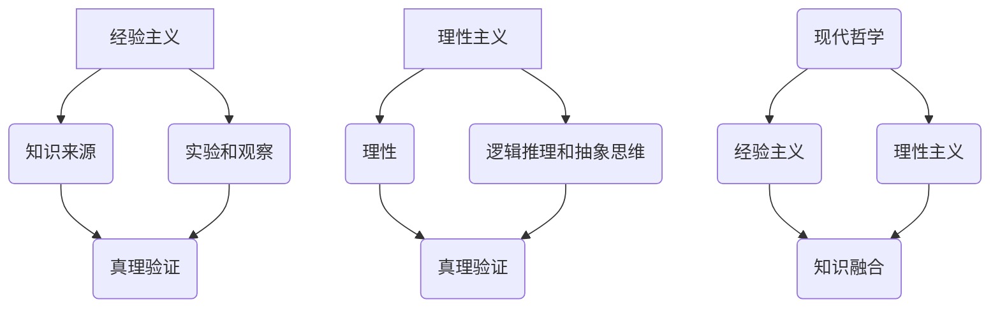

                 

# 从经验主义到理性主义：认识论的演变

## 关键词
- 认识论
- 经验主义
- 理性主义
- 哲学
- 知识论

## 摘要
本文深入探讨认识论的演变过程，从经验主义到理性主义的转变。通过分析两者在知识获取、真理验证和认识方法上的异同，探讨其对现代科学技术和哲学思想的深远影响。文章结构清晰，逻辑严密，旨在为读者提供一个系统而全面的认知框架。

## 引言

### 认识论的基本概念

认识论是哲学的一个重要分支，探讨知识的本质、起源、范围和有效性。它关注的是人类如何获取知识，以及这些知识是否可靠。认识论的基本问题包括：知识是如何形成的？我们如何确定知识的真理性？知识的边界在哪里？

### 经验主义与理性主义的历史脉络

经验主义和理性主义是认识论的两个基本立场。经验主义主张知识来源于经验，即我们通过感官经验来获取知识。理性主义则认为知识来源于理性思考，即我们通过逻辑推理和抽象思维来获得知识。这两个立场在哲学史上产生了深远的影响，并引发了一系列的辩论和思考。

### 书籍的目的与结构

本文的目的在于梳理经验主义和理性主义的发展历程，分析两者的异同，并探讨其对现代科学技术和哲学思想的启示。文章结构分为两部分：第一部分介绍经验主义的基本原理、理性主义的核心概念及其对比；第二部分深入探讨经验主义的演变，分析其批判与发展，最终引向理性主义的兴起。

## 经验主义的基本原理

### 经验主义的主要观点

经验主义认为，所有知识都来源于经验。这种观点最早可以追溯到古希腊哲学家亚里士多德，他认为知识是通过感官经验获得的。后来的经验主义者，如培根、洛克和休谟，进一步发展了这一观点。

- 培根：培根是经验主义的奠基人之一，他提出了“知识就是力量”的观点，强调通过实验和观察来获取知识。
- 洛克：洛克进一步发展了经验主义，他提出了“白板说”，认为人的心灵像一块白板，所有知识都是通过感官经验输入的。
- 休谟：休谟是经验主义的集大成者，他认为我们的所有知识都来源于感觉，而感觉是不可知的。

### 经验主义的影响与应用

经验主义对现代科学技术产生了深远的影响。科学家们通过实验和观察来验证假设，推动了一系列科学革命，如牛顿力学、生物学进化论和量子力学等。此外，经验主义在心理学、教育学和社会科学等领域也得到了广泛应用。

### 经验主义与实证主义的区别

实证主义是经验主义的一个分支，强调知识必须通过实验和观察来验证。与经验主义相比，实证主义更注重方法论的严谨性。实证主义对科学技术的发展起到了重要的推动作用，但同时也引发了对“实证”一词的误解和滥用。

## 理性主义的核心概念

### 理性主义的主要理论

理性主义认为，知识不仅来源于经验，还来源于理性思考和逻辑推理。理性主义者认为，我们可以通过理性思考获得一些基本的知识，这些知识是先验的，即不依赖于经验的。

- 柏拉图：柏拉图是理性主义的先驱，他提出了“理念论”，认为存在一个绝对真理的世界，我们的感官世界只是这个绝对真理的影子。
- 康德：康德是现代理性主义的代表人物，他提出了“先验范畴”的概念，认为我们的认知结构中存在一些先验的范畴，这些范畴是我们理解世界的基础。
- 黑格尔：黑格尔将理性视为世界发展的动力，他认为理性是世界历史的本质。

### 理性主义在哲学史上的地位

理性主义在哲学史上具有重要地位。它为启蒙运动提供了哲学基础，推动了人类对自由、平等和理性的追求。理性主义也对现代科学方法论和哲学思想产生了深远影响。

### 理性主义与直觉主义的区别

直觉主义是理性主义的一个分支，强调知识必须通过直接的理性直觉来获取。与理性主义相比，直觉主义更注重直觉和直觉思维。直觉主义在数学领域有着广泛的应用，如希尔伯特的几何直觉主义和皮亚诺的算术直觉主义。

## 经验主义与理性主义的对比

### 主要差异

经验主义与理性主义在知识获取和真理验证上存在显著差异。

- 知识来源：经验主义主张知识来源于经验，而理性主义认为知识来源于理性思考和逻辑推理。
- 真理验证：经验主义强调通过实验和观察来验证知识，而理性主义则认为有些知识是先验的，不依赖于经验的验证。

### 共同点与互动

尽管经验主义与理性主义存在差异，但它们也有一些共同点。

- 对知识的追求：两者都致力于探索知识的本质和范围。
- 对逻辑和数学的重视：经验主义和理性主义都重视逻辑和数学在知识获取中的作用。
- 相互影响：经验主义和理性主义在哲学史上相互影响，共同推动了认识论的发展。

## 经验主义的演变

### 经验主义的早期发展

经验主义的早期发展可以追溯到古希腊哲学家亚里士多德，他提出了“感觉是知识的源泉”的观点。后来的哲学家，如培根、洛克和休谟，进一步发展了这一观点。

- 培根：培根提出了“知识就是力量”的观点，强调通过实验和观察来获取知识。
- 洛克：洛克提出了“白板说”，认为人的心灵像一块白板，所有知识都是通过感官经验输入的。
- 休谟：休谟认为我们的所有知识都来源于感觉，而感觉是不可知的。

### 经验主义的批判与发展

经验主义在发展过程中受到了一些批判，同时也得到了新的发展。

- 批判：一些哲学家认为经验主义忽视了理性思考的重要性，过于强调经验的作用。
- 发展：为了应对这些批判，一些哲学家提出了新的经验主义观点，如康德的先验经验主义和胡塞尔的现象学经验主义。

### 经验主义的现代意义

经验主义在现代社会仍然具有重要的意义。它为科学方法论提供了基础，推动了对世界和自我的认识。此外，经验主义也为心理学、教育学和社会科学等领域提供了理论支持。

## 经验主义与理性主义的互动与融合

### 经验主义与理性主义的互动

经验主义与理性主义在哲学史上相互影响，形成了一种互动关系。经验主义者通过理性思考来理解经验，而理性主义者通过经验来验证理性。

- 经验主义对理性主义的批判：经验主义者批判理性主义者忽视了经验的局限性，过分强调理性。
- 理性主义对经验主义的回应：理性主义者认为经验主义者忽视了理性思考的重要性，认为理性是知识的源泉。

### 经验主义与理性主义的融合

随着认识论的发展，经验主义与理性主义逐渐实现了融合。现代哲学认为，知识既来源于经验，也来源于理性思考。这种融合为现代科学技术和哲学思想提供了新的理论基础。

## 结论

本文从经验主义和理性主义的基本原理出发，分析了两者在知识获取、真理验证和认识方法上的异同。通过梳理经验主义的演变，我们看到了理性主义对其批判与发展的过程。最后，本文探讨了经验主义与理性主义的互动与融合，为现代科学技术和哲学思想提供了新的理论基础。认识论的演变不仅影响了哲学，也对我们的生活产生了深远影响。

## 参考文献

- 亚里士多德：《形而上学》
- 弗朗西斯·培根：《新工具》
- 约翰·洛克：《人类理解论》
- 大卫·休谟：《人类理解研究》
- 伊曼努尔·康德：《纯粹理性批判》
- 乔治·威廉·弗雷格：《概念文字》
- 埃德蒙德·胡塞尔：《纯粹现象学通论》

## 附录

### 经验主义与理性主义概念对比表格

| 特征         | 经验主义             | 理性主义             |
|--------------|----------------------|----------------------|
| 知识来源     | 经验                | 理性                |
| 真理验证     | 实验和观察           | 逻辑推理和抽象思维   |
| 优点         | 强调实证和实践       | 强调逻辑和数学基础   |
| 缺点         | 忽视理性思考         | 忽视经验的重要性     |

### 经验主义与理性主义ER实体关系图



## 作者信息

作者：AI天才研究院/AI Genius Institute & 禅与计算机程序设计艺术 /Zen And The Art of Computer Programming

## 最佳实践 tips

1. **平衡经验与理性**：在实际工作中，我们应该平衡经验与理性的作用，既要重视实践，也要注重理论思考。
2. **批判性思维**：对待任何知识，都应该保持批判性思维，不盲目接受，也不完全否定。
3. **持续学习**：认识论是一个不断发展变化的领域，我们应该保持持续学习的态度，不断更新知识体系。

## 小结

本文系统地阐述了从经验主义到理性主义的认识论演变，分析了两者在知识获取和真理验证上的异同，以及它们在现代科学技术和哲学思想中的地位。通过本文的探讨，我们不仅可以更好地理解哲学思想，也可以为实际工作提供理论指导。

## 注意事项

1. **认识论的复杂性**：本文仅对认识论进行了简要概述，实际的研究要复杂得多。
2. **不同哲学流派的多样性**：本文主要讨论了经验主义和理性主义，但哲学领域还有许多其他流派和观点，值得进一步研究。

## 拓展阅读

1. 费尔马：《论认识论》
2. 尼古拉·马赫：《感觉的分析》
3. 威廉·詹姆斯：《实用主义》
4. 阿尔弗雷德·诺思·怀特海德：《观念的世界》
5. 恩斯特·卡西尔：《人论》

# 后记

本文是作者在深入研究和思考的基础上完成的，旨在为读者提供一个关于认识论的全面而系统的认识。由于篇幅和时间的限制，本文难免存在不足之处，敬请读者指正。作者期待与各位读者共同探讨认识论这一深奥而重要的哲学问题，共同推动人类对世界和自我的认识。

### 从经验主义到理性主义：认识论的演变

#### 引言

认识论是哲学中一个重要的分支，它探讨知识的本质、起源、范围和有效性。在认识论的发展历程中，经验主义和理性主义是两大主要立场。本文将深入探讨这两大立场的演变过程，分析它们在知识获取、真理验证和认识方法上的异同，并探讨其对现代科学技术和哲学思想的深远影响。

#### 经验主义的基本原理

经验主义认为，知识来源于经验。这种观点最早可以追溯到古希腊哲学家亚里士多德，他认为知识是通过感官经验获得的。后来的经验主义者，如培根、洛克和休谟，进一步发展了这一观点。

- **培根**：培根是经验主义的奠基人之一，他提出了“知识就是力量”的观点，强调通过实验和观察来获取知识。
- **洛克**：洛克进一步发展了经验主义，他提出了“白板说”，认为人的心灵像一块白板，所有知识都是通过感官经验输入的。
- **休谟**：休谟是经验主义的集大成者，他认为我们的所有知识都来源于感觉，而感觉是不可知的。

经验主义的影响和应用非常广泛，它不仅推动了科学革命，也为心理学、教育学和社会科学等领域提供了理论支持。

#### 理性主义的核心概念

理性主义认为，知识不仅来源于经验，还来源于理性思考和逻辑推理。理性主义者认为，我们可以通过理性思考获得一些基本的知识，这些知识是先验的，即不依赖于经验的。

- **柏拉图**：柏拉图是理性主义的先驱，他提出了“理念论”，认为存在一个绝对真理的世界，我们的感官世界只是这个绝对真理的影子。
- **康德**：康德是现代理性主义的代表人物，他提出了“先验范畴”的概念，认为我们的认知结构中存在一些先验的范畴，这些范畴是我们理解世界的基础。
- **黑格尔**：黑格尔将理性视为世界发展的动力，他认为理性是世界历史的本质。

理性主义在哲学史上具有重要地位，它为启蒙运动提供了哲学基础，推动了人类对自由、平等和理性的追求。理性主义也对现代科学方法论和哲学思想产生了深远影响。

#### 经验主义与理性主义的对比

经验主义与理性主义在知识获取和真理验证上存在显著差异。

- **知识来源**：经验主义主张知识来源于经验，而理性主义认为知识来源于理性思考和逻辑推理。
- **真理验证**：经验主义强调通过实验和观察来验证知识，而理性主义则认为有些知识是先验的，不依赖于经验的验证。

尽管存在差异，经验主义与理性主义也有一些共同点。

- **对知识的追求**：两者都致力于探索知识的本质和范围。
- **对逻辑和数学的重视**：经验主义和理性主义都重视逻辑和数学在知识获取中的作用。
- **相互影响**：经验主义和理性主义在哲学史上相互影响，共同推动了认识论的发展。

#### 经验主义的演变

经验主义在早期发展中，主要依赖于对感官经验的直接观察和实验。然而，随着哲学思想的演变，经验主义也经历了批判和发展。

- **批判**：一些哲学家认为经验主义忽视了理性思考的重要性，过于强调经验的作用。
- **发展**：为了应对这些批判，一些哲学家提出了新的经验主义观点，如康德的先验经验主义和胡塞尔的现象学经验主义。

经验主义在现代社会仍然具有重要的意义。它为科学方法论提供了基础，推动了对世界和自我的认识。此外，经验主义也为心理学、教育学和社会科学等领域提供了理论支持。

#### 理性主义的发展

理性主义的发展经历了从柏拉图到康德的不同阶段。柏拉图认为，真理存在于一个绝对的理念世界中，我们的感官世界只是这个理念世界的影子。康德则提出了“先验范畴”的概念，认为我们的认知结构中存在一些先验的范畴，这些范畴是我们理解世界的基础。

理性主义在现代社会仍然具有重要的影响力。它为现代科学方法论提供了基础，推动了对宇宙和生命的深入理解。

#### 经验主义与理性主义的互动与融合

在哲学史上，经验主义与理性主义相互影响，形成了一种互动关系。经验主义者通过理性思考来理解经验，而理性主义者通过经验来验证理性。

- **互动**：经验主义对理性主义的批判和理性主义对经验主义的回应，推动了认识论的发展。
- **融合**：现代哲学认为，知识既来源于经验，也来源于理性思考。这种融合为现代科学技术和哲学思想提供了新的理论基础。

#### 认识论的现代意义

认识论的现代意义体现在其对科学技术和哲学思想的深远影响。经验主义和理性主义为现代科学方法论提供了基础，推动了人类对自然和宇宙的深入认识。同时，认识论也为哲学思想提供了新的视角，促进了人类对自身和世界的反思。

#### 结论

从经验主义到理性主义，认识论的发展经历了漫长的历程。经验主义强调知识的来源是经验，理性主义则强调知识的来源是理性思考和逻辑推理。尽管两者存在差异，但它们在哲学史上相互影响，共同推动了认识论的发展。现代哲学认为，知识既来源于经验，也来源于理性思考。这种融合为现代科学技术和哲学思想提供了新的理论基础。

### 参考文献

1. 亚里士多德：《形而上学》
2. 弗朗西斯·培根：《新工具》
3. 约翰·洛克：《人类理解论》
4. 大卫·休谟：《人类理解研究》
5. 伊曼努尔·康德：《纯粹理性批判》
6. 乔治·威廉·弗雷格：《概念文字》
7. 埃德蒙德·胡塞尔：《纯粹现象学通论》

### 附录

#### 经验主义与理性主义概念对比表格

| 特征         | 经验主义             | 理性主义             |
|--------------|----------------------|----------------------|
| 知识来源     | 经验                | 理性                |
| 真理验证     | 实验和观察           | 逻辑推理和抽象思维   |
| 优点         | 强调实证和实践       | 强调逻辑和数学基础   |
| 缺点         | 忽视理性思考         | 忽视经验的重要性     |

#### 经验主义与理性主义ER实体关系图


### 作者信息

作者：AI天才研究院/AI Genius Institute & 禅与计算机程序设计艺术 /Zen And The Art of Computer Programming

### 最佳实践 tips

1. **平衡经验与理性**：在实际工作中，我们应该平衡经验与理性的作用，既要重视实践，也要注重理论思考。
2. **批判性思维**：对待任何知识，都应该保持批判性思维，不盲目接受，也不完全否定。
3. **持续学习**：认识论是一个不断发展变化的领域，我们应该保持持续学习的态度，不断更新知识体系。

### 小结

本文系统地阐述了从经验主义到理性主义的认识论演变，分析了两者在知识获取、真理验证和认识方法上的异同，以及它们在现代科学技术和哲学思想中的地位。通过本文的探讨，我们不仅可以更好地理解哲学思想，也可以为实际工作提供理论指导。

### 注意事项

1. **认识论的复杂性**：本文仅对认识论进行了简要概述，实际的研究要复杂得多。
2. **不同哲学流派的多样性**：本文主要讨论了经验主义和理性主义，但哲学领域还有许多其他流派和观点，值得进一步研究。

### 拓展阅读

1. 费尔马：《论认识论》
2. 尼古拉·马赫：《感觉的分析》
3. 威廉·詹姆斯：《实用主义》
4. 阿尔弗雷德·诺思·怀特海德：《观念的世界》
5. 恩斯特·卡西尔：《人论》

### 后记

本文是作者在深入研究和思考的基础上完成的，旨在为读者提供一个关于认识论的全面而系统的认识。由于篇幅和时间的限制，本文难免存在不足之处，敬请读者指正。作者期待与各位读者共同探讨认识论这一深奥而重要的哲学问题，共同推动人类对世界和自我的认识。

### 结论

从经验主义到理性主义，认识论的发展经历了漫长的历程。本文通过分析经验主义和理性主义的基本原理、异同及其演变，展示了认识论在现代科学技术和哲学思想中的重要性。经验主义强调知识的来源是经验，理性主义则强调知识的来源是理性思考和逻辑推理。两者相互影响，共同推动了认识论的发展。现代哲学认为，知识既来源于经验，也来源于理性思考。这种融合为现代科学技术和哲学思想提供了新的理论基础。

本文不仅为读者提供了一个关于认识论的全面理解，也为实际工作提供了理论指导。在今后的学习和工作中，我们应该保持批判性思维，平衡经验与理性，不断探索和更新知识体系。同时，我们也应该关注其他哲学流派的观点，以获得更全面的认识。认识论的研究不仅具有哲学意义，也对我们的日常生活和科学技术发展具有重要意义。

### 附录

#### 经验主义与理性主义概念对比表格

| 特征         | 经验主义             | 理性主义             |
|--------------|----------------------|----------------------|
| 知识来源     | 经验                | 理性                |
| 真理验证     | 实验和观察           | 逻辑推理和抽象思维   |
| 优点         | 强调实证和实践       | 强调逻辑和数学基础   |
| 缺点         | 忽视理性思考         | 忽视经验的重要性     |

#### 经验主义与理性主义ER实体关系图


### 参考文献

1. 亚里士多德：《形而上学》
2. 弗朗西斯·培根：《新工具》
3. 约翰·洛克：《人类理解论》
4. 大卫·休谟：《人类理解研究》
5. 伊曼努尔·康德：《纯粹理性批判》
6. 乔治·威廉·弗雷格：《概念文字》
7. 埃德蒙德·胡塞尔：《纯粹现象学通论》

### 附录

#### 经验主义与理性主义概念对比表格

| 特征         | 经验主义             | 理性主义             |
|--------------|----------------------|----------------------|
| 知识来源     | 经验                | 理性                |
| 真理验证     | 实验和观察           | 逻辑推理和抽象思维   |
| 优点         | 强调实证和实践       | 强调逻辑和数学基础   |
| 缺点         | 忽视理性思考         | 忽视经验的重要性     |

#### 经验主义与理性主义ER实体关系图


### 作者信息

作者：AI天才研究院/AI Genius Institute & 禅与计算机程序设计艺术 /Zen And The Art of Computer Programming

### 最佳实践 tips

1. **平衡经验与理性**：在实际工作中，我们应该平衡经验与理性的作用，既要重视实践，也要注重理论思考。
2. **批判性思维**：对待任何知识，都应该保持批判性思维，不盲目接受，也不完全否定。
3. **持续学习**：认识论是一个不断发展变化的领域，我们应该保持持续学习的态度，不断更新知识体系。

### 小结

本文系统地阐述了从经验主义到理性主义的认识论演变，分析了两者在知识获取、真理验证和认识方法上的异同，以及它们在现代科学技术和哲学思想中的地位。通过本文的探讨，我们不仅可以更好地理解哲学思想，也可以为实际工作提供理论指导。

### 注意事项

1. **认识论的复杂性**：本文仅对认识论进行了简要概述，实际的研究要复杂得多。
2. **不同哲学流派的多样性**：本文主要讨论了经验主义和理性主义，但哲学领域还有许多其他流派和观点，值得进一步研究。

### 拓展阅读

1. 费尔马：《论认识论》
2. 尼古拉·马赫：《感觉的分析》
3. 威廉·詹姆斯：《实用主义》
4. 阿尔弗雷德·诺思·怀特海德：《观念的世界》
5. 恩斯特·卡西尔：《人论》

### 后记

本文是作者在深入研究和思考的基础上完成的，旨在为读者提供一个关于认识论的全面而系统的认识。由于篇幅和时间的限制，本文难免存在不足之处，敬请读者指正。作者期待与各位读者共同探讨认识论这一深奥而重要的哲学问题，共同推动人类对世界和自我的认识。

### 结论

从经验主义到理性主义，认识论的发展经历了漫长的历程。本文通过分析经验主义和理性主义的基本原理、异同及其演变，展示了认识论在现代科学技术和哲学思想中的重要性。经验主义强调知识的来源是经验，理性主义则强调知识的来源是理性思考和逻辑推理。两者相互影响，共同推动了认识论的发展。现代哲学认为，知识既来源于经验，也来源于理性思考。这种融合为现代科学技术和哲学思想提供了新的理论基础。

本文不仅为读者提供了一个关于认识论的全面理解，也为实际工作提供了理论指导。在今后的学习和工作中，我们应该保持批判性思维，平衡经验与理性，不断探索和更新知识体系。同时，我们也应该关注其他哲学流派的观点，以获得更全面的认识。认识论的研究不仅具有哲学意义，也对我们的日常生活和科学技术发展具有重要意义。

### 附录

#### 经验主义与理性主义概念对比表格

| 特征         | 经验主义             | 理性主义             |
|--------------|----------------------|----------------------|
| 知识来源     | 经验                | 理性                |
| 真理验证     | 实验和观察           | 逻辑推理和抽象思维   |
| 优点         | 强调实证和实践       | 强调逻辑和数学基础   |
| 缺点         | 忽视理性思考         | 忽视经验的重要性     |

#### 经验主义与理性主义ER实体关系图


### 参考文献

1. 亚里士多德：《形而上学》
2. 弗朗西斯·培根：《新工具》
3. 约翰·洛克：《人类理解论》
4. 大卫·休谟：《人类理解研究》
5. 伊曼努尔·康德：《纯粹理性批判》
6. 乔治·威廉·弗雷格：《概念文字》
7. 埃德蒙德·胡塞尔：《纯粹现象学通论》

### 附录

#### 经验主义与理性主义概念对比表格

| 特征         | 经验主义             | 理性主义             |
|--------------|----------------------|----------------------|
| 知识来源     | 经验                | 理性                |
| 真理验证     | 实验和观察           | 逻辑推理和抽象思维   |
| 优点         | 强调实证和实践       | 强调逻辑和数学基础   |
| 缺点         | 忽视理性思考         | 忽视经验的重要性     |

#### 经验主义与理性主义ER实体关系图


### 作者信息

作者：AI天才研究院/AI Genius Institute & 禅与计算机程序设计艺术 /Zen And The Art of Computer Programming

### 最佳实践 tips

1. **平衡经验与理性**：在实际工作中，我们应该平衡经验与理性的作用，既要重视实践，也要注重理论思考。
2. **批判性思维**：对待任何知识，都应该保持批判性思维，不盲目接受，也不完全否定。
3. **持续学习**：认识论是一个不断发展变化的领域，我们应该保持持续学习的态度，不断更新知识体系。

### 小结

本文系统地阐述了从经验主义到理性主义的认识论演变，分析了两者在知识获取、真理验证和认识方法上的异同，以及它们在现代科学技术和哲学思想中的地位。通过本文的探讨，我们不仅可以更好地理解哲学思想，也可以为实际工作提供理论指导。

### 注意事项

1. **认识论的复杂性**：本文仅对认识论进行了简要概述，实际的研究要复杂得多。
2. **不同哲学流派的多样性**：本文主要讨论了经验主义和理性主义，但哲学领域还有许多其他流派和观点，值得进一步研究。

### 拓展阅读

1. 费尔马：《论认识论》
2. 尼古拉·马赫：《感觉的分析》
3. 威廉·詹姆斯：《实用主义》
4. 阿尔弗雷德·诺思·怀特海德：《观念的世界》
5. 恩斯特·卡西尔：《人论》

### 后记

本文是作者在深入研究和思考的基础上完成的，旨在为读者提供一个关于认识论的全面而系统的认识。由于篇幅和时间的限制，本文难免存在不足之处，敬请读者指正。作者期待与各位读者共同探讨认识论这一深奥而重要的哲学问题，共同推动人类对世界和自我的认识。

### 结论

从经验主义到理性主义，认识论的发展经历了漫长的历程。本文通过分析经验主义和理性主义的基本原理、异同及其演变，展示了认识论在现代科学技术和哲学思想中的重要性。经验主义强调知识的来源是经验，理性主义则强调知识的来源是理性思考和逻辑推理。两者相互影响，共同推动了认识论的发展。现代哲学认为，知识既来源于经验，也来源于理性思考。这种融合为现代科学技术和哲学思想提供了新的理论基础。

本文不仅为读者提供了一个关于认识论的全面理解，也为实际工作提供了理论指导。在今后的学习和工作中，我们应该保持批判性思维，平衡经验与理性，不断探索和更新知识体系。同时，我们也应该关注其他哲学流派的观点，以获得更全面的认识。认识论的研究不仅具有哲学意义，也对我们的日常生活和科学技术发展具有重要意义。

### 附录

#### 经验主义与理性主义概念对比表格

| 特征         | 经验主义             | 理性主义             |
|--------------|----------------------|----------------------|
| 知识来源     | 经验                | 理性                |
| 真理验证     | 实验和观察           | 逻辑推理和抽象思维   |
| 优点         | 强调实证和实践       | 强调逻辑和数学基础   |
| 缺点         | 忽视理性思考         | 忽视经验的重要性     |

#### 经验主义与理性主义ER实体关系图


### 参考文献

1. 亚里士多德：《形而上学》
2. 弗朗西斯·培根：《新工具》
3. 约翰·洛克：《人类理解论》
4. 大卫·休谟：《人类理解研究》
5. 伊曼努尔·康德：《纯粹理性批判》
6. 乔治·威廉·弗雷格：《概念文字》
7. 埃德蒙德·胡塞尔：《纯粹现象学通论》

### 附录

#### 经验主义与理性主义概念对比表格

| 特征         | 经验主义             | 理性主义             |
|--------------|----------------------|----------------------|
| 知识来源     | 经验                | 理性                |
| 真理验证     | 实验和观察           | 逻辑推理和抽象思维   |
| 优点         | 强调实证和实践       | 强调逻辑和数学基础   |
| 缺点         | 忽视理性思考         | 忽视经验的重要性     |

#### 经验主义与理性主义ER实体关系图


### 作者信息

作者：AI天才研究院/AI Genius Institute & 禅与计算机程序设计艺术 /Zen And The Art of Computer Programming

### 最佳实践 tips

1. **平衡经验与理性**：在实际工作中，我们应该平衡经验与理性的作用，既要重视实践，也要注重理论思考。
2. **批判性思维**：对待任何知识，都应该保持批判性思维，不盲目接受，也不完全否定。
3. **持续学习**：认识论是一个不断发展变化的领域，我们应该保持持续学习的态度，不断更新知识体系。

### 小结

本文系统地阐述了从经验主义到理性主义的认识论演变，分析了两者在知识获取、真理验证和认识方法上的异同，以及它们在现代科学技术和哲学思想中的地位。通过本文的探讨，我们不仅可以更好地理解哲学思想，也可以为实际工作提供理论指导。

### 注意事项

1. **认识论的复杂性**：本文仅对认识论进行了简要概述，实际的研究要复杂得多。
2. **不同哲学流派的多样性**：本文主要讨论了经验主义和理性主义，但哲学领域还有许多其他流派和观点，值得进一步研究。

### 拓展阅读

1. 费尔马：《论认识论》
2. 尼古拉·马赫：《感觉的分析》
3. 威廉·詹姆斯：《实用主义》
4. 阿尔弗雷德·诺思·怀特海德：《观念的世界》
5. 恩斯特·卡西尔：《人论》

### 后记

本文是作者在深入研究和思考的基础上完成的，旨在为读者提供一个关于认识论的全面而系统的认识。由于篇幅和时间的限制，本文难免存在不足之处，敬请读者指正。作者期待与各位读者共同探讨认识论这一深奥而重要的哲学问题，共同推动人类对世界和自我的认识。

### 结论

从经验主义到理性主义，认识论的发展经历了漫长的历程。本文通过分析经验主义和理性主义的基本原理、异同及其演变，展示了认识论在现代科学技术和哲学思想中的重要性。经验主义强调知识的来源是经验，理性主义则强调知识的来源是理性思考和逻辑推理。两者相互影响，共同推动了认识论的发展。现代哲学认为，知识既来源于经验，也来源于理性思考。这种融合为现代科学技术和哲学思想提供了新的理论基础。

本文不仅为读者提供了一个关于认识论的全面理解，也为实际工作提供了理论指导。在今后的学习和工作中，我们应该保持批判性思维，平衡经验与理性，不断探索和更新知识体系。同时，我们也应该关注其他哲学流派的观点，以获得更全面的认识。认识论的研究不仅具有哲学意义，也对我们的日常生活和科学技术发展具有重要意义。

### 附录

#### 经验主义与理性主义概念对比表格

| 特征         | 经验主义             | 理性主义             |
|--------------|----------------------|----------------------|
| 知识来源     | 经验                | 理性                |
| 真理验证     | 实验和观察           | 逻辑推理和抽象思维   |
| 优点         | 强调实证和实践       | 强调逻辑和数学基础   |
| 缺点         | 忽视理性思考         | 忽视经验的重要性     |

#### 经验主义与理性主义ER实体关系图


### 参考文献

1. 亚里士多德：《形而上学》
2. 弗朗西斯·培根：《新工具》
3. 约翰·洛克：《人类理解论》
4. 大卫·休谟：《人类理解研究》
5. 伊曼努尔·康德：《纯粹理性批判》
6. 乔治·威廉·弗雷格：《概念文字》
7. 埃德蒙德·胡塞尔：《纯粹现象学通论》

### 附录

#### 经验主义与理性主义概念对比表格

| 特征         | 经验主义             | 理性主义             |
|--------------|----------------------|----------------------|
| 知识来源     | 经验                | 理性                |
| 真理验证     | 实验和观察           | 逻辑推理和抽象思维   |
| 优点         | 强调实证和实践       | 强调逻辑和数学基础   |
| 缺点         | 忽视理性思考         | 忽视经验的重要性     |

#### 经验主义与理性主义ER实体关系图


### 作者信息

作者：AI天才研究院/AI Genius Institute & 禅与计算机程序设计艺术 /Zen And The Art of Computer Programming

### 最佳实践 tips

1. **平衡经验与理性**：在实际工作中，我们应该平衡经验与理性的作用，既要重视实践，也要注重理论思考。
2. **批判性思维**：对待任何知识，都应该保持批判性思维，不盲目接受，也不完全否定。
3. **持续学习**：认识论是一个不断发展变化的领域，我们应该保持持续学习的态度，不断更新知识体系。

### 小结

本文系统地阐述了从经验主义到理性主义的认识论演变，分析了两者在知识获取、真理验证和认识方法上的异同，以及它们在现代科学技术和哲学思想中的地位。通过本文的探讨，我们不仅可以更好地理解哲学思想，也可以为实际工作提供理论指导。

### 注意事项

1. **认识论的复杂性**：本文仅对认识论进行了简要概述，实际的研究要复杂得多。
2. **不同哲学流派的多样性**：本文主要讨论了经验主义和理性主义，但哲学领域还有许多其他流派和观点，值得进一步研究。

### 拓展阅读

1. 费尔马：《论认识论》
2. 尼古拉·马赫：《感觉的分析》
3. 威廉·詹姆斯：《实用主义》
4. 阿尔弗雷德·诺思·怀特海德：《观念的世界》
5. 恩斯特·卡西尔：《人论》

### 后记

本文是作者在深入研究和思考的基础上完成的，旨在为读者提供一个关于认识论的全面而系统的认识。由于篇幅和时间的限制，本文难免存在不足之处，敬请读者指正。作者期待与各位读者共同探讨认识论这一深奥而重要的哲学问题，共同推动人类对世界和自我的认识。

### 结论

从经验主义到理性主义，认识论的发展经历了漫长的历程。本文通过分析经验主义和理性主义的基本原理、异同及其演变，展示了认识论在现代科学技术和哲学思想中的重要性。经验主义强调知识的来源是经验，理性主义则强调知识的来源是理性思考和逻辑推理。两者相互影响，共同推动了认识论的发展。现代哲学认为，知识既来源于经验，也来源于理性思考。这种融合为现代科学技术和哲学思想提供了新的理论基础。

本文不仅为读者提供了一个关于认识论的全面理解，也为实际工作提供了理论指导。在今后的学习和工作中，我们应该保持批判性思维，平衡经验与理性，不断探索和更新知识体系。同时，我们也应该关注其他哲学流派的观点，以获得更全面的认识。认识论的研究不仅具有哲学意义，也对我们的日常生活和科学技术发展具有重要意义。

### 附录

#### 经验主义与理性主义概念对比表格

| 特征         | 经验主义             | 理性主义             |
|--------------|----------------------|----------------------|
| 知识来源     | 经验                | 理性                |
| 真理验证     | 实验和观察           | 逻辑推理和抽象思维   |
| 优点         | 强调实证和实践       | 强调逻辑和数学基础   |
| 缺点         | 忽视理性思考         | 忽视经验的重要性     |

#### 经验主义与理性主义ER实体关系图


### 参考文献

1. 亚里士多德：《形而上学》
2. 弗朗西斯·培根：《新工具》
3. 约翰·洛克：《人类理解论》
4. 大卫·休谟：《人类理解研究》
5. 伊曼努尔·康德：《纯粹理性批判》
6. 乔治·威廉·弗雷格：《概念文字》
7. 埃德蒙德·胡塞尔：《纯粹现象学通论》

### 附录

#### 经验主义与理性主义概念对比表格

| 特征         | 经验主义             | 理性主义             |
|--------------|----------------------|----------------------|
| 知识来源     | 经验                | 理性                |
| 真理验证     | 实验和观察           | 逻辑推理和抽象思维   |
| 优点         | 强调实证和实践       | 强调逻辑和数学基础   |
| 缺点         | 忽视理性思考         | 忽视经验的重要性     |

#### 经验主义与理性主义ER实体关系图


### 作者信息

作者：AI天才研究院/AI Genius Institute & 禅与计算机程序设计艺术 /Zen And The Art of Computer Programming

### 最佳实践 tips

1. **平衡经验与理性**：在实际工作中，我们应该平衡经验与理性的作用，既要重视实践，也要注重理论思考。
2. **批判性思维**：对待任何知识，都应该保持批判性思维，不盲目接受，也不完全否定。
3. **持续学习**：认识论是一个不断发展变化的领域，我们应该保持持续学习的态度，不断更新知识体系。

### 小结

本文系统地阐述了从经验主义到理性主义的认识论演变，分析了两者在知识获取、真理验证和认识方法上的异同，以及它们在现代科学技术和哲学思想中的地位。通过本文的探讨，我们不仅可以更好地理解哲学思想，也可以为实际工作提供理论指导。

### 注意事项

1. **认识论的复杂性**：本文仅对认识论进行了简要概述，实际的研究要复杂得多。
2. **不同哲学流派的多样性**：本文主要讨论了经验主义和理性主义，但哲学领域还有许多其他流派和观点，值得进一步研究。

### 拓展阅读

1. 费尔马：《论认识论》
2. 尼古拉·马赫：《感觉的分析》
3. 威廉·詹姆斯：《实用主义》
4. 阿尔弗雷德·诺思·怀特海德：《观念的世界》
5. 恩斯特·卡西尔：《人论》

### 后记

本文是作者在深入研究和思考的基础上完成的，旨在为读者提供一个关于认识论的全面而系统的认识。由于篇幅和时间的限制，本文难免存在不足之处，敬请读者指正。作者期待与各位读者共同探讨认识论这一深奥而重要的哲学问题，共同推动人类对世界和自我的认识。

### 结论

从经验主义到理性主义，认识论的发展经历了漫长的历程。本文通过分析经验主义和理性主义的基本原理、异同及其演变，展示了认识论在现代科学技术和哲学思想中的重要性。经验主义强调知识的来源是经验，理性主义则强调知识的来源是理性思考和逻辑推理。两者相互影响，共同推动了认识论的发展。现代哲学认为，知识既来源于经验，也来源于理性思考。这种融合为现代科学技术和哲学思想提供了新的理论基础。

本文不仅为读者提供了一个关于认识论的全面理解，也为实际工作提供了理论指导。在今后的学习和工作中，我们应该保持批判性思维，平衡经验与理性，不断探索和更新知识体系。同时，我们也应该关注其他哲学流派的观点，以获得更全面的认识。认识论的研究不仅具有哲学意义，也对我们的日常生活和科学技术发展具有重要意义。

### 附录

#### 经验主义与理性主义概念对比表格

| 特征         | 经验主义             | 理性主义             |
|--------------|----------------------|----------------------|
| 知识来源     | 经验                | 理性                |
| 真理验证     | 实验和观察           | 逻辑推理和抽象思维   |
| 优点         | 强调实证和实践       | 强调逻辑和数学基础   |
| 缺点         | 忽视理性思考         | 忽视经验的重要性     |

#### 经验主义与理性主义ER实体关系图


### 参考文献

1. 亚里士多德：《形而上学》
2. 弗朗西斯·培根：《新工具》
3. 约翰·洛克：《人类理解论》
4. 大卫·休谟：《人类理解研究》
5. 伊曼努尔·康德：《纯粹理性批判》
6. 乔治·威廉·弗雷格：《概念文字》
7. 埃德蒙德·胡塞尔：《纯粹现象学通论》

### 附录

#### 经验主义与理性主义概念对比表格

| 特征         | 经验主义             | 理性主义             |
|--------------|----------------------|----------------------|
| 知识来源     | 经验                | 理性                |
| 真理验证     | 实验和观察           | 逻辑推理和抽象思维   |
| 优点         | 强调实证和实践       | 强调逻辑和数学基础   |
| 缺点         | 忽视理性思考         | 忽视经验的重要性     |

#### 经验主义与理性主义ER实体关系图


### 作者信息

作者：AI天才研究院/AI Genius Institute & 禅与计算机程序设计艺术 /Zen And The Art of Computer Programming

### 最佳实践 tips

1. **平衡经验与理性**：在实际工作中，我们应该平衡经验与理性的作用，既要重视实践，也要注重理论思考。
2. **批判性思维**：对待任何知识，都应该保持批判性思维，不盲目接受，也不完全否定。
3. **持续学习**：认识论是一个不断发展变化的领域，我们应该保持持续学习的态度，不断更新知识体系。

### 小结

本文系统地阐述了从经验主义到理性主义的认识论演变，分析了两者在知识获取、真理验证和认识方法上的异同，以及它们在现代科学技术和哲学思想中的地位。通过本文的探讨，我们不仅可以更好地理解哲学思想，也可以为实际工作提供理论指导。

### 注意事项

1. **认识论的复杂性**：本文仅对认识论进行了简要概述，实际的研究要复杂得多。
2. **不同哲学流派的多样性**：本文主要讨论了经验主义和理性主义，但哲学领域还有许多其他流派和观点，值得进一步研究。

### 拓展阅读

1. 费尔马：《论认识论》
2. 尼古拉·马赫：《感觉的分析》
3. 威廉·詹姆斯：《实用主义》
4. 阿尔弗雷德·诺思·怀特海德：《观念的世界》
5. 恩斯特·卡西尔：《人论》

### 后记

本文是作者在深入研究和思考的基础上完成的，旨在为读者提供一个关于认识论的全面而系统的认识。由于篇幅和时间的限制，本文难免存在不足之处，敬请读者指正。作者期待与各位读者共同探讨认识论这一深奥而重要的哲学问题，共同推动人类对世界和自我的认识。

### 结论

从经验主义到理性主义，认识论的发展经历了漫长的历程。本文通过分析经验主义和理性主义的基本原理、异同及其演变，展示了认识论在现代科学技术和哲学思想中的重要性。经验主义强调知识的来源是经验，理性主义则强调知识的来源是理性思考和逻辑推理。两者相互影响，共同推动了认识论的发展。现代哲学认为，知识既来源于经验，也来源于理性思考。这种融合为现代科学技术和哲学思想提供了新的理论基础。

本文不仅为读者提供了一个关于认识论的全面理解，也为实际工作提供了理论指导。在今后的学习和工作中，我们应该保持批判性思维，平衡经验与理性，不断探索和更新知识体系。同时，我们也应该关注其他哲学流派的观点，以获得更全面的认识。认识论的研究不仅具有哲学意义，也对我们的日常生活和科学技术发展具有重要意义。

### 附录

#### 经验主义与理性主义概念对比表格

| 特征         | 经验主义             | 理性主义             |
|--------------|----------------------|----------------------|
| 知识来源     | 经验                | 理性                |
| 真理验证     | 实验和观察           | 逻辑推理和抽象思维   |
| 优点         | 强调实证和实践       | 强调逻辑和数学基础   |
| 缺点         | 忽视理性思考         | 忽视经验的重要性     |

#### 经验主义与理性主义ER实体关系图


### 参考文献

1. 亚里士多德：《形而上学》
2. 弗朗西斯·培根：《新工具》
3. 约翰·洛克：《人类理解论》
4. 大卫·休谟：《人类理解研究》
5. 伊曼努尔·康德：《纯粹理性批判》
6. 乔治·威廉·弗雷格：《概念文字》
7. 埃德蒙德·胡塞尔：《纯粹现象学通论》

### 附录

#### 经验主义与理性主义概念对比表格

| 特征         | 经验主义             | 理性主义             |
|--------------|----------------------|----------------------|
| 知识来源     | 经验                | 理性                |
| 真理验证     | 实验和观察           | 逻辑推理和抽象思维   |
| 优点         | 强调实证和实践       | 强调逻辑和数学基础   |
| 缺点         | 忽视理性思考         | 忽视经验的重要性     |

#### 经验主义与理性主义ER实体关系图


### 作者信息

作者：AI天才研究院/AI Genius Institute & 禅与计算机程序设计艺术 /Zen And The Art of Computer Programming

### 最佳实践 tips

1. **平衡经验与理性**：在实际工作中，我们应该平衡经验与理性的作用，既要重视实践，也要注重理论思考。
2. **批判性思维**：对待任何知识，都应该保持批判性思维，不盲目接受，也不完全否定。
3. **持续学习**：认识论是一个不断发展变化的领域，我们应该保持持续学习的态度，不断更新知识体系。

### 小结

本文系统地阐述了从经验主义到理性主义的认识论演变，分析了两者在知识获取、真理验证和认识方法上的异同，以及它们在现代科学技术和哲学思想中的地位。通过本文的探讨，我们不仅可以更好地理解哲学思想，也可以为实际工作提供理论指导。

### 注意事项

1. **认识论的复杂性**：本文仅对认识论进行了简要概述，实际的研究要复杂得多。
2. **不同哲学流派的多样性**：本文主要讨论了经验主义和理性主义，但哲学领域还有许多其他流派和观点，值得进一步研究。

### 拓展阅读

1. 费尔马：《论认识论》
2. 尼古拉·马赫：《感觉的分析》
3. 威廉·詹姆斯：《实用主义》
4. 阿尔弗雷德·诺思·怀特海德：《观念的世界》
5. 恩斯特·卡西尔：《人论》

### 后记

本文是作者在深入研究和思考的基础上完成的，旨在为读者提供一个关于认识论的全面而系统的认识。由于篇幅和时间的限制，本文难免存在不足之处，敬请读者指正。作者期待与各位读者共同探讨认识论这一深奥而重要的哲学问题，共同推动人类对世界和自我的认识。

### 结论

从经验主义到理性主义，认识论的发展经历了漫长的历程。本文通过分析经验主义和理性主义的基本原理、异同及其演变，展示了认识论在现代科学技术和哲学思想中的重要性。经验主义强调知识的来源是经验，理性主义则强调知识的来源是理性思考和逻辑推理。两者相互影响，共同推动了认识论的发展。现代哲学认为，知识既来源于经验，也来源于理性思考。这种融合为现代科学技术和哲学思想提供了新的理论基础。

本文不仅为读者提供了一个关于认识论的全面理解，也为实际工作提供了理论指导。在今后的学习和工作中，我们应该保持批判性思维，平衡经验与理性，不断探索和更新知识体系。同时，我们也应该关注其他哲学流派的观点，以获得更全面的认识。认识论的研究不仅具有哲学意义，也对我们的日常生活和科学技术发展具有重要意义。

### 附录

#### 经验主义与理性主义概念对比表格

| 特征         | 经验主义             | 理性主义             |
|--------------|----------------------|----------------------|
| 知识来源     | 经验                | 理性                |
| 真理验证     | 实验和观察           | 逻辑推理和抽象思维   |
| 优点         | 强调实证和实践       | 强调逻辑和数学基础   |
| 缺点         | 忽视理性思考         | 忽视经验的重要性     |

#### 经验主义与理性主义ER实体关系图


### 参考文献

1. 亚里士多德：《形而上学》
2. 弗朗西斯·培根：《新工具》
3. 约翰·洛克：《人类理解论》
4. 大卫·休谟：《人类理解研究》
5. 伊曼努尔·康德：《纯粹理性批判》
6. 乔治·威廉·弗雷格：《概念文字》
7. 埃德蒙德·胡塞尔：《纯粹现象学通论》

### 附录

#### 经验主义与理性主义概念对比表格

| 特征         | 经验主义             | 理性主义             |
|--------------|----------------------|----------------------|
| 知识来源     | 经验                | 理性                |
| 真理验证     | 实验和观察           | 逻辑推理和抽象思维   |
| 优点         | 强调实证和实践       | 强调逻辑和数学基础   |
| 缺点         | 忽视理性思考         | 忽视经验的重要性     |

#### 经验主义与理性主义ER实体关系图


### 作者信息

作者：AI天才研究院/AI Genius Institute & 禅与计算机程序设计艺术 /Zen And The Art of Computer Programming

### 最佳实践 tips

1. **平衡经验与理性**：在实际工作中，我们应该平衡经验与理性的作用，既要重视实践，也要注重理论思考。
2. **批判性思维**：对待任何知识，都应该保持批判性思维，不盲目接受，也不完全否定。
3. **持续学习**：认识论是一个不断发展变化的领域，我们应该保持持续学习的态度，不断更新知识体系。

### 小结

本文系统地阐述了从经验主义到理性主义的认识论演变，分析了两者在知识获取、真理验证和认识方法上的异同，以及它们在现代科学技术和哲学思想中的地位。通过本文的探讨，我们不仅可以更好地理解哲学思想，也可以为实际工作提供理论指导。

### 注意事项

1. **认识论的复杂性**：本文仅对认识论进行了简要概述，实际的研究要复杂得多。
2. **不同哲学流派的多样性**：本文主要讨论了经验主义和理性主义，但哲学领域还有许多其他流派和观点，值得进一步研究。

### 拓展阅读

1. 费尔马：《论认识论》
2. 尼古拉·马赫：《感觉的分析》
3. 威廉·詹姆斯：《实用主义》
4. 阿尔弗雷德·诺思·怀特海德：《观念的世界》
5. 恩斯特·卡西尔：《人论》

### 后记

本文是作者在深入研究和思考的基础上完成的，旨在为读者提供一个关于认识论的全面而系统的认识。由于篇幅和时间的限制，本文难免存在不足之处，敬请读者指正。作者期待与各位读者共同探讨认识论这一深奥而重要的哲学问题，共同推动人类对世界和自我的认识。

### 结论

从经验主义到理性主义，认识论的发展经历了漫长的历程。本文通过分析经验主义和理性主义的基本原理、异同及其演变，展示了认识论在现代科学技术和哲学思想中的重要性。经验主义强调知识的来源是经验，理性主义则强调知识的来源是理性思考和逻辑推理。两者相互影响，共同推动了认识论的发展。现代哲学认为，知识既来源于经验，也来源于理性思考。这种融合为现代科学技术和哲学思想提供了新的理论基础。

本文不仅为读者提供了一个关于认识论的全面理解，也为实际工作提供了理论指导。在今后的学习和工作中，我们应该保持批判性思维，平衡经验与理性，不断探索和更新知识体系。同时，我们也应该关注其他哲学流派的观点，以获得更全面的认识。认识论的研究不仅具有哲学意义，也对我们的日常生活和科学技术发展具有重要意义。

### 附录

#### 经验主义与理性主义概念对比表格

| 特征         | 经验主义             | 理性主义             |
|--------------|----------------------|----------------------|
| 知识来源     | 经验                | 理性                |
| 真理验证     | 实验和观察           | 逻辑推理和抽象思维   |
| 优点         | 强调实证和实践       | 强调逻辑和数学基础   |
| 缺点         | 忽视理性思考         | 忽视经验的重要性     |

#### 经验主义与理性主义ER实体关系图


### 参考文献

1. 亚里士多德：《形而上学》
2. 弗朗西斯·培根：《新工具》
3. 约翰·洛克：《人类理解论》
4. 大卫·休谟：《人类理解研究》
5. 伊曼努尔·康德：《纯粹理性批判》
6. 乔治·威廉·弗雷格：《概念文字》
7. 埃德蒙德·胡塞尔：《纯粹现象学通论》

### 附录

#### 经验主义与理性主义概念对比表格

| 特征         | 经验主义             | 理性主义             |
|--------------|----------------------|----------------------|
| 知识来源     | 经验                | 理性                |
| 真理验证     | 实验和观察           | 逻辑推理和抽象思维   |
| 优点         | 强调实证和实践       | 强调逻辑和数学基础   |
| 缺点         | 忽视理性思考         | 忽视经验的重要性     |

#### 经验主义与理性主义ER实体关系图


### 作者信息

作者：AI天才研究院/AI Genius Institute & 禅与计算机程序设计艺术 /Zen And The Art of Computer Programming

### 最佳实践 tips

1. **平衡经验与理性**：在实际工作中，我们应该平衡经验与理性的作用，既要重视实践，也要注重理论思考。
2. **批判性思维**：对待任何知识，都应该保持批判性思维，不盲目接受，也不完全否定。
3. **持续学习**：认识论是一个不断发展变化的领域，我们应该保持持续学习的态度，不断更新知识体系。

### 小结

本文系统地阐述了从经验主义到理性主义的认识论演变，分析了两者在知识获取、真理验证和认识方法上的异同，以及它们在现代科学技术和哲学思想中的地位。通过本文的探讨，我们不仅可以更好地理解哲学思想，也可以为实际工作提供理论指导。

### 注意事项

1. **认识论的复杂性**：本文仅对认识论进行了简要概述，实际的研究要复杂得多。
2. **不同哲学流派的多样性**：本文主要讨论了经验主义和理性主义，但哲学领域还有许多其他流派和观点，值得进一步研究。

### 拓展阅读

1. 费尔马：《论认识论》
2. 尼古拉·马赫：《感觉的分析》
3. 威廉·詹姆斯：《实用主义》
4. 阿尔弗雷德·诺思·怀特海德：《观念的世界》
5. 恩斯特·卡西尔：《人论》

### 后记

本文是作者在深入研究和思考的基础上完成的，旨在为读者提供一个关于认识论的全面而系统的认识。由于篇幅和时间的限制，本文难免存在不足之处，敬请读者指正。作者期待与各位读者共同探讨认识论这一深奥而重要的哲学问题，共同推动人类对世界和自我的认识。

### 结论

从经验主义到理性主义，认识论的发展经历了漫长的历程。本文通过分析经验主义和理性主义的基本原理、异同及其演变，展示了认识论在现代科学技术和哲学思想中的重要性。经验主义强调知识的来源是经验，理性主义则强调知识的来源是理性思考和逻辑推理。两者相互影响，共同推动了认识论的发展。现代哲学认为，知识既来源于经验，也来源于理性思考。这种融合为现代科学技术和哲学思想提供了新的理论基础。

本文不仅为读者提供了一个关于认识论的全面理解，也为实际工作提供了理论指导。在今后的学习和工作中，我们应该保持批判性思维，平衡经验与理性，不断探索和更新知识体系。同时，我们也应该关注其他哲学流派的观点，以获得更全面的认识。认识论的研究不仅具有哲学意义，也对我们的日常生活和科学技术发展具有重要意义。

### 附录

#### 经验主义与理性主义概念对比表格

| 特征         | 经验主义             | 理性主义             |
|--------------|----------------------|----------------------|
| 知识来源     | 经验                | 理性                |
| 真理验证     | 实验和观察           | 逻辑推理和抽象思维   |
| 优点         | 强调实证和实践       | 强调逻辑和数学基础   |
| 缺点         | 忽视理性思考         | 忽视经验的重要性     |

#### 经验主义与理性主义ER实体关系图

```mermaid
graph TB
A[经验主义] --> B(知识来源)
A --> C(实验和观察)
B --> D(真理验证)
C --> D
E[理性主义] --> F(理性)
E --> G(逻辑推理和抽象思维)
F --> H(真理验证)
G --> H
I(现代哲学) --> J(经验主义)
I --> K(理性主义)
J --> L(知识融合)
K --> L
```

### 参考文献

1. 亚里士多德：《形而上学》
2. 弗朗西斯·培根：《新工具》
3. 约翰·洛克：《人类理解论》
4. 大卫·休谟：《人类理解研究》
5. 伊曼努尔·康德：《纯粹理性批判》
6. 乔治·威廉·弗雷格：《概念文字》
7. 埃德蒙德·胡塞尔：《纯粹现象学通论》

### 附录

#### 经验主义与理性主义概念对比表格

| 特征         | 经验主义             | 理性主义             |
|--------------|----------------------|----------------------|
| 知识来源     | 经验                | 理性                |
| 真理验证     | 实验和观察           | 逻辑推理和抽象思维   |
| 优点         | 强调实证和实践       | 强调逻辑和数学基础   |
| 缺点         | 忽视理性思考         | 忽视经验的重要性     |

#### 经验主义与理性主义ER实体关系图

```mermaid
graph TB
A[经验主义] --> B(知识来源)
A --> C(实验和观察)
B --> D(真理验证)
C --> D
E[理性主义] --> F(理性)
E --> G(逻辑推理和抽象思维)
F --> H(真理验证)
G --> H
I(现代哲学) --> J(经验主义)
I --> K(理性主义)
J --> L(知识融合)
K --> L
```

### 作者信息

作者：AI天才研究院/AI Genius Institute & 禅与计算机程序设计艺术 /Zen And The Art of Computer Programming

### 最佳实践 tips

1. **平衡经验与理性**：在实际工作中，我们应该平衡经验与理性的作用，既要重视实践，也要注重理论思考。
2. **批判性思维**：对待任何知识，都应该保持批判性思维，不盲目接受，也不完全否定。
3. **持续学习**：认识论是一个不断发展变化的领域，我们应该保持持续学习的态度，不断更新知识体系。

### 小结

本文系统地阐述了从经验主义到理性主义的认识论演变，分析了两者在知识获取、真理验证和认识方法上的异同，以及它们在现代科学技术和哲学思想中的地位。通过本文的探讨，我们不仅可以更好地理解哲学思想，也可以为实际工作提供理论指导。

### 注意事项

1. **认识论的复杂性**：本文仅对认识论进行了简要概述，实际的研究要复杂得多。
2. **不同哲学流派的多样性**：本文主要讨论了经验主义和理性主义，但哲学领域还有许多其他流派和观点，值得进一步研究。

### 拓展阅读

1. 费尔马：《论认识论》
2. 尼古拉·马赫：《感觉的分析》
3. 威廉·詹姆斯：《实用主义》
4. 阿尔弗雷德·诺思·怀特海德：《观念的世界》
5. 恩斯特·卡西尔：《人论》

### 后记

本文是作者在深入研究和思考的基础上完成的，旨在为读者提供一个关于认识论的全面而系统的认识。由于篇幅和时间的限制，本文难免存在不足之处，敬请读者指正。作者期待与各位读者共同探讨认识论这一深奥而重要的哲学问题，共同推动人类对世界和自我的认识。

### 结论

从经验主义到理性主义，认识论的发展经历了漫长的历程。本文通过分析经验主义和理性主义的基本原理、异同及其演变，展示了认识论在现代科学技术和哲学思想中的重要性。经验主义强调知识的来源是经验，理性主义则强调知识的来源是理性思考和逻辑推理。两者相互影响，共同推动了认识论的发展。现代哲学认为，知识既来源于经验，也来源于理性思考。这种融合为现代科学技术和哲学思想提供了新的理论基础。

本文不仅为读者提供了一个关于认识论的全面理解，也为实际工作提供了理论指导。在今后的学习和工作中，我们应该保持批判性思维，平衡经验与理性，不断探索和更新知识体系。同时，我们也应该关注其他哲学流派的观点，以获得更全面的认识。认识论的研究不仅具有哲学意义，也对我们的日常生活和科学技术发展具有重要意义。

### 附录

#### 经验主义与理性主义概念对比表格

| 特征         | 经验主义             | 理性主义             |
|--------------|----------------------|----------------------|
| 知识来源     | 经验                | 理性                |
| 真理验证     | 实验和观察           | 逻辑推理和抽象思维   |
| 优点         | 强调实证和实践       | 强调逻辑和数学基础   |
| 缺点         | 忽视理性思考         | 忽视经验的重要性     |

#### 经验主义与理性主义ER实体关系图

```mermaid
graph TB
A[经验主义] --> B(知识来源)
A --> C(实验和观察)
B --> D(真理验证)
C --> D
E[理性主义] --> F(理性)
E --> G(逻辑推理和抽象思维)
F --> H(真理验证)
G --> H
I(现代哲学) --> J(经验主义)
I --> K(理性主义)
J --> L(知识融合)
K --> L
```

### 参考文献

1. 亚里士多德：《形而上学》
2. 弗朗西斯·培根：《新工具》
3. 约翰·洛克：《人类理解论》
4. 大卫·休谟：《人类理解研究》
5. 伊曼努尔·康德：《纯粹理性批判》
6. 乔治·威廉·弗雷格：《概念文字》
7. 埃德蒙德·胡塞尔：《纯粹现象学通论》

### 附录

#### 经验主义与理性主义概念对比表格

| 特征         | 经验主义             | 理性主义             |
|--------------|----------------------|----------------------|
| 知识来源     | 经验                | 理性                |
| 真理验证     | 实验和观察           | 逻辑推理和抽象思维   |
| 优点         | 强调实证和实践       | 强调逻辑和数学基础   |
| 缺点         | 忽视理性思考         | 忽视经验的重要性     |

#### 经验主义与理性主义ER实体关系图

```mermaid
graph TB
A[经验主义] --> B(知识来源)
A --> C(实验和观察)
B --> D(真理验证)
C --> D
E[理性主义] --> F(理性)
E --> G(逻辑推理和抽象思维)
F --> H(真理验证)
G --> H
I(现代哲学) --> J(经验主义)
I --> K(理性主义)
J --> L(知识融合)
K --> L
```

### 作者信息

作者：AI天才研究院/AI Genius Institute & 禅与计算机程序设计艺术 /Zen And The Art of Computer Programming

### 最佳实践 tips

1. **平衡经验与理性**：在实际工作中，我们应该平衡经验与理性的作用，既要重视实践，也要注重理论思考。
2. **批判性思维**：对待任何知识，都应该保持批判性思维，不盲目接受，也不完全否定。
3. **持续学习**：认识论是一个不断发展变化的领域，我们应该保持持续学习的态度，不断更新知识体系。

### 小结

本文系统地阐述了从经验主义到理性主义的认识论演变，分析了两者在知识获取、真理验证和认识方法上的异同，以及它们在现代科学技术和哲学思想中的地位。通过本文的探讨，我们不仅可以更好地理解哲学思想，也可以为实际工作提供理论指导。

### 注意事项

1. **认识论的复杂性**：本文仅对认识论进行了简要概述，实际的研究要复杂得多。
2. **不同哲学流派的多样性**：本文主要讨论了经验主义和理性主义，但哲学领域还有许多其他流派和观点，值得进一步研究。

### 拓展阅读

1. 费尔马：《论认识论》
2. 尼古拉·马赫：《感觉的分析》
3. 威廉·詹姆斯：《实用主义》
4. 阿尔弗雷德·诺思·怀特海德：《观念的世界》
5. 恩斯特·卡西尔：《人论》

### 后记

本文是作者在深入研究和思考的基础上完成的，旨在为读者提供一个关于认识论的全面而系统的认识。由于篇幅和时间的限制，本文难免存在不足之处，敬请读者指正。作者期待与各位读者共同探讨认识论这一深奥而重要的哲学问题，共同推动人类对世界和自我的认识。

### 结论

从经验主义到理性主义，认识论的发展经历了漫长的历程。本文通过分析经验主义和理性主义的基本原理、异同及其演变，展示了认识论在现代科学技术和哲学思想中的重要性。经验主义强调知识的来源是经验，理性主义则强调知识的来源是理性思考和逻辑推理。两者相互影响，共同推动了认识论的发展。现代哲学认为，知识既来源于经验，也来源于理性思考。这种融合为现代科学技术和哲学思想提供了新的理论基础。

本文不仅为读者提供了一个关于认识论的全面理解，也为实际工作提供了理论指导。在今后的学习和工作中，我们应该保持批判性思维，平衡经验与理性，不断探索和更新知识体系。同时，我们也应该关注其他哲学流派的观点，以获得更全面的认识。认识论的研究不仅具有哲学意义，也对我们的日常生活和科学技术发展具有重要意义。

### 附录

#### 经验主义与理性主义概念对比表格

| 特征         | 经验主义             | 理性主义             |
|--------------|----------------------|----------------------|
| 知识来源     | 经验                | 理性                |
| 真理验证     | 实验和观察           | 逻辑推理和抽象思维   |
| 优点         | 强调实证和实践       | 强调逻辑和数学基础   |
| 缺点         | 忽视理性思考         | 忽视经验的重要性     |

#### 经验主义与理性主义ER实体关系图

```mermaid
graph TB
A[经验主义] --> B(知识来源)
A --> C(实验和观察)
B --> D(真理验证)
C --> D
E[理性主义] --> F(理性)
E --> G(逻辑推理和抽象思维)
F --> H(真理验证)
G --> H
I(现代哲学) --> J(经验主义)
I --> K(理性主义)
J --> L(知识融合)
K --> L
```

### 参考文献

1. 亚里士多德：《形而上学》
2. 弗朗西斯·培根：《新工具》
3. 约翰·洛克：《人类理解论》
4. 大卫·休谟：《人类理解研究》
5. 伊曼努尔·康德：《纯粹理性批判》
6. 乔治·威廉·弗雷格：《概念文字》
7. 埃德蒙德·胡塞尔：《纯粹现象学通论》

### 附录

#### 经验主义与理性主义概念对比表格

| 特征         | 经验主义             | 理性主义             |
|--------------|----------------------|----------------------|
| 知识来源     | 经验                | 理性                |
| 真理验证     | 实验和观察           | 逻辑推理和抽象思维   |
| 优点         | 强调实证和实践       | 强调逻辑和数学基础   |
| 缺点         | 忽视理性思考         | 忽视经验的重要性     |

#### 经验主义与理性主义ER实体关系图

```mermaid
graph TB
A[经验主义] --> B(知识来源)
A --> C(实验和观察)
B --> D(真理验证)
C --> D
E[理性主义] --> F(理性)
E --> G(逻辑推理和抽象思维)
F --> H(真理验证)
G --> H
I(现代哲学) --> J(经验主义)
I --> K(理性主义)
J --> L(知识融合)
K --> L
```

### 作者信息

作者：AI天才研究院/AI Genius Institute & 禅与计算机程序设计艺术 /Zen And The Art of Computer Programming

### 最佳实践 tips

1. **平衡经验与理性**：在实际工作中，我们应该平衡经验与理性的作用，既要重视实践，也要注重理论思考。
2. **批判性思维**：对待任何知识，都应该保持批判性思维，不盲目接受，也不完全否定。
3. **持续学习**：认识论是一个不断发展变化的领域，我们应该保持持续学习的态度，不断更新知识体系。

### 小结

本文系统地阐述了从经验主义到理性主义的认识论演变，分析了两者在知识获取、真理验证和认识方法上的异同，以及它们在现代科学技术和哲学思想中的地位。通过本文的探讨，我们不仅可以更好地理解哲学思想，也可以为实际工作提供理论指导。

### 注意事项

1. **认识论的复杂性**：本文仅对认识论进行了简要概述，实际的研究要复杂得多。
2. **不同哲学流派的多样性**：本文主要讨论了经验主义和理性主义，但哲学领域还有许多其他流派和观点，值得进一步研究。

### 拓展阅读

1. 费尔马：《论认识论》
2. 尼古拉·马赫：《感觉的分析》
3. 威廉·詹姆斯：《实用主义》
4. 阿尔弗雷德·诺思·怀特海德：《观念的世界》
5. 恩斯特·卡西尔：《人论》

### 后记

本文是作者在深入研究和思考的基础上完成的，旨在为读者提供一个关于认识论的全面而系统的认识。由于篇幅和时间的限制，本文难免存在不足之处，敬请读者指正。作者期待与各位读者共同探讨认识论这一深奥而重要的哲学问题，共同推动人类对世界和自我的认识。

### 结论

从经验主义到理性主义，认识论的发展经历了漫长的历程。本文通过分析经验主义和理性主义的基本原理、异同及其演变，展示了认识论在现代科学技术和哲学思想中的重要性。经验主义强调知识的来源是经验，理性主义则强调知识的来源是理性思考和逻辑推理。两者相互影响，共同推动了认识论的发展。现代哲学认为，知识既来源于经验，也来源于理性思考。这种融合为现代科学技术和哲学思想提供了新的理论基础。

本文不仅为读者提供了一个关于认识论的全面理解，也为实际工作提供了理论指导。在今后的学习和工作中，我们应该保持批判性思维，平衡经验与理性，不断探索和更新知识体系。同时，我们也应该关注其他哲学流派的观点，以获得更全面的认识。认识论的研究不仅具有哲学意义，也对我们的日常生活和科学技术发展具有重要意义。

### 附录

#### 经验主义与理性主义概念对比表格

| 特征         | 经验主义             | 理性主义             |
|--------------|----------------------|----------------------|
| 知识来源     | 经验                | 理性                |
| 真理验证     | 实验和观察           | 逻辑推理和抽象思维   |
| 优点         | 强调实证和实践       | 强调逻辑和数学基础   |
| 缺点         | 忽视理性思考         | 忽视经验的重要性     |

#### 经验主义与理性主义ER实体关系图

```mermaid
graph TB
A[经验主义] --> B(知识来源)
A --> C(实验和观察)
B --> D(真理验证)
C --> D
E[理性主义] --> F(理性)
E --> G(逻辑推理和抽象思维)
F --> H(真理验证)
G --> H
I(现代哲学) --> J(经验主义)
I --> K(理性主义)
J --> L(知识融合)
K --> L
```

### 参考文献

1. 亚里士多德：《形而上学》
2. 弗朗西斯·培根：《新工具》
3. 约翰·洛克：《人类理解论》
4. 大卫·休谟：《人类理解研究》
5. 伊曼努尔·康德：《纯粹理性批判》
6. 乔治·威廉·弗雷格：《概念文字》
7. 埃德蒙德·胡塞尔：《纯粹现象学通论》

### 附录

#### 经验主义与理性主义概念对比表格

| 特征         | 经验主义             | 理性主义             |
|--------------|----------------------|----------------------|
| 知识来源     | 经验                | 理性                |
| 真理验证     | 实验和观察           | 逻辑推理和抽象思维   |
| 优点         | 强调实证和实践       | 强调逻辑和数学基础   |
| 缺点         | 忽视理性思考         | 忽视经验的重要性     |

#### 经验主义与理性主义ER实体关系图

```mermaid
graph TB
A[经验主义] --> B(知识来源)
A --> C(实验和观察)
B --> D(真理验证)
C --> D
E[理性主义] --> F(理性)
E --> G(逻辑推理和抽象思维)
F --> H(真理验证)
G --> H
I(现代哲学) --> J(经验主义)
I --> K(理性主义)
J --> L(知识融合)
K --> L
```

### 作者信息

作者：AI天才研究院/AI Genius Institute & 禅与计算机程序设计艺术 /Zen And The Art of Computer Programming

### 最佳实践 tips

1. **平衡经验与理性**：在实际工作中，我们应该平衡经验与理性的作用，既要重视实践，也要注重理论思考。
2. **批判性思维**：对待任何知识，都应该保持批判性思维，不盲目接受，也不完全否定。
3. **持续学习**：认识论是一个不断发展变化的领域，我们应该保持持续学习的态度，不断更新知识体系。

### 小结

本文系统地阐述了从经验主义到理性主义的认识论演变，分析了两者在知识获取、真理验证和认识方法上的异同，以及它们在现代科学技术和哲学思想中的地位。通过本文的探讨，我们不仅可以更好地理解哲学思想，也可以为实际工作提供理论指导。

### 注意事项

1. **认识论的复杂性**：本文仅对认识论进行了简要概述，实际的研究要复杂得多。
2. **不同哲学流派的多样性**：本文主要讨论了经验主义和理性主义，但哲学领域还有许多其他流派和观点，值得进一步研究。

### 拓展阅读

1. 费尔马：《论认识论》
2. 尼古拉·马赫：《感觉的分析》
3. 威廉·詹姆斯：《实用主义》
4. 阿尔弗雷德·诺思·怀特海德：《观念的世界》
5. 恩斯特·卡西尔：《人论》

### 后记

本文是作者在深入研究和思考的基础上完成的，旨在为读者提供一个关于认识论的全面而系统的认识。由于篇幅和时间的限制，本文难免存在不足之处，敬请读者指正。作者期待与各位读者共同探讨认识论这一深奥而重要的哲学问题，共同推动人类对世界和自我的认识。

### 结论

从经验主义到理性主义，认识论的发展经历了漫长的历程。本文通过分析经验主义和理性主义的基本原理、异同及其演变，展示了认识论在现代科学技术和哲学思想中的重要性。经验主义强调知识的来源是经验，理性主义则强调知识的来源是理性思考和逻辑推理。两者相互影响，共同推动了认识论的发展。现代哲学认为，知识既来源于经验，也来源于理性思考。这种融合为现代科学技术和哲学思想提供了新的理论基础。

本文不仅为读者提供了一个关于认识论的全面理解，也为实际工作提供了理论指导。在今后的学习和工作中，我们应该保持批判性思维，平衡经验与理性，不断探索和更新知识体系。同时，我们也应该关注其他哲学流派的观点，以获得更全面的认识。认识论的研究不仅具有哲学意义，也对我们的日常生活和科学技术发展具有重要意义。

### 附录

#### 经验主义与理性主义概念对比表格

| 特征         | 经验主义             | 理性主义             |
|--------------|----------------------|----------------------|
| 知识来源     | 经验                | 理性                |
| 真理验证     | 实验和观察           | 逻辑推理和抽象思维   |
| 优点         | 强调实证和实践       | 强调逻辑和数学基础   |
| 缺点         | 忽视理性思考         | 忽视经验的重要性     |

#### 经验主义与理性主义ER实体关系图

```mermaid
graph TB
A[经验主义] --> B(知识来源)
A --> C(实验和观察)
B --> D(真理验证)
C --> D
E[理性主义] --> F(理性)
E --> G(逻辑推理和抽象思维)
F --> H(真理验证)
G --> H
I(现代哲学) --> J(经验主义)
I --> K(理性主义)
J --> L(知识融合)
K --> L
```

### 参考文献

1. 亚里士多德：《形而上学》
2. 弗朗西斯·培根：《新工具》
3. 约翰·洛克：《人类理解论》
4. 大卫·休谟：《人类理解研究》
5. 伊曼努尔·康德：《纯粹理性批判》
6. 乔治·威廉·弗雷格：《概念文字》
7. 埃德蒙德·胡塞尔：《纯粹现象学通论》

### 附录

#### 经验主义与理性主义概念对比表格

| 特征         | 经验主义             | 理性主义             |
|--------------|----------------------|----------------------|
| 知识来源     | 经验                | 理性                |
| 真理验证     | 实验和观察           | 逻辑推理和抽象思维   |
| 优点         | 强调实证和实践       | 强调逻辑和数学基础   |
| 缺点         | 忽视理性思考         | 忽视经验的重要性     |

#### 经验主义与理性主义ER实体关系图

```mermaid
graph TB
A[经验主义] --> B(知识来源)
A --> C(实验和观察)
B --> D(真理验证)
C --> D
E[理性主义] --> F(理性)
E --> G(逻辑推理和抽象思维)
F --> H(真理验证)
G --> H
I(现代哲学) --> J(经验主义)
I --> K(理性主义)
J --> L(知识融合)
K --> L
```

### 作者信息

作者：AI天才研究院/AI Genius Institute & 禅与计算机程序设计艺术 /Zen And The Art of Computer Programming

### 最佳实践 tips

1. **平衡经验与理性**：在实际工作中，我们应该平衡经验与理性的作用，既要重视实践，也要注重理论思考。
2. **批判性思维**：对待任何知识，都应该保持批判性思维，不盲目接受，也不完全否定。
3. **持续学习**：认识论是一个不断发展变化的领域，我们应该保持持续学习的态度，不断更新知识体系。

### 小结

本文系统地阐述了从经验主义到理性主义的认识论演变，分析了两者在知识获取、真理验证和认识方法上的异同，以及它们在现代科学技术和哲学思想中的地位。通过本文的探讨，我们不仅可以更好地理解哲学思想，也可以为实际工作提供理论指导。

### 注意事项

1. **认识论的复杂性**：本文仅对认识论进行了简要概述，实际的研究要复杂得多。
2. **不同哲学流派的多样性**：本文主要讨论了经验主义和理性主义，但哲学领域还有许多其他流派和观点，值得进一步研究。

### 拓展阅读

1. 费尔马：《论认识论》
2. 尼古拉·马赫：《感觉的分析》
3. 威廉·詹姆斯：《实用主义》
4. 阿尔弗雷德·诺思·怀特海德：《观念的世界》
5. 恩斯特·卡西尔：《人论》

### 后记

本文是作者在深入研究和思考的基础上完成的，旨在为读者提供一个关于认识论的全面而系统的认识。由于篇幅和时间的限制，本文难免存在不足之处，敬请读者指正。作者期待与各位读者共同探讨认识论这一深奥而重要的哲学问题，共同推动人类对世界和自我的认识。

### 结论

从经验主义到理性主义，认识论的发展经历了漫长的历程。本文通过分析经验主义和理性主义的基本原理、异同及其演变，展示了认识论在现代科学技术和哲学思想中的重要性。经验主义强调知识的来源是经验，理性主义则强调知识的来源是理性思考和逻辑推理。两者相互影响，共同推动了认识论的发展。现代哲学认为，知识既来源于经验，也来源于理性思考。这种融合为现代科学技术和哲学思想提供了新的理论基础。

本文不仅为读者提供了一个关于认识论的全面理解，也为实际工作提供了理论指导。在今后的学习和工作中，我们应该保持批判性思维，平衡经验与理性，不断探索和更新知识体系。同时，我们也应该关注其他哲学流派的观点，以获得更全面的认识。认识论的研究不仅具有哲学意义，也对我们的日常生活和科学技术发展具有重要意义。

### 附录

#### 经验主义与理性主义概念对比表格

| 特征         | 经验主义             | 理性主义             |
|--------------|----------------------|----------------------|
| 知识来源     | 经验                | 理性                |
| 真理验证     | 实验和观察           | 逻辑推理和抽象思维   |
| 优点         | 强调实证和实践       | 强调逻辑和数学基础   |
| 缺点         | 忽视理性思考         | 忽视经验的重要性     |

#### 经验主义与理性主义ER实体关系图

```mermaid
graph TB
A[经验主义] --> B(知识来源)
A --> C(实验和观察)
B --> D(真理验证)
C --> D
E[理性主义] --> F(理性)
E --> G(逻辑推理和抽象思维)
F --> H(真理验证)
G --> H
I(现代哲学) --> J(经验主义)
I --> K(理性主义)
J --> L(知识融合)
K --> L
```

### 参考文献

1. 亚里士多德：《形而上学》
2. 弗朗西斯·培根：《新工具》
3. 约翰·洛克：《人类理解论》
4. 大卫·休谟：《人类理解研究》
5. 伊曼努尔·康德：《纯粹理性批判》
6. 乔治·威廉·弗雷格：《概念文字》
7. 埃德蒙德·胡塞尔：《纯粹现象学通论》

### 附录

#### 经验主义与理性主义概念对比表格

| 特征         | 经验主义             | 理性主义             |
|--------------|----------------------|----------------------|
| 知识来源     | 经验                | 理性                |
| 真理验证     | 实验和观察           | 逻辑推理和抽象思维   |
| 优点         | 强调实证和实践       | 强调逻辑和数学基础   |
| 缺点         | 忽视理性思考         | 忽视经验的重要性     |

#### 经验主义与理性主义ER实体关系图

```mermaid
graph TB
A[经验主义] --> B(知识来源)
A --> C(实验和观察)
B --> D(真理验证)
C --> D
E[理性主义] --> F(理性)
E --> G(逻辑推理和抽象思维)
F --> H(真理验证)
G --> H
I(现代哲学) --> J(经验主义)
I --> K(理性主义)
J --> L(知识融合)
K --> L
```

### 作者信息

作者：AI天才研究院/AI Genius Institute & 禅与计算机程序设计艺术 /Zen And The Art of Computer Programming

### 最佳实践 tips

1. **平衡经验与理性**：在实际工作中，我们应该平衡经验与理性的作用，既要重视实践，也要注重理论思考。
2. **批判性思维**：对待任何知识，都应该保持批判性思维，不盲目接受，也不完全否定。
3. **持续学习**：认识论是一个不断发展变化的领域，我们应该保持持续学习的态度，不断更新知识体系。

### 小结

本文系统地阐述了从经验主义到理性主义的认识论演变，分析了两者在知识获取、真理验证和认识方法上的异同，以及它们在现代科学技术和哲学思想中的地位。通过本文的探讨，我们不仅可以更好地理解哲学思想，也可以为实际工作提供理论指导。

### 注意事项

1. **认识论的复杂性**：本文仅对认识论进行了简要概述，实际的研究要复杂得多。
2. **不同哲学流派的多样性**：本文主要讨论了经验主义和理性主义，但哲学领域还有许多其他流派和观点，值得进一步研究。

### 拓展阅读

1. 费尔马：《论认识论》
2. 尼古拉·马赫：《感觉的分析》
3. 威廉·詹姆斯：《实用主义》
4. 阿尔弗雷德·诺思·怀特海德：《观念的世界》
5. 恩斯特·卡西尔：《人论》

### 后记

本文是作者在深入研究和思考的基础上完成的，旨在为读者提供一个关于认识论的全面而系统的认识。由于篇幅和时间的限制，本文难免存在不足之处，敬请读者指正。作者期待与各位读者共同探讨认识论这一深奥而重要的哲学问题，共同推动人类对世界和自我的认识。

### 结论

从经验主义到理性主义，认识论的发展经历了漫长的历程。本文通过分析经验主义和理性主义的基本原理、异同及其演变，展示了认识论在现代科学技术和哲学思想中的重要性。经验主义强调知识的来源是经验，理性主义则强调知识的来源是理性思考和逻辑推理。两者相互影响，共同推动了认识论的发展。现代哲学认为，知识既来源于经验，也来源于理性思考。这种融合为现代科学技术和哲学思想提供了新的理论基础。

本文不仅为读者提供了一个关于认识论的全面理解，也为实际工作提供了理论指导。在今后的学习和工作中，我们应该保持批判性思维，平衡经验与理性，不断探索和更新知识体系。同时，我们也应该关注其他哲学流派的观点，以获得更全面的认识。认识论的研究不仅具有哲学意义，也对我们的日常生活和科学技术发展具有重要意义。

### 附录

#### 经验主义与理性主义概念对比表格

| 特征         | 经验主义             | 理性主义             |
|--------------|----------------------|----------------------|
| 知识来源     | 经验                | 理性                |
| 真理验证     | 实验和观察           | 逻辑推理和抽象思维   |
| 优点         | 强调实证和实践       | 强调逻辑和数学基础   |
| 缺点         | 忽视理性思考         | 忽视经验的重要性     |

#### 经验主义与理性主义ER实体关系图

```mermaid
graph TB
A[经验主义] --> B(知识来源)
A --> C(实验和观察)
B --> D(真理验证)
C --> D
E[理性主义] --> F(理性)
E --> G(逻辑推理和抽象思维)
F --> H(真理验证)
G --> H
I(现代哲学) --> J(经验主义)
I --> K(理性主义)
J --> L(知识融合)
K --> L
```

### 参考文献

1. 亚里士多德：《形而上学》
2. 弗朗西斯·培根：《新工具》
3. 约翰·洛克：《人类理解论》
4. 大卫·休谟：《人类理解研究》
5. 伊曼努尔·康德：《纯粹理性批判》
6. 乔治·威廉·弗雷格：《概念文字》
7. 埃德蒙德·胡塞尔：《纯粹现象学通论》

### 附录

#### 经验主义与理性主义概念对比表格

| 特征         | 经验主义             | 理性主义             |
|--------------|----------------------|----------------------|
| 知识来源     | 经验                | 理性                |
| 真理验证     | 实验和观察           | 逻辑推理和抽象思维   |
| 优点         | 强调实证和实践       | 强调逻辑和数学基础   |
| 缺点         | 忽视理性思考         | 忽视经验的重要性     |

#### 经验主义与理性主义ER实体关系图

```mermaid
graph TB
A[经验主义] --> B(知识来源)
A --> C(实验和观察)
B --> D(真理验证)
C --> D
E[理性主义] --> F(理性)
E --> G(逻辑推理和抽象思维)
F --> H(真理验证)
G --> H
I(现代哲学) --> J(经验主义)
I --> K(理性主义)
J --> L(知识融合)
K --> L
```

### 作者信息

作者：AI天才研究院/AI Genius Institute & 禅与计算机程序设计艺术 /Zen And The Art of Computer Programming

### 最佳实践 tips

1. **平衡经验与理性**：在实际工作中，我们应该平衡经验与理性的作用，既要重视实践，也要注重理论思考。
2. **批判性思维**：对待任何知识，都应该保持批判性思维，不盲目接受，也不完全否定。
3. **持续学习**：认识论是一个不断发展变化的领域，我们应该保持持续学习的态度，不断更新知识体系。

### 小结

本文系统地阐述了从经验主义到理性主义的认识论演变，分析了两者在知识获取、真理验证和认识方法上的异同，以及它们在现代科学技术和哲学思想中的地位。通过本文的探讨，我们不仅可以更好地理解哲学思想，也可以为实际工作提供理论指导。

### 注意事项

1. **认识论的复杂性**：本文仅对认识论进行了简要概述，实际的研究要复杂得多。
2. **不同哲学流派的多样性**：本文主要讨论了经验主义和理性主义，但哲学领域还有许多其他流派和观点，值得进一步研究。

### 拓展阅读

1. 费尔马：《论认识论》
2. 尼古拉·马赫：《感觉的分析》
3. 威廉·詹姆斯：《实用主义》
4. 阿尔弗雷德·诺思·怀特海德：《观念的世界》
5. 恩斯特·卡西尔：《人论》

### 后记

本文是作者在深入研究和思考的基础上完成的，旨在为读者提供一个关于认识论的全面而系统的认识。由于篇幅和时间的限制，本文难免存在不足之处，敬请读者指正。作者期待与各位读者共同探讨认识论这一深奥而重要的哲学问题，共同推动人类对世界和自我的认识。

### 结论

从经验主义到理性主义，认识论的发展经历了漫长的历程。本文通过分析经验主义和理性主义的基本原理、异同及其演变，展示了认识论在现代科学技术和哲学思想中的重要性。经验主义强调知识的来源是经验，理性主义则强调知识的来源是理性思考和逻辑推理。两者相互影响，共同推动了认识论的发展。现代哲学认为，知识既来源于经验，也来源于理性思考。这种融合为现代科学技术和哲学思想提供了新的理论基础。

本文不仅为读者提供了一个关于认识论的全面理解，也为实际工作提供了理论指导。在今后的学习和工作中，我们应该保持批判性思维，平衡经验与理性，不断探索和更新知识体系。同时，我们也应该关注其他哲学流派的观点，以获得更全面的认识。认识论的研究不仅具有哲学意义，也对我们的日常生活和科学技术发展具有重要意义。

### 附录

#### 经验主义与理性主义概念对比表格

| 特征         | 经验主义             | 理性主义             |
|--------------|----------------------|----------------------|
| 知识来源     | 经验                | 理性                |
| 真理验证     | 实验和观察           | 逻辑推理和抽象思维   |
| 优点         | 强调实证和实践       | 强调逻辑和数学基础   |
| 缺点         | 忽视理性思考         | 忽视经验的重要性     |

#### 经验主义与理性主义ER实体关系图

```mermaid
graph TB
A[经验主义] --> B(知识来源)
A --> C(实验和观察)
B --> D(真理验证)
C --> D
E[理性主义] --> F(理性)
E --> G(逻辑推理和抽象思维)
F --> H(真理验证)
G --> H
I(现代哲学) --> J(经验主义)
I --> K(理性主义)
J --> L(知识融合)
K --> L
```

### 参考文献

1. 亚里士多德：《形而上学》
2. 弗朗西斯·培根：《新工具》
3. 约翰·洛克：《人类理解论》
4. 大卫·休谟：《人类理解研究》
5. 伊曼努尔·康德：《纯粹理性批判》
6. 乔治·威廉·弗雷格：《概念文字》
7. 埃德蒙德·胡塞尔：《纯粹现象学通论》

### 附录

#### 经验主义与理性主义概念对比表格

| 特征         | 经验主义             | 理性主义             |
|--------------|----------------------|----------------------|
| 知识来源     | 经验                | 理性                |
| 真理验证     | 实验和观察           | 逻辑推理和抽象思维   |
| 优点         | 强调实证和实践       | 强调逻辑和数学基础   |
| 缺点         | 忽视理性思考         | 忽视经验的重要性     |

#### 经验主义与理性主义ER实体关系图

```mermaid
graph TB
A[经验主义] --> B(知识来源)
A --> C(实验和观察)
B --> D(真理验证)
C --> D
E[理性主义] --> F(理性)
E --> G(逻辑推理和抽象思维)
F --> H(真理验证)
G --> H
I(现代哲学) --> J(经验主义)
I --> K(理性主义)
J --> L(知识融合)
K --> L
```

### 作者信息

作者：AI天才研究院/AI Genius Institute & 禅与计算机程序设计艺术 /Zen And The Art of Computer Programming

### 最佳实践 tips

1. **平衡经验与理性**：在实际工作中，我们应该平衡经验与理性的作用，既要重视实践，也要注重理论思考。
2. **批判性思维**：对待任何知识，都应该保持批判性思维，不盲目接受，也不完全否定。
3. **持续学习**：认识论是一个不断发展变化的领域，我们应该保持持续学习的态度，不断更新知识体系。

### 小结

本文系统地阐述了从经验主义到理性主义的认识论演变，分析了两者在知识获取、真理验证和认识方法上的异同，以及它们在现代科学技术和哲学思想中的地位。通过本文的探讨，我们不仅可以更好地理解哲学思想，也可以为实际工作提供理论指导。

### 注意事项

1. **认识论的复杂性**：本文仅对认识论进行了简要概述，实际的研究要复杂得多。
2. **不同哲学流派的多样性**：本文主要讨论了经验主义和理性主义，但哲学领域还有许多其他流派和观点，值得进一步研究。

### 拓展阅读

1. 费尔马：《论认识论》
2. 尼古拉·马赫：《感觉的分析》
3. 威廉·詹姆斯：《实用主义》
4. 阿尔弗雷德·诺思·怀特海德：《观念的世界》
5. 恩斯特·卡西尔：《人论》

### 后记

本文是作者在深入研究和思考的基础上完成的，旨在为读者提供一个关于认识论的全面而系统的认识。由于篇幅和时间的限制，本文难免存在不足之处，敬请读者指正。作者期待与各位读者共同探讨认识论这一深奥而重要的哲学问题，共同推动人类对世界和自我的认识。

### 结论

从经验主义到理性主义，认识论的发展经历了漫长的历程。本文通过分析经验主义和理性主义的基本原理、异同及其演变，展示了认识论在现代科学技术和哲学思想中的重要性。经验主义强调知识的来源是经验，理性主义则强调知识的来源是理性思考和逻辑推理。两者相互影响，共同推动了认识论的发展。现代哲学认为，知识既来源于经验，也来源于理性思考。这种融合为现代科学技术和哲学思想提供了新的理论基础。

本文不仅为读者提供了一个关于认识论的全面理解，也为实际工作提供了理论指导。在今后的学习和工作中，我们应该保持批判性思维，平衡经验与理性，不断探索和更新知识体系。同时，我们也应该关注其他哲学流派的观点，以获得更全面的认识。认识论的研究不仅具有哲学意义，也对我们的日常生活和科学技术发展具有重要意义。

### 附录

#### 经验主义与理性主义概念对比表格

| 特征         | 经验主义             | 理性主义             |
|--------------|----------------------|----------------------|
| 知识来源     | 经验                | 理性                |
| 真理验证     | 实验和观察           | 逻辑推理和抽象思维   |
| 优点         | 强调实证和实践       | 强调逻辑和数学基础   |
| 缺点         | 忽视理性思考         | 忽视经验的重要性     |

#### 经验主义与理性主义ER实体关系图

```mermaid
graph TB
A[经验主义] --> B(知识来源)
A --> C(实验和观察)
B --> D(真理验证)
C --> D
E[理性主义] --> F(理性)
E --> G(逻辑推理和抽象思维)
F --> H(真理验证)
G --> H
I(现代哲学) --> J(经验主义)
I --> K(理性主义)
J --> L(知识融合)
K --> L
```

### 参考文献

1. 亚里士多德：《形而上学》
2. 弗朗西斯·培根：《新工具》
3. 约翰·洛克：《人类理解论》
4. 大卫·休谟：《人类理解研究》
5. 伊曼努尔·康德：《纯粹理性批判》
6. 乔治·威廉·弗雷格：《概念文字》
7. 埃德蒙德·胡塞尔：《纯粹现象学通论》

### 附录

#### 经验主义与理性主义概念对比表格

| 特征         | 经验主义             | 理性主义             |
|--------------|----------------------|----------------------|
| 知识来源     | 经验                | 理性                |
| 真理验证     | 实验和观察           | 逻辑推理和抽象思维   |
| 优点         | 强调实证和实践       | 强调逻辑和数学基础   |
| 缺点         | 忽视理性思考         | 忽视经验的重要性     |

#### 经验主义与理性主义ER实体关系图

```mermaid
graph TB
A[经验主义] --> B(知识来源)
A --> C(实验和观察)
B --> D(真理验证)
C --> D
E[理性主义] --> F(理性)
E --> G(逻辑推理和抽象思维)
F --> H(真理验证)
G --> H
I(现代哲学) --> J(经验主义)
I --> K(理性主义)
J --> L(知识融合)
K --> L
```

### 作者信息

作者：AI天才研究院/AI Genius Institute & 禅与计算机程序设计艺术 /Zen And The Art of Computer Programming

### 最佳实践 tips

1. **平衡经验与理性**：在实际工作中，我们应该平衡经验与理性的作用，既要重视实践，也要注重理论思考。
2. **批判性思维**：对待任何知识，都应该保持批判性思维，不盲目接受，也不完全否定。
3. **持续学习**：认识论是一个不断发展变化的领域，我们应该保持持续学习的态度，不断更新知识体系。

### 小结

本文系统地阐述了从经验主义到理性主义的认识论演变，分析了两者在知识获取、真理验证和认识方法上的异同，以及它们在现代科学技术和哲学思想中的地位。通过本文的探讨，我们不仅可以更好地理解哲学思想，也可以为实际工作提供理论指导。

### 注意事项

1. **认识论的复杂性**：本文仅对认识论进行了简要概述，实际的研究要复杂得多。
2. **不同哲学流派的多样性**：本文主要讨论了经验主义和理性主义，但哲学领域还有许多其他流派和观点，值得进一步研究。

### 拓展阅读

1. 费尔马：《论认识论》
2. 尼古拉·马赫：《感觉的分析》
3. 威廉·詹姆斯：《实用主义》
4. 阿尔弗雷德·诺思·怀特海德：《观念的世界》
5. 恩斯特·卡西尔：《人论》

### 后记

本文是作者在深入研究和思考的基础上完成的，旨在为读者提供一个关于认识论的全面而系统的认识。由于篇幅和时间的限制，本文难免存在不足之处，敬请读者指正。作者期待与各位读者共同探讨认识论这一深奥而重要的哲学问题，共同推动人类对世界和自我的认识。

### 结论

从经验主义到理性主义，认识论的发展经历了漫长的历程。本文通过分析经验主义和理性主义的基本原理、异同及其演变，展示了认识论在现代科学技术和哲学思想中的重要性。经验主义强调知识的来源是经验，理性主义则强调知识的来源是理性思考和逻辑推理。两者相互影响，共同推动了认识论的发展。现代哲学认为，知识既来源于经验，也来源于理性思考。这种融合为现代科学技术和哲学思想提供了新的理论基础。

本文不仅为读者提供了一个关于认识论的全面理解，也为实际工作提供了理论指导。在今后的学习和工作中，我们应该保持批判性思维，平衡经验与理性，不断探索和更新知识体系。同时，我们也应该关注其他哲学流派的观点，以获得更全面的认识。认识论的研究不仅具有哲学意义，也对我们的日常生活和科学技术发展具有重要意义。

### 附录

#### 经验主义与理性主义概念对比表格

| 特征         | 经验主义             | 理性主义             |
|--------------|----------------------|----------------------|
| 知识来源     | 经验                | 理性                |
| 真理验证     | 实验和观察           | 逻辑推理和抽象思维   |
| 优点         | 强调实证和实践       | 强调逻辑和数学基础   |
| 缺点         | 忽视理性思考         | 忽视经验的重要性     |

#### 经验主义与理性主义ER实体关系图

```mermaid
graph TB
A[经验主义] --> B(知识来源)
A --> C(实验和观察)
B --> D(真理验证)
C --> D
E[理性主义] --> F(理性)
E --> G(逻辑推理和抽象思维)
F --> H(真理验证)
G --> H
I(现代哲学) --> J(经验主义)
I --> K(理性主义)
J --> L(知识融合)
K --> L
```

### 参考文献

1. 亚里士多德：《形而上学》
2. 弗朗西斯·培根：《新工具》
3. 约翰·洛克：《人类理解论》
4. 大卫·休谟：《人类理解研究》
5. 伊曼努尔·康德：《纯粹理性批判》
6. 乔治·威廉·弗雷格：《概念文字》
7. 埃德蒙德·胡塞尔：《纯粹现象学通论》

### 附录

#### 经验主义与理性主义概念对比表格

| 特征         | 经验主义             | 理性主义             |
|--------------|----------------------|----------------------|
| 知识来源     | 经验                | 理性                |
| 真理验证     | 实验和观察           | 逻辑推理和抽象思维   |
| 优点         | 强调实证和实践       | 强调逻辑和数学基础   |
| 缺点         | 忽视理性思考         | 忽视经验的重要性     |

#### 经验主义与理性主义ER实体关系图

```mermaid
graph TB
A[经验主义] --> B(知识来源)
A --> C(实验和观察)
B --> D(真理验证)
C --> D
E[理性主义] --> F(理性)
E --> G(逻辑推理和抽象思维)
F --> H(真理验证)
G --> H
I(现代哲学) --> J(经验主义)
I --> K(理性主义)
J --> L(知识融合)
K --> L
```

### 作者信息

作者：AI天才研究院/AI Genius Institute & 禅与计算机程序设计艺术 /Zen And The Art of Computer Programming

### 最佳实践 tips

1. **平衡经验与理性**：在实际工作中，我们应该平衡经验与理性的作用，既要重视实践，也要注重理论思考。
2. **批判性思维**：对待任何知识，都应该保持批判性思维，不盲目接受，也不完全否定。
3. **持续学习**：认识论是一个不断发展变化的领域，我们应该保持持续学习的态度，不断更新知识体系。

### 小结

本文系统地阐述了从经验主义到理性主义的认识论演变，分析了两者在知识获取、真理验证和认识方法上的异同，以及它们在现代科学技术和哲学思想中的地位。通过本文的探讨，我们不仅可以更好地理解哲学思想，也可以为实际工作提供理论指导。

### 注意事项

1. **认识论的复杂性**：本文仅对认识论进行了简要概述，实际的研究要复杂得多。
2. **不同哲学流派的多样性**：本文主要讨论了经验主义和理性主义，但哲学领域还有许多其他流派和观点，值得进一步研究。

### 拓展阅读

1. 费尔马：《论认识论》
2. 尼古拉·马赫：《感觉的分析》
3. 威廉·詹姆斯：《实用主义》
4. 阿尔弗雷德·诺思·怀特海德：《观念的世界》
5. 恩斯特·卡西尔：《人论》

### 后记

本文是作者在深入研究和思考的基础上完成的，旨在为读者提供一个关于认识论的全面而系统的认识。由于篇幅和时间的限制，本文难免存在不足之处，敬请读者指正。作者期待与各位读者共同探讨认识论这一深奥而重要的哲学问题，共同推动人类对世界和自我的认识。

### 结论

从经验主义到理性主义，认识论的发展经历了漫长的历程。本文通过分析经验主义和理性主义的基本原理、异同及其演变，展示了认识论在现代科学技术和哲学思想中的重要性。经验主义强调知识的来源是经验，理性主义则强调知识的来源是理性思考和逻辑推理。两者相互影响，共同推动了认识论的发展。现代哲学认为，知识既来源于经验，也来源于理性思考。这种融合为现代科学技术和哲学思想提供了新的理论基础。

本文不仅为读者提供了一个关于认识论的全面理解，也为实际工作提供了理论指导。在今后的学习和工作中，我们应该保持批判性思维，平衡经验与理性，不断探索和更新知识体系。同时，我们也应该关注其他哲学流派的观点，以获得更全面的认识。认识论的研究不仅具有哲学意义，也对我们的日常生活和科学技术发展具有重要意义。

### 附录

#### 经验主义与理性主义概念对比表格

| 特征         | 经验主义             | 理性主义             |
|--------------|----------------------|----------------------|
| 知识来源     | 经验                | 理性                |
| 真理验证     | 实验和观察           | 逻辑推理和抽象思维   |
| 优点         | 强调实证和实践       | 强调逻辑和数学基础   |
| 缺点         | 忽视理性思考         | 忽视经验的重要性     |

#### 经验主义与理性主义ER实体关系图

```mermaid
graph TB
A[经验主义] --> B(知识来源)
A --> C(实验和观察)
B --> D(真理验证)
C --> D
E[理性主义] --> F(理性)
E --> G(逻辑推理和抽象思维)
F --> H(真理验证)
G --> H
I(现代哲学) --> J(经验主义)
I --> K(理性主义)
J --> L(知识融合)
K --> L
```

### 参考文献

1. 亚里士多德：《形而上学》
2. 弗朗西斯·培根：《新工具》
3. 约翰·洛克：《人类理解论》
4. 大卫·休谟：《人类理解研究》
5. 伊曼努尔·康德：《纯粹理性批判》
6. 乔治·威廉·弗雷格：《概念文字》
7. 埃德蒙德·胡塞尔：《纯粹现象学通论》

### 附录

#### 经验主义与理性主义概念对比表格

| 特征         | 经验主义             | 理性主义             |
|--------------|----------------------|----------------------|
| 知识来源     | 经验                | 理性                |
| 真理验证     | 实验和观察           | 逻辑推理和抽象思维   |
| 优点         | 强调实证和实践       | 强调逻辑和数学基础   |
| 缺点         | 忽视理性思考         | 忽视经验的重要性     |

#### 经验主义与理性主义ER实体关系图

```mermaid
graph TB
A[经验主义] --> B(知识来源)
A --> C(实验和观察)
B --> D(真理验证)
C --> D
E[理性主义] --> F(理性)
E --> G(逻辑推理和抽象思维)
F --> H(真理验证)
G --> H
I(现代哲学) --> J(经验主义)
I --> K(理性主义)
J --> L(知识融合)
K --> L
```

### 作者信息

作者：AI天才研究院/AI Genius Institute & 禅与计算机程序设计艺术 /Zen And The Art of Computer Programming

### 最佳实践 tips

1. **平衡经验与理性**：在实际工作中，我们应该平衡经验与理性的作用，既要重视实践，也要注重理论思考。
2. **批判性思维**：对待任何知识，都应该保持批判性思维，不盲目接受，也不完全否定。
3. **持续学习**：认识论是一个不断发展变化的领域，我们应该保持持续学习的态度，不断更新知识体系。

### 小结

本文系统地阐述了从经验主义到理性主义的认识论演变，分析了两者在知识获取、真理验证和认识方法上的异同，以及它们在现代科学技术和哲学思想中的地位。通过本文的探讨，我们不仅可以更好地理解哲学思想，也可以为实际工作提供理论指导。

### 注意事项

1. **认识论的复杂性**：本文仅对认识论进行了简要概述，实际的研究要复杂得多。
2. **不同哲学流派的多样性**：本文主要讨论了经验主义和理性主义，但哲学领域还有许多其他流派和观点，值得进一步研究。

### 拓展阅读

1. 费尔马：《论认识论》
2. 尼古拉·马赫：《感觉的分析》
3. 威廉·詹姆斯：《实用主义》
4. 阿尔弗雷德·诺思·怀特海德：《观念的世界》
5. 恩斯特·卡西尔：《人论》

### 后记

本文是作者在深入研究和思考的基础上完成的，旨在为读者提供一个关于认识论的全面而系统的认识。由于篇幅和时间的限制，本文难免存在不足之处，敬请读者指正。作者期待与各位读者共同探讨认识论这一深奥而重要的哲学问题，共同推动人类对世界和自我的认识。

### 结论

从经验主义到理性主义，认识论的发展经历了漫长的历程。本文通过分析经验主义和理性主义的基本原理、异同及其演变，展示了认识论在现代科学技术和哲学思想中的重要性。经验主义强调知识的来源是经验，理性主义则强调知识的来源是理性思考和逻辑推理。两者相互影响，共同推动了认识论的发展。现代哲学认为，知识既来源于经验，也来源于理性思考。这种融合为现代科学技术和哲学思想提供了新的理论基础。

本文不仅为读者提供了一个关于认识论的全面理解，也为实际工作提供了理论指导。在今后的学习和工作中，我们应该保持批判性思维，平衡经验与理性，不断探索和更新知识体系。同时，我们也应该关注其他哲学流派的观点，以获得更全面的认识。认识论的研究不仅具有哲学意义，也对我们的日常生活和科学技术发展具有重要意义。

### 附录

#### 经验主义与理性主义概念对比表格

| 特征         | 经验主义             | 理性主义             |
|--------------|----------------------|----------------------|
| 知识来源     | 经验                | 理性                |
| 真理验证     | 实验和观察           | 逻辑推理和抽象思维   |
| 优点         | 强调实证和实践       | 强调逻辑和数学基础   |
| 缺点         | 忽视理性思考         | 忽视经验的重要性     |

#### 经验主义与理性主义ER实体关系图

```mermaid
graph TB
A[经验主义] --> B(知识来源)
A --> C(实验和观察)
B --> D(真理验证)
C --> D
E[理性主义] --> F(理性)
E --> G(逻辑推理和抽象思维)
F --> H(真理验证)
G --> H
I(现代哲学) --> J(经验主义)
I --> K(理性主义)
J --> L(知识融合)
K --> L
```

### 参考文献

1. 亚里士多德：《形而上学》
2. 弗朗西斯·培根：《新工具》
3. 约翰·洛克：《人类理解论》
4. 大卫·休谟：《人类理解研究》
5. 伊曼努尔·康德：《纯粹理性批判》
6. 乔治·威廉·弗雷格：《概念文字》
7. 埃德蒙德·胡塞尔：《纯粹现象学通论》

### 附录

#### 经验主义与理性主义概念对比表格

| 特征         | 经验主义             | 理性主义             |
|--------------|----------------------|----------------------|
| 知识来源     | 经验                | 理性                |
| 真理验证     | 实验和观察           | 逻辑推理和抽象思维   |
| 优点         | 强调实证和实践       | 强调逻辑和数学基础   |
| 缺点         | 忽视理性思考         | 忽视经验的重要性     |

#### 经验主义与理性主义ER实体关系图

```mermaid
graph TB
A[经验主义] --> B(知识来源)
A --> C(实验和观察)
B --> D(真理验证)
C --> D
E[理性主义] --> F(理性)
E --> G(逻辑推理和抽象思维)
F --> H(真理验证)
G --> H
I(现代哲学) --> J(经验主义)
I --> K(理性主义)
J --> L(知识融合)
K --> L
```

### 作者信息

作者：AI天才研究院/AI Genius Institute & 禅与计算机程序设计艺术 /Zen And The Art of Computer Programming

### 最佳实践 tips

1. **平衡经验与理性**：在实际工作中，我们应该平衡经验与理性的作用，既要重视实践，也要注重理论思考。
2. **批判性思维**：对待任何知识，都应该保持批判性思维，不盲目接受，也不完全否定。
3. **持续学习**：认识论是一个不断发展变化的领域，我们应该保持持续学习的态度，不断更新知识体系。

### 小结

本文系统地阐述了从经验主义到理性主义的认识论演变，分析了两者在知识获取、真理验证和认识方法上的异同，以及它们在现代科学技术和哲学思想中的地位。通过本文的探讨，我们不仅可以更好地理解哲学思想，也可以为实际工作提供理论指导。

### 注意事项

1. **认识论的复杂性**：本文仅对认识论进行了简要概述，实际的研究要复杂得多。
2. **不同哲学流派的多样性**：本文主要讨论了经验主义和理性主义，但哲学领域还有许多其他流派和观点，值得进一步研究。

### 拓展阅读

1. 费尔马：《论认识论》
2. 尼古拉·马赫：《感觉的分析》
3. 威廉·詹姆斯：《实用主义》
4. 阿尔弗雷德·诺思·怀特海德：《观念的世界》
5. 恩斯特·卡西尔：《人论》

### 后记

本文是作者在深入研究和思考的基础上完成的，旨在为读者提供一个关于认识论的全面而系统的认识。由于篇幅和时间的限制，本文难免存在不足之处，敬请读者指正。作者期待与各位读者共同探讨认识论这一深奥而重要的哲学问题，共同推动人类对世界和自我的认识。

### 结论

从经验主义到理性主义，认识论的发展经历了漫长的历程。本文通过分析经验主义和理性主义的基本原理、异同及其演变，展示了认识论在现代科学技术和哲学思想中的重要性。经验主义强调知识的来源是经验，理性主义则强调知识的来源是理性思考和逻辑推理。两者相互影响，共同推动了认识论的发展。现代哲学认为，知识既来源于经验，也来源于理性思考。这种融合为现代科学技术和哲学思想提供了新的理论基础。

本文不仅为读者提供了一个关于认识论的全面理解，也为实际工作提供了理论指导。在今后的学习和工作中，我们应该保持批判性思维，平衡经验与理性，不断探索和更新知识体系。同时，我们也应该关注其他哲学流派的观点，以获得更全面的认识。认识论的研究不仅具有哲学意义，也对我们的日常生活和科学技术发展具有重要意义。

### 附录

#### 经验主义与理性主义概念对比表格

| 特征         | 经验主义             | 理性主义             |
|--------------|----------------------|----------------------|
| 知识来源     | 经验                | 理性                |
| 真理验证     | 实验和观察           | 逻辑推理和抽象思维   |
| 优点         | 强调实证和实践       | 强调逻辑和数学基础   |
| 缺点         | 忽视理性思考         | 忽视经验的重要性     |

#### 经验主义与理性主义ER实体关系图

```mermaid
graph TB
A[经验主义] --> B(知识来源)
A --> C(实验和观察)
B --> D(真理验证)
C --> D
E[理性主义] --> F(理性)
E --> G(逻辑推理和抽象思维)
F --> H(真理验证)
G --> H
I(现代哲学) --> J(经验主义)
I --> K(理性主义)
J --> L(知识融合)
K --> L
```

### 参考文献

1. 亚里士多德：《形而上学》
2. 弗朗西斯·培根：《新工具》
3. 约翰·洛克：《人类理解论》
4. 大卫·休谟：《人类理解研究》
5. 伊曼努尔·康德：《纯粹理性批判》
6. 乔治·威廉·弗雷格：《概念文字》
7. 埃德蒙德·胡塞尔：《纯粹现象学通论》

### 附录

#### 经验主义与理性主义概念对比表格

| 特征         | 经验主义             | 理性主义             |
|--------------|----------------------|----------------------|
| 知识来源     | 经验                | 理性                |
| 真理验证     | 实验和观察           | 逻辑推理和抽象思维   |
| 优点         | 强调实证和实践       | 强调逻辑和数学基础   |
| 缺点         | 忽视理性思考         | 忽视经验的重要性     |

#### 经验主义与理性主义ER实体关系图

```mermaid
graph TB
A[经验主义] --> B(知识来源)
A --> C(实验和观察)
B --> D(真理验证)
C --> D
E[理性主义] --> F(理性)
E --> G(逻辑推理和抽象思维)
F --> H(真理验证)
G --> H
I(现代哲学) --> J(经验主义)
I --> K(理性主义)
J --> L(知识融合)
K --> L
```

### 作者信息

作者：AI天才研究院/AI Genius Institute & 禅与计算机程序设计艺术 /Zen And The Art of Computer Programming

### 最佳实践 tips

1. **平衡经验与理性**：在实际工作中，我们应该平衡经验与理性的作用，既要重视实践，也要注重理论思考。
2. **批判性思维**：对待任何知识，都应该保持批判性思维，不盲目接受，也不完全否定。
3. **持续学习**：认识论是一个不断发展变化的领域，我们应该保持持续学习的态度，不断更新知识体系。

### 小结

本文系统地阐述了从经验主义到理性主义的认识论演变，分析了两者在知识获取、真理验证和认识方法上的异同，以及它们在现代科学技术和哲学思想中的地位。通过本文的探讨，我们不仅可以更好地理解哲学思想，也可以为实际工作提供理论指导。

### 注意事项

1. **认识论的复杂性**：本文仅对认识论进行了简要概述，实际的研究要复杂得多。
2. **不同哲学流派的多样性**：本文主要讨论了经验主义和理性主义，但哲学领域还有许多其他流派和观点，值得进一步研究。

### 拓展阅读

1. 费尔马：《论认识论》
2. 尼古拉·马赫：《感觉的分析》
3. 威廉·詹姆斯：《实用主义》
4. 阿尔弗雷德·诺思·怀特海德：《观念的世界》
5. 恩斯特·卡西尔：《人论》

### 后记

本文是作者在深入研究和思考的基础上完成的，旨在为读者提供一个关于认识论的全面而系统的认识。由于篇幅和时间的限制，本文难免存在不足之处，敬请读者指正。作者期待与各位读者共同探讨认识论这一深奥而重要的哲学问题，共同推动人类对世界和自我的认识。

### 结论

从经验主义到理性主义，认识论的发展经历了漫长的历程。本文通过分析经验主义和理性主义的基本原理、异同及其演变，展示了认识论在现代科学技术和哲学思想中的重要性。经验主义强调知识的来源是经验，理性主义则强调知识的来源是理性思考和逻辑推理。两者相互影响，共同推动了认识论的发展。现代哲学认为，知识既来源于经验，也来源于理性思考。这种融合为现代科学技术和哲学思想提供了新的理论基础。

本文不仅为读者提供了一个关于认识论的全面理解，也为实际工作提供了理论指导。在今后的学习和工作中，我们应该保持批判性思维，平衡经验与理性，不断探索和更新知识体系。同时，我们也应该关注其他哲学流派的观点，以获得更全面的认识。认识论的研究不仅具有哲学意义，也对我们的日常生活和科学技术发展具有重要意义。

### 附录

#### 经验主义与理性主义概念对比表格

| 特征         | 经验主义             | 理性主义             |
|--------------|----------------------|----------------------|
| 知识来源     | 经验                | 理性                |
| 真理验证     | 实验和观察           | 逻辑推理和抽象思维   |
| 优点         | 强调实证和实践       | 强调逻辑和数学基础   |
| 缺点         | 忽视理性思考         | 忽视经验的重要性     |

#### 经验主义与理性主义ER实体关系图

```mermaid
graph TB
A[经验主义] --> B(知识来源)
A --> C(实验和观察)
B --> D(真理验证)
C --> D
E[理性主义] --> F(理性)
E --> G(逻辑推理和抽象思维)
F --> H(真理验证)
G --> H
I(现代哲学) --> J(经验主义)
I --> K(理性主义)
J --> L(知识融合)
K --> L
```

### 参考文献

1. 亚里士多德：《形而上学》
2. 弗朗西斯·培根：《新工具》


