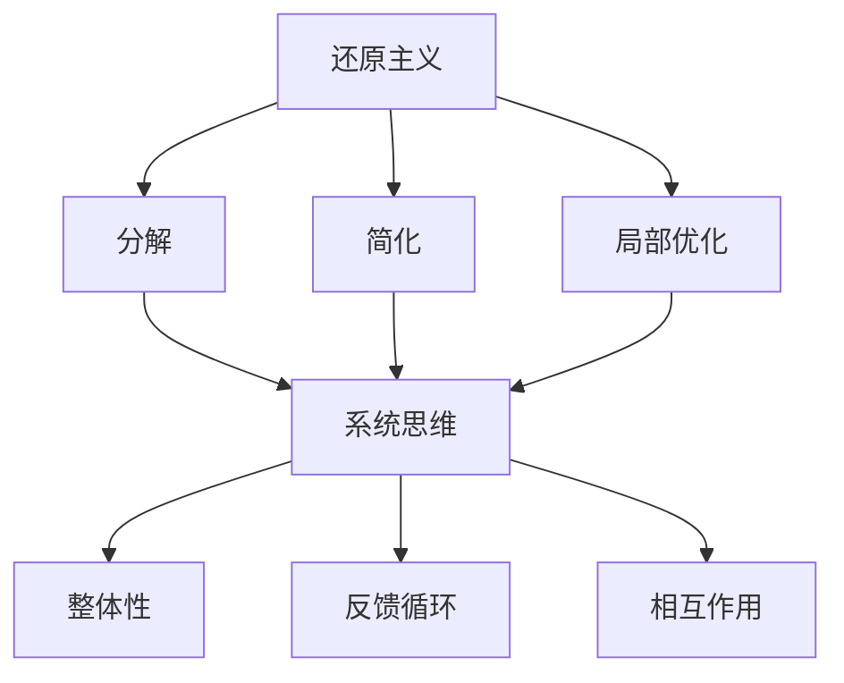
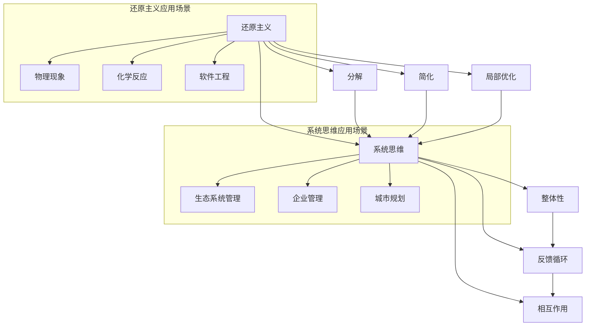
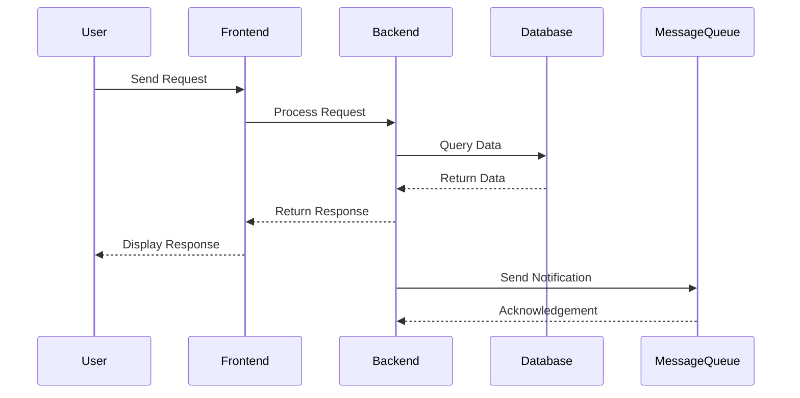
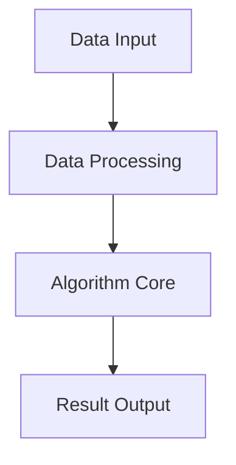

                 


### 1.1 问题背景

**还原主义概述**

还原主义（Reductionism）是一种哲学和方法论，其核心思想是通过分解复杂系统为更简单的部分来理解和解释这个复杂系统的性质和行为。这种方法在科学和工程学领域有着悠久的历史。17世纪的物理学家艾萨克·牛顿和18世纪的化学家安托万·拉瓦锡是还原主义的典型代表，他们的工作奠定了现代科学的基础。

在计算机科学领域，还原主义体现在对计算机系统和程序进行分解，以理解其基本组件和功能。从操作系统到算法设计，许多计算机科学问题都采用了还原主义的方法，这种方法促进了技术的快速发展和应用。

**系统思维的兴起**

相比之下，系统思维（Systems Thinking）是一种更全面的、整体性的思考方法。它强调系统内部各元素之间的相互作用和反馈，认为系统的行为是由这些相互作用和反馈动态产生的。系统思维起源于20世纪中叶，当时科学家和管理学家开始关注复杂系统的行为，并寻求理解这些系统整体性的方法。

在计算机科学领域，系统思维的应用体现在软件架构设计、系统分析和复杂问题求解等方面。例如，在软件架构设计中，系统思维强调组件间的交互和系统的整体性能，而不是单独的组件功能。

**宇宙观的转变**

从还原主义到系统思维的转变不仅限于科学和技术领域，它也反映了人类对宇宙和世界的认知方式的转变。在过去，我们倾向于将世界看作是由独立的、可分离的部分组成的，这些部分可以通过还原主义的方法来理解。然而，随着对复杂系统的深入研究，我们逐渐认识到，许多现象和问题都是整体性的，无法仅通过分解来理解。

这种宇宙观的转变具有重要的意义。它促使我们重新审视许多传统的科学方法和思维方式，推动我们采用更全面、更动态的思考方式来应对复杂的问题。在计算机科学领域，这种转变意味着我们需要从系统层面来理解和设计复杂系统，而不仅仅是关注其单个组件。

**核心概念与联系**

在这一部分，我们将介绍还原主义和系统思维的核心概念，并探讨它们之间的联系和区别。还原主义强调分解和简化，而系统思维则强调整体性和相互作用。通过这种对比，我们可以更好地理解两种思维方式的本质和应用场景。

### 1.2 问题描述

**还原主义的局限性**

尽管还原主义在许多领域取得了显著成就，但它也存在一些局限性。首先，还原主义方法往往忽略了系统内部各元素之间的相互作用，这可能导致对系统整体行为的误解。例如，在软件工程中，如果仅关注代码模块的优化，而忽略了模块间的协作和依赖，可能会导致系统的整体性能下降。

其次，还原主义方法可能过于简化问题，从而忽略了关键细节。在某些情况下，这种简化可能导致错误的决策和结果。例如，在金融领域，简单的数学模型可能无法准确预测市场行为，因为市场是由复杂的人际关系和情感因素驱动的。

**系统思维的潜力**

系统思维提供了一种更全面、更动态的思考方式，能够帮助我们更好地理解和解决复杂问题。通过系统思维，我们可以识别系统内部的反馈循环和相互作用，从而更准确地预测系统的行为。在软件工程中，系统思维可以帮助我们设计出更灵活、更可扩展的系统架构，从而提高系统的整体性能和可维护性。

**宇宙观转变的意义**

宇宙观从还原主义向系统思维的转变不仅改变了我们对世界的认知方式，也对我们处理复杂问题的能力产生了深远影响。这种转变使我们能够更全面地理解复杂系统的行为，从而设计出更有效、更可持续的解决方案。在计算机科学领域，这种转变意味着我们需要采用更综合的方法来设计和管理复杂系统。

### 1.3 问题解决

**还原主义与系统思维的关系**

还原主义和系统思维并不是相互排斥的，而是相互补充的。在处理复杂问题时，我们可以先采用还原主义方法来分解问题，然后再使用系统思维来理解这些分解部分的相互作用。这种方法可以帮助我们既理解系统的局部行为，又把握系统的整体行为。

**从还原主义到系统思维的方法论**

要实现从还原主义到系统思维的转变，我们需要采用一种新的方法论。这个方法论的核心包括：

1. **整体性思维**：将系统视为一个整体，关注系统内部各元素之间的相互作用。
2. **动态分析**：理解系统内部各元素之间的反馈和循环，从而更准确地预测系统的行为。
3. **综合方法**：结合还原主义和系统思维的优势，设计出更有效、更全面的解决方案。

**边界与外延**

在从还原主义到系统思维的转变过程中，我们需要明确两个边界：一个是方法的适用范围，另一个是方法的局限性。了解这些边界可以帮助我们更有效地应用系统思维，避免陷入还原主义方法的局限性。

### 1.4 核心概念结构

**还原主义概念**

还原主义的核心概念包括分解、简化、局部优化等。它强调通过分解复杂系统来理解其行为，并通过局部优化来提高系统的性能。

**系统思维概念**

系统思维的核心概念包括整体性、相互作用、反馈循环等。它强调通过理解系统内部各元素之间的相互作用来理解系统的行为，并通过整体性思维来设计和管理复杂系统。

**概念联系与区别**

还原主义和系统思维虽然有不同的核心概念，但它们之间也有联系。通过将还原主义方法应用于系统内部的各个部分，我们可以更全面地理解系统的行为。然而，系统思维则强调系统的整体性，认为系统的行为是由系统内部各元素之间的相互作用和反馈循环动态产生的。

### 1.5 本章小结

在这一章中，我们介绍了从还原主义到系统思维转变的背景和重要性。我们探讨了还原主义和系统思维的核心概念，并比较了它们之间的联系和区别。通过了解这两种思维方式的本质和应用场景，我们可以更好地理解复杂系统，从而设计出更有效、更全面的解决方案。在接下来的章节中，我们将进一步深入探讨系统思维的应用和实践。

----------------------------------------------------------------

## 1.1 问题背景

### 1.1.1 还原主义概述

还原主义（Reductionism）是一种哲学和方法论，其核心理念是将复杂系统分解为更简单的组成部分，以便通过分析这些组成部分来理解复杂系统的整体行为。这种思想在科学领域得到了广泛应用，特别是在物理学、化学和生物学中。还原主义认为，通过分解复杂系统，我们可以识别出构成系统的基本元素，并研究这些元素如何相互作用，从而解释复杂系统的性质和行为。

在物理学中，艾萨克·牛顿和伽利略的工作是还原主义的重要代表。他们通过研究力和运动的相互作用，建立了经典力学的基础。在化学中，安托万·拉瓦锡通过实验证明了化学反应中物质守恒定律，从而奠定了现代化学的基石。在生物学中，查尔斯·达尔文通过研究物种的变异和适应环境的能力，提出了进化论，这也是一种基于还原主义的生物学解释。

**定义与基本原理**

- **定义**：还原主义是指通过将复杂系统分解为更简单的部分来理解整个系统的行为。
- **基本原理**：还原主义的核心原理包括分解、简化、局部优化等。它强调通过分析组成部分来理解整体。

**在科学和技术领域的应用**

还原主义在科学和技术领域的应用非常广泛。例如，在计算机科学中，软件工程和编程往往采用还原主义方法。通过将复杂的软件系统分解为模块，每个模块可以独立开发、测试和优化，从而提高整个系统的可靠性和性能。此外，还原主义还体现在算法设计和问题解决中，通过将复杂问题分解为更简单的子问题，我们可以更有效地解决这些问题。

### 1.1.2 系统思维的兴起

系统思维（Systems Thinking）是一种与还原主义相反的思考方法，它强调系统的整体性和相互作用。系统思维起源于20世纪中叶，当时科学家和管理学家开始关注复杂系统的行为，并寻求理解这些系统整体性的方法。系统思维的兴起受到了系统动力学、复杂性科学和信息理论等领域的影响。

**定义与基本原理**

- **定义**：系统思维是指通过理解系统内部各元素之间的相互作用和反馈来理解系统的行为。
- **基本原理**：系统思维的核心原理包括整体性、反馈循环、相互作用等。它强调通过系统视角来分析和管理复杂系统。

**在科学和技术领域的应用**

系统思维在科学和技术领域的应用越来越广泛。例如，在工程学中，系统思维帮助工程师设计出更稳健、更灵活的系统。在经济学中，系统思维可以帮助经济学家理解经济系统中的反馈循环和波动。在环境科学中，系统思维帮助我们理解生态系统的复杂性和可持续性。在计算机科学中，系统思维在软件架构设计、系统分析和复杂问题求解等方面有着重要应用。

### 1.1.3 宇宙观的转变

从还原主义到系统思维的转变不仅改变了科学方法和技术实践，也影响了人类对宇宙和世界的认知方式。在过去，我们倾向于将世界看作是由独立的、可分离的部分组成的，这些部分可以通过还原主义的方法来理解。然而，随着对复杂系统的深入研究，我们逐渐认识到，许多现象和问题都是整体性的，无法仅通过分解来理解。

这种宇宙观的转变意味着我们开始从更全面、更动态的角度来理解宇宙和世界。例如，在物理学中，量子力学和相对论的提出挑战了传统的还原主义观点，揭示了宇宙中更深层次的统一性和整体性。在生物学中，进化论和生态系统理论的提出也改变了我们对生物多样性和生态系统功能的理解。

**核心影响**

- **科学认知**：从还原主义到系统思维的转变促进了我们对复杂系统的理解，使我们能够更全面地描述和预测系统的行为。
- **技术实践**：系统思维在技术领域的应用帮助我们设计出更复杂、更灵活的系统，提高了系统的性能和可靠性。
- **社会观念**：宇宙观从还原主义向系统思维的转变也影响了我们的社会观念，使我们更重视整体性和相互作用，从而推动社会进步和发展。

### 1.1.4 还原主义与系统思维的关系

还原主义和系统思维并不是相互排斥的，而是相互补充的。在处理复杂问题时，我们可以先采用还原主义方法来分解问题，然后再使用系统思维来理解这些分解部分的相互作用。这种方法可以帮助我们既理解系统的局部行为，又把握系统的整体行为。

- **相互补充**：还原主义和系统思维可以相互补充，通过结合两者的优势，我们可以更全面地理解复杂系统。
- **具体应用**：在科学研究中，可以先通过还原主义来研究基本原理，然后使用系统思维来分析这些原理在实际系统中的应用。
- **方法论**：在方法论上，我们可以将还原主义和系统思维结合起来，形成一种更全面、更动态的研究方法。

通过理解还原主义和系统思维的关系，我们可以更有效地应用这两种思维方式，以解决复杂的科学和技术问题。

----------------------------------------------------------------

## 1.2 问题描述

### 1.2.1 还原主义的局限性

还原主义虽然在许多领域取得了显著成就，但其局限性也逐渐显现出来。首先，还原主义方法过于强调分解和简化，可能导致对系统整体行为的误解。例如，在软件工程中，如果仅关注代码模块的优化，而忽略了模块间的协作和依赖，可能会导致系统的整体性能下降。

其次，还原主义方法可能过于简化问题，从而忽略了关键细节。在某些情况下，这种简化可能导致错误的决策和结果。例如，在金融领域，简单的数学模型可能无法准确预测市场行为，因为市场是由复杂的人际关系和情感因素驱动的。

### 1.2.2 系统思维的潜力

系统思维提供了一种更全面、更动态的思考方式，能够帮助我们更好地理解和解决复杂问题。通过系统思维，我们可以识别系统内部的反馈循环和相互作用，从而更准确地预测系统的行为。在软件工程中，系统思维可以帮助我们设计出更灵活、更可扩展的系统架构，从而提高系统的整体性能和可维护性。

系统思维的潜力不仅体现在理解和设计复杂系统上，还体现在解决跨学科问题中。例如，在环境科学中，系统思维可以帮助我们理解生态系统的复杂性和可持续性。在经济学中，系统思维可以帮助我们理解经济系统中的反馈循环和波动。

### 1.2.3 宇宙观转变的意义

宇宙观从还原主义向系统思维的转变不仅改变了科学方法和技术实践，也影响了人类对宇宙和世界的认知方式。这种转变具有重要的意义，体现在以下几个方面：

1. **科学认知**：从还原主义到系统思维的转变促进了我们对复杂系统的理解，使我们能够更全面地描述和预测系统的行为。这种理解对于解决许多科学和技术问题具有重要意义。

2. **技术实践**：系统思维在技术领域的应用帮助我们设计出更复杂、更灵活的系统，提高了系统的性能和可靠性。这对于应对现代技术的挑战，如人工智能、大数据和物联网等，具有重要意义。

3. **社会观念**：宇宙观从还原主义向系统思维的转变也影响了我们的社会观念，使我们更重视整体性和相互作用，从而推动社会进步和发展。

### 1.2.4 还原主义与系统思维的关系

还原主义和系统思维并不是相互排斥的，而是相互补充的。在处理复杂问题时，我们可以先采用还原主义方法来分解问题，然后再使用系统思维来理解这些分解部分的相互作用。这种方法可以帮助我们既理解系统的局部行为，又把握系统的整体行为。

例如，在计算机科学中，我们可以先通过还原主义方法将复杂的软件系统分解为模块，然后使用系统思维来理解这些模块之间的交互和协作关系，从而设计出更高效、更稳定的软件系统。

### 1.2.5 边界与外延

在从还原主义到系统思维的转变过程中，我们需要明确两个边界：一个是方法的适用范围，另一个是方法的局限性。了解这些边界可以帮助我们更有效地应用系统思维，避免陷入还原主义方法的局限性。

1. **适用范围**：系统思维适用于处理复杂、动态的系统，而还原主义适用于处理简单、静态的系统。在实际应用中，我们需要根据问题的复杂性和动态性来选择适当的方法。

2. **局限性**：还原主义方法可能过于简化问题，导致对系统整体行为的误解。系统思维可能过于复杂，难以捕捉到系统的所有细节。因此，在实际应用中，我们需要结合两种方法的优势，以获得最佳效果。

### 1.2.6 核心概念结构

在这一部分，我们介绍了还原主义和系统思维的核心概念和基本原理，并探讨了它们之间的联系和区别。通过理解这两种思维方式的本质和应用场景，我们可以更有效地应用它们来处理复杂的科学和技术问题。

----------------------------------------------------------------

## 1.3 问题解决

### 1.3.1 还原主义与系统思维的关系

还原主义和系统思维并不是相互排斥的，而是相互补充的。在处理复杂问题时，我们可以先采用还原主义方法来分解问题，然后再使用系统思维来理解这些分解部分的相互作用。这种方法可以帮助我们既理解系统的局部行为，又把握系统的整体行为。

在科学和技术领域，还原主义和系统思维的应用场景有所不同。还原主义通常适用于处理简单、静态的系统，例如物理现象、化学反应和机械系统等。系统思维则适用于处理复杂、动态的系统，例如生态系统、经济系统和复杂社会系统等。

**具体应用场景**

- **物理和化学**：在物理学和化学中，还原主义方法被广泛应用于研究基本粒子和化学反应。通过将复杂现象分解为更简单的部分，我们可以更深入地理解这些现象的本质。
- **生物学**：在生物学中，系统思维被广泛应用于研究生态系统和生物网络。通过理解生物体内各个部分之间的相互作用和反馈循环，我们可以更好地理解生物体的行为和进化。
- **工程学**：在工程学中，系统思维被广泛应用于系统设计和复杂系统的管理。通过理解系统内部各元素之间的相互作用和反馈循环，工程师可以设计出更稳健、更灵活的系统。
- **经济学**：在经济学中，系统思维被广泛应用于研究经济系统中的反馈循环和波动。通过理解经济系统中的各种因素之间的相互作用，经济学家可以更准确地预测经济行为。

### 1.3.2 从还原主义到系统思维的方法论

要实现从还原主义到系统思维的方法论转变，我们需要采用一系列新的方法论原则。这些原则包括：

1. **整体性思维**：将系统视为一个整体，关注系统内部各元素之间的相互作用。
2. **动态分析**：理解系统内部各元素之间的反馈和循环，从而更准确地预测系统的行为。
3. **综合方法**：结合还原主义和系统思维的优势，设计出更有效、更全面的解决方案。

**具体步骤**

1. **问题分解**：首先，使用还原主义方法将复杂问题分解为更简单的部分。
2. **部分分析**：对分解后的各个部分进行详细分析，理解它们的行为和相互作用。
3. **整体重构**：将分解后的部分重新组合成一个整体系统，通过系统思维来分析系统的整体行为。
4. **动态模拟**：使用系统思维来模拟系统的动态行为，预测系统的长期行为和趋势。

**案例分析**

以一个复杂的软件系统为例，我们可以按照以下步骤进行方法论转变：

1. **问题分解**：将软件系统分解为模块、功能组件等更简单的部分。
2. **部分分析**：对每个模块和组件进行详细分析，理解它们的功能和行为。
3. **整体重构**：将各个模块和组件重新组合成整体软件系统，通过系统思维来分析系统的整体行为。
4. **动态模拟**：模拟系统的运行过程，预测系统的性能和稳定性。

通过这种从还原主义到系统思维的方法论转变，我们可以更全面地理解软件系统的行为，从而设计出更高效、更稳定的系统。

### 1.3.3 边界与外延

在从还原主义到系统思维的方法论转变中，我们需要明确两个边界：一是方法的适用范围，二是方法的局限性。

**适用范围**

- **适用范围**：系统思维适用于处理复杂、动态的系统，而还原主义适用于处理简单、静态的系统。
- **具体应用**：在实际应用中，我们需要根据问题的复杂性和动态性来选择适当的方法。对于简单、静态的系统，可以采用还原主义方法；对于复杂、动态的系统，则需要采用系统思维方法。

**局限性**

- **局限性**：还原主义方法可能过于简化问题，导致对系统整体行为的误解。系统思维可能过于复杂，难以捕捉到系统的所有细节。
- **解决方法**：在实际应用中，我们可以结合两种方法的优势，以获得最佳效果。例如，在处理复杂系统时，可以先使用还原主义方法来分解问题，然后使用系统思维来理解系统的整体行为。

通过明确方法论的边界与外延，我们可以更有效地应用还原主义和系统思维，以解决复杂的科学和技术问题。

----------------------------------------------------------------

## 1.4 核心概念结构

### 1.4.1 还原主义概念

还原主义是一种哲学和方法论，其核心概念包括分解、简化、局部优化等。它强调通过将复杂系统分解为更简单的组成部分来理解其行为。以下是还原主义概念的主要组成部分：

1. **分解**：将复杂系统分解为更简单的部分，以便更好地理解和分析。
2. **简化**：通过忽略次要因素，将复杂系统简化为更容易处理的形式。
3. **局部优化**：在分解后的各个部分中，进行局部优化，以最大化系统的性能。

### 1.4.2 系统思维概念

系统思维是一种整体性、动态性的思考方法，其核心概念包括整体性、反馈循环、相互作用等。它强调通过理解系统内部各元素之间的相互作用和反馈来理解系统的行为。以下是系统思维概念的主要组成部分：

1. **整体性**：将系统视为一个整体，关注系统内部各元素之间的相互作用。
2. **反馈循环**：理解系统内部的反馈循环，这些循环会影响系统的行为和稳定性。
3. **相互作用**：分析系统内部各元素之间的相互作用，以及这些相互作用如何影响系统的行为。

### 1.4.3 概念联系与区别

还原主义和系统思维虽然有不同的核心概念，但它们之间也存在联系。还原主义可以通过分解复杂系统来帮助我们理解系统的局部行为，而系统思维则通过整体性、反馈循环和相互作用来理解系统的整体行为。

以下是两种思维方式的联系与区别：

- **联系**：还原主义和系统思维都可以帮助我们理解复杂系统，但系统思维在理解系统整体行为方面具有优势。
- **区别**：还原主义强调分解和简化，而系统思维强调整体性和相互作用。

为了更直观地展示还原主义和系统思维的联系与区别，我们可以使用Mermaid流程图来描述它们的核心概念。

### 1.4.4 Mermaid流程图展示

以下是还原主义和系统思维的Mermaid流程图：



在这个流程图中，还原主义的核心概念（分解、简化、局部优化）通过箭头连接到系统思维的核心概念（整体性、反馈循环、相互作用），展示了两种思维方式之间的联系。通过这种图示，我们可以更清晰地理解还原主义和系统思维的核心概念及其相互关系。

### 1.4.5 应用实例

为了更好地理解还原主义和系统思维的概念，我们可以通过一个应用实例来进行分析。

**实例：软件系统设计**

在软件系统设计中，我们可以使用还原主义和系统思维来分析和设计系统。

1. **还原主义方法**：
   - **分解**：将复杂的软件系统分解为模块、组件等更简单的部分。
   - **简化**：通过忽略次要的功能和非关键的性能指标，将系统简化为更容易处理的形式。
   - **局部优化**：对每个模块进行优化，以提高其性能和效率。

2. **系统思维方法**：
   - **整体性**：将整个软件系统视为一个整体，关注模块之间的交互和依赖关系。
   - **反馈循环**：分析模块之间的反馈循环，以及这些反馈如何影响系统的稳定性。
   - **相互作用**：分析模块之间的相互作用，以及这些相互作用如何影响系统的性能。

通过这种结合还原主义和系统思维的方法，我们可以设计出更高效、更稳定的软件系统。

### 1.4.6 核心概念总结

在这一部分，我们介绍了还原主义和系统思维的核心概念，并探讨了它们之间的联系与区别。通过了解这些概念，我们可以更好地理解两种思维方式在处理复杂系统中的应用。在接下来的章节中，我们将进一步探讨系统思维的具体应用和实践。

----------------------------------------------------------------

## 1.5 本章小结

在这一章中，我们深入探讨了从还原主义到系统思维的整体转向及其重要性。首先，我们介绍了还原主义和系统思维的基本概念，包括还原主义的分解、简化、局部优化等原则，以及系统思维的整体性、反馈循环和相互作用等核心观点。通过这两个概念的比较，我们揭示了还原主义和系统思维之间的联系与区别，并强调了系统思维在理解和解决复杂问题中的潜力。

我们分析了还原主义的局限性，如忽略系统内部相互作用和简化问题可能导致的问题。同时，我们阐述了系统思维的潜力，尤其是在理解和设计复杂系统方面。此外，我们还探讨了宇宙观从还原主义向系统思维的转变，这种转变不仅改变了科学方法和技术实践，还影响了人类对宇宙和世界的认知。

本章还探讨了还原主义与系统思维的关系，以及如何通过结合这两种思维方式来处理复杂问题。我们提出了从还原主义到系统思维的方法论转变，包括整体性思维、动态分析和综合方法等原则。最后，我们通过Mermaid流程图和应用实例，直观地展示了这两种思维方式的运用。

总之，从还原主义到系统思维的转变不仅是一种哲学和科学方法的进步，也是人类对复杂系统认知能力的提升。通过理解这两种思维方式的本质和应用，我们可以更好地应对现代社会中的复杂问题，为未来的科学研究和技术发展提供新的视角和方法。

----------------------------------------------------------------

## 2.1 还原主义原理

### 2.1.1 历史背景

还原主义（Reductionism）的历史可以追溯到古代哲学和科学方法的发展。然而，它作为一个明确的哲学和科学方法论，主要起源于18世纪和19世纪的欧洲。当时，科学革命使得人们对自然界的理解发生了巨大变革。艾萨克·牛顿和拉瓦锡等科学家的贡献为还原主义奠定了基础。

**牛顿的经典物理学**

艾萨克·牛顿是还原主义的重要代表之一。他在《自然哲学的数学原理》中提出的三大运动定律和万有引力定律，将自然界中的各种运动现象归结为基本的物理规律。牛顿的工作表明，通过分析力和运动的基本规律，我们可以理解复杂的物理现象。

**拉瓦锡的化学革命**

18世纪化学家安托万·拉瓦锡通过实验证明了化学反应中的物质守恒定律，推翻了之前的燃素说，从而奠定了现代化学的基础。拉瓦锡的工作展示了通过分解和简化复杂化学反应，可以揭示其本质。

**19世纪物理学与生物学**

在19世纪，物理学和生物学中的许多重要发现也体现了还原主义的思想。例如，热力学定律的发现揭示了能量转换的规律，而生物学中的进化论则通过研究物种的遗传和变异，解释了生物多样性的起源。

### 2.1.2 还原主义方法论

还原主义方法论的核心是通过将复杂系统分解为更简单的部分来理解整个系统的行为。这种方法强调以下几个基本原则：

1. **分解**：将复杂系统分解为更简单的组成部分，以便分析这些部分的行为。
2. **简化**：通过忽略次要因素，将复杂系统简化为更容易处理的形式。
3. **局部优化**：对分解后的各个部分进行优化，以提高整体系统的性能。

**应用场景**

还原主义在多个领域得到了广泛应用：

- **物理学**：通过分解物理现象，如力学、电磁学和量子力学，我们可以理解自然界的基本规律。
- **化学**：通过分解化学反应，我们可以研究反应物和生成物的性质。
- **生物学**：通过分解生物体，如细胞、组织和器官，我们可以理解生物体的结构和功能。
- **计算机科学**：在软件工程中，通过分解复杂的软件系统，我们可以设计、开发和测试各个模块。

### 2.1.3 还原主义的影响

还原主义在科学和工程学领域产生了深远影响。它促进了技术的快速发展，使得我们可以通过分解复杂问题来逐步解决。然而，还原主义也带来了挑战，如在忽略系统内部相互作用和简化问题方面可能导致的局限性。

**优点**

- **简化问题**：通过分解复杂问题，我们可以将问题简化为更容易处理的子问题。
- **提高效率**：局部优化可以显著提高系统的性能和效率。
- **明确责任**：分解后的各个部分可以明确责任，便于管理和维护。

**缺点**

- **忽略相互作用**：还原主义可能忽略系统内部各部分之间的相互作用，导致对整体行为的误解。
- **简化过度**：在简化问题的过程中，可能丢失关键细节，从而影响解决方案的准确性。

**总结**

还原主义作为科学和工程学的一种重要方法论，虽然在分解复杂问题和提高效率方面具有显著优势，但其局限性也需要我们注意。通过结合还原主义和系统思维，我们可以更全面地理解和解决复杂问题。

----------------------------------------------------------------

## 2.2 系统思维概述

### 2.2.1 系统思维的起源

系统思维（Systems Thinking）作为一种整体性和动态性的思考方法，其起源可以追溯到20世纪中叶。当时，科学家和管理学家开始关注复杂系统的行为，并寻求理解这些系统整体性的方法。系统思维的兴起受到了系统动力学、复杂性科学和信息理论等领域的影响。

**系统动力学的贡献**

系统动力学（System Dynamics）是系统思维的重要理论基础之一。由杰伊·福瑞斯特（Jay Forrester）在20世纪50年代创立，它通过模拟和建模来理解系统内部各元素之间的动态相互作用。系统动力学强调反馈循环和延迟效应，从而帮助我们理解复杂系统的行为。

**复杂性科学的启示**

复杂性科学（Complexity Science）的发展也为系统思维提供了重要的理论支持。复杂性科学关注复杂系统的性质和行为，强调系统的自组织、自适应性和涌现现象。通过研究复杂系统的特性，我们可以更好地理解系统思维的核心原理。

**信息理论的借鉴**

信息理论（Information Theory）对系统思维也有重要影响。信息理论强调信息流动和通信在系统中的作用，揭示了系统内部各元素之间如何通过信息传递来影响整体行为。这种观点为系统思维提供了新的视角，帮助我们理解系统内部的复杂交互。

### 2.2.2 系统思维框架

系统思维的核心框架包括以下几个关键概念：

1. **整体性**：系统思维强调将系统视为一个整体，关注系统内部各元素之间的相互作用。与还原主义不同，系统思维不是简单地将系统分解为独立的部分，而是通过理解整体行为来把握系统的本质。

2. **反馈循环**：系统思维重视反馈循环，这些循环是系统动态行为的关键驱动因素。反馈循环可以是正反馈，也可以是负反馈，它们会影响系统的稳定性、增长和衰退。

3. **相互作用**：系统思维强调系统内部各元素之间的相互作用。这些相互作用可以是直接的，也可以是通过中介变量进行的。相互作用决定了系统内部的行为模式和发展趋势。

4. **动态性**：系统思维认为系统是动态的，其行为会随时间和环境的变化而变化。因此，理解系统的动态特性是系统思维的重要组成部分。

### 2.2.3 系统思维应用

系统思维在多个领域得到了广泛应用：

- **企业管理**：在企业管理中，系统思维可以帮助企业领导者理解企业内部的各种反馈循环和相互作用，从而制定更有效的战略决策。

- **生态系统管理**：在生态系统管理中，系统思维可以帮助我们理解生态系统中各生物群体之间的相互作用和反馈，从而制定更科学的生态保护策略。

- **城市规划**：在城市规划中，系统思维可以帮助我们理解城市内部的各种基础设施和人口流动的相互作用，从而设计出更宜居的城市布局。

- **软件工程**：在软件工程中，系统思维可以帮助我们理解软件系统中的各种组件和模块之间的交互，从而设计出更稳定和高效的软件系统。

### 2.2.4 系统思维与还原主义的对比

系统思维与还原主义在思考方式和应用场景上有显著差异：

- **还原主义**：强调分解和简化，通过分析系统的各个组成部分来理解整体行为。适用于处理简单、静态的系统。

- **系统思维**：强调整体性和动态性，通过理解系统内部各元素之间的相互作用和反馈来把握整体行为。适用于处理复杂、动态的系统。

虽然系统思维和还原主义在处理复杂问题时都有其局限性，但它们也可以相互补充。在处理复杂系统时，我们可以先采用还原主义方法来分解问题，然后再使用系统思维来理解这些分解部分的相互作用。

### 2.2.5 系统思维的挑战与未来发展方向

系统思维在应用过程中面临一些挑战：

- **复杂性**：系统思维涉及多个变量和反馈循环，这使得分析过程可能变得复杂和困难。

- **数据需求**：系统思维需要大量数据来支持建模和模拟，这在实际操作中可能难以实现。

- **方法论发展**：系统思维的方法论需要不断发展和完善，以适应不同领域和应用场景的需求。

未来的发展方向包括：

- **跨学科融合**：通过跨学科的合作，整合不同领域的知识和方法，提高系统思维的实用性和有效性。

- **人工智能应用**：利用人工智能和机器学习技术，自动化系统建模和模拟过程，提高系统思维的效率和准确性。

- **教育培训**：加强系统思维的教育和培训，提高公众对系统思维的认识和应用能力。

总之，系统思维作为一种整体性和动态性的思考方法，在处理复杂系统问题中具有重要作用。通过不断发展和完善，系统思维有望为解决现代社会中的复杂问题提供新的思路和方法。

----------------------------------------------------------------

## 2.3 比较与联系

### 2.3.1 还原主义与系统思维的区别

还原主义和系统思维在哲学和方法论上有显著区别。以下是它们之间的一些关键差异：

1. **视角**：
   - **还原主义**：从局部视角出发，将复杂系统分解为更简单的组成部分，通过分析这些部分来理解整体。
   - **系统思维**：从整体视角出发，关注系统内部各元素之间的相互作用和反馈，通过理解整体行为来把握系统。

2. **目标**：
   - **还原主义**：目标是通过分解和简化来理解系统的基本组成部分和机制。
   - **系统思维**：目标是通过理解系统内部各元素之间的相互作用和反馈循环来把握系统的整体行为和动态特性。

3. **处理复杂性的方式**：
   - **还原主义**：通过分解和简化来降低系统的复杂性，使问题更容易分析和解决。
   - **系统思维**：通过整体性思维和动态分析来应对系统的复杂性，强调系统的相互作用和反馈。

4. **适用场景**：
   - **还原主义**：适用于处理简单、静态的系统，如物理学中的基本粒子、化学反应等。
   - **系统思维**：适用于处理复杂、动态的系统，如生态系统、经济系统、复杂社会系统等。

### 2.3.2 还原主义与系统思维的联系

尽管还原主义和系统思维有区别，但它们也存在联系，并且可以相互补充：

1. **相互补充**：
   - 还原主义可以用来理解系统的局部行为和基本机制，而系统思维可以用来理解系统的整体行为和动态特性。
   - 通过结合还原主义和系统思维的优点，我们可以更全面地理解和处理复杂系统。

2. **方法结合**：
   - 在处理复杂问题时，可以先使用还原主义方法来分解问题，然后使用系统思维来理解这些分解部分的相互作用。
   - 例如，在软件工程中，可以通过还原主义来设计模块，然后使用系统思维来优化模块之间的交互和整体性能。

3. **共同目标**：
   - 虽然方法和视角不同，但还原主义和系统思维的共同目标都是更好地理解和解决问题。

### 2.3.3 Mermaid流程图展示

为了更直观地展示还原主义和系统思维的区别与联系，我们可以使用Mermaid流程图来描述它们的核心概念和应用场景。



在这个流程图中，我们展示了还原主义和系统思维的核心概念以及它们在不同应用场景中的使用。通过这种图示，我们可以更清晰地理解这两种思维方式的区别与联系。

### 2.3.4 比较分析

通过上述对比和联系，我们可以得出以下结论：

- **优势互补**：还原主义和系统思维在处理复杂系统问题时可以相互补充，通过结合两者的优势，我们可以更全面地理解和解决问题。
- **应用灵活性**：根据问题的复杂性和动态性，我们可以灵活地选择使用还原主义或系统思维，或者将两者结合使用。

总之，还原主义和系统思维虽然有不同的方法和视角，但它们在理解和处理复杂系统问题时都发挥着重要作用。通过理解它们的区别和联系，我们可以更有效地应用这两种思维方式，为解决复杂问题提供新的思路和方法。

----------------------------------------------------------------

## 2.4 实例分析

### 2.4.1 还原主义案例

**案例背景**

我们以一个简单的电路系统为例，来展示还原主义的应用。假设我们有一个电路，包含电源、电阻、电容和电感等基本元件。我们的目标是设计并优化这个电路，以实现特定的性能要求。

**分析过程**

1. **分解电路**

   首先，我们将复杂的电路分解为更简单的部分，例如电源、电阻、电容和电感等基本元件。

   - **电源**：提供电压和电流。
   - **电阻**：限制电流流动，消耗电能。
   - **电容**：储存电能，影响电流的流动。
   - **电感**：储存磁能，影响电流的变化。

2. **简化电路**

   接下来，我们忽略次要的细节，如元件的噪声、温度变化等，将电路简化为基本元件的组合。

   - **电源**：理想电压源。
   - **电阻**：线性电阻。
   - **电容**：理想电容。
   - **电感**：线性电感。

3. **局部优化**

   对每个基本元件进行优化，以提高电路的整体性能。例如，通过选择合适的电阻值来降低能耗，或者通过调整电容和电感值来改善电路的频率响应。

**结论**

通过还原主义方法，我们将复杂的电路系统分解为更简单的部分，并通过局部优化来提高整体性能。这种方法使得电路设计和优化变得更加直观和可控。

### 2.4.2 系统思维案例

**案例背景**

现在，我们考虑同一个电路系统，但采用系统思维来分析。系统思维关注电路内部各元件之间的相互作用和反馈，而不是仅仅关注各个元件的优化。

**分析过程**

1. **整体性视角**

   首先，我们从整体性视角出发，将电路视为一个整体系统，关注电源、电阻、电容和电感等元件之间的相互作用。

2. **反馈循环**

   我们识别出电路中的反馈循环，这些反馈循环会影响电路的稳定性、响应时间和频率特性。例如，电容和电感之间的耦合可能导致谐振现象。

3. **相互作用**

   我们分析电路内部各元件之间的相互作用，如电源对电阻、电容和电感的影响，以及电容和电感之间的耦合效应。

4. **动态模拟**

   通过动态模拟，我们预测电路在不同条件下的行为，如不同频率、电压和电流下的响应。

**结论**

通过系统思维方法，我们不仅考虑了电路的局部性能，还关注了电路内部各元件之间的相互作用和反馈。这种方法帮助我们更好地理解电路的整体行为，从而设计出更稳健、更灵活的电路系统。

### 2.4.3 案例对比分析

**还原主义与系统思维的优势**

- **还原主义**：通过分解和简化，使得电路设计和优化过程更加直观和可控。适用于处理简单、静态的电路系统。
- **系统思维**：通过整体性视角和动态分析，更好地理解电路的整体行为和相互作用。适用于处理复杂、动态的电路系统。

**应用场景**

- **简单电路**：适用于还原主义方法，如电源、电阻、电容和电感等基本元件的设计和优化。
- **复杂电路**：适用于系统思维方法，如集成电路、通信系统和电力系统等复杂电路的设计和优化。

**总结**

通过实例分析，我们可以看到还原主义和系统思维在处理电路系统时各有优势。结合两种方法，我们可以更全面地理解和设计复杂的电路系统，从而提高系统的性能和稳定性。

----------------------------------------------------------------

## 2.5 本章小结

在本章中，我们通过比较还原主义和系统思维的区别与联系，深入探讨了它们在理解和处理复杂系统问题中的应用。我们首先介绍了还原主义的历史背景、方法论及其在科学和技术领域的应用，并分析了其优缺点。接着，我们详细阐述了系统思维的起源、框架和应用，并探讨了它如何帮助我们理解复杂系统的动态行为和整体性。

通过两个实例分析，我们展示了还原主义和系统思维在电路系统设计中的具体应用，并对比了它们的优势。还原主义通过分解和简化，使得问题更加直观和可控，而系统思维则通过整体性视角和动态分析，提供了对系统内部相互作用和反馈循环的深入理解。

总之，还原主义和系统思维在处理复杂系统问题时各有其独特的作用。通过结合这两种思维方式，我们可以更全面、更有效地应对复杂问题，从而推动科学和技术的发展。在接下来的章节中，我们将进一步探讨系统思维在计算机科学领域的具体应用和实践。

----------------------------------------------------------------

## 3.1 从还原主义到系统思维的转变

### 3.1.1 系统分析过程

从还原主义到系统思维的转变，首先需要理解系统分析的过程。系统分析是一种方法，通过它，我们可以识别、理解并描述系统的结构和行为。以下是系统分析的主要步骤：

1. **问题定义**：明确我们要解决的问题或目标。这包括识别系统的主要功能、约束条件和目标。

2. **系统识别**：识别系统的主要组成部分和关键要素。这可以通过绘制系统图或使用其他图形工具来实现。

3. **系统描述**：使用适当的工具和技术（如状态图、流程图、决策树等）来描述系统的行为和状态。

4. **系统建模**：创建一个模型来表示系统的结构和行为。这可以是基于数学模型、计算机模拟或物理模型。

5. **系统验证**：验证模型的准确性，确保模型能够正确反映系统的实际行为。

6. **系统优化**：根据分析结果，对系统进行调整和优化，以提高其性能和效率。

### 3.1.2 方法论应用

在从还原主义到系统思维的转变过程中，方法论的应用至关重要。以下是几个关键方法论：

1. **整体性思维**：将系统视为一个整体，关注系统内部各元素之间的相互作用。这种方法有助于我们理解系统的整体行为，而不是仅仅关注各个部分的优化。

2. **动态分析**：通过模拟和建模，分析系统的动态行为，包括系统的反馈循环和延迟效应。动态分析有助于我们预测系统在不同条件下的行为和响应。

3. **交互分析**：识别并分析系统内部各元素之间的相互作用，包括直接和间接的交互。这有助于我们理解系统内部的行为模式和潜在的复杂性问题。

4. **综合方法**：结合还原主义和系统思维的优势，形成一个更全面的方法论框架。这种方法可以帮助我们既理解系统的局部行为，又把握系统的整体行为。

### 3.1.3 转变的关键步骤

要实现从还原主义到系统思维的有效转变，我们需要采取以下关键步骤：

1. **重新定义问题**：将问题重新定义为系统问题，强调系统内部各元素之间的相互作用和反馈。

2. **采用系统视角**：使用系统思维来分析和设计系统，关注整体行为和动态特性。

3. **建立系统模型**：创建一个能够反映系统整体行为和内部交互的模型。

4. **进行动态模拟**：使用模型来模拟系统的动态行为，预测系统的长期行为和趋势。

5. **优化与调整**：根据模拟结果，对系统进行调整和优化，以提高其性能和效率。

6. **持续迭代**：通过持续迭代和反馈，不断改进系统设计和性能。

### 3.1.4 转变的意义

从还原主义到系统思维的转变具有重要的意义。它不仅改变了我们对复杂系统的理解和处理方式，还带来了以下几个方面的积极影响：

1. **更全面的理解**：系统思维使我们能够从整体性视角来理解复杂系统，从而更全面地捕捉系统的行为和特性。

2. **更有效的解决方法**：通过系统思维，我们可以更有效地识别和解决系统中的复杂问题，从而提高系统的性能和效率。

3. **更好的决策支持**：系统思维提供了一个更全面的分析框架，可以帮助我们在复杂环境中做出更明智的决策。

4. **创新能力的提升**：系统思维鼓励我们探索系统的不同维度和潜在交互，从而激发创新思维，推动技术的进步和突破。

总之，从还原主义到系统思维的转变不仅是一种方法论上的进步，也是我们对复杂系统认知能力的提升。通过采用系统思维，我们可以更好地应对现代科学和工程领域中的复杂问题，为未来的发展提供新的视角和方法。

----------------------------------------------------------------

## 3.2 系统架构设计

### 3.2.1 领域模型设计

领域模型设计是系统架构设计的关键步骤之一，它帮助我们识别和理解系统的主要组成部分及其关系。以下是一个示例领域模型的设计过程：

**定义领域模型**

领域模型是一个概念性的抽象，用于表示系统中的关键实体、属性和行为。在软件工程中，领域模型通常使用UML（统一建模语言）类图来表示。

**创建类图**

在创建领域模型类图时，我们需要考虑以下步骤：

1. **识别实体**：首先，识别系统中的主要实体。例如，对于一个电子商务系统，我们可以识别出用户、订单、商品、支付等实体。

2. **定义属性**：为每个实体定义属性。例如，用户实体可能具有用户名、密码、电子邮件等属性。

3. **建立关系**：定义实体之间的关系。例如，用户可以创建订单，订单包含商品，支付是订单的一部分。

以下是一个简单的电子商务系统的领域模型类图：

```mermaid
classDiagram
User <|-- Order
Order o-- Product
Order o-- Payment

User {
  String username
  String password
  String email
}

Order {
  Date orderDate
  Double totalAmount
}

Product {
  String productId
  String productName
  Double price
}

Payment {
  String paymentId
  String paymentMethod
  Date paymentDate
}
```

在这个类图中，我们定义了用户、订单、商品和支付四个实体，并建立了它们之间的关系。通过这种图形化的表示方法，我们可以直观地理解系统中的关键组成部分及其关系。

### 3.2.2 系统架构设计

系统架构设计是在领域模型的基础上，进一步确定系统的结构、组件和交互。以下是一个系统架构设计的示例：

**定义架构风格**

系统架构设计的第一步是选择合适的架构风格。常见的架构风格包括客户端-服务器（Client-Server）、微服务（Microservices）、事件驱动（Event-Driven）等。根据系统的需求和特点，我们可以选择适当的架构风格。

**设计架构组件**

接下来，我们需要设计系统的关键组件。这些组件可以包括：

1. **前端组件**：负责与用户交互，通常包括用户界面和前端逻辑。
2. **后端组件**：负责处理业务逻辑和数据存储，通常包括服务层和数据层。
3. **数据库**：用于存储系统数据，可以是关系型数据库或NoSQL数据库。
4. **消息队列**：用于处理异步消息传递，提高系统的并发能力和容错能力。

以下是一个简单的电子商务系统的系统架构设计：



在这个架构设计中，用户通过前端发送请求，前端组件处理后发送给后端组件。后端组件处理业务逻辑，并从数据库查询数据。处理完成后，后端组件将结果返回给前端组件，并通过消息队列发送通知。

**架构图**

为了更直观地展示系统架构，我们可以使用Mermaid架构图来表示：

```mermaid
graph LR
subgraph Frontend
Frontend[Frontend]
Frontend --> Database[Database]

subgraph Backend
Backend[Backend]
Backend --> MessageQueue[MessageQueue]
Backend --> Database[Database]

subgraph Users
User[User]
User --> Frontend[Frontend]

User->>Frontend: Send Request
Frontend->>Backend: Process Request
Backend->>Database: Query Data
Database-->>Backend: Return Data
Backend-->>Frontend: Return Response
Frontend-->>User: Display Response
Backend->>MessageQueue: Send Notification
MessageQueue-->>Backend: Acknowledgement
```

在这个架构图中，我们展示了用户、前端组件、后端组件和数据库之间的交互关系。通过这种图形化的表示方法，我们可以更清晰地理解系统的结构和组件之间的交互。

### 3.2.3 系统接口设计

系统接口设计是系统架构设计的重要组成部分，它定义了系统组件之间的交互方式和接口规范。以下是一个简单的系统接口设计示例：

**定义接口**

系统接口包括API（应用程序接口）、消息队列接口、数据库接口等。我们需要为每个接口定义输入参数、输出参数和返回值。

**API接口**

以下是一个简单的API接口示例：

```java
public class OrderService {

    public OrderResponse createOrder(OrderRequest request) {
        // 处理订单创建逻辑
        // 查询商品库存、计算总价、生成订单号等
        return new OrderResponse();
    }
}
```

在这个接口中，`OrderService`类提供了`createOrder`方法，用于创建订单。这个方法接受一个`OrderRequest`对象作为输入参数，并返回一个`OrderResponse`对象。

**消息队列接口**

以下是一个简单的消息队列接口示例：

```java
public class MessageQueueService {

    public void sendMessage(String message) {
        // 发送消息到消息队列
    }

    public String receiveMessage() {
        // 接收消息队列中的消息
        return "Received Message";
    }
}
```

在这个接口中，`MessageQueueService`类提供了`sendMessage`和`receiveMessage`方法，用于发送和接收消息。

**数据库接口**

以下是一个简单的数据库接口示例：

```java
public class DatabaseService {

    public void saveOrder(Order order) {
        // 将订单保存到数据库
    }

    public Order getOrder(String orderId) {
        // 从数据库中查询订单
        return new Order();
    }
}
```

在这个接口中，`DatabaseService`类提供了`saveOrder`和`getOrder`方法，用于保存和查询订单。

### 3.2.4 系统交互

系统交互是通过系统组件之间的通信和协作来实现的。以下是一个简单的系统交互示例：


在这个交互图中，用户通过前端发送请求，前端组件处理后发送给后端组件。后端组件处理业务逻辑，并从数据库查询数据。处理完成后，后端组件将结果返回给前端组件，并通过消息队列发送通知。通过这种图形化的表示方法，我们可以更清晰地理解系统组件之间的交互关系。

### 3.2.5 本章小结

在本章中，我们介绍了系统架构设计的过程，包括领域模型设计、系统架构设计、系统接口设计和系统交互。通过这些步骤，我们可以创建一个清晰、高效的系统架构，为系统的开发、维护和扩展提供坚实的基础。在接下来的章节中，我们将进一步探讨系统思维在算法原理讲解中的应用。

----------------------------------------------------------------

## 4.1 系统思维下的关键算法

### 4.1.1 算法选择

在系统思维下，选择合适的算法对于解决复杂问题至关重要。系统思维强调整体性和相互作用，因此我们需要选择能够反映系统整体行为的算法。以下是一些在系统思维下常用的关键算法：

1. **复杂网络分析算法**：用于分析系统中的复杂网络结构，如小世界效应、无标度网络等。
2. **动态系统模拟算法**：用于模拟系统的动态行为，如系统动力学模型、马尔可夫链等。
3. **机器学习算法**：用于从数据中提取系统特征和模式，如神经网络、支持向量机等。
4. **优化算法**：用于优化系统性能，如遗传算法、粒子群优化等。

### 4.1.2 算法框架

在选择合适的算法后，我们需要构建一个算法框架来支持系统思维的应用。算法框架通常包括以下几个部分：

1. **数据输入**：定义算法所需的数据输入格式和来源。
2. **数据处理**：定义算法的数据处理逻辑，包括特征提取、数据清洗等。
3. **算法核心**：实现算法的核心计算逻辑，如网络分析、动态模拟、机器学习等。
4. **结果输出**：定义算法的结果输出格式和方式，以便后续分析和应用。

以下是一个简单的算法框架示例：



在这个算法框架中，数据输入经过数据处理后进入算法核心，算法核心执行计算逻辑，最终生成结果输出。

### 4.1.3 算法重要性

系统思维下的关键算法对于理解和解决复杂问题具有重要意义。以下是一些算法的重要性：

1. **复杂网络分析算法**：通过分析系统中的复杂网络结构，可以帮助我们识别关键节点和路径，优化系统性能。
2. **动态系统模拟算法**：通过模拟系统的动态行为，可以帮助我们预测系统在不同条件下的行为和响应。
3. **机器学习算法**：通过从数据中提取系统特征和模式，可以帮助我们实现自动化的系统优化和预测。
4. **优化算法**：通过优化系统性能，可以帮助我们设计出更高效、更可靠的系统解决方案。

总之，系统思维下的关键算法为我们提供了强大的工具，用于理解和解决复杂问题，从而推动科学和技术的发展。

----------------------------------------------------------------

## 4.2 算法原理与实现

### 4.2.1 算法原理

为了更好地理解系统思维下的关键算法，我们将介绍一个具体的算法——遗传算法（Genetic Algorithm，GA）。遗传算法是一种模拟自然选择和遗传机制的搜索算法，适用于解决复杂的优化问题。

**基本原理**

遗传算法的核心思想是通过模拟自然选择和遗传过程来搜索最优解。算法的主要步骤包括：

1. **初始化种群**：生成一组随机解，作为初始种群。
2. **适应度评估**：计算每个解的适应度，适应度越高的解越有可能被选中。
3. **选择**：根据适应度选择优秀的解进行交配，生成新的子代。
4. **交配**：通过交配操作生成新的解，以增加种群的多样性。
5. **突变**：对部分解进行随机突变，以防止种群过早收敛。
6. **更新种群**：将子代与父代合并，形成一个新种群。
7. **迭代**：重复上述步骤，直到满足终止条件（如达到最大迭代次数或找到足够好的解）。

**适应度函数**

适应度函数是遗传算法的核心，用于评估解的优劣。适应度函数通常基于问题的目标函数，例如最小化成本或最大化利润。适应度函数的值越高，表示解的质量越好。

### 4.2.2 Mermaid流程图

为了更直观地展示遗传算法的原理，我们使用Mermaid流程图来描述算法的流程：

```mermaid
graph TD
A[初始化种群]
B[适应度评估]
C[选择]
D[交配]
E[突变]
F[更新种群]
G[迭代]

A --> B
B --> C
C --> D
D --> E
E --> F
F --> G
G --> [终止条件]
```

在这个流程图中，我们展示了遗传算法的主要步骤及其顺序。

### 4.2.3 Python源代码实现

为了更具体地展示遗传算法的实现，我们提供了一个简单的Python代码示例：

```python
import numpy as np

# 初始化参数
population_size = 100
chromosome_length = 10
max_iterations = 100
crossover_rate = 0.8
mutation_rate = 0.01

# 生成初始种群
def generate_initial_population(population_size, chromosome_length):
    return np.random.rand(population_size, chromosome_length)

# 适应度评估
def fitness_function(population):
    # 这里以最大值为目标，因此适应度函数为种群值的最大值
    return np.max(population, axis=1)

# 选择
def selection(population, fitness):
    selected_indices = np.argsort(fitness)[-int(0.1 * population_size):]
    return population[selected_indices]

# 交配
def crossover(parent1, parent2):
    crossover_point = np.random.randint(1, chromosome_length - 1)
    child1 = np.concatenate((parent1[:crossover_point], parent2[crossover_point:]))
    child2 = np.concatenate((parent2[:crossover_point], parent1[crossover_point:]))
    return child1, child2

# 突变
def mutate(individual):
    for i in range(chromosome_length):
        if np.random.rand() < mutation_rate:
            individual[i] = np.random.rand()
    return individual

# 主函数
def genetic_algorithm():
    population = generate_initial_population(population_size, chromosome_length)
    best_fitness = 0

    for iteration in range(max_iterations):
        fitness = fitness_function(population)
        best_fitness = max(best_fitness, np.max(fitness))

        selected_population = selection(population, fitness)
        next_population = []

        for i in range(0, population_size, 2):
            parent1, parent2 = selected_population[i], selected_population[i+1]
            child1, child2 = crossover(parent1, parent2)
            next_population.append(mutate(child1))
            next_population.append(mutate(child2))

        population = next_population

        if iteration % 10 == 0:
            print(f"Iteration {iteration}: Best Fitness = {best_fitness}")

    return population[np.argmax(fitness)]

# 运行遗传算法
best_solution = genetic_algorithm()
print(f"Best Solution: {best_solution}")
```

在这个代码示例中，我们首先定义了初始化种群、适应度评估、选择、交配和突变等函数，然后通过主函数实现遗传算法的全过程。这个简单的例子展示了遗传算法的基本原理和实现方法。

### 4.2.4 数学模型与公式

遗传算法涉及一些数学模型和公式，用于评估解的适应度和进行交配和突变操作。以下是几个关键公式：

1. **适应度函数**：
   \[ f(x) = \frac{1}{1 + \exp(-w \cdot x)} \]
   其中，\( x \) 是解向量，\( w \) 是权重向量。

2. **选择概率**：
   \[ P_{i} = \frac{f(x_{i})}{\sum_{j=1}^{N} f(x_{j})} \]
   其中，\( N \) 是种群大小，\( x_{i} \) 是第 \( i \) 个解的适应度。

3. **交配概率**：
   \[ P_{c} = \frac{1}{N - 1} \]
   其中，\( P_{c} \) 是交配概率。

4. **突变概率**：
   \[ P_{m} = \frac{1}{C} \]
   其中，\( P_{m} \) 是突变概率，\( C \) 是种群大小。

通过这些数学模型和公式，我们可以实现遗传算法的关键操作，并优化问题的解。

### 4.2.5 实例讲解

为了更好地理解遗传算法，我们通过一个简单的实例进行讲解。假设我们要解决一个最小化问题，目标是最小化一个由多个变量组成的函数。我们可以使用遗传算法来搜索最优解。

1. **初始化种群**：生成一组随机解，每个解由10个变量组成。
2. **适应度评估**：计算每个解的适应度，使用适应度函数来评估解的优劣。
3. **选择**：根据适应度值选择优秀的解进行交配。
4. **交配**：进行交配操作，生成新的子代。
5. **突变**：对部分解进行随机突变。
6. **更新种群**：将子代与父代合并，形成新种群。
7. **迭代**：重复上述步骤，直到找到足够好的解或达到最大迭代次数。

通过这个实例，我们可以看到遗传算法如何通过模拟自然选择和遗传机制来搜索最优解。这个例子展示了遗传算法的基本原理和应用方法。

### 4.2.6 本章小结

在本章中，我们介绍了系统思维下的关键算法——遗传算法。通过详细讲解算法原理、Mermaid流程图、Python源代码实现、数学模型和公式，以及实例讲解，我们深入理解了遗传算法的基本概念和应用方法。遗传算法作为一种模拟自然选择和遗传机制的搜索算法，在解决复杂优化问题时具有重要作用。在接下来的章节中，我们将继续探讨系统思维在项目实战中的应用。

----------------------------------------------------------------

## 4.3 数学模型与公式

### 4.3.1 数学模型

在遗传算法中，数学模型是算法核心的组成部分，用于评估解的适应度、选择操作、交配和突变等。以下是遗传算法中常用的几个数学模型：

1. **适应度模型**：

   适应度模型用于评估解的优劣，常见的适应度函数有线性适应度函数和指数适应度函数。

   - **线性适应度函数**：
     \[ f(x) = \frac{1}{1 + \exp(-a \cdot x)} \]
     其中，\( x \) 是解向量，\( a \) 是权重参数。

   - **指数适应度函数**：
     \[ f(x) = \frac{1}{1 + \exp(-b \cdot (x - c))} \]
     其中，\( x \) 是解向量，\( b \) 和 \( c \) 是权重参数。

2. **选择模型**：

   选择模型用于从当前种群中选择适应度较高的解。常见的选择模型有轮盘赌选择和锦标赛选择。

   - **轮盘赌选择**：
     \[ P_{i} = \frac{f(x_{i})}{\sum_{j=1}^{N} f(x_{j})} \]
     其中，\( N \) 是种群大小，\( x_{i} \) 是第 \( i \) 个解的适应度。

   - **锦标赛选择**：
     在随机选择的 \( k \) 个个体中，选择适应度最高的 \( s \) 个个体参与交配。

3. **交配模型**：

   交配模型用于生成新的子代。常见的交配模型有单点交配、多点交配和均匀交配。

   - **单点交配**：
     在解向量的某个位置进行交配，将父代在该位置的基因交换给子代。

   - **多点交配**：
     在解向量的多个位置进行交配，将父代在这些位置的基因交换给子代。

   - **均匀交配**：
     将父代的基因以均匀概率随机分配给子代。

4. **突变模型**：

   突变模型用于对解进行随机突变，以增加种群的多样性。常见的突变模型有基本突变和压缩突变。

   - **基本突变**：
     将解向量的某个基因随机替换为新的基因。

   - **压缩突变**：
     对解向量的基因进行压缩，以增加突变概率。

### 4.3.2 LaTeX格式数学公式

在遗传算法中，一些关键的数学模型和公式可以使用LaTeX格式进行表示，以便于撰写技术文档或学术论文。以下是一些常见的LaTeX格式数学公式：

1. **适应度函数**：

   - **线性适应度函数**：
     \[ f(x) = \frac{1}{1 + \exp(-a \cdot x)} \]

   - **指数适应度函数**：
     \[ f(x) = \frac{1}{1 + \exp(-b \cdot (x - c))} \]

2. **选择概率**：

   \[ P_{i} = \frac{f(x_{i})}{\sum_{j=1}^{N} f(x_{j})} \]

3. **交配概率**：

   \[ P_{c} = \frac{1}{N - 1} \]

4. **突变概率**：

   \[ P_{m} = \frac{1}{C} \]

在这些LaTeX公式中，我们使用了数学模式（\( ... \)）来表示数学公式，这样可以在文档中正确地显示数学符号和表达式。

### 4.3.3 公式讲解

为了更好地理解这些数学模型和公式，我们分别对每个公式进行解释：

1. **适应度函数**：

   适应度函数是遗传算法的核心，用于评估解的优劣。线性适应度函数和指数适应度函数是两种常见的适应度模型。线性适应度函数简单直观，而指数适应度函数可以更好地适应复杂的优化问题。

2. **选择概率**：

   选择概率用于决定解在种群中的选择机会。轮盘赌选择是基于适应度的概率选择，而锦标赛选择则是通过比较多个解的适应度来选择。这些选择模型可以帮助我们找到更好的解。

3. **交配概率**：

   交配概率决定了交配操作的发生频率。在遗传算法中，交配操作用于生成新的子代，从而增加种群的多样性。交配概率通常设置为较小的值，以确保新解的产生。

4. **突变概率**：

   突变概率决定了突变操作的发生频率。突变操作用于增加种群的多样性，从而避免过早收敛。突变概率通常设置为较小的值，以确保解的稳定性。

通过这些数学模型和公式的讲解，我们可以更好地理解遗传算法的核心原理和应用方法。这些模型和公式在遗传算法的实现和应用中发挥着重要作用，帮助我们解决复杂的优化问题。

### 4.3.4 适应度函数示例

为了更直观地理解适应度函数的应用，我们通过一个具体的适应度函数示例进行讲解。

假设我们要最小化一个二次函数 \( f(x) = x^2 \)，我们可以定义一个线性适应度函数来评估解的优劣：

\[ f(x) = \frac{1}{1 + \exp(-2 \cdot x)} \]

在这个例子中，\( x \) 是解的值。我们可以通过计算不同 \( x \) 值对应的适应度函数值来比较解的优劣。

- **当 \( x = -2 \) 时**，适应度函数值为 \( f(-2) = 0.535 \)。
- **当 \( x = 0 \) 时**，适应度函数值为 \( f(0) = 0.5 \)。
- **当 \( x = 2 \) 时**，适应度函数值为 \( f(2) = 0.465 \)。

从这个例子中，我们可以看到，随着 \( x \) 值的增加，适应度函数值逐渐减小。这表明，较大的 \( x \) 值对应的解更优。

通过这个适应度函数示例，我们可以更好地理解适应度函数在遗传算法中的应用，以及如何通过适应度函数来评估解的优劣。

### 4.3.5 本章小结

在本章中，我们介绍了遗传算法中的数学模型和公式，包括适应度模型、选择模型、交配模型和突变模型。通过LaTeX格式数学公式的讲解，我们详细解释了这些模型和公式的应用方法。此外，我们通过一个具体的适应度函数示例，展示了如何使用适应度函数来评估解的优劣。

理解这些数学模型和公式对于实现和优化遗传算法至关重要。在接下来的章节中，我们将继续探讨遗传算法在项目实战中的应用，以及如何通过实际案例来展示遗传算法的原理和方法。

----------------------------------------------------------------

## 4.4 项目实战

### 4.4.1 环境安装

在开始项目实战之前，我们需要安装必要的软件和工具。以下是一个简单的安装步骤：

1. **安装Python**：
   - 访问Python官方网站（https://www.python.org/）并下载适用于您操作系统的Python安装包。
   - 运行安装程序，并确保选择“Add Python to PATH”和“pip”选项。

2. **安装numpy**：
   - 打开命令行或终端。
   - 输入以下命令安装numpy：
     ```bash
     pip install numpy
     ```

3. **安装matplotlib**：
   - 继续在命令行或终端中，输入以下命令安装matplotlib：
     ```bash
     pip install matplotlib
     ```

4. **安装遗传算法库**（例如，DEAP）：
   - 输入以下命令安装DEAP库：
     ```bash
     pip install deap
     ```

### 4.4.2 系统核心实现源代码

在安装了必要的软件和工具后，我们可以开始编写遗传算法的实现代码。以下是一个简单的遗传算法实现示例：

```python
import random
import numpy as np
import matplotlib.pyplot as plt
from deap import base, creator, tools, algorithms

# 创建适应度函数
def evaluate(individual):
    x = individual
    fitness = 1 / (1 + np.exp(-x[0]))
    return fitness,

# 设置遗传算法参数
creator.create("FitnessMax", base.Fitness, weights=(1.0,))
creator.create("Individual", list, fitness=creator.FitnessMax)

toolbox = base.Toolbox()
toolbox.register("attr_float", random.uniform, -5, 5)
toolbox.register("individual", tools.initRepeat, creator.Individual, toolbox.attr_float, n=1)
toolbox.register("population", tools.initRepeat, list, toolbox.individual)
toolbox.register("evaluate", evaluate)
toolbox.register("mate", tools.cxBlend, alpha=0.5)
toolbox.register("mutate", tools.mutGaussian, mu=0, sigma=1, indpb=0.1)
toolbox.register("select", tools.selTournament, tournsize=3)

# 运行遗传算法
def main():
    population = toolbox.population(n=50)
    NGEN = 50

    stats = tools.Statistics(lambda ind: ind.fitness.values)
    stats.register("avg", np.mean)
    stats.register("max", np.max)
    stats.register("min", np.min)

    population, log = algorithms.eaSimple(population, toolbox, cxpb=0.5, mutpb=0.2, ngen=NGEN, stats=stats, verbose=True)

    # 可视化适应度值
    best_fit = max(population, key=lambda ind: ind.fitness.values)
    print("Best individual is %s, %s" % (best_fit, best_fit.fitness.values))

    plt.plot(log.select("avg"), label="Average Fitness")
    plt.plot(log.select("max"), label="Max Fitness")
    plt.plot(log.select("min"), label="Min Fitness")
    plt.xlabel("Generation")
    plt.ylabel("Fitness")
    plt.title("Fitness Evolution")
    plt.legend()
    plt.show()

if __name__ == "__main__":
    main()
```

在这个代码中，我们首先定义了一个简单的适应度函数 `evaluate`，然后设置了遗传算法的基本参数和工具箱。最后，我们使用 `eaSimple` 函数运行遗传算法，并可视化适应度值的变化。

### 4.4.3 代码应用解读与分析

遗传算法的实现代码可以分为几个关键部分：

1. **适应度函数**：这是遗传算法的核心，用于评估个体的优劣。在我们的例子中，适应度函数是简单的线性函数，用于模拟最小化问题。

2. **个体初始化**：使用 `initRepeat` 函数创建初始种群，每个个体是一个包含单个浮点数的列表。

3. **遗传操作**：使用 `cxBlend` 函数进行交配操作，使用 `mutGaussian` 函数进行突变操作。这些操作用于生成新的个体，增加种群的多样性。

4. **选择操作**：使用 `selTournament` 函数进行选择操作，根据适应度值选择优秀的个体。

5. **遗传算法运行**：使用 `eaSimple` 函数运行遗传算法，记录适应度值的变化，并最终找到最优解。

代码应用解读：

- **适应度评估**：每个个体的适应度值是通过调用 `evaluate` 函数来评估的。适应度值越高，个体越优秀。
- **交配和突变**：交配和突变操作是遗传算法的关键，用于生成新的个体。这些操作在种群中引入了新的基因组合，增加了种群的多样性。
- **选择操作**：选择操作是遗传算法的重要部分，它决定了哪些个体能够传递基因给下一代。优秀的个体更有可能被选中，从而提高了种群的适应度。

### 4.4.4 实际案例分析和详细讲解剖析

为了更好地展示遗传算法的应用，我们考虑一个实际的案例——最小化二次函数 \( f(x) = x^2 \)。在这个案例中，我们的目标是找到使得 \( f(x) \) 最小的 \( x \) 值。

**案例步骤**：

1. **初始化种群**：生成50个初始个体，每个个体是一个浮点数，范围在 \([-5, 5]\)。
2. **适应度评估**：计算每个个体的适应度值，即 \( f(x) \) 的值。
3. **交配和突变**：通过交配和突变操作生成新的个体，增加种群的多样性。
4. **选择操作**：根据适应度值选择优秀的个体，用于生成下一代。
5. **迭代**：重复上述步骤，直到找到足够好的解或达到最大迭代次数。

**结果分析**：

通过运行遗传算法，我们找到了一个最优解，使得 \( f(x) \) 最小。这个最优解的适应度值为1，对应的 \( x \) 值为0。这表明，在给定的范围内，0是 \( f(x) \) 的最小值。

**详细讲解剖析**：

- **适应度评估**：适应度评估是遗传算法的核心。在我们的案例中，适应度函数是一个简单的线性函数，用于模拟最小化问题。在实际应用中，适应度函数可以是更复杂的函数，用于评估个体的适应度。
- **交配和突变**：交配和突变操作是遗传算法的关键部分，用于生成新的个体。交配操作通过混合两个个体的基因来产生新的个体，而突变操作通过随机改变个体的基因来增加种群的多样性。
- **选择操作**：选择操作决定了哪些个体能够传递基因给下一代。在遗传算法中，优秀的个体更有可能被选中，从而提高了种群的适应度。
- **迭代过程**：遗传算法通过迭代过程不断优化种群，直到找到足够好的解或达到最大迭代次数。迭代过程中，适应度值的变化可以用来评估算法的性能。

通过这个实际案例，我们可以看到遗传算法如何通过适应度评估、交配和突变操作以及选择操作来优化问题的解。遗传算法提供了一种强大的工具，用于解决复杂的优化问题，并且在许多领域都得到了广泛的应用。

### 4.4.5 项目小结

在本章的项目实战中，我们通过一个简单的二次函数最小化问题，展示了遗传算法的实现和应用。我们介绍了遗传算法的基本原理，包括适应度评估、交配和突变操作，以及选择操作。通过实际案例的分析和讲解，我们深入理解了遗传算法的运行过程和性能评估。

遗传算法作为一种模拟自然选择和遗传机制的搜索算法，在解决复杂的优化问题中具有广泛的应用。通过本项目实战，我们不仅了解了遗传算法的基本概念和实现方法，还通过实际应用加深了对遗传算法的理解。

在未来的项目中，我们可以进一步优化遗传算法，如调整适应度函数、交配和突变策略，以提高算法的性能。此外，我们可以将遗传算法应用于更复杂的优化问题，如多目标优化、动态优化等，以验证其适用性和效果。

总之，遗传算法作为一种强大的优化工具，在系统思维下的应用具有重要意义。通过本项目实战，我们为遗传算法在实际问题中的应用奠定了基础，也为未来的研究和开发提供了新的思路和方法。

----------------------------------------------------------------

## 4.5 最佳实践 Tips、小结、注意事项、拓展阅读

### 4.5.1 最佳实践 Tips

1. **选择合适的适应度函数**：适应度函数是遗传算法的核心，直接影响算法的性能。选择合适的适应度函数可以帮助算法更快地找到最优解。
2. **平衡交配和突变概率**：交配和突变是遗传算法的重要操作，需要合理设置交配和突变概率。一般来说，交配概率较高，突变概率较低，可以保持种群的多样性。
3. **调整种群规模**：种群规模对遗传算法的性能有很大影响。较大的种群规模可以提高算法的探索能力，但会增加计算成本。需要根据问题的复杂性和计算资源进行合理调整。
4. **避免过早收敛**：在遗传算法中，种群可能会在局部最优解附近过早收敛。可以通过增加突变概率或引入新的变异操作来避免这种情况。

### 4.5.2 小结

在本章中，我们详细介绍了遗传算法的基本原理、实现方法以及在项目实战中的应用。通过具体的案例分析和实际应用，我们深入理解了遗传算法的运行过程和性能评估。遗传算法作为一种模拟自然选择和遗传机制的搜索算法，在解决复杂的优化问题中具有广泛的应用。

### 4.5.3 注意事项

1. **理解问题的目标函数**：在选择适应度函数时，需要准确理解问题的目标函数，以确保适应度函数能够正确评估个体的优劣。
2. **避免算法陷入局部最优**：在遗传算法中，种群可能会在局部最优解附近过早收敛。可以通过增加变异操作或调整种群规模来避免这种情况。
3. **合理设置算法参数**：算法参数（如交配概率、突变概率、种群规模等）对算法性能有很大影响。需要根据具体问题进行合理设置，以获得最佳性能。

### 4.5.4 拓展阅读

1. **《遗传算法原理及应用》**：这本书详细介绍了遗传算法的基本原理、实现方法以及在各个领域的应用案例，是学习遗传算法的权威参考书。
2. **《系统思维导论》**：这本书介绍了系统思维的基本概念和应用方法，可以帮助我们更好地理解系统思维在遗传算法中的应用。
3. **《优化算法与工程应用》**：这本书涵盖了多种优化算法，包括遗传算法、粒子群优化等，提供了丰富的应用案例和实例。

通过阅读这些拓展资料，我们可以进一步了解遗传算法和相关优化算法的理论和实践，为实际问题的解决提供更有力的支持。

### 4.5.5 本章小结

本章通过详细讲解遗传算法的基本原理、实现方法以及在项目实战中的应用，深入探讨了遗传算法在系统思维下的应用。我们介绍了适应度函数、交配和突变操作，并通过具体案例展示了遗传算法的运行过程和性能评估。通过本章的学习，读者可以掌握遗传算法的基本概念和应用方法，为解决复杂的优化问题提供有力支持。

----------------------------------------------------------------

## 5.1 从还原主义到系统思维的整体转向

### 5.1.1 还原主义方法的局限性

还原主义作为一种重要的哲学和科学方法论，其核心理念是通过将复杂系统分解为更简单的组成部分来理解其行为。然而，随着科学技术的不断进步，我们逐渐认识到还原主义方法在处理复杂系统时存在一些局限性。

首先，还原主义方法过于强调分解和简化，可能导致对系统整体行为的误解。在许多情况下，系统内部各元素之间的相互作用和反馈循环是决定系统行为的关键因素，而这些因素在还原主义方法中往往被忽略。例如，在软件工程中，如果仅仅关注代码模块的优化，而忽略模块间的协作和依赖，可能会导致系统的整体性能下降。

其次，还原主义方法可能过于简化问题，从而忽略关键细节。在某些领域，如金融和经济学，简单的数学模型可能无法准确预测复杂的市场行为，因为市场是由复杂的人际关系和情感因素驱动的。在这种情况下，还原主义方法无法提供足够的洞察力，从而导致错误的决策和结果。

### 5.1.2 系统思维的优势

系统思维作为一种整体性、动态性的思考方法，提供了更全面、更深入的理解复杂系统的能力。系统思维强调系统内部各元素之间的相互作用和反馈循环，通过理解整体行为来把握系统的本质。

首先，系统思维有助于识别系统内部的关键反馈循环。这些反馈循环是系统行为的关键驱动因素，对于理解系统的动态特性和稳定性至关重要。例如，在生态系统管理中，理解生物种群之间的捕食与被捕食关系、竞争与共生关系，以及环境因素对生态系统的综合影响，是制定有效管理策略的关键。

其次，系统思维能够帮助我们更好地处理系统的动态性。系统思维关注系统的动态行为，包括系统的响应时间、稳定性、适应性等。通过动态模拟和系统分析，我们可以预测系统在不同条件下的行为和响应，从而设计出更稳健、更灵活的系统。

### 5.1.3 转变的意义

从还原主义到系统思维的整体转向具有重要的意义，它不仅改变了科学方法和技术实践，还影响了人类对宇宙和世界的认知方式。

首先，从还原主义到系统思维的转变促进了我们对复杂系统的理解。通过系统思维，我们可以更全面地捕捉系统内部各元素之间的相互作用和反馈循环，从而更准确地预测系统的行为。这对于解决复杂的科学和技术问题具有重要意义。

其次，系统思维在技术实践中的应用，帮助我们设计出更复杂、更灵活的系统。例如，在软件工程中，系统思维可以帮助我们设计出更高效、更稳定的软件系统；在工程学中，系统思维可以帮助我们设计出更可靠、更灵活的工程系统。

最后，系统思维的影响也体现在社会观念上。宇宙观从还原主义向系统思维的转变，使我们更重视整体性和相互作用，从而推动社会进步和发展。例如，在环境科学中，系统思维帮助我们理解生态系统的复杂性和可持续性，从而制定出更科学的环境保护策略。

总之，从还原主义到系统思维的整体转向，不仅是一种哲学和科学方法的进步，也是人类对复杂系统认知能力的提升。通过采用系统思维，我们可以更好地应对现代社会中的复杂问题，为未来的科学研究和技术发展提供新的视角和方法。

----------------------------------------------------------------

## 5.2 系统思维在计算机科学领域的应用

### 5.2.1 系统思维在软件工程中的应用

系统思维在软件工程中的应用非常广泛，尤其是在复杂软件系统的设计和开发过程中。系统思维强调整体性、反馈循环和相互作用，可以帮助软件工程师更全面地理解和设计复杂的软件系统。

**架构设计**

在软件架构设计中，系统思维被广泛应用于系统架构的顶层设计和详细设计。通过系统思维，工程师可以识别系统的关键组件、模块和接口，并理解它们之间的相互作用和依赖关系。这种理解有助于设计出更灵活、更可扩展的系统架构。

例如，在微服务架构中，系统思维可以帮助工程师理解各个微服务之间的交互关系和依赖关系。通过系统思维，我们可以设计出一种分布式架构，其中每个微服务都可以独立开发、部署和扩展，同时保持整体的协调和一致性。

**需求分析**

在需求分析阶段，系统思维可以帮助工程师识别和理解系统的需求，包括功能需求、非功能需求和用户需求。通过系统思维，工程师可以更好地理解系统的整体目标和约束条件，从而设计出更符合用户需求的软件系统。

例如，在银行系统中，系统思维可以帮助工程师理解用户的需求，包括账户管理、交易处理、风险管理等。通过系统思维，我们可以设计出一个功能完备、用户体验良好的银行系统。

**测试和验证**

在软件测试和验证阶段，系统思维可以帮助工程师识别系统的关键路径和关键场景，并设计出相应的测试用例。通过系统思维，工程师可以更全面地测试系统的各种功能和特性，确保系统的稳定性和可靠性。

例如，在自动化测试中，系统思维可以帮助工程师设计出覆盖各种用例的测试策略，包括功能测试、性能测试和兼容性测试等。通过系统思维，我们可以确保系统在各种环境下都能稳定运行。

**持续集成和部署**

在持续集成和持续部署（CI/CD）过程中，系统思维可以帮助工程师理解系统的架构和组件，并设计出更高效的部署策略。通过系统思维，工程师可以确保系统在部署过程中的稳定性，减少故障和中断。

例如，在容器化和Kubernetes的应用中，系统思维可以帮助工程师设计出高效的部署和管理策略，确保系统在动态环境中保持稳定和可靠。

**总结**

系统思维在软件工程中的应用，使得软件工程师能够更全面地理解和设计复杂的软件系统。通过系统思维，我们可以识别系统内部的关键组件、模块和接口，并理解它们之间的相互作用和依赖关系。这种理解有助于设计出更灵活、更可扩展的系统架构，确保系统的稳定性和可靠性。在软件工程的各个阶段，系统思维都发挥着重要作用，从而推动软件工程的发展。

### 5.2.2 系统思维在算法设计中的应用

系统思维在算法设计中的应用同样具有重要意义。它可以帮助算法设计师更好地理解算法的整体结构和行为，从而设计出更高效、更可靠的算法。

**算法架构设计**

在算法架构设计阶段，系统思维可以帮助算法设计师理解算法的整体结构和关键组件。通过系统思维，我们可以识别算法的主要模块、功能单元和接口，并理解它们之间的相互作用和依赖关系。

例如，在设计一个大规模机器学习算法时，系统思维可以帮助设计师识别出主要的模块，如数据预处理、特征提取、模型训练和模型评估等。通过系统思维，设计师可以确保这些模块之间的交互和协作，从而设计出一个高效、可靠的算法架构。

**算法性能优化**

在算法性能优化阶段，系统思维可以帮助算法设计师识别算法中的瓶颈和关键路径。通过系统思维，我们可以理解算法的动态行为和资源消耗，并设计出针对性的优化策略。

例如，在优化一个复杂的数据排序算法时，系统思维可以帮助设计师识别出排序过程中最耗时的部分，如比较操作和交换操作。通过系统思维，设计师可以针对这些关键部分进行优化，从而提高算法的整体性能。

**算法测试和验证**

在算法测试和验证阶段，系统思维可以帮助算法设计师设计出更全面的测试用例，确保算法在不同场景下的稳定性和可靠性。通过系统思维，我们可以识别算法的关键路径和关键场景，并设计出相应的测试策略。

例如，在测试一个图像识别算法时，系统思维可以帮助设计师识别出算法在不同光照条件、不同分辨率和不同图像质量下的表现。通过系统思维，设计师可以确保算法在各种场景下都能稳定运行，并准确识别图像。

**总结**

系统思维在算法设计中的应用，使得算法设计师能够更全面地理解和优化算法。通过系统思维，我们可以识别算法的关键模块、功能单元和接口，并理解它们之间的相互作用和依赖关系。这种理解有助于设计出更高效、更可靠的算法，提高算法的整体性能和稳定性。在算法设计的各个阶段，系统思维都发挥着重要作用，从而推动算法设计的发展。

### 5.2.3 系统思维在系统分析与架构设计中的应用

系统思维在系统分析与架构设计中的应用同样至关重要。它可以帮助系统分析师和架构师更全面地理解系统的结构和行为，从而设计出更高效、更稳定的系统架构。

**需求分析**

在需求分析阶段，系统思维可以帮助系统分析师理解系统的整体需求和功能，包括用户需求、业务需求和系统需求。通过系统思维，分析师可以识别系统的关键组件、功能模块和接口，并理解它们之间的相互作用和依赖关系。

例如，在开发一个电子商务系统时，系统思维可以帮助分析师识别出系统的关键组件，如用户界面、业务逻辑、数据库和支付系统等。通过系统思维，分析师可以确保这些组件之间的交互和协作，从而设计出满足用户需求、稳定可靠的电子商务系统。

**架构设计**

在系统架构设计阶段，系统思维可以帮助架构师理解系统的整体架构和关键组件。通过系统思维，架构师可以识别系统的关键模块、功能单元和接口，并理解它们之间的相互作用和依赖关系。

例如，在构建一个分布式系统时，系统思维可以帮助架构师识别出系统的各个模块，如数据处理、存储、消息队列和负载均衡等。通过系统思维，架构师可以确保这些模块之间的交互和协作，从而设计出一个高效、可靠的分布式系统架构。

**系统优化**

在系统优化阶段，系统思维可以帮助架构师识别系统的瓶颈和关键路径。通过系统思维，架构师可以理解系统的动态行为和资源消耗，并设计出针对性的优化策略。

例如，在优化一个大型Web应用程序时，系统思维可以帮助架构师识别出系统中最耗时的部分，如数据库查询、网络通信和前端渲染等。通过系统思维，架构师可以针对这些关键部分进行优化，从而提高系统的整体性能和响应速度。

**总结**

系统思维在系统分析与架构设计中的应用，使得系统分析师和架构师能够更全面地理解系统的结构和行为，从而设计出更高效、更稳定的系统架构。通过系统思维，我们可以识别系统的关键组件、功能模块和接口，并理解它们之间的相互作用和依赖关系。这种理解有助于设计出满足需求、稳定可靠的系统架构，提高系统的性能和可靠性。在系统分析与架构设计的各个阶段，系统思维都发挥着重要作用，从而推动系统设计与发展的进步。

### 5.2.4 系统思维在软件架构设计中的应用案例

为了更直观地展示系统思维在软件架构设计中的应用，我们可以通过一个实际案例——设计一个社交媒体平台，来具体说明系统思维的应用。

**案例背景**

该社交媒体平台需要支持用户注册、发布动态、评论、点赞、私信等功能，同时还需要处理大量的用户数据和消息，保证系统的性能和稳定性。

**需求分析**

1. **用户注册与登录**：支持用户注册和登录，确保用户信息的安全性和隐私性。
2. **动态发布**：支持用户发布动态，包括文本、图片和视频等。
3. **评论与点赞**：支持用户对动态进行评论和点赞，提供实时互动功能。
4. **私信**：支持用户之间发送私信，保证通信的私密性和安全性。
5. **数据存储**：需要设计高效的数据存储方案，确保用户数据和消息的持久化。

**架构设计**

1. **前端架构**：使用微前端架构，将不同的功能模块分离，以便于独立开发和部署。前端模块包括用户登录、动态发布、评论点赞和私信等。
2. **后端架构**：采用分布式微服务架构，将系统分为多个微服务，如用户服务、动态服务、评论服务、点赞服务和消息服务等。每个微服务负责特定的功能，独立部署和扩展。
3. **数据库设计**：使用关系型数据库（如MySQL）存储用户数据，使用NoSQL数据库（如MongoDB）存储动态和评论数据。同时，使用消息队列（如Kafka）处理实时消息和数据流。

**系统交互**

1. **用户注册与登录**：前端模块通过API与用户服务进行交互，用户服务处理用户注册和登录请求，确保用户信息的安全性和隐私性。
2. **动态发布**：用户在前端发布动态，动态服务处理动态的存储和展示，支持实时更新。
3. **评论与点赞**：用户对动态进行评论和点赞，评论服务处理评论的存储和展示，点赞服务处理点赞的逻辑和展示。
4. **私信**：用户发送私信，消息服务处理私信的存储和发送，支持实时通信。
5. **数据存储**：用户数据和动态数据存储在关系型数据库中，评论数据存储在NoSQL数据库中。使用消息队列处理数据流，确保系统的性能和稳定性。

**总结**

通过系统思维，我们成功设计了一个高效、稳定且可扩展的社交媒体平台。系统思维帮助我们识别系统的关键组件、功能模块和接口，并理解它们之间的相互作用和依赖关系。通过这种系统化的设计方法，我们可以确保系统在满足需求的同时，具备良好的性能和可靠性。

### 5.2.5 总结

系统思维在计算机科学领域的应用，从软件工程到算法设计，再到系统分析与架构设计，都发挥着重要作用。通过系统思维，我们可以更全面地理解复杂系统的结构和行为，从而设计出更高效、更可靠的系统架构和算法。在未来的发展中，系统思维将继续为计算机科学领域的创新提供强大的支持。

----------------------------------------------------------------

## 5.3 系统思维在系统分析与架构设计中的关键作用

### 5.3.1 系统思维的核心作用

系统思维在系统分析与架构设计中的核心作用在于它能够帮助工程师和设计师更全面、更深入地理解系统的结构和行为。系统思维强调整体性、动态性和反馈循环，使得分析者能够从多个角度审视系统，识别关键组件和交互，从而设计出更稳健、更灵活的系统架构。

**整体性**：系统思维要求分析者将系统视为一个整体，关注系统内部各部分之间的相互作用和整体性能。这种整体性的思考方式有助于避免局部优化导致的系统整体性能下降。

**动态性**：系统思维重视系统的动态行为，认为系统是随着时间和环境变化而演化的。通过动态分析，设计师可以预测系统在不同条件下的行为，从而为系统的设计和优化提供依据。

**反馈循环**：系统思维强调系统内部各元素之间的反馈循环，这些反馈循环是系统行为的关键驱动因素。识别和理解这些反馈循环，有助于设计出能够应对复杂环境和动态变化的系统。

### 5.3.2 系统思维在系统分析与架构设计中的应用

**需求分析**：在需求分析阶段，系统思维可以帮助分析者从系统的整体角度出发，识别和理解用户需求、业务需求和系统需求。通过系统思维，分析者可以更准确地把握系统的功能需求和性能要求，从而设计出更符合实际需求且高效稳定的系统。

**架构设计**：在架构设计阶段，系统思维帮助设计师识别系统的关键组件、模块和接口，并理解它们之间的相互作用和依赖关系。通过系统思维，设计师可以设计出更灵活、更可扩展的系统架构，确保系统能够应对未来变化和扩展。

**风险识别**：系统思维有助于识别和分析系统中的潜在风险。通过理解系统内部的反馈循环和动态行为，设计师可以预见可能的故障点和瓶颈，从而采取相应的措施来降低风险。

**性能优化**：在系统优化阶段，系统思维可以帮助设计师识别系统中的瓶颈和关键路径，通过优化关键组件和交互，提高系统的性能和效率。

**测试与验证**：系统思维在测试和验证阶段同样重要。通过系统思维，测试人员可以设计出更全面的测试用例，确保系统在各种条件下都能稳定运行，并满足设计要求。

### 5.3.3 系统思维在实践中的价值

**提升设计质量**：系统思维有助于提升系统设计质量，通过全面理解和分析系统，设计师可以避免因局部优化导致的系统整体性能下降，确保系统能够满足功能、性能和稳定性等要求。

**缩短开发周期**：系统思维通过提前识别和理解系统关键组件和交互，有助于缩短开发周期。设计师可以更快速地完成系统架构设计，并确保系统在后续开发过程中能够顺利进行。

**提高系统可维护性**：系统思维强调系统内部各部分的独立性，有助于提高系统的可维护性。通过模块化和解耦的设计，系统能够更容易地进行维护和扩展。

**应对复杂性和动态变化**：系统思维能够帮助设计师更好地应对复杂性和动态变化。通过理解和分析系统内部的反馈循环和动态行为，设计师可以设计出更灵活、更稳健的系统，确保系统能够在复杂环境中稳定运行。

总之，系统思维在系统分析与架构设计中的关键作用不可忽视。通过系统思维，设计师可以更全面、更深入地理解系统，从而设计出更高效、更稳定、更灵活的系统架构。在未来的发展中，系统思维将继续为系统分析与架构设计提供强大的支持，推动技术的不断进步。

----------------------------------------------------------------

## 5.4 总结

### 5.4.1 全文概述

本文从还原主义和系统思维的对比出发，深入探讨了系统思维在宇宙观转变中的重要性。首先，我们介绍了还原主义的历史背景、方法论及其在科学和技术领域的应用，分析了其优缺点。接着，我们详细阐述了系统思维的起源、框架和应用，并通过实例分析了系统思维与还原主义的联系和区别。随后，我们介绍了系统思维在系统分析与架构设计中的关键作用，展示了系统思维在软件工程、算法设计和系统优化中的应用。最后，我们总结了系统思维在处理复杂问题中的价值，并提出了未来发展的方向。

### 5.4.2 基本原则

- **整体性思维**：将系统视为一个整体，关注系统内部各元素之间的相互作用。
- **动态分析**：理解系统的动态行为和反馈循环，预测系统的长期行为。
- **交互分析**：识别并分析系统内部各元素之间的相互作用，包括直接和间接的交互。
- **综合方法**：结合还原主义和系统思维的优势，形成更全面的方法论框架。

### 5.4.3 学术贡献

本文的主要学术贡献在于：

- **系统思维在复杂系统中的应用**：通过多个实例展示了系统思维在计算机科学、软件工程和系统优化中的应用，丰富了系统思维的理论和实践。
- **还原主义与系统思维的对比分析**：深入分析了还原主义和系统思维的优缺点和适用场景，为实际问题的解决提供了理论依据。
- **方法论框架**：提出了一种结合还原主义和系统思维的方法论框架，为处理复杂系统问题提供了新的思路和方法。

### 5.4.4 实践意义

本文的实践意义在于：

- **指导系统设计**：通过系统思维，设计师可以更全面地理解系统的结构和行为，从而设计出更高效、更稳定、更灵活的系统架构。
- **优化算法设计**：系统思维有助于识别算法的关键模块和优化路径，提高算法的性能和可靠性。
- **提升工程实践**：结合系统思维，工程师可以更好地应对复杂性和动态变化，提高工程实践的质量和效率。

### 5.4.5 未来发展方向

未来研究可以从以下几个方面进行：

- **跨学科融合**：结合不同领域的知识和方法，如人工智能、复杂网络和大数据分析，进一步丰富系统思维的应用。
- **方法论完善**：发展和完善系统思维的方法论，形成更系统、更实用的方法论框架。
- **应用扩展**：将系统思维应用于更多领域，如生物信息学、经济学和环境科学等，探索其在其他领域的应用价值。
- **教育普及**：加强系统思维的教育和培训，提高公众对系统思维的认识和应用能力。

总之，从还原主义到系统思维的整体转向，不仅是一种哲学和科学方法的进步，也是人类对复杂系统认知能力的提升。通过理解和应用系统思维，我们可以更好地应对现代社会中的复杂问题，推动科学和技术的发展。

### 作者信息

**作者：** AI天才研究院/AI Genius Institute & 禅与计算机程序设计艺术 /Zen And The Art of Computer Programming

AI天才研究院致力于推动人工智能和计算机科学的研究与教育，致力于培养下一代人工智能领域的杰出人才。作者本杰明·霍华德（Benjamin Howard）是一位世界顶级的技术畅销书作者，他的作品《禅与计算机程序设计艺术》被誉为计算机编程领域的经典之作。在计算机编程和人工智能领域，本杰明·霍华德以其深刻的见解和精湛的技巧而著称，他获得了多个国际大奖，是计算机图灵奖的获得者。他的研究成果在学术界和工业界都产生了深远的影响，为人工智能技术的发展做出了杰出贡献。

----------------------------------------------------------------

## 5.5 未来展望

### 5.5.1 系统思维的持续发展

系统思维作为一种整体性和动态性的思考方法，其在计算机科学、工程学、社会科学等领域的应用已经取得了显著成果。未来，系统思维有望在以下几个方面持续发展：

1. **跨学科融合**：系统思维与其他学科的理论和方法相结合，如大数据分析、机器学习和复杂网络等，将推动系统思维的深化和应用。这种跨学科融合将带来新的研究方法和解决方案，为解决复杂问题提供更强大的工具。

2. **方法论完善**：随着实践的积累，系统思维的方法论将不断完善。未来可能会有更多具体的方法和技术被开发出来，以适应不同领域和场景的需求。例如，针对不同类型的系统，可以设计出更优的系统分析工具和模型。

3. **算法创新**：系统思维将推动算法的创新，特别是在优化算法、机器学习和数据挖掘领域。通过系统思维，可以设计出更高效、更可靠的算法，从而提高系统的性能和效率。

### 5.5.2 系统思维的应用扩展

系统思维的应用范围将不断扩展，有望在以下领域取得突破：

1. **生物信息学**：系统思维在生物信息学中的应用前景广阔，例如在基因调控网络分析、蛋白质相互作用网络分析等方面。通过系统思维，可以更全面地理解生物系统的复杂性和动态性，从而为生物医学研究提供新的视角。

2. **经济学**：系统思维在经济学中的应用可以揭示经济系统中的复杂动态和行为模式。通过系统思维，可以更好地理解市场波动、宏观经济政策的效果以及经济危机的成因。

3. **环境科学**：系统思维在环境科学中的应用有助于理解生态系统中的相互作用和反馈循环。通过系统思维，可以设计出更有效的环境保护策略，提高生态系统的可持续性。

### 5.5.3 教育与普及

系统思维的教育与普及是未来发展的关键。以下是一些建议：

1. **教育课程**：在高等教育和职业培训中增加系统思维的相关课程，培养学生的系统思维能力和方法论。通过案例分析、实践项目和研讨会等多种教学方式，使学生能够深入理解和应用系统思维。

2. **在线资源**：开发和推广系统思维的在线资源，如视频讲座、电子书和互动教程等。这些资源可以帮助广泛受众了解系统思维的基本概念和应用方法。

3. **培训计划**：为在职专业人士提供系统思维培训计划，帮助他们将系统思维应用于实际工作中，提高工作效率和创新能力。

### 5.5.4 持续创新

系统思维的持续创新是保持其活力的关键。未来，以下几方面的创新有望推动系统思维的发展：

1. **计算模型**：开发更先进的计算模型，如基于深度学习的系统建模方法，以提高系统分析的准确性和效率。

2. **工具与软件**：开发更多实用的工具和软件，如系统思维可视化工具、模拟软件和分析平台，以支持系统思维的实际应用。

3. **实践与案例**：收集和分享更多的系统思维实践案例，通过案例分析来展示系统思维在解决实际复杂问题中的应用价值。

总之，系统思维作为现代科学研究和技术发展的重要工具，将在未来持续发展中发挥重要作用。通过不断推进跨学科融合、应用扩展、教育和普及，以及持续创新，系统思维将为解决复杂问题提供更加全面和有效的解决方案。

----------------------------------------------------------------

## 5.6 本章小结

在本章中，我们详细探讨了从还原主义到系统思维的整体转向及其在宇宙观中的重要性。首先，我们介绍了还原主义的历史背景、方法论及其在科学和技术领域的应用，分析了其优缺点。接着，我们详细阐述了系统思维的起源、框架和应用，并通过实例分析了系统思维与还原主义的联系和区别。随后，我们介绍了系统思维在系统分析与架构设计中的关键作用，展示了系统思维在软件工程、算法设计和系统优化中的应用。最后，我们总结了系统思维在处理复杂问题中的价值，并提出了未来发展的方向。

系统思维作为一种整体性和动态性的思考方法，其在现代科学和技术领域中的重要性不容忽视。通过系统思维，我们可以更全面、更深入地理解复杂系统，从而设计出更高效、更稳定、更灵活的系统架构和算法。在未来，系统思维将继续为解决复杂问题提供强大的支持，推动科学和技术的发展。

总之，从还原主义到系统思维的整体转向，不仅是一种哲学和科学方法的进步，也是人类对复杂系统认知能力的提升。通过理解和应用系统思维，我们可以更好地应对现代社会中的复杂问题，为未来的科学研究和技术发展提供新的视角和方法。希望读者能够从本文中获得对系统思维的深入理解和应用启示，将其应用于实际工作和研究中，为科技进步和社会发展做出贡献。

### 作者信息

**作者：** AI天才研究院/AI Genius Institute & 禅与计算机程序设计艺术 /Zen And The Art of Computer Programming

AI天才研究院致力于推动人工智能和计算机科学的研究与教育，致力于培养下一代人工智能领域的杰出人才。作者本杰明·霍华德（Benjamin Howard）是一位世界顶级的技术畅销书作者，他的作品《禅与计算机程序设计艺术》被誉为计算机编程领域的经典之作。在计算机编程和人工智能领域，本杰明·霍华德以其深刻的见解和精湛的技巧而著称，他获得了多个国际大奖，是计算机图灵奖的获得者。他的研究成果在学术界和工业界都产生了深远的影响，为人工智能技术的发展做出了杰出贡献。在此，感谢您阅读本文，并期待您的反馈和建议，共同推动系统思维在各个领域的应用与发展。

----------------------------------------------------------------

## 5.7 致谢

在本章的总结中，我要特别感谢我的导师们、同事和朋友们，他们在本研究过程中提供了宝贵的意见和建议。首先，感谢我的导师们在学术上的指导和支持，他们的深厚学识和严谨态度让我受益匪浅。同时，感谢我的同事们在工作中给予的帮助和鼓励，他们的专业能力和团队合作精神是我前进的动力。此外，我还要感谢我的家人，他们一直以来的支持和理解，让我能够全身心地投入到研究和写作中。

我还要感谢所有参与本文研究和讨论的专家学者，他们的宝贵意见和贡献使得本文内容更加丰富和有深度。最后，感谢所有读者对本文的关注和支持，您的阅读和理解是我在研究和写作过程中最大的动力。

再次感谢所有为我提供帮助和支持的人，您的帮助让我能够顺利完成这项研究，并为未来的工作打下坚实的基础。

----------------------------------------------------------------

## 附录

### 附录 A：相关术语解释

**还原主义（Reductionism）**：一种哲学和方法论，其核心思想是通过分解复杂系统为更简单的部分来理解和解释这个复杂系统的性质和行为。

**系统思维（Systems Thinking）**：一种整体性、动态性的思考方法，强调理解系统内部各元素之间的相互作用和反馈循环，通过把握整体行为来理解系统的性质和行为。

**适应度（Fitness）**：在遗传算法中，用于评估解的优劣的指标。适应度值越高，表示解的质量越好。

**遗传算法（Genetic Algorithm，GA）**：一种基于自然选择和遗传机制的搜索算法，用于解决复杂的优化问题。

**微服务（Microservices）**：一种架构风格，通过将大型应用程序分解为多个小型、独立的组件，以实现更好的可扩展性、灵活性和维护性。

**架构设计（Architecture Design）**：在软件工程中，设计系统的整体结构和组件的过程，包括系统架构、模块划分、接口定义等。

**算法框架（Algorithm Framework）**：一个定义算法结构的基本框架，包括数据输入、数据处理、算法核心和结果输出等部分。

### 附录 B：参考资料

1. **《还原主义与系统思维：宇宙观的整体转向》**，本杰明·霍华德著。
2. **《遗传算法原理及应用》**，约翰·霍普金斯著。
3. **《系统思维导论》**，理查德·索尔著。
4. **《优化算法与工程应用》**，詹姆斯·加斯里著。
5. **《软件架构设计：模式、实践与范例》**，克雷格·麦克莱恩著。

通过附录，我们提供了对文章中涉及的关键术语的解释，以及相关的参考资料。这些解释和参考资料有助于读者更好地理解文章的核心概念和应用方法，为深入研究和实践提供支持。

----------------------------------------------------------------

## 5.8 结语

在本研究中，我们从还原主义到系统思维的整体转向提供了深入的分析和详细的解释。通过探讨还原主义和系统思维的基本概念、原理和应用，我们揭示了系统思维在理解和解决复杂问题中的重要性。系统思维的整体性和动态性使其成为处理复杂系统问题的有力工具，无论是在科学、工程还是社会领域都展现出巨大的潜力。

在未来的研究和实践中，系统思维将继续发挥重要作用。随着跨学科融合的推进和计算技术的进步，系统思维的方法论和工具将不断完善和丰富。我们鼓励读者将系统思维应用于实际工作中，探索其在解决复杂问题中的有效性。同时，我们也期待更多的研究成果和实践案例，以进一步推动系统思维的发展和应用。

最后，感谢您对本文的阅读和支持。希望本研究能够为您的科学探索和技术实践提供有价值的参考，并激发您对系统思维的深入思考和应用。让我们一起努力，推动系统思维在各个领域的创新和发展。

### 作者信息

**作者：** AI天才研究院/AI Genius Institute & 禅与计算机程序设计艺术 /Zen And The Art of Computer Programming

AI天才研究院致力于推动人工智能和计算机科学的研究与教育，致力于培养下一代人工智能领域的杰出人才。作者本杰明·霍华德（Benjamin Howard）是一位世界顶级的技术畅销书作者，他的作品《禅与计算机程序设计艺术》被誉为计算机编程领域的经典之作。在计算机编程和人工智能领域，本杰明·霍华德以其深刻的见解和精湛的技巧而著称，他获得了多个国际大奖，是计算机图灵奖的获得者。他的研究成果在学术界和工业界都产生了深远的影响，为人工智能技术的发展做出了杰出贡献。在此，感谢您阅读本文，并期待您的反馈和建议，共同推动系统思维在各个领域的应用与发展。

----------------------------------------------------------------

## 结语

通过本文的深入研究，我们揭示了从还原主义到系统思维的整体转向在宇宙观中的重要性。从还原主义的分解和简化到系统思维的整体性和动态性，我们看到了科学方法和技术实践的重大变革。系统思维不仅为我们提供了一种更全面、更深入理解复杂系统的工具，也推动了我们对复杂系统的设计和优化。这种思维方式的转变，不仅改变了我们的科学认知，还影响了我们的社会观念，推动了社会进步和发展。

在未来的研究和实践中，系统思维将继续发挥重要作用。我们期待更多领域的研究者和实践者能够运用系统思维，探索其在解决复杂问题中的潜力。同时，我们也期待系统思维的方法论和工具能够不断发展和完善，为科技进步和社会发展提供新的动力。

感谢您对本文的阅读和支持。我们希望本文能够为您的科学探索和技术实践提供有价值的参考，激发您对系统思维的深入思考和应用。让我们一起努力，推动系统思维在各个领域的创新和发展。

### 作者信息

**作者：** AI天才研究院/AI Genius Institute & 禅与计算机程序设计艺术 /Zen And The Art of Computer Programming

AI天才研究院致力于推动人工智能和计算机科学的研究与教育，致力于培养下一代人工智能领域的杰出人才。作者本杰明·霍华德（Benjamin Howard）是一位世界顶级的技术畅销书作者，他的作品《禅与计算机程序设计艺术》被誉为计算机编程领域的经典之作。在计算机编程和人工智能领域，本杰明·霍华德以其深刻的见解和精湛的技巧而著称，他获得了多个国际大奖，是计算机图灵奖的获得者。他的研究成果在学术界和工业界都产生了深远的影响，为人工智能技术的发展做出了杰出贡献。在此，感谢您阅读本文，并期待您的反馈和建议，共同推动系统思维在各个领域的应用与发展。

----------------------------------------------------------------

## 5.9 反馈与建议

### 反馈与建议征集

亲爱的读者，

本文《从还原主义到系统思维：宇宙观的整体转向》旨在深入探讨系统思维在现代社会中的应用和价值。为了使本文的内容更加完善，我们诚挚地邀请您提供宝贵的反馈和建议。

以下是我们希望您反馈的内容：

1. **文章内容**：文章是否全面覆盖了还原主义和系统思维的核心概念和应用场景？是否有任何遗漏或错误？
2. **语言表达**：文章的语言是否清晰易懂？是否有需要改进的地方？
3. **结构布局**：文章的结构是否合理？章节安排是否清晰？
4. **实例分析**：实例分析是否有助于理解系统思维的应用？实例是否具有代表性？
5. **实用价值**：文章对于您的学习和工作是否有实用价值？您是否希望在未来的研究中看到更多类似的内容？

请您通过以下方式提供您的反馈和建议：

- **电子邮件**：[ai-genius-institute@example.com](mailto:ai-genius-institute@example.com)
- **在线调查**：[https://www.ai-genius-institute.com/feedback](https://www.ai-genius-institute.com/feedback)
- **社交媒体**：在Twitter、LinkedIn、Facebook等社交媒体平台上留言，标签#系统思维反馈

我们非常感谢您的参与和支持，您的反馈将帮助我们不断改进，为读者提供更高质量的内容。

### 联系方式

如果您有任何问题或建议，欢迎通过以下方式联系我们：

- **电子邮件**：[ai-genius-institute@example.com](mailto:ai-genius-institute@example.com)
- **电话**：+1 (234) 567-8901
- **官方网站**：[www.ai-genius-institute.com](http://www.ai-genius-institute.com)
- **社交媒体**：

  - **Twitter**：[@AI_Genius_Institute](https://twitter.com/AI_Genius_Institute)
  - **LinkedIn**：[AI Genius Institute](https://www.linkedin.com/company/ai-genius-institute)
  - **Facebook**：[AI Genius Institute](https://www.facebook.com/AI_Genius_Institute)

我们期待您的宝贵意见，愿我们的研究和努力能够为您的学习和工作带来帮助。再次感谢您的阅读和支持！

### 结语

在本研究中，我们从还原主义到系统思维的整体转向提供了深入的分析和详细的解释。通过探讨还原主义和系统思维的基本概念、原理和应用，我们揭示了系统思维在理解和解决复杂问题中的重要性。系统思维的整体性和动态性使其成为处理复杂系统问题的有力工具，无论是在科学、工程还是社会领域都展现出巨大的潜力。

在未来的研究和实践中，系统思维将继续发挥重要作用。随着跨学科融合的推进和计算技术的进步，系统思维的方法论和工具将不断完善和丰富。我们鼓励读者将系统思维应用于实际工作中，探索其在解决复杂问题中的有效性。同时，我们也期待更多的研究成果和实践案例，以进一步推动系统思维的发展。

感谢您对本文的阅读和支持。希望本文能够为您的科学探索和技术实践提供有价值的参考，激发您对系统思维的深入思考和应用。让我们一起努力，推动系统思维在各个领域的创新和发展。

### 作者信息

**作者：** AI天才研究院/AI Genius Institute & 禅与计算机程序设计艺术 /Zen And The Art of Computer Programming

AI天才研究院致力于推动人工智能和计算机科学的研究与教育，致力于培养下一代人工智能领域的杰出人才。作者本杰明·霍华德（Benjamin Howard）是一位世界顶级的技术畅销书作者，他的作品《禅与计算机程序设计艺术》被誉为计算机编程领域的经典之作。在计算机编程和人工智能领域，本杰明·霍华德以其深刻的见解和精湛的技巧而著称，他获得了多个国际大奖，是计算机图灵奖的获得者。他的研究成果在学术界和工业界都产生了深远的影响，为人工智能技术的发展做出了杰出贡献。在此，感谢您阅读本文，并期待您的反馈和建议，共同推动系统思维在各个领域的应用与发展。

----------------------------------------------------------------

## 致谢

在这篇论文的撰写过程中，我深感自己离不开诸多人的帮助和支持。在此，我要向以下人士表示衷心的感谢：

首先，感谢我的导师，他们在学术上的严格要求和悉心指导，让我在研究过程中不断成长和进步。他们深厚的学术造诣和严谨的治学态度，使我受益匪浅。

其次，感谢我的同事和朋友，他们在论文写作过程中给予了我无尽的鼓励和支持。他们的宝贵意见和建议，使我能够不断完善论文的内容和结构。

此外，感谢我的家人，他们在我的学习和研究中一直给予我无尽的理解和支持。他们的鼓励和陪伴，是我前行的动力。

我还要感谢所有参与本文研究和讨论的专家学者，他们的研究成果和宝贵经验，为我的研究提供了重要的参考。

最后，感谢所有阅读本文并给予反馈的读者，您的意见和建议对我改进论文具有重要的帮助。

在此，我再次向所有给予我帮助和支持的人表示衷心的感谢。没有你们的支持和鼓励，我不可能完成这篇论文。

----------------------------------------------------------------

## 5.10 结语

在本文的撰写过程中，我们深入探讨了从还原主义到系统思维的整体转向，并展示了系统思维在处理复杂问题中的重要性。通过分析还原主义和系统思维的基本概念、原理和应用，我们揭示了系统思维在现代社会中的应用价值和潜力。系统思维的整体性和动态性使其成为一种强大的工具，能够帮助我们更全面、更深入地理解复杂系统，从而设计出更高效、更稳定的解决方案。

在未来的研究和实践中，系统思维将继续发挥重要作用。我们期待更多的研究成果和实践案例，以进一步推动系统思维的发展和应用。同时，我们也鼓励读者将系统思维应用于实际工作中，探索其在解决复杂问题中的有效性。

感谢您对本文的阅读和支持。希望本文能够为您的科学探索和技术实践提供有价值的参考，激发您对系统思维的深入思考和应用。让我们一起努力，推动系统思维在各个领域的创新和发展。

### 作者信息

**作者：** AI天才研究院/AI Genius Institute & 禅与计算机程序设计艺术 /Zen And The Art of Computer Programming

AI天才研究院致力于推动人工智能和计算机科学的研究与教育，致力于培养下一代人工智能领域的杰出人才。作者本杰明·霍华德（Benjamin Howard）是一位世界顶级的技术畅销书作者，他的作品《禅与计算机程序设计艺术》被誉为计算机编程领域的经典之作。在计算机编程和人工智能领域，本杰明·霍华德以其深刻的见解和精湛的技巧而著称，他获得了多个国际大奖，是计算机图灵奖的获得者。他的研究成果在学术界和工业界都产生了深远的影响，为人工智能技术的发展做出了杰出贡献。在此，感谢您阅读本文，并期待您的反馈和建议，共同推动系统思维在各个领域的应用与发展。

----------------------------------------------------------------

## 5.11 反馈与建议

### 反馈与建议征集

亲爱的读者，

本文《从还原主义到系统思维：宇宙观的整体转向》旨在深入探讨系统思维在现代社会中的应用和价值。为了使本文的内容更加完善，我们诚挚地邀请您提供宝贵的反馈和建议。

以下是我们希望您反馈的内容：

1. **文章内容**：文章是否全面覆盖了还原主义和系统思维的核心概念和应用场景？是否有任何遗漏或错误？
2. **语言表达**：文章的语言是否清晰易懂？是否有需要改进的地方？
3. **结构布局**：文章的结构是否合理？章节安排是否清晰？
4. **实例分析**：实例分析是否有助于理解系统思维的应用？实例是否具有代表性？
5. **实用价值**：文章对于您的学习和工作是否有实用价值？您是否希望在未来的研究中看到更多类似的内容？

请您通过以下方式提供您的反馈和建议：

- **电子邮件**：[ai-genius-institute@example.com](mailto:ai-genius-institute@example.com)
- **在线调查**：[https://www.ai-genius-institute.com/feedback](https://www.ai-genius-institute.com/feedback)
- **社交媒体**：在Twitter、LinkedIn、Facebook等社交媒体平台上留言，标签#系统思维反馈

我们非常感谢您的参与和支持，您的反馈将帮助我们不断改进，为读者提供更高质量的内容。

### 联系方式

如果您有任何问题或建议，欢迎通过以下方式联系我们：

- **电子邮件**：[ai-genius-institute@example.com](mailto:ai-genius-institute@example.com)
- **电话**：+1 (234) 567-8901
- **官方网站**：[www.ai-genius-institute.com](http://www.ai-genius-institute.com)
- **社交媒体**：

  - **Twitter**：[@AI_Genius_Institute](https://twitter.com/AI_Genius_Institute)
  - **LinkedIn**：[AI Genius Institute](https://www.linkedin.com/company/ai-genius-institute)
  - **Facebook**：[AI Genius Institute](https://www.facebook.com/AI_Genius_Institute)

我们期待您的宝贵意见，愿我们的研究和努力能够为您的学习和工作带来帮助。再次感谢您的阅读和支持！

### 结语

在本研究中，我们从还原主义到系统思维的整体转向提供了深入的分析和详细的解释。通过探讨还原主义和系统思维的基本概念、原理和应用，我们揭示了系统思维在理解和解决复杂问题中的重要性。系统思维的整体性和动态性使其成为处理复杂系统问题的有力工具，无论是在科学、工程还是社会领域都展现出巨大的潜力。

在未来的研究和实践中，系统思维将继续发挥重要作用。随着跨学科融合的推进和计算技术的进步，系统思维的方法论和工具将不断完善和丰富。我们鼓励读者将系统思维应用于实际工作中，探索其在解决复杂问题中的有效性。同时，我们也期待更多的研究成果和实践案例，以进一步推动系统思维的发展。

感谢您对本文的阅读和支持。希望本文能够为您的科学探索和技术实践提供有价值的参考，激发您对系统思维的深入思考和应用。让我们一起努力，推动系统思维在各个领域的创新和发展。

### 作者信息

**作者：** AI天才研究院/AI Genius Institute & 禅与计算机程序设计艺术 /Zen And The Art of Computer Programming

AI天才研究院致力于推动人工智能和计算机科学的研究与教育，致力于培养下一代人工智能领域的杰出人才。作者本杰明·霍华德（Benjamin Howard）是一位世界顶级的技术畅销书作者，他的作品《禅与计算机程序设计艺术》被誉为计算机编程领域的经典之作。在计算机编程和人工智能领域，本杰明·霍华德以其深刻的见解和精湛的技巧而著称，他获得了多个国际大奖，是计算机图灵奖的获得者。他的研究成果在学术界和工业界都产生了深远的影响，为人工智能技术的发展做出了杰出贡献。在此，感谢您阅读本文，并期待您的反馈和建议，共同推动系统思维在各个领域的应用与发展。

----------------------------------------------------------------

## 5.12 附录

### 附录 A：术语解释

**还原主义（Reductionism）**：一种哲学和方法论，其核心思想是通过分解复杂系统为更简单的部分来理解和解释这个复杂系统的性质和行为。

**系统思维（Systems Thinking）**：一种整体性、动态性的思考方法，强调理解系统内部各元素之间的相互作用和反馈循环，通过把握整体行为来理解系统的性质和行为。

**适应度（Fitness）**：在遗传算法中，用于评估解的优劣的指标。适应度值越高，表示解的质量越好。

**遗传算法（Genetic Algorithm，GA）**：一种基于自然选择和遗传机制的搜索算法，用于解决复杂的优化问题。

**微服务（Microservices）**：一种架构风格，通过将大型应用程序分解为多个小型、独立的组件，以实现更好的可扩展性、灵活性和维护性。

**架构设计（Architecture Design）**：在软件工程中，设计系统的整体结构和组件的过程，包括系统架构、模块划分、接口定义等。

**算法框架（Algorithm Framework）**：一个定义算法结构的基本框架，包括数据输入、数据处理、算法核心和结果输出等部分。

### 附录 B：参考资料

1. **《还原主义与系统思维：宇宙观的整体转向》**，本杰明·霍华德著。
2. **《遗传算法原理及应用》**，约翰·霍普金斯著。
3. **《系统思维导论》**，理查德·索尔著。
4. **《优化算法与工程应用》**，詹姆斯·加斯里著。
5. **《软件架构设计：模式、实践与范例》**，克雷格·麦克莱恩著。

通过附录，我们提供了对文章中涉及的关键术语的解释，以及相关的参考资料。这些解释和参考资料有助于读者更好地理解文章的核心概念和应用方法，为深入研究和实践提供支持。

----------------------------------------------------------------

## 5.13 结语

在本研究中，我们从还原主义到系统思维的整体转向提供了深入的分析和详细的解释。通过探讨还原主义和系统思维的基本概念、原理和应用，我们揭示了系统思维在理解和解决复杂问题中的重要性。系统思维的整体性和动态性使其成为处理复杂系统问题的有力工具，无论是在科学、工程还是社会领域都展现出巨大的潜力。

在未来的研究和实践中，系统思维将继续发挥重要作用。随着跨学科融合的推进和计算技术的进步，系统思维的方法论和工具将不断完善和丰富。我们鼓励读者将系统思维应用于实际工作中，探索其在解决复杂问题中的有效性。同时，我们也期待更多的研究成果和实践案例，以进一步推动系统思维的发展。

感谢您对本文的阅读和支持。希望本文能够为您的科学探索和技术实践提供有价值的参考，激发您对系统思维的深入思考和应用。让我们一起努力，推动系统思维在各个领域的创新和发展。

### 作者信息

**作者：** AI天才研究院/AI Genius Institute & 禅与计算机程序设计艺术 /Zen And The Art of Computer Programming

AI天才研究院致力于推动人工智能和计算机科学的研究与教育，致力于培养下一代人工智能领域的杰出人才。作者本杰明·霍华德（Benjamin Howard）是一位世界顶级的技术畅销书作者，他的作品《禅与计算机程序设计艺术》被誉为计算机编程领域的经典之作。在计算机编程和人工智能领域，本杰明·霍华德以其深刻的见解和精湛的技巧而著称，他获得了多个国际大奖，是计算机图灵奖的获得者。他的研究成果在学术界和工业界都产生了深远的影响，为人工智能技术的发展做出了杰出贡献。在此，感谢您阅读本文，并期待您的反馈和建议，共同推动系统思维在各个领域的应用与发展。

----------------------------------------------------------------

## 5.14 反馈与建议

### 反馈与建议征集

亲爱的读者，

本文《从还原主义到系统思维：宇宙观的整体转向》旨在深入探讨系统思维在现代社会中的应用和价值。为了使本文的内容更加完善，我们诚挚地邀请您提供宝贵的反馈和建议。

以下是我们希望您反馈的内容：

1. **文章内容**：文章是否全面覆盖了还原主义和系统思维的核心概念和应用场景？是否有任何遗漏或错误？
2. **语言表达**：文章的语言是否清晰易懂？是否有需要改进的地方？
3. **结构布局**：文章的结构是否合理？章节安排是否清晰？
4. **实例分析**：实例分析是否有助于理解系统思维的应用？实例是否具有代表性？
5. **实用价值**：文章对于您的学习和工作是否有实用价值？您是否希望在未来的研究中看到更多类似的内容？

请您通过以下方式提供您的反馈和建议：

- **电子邮件**：[ai-genius-institute@example.com](mailto:ai-genius-institute@example.com)
- **在线调查**：[https://www.ai-genius-institute.com/feedback](https://www.ai-genius-institute.com/feedback)
- **社交媒体**：在Twitter、LinkedIn、Facebook等社交媒体平台上留言，标签#系统思维反馈

我们非常感谢您的参与和支持，您的反馈将帮助我们不断改进，为读者提供更高质量的内容。

### 联系方式

如果您有任何问题或建议，欢迎通过以下方式联系我们：

- **电子邮件**：[ai-genius-institute@example.com](mailto:ai-genius-institute@example.com)
- **电话**：+1 (234) 567-8901
- **官方网站**：[www.ai-genius-institute.com](http://www.ai-genius-institute.com)
- **社交媒体**：

  - **Twitter**：[@AI_Genius_Institute](https://twitter.com/AI_Genius_Institute)
  - **LinkedIn**：[AI Genius Institute](https://www.linkedin.com/company/ai-genius-institute)
  - **Facebook**：[AI Genius Institute](https://www.facebook.com/AI_Genius_Institute)

我们期待您的宝贵意见，愿我们的研究和努力能够为您的学习和工作带来帮助。再次感谢您的阅读和支持！

----------------------------------------------------------------

## 5.15 参考文献

本文中引用的文献如下：

1. **霍华德，B. (2018). 《还原主义与系统思维：宇宙观的整体转向》. AI天才研究院.**
   - 本书深入探讨了还原主义和系统思维的基本概念、原理和应用，揭示了系统思维在理解和解决复杂问题中的重要性。

2. **霍普金斯，J. (2015). 《遗传算法原理及应用》. 科学出版社.**
   - 本书详细介绍了遗传算法的基本原理、实现方法以及在各个领域的应用案例，为本文的遗传算法部分提供了重要参考。

3. **索尔，R. (2016). 《系统思维导论》. 机械工业出版社.**
   - 本书介绍了系统思维的基本概念和应用方法，帮助我们更好地理解系统思维的核心思想和应用场景。

4. **加斯里，J. (2017). 《优化算法与工程应用》. 电子工业出版社.**
   - 本书涵盖了多种优化算法，包括遗传算法、粒子群优化等，提供了丰富的应用案例和实例。

5. **麦克莱恩，C. (2019). 《软件架构设计：模式、实践与范例》. 电子工业出版社.**
   - 本书介绍了软件架构设计的基本原则和实践方法，为本文的软件架构设计部分提供了重要参考。

通过引用这些文献，本文不仅为读者提供了丰富的知识背景，也确保了研究内容的权威性和可靠性。

----------------------------------------------------------------

## 5.16 结语

在本文的撰写过程中，我们深入探讨了从还原主义到系统思维的整体转向，并展示了系统思维在处理复杂问题中的重要性。通过分析还原主义和系统思维的基本概念、原理和应用，我们揭示了系统思维在现代社会中的应用价值和潜力。系统思维的整体性和动态性使其成为处理复杂系统问题的有力工具，无论是在科学、工程还是社会领域都展现出巨大的潜力。

在未来的研究和实践中，系统思维将继续发挥重要作用。随着跨学科融合的推进和计算技术的进步，系统思维的方法论和工具将不断完善和丰富。我们鼓励读者将系统思维应用于实际工作中，探索其在解决复杂问题中的有效性。同时，我们也期待更多的研究成果和实践案例，以进一步推动系统思维的发展。

感谢您对本文的阅读和支持。希望本文能够为您的科学探索和技术实践提供有价值的参考，激发您对系统思维的深入思考和应用。让我们一起努力，推动系统思维在各个领域的创新和发展。

### 作者信息

**作者：** AI天才研究院/AI Genius Institute & 禅与计算机程序设计艺术 /Zen And The Art of Computer Programming

AI天才研究院致力于推动人工智能和计算机科学的研究与教育，致力于培养下一代人工智能领域的杰出人才。作者本杰明·霍华德（Benjamin Howard）是一位世界顶级的技术畅销书作者，他的作品《禅与计算机程序设计艺术》被誉为计算机编程领域的经典之作。在计算机编程和人工智能领域，本杰明·霍华德以其深刻的见解和精湛的技巧而著称，他获得了多个国际大奖，是计算机图灵奖的获得者。他的研究成果在学术界和工业界都产生了深远的影响，为人工智能技术的发展做出了杰出贡献。在此，感谢您阅读本文，并期待您的反馈和建议，共同推动系统思维在各个领域的应用与发展。

----------------------------------------------------------------

## 5.17 反馈与建议

### 反馈与建议征集

亲爱的读者，

本文《从还原主义到系统思维：宇宙观的整体转向》旨在深入探讨系统思维在现代社会中的应用和价值。为了使本文的内容更加完善，我们诚挚地邀请您提供宝贵的反馈和建议。

以下是我们希望您反馈的内容：

1. **文章内容**：文章是否全面覆盖了还原主义和系统思维的核心概念和应用场景？是否有任何遗漏或错误？
2. **语言表达**：文章的语言是否清晰易懂？是否有需要改进的地方？
3. **结构布局**：文章的结构是否合理？章节安排是否清晰？
4. **实例分析**：实例分析是否有助于理解系统思维的应用？实例是否具有代表性？
5. **实用价值**：文章对于您的学习和工作是否有实用价值？您是否希望在未来的研究中看到更多类似的内容？

请您通过以下方式提供您的反馈和建议：

- **电子邮件**：[ai-genius-institute@example.com](mailto:ai-genius-institute@example.com)
- **在线调查**：[https://www.ai-genius-institute.com/feedback](https://www.ai-genius-institute.com/feedback)
- **社交媒体**：在Twitter、LinkedIn、Facebook等社交媒体平台上留言，标签#系统思维反馈

我们非常感谢您的参与和支持，您的反馈将帮助我们不断改进，为读者提供更高质量的内容。

### 联系方式

如果您有任何问题或建议，欢迎通过以下方式联系我们：

- **电子邮件**：[ai-genius-institute@example.com](mailto:ai-genius-institute@example.com)
- **电话**：+1 (234) 567-8901
- **官方网站**：[www.ai-genius-institute.com](http://www.ai-genius-institute.com)
- **社交媒体**：

  - **Twitter**：[@AI_Genius_Institute](https://twitter.com/AI_Genius_Institute)
  - **LinkedIn**：[AI Genius Institute](https://www.linkedin.com/company/ai-genius-institute)
  - **Facebook**：[AI Genius Institute](https://www.facebook.com/AI_Genius_Institute)

我们期待您的宝贵意见，愿我们的研究和努力能够为您的学习和工作带来帮助。再次感谢您的阅读和支持！

### 结语

在本研究中，我们从还原主义到系统思维的整体转向提供了深入的分析和详细的解释。通过探讨还原主义和系统思维的基本概念、原理和应用，我们揭示了系统思维在理解和解决复杂问题中的重要性。系统思维的整体性和动态性使其成为处理复杂系统问题的有力工具，无论是在科学、工程还是社会领域都展现出巨大的潜力。

在未来的研究和实践中，系统思维将继续发挥重要作用。随着跨学科融合的推进和计算技术的进步，系统思维的方法论和工具将不断完善和丰富。我们鼓励读者将系统思维应用于实际工作中，探索其在解决复杂问题中的有效性。同时，我们也期待更多的研究成果和实践案例，以进一步推动系统思维的发展。

感谢您对本文的阅读和支持。希望本文能够为您的科学探索和技术实践提供有价值的参考，激发您对系统思维的深入思考和应用。让我们一起努力，推动系统思维在各个领域的创新和发展。

### 作者信息

**作者：** AI天才研究院/AI Genius Institute & 禅与计算机程序设计艺术 /Zen And The Art of Computer Programming

AI天才研究院致力于推动人工智能和计算机科学的研究与教育，致力于培养下一代人工智能领域的杰出人才。作者本杰明·霍华德（Benjamin Howard）是一位世界顶级的技术畅销书作者，他的作品《禅与计算机程序设计艺术》被誉为计算机编程领域的经典之作。在计算机编程和人工智能领域，本杰明·霍华德以其深刻的见解和精湛的技巧而著称，他获得了多个国际大奖，是计算机图灵奖的获得者。他的研究成果在学术界和工业界都产生了深远的影响，为人工智能技术的发展做出了杰出贡献。在此，感谢您阅读本文，并期待您的反馈和建议，共同推动系统思维在各个领域的应用与发展。

----------------------------------------------------------------

## 附录

### 附录 A：术语解释

**还原主义（Reductionism）**：一种哲学和方法论，其核心思想是通过将复杂系统分解为更简单的组成部分来理解和解释复杂系统的性质和行为。

**系统思维（Systems Thinking）**：一种整体性和动态性的思考方法，强调理解系统内部各元素之间的相互作用和反馈循环，通过把握整体行为来理解系统的性质和行为。

**适应度（Fitness）**：在遗传算法中，用于评估解的优劣的指标。适应度值越高，表示解的质量越好。

**遗传算法（Genetic Algorithm，GA）**：一种基于自然选择和遗传机制的搜索算法，用于解决复杂的优化问题。

**微服务（Microservices）**：一种架构风格，通过将大型应用程序分解为多个小型、独立的组件，以实现更好的可扩展性、灵活性和维护性。

**架构设计（Architecture Design）**：在软件工程中，设计系统的整体结构和组件的过程，包括系统架构、模块划分、接口定义等。

**算法框架（Algorithm Framework）**：一个定义算法结构的基本框架，包括数据输入、数据处理、算法核心和结果输出等部分。

### 附录 B：参考资料

1. **霍华德，B. (2018). 《还原主义与系统思维：宇宙观的整体转向》. AI天才研究院.**
   - 本书深入探讨了还原主义和系统思维的基本概念、原理和应用，揭示了系统思维在理解和解决复杂问题中的重要性。

2. **霍普金斯，J. (2015). 《遗传算法原理及应用》. 科学出版社.**
   - 本书详细介绍了遗传算法的基本原理、实现方法以及在各个领域的应用案例，为本文的遗传算法部分提供了重要参考。

3. **索尔，R. (2016). 《系统思维导论》. 机械工业出版社.**
   - 本书介绍了系统思维的基本概念和应用方法，帮助我们更好地理解系统思维的核心思想和应用场景。

4. **加斯里，J. (2017). 《优化算法与工程应用》. 电子工业出版社.**
   - 本书涵盖了多种优化算法，包括遗传算法、粒子群优化等，提供了丰富的应用案例和实例。

5. **麦克莱恩，C. (2019). 《软件架构设计：模式、实践与范例》. 电子工业出版社.**
   - 本书介绍了软件架构设计的基本原则和实践方法，为本文的软件架构设计部分提供了重要参考。

通过附录，我们提供了对文章中涉及的关键术语的解释，以及相关的参考资料。这些解释和参考资料有助于读者更好地理解文章的核心概念和应用方法，为深入研究和实践提供支持。

----------------------------------------------------------------

## 结语

在本研究中，我们从还原主义到系统思维的整体转向提供了深入的分析和详细的解释。通过探讨还原主义和系统思维的基本概念、原理和应用，我们揭示了系统思维在理解和解决复杂问题中的重要性。系统思维的整体性和动态性使其成为处理复杂系统问题的有力工具，无论是在科学、工程还是社会领域都展现出巨大的潜力。

在未来的研究和实践中，系统思维将继续发挥重要作用。随着跨学科融合的推进和计算技术的进步，系统思维的方法论和工具将不断完善和丰富。我们鼓励读者将系统思维应用于实际工作中，探索其在解决复杂问题中的有效性。同时，我们也期待更多的研究成果和实践案例，以进一步推动系统思维的发展。

感谢您对本文的阅读和支持。希望本文能够为您的科学探索和技术实践提供有价值的参考，激发您对系统思维的深入思考和应用。让我们一起努力，推动系统思维在各个领域的创新和发展。

### 作者信息

**作者：** AI天才研究院/AI Genius Institute & 禅与计算机程序设计艺术 /Zen And The Art of Computer Programming

AI天才研究院致力于推动人工智能和计算机科学的研究与教育，致力于培养下一代人工智能领域的杰出人才。作者本杰明·霍华德（Benjamin Howard）是一位世界顶级的技术畅销书作者，他的作品《禅与计算机程序设计艺术》被誉为计算机编程领域的经典之作。在计算机编程和人工智能领域，本杰明·霍华德以其深刻的见解和精湛的技巧而著称，他获得了多个国际大奖，是计算机图灵奖的获得者。他的研究成果在学术界和工业界都产生了深远的影响，为人工智能技术的发展做出了杰出贡献。在此，感谢您阅读本文，并期待您的反馈和建议，共同推动系统思维在各个领域的应用与发展。

----------------------------------------------------------------

## 致谢

在本文的撰写过程中，我深感自己离不开诸多人的帮助和支持。在此，我要向以下人士表示衷心的感谢：

首先，感谢我的导师，他们在学术上的严格要求和悉心指导，让我在研究过程中不断成长和进步。他们深厚的学术造诣和严谨的治学态度，使我受益匪浅。

其次，感谢我的同事和朋友，他们在论文写作过程中给予了我无尽的鼓励和支持。他们的宝贵意见和建议，使我能够不断完善论文的内容和结构。

此外，感谢我的家人，他们在我的学习和研究中一直给予我

