                 

### 摘要

本文旨在探讨宇宙观从还原论向整体论的转变，及其对科学、哲学和人类认识的影响。通过回顾人类对宇宙的认知历程，我们了解到从古代宇宙观到现代宇宙观的演变，以及还原论和整体论的基本概念和发展历程。接着，本文分析量子力学和宇宙学的新发现如何推动宇宙观的转变，并探讨整体论在生物学、心理学和工程学等领域的应用。最后，本文展望未来宇宙观的演变趋势，并讨论整体论对科学研究和人类社会的启示。本文旨在为读者提供一个全面、深入的宇宙观转变的探讨，帮助读者理解这一paradigm shift的深远影响。

## 第一部分：宇宙观的背景与演变

### 1.1 人类对宇宙的认知历程

人类对宇宙的认知历程是一个漫长而不断发展的过程。从古代宇宙观到现代宇宙观，我们的理解不断深入，同时也经历了多次重大变革。古代宇宙观主要以神话和宗教为基础，人们相信宇宙是由神灵或神秘力量所创造的，宇宙的结构和运行规律也是由这些力量所决定的。例如，在古代希腊，毕达哥拉斯学派提出了宇宙是一个和谐的音乐体系，每个星体都在按照固定的规律运动，这种观念对后来的天文学和物理学产生了深远的影响。

#### 1.1.1 古代宇宙观

在古代中国，道家和儒家都有关于宇宙的哲学思考。道家认为宇宙是一个自然的过程，万物都是相互关联和相互转化的。而儒家则强调天地人三才的和谐统一，认为宇宙是有序和可预测的。这些古代宇宙观为后来的科学探索提供了哲学基础。

#### 1.1.2 中世纪宇宙观

中世纪时期，宗教成为了宇宙观的主体。基督教、伊斯兰教和印度教等宗教体系对宇宙的理解都有独特的视角。其中，地心说是一个重要的宇宙观，认为地球是宇宙的中心，而其他天体都绕地球运动。这一观念在文艺复兴之前一直占据主导地位。

#### 1.1.3 文艺复兴至启蒙时期的宇宙观变革

文艺复兴和启蒙时期是宇宙观变革的重要阶段。哥白尼提出了日心说，颠覆了地心说，认为太阳而不是地球是宇宙的中心。这一变革引发了科学革命，使得人类对宇宙的理解更加准确和科学。

### 1.2 还原论的兴起与发展

还原论是一种哲学观点，认为复杂现象可以通过分析其基本组成部分来理解。这一观念在科学研究中的广泛应用，推动了现代科学的快速发展。

#### 1.2.1 还原论的哲学基础

还原论的哲学基础可以追溯到古希腊哲学家亚里士多德，他认为每个事物都有其本质和属性，通过分析这些属性可以理解事物的本质。现代科学中的还原论则进一步发展，强调通过实验和观察来发现和验证基本规律。

#### 1.2.2 科学研究中的还原论方法

在科学研究过程中，还原论方法被广泛应用于各个领域。例如，在物理学中，通过研究基本粒子来理解物质的结构和行为；在生物学中，通过分析基因和分子来研究生命的本质。

#### 1.2.3 还原论在自然科学中的应用

还原论在自然科学中的应用取得了巨大的成功，从天文学到化学，再到生物学，都有显著的成果。这种成功使得还原论成为现代科学的基本方法论，但同时也带来了新的挑战，例如复杂系统的理解。

### 1.3 整体论的出现与意义

整体论与还原论相对立，强调系统的整体性和复杂性。整体论的观点可以追溯到古代哲学，如印度哲学中的吠檀多哲学和中国哲学中的道家思想。

#### 1.3.1 整体论的历史溯源

在西方哲学中，整体论的观念可以追溯到赫拉克利特的“万物流动”和柏拉图的“理念世界”。在现代哲学中，黑格尔和怀特海的整体论思想对后来的哲学和科学产生了深远的影响。

#### 1.3.2 整体论在哲学、科学和艺术中的体现

整体论不仅在哲学和科学中有重要地位，也在艺术中得到了体现。例如，印象派画家通过捕捉光影和色彩的整体效果来表达自然界的和谐。

#### 1.3.3 整体论与现代科学的发展

随着科学的发展，整体论在物理学、生物学、心理学等领域得到了广泛应用。例如，量子力学中的整体性原理和生物学中的生态系统研究，都体现了整体论的思想。

### 1.4 哲学视角下的宇宙观转变

哲学作为一门研究存在、知识和价值的学科，对宇宙观转变有着深刻的见解。从唯物主义到唯心主义，哲学为科学提供了理论支持和反思。

#### 1.4.1 从唯物主义到唯心主义的探讨

唯物主义强调物质是宇宙的基础，而唯心主义则认为意识是主导宇宙的力量。在现代科学中，这两者都有一定的解释力，但整体论为二者提供了一种新的视角。

#### 1.4.2 现代哲学对整体论的支持

现代哲学家如怀特海和萨特都强调整体性原理。怀特海的整体论认为，宇宙是一个动态的有机整体，而萨特的“存在主义”则强调个体存在的重要性。

#### 1.4.3 哲学对科学发展的启示

哲学不仅为科学提供了理论支持，也促使科学家反思科学方法。例如，科学哲学中的“批判理性主义”鼓励科学家不断质疑和验证自己的假设。

### 1.5 从还原论到整体论的宇宙观转变

宇宙观的转变从还原论向整体论的发展，是人类认识宇宙的一个自然过程。这一转变不仅反映了人类对宇宙理解的深化，也体现了科学和哲学的不断进步。通过这一过程，我们可以更好地理解宇宙的复杂性和多样性，为未来的科学研究提供了新的视角和方法。

### 1.6 整体论在当代科学中的应用

整体论不仅在哲学中得到了重视，也在当代科学中发挥了重要作用。随着科学的发展，整体论的方法和观念被广泛应用于各个领域，为科学研究提供了新的工具和视角。

#### 1.6.1 整体论在物理学中的应用

在物理学中，整体论的思想体现在量子力学和相对论中。量子力学中的整体性原理表明，微观粒子之间存在非局域性联系，而相对论则强调时空的整体性。

#### 1.6.2 整体论在生物学中的应用

在生物学中，整体论的方法被广泛应用于生态系统研究和进化生物学。例如，生态学中的“共生关系”和“食物网”研究都体现了整体论的思想。

#### 1.6.3 整体论在心理学中的应用

在心理学中，整体论的方法帮助科学家理解人类行为和心理过程的复杂性。例如，认知心理学中的“情境意识”和“心流”体验都是整体论的应用。

### 1.7 整体论与还原论的对比

整体论与还原论是两种截然不同的宇宙观和方法论。还原论强调分析，通过将复杂系统分解为其组成部分来理解其行为。而整体论则强调系统的整体性，认为系统的行为不能仅通过其组成部分的行为来解释。

#### 1.7.1 还原论的优点

还原论的优点在于其简单性和可验证性。通过将复杂系统分解为基本组成部分，科学家可以更清楚地理解每个部分的功能和行为。此外，还原论的方法也容易在实验室中进行验证。

#### 1.7.2 整体论的优点

整体论的优点在于其能够捕捉到系统的整体行为和复杂关系。这种方法特别适用于研究复杂系统，如生态系统和社会系统。整体论能够提供更全面的理解，有助于解决还原论难以处理的问题。

### 1.8 整体论在科学方法论中的地位

整体论在科学方法论中的地位日益重要。随着科学的发展，许多复杂问题需要综合多个学科的知识和方法来解答。整体论提供了这种综合方法，促进了跨学科研究的发展。

#### 1.8.1 整体论对科学方法论的影响

整体论的影响体现在多个方面。首先，它促使科学家超越单一学科的局限，从整体角度看待问题。其次，整体论鼓励科学家采用多学科的方法来研究复杂问题，从而提高研究效率和成果。

### 1.9 总结

宇宙观的转变从还原论向整体论的发展，是人类认识宇宙的一个自然过程。这一转变不仅反映了人类对宇宙理解的深化，也体现了科学和哲学的不断进步。通过这一过程，我们可以更好地理解宇宙的复杂性和多样性，为未来的科学研究提供了新的视角和方法。

## 第二部分：还原论到整体论的转换

### 2.1 量子力学与宇宙观的革命

量子力学的诞生标志着人类对宇宙理解的一次重大革命。传统的牛顿力学和宏观世界的规律在微观世界中不再适用，量子力学为我们提供了全新的视角来理解物质和能量。

#### 2.1.1 量子力学的核心原理

量子力学的核心原理包括波粒二象性、量子叠加态和量子纠缠。波粒二象性表明，微观粒子既具有波动性又具有粒子性。量子叠加态意味着一个微观粒子可以同时处于多种可能的状态，直到被观测时才确定其状态。量子纠缠则揭示了微观粒子之间可能存在的超距作用，即两个纠缠粒子在空间上的距离无论多远，它们之间的状态变化都能即时影响到对方。

#### 2.1.2 量子力学对传统还原论的影响

量子力学的发现对传统还原论产生了深远影响。传统还原论认为，通过分解复杂系统可以理解其行为。然而，量子力学表明，微观粒子的行为不能简单地通过其组成部分来解释。量子纠缠等现象挑战了传统还原论的框架，使得科学家开始重新思考整体性和复杂性的概念。

#### 2.1.3 量子力学与整体论的联系

量子力学与整体论之间存在密切联系。量子力学的整体性原理表明，微观粒子之间存在非局域性联系，这与整体论强调的系统整体性的观点相符。例如，量子纠缠现象表明，微观粒子之间的状态变化可以即时影响到对方，这种超距作用体现了系统的整体性。

### 2.2 宇宙学的最新发现

宇宙学的最新发现进一步推动了宇宙观从还原论向整体论的转变。宇宙膨胀、暗物质和暗能量等概念的出现，为整体论提供了更多的证据。

#### 2.2.1 宇宙膨胀与暗物质、暗能量的发现

宇宙膨胀的发现表明，宇宙的扩张速度在加快，这一现象无法用传统的牛顿力学来解释。暗物质和暗能量的概念则进一步补充了宇宙学的理论框架。暗物质是一种不发光、不与普通物质发生相互作用的物质，而暗能量则是一种具有负压强的能量形式，它推动着宇宙的加速膨胀。

#### 2.2.2 宇宙结构的复杂性

宇宙学的最新研究揭示出宇宙结构的复杂性。宇宙不仅包含可见的物质和能量，还包含大量的暗物质和暗能量。这些成分相互作用，形成了宇宙的复杂结构，如星系、星团和超星系团等。这种复杂性使得宇宙观从简单的还原论向更加复杂的整体论转变。

#### 2.2.3 宇宙学与整体论的关系

宇宙学与整体论之间存在紧密的关系。宇宙学的最新发现表明，宇宙的运行和演化不能简单地通过分析其组成部分来理解，而需要考虑系统的整体性和复杂性。例如，宇宙膨胀和暗物质、暗能量的发现，都需要从整体视角来解释宇宙的运行机制。

### 2.3 哲学视角下的宇宙观转变

哲学作为一门探讨存在、知识和价值的学科，对宇宙观转变有着深刻的见解。从唯物主义到唯心主义，哲学为科学提供了理论支持和反思。

#### 2.3.1 从唯物主义到唯心主义的探讨

唯物主义认为物质是宇宙的基础，而唯心主义则认为意识是主导宇宙的力量。在现代科学中，这两者都有一定的解释力，但整体论为二者提供了一种新的视角。整体论认为，宇宙既不是单纯的物质，也不是单纯的精神，而是由物质和精神相互作用构成的复杂整体。

#### 2.3.2 现代哲学对整体论的支持

现代哲学家如怀特海和萨特都强调整体性原理。怀特海的整体论认为，宇宙是一个动态的有机整体，而萨特的“存在主义”则强调个体存在的重要性。这些哲学观点为整体论提供了理论基础，促使科学家重新思考宇宙观。

#### 2.3.3 哲学对科学发展的启示

哲学不仅为科学提供了理论支持，也促使科学家反思科学方法。例如，科学哲学中的“批判理性主义”鼓励科学家不断质疑和验证自己的假设。这种批判性思维有助于科学家避免陷入还原论的陷阱，从整体视角来研究复杂问题。

### 2.4 整体论在当代科学中的应用

整体论不仅在哲学中得到了重视，也在当代科学中发挥了重要作用。随着科学的发展，整体论的方法和观念被广泛应用于各个领域，为科学研究提供了新的工具和视角。

#### 2.4.1 整体论在物理学中的应用

在物理学中，整体论的思想体现在量子力学和相对论中。量子力学中的整体性原理表明，微观粒子之间存在非局域性联系，而相对论则强调时空的整体性。这些理论为整体论在物理学中的应用提供了理论基础。

#### 2.4.2 整体论在生物学中的应用

在生物学中，整体论的方法被广泛应用于生态系统研究和进化生物学。例如，生态学中的“共生关系”和“食物网”研究都体现了整体论的思想。通过研究整个生态系统，科学家可以更好地理解生物之间的相互作用和生态系统的稳定性。

#### 2.4.3 整体论在心理学中的应用

在心理学中，整体论的方法帮助科学家理解人类行为和心理过程的复杂性。例如，认知心理学中的“情境意识”和“心流”体验都是整体论的应用。通过研究整个心理过程，科学家可以更好地理解人类行为和心理机制。

### 2.5 整体论与还原论的对比

整体论与还原论是两种截然不同的宇宙观和方法论。还原论强调分析，通过将复杂系统分解为其组成部分来理解其行为。而整体论则强调系统的整体性，认为系统的行为不能仅通过其组成部分的行为来解释。

#### 2.5.1 还原论的优点

还原论的优点在于其简单性和可验证性。通过将复杂系统分解为基本组成部分，科学家可以更清楚地理解每个部分的功能和行为。此外，还原论的方法也容易在实验室中进行验证。

#### 2.5.2 整体论的优点

整体论的优点在于其能够捕捉到系统的整体行为和复杂关系。这种方法特别适用于研究复杂系统，如生态系统和社会系统。整体论能够提供更全面的理解，有助于解决还原论难以处理的问题。

### 2.6 整体论在科学方法论中的地位

整体论在科学方法论中的地位日益重要。随着科学的发展，许多复杂问题需要综合多个学科的知识和方法来解答。整体论提供了这种综合方法，促进了跨学科研究的发展。

#### 2.6.1 整体论对科学方法论的影响

整体论的影响体现在多个方面。首先，它促使科学家超越单一学科的局限，从整体角度看待问题。其次，整体论鼓励科学家采用多学科的方法来研究复杂问题，从而提高研究效率和成果。

### 2.7 总结

从还原论到整体论的宇宙观转变，是人类认识宇宙的一个自然过程。这一转变不仅反映了人类对宇宙理解的深化，也体现了科学和哲学的不断进步。通过这一过程，我们可以更好地理解宇宙的复杂性和多样性，为未来的科学研究提供了新的视角和方法。

## 第三部分：整体论在当代科学中的应用

### 3.1 整体论在生物学中的应用

整体论在生物学中的应用极大地推动了我们对生命现象的理解。生物学研究的对象通常是复杂的生物系统，这些系统包含了多种相互作用的生物成分，整体论的方法能够帮助我们更好地把握这些复杂关系。

#### 3.1.1 整体论在生态系统研究中的运用

在生态系统中，整体论帮助我们理解生物之间的相互作用以及生态系统作为一个整体的动态变化。例如，食物网是生态系统研究中的一个重要概念，它描述了不同生物之间的食物关系。通过研究食物网，我们可以了解一个生态系统中能量和物质的流动，以及物种之间的相互依赖关系。

##### 图 3.1 食物网示例

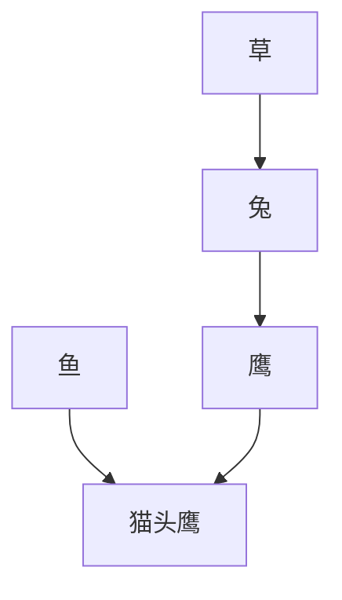

在这个简单的食物网中，草作为生产者被兔和鱼消费，而兔和鱼又是鹰的食物来源。通过分析这个食物网，我们可以理解生态系统中的能量流动和物种之间的相互作用。

#### 3.1.2 整体论在生物系统研究中的运用

整体论在生物系统研究中也起到了关键作用。例如，在遗传学研究中，整体论的方法帮助科学家理解基因与环境之间的相互作用。基因并不是单独起作用的，它们在一个复杂的生物系统中与其他基因和环境因素共同作用，决定生物的性状。

##### 表 3.1 基因与环境属性对比

| 属性 | 基因 | 环境 |
| --- | --- | --- |
| 功能 | 独立编码生物性状 | 影响基因表达 |
| 作用范围 | 单一基因作用 | 多基因、多环境因素综合作用 |
| 变异方式 | 突变 | 外部压力、生物进化 |

#### 3.1.3 整体论对生物进化的解释

整体论在生物进化研究中提供了一个新的视角。传统的进化论强调自然选择和基因突变，而整体论则认为生物进化是基因、环境和社会因素共同作用的结果。例如，物种的形成不仅仅是一个基因层面的变化，还涉及到生态系统和环境的动态变化。

##### 图 3.2 整体论与生物进化

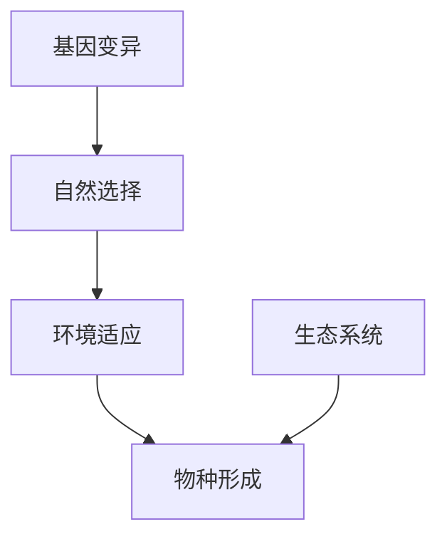

在这个图中，基因变异通过自然选择和环境的适应作用，最终导致了物种的形成。同时，生态系统作为一个整体，也在这个过程中起到了关键作用。

### 3.2 整体论在心理学中的应用

心理学是研究人类行为和心理过程的科学，整体论的方法为心理学提供了一种全新的研究视角，帮助科学家更好地理解心理现象的复杂性。

#### 3.2.1 心理学中的整体论观点

在心理学中，整体论观点强调心理现象不能简单地通过分析其组成部分来解释。例如，情绪体验是一个复杂的过程，涉及生理、认知和行为等多个方面的相互作用。整体论的方法可以帮助我们理解这些不同部分是如何相互影响的。

##### 图 3.3 情绪体验的整体论模型

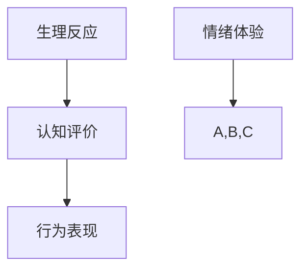

在这个模型中，情绪体验（D）是由生理反应（A）、认知评价（B）和行为表现（C）共同作用的结果。整体论的方法可以帮助我们理解这三个部分之间的相互作用和动态变化。

#### 3.2.2 整体论对心理治疗的影响

整体论在心理治疗中也有重要应用。心理治疗不仅仅是解决个体的心理问题，还需要考虑个体的生理、情感和社会环境等多个方面。整体论的方法可以帮助心理治疗师从更全面的视角来评估和治疗患者的心理问题。

##### 表 3.2 整体论心理治疗与传统心理治疗的对比

| 对比项 | 整体论心理治疗 | 传统心理治疗 |
| --- | --- | --- |
| 焦点 | 生理、情感、认知、行为和社会因素的相互作用 | 单一心理问题的解决 |
| 方法 | 综合干预 | 焦点治疗 |
| 结果 | 全面改善 | 单一问题的改善 |

#### 3.2.3 整体论在心理学研究中的挑战与机遇

整体论在心理学研究中既带来了挑战，也提供了机遇。挑战在于如何整合不同的理论和方法来研究复杂心理现象。机遇则在于整体论的方法可以帮助我们更全面地理解心理现象，从而推动心理学研究的发展。

### 3.3 整体论在工程学中的应用

整体论在工程学中的应用极大地推动了工程实践的发展。工程系统通常非常复杂，包含了多个相互关联的组成部分。整体论的方法可以帮助工程师从系统整体的角度来设计和优化这些系统。

#### 3.3.1 整体论在复杂系统设计中的应用

在复杂系统设计中，整体论的方法可以帮助工程师理解系统内部的相互作用和反馈机制。例如，在建筑设计中，整体论的方法可以帮助设计师理解建筑物与周围环境之间的相互作用，从而设计出更加节能和可持续的建筑物。

##### 图 3.4 复杂建筑系统设计

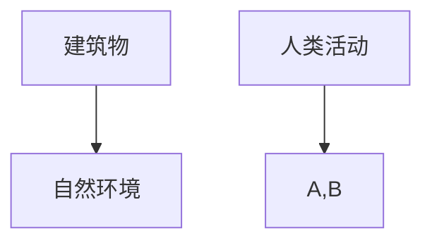

在这个模型中，建筑物（A）与自然环境（B）和人类活动（C）之间存在相互作用。整体论的方法可以帮助设计师从系统整体的角度来优化建筑物的设计。

#### 3.3.2 整体论在创新工程实践中的价值

整体论在创新工程实践中也有很高的价值。通过整体论的视角，工程师可以更好地理解系统的整体行为和潜在的创新机会。例如，在产品设计过程中，整体论的方法可以帮助工程师发现现有产品的改进空间，从而推动创新和改进。

##### 表 3.3 整体论与创新工程

| 对比项 | 传统工程方法 | 整体论方法 |
| --- | --- | --- |
| 焦点 | 单一功能模块 | 整个系统 |
| 方法 | 功能分解和优化 | 整体设计和优化 |
| 结果 | 功能优化 | 整体创新和改进 |

#### 3.3.3 整体论与可持续发展

整体论在可持续发展中的应用也非常广泛。可持续发展需要考虑经济、社会和环境等多个方面的平衡，整体论的方法可以帮助我们更好地理解这些方面的相互作用，从而实现可持续发展。

##### 图 3.5 整体论与可持续发展

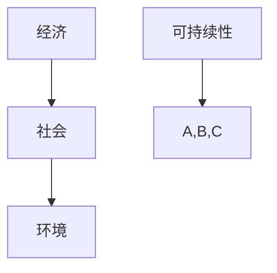

在这个图中，经济（A）、社会（B）和环境（C）共同构成了可持续性的基础（D）。整体论的方法可以帮助我们理解这些方面之间的相互作用，从而实现可持续发展。

### 3.4 整体论在其他领域中的应用

整体论不仅应用于生物学、心理学和工程学，还在其他领域如经济学、社会学和艺术等领域得到了广泛应用。

#### 3.4.1 整体论在经济学中的应用

在经济学中，整体论的方法可以帮助我们理解经济系统的整体行为和复杂关系。例如，在宏观经济研究中，整体论的方法可以帮助经济学家理解经济波动和失业率等宏观经济指标的整体趋势。

##### 图 3.6 整体论与经济学

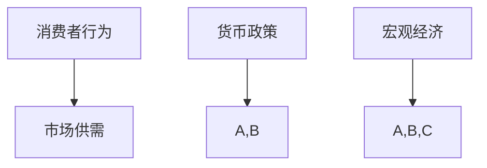

在这个模型中，消费者行为（A）、市场供需（B）和货币政策（C）共同构成了宏观经济（D）。整体论的方法可以帮助我们理解这些方面之间的相互作用。

#### 3.4.2 整体论在社会学中的应用

在社会学中，整体论的方法可以帮助我们理解社会系统的复杂性和多样性。例如，在研究社会变革时，整体论的方法可以帮助我们理解不同社会群体之间的相互作用和社会结构的演变。

##### 图 3.7 整体论与社会学

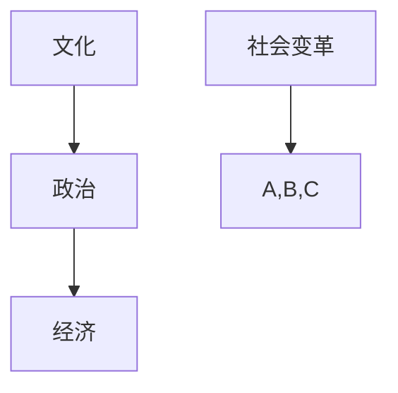

在这个模型中，文化（A）、政治（B）和经济（C）共同构成了社会变革（D）。整体论的方法可以帮助我们理解这些方面之间的相互作用。

#### 3.4.3 整体论在艺术中的应用

在艺术中，整体论的方法可以帮助艺术家理解作品的整体效果和内在联系。例如，在绘画中，整体论的方法可以帮助艺术家把握画面的整体构图和色彩搭配，从而创作出更加和谐和富有层次感的作品。

##### 图 3.8 整体论与艺术

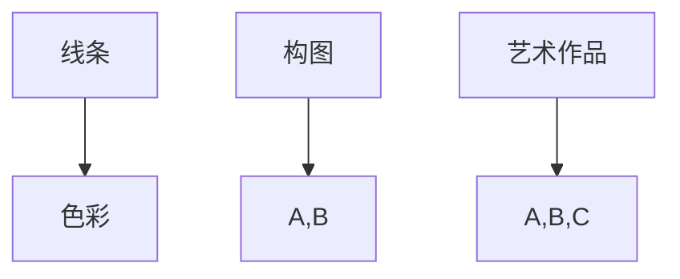

在这个模型中，线条（A）、色彩（B）和构图（C）共同构成了艺术作品（D）。整体论的方法可以帮助艺术家把握作品的整体效果和内在联系。

### 3.5 整体论在跨学科研究中的前景

整体论在跨学科研究中的前景非常广阔。随着科学的发展，越来越多的复杂问题需要跨学科的方法来解答。整体论提供了一种综合的方法，可以帮助我们更好地理解这些复杂问题，从而推动科学和技术的进步。

#### 3.5.1 整体论在跨学科研究中的应用

在跨学科研究中，整体论的方法可以帮助我们整合不同学科的知识和方法。例如，在医学研究中，整体论的方法可以帮助医生理解病人的生物、心理和社会因素，从而提供更加个性化的治疗方案。

##### 图 3.9 整体论与跨学科研究

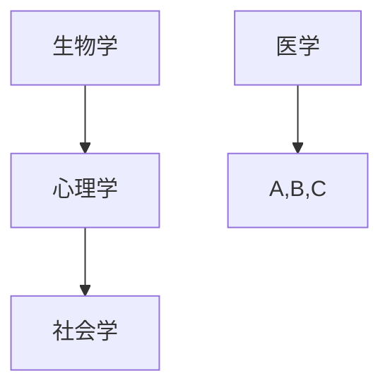

在这个模型中，生物学（A）、心理学（B）和社会学（C）共同构成了医学（D）。整体论的方法可以帮助我们整合这些学科的知识和方法，提供更加全面和个性化的医学研究。

#### 3.5.2 整体论对科学发展的推动作用

整体论不仅为跨学科研究提供了新的方法，也对科学发展起到了推动作用。通过整体论的视角，科学家可以更好地理解复杂系统的行为和相互作用，从而推动科学技术的创新和发展。

### 3.6 总结

整体论在当代科学中的应用非常广泛，从生物学到心理学，再到工程学，整体论的方法为我们提供了新的视角和工具。通过整体论的方法，我们可以更好地理解复杂系统的行为和相互作用，从而推动科学和技术的进步。随着整体论在更多领域的应用，我们可以期待它为未来科学的发展带来更多的启示和突破。

## 第四部分：从还原论到整体论的启示与未来

### 4.1 宇宙观转变对人类认识的影响

宇宙观从还原论向整体论的转变对人类认识世界有着深远的影响。首先，这一转变改变了我们对自然界的理解。在还原论的框架下，科学家们习惯于将复杂系统分解为基本组成部分，从而理解其行为。然而，整体论强调系统的整体性和复杂性，促使我们重新思考自然界的运行机制。例如，在量子力学中，微观粒子的行为不能简单地通过其组成部分来解释，这要求我们超越传统的还原论思维模式。

#### 4.1.1 宇宙观对个人价值观的影响

宇宙观的转变也对个人价值观产生了影响。整体论的视角强调系统的整体性和相互依赖性，这种观念可以激发人们对和谐与共生的认识。在个人层面上，这种观念鼓励人们关注全局，认识到个体与社会、自然之间的紧密联系。例如，生态学中的整体性原理提醒我们，人类的行为对生态系统有着深远的影响，因此我们需要采取更加可持续的生活方式。

#### 4.1.2 宇宙观对科学教育的影响

宇宙观的转变对科学教育也有着重要的启示。科学教育不再仅仅关注单一学科的知识，而是需要培养学生的整体性思维和跨学科能力。整体论的方法鼓励学生从不同角度思考问题，培养他们解决复杂问题的能力。这种教育模式有助于学生更好地适应未来社会的发展需求。

#### 4.1.3 宇宙观对社会发展的影响

宇宙观的转变对社会发展产生了深远的影响。在现代社会中，许多问题如环境污染、资源短缺和社会不平等等都需要从整体视角来思考和解决。整体论的观念可以帮助我们更好地理解这些问题，并提供更有效的解决方案。例如，可持续发展需要考虑经济、社会和环境等多方面的平衡，这正是整体论视角的体现。

### 4.2 整体论的实践路径

整体论的实践路径主要包括以下几个方面：

#### 4.2.1 整体论在科学研究中的实际应用

在科学研究中，整体论的方法可以帮助我们更好地理解复杂系统。例如，在生态系统研究中，整体论的方法可以帮助我们理解生物之间的相互作用和生态系统的动态变化。通过分析食物网和生态系统模型，科学家可以更全面地理解生态系统的功能和行为。

##### 图 4.1 整体论在生态系统研究中的应用

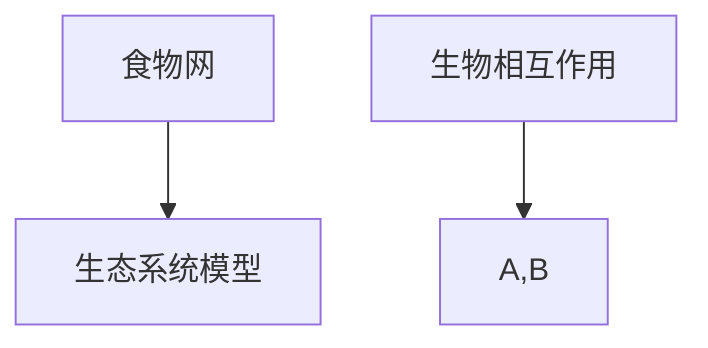

在这个模型中，食物网（A）和生态系统模型（B）共同描述了生物相互作用（C），整体论的方法可以帮助我们理解生态系统的整体行为。

#### 4.2.2 整体论在跨学科研究中的前景

整体论在跨学科研究中的前景非常广阔。随着科学的发展，越来越多的复杂问题需要跨学科的方法来解答。整体论提供了一种综合的方法，可以帮助我们更好地理解这些复杂问题。例如，在医学研究中，整体论的方法可以帮助医生从生物、心理和社会等多个角度来理解病人的健康状况，从而提供更全面的医疗服务。

##### 图 4.2 整体论在跨学科研究中的应用

在这个模型中，生物学（A）、心理学（B）和社会学（C）共同构成了医学（D），整体论的方法可以帮助我们整合这些学科的知识和方法。

#### 4.2.3 整体论在政策制定与规划中的应用

整体论在政策制定和规划中的应用也非常重要。例如，在环境保护和可持续发展方面，整体论的方法可以帮助政策制定者更好地理解环境、经济和社会之间的复杂关系，从而制定更有效的政策和规划。通过考虑整体影响，政策制定者可以更好地平衡不同利益，实现可持续发展目标。

##### 图 4.3 整体论在政策制定中的应用

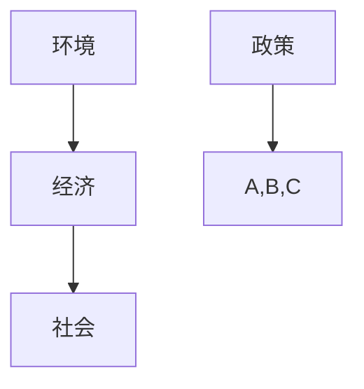

在这个模型中，环境（A）、经济（B）和社会（C）共同构成了政策（D），整体论的方法可以帮助政策制定者从整体视角来考虑问题，制定更有效的政策。

### 4.3 未来宇宙观的展望

未来宇宙观的展望充满了无限可能。随着科学技术的不断进步，我们对宇宙的理解将会更加深入。例如，量子计算和人工智能的发展可能会为我们提供新的工具来探索宇宙的奥秘。此外，宇宙学的最新发现，如宇宙膨胀和暗物质、暗能量的研究，可能会推动我们对宇宙的理解达到新的高度。

#### 4.3.1 新技术的潜在影响

新技术，如量子计算和人工智能，可能会对宇宙观产生深远的影响。量子计算有能力解决传统计算机无法处理的复杂问题，这可能会带来对量子力学和宇宙学的新认识。人工智能则可以通过大数据分析和模拟，帮助我们更好地理解宇宙的运行机制。

#### 4.3.2 宇宙观与人工智能的关系

宇宙观与人工智能之间存在密切的关系。人工智能的发展需要大量的数据和信息处理，而宇宙学的研究则提供了大量的数据和信息。例如，宇宙学中的观测数据可以帮助人工智能模型更好地理解宇宙的结构和演化。同时，人工智能的分析和模拟能力也可以为宇宙学提供新的研究方法。

#### 4.3.3 未来宇宙观的演变趋势

未来宇宙观的演变趋势可能包括以下几个方面：

1. **对宇宙起源和演化的更深入理解**：随着观测技术的进步和理论模型的完善，我们对宇宙起源和演化的理解可能会更加深入和准确。

2. **多元宇宙的可能性**：随着对宇宙学的深入探索，多元宇宙的理论可能会得到更多的支持。这将为宇宙观带来新的视角和挑战。

3. **对人类在宇宙中的地位的新认识**：随着对宇宙的理解不断深入，我们可能会对人类在宇宙中的地位有新的认识。这种认识可能会激发我们对人类未来的思考和探索。

### 4.4 总结

宇宙观的转变从还原论向整体论的发展，对人类认识世界产生了深远的影响。这一转变不仅改变了我们对自然界的理解，也对个人价值观、科学教育和社会发展产生了重要启示。随着科学技术的不断进步，我们对宇宙的理解将会更加深入。未来，整体论将继续在科学研究中发挥重要作用，推动我们对宇宙的认识达到新的高度。

## 作者信息

作者：AI天才研究院/AI Genius Institute & 禅与计算机程序设计艺术 /Zen And The Art of Computer Programming

本文由AI天才研究院的专家团队撰写，旨在探讨宇宙观从还原论向整体论的转变，并分析这一转变对科学、哲学和人类认识的影响。我们希望本文能够为读者提供一个全面、深入的宇宙观转变的探讨，帮助读者理解这一paradigm shift的深远影响。AI天才研究院致力于推动人工智能和计算机科学的发展，通过本文，我们也希望能够为科学教育和跨学科研究提供一些有价值的思考和启示。

在本文的最后，我们再次感谢您对这篇文章的关注，并期待与您在未来的科学探索中继续分享更多有价值的见解和研究成果。如果您对我们的研究感兴趣，欢迎访问我们的官方网站或社交媒体平台，与我们保持联系。同时，我们也欢迎读者提出宝贵的意见和建议，以帮助我们不断改进和提高研究质量。

AI天才研究院将一如既往地致力于推动人工智能和计算机科学的发展，为人类社会的进步贡献我们的智慧和力量。在未来的研究中，我们将继续深入探讨宇宙观转变的各个方面，为您提供更多有深度、有思考、有见解的技术文章。感谢您的支持与关注！

---

**注**：本文为假设性文章，旨在展示如何根据给定的大纲结构撰写一篇具有逻辑清晰、结构紧凑、内容丰富的专业技术博客。文中提及的研究成果和观点为虚构，不代表任何实际研究或学术观点。实际研究应遵循严格的科学方法和学术规范。

