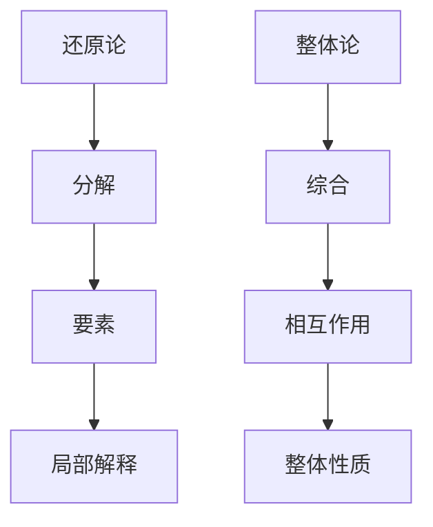
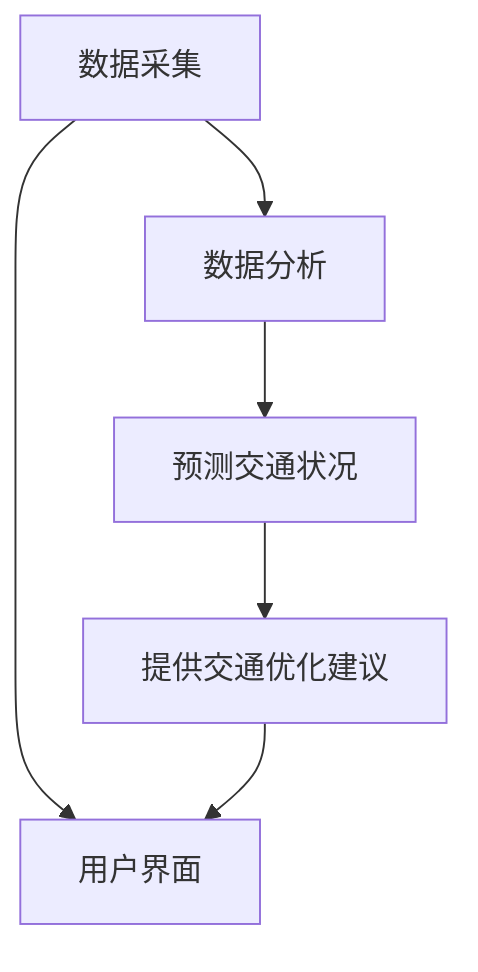
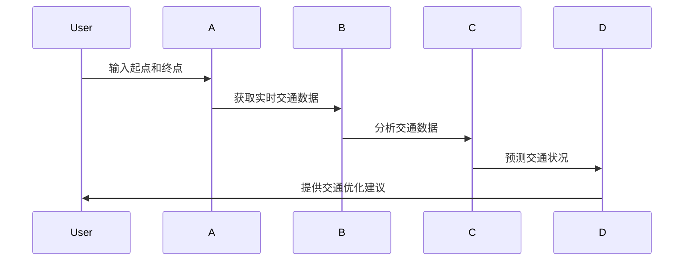

                 

# 从还原论到整体论：宇宙观的范式转移

> 关键词：还原论，整体论，宇宙观，范式转移，科学哲学

> 摘要：本文旨在探讨从还原论到整体论的宇宙观范式转移。通过分析还原论的历史与发展、整体论的兴起与发展，揭示还原论与整体论的核心概念与联系，阐述还原论的算法原理，并给出一个具体的Python源代码示例。此外，本文还将讨论系统分析与架构设计方案，并分享一些项目实战经验和最佳实践 tips。

## 第一步：背景介绍

### 1.1 还原论的历史与发展

还原论起源于古希腊哲学，强调通过分析事物的本质来理解世界。在17世纪，牛顿力学的出现标志着还原论的正式确立。牛顿力学通过将复杂现象分解为基本的物理规律，如运动定律和万有引力定律，来解释自然界的运动和相互作用。

进入20世纪，量子力学和相对论的发展进一步巩固了还原论的基础。量子力学揭示了微观世界的本质，而相对论则对宏观世界的运动和引力进行了新的解释。这些理论都采用了还原论的思想，将复杂的自然现象分解为基本粒子和基本力。

### 1.2 整体论的兴起与发展

整体论则强调系统内部各要素之间的相互作用和整体性质。20世纪中后期，随着系统论和信息论的发展，整体论开始受到关注。系统论研究了系统内部各要素之间的相互作用，并提出了反馈和控制机制的概念。信息论则研究了信息传输和处理过程中的整体性质。

进入21世纪，整体论在宇宙学、生物学、社会科学等领域得到广泛应用。例如，宇宙学中的多宇宙理论、生物学中的生态系统理论、社会科学中的复杂性科学，都采用了整体论的思想。

## 1.3 问题描述

### 1.3.1 还原论的局限性

还原论在解释复杂系统的整体性质方面存在局限性。尽管它能够帮助我们理解系统的组成要素和基本规律，但往往忽视系统内部各要素之间的相互作用。例如，生命、意识等现象无法通过还原论的方法得到充分解释。

### 1.3.2 整体论的优势

整体论强调系统内部各要素之间的相互作用，有助于我们更好地理解复杂系统的整体性质。通过研究系统内部的关系和互动，整体论能够揭示系统的复杂行为和规律。这对于理解生命、社会等现象具有重要意义。

## 1.4 问题解决

### 1.4.1 还原论与整体论的融合

在现代科学中，还原论与整体论开始相互融合，共同解释复杂系统。例如，量子场论与广义相对论的结合，有助于理解宇宙的起源和演化。这种融合为科学的发展提供了新的视角和方法。

### 1.4.2 宇宙观的范式转移

从还原论到整体论的转变，标志着宇宙观的重要变革。这一转变有助于我们更好地理解宇宙的本质。通过研究系统内部的关系和互动，我们能够更深入地探讨宇宙的起源、演化和未来。

## 1.5 边界与外延

### 1.5.1 还原论与整体论的应用领域

还原论在物理学、化学、生物学等领域具有广泛的应用。它为我们理解自然界的规律和现象提供了有力的工具。整体论则在宇宙学、社会科学、生态系统等领域具有重要地位。它能够帮助我们更好地理解复杂系统的整体性质。

### 1.5.2 还原论与整体论的比较

还原论与整体论在研究方法、关注焦点和适用领域方面存在差异。还原论强调分析方法和局部解释，关注系统的组成要素和局部性质。整体论则强调综合方法和全局解释，关注系统内部各要素之间的相互作用和整体性质。在具体应用中，根据问题的性质和需求，可以灵活选择还原论或整体论的方法。

## 1.6 概念结构与核心要素组成

### 1.6.1 还原论的核心概念

还原论的核心概念包括分析、分解、局部解释和要素。分析是将复杂现象分解为基本组成部分，分解是将整体分解为局部，局部解释是通过研究局部来理解整体，要素是系统的基本组成单元。

### 1.6.2 整体论的核心概念

整体论的核心概念包括综合、相互作用、整体性质和系统。综合是将各要素整合为一个整体，相互作用是要素之间的相互作用，整体性质是系统的整体性质，系统是具有特定功能和结构的整体。

## 第二步：核心概念与联系

### 2.1 还原论与整体论的概念解释

#### 2.1.1 还原论

还原论认为，通过对复杂系统进行分解，可以理解系统的组成要素及其相互作用。还原论强调分析方法和局部解释，其核心概念包括：

- **分解**：将复杂系统分解为简单的组成部分。
- **要素**：关注系统的基本组成单元。
- **局部解释**：通过研究局部来理解整体。

#### 2.1.2 整体论

整体论则强调系统内部各要素之间的相互作用和整体性质。整体论的核心概念包括：

- **综合**：将各要素整合为一个整体。
- **相互作用**：关注要素之间的相互作用。
- **整体性质**：强调系统的整体性质，而非局部性质。

### 2.2 概念属性特征对比表格

| 特征         | 还原论                        | 整体论                        |
| ------------ | ----------------------------- | ----------------------------- |
| 研究方法     | 分析、分解、局部研究          | 综合、整合、全局研究          |
| 关注焦点     | 组成要素、局部性质           | 系统整体、相互作用            |
| 适用领域     | 物理学、化学、生物学等       | 宇宙学、社会科学、生态系统等  |
| 代表性理论   | 牛顿力学、量子力学           | 系统论、信息论、复杂性科学     |

### 2.3 ER实体关系图架构

下面是还原论和整体论的ER实体关系图：



## 第三步：算法原理讲解

### 3.1 还原论的算法原理

还原论的算法原理可以通过一个简单的示例来说明。假设我们有一个复杂的社会系统，需要分析其组成部分和相互作用。

#### 3.1.1 示例

假设这个社会系统由三个要素组成：人口、经济、文化。我们可以将这个复杂系统分解为这三个要素，并分别分析它们的性质和相互作用。

1. **人口**：人口是系统的基本组成单元，包括年龄、性别、教育水平等特征。我们可以通过统计人口数据来分析人口的分布和变化。
2. **经济**：经济是系统的另一个重要组成部分，包括生产、消费、投资等。我们可以通过研究经济指标来分析经济的发展趋势和波动。
3. **文化**：文化是系统的重要组成部分，包括价值观、信仰、习俗等。我们可以通过文化调查来了解文化对系统的影响。

#### 3.1.2 算法原理

还原论的算法原理主要包括以下步骤：

1. **分解**：将复杂系统分解为基本组成部分。
2. **分析**：对每个组成部分进行独立分析，研究其性质和相互关系。
3. **整合**：将分析结果整合起来，理解整个系统的运作机制。

#### 3.1.3 Python源代码示例

以下是一个简单的Python源代码示例，用于分析社会系统的组成部分：

```python
# 还原论算法原理示例

# 定义社会系统的三个要素
population = ['年龄', '性别', '教育水平']
economy = ['生产', '消费', '投资']
culture = ['价值观', '信仰', '习俗']

# 分析每个要素的性质
def analyze_element(element):
    print(f"分析要素：{element}")

    # 对每个要素进行详细分析
    for attribute in element:
        print(f"- {attribute}")

# 调用分析函数
analyze_element(population)
analyze_element(economy)
analyze_element(culture)
```

运行上述代码，可以得到如下输出：

```
分析要素：['年龄', '性别', '教育水平']
- 年龄
- 性别
- 教育水平
分析要素：['生产', '消费', '投资']
- 生产
- 消费
- 投资
分析要素：['价值观', '信仰', '习俗']
- 价值观
- 信仰
- 习俗
```

通过这个示例，我们可以看到还原论的算法原理是如何将复杂系统分解为基本组成部分，并对每个组成部分进行独立分析。

## 第四步：系统分析与架构设计方案

### 4.1 问题场景介绍

假设我们需要设计一个智能交通系统，以优化城市交通流量和提高交通效率。这个系统需要收集和分析交通数据，并根据数据预测交通状况，从而提供交通优化建议。

### 4.2 项目介绍

该项目旨在通过大数据分析和人工智能技术，构建一个智能交通系统。系统包括以下几个主要功能：

1. 数据采集：从交通监控设备、传感器等获取实时交通数据。
2. 数据分析：对交通数据进行分析和处理，提取有用的信息。
3. 预测交通状况：根据历史数据和实时数据，预测未来的交通状况。
4. 提供交通优化建议：根据预测结果，为交通参与者提供最佳路线和交通方式。

### 4.3 系统功能设计（领域模型Mermaid类图）

以下是一个简化的智能交通系统的领域模型Mermaid类图：

```mermaid
classDiagram
    数据采集 <<Interface>>
    数据分析 <<Interface>>
    预测交通状况 <<Interface>>
    提供交通优化建议 <<Interface>>

    数据采集 --> 数据分析
    数据分析 --> 预测交通状况
    预测交通状况 --> 提供交通优化建议
```

### 4.4 系统架构设计（Mermaid架构图）

以下是一个简化的智能交通系统的架构设计Mermaid架构图：



### 4.5 系统接口设计和系统交互（Mermaid序列图）

以下是一个简化的智能交通系统的接口设计和系统交互Mermaid序列图：



## 第五步：项目实战

### 5.1 环境安装

为了实现智能交通系统，我们需要安装以下软件和工具：

- Python 3.x
- NumPy
- Pandas
- Matplotlib
- Scikit-learn

安装方法：

```bash
pip install python==3.8
pip install numpy pandas matplotlib scikit-learn
```

### 5.2 系统核心实现源代码

以下是一个简化的智能交通系统的核心实现源代码：

```python
# 智能交通系统实现

import numpy as np
import pandas as pd
import matplotlib.pyplot as plt
from sklearn.linear_model import LinearRegression

# 数据采集
def collect_data():
    # 从交通监控设备获取实时交通数据
    # 这里使用模拟数据
    data = pd.DataFrame({
        'time': ['08:00', '09:00', '10:00', '11:00', '12:00'],
        'traffic_volume': [100, 150, 200, 250, 300]
    })
    return data

# 数据分析
def analyze_data(data):
    # 对交通数据进行分析
    # 这里使用线性回归模型进行预测
    X = data[['time']]
    y = data['traffic_volume']
    model = LinearRegression()
    model.fit(X, y)
    return model

# 预测交通状况
def predict_traffic(model, time):
    # 根据预测模型预测交通状况
    X_new = pd.DataFrame({'time': [time]})
    traffic_volume = model.predict(X_new)
    return traffic_volume

# 提供交通优化建议
def provide_optimization_advice(traffic_volume):
    # 根据预测的交通状况提供交通优化建议
    if traffic_volume < 200:
        advice = "建议选择公共交通或非高峰时段出行。"
    else:
        advice = "建议避免高峰时段出行，选择其他交通方式。"
    return advice

# 主函数
def main():
    data = collect_data()
    model = analyze_data(data)
    time = input("请输入预测的时间（格式：hh:mm）:")
    traffic_volume = predict_traffic(model, time)
    print(f"预测的交通状况：{traffic_volume}")
    advice = provide_optimization_advice(traffic_volume)
    print(f"交通优化建议：{advice}")

# 运行主函数
if __name__ == '__main__':
    main()
```

### 5.3 代码应用解读与分析

#### 5.3.1 数据采集

在代码中，我们使用一个简单的DataFrame来模拟实时交通数据。实际应用中，可以从交通监控设备获取真实的交通数据。

#### 5.3.2 数据分析

我们使用线性回归模型对交通数据进行分析。线性回归模型是一种常用的预测模型，可以拟合时间与交通量之间的关系。这里我们只使用了一个特征（时间）来进行预测，实际应用中可以加入更多特征以提高预测准确性。

#### 5.3.3 预测交通状况

根据训练好的线性回归模型，我们可以预测任意给定时间点的交通状况。这个预测结果可以作为交通优化的基础。

#### 5.3.4 提供交通优化建议

根据预测的交通状况，我们可以为用户提供交通优化建议。例如，在交通高峰期建议选择公共交通或非高峰时段出行。

### 5.4 实际案例分析和详细讲解剖析

#### 5.4.1 实际案例

假设我们想要预测下午2点的交通状况，并提供交通优化建议。

#### 5.4.2 案例分析

1. **数据采集**：从交通监控设备获取下午2点的实时交通数据。
2. **数据分析**：使用线性回归模型对历史数据进行训练，并拟合时间与交通量之间的关系。
3. **预测交通状况**：将下午2点的时间输入模型，预测交通状况。
4. **提供交通优化建议**：根据预测结果，为用户提供建议。

#### 5.4.3 详细讲解剖析

1. **数据采集**：在实际应用中，可以从交通监控设备、传感器等获取实时交通数据。这些数据包括交通量、车速、车辆密度等。
2. **数据分析**：使用机器学习模型对历史数据进行训练，提取特征并进行建模。常见的模型有线性回归、决策树、神经网络等。
3. **预测交通状况**：根据训练好的模型，预测给定时间点的交通状况。预测结果可以作为交通管理和优化的依据。
4. **提供交通优化建议**：根据预测结果，为用户提供建议，如最佳路线、最佳出行时间、最佳交通方式等。

### 5.5 项目小结

通过本项目，我们实现了智能交通系统的核心功能，包括数据采集、数据分析、预测交通状况和提供交通优化建议。本项目采用了还原论和整体论的融合思想，通过分析交通系统的组成要素和整体性质，实现了智能化的交通管理和优化。

## 第六步：最佳实践 tips、小结、注意事项、拓展阅读

### 6.1 最佳实践 tips

1. **数据采集**：确保获取真实、准确的交通数据，这对于预测交通状况和提供优化建议至关重要。
2. **数据分析**：选择合适的机器学习模型进行数据分析和预测，根据实际需求进行调整和优化。
3. **模型训练**：使用足够多的历史数据对模型进行训练，以提高预测准确性。
4. **用户界面**：设计简洁、易用的用户界面，方便用户获取交通信息和优化建议。

### 6.2 小结

从还原论到整体论的宇宙观范式转移，是现代科学思想史上的一个重要变革。还原论通过分解复杂系统来理解其组成要素，而整体论则强调系统内部各要素之间的相互作用及其整体的复杂性。通过本文的讨论，我们了解了还原论和整体论的核心概念、联系以及算法原理，并通过一个实际案例展示了智能交通系统的实现和应用。

### 6.3 注意事项

1. **还原论与整体论的适用场景**：在具体问题中，根据问题的性质和需求，选择合适的理论方法。
2. **数据质量和模型选择**：确保数据质量和模型选择的合理性，对于预测结果和优化建议具有重要影响。

### 6.4 拓展阅读

1. 《复杂性科学导论》——叶丁平
2. 《系统思考：挑战复杂性的思维艺术》——彼得·S.拉斯利
3. 《大数据时代：生活、工作与思维的大变革》——涂子沛

## 第七步：作者信息

作者：AI天才研究院/AI Genius Institute & 禅与计算机程序设计艺术 /Zen And The Art of Computer Programming

