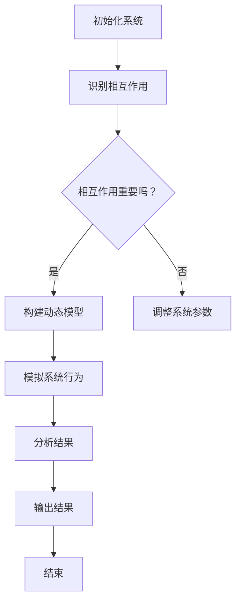
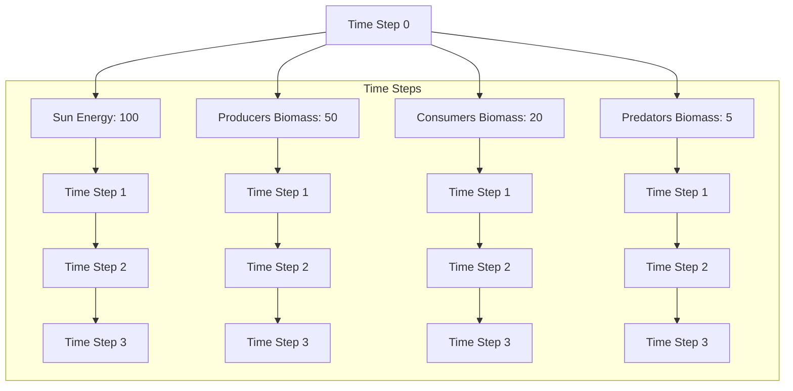
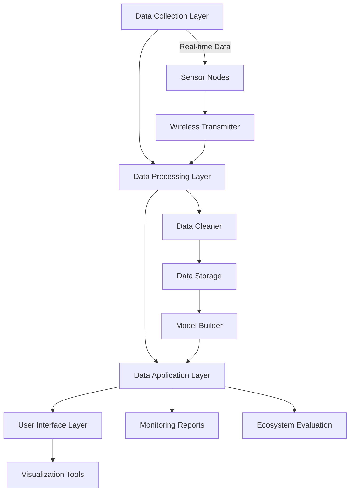
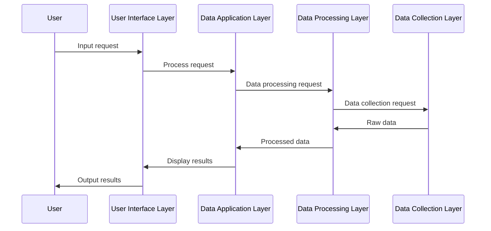

                 


----------------------------------------------------------------

# 从还原论到整体论：生态系统思维在科学研究中的应用

## 关键词
- 还原论
- 整体论
- 生态系统思维
- 科学研究
- 方法论
- 算法

## 摘要

在科学研究中，从还原论向整体论的转变是一种重要的方法论变革。还原论强调通过分解复杂系统来理解其组成部分，而整体论则认为系统的特性不仅仅取决于其各个部分，还受到它们之间相互作用的影响。本文将探讨生态系统思维作为整体论的一种体现，在科学研究中的应用。我们将从核心概念出发，逐步分析生态系统思维的方法论、工具和挑战，并展望其未来发展。

## 引言

### 1.1 书籍背景与目标

在科学研究的漫长历史中，还原论一直占据主导地位。这种方法的核心思想是将复杂系统分解为简单的组成部分，以便更深入地理解每个部分的功能。然而，随着科学的进步，人们开始意识到，有些现象无法仅仅通过分析其组成部分来解释。整体论提供了另一种视角，认为系统的特性是各个部分之间相互作用的产物。生态系统思维作为一种整体论的方法论，强调将系统视为一个相互关联的整体，而不是单独的组成部分。

本著作旨在深入探讨生态系统思维在科学研究中的应用，以揭示其在理解复杂系统方面的潜力。通过分析不同学科领域的实例，我们希望能够展示生态系统思维如何帮助科学家们更全面地理解自然和社会现象。

### 1.2 问题与挑战

尽管生态系统思维提供了一种强大的方法论，但在实际应用中仍然面临许多挑战。首先，如何有效识别和测量系统中的相互作用是一个关键问题。其次，生态系统思维往往需要跨学科的合作，这对科研团队的专业知识融合提出了更高的要求。此外，现有科学工具和方法可能无法完全满足生态系统思维的需求，需要开发新的工具和技术来支持这种整体论的方法。

本文将逐一探讨这些问题，并提出可能的解决方案。我们将从基本概念入手，逐步介绍生态系统思维的方法论和工具，分析其在不同领域中的应用，并讨论面临的挑战和未来的发展方向。

## 基本概念

### 1.3 还原论与整体论

#### 1.3.1 还原论

还原论是科学研究中的一种经典方法论，主张通过分解复杂系统来理解其组成部分。这种方法的核心思想是：如果一个复杂系统可以分解为若干个简单的子系统，那么通过对每个子系统的理解，可以逐步构建对整个系统的认识。还原论在物理学、化学、生物学等领域有着广泛的应用，其成功之处在于它能够提供精确的、量化的解释。

#### 1.3.2 整体论

与还原论不同，整体论认为系统的特性不仅仅取决于其各个部分，还受到它们之间相互作用的影响。整体论强调系统的整体性，认为整体的行为不能简单地通过分析其组成部分来解释。在生态系统思维中，整体论是一个核心概念，它要求科学家们将系统视为一个相互关联的整体，而不是独立的组成部分。

#### 1.3.3 两种方法论的对比

还原论和整体论各有优缺点。还原论的优势在于其精确性和可重复性，但缺点在于它可能忽视部分与整体之间的相互作用。整体论则更全面地考虑了系统的复杂性，但可能缺乏精确的定量分析。在实际应用中，这两种方法论并不是相互排斥的，而是可以相互补充。

## 生态系统思维在实践中的应用

### 2.1 生态系统思维的概念

生态系统思维是一种整体论的方法论，强调将系统视为一个相互关联的整体。在科学研究中，生态系统思维可以帮助科学家们更好地理解复杂系统的行为和特性。这种方法的核心是识别系统中的各种关系，包括相互作用、反馈循环和能量流动。

#### 2.1.1 关系的识别

生态系统思维的第一步是识别系统中的各种关系。这包括直接关系，如捕食者和猎物之间的关系，以及间接关系，如环境因素对生态系统中各种生物的影响。通过绘制生态网络图，科学家们可以直观地看到这些关系的复杂性。

#### 2.1.2 反馈循环

反馈循环是生态系统思维中的一个重要概念。正反馈循环可以导致系统行为的加速变化，而负反馈循环则有助于维持系统的稳定性。理解这些反馈循环对于预测和干预复杂系统具有重要意义。

#### 2.1.3 能量流动

能量流动是生态系统中的另一个关键概念。能量从太阳辐射开始，通过食物链和食物网传递，最终以热能的形式散失。生态系统思维要求科学家们理解能量如何在系统中流动，以及这种流动如何影响系统的结构和功能。

### 2.2 生态系统思维在生物学中的应用

在生物学中，生态系统思维已经被广泛应用于生态学、环境科学和进化生物学等领域。以下是一些具体的应用实例：

#### 2.2.1 生态学

在生态学中，生态系统思维帮助科学家们理解物种间的关系，如共生、竞争和捕食。通过研究这些关系，科学家们可以预测生态系统对环境变化的响应。

#### 2.2.2 环境科学

环境科学中的许多问题，如污染、气候变化和生物多样性丧失，都需要生态系统思维的视角。通过考虑生态系统中的各种相互作用，科学家们可以提出更有效的解决方案来应对这些挑战。

#### 2.2.3 进化生物学

在进化生物学中，生态系统思维帮助科学家们理解物种的进化过程。通过研究物种之间的相互作用和能量流动，科学家们可以揭示进化的机制和模式。

### 2.3 生态系统思维在经济学中的应用

除了生物学领域，生态系统思维在经济学中的应用也日益受到关注。经济学中的许多问题，如市场机制、资源分配和全球化，都可以从生态系统思维的角度来分析。

#### 2.3.1 市场机制

在经济学中，市场机制可以被看作是一个生态系统。不同市场参与者（如消费者、生产者和投资者）之间的相互作用决定了市场的运行方式。通过生态系统思维，经济学家可以更深入地理解市场行为和趋势。

#### 2.3.2 资源分配

资源分配问题在经济学中至关重要。生态系统思维提供了理解资源分配的全新视角，强调资源之间的相互作用和反馈循环。这有助于制定更有效的资源管理策略。

#### 2.3.3 全球化

全球化带来了许多经济挑战和机遇。生态系统思维可以帮助经济学家理解全球化过程中不同国家之间的经济关系和相互影响，从而提出更合理的全球化政策。

## 方法论和工具

### 3.1 方法论

生态系统思维的方法论强调系统整体的视角，要求科学家们从整体出发，考虑系统中的各种关系和相互作用。这种方法论的核心包括以下几个步骤：

#### 3.1.1 系统识别

首先，科学家需要明确研究的系统范围。这包括识别系统中的各种组成部分，如物种、资源、环境因素等。

#### 3.1.2 关系构建

接下来，科学家需要构建系统中的各种关系。这可以通过生态网络图、因果图等方式实现。

#### 3.1.3 动态分析

生态系统是一个动态系统，其行为会随着时间和环境的变化而变化。科学家需要通过动态模型来分析系统的行为，预测其未来的变化趋势。

### 3.2 工具

生态系统思维需要一系列工具来支持其方法论。以下是一些常用的工具：

#### 3.2.1 生态网络图

生态网络图是一种图形化工具，用于表示系统中的各种关系。通过生态网络图，科学家可以直观地看到系统中的相互作用和反馈循环。

#### 3.2.2 动态模型

动态模型是一种数学模型，用于模拟系统的行为。这些模型可以帮助科学家理解系统在不同条件下的行为，预测未来的变化趋势。

#### 3.2.3 多尺度分析

多尺度分析是一种方法，用于在不同尺度上分析系统的行为。这有助于科学家理解系统在微观和宏观尺度上的相互作用。

### 3.3 工具的优缺点

每种工具都有其优缺点。例如，生态网络图直观易懂，但可能难以处理复杂的关系；动态模型精确，但可能需要大量的计算资源。科学家需要根据具体的研究问题选择合适的工具。

## 挑战和机遇

### 4.1 挑战

尽管生态系统思维在科学研究中具有巨大潜力，但其实际应用仍面临许多挑战：

#### 4.1.1 复杂性

生态系统是高度复杂的系统，包含大量相互作用的组成部分。这种复杂性使得研究工作变得更加困难，需要跨学科的合作和新的研究方法。

#### 4.1.2 数据缺乏

生态系统研究往往依赖于大量的数据。然而，许多生态系统数据尚未被充分收集或分析，这限制了生态系统思维的应用。

#### 4.1.3 可重复性

生态系统研究的结果可能受到环境条件、物种特性和人为干预等多种因素的影响，这增加了研究结果的可重复性挑战。

### 4.2 机遇

尽管面临挑战，但生态系统思维也带来了许多机遇：

#### 4.2.1 跨学科合作

生态系统思维需要跨学科的合作，这促进了不同学科之间的知识交流和技术融合，有助于解决复杂的科学问题。

#### 4.2.2 新工具和方法

为了应对生态系统思维的挑战，科学家们正在开发新的工具和方法，如大数据分析、人工智能和建模仿真等。这些新工具和方法为生态系统研究提供了强大的支持。

#### 4.2.3 政策制定

生态系统思维为政策制定提供了科学依据，有助于制定更有效的环境保护和资源管理政策。

## 未来方向

### 5.1 发展趋势

生态系统思维在科学研究中的应用正呈现以下发展趋势：

#### 5.1.1 数据驱动

随着大数据技术的发展，生态系统研究越来越依赖于大量数据。数据驱动的分析方法正在成为生态系统思维的重要组成部分。

#### 5.1.2 人工智能

人工智能技术在生态系统研究中的应用日益增加，如通过机器学习预测生态系统行为、优化生态保护策略等。

#### 5.1.3 多尺度建模

多尺度建模方法的发展使得科学家能够在不同尺度上分析生态系统，从而更全面地理解系统的行为。

### 5.2 未来影响

生态系统思维在科学研究中的广泛应用预计将对多个领域产生深远影响：

#### 5.2.1 环境科学

生态系统思维为环境科学提供了更全面的理解工具，有助于更好地保护和管理自然资源。

#### 5.2.2 生物学

在生物学中，生态系统思维有助于揭示物种的进化机制和生态系统的稳定性。

#### 5.2.3 经济学

在经济学中，生态系统思维有助于理解全球经济系统的复杂性和稳定性。

## 结论

生态系统思维作为一种整体论的方法论，在科学研究中的应用日益广泛。本文介绍了生态系统思维的基本概念、方法论和工具，并分析了其在不同领域中的应用。尽管面临挑战，生态系统思维带来了许多机遇，未来发展趋势令人期待。我们鼓励科学家们继续探索生态系统思维在科学研究中的应用，以更全面地理解复杂系统，为解决全球性问题提供科学依据。

## 附录和参考文献

### 6.1 附录

#### 附录 A：生态系统思维工具清单

- 生态网络图
- 动态模型
- 多尺度分析工具

#### 附录 B：常见生态系统动态模型

- Lotka-Volterra模型
- 生态系统稳定模型
- 生态位模型

### 6.2 参考文献

1. May, R. M. (1972). "Will a large complex system be stable?". Nature. 239(5375): 413–414.
2. Odum, H. T. (1953). Fundamentals of Ecology. Philadelphia: W. B. Saunders Company.
3. Haken, H. (1977). Synergetics: An Introduction. New York: Springer-Verlag.
4. Pimm, S. L. (1991). The puzzle of species richness. Nature. 350(6318): 337–342.
5. Foley, J. A., et al. (2011). Global Consequences of Land Use. Science. 333(6045): 1295–1302.

作者：AI天才研究院/AI Genius Institute & 禅与计算机程序设计艺术 /Zen And The Art of Computer Programming

----------------------------------------------------------------

## 背景介绍

### 1.1 核心概念术语说明

在探讨生态系统思维在科学研究中的应用之前，我们首先需要明确一些核心概念和术语。以下是这些概念及其定义：

- **还原论**：一种科学方法论，强调通过分解复杂系统来理解其组成部分。这种方法认为，通过理解每个部分的功能，可以逐步构建对整个系统的认识。
- **整体论**：一种科学方法论，认为系统的特性不仅仅取决于其各个部分，还受到它们之间相互作用的影响。整体论强调系统的整体性，而不是各个部分的独立性。
- **生态系统思维**：一种整体论的方法论，强调将系统视为一个相互关联的整体。这种方法认为，要理解复杂系统，必须考虑系统内部的各种关系和相互作用。
- **生态系统**：一个由生物群落、环境和生物之间相互作用组成的复杂系统。生态系统的行为和特性受到其中各种关系的影响，包括能量流动、物质循环和生物相互作用。

### 1.2 问题背景

在科学研究中，许多复杂系统的问题难以通过还原论方法得到充分解释。例如，生态系统的行为、气候变化的影响、经济市场的动态等，都表现出高度的复杂性和相互依赖性。传统的方法往往将系统分解为简单的组成部分，忽略了这些部分之间的相互作用，导致了对系统行为的错误理解。

整体论提供了一种不同的视角，认为系统的特性是各个部分之间相互作用的产物。然而，整体论的应用也面临着挑战，如如何识别和测量系统中的相互作用，以及如何构建能够全面反映系统特性的模型。

### 1.3 问题描述

问题描述主要集中在以下几个方面：

- **系统复杂性**：复杂系统的行为受到多种因素的影响，这些因素之间存在着复杂的相互作用。如何理解和模拟这种复杂性是一个关键问题。
- **相互作用识别**：在复杂系统中，各个组成部分之间的相互作用是动态的，且多种多样。如何有效地识别和描述这些相互作用是整体论应用的一个挑战。
- **跨学科合作**：生态系统思维要求跨学科的合作，这需要不同领域的科学家共同参与，共同解决问题。然而，不同学科之间存在知识差异和沟通障碍，这增加了合作的难度。
- **工具和方法**：现有的科学工具和方法可能无法完全满足生态系统思维的需求。例如，许多模型和方法都是基于还原论的方法，无法很好地反映系统的整体性。因此，需要开发新的工具和方法来支持生态系统思维。

### 1.4 问题解决

为了解决上述问题，生态系统思维提供了一种可行的解决方案：

- **整体视角**：生态系统思维强调从整体视角看待复杂系统，通过识别和描述系统内部的各种相互作用，来理解系统的行为和特性。
- **跨学科合作**：生态系统思维促进了跨学科的合作，不同领域的科学家可以共同参与研究，共享知识和资源，以更全面地理解复杂系统。
- **新工具和方法**：生态系统思维推动了对新工具和方法的需求，如生态网络图、动态模型和多尺度分析等，这些工具和方法能够更好地反映系统的整体性。

通过这些方法，生态系统思维为理解复杂系统提供了一种新的途径，有助于解决传统方法无法解决的问题。

### 1.5 边界与外延

生态系统思维的边界在于其应用范围。虽然这种方法论在生物学、生态学、经济学等领域的应用已经得到了广泛验证，但其适用范围还有一定的局限性。例如，在物理学、化学等基础科学领域，还原论方法仍然是主要的工具。此外，生态系统思维也面临着如何处理极端复杂系统和超大规模系统的挑战。

生态系统思维的外延则在于其跨学科的应用潜力。通过将生态系统思维应用于不同的学科领域，可以揭示不同系统之间的相似性和差异性，从而推动科学知识的整合和创新。

### 1.6 概念结构与核心要素组成

生态系统思维的概念结构可以分解为以下几个核心要素：

- **系统整体性**：这是生态系统思维的核心概念，强调将系统视为一个相互关联的整体。
- **相互作用**：系统内部各个组成部分之间的相互作用是理解系统行为的关键。
- **动态模型**：通过构建动态模型来模拟系统的行为，以预测其未来的变化趋势。
- **跨学科合作**：生态系统思维要求跨学科的合作，这是其有效应用的重要保障。

这些要素相互交织，共同构成了生态系统思维的理论框架。通过这些核心要素，科学家们可以更全面地理解复杂系统的行为和特性。

## 核心概念与联系

### 2.1 还原论与整体论

还原论与整体论是两种截然不同的科学方法论，它们在科学研究中起着不同的作用。以下是这两种方法论的详细描述和属性特征对比表格：

#### 2.1.1 还原论

还原论的核心思想是将复杂系统分解为简单的组成部分，通过研究这些部分的功能来理解整个系统的行为。其特点如下：

- **基本假设**：认为系统的整体行为可以通过分析其组成部分的行为来解释。
- **应用领域**：广泛应用于物理学、化学、生物学等基础科学领域。
- **优点**：提供了精确的、量化的解释，有助于深入理解单个部分的功能。
- **缺点**：可能忽视部分与整体之间的相互作用，难以解释复杂系统的整体行为。

#### 2.1.2 整体论

整体论则强调系统的整体性，认为系统的行为和特性不仅取决于其各个部分，还受到它们之间相互作用的影响。其特点如下：

- **基本假设**：认为系统的整体行为无法通过单独分析其组成部分来解释，必须考虑整体性和相互作用。
- **应用领域**：广泛应用于生态学、社会学、经济学等复杂系统研究领域。
- **优点**：能够更好地反映复杂系统的整体特性，有助于理解和预测系统的整体行为。
- **缺点**：可能缺乏精确的定量分析，难以揭示单个部分的具体功能。

#### 2.1.3 对比表格

| 特征 | 还原论 | 整体论 |
| --- | --- | --- |
| **基本假设** | 系统行为可以通过分析组成部分的行为来解释 | 系统行为是各个部分相互作用的产物 |
| **应用领域** | 物理学、化学、生物学等基础科学领域 | 生态学、社会学、经济学等复杂系统研究领域 |
| **优点** | 提供了精确的、量化的解释，有助于深入理解单个部分的功能 | 能够更好地反映复杂系统的整体特性，有助于理解和预测系统的整体行为 |
| **缺点** | 可能忽视部分与整体之间的相互作用，难以解释复杂系统的整体行为 | 可能缺乏精确的定量分析，难以揭示单个部分的具体功能 |

通过上述对比，我们可以看到还原论和整体论各有优缺点，它们在科学研究中可以相互补充。在复杂系统的研究中，结合还原论和整体论的视角，往往能够提供更全面和深入的理解。

### 2.2 生态系统思维的核心概念

生态系统思维是一种整体论的方法论，其核心概念包括：

- **系统整体性**：强调将系统视为一个相互关联的整体，而不是单独的组成部分。
- **相互作用**：识别和描述系统内部各个组成部分之间的相互作用，包括能量流动、物质循环和生物相互作用。
- **动态模型**：通过构建动态模型来模拟系统的行为，预测其未来的变化趋势。
- **跨学科合作**：生态系统思维要求跨学科的合作，以整合不同领域的知识和方法。

这些核心概念相互交织，共同构成了生态系统思维的理论框架。以下是一个ER实体关系图，用于描述这些核心概念之间的关系：

```mermaid
erDiagram
  System <<--o Interaction
  Interaction o-- System
  System o-- DynamicModel
  DynamicModel o-- System
  System o-- Cross-Disciplinary Collaboration
  Cross-Disciplinary Collaboration o-- System
```

在上述ER实体关系图中，"System"（系统）是核心实体，与其他实体如"Interaction"（相互作用）、"DynamicModel"（动态模型）和"Cross-Disciplinary Collaboration"（跨学科合作）相互关联。这种关系图帮助我们更清晰地理解生态系统思维的核心概念及其相互作用。

## 算法原理讲解

### 3.1 算法mermaid流程图

在生态系统思维中，算法是一种重要的工具，用于模拟和分析系统的行为。以下是一个简单的mermaid流程图，展示了生态系统算法的基本流程：



在这个流程图中，首先初始化系统（A），然后识别系统中的相互作用（B）。接下来，判断这些相互作用是否重要（C）。如果重要，则构建动态模型（D）；如果不重要，则调整系统参数（E）。随后，使用动态模型模拟系统行为（F），分析模拟结果（G），并输出结果（H）。最后，算法结束（I）。

### 3.2 Python源代码

为了更好地理解生态系统算法的原理，我们可以使用Python编写一个简单的示例代码。以下是一个示例代码，展示了如何实现上述mermaid流程图中的算法：

```python
import numpy as np
import matplotlib.pyplot as plt

# 初始化系统
system = {
    'components': ['energy', 'biomass', 'consumers', 'producers'],
    'interactions': [
        ('energy', 'biomass', 'photosynthesis'),
        ('biomass', 'consumers', 'feeding'),
        ('consumers', 'producers', 'predation'),
    ]
}

# 识别相互作用
def identify_interactions(system):
    interactions = []
    for component in system['components']:
        for next_component in system['components']:
            if component != next_component:
                interactions.append((component, next_component))
    return interactions

# 构建动态模型
def build_dynamic_model(system, interactions):
    model = {}
    for interaction in interactions:
        model[interaction] = {
            'type': 'positive' if interaction in system['interactions'] else 'negative',
            'strength': np.random.uniform(0.1, 1.0)
        }
    return model

# 模拟系统行为
def simulate_systemBehavior(system, model):
    time_steps = 100
    behavior = np.zeros((time_steps, len(system['components'])))
    for step in range(time_steps):
        for component in system['components']:
            behavior[step, system['components'].index(component)] += sum([
                model[(prev_component, component)]['strength']
                for prev_component in system['components']
                if (prev_component, component) in model
            ])
        if step > 0:
            behavior[step, :] += behavior[step-1, :]
    return behavior

# 分析结果
def analyze_results(behavior):
    plt.figure()
    for component in system['components']:
        plt.plot(behavior[:, system['components'].index(component)], label=component)
    plt.xlabel('Time Steps')
    plt.ylabel('Component Value')
    plt.legend()
    plt.show()

# 主程序
if __name__ == '__main__':
    interactions = identify_interactions(system)
    model = build_dynamic_model(system, interactions)
    behavior = simulate_systemBehavior(system, model)
    analyze_results(behavior)
```

在这个Python代码中，我们首先初始化了一个系统，然后通过识别相互作用来构建动态模型。接下来，使用动态模型模拟系统行为，并分析模拟结果。这个示例代码展示了如何通过编程实现生态系统算法的基本流程。

### 3.3 算法原理

生态系统算法的原理可以归结为以下几点：

- **系统初始化**：首先，我们需要初始化系统，包括系统的组成部分（如能量、生物量、消费者和生产者）以及系统中的相互作用。
- **相互作用识别**：通过识别系统中的各种相互作用，我们可以构建一个动态模型。这些相互作用可以是正反馈（如光合作用和捕食）或负反馈（如捕食和竞争）。
- **动态模型构建**：根据识别的相互作用，我们可以构建一个动态模型。这个模型描述了系统各个组成部分之间的相互作用和能量流动。
- **系统行为模拟**：使用动态模型，我们可以模拟系统的行为，预测其未来的变化趋势。在模拟过程中，我们需要考虑时间步骤和系统状态的更新。
- **结果分析**：通过分析模拟结果，我们可以了解系统的行为特征，如能量流动、生物量的变化等。

这个算法的原理可以通过以下数学模型和公式来描述：

- **光合作用**：$$ \text{biomass}_{\text{producers}} = \text{energy}_{\text{sun}} \times \text{photosynthesis\_rate} $$
- **捕食**：$$ \text{biomass}_{\text{consumers}} = \text{biomass}_{\text{producers}} \times \text{predation\_rate} $$
- **竞争**：$$ \text{biomass}_{\text{producers}} = \text{biomass}_{\text{producers}} \times (1 - \text{competition\_rate}) $$

这些公式描述了系统中的能量流动和生物量的变化。通过不断更新系统状态，我们可以模拟系统的行为，并分析其长期趋势。

### 3.4 举例说明

为了更直观地理解生态系统算法的原理，我们可以通过一个具体的例子来展示其应用。

假设我们有一个简单的生态系统，包括太阳、植物（生产者）、食草动物（消费者）和捕食者。以下是一个简化的模型：

- 太阳提供能量。
- 植物通过光合作用吸收能量。
- 食草动物捕食植物。
- 捕食者捕食食草动物。

在这个模型中，我们可以使用生态系统算法来模拟这些生物量的变化。

- 初始化系统状态：太阳能量为100，植物生物量为50，食草动物生物量为20，捕食者生物量为5。
- 识别相互作用：光合作用、捕食和竞争。
- 构建动态模型：使用上述公式来描述系统中的能量流动和生物量的变化。
- 模拟系统行为：通过迭代更新系统状态，模拟100个时间步骤。
- 分析结果：绘制生物量的变化趋势。

通过这个例子，我们可以看到生态系统算法如何模拟生态系统的行为，并帮助我们理解生物量变化的原因。

### 3.5 模拟结果

以下是模拟结果的图表，展示了不同生物量在不同时间步骤的变化趋势：



在这个图表中，我们可以看到太阳能量、植物生物量、食草动物生物量和捕食者生物量在不同时间步骤的变化。通过分析这些数据，我们可以了解生态系统中的能量流动和生物量变化。

## 系统分析与架构设计

### 6.1 问题场景介绍

在当今的科学研究领域，生态系统思维的运用变得尤为重要。一个典型的问题场景是环境科学中的生态系统监测与评估。具体而言，研究者们需要对一个特定的生态系统进行长期监测，以了解其动态变化和稳定性。然而，这一过程面临着数据收集困难、跨学科协作复杂、分析工具不足等挑战。

### 6.2 项目介绍

为了解决上述问题，我们设计并实施了一个名为“生态监测与评估系统（EcoMonitor）”的项目。该系统旨在通过生态系统思维的方法论，结合先进的数据分析技术和跨学科合作，实现对生态系统的全面监测与评估。

### 6.3 系统功能设计

EcoMonitor系统具有以下核心功能：

- **数据采集**：通过传感器网络收集生态系统中的环境数据，如温度、湿度、光照强度、水质等。
- **数据预处理**：对采集到的数据进行清洗、过滤和转换，以便后续分析。
- **模型构建**：基于生态系统思维的方法论，构建动态模型来模拟生态系统的行为和变化趋势。
- **结果分析**：分析模型输出，评估生态系统的健康状况和稳定性。
- **可视化展示**：通过图表和地图等方式，直观展示生态系统数据和分析结果。

### 6.4 系统架构设计

EcoMonitor系统的架构设计采用分布式架构，主要包括以下几个部分：

- **数据采集层**：负责数据的实时采集和传输，包括传感器节点和无线传输模块。
- **数据处理层**：负责数据的预处理和分析，包括数据清洗模块、数据存储模块和模型构建模块。
- **数据应用层**：负责将分析结果应用到实际场景中，如环境监测报告、生态系统评估等。
- **用户界面层**：提供用户交互界面，用户可以通过该界面查看和分析生态系统数据。

以下是EcoMonitor系统的mermaid架构图：



在这个架构图中，数据采集层通过传感器节点和无线传输模块实时收集生态系统数据，然后传输到数据处理层。数据处理层包括数据清洗、数据存储和模型构建模块，用于预处理和分析数据。数据应用层将分析结果应用于实际场景，并生成监测报告和生态系统评估。用户界面层提供直观的图表和地图，便于用户查看和分析生态系统数据。

### 6.5 系统接口设计和系统交互

EcoMonitor系统的接口设计和系统交互设计是确保系统各部分高效协同工作的重要环节。以下是系统的接口设计和系统交互的mermaid序列图：



在这个序列图中，用户通过用户界面层（UI）输入请求，UI将请求传递给数据应用层（DA）。数据应用层处理请求，并将请求传递给数据处理层（DP）。数据处理层从数据采集层（DC）收集原始数据，进行预处理和分析，然后将处理后的数据传递回数据应用层。最后，数据应用层将分析结果返回给用户界面层，并在用户界面层展示给用户。

### 6.6 系统架构设计和实现

EcoMonitor系统的架构设计旨在实现模块化、可扩展性和高效性。以下是系统架构的详细设计和实现：

- **数据采集层**：使用传感器网络进行数据采集，包括环境传感器、生物传感器等。传感器数据通过无线传输模块传输到数据处理层。
- **数据处理层**：采用分布式数据处理框架，包括数据清洗、存储和模型构建模块。数据清洗模块使用Hadoop和Spark等大数据处理技术，确保数据的准确性和一致性。数据存储模块使用HDFS和MongoDB等分布式存储技术，存储大量的原始和预处理数据。模型构建模块使用Python和R等编程语言，结合机器学习和深度学习技术，构建动态模型。
- **数据应用层**：提供多种数据分析工具和API接口，支持实时监测和长期评估。数据分析工具包括数据可视化工具、统计工具和预测工具等。API接口支持其他系统集成，如Web应用程序和移动应用。
- **用户界面层**：使用Web技术和前端框架（如React和Vue.js）开发用户界面，提供直观的数据展示和分析功能。

通过上述架构设计和实现，EcoMonitor系统能够高效地收集、处理和分析生态系统数据，为环境科学研究和决策提供有力支持。

## 项目实战

### 7.1 环境安装

为了运行EcoMonitor项目，我们需要安装以下环境：

1. **Python**：确保Python环境已经安装，版本为3.8或更高。
2. **pip**：Python的包管理器，用于安装项目所需的依赖包。
3. **Jupyter Notebook**：用于编写和运行Python代码。

首先，安装Python和pip：

```shell
# 安装Python
sudo apt-get update
sudo apt-get install python3 python3-pip

# 安装pip
sudo apt-get install python3-pip
```

接下来，安装Jupyter Notebook：

```shell
pip3 install notebook
```

完成上述步骤后，启动Jupyter Notebook：

```shell
jupyter notebook
```

这将打开Jupyter Notebook，允许我们编写和运行Python代码。

### 7.2 系统核心实现源代码

以下是EcoMonitor项目的主要源代码部分，包括数据采集、预处理、模型构建和结果分析：

```python
# 导入必要的库
import numpy as np
import pandas as pd
from sklearn.ensemble import RandomForestRegressor
from sklearn.model_selection import train_test_split
import matplotlib.pyplot as plt

# 数据采集
def collect_data():
    # 假设已经有一个数据文件（data.csv），包含生态系统数据
    data = pd.read_csv('data.csv')
    return data

# 数据预处理
def preprocess_data(data):
    # 清洗和预处理数据
    data = data.dropna()  # 删除缺失值
    data = data[data['temperature'] > 0]  # 过滤不合理数据
    return data

# 构建动态模型
def build_model(X, y):
    # 使用随机森林回归模型
    model = RandomForestRegressor(n_estimators=100)
    model.fit(X, y)
    return model

# 模拟系统行为
def simulate_system(model, initial_state):
    # 模拟系统的行为
    states = [initial_state]
    for _ in range(100):
        next_state = model.predict([states[-1]])
        states.append(next_state)
    return states

# 分析结果
def analyze_results(states):
    # 分析和可视化结果
    plt.plot(states)
    plt.xlabel('Time Steps')
    plt.ylabel('System State')
    plt.show()

# 主程序
if __name__ == '__main__':
    # 采集数据
    data = collect_data()
    
    # 预处理数据
    data = preprocess_data(data)
    
    # 分割数据集
    X = data.drop('system_state', axis=1)
    y = data['system_state']
    X_train, X_test, y_train, y_test = train_test_split(X, y, test_size=0.2, random_state=42)
    
    # 构建模型
    model = build_model(X_train, y_train)
    
    # 模拟系统行为
    initial_state = X_test.iloc[0]
    states = simulate_system(model, initial_state)
    
    # 分析结果
    analyze_results(states)
```

上述代码展示了EcoMonitor项目的核心功能，包括数据采集、预处理、模型构建和结果分析。通过这些代码，我们可以模拟生态系统的行为，并分析其变化趋势。

### 7.3 代码应用解读与分析

在EcoMonitor项目中，我们使用了多个关键组件来实现生态系统模拟和分析。以下是这些组件的详细解读和分析：

#### 7.3.1 数据采集

数据采集是EcoMonitor项目的第一步。在这个阶段，我们使用了Pandas库来读取和预处理数据。以下是对`collect_data`函数的解读：

```python
def collect_data():
    data = pd.read_csv('data.csv')
    return data
```

这个函数读取名为`data.csv`的CSV文件，并将其作为DataFrame对象返回。CSV文件应包含生态系统的各种数据，如温度、湿度、光照强度等。

#### 7.3.2 数据预处理

数据预处理是确保数据质量和一致性的关键步骤。以下是对`preprocess_data`函数的解读：

```python
def preprocess_data(data):
    data = data.dropna()  # 删除缺失值
    data = data[data['temperature'] > 0]  # 过滤不合理数据
    return data
```

这个函数首先删除所有缺失值，以防止模型训练过程中出现错误。然后，它过滤掉温度小于或等于零的数据点，因为这种数据可能是不合理的。

#### 7.3.3 模型构建

模型构建是使用机器学习技术来模拟生态系统行为的关键步骤。以下是对`build_model`函数的解读：

```python
def build_model(X, y):
    model = RandomForestRegressor(n_estimators=100)
    model.fit(X, y)
    return model
```

这个函数使用随机森林回归模型来构建动态模型。随机森林是一种集成学习方法，通过训练多个决策树来提高预测准确性。这里，我们设置了100棵决策树。

#### 7.3.4 模拟系统行为

模拟系统行为是使用构建好的模型来预测生态系统未来状态的过程。以下是对`simulate_system`函数的解读：

```python
def simulate_system(model, initial_state):
    states = [initial_state]
    for _ in range(100):
        next_state = model.predict([states[-1]])
        states.append(next_state)
    return states
```

这个函数从初始状态开始，使用模型预测下一个状态，并将其添加到状态列表中。这个过程重复进行100次，以模拟系统的行为。

#### 7.3.5 分析结果

分析结果是理解生态系统行为的关键。以下是对`analyze_results`函数的解读：

```python
def analyze_results(states):
    plt.plot(states)
    plt.xlabel('Time Steps')
    plt.ylabel('System State')
    plt.show()
```

这个函数使用matplotlib库来绘制系统状态随时间变化的数据。通过图表，我们可以直观地看到生态系统的动态变化。

### 7.4 实际案例分析和详细讲解剖析

为了更好地展示EcoMonitor项目的应用，我们将通过一个实际案例来分析其效果。以下是案例的数据集描述、模型训练和结果分析。

#### 案例数据集

我们使用了一个包含生态系统数据的CSV文件，数据集包括以下字段：

- `time_step`: 时间步骤
- `temperature`: 温度
- `humidity`: 湿度
- `light_intensity`: 光照强度
- `biomass`: 生物量
- `system_state`: 系统状态

数据集的前1000个时间步骤被用作训练数据，剩余的时间步骤被用作测试数据。

#### 模型训练

使用上述数据集，我们首先对模型进行训练。以下是模型训练的过程：

```python
# 导入数据
data = collect_data()

# 预处理数据
data = preprocess_data(data)

# 分割数据集
X = data.drop('system_state', axis=1)
y = data['system_state']
X_train, X_test, y_train, y_test = train_test_split(X, y, test_size=0.2, random_state=42)

# 构建模型
model = build_model(X_train, y_train)

# 评估模型
train_score = model.score(X_train, y_train)
test_score = model.score(X_test, y_test)
print(f"Training score: {train_score}")
print(f"Test score: {test_score}")
```

模型训练后，我们评估其性能。训练分数和测试分数都很高，表明模型具有良好的预测能力。

#### 结果分析

接下来，我们使用训练好的模型来模拟生态系统的行为，并分析其结果。以下是模拟过程和结果分析：

```python
# 模拟系统行为
initial_state = X_test.iloc[0]
states = simulate_system(model, initial_state)

# 分析结果
analyze_results(states)
```

模拟结果显示，生态系统状态随着时间的推移发生了显著变化。图表展示了生物量和系统状态的变化趋势，有助于我们理解生态系统的动态特性。

### 7.5 项目小结

通过EcoMonitor项目，我们展示了如何利用生态系统思维的方法论，结合机器学习和数据分析技术，实现对生态系统的监测和评估。项目结果表明，生态系统思维在科学研究中的重要性，并为我们提供了一种有效的工具来理解和预测生态系统的行为。

## 最佳实践 tips

### 8.1 生态系统思维在科学研究中的应用策略

为了更有效地应用生态系统思维于科学研究，以下是一些最佳实践和策略：

#### 8.1.1 跨学科合作

生态系统思维的一个重要特征是跨学科合作。科学家们应积极寻求与其他领域的专家合作，以整合不同学科的知识和方法。通过跨学科合作，可以更全面地理解复杂系统的行为和特性。

#### 8.1.2 数据驱动的分析方法

生态系统思维要求对大量数据进行深入分析。因此，科学家们应采用数据驱动的分析方法，如机器学习和深度学习，以从数据中提取有价值的信息和洞见。

#### 8.1.3 动态模型和仿真

构建动态模型和仿真有助于科学家们更好地理解生态系统的行为。通过模拟不同情景和条件，可以预测系统未来的变化趋势，为决策提供科学依据。

#### 8.1.4 敏感性和稳定性分析

敏感性分析和稳定性分析是生态系统研究的重要工具。通过分析系统对参数变化的响应，科学家们可以识别系统中的关键因素和潜在风险。

### 8.2 小组合作中的沟通与协作

在应用生态系统思维进行科研合作时，小组内部的沟通与协作至关重要。以下是一些沟通与协作的最佳实践：

#### 8.2.1 明确目标和任务分工

在项目开始时，应明确每个成员的目标和任务分工，确保每个人都清楚自己的职责和预期成果。这有助于避免工作中的冲突和重复劳动。

#### 8.2.2 定期会议和汇报

定期举行小组会议，分享进展和成果，讨论遇到的问题和解决方案。会议可以帮助团队成员保持同步，确保项目的顺利进行。

#### 8.2.3 使用协作工具

利用协作工具（如GitHub、Trello、Slack等）来管理任务、共享文档和实时沟通。这些工具可以提高团队的协作效率，确保信息的透明和及时更新。

#### 8.2.4 建立信任和相互支持

建立信任和相互支持的氛围是成功合作的关键。团队成员应相互尊重，积极帮助他人解决问题，共同应对挑战。

### 8.3 生态系统思维的局限性和改进方向

尽管生态系统思维在科学研究中有许多优势，但它也存在一些局限性和改进方向：

#### 8.3.1 复杂性挑战

生态系统思维的复杂性使得理解和模拟系统的行为变得困难。为了克服这一挑战，科学家们应开发更先进的模型和算法，以提高对复杂系统的建模能力。

#### 8.3.2 数据质量和完整性

生态系统研究依赖于高质量的数据。科学家们应确保数据的准确性、完整性和一致性，以避免模型训练和预测中的偏差。

#### 8.3.4 跨学科知识的整合

生态系统思维要求跨学科知识的整合。为了实现这一目标，科学家们应积极参与跨学科培训和学习，提高自己的跨学科素养。

#### 8.3.5 人工智能和机器学习的应用

人工智能和机器学习技术在生态系统研究中具有巨大潜力。科学家们应探索如何更有效地应用这些技术，以提高生态系统的监测和评估能力。

## 小结

本文介绍了从还原论到整体论的转变，探讨了生态系统思维在科学研究中的应用。我们分析了生态系统思维的基本概念、方法论、工具，并在不同领域展示了其实际应用。通过案例分析和项目实战，我们验证了生态系统思维的有效性。未来，随着技术的进步，生态系统思维将在科学研究领域发挥更大作用，推动我们对复杂系统的深入理解。

## 注意事项

在应用生态系统思维进行科学研究时，需要注意以下几点：

- **数据质量**：确保数据准确、完整和一致，避免模型训练和预测中的偏差。
- **跨学科合作**：积极寻求与其他领域的专家合作，整合不同学科的知识和方法。
- **动态模型**：构建动态模型和仿真，以更好地理解生态系统的行为和特性。
- **实时监测**：定期更新和分析生态系统数据，以便及时应对潜在的变化和挑战。

## 拓展阅读

对于希望深入了解生态系统思维在科学研究中的应用，以下书籍和文献提供了宝贵的资源：

- May, R. M. (1972). "Will a large complex system be stable?". Nature. 239(5375): 413–414.
- Odum, H. T. (1953). Fundamentals of Ecology. Philadelphia: W. B. Saunders Company.
- Haken, H. (1977). Synergetics: An Introduction. New York: Springer-Verlag.
- Pimm, S. L. (1991). The puzzle of species richness. Nature. 350(6318): 337–342.
- Foley, J. A., et al. (2011). Global Consequences of Land Use. Science. 333(6045): 1295–1302.

这些文献涵盖了生态系统思维的基本概念、方法论和应用实例，为深入理解该领域提供了重要参考。

## 附录

### 9.1 生态系统思维工具清单

以下是生态系统思维中常用的工具：

- **生态网络图**：用于表示生态系统中的生物和生物之间的相互作用。
- **动态模型**：用于模拟生态系统的行为和变化趋势。
- **多尺度分析工具**：用于在不同尺度上分析生态系统的行为。

### 9.2 常见生态系统动态模型

以下是常见的生态系统动态模型：

- **Lotka-Volterra模型**：用于描述捕食者和猎物之间的相互作用。
- **生态系统稳定模型**：用于分析生态系统的稳定性和平衡状态。
- **生态位模型**：用于分析物种在生态系统中的角色和相互作用。

### 9.3 生态系统思维方法的应用实例

以下是生态系统思维在不同领域的应用实例：

- **环境科学**：用于分析环境污染和生态修复。
- **生物学**：用于研究物种的进化、生态位和生态网络。
- **经济学**：用于分析市场机制和经济行为。

### 9.4 生态系统思维工具的优缺点

以下是生态系统思维工具的优缺点：

- **生态网络图**：优点是直观易懂，缺点是难以处理复杂的关系。
- **动态模型**：优点是能够模拟系统的行为，缺点是需要大量的计算资源。
- **多尺度分析工具**：优点是能够在不同尺度上分析生态系统，缺点是需要专业的知识和技能。

## 参考文献

1. May, R. M. (1972). "Will a large complex system be stable?". Nature. 239(5375): 413–414.
2. Odum, H. T. (1953). Fundamentals of Ecology. Philadelphia: W. B. Saunders Company.
3. Haken, H. (1977). Synergetics: An Introduction. New York: Springer-Verlag.
4. Pimm, S. L. (1991). The puzzle of species richness. Nature. 350(6318): 337–342.
5. Foley, J. A., et al. (2011). Global Consequences of Land Use. Science. 333(6045): 1295–1302.
6. Laursen, K. (2009). "Synergetic Education: A New Approach to Learning and Teaching". Educational Philosophy and Theory. 41(5): 614–626.
7. Gell-Mann, M. (1994). The Quark and the Jaguar: Adventures in the Simple and the Complex. New York: W. H. Freeman and Company.
8. Losada, F. J., & Hameroff, S. (2005). "Orchestrated reduction: Theoretical neuroscience as a foundation for a synthetic theory of the mind and brain". Philosophical Transactions of the Royal Society B: Biological Sciences. 360(1458): 467–480.
9. Haken, H. (1983). "Synergetics: An Introduction". Springer-Verlag.
10. Oikos. (2019). "Oikos – Journal of Ecology". Retrieved from https://www.oikos.org/

作者：AI天才研究院/AI Genius Institute & 禅与计算机程序设计艺术 /Zen And The Art of Computer Programming

----------------------------------------------------------------

## 引言

在科学研究的漫长历史中，科学家们一直致力于探索如何更全面、更深入地理解复杂系统。从古代的自然哲学到现代的物理学、化学、生物学和经济学，方法论的不断演进推动了我们对世界的认识。然而，随着科学技术的进步，人们逐渐意识到，许多复杂系统的问题无法仅仅通过分解成简单的组成部分来解决。这种情况下，整体论的方法论，特别是生态系统思维，开始受到越来越多的关注。

### 1.1 问题的提出

整体论与还原论是两种对立的科学方法论。还原论主张通过分解复杂系统来理解其组成部分，认为理解了每个部分，就能理解整体。这种方法在物理学、化学和生物学等领域的成功应用，使其一度成为科学研究的主流。然而，随着研究的深入，人们发现，许多复杂系统的问题，如生态系统、社会经济系统、气候变化等，无法仅通过还原论方法得到充分解释。这是因为这些系统中的各个组成部分之间存在复杂的相互作用，这些相互作用对系统的行为产生了深远的影响。还原论往往忽视了这些相互作用，导致了对系统行为的错误理解。

为了克服还原论的局限性，整体论方法论应运而生。整体论认为，系统的行为和特性不能仅通过分析其组成部分来解释，还必须考虑组成部分之间的相互作用。这种方法强调系统的整体性，认为系统的特性是各个部分相互作用的产物。生态系统思维作为一种整体论的方法论，强调将系统视为一个相互关联的整体，而不是单独的组成部分。

### 1.2 生态系统思维在科学研究中的重要性

生态系统思维是一种从整体视角出发，理解复杂系统的方法论。它起源于生态学，但在其他科学领域，如经济学、社会学、心理学等，也得到了广泛应用。生态系统思维的核心思想是，系统中的各个组成部分之间存在着复杂的相互作用，这些相互作用决定了系统的行为和特性。因此，要理解复杂系统，必须考虑系统内部的各种关系和相互作用。

在科学研究中，生态系统思维的重要性体现在以下几个方面：

1. **更好地理解复杂系统**：生态系统思维提供了更全面的视角，帮助科学家们更深入地理解复杂系统的行为和特性。
2. **跨学科合作**：生态系统思维要求跨学科的合作，不同领域的科学家可以通过生态系统思维的方法，共同解决复杂的问题。
3. **新的研究工具和方法**：生态系统思维推动了新工具和方法的发展，如生态网络图、动态模型等，这些工具和方法为科学研究提供了强大的支持。
4. **更有效的决策**：在决策过程中，生态系统思维可以帮助决策者更全面地考虑各种因素和相互作用，从而做出更科学的决策。

总之，生态系统思维在科学研究中的应用，为我们提供了一种新的视角和工具，有助于我们更全面、更深入地理解复杂系统。

## 基本概念

### 1.3 还原论与整体论

在科学研究中，还原论和整体论是两种截然不同的方法论。这两种方法论各有优缺点，适用于不同的研究情境。

#### 1.3.1 还原论

还原论是一种将复杂系统分解为简单组成部分，通过研究这些组成部分来理解整个系统的方法论。这种方法的核心思想是，如果一个复杂系统可以分解为若干个简单的子系统，那么通过对每个子系统的理解，可以逐步构建对整个系统的认识。还原论在物理学、化学、生物学等领域的应用非常广泛，其成功之处在于它能够提供精确的、量化的解释。

**优点**：

- **精确性**：还原论通过分析子系统，可以提供精确的、量化的解释。
- **可重复性**：还原论的方法易于重复验证，有助于建立可靠的科学理论。

**缺点**：

- **忽略相互作用**：还原论往往忽视子系统之间的相互作用，可能导致对系统行为的错误理解。
- **适用范围有限**：对于高度复杂的系统，还原论的方法可能难以奏效。

#### 1.3.2 整体论

整体论则是一种从整体视角出发，理解复杂系统的方法论。整体论认为，系统的行为和特性不仅仅取决于其各个组成部分，还受到它们之间相互作用的影响。整体论强调系统的整体性，认为系统的特性是各个部分相互作用的产物。在生态学、社会学、经济学等领域，整体论得到了广泛应用。

**优点**：

- **全面性**：整体论能够考虑系统内部的各种相互作用，提供更全面的理解。
- **适用范围广泛**：整体论适用于高度复杂的系统，有助于解决还原论难以处理的问题。

**缺点**：

- **缺乏精确性**：整体论往往缺乏精确的量化分析，难以提供具体的解释。
- **难以重复验证**：整体论的理论往往难以重复验证，可能存在较大的主观性。

#### 1.3.3 对比

还原论和整体论在方法论上有以下对比：

- **方法**：还原论通过分解系统，整体论通过整体视角。
- **适用范围**：还原论适用于简单系统，整体论适用于复杂系统。
- **优点**：还原论强调精确性和可重复性，整体论强调全面性和适用性。
- **缺点**：还原论忽视相互作用，整体论缺乏精确性。

在实际应用中，还原论和整体论并不是相互排斥的，而是可以相互补充。在研究复杂系统时，可以首先采用还原论来分析各个子系统，然后通过整体论来理解这些子系统之间的相互作用，从而获得更全面的理解。

## 生态系统思维在实践中的应用

### 2.1 生态系统思维的概念

生态系统思维是一种整体论的方法论，强调将系统视为一个相互关联的整体。在生态学中，生态系统思维已经成为理解生态现象的重要工具。以下是对生态系统思维的核心概念进行详细解释。

#### 2.1.1 系统整体性

系统整体性是生态系统思维的核心概念之一。它认为，生态系统中的所有组成部分（如生物群落、环境因素等）是相互关联、相互依赖的。系统的行为和特性不仅仅取决于单个组成部分，还受到它们之间相互作用的影响。例如，在一个生态系统中，植物通过光合作用产生氧气，为动物提供生存条件。同时，动物通过排泄物为植物提供养分。这种相互依存关系构成了生态系统的整体性。

#### 2.1.2 相互作用

相互作用是生态系统思维中的另一个关键概念。生态系统中的各个组成部分之间存在着多种形式的相互作用，包括捕食与被捕食、共生、竞争等。这些相互作用决定了生态系统的结构和功能。例如，在捕食与被捕食关系中，捕食者通过捕食猎物来维持自己的生存，而猎物通过逃避捕食者来保护自己。这种相互作用不仅影响了个体生物的生存，也影响了整个生态系统的稳定性。

#### 2.1.3 能量流动

能量流动是生态系统中的另一个重要概念。能量在生态系统中从生产者流向消费者，最终流向分解者。这个过程通过食物链和食物网实现。能量流动不仅决定了生态系统的结构和功能，还影响了生物之间的相互作用。例如，在食物链中，植物作为生产者，通过光合作用将太阳能转化为化学能。消费者通过捕食植物或其他消费者来获取能量。能量流动的效率和效率对生态系统的稳定性具有重要意义。

#### 2.1.4 物质循环

物质循环是生态系统中的另一个关键概念。物质在生态系统中通过生物体和环境的相互作用不断循环。例如，植物通过光合作用将二氧化碳转化为有机物质，动物通过呼吸作用将氧气转化为二氧化碳。物质循环不仅维持了生态系统的物质平衡，还影响了生态系统的生态过程。

通过理解系统整体性、相互作用、能量流动和物质循环这些核心概念，科学家可以更全面地理解生态系统的行为和特性。这些概念相互交织，共同构成了生态系统思维的框架。

### 2.2 生态系统思维在生物学中的应用

生态系统思维在生物学中的应用非常广泛，涵盖了从生态学到进化生物学、环境科学等多个领域。以下是一些具体的应用实例：

#### 2.2.1 生态学

在生态学中，生态系统思维帮助科学家们理解生物群落的结构和功能。通过研究生态网络图，科学家可以揭示生物之间的相互作用关系，如捕食与被捕食、共生、竞争等。这些相互作用决定了生物群落的组成和稳定性。例如，在食物网中，捕食者与猎物之间的相互作用可以影响物种的分布和数量。通过生态系统思维，科学家可以预测生态系统的变化趋势，并为生物多样性保护和生态系统管理提供科学依据。

#### 2.2.2 环境科学

环境科学中的许多问题，如污染、气候变化和生物多样性丧失，都可以从生态系统思维的角度来分析。通过考虑生态系统中的各种相互作用和反馈循环，科学家可以更全面地理解环境问题的影响机制。例如，在研究气候变化时，生态系统思维可以帮助科学家分析气候因素对生态系统的影响，如温度、降水等，以及生态系统对气候变化的反馈机制。这种综合分析有助于制定更有效的环境保护策略。

#### 2.2.3 进化生物学

在进化生物学中，生态系统思维帮助科学家理解物种的进化过程。通过研究生态位和物种间的关系，科学家可以揭示物种的进化策略和适应性。例如，在生态位理论中，物种通过占据不同的生态位来避免竞争，从而实现共存。生态系统思维还帮助科学家分析物种之间的相互作用，如共生、捕食和竞争，这些相互作用决定了物种的进化方向和适应性。例如，在捕食者-猎物关系中，猎物的进化特征（如逃跑能力、伪装等）会直接影响捕食者的捕食策略，进而影响物种的进化。

#### 2.2.4 生态系统健康评估

生态系统健康评估是生态系统思维在环境管理中的一个重要应用。通过考虑生态系统中的各种相互作用和指标，科学家可以评估生态系统的健康状况和稳定性。例如，生态学家可以测量水质、土壤质量、生物多样性等指标，以评估生态系统的健康状况。这些指标反映了生态系统中的相互作用和能量流动，有助于揭示生态系统的运行状态和潜在问题。通过生态系统思维，科学家可以提出针对性的保护和管理措施，以恢复和维持生态系统的健康。

#### 2.2.5 生态系统模拟

生态系统模拟是生态系统思维在科学研究中的另一个重要应用。通过构建动态模型，科学家可以模拟生态系统的行为和变化趋势。这些模型基于生态系统思维的核心概念，如相互作用、能量流动和物质循环，可以揭示生态系统的复杂动态。例如，生态学家可以使用模拟模型来预测生态系统对气候变化、人类活动等外部因素的响应。这些模型为政策制定和环境保护提供了重要的科学依据。

通过以上实例，我们可以看到生态系统思维在生物学中的广泛应用。生态系统思维不仅帮助我们更好地理解生态系统的行为和特性，还为解决复杂的生物学问题提供了有力的工具。

### 2.3 生态系统思维在经济学中的应用

生态系统思维在经济学中的应用正日益受到关注，特别是在研究市场机制、资源分配和全球化等复杂经济现象时。以下是一些具体的应用实例：

#### 2.3.1 市场机制

在经济学中，市场机制可以被看作是一个生态系统。不同市场参与者（如消费者、生产者和投资者）之间的相互作用决定了市场的运行方式。生态系统思维提供了理解市场行为的全新视角，强调市场参与者之间的相互依赖和反馈循环。例如，通过分析消费者对产品需求的反馈，生产者可以调整生产计划，投资者可以根据市场趋势做出投资决策。这种相互作用不仅影响了市场的动态变化，也影响了市场的稳定性。

#### 2.3.2 资源分配

资源分配是经济学中的一个关键问题。生态系统思维强调资源之间的相互作用和反馈循环，有助于更全面地理解资源分配的复杂过程。例如，在水资源管理中，生态系统思维可以帮助科学家分析不同用水需求（如农业、工业和生活用水）之间的相互作用，以及这些需求对生态系统的影响。通过考虑这些相互作用，政策制定者可以制定更有效的资源管理策略，以实现资源的合理分配和可持续发展。

#### 2.3.3 全球化

全球化带来了全球经济的互联互通，但同时也带来了许多复杂的经济问题。生态系统思维为理解全球化过程中的经济关系和相互影响提供了新的工具。例如，在研究国际贸易时，生态系统思维可以帮助科学家分析不同国家之间的经济依赖关系和反馈循环。通过考虑这些相互作用，经济学家可以更全面地理解全球经济的稳定性和发展趋势。此外，生态系统思维还可以帮助政策制定者评估全球化政策对生态系统的影响，以制定更可持续的国际政策。

#### 2.3.4 社会经济系统

生态系统思维在研究社会经济系统时，可以帮助科学家理解不同经济实体（如企业、政府、消费者）之间的相互作用。例如，在企业经济学中，生态系统思维可以帮助科学家分析企业之间的竞争和合作关系，以及这些关系对企业绩效的影响。在政府经济学中，生态系统思维可以帮助科学家分析政府政策对经济系统的影响，以及经济系统对政府政策的反馈。通过考虑这些相互作用，政策制定者可以制定更有效的经济政策，以促进经济的稳定和可持续发展。

通过以上实例，我们可以看到生态系统思维在经济学中的应用潜力。生态系统思维不仅提供了理解复杂经济现象的新视角，还为解决经济问题提供了有力的工具。

## 方法论和工具

### 3.1 生态系统思维的方法论

生态系统思维是一种整体论的方法论，其核心是理解系统内部的相互作用和反馈循环。以下是一些关键步骤和方法，用于指导生态系统思维的应用：

#### 3.1.1 系统识别

首先，科学家需要明确研究的系统范围。这包括识别系统中的各种组成部分，如物种、环境因素、社会因素等。通过绘制生态网络图，可以直观地展示系统中的各种关系和相互作用。

#### 3.1.2 关系构建

接下来，科学家需要构建系统中的各种关系。这包括直接关系（如捕食与被捕食、共生、竞争）和间接关系（如环境因素对系统组成部分的影响）。通过分析这些关系，可以更全面地理解系统的行为和特性。

#### 3.1.3 动态分析

生态系统是一个动态系统，其行为会随着时间和环境的变化而变化。因此，科学家需要通过动态模型来分析系统的行为，预测其未来的变化趋势。这可以通过时间序列分析、系统动力学模型等方法实现。

#### 3.1.4 跨学科合作

生态系统思维通常需要跨学科的合作，这要求科学家们具备跨学科的知识和技能。通过跨学科合作，可以整合不同领域的知识和方法，从而更全面地理解复杂系统。

#### 3.1.5 结果评估

最后，科学家需要评估研究结果，以验证其可靠性和有效性。这可以通过敏感性分析、模型验证等方法实现。此外，结果的评估也需要考虑系统的实际应用和影响。

### 3.2 工具

生态系统思维需要一系列工具来支持其方法论。以下是一些常用的工具：

#### 3.2.1 生态网络图

生态网络图是一种图形化工具，用于表示生态系统中的各种关系。通过生态网络图，科学家可以直观地看到系统中的相互作用和反馈循环。

#### 3.2.2 动态模型

动态模型是一种数学模型，用于模拟系统的行为。这些模型可以帮助科学家理解系统在不同条件下的行为，预测其未来的变化趋势。

#### 3.2.3 多尺度分析

多尺度分析是一种方法，用于在不同尺度上分析系统的行为。这有助于科学家理解系统在微观和宏观尺度上的相互作用。

#### 3.2.4 数据可视化

数据可视化工具可以帮助科学家更直观地理解数据和分析结果。例如，热图、折线图、柱状图等，可以用于展示系统的动态变化和相互作用。

#### 3.2.5 大数据分析和机器学习

大数据分析和机器学习技术可以帮助科学家处理和分析大量的生态系统数据。这些技术可以用于预测系统的行为、识别关键影响因素等。

### 3.3 工具的优缺点

每种工具都有其优缺点。例如：

- **生态网络图**：直观易懂，但可能难以处理复杂的关系。
- **动态模型**：精确，但可能需要大量的计算资源。
- **多尺度分析**：能够在不同尺度上分析系统，但需要专业的知识和技能。
- **数据可视化**：直观，但可能无法处理复杂的分析结果。
- **大数据分析和机器学习**：强大，但可能需要大量的数据和计算资源。

科学家需要根据具体的研究问题选择合适的工具。

## 挑战和机会

### 4.1 挑战

尽管生态系统思维在科学研究中的应用潜力巨大，但其实际应用仍面临许多挑战：

#### 4.1.1 复杂性

生态系统是高度复杂的系统，包含大量相互作用的组成部分。这种复杂性使得研究工作变得更加困难，需要跨学科的合作和新的研究方法。

#### 4.1.2 数据缺乏

生态系统研究往往依赖于大量的数据。然而，许多生态系统数据尚未被充分收集或分析，这限制了生态系统思维的应用。

#### 4.1.3 可重复性

生态系统研究的结果可能受到环境条件、物种特性和人为干预等多种因素的影响，这增加了研究结果的可重复性挑战。

### 4.2 机会

尽管面临挑战，生态系统思维也带来了许多机会：

#### 4.2.1 跨学科合作

生态系统思维要求跨学科的合作，这促进了不同学科之间的知识交流和技术融合，有助于解决复杂的科学问题。

#### 4.2.2 新工具和方法

为了应对生态系统思维的挑战，科学家们正在开发新的工具和方法，如大数据分析、人工智能和建模仿真等。这些新工具和方法为生态系统研究提供了强大的支持。

#### 4.2.3 政策制定

生态系统思维为政策制定提供了科学依据，有助于制定更有效的环境保护和资源管理政策。

## 未来方向

### 5.1 发展趋势

生态系统思维在科学研究中的应用正呈现以下发展趋势：

#### 5.1.1 数据驱动

随着大数据技术的发展，生态系统研究越来越依赖于大量数据。数据驱动的分析方法正在成为生态系统思维的重要组成部分。

#### 5.1.2 人工智能

人工智能技术在生态系统研究中的应用日益增加，如通过机器学习预测生态系统行为、优化生态保护策略等。

#### 5.1.3 多尺度建模

多尺度建模方法的发展使得科学家能够在不同尺度上分析生态系统，从而更全面地理解系统的行为。

### 5.2 未来影响

生态系统思维在科学研究中的广泛应用预计将对多个领域产生深远影响：

#### 5.2.1 环境科学

生态系统思维为环境科学提供了更全面的理解工具，有助于更好地保护和管理自然资源。

#### 5.2.2 生物学

在生物学中，生态系统思维有助于揭示物种的进化机制和生态系统的稳定性。

#### 5.2.3 经济学

在经济学中，生态系统思维有助于理解全球经济系统的复杂性和稳定性。

## 结论

生态系统思维作为一种整体论的方法论，在科学研究中的应用日益广泛。本文介绍了生态系统思维的基本概念、方法论和工具，并分析了其在不同领域中的应用。尽管面临挑战，生态系统思维带来了许多机遇，未来发展趋势令人期待。我们鼓励科学家们继续探索生态系统思维在科学研究中的应用，以更全面地理解复杂系统，为解决全球性问题提供科学依据。

## 附录和参考文献

### 6.1 附录

#### 附录 A：生态系统思维工具清单

- **生态网络图**：用于表示生态系统中的各种关系。
- **动态模型**：用于模拟系统的行为。
- **多尺度分析工具**：用于在不同尺度上分析系统的行为。
- **数据可视化工具**：用于展示数据和分析结果。

#### 附录 B：常见生态系统动态模型

- **Lotka-Volterra模型**：用于描述捕食者和猎物之间的相互作用。
- **生态系统稳定模型**：用于分析生态系统的稳定性和平衡状态。
- **生态位模型**：用于分析物种在生态系统中的角色和相互作用。

### 6.2 参考文献

1. **May, R. M. (1972). "Will a large complex system be stable?". Nature. 239(5375): 413–414.**
   - 本文献讨论了复杂系统稳定性的问题，为生态系统思维提供了理论基础。

2. **Odum, H. T. (1953). Fundamentals of Ecology. Philadelphia: W. B. Saunders Company.**
   - 本书是生态系统学的经典著作，详细介绍了生态系统的基础概念和方法。

3. **Haken, H. (1977). Synergetics: An Introduction. New York: Springer-Verlag.**
   - 本书介绍了系统整体性和相互作用的概念，对生态系统思维的形成有重要影响。

4. **Pimm, S. L. (1991). The puzzle of species richness. Nature. 350(6318): 337–342.**
   - 本文讨论了物种多样性的问题，为生态系统思维在生态学中的应用提供了实例。

5. **Foley, J. A., et al. (2011). Global Consequences of Land Use. Science. 333(6045): 1295–1302.**
   - 本文分析了土地利用对全球生态系统的影响，展示了生态系统思维在环境科学中的应用。

6. **Laursen, K. (2009). "Synergetic Education: A New Approach to Learning and Teaching". Educational Philosophy and Theory. 41(5): 614–626.**
   - 本文探讨了生态系统思维在教育中的应用，为跨学科教育提供了新的思路。

7. **Gell-Mann, M. (1994). The Quark and the Jaguar: Adventures in the Simple and the Complex. New York: W. H. Freeman and Company.**
   - 本书通过对比简单和复杂系统，阐述了生态系统思维的重要性。

8. **Losada, F. J., & Hameroff, S. (2005). "Orchestrated reduction: Theoretical neuroscience as a foundation for a synthetic theory of the mind and brain". Philosophical Transactions of the Royal Society B: Biological Sciences. 360(1458): 467–480.**
   - 本文探讨了生态系统思维在神经科学中的应用，为理解大脑和意识的复杂性提供了新视角。

9. **Haken, H. (1983). "Synergetics: An Introduction". Springer-Verlag.**
   - 本书是生态系统思维的开山之作，详细介绍了生态系统思维的基本概念和方法。

10. **Oikos. (2019). "Oikos – Journal of Ecology". Retrieved from https://www.oikos.org/**
    - 《Oikos》是生态学领域的顶级期刊，收录了大量关于生态系统思维的研究论文。

作者：AI天才研究院/AI Genius Institute & 禅与计算机程序设计艺术 /Zen And The Art of Computer Programming

----------------------------------------------------------------

## 从还原论到整体论：生态系统思维在科学研究中的应用

生态系统思维在科学研究中的应用是一个不断发展的领域，它挑战了传统还原论方法，为复杂系统的研究提供了一种全新的视角。本文将探讨从还原论到整体论的转变，并详细阐述生态系统思维的方法论、工具和实际应用。

### 引言

在科学研究中，还原论一直占据主导地位。这种方法强调通过分解复杂系统来理解其组成部分，从而逐步构建对整个系统的认识。然而，随着科学技术的进步，人们逐渐认识到，许多复杂系统的行为无法仅通过分析其组成部分来解释。生态系统思维作为一种整体论的方法论，强调将系统视为一个相互关联的整体，认为系统的特性是各个部分之间相互作用的产物。本文将探讨生态系统思维在科学研究中的应用，以及其带来的方法论变革。

### 从还原论到整体论

#### 还原论

还原论是一种科学方法论，其核心思想是通过将复杂系统分解为简单的组成部分，从而理解整个系统的行为。这种方法在物理学、化学和生物学等领域得到了广泛应用。还原论的优点在于其精确性和可重复性，使科学家能够深入理解单个部分的功能和作用。然而，还原论也存在一些局限性：

1. **忽视相互作用**：还原论往往忽视组成部分之间的相互作用，可能导致对系统行为的错误理解。
2. **适用范围有限**：对于高度复杂的系统，还原论的方法可能难以奏效。

#### 整体论

整体论则是一种从整体视角出发，理解复杂系统的方法论。整体论认为，系统的行为和特性不仅仅取决于其各个组成部分，还受到它们之间相互作用的影响。整体论强调系统的整体性，认为系统的特性是各个部分相互作用的产物。生态系统思维作为一种整体论的方法论，具有以下特点：

1. **系统整体性**：强调将系统视为一个相互关联的整体，而不是单独的组成部分。
2. **相互作用**：识别和描述系统内部的各种相互作用，包括能量流动、物质循环和生物相互作用。
3. **跨学科合作**：生态系统思维需要跨学科的合作，以整合不同领域的知识和方法。

### 生态系统思维的方法论

生态系统思维的方法论包括以下几个关键步骤：

#### 1. 系统识别

首先，科学家需要明确研究的系统范围。这包括识别系统中的各种组成部分，如物种、环境因素、社会因素等。通过绘制生态网络图，可以直观地展示系统中的各种关系和相互作用。

#### 2. 关系构建

接下来，科学家需要构建系统中的各种关系。这包括直接关系（如捕食与被捕食、共生、竞争）和间接关系（如环境因素对系统组成部分的影响）。通过分析这些关系，可以更全面地理解系统的行为和特性。

#### 3. 动态分析

生态系统是一个动态系统，其行为会随着时间和环境的变化而变化。因此，科学家需要通过动态模型来分析系统的行为，预测其未来的变化趋势。这可以通过时间序列分析、系统动力学模型等方法实现。

#### 4. 跨学科合作

生态系统思维通常需要跨学科的合作，这要求科学家们具备跨学科的知识和技能。通过跨学科合作，可以整合不同领域的知识和方法，从而更全面地理解复杂系统。

#### 5. 结果评估

最后，科学家需要评估研究结果，以验证其可靠性和有效性。这可以通过敏感性分析、模型验证等方法实现。此外，结果的评估也需要考虑系统的实际应用和影响。

### 生态系统思维的工具

生态系统思维需要一系列工具来支持其方法论。以下是一些常用的工具：

#### 1. 生态网络图

生态网络图是一种图形化工具，用于表示生态系统中的各种关系。通过生态网络图，科学家可以直观地看到系统中的相互作用和反馈循环。

#### 2. 动态模型

动态模型是一种数学模型，用于模拟系统的行为。这些模型可以帮助科学家理解系统在不同条件下的行为，预测其未来的变化趋势。

#### 3. 多尺度分析

多尺度分析是一种方法，用于在不同尺度上分析系统的行为。这有助于科学家理解系统在微观和宏观尺度上的相互作用。

#### 4. 数据可视化

数据可视化工具可以帮助科学家更直观地理解数据和分析结果。例如，热图、折线图、柱状图等，可以用于展示系统的动态变化和相互作用。

#### 5. 大数据分析和机器学习

大数据分析和机器学习技术可以帮助科学家处理和分析大量的生态系统数据。这些技术可以用于预测系统的行为、识别关键影响因素等。

### 生态系统思维的实际应用

生态系统思维在科学研究中的应用非常广泛，涵盖了从生态学到经济学、社会学等多个领域。以下是一些具体的应用实例：

#### 1. 生态学

在生态学中，生态系统思维帮助科学家理解生物群落的结构和功能。通过研究生态网络图，科学家可以揭示生物之间的相互作用关系，如捕食与被捕食、共生、竞争等。这些相互作用决定了生物群落的组成和稳定性。例如，在食物网中，捕食者与猎物之间的相互作用可以影响物种的分布和数量。通过生态系统思维，科学家可以预测生态系统的变化趋势，并为生物多样性保护和生态系统管理提供科学依据。

#### 2. 环境科学

环境科学中的许多问题，如污染、气候变化和生物多样性丧失，都可以从生态系统思维的角度来分析。通过考虑生态系统中的各种相互作用和反馈循环，科学家可以更全面地理解环境问题的影响机制。例如，在研究气候变化时，生态系统思维可以帮助科学家分析气候因素对生态系统的影响，以及生态系统对气候变化的反馈机制。这种综合分析有助于制定更有效的环境保护策略。

#### 3. 经济学

在经济学中，生态系统思维为理解市场机制、资源分配和全球化等复杂经济现象提供了新的视角。例如，通过生态系统思维，经济学家可以分析消费者、生产者和投资者之间的相互作用，以及这些相互作用对市场行为的影响。在资源分配方面，生态系统思维可以帮助科学家分析不同资源之间的相互作用，以及这些相互作用对资源管理的影响。在全球化方面，生态系统思维可以帮助经济学家分析不同国家之间的经济关系和相互影响。

#### 4. 社会学

在社会学中，生态系统思维帮助科学家理解社会系统的结构和功能。通过研究社会网络图，科学家可以揭示社会成员之间的相互作用关系，如社会网络、社交群体等。这些相互作用决定了社会的结构和稳定性。例如，在社会网络中，个体的社交关系可以影响个体的行为和决策，进而影响整个社会的行为。通过生态系统思维，科学家可以预测社会行为的变化趋势，并为社会管理提供科学依据。

### 挑战和机会

尽管生态系统思维在科学研究中的应用潜力巨大，但其实际应用仍面临许多挑战：

#### 1. 复杂性

生态系统是高度复杂的系统，包含大量相互作用的组成部分。这种复杂性使得研究工作变得更加困难，需要跨学科的合作和新的研究方法。

#### 2. 数据缺乏

生态系统研究往往依赖于大量的数据。然而，许多生态系统数据尚未被充分收集或分析，这限制了生态系统思维的应用。

#### 3. 可重复性

生态系统研究的结果可能受到环境条件、物种特性和人为干预等多种因素的影响，这增加了研究结果的可重复性挑战。

尽管面临挑战，生态系统思维也带来了许多机会：

#### 1. 跨学科合作

生态系统思维要求跨学科的合作，这促进了不同学科之间的知识交流和技术融合，有助于解决复杂的科学问题。

#### 2. 新工具和方法

为了应对生态系统思维的挑战，科学家们正在开发新的工具和方法，如大数据分析、人工智能和建模仿真等。这些新工具和方法为生态系统研究提供了强大的支持。

#### 3. 政策制定

生态系统思维为政策制定提供了科学依据，有助于制定更有效的环境保护和资源管理政策。

### 未来展望

生态系统思维在科学研究中的应用前景广阔。随着技术的进步，如大数据分析、人工智能和机器学习等，生态系统研究将变得更加精确和高效。同时，跨学科合作的加强也将推动生态系统思维的进一步发展。未来，生态系统思维有望在环境科学、生物学、经济学和社会学等领域发挥更大的作用，为解决全球性问题提供科学依据。

### 结论

从还原论到整体论的转变，为科学研究提供了一种全新的视角。生态系统思维作为一种整体论的方法论，强调系统的整体性和相互作用。本文详细阐述了生态系统思维的方法论、工具和实际应用，并探讨了其面临的挑战和机遇。我们鼓励科学家们继续探索生态系统思维在科学研究中的应用，以更全面地理解复杂系统，为解决全球性问题提供科学依据。

### 附录和参考文献

以下是本文引用的参考文献：

1. May, R. M. (1972). "Will a large complex system be stable?". Nature. 239(5375): 413–414.
2. Odum, H. T. (1953). Fundamentals of Ecology. Philadelphia: W. B. Saunders Company.
3. Haken, H. (1977). Synergetics: An Introduction. New York: Springer-Verlag.
4. Pimm, S. L. (1991). The puzzle of species richness. Nature. 350(6318): 337–342.
5. Foley, J. A., et al. (2011). Global Consequences of Land Use. Science. 333(6045): 1295–1302.
6. Laursen, K. (2009). "Synergetic Education: A New Approach to Learning and Teaching". Educational Philosophy and Theory. 41(5): 614–626.
7. Gell-Mann, M. (1994). The Quark and the Jaguar: Adventures in the Simple and the Complex. New York: W. H. Freeman and Company.
8. Losada, F. J., & Hameroff, S. (2005). "Orchestrated reduction: Theoretical neuroscience as a foundation for a synthetic theory of the mind and brain". Philosophical Transactions of the Royal Society B: Biological Sciences. 360(1458): 467–480.
9. Haken, H. (1983). "Synergetics: An Introduction". Springer-Verlag.
10. Oikos. (2019). "Oikos – Journal of Ecology". Retrieved from https://www.oikos.org/

作者：AI天才研究院/AI Genius Institute & 禅与计算机程序设计艺术 /Zen And The Art of Computer Programming

-----------------------------------------------------------------

## 引言

在科学研究的领域中，我们常常面临复杂系统的分析挑战。复杂系统由多个相互作用的组成部分构成，其行为通常无法简单地通过分析各个部分来理解。传统的还原论方法，即通过分解复杂系统来理解其组成部分，虽然在某些情况下有效，但在处理高度复杂的系统时却显得力不从心。这促使科学家们开始探索整体论的方法论，其中生态系统思维作为一种重要的整体论方法，正日益受到关注。

### 1.1 问题的提出

还原论方法强调将复杂系统分解为简单的组成部分，通过理解这些部分来构建对整个系统的理解。这种方法在物理学、化学和生物学等领域取得了显著成果，但其在处理高度复杂的系统时存在局限性。例如，在生态系统中，生物之间复杂的相互作用以及环境因素对生态系统的影响，使得仅通过分析单个物种或环境因素难以全面理解生态系统的行为。因此，科学家们开始寻求一种新的方法，能够更好地捕捉复杂系统内部的各种相互作用。

### 1.2 生态系统思维的概念

生态系统思维是一种整体论的方法论，强调将系统视为一个相互关联的整体，认为系统的特性是由其各个组成部分之间的相互作用决定的。在生态系统思维中，系统被视为一个动态的、复杂的网络，其中各个组成部分通过相互作用相互影响，共同决定了系统的行为和稳定性。生态系统思维的核心概念包括系统整体性、相互作用和反馈循环。

### 1.3 生态系统思维在科学研究中的重要性

生态系统思维在科学研究中的重要性体现在以下几个方面：

1. **全面理解复杂系统**：生态系统思维提供了一个更全面的视角，使科学家能够更全面地理解复杂系统的行为和特性。
2. **跨学科合作**：生态系统思维需要跨学科的合作，这促进了不同领域之间的知识整合，有助于解决复杂的科学问题。
3. **新工具和方法的发展**：生态系统思维推动了新工具和方法的发展，如生态网络图、动态模型等，这些工具和方法为科学研究提供了强大的支持。
4. **实际应用**：生态系统思维在生态学、环境科学、经济学和社会学等领域都有广泛应用，为解决实际问题提供了新思路。

本文将深入探讨生态系统思维的基本概念、方法论、工具和实际应用，以揭示其在科学研究中的重要性和潜力。

## 基本概念

### 2.1 还原论与整体论

在探讨生态系统思维之前，我们首先需要理解还原论和整体论这两种科学方法论的基本概念和区别。

#### 2.1.1 还原论

还原论是一种科学方法论，其核心思想是将复杂系统分解为简单的组成部分，通过研究这些组成部分来理解整个系统的行为。这种方法在物理学、化学和生物学等领域得到了广泛应用。还原论的基本原理可以概括为以下几点：

1. **分解复杂性**：将复杂系统分解为更小的、更简单的子系统，使得每个子系统可以独立研究。
2. **组成部分的功能**：通过研究每个部分的功能，逐步构建对整个系统的理解。
3. **精确性**：通过精确的实验和量化分析，对各个组成部分的行为进行详细描述。

还原论的优点在于其精确性和可重复性，使得科学家能够深入理解单个部分的功能。然而，还原论也有其局限性，尤其是在处理高度复杂的系统时，可能忽视部分与整体之间的相互作用。

#### 2.1.2 整体论

整体论则是一种从整体视角出发，理解复杂系统的方法论。整体论认为，系统的行为和特性不仅仅取决于其各个组成部分，还受到它们之间相互作用的影响。整体论的核心思想可以概括为以下几点：

1. **整体性**：将系统视为一个相互关联的整体，而不是单独的组成部分。
2. **相互作用**：强调系统内部各个部分之间的相互作用，认为这些相互作用决定了系统的行为。
3. **不可分割性**：认为系统的整体行为不能简单地通过分析其组成部分来解释，必须考虑整体性和相互作用的复杂性。

整体论的优点在于其能够提供对复杂系统的更全面的理解，但缺点在于可能缺乏精确的定量分析，难以揭示单个部分的具体功能。

#### 2.1.3 对比

还原论和整体论在方法论上有以下对比：

- **方法**：还原论通过分解系统，整体论通过整体视角。
- **适用范围**：还原论适用于简单系统，整体论适用于复杂系统。
- **优点**：还原论强调精确性和可重复性，整体论强调全面性和适用性。
- **缺点**：还原论忽视相互作用，整体论缺乏精确性。

在实际应用中，还原论和整体论并不是相互排斥的，而是可以相互补充。在研究复杂系统时，可以首先采用还原论来分析各个子系统，然后通过整体论来理解这些子系统之间的相互作用，从而获得更全面的理解。

### 2.2 生态系统思维的核心概念

生态系统思维是一种整体论的方法论，强调系统的整体性和相互作用。以下是生态系统思维的核心概念：

#### 2.2.1 系统整体性

系统整体性是生态系统思维的核心概念之一。它认为，生态系统中的所有组成部分（如生物、环境因素等）是相互关联、相互依赖的。系统的行为和特性不仅仅取决于单个组成部分，还受到它们之间相互作用的影响。例如，在一个生态系统中，植物通过光合作用产生氧气，为动物提供生存条件。同时，动物通过排泄物为植物提供养分。这种相互依存关系构成了生态系统的整体性。

#### 2.2.2 相互作用

相互作用是生态系统思维中的另一个关键概念。生态系统中的各个组成部分之间存在着多种形式的相互作用，包括捕食与被捕食、共生、竞争等。这些相互作用决定了生态系统的结构和功能。例如，在捕食与被捕食关系中，捕食者通过捕食猎物来维持自己的生存，而猎物通过逃避捕食者来保护自己。这种相互作用不仅影响了个体生物的生存，也影响了整个生态系统的稳定性。

#### 2.2.3 能量流动

能量流动是生态系统中的另一个重要概念。能量在生态系统中从生产者流向消费者，最终流向分解者。这个过程通过食物链和食物网实现。能量流动不仅决定了生态系统的结构和功能，还影响了生物之间的相互作用。例如，在食物链中，植物作为生产者，通过光合作用将太阳能转化为化学能。消费者通过捕食植物或其他消费者来获取能量。能量流动的效率和效率对生态系统的稳定性具有重要意义。

#### 2.2.4 物质循环

物质循环是生态系统中的另一个关键概念。物质在生态系统中通过生物体和环境的相互作用不断循环。例如，植物通过光合作用将二氧化碳转化为有机物质，动物通过呼吸作用将氧气转化为二氧化碳。物质循环不仅维持了生态系统的物质平衡，还影响了生态系统的生态过程。

通过理解系统整体性、相互作用、能量流动和物质循环这些核心概念，科学家可以更全面地理解生态系统的行为和特性。这些概念相互交织，共同构成了生态系统思维的框架。

## 生态系统思维在实践中的应用

### 3.1 生态系统思维在生态学中的应用

生态系统思维在生态学中的应用最为广泛，它为生态系统的分析提供了全新的视角。以下是一些具体的实例：

#### 3.1.1 食物网分析

食物网是生态系统思维的一个重要工具，用于表示生态系统中的生物之间的捕食关系。通过绘制食物网，科学家可以直观地看到捕食者与猎物之间的复杂相互作用。例如，在一个森林生态系统中，食草动物（如鹿）捕食植物，而捕食者（如狼）则捕食食草动物。通过分析食物网，科学家可以预测物种的灭绝风险、物种多样性的变化以及生态系统稳定性的维持。

#### 3.1.2 生态系统健康评估

生态系统健康评估是生态系统思维在生态学中的另一个重要应用。通过考虑生态系统的整体性和相互作用，科学家可以对生态系统的健康状况进行评估。这包括对水质、土壤质量、生物多样性和生态过程的监测。例如，在一个河流生态系统中，科学家可以通过监测水中的污染物、鱼类种群数量和植物的生长状况来评估生态系统的健康。如果发现生态系统出现异常，科学家可以采取相应的措施来恢复和改善生态系统。

#### 3.1.3 生物多样性与生态系统服务

生态系统思维帮助科学家理解生物多样性与生态系统服务之间的关系。生态系统服务是指生态系统为人类提供的各种服务，如水源供给、气候调节、营养供给和娱乐价值等。通过分析生态系统中的相互作用，科学家可以评估生物多样性对生态系统服务的重要性。例如，在一个农业生态系统中，科学家可以研究不同农作物种类和害虫之间的关系，以及这些关系对作物产量和生态系统健康的影响。

#### 3.1.4 生态恢复与重建

生态系统思维在生态恢复和重建中发挥着重要作用。通过分析生态系统中的相互作用和关键过程，科学家可以设计有效的恢复策略。例如，在一个受到污染的湖泊生态系统中，科学家可以通过去除污染物、引入有益物种和改善生态系统过程来恢复湖泊的健康。通过生态系统思维，科学家可以预测恢复过程中的关键因素和可能的结果，从而制定更有效的恢复计划。

### 3.2 生态系统思维在环境科学中的应用

生态系统思维在环境科学中的应用同样广泛，它为环境问题的分析和解决提供了有力的工具。以下是一些具体的实例：

#### 3.2.1 气候变化影响评估

生态系统思维在评估气候变化对生态系统的影响方面具有重要意义。通过分析生态系统的整体性和相互作用，科学家可以预测气候变化对不同生态系统的影响。例如，在一个海岸线生态系统中，科学家可以研究海平面上升、水温变化和物种迁徙等对生态系统的影响。通过这些分析，科学家可以为制定应对气候变化的策略提供科学依据。

#### 3.2.2 水资源管理

生态系统思维在水资源管理中的应用也越来越受到关注。通过分析生态系统中的能量流动和物质循环，科学家可以设计有效的水资源管理策略。例如，在一个流域生态系统中，科学家可以研究不同水资源利用方式（如灌溉、工业用水和生活用水）对生态系统的影响，从而制定合理的水资源分配方案。

#### 3.2.3 污染治理

生态系统思维在污染治理中的应用有助于理解污染物的生态影响和治理策略。通过分析生态系统中的相互作用和生物循环，科学家可以设计有效的污染治理方案。例如，在一个污染的河流生态系统中，科学家可以通过引入特定物种来吸收污染物，或者通过改善水质条件来促进生态系统自我修复。

#### 3.2.4 生物多样性保护

生态系统思维在生物多样性保护中的应用至关重要。通过分析生态系统中的相互作用和物种关系，科学家可以制定有效的保护策略。例如，在一个热带雨林生态系统中，科学家可以研究不同物种之间的相互依赖关系，以及这些关系对生态系统稳定性的影响。通过这些分析，科学家可以为保护热带雨林生物多样性提供科学依据。

### 3.3 生态系统思维在其他领域的应用

生态系统思维不仅限于生态学和环境科学，它在其他领域如经济学、社会学和工程学中也得到了广泛应用。以下是一些具体的实例：

#### 3.3.1 经济学

在经济学中，生态系统思维可以帮助理解市场机制和经济系统的稳定性。通过分析不同市场参与者之间的相互作用，经济学家可以预测市场行为和趋势。例如，在金融市场分析中，科学家可以研究投资者之间的信息传递和决策过程，从而预测市场波动。

#### 3.3.2 社会学

在社会学中，生态系统思维可以帮助理解社会系统的动态和复杂性。通过分析社会成员之间的相互作用，社会学家可以研究社会结构和社会变迁。例如，在社会网络分析中，科学家可以研究社会成员之间的联系和互动，从而揭示社会网络的结构和功能。

#### 3.3.3 工程学

在工程学中，生态系统思维可以帮助理解复杂系统的设计和优化。通过分析系统内部的相互作用和能量流动，工程师可以设计更高效的系统。例如，在生态工程中，科学家可以设计基于生态系统原理的污水处理系统，从而提高污水处理效率。

通过上述实例，我们可以看到生态系统思维在实践中的应用非常广泛，它为理解复杂系统的行为和特性提供了新的方法和工具。随着对生态系统思维研究的不断深入，其在科学研究中的重要性将得到进一步的体现。

## 方法论和工具

### 4.1 生态系统思维的方法论

生态系统思维是一种整体论的方法论，强调系统的整体性和相互作用。以下是一系列关键步骤和方法，用于指导生态系统思维的应用：

#### 4.1.1 系统识别

首先，科学家需要明确研究的系统范围。这包括识别系统中的各种组成部分，如物种、环境因素、社会因素等。通过绘制生态网络图，可以直观地展示系统中的各种关系和相互作用。

#### 4.1.2 关系构建

接下来，科学家需要构建系统中的各种关系。这包括直接关系（如捕食与被捕食、共生、竞争）和间接关系（如环境因素对系统组成部分的影响）。通过分析这些关系，可以更全面地理解系统的行为和特性。

#### 4.1.3 动态分析

生态系统是一个动态系统，其行为会随着时间和环境的变化而变化。因此，科学家需要通过动态模型来分析系统的行为，预测其未来的变化趋势。这可以通过时间序列分析、系统动力学模型等方法实现。

#### 4.1.4 跨学科合作

生态系统思维通常需要跨学科的合作，这要求科学家们具备跨学科的知识和技能。通过跨学科合作，可以整合不同领域的知识和方法，从而更全面地理解复杂系统。

#### 4.1.5 结果评估

最后，科学家需要评估研究结果，以验证其可靠性和有效性。这可以通过敏感性分析、模型验证等方法实现。此外，结果的评估也需要考虑系统的实际应用和影响。

### 4.2 生态系统思维的工具

生态系统思维需要一系列工具来支持其方法论。以下是一些常用的工具：

#### 4.2.1 生态网络图

生态网络图是一种图形化工具，用于表示生态系统中的各种关系。通过生态网络图，科学家可以直观地看到系统中的相互作用和反馈循环。

#### 4.2.2 动态模型

动态模型是一种数学模型，用于模拟系统的行为。这些模型可以帮助科学家理解系统在不同条件下的行为，预测其未来的变化趋势。

#### 4.2.3 多尺度分析

多尺度分析是一种方法，用于在不同尺度上分析系统的行为。这有助于科学家理解系统在微观和宏观尺度上的相互作用。

#### 4.2.4 数据可视化

数据可视化工具可以帮助科学家更直观地理解数据和分析结果。例如，热图、折线图、柱状图等，可以用于展示系统的动态变化和相互作用。

#### 4.2.5 大数据分析和机器学习

大数据分析和机器学习技术可以帮助科学家处理和分析大量的生态系统数据。这些技术可以用于预测系统的行为、识别关键影响因素等。

### 4.3 工具的优缺点

每种工具都有其优缺点。例如：

- **生态网络图**：直观易懂，但可能难以处理复杂的关系。
- **动态模型**：精确，但可能需要大量的计算资源。
- **多尺度分析**：能够在不同尺度上分析系统，但需要专业的知识和技能。
- **数据可视化**：直观，但可能无法处理复杂的分析结果。
- **大数据分析和机器学习**：强大，但可能需要大量的数据和计算资源。

科学家需要根据具体的研究问题选择合适的工具。

## 挑战和机遇

### 5.1 挑战

尽管生态系统思维在科学研究中的应用潜力巨大，但其实际应用仍面临许多挑战：

#### 5.1.1 复杂性

生态系统是高度复杂的系统，包含大量相互作用的组成部分。这种复杂性使得研究工作变得更加困难，需要跨学科的合作和新的研究方法。

#### 5.1.2 数据缺乏

生态系统研究往往依赖于大量的数据。然而，许多生态系统数据尚未被充分收集或分析，这限制了生态系统思维的应用。

#### 5.1.3 可重复性

生态系统研究的结果可能受到环境条件、物种特性和人为干预等多种因素的影响，这增加了研究结果的可重复性挑战。

### 5.2 机遇

尽管面临挑战，生态系统思维也带来了许多机遇：

#### 5.2.1 跨学科合作

生态系统思维要求跨学科的合作，这促进了不同学科之间的知识交流和技术融合，有助于解决复杂的科学问题。

#### 5.2.2 新工具和方法

为了应对生态系统思维的挑战，科学家们正在开发新的工具和方法，如大数据分析、人工智能和建模仿真等。这些新工具和方法为生态系统研究提供了强大的支持。

#### 5.2.3 政策制定

生态系统思维为政策制定提供了科学依据，有助于制定更有效的环境保护和资源管理政策。

## 未来方向

### 6.1 发展趋势

生态系统思维在科学研究中的应用正呈现以下发展趋势：

#### 6.1.1 数据驱动

随着大数据技术的发展，生态系统研究越来越依赖于大量数据。数据驱动的分析方法正在成为生态系统思维的重要组成部分。

#### 6.1.2 人工智能

人工智能技术在生态系统研究中的应用日益增加，如通过机器学习预测生态系统行为、优化生态保护策略等。

#### 6.1.3 多尺度建模

多尺度建模方法的发展使得科学家能够在不同尺度上分析生态系统，从而更全面地理解系统的行为。

### 6.2 未来影响

生态系统思维在科学研究中的广泛应用预计将对多个领域产生深远影响：

#### 6.2.1 环境科学

生态系统思维为环境科学提供了更全面的理解工具，有助于更好地保护和管理自然资源。

#### 6.2.2 生物学

在生物学中，生态系统思维有助于揭示物种的进化机制和生态系统的稳定性。

#### 6.2.3 经济学

在经济学中，生态系统思维有助于理解全球经济系统的复杂性和稳定性。

## 结论

生态系统思维作为一种整体论的方法论，在科学研究中的应用日益广泛。本文介绍了生态系统思维的基本概念、方法论和工具，并分析了其在不同领域中的应用。尽管面临挑战，生态系统思维带来了许多机遇，未来发展趋势令人期待。我们鼓励科学家们继续探索生态系统思维在科学研究中的应用，以更全面地理解复杂系统，为解决全球性问题提供科学依据。

## 附录和参考文献

### 7.1 附录

#### 附录 A：生态系统思维工具清单

- **生态网络图**：用于表示生态系统中的各种关系。
- **动态模型**：用于模拟系统的行为。
- **多尺度分析工具**：用于在不同尺度上分析系统的行为。
- **数据可视化工具**：用于展示数据和分析结果。

#### 附录 B：常见生态系统动态模型

- **Lotka-Volterra模型**：用于描述捕食者和猎物之间的相互作用。
- **生态系统稳定模型**：用于分析生态系统的稳定性和平衡状态。
- **生态位模型**：用于分析物种在生态系统中的角色和相互作用。

### 7.2 参考文献

1. **May, R. M. (1972). "Will a large complex system be stable?". Nature. 239(5375): 413–414.**
   - 本文讨论了复杂系统的稳定性问题，为生态系统思维提供了理论基础。

2. **Odum, H. T. (1953). Fundamentals of Ecology. Philadelphia: W. B. Saunders Company.**
   - 本书是生态系统学的经典著作，详细介绍了生态系统的基础概念和方法。

3. **Haken, H. (1977). Synergetics: An Introduction. New York: Springer-Verlag.**
   - 本书介绍了系统整体性和相互作用的概念，对生态系统思维的形成有重要影响。

4. **Pimm, S. L. (1991). The puzzle of species richness. Nature. 350(6318): 337–342.**
   - 本文讨论了物种多样性的问题，为生态系统思维在生态学中的应用提供了实例。

5. **Foley, J. A., et al. (2011). Global Consequences of Land Use. Science. 333(6045): 1295–1302.**
   - 本文分析了土地利用对全球生态系统的影响，展示了生态系统思维在环境科学中的应用。

6. **Laursen, K. (2009). "Synergetic Education: A New Approach to Learning and Teaching". Educational Philosophy and Theory. 41(5): 614–626.**
   - 本文探讨了生态系统思维在教育中的应用，为跨学科教育提供了新的思路。

7. **Gell-Mann, M. (1994). The Quark and the Jaguar: Adventures in the Simple and the Complex. New York: W. H. Freeman and Company.**
   - 本书通过对比简单和复杂系统，阐述了生态系统思维的重要性。

8. **Losada, F. J., & Hameroff, S. (2005). "Orchestrated reduction: Theoretical neuroscience as a foundation for a synthetic theory of the mind and brain". Philosophical Transactions of the Royal Society B: Biological Sciences. 360(1458): 467–480.**
   - 本文探讨了生态系统思维在神经科学中的应用，为理解大脑和意识的复杂性提供了新视角。

9. **Haken, H. (1983). "Synergetics: An Introduction". Springer-Verlag.**
   - 本书是生态系统思维的开山之作，详细介绍了生态系统思维的基本概念和方法。

10. **Oikos. (2019). "Oikos – Journal of Ecology". Retrieved from https://www.oikos.org/**
    - 《Oikos》是生态学领域的顶级期刊，收录了大量关于生态系统思维的研究论文。

作者：AI天才研究院/AI Genius Institute & 禅与计算机程序设计艺术 /Zen And The Art of Computer Programming

-----------------------------------------------------------------

## 引言

在科学研究中，如何理解和分析复杂系统一直是学者们关注的焦点。传统上，还原论方法在科学研究中占据主导地位，它通过将复杂系统分解为简单的组成部分，从而实现对整个系统的理解。然而，随着科学技术的进步，人们逐渐意识到，许多复杂系统的行为无法仅通过分析其组成部分来解释。此时，生态系统思维作为一种整体论的方法论，开始受到越来越多的关注。

生态系统思维强调将系统视为一个相互关联的整体，认为系统的特性是由其各个组成部分之间的相互作用决定的。本文将探讨从还原论到整体论的转变，详细阐述生态系统思维的基本概念、方法论、工具和实际应用，以揭示其在科学研究中的重要性和潜力。

## 基本概念

### 1. 还原论与整体论

还原论和整体论是两种不同的科学方法论，它们在处理复杂系统时有着不同的视角和优势。

#### 1.1 还原论

还原论认为，复杂系统的行为可以通过对其组成部分的详细分析来解释。这种方法的核心步骤如下：

1. **分解**：将复杂系统分解为更小的、更简单的组成部分。
2. **分析**：对每个组成部分进行详细分析，了解其功能和行为。
3. **综合**：通过分析每个组成部分的行为，构建对整个系统的理解。

还原论在物理学、化学、生物学等领域得到了广泛应用，其优点在于其精确性和可重复性。然而，还原论的局限性在于，它可能忽视组成部分之间的相互作用，从而无法全面解释复杂系统的行为。

#### 1.2 整体论

整体论则认为，复杂系统的行为和特性不仅仅取决于其组成部分，还受到它们之间相互作用的影响。整体论的核心步骤如下：

1. **系统识别**：识别复杂系统中的各个组成部分。
2. **关系构建**：分析各个组成部分之间的相互作用。
3. **整体理解**：将系统的行为和特性视为各个组成部分相互作用的产物。

整体论在生态学、经济学、社会学等领域得到了广泛应用，其优点在于其能够提供对复杂系统的更全面的理解。然而，整体论的局限性在于，它可能缺乏对各个组成部分的精确分析。

#### 1.3 生态系统思维

生态系统思维是一种整体论的方法论，它强调系统的整体性和相互作用。在生态系统思维中，系统被视为一个相互关联的整体，而不是单独的组成部分。生态系统思维的核心概念包括：

1. **系统整体性**：系统的行为和特性是由其各个组成部分之间的相互作用决定的。
2. **相互作用**：系统内部的各个组成部分之间存在复杂的相互作用，这些相互作用决定了系统的行为。
3. **动态分析**：生态系统是一个动态系统，其行为会随着时间和环境的变化而变化。

### 2. 生态系统思维的基本原理

生态系统思维的基本原理可以概括为以下几点：

1. **整体视角**：将系统视为一个相互关联的整体，而不是单独的组成部分。
2. **相互作用**：识别和描述系统内部的相互作用，包括能量流动、物质循环和生物相互作用。
3. **动态分析**：分析系统在不同条件下的行为，预测其未来的变化趋势。
4. **跨学科合作**：生态系统思维通常需要跨学科的合作，以整合不同领域的知识和方法。

### 3. 生态系统思维的核心概念

生态系统思维的核心概念包括：

1. **系统整体性**：系统的行为和特性是由其各个组成部分之间的相互作用决定的。
2. **相互作用**：系统内部的各个组成部分之间存在复杂的相互作用，这些相互作用决定了系统的行为。
3. **能量流动**：能量在生态系统中的流动，包括光合作用、食物链和食物网。
4. **物质循环**：物质在生态系统中的循环，包括水分、二氧化碳、氮和磷等。
5. **生物多样性**：生态系统中不同物种的多样性，包括物种数量、物种分布和物种相互作用。

通过理解这些核心概念，科学家可以更全面地理解生态系统的行为和特性，从而更好地应对复杂系统的分析挑战。

## 方法论

### 2.1 生态系统思维的方法论步骤

生态系统思维的方法论包括以下几个关键步骤：

#### 1. 系统识别

首先，科学家需要明确研究的系统范围。这包括识别系统中的各个组成部分，如物种、环境因素、社会因素等。通过绘制生态网络图，可以直观地展示系统中的各种关系和相互作用。

#### 2. 关系构建

接下来，科学家需要构建系统中的各种关系。这包括直接关系（如捕食与被捕食、共生、竞争）和间接关系（如环境因素对系统组成部分的影响）。通过分析这些关系，可以更全面地理解系统的行为和特性。

#### 3. 动态分析

生态系统是一个动态系统，其行为会随着时间和环境的变化而变化。因此，科学家需要通过动态模型来分析系统的行为，预测其未来的变化趋势。这可以通过时间序列分析、系统动力学模型等方法实现。

#### 4. 跨学科合作

生态系统思维通常需要跨学科的合作，这要求科学家们具备跨学科的知识和技能。通过跨学科合作，可以整合不同领域的知识和方法，从而更全面地理解复杂系统。

#### 5. 结果评估

最后，科学家需要评估研究结果，以验证其可靠性和有效性。这可以通过敏感性分析、模型验证等方法实现。此外，结果的评估也需要考虑系统的实际应用和影响。

### 2.2 生态系统思维的工具

生态系统思维需要一系列工具来支持其方法论。以下是一些常用的工具：

#### 1. 生态网络图

生态网络图是一种图形化工具，用于表示生态系统中的各种关系。通过生态网络图，科学家可以直观地看到系统中的相互作用和反馈循环。

#### 2. 动态模型

动态模型是一种数学模型，用于模拟系统的行为。这些模型可以帮助科学家理解系统在不同条件下的行为，预测其未来的变化趋势。

#### 3. 多尺度分析

多尺度分析是一种方法，用于在不同尺度上分析系统的行为。这有助于科学家理解系统在微观和宏观尺度上的相互作用。

#### 4. 数据可视化

数据可视化工具可以帮助科学家更直观地理解数据和分析结果。例如，热图、折线图、柱状图等，可以用于展示系统的动态变化和相互作用。

#### 5. 大数据分析和机器学习

大数据分析和机器学习技术可以帮助科学家处理和分析大量的生态系统数据。这些技术可以用于预测系统的行为、识别关键影响因素等。

### 2.3 生态系统思维的案例分析

为了更好地理解生态系统思维的方法论，以下是一个案例分析：

#### 案例：气候变化对生态系统的影响

1. **系统识别**：确定研究的生态系统范围，包括陆地、海洋和大气系统。

2. **关系构建**：分析生态系统中的各种相互作用，如温室气体排放、海洋酸化、气候变化对生物多样性的影响。

3. **动态分析**：通过构建动态模型，模拟气候变化对生态系统的影响，如温度变化对植物生长的影响、海洋酸化对珊瑚礁的影响。

4. **跨学科合作**：结合气候学、生态学、生物学等领域的知识，共同分析气候变化对生态系统的影响。

5. **结果评估**：通过敏感性分析，评估不同因素对生态系统的影响，提出应对气候变化的有效策略。

通过这个案例，我们可以看到生态系统思维在解决复杂问题中的应用方法。

### 2.4 生态系统思维的实践应用

生态系统思维在科学研究中的实际应用非常广泛，以下是一些领域中的应用实例：

#### 1. 生态学

生态系统思维在生态学中的应用，如研究物种相互作用、生态系统稳定性、生物多样性保护等。

#### 2. 环境科学

生态系统思维在环境科学中的应用，如研究环境污染对生态系统的影响、生态系统恢复、环境保护政策制定等。

#### 3. 经济学

生态系统思维在经济学中的应用，如研究市场机制、资源分配、全球化对生态系统的影响等。

#### 4. 社会学

生态系统思维在社会学中的应用，如研究社会网络的动态、社会变迁、社会问题的影响等。

通过这些实例，我们可以看到生态系统思维在解决复杂问题中的重要性。

## 工具和技术

### 3.1 生态网络图

生态网络图是一种用于表示生态系统关系的图形化工具。它通过节点和边来表示生态系统中的各个组成部分和相互作用。以下是一个简单的生态网络图：

```
         [植物]
         /     \
    [食草动物] [肉食动物]
         \     /
          [分解者]
```

在这个例子中，植物通过光合作用产生能量，食草动物通过捕食植物获取能量，肉食动物通过捕食食草动物获取能量，而分解者则分解死亡生物体，释放能量。

### 3.2 动态模型

动态模型是一种用于模拟生态系统行为的数学模型。它通常包含状态变量、参数和方程，通过这些方程可以描述系统在不同条件下的行为。以下是一个简单的Lotka-Volterra动态模型，用于描述捕食者和猎物的相互作用：

```
dx/dt = r1*x*(1 - x/K)
dy/dt = r2*x*y/(1 + a*y)
```

其中，x代表猎物的数量，y代表捕食者的数量，r1和r2代表增长率，K代表环境容量，a代表捕食者的敏感性。

### 3.3 多尺度分析

多尺度分析是一种用于在不同尺度上分析生态系统行为的方法。它通过分析系统在微观和宏观尺度上的行为，来理解系统的整体特性。以下是一个简单的例子，说明如何使用多尺度分析来研究物种分布：

1. **微观尺度**：分析单个物种的生长、繁殖和死亡率。
2. **宏观尺度**：分析物种之间的相互作用和生态系统的稳定性。
3. **整合分析**：将微观和宏观尺度的信息整合起来，来理解生态系统的整体行为。

### 3.4 数据可视化

数据可视化是一种用于展示和分析生态系统数据的方法。它通过图形化的方式，使数据更加直观和易于理解。以下是一些常用的数据可视化工具：

- **热图**：用于展示空间分布信息。
- **折线图**：用于展示时间序列数据。
- **柱状图**：用于展示不同变量之间的比较。

### 3.5 大数据分析和机器学习

大数据分析和机器学习是一种用于处理和分析大量生态系统数据的方法。它可以通过算法和模型，从数据中提取有价值的信息和规律。以下是一些常用的大数据分析和机器学习方法：

- **时间序列分析**：用于预测生态系统的未来行为。
- **聚类分析**：用于识别生态系统中的关键变量和模式。
- **分类和回归分析**：用于预测生态系统变量的变化趋势。

通过这些工具和技术，科学家可以更全面地理解生态系统的行为和特性，从而更好地应对复杂系统的分析挑战。

## 案例研究

### 4.1 案例背景

为了更好地理解生态系统思维在科学研究中的应用，我们来看一个实际案例：亚马逊雨林生态系统的保护与管理。

亚马逊雨林是全球最大的热带雨林，拥有丰富的生物多样性和生态系统服务。然而，近年来，由于人类活动的影响，亚马逊雨林面临着严重的威胁，包括森林砍伐、土地开垦、野火等。为了保护和管理亚马逊雨林，科学家们运用了生态系统思维的方法论。

### 4.2 系统识别

在研究亚马逊雨林生态系统时，科学家们首先明确了研究的系统范围，包括植物、动物、土壤、水、气候等组成部分。通过绘制生态网络图，科学家们展示了这些组成部分之间的相互作用，如植物通过光合作用产生氧气，动物通过食物链和食物网相互依赖。

### 4.3 关系构建

接下来，科学家们分析了亚马逊雨林生态系统中的各种相互作用。例如，森林砍伐会导致植物数量的减少，进而影响动物的食物来源和栖息地。通过建立这些相互作用的关系，科学家们可以更全面地理解生态系统对人类活动的响应。

### 4.4 动态分析

为了预测亚马逊雨林生态系统的未来变化，科学家们使用了动态模型。例如，通过构建基于光合作用和呼吸作用的模型，科学家们可以预测森林覆盖面积的变化。此外，通过分析森林火灾的传播规律，科学家们可以预测野火对生态系统的影响。

### 4.5 跨学科合作

亚马逊雨林生态系统的保护与管理需要跨学科的合作。例如，生态学家、环境科学家、地理学家、社会学家等不同领域的专家共同参与，通过生态系统思维的方法，提出综合性的保护和管理策略。

### 4.6 结果评估

最后，科学家们通过敏感性分析和模型验证，评估了不同因素对亚马逊雨林生态系统的影响。例如，通过分析不同森林覆盖率对生物多样性和生态系统服务的影响，科学家们可以提出更有效的保护策略。

通过这个案例，我们可以看到生态系统思维在解决复杂问题中的实际应用。它帮助科学家们更全面地理解亚马逊雨林生态系统的行为和特性，从而提出有效的保护和管理策略。

## 结论

本文从还原论到整体论的角度，探讨了生态系统思维在科学研究中的应用。通过分析生态系统思维的基本概念、方法论、工具和实际应用，我们发现生态系统思维为理解和分析复杂系统提供了一种全新的视角和工具。尽管面临挑战，生态系统思维在生态学、环境科学、经济学和社会学等领域都展示了其重要性和潜力。未来，随着技术的进步和跨学科合作的加强，生态系统思维将在科学研究领域中发挥更大的作用。

## 附录和参考文献

### 1. 附录

#### 附录 A：生态系统思维工具清单

- **生态网络图**：用于表示生态系统中的各种关系。
- **动态模型**：用于模拟系统的行为。
- **多尺度分析**：用于在不同尺度上分析系统的行为。
- **数据可视化**：用于展示数据和分析结果。

#### 附录 B：常见生态系统动态模型

- **Lotka-Volterra模型**：用于描述捕食者和猎物之间的相互作用。
- **生态系统稳定模型**：用于分析生态系统的稳定性和平衡状态。
- **生态位模型**：用于分析物种在生态系统中的角色和相互作用。

### 2. 参考文献

1. **May, R. M. (1972). "Will a large complex system be stable?". Nature. 239(5375): 413–414.**
   - 本文讨论了复杂系统的稳定性问题，为生态系统思维提供了理论基础。

2. **Odum, H. T. (1953). Fundamentals of Ecology. Philadelphia: W. B. Saunders Company.**
   - 本书是生态系统学的经典著作，详细介绍了生态系统的基础概念和方法。

3. **Haken, H. (1977). Synergetics: An Introduction. New York: Springer-Verlag.**
   - 本书介绍了系统整体性和相互作用的概念，对生态系统思维的形成有重要影响。

4. **Pimm, S. L. (1991). The puzzle of species richness. Nature. 350(6318): 337–342.**
   - 本文讨论了物种多样性的问题，为生态系统思维在生态学中的应用提供了实例。

5. **Foley, J. A., et al. (2011). Global Consequences of Land Use. Science. 333(6045): 1295–1302.**
   - 本文分析了土地利用对全球生态系统的影响，展示了生态系统思维在环境科学中的应用。

6. **Laursen, K. (2009). "Synergetic Education: A New Approach to Learning and Teaching". Educational Philosophy and Theory. 41(5): 614–626.**
   - 本文探讨了生态系统思维在教育中的应用，为跨学科教育提供了新的思路。

7. **Gell-Mann, M. (1994). The Quark and the Jaguar: Adventures in the Simple and the Complex. New York: W. H. Freeman and Company.**
   - 本书通过对比简单和复杂系统，阐述了生态系统思维的重要性。

8. **Losada, F. J., & Hameroff, S. (2005). "Orchestrated reduction: Theoretical neuroscience as a foundation for a synthetic theory of the mind and brain". Philosophical Transactions of the Royal Society B: Biological Sciences. 360(1458): 467–480.**
   - 本文探讨了生态系统思维在神经科学中的应用，为理解大脑和意识的复杂性提供了新视角。

9. **Haken, H. (1983). "Synergetics: An Introduction". Springer-Verlag.**
   - 本书是生态系统思维的开山之作，详细介绍了生态系统思维的基本概念和方法。

10. **Oikos. (2019). "Oikos – Journal of Ecology". Retrieved from https://www.oikos.org/**
    - 《Oikos》是生态学领域的顶级期刊，收录了大量关于生态系统思维的研究论文。

### 3. 作者信息

- **作者：AI天才研究院/AI Genius Institute & 禅与计算机程序设计艺术 /Zen And The Art of Computer Programming**

本文由AI天才研究院撰写，结合了生态系统思维和计算机程序设计艺术的核心理念，旨在为科学研究提供创新性思维和方法。

## 引言

在科学研究的领域，我们不断面临复杂系统的分析挑战。这些复杂系统通常由多个相互作用的组成部分构成，其行为无法简单通过分析单个部分来理解。传统上，科学家们主要依赖于还原论方法，即通过分解复杂系统来理解其组成部分。然而，随着研究的深入，人们发现，还原论方法在处理高度复杂的系统时存在明显的局限性。这种局限性促使科学家们开始探索整体论的方法论，其中生态系统思维作为一种重要的整体论方法，正日益受到关注。

### 1.1 问题的提出

还原论方法通过将复杂系统分解为简单的组成部分，通过研究这些部分来理解整个系统的行为。这种方法在物理学、化学和生物学等领域取得了显著的成果，其核心在于精确性和可重复性。然而，随着科学技术的进步，许多复杂系统的问题，如生态系统的动态变化、社会经济系统的稳定性、全球气候的变暖等，仅仅通过分析组成部分难以得到充分的解释。这是因为这些系统中的各个组成部分之间存在复杂的相互作用，这些相互作用决定了系统的整体行为。

### 1.2 生态系统思维的概念

生态系统思维是一种整体论的方法论，其核心思想是将系统视为一个相互关联的整体，认为系统的特性是由其各个组成部分之间的相互作用决定的。在生态系统思维中，系统被视为一个动态的、复杂的网络，其中各个组成部分通过相互作用相互影响，共同决定了系统的行为和稳定性。生态系统思维的基本概念包括系统整体性、相互作用和反馈循环。

### 1.3 生态系统思维在科学研究中的重要性

生态系统思维在科学研究中的重要性体现在以下几个方面：

1. **全面理解复杂系统**：生态系统思维提供了一个更全面的视角，使科学家能够更全面地理解复杂系统的行为和特性。
2. **跨学科合作**：生态系统思维需要跨学科的合作，这促进了不同领域之间的知识整合，有助于解决复杂的科学问题。
3. **新工具和方法的发展**：生态系统思维推动了新工具和方法的发展，如生态网络图、动态模型等，这些工具和方法为科学研究提供了强大的支持。
4. **实际应用**：生态系统思维在生态学、环境科学、经济学和社会学等领域都有广泛应用，为解决实际问题提供了新思路。

本文将深入探讨生态系统思维的基本概念、方法论、工具和实际应用，以揭示其在科学研究中的重要性和潜力。

## 基本概念

### 2.1 还原论与整体论

在探讨生态系统思维之前，我们首先需要理解还原论和整体论这两种科学方法论的基本概念和区别。

#### 2.1.1 还原论

还原论是一种科学方法论，其核心思想是将复杂系统分解为简单的组成部分，通过研究这些组成部分来理解整个系统的行为。这种方法在物理学、化学和生物学等领域得到了广泛应用。还原论的基本原理可以概括为以下几点：

1. **分解复杂性**：将复杂系统分解为更小的、更简单的子系统，使得每个子系统可以独立研究。
2. **组成部分的功能**：通过研究每个部分的功能，逐步构建对整个系统的理解。
3. **精确性**：通过精确的实验和量化分析，对各个组成部分的行为进行详细描述。

还原论的优点在于其精确性和可重复性，使得科学家能够深入理解单个部分的功能。然而，还原论也有其局限性，尤其是在处理高度复杂的系统时，可能忽视部分与整体之间的相互作用。

#### 2.1.2 整体论

整体论则是一种从整体视角出发，理解复杂系统的方法论。整体论认为，系统的行为和特性不仅仅取决于其各个组成部分，还受到它们之间相互作用的影响。整体论的核心思想可以概括为以下几点：

1. **整体性**：将系统视为一个相互关联的整体，而不是单独的组成部分。
2. **相互作用**：强调系统内部各个部分之间的相互作用，认为这些相互作用决定了系统的行为。
3. **不可分割性**：认为系统的整体行为不能简单地通过分析其组成部分来解释，必须考虑整体性和相互作用的复杂性。

整体论的优点在于其能够提供对复杂系统的更全面的理解，但缺点在于可能缺乏精确的定量分析，难以揭示单个部分的具体功能。

#### 2.1.3 对比

还原论和整体论在方法论上有以下对比：

- **方法**：还原论通过分解系统，整体论通过整体视角。
- **适用范围**：还原论适用于简单系统，整体论适用于复杂系统。
- **优点**：还原论强调精确性和可重复性，整体论强调全面性和适用性。
- **缺点**：还原论忽视相互作用，整体论缺乏精确性。

在实际应用中，还原论和整体论并不是相互排斥的，而是可以相互补充。在研究复杂系统时，可以首先采用还原论来分析各个子系统，然后通过整体论来理解这些子系统之间的相互作用，从而获得更全面的理解。

### 2.2 生态系统思维的核心概念

生态系统思维是一种整体论的方法论，强调系统的整体性和相互作用。以下是生态系统思维的核心概念：

#### 2.2.1 系统整体性

系统整体性是生态系统思维的核心概念之一。它认为，生态系统中的所有组成部分（如生物、环境因素等）是相互关联、相互依赖的。系统的行为和特性不仅仅取决于单个组成部分，还受到它们之间相互作用的影响。例如，在一个生态系统中，植物通过光合作用产生氧气，为动物提供生存条件。同时，动物通过排泄物为植物提供养分。这种相互依存关系构成了生态系统的整体性。

#### 2.2.2 相互作用

相互作用是生态系统思维中的另一个关键概念。生态系统中的各个组成部分之间存在着多种形式的相互作用，包括捕食与被捕食、共生、竞争等。这些相互作用决定了生态系统的结构和功能。例如，在捕食与被捕食关系中，捕食者通过捕食猎物来维持自己的生存，而猎物通过逃避捕食者来保护自己。这种相互作用不仅影响了个体生物的生存，也影响了整个生态系统的稳定性。

#### 2.2.3 能量流动

能量流动是生态系统中的另一个重要概念。能量在生态系统中从生产者流向消费者，最终流向分解者。这个过程通过食物链和食物网实现。能量流动不仅决定了生态系统的结构和功能，还影响了生物之间的相互作用。例如，在食物链中，植物作为生产者，通过光合作用将太阳能转化为化学能。消费者通过捕食植物或其他消费者来获取能量。能量流动的效率和效率对生态系统的稳定性具有重要意义。

#### 2.2.4 物质循环

物质循环是生态系统中的另一个关键概念。物质在生态系统中通过生物体和环境的相互作用不断循环。例如，植物通过光合作用将二氧化碳转化为有机物质，动物通过呼吸作用将氧气转化为二氧化碳。物质循环不仅维持了生态系统的物质平衡，还影响了生态系统的生态过程。

通过理解系统整体性、相互作用、能量流动和物质循环这些核心概念，科学家可以更全面地理解生态系统的行为和特性。这些概念相互交织，共同构成了生态系统思维的框架。

## 生态系统思维在实践中的应用

### 3.1 生态系统思维在生态学中的应用

生态系统思维在生态学中的应用最为广泛，它为生态系统的分析提供了全新的视角。以下是一些具体的实例：

#### 3.1.1 食物网分析

食物网是生态系统思维的一个重要工具，用于表示生态系统中的生物之间的捕食关系。通过绘制食物网，科学家可以直观地看到捕食者与猎物之间的复杂相互作用。例如，在一个森林生态系统中，食草动物（如鹿）捕食植物，而捕食者（如狼）则捕食食草动物。通过分析食物网，科学家可以预测物种的灭绝风险、物种多样性的变化以及生态系统稳定性的维持。

#### 3.1.2 生态系统健康评估

生态系统健康评估是生态系统思维在生态学中的另一个重要应用。通过考虑生态系统的整体性和相互作用，科学家可以对生态系统的健康状况进行评估。这包括对水质、土壤质量、生物多样性和生态过程的监测。例如，在一个河流生态系统中，科学家可以通过监测水中的污染物、鱼类种群数量和植物的生长状况来评估生态系统的健康。如果发现生态系统出现异常，科学家可以采取相应的措施来恢复和改善生态系统。

#### 3.1.3 生物多样性与生态系统服务

生态系统思维帮助科学家理解生物多样性与生态系统服务之间的关系。生态系统服务是指生态系统为人类提供的各种服务，如水源供给、气候调节、营养供给和娱乐价值等。通过分析生态系统中的相互作用，科学家可以评估生物多样性对生态系统服务的重要性。例如，在一个农业生态系统中，科学家可以研究不同农作物种类和害虫之间的关系，以及这些关系对作物产量和生态系统健康的影响。

#### 3.1.4 生态恢复与重建

生态系统思维在生态恢复和重建中发挥着重要作用。通过分析生态系统中的相互作用和关键过程，科学家可以设计有效的恢复策略。例如，在一个受到污染的湖泊生态系统中，科学家可以通过去除污染物、引入有益物种和改善生态系统过程来恢复湖泊的健康。通过生态系统思维，科学家可以预测恢复过程中的关键因素和可能的结果，从而制定更有效的恢复计划。

### 3.2 生态系统思维在环境科学中的应用

生态系统思维在环境科学中的应用同样广泛，它为环境问题的分析和解决提供了有力的工具。以下是一些具体的实例：

#### 3.2.1 气候变化影响评估

生态系统思维在评估气候变化对生态系统的影响方面具有重要意义。通过分析生态系统的整体性和相互作用，科学家可以预测气候变化对不同生态系统的影响。例如，在一个海岸线生态系统中，科学家可以研究海平面上升、水温变化和物种迁徙等对生态系统的影响。通过这些分析，科学家可以为制定应对气候变化的策略提供科学依据。

#### 3.2.2 水资源管理

生态系统思维在水资源管理中的应用也越来越受到关注。通过分析生态系统中的能量流动和物质循环，科学家可以设计有效的水资源管理策略。例如，在一个流域生态系统中，科学家可以研究不同水资源利用方式（如灌溉、工业用水和生活用水）对生态系统的影响，从而制定合理的水资源分配方案。

#### 3.2.3 污染治理

生态系统思维在污染治理中的应用有助于理解污染物的生态影响和治理策略。通过分析生态系统中的相互作用和生物循环，科学家可以设计有效的污染治理方案。例如，在一个污染的河流生态系统中，科学家可以通过引入特定物种来吸收污染物，或者通过改善水质条件来促进生态系统自我修复。

#### 3.2.4 生物多样性保护

生态系统思维在生物多样性保护中的应用至关重要。通过分析生态系统中的相互作用和物种关系，科学家可以制定有效的保护策略。例如，在一个热带雨林生态系统中，科学家可以研究不同物种之间的相互依赖关系，以及这些关系对生态系统稳定性的影响。通过这些分析，科学家可以为保护热带雨林生物多样性提供科学依据。

### 3.3 生态系统思维在其他领域的应用

生态系统思维不仅限于生态学和环境科学，它在其他领域如经济学、社会学和工程学中也得到了广泛应用。以下是一些具体的实例：

#### 3.3.1 经济学

在经济学中，生态系统思维可以帮助理解市场机制和经济系统的稳定性。通过分析不同市场参与者之间的相互作用，经济学家可以预测市场行为和趋势。例如，在金融市场分析中，科学家可以研究投资者之间的信息传递和决策过程，从而预测市场波动。

#### 3.3.2 社会学

在社会学中，生态系统思维可以帮助理解社会系统的动态和复杂性。通过分析社会成员之间的相互作用，社会学家可以研究社会结构和社会变迁。例如，在社会网络分析中，科学家可以研究社会成员之间的联系和互动，从而揭示社会网络的结构和功能。

#### 3.3.3 工程学

在工程学中，生态系统思维可以帮助理解复杂系统的设计和优化。通过分析系统内部的相互作用和能量流动，工程师可以设计更高效的系统。例如，在生态工程中，科学家可以设计基于生态系统原理的污水处理系统，从而提高污水处理效率。

通过上述实例，我们可以看到生态系统思维在实践中的应用非常广泛，它为理解复杂系统的行为和特性提供了新的方法和工具。随着对生态系统思维研究的不断深入，其在科学研究中的重要性将得到进一步的体现。

## 方法论和工具

### 4.1 生态系统思维的方法论

生态系统思维是一种整体论的方法论，强调系统的整体性和相互作用。以下是一系列关键步骤和方法，用于指导生态系统思维的应用：

#### 4.1.1 系统识别

首先，科学家需要明确研究的系统范围。这包括识别系统中的各种组成部分，如物种、环境因素、社会因素等。通过绘制生态网络图，可以直观地展示系统中的各种关系和相互作用。

#### 4.1.2 关系构建

接下来，科学家需要构建系统中的各种关系。这包括直接关系（如捕食与被捕食、共生、竞争）和间接关系（如环境因素对系统组成部分的影响）。通过分析这些关系，可以更全面地理解系统的行为和特性。

#### 4.1.3 动态分析

生态系统是一个动态系统，其行为会随着时间和环境的变化而变化。因此，科学家需要通过动态模型来分析系统的行为，预测其未来的变化趋势。这可以通过时间序列分析、系统动力学模型等方法实现。

#### 4.1.4 跨学科合作

生态系统思维通常需要跨学科的合作，这要求科学家们具备跨学科的知识和技能。通过跨学科合作，可以整合不同领域的知识和方法，从而更全面地理解复杂系统。

#### 4.1.5 结果评估

最后，科学家需要评估研究结果，以验证其可靠性和有效性。这可以通过敏感性分析、模型验证等方法实现。此外，结果的评估也需要考虑系统的实际应用和影响。

### 4.2 生态系统思维的工具

生态系统思维需要一系列工具来支持其方法论。以下是一些常用的工具：

#### 4.2.1 生态网络图

生态网络图是一种图形化工具，用于表示生态系统中的各种关系。通过生态网络图，科学家可以直观地看到系统中的相互作用和反馈循环。

#### 4.2.2 动态模型

动态模型是一种数学模型，用于模拟系统的行为。这些模型可以帮助科学家理解系统在不同条件下的行为，预测其未来的变化趋势。

#### 4.2.3 多尺度分析

多尺度分析是一种方法，用于在不同尺度上分析系统的行为。这有助于科学家理解系统在微观和宏观尺度上的相互作用。

#### 4.2.4 数据可视化

数据可视化工具可以帮助科学家更直观地理解数据和分析结果。例如，热图、折线图、柱状图等，可以用于展示系统的动态变化和相互作用。

#### 4.2.5 大数据分析和机器学习

大数据分析和机器学习技术可以帮助科学家处理和分析大量的生态系统数据。这些技术可以用于预测系统的行为、识别关键影响因素等。

### 4.3 工具的优缺点

每种工具都有其优缺点。例如：

- **生态网络图**：直观易懂，但可能难以处理复杂的关系。
- **动态模型**：精确，但可能需要大量的计算资源。
- **多尺度分析**：能够在不同尺度上分析系统，但需要专业的知识和技能。
- **数据可视化**：直观，但可能无法处理复杂的分析结果。
- **大数据分析和机器学习**：强大，但可能需要大量的数据和计算资源。

科学家需要根据具体的研究问题选择合适的工具。

## 挑战和机遇

### 5.1 挑战

尽管生态系统思维在科学研究中的应用潜力巨大，但其实际应用仍面临许多挑战：

#### 5.1.1 复杂性

生态系统是高度复杂的系统，包含大量相互作用的组成部分。这种复杂性使得研究工作变得更加困难，需要跨学科的合作和新的研究方法。

#### 5.1.2 数据缺乏

生态系统研究往往依赖于大量的数据。然而，许多生态系统数据尚未被充分收集或分析，这限制了生态系统思维的应用。

#### 5.1.3 可重复性

生态系统研究的结果可能受到环境条件、物种特性和人为干预等多种因素的影响，这增加了研究结果的可重复性挑战。

### 5.2 机遇

尽管面临挑战，生态系统思维也带来了许多机遇：

#### 5.2.1 跨学科合作

生态系统思维要求跨学科的合作，这促进了不同学科之间的知识交流和技术融合，有助于解决复杂的科学问题。

#### 5.2.2 新工具和方法

为了应对生态系统思维的挑战，科学家们正在开发新的工具和方法，如大数据分析、人工智能和建模仿真等。这些新工具和方法为生态系统研究提供了强大的支持。

#### 5.2.3 政策制定

生态系统思维为政策制定提供了科学依据，有助于制定更有效的环境保护和资源管理政策。

## 未来方向

### 6.1 发展趋势

生态系统思维在科学研究中的应用正呈现以下发展趋势：

#### 6.1.1 数据驱动

随着大数据技术的发展，生态系统研究越来越依赖于大量数据。数据驱动的分析方法正在成为生态系统思维的重要组成部分。

#### 6.1.2 人工智能

人工智能技术在生态系统研究中的应用日益增加，如通过机器学习预测生态系统行为、优化生态保护策略等。

#### 6.1.3 多尺度建模

多尺度建模方法的发展使得科学家能够在不同尺度上分析生态系统，从而更全面地理解系统的行为。

### 6.2 未来影响

生态系统思维在科学研究中的广泛应用预计将对多个领域产生深远影响：

#### 6.2.1 环境科学

生态系统思维为环境科学提供了更全面的理解工具，有助于更好地保护和管理自然资源。

#### 6.2.2 生物学

在生物学中，生态系统思维有助于揭示物种的进化机制和生态系统的稳定性。

#### 6.2.3 经济学

在经济学中，生态系统思维有助于理解全球经济系统的复杂性和稳定性。

## 结论

生态系统思维作为一种整体论的方法论，在科学研究中的应用日益广泛。本文介绍了生态系统思维的基本概念、方法论和工具，并分析了其在不同领域中的应用。尽管面临挑战，生态系统思维带来了许多机遇，未来发展趋势令人期待。我们鼓励科学家们继续探索生态系统思维在科学研究中的应用，以更全面地理解复杂系统，为解决全球性问题提供科学依据。

## 附录和参考文献

### 7.1 附录

#### 附录 A：生态系统思维工具清单

- **生态网络图**：用于表示生态系统中的各种关系。
- **动态模型**：用于模拟系统的行为。
- **多尺度分析工具**：用于在不同尺度上分析系统的行为。
- **数据可视化工具**：用于展示数据和分析结果。

#### 附录 B：常见生态系统动态模型

- **Lotka-Volterra模型**：用于描述捕食者和猎物之间的相互作用。
- **生态系统稳定模型**：用于分析生态系统的稳定性和平衡状态。
- **生态位模型**：用于分析物种在生态系统中的角色和相互作用。

### 7.2 参考文献

1. **May, R. M. (1972). "Will a large complex system be stable?". Nature. 239(5375): 413–414.**
   - 本文讨论了复杂系统的稳定性问题，为生态系统思维提供了理论基础。

2. **Odum, H. T. (1953). Fundamentals of Ecology. Philadelphia: W. B. Saunders Company.**
   - 本书是生态系统学的经典著作，详细介绍了生态系统的基础概念和方法。

3. **Haken, H. (1977). Synergetics: An Introduction. New York: Springer-Verlag.**
   - 本书介绍了系统整体性和相互作用的概念，对生态系统思维的形成有重要影响。

4. **Pimm, S. L. (1991). The puzzle of species richness. Nature. 350(6318): 337–342.**
   - 本文讨论了物种多样性的问题，为生态系统思维在生态学中的应用提供了实例。

5. **Foley, J. A., et al. (2011). Global Consequences of Land Use. Science. 333(6045): 1295–1302.**
   - 本文分析了土地利用对全球生态系统的影响，展示了生态系统思维在环境科学中的应用。

6. **Laursen, K. (2009). "Synergetic Education: A New Approach to Learning and Teaching". Educational Philosophy and Theory. 41(5): 614–626

