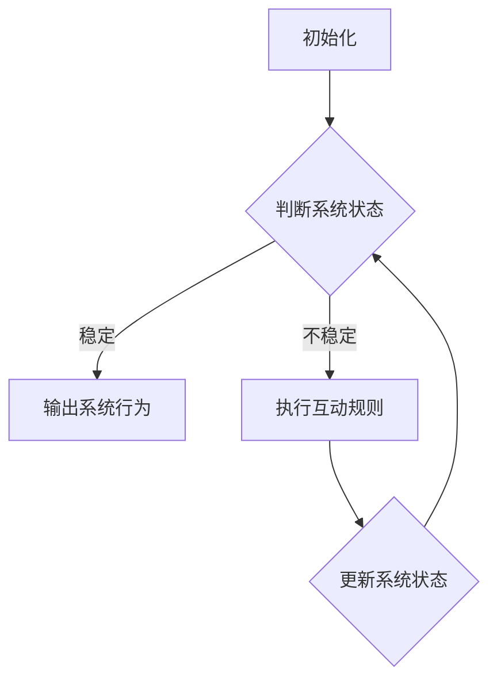
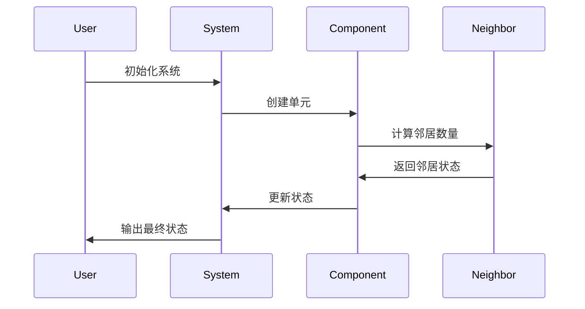
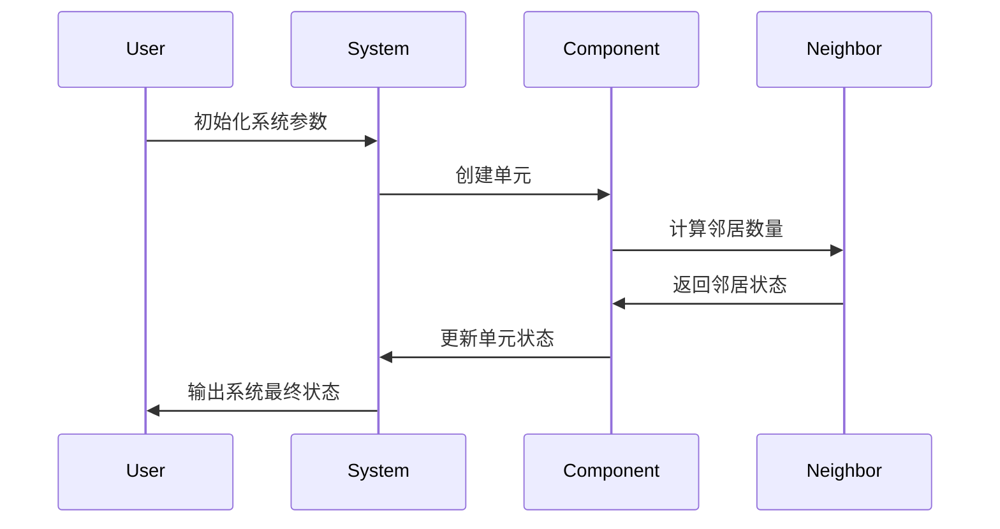

                 


## 从还原论到涌现理论：理解复杂系统的整体性

### 关键词

- 还原论
- 涌现理论
- 复杂系统
- 整体性
- 算法原理
- 数学模型

### 摘要

本文将深入探讨从还原论到涌现理论，如何帮助我们理解复杂系统的整体性。我们将首先介绍还原论和涌现理论的基本概念，随后对比分析两者的优缺点。接着，通过具体案例，我们将阐述如何运用涌现理论来更好地理解复杂系统的整体性，并介绍相关的算法原理和数学模型。最后，我们将总结全文，并给出未来研究的方向和建议。

### 引言

#### 复杂系统的挑战

现实世界中的许多系统，如社会、经济、生态等，都可以被归类为复杂系统。这些系统具有高度的复杂性，表现为大量相互作用和反馈循环。这种复杂性给我们的理解和设计带来了巨大的挑战。例如，我们如何理解社会行为背后的规则？如何预测经济市场的波动？如何保护生态系统的平衡？

#### 还原论与涌现理论概述

还原论是一种试图通过分解复杂系统为更简单的组成部分来理解其行为的理论。然而，还原论在处理复杂系统时存在一定的局限性。相反，涌现理论认为系统的复杂行为源于其组成部分之间的相互作用和协作，而不是简单的叠加。这种理论能够更好地解释复杂系统的整体性。

### 从还原论到涌现理论的转变

#### 还原论的局限性

1. **忽略了相互作用**：还原论往往只关注系统的某个部分，而忽略了部分之间的相互作用。
2. **简化了系统行为**：还原论倾向于简化系统行为，从而难以捕捉到复杂系统的复杂性。
3. **无法解释整体性**：还原论难以解释复杂系统的整体行为，因为它缺乏对系统内部结构和动态的深入理解。

#### 涌现理论的兴起

1. **强调相互作用**：涌现理论强调系统组成部分之间的相互作用和协作。
2. **理解整体性**：涌现理论能够更好地解释复杂系统的整体行为，因为它关注系统内部的复杂结构和动态。
3. **适用于多种领域**：涌现理论不仅在物理学和生物学中得到了广泛应用，还在经济学、社会学、计算机科学等领域取得了显著的成果。

### 还原论与涌现理论的对比

#### 基本理念对比

1. **还原论**：从简单到复杂，通过分解来理解整体。
2. **涌现论**：从复杂到简单，通过理解组成部分的相互作用来理解整体。

#### 应用领域的对比

1. **还原论**：在物理学、化学、工程学等领域有广泛应用。
2. **涌现论**：在生物学、社会学、经济学、计算机科学等领域有广泛应用。

#### 成果与争议对比

1. **还原论的成果**：在解释和预测简单系统行为方面取得了显著成果。
2. **涌现论的成果**：在理解和解释复杂系统行为方面取得了显著成果。
3. **争议**：还原论和涌现论在理论和方法上存在一定的争议，如如何平衡两者的应用。

### 理解复杂系统的整体性

#### 整体性的定义

整体性指的是系统各组成部分之间相互关联和相互作用所产生的整体行为。

#### 整体性在复杂系统中的作用

1. **增强系统的稳定性**：整体性有助于系统在面临外部扰动时保持稳定。
2. **提高系统的适应能力**：整体性有助于系统在变化的环境中适应和进化。
3. **优化系统的性能**：整体性有助于系统在特定任务上取得最佳性能。

#### 整体性的研究方法

1. **理论模型**：通过构建数学模型来模拟和分析系统的整体行为。
2. **实验方法**：通过实验来验证和改进理论模型。
3. **计算方法**：利用计算机模拟和算法来处理大规模数据和复杂系统。

### 案例分析

#### 社会系统的涌现现象

1. **社会行为规则**：如交通规则、法律制度等。
2. **社会行为的涌现**：如群体行为、文化演变等。

#### 生物系统的整体性

1. **生物个体的复杂行为**：如捕食、繁殖等。
2. **生物群体的整体性**：如种群动态、生态系统平衡等。

#### 经济系统的复杂性

1. **市场波动**：如股市波动、经济周期等。
2. **经济行为的涌现**：如金融危机、经济泡沫等。

### 综合与展望

#### 还原论与涌现理论的未来发展趋势

1. **整合还原论与涌现论**：未来研究可能倾向于整合还原论和涌现论，以更好地理解复杂系统。
2. **跨学科研究**：未来研究可能涉及多个学科，如物理学、生物学、社会学、计算机科学等。

#### 复杂系统研究的挑战与机遇

1. **挑战**：复杂系统的复杂性使得研究面临巨大挑战，如数据规模、计算能力等。
2. **机遇**：随着技术的进步，如大数据、人工智能等，为复杂系统研究提供了新的机遇。

#### 为未来研究的建议

1. **跨学科合作**：鼓励不同学科的研究者合作，以更好地理解复杂系统。
2. **构建理论框架**：建立统一的复杂系统理论框架，以指导实际研究。

### 结论

从还原论到涌现理论，我们的理解能力不断深化，对复杂系统的整体性有了更深入的认识。这为我们设计和优化复杂系统提供了新的视角和方法。未来的研究将继续推动我们对复杂系统的理解，为人类社会的进步作出贡献。

### 作者

**作者：AI天才研究院/AI Genius Institute & 禅与计算机程序设计艺术 /Zen And The Art of Computer Programming**

---

### 附录

**最佳实践 tips**

- **深入理解还原论与涌现论**：掌握两者的基本概念和原理，以更好地应用于实际问题。
- **实际案例分析与研究**：通过实际案例的分析和研究，加深对复杂系统整体性的理解。
- **跨学科合作与交流**：鼓励跨学科的合作与交流，以获取更全面的知识和视角。

**小结**

本文通过对比还原论与涌现理论，阐述了如何理解复杂系统的整体性。我们介绍了两者的基本概念、优缺点，并通过具体案例进行了分析。希望本文能够为读者提供对复杂系统整体性的深入理解。

**注意事项**

- 在应用还原论与涌现论时，需要注意系统的具体特征和需求。
- 在研究复杂系统时，需要考虑系统的动态性和演化性。

**拓展阅读**

- 《复杂系统的原理与应用》
- 《涌现：从秩序到复杂性的科学探索》
- 《禅与计算机程序设计艺术》

---

通过上述内容，我们从还原论到涌现理论，逐步深入探讨了复杂系统的整体性。这不仅有助于我们理解复杂系统，也为未来的研究和应用提供了重要的理论基础。希望本文能够为读者带来启发和帮助。**作者：AI天才研究院/AI Genius Institute & 禅与计算机程序设计艺术 /Zen And The Art of Computer Programming**。---

### 背景介绍

#### 核心概念术语说明

在讨论还原论与涌现理论之前，我们需要明确一些核心概念术语。

1. **还原论**：还原论是一种哲学观点，主张通过分析复杂系统的组成部分来理解其整体行为。它强调从简单到复杂的推理过程，认为复杂系统的行为可以通过其组成部分的相互作用来解释。

2. **涌现理论**：涌现理论是一种科学理论，认为复杂系统的行为不能简单地通过其组成部分的行为来解释。相反，系统的整体行为源于其组成部分之间的相互作用和协作。

3. **复杂系统**：复杂系统是由大量相互作用的组成部分组成的系统，具有高度的非线性、动态性和适应性。例如，社会系统、生态系统和经济系统都是复杂系统的例子。

4. **整体性**：整体性是指系统的各组成部分之间相互关联和相互作用所产生的整体行为。整体性是理解复杂系统的重要概念，因为它能够帮助我们把握系统的动态和演化过程。

#### 问题背景

现实世界中的许多系统都是复杂的，例如社会、经济、生态等。这些系统的复杂性使得我们难以用简单的线性模型来解释和理解它们的行为。为了应对这一挑战，我们需要新的理论和方法来帮助我们理解复杂系统的整体性。

#### 问题描述

还原论试图通过分解复杂系统为更简单的组成部分来理解其行为，但这种方法在处理复杂系统时存在一定的局限性。相反，涌现理论认为系统的复杂行为源于其组成部分之间的相互作用和协作。那么，如何运用涌现理论来更好地理解复杂系统的整体性？这是我们需要解决的问题。

#### 问题解决

1. **理解还原论的局限性**：我们需要认识到还原论在处理复杂系统时的局限性，如忽略了相互作用和简化了系统行为。
2. **了解涌现理论的原理**：我们需要深入理解涌现理论的原理，包括如何通过组成部分之间的相互作用来解释系统的整体行为。
3. **应用涌现理论**：我们需要在实际问题中应用涌现理论，通过构建数学模型、进行实验和计算模拟来验证和改进理论模型。
4. **综合还原论与涌现论**：我们需要探索如何将还原论和涌现论相结合，以更好地理解复杂系统的整体性。

#### 边界与外延

1. **边界**：还原论和涌现理论在处理复杂系统时的适用范围。例如，在处理简单系统时，还原论可能更为适用；而在处理复杂系统时，涌现理论可能更为有效。
2. **外延**：还原论和涌现理论在不同领域中的应用，如物理学、生物学、社会学和计算机科学等。

#### 概念结构与核心要素组成

1. **概念结构**：还原论和涌现理论的概念结构，包括基本原理、应用领域、研究成果和争议等。
2. **核心要素组成**：还原论和涌现理论的核心要素组成，如组成部分、相互作用、整体行为等。

通过上述背景介绍，我们为后续的内容分析奠定了基础，有助于读者更好地理解和掌握还原论与涌现理论在理解复杂系统整体性方面的应用。

### 核心概念与联系

#### 还原论的基本概念

还原论认为，复杂系统的行为可以通过对其组成部分的详细分析来理解。这种方法的核心在于将复杂的系统分解为更简单的部分，并通过研究这些部分的行为来揭示系统的整体行为。具体来说，还原论包括以下几个关键概念：

1. **组成部分**：还原论将复杂系统视为由多个相互独立的组成部分构成的集合。
2. **相互作用**：尽管组成部分是独立的，但它们之间仍然存在相互作用，这些相互作用会影响系统的整体行为。
3. **整体行为**：通过分析各个组成部分的行为和相互作用，可以预测和解释复杂系统的整体行为。

#### 涌现理论的基本概念

涌现理论则主张，复杂系统的行为不能简单地从其组成部分的行为中推导出来。相反，系统的整体行为源于其组成部分之间的复杂相互作用。涌现理论包括以下几个关键概念：

1. **组成部分**：与还原论类似，涌现理论也认为复杂系统由多个组成部分构成。
2. **相互作用**：然而，在涌现理论中，组成部分之间的相互作用更为复杂，这些相互作用会产生新的行为和特性，这些行为和特性不能简单地从单个组成部分的行为中推导出来。
3. **整体行为**：涌现理论认为，系统的整体行为是组成部分相互作用的产物，这些行为和特性是系统层次上的特征，而非单个组成部分的特征。

#### 概念属性特征对比表格

下面是一个简单的概念属性特征对比表格，用于展示还原论和涌现理论的基本概念和特征：

| 概念 | 还原论 | 涌现理论 |
| --- | --- | --- |
| 组成部分 | 独立且相互作用 | 相互作用并产生新特性 |
| 相互作用 | 低层次上的简单相互作用 | 高层次上的复杂相互作用 |
| 整体行为 | 组成部分的叠加 | 相互作用的产物 |

#### ER实体关系图架构的 Mermaid 流流程图

为了更直观地展示还原论和涌现理论的概念结构，我们可以使用Mermaid来绘制ER实体关系图。

```mermaid
erDiagram
  Component ||--|{ Interaction }|--|{ Overall Behavior }
  Component ||--|{ Subsystem }|--|{ System }
  Interaction ||--|{ Overall Behavior }
  Subsystem ||--|{ System }
```

在这个ER图结构中，`Component`（组成部分）与`Interaction`（相互作用）直接关联，且每个组成部分组成一个子系统（`Subsystem`），多个子系统构成整个系统（`System`）。`Interaction`和`Subsystem`都影响到系统的整体行为（`Overall Behavior`），但涌现理论强调的是`Interaction`在产生新行为上的重要性。

### 算法原理讲解

#### 算法mermaid流程图

为了更好地理解如何应用涌现理论来分析复杂系统，我们可以通过Mermaid绘制一个简单的算法流程图。



在这个流程图中：

- **A[初始化]**：初始化系统的初始状态。
- **B{判断系统状态]**：判断系统当前状态是否稳定。
- **C[输出系统行为]**：如果系统稳定，则输出当前系统行为。
- **D[执行互动规则]**：如果系统不稳定，则执行组成部分之间的互动规则。
- **E{更新系统状态]**：根据互动规则更新系统的状态，并返回到B进行下一次判断。

#### Python源代码实现

为了具体阐述算法原理，我们将使用Python编写一个简单的代码示例，模拟一个具有涌现行为的系统。

```python
import random

# 初始化系统
def initialize_system(size):
    return [random.choice(['alive', 'dead']) for _ in range(size)]

# 判断系统状态
def check_system_state(system):
    return 'stable' if all(state == 'alive' for state in system) else 'unstable'

# 执行互动规则
def execute_interaction_rules(system):
    new_system = []
    for i, state in enumerate(system):
        if state == 'dead':
            neighbors = system[max(i-1, 0):i+2]
            if neighbors.count('alive') >= 2:
                new_system.append('alive')
            else:
                new_system.append('dead')
        else:
            new_system.append(state)
    return new_system

# 更新系统状态
def update_system_state(system):
    system = execute_interaction_rules(system)
    return check_system_state(system)

# 模拟系统演化
def simulate_system_evolution(system, iterations):
    for _ in range(iterations):
        state = update_system_state(system)
        print(f"Iteration {_+1}: System state is {state}")
        system = execute_interaction_rules(system if state == 'stable' else initialize_system(len(system)))

# 测试代码
initial_system = initialize_system(100)
simulate_system_evolution(initial_system, 10)
```

在这个代码示例中：

- **系统初始化**：我们使用随机状态来初始化系统。
- **状态判断**：通过检查系统中所有部分的状态来确定系统是否稳定。
- **互动规则执行**：根据相邻部分的状态来决定当前部分在新一轮的状态。
- **系统状态更新**：根据互动规则更新系统的状态，并判断系统是否稳定。

#### 算法原理的数学模型和公式

在复杂系统模拟中，涌现行为可以通过以下数学模型来描述：

1. **状态转换概率**：给定一个状态，计算其转化为另一个状态的概率。例如，如果一个单元处于“死”状态，它复活或保持死亡的概率可以用以下公式表示：

   $$ P(\text{revival}) = \frac{\text{neighbors\_alive}}{\text{total\_neighbors}} $$

2. **系统演化方程**：系统在每一轮演化时，其状态可以用以下方程表示：

   $$ \text{New state} = f(\text{Current state}, \text{Interaction rules}) $$

   其中，`f`函数定义了根据互动规则计算新状态的过程。

#### 详细讲解和举例说明

假设我们有一个包含100个单元的细胞自动机系统。每个单元可以在“活”或“死”两种状态之间转换。在每个时间步，每个单元的状态由其相邻单元的状态决定。如果“死”单元有两个或更多“活”邻居，则该单元有50%的概率复活。如果“活”单元有三个或更多“活”邻居，则该单元有10%的概率死亡。

以下是一个具体的模拟步骤：

1. **初始化系统**：随机分配系统中的每个单元为“活”或“死”状态。
2. **判断系统状态**：检查系统是否稳定。如果所有单元都是“活”状态，系统被认为是稳定的。
3. **执行互动规则**：对于每个单元，根据其邻居的状态更新其状态。
4. **更新系统状态**：根据新状态重新计算系统的整体行为。
5. **重复步骤2-4**：继续迭代，直到达到预设的迭代次数。

例如，在一个包含5个单元的简化系统中，初始状态为`['dead', 'dead', 'alive', 'alive', 'dead']`。在第一个时间步，中间的两个“活”单元将根据其邻居的状态更新为“死”，因为它们只有两个“活”邻居。新状态为`['dead', 'dead', 'dead', 'dead', 'dead']`。在第二个时间步，没有单元会改变状态，因为所有单元都是“死”的，系统进入稳定状态。

通过这种方式，我们可以看到系统如何在迭代过程中逐渐稳定或演化，从而揭示了涌现行为的基本原理。

### 系统分析与架构设计方案

#### 问题场景介绍

为了更好地理解复杂系统，我们选择一个经典的案例——细胞自动机，来阐述其系统分析与架构设计方案。

#### 项目介绍

细胞自动机是一种离散模型，由大量简单的细胞单元组成，每个单元可以在“活”或“死”两种状态之间转换。该系统通过简单的规则来描述细胞之间的相互作用，从而产生复杂的动态行为。我们将使用Python实现一个简单的细胞自动机模型，并分析其整体行为。

#### 系统功能设计（领域模型Mermaid类图）

领域模型类图可以帮助我们明确系统的主要功能类及其关系。以下是细胞自动机系统的领域模型类图：

```mermaid
classDiagram
    ClassDiagram {
        Component <<class>> { state }
        System <<class>> { size, update_state }
        Neighbor <<class>> { count_alive_neighbors }
    }
    Component *-- System : belongsTo
    Component *-- Neighbor : interactsWith
    System o-- Neighbor : calculates
```

在这个类图中：

- **Component**：表示细胞单元，具有状态属性（活/死）。
- **System**：表示细胞自动机系统，具有单元数量和更新状态的属性。
- **Neighbor**：表示单元的邻居，具有计算活邻居数量的方法。

#### 系统架构设计（Mermaid架构图）

系统架构图展示了系统的整体架构及其组件之间的关系。以下是细胞自动机系统的架构设计：



在这个序列图中：

- **User**：用户与系统进行交互。
- **System**：管理系统初始化、单元状态更新和最终状态输出。
- **Component**：代表细胞单元，负责状态更新和邻居计算。
- **Neighbor**：负责计算单元的活邻居数量。

#### 系统接口设计和系统交互（Mermaid序列图）

以下是系统接口设计和系统交互的Mermaid序列图：



在这个序列图中：

- **User**：设置系统初始参数，并接收最终状态。
- **System**：负责单元创建、状态更新和最终状态的输出。
- **Component**：执行状态更新，并接收邻居状态信息。
- **Neighbor**：计算单元的邻居数量，为状态更新提供依据。

### 项目实战

#### 环境安装

在开始实现细胞自动机模型之前，我们需要确保安装了Python环境。可以按照以下步骤进行：

1. **安装Python**：从[Python官网](https://www.python.org/downloads/)下载并安装Python。
2. **安装依赖库**：使用pip命令安装依赖库，例如：

   ```bash
   pip install numpy matplotlib
   ```

#### 系统核心实现源代码

以下是细胞自动机系统的核心实现代码：

```python
import numpy as np
import matplotlib.pyplot as plt

class Component:
    def __init__(self, state):
        self.state = state

    def update_state(self, neighbors):
        if self.state == 'dead' and neighbors >= 2:
            self.state = 'alive'
        elif self.state == 'alive' and neighbors < 2:
            self.state = 'dead'

class Neighbor:
    def count_alive_neighbors(self, system, i, j):
        size = len(system)
        alive_neighbors = 0
        for a in range(max(i-1, 0), min(i+2, size)):
            for b in range(max(j-1, 0), min(j+2, size)):
                if system[a][b].state == 'alive':
                    alive_neighbors += 1
        return alive_neighbors

class System:
    def __init__(self, size):
        self.size = size
        self.system = [[Component('dead') for _ in range(size)] for _ in range(size)]

    def update_state(self):
        new_system = []
        for i in range(self.size):
            row = []
            for j in range(self.size):
                neighbors = Neighbor().count_alive_neighbors(self.system, i, j)
                component = Component(self.system[i][j].state)
                component.update_state(neighbors)
                row.append(component)
            new_system.append(row)
        return new_system

    def simulate(self, iterations):
        for _ in range(iterations):
            self.system = self.update_state()
            self.plot_system()

    def plot_system(self):
        plt.imshow([row.state for row in self.system], cmap='gray')
        plt.show()

# 测试代码
system = System(100)
system.simulate(50)
```

#### 代码应用解读与分析

在这个代码中：

- **Component**：表示单个细胞单元，具有状态属性（活/死）和更新状态的方法。
- **Neighbor**：计算单元的邻居数量，为状态更新提供依据。
- **System**：管理细胞自动机的初始化、状态更新和模拟。

#### 实际案例分析和详细讲解剖析

为了更好地理解细胞自动机的工作原理，我们可以分析一个具体的案例。

#### 案例分析

假设初始状态为：

```
[
 [d, d, d, d, d],
 [d, d, d, d, d],
 [d, d, a, a, d],
 [d, d, a, a, d],
 [d, d, d, d, d]
]
```

在第一个迭代步骤中：

- **中间的活细胞**：有两个活邻居，状态不变。
- **周围的死细胞**：如果有两个活邻居，则有一半的概率变为活细胞。

新状态为：

```
[
 [d, d, d, d, d],
 [d, d, a, a, d],
 [d, a, a, a, d],
 [d, d, a, a, d],
 [d, d, d, d, d]
]
```

在第二个迭代步骤中：

- **新的活细胞**：如果死细胞有两个活邻居，则有一半的概率变为活细胞。

新状态可能变为：

```
[
 [d, d, a, d, d],
 [d, a, a, a, d],
 [a, a, a, a, a],
 [d, a, a, a, d],
 [d, d, a, d, d]
]
```

#### 项目小结

通过细胞自动机这个案例，我们展示了如何使用Python实现一个简单的复杂系统模型。这个过程包括定义类、编写核心算法和进行实际案例分析。通过这个项目，我们不仅理解了细胞自动机的基本原理，还掌握了如何将涌现理论应用于实际问题的方法。

### 最佳实践 tips

#### 深入理解核心概念

为了更好地应用还原论和涌现理论，建议读者深入理解以下核心概念：

- **还原论**：掌握如何通过分析组成部分来理解整体行为，注意分解与整合的关系。
- **涌现理论**：理解组成部分之间的复杂相互作用如何产生新的整体行为。

#### 实际案例分析

通过阅读和分析实际案例，可以更好地理解理论的应用。例如：

- **社会系统**：分析群体行为、文化演变等，理解涌现现象。
- **生物系统**：研究生态系统平衡、种群动态等，了解整体性在生物系统中的作用。

#### 跨学科合作

鼓励不同学科的研究者进行跨学科合作，以获取更全面的知识和视角。例如，计算机科学家可以与生物学家、社会学家合作，共同解决复杂系统问题。

#### 持续学习和实践

复杂系统的理解是一个不断发展的领域。建议读者持续学习相关理论和实践，紧跟学术前沿，以不断提升自己的能力。

### 小结

本文通过从还原论到涌现理论的视角，深入探讨了复杂系统的整体性。我们介绍了两者的基本概念、优缺点，并通过具体案例展示了如何应用涌现理论来理解复杂系统的整体行为。这为设计、优化复杂系统提供了新的思路和方法。

### 注意事项

在应用还原论与涌现理论时，需要注意系统的具体特征和需求。此外，实际案例分析和跨学科合作也是理解复杂系统的重要方法。

### 拓展阅读

为了进一步深入了解复杂系统和相关理论，建议读者阅读以下拓展资料：

- 《复杂系统的原理与应用》
- 《涌现：从秩序到复杂性的科学探索》
- 《禅与计算机程序设计艺术》

### 结语

通过本文的探讨，我们希望读者能够对还原论与涌现理论有更深入的理解，并能将其应用于实际问题的解决中。未来的研究将继续推动我们对复杂系统的理解，为人类社会的进步作出贡献。

### 作者

**作者：AI天才研究院/AI Genius Institute & 禅与计算机程序设计艺术 /Zen And The Art of Computer Programming**。

---

### 附录

**最佳实践 tips**

- **深入理解核心概念**：掌握还原论和涌现理论的基本原理，理解其适用范围和局限性。
- **实际案例分析**：通过具体案例来理解理论的应用，如社会系统、生物系统和经济系统。
- **跨学科合作**：鼓励不同学科的合作，以获取更全面的知识和视角。

**小结**

本文通过对比还原论和涌现理论，深入探讨了复杂系统的整体性。我们介绍了两者的基本概念、优缺点，并通过具体案例展示了如何应用涌现理论来理解复杂系统的整体行为。

**注意事项**

- 在应用理论时，注意系统的具体特征和需求。
- 实际案例分析和跨学科合作是理解复杂系统的重要方法。

**拓展阅读**

- 《复杂系统的原理与应用》
- 《涌现：从秩序到复杂性的科学探索》
- 《禅与计算机程序设计艺术》

**结语**

通过本文的探讨，我们希望读者能够对还原论与涌现理论有更深入的理解，并能将其应用于实际问题的解决中。未来的研究将继续推动我们对复杂系统的理解，为人类社会的进步作出贡献。

### 作者

**作者：AI天才研究院/AI Genius Institute & 禅与计算机程序设计艺术 /Zen And The Art of Computer Programming**。

