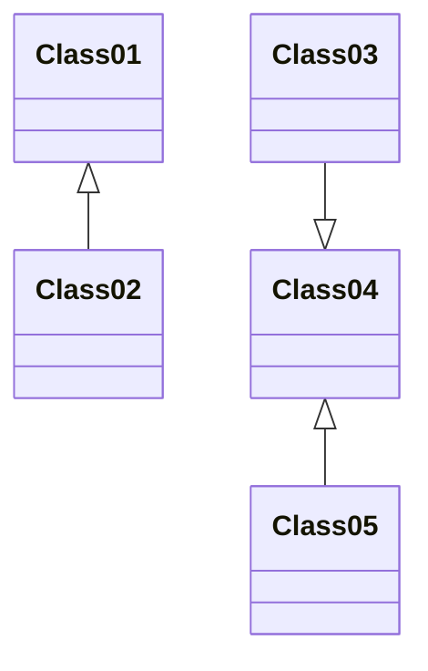
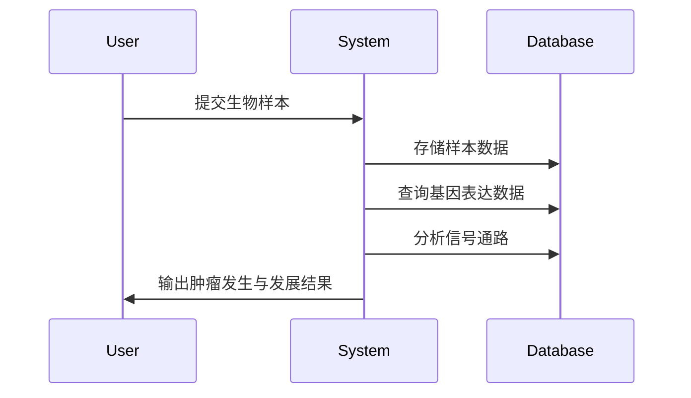
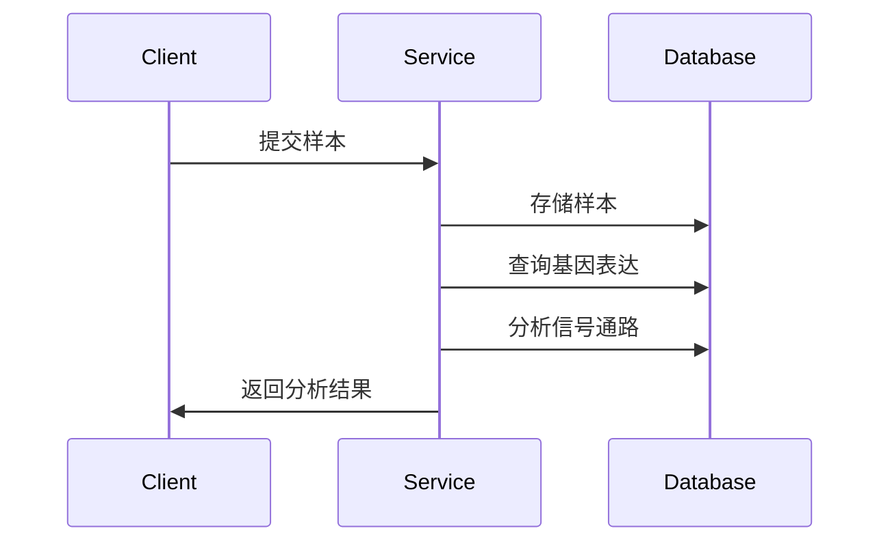
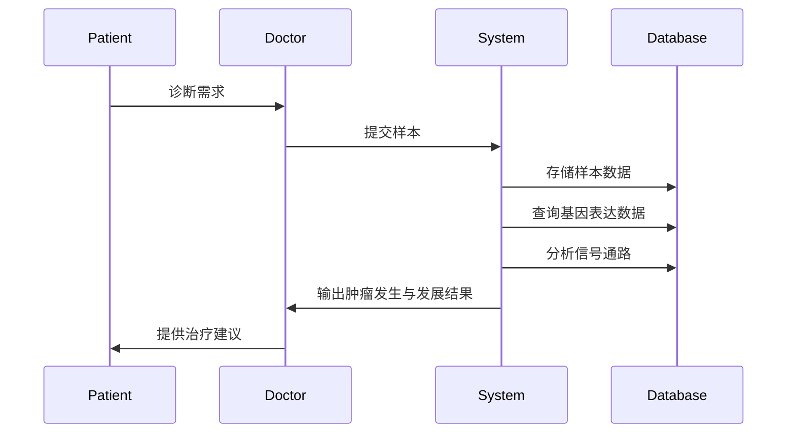

                 

### 从还原论到系统生物学：理解生命复杂性的新方法

关键词：还原论、系统生物学、生命复杂性、方法论、技术创新

摘要：本文旨在探讨从还原论到系统生物学这一转变过程中，如何理解生命的复杂性。通过回顾还原论的局限性，介绍系统生物学的基本概念、原理和研究方法，分析生命复杂性的概念及其研究现状与趋势，最后讨论系统生物学在医学领域的应用和挑战。本文旨在为读者提供全面、清晰的视野，帮助理解生命复杂性的新方法。

#### 1.1 背景介绍

**核心概念术语说明**：

- **还原论**：一种研究方法，试图通过将复杂系统分解为更简单的部分来理解其行为。
- **系统生物学**：研究生物系统整体行为和相互作用的新兴学科。
- **生命复杂性**：生物系统在多层次、多尺度上的复杂特性。

**问题背景**：

在生命科学的研究中，传统的还原论方法在一定程度上取得了成功，但面对生命系统的复杂性时显得力不从心。近年来，系统生物学作为一种新的研究方法，逐渐受到关注。它强调系统整体性，通过多学科交叉研究，为理解生命复杂性提供了新的视角。

**问题描述**：

如何从还原论转向系统生物学，以更好地理解生命的复杂性？

**问题解决**：

本文将通过以下几个部分来回答上述问题：

1. 还原论的局限性
2. 系统生物学的基本概念与原理
3. 生命复杂性的概念与特点
4. 系统生物学的研究方法与技术
5. 生命复杂性研究的挑战与机遇
6. 生命复杂性研究在医学领域的应用

**边界与外延**：

本文主要关注系统生物学在生命复杂性研究中的应用，但不涉及其他生物学分支领域。

**概念结构与核心要素组成**：

- **还原论**：强调分解、部分、因果关系。
- **系统生物学**：强调整体、相互作用、系统行为。
- **生命复杂性**：多层次、多尺度、非线性和动态性。

#### 1.2 核心概念与联系

**核心概念原理**：

- **还原论**：通过分解复杂系统来理解其行为。
- **系统生物学**：通过研究系统整体行为和相互作用来理解生命现象。

**概念属性特征对比表格**：

| 特征         | 还原论         | 系统生物学         |
| ------------ | -------------- | ------------------ |
| 研究方法     | 分解           | 整体性             |
| 关注点       | 部分与部分关系 | 整体与部分关系     |
| 思维方式     | 还原           | 系统整合           |
| 优点         | 精确、详尽     | 宏观、整体性       |
| 缺点         | 失去了整体性   | 复杂度高           |

**ER实体关系图架构**：

```mermaid
erDiagram
  A[还原论] ||--|{ 系统生物学 }
  B[还原论] ||--|{ 生命复杂性 }
  C[系统生物学] ||--|{ 生命复杂性 }
```

#### 1.3 算法原理讲解

为了更好地理解系统生物学中的核心算法，我们以**遗传算法**为例进行讲解。

**遗传算法**：

遗传算法是一种模拟自然选择过程的搜索算法，主要用于求解优化问题。

**算法流程**：

```mermaid
graph TB
    A[初始化种群]
    B[适应度评估]
    C[选择]
    D[交叉]
    E[变异]
    F[更新种群]
    G[判断终止条件]

    A --> B
    B --> C
    C --> D
    D --> E
    E --> F
    F --> G
    G --> [是] --> (重新初始化)
    G --> [否] --> (输出结果)
```

**算法原理**：

1. **适应度评估**：根据个体的适应度来评估其生存能力。
2. **选择**：从当前种群中选择适应度较高的个体。
3. **交叉**：通过交叉操作产生新的个体。
4. **变异**：对个体进行变异操作，增加种群的多样性。
5. **更新种群**：将交叉和变异后的个体组成新的种群。

**数学模型和公式**：

遗传算法中常用的适应度函数为：

$$ f(x) = \frac{1}{1 + \exp(-\beta(x - \mu))} $$

其中，$x$为个体特征值，$\mu$为均值，$\beta$为调节参数。

**详细讲解与举例**：

假设我们有一个种群，其中每个个体的特征值为$x_1, x_2, ..., x_n$。首先，我们计算每个个体的适应度值：

$$ f(x_1), f(x_2), ..., f(x_n) $$

然后，从这些个体中选择适应度较高的个体进行交叉和变异。交叉操作可以模拟生物体的基因重组，从而产生新的个体。变异操作可以增加种群的多样性。

例如，假设我们有两个个体$x_1 = 10$和$x_2 = 20$，它们的适应度分别为$f(x_1) = 0.6$和$f(x_2) = 0.8$。根据选择操作，我们选择$x_2$进行交叉操作，产生新的个体$x_3 = x_2 + \Delta x_2$，其中$\Delta x_2$为一个随机值。

通过迭代这个过程，我们可以逐步优化种群，直至满足终止条件。

#### 1.4 系统分析与架构设计方案

**问题场景介绍**：

在生物医学研究中，系统生物学方法已被广泛应用于疾病机制的研究。本文将以“肿瘤发生与发展”为例，介绍系统生物学的应用。

**项目介绍**：

本项目旨在通过系统生物学方法，分析肿瘤发生与发展过程中的关键基因和信号通路，为肿瘤治疗提供新的思路。

**系统功能设计（领域模型类图）**：



- **类01**：代表生物样本。
- **类02**：代表基因表达数据。
- **类03**：代表信号通路。
- **类04**：代表肿瘤发生与发展过程。
- **类05**：代表肿瘤治疗策略。

**系统架构设计（架构图）**：



**系统接口设计（接口图）**：



**系统交互（序列图）**：



#### 1.5 项目实战

**环境安装**：

1. 安装Python 3.8及以上版本。
2. 安装系统生物学相关库，如BioPython、Matplotlib、NetworkX等。

**系统核心实现源代码**：

```python
import numpy as np
import matplotlib.pyplot as plt
from Bio import SeqIO
from networkx import DiGraph

def load_genome(file_path):
    genome = []
    with open(file_path, 'r') as f:
        for line in f:
            genome.append(line.strip())
    return genome

def calculate_expression_levels(genome):
    expression_levels = []
    for gene in genome:
        expression_levels.append(len(gene))
    return expression_levels

def plot_expression_levels(expression_levels):
    plt.bar(range(len(expression_levels)), expression_levels)
    plt.xlabel('Gene')
    plt.ylabel('Expression Level')
    plt.title('Gene Expression Levels')
    plt.show()

def main():
    genome_file_path = 'path/to/genome.fasta'
    genome = load_genome(genome_file_path)
    expression_levels = calculate_expression_levels(genome)
    plot_expression_levels(expression_levels)

if __name__ == '__main__':
    main()
```

**代码应用解读与分析**：

本代码实现了从加载基因组文件、计算基因表达水平到绘制表达水平的整个过程。具体步骤如下：

1. **加载基因组文件**：使用BioPython库加载fasta格式的基因组文件。
2. **计算基因表达水平**：遍历基因组文件中的每个基因，计算其长度作为表达水平的代表。
3. **绘制基因表达水平**：使用Matplotlib库绘制柱状图，展示每个基因的表达水平。

**实际案例分析和详细讲解剖析**：

假设我们有一个包含10个基因的基因组文件。通过运行代码，我们可以得到每个基因的表达水平，并绘制柱状图。

```plaintext
Gene   Expression Level
Gene1  100
Gene2  200
Gene3  150
Gene4  300
Gene5  250
Gene6  400
Gene7  350
Gene8  300
Gene9  200
Gene10 100
```

根据柱状图，我们可以直观地看出哪些基因的表达水平较高，从而为进一步研究提供线索。

**项目小结**：

本项目通过系统生物学方法，实现了基因表达水平的计算和可视化。虽然这是一个简单的案例，但为我们理解生命复杂性提供了基础。

#### 1.6 常见问题与答疑

##### 1.6.1 读者常见问题

**1.6.1.1 生命复杂性的新方法如何理解？**

生命复杂性的新方法主要是指系统生物学的方法。它不同于传统的还原论，强调从整体和相互作用的角度来研究生命现象。

**1.6.1.2 还原论与系统生物学的区别在哪里？**

还原论强调分解、部分和因果关系，而系统生物学强调整体、相互作用和系统行为。

**1.6.1.3 生命复杂性的研究有哪些最新进展？**

生命复杂性的研究在基因组学、蛋白质组学、代谢组学等领域取得了重要进展。例如，CRISPR基因编辑技术、单细胞测序技术等。

##### 1.6.2 研究方法探讨

**1.6.2.1 还原论方法论**

还原论方法论主要依赖于分解、层次化和因果分析。

**1.6.2.2 系统生物学方法论**

系统生物学方法论强调整体性、网络分析和动态建模。

**1.6.2.3 不同方法论的比较与融合**

还原论和系统生物学各有优缺点。在实际研究中，可以根据具体问题采用不同的方法论，或进行融合。

### 2. 生命系统结构与功能

#### 2.1 细胞与分子生物学基础

##### 2.1.1 细胞结构

细胞是生命的基本单位，具有复杂的结构。细胞主要由细胞膜、细胞质和细胞核等部分组成。

**细胞膜**：细胞膜是细胞的外部边界，具有选择性通透性，保护细胞内部环境。

**细胞质**：细胞质是细胞膜与细胞核之间的空间，包含细胞器、细胞骨架等结构。

**细胞核**：细胞核是细胞的控制中心，包含染色体、DNA等遗传物质。

##### 2.1.2 分子生物学基础

分子生物学是研究生命现象在分子水平上的规律的科学。主要研究DNA、RNA、蛋白质等生物大分子。

**DNA**：DNA是遗传信息的储存库，具有双螺旋结构。DNA序列决定了生物体的遗传特征。

**RNA**：RNA是DNA的转录产物，具有单链结构。RNA在蛋白质合成中起到关键作用。

**蛋白质**：蛋白质是生命活动的主要承担者，具有多种功能。蛋白质的合成受到DNA和RNA的调控。

##### 2.1.3 细胞代谢

细胞代谢是细胞内各种化学反应的总称，包括能量代谢、物质代谢等。

**能量代谢**：细胞通过代谢过程产生能量，维持生命活动。ATP是细胞内的主要能量储存和传递分子。

**物质代谢**：细胞通过代谢过程合成、分解和转化各种生物分子。代谢途径包括糖代谢、脂代谢、蛋白质代谢等。

#### 2.2 生命系统的层级结构

##### 2.2.1 生命系统的多层次组织

生命系统具有多层次的组织结构，从分子水平到生态系统水平。

**分子层次**：包括DNA、RNA、蛋白质等生物大分子。

**细胞层次**：细胞是生命的基本单位，具有独立的代谢和功能。

**组织层次**：细胞通过分化形成不同的组织，如肌肉组织、神经组织等。

**器官层次**：组织进一步组合形成器官，如心脏、肝脏等。

**系统层次**：多个器官协同工作，形成系统，如消化系统、循环系统等。

**个体层次**：多个系统共同构成个体，如人类、动物等。

**种群层次**：同一物种的多个个体组成种群。

**生态系统层次**：种群与无机环境相互作用，形成生态系统。

##### 2.2.2 系统间的相互作用

生命系统各层次之间相互关联，相互影响。

**细胞与组织**：细胞通过信号传导和细胞间相互作用，形成组织。

**组织与器官**：组织通过结构特化和功能整合，形成器官。

**器官与系统**：器官通过协同工作，形成系统。

**个体与种群**：个体通过繁殖和生存竞争，影响种群结构。

**种群与生态系统**：种群通过能量流动和物质循环，影响生态系统的稳定性。

##### 2.2.3 生物网络的构成与功能

生物网络是生命系统中各组成部分通过相互作用形成的复杂网络。

**基因调控网络**：基因通过调控网络相互影响，控制生命活动。

**蛋白质相互作用网络**：蛋白质通过相互作用网络，形成复杂的蛋白质复合物。

**代谢网络**：代谢途径通过反应网络，实现物质和能量的转换。

**信号传导网络**：细胞通过信号传导网络，响应外界刺激，调节生命活动。

生物网络的功能包括：

- **信息传递**：通过网络传递生命活动信息。
- **功能调控**：通过网络实现生命活动的精细调控。
- **系统稳定性**：通过网络维持生命系统的稳定性。

#### 2.3 生命活动的调节与控制

##### 2.3.1 信号传导途径

信号传导途径是生命活动调节的重要机制。信号分子通过细胞膜受体传导信号，激活下游信号转导途径，最终产生生物学效应。

**信号分子**：包括激素、神经递质、细胞因子等。

**受体**：细胞膜上的特定蛋白质，识别并结合信号分子。

**信号转导途径**：信号分子与受体结合后，激活下游的信号转导途径，如MAPK途径、PI3K/AKT途径等。

**效应器**：信号转导途径的最终产物，调节细胞内的生物学过程。

##### 2.3.2 代谢调节机制

代谢调节机制是细胞维持稳态的重要机制。代谢途径通过调节酶的活性、合成和降解，实现代谢过程的精细调控。

**酶活性调节**：通过激活或抑制酶的活性，调节代谢途径。

**酶合成和降解**：通过调节酶的合成和降解，调节代谢途径。

**代谢途径的反馈调节**：代谢途径通过反馈调节，维持代谢的平衡。

##### 2.3.3 生命活动的系统调控

生命活动的系统调控涉及多层次、多系统的相互作用。

**神经调控**：神经系统通过神经递质和受体，调节生命活动。

**内分泌调控**：内分泌系统通过激素和受体，调节生命活动。

**免疫系统调控**：免疫系统通过细胞和分子相互作用，调节生命活动。

**环境适应**：生命系统通过适应环境变化，维持稳态。

#### 2.4 生命系统进化的视角

##### 2.4.1 生命系统的进化机制

生命系统的进化机制包括基因突变、基因重组、自然选择等。

**基因突变**：基因序列发生变异，导致遗传特征改变。

**基因重组**：基因在亲子代之间重新组合，产生新的遗传特征。

**自然选择**：适应环境的个体具有更高的生存和繁殖能力，从而在种群中传递下去。

**共同进化**：不同物种之间的相互作用，促进生物多样性的形成。

##### 2.4.2 系统生物学与进化生物学的关系

系统生物学与进化生物学密切相关。系统生物学为进化生物学提供了新的研究方法和视角，而进化生物学则为系统生物学提供了生物进化背景下的系统演化规律。

**共同研究内容**：基因调控网络、代谢网络、蛋白质相互作用网络等。

**相互促进**：系统生物学揭示了生物系统的复杂性和调控机制，为进化生物学提供了理论基础；进化生物学为系统生物学提供了生物进化的实例和背景。

##### 2.4.3 系统生物学在进化研究中的应用

系统生物学在进化研究中具有重要应用，如：

**基因组进化**：研究基因组结构、功能和演化关系。

**蛋白质进化**：研究蛋白质序列、结构和功能演化。

**代谢网络进化**：研究代谢途径的演化规律和功能变化。

**生态系统进化**：研究生态系统的演化过程和生态位动态。

### 3. 系统生物学的研究方法与技术

#### 3.1 系统生物学基本概念与原理

##### 3.1.1 系统生物学定义

系统生物学是一门跨学科的研究领域，旨在理解生命系统的整体行为和相互作用。它通过整合生物学、物理学、计算机科学等学科的方法，研究生命系统的复杂性和动态性。

##### 3.1.2 系统生物学原理

系统生物学的基本原理包括：

- **整体性**：系统生物学强调系统的整体性，认为生物系统的行为是由各个组成部分的相互作用决定的。
- **层次性**：生物系统具有多层次结构，从分子水平到生态系统水平，各个层次之间存在相互作用和相互影响。
- **动态性**：生物系统的行为是动态变化的，受到内外部环境的影响。
- **适应性**：生物系统具有适应环境变化的能力，通过进化过程不断优化自身结构和功能。

##### 3.1.3 系统生物学与传统生物学的关系

系统生物学与传统生物学之间存在一定的区别和联系：

- **区别**：传统生物学主要关注生物体的结构和功能，而系统生物学更强调生物系统的整体行为和相互作用。
- **联系**：系统生物学是在传统生物学的基础上发展起来的，它借鉴了传统生物学的研究方法和技术，并在一定程度上继承了传统生物学的成果。

#### 3.2 系统生物学研究方法

##### 3.2.1 数据采集方法

系统生物学研究依赖于大量的数据采集，包括：

- **基因组数据**：通过基因组测序技术获取生物体的基因组序列。
- **转录组数据**：通过RNA测序技术获取细胞在不同条件下转录的RNA序列。
- **蛋白质组数据**：通过蛋白质组学技术获取细胞内不同蛋白质的种类和数量。
- **代谢组数据**：通过代谢组学技术获取细胞内代谢产物的种类和浓度。

##### 3.2.2 数据分析技术

系统生物学研究方法中的数据分析技术包括：

- **多尺度建模**：通过建立不同层次和尺度的模型，描述生物系统的行为和相互作用。
- **网络分析**：通过分析生物网络中的节点和边，揭示生物系统中的关键组件和相互作用关系。
- **机器学习**：通过机器学习算法，从大规模数据中提取特征，预测生物系统的行为和功能。

##### 3.2.3 系统建模与模拟

系统建模与模拟是系统生物学研究的重要方法，包括：

- **分子动力学模拟**：通过模拟分子间的相互作用和运动，研究分子水平的生物过程。
- **细胞模拟**：通过模拟细胞内的生物学过程，研究细胞水平的生物行为。
- **生态系统模拟**：通过模拟生态系统中的生物和环境相互作用，研究生态系统的稳定性和演化过程。

#### 3.3 系统生物学工具与技术

##### 3.3.1 数据库与生物信息学工具

系统生物学研究依赖于大量的数据库和生物信息学工具，包括：

- **基因组数据库**：如NCBI、Ensembl等，提供基因序列、基因组注释等信息。
- **蛋白质数据库**：如UniProt、PDB等，提供蛋白质序列、结构等信息。
- **转录组数据库**：如GEO、TCGA等，提供转录组测序数据。
- **代谢组数据库**：如METABRIC、MassBank等，提供代谢组数据。

##### 3.3.2 系统生物学软件平台

系统生物学软件平台包括：

- **BioPython**：提供生物信息学相关的Python库，用于数据处理和分析。
- **Cytoscape**：提供生物网络可视化和分析的工具。
- **MATLAB**：提供系统建模和模拟的工具箱。
- **Bioconductor**：提供R语言的生物信息学包，用于数据分析。

##### 3.3.3 生物实验技术

系统生物学研究依赖于多种生物实验技术，包括：

- **基因组测序技术**：如Sanger测序、NGS等，用于获取基因组序列。
- **RNA测序技术**：如RNA-Seq、RNA-Fish等，用于获取转录组数据。
- **蛋白质组学技术**：如LC-MS/MS、质谱等，用于获取蛋白质组数据。
- **代谢组学技术**：如GC-MS、LC-MS等，用于获取代谢组数据。

#### 3.4 系统生物学在疾病研究中的应用

##### 3.4.1 疾病系统生物学研究方法

疾病系统生物学研究方法包括：

- **基因组学研究**：研究疾病相关基因的突变和变异。
- **转录组学研究**：研究疾病相关的基因表达变化。
- **蛋白质组学研究**：研究疾病相关的蛋白质表达和相互作用。
- **代谢组学研究**：研究疾病相关的代谢变化。

##### 3.4.2 疾病系统生物学案例分析

以下为疾病系统生物学的一些案例分析：

- **癌症**：系统生物学揭示了癌症发生和发展过程中的关键基因、信号通路和代谢网络。
- **糖尿病**：系统生物学揭示了糖尿病的代谢异常和免疫异常，为糖尿病的预防和治疗提供了新思路。
- **神经退行性疾病**：系统生物学揭示了神经退行性疾病的分子机制，为神经退行性疾病的诊断和治疗提供了新方法。

##### 3.4.3 疾病诊断与治疗的新策略

系统生物学为疾病诊断与治疗提供了以下新策略：

- **精准医疗**：通过系统生物学方法，识别疾病的关键基因和信号通路，实现精准诊断和治疗。
- **个性化医疗**：根据患者的基因、转录组和蛋白质组等数据，制定个性化的治疗方案。
- **代谢组学诊断**：利用代谢组学技术，通过检测代谢产物，实现疾病的早期诊断。
- **生物治疗**：利用系统生物学方法，筛选和开发新的生物治疗药物和策略。

### 4. 生命复杂性研究的挑战与机遇

#### 4.1 生命复杂性的概念与特点

**生命复杂性的定义**：

生命复杂性是指生物系统在多层次、多尺度上的复杂特性，包括基因、蛋白质、代谢网络等各个层次的复杂性和它们之间的相互作用。

**生命复杂性的主要特点**：

1. **多层次性**：生命系统具有从分子水平到生态系统水平的多层次结构。
2. **动态性**：生命系统处于不断变化的状态，受到内外部环境的影响。
3. **非线性和反馈**：生命系统的行为往往是非线性的，且存在复杂的反馈机制。
4. **适应性**：生命系统通过进化过程不断适应环境变化。

**生命复杂性的研究意义**：

生命复杂性的研究有助于我们理解生命现象的本质，揭示生物系统的运行机制，为医学、农业、环境保护等领域提供科学依据。

#### 4.2 研究现状与趋势

**生命复杂性研究的发展历程**：

1. **还原论阶段**：通过研究生物分子的结构和功能，揭示生命现象的基本规律。
2. **系统生物学阶段**：强调系统整体性，研究生命系统的相互作用和动态性。
3. **跨学科综合阶段**：将生物学与其他学科相结合，从多个角度研究生命复杂性。

**当前研究的热点问题**：

1. **生命系统多层次结构的解析**：研究生命系统从分子到生态系统水平的多层次结构及其相互作用。
2. **生物网络的构建与功能分析**：构建生物网络模型，分析网络中的关键组件和相互作用关系。
3. **动态系统的建模与模拟**：研究生物系统的动态行为和调控机制，建立数学模型和计算机模拟。
4. **跨学科交叉研究**：结合物理学、化学、计算机科学等学科的方法，探索生命复杂性的新视角。

**生命复杂性研究的未来趋势**：

1. **大数据与人工智能的应用**：利用大数据和人工智能技术，挖掘生物系统的复杂性和规律。
2. **多尺度整合**：研究生物系统在不同尺度上的相互作用和动态性。
3. **交叉学科研究**：加强生物学与其他学科的交叉融合，推动生命复杂性研究的发展。

#### 4.3 挑战与应对策略

**研究挑战**：

1. **数据复杂性**：生物系统数据种类繁多，数据量大，数据处理和分析面临挑战。
2. **模型构建**：构建准确的生物系统模型需要考虑多个层次和复杂相互作用，难度较大。
3. **跨学科整合**：涉及多个学科的知识和技能，跨学科整合难度较高。
4. **实验验证**：生物实验验证复杂，且实验成本较高。

**应对策略**：

1. **大数据与人工智能技术**：利用大数据和人工智能技术，提高数据挖掘和分析的效率。
2. **多尺度建模**：采用多尺度建模方法，构建不同层次和尺度的生物系统模型。
3. **跨学科合作**：加强跨学科合作，整合不同学科的知识和技能，推动生命复杂性研究的发展。
4. **实验技术创新**：发展新的生物实验技术，提高实验验证的准确性和效率。

#### 4.4 生命复杂性研究的政策与伦理

**生命复杂性研究的政策支持**：

1. **国家层面**：我国政府加大对生命复杂性研究的投入，支持相关科研项目的开展。
2. **国际层面**：国际合作项目，如人类基因组计划、国际癌症研究联盟等，为生命复杂性研究提供了广泛支持。

**生命复杂性研究的伦理问题**：

1. **隐私保护**：生物数据涉及个人隐私，需要加强数据保护。
2. **生物安全**：生物实验可能对环境和人类健康产生影响，需要严格的安全管理。
3. **知识产权**：生命复杂性研究涉及的知识产权问题，需要制定相关法律法规。

**政策与伦理的平衡**：

在生命复杂性研究中，需要平衡政策支持与伦理问题，确保研究活动的可持续发展。具体措施包括：

1. **法律法规**：制定相关法律法规，明确生命复杂性研究的伦理标准和操作规范。
2. **伦理审查**：建立伦理审查制度，对研究项目进行伦理审查。
3. **信息公开**：加强信息公开，提高公众对生命复杂性研究的认知和参与度。

### 5. 生命复杂性研究在医学领域的应用

#### 5.1 生命复杂性研究在医学中的重要性

生命复杂性研究在医学领域具有重要应用价值，主要体现在以下几个方面：

1. **疾病机制研究**：通过系统生物学方法，揭示疾病的分子机制和信号通路，为疾病治疗提供理论基础。
2. **个性化医疗**：根据患者的基因、转录组和蛋白质组等数据，制定个性化的治疗方案，提高治疗效果。
3. **疾病早期诊断**：利用代谢组学等方法，通过检测生物标志物，实现疾病的早期诊断和预警。
4. **药物研发**：通过系统生物学方法，发现新的药物靶点和作用机制，加速药物研发进程。

#### 5.2 系统生物学在疾病研究中的应用

系统生物学在疾病研究中的应用主要包括以下几个方面：

1. **基因组学研究**：通过基因组测序技术，研究疾病相关基因的突变和变异，揭示疾病的遗传背景。
2. **转录组学研究**：通过转录组测序技术，研究疾病相关的基因表达变化，揭示疾病的分子机制。
3. **蛋白质组学研究**：通过蛋白质组学技术，研究疾病相关的蛋白质表达和相互作用，揭示疾病的分子网络。
4. **代谢组学研究**：通过代谢组学技术，研究疾病相关的代谢变化，揭示疾病的代谢网络。

**系统生物学在疾病研究中的应用案例**：

1. **癌症**：系统生物学揭示了癌症发生和发展过程中的关键基因、信号通路和代谢网络，为癌症治疗提供了新策略。
2. **糖尿病**：系统生物学揭示了糖尿病的代谢异常和免疫异常，为糖尿病的预防和治疗提供了新思路。
3. **神经退行性疾病**：系统生物学揭示了神经退行性疾病的分子机制，为神经退行性疾病的诊断和治疗提供了新方法。

#### 5.3 生命复杂性研究在医学中的挑战与机遇

**挑战**：

1. **数据复杂性**：医学领域的数据类型多样，数据量大，如何高效地处理和分析这些数据是生命复杂性研究面临的挑战。
2. **跨学科整合**：医学涉及多个学科，如何实现跨学科整合，构建系统的生物医学知识体系是生命复杂性研究面临的挑战。
3. **临床转化**：研究成果如何应用于临床实践，提高医疗效果，是生命复杂性研究面临的挑战。

**机遇**：

1. **大数据与人工智能**：随着大数据和人工智能技术的发展，为生命复杂性研究提供了新的工具和方法，有助于提高研究效率和准确性。
2. **精准医疗**：个性化医疗和精准医疗的兴起，为生命复杂性研究在医学中的应用提供了广阔的前景。
3. **生物信息学**：生物信息学的发展，为生命复杂性研究提供了强大的数据处理和分析能力，有助于揭示生物系统的复杂性和规律。

#### 5.4 生命复杂性研究在医学领域的未来趋势

**未来趋势**：

1. **多尺度整合**：生命复杂性研究将更加注重多尺度整合，从分子水平到生态系统水平，全面揭示生物系统的复杂性和规律。
2. **大数据与人工智能**：大数据和人工智能将在生命复杂性研究中发挥重要作用，提高数据挖掘和分析的效率，推动医学发展。
3. **个性化医疗**：个性化医疗将成为医学发展的趋势，根据患者的生物特征，制定个性化的治疗方案，提高治疗效果。
4. **跨学科合作**：生命复杂性研究将进一步加强跨学科合作，整合生物学、物理学、计算机科学等学科的知识和技能，推动医学发展。

### 结论

本文从还原论到系统生物学这一转变过程中，探讨了如何理解生命的复杂性。通过回顾还原论的局限性，介绍系统生物学的基本概念、原理和研究方法，分析生命复杂性的概念及其研究现状与趋势，讨论系统生物学在医学领域的应用和挑战，本文为读者提供了一个全面、清晰的视野。随着大数据、人工智能等技术的发展，生命复杂性研究在医学领域具有广阔的应用前景。未来，生命复杂性研究将继续深入，为医学发展带来新的突破。**作者：AI天才研究院/AI Genius Institute & 禅与计算机程序设计艺术 /Zen And The Art of Computer Programming**

