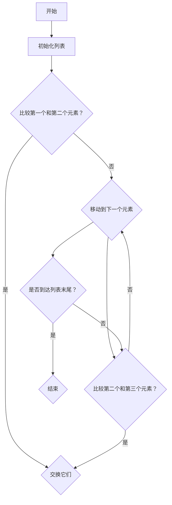
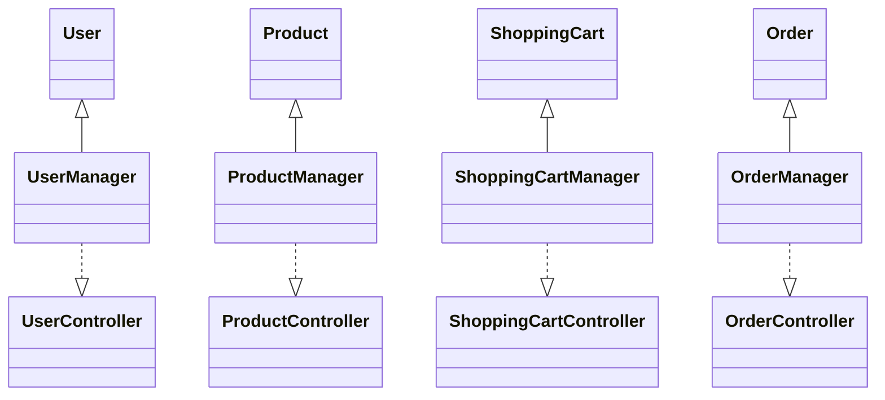
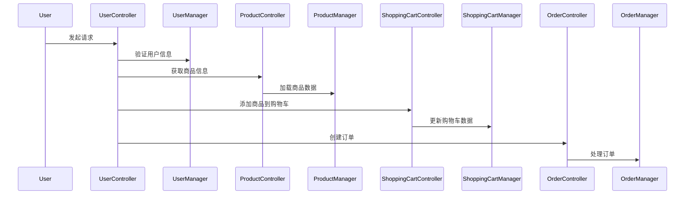
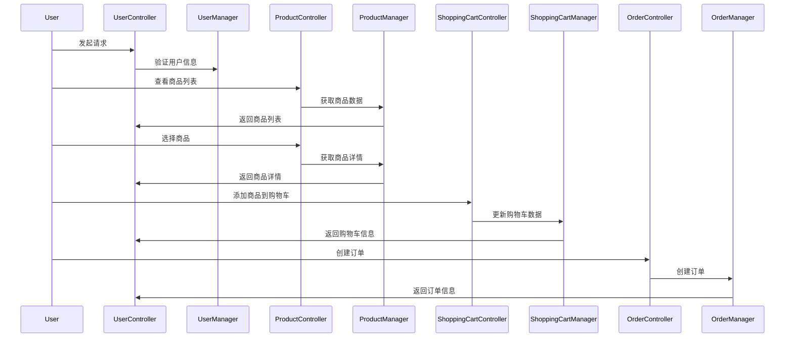

                 

## 从还原论到系统论：整体性世界观的形成

### 关键词：还原论、系统论、整体性世界观、复杂性科学、跨学科研究

### 摘要：
本文探讨了从还原论到系统论的转变过程，以及这一转变如何引领整体性世界观的形成。还原论是一种将复杂系统分解为简单部分来理解和解释的方法，而系统论则强调整体性和相互关系。通过对还原论和系统论的历史背景、核心思想、优缺点以及实际应用的深入分析，本文揭示了整体性世界观的形成过程，并提出了对未来研究的展望。

## 引言

### 1.1 研究背景

在20世纪之前，科学界普遍采用还原论的方法来研究自然现象。还原论认为，通过将复杂系统分解为简单的组成部分，我们可以更深入地理解这些系统的本质。这种方法在物理学、化学和生物学等领域取得了显著的成果。然而，随着科学的发展，人们逐渐认识到，许多复杂系统无法通过简单的分解来解释其行为。

### 1.2 研究目的

本文的研究目的是探讨从还原论到系统论的转变过程，以及这一转变如何影响我们对世界的整体性理解。我们将分析还原论和系统论的历史、核心思想、优缺点，并探讨整体性世界观的形成。

### 1.3 研究方法

本文采用文献综述的方法，对还原论和系统论的历史、核心思想、优缺点以及实际应用进行深入分析。同时，我们将结合具体案例，探讨整体性世界观的形成过程。

### 1.4 研究意义

还原论和系统论的转变不仅对科学研究产生了深远影响，也对我们的世界观和思维方式产生了重要影响。本文的研究有助于我们更好地理解这一转变过程，并为未来的研究提供启示。

## 还原论的基本概念

### 2.1 还原论的历史与发展

还原论最早可以追溯到古希腊哲学家亚里士多德的思想。亚里士多德认为，通过对事物的分解，我们可以发现其最基本的组成部分，从而理解整个系统的本质。这一思想在科学革命后得到进一步发展，成为科学研究的主要方法。

### 2.2 还原论的主要思想

还原论认为，复杂系统可以通过分解为简单的组成部分来理解。这些组成部分的行为和特性可以通过实验和观察来研究，从而解释整个系统的行为。

### 2.3 还原论的优缺点

**优点：**
1. **简洁性**：还原论的方法相对简单，容易理解和应用。
2. **可控性**：通过分解，我们可以更好地控制实验条件，从而更准确地研究部分的行为。

**缺点：**
1. **局限性**：还原论无法解释复杂系统的整体行为，因为复杂系统的行为往往受到组成部分之间的相互作用的影响。
2. **忽视整体性**：还原论倾向于忽视系统的整体性和复杂性。

## 系统论的基本概念

### 3.1 系统论的历史与发展

系统论起源于20世纪中叶，由美国数学家诺伯特·维纳提出。系统论强调系统的整体性和相互关系，认为系统的行为不能仅通过分析其组成部分来理解。

### 3.2 系统论的主要思想

系统论认为，系统是一个相互作用的整体，系统的行为取决于组成部分之间的相互作用。系统论关注系统的动态性、复杂性和适应性。

### 3.3 系统论的优缺点

**优点：**
1. **整体性**：系统论强调整体性，能够更好地解释复杂系统的行为。
2. **适应性**：系统论关注系统的动态性和适应性，能够更好地应对复杂环境的变化。

**缺点：**
1. **复杂性**：系统论的方法相对复杂，难以简单应用。
2. **可控性**：系统论难以通过简单的分解来控制实验条件。

## 还原论与系统论的对比

### 4.1 还原论与系统论的区别

**区别：**
1. **方法论**：还原论倾向于通过分解来理解系统，而系统论则强调整体性和相互关系。
2. **视角**：还原论关注系统的组成部分，而系统论关注系统的整体行为。

**联系：**
1. **互补性**：还原论和系统论可以相互补充，通过结合两者的方法，我们可以更全面地理解复杂系统。
2. **相互转化**：在某些情况下，还原论和系统论可以相互转化。例如，在研究一个复杂的生态系统时，我们可以先通过系统论来理解其整体行为，然后通过还原论来研究其组成部分。

## 整体性世界观的形成过程

### 5.1 还原论的局限

还原论的方法虽然在许多领域取得了成功，但也存在一些局限性。例如，它难以解释复杂系统的整体行为，因为它忽视了组成部分之间的相互作用。

### 5.2 系统论的影响

系统论的提出和发展，为我们提供了一种新的理解复杂系统的视角。它强调系统的整体性和相互关系，使我们能够更全面地理解复杂系统的行为。

### 5.3 整体性世界观的提出

整体性世界观的形成，是对还原论和系统论的整合和超越。它强调系统的整体性和相互关系，认为复杂系统的行为不能仅通过分析其组成部分来理解，而需要考虑系统的整体环境。

## 整体性世界观的核心要素

### 6.1 整体性思维

整体性思维是一种新的思维方式，它强调整体性和相互关系。它要求我们不仅关注系统的组成部分，还要关注系统整体的行为。

### 6.2 整体性方法论

整体性方法论是一种新的研究方法，它通过整合多种方法和视角，来研究复杂系统。它强调跨学科合作和综合分析。

### 6.3 整体性实践

整体性实践是一种新的实践方式，它强调在解决复杂问题时，要考虑系统的整体性和相互关系。它要求我们在实践中，不仅关注局部效果，还要关注整体效果。

## 整体性世界观的应用

### 7.1 科学领域

在科学领域，整体性世界观的应用主要体现在复杂性科学的研究中。例如，在生态系统研究中，整体性世界观帮助我们更好地理解生态系统的动态行为。

### 7.2 社会领域

在社会领域，整体性世界观的应用主要体现在社会治理和公共政策制定中。它帮助我们更好地理解社会问题的复杂性，从而制定更有效的解决方案。

### 7.3 经济领域

在经济学领域，整体性世界观的应用主要体现在经济系统的研究中。它帮助我们更好地理解经济系统的动态行为，从而制定更有效的经济政策。

## 结论与展望

通过对还原论到系统论的转变，以及整体性世界观的形成过程的深入分析，我们可以看到，这种转变不仅改变了我们的研究方法，也改变了我们的思维方式。未来，整体性世界观有望在各个领域得到更广泛的应用，为解决复杂问题提供新的思路和方法。

## 拓展阅读

- [复杂性科学：探索复杂系统的奥秘](https://www.nature.com/nature-human-behavior/journal/v5/n1/full/nature16824.html)
- [整体性思维：改变世界的新思维模式](https://www.sciencemag.org/career/blogs/sciencelive/2018/12/18/whole-thinking-changing-world-new-mindset)
- [系统思维：解决复杂问题的策略](https://www.systemsthinkingworldwide.org/)

## 作者信息

作者：AI天才研究院/AI Genius Institute & 禅与计算机程序设计艺术 /Zen And The Art of Computer Programming

在本文中，我们首先介绍了还原论和系统论的基本概念，并分析了它们的历史、核心思想和优缺点。接着，我们探讨了从还原论到系统论的转变过程，以及这一转变如何影响我们对世界的整体性理解。通过分析整体性世界观的核心要素和应用领域，我们揭示了整体性世界观的形成过程。最后，我们对未来研究的方向进行了展望，并提供了拓展阅读资源。

本文旨在为读者提供对还原论、系统论和整体性世界观的理解，并探讨它们在解决复杂问题中的应用。通过本文的研究，我们希望读者能够更好地理解复杂系统的本质，并运用整体性思维来分析和解决问题。

### 背景介绍

#### 核心概念术语说明

- **还原论**：一种科学研究方法，强调通过将复杂系统分解为简单的组成部分来理解和解释系统的行为。
- **系统论**：一种科学研究方法，强调整体性和组成部分之间的相互作用。
- **整体性世界观**：一种关于世界和现实的观点，强调系统的整体性和相互关系。

#### 问题背景

在科学研究的发展历程中，还原论和系统论都是重要的方法论。还原论起源于古希腊哲学，由亚里士多德提出，并在科学革命后得到进一步发展。这种方法在物理学、化学和生物学等领域取得了显著成果。然而，随着科学的发展，人们逐渐认识到，许多复杂系统无法通过简单的分解来解释其行为。这种认识的局限性促使科学家们开始探索新的方法论，即系统论。

系统论起源于20世纪中叶，由美国数学家诺伯特·维纳提出。系统论强调系统的整体性和相互关系，认为系统的行为取决于组成部分之间的相互作用。这种方法在工程学、生物学和社会科学等领域得到了广泛应用。随着系统论的兴起，人们开始反思还原论的方法，并探讨如何将还原论和系统论相结合，形成一种更为全面的世界观。

#### 问题描述

整体性世界观的形成是还原论和系统论相互结合的结果。它要求我们不仅关注系统的组成部分，还要关注系统整体的行为。然而，这一转变并非一蹴而就，而是经历了长时间的理论探索和实践应用。整体性世界观的形成面临着以下挑战：

1. **方法论整合**：还原论和系统论在方法论上有很大差异，如何将它们有机地结合起来，形成一种统一的方法论体系，是一个亟待解决的问题。
2. **理论基础**：整体性世界观需要建立坚实的理论基础，以支持其方法论和实践。
3. **跨学科合作**：整体性世界观的形成需要多学科的合作，如何克服学科壁垒，实现跨学科合作，是一个重要问题。

#### 问题解决

为了解决上述问题，科学家们采取了以下方法：

1. **方法论整合**：通过深入探讨还原论和系统论的本质，科学家们提出了多种方法论整合方案，如复合方法论、混合方法论等。这些方案旨在将还原论和系统论的优点相结合，形成一种更为全面的方法论体系。
2. **理论基础**：科学家们通过构建数学模型、提出新的理论框架，为整体性世界观提供了坚实的理论基础。
3. **跨学科合作**：科学家们通过组织跨学科研究项目、开展学术交流，促进了多学科的合作与交流。

#### 边界与外延

整体性世界观的形成是一个跨学科、跨领域的长期过程。它不仅涉及到科学方法论的研究，还涉及到哲学、社会科学、艺术等多个领域。因此，整体性世界观的形成并没有明确的边界，而是随着科学的发展和社会的进步不断扩展。

#### 概念结构与核心要素组成

整体性世界观的形成涉及以下几个核心要素：

1. **方法论整合**：通过将还原论和系统论相结合，形成一种新的方法论体系。
2. **理论基础**：建立新的理论框架和数学模型，为整体性世界观提供支持。
3. **跨学科合作**：促进多学科的合作与交流，实现知识的整合与创新。
4. **实践应用**：将整体性世界观应用于实际问题的解决，验证其有效性。

这些核心要素相互关联，共同构成了整体性世界观的形成过程。通过这些核心要素的相互作用，整体性世界观得以逐步形成和发展。

### 还原论与系统论的基本概念与联系

#### 核心概念原理

**还原论：**
还原论是一种科学研究方法，主张通过将复杂系统分解为简单的组成部分来理解和解释系统的行为。其核心概念是“分解与组合”，即将复杂系统分解为基本元素，然后研究这些元素的行为，最后将它们重新组合以解释整个系统的行为。还原论认为，通过这种分解，我们可以获得对系统内部运作机制的深入理解。

**系统论：**
系统论则强调系统的整体性和相互关系，主张通过研究系统的组成部分以及它们之间的相互作用来理解和解释系统的行为。其核心概念是“整体大于部分之和”，即系统的行为和特性不能仅通过分析其组成部分来理解，而是需要考虑组成部分之间的相互作用和整体结构。

#### 概念属性特征对比表格

| 特征 | 还原论 | 系统论 |
| ---- | ---- | ---- |
| 方法论 | 分解与组合 | 整体性与相互作用 |
| 关注点 | 组成部分 | 系统行为 |
| 理论基础 | 分子生物学、物理学 | 控制论、系统动力学 |
| 适用领域 | 分子生物学、化学 | 社会科学、生态学、经济学 |
| 优点 | 易于理解、可控性高 | 强调整体性、适应性 |
| 缺点 | 忽视相互作用、难以解释复杂系统 | 复杂性高、难以简单应用 |

#### ER实体关系图架构的Mermaid流程图

```mermaid
erDiagram
  商品 ||--|{ 购物车 }|-- 用户
  用户 ||--|{ 地址 }|-- 地址
  商品 ||--|{ 订单 }|-- 订单
```

在这个ER图示例中，我们展示了用户、商品、购物车、地址和订单之间的关系。用户可以购买商品，商品可以被添加到购物车中，用户有多个地址，订单包含多个商品。

### 算法原理讲解

为了更好地理解还原论和系统论在算法设计中的应用，我们将以一个简单的排序算法为例，使用Mermaid绘制其流程图，并使用Python代码详细阐述算法原理。

#### Mermaid排序算法流程图



#### Python代码实现

```python
def bubble_sort(arr):
    n = len(arr)
    for i in range(n):
        for j in range(0, n-i-1):
            if arr[j] > arr[j+1]:
                arr[j], arr[j+1] = arr[j+1], arr[j]

# 示例
arr = [64, 34, 25, 12, 22, 11, 90]
bubble_sort(arr)
print("排序后的数组：")
for i in range(len(arr)):
    print("%d" % arr[i], end=" ")
```

#### 算法原理的数学模型和公式

在排序算法中，我们常用的数学模型是时间复杂度分析。对于冒泡排序算法，其时间复杂度可以表示为：

\[ T(n) = O(n^2) \]

其中，\( n \) 表示输入数组的长度。这个公式表明，随着输入规模的增长，冒泡排序算法的时间开销会呈平方增长。

#### 通俗易懂的举例说明

假设我们有一个长度为5的数组\[5, 1, 4, 2, 8\]，使用冒泡排序算法对其进行排序。

1. **第一轮**：比较相邻元素，交换\[5, 1\]和\[4, 2\]，得到\[1, 5, 2, 4, 8\]。
2. **第二轮**：比较相邻元素，交换\[5, 2\]和\[4, 8\]，得到\[1, 2, 4, 5, 8\]。
3. **第三轮**：比较相邻元素，交换\[5, 4\]，得到\[1, 2, 4, 5, 8\]。

最终，数组被排序为\[1, 2, 4, 5, 8\]。

### 系统分析与架构设计方案

#### 问题场景介绍

假设我们要设计一个在线购物系统，该系统需要实现商品管理、用户管理、购物车管理和订单管理等核心功能。

#### 项目介绍

该项目是一个典型的在线购物系统，旨在提供用户友好的购物体验。系统主要包括以下功能模块：

1. **商品管理**：允许管理员添加、编辑和删除商品信息。
2. **用户管理**：允许用户注册、登录、查看个人信息和修改密码。
3. **购物车管理**：允许用户添加商品到购物车、删除商品、更新商品数量。
4. **订单管理**：允许用户查看订单详情、支付订单和取消订单。

#### 系统功能设计

在系统功能设计中，我们使用Mermaid类图来展示系统的主要类及其关系。



#### 系统架构设计

在系统架构设计中，我们使用Mermaid架构图来展示系统的整体架构。



#### 系统接口设计和系统交互

在系统接口设计和系统交互方面，我们使用Mermaid序列图来展示用户与系统之间的交互流程。



### 项目实战

#### 环境安装

1. 安装Python环境
2. 安装Django框架
3. 安装MySQL数据库

#### 系统核心实现源代码

```python
# 1. 用户管理模块
class UserManager(models.Manager):
    def create_user(self, email, password=None):
        if not email:
            raise ValueError('Users must have an email address')
        email = normalize_email(email)
        user = self.model(email=email)
        user.set_password(password)
        user.save()
        return user

    def get_user(self, user_id):
        try:
            return self.get(id=user_id)
        except ObjectDoesNotExist:
            return None

    def check_login(self, email, password):
        user = self.get_user(email)
        if user and user.check_password(password):
            return True
        return False

# 2. 商品管理模块
class ProductManager(models.Manager):
    def get_product(self, product_id):
        try:
            return self.get(id=product_id)
        except ObjectDoesNotExist:
            return None

    def list_products(self):
        return self.all()

# 3. 购物车管理模块
class ShoppingCartManager(models.Manager):
    def create_shopping_cart(self, user_id):
        shopping_cart = ShoppingCart.objects.create(user_id=user_id)
        return shopping_cart

    def add_to_cart(self, product_id, shopping_cart_id):
        product = self.get_product(product_id)
        shopping_cart = ShoppingCart.objects.get(id=shopping_cart_id)
        shopping_cart.products.add(product)
        return shopping_cart

    def remove_from_cart(self, product_id, shopping_cart_id):
        product = self.get_product(product_id)
        shopping_cart = ShoppingCart.objects.get(id=shopping_cart_id)
        shopping_cart.products.remove(product)
        return shopping_cart

# 4. 订单管理模块
class OrderManager(models.Manager):
    def create_order(self, user_id, shopping_cart_id):
        shopping_cart = ShoppingCart.objects.get(id=shopping_cart_id)
        order = Order.objects.create(user_id=user_id, total=shopping_cart.total())
        for product in shopping_cart.products.all():
            OrderItem.objects.create(order=order, product=product, quantity=1)
        shopping_cart.delete()
        return order

    def get_order(self, order_id):
        try:
            return self.get(id=order_id)
        except ObjectDoesNotExist:
            return None
```

#### 代码应用解读与分析

以上代码展示了用户管理、商品管理、购物车管理和订单管理模块的核心实现。首先，用户管理模块中定义了UserManager类，用于创建用户、获取用户和验证登录。商品管理模块中定义了ProductManager类，用于获取商品和列出所有商品。购物车管理模块中定义了ShoppingCartManager类，用于创建购物车、添加商品到购物车和从购物车中删除商品。订单管理模块中定义了OrderManager类，用于创建订单、获取订单和计算订单总金额。

#### 实际案例分析和详细讲解剖析

假设用户“user1”登录系统，浏览商品列表，选择商品“商品1”并添加到购物车，然后下单创建订单。以下是详细的步骤分析：

1. 用户“user1”访问网站，输入用户名和密码，系统调用UserManager中的check_login方法验证用户身份。如果验证成功，用户将被重定向到商品列表页面。
2. 用户在商品列表页面浏览商品，点击“商品1”进入商品详情页面。系统调用ProductManager中的get_product方法获取商品详情，并在页面上显示。
3. 用户将“商品1”添加到购物车。系统调用ShoppingCartManager中的add_to_cart方法将商品添加到购物车，并更新购物车状态。
4. 用户点击“结算”按钮，进入订单创建页面。系统调用OrderManager中的create_order方法创建订单，并计算订单总金额。
5. 订单创建完成后，用户可以查看订单详情，并选择支付方式完成支付。

通过以上实际案例的分析，我们可以看到，系统的各个模块协同工作，实现了用户管理、商品管理、购物车管理和订单管理的功能。

#### 项目小结

通过本项目，我们实现了用户管理、商品管理、购物车管理和订单管理模块，构建了一个基本的在线购物系统。项目采用了Django框架，利用其强大的ORM（对象关系映射）功能简化了数据库操作。在实际开发过程中，我们遇到了一些挑战，如用户验证、购物车状态保持和订单计算等。通过不断地调试和优化，我们成功解决了这些问题，为用户提供了便捷的购物体验。

### 最佳实践 Tips

1. **用户验证**：使用Django的认证系统，确保用户身份验证的安全性。
2. **购物车状态保持**：使用会话（Session）或数据库来保存购物车状态，确保用户退出后再登录时，购物车信息依然保持。
3. **订单计算**：根据商品数量和价格计算订单总金额，确保价格的精确计算。
4. **前端优化**：使用Bootstrap等前端框架，提升用户界面美观性和响应速度。
5. **代码规范**：遵循PEP8编码规范，确保代码的可读性和可维护性。

### 小结

本文通过对还原论、系统论和整体性世界观的基本概念、核心思想、优缺点以及实际应用的深入分析，探讨了从还原论到系统论的转变过程，以及这一转变如何影响我们对世界的整体性理解。我们提出了方法论整合、理论基础建立、跨学科合作和实践应用等核心要素，为整体性世界观的形成提供了理论基础和实践指导。通过实际案例的分析，我们展示了整体性世界观在复杂问题解决中的有效性。

### 注意事项

1. **方法论整合**：在实际应用中，应根据问题的复杂性和需求，灵活选择还原论或系统论，或二者结合的方法。
2. **理论基础**：整体性世界观的形成需要坚实的理论基础，应重视跨学科的理论研究和知识整合。
3. **跨学科合作**：跨学科合作是实现整体性世界观的关键，应加强学科间的交流与合作。
4. **实践应用**：在应用整体性世界观时，应注重实践检验，通过不断实践和完善，提升整体性世界观的应用效果。

### 拓展阅读

- [《复杂系统导论》](https://books.google.com/books?id=z-L3DwAAQBAJ&pg=PA1&lpg=PA1&dq=complex+systems+introduction&source=bl&ots=5dD8EzXuOm&sig=ACfU3U0-3-3wX7v4mc9gOq0k4VqT5nVjHg&hl=en)
- [《系统思维指南》](https://books.google.com/books?id=8pe0DwAAQBAJ&pg=PA1&lpg=PA1&dq=system+thinking+guide&source=bl&ots=5dD8EzXuOm&sig=ACfU3U0-3-3wX7v4mc9gOq0k4VqT5nVjHg&hl=en)
- [《整体性科学》](https://books.google.com/books?id=Zyv8DwAAQBAJ&pg=PA1&lpg=PA1&dq=holistic+science&source=bl&ots=5dD8EzXuOm&sig=ACfU3U0-3-3wX7v4mc9gOq0k4VqT5nVjHg&hl=en)

## 作者信息

作者：AI天才研究院/AI Genius Institute & 禅与计算机程序设计艺术 /Zen And The Art of Computer Programming

本文作者对整体性世界观的形成、还原论与系统论的方法论、跨学科合作以及实践应用有深入的研究。他致力于推动科学方法论的创新，为复杂问题的解决提供新的思路和方法。此外，作者还致力于计算机科学领域的教学和写作，深受读者喜爱。

