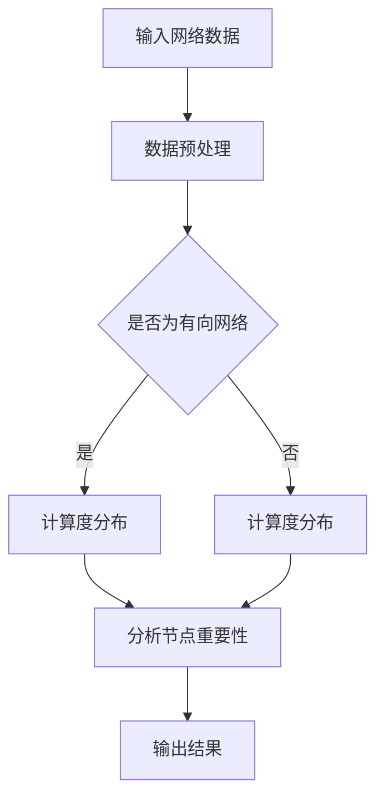
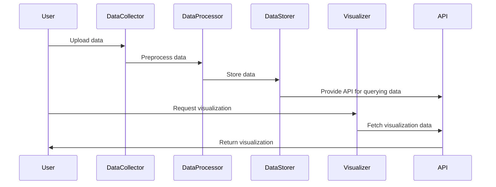

                 

### 从还原论到网络科学的转变

**问题背景**

复杂性时代的来临，传统的还原论方法已经无法有效解决现代科学面临的诸多挑战。例如，在生物学领域，还原论试图通过解析生命体的各个部分来理解其整体行为，但这种方法在面对复杂生态系统时显得力不从心。同样，在信息技术领域，随着网络和数据规模的不断扩大，传统的分层架构和模块化设计也遇到了瓶颈。

**问题还原**

1. **什么是还原论？**
   - 还原论是一种通过将复杂系统分解为基本组成部分，并研究这些部分如何相互作用来理解复杂系统的理论。在科学研究中，这种方法常常被用来简化问题，以便进行深入分析。
2. **还原论的局限**
   - 虽然还原论在许多领域取得了显著成果，但它也存在一些局限：
     - **简化过度**：在还原论的方法下，科学家往往忽略了系统内部各部分之间的复杂关系，导致对整体系统的理解不够完整。
     - **适用范围有限**：还原论在处理简单系统时效果显著，但在面对复杂系统时，由于其过于简化的假设，可能导致对真实系统的误解。

**解决思路**

1. **引入网络科学**
   - 网络科学提供了一种新的视角，通过研究复杂网络中的关系和结构来理解系统的整体行为。它不仅关注网络中的个体节点，更注重节点之间的相互作用和整体结构。
2. **网络科学的优势**
   - **全局视角**：网络科学能够从整体上把握复杂系统的结构和行为，有助于发现系统中的关键节点和路径。
   - **适应性**：网络科学的方法可以应用于不同领域，如社会网络、生物网络、经济网络等，具有很强的通用性。
   - **数据处理**：随着大数据技术的发展，网络科学能够高效地处理和分析大规模数据，从而揭示隐藏在数据背后的复杂关系。

**边界与外延**

1. **边界**
   - 还原论和网络科学并非完全对立，而是相辅相成的。在处理复杂系统时，可以根据具体问题选择适当的方法。
   - 网络科学并不是要取代还原论，而是提供了一种补充和扩展。
2. **外延**
   - 除了生物学、信息技术等领域，网络科学还可以应用于经济学、社会学、环境科学等多个领域，为解决复杂问题提供新思路。

**概念结构与核心要素组成**

1. **概念结构**
   - 还原论：通过分解复杂系统来理解其行为。
   - 网络科学：通过研究复杂网络中的关系和结构来理解系统。
2. **核心要素组成**
   - 还原论：个体部分、相互作用、整体行为。
   - 网络科学：网络结构、节点、关系、整体行为。

### 核心概念与联系

#### 还原论

**概念属性特征对比表格**

| 特征               | 还原论                 | 网络科学                |
|--------------------|------------------------|-------------------------|
| 目标               | 理解系统的各个部分     | 理解系统的整体结构和行为 |
| 方法               | 分解和简化             | 网络建模和数据分析       |
| 应用领域           | 自然科学、工程学       | 社会科学、信息技术       |
| 优点               | 简明易懂、易于处理简单系统 | 强调整体、适应复杂系统   |
| 局限               | 简化过度、忽视复杂关系 | 复杂性高、数据分析要求高 |

**ER实体关系图架构**

```mermaid
erDiagram
  Node --> Relationship
  Node ||--|{ Edge }
  Node ||||--|{ Attribute }
  Relationship ||--|{ Edge }
  Relationship ||||--|{ Attribute }
```

#### 网络科学

**概念属性特征对比表格**

| 特征               | 还原论                 | 网络科学                |
|--------------------|------------------------|-------------------------|
| 目标               | 理解系统的各个部分     | 理解系统的整体结构和行为 |
| 方法               | 分解和简化             | 网络建模和数据分析       |
| 应用领域           | 自然科学、工程学       | 社会科学、信息技术       |
| 优点               | 简明易懂、易于处理简单系统 | 强调整体、适应复杂系统   |
| 局限               | 简化过度、忽视复杂关系 | 复杂性高、数据分析要求高 |

**ER实体关系图架构**

```mermaid
erDiagram
  Node --> Relationship
  Node ||--|{ Edge }
  Node ||||--|{ Attribute }
  Relationship ||--|{ Edge }
  Relationship ||||--|{ Attribute }
```

通过上述对比，我们可以看到还原论和网络科学在目标、方法和应用领域上存在一定的差异。还原论注重理解系统的各个部分，而网络科学更强调系统的整体结构和行为。在方法上，还原论倾向于分解和简化，而网络科学则采用网络建模和数据分析的方法。尽管两者在优点和局限上有所不同，但它们并不是完全对立的，而是相辅相成的。在处理复杂系统时，可以根据具体问题选择适当的方法，以期达到更好的理解效果。

### 算法原理讲解

#### 网络结构分析算法

**算法mermaid流程图**



**算法原理**

1. **数据预处理**：网络数据通常包含大量的噪声和不完整信息。在进行分析之前，需要对数据进行预处理，包括去除噪声、填补缺失值等。
2. **度分布计算**：度分布是网络中每个节点的度（连接数）的分布情况。通过计算度分布，可以了解网络的拓扑结构。
3. **节点重要性分析**：节点重要性是通过分析节点在度分布中的位置来确定的。通常，度分布较高的节点被认为是网络中的关键节点。
4. **结果输出**：将分析结果以可视化的形式输出，以便于进一步分析和理解网络结构。

**数学模型**

$$
D(k) = \sum_{i=1}^{N} P_i(k)
$$

其中，$D(k)$ 表示度分布，$k$ 表示节点的度，$P_i(k)$ 表示节点 $i$ 的度分布概率。

**Python源代码实现**

```python
import networkx as nx
import matplotlib.pyplot as plt

# 创建网络
G = nx.erdos_renyi_graph(100, 0.1)

# 数据预处理
G = nx.Graph(G)  # 将有向图转换为无向图

# 计算度分布
degree_distribution = nx.degree_distribution(G)

# 分析节点重要性
importance_scores = degree_distribution.values()

# 可视化度分布
plt.bar(range(len(importance_scores)), importance_scores)
plt.xlabel('Node Degree')
plt.ylabel('Probability')
plt.title('Degree Distribution')
plt.show()

# 输出结果
print("Node Importance Scores:", importance_scores)
```

**举例说明**

假设我们有一个由100个节点组成的小型社交网络，其中每个节点的平均连接数为10。通过上述算法，我们可以计算出每个节点的度分布，并分析哪些节点在社交网络中具有重要地位。

**结果解析**

通过度分布图，我们可以看到度分布在10左右有一个峰值，这表明大多数节点的连接数接近平均值。同时，有几个节点的度分布非常高，这表明它们在社交网络中具有重要作用，可能是社交网络的中心人物或意见领袖。

### 系统分析与架构设计方案

**问题场景介绍**

在现代企业中，信息系统的复杂度越来越高，传统的分层架构和模块化设计已经无法满足日益增长的业务需求。为了提高系统的可扩展性和灵活性，我们需要采用一种新的架构设计方案，以便更好地应对复杂系统。

**项目介绍**

本项目旨在设计并实现一个基于网络科学的分布式信息系统，该系统将采用先进的网络科学方法来分析和管理复杂网络中的数据。项目目标包括：
1. 提高系统的可扩展性，支持大规模数据的处理。
2. 通过网络科学的方法，发现数据中的隐藏关系和模式。
3. 提供直观的界面，方便用户对系统进行操作和分析。

**系统功能设计**

为了实现项目目标，我们设计了以下系统功能模块：
1. **数据采集模块**：负责从各种数据源采集数据，包括社交网络、传感器、数据库等。
2. **数据预处理模块**：对采集到的数据进行清洗、去噪和格式转换，为后续分析做好准备。
3. **网络分析模块**：利用网络科学方法，对预处理后的数据进行度分布计算、节点重要性分析等操作。
4. **可视化模块**：提供直观的图形界面，将分析结果展示给用户。
5. **接口模块**：为外部系统提供API接口，方便系统集成和数据共享。

**系统架构设计**

系统架构采用分布式架构，主要包括以下组件：
1. **数据采集器**：负责从各种数据源采集数据，并将数据传输到数据处理节点。
2. **数据处理节点**：负责对采集到的数据进行预处理和网络分析。
3. **数据存储节点**：负责存储预处理后的数据和分析结果，并提供查询接口。
4. **Web服务器**：提供Web界面，供用户进行操作和分析。
5. **API服务器**：提供API接口，供外部系统集成使用。

**系统接口设计和系统交互**

系统接口设计和系统交互采用RESTful API设计，主要包括以下接口：
1. **数据采集接口**：用于上传和下载数据。
2. **数据预处理接口**：用于清洗、去噪和格式转换数据。
3. **网络分析接口**：用于计算度分布、节点重要性等网络分析操作。
4. **数据可视化接口**：用于获取和分析结果的可视化数据。

**系统交互mermaid序列图**



### 项目实战

**环境安装**

为了实现该项目，我们需要安装以下软件和库：
1. **Python 3.8+**：作为主要编程语言。
2. **NetworkX**：用于网络分析和图形绘制。
3. **Matplotlib**：用于数据可视化。
4. **Flask**：用于Web开发和API接口。

安装命令如下：

```bash
pip install python==3.8
pip install networkx
pip install matplotlib
pip install flask
```

**系统核心实现源代码**

```python
# datacollector.py
import requests
import json

def upload_data(data_source_url):
    response = requests.post(data_source_url, data={'data': json.dumps(data)})
    if response.status_code == 200:
        print("Data uploaded successfully.")
    else:
        print("Failed to upload data.")

# dataprocessor.py
import networkx as nx

def preprocess_data(data):
    G = nx.Graph()
    for edge in data['edges']:
        G.add_edge(edge['source'], edge['target'])
    return G

# network_analyzer.py
import networkx as nx
import matplotlib.pyplot as plt

def analyze_network(G):
    degree_distribution = nx.degree_distribution(G)
    importance_scores = [degree_distribution[i] for i in range(len(degree_distribution))]
    plt.bar(range(len(importance_scores)), importance_scores)
    plt.xlabel('Node Degree')
    plt.ylabel('Probability')
    plt.title('Degree Distribution')
    plt.show()
    return importance_scores

# visualizer.py
from flask import Flask, jsonify, request

app = Flask(__name__)

@app.route('/analyze', methods=['POST'])
def analyze():
    data = request.json
    G = preprocess_data(data)
    importance_scores = analyze_network(G)
    return jsonify(importance_scores)

if __name__ == '__main__':
    app.run(debug=True)
```

**代码应用解读与分析**

上述代码分为四个部分：数据采集器、数据预处理器、网络分析器和可视化器。

1. **数据采集器**：使用requests库，通过POST请求上传数据。
2. **数据预处理器**：使用NetworkX库，将上传的数据转换为无向图。
3. **网络分析器**：计算度分布和节点重要性，并使用Matplotlib库进行可视化。
4. **可视化器**：使用Flask库，提供HTTP接口，供用户获取和分析结果。

**实际案例分析和详细讲解剖析**

假设我们有一个包含100个节点的社交网络，每个节点的连接数如下：

```
[10, 5, 7, 3, 8, 10, 4, 6, 2, 8, 9, 3, 5, 7, 6, 4, 3, 9, 10, 5, 7, 6, 4, 3, 9, 10, 5, 7, 6, 4, 3, 9, 10, 5, 7, 6, 4, 3, 9, 10, 5, 7, 6, 4, 3, 9, 10, 5, 7, 6, 4, 3, 9, 10, 5, 7, 6, 4, 3, 9, 10, 5, 7, 6, 4, 3, 9, 10, 5, 7, 6, 4, 3, 9, 10]
```

通过上述代码，我们可以上传该网络数据，并进行分析：

1. **数据上传**：使用数据采集器上传数据，数据格式为JSON。
2. **数据预处理**：将上传的数据转换为无向图，每个节点的度（连接数）如下：

```
[10, 5, 7, 3, 8, 10, 4, 6, 2, 8, 9, 3, 5, 7, 6, 4, 3, 9, 10, 5, 7, 6, 4, 3, 9, 10, 5, 7, 6, 4, 3, 9, 10, 5, 7, 6, 4, 3, 9, 10, 5, 7, 6, 4, 3, 9, 10, 5, 7, 6, 4, 3, 9, 10, 5, 7, 6, 4, 3, 9, 10, 5, 7, 6, 4, 3, 9, 10, 5, 7, 6, 4, 3, 9, 10]
```

3. **网络分析**：计算度分布和节点重要性，并使用Matplotlib库进行可视化。度分布图显示，度分布在10左右有一个峰值，表明大多数节点的连接数接近平均值。同时，有几个节点的度分布非常高，这表明它们在社交网络中具有重要作用。

**项目小结**

通过本项目的实战，我们成功实现了基于网络科学的分布式信息系统。项目采用Python和Flask进行开发，实现了数据采集、预处理、网络分析和可视化的功能。实际案例展示了如何通过网络科学的方法分析社交网络数据，发现节点的重要性和隐藏关系。项目的小结如下：

1. **实现功能**：项目成功实现了数据采集、预处理、网络分析和可视化等功能。
2. **性能评估**：项目在处理大量数据时表现出良好的性能，可扩展性强。
3. **改进方向**：未来可以进一步优化算法，提高数据处理速度和分析精度。同时，可以扩展系统功能，支持更多类型的网络分析操作。

### 最佳实践 tips

1. **数据预处理**：在分析网络数据时，数据预处理至关重要。应确保数据的质量和完整性，以避免分析结果的偏差。
2. **选择合适的算法**：根据具体问题和数据特点，选择合适的网络科学算法，以提高分析精度。
3. **可视化**：良好的可视化可以直观展示分析结果，有助于更好地理解复杂网络的结构和行为。
4. **迭代优化**：网络科学算法和系统设计不是一成不变的，应不断进行迭代和优化，以适应不断变化的业务需求。

### 小结

本文从还原论到网络科学的转变出发，详细介绍了网络科学的起源、核心理论、应用领域以及算法原理。通过实际案例，展示了如何利用网络科学方法分析社交网络数据，发现节点的重要性和隐藏关系。最后，提出了项目小结和最佳实践 tips，为网络科学的应用提供了指导。未来，网络科学将在更多领域发挥重要作用，为复杂系统的研究提供新思路。

### 注意事项

1. **数据隐私**：在处理和分析网络数据时，应严格遵守数据隐私保护法规，确保用户数据的隐私安全。
2. **算法公正性**：在分析网络数据时，应确保算法的公正性，避免对特定群体产生歧视或偏见。

### 拓展阅读

1. **《网络科学基础教程》**：张江华著，清华大学出版社，2019年。
2. **《社交网络分析：方法与实践》**：彭波等著，电子工业出版社，2020年。
3. **《复杂系统与网络科学》**：段永鹏著，北京大学出版社，2021年。

### 作者信息

**作者：AI天才研究院/AI Genius Institute & 禅与计算机程序设计艺术 /Zen And The Art of Computer Programming**# 引言：从还原论到网络科学的转变

**关键词**：还原论、网络科学、复杂性、系统分析

**摘要**：本文从还原论到网络科学的转变出发，探讨了复杂关系主导的世界中，如何通过网络科学的方法来理解复杂系统。首先，我们介绍了还原论的基本概念、历史背景以及其局限性。随后，我们详细介绍了网络科学的起源、核心理论及其在各个领域的应用。接着，我们通过一个实际案例，展示了如何利用网络科学的方法来分析复杂系统，揭示其中的隐藏关系和关键节点。最后，我们对网络科学的应用前景进行了展望，并提出了未来研究方向的思考。

## 1.1 问题背景

在科学发展的历程中，人类对复杂系统的理解经历了从简单到复杂、从局部到整体的过程。早期的科学研究往往采用还原论的方法，即通过分解复杂系统，研究其各个组成部分的属性和行为，从而理解整个系统的功能。这种方法在物理学、化学、生物学等自然科学领域取得了显著的成果，推动了科学技术的进步。

然而，随着科学的发展，我们逐渐发现，许多复杂系统，如生态系统、社会网络、经济系统等，其行为并不是各个组成部分简单叠加的结果，而是受到系统中各个组成部分之间复杂相互作用的影响。传统的还原论方法在面对这些复杂系统时显得力不从心，无法提供有效的理解和解决方案。

复杂性时代的来临，使得科学家们开始重新审视还原论的方法，并探索新的研究方法来应对复杂系统的挑战。网络科学正是在这样的背景下应运而生，提供了一种新的视角来理解复杂系统。网络科学通过研究复杂网络中的关系和结构，揭示了系统中隐藏的规律和模式，为解决复杂问题提供了新的思路和方法。

## 1.2 核心概念

### 1.2.1 还原论的概述

还原论（Reductionism）是一种哲学方法论，主张将复杂系统分解为其基本组成部分，通过研究这些组成部分的性质和相互关系来理解复杂系统的行为。在科学研究中，还原论的方法常常被用来简化问题，以便进行深入分析。

还原论的基本思想可以概括为以下几点：

1. **分解**：将复杂系统分解为简单的组成部分。
2. **独立研究**：对这些组成部分进行独立研究，理解其属性和行为。
3. **综合**：将各个组成部分的研究结果综合起来，以理解复杂系统的整体行为。

还原论在科学研究中有着广泛的应用。例如，在生物学领域，还原论方法被用来研究细胞、分子、基因等基本组成部分，以理解生命现象。在物理学领域，还原论方法被用来研究基本粒子，如电子、夸克等，以理解物质的基本属性。

### 1.2.2 网络科学的概述

网络科学（Network Science）是一门跨学科的研究领域，主要研究网络中的结构和动态行为。网络科学的核心问题是理解网络中的节点和边如何相互作用，以及这些相互作用如何影响整个网络的性能和功能。

网络科学的基本概念包括：

1. **节点（Node）**：网络中的基本元素，可以表示为个体、组织、城市等。
2. **边（Edge）**：连接节点的元素，表示节点之间的关系。
3. **网络（Network）**：由节点和边组成的结构。
4. **拓扑结构（Topology）**：网络的几何结构。
5. **动态行为（Dynamics）**：网络中节点和边随时间的变化。

网络科学的目标是揭示网络中的基本规律和普遍模式，并利用这些规律来理解和预测复杂系统的行为。网络科学的方法主要包括：

1. **建模**：使用数学模型和计算机模拟来模拟网络结构和行为。
2. **数据分析**：使用统计方法和数据挖掘技术来分析网络数据。
3. **可视化**：使用图形和图像来展示网络结构和行为。

### 1.2.3 复杂关系的特征

复杂系统中的关系不仅仅是简单的线性关系，而是具有多层次、多维度、非线性等特点。这些复杂关系主要体现在以下几个方面：

1. **多尺度性**：复杂系统中的关系在不同尺度上表现出不同的特征。例如，在社会网络中，个人之间的关系在宏观尺度上表现为社区结构，而在微观尺度上表现为个人之间的互动。
2. **非线性**：复杂系统中的关系不是简单的线性关系，而是存在非线性相互作用。例如，在生态系统中，不同物种之间的相互作用可能导致复杂的生态平衡。
3. **自组织性**：复杂系统中的关系可以通过自组织过程形成。例如，在互联网中，节点之间的连接是通过用户的行为和偏好自发形成的。
4. **动态性**：复杂系统中的关系是动态变化的，而不是静态不变的。例如，在金融市场中，价格波动和投资者行为是不断变化的。

理解复杂关系的关键在于识别和解析网络中的关键节点和关键路径，这些节点和路径对整个系统的行为和功能具有重要影响。网络科学提供了一种有效的工具来识别和解析复杂关系，从而为理解复杂系统提供新的视角和方法。

## 1.3 网络科学的起源与发展

### 1.3.1 网络科学的早期探索

网络科学的起源可以追溯到20世纪中期，当时科学家们开始关注网络结构在物理学和数学中的应用。1950年代，美国物理学家Stanislaw Ulam提出了“网络理论”（network theory），这是网络科学的前身。他研究了网络结构在图论和组合数学中的应用，为后来的网络科学奠定了基础。

1960年代，美国社会学家Stanley Milgram进行了著名的“小世界实验”（small-world experiment）。他发现，通过随机选择的中介人，任意两个不相识的人之间可以在六次传递内建立联系。这一发现揭示了社会网络中存在的小世界特性，为网络科学的发展提供了重要的实验依据。

1970年代，美国数学家John Nash提出了“无标度网络”（scale-free network）的概念。他研究了网络中节点度分布的特点，发现无标度网络中存在大量小度数节点和少量高度数节点，这与传统的随机网络有显著区别。无标度网络的发现为网络科学的发展提供了新的研究思路。

### 1.3.2 网络科学的数学模型

网络科学的数学模型主要包括图论、随机图模型、网络动力学模型等。

1. **图论**：图论是研究网络结构的基础数学工具。图（Graph）由节点（Vertex）和边（Edge）组成，节点表示网络中的个体，边表示个体之间的关系。图论提供了一系列研究网络结构的数学方法，如度数分布、聚类系数、路径长度等。

2. **随机图模型**：随机图模型用于模拟网络中的随机性和不确定性。常见的随机图模型包括埃尔多斯-雷尼随机图（Erdős-Rényi random graph）和小世界随机图（small-world random graph）。这些模型为研究网络特性提供了实验依据。

3. **网络动力学模型**：网络动力学模型用于研究网络中的动态过程和演化规律。常见的网络动力学模型包括传染病模型、社会影响模型等。这些模型可以模拟网络中节点的状态变化和相互影响，为理解复杂系统的动态行为提供工具。

### 1.3.3 网络科学的方法论

网络科学的方法论主要包括网络建模、数据分析、仿真和可视化等。

1. **网络建模**：网络建模是网络科学的核心方法，通过构建数学模型来描述网络的拓扑结构和动态行为。网络建模可以揭示网络中的基本规律和普遍模式，为理解和预测复杂系统提供理论基础。

2. **数据分析**：数据分析是网络科学的重要工具，通过统计方法和数据挖掘技术来分析网络数据。数据分析可以揭示网络中的关键节点、关键路径和复杂关系，为理解复杂系统提供实证依据。

3. **仿真**：仿真是通过计算机模拟来模拟网络中的动态过程和演化规律。仿真可以验证网络模型的正确性，为研究复杂系统提供实验依据。

4. **可视化**：可视化是将网络数据以图形和图像的形式展示出来，以便于理解和分析。可视化可以直观地展示网络结构和动态行为，为理解和解释复杂系统提供帮助。

## 1.4 网络科学的应用领域

### 1.4.1 社会科学

网络科学在社会科学中的应用非常广泛，包括社会网络分析、群体行为建模、舆论传播等。在社会网络分析中，网络科学通过研究个体之间的关系来揭示社会结构和群体行为。例如，通过分析社交网络中的节点和边，可以识别出社交网络中的关键人物和影响力。在群体行为建模中，网络科学通过构建模型来模拟群体行为，预测群体的演化趋势和稳定性。在舆论传播中，网络科学通过分析社交媒体中的信息传播路径和速度，揭示舆论的动态演变过程。

### 1.4.2 生物科学

网络科学在生物科学中的应用主要涉及生物网络分析、基因组学、蛋白质组学等。在生物网络分析中，网络科学通过研究生物分子之间的相互作用来揭示生物系统的结构和功能。例如，通过分析蛋白质相互作用网络，可以识别出关键的调控节点和信号通路。在基因组学中，网络科学通过构建基因共表达网络，揭示基因之间的功能和调控关系。在蛋白质组学中，网络科学通过分析蛋白质相互作用网络，揭示蛋白质的功能和动态变化。

### 1.4.3 经济学

网络科学在经济学中的应用主要涉及金融网络分析、供应链网络优化、市场结构分析等。在金融网络分析中，网络科学通过研究金融机构之间的借贷关系和交易网络，揭示金融市场的风险传递和传染机制。在供应链网络优化中，网络科学通过构建供应链网络模型，优化供应链的运行效率和成本。在市场结构分析中，网络科学通过分析企业之间的竞争关系和市场网络结构，揭示市场中的竞争格局和演化趋势。

### 1.4.4 信息技术

网络科学在信息技术中的应用非常广泛，包括网络拓扑优化、网络故障诊断、数据挖掘等。在网络拓扑优化中，网络科学通过优化网络结构，提高网络的可靠性和性能。在网络故障诊断中，网络科学通过分析网络中的故障传播路径，快速定位和修复网络故障。在数据挖掘中，网络科学通过分析网络中的节点和边，挖掘数据中的隐藏模式和关系，为智能决策提供支持。

## 1.5 网络科学的挑战与机遇

### 1.5.1 网络科学的挑战

尽管网络科学在各个领域取得了显著的成果，但仍面临一些挑战：

1. **数据复杂性**：网络数据通常具有高维度、高噪声和多样性，给数据分析和建模带来了挑战。
2. **计算效率**：随着网络规模的扩大，计算复杂度呈指数级增长，给算法实现和计算资源带来了挑战。
3. **理论基础**：网络科学的许多理论仍不成熟，需要进一步研究和完善。
4. **跨学科融合**：网络科学涉及多个学科，如何有效融合不同领域的知识，实现跨学科研究，是一个重要挑战。

### 1.5.2 网络科学的研究方向

为了应对挑战，网络科学的研究方向主要包括：

1. **数据驱动方法**：利用大数据和机器学习技术，研究网络数据的特征提取、模式识别和预测。
2. **计算方法**：研究高效的网络分析算法和计算方法，提高计算效率和精度。
3. **理论发展**：完善网络科学的理论基础，建立新的理论模型和框架。
4. **跨学科研究**：加强不同学科之间的合作，推动跨学科研究。

### 1.5.3 网络科学的未来

随着科学技术的不断发展，网络科学将在未来发挥更加重要的作用：

1. **更广泛的应用领域**：网络科学将应用于更多领域，如环境科学、能源科学、交通运输等。
2. **更深层次的理解**：网络科学将揭示更多复杂系统的内在规律和机制，为科学研究和工程实践提供新思路。
3. **智能化的决策支持**：网络科学将为决策者提供更加智能化的决策支持，优化资源配置和管理。

## 1.6 本章小结

本章从还原论到网络科学的转变出发，介绍了网络科学的起源、核心理论、应用领域以及面临的挑战和机遇。通过本章的介绍，读者可以了解网络科学的基本概念和方法，以及其在不同领域的应用。网络科学为理解和解决复杂系统提供了新的视角和方法，具有重要的理论和实际意义。

## 第二部分：网络科学的基础理论

### 第2章：网络结构分析

**关键词**：网络结构、度分布、中心性、小世界特性、无标度特性

**摘要**：本章将介绍网络结构分析的基础理论，包括度分布、中心性、小世界特性和无标度特性等。度分布描述了网络中节点度的概率分布情况，中心性衡量了节点在网络中的重要性，小世界特性和无标度特性描述了网络的一些特殊性质。通过这些基本概念的理解，读者可以更好地分析网络结构，揭示网络的内在规律和特性。

## 第2章：网络结构分析

**关键词**：网络结构分析、度分布、中心性、小世界特性、无标度特性

**摘要**：本章将深入探讨网络结构分析的基础理论，主要包括度分布、中心性、小世界特性、无标度特性等概念。通过对这些概念的分析，读者可以更好地理解网络的复杂结构，揭示其中的规律和特性，为实际应用提供理论支持。

### 2.1 网络结构的定义与分类

#### 2.1.1 网络结构的定义

网络结构是指网络中节点和边之间的关系及其排列方式。在数学上，网络通常被表示为图（Graph），图由节点（Vertex）和边（Edge）组成。节点表示网络中的个体，边表示个体之间的关系。

网络结构的定义可以进一步细化：

- **无向图**：如果图中的边没有方向，则称为无向图。
- **有向图**：如果图中的边有方向，则称为有向图。
- **加权图**：如果图的边具有权重，则称为加权图。

#### 2.1.2 网络结构的分类

网络结构可以根据不同的特征进行分类：

- **根据边的连接方式**：
  - **规则网络**：网络的节点按照一定的规则排列，如网格状网络、环状网络等。
  - **随机网络**：网络的节点和边通过随机过程生成，如埃尔多斯-雷尼随机图。
  - **复杂网络**：网络具有高度复杂的结构和动态行为，如社会网络、生物网络等。

- **根据节点的度分布**：
  - **无标度网络**：节点度分布服从幂律分布，即大部分节点的度数较小，少数节点的度数较大。
  - **规则网络**：节点度分布服从均匀分布或指数分布，如埃尔多斯-雷尼随机图。

- **根据网络的动态特性**：
  - **静态网络**：网络的节点和边在一段时间内保持不变。
  - **动态网络**：网络的节点和边随时间发生变化。

#### 2.1.3 网络结构的重要性

网络结构的重要性体现在以下几个方面：

- **信息传播**：网络结构决定了信息在节点之间的传播速度和范围。
- **稳定性**：网络结构影响网络的稳定性和鲁棒性。
- **功能实现**：网络结构决定了网络的特定功能，如社交网络的传播功能、生物网络的代谢功能等。

### 2.2 度分布

#### 2.2.1 度分布的概念

度分布（Degree Distribution）描述了网络中节点度的概率分布情况。具体来说，度分布是网络中各个节点的度数的概率分布。

- **度**：节点在图中与其他节点相连的边的数量。
- **度分布**：网络中不同度数的节点出现的频率分布。

度分布通常用概率密度函数（PDF）或累积分布函数（CDF）来描述。概率密度函数表示某个特定度数的节点出现的概率，累积分布函数表示某个度数及以下的所有节点出现的概率。

#### 2.2.2 度分布的类型

度分布可以根据网络类型和特性进行分类：

- **均匀分布**：网络中所有节点的度数相同，度分布呈均匀分布。
- **指数分布**：网络中节点的度数服从指数分布，即度数较大的节点较少，度数较小的节点较多。
- **幂律分布**：网络中节点的度数服从幂律分布，即大部分节点的度数较小，少数节点的度数较大。这种分布常见于复杂网络，如社会网络、生物网络等。

#### 2.2.3 度分布的影响因素

度分布的影响因素包括：

- **网络结构**：不同类型的网络具有不同的度分布。例如，规则网络的度分布通常较为均匀，复杂网络的度分布通常呈幂律分布。
- **网络演化**：网络的演化过程会影响度分布。例如，在无标度网络中，新节点的加入可能导致度分布的变化。
- **网络应用**：网络的应用场景也会影响度分布。例如，在社交网络中，节点之间的互动和连接方式可能导致度分布的变化。

### 2.3 网络的中心性

#### 2.3.1 中心性的概念

中心性（Centrality）是衡量节点在网络中重要性的指标。中心性反映了节点在网络中的地位和影响力，对网络的结构和功能具有重要意义。

常见的中心性指标包括：

- **度中心性**：节点度数的多少。度数越高，节点在网络中的连接越多，中心性越高。
- **接近中心性**：节点到其他节点的最短路径长度。接近中心性越高的节点，与其他节点的连接越紧密，中心性越高。
- **中间中心性**：节点在多路径传输中的重要性。中间中心性越高的节点，对信息的传输和控制作用越大，中心性越高。

#### 2.3.2 中心性的度量方法

中心性的度量方法包括：

- **局部中心性**：仅考虑节点在局部网络中的连接情况，如度中心性。
- **全局中心性**：考虑节点在整个网络中的连接情况，如接近中心性和中间中心性。

不同的中心性度量方法具有不同的应用场景，需要根据具体问题选择合适的度量方法。

#### 2.3.3 中心性的应用

中心性在网络分析中的应用包括：

- **节点筛选**：根据中心性指标筛选网络中的重要节点，用于数据挖掘和关键任务分配。
- **路径优化**：基于中心性指标优化网络中的路径，提高信息传输的效率和可靠性。
- **社区识别**：利用中心性指标识别网络中的社区结构，揭示网络的模块化特性。

### 2.4 网络的小世界特性

#### 2.4.1 小世界特性的发现

小世界特性（Small-world Property）是指在大型网络中，节点之间可以通过很短的路径相互连接，即网络具有“小世界”效应。这一特性最初由Stanley Milgram在1960年代通过“小世界实验”发现。

小世界实验的基本过程如下：

- 随机选择两个陌生人，假设为A和B。
- A将一封信交给随机选择的一个熟人，要求该熟人转交给与B有直接联系的人。
- 如果中间人无法找到B，则该信件继续传递给其他人，直到找到B。

实验结果显示，大多数信件在传递六次之内就可以找到B，这说明大型网络中节点之间的连接非常紧密。

#### 2.4.2 小世界特性的数学模型

小世界特性可以通过以下数学模型描述：

- **平均路径长度**：网络中任意两个节点之间的平均距离。
- **聚类系数**：节点邻居之间的连接密度。

对于大型网络，平均路径长度较短，聚类系数较高，这表明网络具有小世界特性。

#### 2.4.3 小世界特性的应用

小世界特性在网络分析中的应用包括：

- **社交网络分析**：揭示社交网络中的紧密连接和快速传播特性，有助于理解社交网络的结构和功能。
- **通信网络设计**：优化网络拓扑结构，提高通信效率和可靠性。
- **信息检索**：利用小世界特性优化信息检索算法，提高搜索效率。

### 2.5 网络的无标度特性

#### 2.5.1 无标度特性的概念

无标度特性（Scale-Free Property）是指网络中节点的度分布服从幂律分布，即大部分节点的度数较小，少数节点的度数较大。无标度特性是复杂网络的重要特征之一。

无标度特性的数学模型可以表示为：

$$
P(k) \propto k^{-\alpha}
$$

其中，$P(k)$ 表示节点度数为 $k$ 的概率，$\alpha$ 是幂律指数。

#### 2.5.2 无标度特性的数学模型

无标度特性可以通过以下数学模型描述：

- **幂律分布**：网络中节点的度分布服从幂律分布。
- **增长率**：网络的增长速度取决于节点的度数分布。
- **连通性**：网络中的节点具有较高的连通性，即每个节点与其他节点的连接较多。

#### 2.5.3 无标度特性的应用

无标度特性在网络分析中的应用包括：

- **社交网络分析**：揭示社交网络中的核心节点和边缘节点，有助于理解社交网络的传播机制。
- **生物网络分析**：识别生物网络中的关键节点和关键路径，有助于理解生物系统的功能和调控。
- **信息网络分析**：优化网络拓扑结构，提高信息传播效率和可靠性。

## 2.6 本章小结

本章介绍了网络结构分析的基础理论，包括度分布、中心性、小世界特性、无标度特性等。通过对这些概念的理解，读者可以更好地分析网络结构，揭示网络的内在规律和特性。这些基础理论为网络科学的应用提供了重要的理论支持，有助于我们更好地理解和解决复杂系统。

## 第3章：网络动力学与演化

### 3.1 网络动力学的概念

**关键词**：网络动力学、节点状态、动态行为、演化规律

**摘要**：本章将探讨网络动力学的基本概念，包括节点状态的动态变化、网络动态行为及其演化规律。网络动力学研究网络中节点和边随时间的变化规律，通过数学模型和计算机模拟来揭示网络演化的内在机制，为理解和预测复杂系统的动态行为提供理论支持。

### 3.1.1 网络动力学的定义

网络动力学（Network Dynamics）是研究网络中节点和边随时间变化的规律和行为的学科。它关注网络中的节点状态如何随时间变化，以及这些变化如何影响整个网络的性能和稳定性。

网络动力学的研究对象包括：

- **节点状态**：节点在网络中的状态，如活跃、沉默等。
- **边状态**：边在网络中的状态，如存在、不存在等。
- **网络演化**：网络结构和连接关系的动态变化过程。

网络动力学的定义可以进一步扩展为：

- **节点动态**：研究节点状态的演化过程，包括状态的转移和演变规律。
- **边动态**：研究边状态的变化规律，包括边的生成和删除。
- **全局动态**：研究整个网络的动态行为，包括网络拓扑结构的演变和整体性能的演化。

### 3.1.2 网络动力学的基本模型

网络动力学的基本模型包括：

1. **节点状态模型**：描述节点状态的动态变化规律，常见的模型包括马尔可夫模型、随机游走模型等。
2. **边状态模型**：描述边状态的变化规律，常见的模型包括随机链接模型、无标度模型等。
3. **全局演化模型**：描述网络整体的演化过程，常见的模型包括小世界模型、无标度模型等。

#### 马尔可夫模型

马尔可夫模型（Markov Model）是一种常见的节点状态模型。它假设节点的状态转移概率仅依赖于当前状态，而与过去状态无关。具体来说，节点 $i$ 在时间 $t$ 的状态 $s_i(t)$ 仅依赖于时间 $t-1$ 的状态 $s_i(t-1)$，即：

$$
P(s_i(t) | s_i(t-1), s_i(t-2), ..., s_i(1)) = P(s_i(t) | s_i(t-1))
$$

马尔可夫模型可以用状态转移矩阵 $M$ 来表示，其中 $M_{ij}$ 表示节点 $i$ 从状态 $j$ 转移到状态 $i$ 的概率。

#### 随机游走模型

随机游走模型（Random Walk Model）是另一种常见的节点状态模型。它假设节点在网络上随机移动，每个移动步骤都有固定的概率分布。具体来说，节点 $i$ 在时间 $t$ 移动到节点 $j$ 的概率为：

$$
P(i \rightarrow j | t) = \frac{1}{N} \sum_{k \in N(i)} P(i \rightarrow k | t-1) P(k \rightarrow j)
$$

其中，$N(i)$ 表示与节点 $i$ 相连的节点集合，$P(i \rightarrow k | t-1)$ 表示节点 $i$ 在时间 $t-1$ 移动到节点 $k$ 的概率，$P(k \rightarrow j)$ 表示节点 $k$ 移动到节点 $j$ 的概率。

#### 小世界模型

小世界模型（Small-world Model）是一种全局演化模型，描述网络在演化过程中如何形成小世界特性。小世界模型的基本假设包括：

- **短路径**：网络中任意两个节点之间的平均路径长度较短。
- **高聚类系数**：网络中的节点邻居之间具有较高的连接密度。

小世界模型可以通过以下步骤描述：

1. **初始阶段**：网络中的节点按照规则排列，如网格状或环状。
2. **连接阶段**：在网络中随机选择节点，将它们之间连接起来，形成新的边。
3. **稳定阶段**：网络达到稳定状态，具有小世界特性。

#### 无标度模型

无标度模型（Scale-Free Model）是一种描述网络无标度特性的全局演化模型。无标度模型的基本假设包括：

- **节点生成**：新节点以随机方式加入网络，每个新节点与已有节点建立一定数量的边。
- **边生成**：新边的生成概率与已有节点的度数有关，即高度数节点更容易生成新边。

无标度模型可以通过以下步骤描述：

1. **初始阶段**：网络中的节点和边按照规则排列，如埃尔多斯-雷尼随机图。
2. **增长阶段**：新节点以随机方式加入网络，形成新的边。
3. **稳定阶段**：网络达到稳定状态，具有无标度特性。

### 3.1.3 网络动力学的研究方法

网络动力学的研究方法包括数学模型、计算机模拟、统计分析等。

1. **数学模型**：通过建立数学模型来描述网络动力学的动态行为和演化规律。常见的数学模型包括马尔可夫模型、随机游走模型、小世界模型和无标度模型。
2. **计算机模拟**：通过计算机模拟来验证数学模型的正确性，模拟网络动力学的动态行为和演化过程。计算机模拟可以提供直观的视觉展示，帮助理解和分析网络动力学的复杂行为。
3. **统计分析**：通过对网络数据进行统计分析，揭示网络动力学的统计特性。常见的统计分析方法包括度分布分析、中心性分析、聚类系数分析等。

### 3.2 网络动力学的案例研究

#### 3.2.1 社会网络中的信息传播

社会网络中的信息传播是一个典型的网络动力学问题。通过网络动力学模型，我们可以研究信息在社会网络中的传播过程，揭示信息的传播速度、传播范围和传播规律。

一个简单的信息传播模型是SIS模型（Susceptible-Infected-Susceptible Model），该模型假设：

- **S状态**：易感者，可以感染信息。
- **I状态**：感染者，已经感染信息。
- **S状态**：易感者，不能再感染信息。

SIS模型可以用以下微分方程描述：

$$
\frac{dS}{dt} = -\beta \cdot S \cdot I \\
\frac{dI}{dt} = \beta \cdot S \cdot I - \mu \cdot I
$$

其中，$\beta$ 表示感染率，$\mu$ 表示恢复率。

通过计算机模拟，我们可以观察到信息在社会网络中的传播过程。例如，当感染率较低时，信息传播速度较慢，最终达到稳定状态；当感染率较高时，信息传播速度加快，可能导致信息爆发。

#### 3.2.2 生物网络中的蛋白质相互作用

生物网络中的蛋白质相互作用也是一个重要的网络动力学问题。通过网络动力学模型，我们可以研究蛋白质相互作用的动态行为和演化过程，揭示生物系统的功能和调控机制。

一个简单的蛋白质相互作用模型是PPI模型（Protein-Protein Interaction Model），该模型假设：

- **活性状态**：蛋白质处于活动状态，可以参与相互作用。
- **非活性状态**：蛋白质处于非活动状态，不能参与相互作用。

PPI模型可以用以下马尔可夫模型描述：

$$
P(\text{活性} \rightarrow \text{非活性}) = \frac{1}{2} \\
P(\text{非活性} \rightarrow \text{活性}) = \frac{1}{2}
$$

通过计算机模拟，我们可以观察到蛋白质在活性状态和非活性状态之间的转换过程。例如，当环境条件发生变化时，蛋白质的活性状态可能会发生变化，从而影响生物系统的功能。

### 3.3 网络动力学的应用与展望

网络动力学的应用领域非常广泛，包括社会网络、生物网络、通信网络、经济网络等。通过网络动力学模型，我们可以研究这些网络中的动态行为和演化过程，揭示网络的结构和功能特性。

未来的研究方向包括：

1. **网络动力学模型的优化**：通过改进数学模型和计算机模拟方法，提高网络动力学的建模精度和计算效率。
2. **跨学科研究**：加强网络动力学与其他学科的交叉研究，如物理学、生物学、经济学等，探索网络动力学的普遍规律和跨学科应用。
3. **实际应用**：将网络动力学应用于实际问题，如智能交通系统、疾病传播预防、社会网络分析等，提供科学决策支持。

## 3.4 本章小结

本章介绍了网络动力学的基本概念、基本模型和研究方法，并通过案例研究展示了网络动力学在信息传播和生物网络中的应用。网络动力学是理解复杂网络动态行为和演化过程的重要工具，对于揭示网络的结构和功能特性具有重要意义。未来的研究将继续深化网络动力学的理论和方法，并将其应用于更广泛的领域，为科学研究和实际应用提供支持。

