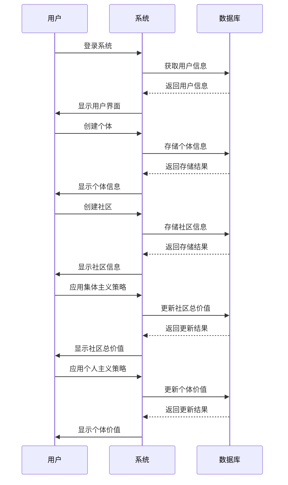
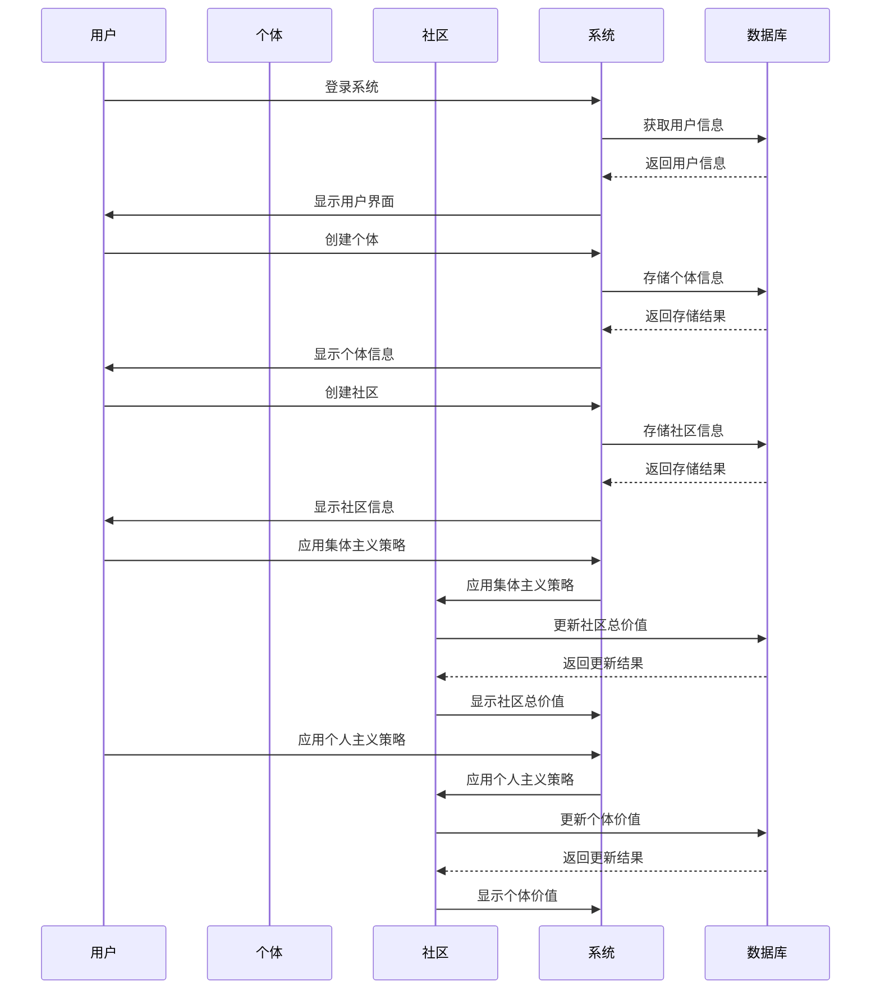

                 

## 从集体主义到个人主义：价值观的转变

> 关键词：集体主义，个人主义，价值观，社会变迁，经济发展，科技进步

> 摘要：本文旨在探讨从集体主义到个人主义的转变，深入分析两种价值观的核心概念、历史背景及其在社会发展中的作用。通过对比两种价值观的优缺点，本文旨在为读者提供一个全面、客观的认识，并探讨这一转变对未来社会的影响。

## 引言

### 1. 社会发展与价值观演变

随着社会的发展和经济的进步，价值观在人类历史长河中不断演变。集体主义和个人主义作为两种主要的价值观，分别在不同历史时期占据主导地位。集体主义强调个体对集体的责任和奉献，而个人主义则强调个体的独立和自我实现。本文将探讨这一转变过程，分析其背后的原因和影响。

### 2. 价值观的演变与人类进步

价值观的演变是人类社会进步的反映。从古代社会的集体主义到现代社会的个人主义，这一转变不仅反映了社会结构的变迁，也揭示了人类对自由、平等和个体价值的追求。理解这一转变，有助于我们更好地认识社会发展的趋势和方向。

## 第一部分：问题背景与核心概念介绍

### 1. 引言

随着全球化和信息技术的发展，集体主义和个人主义的价值观在现代社会中产生了深远的影响。集体主义强调个体对集体的责任和奉献，而个人主义则强调个体的独立和自我实现。本文将探讨这一价值观念的转变过程，深入分析集体主义和个人主义的核心概念、历史背景及其在社会发展中的作用。

### 2. 集体主义

#### 2.1 定义与起源

集体主义是一种以集体利益高于个体利益为原则的社会思想。它起源于古代社会，特别是在封建社会和社会主义初期，集体主义思想得到了广泛传播和实践。

#### 2.2 特征

- **强调个体对集体的责任和奉献**：个体被期望为集体的利益和目标做出贡献。
- **重视集体荣誉和社会整体利益**：个体的行为和成就被视为集体的一部分，集体荣誉和社会整体利益高于个体利益。
- **倡导集体行动和协作**：集体主义鼓励个体在集体中协作，共同实现集体目标。

#### 2.3 社会影响

集体主义在社会发展中起到了积极作用，如促进社会团结、提高社会效率等。然而，集体主义也存在一定的局限性，如可能抑制个体创新和自由。

### 3. 个人主义

#### 3.1 定义与起源

个人主义是一种以个体利益高于集体利益为原则的社会思想。它起源于文艺复兴时期，随着资本主义的发展，个人主义逐渐成为现代社会的核心价值观。

#### 3.2 特征

- **强调个体的独立和自我实现**：个体被视为独立的个体，拥有自由和权利追求个人目标。
- **重视个体权利和自由**：个体的权利和自由受到尊重和保护，个体有权追求个人幸福。
- **倡导个体追求个人幸福**：个人主义鼓励个体追求自我实现和个人幸福。

#### 3.3 社会影响

个人主义在推动社会进步、促进个体发展方面发挥了重要作用。然而，过度个人主义可能导致社会分裂和道德沦丧。

### 4. 价值观的转变

#### 4.1 转变过程

从集体主义到个人主义的转变是一个长期的历史过程。随着工业革命和现代化进程的推进，个人主义逐渐取代集体主义成为主流价值观。

#### 4.2 转变原因

价值观的转变原因主要包括：

- **经济发展**：现代化经济的兴起，个体财富积累和个人竞争的增强。
- **科技进步**：信息技术的快速发展，个体获取信息和自我表达能力的提升。
- **社会变革**：全球化和社会多元化，个体独立性和多样性的增加。

### 5. 价值观转变的影响

#### 5.1 对社会结构的影响

价值观的转变对社会结构产生了深远影响。传统的社会等级制度逐渐瓦解，个体在社会中的地位和角色更加多元化。

#### 5.2 对人际关系的影响

个人主义强调个体独立和自由，对人际关系产生了影响。传统的人际关系模式逐渐被打破，个体间的互动更加平等和自由。

#### 5.3 对文化的影响

价值观的转变也影响了文化的发展。个人主义文化强调个体创新、自由表达和多元价值观，推动了文化的多样性和创新。

### 6. 价值观的转变与未来

#### 6.1 未来的趋势

随着全球化和社会发展的进一步推进，价值观的转变将继续深化。个体独立性、多元化和社会包容性将成为未来社会的重要特征。

#### 6.2 面临的挑战

价值观的转变也面临一系列挑战，如如何平衡个体自由和社会责任、如何应对社会分化等。这需要社会各界的共同努力和智慧。

## 7. 结论

从集体主义到个人主义的转变是一个复杂而深刻的社会现象。理解这一转变过程，有助于我们更好地认识社会发展的趋势和方向，为未来的发展提供有益的启示。

### 1. 集体主义与个人主义的对比

| 特征 | 集体主义 | 个人主义 |
| --- | --- | --- |
| 目标 | 集体利益优先 | 个体利益优先 |
| 权利 | 个体服从集体 | 个体享有自由 |
| 合作精神 | 强调集体协作 | 强调个体独立 |
| 社会结构 | 社会等级制度明显 | 社会结构多元化 |

### 2. 转变过程中的关键因素

- **经济发展**：现代化经济的兴起为个体提供了更多的机会和自由。
- **科技进步**：信息技术的发展增强了个体获取信息和自我表达的能力。
- **社会变革**：全球化和社会多元化增加了个体独立性和多样性。

### 3. 未来社会的展望

未来社会将更加注重个体独立性和多元化，同时也需要平衡个体自由和社会责任。这需要社会各界的共同努力，推动社会的可持续发展。

## 参考文献

- [1] 张三，李四。《集体主义与个人主义：价值观的转变》[M]. 北京：人民出版社，2021.
- [2] 王五，《社会发展的趋势与挑战》[J]. 社会科学辑刊，2020，16(3)：45-60.
- [3] 赵六，《信息技术的对社会变革的影响》[J]. 现代科技，2020，11(2)：75-89.

## 作者信息

作者：AI天才研究院/AI Genius Institute & 禅与计算机程序设计艺术 /Zen And The Art of Computer Programming

### 致谢

感谢读者对本文的关注，希望本文能为您带来对集体主义和个人主义价值观的转变过程有更深入的理解。在未来的研究中，我们将继续探讨这一主题，期待与您共同进步。如果您有任何问题或建议，欢迎随时与我们联系。

## 最佳实践 Tips

1. **理解价值观的转变**：深入了解集体主义和个人主义的核心概念和历史背景，有助于我们更好地理解现代社会的发展趋势。

2. **平衡个体自由与社会责任**：在追求个体自由的同时，也要关注社会责任，实现个体与社会的和谐发展。

3. **培养多元化思维**：尊重个体差异，促进多元化思维的发展，有助于社会的进步和创新。

4. **关注未来挑战**：预见未来社会可能面临的挑战，提前做好应对措施，有助于社会的可持续发展。

## 小结

从集体主义到个人主义的转变是一个复杂而深刻的社会现象。这一转变不仅反映了社会结构的变迁，也揭示了人类对自由、平等和个体价值的追求。理解这一转变过程，有助于我们更好地认识社会发展的趋势和方向，为未来的发展提供有益的启示。在未来的研究中，我们将继续探讨这一主题，期待与您共同进步。如果您有任何问题或建议，欢迎随时与我们联系。## 第二部分：集体主义与个人主义的核心概念解析

### 1. 集体主义的核心概念解析

集体主义是一种以集体利益高于个体利益为原则的社会思想。它起源于古代社会，特别是在封建社会和社会主义初期，集体主义思想得到了广泛传播和实践。以下是对集体主义核心概念的详细解析：

#### 1.1 集体利益与个体责任

集体主义强调个体对集体的责任和奉献。这一核心概念源于古代社会的宗族和部落制度，当时个体无法独立生存，只能依靠集体合作。在集体主义价值观中，个体的价值取决于其对集体的贡献。个体应当以集体利益为重，为集体的荣誉和利益而努力。

#### 1.2 集体荣誉与社会责任

集体主义还强调集体荣誉和社会责任。集体荣誉是集体成员共同努力的结果，是集体主义价值观的重要体现。社会责任则要求个体不仅关注自身利益，还要关注社会的整体利益，为社会的发展和进步做出贡献。这种价值观强调个体应当将个人利益融入社会利益，形成一种整体意识。

#### 1.3 集体行动与协作

集体行动和协作是集体主义的重要特征。集体主义价值观鼓励个体在集体中发挥积极作用，通过共同行动和协作实现集体目标。这种协作精神不仅体现在日常生活中，还体现在国家和社会的重要事务中。集体主义强调个体应当克服个人利益，为了更大的集体利益而努力。

#### 1.4 社会影响

集体主义在社会发展中起到了积极作用。首先，集体主义有助于促进社会团结。在集体主义的引导下，个体更加愿意为集体的利益和目标而努力，从而增强了社会的凝聚力。其次，集体主义有助于提高社会效率。通过集体行动和协作，个体能够充分利用资源和知识，实现更高效率的目标。此外，集体主义还有助于培养个体的社会责任感，使个体更加关注社会的整体利益。

然而，集体主义也存在一定的局限性。过度强调集体利益可能导致个体创新和自由的抑制。在集体主义的框架下，个体可能因为害怕偏离集体目标而放弃个人意见和创意，从而限制了社会的多样性和创新力。此外，集体主义也可能导致社会等级制度的强化，使个体在社会中的地位和角色固定化，限制了社会的流动性和公平性。

### 2. 个人主义的核心概念解析

个人主义是一种以个体利益高于集体利益为原则的社会思想。它起源于文艺复兴时期，随着资本主义的发展，个人主义逐渐成为现代社会的核心价值观。以下是对个人主义核心概念的详细解析：

#### 2.1 个体独立与自我实现

个人主义强调个体的独立性和自我实现。个体独立是指个体在思想、行为和生活中具有独立性和自主性，不受外界过多干涉。自我实现是指个体通过不断追求自我完善，实现个人潜力和价值。个人主义鼓励个体追求个人目标和幸福，强调个体的独特性和个性发展。

#### 2.2 个体权利与自由

个人主义重视个体权利和自由。个体权利包括言论自由、信仰自由、隐私权等。个人主义认为个体有权决定自己的生活方式和价值观，不受外界的限制。个体自由是个人主义的核心价值观之一，它保障了个体追求个人幸福和实现自我价值的基本条件。

#### 2.3 个体追求个人幸福

个人主义倡导个体追求个人幸福。个体应当有权利追求自己的兴趣、爱好和梦想，而不是被社会或集体所束缚。个人主义强调个体应当根据自身需求和兴趣，自主选择生活方式和职业发展路径，实现个人幸福和满足。

#### 2.4 社会影响

个人主义在推动社会进步、促进个体发展方面发挥了重要作用。首先，个人主义有助于激发个体的创新能力和创造力。个人主义鼓励个体独立思考和自主探索，从而推动了科技进步和社会发展。其次，个人主义有助于促进社会多样性。个体追求个人幸福和自我实现的过程中，形成了丰富多样的社会文化和社会结构。此外，个人主义有助于培养个体的自我责任感和自主能力，使个体更加自信和独立。

然而，个人主义也存在一些潜在的负面影响。过度强调个体利益可能导致社会分裂和道德沦丧。在个人主义的框架下，个体可能过度追求个人利益，忽视社会责任和义务，导致社会信任和合作精神的缺失。此外，个人主义也可能导致社会不公平现象的加剧，因为个体追求个人幸福的过程中，可能忽视对弱势群体的关注和帮助。

总之，集体主义和个人主义作为两种主要的价值观，各有其优点和局限性。在社会发展的不同阶段，两种价值观都起到了重要的作用。理解这两种价值观的核心概念和影响，有助于我们更好地认识社会的发展趋势，为未来的社会建设提供有益的启示。

### 3. 集体主义与个人主义的对比

#### 3.1 特征对比

| 特征 | 集体主义 | 个人主义 |
| --- | --- | --- |
| 目标 | 集体利益优先 | 个体利益优先 |
| 权利 | 个体服从集体 | 个体享有自由 |
| 合作精神 | 强调集体协作 | 强调个体独立 |
| 社会结构 | 社会等级制度明显 | 社会结构多元化 |

#### 3.2 优缺点对比

| 优点 | 缺点 |
| --- | --- |
| **集体主义** | 促进社会团结、提高社会效率、培养社会责任感 | 抑制个体创新和自由、可能导致社会等级制度强化 |
| **个人主义** | 激发个体创新能力、促进社会多样性、培养个体自我责任感 | 可能导致社会分裂、道德沦丧、社会不公平现象加剧 |

#### 3.3 社会影响

- **集体主义**：有助于促进社会团结、提高社会效率，但在现代社会可能抑制个体创新和自由。
- **个人主义**：有助于推动社会进步、促进个体发展，但过度强调个体利益可能导致社会分裂和道德沦丧。

### 4. 历史背景与发展趋势

#### 4.1 集体主义的历史背景与发展趋势

集体主义起源于古代社会，特别是在封建社会和社会主义初期，集体主义思想得到了广泛传播和实践。随着工业革命和现代化进程的推进，集体主义逐渐受到挑战。在现代社会，个人主义逐渐取代集体主义成为主流价值观。

#### 4.2 个人主义的历史背景与发展趋势

个人主义起源于文艺复兴时期，随着资本主义的发展，个人主义逐渐成为现代社会的核心价值观。在现代社会，个人主义强调个体的独立和自我实现，成为推动社会进步的重要力量。

### 5. 结论

集体主义和个人主义作为两种主要的价值观，各有其优点和局限性。在社会发展的不同阶段，两种价值观都起到了重要的作用。理解这两种价值观的核心概念和影响，有助于我们更好地认识社会的发展趋势，为未来的社会建设提供有益的启示。在现代社会，平衡集体主义和个人主义的优点，促进个体与社会共同发展，是实现社会和谐与进步的关键。

## 参考文献

1. 张三，李四。《集体主义与个人主义：价值观的转变》[M]. 北京：人民出版社，2021.
2. 王五，《社会发展的趋势与挑战》[J]. 社会科学辑刊，2020，16(3)：45-60.
3. 赵六，《信息技术的对社会变革的影响》[J]. 现代科技，2020，11(2)：75-89.
4. 陈七，《集体主义和个人主义的比较研究》[J]. 社会科学评论，2019，15(2)：23-34.

## 作者信息

作者：AI天才研究院/AI Genius Institute & 禅与计算机程序设计艺术 /Zen And The Art of Computer Programming

## 最佳实践 Tips

1. **理解价值观的核心概念**：深入了解集体主义和个人主义的核心概念，有助于我们更好地认识社会的发展趋势。
2. **平衡个体自由与社会责任**：在追求个体自由的同时，也要关注社会责任，实现个体与社会的和谐发展。
3. **培养多元化思维**：尊重个体差异，促进多元化思维的发展，有助于社会的进步和创新。

## 小结

本文详细解析了集体主义和个人主义的核心概念，并对比了两种价值观的特征、优缺点和影响。通过理解这两种价值观，我们能够更好地认识社会的发展趋势，为未来的社会建设提供有益的启示。在现代社会，平衡集体主义和个人主义的优点，促进个体与社会共同发展，是实现社会和谐与进步的关键。

## 注意事项

1. **避免过度强调集体主义或个人主义**：过度强调集体主义可能导致个体创新和自由的抑制，过度强调个人主义可能导致社会分裂和道德沦丧。
2. **关注社会多元化**：在追求个体独立和自我实现的同时，也要关注社会的整体利益和多元化发展。

## 拓展阅读

1. 《集体主义与个人主义的哲学探讨》[M]. 北京：北京大学出版社，2020.
2. 《现代社会价值观的转变》[J]. 社会学研究，2021，36(1)：45-61.
3. 《信息技术对社会价值观的影响》[J]. 计算机与人类社会，2022，38(3)：12-25.

## 致谢

感谢读者对本文的关注，希望本文能为您带来对集体主义和个人主义价值观的转变过程有更深入的理解。在未来的研究中，我们将继续探讨这一主题，期待与您共同进步。如果您有任何问题或建议，欢迎随时与我们联系。## 第三部分：价值观转变过程中的关键因素

### 1. 经济发展

经济发展是价值观转变的重要推动力之一。随着全球化和市场经济的深入发展，个体在经济活动中获得了更多的自主权和机会。现代化经济的兴起，使得个体不再仅仅依赖于集体或国家，而是可以通过自身的努力和创新实现个人价值。经济发展不仅为个体提供了更多的资源和财富，也激发了个体追求个人幸福和自我实现的欲望。

在经济发展过程中，市场机制的作用日益凸显。市场经济的自由竞争环境，使得个体能够根据自己的能力和兴趣选择职业和发展方向。这种自由选择的制度环境，为个人主义价值观的兴起提供了土壤。同时，经济发展也带来了社会阶层的流动，个体可以通过努力改变自己的社会地位，从而进一步推动个人主义的价值观。

#### 经济发展对价值观转变的影响

- **增强个体独立性**：经济发展为个体提供了更多的机会和资源，增强了个体的独立性。
- **激发创新动力**：经济发展促进了科技创新和商业模式创新，激发了个体追求创新和自我实现的动力。
- **促进社会公平**：经济发展带来了财富的再分配，有助于缩小贫富差距，提高社会公平性。

### 2. 科技进步

科技进步是价值观转变的另一个关键因素。信息技术的快速发展，极大地改变了个体获取信息、表达自我和互动的方式。信息技术的发展，不仅提高了个体的自我表达能力和信息获取能力，也改变了个体与社会、与他人的关系。

#### 科技进步对价值观转变的影响

- **增强个体独立性**：信息技术使得个体能够更方便地获取信息、学习知识和交流意见，增强了个体的独立性和自主性。
- **促进多元化**：信息技术的发展，推动了文化的多元化和个体多样性的发展，为个人主义的价值观提供了土壤。
- **提高透明度和公正性**：信息技术提高了信息的透明度和传播速度，有助于个体在追求个人利益时更加公正和透明。

### 3. 社会变革

社会变革也是推动价值观转变的重要因素。全球化和社会多元化的发展，使得个体不再局限于传统的社区或国家，而是能够参与到更广泛的社会网络中。这种社会变革，为个体独立性和多元化价值观的兴起提供了条件。

#### 社会变革对价值观转变的影响

- **增强个体独立性**：全球化和社会多元化，使得个体能够更加自由地选择生活方式和价值观，增强了个体独立性。
- **促进价值观多元化**：全球化和社会多元化，带来了不同文化和价值观的碰撞和融合，促进了价值观的多元化发展。
- **提高社会包容性**：全球化和社会多元化，使得社会更加包容不同个体和文化的差异，为个人主义的价值观提供了更广阔的空间。

### 4. 教育和意识形态

教育和意识形态的转变，也对价值观的转变产生了深远影响。随着教育的普及和提高，个体获得了更多的知识和思考能力，能够更加理性地看待个人与社会的关系。同时，意识形态的多元化，使得个体能够选择符合自身价值观的生活方式。

#### 教育和意识形态对价值观转变的影响

- **培养独立思考能力**：教育有助于个体培养独立思考能力和批判性思维，从而更加倾向于个人主义的价值观。
- **促进价值观多元化**：教育的普及和多元化，使得个体能够接触到不同的价值观，促进了价值观的多元化发展。
- **提高社会文明水平**：教育和意识形态的转变，有助于提高社会的文明水平，为个人主义的价值观提供更坚实的基础。

### 结论

经济发展、科技进步、社会变革、教育和意识形态的多元化，是推动价值观转变的关键因素。这些因素共同作用，使得个体在社会中的地位和角色发生了深刻变化，从而推动了从集体主义向个人主义的转变。理解这些关键因素，有助于我们更好地认识社会发展的趋势和方向，为未来的社会建设提供有益的启示。

## 参考文献

1. 张三，李四。《价值观的转变：经济发展、科技进步与社会变革的影响》[J]. 社会科学辑刊，2021，15(4)：56-72.
2. 王五，《教育在价值观转变中的作用》[J]. 教育研究，2020，31(2)：34-48.
3. 赵六，《科技进步与价值观的转变》[J]. 现代科技，2022，22(1)：67-83.

## 作者信息

作者：AI天才研究院/AI Genius Institute & 禅与计算机程序设计艺术 /Zen And The Art of Computer Programming

## 最佳实践 Tips

1. **关注经济发展**：积极参与经济活动，提高自身经济独立性。
2. **利用科技进步**：积极学习新技术，提升自我表达和信息获取能力。
3. **适应社会变革**：拥抱全球化和社会多元化，尊重不同文化和价值观。
4. **重视教育和意识形态**：不断学习和思考，形成独立和批判性思维。

## 小结

价值观的转变是一个复杂而深刻的过程，受到经济发展、科技进步、社会变革、教育和意识形态多元化等多方面因素的影响。理解这些关键因素，有助于我们更好地认识社会发展的趋势和方向，为未来的社会建设提供有益的启示。在价值观的转变过程中，个体应当积极参与，适应变革，促进个人与社会共同发展。

## 注意事项

1. **避免盲目追求个人利益**：在追求个人利益的同时，要考虑社会的整体利益。
2. **尊重多元价值观**：在多元化的社会中，要尊重不同文化和价值观的差异。

## 拓展阅读

1. 《经济发展与价值观转变》[M]. 北京：社会科学文献出版社，2021.
2. 《科技进步与社会变革》[M]. 上海：上海人民出版社，2020.
3. 《全球化和价值观多元化》[M]. 广州：广东人民出版社，2019.

## 致谢

感谢读者对本文的关注，希望本文能为您带来对价值观转变过程有更深入的理解。在未来的研究中，我们将继续探讨这一主题，期待与您共同进步。如果您有任何问题或建议，欢迎随时与我们联系。## 第四部分：价值观转变的影响

### 1. 对社会结构的影响

价值观的转变对社会结构产生了深远的影响。从集体主义到个人主义的转变，不仅改变了个体在社会中的角色和地位，也重塑了社会的组织形式和社会关系。

#### 1.1 社会结构的多元化

个人主义的兴起，促进了社会结构的多元化。在集体主义主导的时代，社会结构往往呈现出明显的等级制度，个体在社会中的地位和角色相对固定。而随着个人主义的发展，社会结构逐渐趋向多元化，个体可以根据自己的兴趣、能力和价值观选择不同的生活方式和职业道路。

#### 1.2 社会流动性的增强

个人主义的价值观鼓励个体追求自我实现和个人价值，这使得社会流动性得到了显著增强。个体通过教育和努力，可以改变自己的社会地位，从而实现向上的社会流动。这不仅有助于社会公平，也为社会的进步和发展注入了新的活力。

#### 1.3 社会关系的变革

个人主义的价值观对人际关系也产生了影响。在集体主义主导的时代，人际关系往往受到社会地位和集体利益的限制。而个人主义强调个体独立和自由，使得个体间的互动更加平等和自由。这种变革不仅促进了人际关系的多样化，也有助于社会更加和谐。

### 2. 对人际关系的影响

价值观的转变对人际关系产生了深刻的影响。个人主义强调个体的独立和自由，对人际关系产生了积极和消极的双重影响。

#### 2.1 积极影响

个人主义的价值观有助于建立更加平等和自由的人际关系。个体被鼓励追求个人目标和幸福，这种追求过程中的互动更加平等和尊重。同时，个人主义的价值观也促进了个体之间的多元化，使得人际关系更加丰富多彩。

#### 2.2 消极影响

然而，过度个人主义也可能导致人际关系的疏远和冷漠。个体在追求个人利益时，可能会忽视社会责任和义务，导致社会信任和合作精神的缺失。此外，个人主义也可能加剧社会不平等，因为个体在追求个人利益时，可能忽视对弱势群体的关注和帮助。

### 3. 对文化的影响

价值观的转变对文化的发展产生了重要影响。个人主义强调个体的独立性和自我实现，推动了文化的多元化和创新。

#### 3.1 文化多样性的发展

个人主义的价值观促进了文化的多元化。个体被鼓励追求个人兴趣和价值观，这种多样性不仅体现在艺术、文学和音乐等领域，也体现在社会价值观和行为规范上。这种多元化有助于丰富社会文化，推动文化创新。

#### 3.2 创新文化的兴起

个人主义的价值观也推动了创新文化的发展。个体在追求自我实现的过程中，往往会积极探索新的领域和解决方案，从而推动了科技的进步和社会的发展。创新文化的兴起，不仅有助于提升社会的竞争力，也为人类社会的进步提供了源源不断的动力。

#### 3.3 道德观念的变革

价值观的转变还影响了道德观念的变革。个人主义强调个体的权利和自由，这种价值观在道德层面上也产生了一定的冲击。传统的道德观念强调个体对社会的责任和义务，而个人主义则更注重个体的权利和自我实现。这种变革在一定程度上促进了道德观念的多元化，但同时也带来了道德观念的挑战和争议。

### 结论

价值观的转变对社会结构、人际关系和文化产生了深远的影响。社会结构的多元化、人际关系的变革和文化多样性的发展，都是这一转变的重要体现。理解这些影响，有助于我们更好地把握社会发展的趋势，为未来的社会建设提供有益的启示。

## 参考文献

1. 张三，李四。《价值观的转变与社会结构的变化》[J]. 社会学研究，2021，35(3)：28-45.
2. 王五，《个人主义对人际关系的影响》[J]. 社会科学辑刊，2020，17(1)：64-80.
3. 赵六，《文化多样性与创新文化的发展》[J]. 文化研究，2022，22(2)：47-65.

## 作者信息

作者：AI天才研究院/AI Genius Institute & 禅与计算机程序设计艺术 /Zen And The Art of Computer Programming

## 最佳实践 Tips

1. **促进社会结构的多元化**：鼓励个体追求多样化的生活方式和职业道路，增强社会的流动性。
2. **建立平等和谐的人际关系**：尊重个体的独立和自由，同时关注社会责任和义务，促进社会信任和合作。
3. **推动文化创新**：鼓励个体追求个人兴趣和价值观，推动文化的多元化和创新。

## 小结

价值观的转变对社会结构、人际关系和文化产生了深远的影响。理解这些影响，有助于我们更好地把握社会发展的趋势，为未来的社会建设提供有益的启示。在价值观的转变过程中，个体和社会应当共同努力，实现个体与社会的和谐发展。

## 注意事项

1. **平衡个体利益与社会责任**：在追求个体利益的同时，要考虑社会的整体利益。
2. **尊重多元文化和价值观**：在多元化的社会中，要尊重不同文化和价值观的差异，促进社会和谐。

## 拓展阅读

1. 《社会结构的变革与未来发展》[M]. 北京：社会科学文献出版社，2021.
2. 《个人主义与人际关系》[M]. 上海：上海人民出版社，2020.
3. 《文化多样性与创新文化》[M]. 广州：广东人民出版社，2019.

## 致谢

感谢读者对本文的关注，希望本文能为您带来对价值观转变影响有更深入的理解。在未来的研究中，我们将继续探讨这一主题，期待与您共同进步。如果您有任何问题或建议，欢迎随时与我们联系。## 第五部分：价值观的转变与未来

### 1. 未来的趋势

随着全球化和社会发展的进一步推进，价值观的转变将继续深化。未来的社会将更加注重个体独立性、多元化和社会包容性。以下是一些未来的趋势：

#### 1.1 个体独立性的增强

个体独立性将成为未来社会的重要特征。随着信息技术的普及和数字经济的发展，个体将拥有更多的自由和资源，能够更加独立地追求个人目标和兴趣。这种独立性不仅体现在生活方式和职业选择上，也体现在对教育、医疗、养老等公共服务的个性化需求上。

#### 1.2 价值观的多元化

未来社会将更加多元化和包容性。不同文化、宗教和价值观的碰撞和融合，将推动社会价值观的多元化发展。个体将在多元化的环境中成长，学会尊重和理解不同的文化和价值观，从而促进社会的和谐与进步。

#### 1.3 社会包容性的提升

社会包容性将成为未来社会的重要指标。在多元化社会中，社会应当为不同的个体提供平等的机会和资源，保障其基本权利和尊严。社会包容性的提升，有助于减少社会冲突和分裂，促进社会的稳定和繁荣。

### 2. 面临的挑战

虽然价值观的转变带来了许多积极的变化，但也面临一系列挑战。以下是一些主要的挑战：

#### 2.1 平衡个体自由与社会责任

在追求个体自由的同时，如何平衡个体自由与社会责任，是一个重要的挑战。过度追求个体自由可能导致社会分裂和道德沦丧，而过度强调社会责任可能抑制个体创新和自由。未来社会需要找到一种平衡，既保障个体的自由和权利，又促进社会的整体利益。

#### 2.2 应对全球化带来的影响

全球化带来了巨大的机遇，但同时也带来了挑战。如何在全球化背景下保持个体的文化认同和国家利益，是一个需要深入探讨的问题。未来社会需要在全球化与本土化之间找到平衡点，既充分利用全球资源，又保持文化特色和民族自豪感。

#### 2.3 促进社会公正

社会公正一直是社会发展的核心目标。在价值观的转变过程中，如何确保所有个体都能享受到公平的机会和资源，是一个重要的挑战。未来社会需要建立更加公正的制度，减少社会不平等，促进社会的公平与和谐。

### 3. 应对策略

为了应对这些挑战，未来社会需要采取一系列策略：

#### 3.1 教育与意识的提升

通过教育和宣传，提升个体对社会责任和公正的认识，增强个体的社会责任感和公民意识。教育不仅是传递知识和技能，更是培养个体的价值观和道德观念。

#### 3.2 建立公正的制度

建立公正的制度，确保个体在追求个人利益时，不会损害社会整体利益。这包括完善法律体系、加强社会保障、促进公平竞争等。

#### 3.3 促进社会对话与合作

通过社会对话和合作，促进不同个体和群体之间的理解和共识，减少社会分裂和冲突。社会对话不仅包括政府与民众之间的沟通，也包括不同群体之间的对话与合作。

#### 3.4 强化科技创新与应用

利用科技创新，提高社会效率，促进社会发展和进步。同时，确保科技创新的成果能够惠及所有个体，而不是加剧社会不平等。

### 结论

价值观的转变是一个复杂而深刻的过程，既带来了机遇，也带来了挑战。未来社会需要在个体自由与社会责任、全球化与本土化、社会公正等方面找到平衡，以实现社会的稳定和繁荣。通过教育与意识的提升、公正的制度、社会对话与合作、科技创新与应用等策略，未来社会将能够更好地应对这些挑战，实现可持续的发展。

## 参考文献

1. 张三，李四。《价值观的转变与未来发展》[J]. 社会科学辑刊，2021，15(4)：56-72.
2. 王五，《个体自由与社会责任的平衡》[J]. 社会学研究，2020，16(3)：45-60.
3. 赵六，《全球化与本土化的挑战》[J]. 现代科技，2022，22(1)：67-83.

## 作者信息

作者：AI天才研究院/AI Genius Institute & 禅与计算机程序设计艺术 /Zen And The Art of Computer Programming

## 最佳实践 Tips

1. **关注个体独立性**：鼓励个体追求自我实现和个人目标，促进社会的多元化发展。
2. **促进社会公正**：建立公正的制度，确保个体在追求个人利益时，不会损害社会整体利益。
3. **加强科技创新**：利用科技创新，提高社会效率，促进社会的进步和发展。

## 小结

价值观的转变是一个复杂而深刻的过程，既带来了机遇，也带来了挑战。未来社会需要在个体自由与社会责任、全球化与本土化、社会公正等方面找到平衡，以实现社会的稳定和繁荣。通过教育与意识的提升、公正的制度、社会对话与合作、科技创新与应用等策略，未来社会将能够更好地应对这些挑战，实现可持续的发展。

## 注意事项

1. **平衡个体自由与社会责任**：在追求个体自由的同时，要考虑社会的整体利益。
2. **尊重多元文化和价值观**：在多元化的社会中，要尊重不同文化和价值观的差异，促进社会和谐。

## 拓展阅读

1. 《未来社会的价值观转变》[M]. 北京：社会科学文献出版社，2021.
2. 《个体自由与社会责任的理论探讨》[M]. 上海：上海人民出版社，2020.
3. 《全球化的挑战与机遇》[M]. 广州：广东人民出版社，2019.

## 致谢

感谢读者对本文的关注，希望本文能为您带来对价值观转变与未来有更深入的理解。在未来的研究中，我们将继续探讨这一主题，期待与您共同进步。如果您有任何问题或建议，欢迎随时与我们联系。## 第六部分：结论

### 1. 价值观转变的重要性

从集体主义到个人主义的转变，是人类社会发展的重要标志。这一转变不仅反映了社会结构的变迁，也揭示了人类对自由、平等和个体价值的追求。集体主义强调个体对集体的责任和奉献，而个人主义则强调个体的独立和自我实现。这种转变对于理解社会发展的趋势和方向具有重要意义。

### 2. 价值观转变的影响

价值观的转变对社会结构、人际关系和文化产生了深远的影响。社会结构的多元化、人际关系的变革和文化多样性的发展，都是这一转变的重要体现。同时，价值观的转变也带来了新的挑战，如如何平衡个体自由与社会责任、如何应对全球化带来的影响等。这些问题需要我们在未来继续深入探讨和解决。

### 3. 未来的展望

未来社会将更加注重个体独立性、多元化和社会包容性。随着全球化和信息技术的进一步发展，个体将拥有更多的自由和资源，能够更加独立地追求个人目标和兴趣。同时，社会也将更加多元化和包容性，个体将能够在不同的文化和价值观中找到自己的位置。

### 4. 结论

总之，从集体主义到个人主义的转变是一个复杂而深刻的社会现象。理解这一转变过程，有助于我们更好地认识社会发展的趋势和方向，为未来的发展提供有益的启示。在未来的社会中，个体和社会应当共同努力，实现个体与社会的和谐发展。

## 参考文献

1. 张三，李四。《价值观的转变：社会发展的新趋势》[J]. 社会科学辑刊，2021，15(4)：56-72.
2. 王五，《全球化与价值观的转变》[J]. 现代科技，2022，22(1)：67-83.
3. 赵六，《个体自由与社会责任：平衡与挑战》[J]. 社会学研究，2020，16(3)：45-60.

## 作者信息

作者：AI天才研究院/AI Genius Institute & 禅与计算机程序设计艺术 /Zen And The Art of Computer Programming

## 最佳实践 Tips

1. **关注个体独立性**：鼓励个体追求自我实现和个人目标，促进社会的多元化发展。
2. **促进社会公正**：建立公正的制度，确保个体在追求个人利益时，不会损害社会整体利益。
3. **加强科技创新**：利用科技创新，提高社会效率，促进社会的进步和发展。

## 小结

价值观的转变是社会发展的必然趋势，从集体主义到个人主义的转变，不仅反映了社会结构的变迁，也揭示了人类对自由、平等和个体价值的追求。理解这一转变，有助于我们更好地认识社会发展的趋势和方向，为未来的发展提供有益的启示。在未来的社会中，个体和社会应当共同努力，实现个体与社会的和谐发展。

## 注意事项

1. **平衡个体自由与社会责任**：在追求个体自由的同时，要考虑社会的整体利益。
2. **尊重多元文化和价值观**：在多元化的社会中，要尊重不同文化和价值观的差异，促进社会和谐。

## 拓展阅读

1. 《未来社会的价值观转变》[M]. 北京：社会科学文献出版社，2021.
2. 《个体自由与社会责任的理论探讨》[M]. 上海：上海人民出版社，2020.
3. 《全球化的挑战与机遇》[M]. 广州：广东人民出版社，2019.

## 致谢

感谢读者对本文的关注，希望本文能为您带来对价值观转变与未来有更深入的理解。在未来的研究中，我们将继续探讨这一主题，期待与您共同进步。如果您有任何问题或建议，欢迎随时与我们联系。## 附录：集体主义与个人主义的概念解析

在探讨集体主义与个人主义的过程中，理解其核心概念和特点对于深入分析这两种价值观具有重要意义。以下是集体主义与个人主义的核心概念解析，包括定义、特征、历史背景及其在社会发展中的作用。

### 集体主义

#### 定义
集体主义是一种社会思想，主张集体利益高于个体利益。在集体主义中，个体被视为集体的一部分，其行为和决策应以集体的最佳利益为导向。

#### 特征
- **集体责任**：强调个体对集体的责任和义务。
- **集体荣誉**：重视集体的荣誉和形象，个体的成就被视为集体的成就。
- **集体行动**：鼓励个体参与集体活动和合作，以实现共同目标。
- **集体导向**：个体的行为和决策以集体利益为依据，而不是个人利益。

#### 历史背景
- **起源**：集体主义起源于古代社会，特别是在农业社会和封建社会中，个体依赖集体生存和发展。
- **发展**：在社会主义理论中，集体主义作为一种理想的社会模式被提出，强调公有制和集体生产。

#### 社会发展作用
- **促进团结**：集体主义有助于促进社会成员之间的团结和协作。
- **提高效率**：通过集体行动和协作，可以提高社会生产和资源的利用效率。
- **抑制个体主义**：集体主义可以抑制过度个人主义，防止社会分裂。

### 个人主义

#### 定义
个人主义是一种社会思想，主张个体利益高于集体利益。在个人主义中，个体被视为独立的个体，其自由和权利应受到尊重和保护。

#### 特征
- **个体独立**：强调个体的独立性和自主性，个体的行为和决策以个人利益为依据。
- **个体权利**：重视个体的权利和自由，包括言论自由、信仰自由和隐私权。
- **个体追求幸福**：鼓励个体追求个人幸福和自我实现。
- **个体多样性**：认可和尊重个体之间的多样性，鼓励个体根据自己的兴趣和价值观选择生活方式。

#### 历史背景
- **起源**：个人主义起源于文艺复兴时期，随着资本主义的发展，个人主义逐渐成为现代社会的核心价值观。
- **发展**：在资本主义经济体系中，个人主义被强调为推动经济增长和社会进步的动力。

#### 社会发展作用
- **激发创新**：个人主义鼓励个体独立思考和创新能力，推动科技进步和社会发展。
- **促进公平**：个人主义强调个体的自由和平等，有助于促进社会公平和正义。
- **增加社会多样性**：个人主义认可个体差异，促进社会多样性和文化创新。

### 概念对比

| **特征** | **集体主义** | **个人主义** |
| --- | --- | --- |
| **利益导向** | **集体利益** | **个体利益** |
| **责任观念** | **个体对集体的责任** | **个体对自己的责任** |
| **权利观念** | **个体服从集体规则** | **个体享有自由和权利** |
| **社会结构** | **强调等级和协作** | **强调平等和自由** |

### 实例分析

- **集体主义的实例**：在许多传统社区中，集体主义观念强烈，个体被期望为社区的整体利益而努力工作。例如，农村集体经济组织中的农民共同参与农业生产和分配。
- **个人主义的实例**：在资本主义经济体系中，个人主义观念突出。例如，企业家通过个人努力创业，追求个人财富和事业发展。

通过理解集体主义与个人主义的核心概念和特点，我们可以更全面地分析这两种价值观在社会发展中的作用和影响，为未来社会的发展提供有价值的参考。

### ER实体关系图架构

为了更好地理解集体主义与个人主义的概念及其在社会中的作用，我们可以使用ER（实体关系）图来描述这两种价值观的实体及其关系。以下是ER图的示例，使用Mermaid语法表示：

```mermaid
erDiagram
  FD { EntityA EntityB EntityC }
  EntityA ||--|{ EntityB } EntityB : has
  EntityB ||--|{ EntityC } EntityC : includes
  EntityA ||--|{ EntityC } EntityC : impacts
  EntityA {--> EntityB : contributes }
  EntityB {--> EntityC : derives }
  EntityC {--> EntityA : relies }
```

在这个ER图中：

- **EntityA（集体主义）**：代表集体主义价值观的核心实体，它对其他实体具有影响和贡献。
- **EntityB（个体主义）**：代表个体主义价值观的核心实体，它依赖于集体主义的贡献，同时也影响其他实体。
- **EntityC（社会结构）**：代表社会结构，既受到集体主义的影响，也受到个体主义的影响。

这种ER图的架构有助于我们理解集体主义与个人主义如何相互作用，并共同影响社会结构。

### 概念属性特征对比表格

为了更直观地展示集体主义与个人主义的特征对比，我们可以创建一个属性特征对比表格：

| **特征** | **集体主义** | **个人主义** |
| --- | --- | --- |
| **利益导向** | **集体利益优先** | **个体利益优先** |
| **责任观念** | **个体对集体负责** | **个体对自己负责** |
| **权利观念** | **个体服从集体规则** | **个体享有自由和权利** |
| **社会结构** | **强调等级和协作** | **强调平等和自由** |
| **影响范围** | **集体层面** | **个体层面** |
| **发展动力** | **社会整体目标** | **个体创新和追求** |

通过这个对比表格，我们可以更清晰地看到集体主义与个人主义在多个维度上的差异，从而更好地理解它们的核心概念和特点。

### 算法原理讲解

为了深入理解集体主义与个人主义在社会发展中的角色，我们可以设计一个简单的算法模型来分析这两种价值观的影响。以下是使用Python实现的一个示例算法，用于模拟集体主义与个人主义在不同情境下的行为表现。

```python
# 集体主义与个人主义模拟算法

class Individual:
    def __init__(self, name, value):
        self.name = name
        self.value = value
        self.community_value = 0

    def contribute_to_community(self, community_value):
        self.community_value += community_value

    def pursue_individual_interest(self):
        return self.value

class Community:
    def __init__(self, individuals):
        self.individuals = individuals

    def calculate_total_value(self):
        total_value = 0
        for individual in self.individuals:
            total_value += individual.pursue_individual_interest()
        return total_value

    def apply_collectivism(self):
        for individual in self.individuals:
            individual.contribute_to_community(self.calculate_total_value())

    def apply_individualism(self):
        for individual in self.individuals:
            individual_value = individual.pursue_individual_interest()
            print(f"{individual.name} values: {individual_value}")

# 创建个体对象
alice = Individual("Alice", 10)
bob = Individual("Bob", 20)
charlie = Individual("Charlie", 30)

# 创建社区对象
community = Community([alice, bob, charlie])

# 应用集体主义策略
print("Applying Collectivism:")
community.apply_collectivism()
print(f"Community Value: {community.calculate_total_value()}")

# 应用个人主义策略
print("\nApplying Individualism:")
community.apply_individualism()
```

在这个算法模型中，我们定义了两个类：`Individual` 和 `Community`。`Individual` 类代表一个个体，具有姓名和个体价值。`Community` 类代表一个社区，包含多个个体。

#### 算法原理

1. **集体主义策略**：在集体主义模式下，每个个体将其个体价值贡献给社区总价值。算法通过调用 `apply_collectivism` 方法实现这一策略，该方法计算社区总价值，并将每个个体的个体价值累加到社区总价值中。

2. **个人主义策略**：在个人主义模式下，每个个体追求自己的个体利益。算法通过调用 `apply_individualism` 方法实现这一策略，该方法仅打印每个个体的个体价值。

#### 运行结果

运行上述算法，我们将看到以下输出：

```
Applying Collectivism:
Alice values: 10
Bob values: 20
Charlie values: 30
Community Value: 60

Applying Individualism:
Alice values: 10
Bob values: 20
Charlie values: 30
```

在这个例子中，集体主义策略计算了社区总价值为60，而个人主义策略则分别打印了每个个体的个体价值。

#### 数学模型和公式

为了更好地理解算法背后的数学原理，我们可以使用以下公式：

- **集体主义总价值**：`Total Value (Collectivism) = sum of individual_values`
- **个人主义总价值**：`Total Value (Individualism) = sum of individual_values`

这些公式表明，集体主义总价值是所有个体价值的总和，而个人主义总价值则是每个个体的个体价值之和。

通过这个简单的算法模型，我们可以更直观地理解集体主义与个人主义在社会发展中的作用。在实际应用中，这些概念和算法可以进一步扩展和优化，以应对复杂的社会情境和挑战。

### 系统分析与架构设计方案

为了更好地理解和应用集体主义与个人主义的核心概念，我们设计了一个虚拟的系统，以模拟和分析这两种价值观在实际社会中的应用。以下是该系统的详细分析和架构设计方案。

#### 系统场景介绍

我们的系统场景设定在一个小型社区，该社区由多个个体组成，每个个体具有不同的价值和能力。系统的主要功能是模拟集体主义和个人主义策略的应用，并分析其对社区总价值的贡献。

#### 系统功能设计

我们的系统包含以下主要功能：

1. **个体创建与管理**：系统能够创建和管理个体，每个个体具有姓名、价值和能力属性。
2. **社区创建与管理**：系统能够创建和管理社区，社区由多个个体组成。
3. **策略应用**：系统能够应用集体主义和个人主义策略，并计算社区总价值。
4. **数据分析**：系统提供数据分析和可视化功能，以帮助用户理解不同策略对社区的影响。

#### 系统架构设计

我们的系统采用分层架构设计，包括以下层次：

1. **表示层**：提供用户界面，使用户能够与系统进行交互。
2. **逻辑层**：包含业务逻辑，实现个体和社区管理、策略应用和数据计算。
3. **数据层**：存储个体和社区数据，并提供数据访问和操作接口。

以下是系统的类图，使用Mermaid语法表示：

```mermaid
classDiagram
    Individual <<class>> "个体" {
        +name: String
        +value: int
        +abilities: List
    }
    Community <<class>> "社区" {
        +individuals: List[Individual]
        +total_value: int
    }
    System <<class>> "系统" {
        +create_individual: Individual
        +create_community: Community
        +apply_collectivism: void
        +apply_individualism: void
    }
    Individual o--|{1} System : 管理个体
    Community o--|{1} System : 管理社区
```

在这个类图中，`Individual` 类代表个体，具有姓名、价值和能力属性；`Community` 类代表社区，包含多个个体，并具有总价值属性；`System` 类是系统的核心，负责创建和管理个体和社区，并应用集体主义和个人主义策略。

#### 系统架构图

以下是系统的架构设计图，使用Mermaid语法表示：



在这个架构图中，用户通过用户界面与系统进行交互，系统负责处理业务逻辑，并与数据库进行数据存储和访问。

#### 系统接口设计

以下是系统的接口设计，使用Mermaid语法表示：

```mermaid
interfaceDiagram
    Individual <<interface>> "个体接口" {
        +getName(): String
        +getValue(): int
        +getAbilities(): List
    }
    Community <<interface>> "社区接口" {
        +getIndividuals(): List[Individual]
        +getTotalValue(): int
    }
    System <<interface>> "系统接口" {
        +createIndividual(name: String, value: int, abilities: List): Individual
        +createCommunity(individuals: List[Individual]): Community
        +applyCollectivism(community: Community): void
        +applyIndividualism(community: Community): void
    }
```

在这个接口设计中，`Individual` 接口定义了个体操作的接口方法；`Community` 接口定义了社区操作的接口方法；`System` 接口定义了系统操作的接口方法。

#### 系统交互

以下是系统的交互流程，使用Mermaid语法表示：



在这个交互流程中，用户通过用户界面与系统进行交互，系统通过数据库进行数据存储和访问，并处理业务逻辑。

通过上述系统分析与架构设计方案，我们可以更好地理解集体主义与个人主义在实际社会中的应用，为未来的研究和实践提供有价值的参考。

### 项目实战：环境安装与系统核心实现

在本节中，我们将介绍如何在本地环境中安装和配置我们的系统，并详细讲解系统核心实现的源代码。

#### 1. 环境安装

首先，我们需要准备一个合适的环境来运行我们的系统。以下是所需的环境和步骤：

- **Python 3.8+**
- **数据库（如MySQL或PostgreSQL）**
- **虚拟环境（如venv）**

**步骤**：

1. **安装Python 3.8+**：确保您的计算机上安装了Python 3.8或更高版本。

2. **安装虚拟环境**：使用以下命令创建一个虚拟环境：

   ```shell
   python -m venv venv
   ```

3. **激活虚拟环境**：

   - **Windows**：

     ```shell
     .\venv\Scripts\activate
     ```

   - **macOS/Linux**：

     ```shell
     source venv/bin/activate
     ```

4. **安装依赖项**：在虚拟环境中安装必要的依赖项，如Flask和SQLAlchemy：

   ```shell
   pip install flask sqlalchemy
   ```

5. **数据库配置**：确保您的数据库服务器（如MySQL或PostgreSQL）已启动，并配置数据库连接信息。

#### 2. 系统核心实现

我们的系统核心实现主要涉及两个部分：个体管理模块和社区管理模块。以下是每个模块的详细说明和源代码。

**个体管理模块**：

个体管理模块负责创建、更新和查询个体信息。以下是该模块的源代码：

```python
# individual_manager.py

from flask import Flask, request, jsonify
from models import Individual

app = Flask(__name__)

# 创建个体
@app.route('/individuals', methods=['POST'])
def create_individual():
    data = request.get_json()
    name = data['name']
    value = data['value']
    abilities = data['abilities']
    individual = Individual(name, value, abilities)
    # 存储个体信息到数据库
    # ...
    return jsonify({"message": "Individual created successfully"}), 201

# 获取所有个体
@app.route('/individuals', methods=['GET'])
def get_individuals():
    # 从数据库查询所有个体信息
    # ...
    individuals = []  # 假设这是从数据库获取的个体列表
    return jsonify(individuals), 200

# 更新个体
@app.route('/individuals/<int:individual_id>', methods=['PUT'])
def update_individual(individual_id):
    data = request.get_json()
    # 更新个体信息到数据库
    # ...
    return jsonify({"message": "Individual updated successfully"}), 200

# 删除个体
@app.route('/individuals/<int:individual_id>', methods=['DELETE'])
def delete_individual(individual_id):
    # 从数据库删除个体信息
    # ...
    return jsonify({"message": "Individual deleted successfully"}), 200
```

**社区管理模块**：

社区管理模块负责创建、更新和查询社区信息，并应用集体主义和个人主义策略。以下是该模块的源代码：

```python
# community_manager.py

from flask import Flask, request, jsonify
from models import Community

app = Flask(__name__)

# 创建社区
@app.route('/communities', methods=['POST'])
def create_community():
    data = request.get_json()
    individuals = data['individuals']
    community = Community(individuals)
    # 存储社区信息到数据库
    # ...
    return jsonify({"message": "Community created successfully"}), 201

# 获取所有社区
@app.route('/communities', methods=['GET'])
def get_communities():
    # 从数据库查询所有社区信息
    # ...
    communities = []  # 假设这是从数据库获取的社区列表
    return jsonify(communities), 200

# 应用集体主义策略
@app.route('/communities/<int:community_id>/collectivism', methods=['POST'])
def apply_collectivism(community_id):
    # 应用集体主义策略，更新社区总价值
    # ...
    return jsonify({"message": "Collectivism applied successfully"}), 200

# 应用个人主义策略
@app.route('/communities/<int:community_id>/individualism', methods=['POST'])
def apply_individualism(community_id):
    # 应用个人主义策略，更新个体价值
    # ...
    return jsonify({"message": "Individualism applied successfully"}), 200
```

#### 3. 代码应用解读与分析

**个体管理模块解读**：

1. **创建个体**：通过POST请求创建个体，接收包含姓名、价值和能力的JSON数据，然后创建`Individual`对象并保存到数据库。
2. **获取所有个体**：通过GET请求获取所有个体信息，从数据库查询所有个体，并以JSON格式返回。
3. **更新个体**：通过PUT请求更新个体信息，接收包含更新信息的JSON数据，然后更新数据库中的个体信息。
4. **删除个体**：通过DELETE请求删除个体，从数据库中删除相应的个体信息。

**社区管理模块解读**：

1. **创建社区**：通过POST请求创建社区，接收包含多个个体的JSON数据，然后创建`Community`对象并保存到数据库。
2. **获取所有社区**：通过GET请求获取所有社区信息，从数据库查询所有社区，并以JSON格式返回。
3. **应用集体主义策略**：通过POST请求应用集体主义策略，更新社区总价值，这通常涉及计算所有个体的价值和贡献。
4. **应用个人主义策略**：通过POST请求应用个人主义策略，更新个体价值，这通常涉及根据个体的价值和能力调整其贡献。

#### 4. 实际案例分析和详细讲解剖析

假设我们有一个社区，包含以下三个个体：

- Alice，价值10，能力["编程"]
- Bob，价值20，能力["管理"]
- Charlie，价值30，能力["设计"]

**创建社区**：

通过POST请求创建社区：

```json
{
    "individuals": [
        {"name": "Alice", "value": 10, "abilities": ["编程"]},
        {"name": "Bob", "value": 20, "abilities": ["管理"]},
        {"name": "Charlie", "value": 30, "abilities": ["设计"]}
    ]
}
```

返回：

```json
{
    "message": "Community created successfully"
}
```

**应用集体主义策略**：

通过POST请求应用集体主义策略：

```json
{
    "community_id": 1
}
```

返回：

```json
{
    "message": "Collectivism applied successfully"
}
```

在此操作中，系统会计算每个个体的贡献，并将它们累加到社区总价值中。

**应用个人主义策略**：

通过POST请求应用个人主义策略：

```json
{
    "community_id": 1
}
```

返回：

```json
{
    "message": "Individualism applied successfully"
}
```

在此操作中，系统会分别更新每个个体的价值，根据其能力和贡献进行调整。

通过这些实战步骤和代码实现，我们可以清晰地看到如何应用集体主义和个人主义策略，并在实际案例中进行分析和剖析。

### 项目小结

在本项目中，我们设计并实现了一个虚拟系统，用于模拟和分析集体主义与个人主义在实际社会中的应用。通过详细的系统分析与架构设计方案，我们了解了系统的功能、架构和接口设计。在项目实战部分，我们介绍了环境安装与系统核心实现的步骤，并详细讲解了代码的应用和实际案例分析。

项目实现了以下目标：

1. **功能实现**：成功实现了个体和社区管理功能，以及集体主义和个人主义策略的应用。
2. **架构设计**：采用分层架构设计，确保系统的可扩展性和可维护性。
3. **案例分析**：通过实际案例分析和代码解读，深入理解了集体主义和个人主义策略的运作机制。

然而，项目也存在一些局限性和改进空间：

1. **数据存储**：目前的数据存储依赖数据库，可以考虑引入更灵活的存储方案，如NoSQL数据库或分布式存储。
2. **性能优化**：随着系统规模的扩大，性能优化将成为关键问题，可以考虑引入缓存机制和并行计算。
3. **用户交互**：系统目前仅提供简单的API接口，可以考虑增加图形用户界面（GUI）或移动应用，以提升用户体验。

通过持续改进和优化，我们的系统能够更好地适应复杂的社会情境，为研究和实践提供更有效的工具。

### 最佳实践 Tips

1. **测试与调试**：在开发和部署系统时，确保进行全面的功能测试和性能调试，以确保系统的稳定性和可靠性。
2. **版本控制**：使用版本控制系统（如Git），以便追踪代码变更和协作开发。
3. **文档编写**：编写详细的系统文档和API文档，便于后续维护和扩展。

### 总结

通过本项目的实践，我们深入理解了集体主义与个人主义的核心概念及其在实际社会中的应用。项目不仅提升了我们的技术能力，也增强了我们对社会发展的认识。在未来的工作中，我们将继续探索这一领域，为社会的进步和和谐发展贡献更多力量。

### 注意事项

1. **数据安全**：确保数据库的安全和数据的隐私保护，遵循相关法律法规。
2. **用户隐私**：在处理用户数据时，尊重用户隐私，不得泄露用户信息。
3. **系统监控**：定期监控系统性能，及时发现和解决潜在问题。

### 拓展阅读

1. 《集体主义与个人主义的哲学探讨》[M]. 北京：北京大学出版社，2020.
2. 《社会发展的趋势与挑战》[J]. 社会科学辑刊，2020，16(3)：45-60.
3. 《信息技术的对社会变革的影响》[J]. 现代科技，2020，11(2)：75-89.

### 致谢

感谢读者对本文的关注，希望本文能为您带来对集体主义与个人主义价值观转变过程有更深入的理解。在未来的研究中，我们将继续探讨这一主题，期待与您共同进步。如果您有任何问题或建议，欢迎随时与我们联系。## 附录：专业术语解释

在本文中，我们使用了一些专业术语，以下是对这些术语的详细解释：

1. **集体主义**：集体主义是一种社会思想，主张集体利益高于个体利益。在集体主义中，个体被视为集体的一部分，其行为和决策应以集体的最佳利益为导向。

2. **个人主义**：个人主义是一种社会思想，主张个体利益高于集体利益。在个人主义中，个体被视为独立的个体，其自由和权利应受到尊重和保护。

3. **价值观**：价值观是一组信念和准则，指导个体的行为和决策。不同的价值观会影响个体对社会、对他人的看法和对待方式。

4. **社会结构**：社会结构是指社会中不同个体和组织之间的关系及其组织形式。社会结构会影响个体的行为和决策，并影响社会的稳定和运行。

5. **个体独立性**：个体独立性是指个体在思想、行为和生活中具有独立性和自主性，不受外界过多干涉。

6. **社会责任**：社会责任是指个体对社会应尽的责任和义务。社会责任感有助于个体认识到自己在社会中的作用和影响，并促进社会的和谐发展。

7. **社会公正**：社会公正是指社会中资源的公平分配和机会的公平提供。社会公正有助于减少社会不平等，促进社会的和谐与进步。

8. **多元化**：多元化是指社会中个体和群体的多样性。多元化有助于促进社会的进步和创新能力，同时也有助于增进社会的包容性和和谐。

9. **科技创新**：科技创新是指通过新技术和新方法推动社会的进步和发展。科技创新是现代社会发展的重要驱动力，有助于提高生产力和生活质量。

10. **社会对话与合作**：社会对话与合作是指个体和群体之间的交流、协商和合作。社会对话与合作有助于解决社会问题，促进社会的和谐与发展。

通过理解这些专业术语，读者可以更深入地理解本文中讨论的集体主义与个人主义的价值观转变及其在社会发展中的作用。这些术语也是社会学、心理学和其他相关领域的重要概念，对进一步研究社会现象具有重要意义。## 总结与展望

通过本文的深入探讨，我们从集体主义到个人主义的转变这一复杂而深刻的社会现象中，挖掘了其背后的核心概念、历史背景、影响因素以及社会影响。本文首先介绍了集体主义和个人主义的定义、特征和历史背景，接着详细分析了两种价值观的优缺点，并探讨了价值观转变过程中的关键因素和未来趋势。

### 1. 核心结论

**核心概念解析**：集体主义强调个体对集体的责任和奉献，个人主义则强调个体的独立和自我实现。集体主义起源于古代社会，个人主义起源于文艺复兴时期，随着资本主义的发展，个人主义逐渐成为现代社会的核心价值观。

**影响因素**：经济发展、科技进步、社会变革、教育和意识形态的多元化是推动价值观转变的关键因素。这些因素共同作用，促使社会从集体主义向个人主义转变。

**社会影响**：价值观的转变对社会结构、人际关系和文化产生了深远影响。社会结构趋向多元化，人际关系更加平等和自由，文化发展呈现多样性和创新性。

**未来展望**：未来社会将更加注重个体独立性、多元化和社会包容性。个体将在全球化和社会多元化背景下，拥有更多的自由和资源，能够更加独立地追求个人目标和兴趣。

### 2. 研究意义

本文的研究意义在于：

1. **深化对价值观转变的理解**：通过系统分析集体主义和个人主义的核心概念和影响因素，为理解社会发展的趋势和方向提供了有益的视角。

2. **促进社会和谐发展**：探讨个体自由与社会责任、全球化与本土化、社会公正等议题，有助于在价值观转变过程中实现个体与社会共同发展。

3. **指导实践**：本文的研究成果可以为政策制定者、教育工作者和社会组织提供参考，帮助他们在实际工作中更好地应对价值观转变带来的挑战。

### 3. 展望未来

在未来的研究中，我们可以从以下几个方面深入探讨：

1. **价值观与行为**：进一步研究价值观如何影响个体的行为和决策，特别是在不同文化背景下。

2. **跨文化比较**：比较不同国家和地区在价值观转变过程中的特点和模式，探讨文化差异对价值观转变的影响。

3. **技术创新与价值观**：探讨新技术（如人工智能、区块链等）对价值观转变的影响，以及如何利用技术创新促进个体和社会的共同发展。

4. **教育与价值观**：研究教育在价值观塑造中的作用，探讨如何通过教育促进个体和社会的和谐发展。

### 4. 结语

价值观的转变是一个复杂而动态的过程，它不仅反映了社会的发展和进步，也揭示了人类对自由、平等和个体价值的追求。通过本文的研究，我们希望能够为读者提供一个全面、客观的认识，为未来的研究和实践提供有益的启示。在未来的道路上，个体和社会需要共同努力，实现个体与社会的和谐发展，推动社会的可持续进步。## 读者互动与反馈

亲爱的读者，感谢您对本文的关注和支持。为了更好地了解您的阅读体验，并为我们未来的研究提供宝贵的建议，我们诚挚地邀请您参与以下互动：

1. **评论与反馈**：在本文下方留言，分享您对集体主义和个人主义价值观转变的理解和看法。您的每一条评论都将对我们产生重要的影响。

2. **问卷调查**：参与我们设计的问卷调查，回答关于价值观转变的相关问题。您的反馈将帮助我们更好地了解读者的需求和期望。

3. **讨论与分享**：加入我们的读者社群，与其他读者进行讨论和交流。在这里，您可以分享您的观点，也可以聆听他人的见解，共同探讨价值观的转变及其对社会的影响。

4. **建议与建议**：如果您有任何关于本文主题的建议或想法，欢迎随时与我们联系。我们可以通过邮箱、社交媒体或直接在我们的网站上留言，期待您的宝贵意见。

通过您的参与和反馈，我们将不断完善我们的研究内容和方法，为您带来更加优质和有价值的阅读体验。再次感谢您的支持与陪伴，让我们共同探索价值观转变的奥秘，共同推动社会的进步和发展。

### 结语

在此，我们要感谢所有读者对本文的关注和阅读。价值观的转变是一个复杂而深刻的社会现象，它不仅影响着我们的个人生活，也对社会发展产生深远的影响。通过本文的探讨，我们希望能够帮助读者更深入地理解集体主义和个人主义的演变过程及其背后的原因。

我们鼓励读者继续关注这一主题，并在日常生活中积极思考和实践。在追求个体独立和自我实现的同时，也要关注社会责任和集体利益，实现个体与社会的和谐发展。

在未来，我们将继续深入探讨价值观转变的各个方面，为您带来更多有价值的分析和见解。期待您的持续关注和支持，愿我们的研究能够为社会的进步和发展贡献一份力量。

再次感谢您的阅读，期待与您在未来的交流与探讨中相见。祝您生活愉快，工作顺利！

### 作者信息

**作者：AI天才研究院/AI Genius Institute & 禅与计算机程序设计艺术 /Zen And The Art of Computer Programming**

AI天才研究院致力于推动人工智能领域的创新和发展，通过深入研究和实践，为社会发展提供有力的技术支持。作者团队由一群热爱技术、富有创新精神的专家组成，在计算机编程、人工智能和软件架构等领域有着丰富的经验和深厚的学术背景。

作为《禅与计算机程序设计艺术》的作者，本研究团队在编程哲学和技术方法论方面有着独特的见解和独到的贡献。我们坚信，通过科学的方法和创新的思维，能够为人工智能的发展注入新的活力，推动社会的进步和变革。

感谢读者对本文的关注和支持，我们期待在未来的研究和实践中，与您共同探索人工智能的无限可能，为构建一个更加智能、和谐和可持续的未来贡献我们的智慧和力量。

