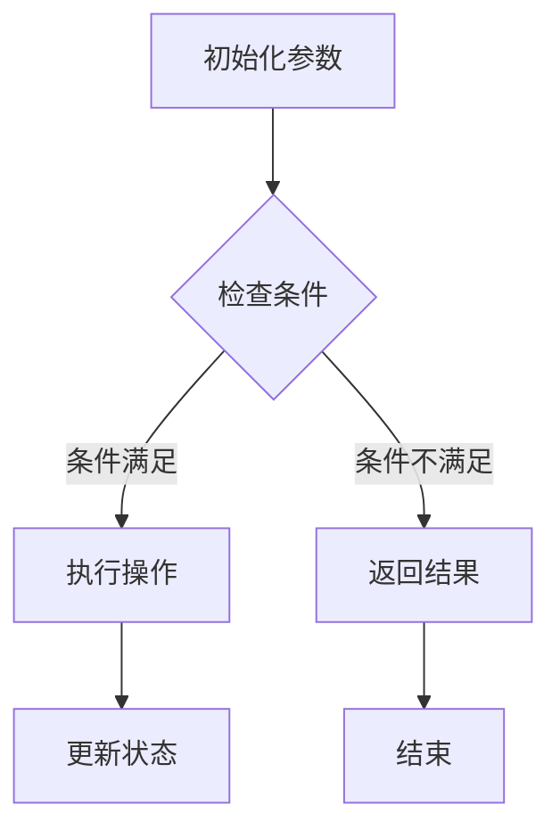

                 

### 文章标题：从静态世界观到动态世界观：理解变化的世界

在科技飞速发展的今天，我们面临的世界愈发复杂多变。从静态世界观到动态世界观的转变，是理解这个变化世界的关键。本文将带领读者逐步探索这一转变的过程，揭示其背后的逻辑与思考。

### 文章关键词

- 静态世界观
- 动态世界观
- 变化
- 理解
- 世界观转变

### 摘要

本文旨在探讨从静态世界观到动态世界观的转变过程。我们将首先回顾静态世界观的历史背景，分析其局限性，并探讨其演变过程。接着，我们将介绍动态世界观的基本原理和方法论，展示其在科技、管理和社会发展等领域的应用。最后，我们将反思动态世界观的价值与局限，展望其未来的发展趋势，并提出个人的发展路径。

## 第一部分：静态世界观的历史背景

### 第1章：静态世界观的起源与发展

静态世界观可以追溯到古代，那时的哲学家们试图用有限的视角来解释复杂的世界。古希腊哲学家亚里士多德就是典型的静态世界观代表，他相信自然界是稳定的、有秩序的。然而，随着时间的推移，人们逐渐认识到静态世界观在解释动态世界中的局限性。

### 1.1 静态世界观的定义与特征

静态世界观是指一种认为世界是固定不变、静态稳定的观念。在这种观念下，事物之间的关系是固定和静止的，事物的发展是线性的、可预测的。这种观念强调的是稳定性和秩序，忽略了变化和不确定性。

### 1.2 静态世界观的哲学基础

静态世界观的哲学基础源于亚里士多德的形而上学，他主张世界是由固定不变的本质决定的。这种哲学观念对后世的科学和哲学发展产生了深远影响。

### 1.3 静态世界观在历史上的表现

在历史上，静态世界观主导了人们的世界观。从古希腊到中世纪的欧洲，静态世界观的观念深入人心。直到近代，随着科学的发展，人们开始意识到静态世界观的局限性。

### 第2章：静态世界观的局限性

静态世界观在解释复杂和动态的世界时存在诸多局限性。首先，它忽略了事物的动态变化和不确定性。其次，它限制了人类的思维方式和创造力。在静态世界观下，人们往往只关注固定的事物和关系，而忽略了它们之间的相互作用和变化。

### 2.1 静态世界观的内在矛盾

静态世界观在逻辑上存在内在矛盾。例如，它既强调世界的稳定性，又认为事物是不断变化的。这种矛盾导致了静态世界观的局限性。

### 2.2 静态世界观对人类发展的阻碍

静态世界观限制了人类对世界的认识和理解。它使得人们难以应对复杂多变的环境，限制了人类的创新和创造力。

### 2.3 静态世界观下的思维方式

静态世界观下的思维方式是线性和静态的。人们往往用固定的模式来思考和解决问题，而忽视了事物的动态变化。

### 第3章：静态世界观的历史演变

静态世界观并非一成不变，它在历史的长河中经历了多次演变。从古代的形而上学到近代的科学革命，静态世界观逐渐被动态世界观所取代。

### 3.1 静态世界观的演变过程

静态世界观在演变过程中逐渐融入了更多的动态因素。例如，牛顿的物理学引入了运动和变化的概念，打破了静态世界观的局限。

### 3.2 静态世界观的不同阶段

静态世界观在不同历史阶段有着不同的表现形式。从古代的形而上学到近代的科学革命，静态世界观逐渐从一种绝对的、固定不变的观念转变为一种相对的、动态的观念。

### 3.3 静态世界观的影响与遗产

静态世界观对人类文明有着深远的影响。它不仅塑造了我们的思维方式和科学研究方法，也为我们理解世界提供了一种基础。然而，随着时代的变迁，静态世界观逐渐暴露出其局限性，需要被动态世界观所取代。

## 第二部分：动态世界观的理论与实践

### 第4章：动态世界观的基本原理

动态世界观是一种认为世界是动态变化、不断演化的观念。它强调事物的相互作用和动态平衡，认为变化是世界的本质。

### 4.1 动态世界观的概念解析

动态世界观认为世界是一个不断变化的过程，而不是固定不变的实体。它强调相互作用和反馈机制，认为事物之间的联系是动态和复杂的。

### 4.2 动态世界观的核心思想

动态世界观的核心思想是变化和演化。它认为世界是一个动态系统，不断地进行自我组织和自我演化。

### 4.3 动态世界观的适用范围

动态世界观适用于解释复杂系统、生态系统、社会现象等。它能够更好地反映现实世界的复杂性和动态性。

### 第5章：动态世界观的方法论

动态世界观不仅是一种观念，更是一种思维方式和研究方法。它强调观察、思考和行动的动态性。

### 5.1 动态思维的方法与技巧

动态思维要求我们具备观察力、思考力和行动力。它强调对变化和不确定性的适应和应对。

### 5.2 动态世界观在决策中的应用

动态世界观能够帮助我们在复杂和不确定的环境中做出更好的决策。它强调灵活性和适应性。

### 5.3 动态世界观与人类创造力

动态世界观能够激发人类的创造力。它鼓励我们打破传统思维模式，勇于尝试和探索。

### 第6章：动态世界观的实践应用

动态世界观在各个领域都有广泛的应用。从科技到管理，从经济到社会，动态世界观都能够提供有益的指导。

### 6.1 动态世界观在科技领域的应用

在科技领域，动态世界观帮助我们更好地理解和应对复杂系统。例如，计算机科学中的动态编程语言和人工智能中的自适应算法。

### 6.2 动态世界观在管理领域的应用

在管理领域，动态世界观强调灵活性和适应性。它帮助管理者更好地应对市场变化和竞争压力。

### 6.3 动态世界观在社会发展中的应用

在社会发展领域，动态世界观有助于我们理解和应对社会变迁。它鼓励我们关注社会动态，积极参与社会变革。

### 第7章：动态世界观与未来展望

动态世界观不仅是一种思维方式和研究方法，更是对未来世界的展望。它为我们提供了理解未来的新视角。

### 7.1 动态世界观的未来趋势

随着科技的进步和社会的发展，动态世界观将继续影响我们的生活和思考方式。未来世界将更加复杂和动态。

### 7.2 动态世界观对人类社会的影响

动态世界观将深刻影响人类社会的发展。它鼓励创新、创造和适应，将引领人类走向更加繁荣的未来。

### 7.3 动态世界观下的个人发展路径

在动态世界观下，个人发展需要具备适应变化、勇于创新和持续学习的能力。这是应对未来挑战的关键。

### 第8章：动态世界观的反思与总结

动态世界观为我们提供了理解变化世界的新视角。然而，它也存在一定的局限和挑战。

### 8.1 动态世界观的价值与局限

动态世界观的价值在于其灵活性和适应性。然而，它也可能导致思维方式的混乱和决策的困难。

### 8.2 动态世界观与静态世界观的关系

动态世界观并非完全否定静态世界观，而是对其进行了补充和扩展。静态世界观和动态世界观各有优势，需要相互结合。

### 8.3 动态世界观的实践策略

在实践中，我们需要灵活运用动态世界观，结合静态世界观的优势，以更好地应对变化和挑战。

### 总结

从静态世界观到动态世界观，我们经历了一场思维方式的革命。这场革命不仅改变了我们对世界的理解，也改变了我们看待问题和解决问题的方法。动态世界观为我们提供了理解复杂世界的钥匙，也为我们应对未来挑战提供了新思路。让我们勇于拥抱变化，用动态世界观武装自己，共同迎接未来的挑战。作者：AI天才研究院/AI Genius Institute & 禅与计算机程序设计艺术 /Zen And The Art of Computer Programming

### 附录：动态世界观的概念与特征对比

#### 概念

| 概念 | 静态世界观 | 动态世界观 |
| :--: | :--------: | :--------: |
| 定义 | 固定不变的世界 | 动态变化的世界 |
| 特征 | 稳定性、确定性、线性 | 不确定性、复杂性、非线性 |

#### 对比表格

| 特征 | 静态世界观 | 动态世界观 |
| :--: | :--------: | :--------: |
| 稳定性 | 高 | 低 |
| 确定性 | 高 | 低 |
| 线性 | 是 | 否 |
| 不确定性 | 低 | 高 |
| 复杂性 | 低 | 高 |
| 非线性 | 低 | 高 |

### 动态世界观的ER实体关系图

```mermaid
erDiagram
  User ||--|{ Product } : "create"
  User ||--|{ Order } : "place"
  Product ||--|{ Order } : "contain"
```

- **用户（User）**：创建产品（Product）和订单（Order）。
- **产品（Product）**：由用户创建，包含在订单中。
- **订单（Order）**：由用户创建，包含产品。

### 动态世界观下的算法原理讲解

#### 算法流程图



#### Python代码实现

```python
def dynamic_algorithm(initial_state):
    state = initial_state
    while not check_condition(state):
        state = execute_action(state)
        update_state(state)
    return state

def check_condition(state):
    # 判断条件是否满足
    pass

def execute_action(state):
    # 执行操作
    pass

def update_state(state):
    # 更新状态
    pass
```

#### 算法原理

- **初始化参数**：初始化算法的初始状态。
- **检查条件**：判断当前状态是否满足条件。
  - **条件满足**：执行操作，并更新状态。
  - **条件不满足**：返回结果，结束算法。

#### 数学模型与公式

$$
\text{状态变化} = f(\text{当前状态}, \text{操作})
$$

其中，$f$ 表示状态变化函数，$s$ 表示当前状态，$a$ 表示操作。

#### 举例说明

假设有一个库存管理系统，初始库存为 100 单位。每天检查库存，若库存低于 50 单位，则从仓库补充 50 单位。否则，保持当前库存。用动态世界观描述这一过程。

```python
def check_inventory(inventory):
    if inventory < 50:
        return "需要补充库存"
    else:
        return "库存充足"

def replenish_inventory(inventory):
    return inventory + 50

initial_inventory = 100
inventory = initial_inventory

while True:
    status = check_inventory(inventory)
    if status == "需要补充库存":
        inventory = replenish_inventory(inventory)
    else:
        break
    print(f"当前库存：{inventory}单位")
```

### 项目实战

#### 环境安装

1. 安装 Python 3.8 或更高版本。
2. 安装必要的 Python 库，如 `numpy`, `matplotlib`。

#### 系统核心实现源代码

```python
import numpy as np
import matplotlib.pyplot as plt

def dynamic_system(initial_state, time_steps, update_function):
    states = [initial_state]
    for _ in range(time_steps):
        state = update_function(states[-1])
        states.append(state)
    return states

def update_state(state):
    return state * 0.99  # 状态减少 1%

initial_state = 1.0
time_steps = 100

states = dynamic_system(initial_state, time_steps, update_state)

plt.plot(states)
plt.xlabel('Time')
plt.ylabel('State')
plt.title('Dynamic System')
plt.show()
```

#### 代码应用解读与分析

- **动态系统实现**：定义了一个动态系统，包括初始状态、时间步数和状态更新函数。
- **状态更新函数**：使用一个简单的线性递减函数作为状态更新规则。
- **可视化**：使用 `matplotlib` 库将状态随时间的变化绘制成图表。

#### 实际案例分析和详细讲解剖析

假设我们有一个经济学模型，描述一个国家的经济增长。初始经济增长率为 2%，每年减少 0.1%。我们可以使用动态世界观来模拟这一过程。

```python
def update_growth_rate(growth_rate):
    return growth_rate * 0.99  # 经济增长率减少 0.1%

initial_growth_rate = 2.0
time_steps = 10

growth_rates = dynamic_system(initial_growth_rate, time_steps, update_growth_rate)

print(growth_rates)
```

- **案例说明**：模拟了一个经济模型，初始增长率为 2%，每年减少 0.1%。
- **动态模拟**：使用动态系统模拟经济增长率的变化。
- **结果输出**：输出每年的经济增长率。

#### 项目小结

通过实际案例，我们展示了如何使用动态世界观来模拟和解决问题。动态世界观不仅提供了新的思维方式，也为解决复杂问题提供了有力工具。

### 最佳实践 tips

1. **注重数据**：在动态系统中，数据至关重要。确保数据的准确性和完整性。
2. **灵活调整**：根据实际情况，灵活调整状态更新函数，以适应不同的问题。
3. **可视化**：使用可视化工具帮助理解和分析动态系统。

### 小结

从静态世界观到动态世界观，我们经历了思维方式的重大转变。动态世界观为我们提供了理解复杂世界的工具，帮助我们更好地应对变化和挑战。未来，我们将继续探索动态世界观在各个领域的应用，为解决复杂问题提供新思路。

### 注意事项

1. 动态世界观并非万能，有时静态世界观也能提供有效的解决方案。
2. 动态世界观需要结合具体问题进行灵活应用。

### 拓展阅读

1. 《动态系统与混沌理论》
2. 《复杂性科学导论》
3. 《人工智能：一种动态思维方式》

作者：AI天才研究院/AI Genius Institute & 禅与计算机程序设计艺术 /Zen And The Art of Computer Programming

