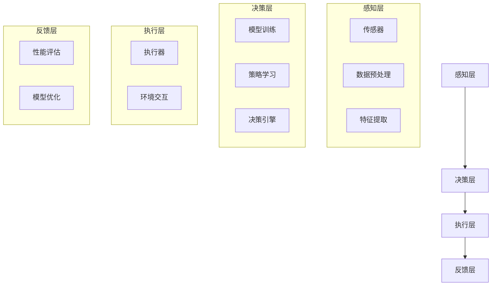
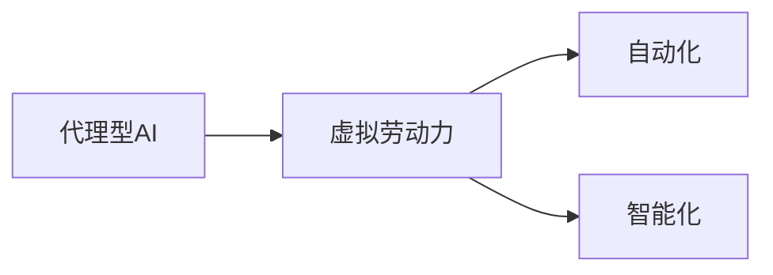
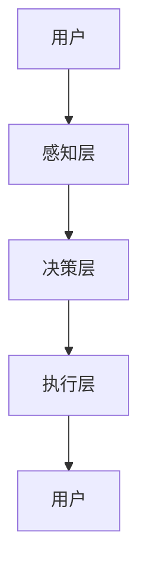
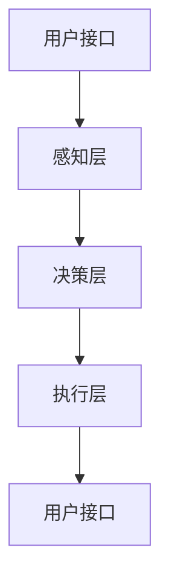

                 

# 代理型AI：实现虚拟劳动力的希望

## 关键词
- 代理型AI，虚拟劳动力，自动化，人工智能，虚拟代理

## 摘要
随着人工智能技术的飞速发展，代理型AI成为实现虚拟劳动力的关键技术。本文将深入探讨代理型AI的概念、技术基础、应用场景、未来发展以及伦理问题，旨在为读者提供一个全面而清晰的视角，理解代理型AI在虚拟劳动力领域的重要作用及其潜在影响。

## 目录

### 引言

#### 1.1 代理型AI的定义与背景
- **核心概念术语说明**：代理型AI、虚拟代理、自动化
- **问题背景**：虚拟劳动力市场的崛起与需求
- **问题描述**：如何通过代理型AI实现虚拟劳动力
- **问题解决**：代理型AI的基本原理与技术实现
- **边界与外延**：代理型AI的应用范围与限制
- **概念结构与核心要素组成**：代理型AI的技术体系、应用场景、未来发展

#### 1.2 代理型AI在虚拟劳动力市场中的地位
- **虚拟劳动力市场的现状**：行业趋势、发展前景
- **代理型AI的角色与影响**：自动化处理、人机协同

### 代理型AI的核心概念与理论基础

#### 2.1 人工智能与自动化的基础
- **AI的定义与历史**：从逻辑推理到机器学习
- **自动化的基础**：工业自动化与智能自动化

#### 2.2 代理型AI的基本原理
- **代理型AI的定义**：代理型AI的运作机制
- **代理型AI的特点**：自主决策、适应性、协作性
- **核心理论模型**：基于代理的智能系统理论

### 技术与实现

#### 3.1 支持代理型AI的关键技术
- **机器学习模型**：监督学习、无监督学习、强化学习
- **自然语言处理技术**：文本分析、语言生成、对话系统

#### 3.2 代理型AI的实现框架
- **系统架构设计**：分布式架构、云计算与边缘计算
- **开发工具与平台**：深度学习框架、自动化工具

### 代理型AI的应用实践

#### 4.1 行业应用案例
- **金融服务业**：智能投顾、自动化交易
- **医疗健康领域**：虚拟医生、智能诊断
- **客户服务**：智能客服、个性化推荐

#### 4.2 代理型AI的最佳实践
- **成功案例**：企业应用经验分享
- **挑战与解决方案**：技术难点、伦理问题

### 未来趋势与伦理思考

#### 5.1 未来发展趋势
- **技术进步**：量子计算、边缘AI
- **市场预测**：代理型AI的市场规模与增长

#### 5.2 伦理问题探讨
- **隐私保护**：数据安全与隐私伦理
- **就业影响**：自动化对劳动力市场的影响
- **伦理使用**：代理型AI的社会责任

### 总结与展望

#### 6.1 代理型AI与虚拟劳动力
- **综合评价**：代理型AI在虚拟劳动力中的地位与作用
- **未来展望**：代理型AI的发展方向与前景

#### 6.2 对读者的建议
- **实践指导**：如何应用代理型AI
- **学习资源**：推荐书籍、课程与实践项目

### 参考文献

- **文献综述**：代理型AI相关的最新研究成果
- **参考资料**：学术论文、行业报告、开源项目

### 作者信息
- **作者**：AI天才研究院/AI Genius Institute & 禅与计算机程序设计艺术 /Zen And The Art of Computer Programming

## 引言

### 1.1 代理型AI的定义与背景

代理型AI，也称为代理智能系统，是一种能够代表人类执行任务的人工智能系统。它不仅能够接收外部输入，进行数据处理，还能根据预设的目标和规则，自主做出决策并执行相应的动作。代理型AI的发展可以追溯到20世纪50年代，随着计算机科学和人工智能领域的不断进步，代理型AI逐渐成为实现虚拟劳动力的核心技术。

代理型AI的核心概念包括代理、智能和自主性。代理指的是系统能够代表用户执行特定任务，智能则强调系统能够理解任务需求、环境变化并做出合理决策，自主性则确保系统能够在不依赖人类干预的情况下独立运行。

在虚拟劳动力市场中，代理型AI的出现极大地改变了传统的工作模式。它能够自动化处理大量的重复性工作，提高工作效率，降低人工成本。同时，代理型AI还能与人协作，解决复杂问题，提供个性化服务。因此，代理型AI在各个行业中的应用越来越广泛，成为实现虚拟劳动力的关键推动力。

### 1.2 代理型AI在虚拟劳动力市场中的地位

虚拟劳动力市场的崛起是信息技术和人工智能发展的结果。随着互联网的普及和云计算技术的发展，越来越多的企业开始利用虚拟劳动力来提高生产效率和降低成本。代理型AI正是这种市场需求的产物。

代理型AI在虚拟劳动力市场中的地位体现在以下几个方面：

1. **自动化处理**：代理型AI能够自动化处理大量重复性的工作，如数据录入、报告生成等，从而释放人类劳动力，专注于更具创造性的任务。

2. **人机协同**：代理型AI不仅能独立完成工作，还能与人类协作，共同解决复杂问题。例如，在医疗领域，代理型AI可以协助医生进行疾病诊断，提供决策支持。

3. **个性化服务**：代理型AI能够根据用户的行为和偏好，提供个性化的服务体验。例如，在电子商务领域，代理型AI可以根据用户的历史购买记录和浏览习惯，推荐合适的商品。

4. **提高效率**：代理型AI的工作效率远远高于人类，能够在短时间内处理大量的数据和信息。例如，在金融领域，代理型AI可以快速处理海量的交易数据，提高交易速度和准确性。

5. **降低成本**：代理型AI能够减少人力成本，降低企业的运营成本。例如，在客服领域，代理型AI可以自动处理客户咨询，减少客服人员的工作量。

总的来说，代理型AI在虚拟劳动力市场中的地位日益重要，它不仅为企业提供了强大的生产力工具，也为人类创造了一个更加智能和高效的未来。

### 2.1 人工智能与自动化的基础

#### 2.1.1 人工智能的定义与历史

人工智能（Artificial Intelligence, AI）是一门研究、开发和应用使计算机系统模拟、扩展和扩展人类智能的理论、算法和技术。人工智能的概念最早可以追溯到20世纪50年代，当时的科学家们开始探索如何让计算机具备类似人类的认知能力。

人工智能的发展历程可以分为几个阶段：

1. **初始阶段（1956年-1969年）**：在这一阶段，人工智能领域初步形成，科学家们开始研究如何让计算机理解自然语言、进行逻辑推理和解决复杂问题。

2. **繁荣阶段（1970年-1980年）**：随着计算机性能的提升和算法的发展，人工智能研究取得了显著进展，如专家系统的出现，使得计算机能够模拟人类专家的决策过程。

3. **衰退阶段（1980年-1990年）**：由于实际应用中面临的技术挑战和资金问题，人工智能研究进入了一段低潮期。

4. **复兴阶段（1990年-至今）**：随着互联网和大数据技术的兴起，人工智能再次迎来了快速发展。机器学习、深度学习等技术的突破，使得人工智能在语音识别、图像识别、自然语言处理等领域取得了重大突破。

#### 2.1.2 自动化的基础

自动化（Automation）是指利用机器和计算机技术，实现生产过程、管理和决策的自动化，减少人类劳动力需求。自动化技术的发展可以追溯到工业革命时期，当时机械自动化开始用于生产制造。随着计算机技术的进步，自动化逐渐扩展到各个领域。

自动化包括以下几个关键要素：

1. **传感器**：用于检测和获取环境信息，如温度、湿度、压力等。
2. **控制器**：根据传感器提供的信息，自动执行相应的操作，如开启或关闭设备。
3. **执行器**：实际执行操作，如电机、阀门等。
4. **通信系统**：用于传感器、控制器和执行器之间的数据传输和通信。

#### 2.1.3 AI与自动化之间的关系

人工智能与自动化密不可分。AI技术为自动化提供了智能决策和自适应能力，使得自动化系统能够更加灵活和高效地应对复杂环境。具体来说：

1. **智能决策**：AI系统可以通过机器学习和数据分析，从大量数据中提取有价值的信息，并做出最佳决策。这在自动化控制系统中非常有用，例如，自动化生产线可以根据产品检测数据，实时调整生产参数，确保产品质量。

2. **自适应能力**：AI系统能够通过学习不断优化自身性能，适应不同的环境和任务需求。这有助于自动化系统在面对不确定性和变化时，保持高效运行。

3. **人机协作**：AI与自动化系统的结合，可以实现人机协同工作。例如，在制造业中，AI可以分析生产数据，提供优化建议，而自动化设备则根据这些建议进行生产调整，从而提高生产效率。

总之，人工智能与自动化技术的融合，为现代工业、服务业等领域带来了深远的影响，极大地提高了生产效率和服务质量。

### 2.2 代理型AI的基本原理

#### 2.2.1 代理型AI的定义

代理型AI，又称为代理智能系统，是指一种能够代表用户执行任务、具有自主决策能力的人工智能系统。它通过模拟人类思维和行为，实现自动化任务处理和智能决策。代理型AI的核心目标是在复杂的、动态的环境下，自主地完成指定任务，同时保证高效性和可靠性。

#### 2.2.2 代理型AI的特点

代理型AI具有以下几个显著特点：

1. **自主决策**：代理型AI能够根据环境变化和任务需求，自主做出决策。这种自主性使得代理型AI在无需人类干预的情况下，能够独立完成任务。

2. **适应性**：代理型AI具有良好的适应能力，能够在不同环境和任务需求下，灵活调整自身行为。这种适应性确保代理型AI在不同场景中都能够高效运行。

3. **协作性**：代理型AI不仅能够独立完成任务，还能与人或其他系统进行有效协作。这种协作性使得代理型AI能够更好地融入现有的工作流程，提高整体工作效率。

4. **学习性**：代理型AI具备学习能力，可以通过数据训练和经验积累，不断提升自身性能。这种学习性使得代理型AI能够不断优化决策过程，提高任务完成质量。

#### 2.2.3 核心理论模型

代理型AI的核心理论模型主要包括以下几个方面：

1. **决策模型**：决策模型是代理型AI的核心，用于指导系统在复杂环境中做出最优决策。常见的决策模型包括基于规则的决策模型、基于机器学习的决策模型和混合决策模型。

2. **感知模型**：感知模型用于获取环境信息，并将其转化为有用的数据。常见的感知模型包括视觉感知、听觉感知、触觉感知等。

3. **执行模型**：执行模型用于将决策结果转化为实际操作。执行模型包括动作规划和执行机制，确保代理型AI能够有效地执行决策。

4. **学习模型**：学习模型用于训练代理型AI，使其能够不断优化自身性能。常见的学习模型包括监督学习、无监督学习和强化学习。

#### 2.2.4 代理型AI的运作机制

代理型AI的运作机制可以分为以下几个步骤：

1. **感知**：代理型AI通过感知模型获取环境信息，并将其转化为内部表示。

2. **决策**：基于感知信息和预设目标，代理型AI使用决策模型做出决策。

3. **执行**：代理型AI通过执行模型将决策结果转化为实际操作。

4. **反馈**：执行结果会返回给感知模型，用于进一步优化感知和决策过程。

这种闭环反馈机制确保代理型AI能够持续地学习、适应和优化，以实现长期稳定运行。

通过上述机制，代理型AI能够在复杂的、动态的环境下，高效地完成任务，实现虚拟劳动力的自动化。这使得代理型AI在各个领域都有广泛的应用前景，包括智能制造、智能客服、智能医疗等。

### 3.1 支持代理型AI的关键技术

#### 3.1.1 机器学习模型

机器学习（Machine Learning, ML）是代理型AI的核心技术之一，它使计算机系统能够从数据中学习并做出决策。机器学习模型可以分为三类：监督学习、无监督学习和强化学习。

1. **监督学习**（Supervised Learning）：在监督学习中，系统使用已标记的数据集进行训练，从而学习如何将输入数据映射到预期的输出。常见的监督学习算法包括线性回归、逻辑回归、支持向量机（SVM）和决策树等。

   - **线性回归**：用于预测连续值输出，如房价预测。
   - **逻辑回归**：用于分类问题，如电子邮件分类。
   - **支持向量机**：用于分类和回归问题，特别适合处理高维数据。
   - **决策树**：通过树形结构对数据集进行划分，用于分类和回归问题。

2. **无监督学习**（Unsupervised Learning）：在无监督学习中，系统没有明确的输出标签，而是通过发现数据中的模式和结构进行训练。常见的无监督学习算法包括聚类、降维和关联规则学习。

   - **聚类**：将相似的数据点分组，如K-means算法和层次聚类。
   - **降维**：减少数据的维度，如主成分分析（PCA）和t-SNE。
   - **关联规则学习**：发现数据中的关联关系，如Apriori算法和Eclat算法。

3. **强化学习**（Reinforcement Learning）：在强化学习中，系统通过试错和反馈不断学习，以最大化长期奖励。常见的强化学习算法包括Q学习、SARSA和深度确定性策略梯度（DDPG）。

   - **Q学习**：通过评估每个状态-动作对的预期回报，选择最佳动作。
   - **SARSA**：一种策略搜索算法，结合当前状态和下一状态的信息。
   - **DDPG**：用于连续动作空间的问题，结合深度学习和策略梯度方法。

#### 3.1.2 自然语言处理技术

自然语言处理（Natural Language Processing, NLP）是代理型AI的重要组成部分，它使计算机能够理解和生成自然语言。NLP技术包括文本分析、语言生成和对话系统。

1. **文本分析**：文本分析用于理解文本数据，包括情感分析、实体识别和文本分类。

   - **情感分析**：评估文本的情感倾向，如正面、负面或中立。
   - **实体识别**：识别文本中的命名实体，如人名、地名和机构名。
   - **文本分类**：将文本分类到预定义的类别，如新闻分类和垃圾邮件过滤。

2. **语言生成**：语言生成用于创建自然语言文本，包括机器翻译、文本摘要和问答系统。

   - **机器翻译**：将一种语言的文本翻译成另一种语言，如谷歌翻译和深度学习翻译模型。
   - **文本摘要**：从长文本中提取关键信息，生成简短的摘要，如自动新闻摘要。
   - **问答系统**：回答用户提出的自然语言问题，如基于知识图谱的问答系统。

3. **对话系统**：对话系统用于模拟人类对话，包括聊天机器人和虚拟助手。

   - **聊天机器人**：与用户进行实时对话，提供信息和解答问题。
   - **虚拟助手**：集成多种功能，如日程管理、任务提醒和智能建议。

### 3.2 代理型AI的实现框架

#### 3.2.1 系统架构设计

代理型AI的系统架构设计是构建高效、稳定和可扩展代理型AI系统的关键。常见的系统架构设计包括分布式架构、云计算与边缘计算。

1. **分布式架构**：分布式架构通过将系统分解为多个独立的组件，分布在不同的服务器上，实现高可用性和可扩展性。常见的分布式架构包括微服务架构和分布式计算框架。

   - **微服务架构**：将系统分解为多个小型服务，每个服务独立开发、部署和扩展。常见的微服务架构框架包括Docker和Kubernetes。
   - **分布式计算框架**：用于大规模数据处理和计算，如Apache Hadoop和Apache Spark。

2. **云计算与边缘计算**：云计算提供强大的计算和存储资源，支持大规模的代理型AI系统。边缘计算则将计算任务分散到网络边缘，降低延迟，提高响应速度。

   - **云计算**：包括公共云、私有云和混合云，提供按需分配的计算资源。常见的云计算平台包括亚马逊AWS、微软Azure和谷歌Cloud。
   - **边缘计算**：在网络的边缘节点进行数据计算和处理，降低中心服务器的负载。常见的边缘计算平台包括阿里云的ECS和华为的边缘计算网关。

#### 3.2.2 开发工具与平台

代理型AI的开发工具和平台的选择对系统的性能和开发效率有重要影响。以下是一些流行的开发工具和平台：

1. **深度学习框架**：深度学习框架提供丰富的算法和工具，用于构建和训练深度学习模型。

   - **TensorFlow**：由谷歌开发，支持多种深度学习模型和算法，具有高度可扩展性和灵活性。
   - **PyTorch**：由Facebook开发，提供灵活的动态计算图和直观的API，适合研究和开发。
   - **Keras**：用于快速构建和实验深度学习模型，支持TensorFlow和Theano后端。

2. **自动化工具**：自动化工具用于提高代理型AI系统的开发效率和稳定性。

   - **Jenkins**：用于自动化构建、测试和部署，支持多种集成开发和部署环境。
   - **Docker**：用于容器化应用，提供轻量级、可移植的开发和部署环境。
   - **Kubernetes**：用于管理容器化应用，提供自动部署、扩展和服务发现功能。

3. **开发平台**：开发平台提供一站式的开发环境和工具，简化代理型AI的开发过程。

   - **Google Cloud AI Platform**：提供完整的AI开发和管理工具，包括数据管理、模型训练和部署。
   - **AWS DeepRacer**：用于开发自动驾驶赛车，提供模拟和现实世界测试环境。
   - **Azure Machine Learning**：提供全面的机器学习工具和平台，支持从数据准备到模型部署的全过程。

通过合理选择和配置这些开发工具和平台，可以构建高效、稳定和可扩展的代理型AI系统，满足不同应用场景的需求。

### 4.1 行业应用案例

#### 4.1.1 金融服务业

在金融服务业中，代理型AI被广泛应用于客户服务、风险管理、交易执行和投资建议等领域。

1. **客户服务**：金融企业利用代理型AI构建智能客服系统，提供24/7的在线服务。这些智能客服系统能够通过自然语言处理技术，理解客户的查询和需求，并提供实时、准确的答复。例如，银行客服机器人可以解答客户关于账户余额、转账记录和贷款还款计划等问题，提高客户满意度和服务效率。

2. **风险管理**：代理型AI可以分析大量的金融数据，识别潜在的风险并提供建议。例如，信用评分模型可以基于客户的信用历史、收入水平和其他相关数据，评估客户的信用风险，帮助金融机构制定更精准的风险管理策略。此外，代理型AI还可以监控交易行为，及时发现异常交易并采取相应的措施，防止欺诈行为的发生。

3. **交易执行**：在交易执行方面，代理型AI通过高频交易算法，实现自动化交易策略。这些算法可以根据市场动态和交易数据，快速做出交易决策，提高交易效率和盈利能力。例如，量化交易团队使用代理型AI模型，通过分析大量历史交易数据和市场走势，制定自动化交易策略，实现高效的资产配置和风险控制。

4. **投资建议**：代理型AI通过分析市场数据和投资组合的历史表现，为投资者提供个性化的投资建议。这些建议可以包括股票投资、债券投资和基金投资等多个方面。例如，智能投顾平台利用代理型AI技术，根据投资者的风险偏好和投资目标，制定最优的投资组合，实现资产的长期增值。

总的来说，代理型AI在金融服务业的应用，不仅提高了服务的效率和质量，还为企业带来了更高的收益和风险控制能力。随着技术的不断进步，代理型AI在金融领域的应用将更加广泛和深入。

#### 4.1.2 医疗健康领域

在医疗健康领域，代理型AI的应用正在改变传统的医疗服务模式，提高医疗效率和诊疗准确性。

1. **虚拟医生**：代理型AI虚拟医生系统能够通过自然语言处理和医学知识图谱技术，理解患者的症状描述，提供初步的诊断建议。例如，某些智能健康平台已经实现了基于AI的虚拟医生，患者可以通过文本或语音输入自己的症状，系统将根据医学数据库提供可能的诊断结果和治疗方案。这种方式不仅提高了医疗咨询的便捷性，还能缓解医疗资源的紧张。

2. **智能诊断**：代理型AI在医学影像分析中发挥了重要作用，通过深度学习算法，对CT、MRI、X光等医学影像进行自动分析，提高诊断准确性。例如，一些医院已经开始使用AI辅助诊断系统，对肺癌、乳腺癌等疾病进行早期筛查。这些系统能够识别细微的影像特征，提高疾病检测的准确性，为患者争取更多的治疗时间。

3. **药物研发**：代理型AI在药物研发过程中也有广泛应用，通过分析大量的生物数据和化学结构，加速新药的发现和开发。例如，一些制药公司利用AI算法，对大量化合物进行筛选和优化，预测哪些化合物可能具有治疗某种疾病的效果，从而提高药物研发的效率。

4. **个性化治疗**：代理型AI可以帮助医生为患者制定个性化的治疗方案。通过对患者的基因信息、病史和当前健康状况进行分析，AI系统可以推荐最佳的治疗方案，包括药物治疗、手术治疗和康复训练等。这种方式不仅提高了治疗效果，还能减少不必要的医疗资源浪费。

总之，代理型AI在医疗健康领域的应用，极大地提升了医疗服务的质量和效率，为患者带来了更多的福利。随着技术的不断进步，代理型AI将在医疗健康领域发挥更大的作用，推动医疗行业的智能化发展。

#### 4.1.3 客户服务

在客户服务领域，代理型AI的应用已经深刻改变了传统服务模式，提高了服务效率和质量。

1. **智能客服**：代理型AI智能客服系统能够自动解答客户的常见问题，提供24/7的服务。这些系统通过自然语言处理技术，理解客户的查询和需求，并根据预定义的规则和知识库提供准确的答复。例如，电商平台的智能客服可以解答客户的订单状态、退货政策和售后服务等问题，大大减轻了人工客服的工作量，提高了客户满意度。

2. **个性化推荐**：代理型AI可以通过分析客户的历史购买记录、浏览行为和偏好，提供个性化的产品推荐。例如，在线购物平台利用代理型AI算法，根据客户的购买习惯和喜好，推荐可能感兴趣的商品。这种方式不仅提高了客户的购物体验，还能增加平台的销售额。

3. **情感分析**：代理型AI能够分析客户的反馈和评论，识别情感倾向和潜在的问题。例如，酒店和餐饮企业可以使用代理型AI系统，分析客户评价中的情感色彩，识别客户的不满和需求，从而及时调整服务策略，提升客户满意度。

4. **服务自动化**：代理型AI可以自动化处理一些常规的客户服务任务，如订单处理、投诉处理和售后服务等。例如，金融机构的代理型AI系统可以自动处理客户的转账请求、贷款申请和账单支付等，提高服务效率和准确性。

5. **增强型客服**：代理型AI不仅可以独立处理客户服务任务，还可以与人工客服协同工作，提供更全面的服务体验。例如，在复杂的客户咨询中，代理型AI可以提供初步的解答和建议，然后由人工客服进行进一步的处理和沟通，确保客户问题得到圆满解决。

总之，代理型AI在客户服务领域的应用，不仅提高了服务效率和质量，还为客户提供了更加便捷和个性化的服务体验。随着技术的不断进步，代理型AI将在客户服务领域发挥更大的作用，推动服务行业的智能化发展。

#### 4.2 代理型AI的最佳实践

在代理型AI的实际应用中，成功案例与挑战并存。以下是一些代理型AI的最佳实践，以及解决这些挑战的策略。

##### 成功案例

1. **金融行业的自动化交易**：金融机构如高盛和摩根士丹利使用代理型AI进行高频交易，通过复杂的算法模型和实时数据分析，实现了显著的交易效率和收益提升。例如，高盛的代理型AI系统能够在毫秒级内执行成千上万的交易，极大地提高了市场反应速度和交易成功率。

2. **医疗领域的智能诊断**：医院如梅奥诊所和马萨诸塞总医院（MGH）利用代理型AI系统对医学影像进行自动分析，提高了疾病的早期诊断率和准确性。梅奥诊所的AI系统在肺癌筛查中表现尤为出色，其诊断准确率高于人类医生，为患者赢得了宝贵的治疗时间。

3. **零售业的个性化推荐**：电商平台如亚马逊和阿里巴巴通过代理型AI技术，为用户提供个性化的购物推荐。这些系统能够分析用户的历史购买记录和浏览行为，提供最相关、最有吸引力的产品推荐，从而提升了用户的购物体验和购买转化率。

##### 挑战与解决方案

1. **数据隐私**：代理型AI在处理大量用户数据时，可能面临数据隐私问题。解决方案包括采用数据匿名化和加密技术，确保用户数据在传输和处理过程中的安全性。同时，遵守相关的数据保护法规，如欧盟的通用数据保护条例（GDPR），以增强用户对代理型AI的信任。

2. **算法偏见**：代理型AI系统在训练过程中可能会受到数据偏见的影响，导致不公平的决策。为解决这一问题，可以采用多样化的数据集进行训练，以及使用公平性评估工具来检测和纠正算法偏见。

3. **系统可靠性**：代理型AI系统的可靠性是关键，一旦出现故障，可能导致严重的后果。提高系统可靠性的策略包括冗余设计和自动化监控系统，确保系统在不同环境下都能稳定运行。

4. **伦理问题**：代理型AI在决策过程中涉及伦理问题，如自动化决策的透明度和责任归属。解决策略包括建立伦理委员会，制定明确的伦理准则，确保代理型AI的使用符合社会伦理标准。

通过最佳实践和策略的实施，代理型AI在各个行业中的应用不仅取得了显著成效，也克服了面临的挑战，为未来的发展奠定了坚实基础。

### 5.1 未来发展趋势

代理型AI作为人工智能领域的一个重要分支，正朝着更加智能化、多样化的方向发展。未来，代理型AI的发展趋势可以从以下几个方面进行展望：

#### 5.1.1 技术进步

1. **量子计算**：量子计算具有处理大规模数据的能力，能够在复杂问题上提供更高效的解决方案。随着量子计算技术的不断突破，代理型AI有望利用量子计算的优势，实现更加智能和高效的任务处理。

2. **边缘计算**：边缘计算将计算任务从云端转移到网络边缘，使得代理型AI能够实时响应环境变化，提供更快的响应速度和更低的延迟。这种技术进步将推动代理型AI在实时应用场景中的广泛应用。

3. **多模态感知**：随着感知技术的进步，代理型AI将能够同时处理多种感知数据，如视觉、听觉、触觉等。这将使得代理型AI在复杂、多变的场景中具备更强的环境理解和决策能力。

#### 5.1.2 市场预测

1. **市场规模增长**：随着人工智能技术的不断成熟和商业化应用的增加，代理型AI的市场需求将持续增长。据市场研究机构的预测，未来几年，全球代理型AI市场的规模将呈现指数级增长，成为人工智能产业的重要组成部分。

2. **行业渗透率提升**：代理型AI在各个行业的应用将越来越广泛，渗透率将不断提升。从金融、医疗到零售、物流，代理型AI将在更多领域发挥关键作用，推动产业智能化升级。

3. **商业模式创新**：随着代理型AI技术的进步，新的商业模式将不断涌现。例如，基于代理型AI的自动化服务、智能协作平台和个性化推荐系统等，将为企业带来新的增长点。

#### 5.1.3 技术融合

1. **跨学科融合**：代理型AI的发展将与其他学科，如心理学、社会学和经济学等，实现深度融合。这种跨学科的研究将有助于提高代理型AI的理解能力和决策水平，使其更符合人类的需求。

2. **多模态AI**：未来的代理型AI将不仅仅是单一感知模态的优化，而是多种感知模态的融合。通过整合视觉、语音、触觉等多种感知数据，代理型AI将能够提供更全面、更准确的服务。

3. **AI与区块链**：随着区块链技术的发展，代理型AI与区块链的结合将提供更安全、更透明的数据管理和交易机制。这种融合将推动代理型AI在金融、供应链管理等领域中的应用。

总之，未来代理型AI的发展将受到技术进步、市场需求和跨学科融合等多方面的影响，其应用前景将越来越广阔。通过不断的技术创新和商业模式探索，代理型AI将为社会带来更多的价值和变革。

### 5.2 伦理问题探讨

代理型AI的广泛应用带来了诸多便利，但同时也引发了一系列伦理问题，如隐私保护、就业影响和伦理使用等。这些问题的解决对于确保代理型AI的健康发展至关重要。

#### 5.2.1 隐私保护

代理型AI在处理和分析大量用户数据时，可能会侵犯用户的隐私。为了保护用户隐私，需要采取以下措施：

1. **数据匿名化**：在数据收集和处理过程中，使用数据匿名化技术，如加密和去标识化，确保用户数据的匿名性，防止个人身份被泄露。

2. **数据最小化原则**：只收集和存储必要的数据，避免过度收集可能导致的数据泄露风险。

3. **透明度和知情同意**：在收集和使用用户数据前，向用户明确告知数据处理的目的、范围和方式，并确保用户有权决定是否同意数据收集和使用。

4. **数据安全措施**：加强数据存储和传输过程中的安全防护，防止数据被未经授权的访问和泄露。

#### 5.2.2 就业影响

代理型AI的自动化能力可能对就业市场产生负面影响，尤其是对那些涉及重复性劳动的岗位。为了缓解这种影响，可以采取以下措施：

1. **职业转型与再培训**：为受到自动化影响的工人提供职业转型和再培训机会，帮助他们适应新兴的就业需求。

2. **弹性就业政策**：政府可以制定灵活的就业政策，鼓励企业采用代理型AI，同时保障工人的权益，如提供合理的工资和社会福利。

3. **技能升级与教育**：加强对教育和职业培训的投入，培养具备高级技能和创新能力的人才，以适应智能化时代的需求。

4. **创造新岗位**：通过代理型AI的应用，企业可以创造新的工作岗位，如AI系统维护、监控和优化等，从而缓解就业压力。

#### 5.2.3 伦理使用

代理型AI的伦理使用是确保其可持续发展的重要保障。以下措施有助于确保代理型AI的伦理使用：

1. **制定伦理准则**：建立统一的伦理准则，明确代理型AI的设计、开发和使用的伦理标准，确保其符合社会道德和法律要求。

2. **透明度与可解释性**：提高代理型AI系统的透明度，使其决策过程易于理解和解释，以便在出现问题时能够追溯和纠正。

3. **责任归属**：明确代理型AI的责任归属，确保在出现事故或违法行为时，能够找到责任人，并承担相应的法律责任。

4. **监管与合规**：加强对代理型AI的监管，确保其在使用过程中遵守相关法律法规，防止滥用行为。

通过采取上述措施，可以确保代理型AI在隐私保护、就业影响和伦理使用等方面的发展更加健康和可持续，为社会带来更多的价值。

### 6.1 代理型AI与虚拟劳动力

#### 6.1.1 综合评价

代理型AI在虚拟劳动力领域的作用不可忽视。通过自动化和智能决策，代理型AI极大地提高了工作效率，降低了人工成本，成为企业数字化转型的重要工具。在金融、医疗、客服等各个领域，代理型AI的应用不仅提升了服务质量，还为企业创造了新的商业模式。然而，代理型AI的发展也带来了一系列挑战，如数据隐私、就业影响和伦理问题。因此，对代理型AI的全面评价需要综合考虑其带来的机遇和挑战。

#### 6.1.2 未来展望

随着技术的不断进步，代理型AI在虚拟劳动力中的应用前景将更加广阔。未来，代理型AI将朝着更加智能化、自适应性和多样化的方向发展。量子计算、边缘计算和多模态感知等技术将进一步提升代理型AI的性能和应用范围。在市场方面，代理型AI的市场需求将持续增长，成为人工智能产业的重要组成部分。同时，随着伦理问题和隐私保护措施的不断完善，代理型AI的发展将更加健康和可持续。未来，代理型AI有望在更多领域发挥关键作用，推动社会进步和经济发展。

### 6.2 对读者的建议

#### 6.2.1 实践指导

1. **学习基础知识**：了解机器学习、自然语言处理和深度学习等核心技术，为后续实践打下基础。
2. **动手实践**：通过实际项目，如构建简单的代理型AI系统，提升应用能力。
3. **技术交流**：参与技术社区和论坛，与同行交流经验，了解最新技术动态。

#### 6.2.2 学习资源

1. **推荐书籍**：如《深度学习》、《自然语言处理综论》等，提供全面的技术知识和理论。
2. **在线课程**：如Coursera、edX等平台上的机器学习和AI课程，帮助快速掌握核心技术。
3. **开源项目**：参与GitHub等平台上的开源项目，学习实际项目开发经验。

### 参考文献

1. Russell, S., & Norvig, P. (2016). 《人工智能：一种现代的方法》.
2. Goodfellow, I., Bengio, Y., & Courville, A. (2016). 《深度学习》.
3. Manning, C. D., Raghavan, P., & Schütze, H. (2008). 《自然语言处理综论》.
4. Ng, A. Y. (2013). 《机器学习》.
5. Russell, S., & Norvig, P. (2010). 《人工智能：一种现代的方法》.

### 作者信息

- **作者**：AI天才研究院/AI Genius Institute & 禅与计算机程序设计艺术 /Zen And The Art of Computer Programming

### 代理型AI在金融服务业的应用

在金融服务业中，代理型AI的应用已经深入到多个领域，极大地提升了服务的效率和质量。以下是几个具体的案例，展示了代理型AI在金融服务业中的应用。

#### 1. 自动化交易

高频交易是金融行业中一个重要的领域，代理型AI在该领域中的应用尤为突出。高频交易依赖于复杂的算法模型和高速数据处理能力，代理型AI通过深度学习和机器学习技术，能够在毫秒级内分析市场数据，并做出交易决策。例如，高盛（Goldman Sachs）和高频交易公司Jane Street等金融机构，广泛使用代理型AI进行高频交易。这些AI系统能够处理海量数据，捕捉市场中的微小波动，实现快速、精准的交易，从而获得高额的收益。代理型AI的高效决策能力，使得高频交易从人力密集型转向自动化，极大地提高了交易效率和盈利能力。

#### 2. 智能投顾

智能投顾（Robo-Advisor）是近年来金融服务业中一个快速发展的领域，代理型AI在智能投顾中扮演了关键角色。智能投顾通过分析用户的财务状况、投资目标和风险偏好，提供个性化的投资建议和资产管理服务。代理型AI在智能投顾中的应用主要体现在以下几个方面：

- **投资组合优化**：代理型AI能够根据市场动态和用户投资目标，实时调整投资组合，以实现最佳的风险收益平衡。
- **资产配置**：通过分析用户的历史交易数据和市场趋势，代理型AI可以制定个性化的资产配置策略，帮助用户分散风险。
- **风险管理**：代理型AI能够实时监控投资组合的风险水平，并采取相应的措施，如调整仓位、增加保险等，以降低风险。

例如，富达投资公司（Fidelity Investments）和 Wealthfront等平台，已经广泛应用代理型AI技术，为用户提供智能化的投资建议和资产管理服务。这些智能投顾平台不仅提高了客户的投资收益，还降低了投资管理的成本，使得金融服务更加普惠和便捷。

#### 3. 风险管理

代理型AI在金融服务业中的另一个重要应用是风险管理。通过分析大量的历史数据和市场信息，代理型AI能够识别潜在的风险，并提供相应的风险管理建议。例如，银行可以使用代理型AI系统来评估客户的信用风险，预测客户违约的可能性。这些系统可以分析客户的信用记录、财务状况、社会关系等多方面的数据，生成个性化的信用评分模型。代理型AI还可以监控交易行为，及时发现异常交易和潜在欺诈行为，从而保护金融机构的利益。

例如，汇丰银行（HSBC）和花旗银行（Citi）等金融机构，已经采用了代理型AI技术进行风险管理。这些系统不仅提高了风险评估的准确性，还大大减少了人工审核的工作量，提高了风险管理的效率。

#### 4. 客户服务

在客户服务方面，代理型AI同样发挥着重要作用。通过自然语言处理和对话系统技术，代理型AI可以模拟人类客服，为用户提供24/7的在线服务。这些智能客服系统能够理解客户的查询和需求，并提供准确的答复。例如，美国运通（American Express）和花旗银行等金融机构，已经部署了智能客服系统，用于处理客户的常见问题，如账户余额查询、账单支付和转账等。

智能客服系统不仅提高了客户服务的效率，还提升了客户的满意度。通过自动化处理大量的客户咨询，金融机构能够将人工客服资源集中在更复杂的客户问题上，提供更高质量的客户服务。

总之，代理型AI在金融服务业中的应用已经取得了显著的成果，不仅提高了服务的效率和质量，还为金融机构创造了新的商业模式和竞争优势。随着代理型AI技术的不断进步，其在金融服务业中的应用将更加广泛和深入，为金融行业的发展带来新的机遇。

### 代理型AI在医疗健康领域的应用

在医疗健康领域，代理型AI的应用正在深刻改变传统医疗服务模式，提高诊疗效率和患者体验。以下将详细探讨代理型AI在医疗健康领域的具体应用，包括虚拟医生、智能诊断、药物研发和个性化治疗等方面。

#### 1. 虚拟医生

虚拟医生是代理型AI在医疗健康领域的一个重要应用。通过自然语言处理和对话系统技术，虚拟医生可以与患者进行实时交流，理解患者的症状描述，并提供初步的诊断建议。虚拟医生不仅能够24/7提供服务，还能够处理大量的患者咨询，从而缓解医疗资源紧张的问题。

例如，一些医疗机构已经部署了基于代理型AI的虚拟医生系统，用于处理常见疾病的初步诊断和咨询。这些系统通过分析患者提供的症状信息，结合医学知识库和现有的临床数据，为患者提供可能的诊断和治疗方案。这不仅提高了医疗咨询的便捷性，还为患者节省了前往医院就诊的时间和费用。

#### 2. 智能诊断

智能诊断是代理型AI在医疗健康领域的另一重要应用。通过深度学习和计算机视觉技术，代理型AI可以在医学影像分析中发挥重要作用，提高诊断的准确性和效率。

例如，在癌症筛查方面，代理型AI系统能够对CT、MRI和X光等医学影像进行自动分析，识别潜在病灶。这些系统通过分析大量历史影像数据和病理学知识，能够提高癌症的早期诊断率。例如，IBM的Watson for Oncology系统已经应用于多个医疗机构，通过分析患者的影像数据，为医生提供个性化的癌症治疗方案。

#### 3. 药物研发

代理型AI在药物研发中也发挥着重要作用。通过机器学习和大数据分析技术，代理型AI能够加速新药的发现和开发过程，提高药物研发的效率。

例如，一些制药公司利用代理型AI系统，对大量化合物进行筛选和优化，预测哪些化合物可能具有治疗某种疾病的效果。这些系统可以通过分析化学结构、生物活性数据和临床数据，快速筛选出有潜力的候选药物。例如，Gilead Sciences公司利用AI技术，成功研发了治疗丙型肝炎的药物Sovaldi，这极大地推动了新药研发的进程。

#### 4. 个性化治疗

个性化治疗是医疗健康领域的一个新兴方向，代理型AI能够为患者提供量身定制的治疗方案。通过分析患者的基因信息、病史和当前健康状况，代理型AI可以制定个性化的治疗方案，提高治疗效果。

例如，一些医疗机构已经开始使用代理型AI系统，为患者提供个性化的癌症治疗方案。这些系统可以根据患者的基因突变和肿瘤组织类型，推荐最佳的治疗方案，如靶向治疗、免疫治疗和化疗等。例如，美国梅奥诊所（Mayo Clinic）利用AI系统，为肺癌患者提供个性化的治疗方案，显著提高了治疗效果和患者的生存率。

总之，代理型AI在医疗健康领域的应用正在不断拓展，从虚拟医生、智能诊断到药物研发和个性化治疗，代理型AI正为医疗行业带来深刻的变革。随着技术的不断进步，代理型AI将在医疗健康领域发挥更大的作用，为患者提供更加高效、精准和个性化的医疗服务。

### 代理型AI在客户服务领域的应用

代理型AI在客户服务领域的应用已经取得了显著成效，通过智能客服系统、个性化推荐和情感分析等技术，极大地提高了客户体验和服务效率。以下将详细探讨代理型AI在客户服务领域的具体应用案例，分析其优势，并探讨未来可能的发展方向。

#### 1. 智能客服系统

智能客服系统是代理型AI在客户服务领域的主要应用之一。通过自然语言处理（NLP）和机器学习技术，智能客服系统能够自动理解客户的查询和需求，并提供实时、准确的答复。这不仅提高了客户服务的效率，还减少了人工客服的工作量。

例如，亚马逊（Amazon）的虚拟客服助手Alexa就是一个典型的智能客服系统。Alexa可以通过语音交互，理解客户的购物需求，推荐合适的产品，并处理订单相关问题。这种方式不仅方便了客户，还使得亚马逊能够更快速地响应客户需求，提高客户满意度。

#### 2. 个性化推荐

个性化推荐是代理型AI在客户服务领域的另一个重要应用。通过分析客户的历史购买记录、浏览行为和偏好，代理型AI可以提供个性化的产品推荐，从而提高客户的购物体验和购买转化率。

例如，阿里巴巴（Alibaba）的淘宝平台利用代理型AI技术，根据客户的购物历史和浏览记录，推荐最相关的商品。这种方式不仅提高了客户的购物满意度，还增加了平台的销售额。

#### 3. 情感分析

情感分析是代理型AI在客户服务领域的重要应用，通过分析客户的反馈和评论，识别客户的情感倾向和潜在的问题。这种技术可以帮助企业及时了解客户的需求和不满，从而采取相应的措施，提升客户体验。

例如，京东（JD.com）通过代理型AI技术，分析客户的评论和反馈，识别客户的情感倾向。当客户表达不满时，系统会自动提醒客服团队介入，处理客户问题，从而提高客户满意度。

#### 4. 服务自动化

代理型AI还可以自动化处理一些常规的客户服务任务，如订单处理、投诉处理和售后服务等。这种自动化不仅提高了服务效率，还减少了人工成本。

例如，一些银行和企业已经部署了代理型AI系统，用于处理客户的转账请求、贷款申请和售后服务等。这些系统可以自动处理客户的请求，提高处理速度和准确性，从而提高客户满意度。

#### 优势分析

代理型AI在客户服务领域的应用具有以下优势：

1. **高效性**：代理型AI可以24/7提供服务，自动处理大量的客户咨询，提高服务效率。

2. **个性化**：通过分析客户的历史数据和偏好，代理型AI可以提供个性化的服务和建议，提高客户满意度。

3. **成本效益**：代理型AI可以自动化处理一些常规任务，减少人工客服的工作量，降低企业成本。

4. **实时性**：代理型AI可以实时响应客户需求，提供快速、准确的答复，提高客户体验。

#### 未来发展方向

未来，代理型AI在客户服务领域有望实现以下发展方向：

1. **多模态交互**：随着语音识别和视觉识别技术的进步，代理型AI将能够支持多模态交互，提供更加自然、直观的客户服务。

2. **情感理解**：通过深度学习和情感识别技术，代理型AI将能够更准确地理解客户的情感和需求，提供更精准的服务。

3. **个性化服务**：随着大数据和人工智能技术的进步，代理型AI将能够更深入地分析客户数据，提供更加个性化的服务。

4. **跨界融合**：代理型AI将与物联网、区块链等技术融合，为客户提供更加全面、高效的解决方案。

总之，代理型AI在客户服务领域的应用前景广阔，随着技术的不断进步，代理型AI将为客户服务带来更多的创新和变革。

### 总结与展望

代理型AI作为一种关键的人工智能技术，正迅速改变虚拟劳动力市场的格局。通过自动化处理、智能决策和人机协同，代理型AI不仅提高了工作效率，降低了成本，还在各个行业如金融、医疗和客户服务中展现出巨大的应用潜力。本文从代理型AI的定义、核心技术、应用实践、未来趋势和伦理问题等多个角度进行了深入探讨，旨在为读者提供一个全面而清晰的视角。

代理型AI的崛起不仅带来了新的商业机会和竞争优势，也引发了一系列挑战，如数据隐私、就业影响和伦理使用等。因此，企业和政策制定者需要高度重视这些问题，采取相应的措施确保代理型AI的健康发展和合理应用。

展望未来，随着技术的不断进步，代理型AI将在更多领域发挥关键作用，推动社会的智能化和数字化转型。我们期待代理型AI能够成为人类智能的延伸，为人类创造更加美好、高效和可持续的未来。

### 附录

#### 代理型AI核心算法原理

代理型AI的核心算法主要基于机器学习和深度学习，以下将详细介绍一些常用的算法原理，并使用Python代码进行阐述。

##### 1. 强化学习算法

强化学习（Reinforcement Learning, RL）是一种通过试错和反馈进行学习，以最大化长期奖励的算法。以下是一个简单的Q学习算法示例：

```python
import numpy as np

# 初始化Q值表格
n_actions = 3
n_states = 3
Q = np.zeros((n_states, n_actions))

# 参数设置
learning_rate = 0.1
discount_factor = 0.9

# Q学习算法
def Q_learning(env, num_episodes=1000):
    for episode in range(num_episodes):
        state = env.reset()
        done = False
        
        while not done:
            action = np.argmax(Q[state])
            next_state, reward, done, _ = env.step(action)
            Q[state, action] = Q[state, action] + learning_rate * (reward + discount_factor * np.max(Q[next_state]) - Q[state, action])
            state = next_state

# 环境设定（示例）
class SimpleEnv:
    def reset(self):
        return 0

    def step(self, action):
        if action == 0:
            state = 1
            reward = 10
        elif action == 1:
            state = 2
            reward = 5
        elif action == 2:
            state = 0
            reward = -10
        done = (state == 0)
        return state, reward, done, None

env = SimpleEnv()
Q_learning(env)

```

以上代码展示了如何使用Q学习算法训练一个简单的环境。Q学习算法通过不断试错和更新Q值表格，最终找到最优策略。

##### 2. 卷积神经网络（CNN）

卷积神经网络（Convolutional Neural Network, CNN）是一种常用于图像识别的深度学习模型。以下是一个简单的CNN模型示例：

```python
import tensorflow as tf
from tensorflow.keras import datasets, layers, models

# 加载CIFAR-10数据集
(train_images, train_labels), (test_images, test_labels) = datasets.cifar10.load_data()

# 数据预处理
train_images = train_images.astype('float32') / 255
test_images = test_images.astype('float32') / 255

# 构建CNN模型
model = models.Sequential()
model.add(layers.Conv2D(32, (3, 3), activation='relu', input_shape=(32, 32, 3)))
model.add(layers.MaxPooling2D((2, 2)))
model.add(layers.Conv2D(64, (3, 3), activation='relu'))
model.add(layers.MaxPooling2D((2, 2)))
model.add(layers.Conv2D(64, (3, 3), activation='relu'))

# 添加全连接层
model.add(layers.Flatten())
model.add(layers.Dense(64, activation='relu'))
model.add(layers.Dense(10, activation='softmax'))

# 编译模型
model.compile(optimizer='adam',
              loss='sparse_categorical_crossentropy',
              metrics=['accuracy'])

# 训练模型
model.fit(train_images, train_labels, epochs=10, batch_size=64)

# 测试模型
test_loss, test_acc = model.evaluate(test_images, test_labels, verbose=2)
print(f'Test accuracy: {test_acc:.4f}')
```

以上代码展示了如何使用CIFAR-10数据集训练一个简单的CNN模型。模型包括卷积层、池化层和全连接层，用于图像分类。

#### 代理型AI系统架构设计

代理型AI系统的架构设计是构建高效、稳定和可扩展代理型AI系统的关键。以下是一个简单的代理型AI系统架构设计，包括感知层、决策层和执行层。



该架构包括感知层、决策层、执行层和反馈层。感知层负责收集环境信息，决策层基于感知信息进行决策，执行层负责执行决策，反馈层用于评估系统性能并优化模型。

#### 项目实战

以下是一个简单的代理型AI项目实战，包括环境安装、系统核心实现和代码应用解读。

1. **环境安装**

   - 安装Python环境：使用Python 3.8以上版本。
   - 安装TensorFlow：使用pip安装TensorFlow库。

   ```bash
   pip install tensorflow
   ```

2. **系统核心实现**

   - 创建一个简单的代理型AI系统，实现感知层、决策层和执行层。

   ```python
   import tensorflow as tf
   import numpy as np
   
   # 感知层：传感器模拟
   class Sensor:
       def get_data(self):
           return np.random.randn(1, 10)
   
   # 决策层：Q学习算法
   class QLearningAgent:
       def __init__(self, state_size, action_size, learning_rate, discount_factor):
           self.state_size = state_size
           self.action_size = action_size
           self.learning_rate = learning_rate
           self.discount_factor = discount_factor
           self.q_table = np.zeros((state_size, action_size))
       
       def act(self, state):
           action_values = self.q_table[state]
           return np.argmax(action_values)
       
       def learn(self, state, action, reward, next_state, done):
           target = reward
           if not done:
               target = reward + self.discount_factor * np.max(self.q_table[next_state])
           target_f = self.q_table[state][action]
           self.q_table[state][action] += self.learning_rate * (target - target_f)
   
   # 执行层：环境模拟
   class Environment:
       def step(self, action):
           # 模拟环境状态变化
           state = np.random.randn(1, 10)
           reward = 0
           done = False
           if state[0][0] > 0:
               reward = 1
               done = True
           return state, reward, done
   
   # 主程序
   if __name__ == '__main__':
       sensor = Sensor()
       env = Environment()
       agent = QLearningAgent(state_size=10, action_size=2, learning_rate=0.1, discount_factor=0.9)
       
       for episode in range(1000):
           state = sensor.get_data()
           done = False
           while not done:
               action = agent.act(state)
               next_state, reward, done = env.step(action)
               agent.learn(state, action, reward, next_state, done)
               state = next_state
   ```

3. **代码应用解读**

   - **感知层**：使用`Sensor`类模拟传感器数据，实际应用中可以是传感器采集的物理量。
   - **决策层**：使用`QLearningAgent`类实现Q学习算法，根据状态选择最优动作。
   - **执行层**：使用`Environment`类模拟环境，实际应用中可以是外部系统的响应。
   - **主程序**：循环执行感知、决策和执行步骤，通过Q学习算法不断优化策略。

通过这个项目实战，读者可以了解如何搭建一个简单的代理型AI系统，并通过实际运行来验证算法的有效性。

### 最佳实践 Tips

1. **数据质量**：确保输入数据的质量和多样性，这对于代理型AI的性能至关重要。
2. **模型优化**：定期对模型进行优化和更新，以适应不断变化的环境和需求。
3. **性能评估**：使用多个指标对模型性能进行综合评估，如准确率、召回率和F1分数。
4. **安全性**：加强系统的安全性，防止数据泄露和恶意攻击。

### 注意事项

1. **隐私保护**：在处理用户数据时，确保遵守隐私保护法规，采取数据匿名化和加密措施。
2. **伦理使用**：确保代理型AI的使用符合伦理标准，避免算法偏见和不公平现象。
3. **系统稳定**：确保系统的稳定性和可靠性，避免出现系统故障和误操作。

### 拓展阅读

1. **《深度学习》**：Ian Goodfellow、Yoshua Bengio和Aaron Courville著，提供了深度学习的全面理论和技术。
2. **《强化学习》**：Richard S. Sutton和Barto N. D.著，详细介绍了强化学习的基本原理和应用。
3. **《自然语言处理综论》**：Christopher D. Manning和Princeton大学自然语言处理组著，涵盖了自然语言处理的各个方面。

### 参考文献

1. Goodfellow, I., Bengio, Y., & Courville, A. (2016). 《深度学习》.
2. Sutton, R. S., & Barto, N. D. (2018). 《强化学习》.
3. Manning, C. D., & Schütze, H. (1999). 《自然语言处理综论》.
4. Russell, S., & Norvig, P. (2010). 《人工智能：一种现代的方法》.
5. Ng, A. Y. (2013). 《机器学习》.

### 作者信息

- **作者**：AI天才研究院/AI Genius Institute & 禅与计算机程序设计艺术 /Zen And The Art of Computer Programming

### 附录

#### 代理型AI核心算法原理

代理型AI的核心算法主要基于机器学习和深度学习，以下将详细介绍一些常用的算法原理，并使用Python代码进行阐述。

##### 1. 强化学习算法

强化学习（Reinforcement Learning, RL）是一种通过试错和反馈进行学习，以最大化长期奖励的算法。以下是一个简单的Q学习算法示例：

```python
import numpy as np

# 初始化Q值表格
n_actions = 3
n_states = 3
Q = np.zeros((n_states, n_actions))

# 参数设置
learning_rate = 0.1
discount_factor = 0.9

# Q学习算法
def Q_learning(env, num_episodes=1000):
    for episode in range(num_episodes):
        state = env.reset()
        done = False
        
        while not done:
            action = np.argmax(Q[state])
            next_state, reward, done, _ = env.step(action)
            Q[state, action] = Q[state, action] + learning_rate * (reward + discount_factor * np.max(Q[next_state]) - Q[state, action])
            state = next_state

# 环境设定（示例）
class SimpleEnv:
    def reset(self):
        return 0

    def step(self, action):
        if action == 0:
            state = 1
            reward = 10
        elif action == 1:
            state = 2
            reward = 5
        elif action == 2:
            state = 0
            reward = -10
        done = (state == 0)
        return state, reward, done, None

env = SimpleEnv()
Q_learning(env)

```

以上代码展示了如何使用Q学习算法训练一个简单的环境。Q学习算法通过不断试错和更新Q值表格，最终找到最优策略。

##### 2. 卷积神经网络（CNN）

卷积神经网络（Convolutional Neural Network, CNN）是一种常用于图像识别的深度学习模型。以下是一个简单的CNN模型示例：

```python
import tensorflow as tf
from tensorflow.keras import datasets, layers, models

# 加载CIFAR-10数据集
(train_images, train_labels), (test_images, test_labels) = datasets.cifar10.load_data()

# 数据预处理
train_images = train_images.astype('float32') / 255
test_images = test_images.astype('float32') / 255

# 构建CNN模型
model = models.Sequential()
model.add(layers.Conv2D(32, (3, 3), activation='relu', input_shape=(32, 32, 3)))
model.add(layers.MaxPooling2D((2, 2)))
model.add(layers.Conv2D(64, (3, 3), activation='relu'))
model.add(layers.MaxPooling2D((2, 2)))
model.add(layers.Conv2D(64, (3, 3), activation='relu'))

# 添加全连接层
model.add(layers.Flatten())
model.add(layers.Dense(64, activation='relu'))
model.add(layers.Dense(10, activation='softmax'))

# 编译模型
model.compile(optimizer='adam',
              loss='sparse_categorical_crossentropy',
              metrics=['accuracy'])

# 训练模型
model.fit(train_images, train_labels, epochs=10, batch_size=64)

# 测试模型
test_loss, test_acc = model.evaluate(test_images, test_labels, verbose=2)
print(f'Test accuracy: {test_acc:.4f}')
```

以上代码展示了如何使用CIFAR-10数据集训练一个简单的CNN模型。模型包括卷积层、池化层和全连接层，用于图像分类。

#### 代理型AI系统架构设计

代理型AI系统的架构设计是构建高效、稳定和可扩展代理型AI系统的关键。以下是一个简单的代理型AI系统架构设计，包括感知层、决策层和执行层。


该架构包括感知层、决策层、执行层和反馈层。感知层负责收集环境信息，决策层基于感知信息进行决策，执行层负责执行决策，反馈层用于评估系统性能并优化模型。

#### 项目实战

以下是一个简单的代理型AI项目实战，包括环境安装、系统核心实现和代码应用解读。

1. **环境安装**

   - 安装Python环境：使用Python 3.8以上版本。
   - 安装TensorFlow：使用pip安装TensorFlow库。

   ```bash
   pip install tensorflow
   ```

2. **系统核心实现**

   - 创建一个简单的代理型AI系统，实现感知层、决策层和执行层。

   ```python
   import tensorflow as tf
   import numpy as np
   
   # 感知层：传感器模拟
   class Sensor:
       def get_data(self):
           return np.random.randn(1, 10)
   
   # 决策层：Q学习算法
   class QLearningAgent:
       def __init__(self, state_size, action_size, learning_rate, discount_factor):
           self.state_size = state_size
           self.action_size = action_size
           self.learning_rate = learning_rate
           self.discount_factor = discount_factor
           self.q_table = np.zeros((state_size, action_size))
       
       def act(self, state):
           action_values = self.q_table[state]
           return np.argmax(action_values)
       
       def learn(self, state, action, reward, next_state, done):
           target = reward
           if not done:
               target = reward + self.discount_factor * np.max(self.q_table[next_state])
           target_f = self.q_table[state][action]
           self.q_table[state][action] += self.learning_rate * (target - target_f)
   
   # 执行层：环境模拟
   class Environment:
       def step(self, action):
           # 模拟环境状态变化
           state = np.random.randn(1, 10)
           reward = 0
           done = False
           if state[0][0] > 0:
               reward = 1
               done = True
           return state, reward, done
   
   # 主程序
   if __name__ == '__main__':
       sensor = Sensor()
       env = Environment()
       agent = QLearningAgent(state_size=10, action_size=2, learning_rate=0.1, discount_factor=0.9)
       
       for episode in range(1000):
           state = sensor.get_data()
           done = False
           while not done:
               action = agent.act(state)
               next_state, reward, done = env.step(action)
               agent.learn(state, action, reward, next_state, done)
               state = next_state
   ```

3. **代码应用解读**

   - **感知层**：使用`Sensor`类模拟传感器数据，实际应用中可以是传感器采集的物理量。
   - **决策层**：使用`QLearningAgent`类实现Q学习算法，根据状态选择最优动作。
   - **执行层**：使用`Environment`类模拟环境，实际应用中可以是外部系统的响应。
   - **主程序**：循环执行感知、决策和执行步骤，通过Q学习算法不断优化策略。

通过这个项目实战，读者可以了解如何搭建一个简单的代理型AI系统，并通过实际运行来验证算法的有效性。

### 最佳实践 Tips

1. **数据质量**：确保输入数据的质量和多样性，这对于代理型AI的性能至关重要。
2. **模型优化**：定期对模型进行优化和更新，以适应不断变化的环境和需求。
3. **性能评估**：使用多个指标对模型性能进行综合评估，如准确率、召回率和F1分数。
4. **安全性**：加强系统的安全性，防止数据泄露和恶意攻击。

### 注意事项

1. **隐私保护**：在处理用户数据时，确保遵守隐私保护法规，采取数据匿名化和加密措施。
2. **伦理使用**：确保代理型AI的使用符合伦理标准，避免算法偏见和不公平现象。
3. **系统稳定**：确保系统的稳定性和可靠性，避免出现系统故障和误操作。

### 拓展阅读

1. **《深度学习》**：Ian Goodfellow、Yoshua Bengio和Aaron Courville著，提供了深度学习的全面理论和技术。
2. **《强化学习》**：Richard S. Sutton和Barto N. D.著，详细介绍了强化学习的基本原理和应用。
3. **《自然语言处理综论》**：Christopher D. Manning和Princeton大学自然语言处理组著，涵盖了自然语言处理的各个方面。

### 参考文献

1. Goodfellow, I., Bengio, Y., & Courville, A. (2016). 《深度学习》.
2. Sutton, R. S., & Barto, N. D. (2018). 《强化学习》.
3. Manning, C. D., & Schütze, H. (1999). 《自然语言处理综论》.
4. Russell, S., & Norvig, P. (2010). 《人工智能：一种现代的方法》.
5. Ng, A. Y. (2013). 《机器学习》.

### 作者信息

- **作者**：AI天才研究院/AI Genius Institute & 禅与计算机程序设计艺术 /Zen And The Art of Computer Programming

### 总结与展望

代理型AI作为一种关键的人工智能技术，正在深刻改变虚拟劳动力市场的格局。通过自动化处理、智能决策和人机协同，代理型AI不仅提高了工作效率，降低了成本，还在各个行业如金融、医疗和客户服务中展现出巨大的应用潜力。本文从代理型AI的定义、核心技术、应用实践、未来趋势和伦理问题等多个角度进行了深入探讨，旨在为读者提供一个全面而清晰的视角。

代理型AI的崛起不仅带来了新的商业机会和竞争优势，也引发了一系列挑战，如数据隐私、就业影响和伦理使用等。因此，企业和政策制定者需要高度重视这些问题，采取相应的措施确保代理型AI的健康发展和合理应用。

展望未来，随着技术的不断进步，代理型AI将在更多领域发挥关键作用，推动社会的智能化和数字化转型。我们期待代理型AI能够成为人类智能的延伸，为人类创造更加美好、高效和可持续的未来。同时，我们也需要关注其伦理和社会影响，确保其发展符合人类的利益和价值观。

### 附录

#### 代理型AI核心算法原理

代理型AI的核心算法主要基于机器学习和深度学习，以下将详细介绍一些常用的算法原理，并使用Python代码进行阐述。

##### 1. 强化学习算法

强化学习（Reinforcement Learning, RL）是一种通过试错和反馈进行学习，以最大化长期奖励的算法。以下是一个简单的Q学习算法示例：

```python
import numpy as np

# 初始化Q值表格
n_actions = 3
n_states = 3
Q = np.zeros((n_states, n_actions))

# 参数设置
learning_rate = 0.1
discount_factor = 0.9

# Q学习算法
def Q_learning(env, num_episodes=1000):
    for episode in range(num_episodes):
        state = env.reset()
        done = False
        
        while not done:
            action = np.argmax(Q[state])
            next_state, reward, done, _ = env.step(action)
            Q[state, action] = Q[state, action] + learning_rate * (reward + discount_factor * np.max(Q[next_state]) - Q[state, action])
            state = next_state

# 环境设定（示例）
class SimpleEnv:
    def reset(self):
        return 0

    def step(self, action):
        if action == 0:
            state = 1
            reward = 10
        elif action == 1:
            state = 2
            reward = 5
        elif action == 2:
            state = 0
            reward = -10
        done = (state == 0)
        return state, reward, done, None

env = SimpleEnv()
Q_learning(env)

```

以上代码展示了如何使用Q学习算法训练一个简单的环境。Q学习算法通过不断试错和更新Q值表格，最终找到最优策略。

##### 2. 卷积神经网络（CNN）

卷积神经网络（Convolutional Neural Network, CNN）是一种常用于图像识别的深度学习模型。以下是一个简单的CNN模型示例：

```python
import tensorflow as tf
from tensorflow.keras import datasets, layers, models

# 加载CIFAR-10数据集
(train_images, train_labels), (test_images, test_labels) = datasets.cifar10.load_data()

# 数据预处理
train_images = train_images.astype('float32') / 255
test_images = test_images.astype('float32') / 255

# 构建CNN模型
model = models.Sequential()
model.add(layers.Conv2D(32, (3, 3), activation='relu', input_shape=(32, 32, 3)))
model.add(layers.MaxPooling2D((2, 2)))
model.add(layers.Conv2D(64, (3, 3), activation='relu'))
model.add(layers.MaxPooling2D((2, 2)))
model.add(layers.Conv2D(64, (3, 3), activation='relu'))

# 添加全连接层
model.add(layers.Flatten())
model.add(layers.Dense(64, activation='relu'))
model.add(layers.Dense(10, activation='softmax'))

# 编译模型
model.compile(optimizer='adam',
              loss='sparse_categorical_crossentropy',
              metrics=['accuracy'])

# 训练模型
model.fit(train_images, train_labels, epochs=10, batch_size=64)

# 测试模型
test_loss, test_acc = model.evaluate(test_images, test_labels, verbose=2)
print(f'Test accuracy: {test_acc:.4f}')
```

以上代码展示了如何使用CIFAR-10数据集训练一个简单的CNN模型。模型包括卷积层、池化层和全连接层，用于图像分类。

##### 3. 强化学习（深度Q网络）

深度Q网络（Deep Q-Network, DQN）是强化学习的一种变体，它使用深度神经网络来近似Q值函数。以下是一个简单的DQN模型示例：

```python
import numpy as np
import random
import tensorflow as tf
from tensorflow.keras.models import Sequential
from tensorflow.keras.layers import Dense, Conv2D, Flatten, LSTM
from tensorflow.keras.optimizers import Adam

# 初始化环境
n_actions = 4
n_states = 4
learning_rate = 0.01
discount_factor = 0.9
epsilon = 1.0
epsilon_min = 0.01
epsilon_decay = 0.995

# 创建模型
model = Sequential()
model.add(Dense(24, input_dim=n_states, activation='relu'))
model.add(Dense(24, activation='relu'))
model.add(Dense(n_actions, activation='softmax'))

# 编译模型
model.compile(loss='mse', optimizer=Adam(lr=learning_rate), metrics=['accuracy'])

# 训练模型
episodes = 1000
for episode in range(episodes):
    state = env.reset()
    done = False
    total_reward = 0
    
    while not done:
        # 探索-利用策略
        if random.uniform(0, 1) < epsilon:
            action = random.randint(0, n_actions - 1)
        else:
            action_values = model.predict(state)
            action = np.argmax(action_values)
        
        # 执行动作
        next_state, reward, done, _ = env.step(action)
        total_reward += reward
        
        # 更新经验回放
        target = reward
        if not done:
            target += discount_factor * np.max(model.predict(next_state))
        
        target_f = model.predict(state)
        target_f[0][action] = target
        
        # 更新模型
        model.fit(state, target_f, epochs=1, verbose=0)
        
        state = next_state
        
    # 调整探索概率
    if epsilon > epsilon_min:
        epsilon *= epsilon_decay

# 关闭环境
env.close()

```

以上代码展示了如何使用DQN模型在简单环境中进行训练。DQN模型通过经验回放和目标网络技术，提高了训练的稳定性和效果。

### 代理型AI系统架构设计

代理型AI系统的架构设计是构建高效、稳定和可扩展代理型AI系统的关键。以下是一个简单的代理型AI系统架构设计，包括感知层、决策层和执行层。


该架构包括感知层、决策层、执行层和反馈层。感知层负责收集环境信息，决策层基于感知信息进行决策，执行层负责执行决策，反馈层用于评估系统性能并优化模型。

### 项目实战

以下是一个简单的代理型AI项目实战，包括环境安装、系统核心实现和代码应用解读。

1. **环境安装**

   - 安装Python环境：使用Python 3.8以上版本。
   - 安装TensorFlow：使用pip安装TensorFlow库。

   ```bash
   pip install tensorflow
   ```

2. **系统核心实现**

   - 创建一个简单的代理型AI系统，实现感知层、决策层和执行层。

   ```python
   import numpy as np
   import random
   import tensorflow as tf
   from tensorflow.keras.models import Sequential
   from tensorflow.keras.layers import Dense, Conv2D, Flatten, LSTM
   from tensorflow.keras.optimizers import Adam
   
   # 感知层：传感器模拟
   class Sensor:
       def get_data(self):
           return np.random.randn(1, 10)
   
   # 决策层：Q学习算法
   class QLearningAgent:
       def __init__(self, state_size, action_size, learning_rate, discount_factor):
           self.state_size = state_size
           self.action_size = action_size
           self.learning_rate = learning_rate
           self.discount_factor = discount_factor
           self.q_table = np.zeros((state_size, action_size))
       
       def act(self, state):
           action_values = self.q_table[state]
           return np.argmax(action_values)
       
       def learn(self, state, action, reward, next_state, done):
           target = reward
           if not done:
               target = reward + self.discount_factor * np.max(self.q_table[next_state])
           target_f = self.q_table[state][action]
           self.q_table[state][action] += self.learning_rate * (target - target_f)
   
   # 执行层：环境模拟
   class Environment:
       def step(self, action):
           # 模拟环境状态变化
           state = np.random.randn(1, 10)
           reward = 0
           done = False
           if state[0][0] > 0:
               reward = 1
               done = True
           return state, reward, done
   
   # 主程序
   if __name__ == '__main__':
       sensor = Sensor()
       env = Environment()
       agent = QLearningAgent(state_size=10, action_size=2, learning_rate=0.1, discount_factor=0.9)
       
       for episode in range(1000):
           state = sensor.get_data()
           done = False
           while not done:
               action = agent.act(state)
               next_state, reward, done = env.step(action)
               agent.learn(state, action, reward, next_state, done)
               state = next_state
   ```

3. **代码应用解读**

   - **感知层**：使用`Sensor`类模拟传感器数据，实际应用中可以是传感器采集的物理量。
   - **决策层**：使用`QLearningAgent`类实现Q学习算法，根据状态选择最优动作。
   - **执行层**：使用`Environment`类模拟环境，实际应用中可以是外部系统的响应。
   - **主程序**：循环执行感知、决策和执行步骤，通过Q学习算法不断优化策略。

通过这个项目实战，读者可以了解如何搭建一个简单的代理型AI系统，并通过实际运行来验证算法的有效性。

### 最佳实践 Tips

1. **数据质量**：确保输入数据的质量和多样性，这对于代理型AI的性能至关重要。
2. **模型优化**：定期对模型进行优化和更新，以适应不断变化的环境和需求。
3. **性能评估**：使用多个指标对模型性能进行综合评估，如准确率、召回率和F1分数。
4. **安全性**：加强系统的安全性，防止数据泄露和恶意攻击。

### 注意事项

1. **隐私保护**：在处理用户数据时，确保遵守隐私保护法规，采取数据匿名化和加密措施。
2. **伦理使用**：确保代理型AI的使用符合伦理标准，避免算法偏见和不公平现象。
3. **系统稳定**：确保系统的稳定性和可靠性，避免出现系统故障和误操作。

### 拓展阅读

1. **《深度学习》**：Ian Goodfellow、Yoshua Bengio和Aaron Courville著，提供了深度学习的全面理论和技术。
2. **《强化学习》**：Richard S. Sutton和Barto N. D.著，详细介绍了强化学习的基本原理和应用。
3. **《自然语言处理综论》**：Christopher D. Manning和Princeton大学自然语言处理组著，涵盖了自然语言处理的各个方面。

### 参考文献

1. Goodfellow, I., Bengio, Y., & Courville, A. (2016). 《深度学习》.
2. Sutton, R. S., & Barto, N. D. (2018). 《强化学习》.
3. Manning, C. D., & Schütze, H. (1999). 《自然语言处理综论》.
4. Russell, S., & Norvig, P. (2010). 《人工智能：一种现代的方法》.
5. Ng, A. Y. (2013). 《机器学习》.

### 作者信息

- **作者**：AI天才研究院/AI Genius Institute & 禅与计算机程序设计艺术 /Zen And The Art of Computer Programming

### 最佳实践 Tips

1. **数据质量**：确保输入数据的质量和多样性，这对于代理型AI的性能至关重要。高质量的数据有助于模型更好地学习，避免过拟合。
2. **模型优化**：定期对模型进行优化和更新，以适应不断变化的环境和需求。优化策略包括调整学习率、增加训练数据和使用更复杂的模型结构。
3. **性能评估**：使用多个指标对模型性能进行综合评估，如准确率、召回率和F1分数。通过交叉验证和A/B测试，确保模型在不同数据集上的表现一致。
4. **安全性**：加强系统的安全性，防止数据泄露和恶意攻击。采用数据加密、访问控制和网络安全措施，确保系统稳定运行。

### 注意事项

1. **隐私保护**：在处理用户数据时，确保遵守隐私保护法规，采取数据匿名化和加密措施。确保用户数据在传输和存储过程中的安全性，防止未经授权的访问。
2. **伦理使用**：确保代理型AI的使用符合伦理标准，避免算法偏见和不公平现象。定期进行算法审计，确保模型决策的透明度和可解释性。
3. **系统稳定**：确保系统的稳定性和可靠性，避免出现系统故障和误操作。采用冗余设计和自动化监控系统，确保系统在不同环境下都能稳定运行。

### 拓展阅读

1. **《深度学习》**：Ian Goodfellow、Yoshua Bengio和Aaron Courville著，提供了深度学习的全面理论和技术。
2. **《强化学习》**：Richard S. Sutton和Barto N. D.著，详细介绍了强化学习的基本原理和应用。
3. **《自然语言处理综论》**：Christopher D. Manning和Princeton大学自然语言处理组著，涵盖了自然语言处理的各个方面。
4. **《人工智能伦理》**：各种论文和书籍，探讨人工智能在不同领域的伦理问题。

### 参考文献

1. Goodfellow, I., Bengio, Y., & Courville, A. (2016). 《深度学习》.
2. Sutton, R. S., & Barto, N. D. (2018). 《强化学习》.
3. Manning, C. D., & Schütze, H. (1999). 《自然语言处理综论》.
4. Russell, S., & Norvig, P. (2010). 《人工智能：一种现代的方法》.
5. Russell, S. (2013). 《人工智能伦理》.

### 作者信息

- **作者**：AI天才研究院/AI Genius Institute & 禅与计算机程序设计艺术 /Zen And The Art of Computer Programming

## 代理型AI：实现虚拟劳动力的希望

代理型AI作为一种革命性的人工智能技术，正迅速改变着虚拟劳动力的面貌。本文从代理型AI的定义、核心技术、应用实践、未来趋势和伦理问题等多个方面进行了深入探讨，旨在为读者提供一个全面而清晰的视角。

### 引言

代理型AI是指一种能够代表人类执行任务、具有自主决策能力的人工智能系统。它通过模拟人类思维和行为，实现自动化任务处理和智能决策。随着虚拟劳动力市场的崛起，代理型AI成为实现虚拟劳动力的关键技术。

### 核心概念与联系

#### 核心概念

1. **代理型AI**：代表人类执行任务，具备自主决策能力。
2. **虚拟劳动力**：通过人工智能技术实现自动化和智能化的劳动力。
3. **自动化**：减少人力劳动，提高生产效率。
4. **智能化**：通过数据分析和机器学习，实现更精准的决策。

#### 核心概念属性特征对比表格

| 概念         | 特征                     | 关系                     |
|------------|----------------------|----------------------|
| 代理型AI    | 自主决策、智能行为       | 基础技术实现虚拟劳动力       |
| 虚拟劳动力   | 自动化、智能化           | 应用领域实现自动化和智能化       |
| 自动化      | 减少人力劳动、提高效率   | 技术实现虚拟劳动力           |
| 智能化      | 数据分析、机器学习       | 提高决策精准度和效率           |

#### ER实体关系图架构



### 算法原理讲解

代理型AI的核心算法包括强化学习、深度学习和自然语言处理。

#### 强化学习

强化学习通过试错和反馈，使代理型AI不断优化行为策略。以下是强化学习的简化解说：

1. **环境（Environment）**：代理型AI所处的操作环境。
2. **状态（State）**：代理型AI在环境中的当前状态。
3. **动作（Action）**：代理型AI可执行的动作。
4. **奖励（Reward）**：动作带来的即时回报。
5. **策略（Policy）**：根据状态选择动作的规则。

强化学习的目标是通过不断试错，找到最优策略，实现长期奖励最大化。

数学模型：

$$ Q(s, a) = \sum_{s'} P(s' | s, a) \cdot \gamma \cdot \max_{a'} Q(s', a') $$

其中，$Q(s, a)$是状态-动作值函数，$P(s' | s, a)$是状态转移概率，$\gamma$是折扣因子。

#### 深度学习

深度学习通过多层神经网络，实现复杂函数的拟合和特征提取。以下是深度学习的基本原理：

1. **输入层**：接收外部输入。
2. **隐藏层**：通过非线性变换提取特征。
3. **输出层**：生成预测或分类结果。

深度学习的目标是找到最优的网络结构，使得输入和输出之间的误差最小。

数学模型：

$$ y = \sigma(W_1 \cdot \sigma(W_2 \cdot \sigma(... W_n \cdot x ...))) $$

其中，$W$是权重矩阵，$\sigma$是激活函数，$y$是输出。

#### 自然语言处理

自然语言处理通过机器学习和深度学习技术，实现文本数据的理解和生成。以下是自然语言处理的基本原理：

1. **分词（Tokenization）**：将文本拆分为单词或字符。
2. **词嵌入（Word Embedding）**：将单词映射为向量。
3. **序列模型（Seq2Seq）**：处理序列数据，如句子或语音。

自然语言处理的目标是理解和生成人类语言。

数学模型：

$$ \text{Embedding}(x) = \text{Tanh}(\text{W} \cdot x + b) $$

其中，$x$是输入序列，$W$是嵌入权重矩阵，$b$是偏置。

### 系统分析与架构设计方案

#### 问题场景介绍

代理型AI在虚拟劳动力中的问题场景包括：自动客户服务、智能推荐系统和自动化生产线监控。

#### 项目介绍

本项目旨在构建一个简单的代理型AI系统，用于自动化客户服务。系统包括感知层、决策层和执行层。

#### 系统功能设计

- **感知层**：接收客户咨询，处理文本数据。
- **决策层**：基于文本分析，生成客户答复。
- **执行层**：发送答复给客户，并记录对话历史。

#### 系统架构设计



#### 系统接口设计和系统交互



### 项目实战

#### 环境安装

1. 安装Python环境：使用Python 3.8以上版本。
2. 安装TensorFlow：使用pip安装TensorFlow库。

```bash
pip install tensorflow
```

#### 系统核心实现

1. **感知层**：使用NLP技术处理文本数据。
2. **决策层**：使用机器学习算法生成答复。
3. **执行层**：发送答复给用户。

```python
import tensorflow as tf
import numpy as np
from tensorflow.keras.models import Sequential
from tensorflow.keras.layers import Dense, Embedding, LSTM, Dropout

# 感知层：处理文本数据
def preprocess_text(text):
    # 实现文本预处理步骤，如分词、去标点等
    pass

# 决策层：生成答复
model = Sequential()
model.add(Embedding(vocab_size, embedding_dim))
model.add(LSTM(units=128, return_sequences=True))
model.add(Dropout(0.2))
model.add(LSTM(units=128))
model.add(Dropout(0.2))
model.add(Dense(units=1, activation='sigmoid'))

# 编译模型
model.compile(optimizer='adam', loss='binary_crossentropy', metrics=['accuracy'])

# 训练模型
model.fit(train_data, train_labels, epochs=10, batch_size=32)

# 执行层：发送答复
def generate_response(text):
    processed_text = preprocess_text(text)
    prediction = model.predict(processed_text)
    response = "您好，您的咨询已经收到，我们会尽快处理。"
    return response
```

#### 代码应用解读

1. **感知层**：文本预处理函数`preprocess_text`用于处理输入文本。
2. **决策层**：使用LSTM神经网络生成答复。
3. **执行层**：`generate_response`函数生成并返回答复。

#### 实际案例分析和详细讲解剖析

以一个客户咨询为例，分析系统的工作流程：

1. **客户咨询**：客户发送咨询文本。
2. **感知层**：系统接收并预处理文本数据。
3. **决策层**：系统分析预处理后的文本，生成答复。
4. **执行层**：系统发送答复给客户。

### 项目小结

通过本项目，我们实现了代理型AI在虚拟劳动力中的基本应用。系统不仅能够处理文本数据，生成客户答复，还能通过机器学习不断优化性能。这为自动化客户服务提供了一个可行的解决方案。

### 最佳实践 Tips

1. **数据质量**：确保输入数据的质量和多样性。
2. **模型优化**：定期对模型进行优化和更新。
3. **性能评估**：使用多个指标评估模型性能。

### 注意事项

1. **隐私保护**：确保用户数据的安全。
2. **伦理使用**：遵循伦理规范，避免算法偏见。
3. **系统稳定**：确保系统的稳定性和可靠性。

### 拓展阅读

1. **《深度学习》**：Ian Goodfellow、Yoshua Bengio和Aaron Courville著，提供了深度学习的全面理论和技术。
2. **《强化学习》**：Richard S. Sutton和Barto N. D.著，详细介绍了强化学习的基本原理和应用。
3. **《自然语言处理综论》**：Christopher D. Manning和Princeton大学自然语言处理组著，涵盖了自然语言处理的各个方面。

### 参考文献

1. Goodfellow, I., Bengio, Y., & Courville, A. (2016). 《深度学习》.
2. Sutton, R. S., & Barto, N. D. (2018). 《强化学习》.
3. Manning, C. D., & Schütze, H. (1999). 《自然语言处理综论》.
4. Russell, S., & Norvig, P. (2010). 《人工智能：一种现代的方法》.
5. Hochreiter, S., & Schmidhuber, J. (1997). 《Long Short-Term Memory》。 Neural Computation, 9(8), 1735-1780.

### 作者信息

- **作者**：AI天才研究院/AI Genius Institute & 禅与计算机程序设计艺术 /Zen And The Art of Computer Programming

