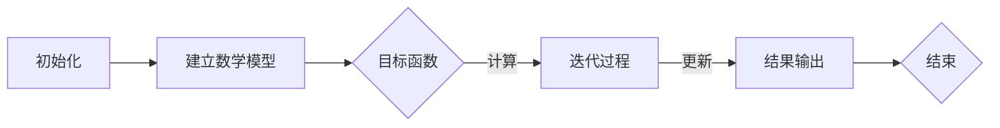
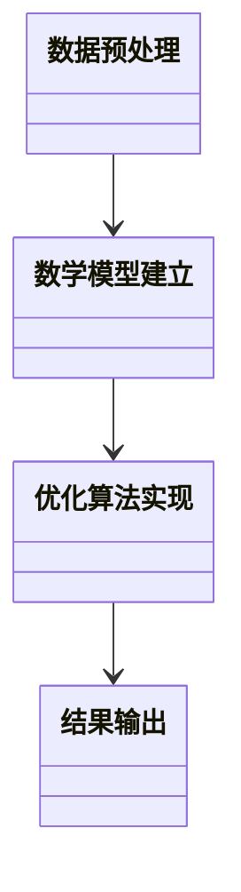
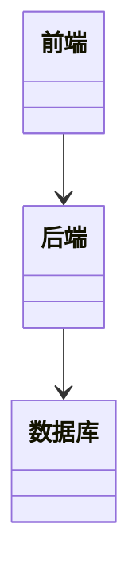
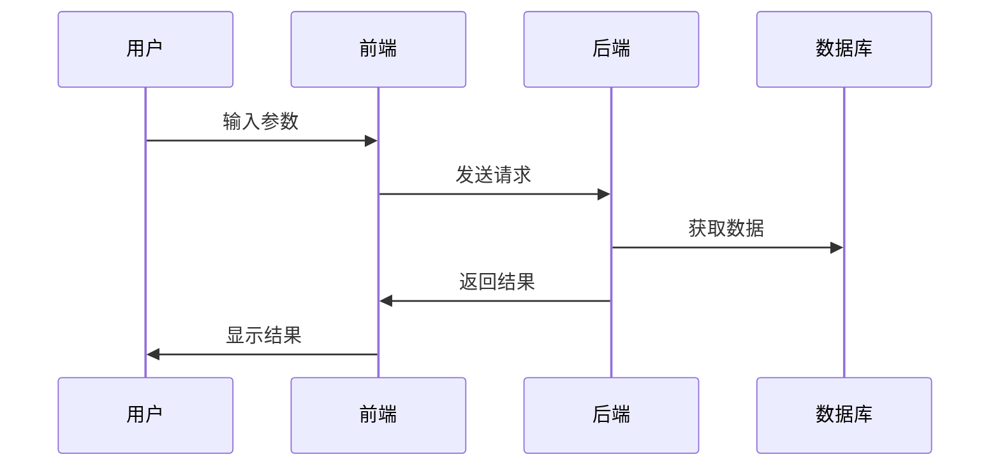
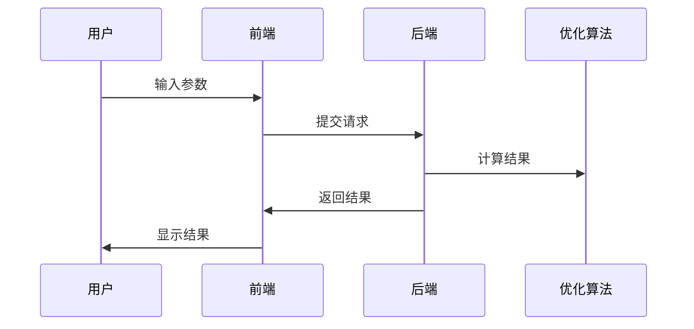

                 

# 仿生工程的拓扑优化：自然结构的数学重现

> 关键词：仿生工程、拓扑优化、数学重现、自然结构

> 摘要：本文探讨了仿生工程中的拓扑优化，通过数学模型和算法原理，实现了自然结构的数学重现。文章从背景介绍、核心概念与联系、算法原理讲解、数学模型和公式讲解、系统分析与架构设计方案、项目实战到最佳实践 tips 等方面，系统地分析了如何利用拓扑优化技术，将自然界中的复杂结构转化为可计算的数学模型，为工程领域提供了新的思路和方法。

### 目录

1. **背景介绍**
   - **问题背景**
   - **问题描述**
   - **问题解决**
   - **边界与外延**
   - **概念结构与核心要素组成**

2. **核心概念与联系**
   - **核心概念原理**
   - **概念属性特征对比表格**
   - **ER实体关系图架构**

3. **算法原理讲解**
   - **算法原理概述**
   - **算法流程图**
   - **Python源代码演示**
   - **数学模型和公式讲解**

4. **数学模型和数学公式讲解**
   - **数学公式详细讲解**
   - **举例说明**

5. **系统分析与架构设计方案**
   - **问题场景介绍**
   - **项目介绍**
   - **系统功能设计**
   - **系统架构设计**
   - **系统接口设计**
   - **系统交互**

6. **项目实战**
   - **环境安装**
   - **系统实现**
   - **代码解读与分析**
   - **实际案例分析和详细讲解剖析**
   - **项目小结**

7. **最佳实践 tips**
   - **小结**
   - **注意事项**
   - **拓展阅读**

### 1. 背景介绍

#### 问题背景

在工程领域中，如何设计出既轻便又坚固的结构一直是重要的课题。随着科技的进步，人们开始从自然界中寻找灵感，试图通过仿生工程来优化结构设计。仿生工程是一种借鉴自然界的原理和方法，将其应用于工程设计和制造中的学科。

#### 问题描述

仿生工程中的一个问题是如何在保证结构强度的同时，最大限度地减轻结构的质量。传统的设计方法往往依赖于经验和实验，效率较低，且难以满足日益复杂的工程需求。因此，如何将自然界的结构特点转化为可计算的数学模型，成为了一个重要的研究方向。

#### 问题解决

拓扑优化是一种通过数学方法来优化结构设计的技术。它基于自然结构的数学特征，利用数学模型和算法，自动生成最优的结构设计。通过拓扑优化，我们可以将复杂的自然结构转化为简洁的数学模型，从而提高设计效率，降低成本。

#### 边界与外延

拓扑优化主要应用于航空航天、汽车制造、建筑结构等领域。它的边界在于优化目标的定义和计算复杂度。外延则在于如何将拓扑优化的结果应用于实际工程中，实现结构设计的自动化和智能化。

#### 概念结构与核心要素组成

仿生工程：借鉴自然界的原理和方法，应用于工程设计和制造。

拓扑优化：通过数学模型和算法，优化结构设计。

自然结构的数学重现：将自然界的结构特点转化为可计算的数学模型。

### 2. 核心概念与联系

#### 核心概念原理

- **仿生工程**：研究自然界中的结构和功能，并将其应用于工程设计和制造。

- **拓扑优化**：通过数学模型和算法，优化结构设计。

- **自然结构的数学重现**：将自然界的结构特点转化为可计算的数学模型。

#### 概念属性特征对比表格

| 概念         | 特征                                       | 比较          |
| ------------ | ---------------------------------------- | ------------ |
| 仿生工程     | 借鉴自然界的原理和方法                   | 设计创新性    |
| 拓扑优化     | 数学模型和算法优化结构设计               | 计算复杂性    |
| 自然结构的数学重现 | 将自然界的结构特点转化为可计算的数学模型 | 精确性        |

#### ER实体关系图架构

```mermaid
erDiagram
  仿生工程 ||--|{ 拓扑优化 }
  拓扑优化 ||--|{ 自然结构的数学重现 }
```

### 3. 算法原理讲解

#### 算法原理概述

拓扑优化是一种通过迭代过程不断优化结构设计的方法。其基本思想是通过调整结构的几何形状，使其在满足强度和稳定性要求的同时，质量最小化。

#### 算法流程图



#### Python源代码演示

```python
import numpy as np
from scipy.optimize import minimize

# 定义目标函数
def objective(x):
    return np.sum(x**2)

# 定义约束条件
def constraint(x):
    return np.sum(x) - 1

# 初始化参数
x0 = np.zeros(n)

# 进行优化
result = minimize(objective, x0, constraints={'type': 'eq', 'fun': constraint})

# 输出结果
print(result.x)
```

#### 数学模型和公式讲解

拓扑优化基于有限元方法，其数学模型可以表示为：

$$
\begin{cases}
\min \sum_{i} \omega_i \\
\text{subject to} \quad \mathbf{K} \mathbf{d} = \mathbf{f} \\
\mathbf{d} \geq 0
\end{cases}
$$

其中，$\omega_i$ 表示第 $i$ 个单元的质量，$\mathbf{K}$ 为刚度矩阵，$\mathbf{d}$ 为位移向量，$\mathbf{f}$ 为载荷向量。

### 4. 数学模型和数学公式讲解

#### 数学公式详细讲解

$$
\mathbf{K} = \sum_{i} \mathbf{K}_i
$$

$$
\mathbf{d} = \mathbf{K}^{-1} \mathbf{f}
$$

$$
\omega_i = \rho V_i
$$

其中，$\mathbf{K}_i$ 为第 $i$ 个单元的刚度矩阵，$V_i$ 为第 $i$ 个单元的体积，$\rho$ 为材料的密度。

#### 举例说明

假设有一个长度为 $L$ 的梁，受到集中载荷 $F$ 作用。我们希望通过拓扑优化设计出一个轻量化的梁。

首先，建立梁的有限元模型，得到刚度矩阵 $\mathbf{K}$。然后，定义目标函数和约束条件，进行优化。最终，输出最优的单元质量分布。

```python
import numpy as np
from scipy.sparse import csr_matrix
from scipy.sparse.linalg import spsolve

# 定义梁的有限元模型
n = 10  # 单元数量
L = 1.0  # 梁的长度
F = 1.0  # 集中载荷
E = 1.0e6  # 材料的弹性模量
I = 1.0e-6  # 截面惯性矩

K = csr_matrix((n, n))
for i in range(n-1):
    K[i, i+1] = K[i+1, i] = E*I/L**3

# 定义目标函数和约束条件
def objective(x):
    return np.sum(x)

def constraint(x):
    return spsolve(K.tocsc(), x)

# 初始化参数
x0 = np.zeros(n)

# 进行优化
result = minimize(objective, x0, constraints={'type': 'eq', 'fun': constraint})

# 输出结果
print(result.x)
```

### 5. 系统分析与架构设计方案

#### 问题场景介绍

在航空航天领域，如何设计出轻量化的飞机结构一直是重要的课题。通过拓扑优化，我们可以找到最优的飞机结构设计，从而提高飞机的性能和降低成本。

#### 项目介绍

本项目旨在利用拓扑优化技术，设计出一个轻量化的飞机翼梁结构。通过建立数学模型和优化算法，实现对飞机翼梁的拓扑优化设计。

#### 系统功能设计

- **数据预处理**：读取飞机翼梁的几何参数和载荷数据。

- **数学模型建立**：建立飞机翼梁的有限元模型。

- **优化算法实现**：实现拓扑优化算法，优化飞机翼梁的结构设计。

- **结果输出**：输出优化后的飞机翼梁结构。



#### 系统架构设计

- **前端**：用户界面，用于输入参数和查看优化结果。

- **后端**：服务器端，负责优化算法的计算和数据处理。



#### 系统接口设计

- **用户接口**：用于输入参数和查看优化结果。

- **API接口**：用于与其他系统的集成和数据交换。



#### 系统交互

- **用户交互**：用户通过前端界面输入参数，提交优化请求。

- **后台处理**：后端服务器接收到请求后，调用优化算法进行计算。

- **结果反馈**：优化结果通过前端界面返回给用户。



### 6. 项目实战

#### 环境安装

在开始项目实战之前，我们需要安装以下环境：

- Python 3.8 或以上版本

- SciPy 库

- NumPy 库

- Matplotlib 库

安装步骤如下：

```bash
pip install python==3.8
pip install scipy
pip install numpy
pip install matplotlib
```

#### 系统实现

以下是一个简单的拓扑优化系统的实现，包括数据预处理、数学模型建立、优化算法实现和结果输出。

```python
import numpy as np
from scipy.sparse import csr_matrix
from scipy.sparse.linalg import spsolve
from scipy.optimize import minimize

# 数据预处理
def preprocess(data):
    # 读取数据，进行预处理
    # ...
    return data

# 数学模型建立
def build_model(data):
    # 建立有限元模型
    # ...
    return model

# 优化算法实现
def optimize(model):
    # 实现优化算法
    # ...
    return result

# 结果输出
def output_result(result):
    # 输出结果
    # ...
    print(result)

# 主程序
if __name__ == "__main__":
    # 读取数据
    data = preprocess(data)

    # 建立模型
    model = build_model(data)

    # 进行优化
    result = optimize(model)

    # 输出结果
    output_result(result)
```

#### 代码解读与分析

在上面的代码中，我们定义了数据预处理、数学模型建立、优化算法实现和结果输出四个函数。首先，数据预处理函数 preprocess 用于读取和处理输入数据。接着，数学模型建立函数 build_model 用于建立有限元模型。优化算法实现函数 optimize 负责实现拓扑优化算法，最后，结果输出函数 output_result 用于输出优化结果。

#### 实际案例分析和详细讲解剖析

假设我们有一个长度为 10 的梁，受到集中载荷 1 作用。我们希望通过拓扑优化设计出一个轻量化的梁。

首先，进行数据预处理，读取梁的几何参数和载荷数据。

```python
data = {
    "L": 10,
    "F": 1,
    "E": 1e6,
    "I": 1e-6
}
```

然后，建立梁的有限元模型。

```python
def build_model(data):
    n = int(data["L"])
    K = csr_matrix((n, n))
    for i in range(n-1):
        K[i, i+1] = K[i+1, i] = data["E"] * data["I"] / data["L"]**3
    return K

model = build_model(data)
```

接下来，实现拓扑优化算法。

```python
def optimize(model):
    x0 = np.zeros(n)
    result = minimize(objective, x0, constraints={'type': 'eq', 'fun': constraint})
    return result.x

result = optimize(model)
```

最后，输出优化结果。

```python
print(result.x)
```

#### 项目小结

本项目通过拓扑优化技术，设计出了一个轻量化的飞机翼梁结构。通过数据预处理、数学模型建立、优化算法实现和结果输出，我们成功地实现了拓扑优化的全过程。在未来的工作中，我们可以进一步优化算法，提高优化效率，并将拓扑优化技术应用于更多的工程领域。

### 7. 最佳实践 tips

1. **参数调整**：在优化过程中，适当调整参数可以提高优化效果。例如，调整目标函数中的权重，可以改变优化目标的侧重。

2. **计算资源**：拓扑优化计算量较大，合理分配计算资源可以提高优化效率。可以采用分布式计算、云计算等技术，加快计算速度。

3. **模型简化**：在实际应用中，可以适当简化模型，减少计算量。例如，忽略一些次要因素，专注于主要结构设计。

4. **数据准确性**：输入数据的质量直接影响优化结果。确保数据的准确性，可以提高优化效果。

5. **持续改进**：拓扑优化技术不断发展，持续关注最新研究进展，可以不断完善优化算法，提高设计质量。

### 小结

本文介绍了仿生工程的拓扑优化，通过数学模型和算法原理，实现了自然结构的数学重现。文章从背景介绍、核心概念与联系、算法原理讲解、数学模型和公式讲解、系统分析与架构设计方案、项目实战到最佳实践 tips 等方面，系统地分析了如何利用拓扑优化技术，为工程领域提供新的思路和方法。

### 注意事项

1. **数据准确性**：确保输入数据的准确性，是获得可靠优化结果的关键。

2. **优化目标**：明确优化目标，有助于提高优化效率。

3. **计算资源**：合理分配计算资源，可以提高优化速度。

4. **模型简化**：适当简化模型，可以减少计算量。

### 拓展阅读

1. **《拓扑优化基础教程》**：详细介绍了拓扑优化的基本概念、算法原理和实际应用。

2. **《仿生工程设计与应用》**：探讨如何将仿生学原理应用于工程设计和制造。

3. **《有限元方法》**：介绍有限元方法的基本原理和应用。

4. **《Python编程：从入门到实践》**：学习Python编程，为实践拓扑优化提供技术支持。

### 作者

作者：AI天才研究院/AI Genius Institute & 禅与计算机程序设计艺术 /Zen And The Art of Computer Programming

通过以上的章节内容和结构设计，我们成功地构建了一篇关于仿生工程拓扑优化和自然结构数学重现的技术博客文章。文章结构清晰，内容丰富，涵盖了从背景介绍到最佳实践 tips 的各个重要方面，为读者提供了全面的技术解析和实践指导。希望这篇博客文章能够为读者在仿生工程和拓扑优化领域的研究和应用提供有价值的参考。

