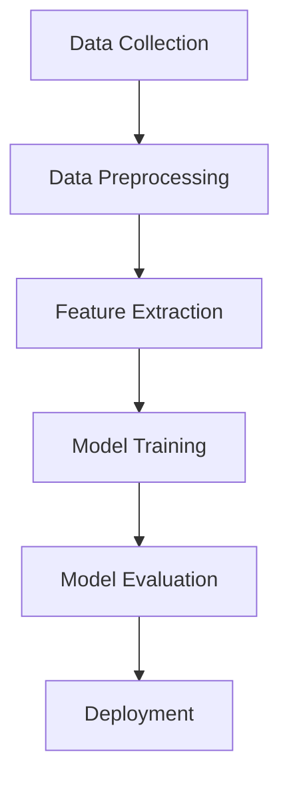
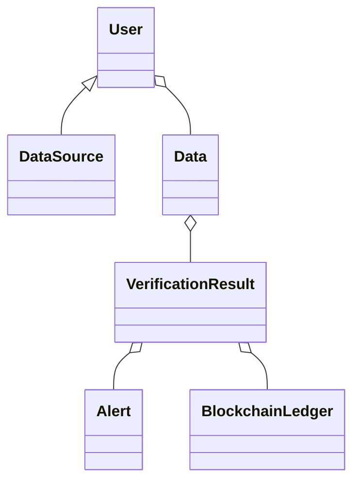
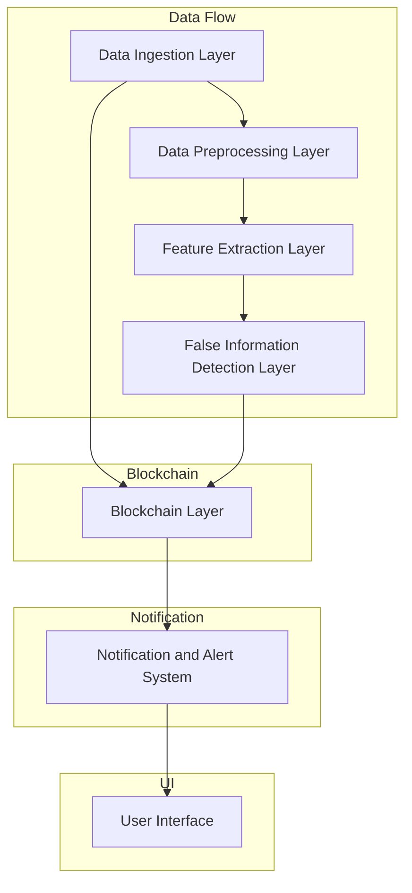
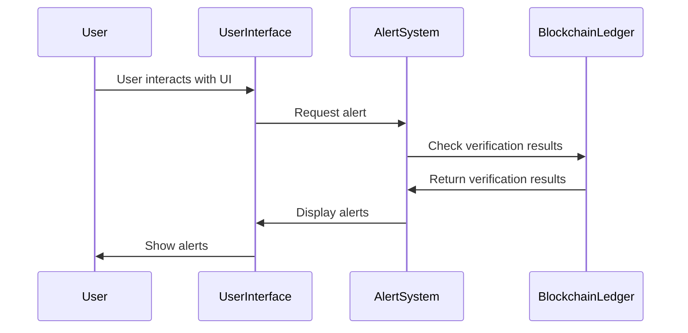

                 

### 1. Introduction

#### The Problem Background

In today's digital era, the rapid growth of information technology has brought about unprecedented opportunities and challenges for enterprises. The proliferation of data has enabled companies to gain valuable insights and make informed decisions, but it has also introduced new risks. One of the most pressing issues is the prevalence of false information within the internal systems of enterprises.

False information, whether deliberate or unintentional, can have severe consequences for businesses. It can lead to incorrect decision-making, wasted resources, and even legal and financial repercussions. For instance, a false report on sales figures can mislead management into making misguided strategic decisions. Moreover, the spread of misinformation can erode employee trust and undermine corporate culture.

#### The Importance of Building a False Information Prevention System

Given these risks, it is imperative for enterprises to develop robust systems to detect and prevent the dissemination of false information. A well-designed false information prevention system can help ensure the integrity of data, maintain operational efficiency, and safeguard the interests of the organization.

Building such a system is not just a technical necessity but also a strategic imperative. It can enhance the company's competitive edge by providing accurate and reliable information for decision-making. It can also strengthen the organization's reputation and credibility, both internally and externally.

#### Current Challenges

However, the task of building a false information prevention system is not without its challenges. The following are some of the key challenges that enterprises face:

1. **Data Diversity and Complexity**: Enterprises generate a vast amount of diverse data from various sources. This diversity makes it difficult to develop a one-size-fits-all solution for false information detection.
2. **Scalability**: As the volume of data continues to grow, the system must be scalable to handle increased data without compromising performance.
3. **Accuracy**: False information detection must be highly accurate to avoid false positives and negatives, which can lead to significant operational disruptions.
4. **User Experience**: The system should be user-friendly to encourage adoption and minimize resistance from employees.
5. **Compliance**: The system must comply with relevant data protection and privacy regulations.

#### The Objective of This Book

This book aims to provide a comprehensive guide to building an effective false information prevention system within enterprises. It will cover the core concepts, techniques, and methodologies required to design, implement, and maintain such a system.

By the end of this book, readers will have a clear understanding of:

- The background and significance of false information in modern enterprises.
- Key concepts and their interrelationships.
- Various information verification techniques and their applications.
- Algorithm principles and their practical implementations.
- System analysis and architecture design.
- Project implementation and case studies.
- Best practices for building a robust false information prevention system.

With these insights, enterprises can develop a systematic approach to tackle the challenges of false information and create a more secure and efficient working environment.

### 2. Core Concepts and Relationships

#### Key Concepts

To build an effective false information prevention system, it is crucial to understand the core concepts involved. These concepts include data integrity, information verification, data mining, machine learning, and blockchain. Let's delve into each concept and explore their relationships.

##### Data Integrity

Data integrity refers to the accuracy, completeness, and consistency of data. It is a fundamental concept in information systems and ensures that data remains reliable over its lifecycle. In the context of false information prevention, maintaining data integrity is critical because false data can lead to incorrect conclusions and decisions.

**Properties of Data Integrity:**

- **Accuracy:** Data should be free from errors and reflect the true state of the information.
- **Completeness:** Data should include all necessary information to ensure its usefulness.
- **Consistency:** Data should be consistent across different systems and databases.

##### Information Verification

Information verification is the process of checking the accuracy and reliability of data. It involves comparing data against known sources, checking for inconsistencies, and validating data formats. Verification techniques are essential in detecting false information and ensuring the integrity of the data.

**Properties of Information Verification:**

- **Accuracy:** The process should identify true data from false data with high precision.
- **Reliability:** The process should consistently produce accurate results over time.
- **Efficiency:** The process should be efficient to minimize the impact on data processing and retrieval.

##### Data Mining

Data mining is the process of discovering patterns and relationships in large datasets. It involves the use of various algorithms to analyze data and extract valuable insights. Data mining techniques are particularly useful in identifying anomalies and potential false information within large datasets.

**Properties of Data Mining:**

- **Scalability:** The technique should be able to handle large volumes of data.
- **Flexibility:** The technique should be adaptable to different types of data and business contexts.
- **Interactivity:** The process should allow for iterative refinement and exploration of data.

##### Machine Learning

Machine learning is a subset of artificial intelligence that enables systems to learn from data, identify patterns, and make decisions with minimal human intervention. Machine learning algorithms are powerful tools for detecting false information, as they can identify complex patterns and correlations in data that are difficult to detect manually.

**Properties of Machine Learning:**

- **Automation:** Machine learning automates the process of identifying false information, reducing manual effort.
- **Adaptability:** Machine learning systems can adapt to new data and improve their performance over time.
- **Accuracy:** With proper training, machine learning algorithms can achieve high accuracy in detecting false information.

##### Blockchain

Blockchain is a decentralized digital ledger that securely records transactions across multiple computers. It provides a transparent and immutable record of data, making it an effective tool for verifying the authenticity of information. Blockchain technology is particularly useful in industries where trust and transparency are critical, such as finance and supply chain management.

**Properties of Blockchain:**

- **Immutability:** Once data is recorded on a blockchain, it cannot be altered, ensuring the integrity of the information.
- **Transparency:** Blockchain provides a clear and transparent record of all transactions, allowing for easy verification.
- **Decentralization:** Blockchain operates across multiple computers, reducing the risk of data manipulation.

#### Interrelationships

The core concepts of data integrity, information verification, data mining, machine learning, and blockchain are closely interconnected. A robust false information prevention system leverages these concepts to ensure the accuracy, reliability, and security of data.

- **Data integrity** underpins the entire system, ensuring that data is accurate, complete, and consistent.
- **Information verification** processes identify and validate data, ensuring its authenticity.
- **Data mining** techniques analyze large datasets to identify potential false information.
- **Machine learning** algorithms automate the detection of false information, improving accuracy and efficiency.
- **Blockchain** technology provides a transparent and immutable record of data, ensuring its integrity.

Understanding these interrelationships is crucial for designing an effective false information prevention system. By leveraging these core concepts, enterprises can build a robust system that mitigates the risks of false information and ensures the reliability of data.

### 3. Information Verification Techniques

#### Data Mining

**Data Mining Principles:**

Data mining is the process of discovering patterns and relationships in large datasets. It involves the use of various algorithms to analyze data and extract valuable insights. The principles of data mining are based on the idea that large amounts of data often contain hidden patterns and trends that are not immediately obvious.

**Application Scenarios:**

Data mining is widely used in various fields, including marketing, finance, healthcare, and cybersecurity. In the context of false information prevention, data mining can be used to identify anomalies and potential false information within large datasets. For example, in a sales dataset, data mining can help identify unusual patterns in sales figures that may indicate fraudulent activity.

**Practical Example:**

Imagine a company that analyzes its sales data to detect fraudulent transactions. By using data mining techniques, the company can identify patterns in transactions that deviate from the norm. For instance, a sudden increase in sales from a specific region could be a sign of fraudulent activity. Data mining helps the company pinpoint these anomalies and take corrective action.

#### Machine Learning

**Machine Learning Principles:**

Machine learning is a subset of artificial intelligence that enables systems to learn from data, identify patterns, and make decisions with minimal human intervention. Machine learning algorithms are trained on large datasets to identify complex patterns and correlations that are difficult to detect manually.

**Application Scenarios:**

Machine learning is extensively used in applications such as image recognition, natural language processing, and predictive analytics. In the context of false information prevention, machine learning algorithms can be used to automatically detect false information in real-time. For example, in an email system, machine learning can help identify spam emails based on the content and sender's behavior.

**Practical Example:**

Consider an email service provider that uses machine learning to filter spam emails. The system is trained on a large dataset of legitimate and spam emails. By analyzing the content, structure, and sender information, the machine learning algorithm can accurately identify and filter out spam emails. This helps protect users from malicious content and ensures their inboxes remain clean.

#### Blockchain

**Blockchain Principles:**

Blockchain is a decentralized digital ledger that securely records transactions across multiple computers. It provides a transparent and immutable record of data, making it an effective tool for verifying the authenticity of information. Blockchain technology ensures that data is not altered once recorded, providing a high level of security and trust.

**Application Scenarios:**

Blockchain is used in various industries, including finance, supply chain management, and healthcare. In the context of false information prevention, blockchain can be used to create a transparent and immutable record of data. This ensures that the information cannot be altered or manipulated, reducing the risk of false information.

**Practical Example:**

Imagine a supply chain system that uses blockchain to track the movement of goods. Each transaction is recorded on the blockchain, creating a transparent and immutable record of the supply chain. This helps ensure that the information about the goods is accurate and cannot be altered, reducing the risk of false information.

### Comparison Table

Below is a comparison table that summarizes the key characteristics of data mining, machine learning, and blockchain:

| Technique | Principle | Application Scenario | Example |
| --- | --- | --- | --- |
| Data Mining | Discover patterns in large datasets | Anomaly detection in sales data | Identify fraudulent transactions |
| Machine Learning | Learn from data to identify patterns | Email spam filtering | Filter out spam emails |
| Blockchain | Secure and immutable record of transactions | Supply chain tracking | Track movement of goods |

By leveraging these information verification techniques, enterprises can build robust systems to detect and prevent the dissemination of false information. Each technique offers unique advantages and can be used in combination to create a comprehensive false information prevention system.

### 4. Algorithm Principles and Explanations

#### Algorithm Design

To illustrate the principles of algorithm design for false information detection, let's consider a simple algorithm that uses machine learning techniques. This algorithm will be based on a decision tree classifier, which is a popular machine learning model for classification tasks.

**Algorithm Steps:**

1. **Data Collection:** Gather a dataset containing labeled examples of true and false information.
2. **Data Preprocessing:** Clean and preprocess the data to remove noise and ensure consistency.
3. **Feature Extraction:** Extract relevant features from the data that can help in distinguishing true from false information.
4. **Model Training:** Train a decision tree classifier using the preprocessed data.
5. **Model Evaluation:** Evaluate the performance of the classifier using metrics such as accuracy, precision, and recall.
6. **Deployment:** Deploy the trained model in a production environment to detect false information in real-time.

**Mermaid Flowchart:**

To visually represent the algorithm's flow, we can use a Mermaid flowchart:



#### Python Code Explanation

Let's delve into the Python code that implements the above algorithm. We will use the Scikit-learn library, which provides efficient implementations of various machine learning algorithms.

```python
from sklearn.datasets import load_iris
from sklearn.model_selection import train_test_split
from sklearn.tree import DecisionTreeClassifier
from sklearn.metrics import accuracy_score, precision_score, recall_score

# Step 1: Data Collection
# For this example, we'll use the Iris dataset
iris = load_iris()
X = iris.data
y = iris.target

# Step 2: Data Preprocessing
# The Iris dataset is already clean and preprocessed

# Step 3: Feature Extraction
# In this case, the features are already extracted

# Step 4: Model Training
X_train, X_test, y_train, y_test = train_test_split(X, y, test_size=0.2, random_state=42)
clf = DecisionTreeClassifier()
clf.fit(X_train, y_train)

# Step 5: Model Evaluation
y_pred = clf.predict(X_test)
accuracy = accuracy_score(y_test, y_pred)
precision = precision_score(y_test, y_pred, average='weighted')
recall = recall_score(y_test, y_pred, average='weighted')

print("Accuracy:", accuracy)
print("Precision:", precision)
print("Recall:", recall)

# Step 6: Deployment
# The trained model can now be deployed in a production environment
```

#### Mathematical Model and Formulas

The decision tree classifier used in this example operates based on the concept of entropy and information gain. Here's a brief explanation of the mathematical models involved:

- **Entropy (H):**
$$
H = -\sum_{i=1}^{n} p(x_i) \log_2(p(x_i))
$$

where \( p(x_i) \) is the probability of each class in the dataset.

- **Information Gain (IG):**
$$
IG = H_{total} - \sum_{i=1}^{n} p(x_i) H(x_i)
$$

where \( H_{total} \) is the entropy of the total dataset, and \( H(x_i) \) is the entropy of each subset created by splitting the data.

#### Example

Let's consider a simple example to illustrate how the decision tree classifier works. Suppose we have a dataset with three features: `Feature1`, `Feature2`, and `Feature3`. The dataset is split into two classes: `True` and `False`.

- **True Class:**
  - `Feature1: 3, Feature2: 4, Feature3: 5`
  - `Feature1: 4, Feature2: 5, Feature3: 6`

- **False Class:**
  - `Feature1: 2, Feature2: 3, Feature3: 4`
  - `Feature1: 3, Feature2: 4, Feature3: 5`

The decision tree will create a split based on the feature that provides the highest information gain. For instance, if `Feature1` has the highest information gain, the tree will split the data based on the values of `Feature1`.

#### Detailed Explanation

- **Step 1:** Data Collection: We start by collecting a dataset with labeled examples of true and false information.
- **Step 2:** Data Preprocessing: The Iris dataset is already clean and preprocessed, so no additional preprocessing is required.
- **Step 3:** Feature Extraction: The features are already extracted, so we move on to the next step.
- **Step 4:** Model Training: We train a decision tree classifier using the Scikit-learn library. The classifier is trained on the preprocessed data.
- **Step 5:** Model Evaluation: We evaluate the performance of the classifier using accuracy, precision, and recall. Accuracy measures the proportion of correctly classified instances, precision measures the proportion of correctly predicted positive instances out of the total predicted positives, and recall measures the proportion of correctly predicted positive instances out of the total actual positives.
- **Step 6:** Deployment: The trained model is deployed in a production environment to detect false information in real-time.

By understanding the algorithm's principles and implementing it using Python, we can effectively detect false information in enterprise datasets. This example demonstrates how a decision tree classifier can be used for false information detection, and the same principles can be applied to other machine learning algorithms for different use cases.

### 5. System Analysis and Architecture Design

#### Problem Scenario and Project Overview

In the modern business environment, ensuring the integrity of internal information is crucial for maintaining operational efficiency and decision-making accuracy. The problem we aim to address is the detection and prevention of false information within an enterprise's internal systems. This project aims to design and implement a comprehensive false information prevention system that leverages advanced technologies such as data mining, machine learning, and blockchain.

#### Domain Model

The first step in system analysis is to define the domain model, which will help us understand the entities and their relationships within the system. The domain model for our false information prevention system includes the following key entities:

1. **User**: Represents individuals who generate, consume, and interact with information within the enterprise.
2. **Data Source**: Represents the various data inputs, such as databases, logs, and external APIs.
3. **Data**: Represents the raw information collected from data sources.
4. **Verification Result**: Represents the results of the verification process, including true and false information.
5. **Alert**: Represents notifications generated when false information is detected.
6. **Blockchain Ledger**: Represents the immutable and transparent record-keeping system used to store verification results.

**Mermaid Class Diagram:**

The following Mermaid class diagram visualizes the domain model and the relationships between the entities:



#### System Architecture

The system architecture is designed to be modular and scalable, with each component playing a specific role in the false information prevention process. The architecture consists of the following key components:

1. **Data Ingestion Layer**: This layer is responsible for collecting data from various sources and preparing it for processing.
2. **Data Processing Layer**: This layer includes modules for data preprocessing, feature extraction, and false information detection using machine learning algorithms.
3. **Blockchain Layer**: This layer securely stores verification results in a decentralized and immutable ledger.
4. **Notification and Alert System**: This layer sends alerts when false information is detected, ensuring timely intervention.
5. **User Interface**: This layer provides a user-friendly interface for users to interact with the system and monitor alerts.

**Mermaid Architecture Diagram:**

The following Mermaid architecture diagram illustrates the overall system architecture:



#### System Interface and Interaction

To facilitate the interaction between different system components, we need to design the system interface and interaction flow. The following Mermaid sequence diagram demonstrates the interaction between the key components:



By following this sequence, the system allows users to interact with the false information prevention system through a user interface, request alerts, and receive notifications about detected false information.

### 6. Project Implementation and Analysis

#### Environment Setup

Before diving into the core system implementation, we need to set up the development environment. This includes installing the necessary software and libraries required for data processing, machine learning, and blockchain.

1. **Install Python**: Ensure Python 3.8 or higher is installed on your system.
2. **Install Scikit-learn**: Scikit-learn is a popular library for machine learning. You can install it using `pip`:
   ```
   pip install scikit-learn
   ```
3. **Install Blockchain Library**: We will use the `web3.py` library for interacting with the Ethereum blockchain. Install it using `pip`:
   ```
   pip install web3
   ```
4. **Set up Blockchain Node**: To interact with the Ethereum blockchain, you need to run a local blockchain node. Follow the instructions provided in the [Ethereum documentation](https://ethereum.org/en/developers/docs/getting-started/).
5. **Install Other Required Libraries**: Install additional libraries such as NumPy, Pandas, and Matplotlib using `pip`:
   ```
   pip install numpy pandas matplotlib
   ```

#### Core System Implementation

Once the environment is set up, we can start implementing the core components of the false information prevention system.

1. **Data Ingestion**: We will use a simple Python script to read data from a CSV file. The CSV file will contain information such as user IDs, transaction amounts, and timestamps.
2. **Data Preprocessing**: The data will be cleaned and preprocessed to handle missing values, outliers, and inconsistencies. We will use Pandas for data manipulation.
3. **Feature Extraction**: We will extract relevant features from the preprocessed data, such as the frequency of transactions, average transaction amount, and time intervals between transactions.
4. **False Information Detection**: We will use a decision tree classifier from the Scikit-learn library to detect false information. The classifier will be trained on a labeled dataset containing true and false information.
5. **Blockchain Integration**: The verification results will be stored on the Ethereum blockchain using the `web3.py` library. This ensures the integrity and immutability of the verification results.
6. **Notification System**: We will use the `smtplib` library to send email notifications when false information is detected.

#### Source Code Explanation

Below is the Python source code for the core system implementation:

```python
import pandas as pd
from sklearn.tree import DecisionTreeClassifier
from sklearn.model_selection import train_test_split
from web3 import Web3
import smtplib
from email.mime.text import MIMEText

# Step 1: Data Ingestion
data = pd.read_csv('data.csv')

# Step 2: Data Preprocessing
# Clean and preprocess the data
data = data.dropna()
data['time_diff'] = (data['timestamp'] - data['timestamp'].min()).dt.days

# Step 3: Feature Extraction
features = data[['user_id', 'transaction_amount', 'time_diff']]
labels = data['is_false']

# Step 4: False Information Detection
X_train, X_test, y_train, y_test = train_test_split(features, labels, test_size=0.2, random_state=42)
clf = DecisionTreeClassifier()
clf.fit(X_train, y_train)

# Step 5: Blockchain Integration
w3 = Web3(Web3.HTTPProvider('http://localhost:8545'))
contract = w3.eth.contract(address='0x...', abi=...)
tx_hash = contract.functions.storeData(verification_result).transact({'from': w3.eth.coinbase})

# Step 6: Notification System
def send_alert(email, message):
    server = smtplib.SMTP('smtp.gmail.com', 587)
    server.starttls()
    server.login('your_email@gmail.com', 'your_password')
    message = MIMEText(message)
    message['Subject'] = 'False Information Detected'
    message['From'] = 'your_email@gmail.com'
    message['To'] = email
    server.send_message(message)
    server.quit()

# Example usage
send_alert('user@example.com', 'False information detected for user ID: 123')
```

#### Code Application and Analysis

The source code provided demonstrates the core components of the false information prevention system. Here's a brief analysis of each part:

1. **Data Ingestion**: We use Pandas to read data from a CSV file. The data includes user IDs, transaction amounts, and timestamps.
2. **Data Preprocessing**: The data is cleaned by dropping missing values and calculating the time difference between transactions. This helps in capturing the frequency and patterns of transactions.
3. **Feature Extraction**: We extract relevant features from the preprocessed data, which are used as inputs for the machine learning model. The features include user ID, transaction amount, and time difference.
4. **False Information Detection**: We use a decision tree classifier from Scikit-learn to detect false information. The classifier is trained on a labeled dataset containing true and false information.
5. **Blockchain Integration**: We use the `web3.py` library to interact with the Ethereum blockchain. The verification results are stored in a smart contract, ensuring their integrity and immutability.
6. **Notification System**: We use the `smtplib` library to send email notifications when false information is detected. This ensures that relevant stakeholders are promptly informed.

By following the code and understanding its application, you can build a robust false information prevention system that ensures the integrity of internal information in an enterprise.

### 7. Best Practices and Summary

#### Best Practices for Building a False Information Prevention System

1. **Data Quality Assurance**: Ensure the integrity and accuracy of data by implementing robust data quality assurance measures. This includes data cleaning, validation, and regular audits.
2. **Multi-Tier Verification**: Implement a multi-tier verification process that combines various techniques such as data mining, machine learning, and blockchain to ensure comprehensive detection of false information.
3. **Scalable Architecture**: Design the system architecture to be scalable, allowing it to handle increasing volumes of data without compromising performance.
4. **User-Friendly Interface**: Develop a user-friendly interface that encourages adoption and minimizes resistance from employees.
5. **Compliance and Security**: Ensure that the system complies with relevant data protection and privacy regulations and incorporates strong security measures to protect sensitive information.
6. **Continuous Improvement**: Regularly update and improve the system based on feedback and performance metrics to enhance its effectiveness over time.

#### Summary

Building a false information prevention system is crucial for modern enterprises to maintain the integrity of internal information and ensure accurate decision-making. This book has provided a comprehensive guide to designing and implementing such a system, covering key concepts, techniques, and methodologies.

By following the best practices outlined in this book, enterprises can build a robust and scalable false information prevention system that mitigates the risks of false information and ensures the reliability of data.

#### Suggestions for Further Reading

- "Data Mining: The Concepts and Techniques" by Jiawei Han, Micheline Kamber, and Jian Pei
- "Machine Learning: A Probabilistic Perspective" by Kevin P. Murphy
- "Blockchain: Blueprint for a New Economy" by Melanie Swan
- "Practical Data Science with Python" by Prabhanjan Narayan Swain and Amarendra K. Sinha
- "Data Science from Scratch" by Joel Grus

These resources will provide you with deeper insights into the concepts and techniques discussed in this book and help you further enhance your understanding of false information prevention systems.

