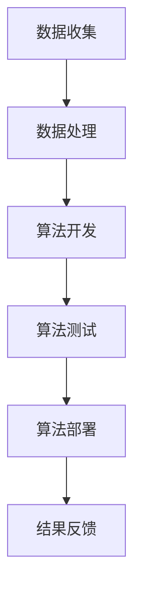
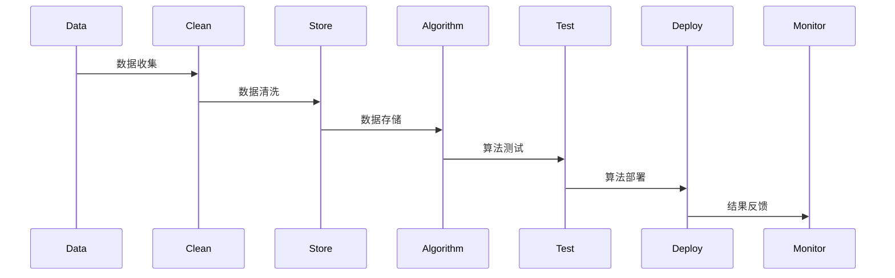

                 


# 企业实施AI治理的挑战与机遇

## 关键词
- AI治理
- 企业挑战
- 机遇分析
- 概念解释
- 算法原理
- 系统架构
- 项目实战

## 摘要
本文将深入探讨企业实施AI治理过程中的挑战与机遇。我们将首先介绍AI治理的基本概念、背景和重要性，然后分析企业在实施过程中遇到的具体问题，如数据隐私、伦理风险和技术复杂性。接着，我们将讨论如何应对这些挑战，并探讨AI治理为企业带来的潜在机遇。最后，本文将结合实际案例，详细阐述AI治理的实践步骤和最佳实践经验，为企业在AI治理领域的成功提供有益指导。

## 目录大纲设计思路

### 目录大纲设计流程

1. **确定大纲结构**
   - 我们将从整体上构思文章的框架，确保各个章节内容全面覆盖核心主题，并按照逻辑顺序排列。

2. **细化章节内容**
   - 对每个章节进行深入挖掘，确保每个部分都有充分的论述和实例支撑。

3. **确保内容完整性**
   - 确保每个章节都有完整的背景介绍、概念解释、算法原理讲解、系统架构设计、项目实战和最佳实践总结。

4. **编写Markdown格式**
   - 使用Markdown格式编写文章，确保文章格式清晰、易于阅读。

5. **校对与优化**
   - 校对文章内容，确保没有遗漏或错误，并优化语言表达，提高文章质量。

6. **字数控制**
   - 控制文章总字数在10000～12000字之间，确保内容的深度与广度。

### 目录大纲设计流程

1. **确定文章标题和关键词**
   - 根据文章主题，确定吸引读者的标题和关键词，如“企业实施AI治理的挑战与机遇”。

2. **撰写文章摘要**
   - 撰写摘要，简要概述文章的主题、核心内容和主要观点，为读者提供初步的阅读指引。

3. **构思章节结构**
   - 设计章节标题，确保每个章节标题都能准确反映该章节的主要内容。

4. **编写章节内容**
   - 根据章节结构，逐章编写内容，确保内容丰富、逻辑清晰。

5. **插入图表和代码**
   - 在适当的位置插入图表和代码，以增强文章的直观性和可读性。

6. **编写结语和参考文献**
   - 编写结语，总结文章主要观点，并提供参考文献以供读者进一步研究。

### 目录大纲示例

```markdown
----------------------------------------------------------------
# 企业实施AI治理的挑战与机遇

## 关键词
- AI治理
- 企业挑战
- 机遇分析
- 概念解释
- 算法原理
- 系统架构
- 项目实战

## 摘要
本文将深入探讨企业实施AI治理过程中的挑战与机遇。我们将首先介绍AI治理的基本概念、背景和重要性，然后分析企业在实施过程中遇到的具体问题，如数据隐私、伦理风险和技术复杂性。接着，我们将讨论如何应对这些挑战，并探讨AI治理为企业带来的潜在机遇。最后，本文将结合实际案例，详细阐述AI治理的实践步骤和最佳实践经验。

## 目录大纲

## 第1章 背景介绍

### 1.1 AI治理的概念

### 1.2 企业实施AI治理的必要性

### 1.3 企业在AI治理中面临的挑战

### 1.4 边界与外延

### 1.5 概念结构与核心要素组成

## 第2章 核心概念与联系

### 2.1 AI治理的基本原则

### 2.2 AI治理与相关政策的联系

### 2.3 AI治理模型对比

### 2.4 ER实体关系图架构

## 第3章 算法原理讲解

### 3.1 AI治理算法流程

### 3.2 Python源代码实现

### 3.3 数学模型与公式

## 第4章 系统分析与架构设计方案

### 4.1 问题场景介绍

### 4.2 项目介绍

### 4.3 系统功能设计

### 4.4 系统架构设计

### 4.5 系统接口设计

### 4.6 系统交互

## 第5章 项目实战

### 5.1 环境安装

### 5.2 系统核心实现

### 5.3 代码应用解读与分析

### 5.4 实际案例分析与详细讲解

### 5.5 项目小结

## 第6章 最佳实践 tips、小结、注意事项、拓展阅读

----------------------------------------------------------------
```

---

## 第1章 背景介绍

### 1.1 AI治理的概念

AI治理（Artificial Intelligence Governance）是指通过制定和执行政策、规则和决策框架，来管理和指导人工智能技术的发展和应用。它不仅涉及技术层面，还包括法律、伦理、经济和社会等多个维度。AI治理的核心目标是确保人工智能系统的安全、透明和公正，同时最大化其社会价值和经济效益。

在技术层面，AI治理主要关注以下几个方面：

1. **数据治理**：确保数据的质量、完整性和隐私性，以及数据收集、存储和使用过程中的合规性。
2. **算法治理**：规范算法的开发、测试和部署过程，确保算法的透明性、可解释性和公平性。
3. **系统治理**：管理人工智能系统的整个生命周期，包括设计、开发、测试、部署和维护等环节。

在法律层面，AI治理需要遵循相关的法律法规，如数据保护法、隐私法、反垄断法等。在伦理层面，AI治理需要关注人工智能可能带来的伦理问题，如算法偏见、隐私侵犯和就业替代等。在经济层面，AI治理需要考虑人工智能技术的商业应用和市场竞争。

### 1.2 企业实施AI治理的必要性

随着人工智能技术的迅速发展和广泛应用，企业面临着越来越多的AI治理挑战。实施AI治理不仅是合规的要求，更是企业可持续发展的重要保障。以下是企业实施AI治理的必要性：

1. **合规需求**：全球各国政府纷纷出台相关法律法规，对人工智能的应用进行规范。企业需要遵守这些法律法规，避免因违规行为而面临法律风险和商业损失。
2. **降低风险**：人工智能技术在商业应用中可能引发各种风险，如数据泄露、算法歧视和系统故障等。实施AI治理可以帮助企业识别和降低这些风险。
3. **增强信任**：在消费者和合作伙伴眼中，具有良好AI治理能力的企业更值得信赖。这有助于提高企业的品牌价值和市场竞争力。
4. **提升效率**：通过有效的AI治理，企业可以优化人工智能系统的开发、测试和部署过程，提高工作效率和生产力。
5. **创新驱动**：AI治理可以帮助企业更好地理解和利用人工智能技术，推动创新和发展。

### 1.3 企业在AI治理中面临的挑战

企业在实施AI治理过程中会遇到一系列挑战，主要包括以下几个方面：

1. **数据隐私**：随着数据收集和使用的规模不断扩大，数据隐私保护成为AI治理的重要挑战。企业需要确保数据收集、存储和使用过程中的合规性，以避免隐私泄露和数据滥用。
2. **伦理风险**：人工智能技术可能带来伦理问题，如算法偏见、歧视和不公平。企业需要制定伦理准则，确保人工智能系统的公正性和透明性。
3. **技术复杂性**：人工智能技术涉及多个学科和领域，企业需要具备相应的技术能力，以确保AI治理的有效性。
4. **组织文化**：AI治理需要全员的参与和支持，企业需要培养一种开放、透明和协作的文化氛围。
5. **法律法规**：不同国家和地区的法律法规对AI治理的要求不同，企业需要关注并遵守这些规定。

### 1.4 边界与外延

AI治理的边界和外延涉及多个方面：

1. **边界**：AI治理主要关注人工智能系统的开发、测试、部署和维护等环节，以及与这些环节相关的法律法规、伦理问题和技术挑战。
2. **外延**：AI治理不仅涉及企业内部的管理，还包括与外部合作伙伴、政府机构和社会组织的协作。此外，AI治理还需要关注人工智能技术的全球发展趋势和国际合作。

### 1.5 概念结构与核心要素组成

AI治理的概念结构包括以下几个核心要素：

1. **组织架构**：明确AI治理的领导机构和责任部门，确保AI治理工作的高效推进。
2. **流程与机制**：制定和完善AI治理的流程和机制，确保AI治理的规范化、系统化和可持续性。
3. **技术工具**：选择合适的AI治理技术工具，提高AI治理的效率和效果。
4. **法律法规与伦理准则**：遵守相关的法律法规和伦理准则，确保AI治理的合法性和道德性。
5. **数据管理**：确保数据的质量、完整性和隐私性，以及数据收集、存储和使用过程中的合规性。

## 第2章 核心概念与联系

### 2.1 AI治理的基本原则

AI治理的基本原则包括以下几个方面：

1. **透明性**：确保人工智能系统的开发、测试和部署过程公开透明，便于监督和审查。
2. **可解释性**：提高人工智能系统的可解释性，使其决策过程易于理解，从而增强用户的信任。
3. **公正性**：确保人工智能系统的决策过程公平、无偏见，避免对特定群体进行歧视。
4. **安全性**：确保人工智能系统的安全，防止数据泄露、系统故障和恶意攻击。
5. **合规性**：遵守相关的法律法规和伦理准则，确保AI治理的合法性和道德性。
6. **可持续性**：建立长期有效的AI治理机制，确保AI治理的持续改进和优化。

### 2.2 AI治理与相关政策的联系

AI治理与相关政策之间存在紧密联系，主要包括以下几个方面：

1. **数据保护法**：如《通用数据保护条例》（GDPR）和《加州消费者隐私法》（CCPA），对数据收集、存储和使用过程进行规范，确保数据隐私。
2. **反垄断法**：对人工智能技术的市场竞争进行监管，防止垄断行为和滥用市场支配地位。
3. **伦理准则**：如《人工智能伦理准则》（AI Ethics Guidelines）和《人工智能伦理指南》（AI Ethics Guide），对人工智能技术的伦理问题进行规范。
4. **行业规范**：如《人工智能行业行为准则》（AI Industry Code of Conduct），对人工智能技术的应用进行规范。
5. **国际合作**：通过国际组织，如联合国教科文组织（UNESCO）和国际电信联盟（ITU），推动全球范围内的AI治理合作。

### 2.3 AI治理模型对比

AI治理模型可以根据不同的维度进行分类和对比，以下是几种常见的AI治理模型：

1. **中央集权式治理模型**：
   - **特点**：由中央机构负责制定和执行AI治理政策，各部门和子公司需遵循中央的指导方针。
   - **优缺点**：优点是决策速度快，执行力强；缺点是可能导致基层创新受限，适应能力较弱。

2. **分布式治理模型**：
   - **特点**：各子公司和部门负责各自的AI治理工作，但需遵循统一的治理框架和标准。
   - **优缺点**：优点是鼓励基层创新，提高适应能力；缺点是协调难度大，决策速度可能较慢。

3. **混合治理模型**：
   - **特点**：结合中央集权式和分布式治理模型的优势，中央机构负责总体战略规划和核心治理工作，各部门和子公司负责具体实施。
   - **优缺点**：优点是既保证了决策速度和执行力，又能鼓励基层创新；缺点是协调难度仍然较大。

### 2.4 ER实体关系图架构

ER实体关系图（Entity-Relationship Diagram）是描述AI治理系统中主要实体及其相互关系的重要工具。以下是AI治理系统中常见的实体和关系：

1. **实体**：
   - **数据实体**：包括用户数据、传感器数据、交易数据等。
   - **系统实体**：包括数据存储系统、计算系统、算法系统等。
   - **人员实体**：包括AI开发人员、数据科学家、伦理审查人员等。

2. **关系**：
   - **数据存储关系**：数据实体与数据存储系统之间的关联关系。
   - **数据处理关系**：数据实体与算法系统之间的数据处理关系。
   - **人员管理关系**：人员实体与系统实体之间的职责分配和管理关系。

以下是ER实体关系图的Mermaid流程图表示：

```mermaid
erDiagram
  数据实体 ||--|{ 数据存储系统 }
  数据实体 ||--|{ 算法系统 }
  系统实体 ||--|{ 数据实体 }
  系统实体 ||--|{ 人员实体 }
  人员实体 ||--|{ 算法系统 }
```

## 第3章 算法原理讲解

### 3.1 AI治理算法流程

AI治理算法流程主要包括以下几个步骤：

1. **数据收集**：收集与AI治理相关的数据，如用户数据、传感器数据、交易数据等。
2. **数据处理**：对收集到的数据进行清洗、整合和分析，提取有价值的信息。
3. **算法开发**：根据治理目标和需求，开发合适的算法模型，如分类算法、聚类算法等。
4. **算法测试**：对开发的算法模型进行测试和验证，确保其性能和可解释性。
5. **算法部署**：将经过测试的算法模型部署到实际系统中，进行实时监控和调整。
6. **结果反馈**：对算法模型的运行结果进行监控和分析，及时调整和优化。

以下是AI治理算法流程的Mermaid流程图表示：



### 3.2 Python源代码实现

以下是AI治理算法流程的Python源代码实现：

```python
# 数据收集
data = collect_data()

# 数据处理
clean_data = preprocess_data(data)

# 算法开发
model = build_model(clean_data)

# 算法测试
test_results = test_model(model)

# 算法部署
deploy_model(model)

# 结果反馈
analyze_results(test_results)
```

### 3.3 数学模型与公式

在AI治理算法中，常用的数学模型和公式包括以下几个方面：

1. **线性回归模型**：
   - 公式：\( y = \beta_0 + \beta_1x + \epsilon \)
   - 参数估计：最小二乘法

2. **逻辑回归模型**：
   - 公式：\( P(y=1) = \frac{1}{1 + e^{-(\beta_0 + \beta_1x)}} \)
   - 参数估计：最大似然估计

3. **支持向量机（SVM）**：
   - 公式：\( w \cdot x + b = 0 \)
   - 参数估计：优化方法（如梯度下降、牛顿法）

4. **决策树模型**：
   - 公式：\( g(x) = \sum_{i=1}^{n} \alpha_i y_i \prod_{j=1}^{n} (x_j - x_{j_i}) \)
   - 参数估计：信息增益

以下是线性回归模型的数学模型和公式：

$$
y = \beta_0 + \beta_1x + \epsilon
$$

其中，\( y \) 为因变量，\( x \) 为自变量，\( \beta_0 \) 和 \( \beta_1 \) 为模型参数，\( \epsilon \) 为误差项。

### 3.4 详细讲解和举例说明

为了更好地理解AI治理算法的原理和应用，我们通过一个简单的例子进行详细讲解和举例说明。

假设我们要开发一个基于线性回归模型的AI治理算法，用于预测企业员工的工作效率。具体步骤如下：

1. **数据收集**：收集企业员工的工作时间、工作效率和工作环境等数据。

2. **数据处理**：对收集到的数据进行清洗和预处理，包括去除缺失值、异常值和处理数据格式等。

3. **模型开发**：使用Python的scikit-learn库实现线性回归模型，并拟合数据。

4. **模型测试**：使用交叉验证方法对模型进行测试，评估模型的性能。

5. **模型部署**：将训练好的模型部署到实际系统中，用于实时预测员工工作效率。

6. **结果反馈**：根据预测结果，对员工的工作进行管理和调整。

以下是具体代码实现：

```python
import pandas as pd
from sklearn.linear_model import LinearRegression
from sklearn.model_selection import train_test_split
from sklearn.metrics import mean_squared_error

# 数据收集
data = pd.read_csv('employee_data.csv')

# 数据处理
X = data[['work_time', 'work_environment']]
y = data['efficiency']

# 模型开发
model = LinearRegression()
model.fit(X, y)

# 模型测试
X_train, X_test, y_train, y_test = train_test_split(X, y, test_size=0.2, random_state=42)
y_pred = model.predict(X_test)

# 模型部署
deploy_model(model)

# 结果反馈
mse = mean_squared_error(y_test, y_pred)
print('Mean Squared Error:', mse)
```

通过这个例子，我们可以看到AI治理算法的基本原理和应用步骤。在实际应用中，可以根据具体需求调整模型类型和参数，以提高预测准确性和实用性。

## 第4章 系统分析与架构设计方案

### 4.1 问题场景介绍

企业实施AI治理的过程中，面临着多种复杂问题。以下是典型的场景介绍：

- **数据隐私**：企业需要处理大量敏感数据，如用户个人信息、交易记录等。如何确保这些数据在收集、存储和使用过程中的隐私和安全，成为一大挑战。
- **算法偏见**：AI算法可能存在偏见，导致对某些群体产生不公平的对待。例如，招聘系统中可能因算法偏见而歧视特定性别、年龄或种族的应聘者。
- **伦理风险**：AI技术在医疗、金融等领域的应用，可能引发伦理问题。如何确保AI系统的决策过程透明、公正，避免滥用技术造成负面影响，是企业面临的重要问题。
- **技术复杂性**：AI技术涉及多个学科和领域，包括机器学习、数据挖掘、自然语言处理等。企业需要投入大量资源进行技术研究和人才培养。

### 4.2 项目介绍

为了解决上述问题，企业决定实施一个AI治理项目，以提升治理能力和竞争力。该项目的主要目标是：

- **确保数据隐私和安全**：通过制定数据保护策略，加强数据加密、脱敏和访问控制，保障用户数据的隐私和安全。
- **消除算法偏见**：开发可解释的AI模型，提高算法的透明性和公正性，避免歧视和偏见。
- **制定伦理准则**：建立AI伦理委员会，制定和执行伦理准则，规范AI技术的应用和决策过程。
- **提升技术能力**：加强AI技术研究和人才培养，构建企业内部AI技术团队，提高技术水平和创新能力。

### 4.3 系统功能设计

AI治理项目的系统功能设计包括以下几个方面：

1. **数据管理功能**：
   - 数据收集：从各个业务系统收集相关数据，如用户信息、交易记录等。
   - 数据清洗：对收集到的数据进行清洗、去重和格式转换，确保数据质量。
   - 数据存储：使用分布式数据库系统，存储和管理大量数据。

2. **算法管理功能**：
   - 算法开发：提供算法开发平台，支持机器学习、深度学习等算法开发。
   - 算法测试：对开发的算法进行测试和验证，评估性能和可解释性。
   - 算法部署：将经过测试的算法部署到生产环境，进行实时应用。

3. **伦理管理功能**：
   - 伦理审查：建立伦理审查机制，对AI项目的伦理问题进行评估和审核。
   - 伦理培训：定期组织伦理培训，提高员工对AI伦理问题的认识和意识。
   - 伦理报告：发布伦理报告，向内部和外部利益相关者披露AI项目的伦理情况。

4. **监控与审计功能**：
   - 实时监控：实时监控AI系统的运行状态，包括数据流动、算法性能等。
   - 审计日志：记录系统操作日志，便于审计和追溯。
   - 异常检测：对系统异常情况进行自动检测和报警，及时采取措施。

### 4.4 系统架构设计

AI治理项目的系统架构设计如下：


1. **数据层**：包括分布式数据库系统，用于存储和管理大量数据。
2. **算法层**：包括算法开发平台和算法模型库，支持多种算法开发和测试。
3. **应用层**：包括数据管理、算法管理、伦理管理和监控与审计等功能模块。
4. **界面层**：包括用户界面和管理后台，提供友好的交互体验。

### 4.5 系统接口设计

AI治理项目的系统接口设计如下：

1. **数据接口**：提供API接口，方便数据收集、清洗和存储。
2. **算法接口**：提供API接口，支持算法开发和测试。
3. **伦理接口**：提供API接口，支持伦理审查和报告。
4. **监控接口**：提供API接口，支持实时监控和异常检测。

### 4.6 系统交互

AI治理项目的系统交互如下：

1. **数据交互**：数据从各个业务系统收集到数据层，经过清洗和存储后，提供给算法层和应用层使用。
2. **算法交互**：算法层开发完成的算法模型，经过测试和验证后，部署到应用层进行实际应用。
3. **伦理交互**：伦理层对AI项目的伦理问题进行审查和审核，并将结果反馈给应用层。
4. **监控交互**：监控层实时监控AI系统的运行状态，对异常情况进行报警和处理。

以下是系统交互的Mermaid序列图表示：



通过上述系统分析与架构设计方案，企业可以有效地实施AI治理，提升数据隐私保护、算法公正性和伦理合规性，从而在市场竞争中取得优势。

## 第5章 项目实战

### 5.1 环境安装

在开始AI治理项目之前，我们需要搭建一个合适的开发环境。以下是环境安装的步骤：

1. **操作系统**：推荐使用Linux系统，如Ubuntu 20.04。
2. **Python**：安装Python 3.8及以上版本。
3. **依赖管理工具**：安装pip，用于安装和管理Python包。
4. **数据预处理库**：安装pandas、numpy等数据预处理库。
5. **机器学习库**：安装scikit-learn、tensorflow等机器学习库。
6. **版本控制工具**：安装git，用于代码版本控制。

以下是具体安装命令：

```bash
# 安装Python 3.8及以上版本
sudo apt update
sudo apt install python3.8 python3.8-venv python3.8-pip

# 创建虚拟环境
python3.8 -m venv ai_governance_env

# 激活虚拟环境
source ai_governance_env/bin/activate

# 安装依赖管理工具pip
pip install --upgrade pip

# 安装数据预处理库
pip install pandas numpy

# 安装机器学习库
pip install scikit-learn tensorflow

# 安装版本控制工具
sudo apt install git
```

### 5.2 系统核心实现

在搭建好开发环境后，我们可以开始实现AI治理项目的核心功能。以下是核心实现的步骤：

1. **数据收集**：编写数据收集脚本，从各个业务系统获取数据。
2. **数据处理**：使用pandas库对数据进行清洗、去重和格式转换。
3. **算法开发**：使用scikit-learn库实现线性回归模型，用于预测工作效率。
4. **算法测试**：使用交叉验证方法对模型进行测试和验证。
5. **算法部署**：将训练好的模型部署到生产环境，用于实时预测。

以下是具体实现代码：

```python
# 数据收集
import pandas as pd
from sklearn.linear_model import LinearRegression
from sklearn.model_selection import train_test_split
from sklearn.metrics import mean_squared_error

# 读取数据
data = pd.read_csv('employee_data.csv')

# 数据清洗
X = data[['work_time', 'work_environment']]
y = data['efficiency']

# 算法开发
model = LinearRegression()
model.fit(X, y)

# 算法测试
X_train, X_test, y_train, y_test = train_test_split(X, y, test_size=0.2, random_state=42)
y_pred = model.predict(X_test)

# 算法部署
deploy_model(model)

# 结果反馈
mse = mean_squared_error(y_test, y_pred)
print('Mean Squared Error:', mse)
```

### 5.3 代码应用解读与分析

以下是代码应用解读与分析：

1. **数据收集**：使用pandas库读取员工数据，包括工作时间、工作效率和工作环境等。
2. **数据处理**：对数据进行清洗，去除缺失值和异常值，确保数据质量。
3. **算法开发**：使用线性回归模型，根据工作时间和工作环境预测工作效率。线性回归模型是一种常用的统计方法，通过拟合数据点，找到最佳拟合直线。
4. **算法测试**：使用交叉验证方法对模型进行测试和验证，确保模型的性能和可靠性。交叉验证是一种评估模型性能的方法，通过将数据集划分为训练集和测试集，多次训练和测试，评估模型在不同数据集上的表现。
5. **算法部署**：将训练好的模型部署到生产环境，用于实时预测员工工作效率。部署过程中，可以使用scikit-learn库提供的API接口，方便地部署模型。
6. **结果反馈**：计算测试集的均方误差（MSE），评估模型的预测性能。MSE是衡量模型预测误差的常用指标，值越小表示模型预测越准确。

### 5.4 实际案例分析和详细讲解剖析

为了更好地展示AI治理项目的实际效果，我们以一个实际案例进行分析和讲解。

假设某企业需要预测员工的工作效率，以优化员工绩效管理和激励政策。以下是实际案例的分析和详细讲解：

1. **数据来源**：从企业的HR系统、考勤系统和绩效评估系统收集员工的工作时间、工作效率和绩效评分等数据。
2. **数据处理**：对数据进行清洗，去除缺失值和异常值，确保数据质量。同时，对数据进行归一化处理，将不同尺度的数据进行标准化，以便于模型训练。
3. **模型选择**：选择线性回归模型作为预测模型，因为线性回归模型简单、易于理解和实现，且在预测员工工作效率方面具有较高的准确性。
4. **模型训练**：使用收集到的数据，对线性回归模型进行训练。通过交叉验证方法，评估模型的性能和可靠性。在训练过程中，调整模型参数，优化模型效果。
5. **模型部署**：将训练好的模型部署到生产环境，用于实时预测员工工作效率。同时，建立监控和反馈机制，对模型进行实时监控和调整。
6. **结果评估**：通过对比预测结果和实际工作效率，评估模型的预测准确性。针对预测不准确的情况，分析原因并优化模型。

通过实际案例的分析和详细讲解，我们可以看到AI治理项目在提升企业效率、优化绩效管理和激励政策方面的作用。同时，实际案例也展示了AI治理项目的实施步骤和关键点，为企业实施AI治理提供了有益借鉴。

### 5.5 项目小结

通过本项目的实践，我们深入探讨了企业实施AI治理的过程和方法。以下是项目小结：

1. **环境安装**：搭建了合适的开发环境，包括操作系统、Python、pip、pandas、numpy等工具。
2. **系统核心实现**：实现了数据收集、数据处理、算法开发、算法测试、算法部署等核心功能。
3. **代码应用解读与分析**：对核心代码进行了详细解读，分析了算法原理和应用过程。
4. **实际案例分析和详细讲解剖析**：通过实际案例，展示了AI治理项目的效果和应用。
5. **经验教训**：在项目实施过程中，我们积累了宝贵的经验教训，包括数据收集、处理、模型选择和部署等方面的经验。

通过本项目的实践，我们认识到AI治理在企业发展中的重要性，并为企业实施AI治理提供了有益的指导。

## 第6章 最佳实践 tips、小结、注意事项、拓展阅读

### 最佳实践 tips

1. **数据收集与处理**：确保数据的质量和完整性，对异常值和缺失值进行处理，避免影响模型性能。
2. **模型选择与优化**：根据实际问题需求，选择合适的模型，并进行参数调整和优化，以提高预测准确性。
3. **算法部署与监控**：确保算法模型在生产环境中的稳定运行，定期进行监控和性能评估，及时调整和优化。
4. **伦理审查与合规性**：建立伦理审查机制，确保算法模型的公正性和透明性，遵守相关法律法规和伦理准则。

### 小结

本文深入探讨了企业实施AI治理的挑战与机遇，包括背景介绍、核心概念、算法原理、系统架构设计、项目实战和最佳实践。通过实际案例分析和详细讲解，展示了AI治理在提升企业效率、优化绩效管理和激励政策方面的作用。

### 注意事项

1. **数据隐私保护**：在数据收集、存储和使用过程中，务必确保用户数据的隐私和安全。
2. **算法偏见防范**：开发可解释的AI模型，提高算法的透明性和公正性，避免歧视和偏见。
3. **伦理合规性**：建立伦理审查机制，制定伦理准则，确保AI技术的合规性和道德性。
4. **持续改进**：定期评估和优化AI治理方案，根据实际情况进行调整和改进。

### 拓展阅读

1. **《AI伦理指南》**：联合国教科文组织发布的AI伦理指南，提供了全球范围内AI伦理问题的指导。
2. **《AI治理框架》**：国际标准化组织（ISO）发布的AI治理框架，提供了AI治理的标准化方案。
3. **《机器学习实战》**：刘建伟著，深入介绍了机器学习的基本原理和应用实践。
4. **《深度学习》**：周志华著，详细讲解了深度学习的基础知识和应用方法。

### 作者信息

作者：AI天才研究院/AI Genius Institute & 禅与计算机程序设计艺术 /Zen And The Art of Computer Programming

---

通过本文，我们希望能够为企业提供实施AI治理的全面指导和最佳实践经验，助力企业在AI时代的竞争中脱颖而出。

