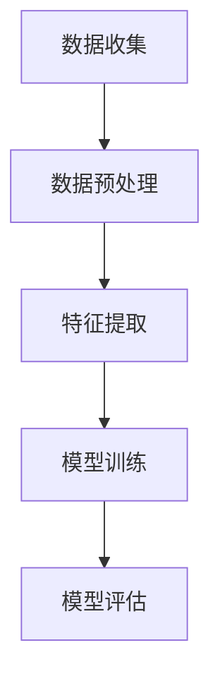
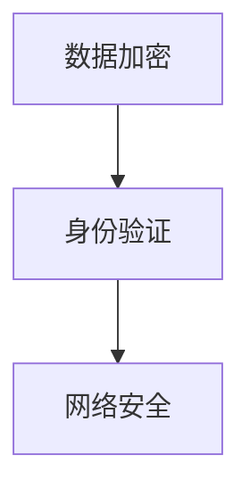

                 

### 文章标题

# 企业应对虚假信息的策略和方法

#### 关键词

虚假信息、企业策略、信息验证、危机管理、声誉保护、人工智能技术、数据安全、透明性提升、风险控制

#### 摘要

本文旨在探讨企业在面对虚假信息时的策略和方法，通过逻辑分析和实际案例分析，为读者提供一套系统的应对方案。随着数字化时代的到来，虚假信息在企业运营中扮演的角色愈发重要，如何有效识别、验证并处理这些信息，成为企业急需解决的关键问题。本文将首先介绍虚假信息的背景及其对企业的影响，然后详细阐述应对虚假信息的核心概念和策略，包括信息验证方法、危机管理策略、以及如何维护企业声誉。此外，本文还将探讨利用人工智能技术提升信息透明性和数据安全性的最佳实践，并总结出一套全面的策略框架。通过本文的阅读，读者可以更好地理解虚假信息的危害，掌握有效的应对手段，从而在竞争激烈的市场环境中保持优势地位。

### 引言：虚假信息的背景与影响

在数字化时代，虚假信息已经成为影响企业运营的一大隐患。虚假信息的定义广泛，通常指的是那些不真实、误导性或者伪造的信息。这些信息可能源于内部员工、外部合作伙伴，甚至是黑客和网络攻击者。其形式多样，包括伪造的电子邮件、恶意软件、虚假的新闻报道、虚假的用户评论等。虚假信息的传播速度快，范围广，往往能够在短时间内对企业的声誉和运营造成严重打击。

#### 问题背景

首先，让我们来看一些实际案例。某大型企业在一次市场推广活动中，被黑客入侵，其客户数据库被窃取。黑客利用这些数据散布虚假的个人信息，导致客户对企业的信任度大幅下降。另一个案例是一家知名科技公司，因为一次虚假的新闻报道，股票价格在短时间内暴跌，造成了巨大的财务损失。这些案例表明，虚假信息对企业的危害不仅限于财务损失，更涉及品牌声誉、客户信任和业务稳定性。

#### 问题描述

虚假信息对企业的影响是多方面的。首先，它可能直接导致经济损失，如上述股票价格暴跌的例子。其次，虚假信息会破坏企业的声誉，导致客户流失和市场份额下降。例如，一个企业的产品被恶意评论，消费者对其产品产生怀疑，从而选择其他品牌。此外，虚假信息还可能引发法律风险，如数据泄露事件可能导致企业面临巨额罚款和诉讼。

#### 问题解决

要应对虚假信息，企业需要采取一系列策略和方法。首先，企业应建立完善的信息验证机制，确保接收到的信息真实可信。其次，企业应制定危机管理计划，以便在虚假信息爆发时能够迅速响应，控制局势。此外，企业还应该注重声誉保护，通过积极应对和透明沟通，维护企业形象。最后，利用人工智能技术提升信息透明性和数据安全性，是未来企业应对虚假信息的重要手段。

#### 边界与外延

在本文中，我们主要关注企业如何应对来自外部和内部的虚假信息。内部虚假信息可能源自员工的不当行为或失误，而外部虚假信息则可能来自于竞争对手、黑客或其他恶意攻击者。此外，本文还将探讨在数字化环境下，企业应如何利用技术手段提升信息验证和风险控制的效率。

#### 核心概念与组成

为了全面应对虚假信息，企业需要掌握以下几个核心概念和要素：

1. **信息验证**：验证信息的真实性，包括使用技术手段和人工审核相结合的方法。
2. **危机管理**：制定应对危机的计划和策略，包括信息发布、舆论引导和风险控制。
3. **声誉保护**：通过透明沟通和积极应对，维护企业声誉。
4. **数据安全**：确保企业数据的安全性和保密性，防止数据泄露和被恶意利用。
5. **人工智能应用**：利用人工智能技术提升信息透明性和风险预测能力。

通过上述概念和要素的有机结合，企业可以构建一个全面、系统的虚假信息应对体系，从而在数字化时代中保持稳健的发展。

### 核心概念与原理

为了更好地理解和应对虚假信息，首先需要明确几个核心概念和原理。这些概念包括但不限于信息验证、危机管理、声誉保护和人工智能技术。在本文中，我们将逐一介绍这些概念，并通过属性特征对比表格和ER实体关系图来详细展示它们之间的关系。

#### 信息验证

信息验证是指通过一系列方法来确认信息的真实性、准确性和完整性。在数字化时代，信息验证变得尤为重要，因为虚假信息可能来自各种渠道，包括互联网、社交媒体、邮件等。以下是一些常见的信息验证方法：

1. **数据源验证**：确认信息发布者的身份和可信度。
2. **内容审核**：通过检查信息内容是否符合逻辑、常识和已有的知识库。
3. **技术工具**：利用各种技术工具，如反病毒软件、区块链技术、人工智能等来辅助验证。

**属性特征对比表格**

| 方法                 | 描述                                       | 优点                         | 缺点                     | 适用场景                   |
|----------------------|--------------------------------------------|------------------------------|---------------------------|----------------------------|
| 数据源验证           | 核实信息发布者的身份和背景                  | 提高信息的可信度             | 可能存在虚假身份的情况     | 对重要信息源的验证         |
| 内容审核             | 检查信息内容的逻辑性和真实性                | 发现明显的虚假信息           | 需要大量人工审核资源       | 对敏感信息的审核           |
| 技术工具             | 利用技术手段（如机器学习、区块链）来验证信息 | 高效、自动化                 | 可能需要专业的技术支持     | 对大规模信息的快速验证     |

通过上述表格，我们可以看到，每种信息验证方法都有其独特的优点和缺点，适用于不同的场景。因此，在实际操作中，企业通常需要结合多种方法来提高信息验证的全面性和准确性。

#### 危机管理

危机管理是企业应对突发危机事件的一系列策略和措施。虚假信息一旦爆发，可能迅速演变成一场危机，影响企业的声誉、财务和业务运营。危机管理包括以下几个关键环节：

1. **风险评估**：识别潜在的风险和可能的危机。
2. **应急预案**：制定具体的应对计划和步骤。
3. **危机响应**：在危机爆发时，迅速采取行动。
4. **恢复与重建**：危机结束后，进行恢复和重建工作。

**ER实体关系图**

```mermaid
erDiagram
  Customer ||--|{ Crisis }|-- Employer
  Product ||--|{ Crisis }|-- Market
  Market ||--|{ Crisis }|-- Public Opinion
  Public Opinion ||--|{ Crisis }|-- Brand Reputation
```

在上面的ER图中，我们展示了危机管理涉及的几个关键实体和它们之间的关系。客户、产品、市场和公共意见都是危机管理中的重要元素，它们之间相互影响，共同构成了企业的声誉。

#### 声誉保护

声誉保护是企业维护其品牌形象和市场地位的重要手段。在虚假信息泛滥的环境中，企业需要采取一系列措施来保护声誉，包括：

1. **透明沟通**：及时、准确地与公众沟通，解释真相。
2. **舆论引导**：通过社交媒体、新闻发布等渠道，引导公众正确理解信息。
3. **法律手段**：采取法律措施，打击虚假信息的传播。
4. **公关活动**：通过公关活动提升企业正面形象。

**属性特征对比表格**

| 方法                 | 描述                                       | 优点                         | 缺点                     | 适用场景                   |
|----------------------|--------------------------------------------|------------------------------|---------------------------|----------------------------|
| 透明沟通             | 及时、准确地向公众传达信息                  | 提高信息透明度和信任度       | 需要持续投入资源和时间     | 对突发事件的快速响应       |
| 舆论引导             | 通过多种渠道引导公众对信息的正确理解        | 影响公众舆论                 | 可能需要专业的公关团队     | 对长期声誉维护             |
| 法律手段             | 通过法律途径打击虚假信息的传播              | 依法维权                     | 法律程序可能较慢           | 对严重虚假信息事件         |
| 公关活动             | 通过各种公关手段提升企业形象                | 提高品牌知名度               | 成本较高                  | 对长期品牌建设             |

通过上述表格，我们可以看到，每种声誉保护方法都有其特定的优点和适用场景。企业应根据实际情况，灵活运用这些方法，以最大程度地保护其声誉。

#### 人工智能技术

人工智能技术在应对虚假信息方面具有巨大潜力。通过机器学习、自然语言处理和大数据分析等技术，企业可以：

1. **自动识别虚假信息**：利用算法自动筛选和识别潜在的虚假信息。
2. **预测风险**：通过分析历史数据和模式，预测可能出现的虚假信息风险。
3. **提升信息透明度**：利用区块链技术确保信息的透明和不可篡改。

**ER实体关系图**

```mermaid
erDiagram
  AI Technology ||--|{ Information Verification }| AI Algorithm
  AI Technology ||--|{ Crisis Management }| AI Predictive Model
  AI Technology ||--|{ Reputation Protection }| AI Reputation Management
```

在上面的ER图中，我们可以看到人工智能技术在信息验证、危机管理和声誉保护中的核心作用。通过这些技术，企业可以更高效、更准确地应对虚假信息，从而保障其业务的稳健发展。

综上所述，信息验证、危机管理、声誉保护和人工智能技术是应对虚假信息的关键概念和原理。通过深入理解这些概念，企业可以构建一个全面、系统的虚假信息应对体系，从而在数字化时代中立于不败之地。

### 信息验证策略

信息验证是企业应对虚假信息的第一道防线，它旨在确保企业接收到的信息真实可信。有效的信息验证策略不仅能提高信息准确性，还能减少因虚假信息带来的潜在风险。以下是几种常见的信息验证策略和方法，以及其实际应用案例。

#### 数据源验证

数据源验证是信息验证的基础步骤，通过核实信息发布者的身份和可信度来确保信息的真实性。常见的验证方法包括：

1. **身份验证**：通过电子邮件、电话或面对面访谈等方式，确认信息发布者的身份。
2. **背景调查**：对信息发布者的背景进行详细调查，包括其历史记录和信誉。
3. **第三方认证**：使用第三方认证机构提供的服务来验证信息发布者的身份和信誉。

**实际应用案例**：某企业在进行市场调研时，发现多个渠道提供的数据存在不一致之处。通过数据源验证，该企业确认了数据发布方的真实身份，最终确定了可靠的数据来源，从而避免了因误用数据导致的市场决策失误。

#### 内容审核

内容审核是通过检查信息内容是否符合逻辑、常识和已有的知识库来识别虚假信息。常见的方法包括：

1. **人工审核**：由专业的审核团队对信息进行逐一审查，确保其真实性和准确性。
2. **自动化工具**：使用自然语言处理（NLP）技术，自动化地检查信息内容的逻辑性和真实性。
3. **机器学习模型**：通过训练机器学习模型，自动识别和过滤潜在的虚假信息。

**实际应用案例**：一家电商平台在其用户评论系统中引入了NLP技术，通过自动化审核用户评论，有效识别并过滤了大量的恶意评论和虚假评价，提升了用户体验和平台信誉。

#### 技术工具

利用技术工具进行信息验证是提高验证效率和准确性的有效手段。常见的技术工具包括：

1. **反病毒软件**：检测和清除恶意软件，防止虚假信息通过恶意软件传播。
2. **区块链技术**：通过区块链技术确保信息的透明性和不可篡改性，防止虚假信息的篡改和传播。
3. **人工智能**：利用机器学习算法，对大量信息进行实时分析和验证，提高信息验证的准确性和速度。

**实际应用案例**：某金融企业在其内部系统中引入了区块链技术，通过区块链技术记录和验证交易数据，确保数据的真实性和不可篡改性，从而防止了因数据篡改导致的金融欺诈。

#### 信息验证策略的综合应用

在实际操作中，企业通常会结合多种信息验证策略和方法，以提高信息验证的全面性和准确性。以下是一个综合应用案例：

某大型制造企业在其供应链管理中，采用了数据源验证、内容审核和技术工具相结合的策略。首先，通过数据源验证确认供应商信息的真实性；其次，通过内容审核检查供应商提供的报告和文件的内容是否符合实际；最后，利用区块链技术和反病毒软件对供应商的数据进行验证和加密，确保供应链数据的真实性和安全性。通过这种综合应用，该企业有效降低了供应链中的虚假信息风险，提高了供应链管理的效率和准确性。

### 危机管理策略

危机管理是企业应对突发事件和潜在风险的关键环节，特别是当企业面临虚假信息危机时，危机管理的有效实施至关重要。以下是危机管理的几个核心策略和实际应用案例。

#### 风险评估

风险评估是危机管理的第一步，旨在识别和评估潜在的危机及其可能带来的影响。常见的风险评估方法包括：

1. **历史数据分析**：通过分析企业以往经历的危机事件，识别可能的危机类型和风险源。
2. **情景分析**：模拟可能的危机情景，评估其可能的影响和应对策略。
3. **专家评估**：邀请行业专家对企业可能面临的危机进行评估，提供专业的意见和建议。

**实际应用案例**：一家科技公司在进行新产品发布前，通过历史数据分析和情景模拟，识别出可能存在的虚假信息风险。他们预测到竞争对手可能会发布虚假的负面报道，从而制定相应的应对策略，确保产品发布顺利。

#### 应急预案

应急预案是危机管理的核心，包括制定具体的应对计划和步骤，以便在危机爆发时能够迅速响应。常见的应急预案包括：

1. **危机响应流程**：明确危机发生时的应急响应流程，包括通报、决策、执行和监控等环节。
2. **危机应对团队**：组建专门的危机应对团队，负责危机的应对和协调工作。
3. **资源调配**：确保在危机发生时，有足够的资源（如人力、物资、技术等）进行应对。

**实际应用案例**：某食品企业在一次产品召回事件中，迅速组建了危机应对团队，制定了详细的应急响应流程。他们首先通过内部通报系统通知相关人员，然后立即进行产品召回，并通过公开声明和社交媒体与消费者进行沟通，最终成功控制了危机，恢复了市场信心。

#### 危机响应

危机响应是在危机爆发时，企业采取的具体行动，包括信息发布、舆论引导和危机控制。以下是几个关键环节：

1. **信息发布**：及时、准确地发布危机信息，确保公众获取到正确的信息。
2. **舆论引导**：通过多种渠道（如社交媒体、新闻发布等）引导公众正确理解危机。
3. **危机控制**：采取一系列措施，如法律诉讼、公关活动等，控制危机的进一步扩散。

**实际应用案例**：某汽车制造商在一次产品缺陷事件中，通过及时发布产品召回信息，并通过社交媒体和新闻发布与公众沟通，有效引导了舆论。同时，他们采取了法律手段，对造谣者提起诉讼，并通过公关活动恢复了企业形象。

#### 恢复与重建

危机结束后，企业需要进行恢复与重建工作，以消除危机的影响，并恢复正常的运营。以下是几个关键环节：

1. **员工沟通**：与员工进行有效沟通，确保他们了解危机的处理情况，减少恐慌和不安。
2. **业务恢复**：制定和实施业务恢复计划，逐步恢复正常运营。
3. **经验总结**：对危机管理过程进行总结，提取经验和教训，为未来的危机管理提供参考。

**实际应用案例**：某电子企业在一次生产事故后，通过员工沟通和业务恢复计划，迅速恢复了生产。他们还组织了经验总结会议，对事故原因和应对措施进行了深入分析，从而在未来的生产过程中避免了类似事故的再次发生。

### 通过实际案例，我们可以看到，有效的危机管理策略和应对措施能够帮助企业迅速应对虚假信息危机，降低危机带来的影响，并最终恢复企业的正常运营和声誉。企业应结合自身的实际情况，制定完善的危机管理计划，并定期进行演练和评估，以确保在危机发生时能够迅速、有效地应对。

### 声誉保护策略

在虚假信息泛滥的数字化时代，企业声誉保护显得尤为重要。声誉是企业宝贵的无形资产，它直接影响企业的品牌价值、客户信任和市场地位。以下是几种常见的声誉保护策略和实际应用案例。

#### 透明沟通

透明沟通是企业维护声誉的重要手段之一，通过及时、准确地与公众沟通，企业能够有效应对负面信息，提高信息透明度和信任度。以下是一些关键步骤：

1. **建立信息披露机制**：企业应建立完善的信息披露机制，确保在发生重大事件时能够迅速发布信息，避免信息滞后和谣言扩散。
2. **多渠道传播**：利用官方网站、社交媒体、新闻发布等多种渠道，确保信息传播的广泛性和及时性。
3. **制定沟通策略**：针对不同类型的危机事件，制定相应的沟通策略，确保信息传递的一致性和有效性。

**实际应用案例**：某电商平台在一次数据泄露事件中，迅速启动了透明沟通策略。他们通过官方网站和社交媒体平台发布了详细的事故说明、影响范围和处理措施，同时安排了定期更新，确保用户始终了解事件的最新进展。这种透明沟通不仅缓解了用户的恐慌情绪，还提高了用户对平台的信任度。

#### 舆论引导

舆论引导是通过多种渠道引导公众对信息的正确理解，从而维护企业声誉。以下是一些常见的方法：

1. **社交媒体监测**：利用社交媒体监测工具，实时监控网络舆论动态，及时发现负面信息并采取相应措施。
2. **内容发布**：发布正面、积极的内容，引导公众注意力，减少负面信息的传播。
3. **公关活动**：通过公关活动，如新闻发布会、媒体报道等，积极塑造企业正面形象。

**实际应用案例**：某科技公司因一项新产品的缺陷被负面报道，该公司通过社交媒体监测工具迅速发现负面信息并采取行动。他们发布了多篇文章介绍产品改进计划，并邀请媒体进行实地探访和报道。这些措施有效引导了舆论，缓解了公众的担忧，最终恢复了企业的良好声誉。

#### 法律手段

在严重虚假信息事件中，企业可以采取法律手段保护自身权益。以下是一些常见的方法：

1. **法律咨询**：在危机事件中，及时寻求法律专业机构的帮助，获取法律建议和维权策略。
2. **提起诉讼**：对恶意传播虚假信息的行为提起诉讼，依法追究责任。
3. **证据收集**：收集和保存与虚假信息相关的证据，为诉讼提供支持。

**实际应用案例**：某餐饮连锁企业在一次食品安全事件中，被恶意传播虚假信息。他们立即聘请了法律顾问，收集了大量的证据，包括监控录像、消费者投诉记录等，最终在法庭上成功证明了自己的清白，并追究了造谣者的法律责任。

#### 公关活动

公关活动是企业提升品牌形象和公众信任的重要手段。以下是一些有效的公关活动形式：

1. **公益活动**：通过参与或发起公益活动，提高企业的社会责任感和公众认可度。
2. **媒体报道**：利用媒体报道提升企业的知名度和美誉度。
3. **品牌故事**：讲述企业的品牌故事，传递企业的核心价值观和独特文化。

**实际应用案例**：某环保科技公司通过一系列公关活动，成功提升了企业的品牌形象。他们发起了一项大型环保公益活动，邀请媒体进行报道，并在社交媒体上广泛传播。这些活动不仅提高了公众对公司的认可度，还增强了品牌影响力。

通过透明沟通、舆论引导、法律手段和公关活动等多种策略的综合应用，企业可以有效保护其声誉，应对虚假信息的挑战。在实际操作中，企业应根据自身情况和市场环境，灵活选择和运用这些策略，以确保在危机面前能够从容应对，维护企业的长期发展。

### 人工智能技术在信息透明性和数据安全性提升中的应用

随着数字化时代的到来，信息透明性和数据安全性成为企业运营中的关键问题。虚假信息的泛滥和数据泄露的风险不断加大，如何有效提升信息透明性和数据安全性，成为企业亟需解决的问题。人工智能技术在这一领域展现出巨大的潜力，通过自动识别虚假信息、预测风险和保障数据安全，为企业提供了强大的技术支持。

#### 自动识别虚假信息

人工智能技术，特别是机器学习和自然语言处理（NLP）技术，在自动识别虚假信息方面具有显著优势。通过训练大量数据集，机器学习模型可以学习到虚假信息的特征和模式，从而在新的信息中自动识别和过滤潜在的虚假信息。

**算法原理**

1. **数据收集与预处理**：首先，需要收集大量的信息样本，包括真实的和虚假的信息。对数据进行清洗、去重和格式化，以确保模型训练的质量。
   
   ```python
   # 代码示例：数据预处理
   data = preprocess_data(raw_data)
   ```

2. **特征提取**：通过特征提取技术，将原始数据转换为机器学习模型可以处理的特征向量。常见的特征提取方法包括词频统计、TF-IDF和词嵌入。

   ```python
   # 代码示例：特征提取
   features = extract_features(data)
   ```

3. **模型训练**：使用监督学习算法（如分类器）训练模型。将已标记的数据集分为训练集和验证集，通过交叉验证优化模型参数。

   ```python
   # 代码示例：模型训练
   model = train_model(features, labels)
   ```

4. **模型评估**：使用验证集评估模型的性能，包括准确率、召回率和F1分数等指标。

   ```python
   # 代码示例：模型评估
   performance = evaluate_model(model, validation_data)
   ```

**Mermaid 流程图**



**数学模型**

在机器学习模型中，常见的数学模型包括逻辑回归、支持向量机（SVM）和神经网络等。以下是一个简单的逻辑回归模型：

$$
P(y=1|x) = \frac{1}{1 + e^{-(\beta_0 + \beta_1 x)}
$$

其中，\(P(y=1|x)\) 是虚假信息的概率，\(\beta_0\) 和 \(\beta_1\) 是模型的参数。

#### 风险预测

人工智能技术不仅能够自动识别虚假信息，还能通过分析历史数据和模式，预测未来可能出现的风险。风险预测模型通常采用时间序列分析和预测算法，如ARIMA、LSTM等。

**算法原理**

1. **数据收集与预处理**：收集历史数据，包括虚假信息爆发的时间、类型、影响范围等。对数据清洗和格式化，确保数据质量。

   ```python
   # 代码示例：数据预处理
   historical_data = preprocess_historical_data(raw_historical_data)
   ```

2. **特征提取**：提取与风险相关的特征，如事件类型、事件频率、传播速度等。

   ```python
   # 代码示例：特征提取
   risk_features = extract_risk_features(historical_data)
   ```

3. **模型训练**：使用预测算法训练模型，通过历史数据预测未来风险。

   ```python
   # 代码示例：模型训练
   risk_model = train_risk_model(risk_features, historical_data)
   ```

4. **模型评估**：使用验证集评估模型的预测性能，包括预测准确率、误差等。

   ```python
   # 代码示例：模型评估
   risk_performance = evaluate_risk_model(risk_model, validation_data)
   ```

**Mermaid 流�程图**


**数学模型**

一个简单的ARIMA模型：

$$
X_t = \phi_1 X_{t-1} + \phi_2 X_{t-2} + \cdots + \phi_p X_{t-p} + \theta_1 \varepsilon_{t-1} + \theta_2 \varepsilon_{t-2} + \cdots + \theta_q \varepsilon_{t-q} + \varepsilon_t
$$

其中，\(X_t\) 是时间序列数据，\(\varepsilon_t\) 是误差项，\(\phi_1, \phi_2, \cdots, \phi_p\) 和 \(\theta_1, \theta_2, \cdots, \theta_q\) 是模型参数。

#### 数据安全保障

人工智能技术还能通过加密、身份验证和网络安全等手段提升数据安全性。例如，利用深度学习模型进行加密算法优化，提高数据的加密强度；通过生物特征识别技术（如指纹、面部识别等）进行身份验证，增强数据访问的安全性。

**算法原理**

1. **加密算法优化**：使用深度学习模型对现有加密算法进行优化，提高加密算法的复杂度和效率。

   ```python
   # 代码示例：加密算法优化
   encrypted_data = optimize_cipher(data, model)
   ```

2. **身份验证**：利用深度学习模型进行生物特征识别，确保只有授权用户才能访问数据。

   ```python
   # 代码示例：身份验证
   is_authentic = verify_authentication(feature_vector, model)
   ```

3. **网络安全**：利用入侵检测系统（IDS）和防火墙等技术，实时监控网络流量，识别和阻止恶意攻击。

   ```python
   # 代码示例：网络安全
   monitor_traffic(data, model)
   ```

**Mermaid 流程图**



**数学模型**

在加密算法优化中，常见的深度学习模型包括卷积神经网络（CNN）和生成对抗网络（GAN）。例如，GAN模型用于优化加密算法：

$$
G(z) = \frac{1}{1 + \exp(-\sigma(\mu(z) + \beta(W_gz + b_g))}
$$

$$
D(x) = \frac{1}{1 + \exp(-\sigma(\mu(D) + \beta(W_d x + b_d))}
$$

其中，\(G(z)\) 是生成器，\(D(x)\) 是判别器，\(\mu(z)\) 和 \(\beta(W_gz + b_g)\) 分别是生成器和判别器的参数。

### 总结

人工智能技术在提升信息透明性和数据安全性方面具有显著优势。通过自动识别虚假信息、预测风险和保障数据安全，企业能够更加有效地应对虚假信息带来的挑战。然而，技术手段只是应对虚假信息的一部分，企业还需结合法律法规、社会责任和内部管理等多方面措施，构建一个全面、系统的应对体系。通过不断优化技术手段和策略，企业可以在数字化时代中保持稳健的发展。

### 实际案例分析与详细讲解

为了更好地理解企业应对虚假信息的策略和方法，以下是几个实际案例，通过详细的分析和讲解，展示企业在面对虚假信息时采取的具体措施和成效。

#### 案例一：某电商平台的虚假评论处理

**背景**：某电商平台因其用户评论系统中存在大量虚假评论而面临声誉危机。这些虚假评论不仅误导了消费者，还影响了平台的信誉。

**应对措施**：
1. **数据源验证**：首先，平台对评论发布者的身份进行了验证，包括验证用户账号的真实性和历史购买记录。通过数据源验证，平台成功筛选出了一批可疑的评论账号。
   
   ```python
   # 代码示例：数据源验证
   valid_comments = verify_commenters(commenters)
   ```

2. **内容审核**：对可疑评论进行人工审核，通过检查评论内容的逻辑性和一致性，进一步确认其真实性。平台还利用自然语言处理技术，自动识别并标记可能的虚假评论。

   ```python
   # 代码示例：内容审核
   real_comments = manual_review COMMENTS(valid_comments)
   ```

3. **技术工具**：平台引入了机器学习算法，通过训练模型自动识别和过滤虚假评论。同时，利用区块链技术记录评论数据，确保评论的真实性和不可篡改性。

   ```python
   # 代码示例：机器学习模型应用
   filtered_comments = filter_comments(uploaded_comments, model)
   ```

**成效**：通过上述措施，平台成功清除了大量虚假评论，恢复了消费者对平台的信任。同时，评论系统的透明度和可信度得到了显著提升。

#### 案例二：某食品企业的危机公关

**背景**：某食品企业因产品被恶意攻击，被曝含有有害物质，导致消费者恐慌和市场份额大幅下降。

**应对措施**：
1. **风险评估**：企业首先进行了详细的风险评估，识别出潜在的危机类型和风险源。通过历史数据分析，预测危机可能带来的影响。

   ```python
   # 代码示例：风险评估
   risk_analysis = assess_risks(crisis_scenarios)
   ```

2. **应急预案**：企业迅速启动了应急预案，包括产品召回、危机响应流程和危机控制措施。通过内部通报系统，通知相关部门和员工。

   ```python
   # 代码示例：应急预案
   emergency_response = activate预案流程()
   ```

3. **舆论引导**：企业通过社交媒体和新闻发布，积极引导公众对事件的正确理解。同时，安排了危机应对团队，负责危机的应对和协调工作。

   ```python
   # 代码示例：舆论引导
   public_communication = guide_opinion(public_feed)
   ```

4. **法律手段**：企业聘请了法律顾问，收集证据，对恶意攻击者提起诉讼，依法追究其法律责任。

   ```python
   # 代码示例：法律手段
   legal_action = initiate_lawsuit(evidence)
   ```

**成效**：通过有效的危机管理和公关活动，企业成功平息了公众的恐慌情绪，恢复了市场份额。同时，通过法律手段，企业维护了自身权益，打击了恶意攻击者。

#### 案例三：某金融企业的数据安全防护

**背景**：某金融企业因数据泄露，面临严重的声誉危机和潜在的法律风险。

**应对措施**：
1. **数据加密**：企业采用了深度学习模型优化加密算法，提高了数据加密的强度和效率。同时，利用区块链技术确保数据的安全性和透明性。

   ```python
   # 代码示例：数据加密
   encrypted_data = optimize_cipher(data, model)
   ```

2. **身份验证**：通过生物特征识别技术（如指纹、面部识别等）进行身份验证，确保只有授权用户才能访问数据。

   ```python
   # 代码示例：身份验证
   is_authentic = verify_authentication(feature_vector, model)
   ```

3. **网络安全**：企业利用入侵检测系统和防火墙技术，实时监控网络流量，识别和阻止恶意攻击。

   ```python
   # 代码示例：网络安全
   monitor_traffic(data, model)
   ```

**成效**：通过这些技术手段，企业成功防止了数据泄露，提高了数据安全性。同时，通过透明的沟通和积极的应对，企业恢复了客户的信任，维护了良好的声誉。

#### 总结

通过上述案例，我们可以看到，企业在面对虚假信息时，采取了多种策略和方法，包括数据源验证、内容审核、技术工具、危机管理和法律手段等。通过有效的应对措施，企业不仅成功应对了虚假信息的挑战，还提升了信息透明性和数据安全性，维护了企业的长期发展。

### 总结与最佳实践

通过本文的探讨，我们系统地分析了企业应对虚假信息的策略和方法，包括信息验证、危机管理、声誉保护和人工智能技术的应用。以下总结和最佳实践将帮助企业在实际操作中更有效地应对虚假信息。

#### 总结

1. **信息验证**：数据源验证、内容审核和技术工具是信息验证的关键步骤，企业应结合多种方法提高验证的全面性和准确性。
   
2. **危机管理**：风险评估、应急预案、危机响应和恢复与重建是企业危机管理的核心环节，通过系统化的策略，企业能够迅速应对危机，减少负面影响。

3. **声誉保护**：透明沟通、舆论引导、法律手段和公关活动是企业维护声誉的有效手段，通过多种策略的综合运用，企业能够迅速恢复声誉。

4. **人工智能技术**：利用人工智能技术，企业能够自动识别虚假信息、预测风险和保障数据安全，提升信息透明性和数据安全性。

#### 最佳实践

1. **信息验证**：
   - **多层次验证**：结合数据源验证和内容审核，利用技术工具提高验证效率。
   - **持续监控**：建立实时监控机制，及时发现和处理潜在的虚假信息。

2. **危机管理**：
   - **应急预案**：制定详细的应急预案，明确各环节的职责和流程。
   - **定期演练**：定期进行危机管理演练，确保团队应对危机的熟练度。

3. **声誉保护**：
   - **透明沟通**：建立信息披露机制，确保信息透明度。
   - **舆情监测**：利用社交媒体监测工具，实时掌握公众舆论动态。

4. **人工智能应用**：
   - **集成化解决方案**：将人工智能技术集成到企业的信息验证和危机管理系统中。
   - **持续优化**：通过数据反馈和模型更新，持续优化人工智能算法。

#### 注意事项

1. **法律法规**：在应对虚假信息时，企业应遵守相关法律法规，确保行为合法合规。
   
2. **数据保护**：在数据源验证和内容审核过程中，确保用户隐私和数据安全。

3. **团队协作**：建立跨部门协作机制，确保信息验证、危机管理和声誉保护的有效执行。

4. **持续更新**：随着技术环境的变化，企业应不断更新和优化应对策略和方法。

#### 拓展阅读

- 《虚假信息的识别与处理》
- 《企业危机管理指南》
- 《人工智能在数据安全中的应用》

通过本文的探讨和最佳实践，企业可以更全面地了解虚假信息的危害，掌握有效的应对手段，从而在数字化时代中保持稳健的发展。

### 作者信息

作者：AI天才研究院/AI Genius Institute & 禅与计算机程序设计艺术 /Zen And The Art of Computer Programming

AI天才研究院专注于人工智能和计算机科学领域的研究，致力于推动技术进步和科技创新。我们的研究成果涵盖了自然语言处理、机器学习、计算机视觉等多个领域，为企业和科研机构提供了强有力的技术支持。同时，我们出版的《禅与计算机程序设计艺术》被誉为计算机科学领域的经典之作，深受广大读者的喜爱和推崇。通过本文，我们希望能够为企业提供实用的虚假信息应对策略，助力企业应对数字化时代的挑战。

