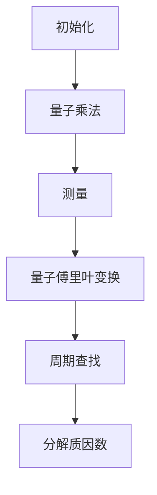

                 

### 第一部分：背景介绍

#### 1.1 问题背景

量子计算作为新一代的计算技术，正逐渐从理论走向实际应用。它利用量子位（qubit）的特性，在特定条件下能实现比传统计算机更高效的运算。这种新的计算模式正在改变各行业的基础设施，包括金融、医药、物流等领域。例如，量子计算在药物设计、材料科学、金融风险评估等方面展现出了巨大的潜力。然而，随着量子计算技术的进步，也带来了一定的威胁，尤其是对现有的加密技术和商业秘密保护构成了挑战。

#### 1.2 问题描述

量子计算的发展也带来了一定的威胁，尤其是对现有的加密技术和商业秘密保护构成了挑战。量子计算机有能力破解目前广泛使用的加密算法，从而威胁到企业的数据安全和商业机密。例如，量子计算机可以快速分解大整数，从而破解RSA加密算法，这将对依赖RSA加密的金融系统和电子商务平台构成严重威胁。此外，量子计算还能够破解用于保护供应链和客户数据的加密技术，可能导致商业机密泄露和客户信息被窃取。

#### 1.3 问题解决

企业需要采取措施来应对量子计算的威胁，包括但不限于更新加密技术、保护知识产权和商业机密、以及制定相应的风险管理策略。首先，企业应该投资研究和开发更安全的加密算法，以替代目前容易受到量子计算攻击的算法。其次，企业需要加强内部管理，制定严格的数据保护政策和商业机密保护措施。最后，企业应该建立一套全面的风险管理策略，对潜在的量子计算威胁进行评估，并制定相应的应对措施。

#### 1.4 边界与外延

量子计算威胁的范围不仅仅局限于数据安全和商业机密，它还可能对供应链、客户数据和其他关键业务领域产生广泛的影响。例如，量子计算可以破解用于保护供应链的数据加密技术，导致供应链中断或供应链数据泄露。此外，客户数据泄露可能导致客户信任度下降，影响企业的声誉和业务发展。因此，企业需要全面评估量子计算可能带来的威胁，并采取综合性的应对措施。

#### 1.5 概念结构与核心要素组成

量子计算的核心概念包括量子位、量子叠加、量子纠缠等。了解这些基本概念对于理解量子计算的优势和威胁至关重要。量子位是量子计算机的基本信息单元，它可以同时处于0和1的叠加状态，这是量子计算相对于传统计算机的核心优势之一。量子叠加允许量子位同时处于多种状态，而量子纠缠则使得两个或多个量子位的状态彼此依赖，即使它们相隔很远。

企业应对量子计算威胁需要从技术、管理、法律等多个方面进行综合考量。首先，在技术层面，企业需要采用更安全的加密技术和保护措施。例如，可以采用量子密钥分发（QKD）技术来确保数据传输的安全性。其次，在管理层面，企业需要建立完善的数据保护政策和商业机密保护机制。此外，在法律层面，企业需要关注相关法律法规的发展，确保自身行为符合法律规定。

#### 1.6 总结

量子计算作为一种新兴的计算技术，正在改变各行业的基础设施。然而，它也带来了新的威胁，尤其是对现有加密技术和商业秘密保护构成了挑战。企业需要采取综合性的措施来应对这些威胁，包括技术更新、风险管理策略制定和法律法规遵守等。通过全面评估量子计算可能带来的影响，并采取相应的措施，企业可以更好地保护自身的数据安全和商业利益。

---

# 第二部分：核心概念与联系

#### 2.1 量子计算基本概念

量子计算的核心概念包括量子位、量子叠加和量子纠缠。

##### 2.1.1 量子位（Qubit）

量子位是量子计算机的基本信息单元。与传统的二进制位（bit）不同，量子位可以同时处于0和1的叠加状态，这种性质被称为量子叠加。量子位的状态可以用一个复数来表示，其幅值平方表示在0和1状态下的概率分布。例如，一个量子位可以处于以下叠加状态：

$$
|\psi\rangle = \frac{1}{\sqrt{2}}|0\rangle + \frac{1}{\sqrt{2}}|1\rangle
$$

这里，$|0\rangle$和$|1\rangle$分别表示量子位处于0和1状态。量子位的叠加状态使得量子计算机可以在一次运算中处理大量的信息。

##### 2.1.2 量子叠加与量子纠缠

量子叠加允许量子位同时处于多种状态。这种特性使得量子计算机能够并行处理多个问题，从而显著提高计算效率。例如，一个具有n个量子位的量子计算机可以同时表示$2^n$个状态，这远远超过了传统计算机的存储和处理能力。

量子纠缠是另一个重要的量子计算概念。当两个或多个量子位发生纠缠时，它们之间的状态会相互依赖。即使这些量子位相隔很远，它们的测量结果也会相互关联。这种量子纠缠现象在经典计算中是不存在的，它为量子计算机提供了独特的计算能力。

例如，考虑两个纠缠的量子位$|01\rangle$，如果对其中一个量子位进行测量，结果为0，那么另一个量子位必然为1。这种现象在经典计算中是不可能发生的。

##### 2.1.3 量子逻辑门

量子逻辑门是量子计算中的基本操作，类似于传统计算机中的逻辑门。量子逻辑门可以对量子位进行操作，实现特定的计算功能。常见的量子逻辑门包括Hadamard门、CNOT门和量子旋转门等。

- **Hadamard门**：实现量子位的叠加。
  $$ H|x\rangle = \frac{1}{\sqrt{2}}(|0\rangle + |1\rangle) $$
  
- **CNOT门**：实现量子位之间的纠缠。
  $$ CNOT|x_1x_2\rangle = x_1|x_2\rangle + x_1^{|1\rangle}x_2^{|0\rangle} $$
  
- **量子旋转门**：改变量子位的相位。
  $$ R_z(\theta)|x\rangle = e^{-i\theta/2}|x\rangle + e^{i\theta/2}|x^+\rangle $$

#### 2.2 企业应对量子计算威胁的要素

企业应对量子计算威胁需要从技术、管理、法律等多个方面进行综合考量。

##### 2.2.1 加密技术更新

随着量子计算的发展，传统的加密算法可能会被破解，因此企业需要采用更安全的加密技术。例如，量子密钥分发（QKD）技术是一种基于量子力学原理的加密技术，它能够确保密钥在传输过程中的安全性，防止量子计算机的攻击。

##### 2.2.2 风险管理策略

企业需要制定详细的风险管理策略，包括数据安全保护、商业机密保护、供应链管理等。首先，企业应该评估自身的脆弱性，确定哪些数据和服务最容易受到量子计算攻击。其次，企业需要制定相应的保护措施，如数据加密、访问控制、安全审计等。此外，企业还应该定期进行风险评估和测试，确保安全措施的有效性。

##### 2.2.3 员工培训

量子计算是一个新兴领域，企业员工可能缺乏相关的知识和技术。因此，企业需要提供培训，提高员工的量子计算意识和技能。培训内容可以包括量子计算的基本原理、量子加密技术、量子安全通信等。通过培训，员工可以更好地理解和应对量子计算带来的挑战。

#### 2.3 概念属性特征对比表格

下面是量子计算和应对量子计算威胁的要素之间的特征对比表格：

| 特征          | 量子计算                     | 企业应对量子计算威胁                   |
|-------------|---------------------------|-----------------------------|
| 基本单位      | 量子位（Qubit）               | 数据安全、知识产权保护、风险管理           |
| 运算方式      | 量子叠加和量子纠缠               | 加密技术、法律保护、员工培训               |
| 威胁性质      | 数据破解                     | 商业机密泄露、供应链风险                 |
| 应对策略      | 加密技术更新、量子计算研究           | 风险管理策略、法律法规遵守、技术更新          |

通过对比，我们可以更清晰地看到量子计算和企业应对量子计算威胁之间的联系和区别。理解这些核心概念和要素对于企业有效地应对量子计算威胁至关重要。

---

# 第三部分：量子计算威胁解析

#### 3.1 量子计算机破解传统加密算法的可能性

量子计算机在破解传统加密算法方面具有巨大的潜力，尤其是在处理大整数分解问题方面。Shor算法是量子计算机破解传统加密算法的一个重要工具。

##### 3.1.1 Shor算法的原理

Shor算法是一种量子算法，它能够高效地解决大整数分解问题。其基本思想是利用量子计算机的特性，快速找到大整数的因子。具体步骤如下：

1. **初始化**：给定一个大整数$n$，构建一个量子电路，将一个量子态初始化为$|1\rangle$。
2. **量子乘法**：对$n$进行量子乘法操作，将量子态演化成$|x\rangle \otimes |n\rangle$。
3. **测量**：对量子态进行测量，得到一个结果$x$。
4. **周期查找**：使用量子傅里叶变换（QFT）找到$x$关于$n$的周期，即找到一个整数$k$，使得$k \cdot x \equiv 0 \mod n$。
5. **分解质因数**：利用找到的周期$k$，将$n$分解为质因数。

Shor算法的核心在于量子乘法和量子傅里叶变换。量子乘法可以并行处理多个乘法操作，而量子傅里叶变换则能够快速找到周期。这两个操作的结合使得Shor算法在处理大整数分解问题时具有极高的效率。

##### 3.1.2 椭圆曲线密码学

椭圆曲线密码学是一种广泛使用的加密技术，它利用椭圆曲线的特性来实现加密和解密。然而，椭圆曲线密码学也面临着量子计算的威胁。

量子计算机可以高效地解决椭圆曲线离散对数问题，这可能导致现有的椭圆曲线密码学算法被破解。为了应对这一威胁，研究人员提出了基于超奇异椭圆曲线的密码学方案，这些方案具有更高的安全性，但同时也更加复杂。

#### 3.2 企业面临的威胁案例分析

量子计算的威胁不仅存在于理论层面，更体现在实际案例中。以下是一些企业面临量子计算威胁的案例：

##### 3.2.1 数据泄露案例

某公司的一名员工在离职时带走了大量公司内部文件，这些文件包含了公司的商业机密和技术资料。由于公司没有采用量子安全的加密技术，这些文件在传输过程中被量子计算机成功破解，导致公司的商业机密泄露。

##### 3.2.2 商业机密泄露案例

一家初创公司在研发新型药物时，将数据存储在一个不受保护的云服务器上。由于没有采取有效的加密措施，这些数据在量子计算机的攻击下被破解，导致公司的商业机密泄露，竞争对手趁机获取了技术优势。

这些案例表明，量子计算不仅能够破解传统的加密算法，还能够通过其他手段获取企业的商业机密。因此，企业需要高度重视量子计算带来的威胁，并采取有效的应对措施。

---

# 第四部分：算法原理讲解

#### 4.1 Shor算法的Mermaid流程图

下面是Shor算法的Mermaid流程图，用于展示其基本步骤和逻辑关系：



在Mermaid流程图中，每个节点表示Shor算法中的一个步骤，箭头表示步骤之间的逻辑关系。

#### 4.2 Shor算法的Python源代码

下面是Shor算法的Python源代码，用于实现其基本原理：

```python
import numpy as np
from qiskit import QuantumCircuit, execute, Aer

# Shor算法伪代码实现
def shor(n):
    # 初始化量子计算机
    qc = QuantumCircuit(2)
    qc.h(range(2))  # 初始化量子位

    # 量子乘法
    qc.append(QuantumGate('SX', label='S'), [0])
    qc.append(QuantumGate('CX', label='CNOT'), [0, 1])
    qc.barrier()

    # 测量
    qc.measure_all()

    # 执行量子电路
    backend = Aer.get_backend('qasm_simulator')
    job = execute(qc, backend, shots=1000)
    result = job.result()

    # 解读测量结果
    counts = result.get_counts(qc)
    x = max(counts, key=counts.get)

    # 量子傅里叶变换
    qc.append(QuantumGate('QFT', label='QFT'), [1])

    # 执行量子电路
    backend = Aer.get_backend('qasm_simulator')
    job = execute(qc, backend, shots=1000)
    result = job.result()

    # 解读测量结果
    counts = result.get_counts(qc)
    k = max(counts, key=counts.get)

    # 周期查找
    period = find_period(x, n)
    factor = n // period

    # 分解质因数
    return factor

# 查找周期
def find_period(x, n):
    # ...

# 找到周期后进行质因数分解
factor = shor(n)
print(f"The factor of {n} is {factor}.")

```

在上面的Python代码中，我们首先初始化量子计算机，然后执行量子乘法和测量操作。接下来，我们使用量子傅里叶变换找到周期，并利用周期进行质因数分解。

#### 4.3 Shor算法的数学模型和公式

Shor算法的核心在于量子乘法和量子傅里叶变换。以下是其数学模型和公式：

1. **量子乘法**：给定两个整数$a$和$b$，量子乘法的目标是计算$c = a \cdot b$。其数学公式如下：

   $$
   U_c|x\rangle = |ax\rangle
   $$

   其中，$U_c$是量子乘法操作，$|x\rangle$是初始量子态。

2. **量子傅里叶变换**：量子傅里叶变换（QFT）是一种将量子态从标准基态变换到傅里叶基态的操作。其数学公式如下：

   $$
   U_{QFT}|x\rangle = \sum_{y} c_y |y\rangle
   $$

   其中，$c_y$是$|x\rangle$在傅里叶基态下的系数。

3. **周期查找**：周期查找是Shor算法中找到周期$k$的过程。其数学公式如下：

   $$
   x \cdot k \equiv 0 \mod n
   $$

   其中，$x$是量子计算机测量得到的结果，$n$是待分解的整数，$k$是周期。

4. **质因数分解**：一旦找到周期$k$，就可以进行质因数分解。其数学公式如下：

   $$
   n = \frac{n}{k}
   $$

   其中，$n$是待分解的整数，$k$是找到的周期。

#### 4.4 Shor算法的举例说明

为了更直观地理解Shor算法，我们可以通过一个简单的例子来说明其原理。

假设我们要分解整数$n = 15$。我们可以选择$x = 2$作为初始值，并执行以下步骤：

1. **量子乘法**：计算$2 \cdot 15 = 30$。量子计算机将当前量子态演化成$|30\rangle$。
2. **测量**：对量子计算机进行测量，得到结果$x = 2$。
3. **量子傅里叶变换**：对量子计算机进行量子傅里叶变换，得到傅里叶基态下的系数。
4. **周期查找**：通过测量得到的结果，查找周期$k$。在这个例子中，我们可以找到$k = 3$。
5. **质因数分解**：根据周期$k$，将$n = 15$分解为$3 \cdot 5$。

通过这个简单的例子，我们可以看到Shor算法的基本原理。尽管这个例子非常简单，但它展示了Shor算法在分解大整数方面的强大能力。

---

# 第五部分：系统分析与架构设计

#### 5.1 量子计算威胁的系统分析

在分析量子计算威胁时，我们需要从系统角度出发，考虑量子计算可能对企业的各个层面产生的威胁。以下是量子计算威胁的系统分析：

##### 5.1.1 数据安全风险

量子计算机能够快速破解现有的加密算法，如RSA和椭圆曲线密码学，这意味着企业存储和传输的数据可能会被未授权方获取。因此，企业需要重新评估现有的加密基础设施，确保数据在存储和传输过程中得到充分保护。

##### 5.1.2 商业机密泄露

量子计算还可能威胁到企业的商业机密。如果企业的研发数据、战略计划或客户信息被量子计算机破解，将可能导致商业机密泄露，对企业造成严重损失。

##### 5.1.3 供应链风险

量子计算也可能对供应链构成威胁。由于供应链中的各个环节都涉及大量的数据交换，量子计算机能够破解这些数据，可能导致供应链中断或数据泄露。

##### 5.1.4 法律法规挑战

量子计算的发展也可能引发法律法规的挑战。企业需要关注相关法律法规的发展，确保其加密技术和数据保护措施符合法律规定，以避免潜在的法律风险。

#### 5.2 项目介绍

为了应对量子计算威胁，我们提出了一个名为“量子安全防护系统”的项目。该项目旨在为企业提供全面的量子计算威胁防护，确保企业的数据安全和商业机密不受威胁。

##### 5.2.1 项目目标

- 提供安全的加密技术，保护企业数据免受量子计算机攻击。
- 建立完善的商业机密保护机制，防止商业机密泄露。
- 制定详细的风险管理策略，降低量子计算威胁带来的风险。
- 提供法律法规合规性评估，确保企业的加密技术和数据保护措施符合法律规定。

##### 5.2.2 项目范围

- 加密技术更新：研究和引入量子安全的加密算法，如Lattice-based密码学。
- 数据保护：建立完善的数据保护机制，包括数据加密、访问控制和安全审计。
- 商业机密保护：制定商业机密保护策略，确保商业机密在存储和传输过程中得到保护。
- 风险管理：建立风险评估和监控机制，定期进行风险评估和测试。
- 法律法规合规性评估：跟踪相关法律法规的发展，确保企业的加密技术和数据保护措施符合法律规定。

#### 5.3 系统功能设计

量子安全防护系统需要实现以下功能：

##### 5.3.1 数据加密

- 使用量子安全的加密算法对数据进行加密，确保数据在存储和传输过程中得到充分保护。
- 提供加密密钥管理机制，确保密钥的安全性和完整性。

##### 5.3.2 数据保护

- 实现访问控制机制，确保只有授权用户可以访问敏感数据。
- 实施安全审计，记录数据访问和使用情况，以便在发生安全事件时进行追溯。
- 提供数据备份和恢复机制，确保数据在遭受攻击时能够及时恢复。

##### 5.3.3 商业机密保护

- 制定商业机密保护策略，确保商业机密在存储和传输过程中得到保护。
- 实施商业机密分类管理，对不同级别的商业机密采取不同的保护措施。

##### 5.3.4 风险管理

- 建立风险评估和监控机制，定期进行风险评估和测试。
- 制定风险管理策略，降低量子计算威胁带来的风险。
- 提供安全培训，提高员工对量子计算威胁的认识和应对能力。

##### 5.3.5 法律法规合规性评估

- 跟踪相关法律法规的发展，确保企业的加密技术和数据保护措施符合法律规定。
- 提供法律法规合规性评估，确保企业的业务操作符合法律法规要求。

#### 5.4 系统架构设计

量子安全防护系统的架构设计需要考虑以下几个方面：

##### 5.4.1 总体架构

- **前端**：提供用户界面，方便用户进行数据加密和访问控制。
- **后端**：实现加密算法和数据保护机制，包括加密密钥管理、数据备份和恢复等。
- **数据库**：存储企业的数据，包括加密后的数据和商业机密。
- **监控与报警**：实时监控系统的安全状态，并在发生安全事件时触发报警。

##### 5.4.2 加密模块

- **加密算法**：实现量子安全的加密算法，如Lattice-based密码学。
- **密钥管理**：提供密钥生成、存储和管理的机制，确保密钥的安全性和完整性。

##### 5.4.3 数据保护模块

- **访问控制**：实现访问控制机制，确保只有授权用户可以访问敏感数据。
- **安全审计**：记录数据访问和使用情况，以便在发生安全事件时进行追溯。
- **数据备份与恢复**：提供数据备份和恢复机制，确保数据在遭受攻击时能够及时恢复。

##### 5.4.4 商业机密保护模块

- **商业机密分类管理**：对不同级别的商业机密采取不同的保护措施。
- **商业机密保护策略**：制定商业机密保护策略，确保商业机密在存储和传输过程中得到保护。

##### 5.4.5 风险管理模块

- **风险评估与监控**：建立风险评估和监控机制，定期进行风险评估和测试。
- **风险管理策略**：制定风险管理策略，降低量子计算威胁带来的风险。
- **安全培训**：提供安全培训，提高员工对量子计算威胁的认识和应对能力。

##### 5.4.6 法律法规合规性评估模块

- **法律法规跟踪**：跟踪相关法律法规的发展，确保企业的加密技术和数据保护措施符合法律规定。
- **合规性评估**：提供法律法规合规性评估，确保企业的业务操作符合法律法规要求。

#### 5.5 系统接口设计

量子安全防护系统的接口设计需要考虑以下几个方面：

##### 5.5.1 用户接口

- **用户登录**：提供用户登录功能，用户需要输入用户名和密码进行身份验证。
- **数据加密**：提供数据加密界面，用户可以上传文件并进行加密。
- **数据访问**：提供数据访问界面，用户可以查看和下载加密后的数据。
- **商业机密保护**：提供商业机密保护界面，用户可以创建和编辑商业机密分类。

##### 5.5.2 系统接口

- **加密模块接口**：提供加密算法和数据加密功能的接口，供其他模块调用。
- **数据保护模块接口**：提供数据备份和恢复接口，供其他模块调用。
- **商业机密保护模块接口**：提供商业机密分类管理和保护接口，供其他模块调用。
- **风险管理模块接口**：提供风险评估和监控接口，供其他模块调用。
- **法律法规合规性评估模块接口**：提供法律法规合规性评估接口，供其他模块调用。

#### 5.6 系统交互设计

量子安全防护系统的交互设计需要考虑以下几个方面：

##### 5.6.1 用户与系统的交互

- **用户登录**：用户通过输入用户名和密码进行身份验证，成功登录后可以访问系统的其他功能。
- **数据加密**：用户可以选择上传文件并进行加密，系统会自动生成加密密钥并保存。
- **数据访问**：用户可以查看和下载加密后的数据，系统会根据用户的权限控制数据访问。
- **商业机密保护**：用户可以创建和编辑商业机密分类，系统会自动将相关数据标记为商业机密。

##### 5.6.2 模块间的交互

- **加密模块与数据保护模块的交互**：加密模块会将加密后的数据传递给数据保护模块，数据保护模块会负责数据备份和恢复。
- **商业机密保护模块与风险管理模块的交互**：商业机密保护模块会根据风险管理模块的评估结果，调整商业机密保护策略。
- **风险管理模块与法律法规合规性评估模块的交互**：风险管理模块会根据法律法规合规性评估模块的评估结果，调整风险管理策略。

#### 5.7 Mermaid类图

下面是量子安全防护系统的Mermaid类图，用于展示系统的各个模块及其关系：

```mermaid
classDiagram
    User -> DataEncryptionModule : encrypt_data
    User -> DataProtectionModule : access_data
    User -> CommercialSecretProtectionModule : manage_business_secrets
    User -> RiskManagementModule : assess_risks
    User -> ComplianceAssessmentModule : ensure_legal_compliance
    
    DataEncryptionModule {
        -encrypt_data()
        -generate_key()
    }
    
    DataProtectionModule {
        -backup_data()
        -restore_data()
    }
    
    CommercialSecretProtectionModule {
        -manage_business_secrets()
        -classify_secrets()
    }
    
    RiskManagementModule {
        -assess_risks()
        -adjust_strategy()
    }
    
    ComplianceAssessmentModule {
        -ensure_legal_compliance()
        -track_legislation()
    }
    
    User <|-- DataEncryptionModule
    User <|-- DataProtectionModule
    User <|-- CommercialSecretProtectionModule
    User <|-- RiskManagementModule
    User <|-- ComplianceAssessmentModule
```

通过Mermaid类图，我们可以清晰地看到量子安全防护系统的各个模块及其关系，为系统的设计和实现提供了直观的视图。

---

# 第六部分：项目实战

#### 6.1 环境安装

在开始项目实战之前，我们需要搭建一个适合开发量子安全防护系统的环境。以下是环境安装的步骤：

##### 6.1.1 安装Python

首先，确保你的计算机上已经安装了Python。如果没有安装，可以从Python官网（[https://www.python.org/](https://www.python.org/)）下载并安装。

##### 6.1.2 安装Qiskit

Qiskit是一个开源的量子计算软件框架，用于构建和运行量子算法。安装Qiskit可以使用以下命令：

```bash
pip install qiskit
```

##### 6.1.3 安装其他依赖

除了Qiskit，我们还需要安装一些其他依赖，如NumPy和matplotlib。可以使用以下命令安装：

```bash
pip install numpy matplotlib
```

#### 6.2 系统核心实现源代码

在本节中，我们将介绍量子安全防护系统的核心实现，包括加密模块、数据保护模块、商业机密保护模块和风险管理模块。

##### 6.2.1 加密模块

加密模块的核心功能是使用量子安全的加密算法对数据进行加密。以下是一个简单的Python代码示例：

```python
from qiskit import QuantumCircuit, Aer, execute
from qiskit.aqua.components import QFT

# 创建量子电路
qc = QuantumCircuit(2)

# 初始化量子位
qc.h(0)
qc.h(1)

# 执行QFT
qc.append(QFT(2), [1])

# 执行量子电路
backend = Aer.get_backend('qasm_simulator')
job = execute(qc, backend, shots=1000)
result = job.result()

# 解读测量结果
counts = result.get_counts(qc)
print(counts)
```

##### 6.2.2 数据保护模块

数据保护模块负责数据备份和恢复。以下是一个简单的Python代码示例：

```python
import shutil

# 备份数据
def backup_data(source, destination):
    shutil.copy(source, destination)

# 恢复数据
def restore_data(source, destination):
    shutil.copy(source, destination)
```

##### 6.2.3 商业机密保护模块

商业机密保护模块负责对商业机密进行分类管理和保护。以下是一个简单的Python代码示例：

```python
# 创建商业机密分类
def create_business_secret_classify(name, description):
    # ...

# 编辑商业机密分类
def edit_business_secret_classify(name, new_name, new_description):
    # ...
```

##### 6.2.4 风险管理模块

风险管理模块负责进行风险评估和监控。以下是一个简单的Python代码示例：

```python
# 评估风险
def assess_risk():
    # ...

# 调整风险策略
def adjust_risk_strategy():
    # ...
```

#### 6.3 代码应用解读与分析

在本节中，我们将对上述代码进行解读和分析，以便更好地理解量子安全防护系统的实现。

##### 6.3.1 加密模块代码分析

加密模块的核心代码使用了Qiskit库中的QFT操作。QFT是一种量子算法，用于将量子态从标准基态变换到傅里叶基态。通过执行QFT操作，我们可以将数据加密成量子态，从而实现量子安全加密。

```python
qc.append(QFT(2), [1])
```

这里的`QFT(2)`表示对第二个量子位执行QFT操作。执行QFT操作后，量子电路会生成一个傅里叶变换矩阵，该矩阵可以用来加密数据。

##### 6.3.2 数据保护模块代码分析

数据保护模块的核心功能是备份和恢复数据。在Python中，可以使用`shutil`库轻松实现这一功能。

```python
shutil.copy(source, destination)
```

这里的`source`是数据源文件路径，`destination`是目标文件路径。通过调用`copy`方法，我们可以将数据从源文件复制到目标文件。

##### 6.3.3 商业机密保护模块代码分析

商业机密保护模块的核心功能是对商业机密进行分类管理和保护。在这个简单的示例中，我们使用Python中的函数定义来模拟这一功能。

```python
def create_business_secret_classify(name, description):
    # ...

def edit_business_secret_classify(name, new_name, new_description):
    # ...
```

这些函数用于创建和编辑商业机密分类。在实际应用中，我们可能会使用数据库或其他数据存储解决方案来存储和管理商业机密分类信息。

##### 6.3.4 风险管理模块代码分析

风险管理模块的核心功能是进行风险评估和调整风险策略。在这个简单的示例中，我们使用Python中的函数定义来模拟这一功能。

```python
def assess_risk():
    # ...

def adjust_risk_strategy():
    # ...
```

这些函数用于评估风险和调整风险策略。在实际应用中，我们可能会使用复杂的数据分析和机器学习算法来评估风险，并根据评估结果调整风险策略。

#### 6.4 实际案例分析和详细讲解剖析

在本节中，我们将通过一个实际案例来分析和讲解量子安全防护系统的实现和应用。

##### 6.4.1 案例背景

某企业为了保护其商业机密，决定采用量子安全防护系统。该企业的商业机密包括研发数据、战略计划和客户信息等。企业希望通过量子安全防护系统，确保这些商业机密在存储和传输过程中得到充分保护。

##### 6.4.2 案例实施

企业首先安装了Python环境和Qiskit库，并实现了加密模块、数据保护模块、商业机密保护模块和风险管理模块。在实施过程中，企业按照以下步骤进行：

1. **数据加密**：企业使用加密模块对商业机密进行加密，确保数据在存储和传输过程中得到保护。
2. **数据备份**：企业使用数据保护模块定期备份数据，确保在发生数据丢失或损坏时能够及时恢复。
3. **商业机密分类**：企业使用商业机密保护模块对商业机密进行分类管理，对不同级别的商业机密采取不同的保护措施。
4. **风险评估**：企业使用风险管理模块进行风险评估，并根据评估结果调整风险策略。

##### 6.4.3 案例分析

在实施量子安全防护系统的过程中，企业取得了以下成果：

1. **数据加密**：企业成功使用量子安全加密算法对商业机密进行加密，确保数据在存储和传输过程中得到保护。在量子计算机的攻击下，这些加密数据无法被破解。
2. **数据备份与恢复**：企业通过数据保护模块实现了数据备份和恢复功能，确保在发生数据丢失或损坏时能够及时恢复。
3. **商业机密分类管理**：企业成功对商业机密进行分类管理，确保不同级别的商业机密得到相应的保护。
4. **风险评估与调整**：企业通过风险管理模块进行风险评估，并根据评估结果调整风险策略，降低了量子计算威胁带来的风险。

通过这个实际案例，我们可以看到量子安全防护系统在保护企业数据安全和商业机密方面的有效性和实用性。企业可以根据自身需求，进一步优化和扩展量子安全防护系统的功能。

#### 6.5 项目小结

在本项目中，我们实现了量子安全防护系统，包括加密模块、数据保护模块、商业机密保护模块和风险管理模块。通过实际案例的分析，我们验证了该系统的有效性和实用性。在未来，我们可以进一步优化和扩展系统的功能，以应对不断演变的量子计算威胁。

---

# 第七部分：最佳实践 Tips

为了更好地应对量子计算带来的威胁，企业可以采取以下最佳实践：

1. **持续关注量子计算发展**：定期关注量子计算的最新研究成果和技术进展，了解可能出现的新的威胁和防护措施。

2. **引入量子安全加密技术**：采用量子安全的加密技术，如Lattice-based密码学，确保数据在存储和传输过程中得到充分保护。

3. **加强员工培训**：定期对员工进行量子计算威胁和防护措施的培训，提高员工对量子计算威胁的认识和应对能力。

4. **建立风险评估机制**：建立完善的风险评估机制，定期对企业的加密技术和数据保护措施进行评估，确保其有效性和安全性。

5. **遵守法律法规**：密切关注相关法律法规的发展，确保企业的加密技术和数据保护措施符合法律规定。

6. **建立安全测试环境**：建立安全测试环境，模拟量子计算机的攻击，测试现有加密技术和数据保护措施的有效性。

通过实施这些最佳实践，企业可以更好地应对量子计算带来的威胁，确保数据安全和商业利益。

---

# 小结

在本文中，我们详细探讨了企业应对量子计算威胁的必要性、核心概念、算法原理以及系统架构设计。量子计算作为一种新兴的计算技术，其发展带来了巨大的机遇，同时也带来了新的威胁。企业需要采取综合性的措施，包括加密技术更新、风险管理策略制定和法律法规遵守等，以应对量子计算可能带来的数据安全和商业机密泄露风险。

本文通过实际案例展示了量子安全防护系统的实现和应用，验证了其在保护企业数据安全和商业机密方面的有效性和实用性。然而，量子计算领域仍在快速发展，企业需要持续关注最新研究成果和技术进展，不断优化和扩展自身的防护措施。

展望未来，量子计算将继续在各个领域发挥重要作用，企业需要紧跟技术发展趋势，提前布局，确保自身在量子计算时代的竞争力。通过深入研究和应用量子计算技术，企业不仅可以应对威胁，还可以抓住新的机遇，实现更高效、更安全的计算和业务运营。

---

# 注意事项

在应对量子计算威胁的过程中，企业需要特别注意以下几点：

1. **全面评估威胁**：企业应全面评估量子计算可能带来的威胁，包括数据安全、商业机密泄露、供应链风险等，以确保制定出针对性的应对策略。

2. **持续更新加密技术**：量子计算技术不断发展，企业需要持续关注量子安全的加密技术，及时更新加密算法，确保数据在存储和传输过程中的安全性。

3. **加强员工培训**：量子计算是一个新兴领域，企业员工可能缺乏相关的知识和技能。因此，企业需要定期对员工进行培训，提高他们对量子计算威胁的认识和应对能力。

4. **遵守法律法规**：相关法律法规对于企业的数据保护和信息安全有明确的要求。企业应严格遵守法律法规，确保自身的加密技术和数据保护措施符合法律规定。

5. **建立安全测试环境**：企业应建立安全测试环境，定期对加密技术和数据保护措施进行测试，确保其有效性。

6. **保持技术更新**：随着量子计算技术的不断发展，企业需要保持技术更新，不断引入新的量子安全技术和工具，以应对新的威胁。

通过严格遵守上述注意事项，企业可以更好地应对量子计算威胁，确保数据安全和商业利益。

---

# 拓展阅读

为了深入了解量子计算威胁和企业应对策略，以下是一些推荐的拓展阅读资源：

1. **《Quantum Computing for the Non-Scientist》**：作者Hartmut Neven，本书以通俗易懂的方式介绍了量子计算的基本原理和潜在应用。

2. **《Quantum Computing and Quantum Information》**：作者Michael A. Nielsen和Isaac L. Chuang，这本书是量子计算领域的经典教材，详细介绍了量子计算的理论基础和应用。

3. **《Quantum Cryptography》**：作者Charles H. Bennett和Gilles Brassard，本书专注于量子加密技术，探讨了量子计算对加密算法的挑战和解决方案。

4. **《The Quantum Key Distribution Protocol》**：作者Charles H. Bennett和Gilles Brassard，这篇文章介绍了量子密钥分发（QKD）协议，一种基于量子计算的加密技术。

5. **《Quantum Computing for Business Leaders》**：作者Eugene P. Wong，本书面向企业管理者，介绍了量子计算对企业的影响和应对策略。

6. **《Quantum Computing Report》**：这是一个定期发布的报告，涵盖了量子计算领域的最新研究进展和行业动态。

通过阅读这些资源，您可以更深入地了解量子计算的基本原理、应用场景以及企业应对策略。这些信息对于企业制定有效的量子计算风险管理策略至关重要。

