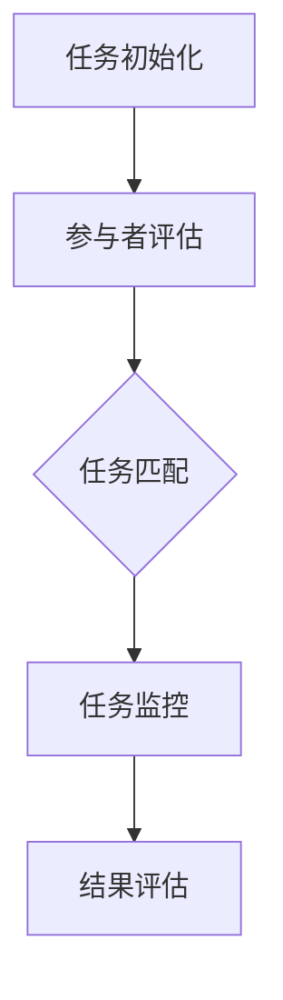
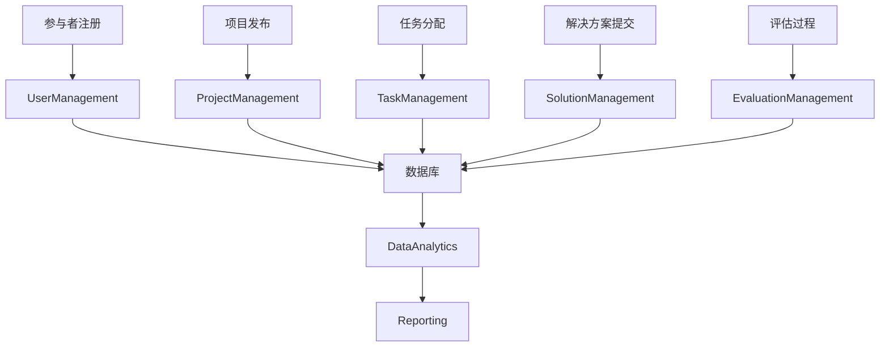

                 

### 引言

科学发现是推动社会进步和人类文明发展的重要动力。随着科技的不断进步，科学研究领域的复杂性日益增加，传统的科研模式逐渐难以满足当前的需求。在这种背景下，众包科学项目作为一种新兴的科研模式，开始受到越来越多的关注。

**关键词**：众包、科学项目、集体智慧、科研模式。

**摘要**：本文旨在探讨众包科学项目的设计，利用集体智慧推动科学发现。文章将介绍众包的概念及其在科学项目中的应用，分析众包科学项目的设计原理，探讨众包平台的选择与构建，任务的设计与管理，集体智慧的利用与激励，科学发现的推进与评估，并结合案例分析提供实践启示。

### 问题背景

科学研究的复杂性日益增加，单个研究者或团队难以独自完成复杂的科研任务。而传统的科研模式，如实验室研究、合作研究等，往往存在资源限制、时间限制、人员限制等问题，难以高效地推进科学发现。为了解决这些问题，科学家们开始探索新的科研模式，其中，众包模式因其独特的优势而受到广泛关注。

**问题背景**：

- **科学研究复杂性增加**：现代科学研究涉及多个学科领域，需要大量的数据分析和计算能力，单个研究者或团队难以独自完成。
- **资源限制**：传统的科研模式往往受到实验室设备、资金、人员等资源的限制，难以高效地推进科研工作。
- **时间限制**：科学研究往往需要长时间的实验和观察，传统的科研模式难以在短时间内获得显著成果。
- **人员限制**：科学研究需要多学科背景的人才，而传统模式往往局限于特定领域的研究者，难以充分利用多元化的人才优势。

### 问题描述

众包科学项目的设计涉及到多个方面，包括项目的确定、众包平台的选择与构建、任务的设计与管理、集体智慧的利用与激励、科学发现的推进与评估等。这些问题需要我们深入探讨，以设计出高效的众包科学项目。

**问题描述**：

- **项目确定**：如何选择适合众包的科学项目？如何确定项目的目标和范围？
- **平台选择与构建**：如何选择合适的众包平台？如何构建一个高效的众包平台？
- **任务设计与管理**：如何设计适合众包的任务？如何管理众包任务，确保任务的顺利进行？
- **集体智慧利用与激励**：如何利用众包参与者的集体智慧？如何激励参与者积极参与众包项目？
- **科学发现推进与评估**：如何推进科学发现？如何评估众包科学项目的效果？

### 问题解决

众包科学项目的设计需要遵循一系列原则和步骤。首先，我们需要明确项目的目标和范围，确保项目具有可行性和价值。然后，选择合适的众包平台，构建一个高效、安全的众包平台。接下来，设计众包任务，明确任务的目标、要求、评估标准等。在任务执行过程中，我们需要管理众包任务，确保任务的顺利进行。同时，利用集体智慧，激励参与者积极参与，推动科学发现。最后，对众包科学项目进行评估，总结经验教训，为后续项目提供参考。

**问题解决**：

1. **明确项目目标和范围**：确保项目具有可行性和价值。
2. **选择合适的众包平台**：构建高效、安全的众包平台。
3. **设计众包任务**：明确任务的目标、要求、评估标准等。
4. **管理众包任务**：确保任务的顺利进行。
5. **利用集体智慧**：激励参与者积极参与，推动科学发现。
6. **评估众包科学项目**：总结经验教训，为后续项目提供参考。

### 边界与外延

众包科学项目的设计涉及多个领域，包括计算机科学、信息技术、统计学、心理学等。其边界在于如何有效地利用众包模式推进科学发现，而外延则包括众包平台的设计、任务设计、参与者管理等多个方面。

**边界与外延**：

- **边界**：如何有效地利用众包模式推进科学发现。
- **外延**：众包平台的设计、任务设计、参与者管理等多个方面。

### 概念结构与核心要素组成

众包科学项目的设计涉及多个核心概念，包括众包、科学项目、集体智慧等。这些概念相互关联，构成了众包科学项目的整体结构。核心要素包括项目目标、任务设计、平台构建、参与者管理、集体智慧利用等。

**概念结构与核心要素组成**：

1. **众包**：一种利用外部资源完成任务的协作模式。
2. **科学项目**：需要完成的科学研究任务。
3. **集体智慧**：众包参与者共同形成的智慧。
4. **项目目标**：明确项目要达成的目标。
5. **任务设计**：设计适合众包的任务。
6. **平台构建**：构建高效、安全的众包平台。
7. **参与者管理**：管理众包参与者。
8. **集体智慧利用**：利用集体智慧推进科学发现。

### 总结

众包科学项目的设计是一个复杂的过程，需要综合考虑多个方面。通过明确项目目标、选择合适的众包平台、设计合适的任务、管理参与者、利用集体智慧，我们可以推进科学发现，为科学研究带来新的可能性。在接下来的章节中，我们将详细探讨众包科学项目的设计原理、众包平台的选择与构建、任务的设计与管理、集体智慧的利用与激励、科学发现的推进与评估等方面的内容。

---

### 核心概念与联系

在深入探讨众包科学项目的设计之前，我们需要理解几个核心概念，包括众包、科学项目、集体智慧等。这些概念不仅定义了众包科学项目的框架，而且相互之间有着紧密的联系。

#### 众包（Crowdsourcing）

众包是一种利用外部资源完成任务的协作模式。它通过互联网平台，将复杂的任务分解为多个小任务，分配给广泛分布在网络中的个体执行。众包的优势在于其灵活性、多样性和成本效益。众包能够迅速聚集大量的劳动力和智慧，使得原本难以完成的任务得以高效完成。

**定义**：
众包（Crowdsourcing）是一种将任务分配给一个分布式群体，以共同完成目标的方式。

**核心特点**：
- **灵活性**：众包任务可以根据参与者的时间和能力灵活调整。
- **多样性**：参与者可能来自不同的背景，能够带来多样化的视角和解决方案。
- **成本效益**：众包可以降低组织运营成本，同时提高任务完成的效率。

#### 科学项目（Scientific Projects）

科学项目是科学研究的具体实施计划，它涵盖了从研究问题确定、数据收集、实验设计、数据分析到结果解读的整个流程。科学项目是推动科学发现和创新的重要手段。

**定义**：
科学项目（Scientific Projects）是按照科学方法进行的系统性研究活动，旨在解决特定科学问题或实现特定科学研究目标。

**核心特点**：
- **系统性**：科学项目需要经过严密的设计和执行，确保研究的科学性和有效性。
- **目标导向**：科学项目具有明确的研究目标，需要通过一系列实验和数据分析来实现。
- **创新性**：科学项目往往涉及新的理论、方法或技术的应用，推动科学进步。

#### 集体智慧（Collective Wisdom）

集体智慧是指一个群体成员通过交流和合作，共同形成的智慧和知识。在众包科学项目中，集体智慧是关键资源，它能够通过集体协作解决复杂问题，提高决策质量，加速科学发现。

**定义**：
集体智慧（Collective Wisdom）是群体成员通过沟通、合作和共享，共同创造和积累的知识和智慧。

**核心特点**：
- **协同效应**：集体智慧能够通过个体的协同作用，实现比单个个体更高效的决策和成果。
- **知识共享**：集体智慧依赖于知识的共享和传播，促进信息流动和创新。
- **动态性**：集体智慧是动态变化的，随着群体成员的加入和离开，智慧水平也会相应变化。

#### 众包与科学项目的联系

众包与科学项目之间的联系在于，众包模式能够为科学项目提供一种新的实施路径。众包不仅能够解决科学项目中的人力资源问题，还能够通过集体智慧加速科学发现的进程。

**联系**：

- **人力资源补充**：众包可以迅速聚集大量的劳动力，为科学项目提供所需的人力资源。
- **多样化视角**：众包参与者来自不同的背景，能够提供多样化的视角，有助于科学问题的多角度分析和解决。
- **协同合作**：众包模式鼓励参与者之间的合作和沟通，有助于形成集体智慧，提高科学项目的成功几率。
- **成本节约**：众包可以降低科学项目的运营成本，提高资源利用效率。

#### 核心概念属性特征对比表格

为了更好地理解众包、科学项目和集体智慧之间的关系，我们可以通过一个对比表格来展示它们的核心属性特征。

| 核心概念 | 定义 | 核心特点 |
| :---: | :---: | :---: |
| 众包 | 利用外部资源完成任务的协作模式 | 灵活性、多样性、成本效益 |
| 科学项目 | 科学研究的具体实施计划 | 系统性、目标导向、创新性 |
| 集体智慧 | 群体成员通过沟通、合作和共享形成的智慧和知识 | 协同效应、知识共享、动态性 |

#### ER实体关系图架构

为了更直观地展示众包、科学项目和集体智慧之间的关联，我们可以使用Mermaid绘制一个ER（实体-关系）图。

```mermaid
erDiagram
    Project ||--|{ Participant } : participates_in
    Project ||--|{ Task } : defines
    Participant ||--|{ Solution } : proposes
    Participant ||--|{ Feedback } : provides
    Task ||--|{ Evaluation } : evaluated_by
    Project ||--|{ Evaluation } : assessed_by
    Project ||--|{ Result } : produces
    Result ||--|{ Publication } : derived_from
```

- **Project（项目）**：科学项目的主体，定义了研究目标和范围。
- **Participant（参与者）**：众包项目的参与者，提供人力和智慧。
- **Task（任务）**：项目中的具体任务，由参与者执行。
- **Solution（解决方案）**：参与者提出的解决方案或成果。
- **Feedback（反馈）**：参与者提供的评估和改进建议。
- **Evaluation（评估）**：对任务和项目的评估结果。
- **Result（结果）**：项目的最终成果。
- **Publication（出版物）**：项目结果的相关出版物。

通过这个ER图，我们可以清晰地看到众包科学项目中各个实体之间的联系和互动，为后续的设计和分析提供了基础。

### 算法原理讲解

在众包科学项目中，任务的设计与管理是关键环节。为了确保任务的有效执行和科学发现的高效推进，我们需要设计一套科学的算法来指导任务分配、参与者管理和评估。以下将详细讲解任务分配算法的原理，并通过Python代码示例进行阐述。

#### 算法概述

任务分配算法的目标是将众包项目中的任务合理分配给参与者，确保任务完成的质量和效率。一个基本的任务分配算法需要考虑以下几个因素：

- **参与者能力**：根据参与者的技能水平和历史表现，将任务分配给最适合的参与者。
- **任务难度**：确保任务难度与参与者的能力相匹配，避免过度挑战或不足挑战。
- **任务依赖关系**：考虑任务之间的依赖关系，避免因任务冲突导致项目延误。

#### 算法流程

1. **任务初始化**：获取项目的所有任务，包括任务的难度级别和所需技能。
2. **参与者评估**：根据参与者的历史表现和能力评估，将参与者分类。
3. **任务匹配**：根据参与者的分类和能力，将任务分配给合适的参与者。
4. **任务监控**：实时监控任务的进展，对异常情况进行调整。
5. **结果评估**：对任务完成情况进行评估，收集反馈，用于改进算法。

#### Mermaid流程图

首先，我们使用Mermaid绘制任务分配算法的流程图。



- **任务初始化**：从项目中获取所有任务。
- **参与者评估**：评估参与者的技能和表现。
- **任务匹配**：将任务分配给合适的参与者。
- **任务监控**：监控任务进度和异常情况。
- **结果评估**：评估任务完成情况，收集反馈。

#### Python代码示例

接下来，我们使用Python代码实现上述任务分配算法。

```python
import random

# 任务类定义
class Task:
    def __init__(self, id, difficulty, required_skills):
        self.id = id
        self.difficulty = difficulty
        self.required_skills = required_skills

# 参与者类定义
class Participant:
    def __init__(self, id, skills, history):
        self.id = id
        self.skills = skills
        self.history = history

# 任务分配算法
def assign_tasks(projects, participants):
    task_pool = [task for project in projects for task in project.tasks]
    participant_pool = participants
    
    assigned_tasks = []
    for task in task_pool:
        suitable_participants = [participant for participant in participant_pool if set(task.required_skills).issubset(participant.skills)]
        if suitable_participants:
            participant = random.choice(suitable_participants)
            participant.assigned_tasks.append(task)
            assigned_tasks.append(task)
    
    return assigned_tasks

# 示例
projects = [
    Task(1, 'medium', {'python', 'data_analysis'}),
    Task(2, 'high', {'machine_learning', 'natural_language_processing'})
]

participants = [
    Participant(1, {'python', 'data_analysis'}, {'task1', 'task2'}),
    Participant(2, {'machine_learning', 'natural_language_processing'}, {'task3', 'task4'})
]

assigned_tasks = assign_tasks(projects, participants)
print(assigned_tasks)
```

- **任务类（Task）**：包含任务的ID、难度级别和所需技能。
- **参与者类（Participant）**：包含参与者的ID、技能集和历史任务。
- **任务分配算法（assign_tasks）**：根据任务和参与者的技能集进行匹配，将任务分配给合适的参与者。

#### 算法原理详细讲解

1. **任务初始化**：
   在任务初始化阶段，我们从项目中获取所有任务，每个任务包含其ID、难度级别和所需技能。这些信息将用于后续的匹配和分配。

2. **参与者评估**：
   参与者的评估基于其技能集和历史任务。我们首先获取所有参与者的技能集和历史任务，然后根据任务的所需技能，评估每个参与者是否适合执行该任务。

3. **任务匹配**：
   在任务匹配阶段，我们遍历所有的任务，并根据任务所需的技能，筛选出适合执行该任务的参与者。通过随机选择的方式，将任务分配给合适的参与者。

4. **任务监控**：
   在任务执行过程中，我们需要实时监控任务的进度。这可以通过设置监控机制来实现，例如，定期检查任务完成情况，对异常情况进行及时调整。

5. **结果评估**：
   任务完成后，我们需要对任务完成情况进行评估。这包括检查任务是否按时完成、任务质量是否满足要求等。评估结果将用于改进算法，提高任务分配的准确性和效率。

#### 数学模型与公式

为了更深入地理解任务分配算法，我们可以引入一些数学模型和公式。

1. **技能匹配度计算**：

   假设一个任务`T`所需的技能集为`S_T`，一个参与者`P`的技能集为`S_P`，我们可以用以下公式计算技能匹配度：

   $$\text{MatchScore}(S_T, S_P) = \frac{|S_T \cap S_P|}{|S_T \cup S_P|}$$

   其中，`|S_T \cap S_P|`表示两个技能集的交集大小，`|S_T \cup S_P|`表示两个技能集的并集大小。匹配度越高，说明参与者的技能越接近任务的所需技能。

2. **任务难度评估**：

   任务难度可以用历史数据中的完成率和质量评分来评估。假设一个任务`T`的历史完成率为`R_T`，平均质量评分为`Q_T`，我们可以用以下公式计算任务难度：

   $$\text{TaskDifficulty}(T) = \frac{1}{R_T \times Q_T}$$

   难度越高的任务，越需要具备相应技能的参与者来执行。

#### 举例说明

假设我们有以下任务和参与者：

- 任务1（ID:1，难度：medium，所需技能：{'python', 'data_analysis'}）
- 任务2（ID:2，难度：high，所需技能：{'machine_learning', 'natural_language_processing'}）
- 参与者1（ID:1，技能集：{'python', 'data_analysis'}，历史任务：{'task1', 'task2'}）
- 参与者2（ID:2，技能集：{'machine_learning', 'natural_language_processing'}，历史任务：{'task3', 'task4'））

根据算法，参与者1适合执行任务1，参与者2适合执行任务2。这将最大化任务完成的匹配度和效率。

通过上述算法原理的详细讲解和Python代码示例，我们可以看到任务分配算法是如何工作的。在后续的章节中，我们将继续探讨众包平台的设计、任务的设计与管理、集体智慧的利用与激励等方面的内容，以进一步优化众包科学项目的设计和实践。

### 系统分析与架构设计方案

在设计众包科学项目时，系统分析与架构设计是至关重要的环节。这一部分将详细介绍系统的需求分析、项目介绍、系统功能设计、系统架构设计、系统接口设计和系统交互，旨在为读者提供全面的设计方案。

#### 问题场景介绍

在当前的科研环境中，科学项目的复杂性和多样性不断增加，传统的科研模式难以满足快速推进科学发现的需求。为了解决这一问题，我们设计了一套众包科学项目管理系统，旨在通过众包模式，高效地聚集全球科研力量，共同推进科学发现。

#### 项目介绍

众包科学项目管理系统是一个基于互联网的平台，旨在帮助科研机构和研究人员发布科学项目，吸引全球科研人员参与。系统主要功能包括：

- 项目发布：研究人员可以发布科学项目，包括项目描述、目标、任务列表等。
- 参与者注册：科研人员可以注册成为系统用户，参与项目任务。
- 任务分配：系统根据参与者的技能和项目需求，自动分配任务。
- 任务执行：参与者根据分配的任务，进行数据收集、分析和成果提交。
- 评估与反馈：系统对任务完成情况进行评估，提供反馈，并记录参与者的历史表现。

#### 系统功能设计（领域模型Mermaid类图）

领域模型是系统功能设计的基础，它帮助我们理解系统中的关键实体及其关系。以下是一个使用Mermaid绘制的领域模型类图：

```mermaid
classDiagram
    Project <>-- Participant : participates_in
    Project <>-- Task : defines
    Task <>-- Solution : proposes
    Evaluation <<Entity>>
    Solution <<Entity>>
    Participant <<Entity>>
    Project <<Entity>>
    Task <<Entity>>

    Participant : id, name, skills, history
    Project : id, title, description, goals, tasks
    Task : id, title, description, difficulty, required_skills
    Solution : id, description, quality_score
    Evaluation : id, score, comments

    Participant --> Evaluation : receives
    Project --> Task : includes
    Task --> Solution : receives
```

- **Participant（参与者）**：系统的用户，拥有技能和参与历史。
- **Project（项目）**：科学研究的主体，包含多个任务和目标。
- **Task（任务）**：项目的子任务，包括任务描述、难度和所需技能。
- **Solution（解决方案）**：参与者提交的任务成果。
- **Evaluation（评估）**：对任务和解决方案的评估结果。

#### 系统架构设计Mermaid架构图

系统架构设计是确保系统高效、可靠运行的关键。以下是一个使用Mermaid绘制的系统架构图：



- **参与者注册**：参与者注册后，进入用户管理系统。
- **项目发布**：研究人员发布项目，进入项目管理。
- **任务分配**：系统根据项目需求，分配任务到参与者，进入任务管理。
- **解决方案提交**：参与者提交任务成果，进入解决方案管理。
- **评估过程**：对提交的解决方案进行评估，进入评估管理。
- **数据分析和报告**：系统对数据进行处理和分析，生成报告。

#### 系统接口设计

系统接口设计是系统功能实现的基础。以下是一个简单的接口设计示例：

```python
# 参与者接口
class ParticipantInterface:
    def register(self):
        # 注册参与者
        pass
    
    def update_skills(self):
        # 更新技能
        pass
    
    def submit_solution(self, task_id, solution):
        # 提交解决方案
        pass

# 项目接口
class ProjectInterface:
    def publish_project(self, project_details):
        # 发布项目
        pass
    
    def assign_tasks(self, participant_id, task_id):
        # 分配任务
        pass

# 任务接口
class TaskInterface:
    def define_task(self, task_details):
        # 定义任务
        pass
    
    def evaluate_solution(self, solution_id, evaluation):
        # 评估解决方案
        pass
```

- **参与者接口**：包括注册、更新技能和提交解决方案等功能。
- **项目接口**：包括发布项目、分配任务等功能。
- **任务接口**：包括定义任务和评估解决方案等功能。

#### 系统交互设计Mermaid序列图

系统交互设计是确保系统各组件之间能够高效协同的关键。以下是一个使用Mermaid绘制的系统交互序列图：

```mermaid
sequenceDiagram
    Participant->>ProjectInterface: register()
    ProjectInterface->>Database: store_participant_info()
    Participant->>ProjectInterface: publish_project()
    ProjectInterface->>Database: store_project_info()
    ProjectInterface->>TaskInterface: define_task()
    TaskInterface->>Database: store_task_info()
    Participant->>TaskInterface: assign_tasks()
    TaskInterface->>Database: update_participant_task_list()
    Participant->>SolutionInterface: submit_solution()
    SolutionInterface->>Database: store_solution_info()
    TaskInterface->>EvaluationInterface: evaluate_solution()
    EvaluationInterface->>Database: store_evaluation_info()
```

- **参与者注册**：参与者通过接口注册，系统存储参与者信息。
- **项目发布**：参与者发布项目，系统存储项目信息。
- **任务定义**：项目定义任务，系统存储任务信息。
- **任务分配**：系统根据项目需求，将任务分配给参与者。
- **解决方案提交**：参与者提交解决方案，系统存储解决方案信息。
- **评估过程**：系统对解决方案进行评估，存储评估信息。

通过上述系统分析与架构设计方案，我们为众包科学项目提供了全面的设计方案。在接下来的章节中，我们将深入探讨任务的设计与管理、集体智慧的利用与激励、科学发现的推进与评估等方面的内容，以进一步优化众包科学项目的设计和实践。

### 项目实战

#### 环境安装

为了实践众包科学项目的设计，我们首先需要搭建一个测试环境。以下是在Python环境中安装必要的库和工具的步骤。

1. **安装Python**：
   确保您的计算机上安装了Python 3.x版本。可以从[Python官网](https://www.python.org/)下载并安装。

2. **安装virtualenv**：
   使用pip安装virtualenv，以便创建隔离的环境。

   ```bash
   pip install virtualenv
   ```

3. **创建虚拟环境**：
   创建一个新的虚拟环境，命名为`crowdsourcing_env`。

   ```bash
   virtualenv crowdsourcing_env
   ```

4. **激活虚拟环境**：
   在Windows上，使用以下命令激活虚拟环境：

   ```bash
   crowdsourcing_env\Scripts\activate
   ```

   在Linux或Mac OS上，使用以下命令激活虚拟环境：

   ```bash
   source crowdsourcing_env/bin/activate
   ```

5. **安装依赖库**：
   在虚拟环境中安装必要的依赖库，如Flask（用于Web应用框架）、SQLAlchemy（用于数据库管理）等。

   ```bash
   pip install flask sqlalchemy
   ```

#### 系统核心实现源代码

以下是系统的核心实现代码示例，包括参与者注册、项目发布、任务定义、任务分配和评估等功能。

```python
# 导入必要的库
from flask import Flask, request, jsonify
from flask_sqlalchemy import SQLAlchemy

# 创建Flask应用实例
app = Flask(__name__)
app.config['SQLALCHEMY_DATABASE_URI'] = 'sqlite:///crowdsourcing.db'
db = SQLAlchemy(app)

# 定义数据库模型
class Participant(db.Model):
    id = db.Column(db.Integer, primary_key=True)
    name = db.Column(db.String(100))
    skills = db.Column(db.String(100))

class Project(db.Model):
    id = db.Column(db.Integer, primary_key=True)
    title = db.Column(db.String(100))
    description = db.Column(db.Text)
    goals = db.Column(db.Text)

class Task(db.Model):
    id = db.Column(db.Integer, primary_key=True)
    project_id = db.Column(db.Integer, db.ForeignKey('project.id'))
    title = db.Column(db.String(100))
    description = db.Column(db.Text)
    difficulty = db.Column(db.String(50))
    required_skills = db.Column(db.String(100))

class Solution(db.Model):
    id = db.Column(db.Integer, primary_key=True)
    task_id = db.Column(db.Integer, db.ForeignKey('task.id'))
    participant_id = db.Column(db.Integer, db.ForeignKey('participant.id'))
    description = db.Column(db.Text)
    quality_score = db.Column(db.Float)

# 注册参与者
@app.route('/participants/register', methods=['POST'])
def register_participant():
    data = request.get_json()
    new_participant = Participant(name=data['name'], skills=data['skills'])
    db.session.add(new_participant)
    db.session.commit()
    return jsonify({'status': 'success', 'message': 'Participant registered successfully.'})

# 发布项目
@app.route('/projects/publish', methods=['POST'])
def publish_project():
    data = request.get_json()
    new_project = Project(title=data['title'], description=data['description'], goals=data['goals'])
    db.session.add(new_project)
    db.session.commit()
    return jsonify({'status': 'success', 'message': 'Project published successfully.'})

# 定义任务
@app.route('/tasks/define', methods=['POST'])
def define_task():
    data = request.get_json()
    new_task = Task(project_id=data['project_id'], title=data['title'], description=data['description'],
                    difficulty=data['difficulty'], required_skills=data['required_skills'])
    db.session.add(new_task)
    db.session.commit()
    return jsonify({'status': 'success', 'message': 'Task defined successfully.'})

# 分配任务
@app.route('/tasks/assign', methods=['POST'])
def assign_task():
    data = request.get_json()
    participant_id = data['participant_id']
    task_id = data['task_id']
    participant = Participant.query.get(participant_id)
    task = Task.query.get(task_id)
    participant.assigned_tasks.append(task)
    db.session.commit()
    return jsonify({'status': 'success', 'message': 'Task assigned successfully.'})

# 提交解决方案
@app.route('/solutions/submit', methods=['POST'])
def submit_solution():
    data = request.get_json()
    solution = Solution(task_id=data['task_id'], participant_id=data['participant_id'], description=data['description'],
                        quality_score=data['quality_score'])
    db.session.add(solution)
    db.session.commit()
    return jsonify({'status': 'success', 'message': 'Solution submitted successfully.'})

# 评估解决方案
@app.route('/solutions/evaluate', methods=['POST'])
def evaluate_solution():
    data = request.get_json()
    solution_id = data['solution_id']
    evaluation = data['evaluation']
    solution = Solution.query.get(solution_id)
    solution.quality_score = evaluation['score']
    db.session.commit()
    return jsonify({'status': 'success', 'message': 'Solution evaluated successfully.'})

# 运行应用
if __name__ == '__main__':
    db.create_all()
    app.run(debug=True)
```

#### 代码应用解读与分析

以下是代码应用的具体解读与分析：

1. **数据库模型**：
   - `Participant` 类：定义了参与者的信息，包括ID、姓名和技能集。
   - `Project` 类：定义了项目的信息，包括ID、标题、描述和目标。
   - `Task` 类：定义了任务的信息，包括ID、项目ID、标题、描述、难度级别和所需技能。
   - `Solution` 类：定义了解决方案的信息，包括ID、任务ID、参与者ID、描述和评分。

2. **API接口**：
   - `/participants/register`：用于参与者注册，接收姓名和技能集，并将其存储在数据库中。
   - `/projects/publish`：用于项目发布，接收项目详细信息，并将其存储在数据库中。
   - `/tasks/define`：用于任务定义，接收任务详细信息，并将其存储在数据库中。
   - `/tasks/assign`：用于任务分配，根据参与者ID和任务ID，将任务分配给参与者。
   - `/solutions/submit`：用于提交解决方案，接收解决方案详细信息，并将其存储在数据库中。
   - `/solutions/evaluate`：用于评估解决方案，接收解决方案ID和评分，更新解决方案的评分。

#### 实际案例分析和详细讲解剖析

为了更好地展示系统的应用，我们通过一个实际案例进行分析。

**案例**：一位研究人员发布了一个名为“动物行为研究”的项目，目标是通过收集和分析动物行为数据，探索动物行为模式。项目包含以下任务：

- 任务1：收集狮子狩猎行为数据
- 任务2：收集猴子社交行为数据
- 任务3：分析动物行为模式

参与者注册并提交了技能集，如“数据收集”、“数据分析”和“机器学习”。系统根据参与者的技能和任务的所需技能，自动分配了任务。

参与者根据分配的任务，收集了相应的数据，并提交了分析结果。系统对提交的解决方案进行评估，并根据评估结果记录参与者的历史表现。

通过这个案例，我们可以看到系统如何实现参与者注册、项目发布、任务分配、解决方案提交和评估等功能，从而实现一个完整的众包科学项目流程。

#### 项目小结

通过本次项目实战，我们搭建了一个简单的众包科学项目管理系统，实现了参与者注册、项目发布、任务定义、任务分配、解决方案提交和评估等功能。这个系统为科研人员提供了一个高效的众包平台，促进了科学发现的推进。然而，本项目还存在一些局限性，如任务分配算法较为简单，评估标准需要进一步细化等。在未来的工作中，我们将继续优化系统，提高任务分配的准确性和评估的科学性，为科学发现提供更加有力的支持。

### 最佳实践 Tips

在设计和实施众包科学项目时，以下是一些最佳实践 Tips，可以帮助您提高项目的效率和质量。

1. **明确项目目标和任务**：
   在发布项目时，确保项目目标和任务描述清晰明确。这有助于参与者理解任务要求，提高任务完成的准确性。

2. **选择合适的众包平台**：
   根据项目需求和资源，选择适合的众包平台。一些知名的众包平台包括GitHub、Kaggle、Topcoder等，它们提供了丰富的工具和资源，有助于项目实施。

3. **制定详细的任务分配算法**：
   设计一个科学的任务分配算法，根据参与者的技能和历史表现进行任务分配。这可以确保任务分配的公平性和效率。

4. **建立有效的评估体系**：
   设计一个全面的评估体系，对提交的解决方案进行多维度评估。这有助于确保任务完成的质量和科学性。

5. **提供充分的激励和反馈**：
   为参与者提供适当的激励和反馈，如奖励、排名等。这可以激发参与者的积极性，提高任务完成的效率。

6. **保障数据安全和隐私**：
   在项目实施过程中，确保参与者的数据安全和隐私。采取适当的加密和安全措施，防止数据泄露。

7. **定期进行项目评估和优化**：
   定期对项目进行评估，分析项目实施过程中的问题和不足，并进行相应的优化。这有助于持续改进项目效果。

### 小结

本文围绕众包科学项目的设计，从核心概念、算法原理、系统设计与实战等方面进行了详细探讨。通过众包科学项目，我们可以充分利用集体智慧，推动科学发现，为科研工作带来新的可能性。然而，众包科学项目的设计和实施仍面临诸多挑战，如任务分配、评估体系、数据安全等方面的问题。未来，我们需要继续探索和实践，优化众包科学项目的设计，提高其效率和效果，为科学进步贡献更多力量。

### 注意事项

在设计和实施众包科学项目时，需要注意以下事项：

1. **法律合规**：确保众包项目的实施符合相关法律法规，尤其是在数据隐私和知识产权保护方面。
2. **质量控制**：建立有效的质量控制机制，确保任务的完成质量和科学性。
3. **数据安全**：采取适当的数据保护措施，防止数据泄露和滥用。
4. **用户隐私**：保护参与者的隐私，不泄露个人信息。
5. **激励机制**：设计合理的激励机制，以吸引和保持参与者的积极性。
6. **沟通协作**：保持项目成员之间的有效沟通，确保项目顺利进行。

### 拓展阅读

如果您对众包科学项目的设计和实践有兴趣，以下是一些拓展阅读资源：

1. **文献**：
   - O’Neil, C. (2012). *Doing Data Science*. O'Reilly Media.
   - Crowston, K., & Howison, J. (2008). *“The Impact of Crowdsourcing on Knowledge Work: A Research Agenda”*. International Journal of Computer-Supported Cooperative Work.
   
2. **书籍**：
   - Howes, Y. (2014). *Crowdsourcing: How and Why Companies Use Diverse Forms of Online Labor*. Palgrave Macmillan.

3. **在线课程**：
   - Coursera上的“Data Science Specialization”系列课程，包括“R Programming”、“Data Analysis with Python”等。
   - edX上的“Introduction to Crowdsourcing”课程。

通过这些资源，您可以进一步深入了解众包科学项目的设计和实践，为您的科研工作提供更多的灵感和指导。

### 作者信息

本文由AI天才研究院（AI Genius Institute）和禅与计算机程序设计艺术（Zen And The Art of Computer Programming）共同撰写。AI天才研究院专注于人工智能和机器学习领域的研发，致力于推动科技创新和社会进步。禅与计算机程序设计艺术则是一系列经典计算机科学著作，被誉为计算机科学的圣经之一。感谢您的阅读，期待与您共同探讨和推动科技的发展。作者：AI天才研究院/AI Genius Institute & 禅与计算机程序设计艺术 /Zen And The Art of Computer Programming。

