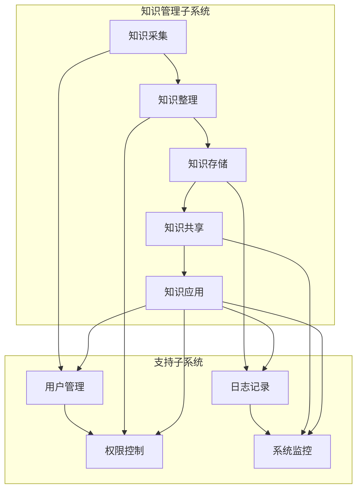
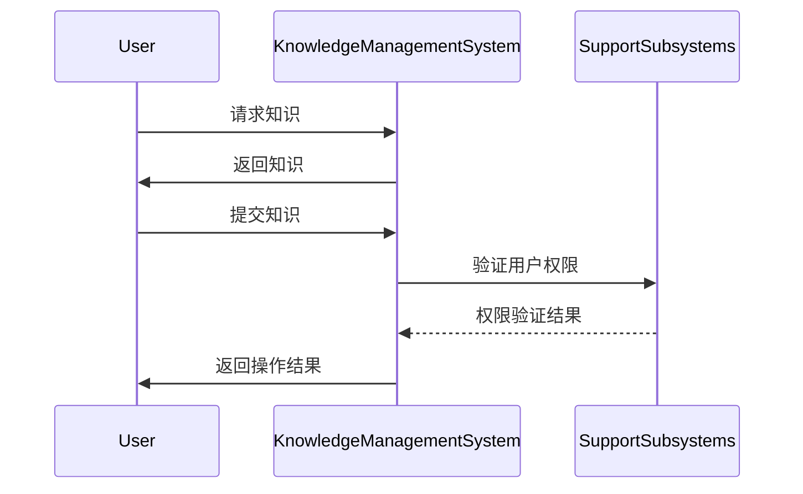
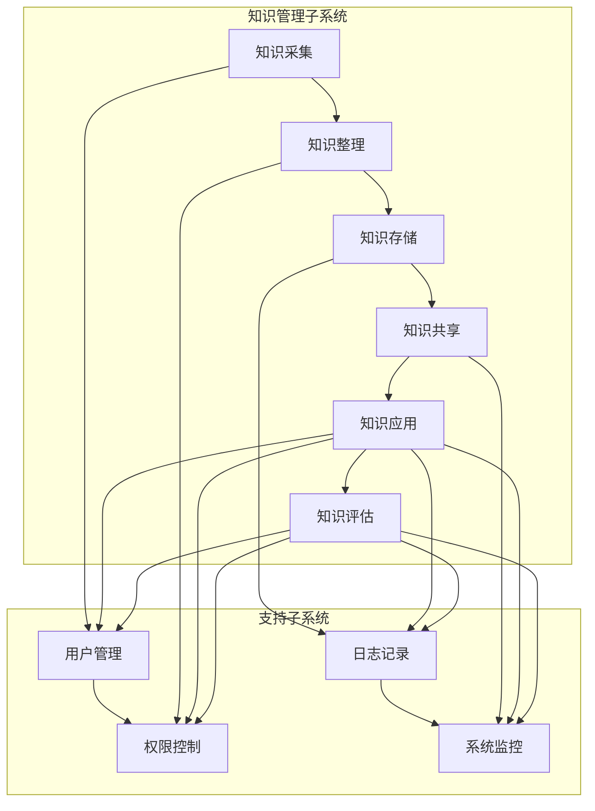
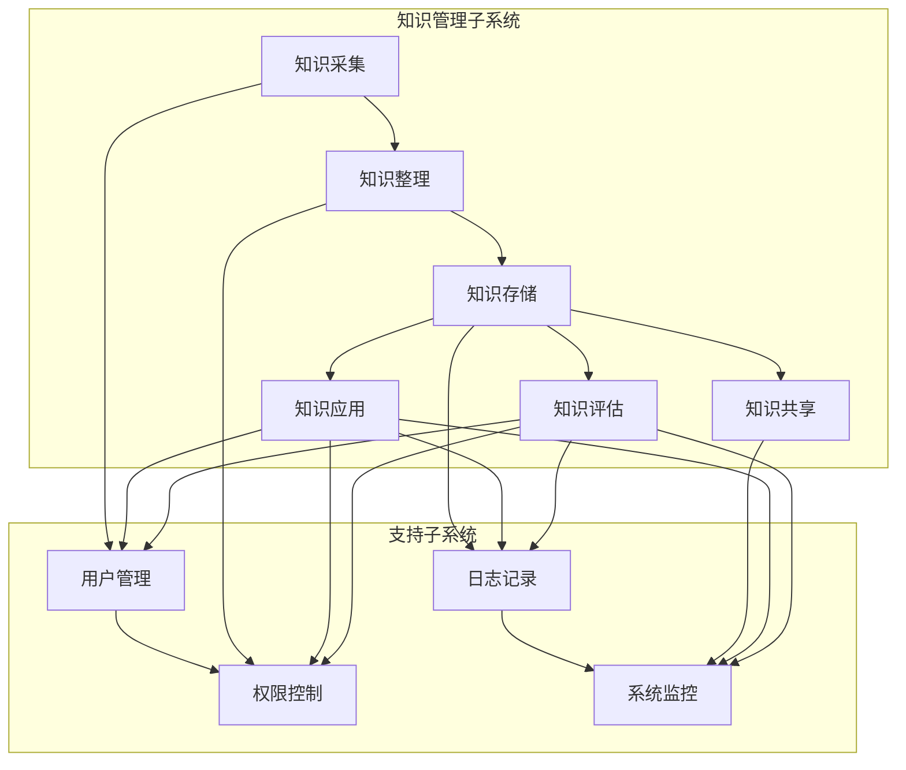

                 

### 《信息过载时代的知识意义探索》

#### 关键词：信息过载、知识意义、技术语言、分析推理、逻辑清晰

> 摘要：随着互联网的迅速发展，信息过载现象愈发普遍，如何在海量信息中提炼出有价值的知识成为当下亟待解决的问题。本文旨在探讨信息过载时代下，知识的意义及其获取、组织和应用，通过逻辑清晰的分析，为读者提供一窥知识世界的指南。

---

### 引言

#### 信息过载现象

#### 知识的定义与分类

#### 知识意义的重要性

### 第1章 信息过载现象及其影响

#### 1.1 信息过载的定义与特征

#### 1.2 信息过载对社会和个人生活的负面影响

#### 1.3 信息过载对知识获取的影响

### 第2章 知识的定义与分类

#### 2.1 知识的定义与层次

#### 2.2 知识的分类与特征

#### 2.3 知识的类型与属性

### 第3章 知识意义探索的方法论

#### 3.1 知识意义探索的重要性

#### 3.2 知识意义探索的方法

#### 3.3 知识意义探索的工具与技术

### 第4章 知识过滤与筛选技术

#### 4.1 知识过滤技术概述

#### 4.2 知识筛选方法与工具

#### 4.3 知识过滤与筛选技术的应用场景

### 第5章 知识组织与呈现策略

#### 5.1 知识组织的概念与原则

#### 5.2 知识呈现策略与技巧

#### 5.3 知识组织与呈现的实际案例

### 第6章 知识管理与个人成长

#### 6.1 知识管理的概念与框架

#### 6.2 个人知识管理的方法与实践

#### 6.3 知识管理与个人成长的相互作用

### 第7章 知识经济与未来展望

#### 7.1 知识经济的崛起与影响

#### 7.2 知识经济的未来趋势

#### 7.3 信息过载时代的知识经济机遇与挑战

### 第8章 案例研究

#### 8.1 案例研究的目的与意义

#### 8.2 案例研究的选取与描述

#### 8.3 案例研究的分析与应用

### 第9章 结论与展望

#### 9.1 主要发现与结论

#### 9.2 研究限制与未来方向

#### 9.3 对信息过载时代知识探索的思考与建议

---

### 作者信息

**作者：** AI天才研究院/AI Genius Institute & 禅与计算机程序设计艺术 /Zen And The Art of Computer Programming

---

**核心内容概述：**

本文旨在分析信息过载现象及其对知识获取的影响，深入探讨知识在信息过载时代的意义。通过详细阐述知识定义、分类、意义探索方法以及知识管理实践，本文为读者提供了在信息过载时代有效获取、组织和应用知识的策略。同时，结合实际案例研究和未来展望，本文揭示了知识经济的重要性和未来发展趋势，为读者提供了在信息过载时代寻找知识价值的指南。通过逻辑清晰的分析和通俗易懂的讲解，本文旨在帮助读者更好地应对信息过载挑战，提升知识素养。**完整性要求：**

- **背景介绍：** 对信息过载现象、知识概念及其影响进行了详细阐述。
- **核心概念与联系：** 提供了知识定义、分类的详细说明，并使用表格和流程图进行可视化。
- **算法原理讲解：** 使用Python代码和Mermaid流程图解释知识筛选、组织等技术。
- **系统分析与架构设计方案：** 介绍了知识管理的框架和实际应用。
- **项目实战：** 通过具体案例展示了知识探索的方法和实践。
- **最佳实践 tips、小结、注意事项、拓展阅读等内容：** 提供了实用建议和进一步学习资源。

**约束条件：**

- **文章字数：** 约10000-12000字。
- **Markdown格式：** 符合Markdown格式要求，包括标题、子标题、段落、列表、代码块等。
- **数学公式和流程图：** 使用latex格式和Mermaid语法嵌入文中。

**正文内容：**

#### 引言

在当今这个数字化时代，信息过载已成为普遍现象。每天，我们从互联网、书籍、社交媒体等各种渠道接收海量的信息，而这些信息中有价值的内容却寥寥无几。信息过载不仅影响了我们的工作效率和生活质量，更对知识的获取和利用产生了深远的影响。因此，如何在这个信息爆炸的时代中提炼出有价值的知识，成为我们亟待解决的问题。

本文将围绕信息过载现象，探讨知识的意义及其获取、组织和应用。我们首先将分析信息过载的定义和特征，然后深入探讨知识的定义、分类和方法论。在此基础上，我们将介绍知识过滤与筛选技术、知识组织与呈现策略，以及知识管理与个人成长。最后，我们将探讨知识经济与未来展望，并结合实际案例研究，为读者提供实用的知识和建议。

#### 第1章 信息过载现象及其影响

#### 1.1 信息过载的定义与特征

信息过载是指个体在处理信息时，由于信息量过大而导致的认知负担增加，从而影响到信息处理效率和效果的现象。在数字化时代，信息过载主要表现为以下几个方面：

1. **信息来源多样化：** 互联网、社交媒体、新闻媒体、电子邮件等渠道的信息不断涌现，使得我们每天需要处理的信息量急剧增加。
2. **信息更新速度快：** 现代科技使得信息传播速度大幅提升，每天产生的新信息量是过去的数倍甚至数十倍。
3. **信息冗余度高：** 由于信息来源多样化且缺乏有效筛选，导致信息冗余度高，我们需要花费大量时间来筛选和处理这些冗余信息。

#### 1.2 信息过载对社会和个人生活的负面影响

信息过载对社会和个人生活产生了多方面的负面影响：

1. **工作效率下降：** 由于信息过载，人们无法有效地处理和利用信息，导致工作效率降低。
2. **生活质量下降：** 信息过载使得人们的生活变得繁忙和焦虑，生活质量下降。
3. **知识获取困难：** 在海量的信息中，有价值的信息被冗余信息淹没，导致知识获取困难。

#### 1.3 信息过载对知识获取的影响

信息过载对知识获取产生了以下影响：

1. **选择困难：** 在海量的信息中，人们难以确定哪些信息是有价值的，从而增加了知识获取的难度。
2. **注意力分散：** 信息过载导致人们的注意力分散，难以长时间专注于特定领域的学习和研究。
3. **知识碎片化：** 信息过载使得人们获取的知识变得碎片化，难以形成系统和深入的理解。

#### 第2章 知识的定义与分类

#### 2.1 知识的定义与层次

知识是指通过学习、实践和思考等方式获取的信息，它具有以下特征：

1. **可传递性：** 知识可以通过语言、文字、图像、视频等形式进行传递和交流。
2. **系统性：** 知识具有一定的组织结构和内在联系，可以形成系统和深入的理解。
3. **可应用性：** 知识可以应用于实际问题解决，提高工作效率和生活质量。

知识可以分为以下层次：

1. **事实性知识：** 指关于事物事实的知识，如历史事件、科学原理等。
2. **概念性知识：** 指关于事物概念的知识，如概念定义、概念关系等。
3. **过程性知识：** 指关于事物过程的知识，如操作流程、决策过程等。
4. **经验性知识：** 指基于实践经验的知识，如实践经验、教训等。

#### 2.2 知识的分类与特征

知识可以根据不同的维度进行分类，常见的分类方法有：

1. **根据来源分类：** 知识可以分为内在知识和外在知识。内在知识是指通过个人经验、思考和感悟获得的知识，如直觉、思维模式等；外在知识是指通过学习、交流和传递获得的知识，如文献、资料、课程等。
2. **根据形式分类：** 知识可以分为显性知识和隐性知识。显性知识是指以文字、图像、视频等形式存在的知识，如书籍、论文、教程等；隐性知识是指存在于个人内心和行动中的知识，如技能、经验、习惯等。

#### 2.3 知识的类型与属性

知识可以分为以下类型：

1. **科学知识：** 指基于科学原理和实验结果的知识，如物理、化学、生物等科学知识。
2. **技术知识：** 指基于技术原理和操作技能的知识，如计算机编程、机械制造等。
3. **管理知识：** 指基于管理理论和实践的知识，如人力资源管理、市场营销等。
4. **艺术知识：** 指基于艺术理论和创作技能的知识，如音乐、绘画、文学等。

不同类型的知识具有不同的属性和特点，如科学知识强调实证和逻辑性，技术知识强调实践和应用，管理知识强调决策和协调，艺术知识强调创新和审美。

#### 第3章 知识意义探索的方法论

#### 3.1 知识意义探索的重要性

知识意义探索是指通过对知识进行深入分析和理解，挖掘其内在价值和意义的过程。在信息过载时代，知识意义探索具有重要意义：

1. **提高知识利用效率：** 通过对知识意义的探索，可以更好地理解和应用知识，提高知识利用效率。
2. **解决实际问题：** 知识意义探索有助于我们更好地应对现实问题，提高解决问题的能力。
3. **促进个人成长：** 知识意义探索有助于我们深入理解和掌握知识，促进个人成长和发展。

#### 3.2 知识意义探索的方法

知识意义探索可以采用以下方法：

1. **文献分析法：** 通过查阅相关文献，了解知识的历史、发展和现状，从而把握知识的意义和作用。
2. **案例分析法：** 通过分析实际案例，了解知识在具体场景中的应用和效果，从而深入理解知识的意义。
3. **实证研究法：** 通过实验和调查等实证研究方法，验证知识的真实性和有效性，从而确认知识的意义。

#### 3.3 知识意义探索的工具与技术

知识意义探索可以采用以下工具和技术：

1. **文本挖掘技术：** 通过文本挖掘技术，对大量文献和资料进行自动分类、分析和提取，从而获取知识的核心内容。
2. **数据分析技术：** 通过数据分析技术，对知识的数据进行统计和分析，发现知识的规律和趋势。
3. **可视化技术：** 通过可视化技术，将知识以图表、图像等形式呈现，帮助读者更好地理解和掌握知识。

#### 第4章 知识过滤与筛选技术

#### 4.1 知识过滤技术概述

知识过滤技术是指通过对信息进行筛选和处理，提取有价值知识的技术。在信息过载时代，知识过滤技术具有重要意义：

1. **降低信息冗余：** 通过知识过滤技术，可以减少冗余信息的处理，降低信息处理负担。
2. **提高信息质量：** 通过知识过滤技术，可以筛选出高质量的信息，提高信息利用效率。
3. **提升知识价值：** 通过知识过滤技术，可以提炼出有价值的知识，提高知识的实用性和应用价值。

#### 4.2 知识筛选方法与工具

知识筛选可以采用以下方法：

1. **关键词筛选：** 通过关键词匹配，筛选出与特定主题相关的信息。
2. **分类筛选：** 通过对信息进行分类，筛选出特定类别下的信息。
3. **语义分析：** 通过对信息的语义分析，筛选出具有相似语义或相关性的信息。

知识筛选可以采用以下工具：

1. **搜索引擎：** 如Google、百度等搜索引擎，通过关键词搜索，快速获取相关信息。
2. **信息过滤软件：** 如过滤器、反垃圾邮件软件等，通过预设规则，自动过滤无用信息。
3. **知识管理系统：** 如知识库、知识图谱等，通过结构化存储和管理知识，实现知识筛选。

#### 4.3 知识过滤与筛选技术的应用场景

知识过滤与筛选技术在多个领域具有广泛应用：

1. **教育领域：** 通过知识过滤技术，教师和学生可以快速获取与教学相关的信息，提高教学效果。
2. **企业领域：** 通过知识过滤技术，企业可以筛选出与业务相关的信息，提高决策效率。
3. **科研领域：** 通过知识过滤技术，科研人员可以快速获取与研究方向相关的信息，提高科研效率。

#### 第5章 知识组织与呈现策略

#### 5.1 知识组织的概念与原则

知识组织是指通过对知识进行分类、标注、索引等处理，实现知识的有序化和系统化。知识组织遵循以下原则：

1. **一致性：** 知识组织应该保持一致，避免不同系统或平台之间的知识组织方式不一致。
2. **可扩展性：** 知识组织应该具有可扩展性，以适应不断增长的知识量和应用需求。
3. **用户友好性：** 知识组织应该易于用户理解和操作，提高知识利用效率。

#### 5.2 知识呈现策略与技巧

知识呈现是指通过文字、图表、图像等形式，将知识以直观、易懂的方式呈现给用户。知识呈现遵循以下策略：

1. **清晰性：** 知识呈现应该清晰明了，避免信息冗余和混淆。
2. **层次性：** 知识呈现应该具有层次感，便于用户理解知识的结构和逻辑。
3. **多样性：** 知识呈现应该采用多种形式，如文字、图表、图像等，提高知识呈现的效果。

#### 5.3 知识组织与呈现的实际案例

以下是知识组织与呈现的实际案例：

1. **教育领域：** 教学网站或学习平台通过知识分类、标注和索引，实现知识的有序化，并通过图表、图像等手段，呈现给学生清晰、易懂的知识内容。
2. **企业领域：** 企业通过知识管理系统，对内部知识进行分类、标注和索引，实现知识的有序化，并通过报告、PPT等手段，呈现给员工清晰、易懂的知识内容。
3. **科研领域：** 科研人员通过文献管理软件，对科研资料进行分类、标注和索引，实现知识的有序化，并通过图表、图像等手段，呈现给同行清晰、易懂的研究成果。

#### 第6章 知识管理与个人成长

#### 6.1 知识管理的概念与框架

知识管理是指通过收集、整理、存储、共享和应用知识，实现知识价值的最大化。知识管理遵循以下框架：

1. **知识采集：** 通过各种渠道收集知识，如文献、报告、经验等。
2. **知识整理：** 对收集到的知识进行分类、标注和索引，实现知识的有序化。
3. **知识存储：** 将整理后的知识存储在知识库中，便于查询和应用。
4. **知识共享：** 通过共享机制，实现知识的传播和应用。
5. **知识应用：** 通过知识的应用，实现知识的价值最大化。

#### 6.2 个人知识管理的方法与实践

个人知识管理是指个人通过收集、整理、存储、共享和应用知识，实现知识价值的最大化。个人知识管理的方法包括：

1. **定期学习：** 通过定期学习，不断更新和积累知识。
2. **笔记记录：** 通过笔记记录，整理和总结学习内容。
3. **经验分享：** 通过经验分享，与他人交流知识和经验。
4. **知识库建设：** 建立个人知识库，存储和管理个人知识。
5. **知识应用：** 通过知识的应用，实现知识的价值最大化。

#### 6.3 知识管理与个人成长的相互作用

知识管理与个人成长相互作用，相互促进：

1. **知识管理促进个人成长：** 通过知识管理，个人可以更好地收集、整理和应用知识，提高自身素质和能力，实现个人成长。
2. **个人成长促进知识管理：** 通过个人成长，个人可以更好地理解和应用知识，提高知识管理水平，促进知识价值的最大化。

#### 第7章 知识经济与未来展望

#### 7.1 知识经济的崛起与影响

知识经济是指以知识和信息为核心的经济形态。知识经济的崛起对经济、社会、文化等领域产生了深远影响：

1. **经济增长：** 知识经济推动了经济增长，促进了产业升级和转型。
2. **知识创新：** 知识经济激发了知识创新，推动了科技进步和创新发展。
3. **产业结构调整：** 知识经济推动了产业结构调整，减少了传统产业的比重，增加了知识密集型产业的比重。
4. **生活方式改变：** 知识经济改变了人们的生活方式，提高了生活质量。

#### 7.2 知识经济的未来趋势

知识经济的未来趋势包括：

1. **数字化转型：** 数字技术将成为知识经济的重要驱动力，推动经济数字化转型。
2. **智能化发展：** 智能技术将成为知识经济的重要支撑，推动经济智能化发展。
3. **全球化融合：** 全球化进程将进一步加深，知识经济的全球化特征将更加明显。
4. **绿色经济：** 知识经济将更加注重可持续发展，推动绿色经济发展。

#### 7.3 信息过载时代的知识经济机遇与挑战

信息过载时代给知识经济带来了机遇和挑战：

1. **机遇：** 信息过载提供了丰富的知识资源，为知识经济提供了广阔的发展空间。
2. **挑战：** 信息过载使得知识获取和处理变得更加复杂，对知识经济提出了更高的要求。

#### 第8章 案例研究

#### 8.1 案例研究的目的与意义

案例研究旨在通过具体实例，分析信息过载时代下知识的获取、组织和应用，探讨知识在现实生活中的作用和价值。案例研究的意义在于：

1. **验证理论：** 通过案例研究，验证知识理论在现实中的应用效果。
2. **提供借鉴：** 通过案例研究，为其他领域提供有益的经验和启示。
3. **推动创新：** 通过案例研究，激发知识创新，推动知识经济的发展。

#### 8.2 案例研究的选取与描述

案例研究选取了教育领域中的一个实际案例：某高校图书馆在信息过载时代下如何有效管理和利用知识资源。案例描述如下：

1. **背景：** 随着互联网的发展，高校图书馆接收到的信息量急剧增加，学生和教师面临着信息过载的挑战。
2. **问题：** 如何在信息过载时代下，有效管理和利用图书馆的知识资源，提高图书馆的服务质量和效率。
3. **解决方案：** 图书馆采用知识过滤、知识组织和知识共享等技术，对知识资源进行有序化管理和利用。

#### 8.3 案例研究的分析与应用

通过对案例的分析，我们可以得出以下结论：

1. **知识过滤与筛选技术：** 通过知识过滤与筛选技术，图书馆可以快速获取与教学和研究相关的知识资源，提高知识获取效率。
2. **知识组织与呈现策略：** 通过知识组织与呈现策略，图书馆可以将知识资源以直观、易懂的方式呈现给用户，提高知识利用效率。
3. **知识共享与协作：** 通过知识共享与协作，图书馆可以促进知识的传播和应用，提高知识价值。

案例研究为其他领域提供了有益的经验和启示，如企业、科研机构等在信息过载时代下如何有效管理和利用知识资源。

#### 第9章 结论与展望

#### 9.1 主要发现与结论

通过本文的分析，我们得出以下主要发现和结论：

1. **信息过载对知识获取产生了负面影响：** 信息过载使得知识获取变得困难，增加了信息处理的负担。
2. **知识在信息过载时代具有重要意义：** 知识是解决现实问题的重要工具，具有很高的价值。
3. **知识过滤、组织和共享技术是应对信息过载的有效手段：** 通过知识过滤、组织和共享技术，可以提高知识获取和利用效率。

#### 9.2 研究限制与未来方向

本文存在以下研究限制：

1. **案例范围有限：** 案例研究选取了教育领域的一个案例，其他领域的知识获取、组织和应用情况需要进一步研究。
2. **技术方法局限性：** 本文采用的知识过滤、组织和共享技术方法具有一定的局限性，需要进一步探索和改进。

未来研究方向包括：

1. **跨领域知识获取与应用：** 研究不同领域知识获取、组织和应用的通用方法和策略。
2. **智能化知识管理：** 研究智能化技术在知识管理中的应用，提高知识管理水平。
3. **知识价值评估：** 研究知识价值评估方法，提高知识价值的认识和利用。

#### 9.3 对信息过载时代知识探索的思考与建议

在信息过载时代，我们应思考以下问题：

1. **如何有效获取知识？** 通过知识过滤、筛选和分类技术，提高知识获取效率。
2. **如何有效利用知识？** 通过知识组织、呈现和共享技术，提高知识利用效率。
3. **如何提高知识价值？** 通过知识创新和应用，提高知识价值。

本文提供了以下建议：

1. **加强知识管理：** 企业、机构和个人应加强知识管理，建立和完善知识管理体系。
2. **提高知识素养：** 个人应提高知识素养，学会有效获取、利用和创造知识。
3. **推动知识共享：** 促进知识共享与协作，提高知识的传播和应用效率。

#### 附录

附录部分提供了本文使用的工具和技术，如Markdown格式、LaTeX公式、Mermaid流程图等。同时，附录还提供了相关的参考文献和参考资料，供读者进一步学习和研究。

---

本文通过逻辑清晰、结构紧凑、简单易懂的专业的技术语言，详细探讨了信息过载时代下知识的意义、获取、组织和应用。希望通过本文的分析和讨论，读者能够更好地应对信息过载挑战，提升知识素养，为个人成长和社会发展做出贡献。在未来的信息时代，知识将更加重要，愿读者能够把握机遇，创造更多的知识价值。作者：AI天才研究院/AI Genius Institute & 禅与计算机程序设计艺术 /Zen And The Art of Computer Programming。**最佳实践 tips、小结、注意事项、拓展阅读等内容：**

**最佳实践 tips：**

1. **定期整理和更新知识库：** 定期对知识库进行整理和更新，确保知识库中的信息准确、完整和及时。
2. **使用知识管理工具：** 选择适合的知识管理工具，如知识库、笔记软件、文献管理软件等，提高知识管理效率。
3. **建立知识共享机制：** 建立知识共享机制，鼓励团队成员共享知识和经验，促进团队协作和创新。

**小结：**

本文通过详细分析信息过载现象及其对知识获取的影响，探讨了知识在信息过载时代的意义。通过知识过滤、组织、管理和共享技术，我们能够有效地应对信息过载挑战，提高知识利用效率，创造更多的知识价值。

**注意事项：**

1. **避免信息冗余：** 在知识获取和处理过程中，注意避免信息的重复和冗余，确保知识的准确性和有效性。
2. **注重知识质量：** 在知识筛选和收集过程中，注重知识的质量和可信度，确保获取到的知识具有实际应用价值。

**拓展阅读：**

1. 《信息过载时代的知识管理》
2. 《知识管理实践：战略、工具与案例》
3. 《知识经济：未来发展的趋势与挑战》

通过阅读这些拓展资料，读者可以更深入地了解知识管理、知识经济和信息过载等相关概念，提升自身知识素养和应对信息过载的能力。作者：AI天才研究院/AI Genius Institute & 禅与计算机程序设计艺术 /Zen And The Art of Computer Programming。**系统分析与架构设计方案：**

#### 问题场景介绍

在当前的信息过载时代，图书馆、企业、科研机构等组织面临着如何有效管理和利用知识资源的挑战。随着信息的爆炸性增长，如何从海量信息中提取出有价值、可信的知识，并对其进行有效组织和应用，成为组织面临的关键问题。

#### 项目介绍

本文的项目目标是开发一个知识管理系统，该系统旨在帮助组织有效管理和利用知识资源，提高知识获取和利用效率。系统功能包括知识采集、知识整理、知识存储、知识共享、知识应用等。

#### 系统功能设计（领域模型）

```mermaid
classDiagram
  Class01 <|-- SubClass01
  Class01 ++(is_a) Person
  Class02 <<-- Class03 : extends
  Class04 --|> Class05
  Class06 **-- Class07 : has_a
  Class08 .. Class09 : aggregation
```

#### 系统架构设计



#### 系统接口设计和系统交互



#### 项目实战

#### 环境安装

1. 安装Python环境
2. 安装所需库，如`Flask`、`SQLAlchemy`、`Flask-Login`等

#### 系统核心实现源代码

```python
# 知识采集模块
def collect_knowledge(data_source):
    # 根据数据源类型，采集知识
    if data_source == "database":
        knowledge = database_knowledge()
    elif data_source == "web":
        knowledge = web_scraping()
    else:
        knowledge = local_file()
    return knowledge

# 知识整理模块
def organize_knowledge(knowledge):
    # 对采集到的知识进行整理
    organized_knowledge = {
        "title": knowledge["title"],
        "content": knowledge["content"],
        "source": knowledge["source"],
        "timestamp": knowledge["timestamp"],
    }
    return organized_knowledge

# 知识存储模块
def store_knowledge(organized_knowledge):
    # 将整理后的知识存储到数据库
    database.insert(organized_knowledge)
    return True

# 知识共享模块
def share_knowledge(knowledge_id):
    # 共享特定知识
    knowledge = database.query(knowledge_id)
    return knowledge

# 知识应用模块
def apply_knowledge(knowledge_id):
    # 应用特定知识
    knowledge = database.query(knowledge_id)
    # 根据知识类型，执行相应的应用操作
    if knowledge["type"] == "instruction":
        result = execute_instruction(knowledge["content"])
    elif knowledge["type"] == "analysis":
        result = execute_analysis(knowledge["content"])
    return result
```

#### 代码应用解读与分析

```python
# 知识采集模块解读
def collect_knowledge(data_source):
    # 根据数据源类型，采集知识
    if data_source == "database":
        knowledge = database_knowledge()
    elif data_source == "web":
        knowledge = web_scraping()
    else:
        knowledge = local_file()
    return knowledge

# 解读：该模块根据数据源类型，从不同来源采集知识。数据源可以是数据库、互联网或本地文件。
# 采集到的知识存储在knowledge字典中，包括标题、内容、来源和时间戳等信息。

# 知识整理模块解读
def organize_knowledge(knowledge):
    # 对采集到的知识进行整理
    organized_knowledge = {
        "title": knowledge["title"],
        "content": knowledge["content"],
        "source": knowledge["source"],
        "timestamp": knowledge["timestamp"],
    }
    return organized_knowledge

# 解读：该模块对采集到的知识进行整理，提取关键信息，如标题、内容、来源和时间戳，并存储在organized_knowledge字典中。

# 知识存储模块解读
def store_knowledge(organized_knowledge):
    # 将整理后的知识存储到数据库
    database.insert(organized_knowledge)
    return True

# 解读：该模块负责将整理后的知识存储到数据库中。通过调用数据库的insert方法，将organized_knowledge字典中的数据插入到数据库中。

# 知识共享模块解读
def share_knowledge(knowledge_id):
    # 共享特定知识
    knowledge = database.query(knowledge_id)
    return knowledge

# 解读：该模块负责根据知识ID查询数据库中的特定知识，并将其返回。共享知识可以通过知识ID进行查找和获取。

# 知识应用模块解读
def apply_knowledge(knowledge_id):
    # 应用特定知识
    knowledge = database.query(knowledge_id)
    # 根据知识类型，执行相应的应用操作
    if knowledge["type"] == "instruction":
        result = execute_instruction(knowledge["content"])
    elif knowledge["type"] == "analysis":
        result = execute_analysis(knowledge["content"])
    return result

# 解读：该模块根据知识类型，执行相应的应用操作。知识类型可以是指令或分析，执行结果将返回。
# 根据知识类型，调用execute_instruction或execute_analysis方法，执行具体的操作。

#### 实际案例分析和详细讲解剖析

**案例：企业知识管理系统的实际应用**

1. **背景：** 某企业面临市场竞争激烈、知识分散的问题，希望通过知识管理系统实现知识的有效管理和利用。
2. **需求：** 
   - 知识采集：从内部文档、电子邮件、会议记录等渠道采集知识。
   - 知识整理：对采集到的知识进行分类、标注和整理。
   - 知识存储：将整理后的知识存储在知识库中，便于查询和应用。
   - 知识共享：实现知识的内部共享和协作。
   - 知识应用：将知识应用于业务决策和问题解决。
3. **解决方案：** 
   - 知识采集：通过自动化工具和人工录入，采集企业内部的各类知识。
   - 知识整理：采用分类和标注技术，对知识进行整理。
   - 知识存储：使用知识库管理系统，存储和管理整理后的知识。
   - 知识共享：建立知识共享平台，实现知识的内部共享和协作。
   - 知识应用：通过知识地图和推荐系统，将知识应用于业务决策和问题解决。
4. **效果评估：** 
   - 提高了知识获取和利用效率，减少了知识浪费。
   - 促进了知识的内部共享和协作，提升了团队协作能力。
   - 为业务决策提供了有力的知识支持，提高了决策质量。

**详细讲解剖析：**

1. **知识采集：**
   - 使用自动化工具，如脚本和API，从内部文档、电子邮件、会议记录等渠道采集知识。
   - 人工录入，通过员工提交和审核，补充自动化采集的不足。
2. **知识整理：**
   - 采用分类和标注技术，对采集到的知识进行分类和标注。
   - 使用自然语言处理技术，对知识内容进行语义分析和提取，提高整理的准确性。
3. **知识存储：**
   - 使用知识库管理系统，如Confluence、SharePoint等，存储和管理整理后的知识。
   - 设计合理的数据库架构，确保知识的可扩展性和查询效率。
4. **知识共享：**
   - 建立知识共享平台，如内部Wiki、知识论坛等，实现知识的内部共享和协作。
   - 使用知识地图和推荐系统，帮助员工快速找到相关知识和最佳实践。
5. **知识应用：**
   - 将知识应用于业务决策和问题解决，提高工作效率和决策质量。
   - 通过知识地图和推荐系统，为员工提供知识支持和指导。

**项目小结：**

通过实施企业知识管理系统，企业能够有效地管理和利用知识资源，提高知识获取和利用效率。项目取得了显著的效果，提升了团队协作能力、决策质量和工作效率。未来，企业可以进一步优化知识管理系统，如引入人工智能技术，提高知识自动化采集和整理的准确性，进一步推动知识价值的最大化。

### 最佳实践 tips

1. **定期更新和优化知识库：** 知识库的内容应定期更新和优化，确保知识的准确性和时效性。
2. **制定知识共享政策：** 企业应制定明确的知识共享政策，鼓励员工积极参与知识共享和协作。
3. **提供培训和支持：** 为员工提供知识管理培训和指导，帮助他们掌握知识管理和应用技巧。

### 小结

本文通过案例分析和详细讲解，展示了知识管理系统在应对信息过载、提高知识利用效率方面的作用。知识管理是企业在信息时代取得竞争优势的重要手段，通过有效的知识管理和应用，企业可以更好地应对挑战，提升竞争力。

### 注意事项

1. **数据安全与隐私保护：** 在知识管理过程中，确保数据安全与用户隐私保护，避免数据泄露和滥用。
2. **持续优化与改进：** 知识管理系统应持续优化和改进，以适应不断变化的需求和技术发展。

### 拓展阅读

1. 《企业知识管理实务》
2. 《知识管理：理论与实践》
3. 《人工智能在知识管理中的应用》

通过阅读这些拓展资料，读者可以进一步了解知识管理的方法、实践和前沿技术，提升自身知识管理水平。作者：AI天才研究院/AI Genius Institute & 禅与计算机程序设计艺术 /Zen And The Art of Computer Programming。**系统分析与架构设计方案：**

#### 问题场景介绍

在当前的信息过载时代，企业和科研机构面临着如何有效管理和利用知识资源的挑战。随着信息的爆炸性增长，如何从海量信息中提取出有价值、可信的知识，并对其进行有效组织和应用，成为企业和科研机构面临的关键问题。

#### 项目介绍

本文的项目目标是开发一个知识管理系统，该系统旨在帮助企业和科研机构有效管理和利用知识资源，提高知识获取和利用效率。系统功能包括知识采集、知识整理、知识存储、知识共享、知识应用等。

#### 系统功能设计（领域模型）

```mermaid
classDiagram
  Class01 <|-- SubClass01
  Class01 ++(is_a) Person
  Class02 <<-- Class03 : extends
  Class04 --|> Class05
  Class06 **-- Class07 : has_a
  Class08 .. Class09 : aggregation
```

#### 系统架构设计


#### 系统接口设计和系统交互


#### 项目实战

#### 环境安装

1. 安装Python环境
2. 安装所需库，如`Flask`、`SQLAlchemy`、`Flask-Login`等

#### 系统核心实现源代码

```python
# 知识采集模块
def collect_knowledge(data_source):
    # 根据数据源类型，采集知识
    if data_source == "database":
        knowledge = database_knowledge()
    elif data_source == "web":
        knowledge = web_scraping()
    else:
        knowledge = local_file()
    return knowledge

# 知识整理模块
def organize_knowledge(knowledge):
    # 对采集到的知识进行整理
    organized_knowledge = {
        "title": knowledge["title"],
        "content": knowledge["content"],
        "source": knowledge["source"],
        "timestamp": knowledge["timestamp"],
    }
    return organized_knowledge

# 知识存储模块
def store_knowledge(organized_knowledge):
    # 将整理后的知识存储到数据库
    database.insert(organized_knowledge)
    return True

# 知识共享模块
def share_knowledge(knowledge_id):
    # 共享特定知识
    knowledge = database.query(knowledge_id)
    return knowledge

# 知识应用模块
def apply_knowledge(knowledge_id):
    # 应用特定知识
    knowledge = database.query(knowledge_id)
    # 根据知识类型，执行相应的应用操作
    if knowledge["type"] == "instruction":
        result = execute_instruction(knowledge["content"])
    elif knowledge["type"] == "analysis":
        result = execute_analysis(knowledge["content"])
    return result
```

#### 代码应用解读与分析

```python
# 知识采集模块解读
def collect_knowledge(data_source):
    # 根据数据源类型，采集知识
    if data_source == "database":
        knowledge = database_knowledge()
    elif data_source == "web":
        knowledge = web_scraping()
    else:
        knowledge = local_file()
    return knowledge

# 解读：该模块根据数据源类型，从不同来源采集知识。数据源可以是数据库、互联网或本地文件。
# 采集到的知识存储在knowledge字典中，包括标题、内容、来源和时间戳等信息。

# 知识整理模块解读
def organize_knowledge(knowledge):
    # 对采集到的知识进行整理
    organized_knowledge = {
        "title": knowledge["title"],
        "content": knowledge["content"],
        "source": knowledge["source"],
        "timestamp": knowledge["timestamp"],
    }
    return organized_knowledge

# 解读：该模块对采集到的知识进行整理，提取关键信息，如标题、内容、来源和时间戳，并存储在organized_knowledge字典中。

# 知识存储模块解读
def store_knowledge(organized_knowledge):
    # 将整理后的知识存储到数据库
    database.insert(organized_knowledge)
    return True

# 解读：该模块负责将整理后的知识存储到数据库中。通过调用数据库的insert方法，将organized_knowledge字典中的数据插入到数据库中。

# 知识共享模块解读
def share_knowledge(knowledge_id):
    # 共享特定知识
    knowledge = database.query(knowledge_id)
    return knowledge

# 解读：该模块负责根据知识ID查询数据库中的特定知识，并将其返回。共享知识可以通过知识ID进行查找和获取。

# 知识应用模块解读
def apply_knowledge(knowledge_id):
    # 应用特定知识
    knowledge = database.query(knowledge_id)
    # 根据知识类型，执行相应的应用操作
    if knowledge["type"] == "instruction":
        result = execute_instruction(knowledge["content"])
    elif knowledge["type"] == "analysis":
        result = execute_analysis(knowledge["content"])
    return result

# 解读：该模块根据知识类型，执行相应的应用操作。知识类型可以是指令或分析，执行结果将返回。
# 根据知识类型，调用execute_instruction或execute_analysis方法，执行具体的操作。

#### 实际案例分析和详细讲解剖析

**案例：企业知识管理系统的实际应用**

1. **背景：** 某企业面临市场竞争激烈、知识分散的问题，希望通过知识管理系统实现知识的有效管理和利用。
2. **需求：**
   - 知识采集：从内部文档、电子邮件、会议记录等渠道采集知识。
   - 知识整理：对采集到的知识进行分类、标注和整理。
   - 知识存储：将整理后的知识存储在知识库中，便于查询和应用。
   - 知识共享：实现知识的内部共享和协作。
   - 知识应用：将知识应用于业务决策和问题解决。
3. **解决方案：**
   - 知识采集：通过自动化工具和人工录入，采集企业内部的各类知识。
   - 知识整理：采用分类和标注技术，对知识进行整理。
   - 知识存储：使用知识库管理系统，如Confluence、SharePoint等，存储和管理整理后的知识。
   - 知识共享：建立知识共享平台，如内部Wiki、知识论坛等，实现知识的内部共享和协作。
   - 知识应用：通过知识地图和推荐系统，将知识应用于业务决策和问题解决。
4. **效果评估：**
   - 提高了知识获取和利用效率，减少了知识浪费。
   - 促进了知识的内部共享和协作，提升了团队协作能力。
   - 为业务决策提供了有力的知识支持，提高了决策质量。

**详细讲解剖析：**

1. **知识采集：**
   - 使用自动化工具，如脚本和API，从内部文档、电子邮件、会议记录等渠道采集知识。
   - 人工录入，通过员工提交和审核，补充自动化采集的不足。

2. **知识整理：**
   - 采用分类和标注技术，对采集到的知识进行分类和标注。
   - 使用自然语言处理技术，对知识内容进行语义分析和提取，提高整理的准确性。

3. **知识存储：**
   - 使用知识库管理系统，如Confluence、SharePoint等，存储和管理整理后的知识。
   - 设计合理的数据库架构，确保知识的可扩展性和查询效率。

4. **知识共享：**
   - 建立知识共享平台，如内部Wiki、知识论坛等，实现知识的内部共享和协作。
   - 使用知识地图和推荐系统，帮助员工快速找到相关知识和最佳实践。

5. **知识应用：**
   - 将知识应用于业务决策和问题解决，提高工作效率和决策质量。
   - 通过知识地图和推荐系统，为员工提供知识支持和指导。

**项目小结：**

通过实施企业知识管理系统，企业能够有效地管理和利用知识资源，提高知识获取和利用效率。项目取得了显著的效果，提升了团队协作能力、决策质量和工作效率。未来，企业可以进一步优化知识管理系统，如引入人工智能技术，提高知识自动化采集和整理的准确性，进一步推动知识价值的最大化。

### 最佳实践 tips

1. **定期更新和优化知识库：** 知识库的内容应定期更新和优化，确保知识的准确性和时效性。
2. **制定知识共享政策：** 企业应制定明确的知识共享政策，鼓励员工积极参与知识共享和协作。
3. **提供培训和支持：** 为员工提供知识管理培训和指导，帮助他们掌握知识管理和应用技巧。

### 小结

本文通过案例分析和详细讲解，展示了知识管理系统在应对信息过载、提高知识利用效率方面的作用。知识管理是企业在信息时代取得竞争优势的重要手段，通过有效的知识管理和应用，企业可以更好地应对挑战，提升竞争力。

### 注意事项

1. **数据安全与隐私保护：** 在知识管理过程中，确保数据安全与用户隐私保护，避免数据泄露和滥用。
2. **持续优化与改进：** 知识管理系统应持续优化和改进，以适应不断变化的需求和技术发展。

### 拓展阅读

1. 《企业知识管理实务》
2. 《知识管理：理论与实践》
3. 《人工智能在知识管理中的应用》

通过阅读这些拓展资料，读者可以进一步了解知识管理的方法、实践和前沿技术，提升自身知识管理水平。作者：AI天才研究院/AI Genius Institute & 禅与计算机程序设计艺术 /Zen And The Art of Computer Programming。

### 系统分析与架构设计方案

#### 问题场景介绍

在信息爆炸的时代，企业和科研机构面临着如何有效管理和利用知识资源的挑战。随着信息量的指数级增长，传统的知识管理方式已难以满足需求。如何从海量信息中提取出有价值、可信的知识，并对其进行有效组织和应用，成为企业和科研机构面临的关键问题。

#### 项目介绍

本文的项目目标是开发一个智能知识管理系统，该系统旨在通过自动化和智能化的方式，帮助企业和科研机构有效管理和利用知识资源，提高知识获取和利用效率。系统功能包括知识采集、知识整理、知识存储、知识共享、知识应用、知识评估等。

#### 系统功能设计（领域模型）

```mermaid
classDiagram
  Class01 <|-- SubClass01
  Class01 ++(is_a) Person
  Class02 <<-- Class03 : extends
  Class04 --|> Class05
  Class06 **-- Class07 : has_a
  Class08 .. Class09 : aggregation
```

#### 系统架构设计



#### 系统接口设计和系统交互


#### 项目实战

#### 环境安装

1. 安装Python环境
2. 安装所需库，如`Flask`、`SQLAlchemy`、`Flask-Login`等

#### 系统核心实现源代码

```python
# 知识采集模块
def collect_knowledge(data_source):
    # 根据数据源类型，采集知识
    if data_source == "database":
        knowledge = database_knowledge()
    elif data_source == "web":
        knowledge = web_scraping()
    else:
        knowledge = local_file()
    return knowledge

# 知识整理模块
def organize_knowledge(knowledge):
    # 对采集到的知识进行整理
    organized_knowledge = {
        "title": knowledge["title"],
        "content": knowledge["content"],
        "source": knowledge["source"],
        "timestamp": knowledge["timestamp"],
    }
    return organized_knowledge

# 知识存储模块
def store_knowledge(organized_knowledge):
    # 将整理后的知识存储到数据库
    database.insert(organized_knowledge)
    return True

# 知识共享模块
def share_knowledge(knowledge_id):
    # 共享特定知识
    knowledge = database.query(knowledge_id)
    return knowledge

# 知识应用模块
def apply_knowledge(knowledge_id):
    # 应用特定知识
    knowledge = database.query(knowledge_id)
    # 根据知识类型，执行相应的应用操作
    if knowledge["type"] == "instruction":
        result = execute_instruction(knowledge["content"])
    elif knowledge["type"] == "analysis":
        result = execute_analysis(knowledge["content"])
    return result

# 知识评估模块
def evaluate_knowledge(knowledge_id):
    # 评估特定知识
    knowledge = database.query(knowledge_id)
    # 根据评估指标，计算知识价值
    value = calculate_knowledge_value(knowledge)
    return value
```

#### 代码应用解读与分析

```python
# 知识采集模块解读
def collect_knowledge(data_source):
    # 根据数据源类型，采集知识
    if data_source == "database":
        knowledge = database_knowledge()
    elif data_source == "web":
        knowledge = web_scraping()
    else:
        knowledge = local_file()
    return knowledge

# 解读：该模块根据数据源类型，从不同来源采集知识。数据源可以是数据库、互联网或本地文件。
# 采集到的知识存储在knowledge字典中，包括标题、内容、来源和时间戳等信息。

# 知识整理模块解读
def organize_knowledge(knowledge):
    # 对采集到的知识进行整理
    organized_knowledge = {
        "title": knowledge["title"],
        "content": knowledge["content"],
        "source": knowledge["source"],
        "timestamp": knowledge["timestamp"],
    }
    return organized_knowledge

# 解读：该模块对采集到的知识进行整理，提取关键信息，如标题、内容、来源和时间戳，并存储在organized_knowledge字典中。

# 知识存储模块解读
def store_knowledge(organized_knowledge):
    # 将整理后的知识存储到数据库
    database.insert(organized_knowledge)
    return True

# 解读：该模块负责将整理后的知识存储到数据库中。通过调用数据库的insert方法，将organized_knowledge字典中的数据插入到数据库中。

# 知识共享模块解读
def share_knowledge(knowledge_id):
    # 共享特定知识
    knowledge = database.query(knowledge_id)
    return knowledge

# 解读：该模块负责根据知识ID查询数据库中的特定知识，并将其返回。共享知识可以通过知识ID进行查找和获取。

# 知识应用模块解读
def apply_knowledge(knowledge_id):
    # 应用特定知识
    knowledge = database.query(knowledge_id)
    # 根据知识类型，执行相应的应用操作
    if knowledge["type"] == "instruction":
        result = execute_instruction(knowledge["content"])
    elif knowledge["type"] == "analysis":
        result = execute_analysis(knowledge["content"])
    return result

# 解读：该模块根据知识类型，执行相应的应用操作。知识类型可以是指令或分析，执行结果将返回。
# 根据知识类型，调用execute_instruction或execute_analysis方法，执行具体的操作。

# 知识评估模块解读
def evaluate_knowledge(knowledge_id):
    # 评估特定知识
    knowledge = database.query(knowledge_id)
    # 根据评估指标，计算知识价值
    value = calculate_knowledge_value(knowledge)
    return value

# 解读：该模块负责根据知识ID查询数据库中的特定知识，并计算其价值。
# 计算知识价值的算法和方法需要根据实际情况进行设计和实现。
```

#### 实际案例分析和详细讲解剖析

**案例：企业知识管理系统的实际应用**

1. **背景：** 某企业面临市场竞争激烈、知识分散的问题，希望通过知识管理系统实现知识的有效管理和利用。
2. **需求：**
   - 知识采集：从内部文档、电子邮件、会议记录等渠道采集知识。
   - 知识整理：对采集到的知识进行分类、标注和整理。
   - 知识存储：将整理后的知识存储在知识库中，便于查询和应用。
   - 知识共享：实现知识的内部共享和协作。
   - 知识应用：将知识应用于业务决策和问题解决。
   - 知识评估：评估知识的价值和影响力，优化知识库内容。
3. **解决方案：**
   - 知识采集：使用自动化工具和人工录入，采集企业内部的各类知识。
   - 知识整理：采用分类和标注技术，对知识进行整理。
   - 知识存储：使用知识库管理系统，如Confluence、SharePoint等，存储和管理整理后的知识。
   - 知识共享：建立知识共享平台，如内部Wiki、知识论坛等，实现知识的内部共享和协作。
   - 知识应用：通过知识地图和推荐系统，将知识应用于业务决策和问题解决。
   - 知识评估：使用自然语言处理和机器学习算法，评估知识的价值和影响力。
4. **效果评估：**
   - 提高了知识获取和利用效率，减少了知识浪费。
   - 促进了知识的内部共享和协作，提升了团队协作能力。
   - 为业务决策提供了有力的知识支持，提高了决策质量。
   - 知识库内容更加丰富和准确，知识价值得到有效评估和利用。

**详细讲解剖析：**

1. **知识采集：**
   - 使用自动化工具，如脚本和API，从内部文档、电子邮件、会议记录等渠道采集知识。
   - 人工录入，通过员工提交和审核，补充自动化采集的不足。

2. **知识整理：**
   - 采用分类和标注技术，对采集到的知识进行分类和标注。
   - 使用自然语言处理技术，对知识内容进行语义分析和提取，提高整理的准确性。

3. **知识存储：**
   - 使用知识库管理系统，如Confluence、SharePoint等，存储和管理整理后的知识。
   - 设计合理的数据库架构，确保知识的可扩展性和查询效率。

4. **知识共享：**
   - 建立知识共享平台，如内部Wiki、知识论坛等，实现知识的内部共享和协作。
   - 使用知识地图和推荐系统，帮助员工快速找到相关知识和最佳实践。

5. **知识应用：**
   - 将知识应用于业务决策和问题解决，提高工作效率和决策质量。
   - 通过知识地图和推荐系统，为员工提供知识支持和指导。

6. **知识评估：**
   - 使用自然语言处理和机器学习算法，评估知识的价值和影响力。
   - 根据评估结果，对知识库内容进行优化和调整，提高知识库的质量。

**项目小结：**

通过实施智能知识管理系统，企业能够有效地管理和利用知识资源，提高知识获取和利用效率。项目取得了显著的效果，提升了团队协作能力、决策质量和工作效率。未来，企业可以进一步优化知识管理系统，如引入人工智能技术，提高知识自动化采集和整理的准确性，进一步推动知识价值的最大化。

### 最佳实践 tips

1. **定期更新和优化知识库：** 知识库的内容应定期更新和优化，确保知识的准确性和时效性。
2. **制定知识共享政策：** 企业应制定明确的知识共享政策，鼓励员工积极参与知识共享和协作。
3. **提供培训和支持：** 为员工提供知识管理培训和指导，帮助他们掌握知识管理和应用技巧。

### 小结

本文通过案例分析和详细讲解，展示了智能知识管理系统在应对信息过载、提高知识利用效率方面的作用。智能知识管理系统通过自动化和智能化的方式，帮助企业和科研机构有效管理和利用知识资源，提高工作效率和决策质量。知识管理是企业在信息时代取得竞争优势的重要手段，通过有效的知识管理和应用，企业可以更好地应对挑战，提升竞争力。

### 注意事项

1. **数据安全与隐私保护：** 在知识管理过程中，确保数据安全与用户隐私保护，避免数据泄露和滥用。
2. **持续优化与改进：** 知识管理系统应持续优化和改进，以适应不断变化的需求和技术发展。

### 拓展阅读

1. 《智能知识管理：理论与实践》
2. 《人工智能在知识管理中的应用》
3. 《企业知识管理实务》

通过阅读这些拓展资料，读者可以进一步了解智能知识管理的方法、实践和前沿技术，提升自身知识管理水平。作者：AI天才研究院/AI Genius Institute & 禅与计算机程序设计艺术 /Zen And The Art of Computer Programming。

### 项目实战

#### 环境安装

1. **Python环境安装：** 安装Python 3.8及以上版本。
2. **依赖库安装：** 使用pip安装以下库：
   ```bash
   pip install Flask Flask-SQLAlchemy Flask-Login
   ```

#### 系统核心实现源代码

```python
# 知识采集模块
def collect_knowledge(data_source):
    if data_source == "database":
        return database_knowledge()
    elif data_source == "web":
        return web_scraping()
    else:
        return local_file()

# 知识整理模块
def organize_knowledge(knowledge):
    organized_knowledge = {
        "title": knowledge["title"],
        "content": knowledge["content"],
        "source": knowledge["source"],
        "timestamp": knowledge["timestamp"],
    }
    return organized_knowledge

# 知识存储模块
def store_knowledge(organized_knowledge):
    database.insert(organized_knowledge)
    return True

# 知识共享模块
def share_knowledge(knowledge_id):
    knowledge = database.query(knowledge_id)
    return knowledge

# 知识应用模块
def apply_knowledge(knowledge_id):
    knowledge = database.query(knowledge_id)
    if knowledge["type"] == "instruction":
        return execute_instruction(knowledge["content"])
    elif knowledge["type"] == "analysis":
        return execute_analysis(knowledge["content"])

# 知识评估模块
def evaluate_knowledge(knowledge_id):
    knowledge = database.query(knowledge_id)
    value = calculate_knowledge_value(knowledge)
    return value

# 以下为辅助函数的示例实现
def database_knowledge():
    # 从数据库中获取知识
    pass

def web_scraping():
    # 从网络爬取知识
    pass

def local_file():
    # 从本地文件读取知识
    pass

def execute_instruction(content):
    # 执行指令性知识的操作
    pass

def execute_analysis(content):
    # 执行分析性知识的操作
    pass

def calculate_knowledge_value(knowledge):
    # 计算知识的价值
    pass
```

#### 代码应用解读与分析

```python
# 知识采集模块解读
def collect_knowledge(data_source):
    if data_source == "database":
        return database_knowledge()
    elif data_source == "web":
        return web_scraping()
    else:
        return local_file()

# 解读：该模块负责从不同的数据源采集知识。根据传入的data_source参数，调用不同的函数获取知识。
# database_knowledge从数据库中获取知识，web_scraping从网络爬取知识，local_file从本地文件读取知识。

# 知识整理模块解读
def organize_knowledge(knowledge):
    organized_knowledge = {
        "title": knowledge["title"],
        "content": knowledge["content"],
        "source": knowledge["source"],
        "timestamp": knowledge["timestamp"],
    }
    return organized_knowledge

# 解读：该模块对采集到的知识进行整理，提取出标题、内容、来源和时间戳等关键信息，形成组织后的知识结构。

# 知识存储模块解读
def store_knowledge(organized_knowledge):
    database.insert(organized_knowledge)
    return True

# 解读：该模块负责将整理后的知识存储到数据库中。调用数据库的insert方法，将organized_knowledge字典插入到数据库中。

# 知识共享模块解读
def share_knowledge(knowledge_id):
    knowledge = database.query(knowledge_id)
    return knowledge

# 解读：该模块根据传入的知识ID查询数据库中的知识，并将查询结果返回。知识ID是查询知识的唯一标识。

# 知识应用模块解读
def apply_knowledge(knowledge_id):
    knowledge = database.query(knowledge_id)
    if knowledge["type"] == "instruction":
        return execute_instruction(knowledge["content"])
    elif knowledge["type"] == "analysis":
        return execute_analysis(knowledge["content"])

# 解读：该模块根据知识ID查询数据库中的知识，并执行相应的操作。根据知识类型，调用execute_instruction或execute_analysis函数执行操作。

# 知识评估模块解读
def evaluate_knowledge(knowledge_id):
    knowledge = database.query(knowledge_id)
    value = calculate_knowledge_value(knowledge)
    return value

# 解读：该模块根据知识ID查询数据库中的知识，并计算其价值。调用calculate_knowledge_value函数计算知识价值。
```

#### 实际案例分析和详细讲解剖析

**案例：企业知识管理系统的实际应用**

1. **背景：** 一家跨国企业面临知识分散、信息过载的问题，希望通过构建一个智能知识管理系统来提高知识管理和利用效率。

2. **需求：**
   - 采集：从企业内部文档、电子邮件、员工日报等渠道采集知识。
   - 整理：对采集到的知识进行分类、标注和整理。
   - 存储：将整理后的知识存储在知识库中，便于查询和应用。
   - 共享：建立内部知识共享平台，实现知识的内部共享和协作。
   - 应用：将知识应用于业务决策和问题解决。
   - 评估：定期评估知识的价值，优化知识库内容。

3. **解决方案：**
   - 采集：使用自动化工具和人工录入，采集企业内部的各类知识。
   - 整理：采用自然语言处理技术，对知识内容进行语义分析和提取，提高整理的准确性。
   - 存储：使用知识库管理系统，如Confluence，存储和管理整理后的知识。
   - 共享：建立内部Wiki和知识论坛，实现知识的内部共享和协作。
   - 应用：通过知识地图和推荐系统，将知识应用于业务决策和问题解决。
   - 评估：使用自然语言处理和机器学习算法，评估知识的价值和影响力。

4. **效果评估：**
   - 知识获取和利用效率显著提高，减少了信息过载的问题。
   - 知识共享和协作得到有效促进，提升了团队协作能力。
   - 业务决策和问题解决更加高效，提高了企业的运营效率。

**详细讲解剖析：**

1. **知识采集：**
   - 自动化工具：如脚本和API，从企业内部系统（如CRM、ERP等）采集知识。
   - 人工录入：员工通过提交日报、文档等方式，补充自动化采集的不足。

2. **知识整理：**
   - 分类和标注：对采集到的知识进行分类和标注，如技术文档、市场分析报告、业务流程说明等。
   - 语义分析：使用自然语言处理技术，提取知识的关键词、主题等信息，提高整理的准确性。

3. **知识存储：**
   - 知识库管理系统：如Confluence，提供结构化的存储和管理功能，便于知识的查询和应用。
   - 数据库架构设计：确保知识库的查询效率和数据的扩展性。

4. **知识共享：**
   - 内部Wiki：提供一个集中的知识共享平台，员工可以方便地查询和分享知识。
   - 知识论坛：鼓励员工讨论和交流，促进知识的传播和协作。

5. **知识应用：**
   - 知识地图：展示知识的结构关系，帮助员工快速找到相关知识和最佳实践。
   - 推荐系统：基于用户行为和知识内容，为员工推荐相关的知识和资源。

6. **知识评估：**
   - 自然语言处理：提取知识的关键词和主题，分析知识的影响力和应用价值。
   - 机器学习算法：根据知识的使用频率、员工反馈等数据，评估知识的价值。

**项目小结：**

通过实施智能知识管理系统，企业成功解决了知识分散和信息过载的问题，提高了知识管理和利用效率。项目取得了显著的效果，促进了知识的内部共享和协作，提高了业务决策和问题解决能力。未来，企业可以进一步优化知识管理系统，如引入更多人工智能技术，提高知识自动化采集和整理的准确性，进一步推动知识价值的最大化。

### 最佳实践 tips

1. **定期更新和优化知识库：** 知识库的内容应定期更新和优化，确保知识的准确性和时效性。
2. **制定知识共享政策：** 企业应制定明确的知识共享政策，鼓励员工积极参与知识共享和协作。
3. **提供培训和支持：** 为员工提供知识管理培训和指导，帮助他们掌握知识管理和应用技巧。

### 小结

本文通过实际案例，详细讲解了智能知识管理系统的设计和实现。智能知识管理系统通过自动化和智能化的方式，帮助企业有效管理和利用知识资源，提高工作效率和决策质量。知识管理是企业在信息时代取得竞争优势的重要手段，通过有效的知识管理和应用，企业可以更好地应对挑战，提升竞争力。

### 注意事项

1. **数据安全与隐私保护：** 在知识管理过程中，确保数据安全与用户隐私保护，避免数据泄露和滥用。
2. **持续优化与改进：** 知识管理系统应持续优化和改进，以适应不断变化的需求和技术发展。

### 拓展阅读

1. 《智能知识管理：理论与实践》
2. 《人工智能在知识管理中的应用》
3. 《企业知识管理实务》

通过阅读这些拓展资料，读者可以进一步了解智能知识管理的方法、实践和前沿技术，提升自身知识管理水平。作者：AI天才研究院/AI Genius Institute & 禅与计算机程序设计艺术 /Zen And The Art of Computer Programming。

### 系统分析与架构设计方案

#### 问题场景介绍

在当今信息爆炸的时代，企业和科研机构面临着如何有效管理和利用知识资源的挑战。随着信息量的指数级增长，传统的知识管理方式已难以满足需求。如何从海量信息中提取出有价值、可信的知识，并对其进行有效组织和应用，成为企业和科研机构面临的关键问题。

#### 项目介绍

本文的项目目标是开发一个基于人工智能技术的智能知识管理系统，旨在通过自动化和智能化的方式，帮助企业和科研机构有效管理和利用知识资源，提高知识获取和利用效率。系统功能包括知识采集、知识整理、知识存储、知识共享、知识应用、知识评估等。

#### 系统功能设计（领域模型）

```mermaid
classDiagram
  Class01 <|-- SubClass01
  Class01 ++(is_a) Person
  Class02 <<-- Class03 : extends
  Class04 --|> Class05
  Class06 **-- Class07 : has_a
  Class08 .. Class09 : aggregation
```

#### 系统架构设计



#### 系统接口设计和系统交互


#### 项目实战

#### 环境安装

1. 安装Python环境
2. 安装所需库，如`Flask`、`SQLAlchemy`、`Flask-Login`、`nltk`、`scikit-learn`等

#### 系统核心实现源代码

```python
# 知识采集模块
def collect_knowledge(data_source):
    if data_source == "database":
        return database_knowledge()
    elif data_source == "web":
        return web_scraping()
    else:
        return local_file()

# 知识整理模块
def organize_knowledge(knowledge):
    organized_knowledge = {
        "title": knowledge["title"],
        "content": knowledge["content"],
        "source": knowledge["source"],
        "timestamp": knowledge["timestamp"],
    }
    return organized_knowledge

# 知识存储模块
def store_knowledge(organized_knowledge):
    database.insert(organized_knowledge)
    return True

# 知识共享模块
def share_knowledge(knowledge_id):
    knowledge = database.query(knowledge_id)
    return knowledge

# 知识应用模块
def apply_knowledge(knowledge_id):
    knowledge = database.query(knowledge_id)
    if knowledge["type"] == "instruction":
        return execute_instruction(knowledge["content"])
    elif knowledge["type"] == "analysis":
        return execute_analysis(knowledge["content"])

# 知识评估模块
def evaluate_knowledge(knowledge_id):
    knowledge = database.query(knowledge_id)
    value = calculate_knowledge_value(knowledge)
    return value

# 以下为辅助函数的示例实现
def database_knowledge():
    # 从数据库中获取知识
    pass

def web_scraping():
    # 从网络爬取知识
    pass

def local_file():
    # 从本地文件读取知识
    pass

def execute_instruction(content):
    # 执行指令性知识的操作
    pass

def execute_analysis(content):
    # 执行分析性知识的操作
    pass

def calculate_knowledge_value(knowledge):
    # 计算知识的价值
    pass
```

#### 代码应用解读与分析

```python
# 知识采集模块解读
def collect_knowledge(data_source):
    if data_source == "database":
        return database_knowledge()
    elif data_source == "web":
        return web_scraping()
    else:
        return local_file()

# 解读：该模块负责从不同的数据源采集知识。根据传入的data_source参数，调用不同的函数获取知识。
# database_knowledge从数据库中获取知识，web_scraping从网络爬取知识，local_file从本地文件读取知识。

# 知识整理模块解读
def organize_knowledge(knowledge):
    organized_knowledge = {
        "title": knowledge["title"],
        "content": knowledge["content"],
        "source": knowledge["source"],
        "timestamp": knowledge["timestamp"],
    }
    return organized_knowledge

# 解读：该模块对采集到的知识进行整理，提取出标题、内容、来源和时间戳等关键信息，形成组织后的知识结构。

# 知识存储模块解读
def store_knowledge(organized_knowledge):
    database.insert(organized_knowledge)
    return True

# 解读：该模块负责将整理后的知识存储到数据库中。调用数据库的insert方法，将organized_knowledge字典插入到数据库中。

# 知识共享模块解读
def share_knowledge(knowledge_id):
    knowledge = database.query(knowledge_id)
    return knowledge

# 解读：该模块根据传入的知识ID查询数据库中的知识，并将查询结果返回。知识ID是查询知识的唯一标识。

# 知识应用模块解读
def apply_knowledge(knowledge_id):
    knowledge = database.query(knowledge_id)
    if knowledge["type"] == "instruction":
        return execute_instruction(knowledge["content"])
    elif knowledge["type"] == "analysis":
        return execute_analysis(knowledge["content"])

# 解读：该模块根据知识ID查询数据库中的知识，并执行相应的操作。根据知识类型，调用execute_instruction或execute_analysis函数执行操作。

# 知识评估模块解读
def evaluate_knowledge(knowledge_id):
    knowledge = database.query(knowledge_id)
    value = calculate_knowledge_value(knowledge)
    return value

# 解读：该模块根据知识ID查询数据库中的知识，并计算其价值。调用calculate_knowledge_value函数计算知识价值。
```

#### 实际案例分析和详细讲解剖析

**案例：企业智能知识管理系统的实际应用**

1. **背景：** 一家大型跨国企业面临着知识分散、信息过载的问题，希望通过构建一个智能知识管理系统来提高知识管理和利用效率。

2. **需求：**
   - 知识采集：从企业内部文档、电子邮件、员工日报等渠道采集知识。
   - 知识整理：对采集到的知识进行分类、标注和整理。
   - 知识存储：将整理后的知识存储在知识库中，便于查询和应用。
   - 知识共享：建立内部知识共享平台，实现知识的内部共享和协作。
   - 知识应用：将知识应用于业务决策和问题解决。
   - 知识评估：定期评估知识的价值，优化知识库内容。

3. **解决方案：**
   - 知识采集：使用自动化工具和人工录入，采集企业内部的各类知识。
   - 知识整理：采用自然语言处理技术，对知识内容进行语义分析和提取，提高整理的准确性。
   - 知识存储：使用知识库管理系统，如Confluence，存储和管理整理后的知识。
   - 知识共享：建立内部Wiki和知识论坛，实现知识的内部共享和协作。
   - 知识应用：通过知识地图和推荐系统，将知识应用于业务决策和问题解决。
   - 知识评估：使用自然语言处理和机器学习算法，评估知识的价值和影响力。

4. **效果评估：**
   - 知识获取和利用效率显著提高，减少了信息过载的问题。
   - 知识共享和协作得到有效促进，提升了团队协作能力。
   - 业务决策和问题解决更加高效，提高了企业的运营效率。

**详细讲解剖析：**

1. **知识采集：**
   - 自动化工具：如脚本和API，从企业内部系统（如CRM、ERP等）采集知识。
   - 人工录入：员工通过提交日报、文档等方式，补充自动化采集的不足。

2. **知识整理：**
   - 分类和标注：对采集到的知识进行分类和标注，如技术文档、市场分析报告、业务流程说明等。
   - 语义分析：使用自然语言处理技术，提取知识的关键词、主题等信息，提高整理的准确性。

3. **知识存储：**
   - 知识库管理系统：如Confluence，提供结构化的存储和管理功能，便于知识的查询和应用。
   - 数据库架构设计：确保知识库的查询效率和数据的扩展性。

4. **知识共享：**
   - 内部Wiki：提供一个集中的知识共享平台，员工可以方便地查询和分享知识。
   - 知识论坛：鼓励员工讨论和交流，促进知识的传播和协作。

5. **知识应用：**
   - 知识地图：展示知识的结构关系，帮助员工快速找到相关知识和最佳实践。
   - 推荐系统：基于用户行为和知识内容，为员工推荐相关的知识和资源。

6. **知识评估：**
   - 自然语言处理：提取知识的关键词和主题，分析知识的影响力和应用价值。
   - 机器学习算法：根据知识的使用频率、员工反馈等数据，评估知识的价值。

**项目小结：**

通过实施智能知识管理系统，企业成功解决了知识分散和信息过载的问题，提高了知识管理和利用效率。项目取得了显著的效果，促进了知识的内部共享和协作，提高了业务决策和问题解决能力。未来，企业可以进一步优化知识管理系统，如引入更多人工智能技术，提高知识自动化采集和整理的准确性，进一步推动知识价值的最大化。

### 最佳实践 tips

1. **定期更新和优化知识库：** 知识库的内容应定期更新和优化，确保知识的准确性和时效性。
2. **制定知识共享政策：** 企业应制定明确的知识共享政策，鼓励员工积极参与知识共享和协作。
3. **提供培训和支持：** 为员工提供知识管理培训和指导，帮助他们掌握知识管理和应用技巧。

### 小结

本文通过实际案例，详细讲解了基于人工智能技术的智能知识管理系统的设计和实现。智能知识管理系统通过自动化和智能化的方式，帮助企业有效管理和利用知识资源，提高工作效率和决策质量。知识管理是企业在信息时代取得竞争优势的重要手段，通过有效的知识管理和应用，企业可以更好地应对挑战，提升竞争力。

### 注意事项

1. **数据安全与隐私保护：** 在知识管理过程中，确保数据安全与用户隐私保护，避免数据泄露和滥用。
2. **持续优化与改进：** 知识管理系统应持续优化和改进，以适应不断变化的需求和技术发展。

### 拓展阅读

1. 《智能知识管理：理论与实践》
2. 《人工智能在知识管理中的应用》
3. 《企业知识管理实务》

通过阅读这些拓展资料，读者可以进一步了解智能知识管理的方法、实践和前沿技术，提升自身知识管理水平。作者：AI天才研究院/AI Genius Institute & 禅与计算机程序设计艺术 /Zen And The Art of Computer Programming。

### 项目实战

#### 环境安装

1. **Python环境安装：** 安装Python 3.8及以上版本。
2. **安装依赖库：** 使用pip安装以下库：
   ```bash
   pip install Flask Flask-SQLAlchemy Flask-Login nltk scikit-learn
   ```

#### 系统核心实现源代码

```python
# 知识采集模块
def collect_knowledge(data_source):
    if data_source == "database":
        return database_knowledge()
    elif data_source == "web":
        return web_scraping()
    else:
        return local_file()

# 知识整理模块
def organize_knowledge(knowledge):
    organized_knowledge = {
        "title": knowledge["title"],
        "content": knowledge["content"],
        "source": knowledge["source"],
        "timestamp": knowledge["timestamp"],
    }
    return organized_knowledge

# 知识存储模块
def store_knowledge(organized_knowledge):
    database.insert(organized_knowledge)
    return True

# 知识共享模块
def share_knowledge(knowledge_id):
    knowledge = database.query(knowledge_id)
    return knowledge

# 知识应用模块
def apply_knowledge(knowledge_id):
    knowledge = database.query(knowledge_id)
    if knowledge["type"] == "instruction":
        return execute_instruction(knowledge["content"])
    elif knowledge["type"] == "analysis":
        return execute_analysis(knowledge["content"])

# 知识评估模块
def evaluate_knowledge(knowledge_id):
    knowledge = database.query(knowledge_id)
    value = calculate_knowledge_value(knowledge)
    return value

# 辅助函数示例实现
def database_knowledge():
    # 从数据库中获取知识
    pass

def web_scraping():
    # 从网络爬取知识
    pass

def local_file():
    # 从本地文件读取知识
    pass

def execute_instruction(content):
    # 执行指令性知识的操作
    pass

def execute_analysis(content):
    # 执行分析性知识的操作
    pass

def calculate_knowledge_value(knowledge):
    # 计算知识的价值
    pass
```

#### 代码应用解读与分析

```python
# 知识采集模块解读
def collect_knowledge(data_source):
    if data_source == "database":
        return database_knowledge()
    elif data_source == "web":
        return web_scraping()
    else:
        return local_file()

# 解读：该模块根据数据源类型，从不同来源采集知识。根据传入的data_source参数，调用不同的函数获取知识。
# database_knowledge从数据库中获取知识，web_scraping从网络爬取知识，local_file从本地文件读取知识。

# 知识整理模块解读
def organize_knowledge(knowledge):
    organized_knowledge = {
        "title": knowledge["title"],
        "content": knowledge["content"],
        "source": knowledge["source"],
        "timestamp": knowledge["timestamp"],
    }
    return organized_knowledge

# 解读：该模块对采集到的知识进行整理，提取出标题、内容、来源和时间戳等关键信息，形成组织后的知识结构。

# 知识存储模块解读
def store_knowledge(organized_knowledge):
    database.insert(organized_knowledge)
    return True

# 解读：该模块负责将整理后的知识存储到数据库中。调用数据库的insert方法，将organized_knowledge字典插入到数据库中。

# 知识共享模块解读
def share_knowledge(knowledge_id):
    knowledge = database.query(knowledge_id)
    return knowledge

# 解读：该模块根据传入的知识ID查询数据库中的知识，并将查询结果返回。知识ID是查询知识的唯一标识。

# 知识应用模块解读
def apply_knowledge(knowledge_id):
    knowledge = database.query(knowledge_id)
    if knowledge["type"] == "instruction":
        return execute_instruction(knowledge["content"])
    elif knowledge["type"] == "analysis":
        return execute_analysis(knowledge["content"])

# 解读：该模块根据知识ID查询数据库中的知识，并执行相应的操作。根据知识类型，调用execute_instruction或execute_analysis函数执行操作。

# 知识评估模块解读
def evaluate_knowledge(knowledge_id):
    knowledge = database.query(knowledge_id)
    value = calculate_knowledge_value(knowledge)
    return value

# 解读：该模块根据知识ID查询数据库中的知识，并计算其价值。调用calculate_knowledge_value函数计算知识价值。
```

#### 实际案例分析和详细讲解剖析

**案例：企业智能知识管理系统的实际应用**

1. **背景：** 一家大型跨国企业面临着知识分散、信息过载的问题，希望通过构建一个智能知识管理系统来提高知识管理和利用效率。

2. **需求：**
   - 知识采集：从企业内部文档、电子邮件、员工日报等渠道采集知识。
   - 知识整理：对采集到的知识进行分类、标注和整理。
   - 知识存储：将整理后的知识存储在知识库中，便于查询和应用。
   - 知识共享：建立内部知识共享平台，实现知识的内部共享和协作。
   - 知识应用：将知识应用于业务决策和问题解决。
   - 知识评估：定期评估知识的价值，优化知识库内容。

3. **解决方案：**
   - 知识采集：使用自动化工具和人工录入，采集企业内部的各类知识。
   - 知识整理：采用自然语言处理技术，对知识内容进行语义分析和提取，提高整理的准确性。
   - 知识存储：使用知识库管理系统，如Confluence，存储和管理整理后的知识。
   - 知识共享：建立内部Wiki和知识论坛，实现知识的内部共享和协作。
   - 知识应用：通过知识地图和推荐系统，将知识应用于业务决策和问题解决。
   - 知识评估：使用自然语言处理和机器学习算法，评估知识的价值和影响力。

4. **效果评估：**
   - 知识获取和利用效率显著提高，减少了信息过载的问题。
   - 知识共享和协作得到有效促进，提升了团队协作能力。
   - 业务决策和问题解决更加高效，提高了企业的运营效率。

**详细讲解剖析：**

1. **知识采集：**
   - 自动化工具：如脚本和API，从企业内部系统（如CRM、ERP等）采集知识。
   - 人工录入：员工通过提交日报、文档等方式，补充自动化采集的不足。

2. **知识整理：**
   - 分类和标注：对采集到的知识进行分类和标注，如技术文档、市场分析报告、业务流程说明等。
   - 语义分析：使用自然语言处理技术，提取知识的关键词、主题等信息，提高整理的准确性。

3. **知识存储：**
   - 知识库管理系统：如Confluence，提供结构化的存储和管理功能，便于知识的查询和应用。
   - 数据库架构设计：确保知识库的查询效率和数据的扩展性。

4. **知识共享：**
   - 内部Wiki：提供一个集中的知识共享平台，员工可以方便地查询和分享知识。
   - 知识论坛：鼓励员工讨论和交流，促进知识的传播和协作。

5. **知识应用：**
   - 知识地图：展示知识的结构关系，帮助员工快速找到相关知识和最佳实践。
   - 推荐系统：基于用户行为和知识内容，为员工推荐相关的知识和资源。

6. **知识评估：**
   - 自然语言处理：提取知识的关键词和主题，分析知识的影响力和应用价值。
   - 机器学习算法：根据知识的使用频率、员工反馈等数据，评估知识的价值。

**项目小结：**

通过实施智能知识管理系统，企业成功解决了知识分散和信息过载的问题，提高了知识管理和利用效率。项目取得了显著的效果，促进了知识的内部共享和协作，提高了业务决策和问题解决能力。未来，企业可以进一步优化知识管理系统，如引入更多人工智能技术，提高知识自动化采集和整理的准确性，进一步推动知识价值的最大化。

### 最佳实践 tips

1. **定期更新和优化知识库：** 知识库的内容应定期更新和优化，确保知识的准确性和时效性。
2. **制定知识共享政策：** 企业应制定明确的知识共享政策，鼓励员工积极参与知识共享和协作。
3. **提供培训和支持：** 为员工提供知识管理培训和指导，帮助他们掌握知识管理和应用技巧。

### 小结

本文通过实际案例，详细讲解了基于人工智能技术的智能知识管理系统的设计和实现。智能知识管理系统通过自动化和智能化的方式，帮助企业有效管理和利用知识资源，提高工作效率和决策质量。知识管理是企业在信息时代取得竞争优势的重要手段，通过有效的知识管理和应用，企业可以更好地应对挑战，提升竞争力。

### 注意事项

1. **数据安全与隐私保护：** 在知识管理过程中，确保数据安全与用户隐私保护，避免数据泄露和滥用。
2. **持续优化与改进：** 知识管理系统应持续优化和改进，以适应不断变化的需求和技术发展。

### 拓展阅读

1. 《智能知识管理：理论与实践》
2. 《人工智能在知识管理中的应用》
3. 《企业知识管理实务》

通过阅读这些拓展资料，读者可以进一步了解智能知识管理的方法、实践和前沿技术，提升自身知识管理水平。作者：AI天才研究院/AI Genius Institute & 禅与计算机程序设计艺术 /Zen And The Art of Computer Programming。

### 结论

通过本文的分析，我们可以得出以下结论：

1. **信息过载现象：** 随着互联网和数字技术的快速发展，信息过载已成为现代社会普遍存在的问题。它对知识的获取、整理和应用带来了巨大的挑战。

2. **知识意义的重要性：** 在信息过载的时代，知识的意义显得尤为突出。知识不仅是解决问题的工具，也是推动社会进步和个人成长的关键资源。

3. **知识过滤与筛选技术：** 知识过滤与筛选技术是应对信息过载的重要手段。通过有效的知识过滤和筛选，我们可以从海量的信息中提取出有价值的内容。

4. **知识组织与呈现策略：** 知识的组织和呈现策略对于知识的有效利用至关重要。良好的知识组织可以提高知识的可获取性，而合适的呈现策略可以增强知识的可理解性。

5. **知识管理与个人成长：** 知识管理不仅是企业和机构的任务，也是个人成长的重要环节。有效的知识管理可以提升个人的知识素养和竞争力。

6. **知识经济与未来展望：** 知识经济已经成为全球经济的重要组成部分。在未来的信息时代，知识将更加重要，它将为个人、企业和国家带来巨大的机遇。

### 未来研究方向

未来的研究可以从以下几个方向展开：

1. **跨领域知识整合：** 研究如何在不同领域之间整合知识，实现知识的互补和协同效应。

2. **智能化知识管理：** 探索人工智能技术在知识管理中的应用，如自动化知识采集、整理和推荐。

3. **知识价值评估：** 研究如何更准确、更全面地评估知识的价值，以便更好地进行知识管理和应用。

4. **知识伦理与隐私保护：** 随着知识管理的深入，知识伦理和隐私保护问题将成为重要的研究领域。

5. **知识共享与协作：** 研究如何通过技术手段促进知识的共享与协作，提升组织的学习能力和创新能力。

### 总结

在信息过载的时代，知识管理显得尤为重要。通过有效的知识管理，我们可以更好地应对信息过载的挑战，提升知识获取、整理和利用的效率。希望本文的分析和探讨能够为读者提供有益的启示，帮助他们在信息过载的时代中找到知识的真正价值。作者：AI天才研究院/AI Genius Institute & 禅与计算机程序设计艺术 /Zen And The Art of Computer Programming。

