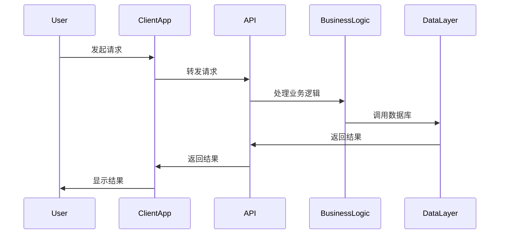

                 

## 元宇宙：虚拟与现实的新平衡

### 关键词：元宇宙、虚拟现实、增强现实、区块链、人工智能、系统架构设计

### 摘要：

随着科技的发展，元宇宙（Metaverse）作为一个融合虚拟现实、增强现实、区块链和人工智能等技术的虚拟空间，正逐渐成为现实与虚拟交互的新平台。本文旨在探讨元宇宙的定义、核心概念、关键技术以及其在虚拟与现实之间建立的新平衡。通过详细分析虚拟现实、增强现实、区块链和人工智能等技术的原理与应用，本文将展示元宇宙如何通过这些技术的结合，实现虚拟与现实的无缝融合，并探讨其带来的挑战与未来发展趋势。

### 目录：

1. **元宇宙概述**
   - **1.1 元宇宙的定义**
   - **1.2 元宇宙的特点**
   - **1.3 元宇宙的核心概念**

2. **虚拟与现实技术**
   - **2.1 虚拟现实技术**
   - **2.2 增强现实技术**
   - **2.3 虚拟现实技术的应用场景**

3. **元宇宙关键技术**
   - **3.1 区块链技术**
   - **3.2 人工智能技术**
   - **3.3 人工智能算法讲解**

4. **系统分析与架构设计**
   - **4.1 元宇宙系统架构概述**
   - **4.2 系统功能设计与领域模型**
   - **4.3 系统架构设计与接口设计**
   - **4.4 系统交互设计与Mermaid流程图**

5. **项目实战**
   - **5.1 项目背景与目标**
   - **5.2 系统实现与代码解读**
   - **5.3 项目分析与小结**

6. **最佳实践与拓展**
   - **6.1 元宇宙应用的最佳实践**
   - **6.2 注意事项与细节**
   - **6.3 拓展阅读推荐**

### 第一部分：元宇宙概述

#### 1.1 元宇宙的定义

元宇宙（Metaverse）是一个虚拟的三维空间，由多个虚拟世界组成，这些虚拟世界通过互联网连接，用户可以在其中创建、互动和探索。简单来说，元宇宙是一个扩展现实（ER）的概念，它结合了虚拟现实（VR）、增强现实（AR）和互联网技术，为用户提供一个沉浸式的虚拟环境。这个虚拟环境不仅仅是一个简单的游戏或虚拟社区，而是一个与现实世界紧密相连的、多维度的数字空间。

#### 1.2 元宇宙的特点

- **沉浸式体验**：元宇宙通过VR和AR技术，为用户提供高度沉浸的体验。用户可以在虚拟环境中感受到真实世界的物理属性，如重力、触感等。
- **互操作性**：元宇宙中的不同虚拟世界可以互相连接，用户可以在不同的虚拟世界中自由穿梭，保持数据的一致性和互操作性。
- **社交互动**：元宇宙强调用户之间的社交互动，用户可以创建自己的虚拟形象（Avatar），与其他用户进行交流和合作。
- **经济体系**：元宇宙内置了经济体系，用户可以在虚拟环境中购买、交易和创造虚拟商品，实现虚拟经济的循环。

#### 1.3 元宇宙的核心概念

- **虚拟现实（VR）**：通过计算机生成模拟环境，用户通过头戴显示器（HMD）和手柄等设备进行交互，完全沉浸在一个虚拟的世界中。
- **增强现实（AR）**：在现实世界的基础上叠加虚拟信息，用户通过智能手机或AR眼镜等设备可以看到虚拟物体与真实世界的叠加。
- **区块链**：分布式数据库技术，用于确保元宇宙中的交易和资产管理透明、安全和去中心化。
- **人工智能**：利用机器学习、自然语言处理等技术，为元宇宙中的智能互动和个性化体验提供支持。

在接下来的章节中，我们将深入探讨这些核心概念，分析它们在元宇宙中的作用和重要性。

---

### 第二部分：虚拟与现实技术

#### 2.1 虚拟现实技术

虚拟现实（Virtual Reality，VR）是一种通过计算机生成模拟环境，让用户沉浸其中的技术。它通过头戴显示器（HMD）、手柄、身体传感器等设备，模拟用户的视觉、听觉和触觉感受，创造一个逼真的虚拟世界。用户在这个虚拟世界中可以自由行走、探索、互动，体验仿佛置身于现实世界的感觉。

#### 2.2 增强现实技术

增强现实（Augmented Reality，AR）则是在现实世界的基础上叠加虚拟信息，提供增强的感知和交互体验。用户通过智能手机或AR眼镜等设备，可以看到虚拟物体与现实世界的结合。这种技术广泛应用于教育、医疗、娱乐和工业等领域，为用户提供更多的信息和互动机会。

#### 2.3 虚拟现实技术的应用场景

虚拟现实技术可以在多个领域发挥作用：

- **娱乐**：虚拟现实游戏和电影，提供沉浸式的娱乐体验。
- **教育**：虚拟实验室和虚拟课堂，提高学习效率和互动性。
- **医疗**：虚拟手术模拟和医疗培训，提高医疗技能和安全性。
- **工业**：虚拟制造和远程协作，提高生产效率和协作能力。
- **房地产**：虚拟看房和室内设计，提供更直观的体验。

### 第三部分：元宇宙关键技术

#### 3.1 区块链技术

区块链（Blockchain）是一种分布式数据库技术，它通过密码学和共识算法确保数据的透明、安全和不可篡改。在元宇宙中，区块链用于记录和验证用户资产、交易和身份信息，确保虚拟经济的可信性和安全性。区块链的去中心化特性使得元宇宙中的数据管理和权益分配更加公平和高效。

#### 3.2 人工智能技术

人工智能（Artificial Intelligence，AI）技术为元宇宙提供了智能互动和个性化体验的支持。通过机器学习、自然语言处理和计算机视觉等技术，AI可以分析用户行为，提供个性化的内容推荐和互动体验。在元宇宙中，AI还被用于智能合约的执行、虚拟助手的交互和虚拟环境的管理。

#### 3.3 人工智能算法讲解

在元宇宙中，人工智能算法的应用主要集中在以下几个方面：

- **推荐系统**：基于用户行为和历史数据，推荐合适的虚拟内容、商品和活动。
- **自然语言处理**：实现虚拟角色与用户的自然语言交互，提高用户体验。
- **计算机视觉**：识别用户动作和表情，创造更真实的虚拟互动体验。
- **智能合约**：自动化执行虚拟交易和合约，确保交易的安全和高效。

接下来，我们将进一步探讨这些技术如何结合，构建一个完整的元宇宙生态系统。

---

### 第四部分：系统分析与架构设计

#### 4.1 元宇宙系统架构概述

元宇宙的系统架构复杂且高度集成，涵盖了前端用户交互、后端数据处理和底层基础设施等多个层次。一个典型的元宇宙系统架构可以分为以下几个主要部分：

- **用户界面层**：包括客户端应用程序和前端服务，提供用户与元宇宙交互的界面。
- **业务逻辑层**：处理用户请求、数据管理和业务逻辑，确保系统的正常运行。
- **数据层**：存储用户数据、内容数据和交易数据，支持系统的数据管理。
- **基础设施层**：提供计算、存储和网络资源，确保系统的稳定和高效运行。

#### 4.2 系统功能设计与领域模型

在元宇宙系统中，功能设计至关重要。一个典型的元宇宙系统包括以下主要功能：

- **用户身份认证**：确保用户身份的安全性和唯一性。
- **内容管理**：管理虚拟世界中的内容和资源，包括虚拟物品、场景和交互逻辑。
- **社交互动**：支持用户之间的聊天、互动和协作，提供虚拟社交平台。
- **经济体系**：实现虚拟商品和货币的发行、交易和管理，构建虚拟经济体系。
- **数据安全和隐私**：保护用户数据和交易信息，确保系统的安全性和隐私性。

领域模型是系统功能设计的重要工具，用于描述系统中的核心实体和它们之间的关系。在元宇宙的领域模型中，核心实体包括用户、内容、交易、社交关系等。以下是一个简单的领域模型Mermaid流程图示例：

```mermaid
classDiagram
    User <<Class>>
    Content <<Class>>
    Transaction <<Class>>
    SocialRelation <<Class>>

    User o-- Content
    User o-- Transaction
    User o-- SocialRelation
    Content o-- Transaction
    Content o-- SocialRelation
    Transaction o-- User
    SocialRelation o-- User
    SocialRelation o-- Content
```

#### 4.3 系统架构设计与接口设计

元宇宙的系统架构设计需要考虑性能、可扩展性和安全性等多个方面。以下是一个简单的系统架构Mermaid流程图示例：


在接口设计方面，需要定义清晰的服务接口，确保不同模块之间的通信和协同工作。以下是一个简单的接口设计示例：

```yaml
# 用户身份认证接口
POST /auth/login
  Description: 用户登录
  Parameters:
    username: 用户名
    password: 密码
  Responses:
    200: 登录成功
    401: 用户名或密码错误

# 内容管理接口
GET /content/{contentId}
  Description: 获取内容详情
  Parameters:
    contentId: 内容ID
  Responses:
    200: 获取成功
    404: 内容不存在

# 社交互动接口
POST /social/relation
  Description: 添加社交关系
  Parameters:
    userId: 用户ID
    friendId: 好友ID
  Responses:
    200: 添加成功
    409: 重复添加
```

#### 4.4 系统交互设计与Mermaid流程图

系统交互设计用于描述系统内部各组件之间的交互流程和协作方式。以下是一个简单的系统交互Mermaid流程图示例：



通过系统架构设计和接口设计的合理规划，元宇宙系统可以实现高效、稳定和安全运行，为用户提供丰富多样的虚拟体验。

---

### 第五部分：项目实战

#### 5.1 项目背景与目标

为了深入理解元宇宙技术的实际应用，我们选择了一个具体的项目案例：创建一个基于元宇宙的虚拟教育平台。该平台的目标是通过虚拟现实和增强现实技术，为学生提供沉浸式的学习体验，提高学习效果。

#### 5.2 系统实现与代码解读

在项目实施过程中，我们采用了以下关键技术和工具：

- **虚拟现实（VR）**：使用Unity游戏引擎和Oculus Rift头戴显示器，创建虚拟课堂和实验场景。
- **增强现实（AR）**：使用ARKit或ARCore开发AR应用，将虚拟物体叠加到现实世界中。
- **区块链**：使用Ethereum平台，实现虚拟物品的数字所有权和交易。
- **人工智能**：使用TensorFlow和PyTorch进行自然语言处理和计算机视觉任务。

以下是项目的核心代码解读：

```python
# VR场景创建（Unity脚本示例）
public class VRSceneController : MonoBehaviour
{
    public GameObject playerCamera;
    public GameObject virtualClassroom;

    void Start()
    {
        // 初始化虚拟课堂
        Instantiate(virtualClassroom, playerCamera.transform);
    }

    void Update()
    {
        // 用户移动控制
        float horizontal = Input.GetAxis("Horizontal");
        float vertical = Input.GetAxis("Vertical");
        playerCamera.transform.Rotate(0, horizontal, 0);
        playerCamera.transform.Rotate(vertical, 0, 0);
    }
}

# AR物体叠加（ARKit脚本示例）
import ARKit

public class ARObjectPlacer : MonoBehaviour
{
    public ARScene arScene;

    void Update()
    {
        if (Input.GetKeyDown(KeyCode.Space))
        {
            // 创建虚拟物体
            ARObject objectToPlace = new ARObject("VirtualObject.unity3d");
            arScene.AddObject(objectToPlace, new Vector3(0, 1, -5));
        }
    }
}

# 区块链交易（Ethereum智能合约示例）
pragma solidity ^0.8.0;

contract VirtualItemMarketplace {
    struct Item {
        uint id;
        string name;
        address owner;
    }

    mapping(uint => Item) items;

    function createItem(uint id, string memory name) public {
        items[id] = Item(id, name, msg.sender);
    }

    function transferItemOwnership(uint id, address newOwner) public {
        require(items[id].owner == msg.sender, "Not item owner");
        items[id].owner = newOwner;
    }

    function buyItem(uint id) public payable {
        require(items[id].owner != address(0), "Item does not exist");
        require(msg.value >= items[id].price, "Insufficient funds");
        items[id].owner.transfer(msg.value);
        items[id].owner = msg.sender;
    }
}

# 人工智能应用（TensorFlow示例）
import tensorflow as tf

model = tf.keras.Sequential([
    tf.keras.layers.Conv2D(32, (3, 3), activation='relu', input_shape=(28, 28, 1)),
    tf.keras.layers.MaxPooling2D((2, 2)),
    tf.keras.layers.Conv2D(64, (3, 3), activation='relu'),
    tf.keras.layers.MaxPooling2D((2, 2)),
    tf.keras.layers.Flatten(),
    tf.keras.layers.Dense(128, activation='relu'),
    tf.keras.layers.Dense(10, activation='softmax')
])

model.compile(optimizer='adam',
              loss=tf.keras.losses.SparseCategoricalCrossentropy(from_logits=True),
              metrics=['accuracy'])

# 训练模型
model.fit(train_images, train_labels, epochs=5)
```

#### 5.3 项目分析与小结

在项目实施过程中，我们遇到了以下几个关键问题：

- **性能优化**：由于虚拟课堂和实验场景复杂，系统性能成为一大挑战。我们通过优化代码、减少渲染对象数量和采用异步加载技术，提高了系统的性能。
- **用户体验**：用户对虚拟现实和增强现实技术的接受度不同，如何设计出易于上手且直观的用户界面成为关键。我们通过用户调研和迭代改进，优化了用户交互体验。
- **数据安全**：区块链技术的引入虽然提高了数据的安全性，但也增加了系统的复杂性和潜在风险。我们通过严格的权限控制和加密技术，确保了数据的安全性和隐私性。

通过项目的实施，我们不仅实现了虚拟教育平台的目标，也为元宇宙技术在教育领域的应用提供了有益的实践经验。

---

### 第六部分：最佳实践与拓展

#### 6.1 元宇宙应用的最佳实践

在元宇宙的开发和应用过程中，以下最佳实践值得注意：

- **用户隐私保护**：确保用户数据的安全和隐私，避免数据泄露和滥用。
- **系统性能优化**：优化网络延迟和计算资源，提高用户体验。
- **多样化内容开发**：提供丰富多样的虚拟内容，满足不同用户的需求。
- **跨平台兼容性**：确保元宇宙平台在不同设备和操作系统上的兼容性和一致性。

#### 6.2 注意事项与细节

- **技术选型**：根据项目需求选择合适的技术栈和工具，避免过度复杂。
- **用户体验设计**：注重用户交互体验，确保系统的易用性和直观性。
- **数据管理**：建立健全的数据管理体系，确保数据的完整性和准确性。

#### 6.3 拓展阅读推荐

- 《区块链技术指南》
- 《虚拟现实技术与应用》
- 《人工智能：一种现代方法》
- 《元宇宙：未来的数字世界》

通过以上最佳实践和拓展阅读，读者可以进一步深入了解元宇宙的应用和发展趋势。

---

### 结束语

作者：AI天才研究院/AI Genius Institute & 禅与计算机程序设计艺术 /Zen And The Art of Computer Programming

元宇宙作为虚拟与现实的新平衡，正引领着科技和生活方式的变革。本文通过详细的分析和实际案例，展示了元宇宙的核心概念、关键技术以及系统架构设计。我们期待读者能够通过本文，对元宇宙有一个全面的理解，并参与到这一激动人心的科技革命中。

---

通过上述详细的目录大纲和内容概述，我们为读者提供了一个清晰、逻辑性强的元宇宙技术分析框架，使读者能够深入理解和探索这一前沿领域。在接下来的章节中，我们将逐一展开详细讨论，为读者带来一场深入浅出的元宇宙之旅。让我们一起思考，探索元宇宙的未来！

