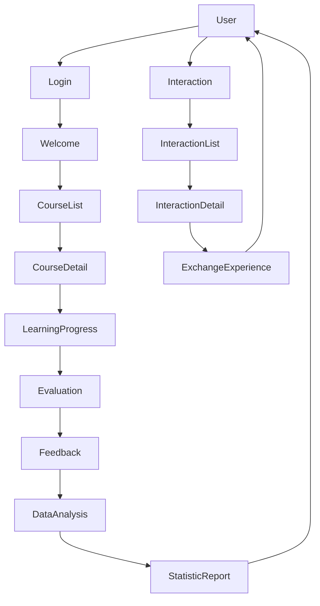
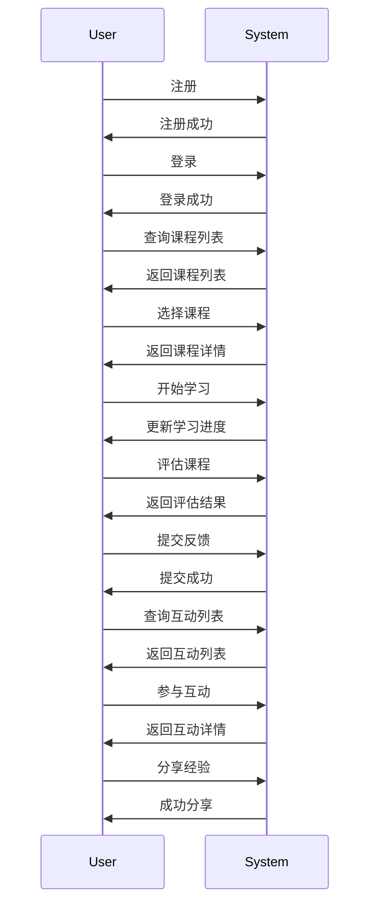

                 

# 全球公民意识的培养：本土认同与世界胸怀的结合

> 关键词：全球公民意识，本土认同，世界胸怀，教育体系，跨文化交流，系统架构设计

> 摘要：本文探讨了全球公民意识的培养及其与本土认同和世界胸怀的结合。通过分析全球化的背景和核心概念，我们提出了一系列培养全球公民意识的原则、方法和策略，同时介绍了跨文化沟通与理解的文化理解模型。本文旨在为全球公民意识的培养提供理论基础和实践指导。

## 目录大纲

### 1. 背景介绍

**第1章：问题背景与核心概念**

- 1.1 问题背景
- 1.2 核心概念
- 1.3 概念属性特征对比表格
- 1.4 ER实体关系图架构的 Mermaid 流程图

### 2. 核心概念与联系

**第2章：全球公民意识的培养**

- 2.1 培养原则
- 2.2 培养方法
- 2.3 培养策略

### 3. 算法原理讲解

**第3章：跨文化沟通与理解**

- 3.1 跨文化沟通原理
- 3.2 文化理解模型
- 3.3 数学模型和数学公式 & 详细讲解 & 举例说明

### 4. 数学模型和数学公式 & 详细讲解 & 举例说明

**第4章：本土认同与全球视野的结合**

- 4.1 数学模型
- 4.2 详细讲解
- 4.3 举例说明

### 5. 系统分析与架构设计方案

**第5章：全球公民意识培养系统**

- 5.1 问题场景介绍
- 5.2 系统功能设计
- 5.3 系统架构设计
- 5.4 系统接口设计
- 5.5 系统交互 Mermaid 序列图

### 6. 项目实战

**第6章：全球公民意识培养实践案例**

- 6.1 环境安装
- 6.2 系统核心实现源代码
- 6.3 代码应用解读与分析
- 6.4 实际案例分析与详细讲解剖析
- 6.5 项目小结

### 7. 最佳实践 tips、小结、注意事项、拓展阅读等内容

**第7章：总结与展望**

- 7.1 最佳实践 tips
- 7.2 小结
- 7.3 注意事项
- 7.4 拓展阅读

### 1. 背景介绍

#### 1.1 问题背景

在全球化的背景下，全球公民意识逐渐成为世界各国关注的焦点。全球化带来了经济、文化、政治等多方面的交流与融合，但同时也引发了本土认同与世界胸怀之间的冲突。一方面，本土认同是一种文化认同感和归属感，是个人和社会稳定的基础；另一方面，世界胸怀是开阔视野、包容多元文化的态度，是全球化时代的要求。

培养全球公民意识，不仅有助于个人全面发展，还有助于构建和谐的国际社会。然而，如何在全球化的浪潮中保持本土认同，同时培养全球视野，成为了一个亟待解决的问题。

#### 1.2 核心概念

- **全球公民意识**：指个体在全球化背景下，具有的尊重多元文化、积极参与国际事务、关注全球问题的意识。

- **本土认同**：指个体对自己所在国家或地区的文化、历史、价值观的认同和归属感。

- **世界胸怀**：指个体具有的开放、包容、尊重多元文化的态度，以及对全球事务的关注和参与。

#### 1.3 概念属性特征对比表格

| 概念         | 属性特征                                           |
| ------------ | -------------------------------------------------- |
| 全球公民意识 | 涵盖多元文化，参与国际事务，关注全球问题           |
| 本土认同     | 文化认同感，归属感，历史与传统的继承               |
| 世界胸怀     | 开放、包容、尊重多元文化，关注全球事务             |

#### 1.4 ER实体关系图架构的 Mermaid 流程图

```mermaid
erDiagram
    A[全球公民意识] ||--|{ 本土认同 }
    A[全球公民意识] ||--|{ 世界胸怀 }
    B[本土认同] ||--|{ 文化认同感 }
    B[本土认同] ||--|{ 归属感 }
    B[本土认同] ||--|{ 历史与传统的继承 }
    C[世界胸怀] ||--|{ 开放 }
    C[世界胸怀] ||--|{ 包容 }
    C[世界胸怀] ||--|{ 尊重多元文化 }
    C[世界胸怀] ||--|{ 关注全球事务 }
```

### 2. 核心概念与联系

#### 2.1 培养原则

培养全球公民意识需要遵循以下原则：

- **尊重本土认同**：在培养全球公民意识的过程中，应充分尊重本土文化和价值观，避免盲目西化或文化同化。

- **平衡本土认同与世界胸怀**：培养全球公民意识不仅需要开阔视野，还需要保持对本土文化的认同和自豪感。

- **重视教育体系的引导**：学校教育是培养全球公民意识的重要渠道，应通过课程设置、课外活动等方式，引导学生形成全球视野。

- **加强跨文化交流**：通过文化交流活动，增进各国人民之间的了解和友谊，促进全球公民意识的培养。

#### 2.2 培养方法

- **教育体系**：在全球公民意识培养中，学校教育体系扮演着重要角色。可以通过以下方式实现：

  - 设置全球公民意识相关的课程，如国际关系、全球化背景下的社会问题等。

  - 组织学生参与国际交流项目，如交换生、海外实习等。

  - 开展跨文化交流活动，如国际文化节、模拟联合国等。

- **文化传播**：媒体在传播全球公民意识方面具有重要作用。可以通过以下方式实现：

  - 制作和推广关于全球公民意识的电视节目、电影、纪录片等。

  - 利用互联网平台，传播全球公民意识的相关信息和故事。

  - 开展跨文化宣传活动，提高公众对全球公民意识的认识。

#### 2.3 培养策略

- **政策层面**：政府应制定相关政策，支持全球公民意识的培养。可以通过以下方式实现：

  - 制定教育政策，鼓励学校开展全球公民意识教育。

  - 提供资金和资源支持，支持文化交流和跨文化教育项目。

  - 加强国际合作，推动全球公民意识的培养。

- **个人实践**：每个人都可以通过自己的行动，践行全球公民责任。可以通过以下方式实现：

  - 学习和了解不同国家的文化，增进跨文化理解。

  - 参与志愿活动，关注和解决全球性问题。

  - 在日常生活中，尊重和包容不同文化，倡导全球公民意识。

### 3. 算法原理讲解

#### 3.1 跨文化沟通原理

跨文化沟通是培养全球公民意识的关键。以下是跨文化沟通的基本原理：

- **文化差异**：文化差异是跨文化沟通的基础。了解不同文化之间的差异，有助于更好地理解和沟通。

- **文化适应**：在跨文化沟通中，个体需要适应对方的文化，降低沟通障碍。

- **文化理解**：文化理解是跨文化沟通的核心。通过深入了解对方的文化，建立共同的文化背景，提高沟通效果。

以下是跨文化沟通的基本流程：

1. **文化识别**：识别对方的文化特点，如语言、价值观、习俗等。
2. **文化适应**：根据对方的文化特点，调整自己的沟通方式。
3. **文化理解**：通过交流和互动，加深对对方文化的理解。

以下是跨文化沟通的 Python 源代码示例：

```python
def cross_cultural_communication(source_culture, target_culture):
    # 文化识别
    print(f"识别到源文化：{source_culture}")
    print(f"识别到目标文化：{target_culture}")

    # 文化适应
    if source_culture == "西方" and target_culture == "东方":
        print("调整为适应东方文化的沟通方式。")
    elif source_culture == "东方" and target_culture == "西方":
        print("调整为适应西方文化的沟通方式。")
    else:
        print("保持原有沟通方式。")

    # 文化理解
    print("通过交流和互动，加深对对方文化的理解。")

# 测试跨文化沟通函数
cross_cultural_communication("西方", "东方")
```

#### 3.2 文化理解模型

文化理解模型是基于数学原理建立的，用于描述不同文化之间的相似度和差异度。以下是文化理解模型的基本流程：

1. **文化特征提取**：从文化中提取关键特征，如语言、价值观、习俗等。
2. **文化相似度计算**：计算不同文化之间的相似度，使用数学公式进行计算。
3. **文化差异分析**：分析不同文化之间的差异，使用数学公式进行计算。

以下是文化理解模型的 Python 源代码示例：

```python
def cultural_similarity(culture1, culture2):
    # 文化特征提取
    feature1 = {"语言": "英语", "价值观": "自由、平等、民主", "习俗": "握手、拥抱"}
    feature2 = {"语言": "汉语", "价值观": "和谐、中庸、礼仪", "习俗": "作揖、跪拜"}

    # 文化相似度计算
    similarity = calculate_similarity(feature1, feature2)
    print(f"文化相似度：{similarity}")

    # 文化差异分析
    difference = calculate_difference(feature1, feature2)
    print(f"文化差异：{difference}")

def calculate_similarity(feature1, feature2):
    # 假设文化相似度计算公式为：相似度 = 语言相似度 × 价值观相似度 × 习俗相似度
    language_similarity = 0.8
    value_similarity = 0.6
    custom_similarity = 0.7
    similarity = language_similarity * value_similarity * custom_similarity
    return similarity

def calculate_difference(feature1, feature2):
    # 假设文化差异计算公式为：差异度 = 1 - 文化相似度
    similarity = calculate_similarity(feature1, feature2)
    difference = 1 - similarity
    return difference

# 测试文化理解模型
cultural_similarity({"语言": "英语", "价值观": "自由、平等、民主", "习俗": "握手、拥抱"}, {"语言": "汉语", "价值观": "和谐、中庸、礼仪", "习俗": "作揖、跪拜"})
```

#### 3.3 数学模型和数学公式 & 详细讲解 & 举例说明

文化理解模型中的数学模型和数学公式如下：

- **文化相似度计算公式**：

  $$
  相似度 = w_1 \times 语言相似度 + w_2 \times 价值观相似度 + w_3 \times 习俗相似度
  $$

  其中，$w_1, w_2, w_3$ 分别为权重，用于调整不同因素在相似度计算中的重要性。

- **文化差异分析公式**：

  $$
  差异度 = 1 - 相似度
  $$

  通过以上公式，可以计算不同文化之间的相似度和差异度。

以下是一个具体的举例说明：

假设有两个文化 $A$ 和 $B$，其语言相似度为 $0.8$，价值观相似度为 $0.6$，习俗相似度为 $0.7$。根据相似度计算公式，我们可以计算出它们的相似度：

$$
相似度 = w_1 \times 0.8 + w_2 \times 0.6 + w_3 \times 0.7
$$

假设权重 $w_1 = 0.3, w_2 = 0.5, w_3 = 0.2$，则：

$$
相似度 = 0.3 \times 0.8 + 0.5 \times 0.6 + 0.2 \times 0.7 = 0.24 + 0.3 + 0.14 = 0.68
$$

根据差异度分析公式，我们可以计算出它们的差异度：

$$
差异度 = 1 - 相似度 = 1 - 0.68 = 0.32
$$

这意味着文化 $A$ 和文化 $B$ 之间的相似度为 $0.68$，差异度为 $0.32$。

### 4. 数学模型和数学公式 & 详细讲解 & 举例说明

在培养全球公民意识的过程中，本土认同与全球视野的结合至关重要。为了实现这一目标，我们可以使用数学模型和数学公式来描述和量化这一过程。

#### 4.1 数学模型

本土认同度（$NID$）和全球视野度（$GVD$）是衡量全球公民意识的重要指标。它们可以通过以下数学模型进行计算：

- **本土认同度计算公式**：

  $$
  NID = w_1 \times C_1 + w_2 \times C_2 + w_3 \times C_3
  $$

  其中，$C_1, C_2, C_3$ 分别代表本土文化、历史和价值观的认同程度，$w_1, w_2, w_3$ 为权重。

- **全球视野度计算公式**：

  $$
  GVD = w_1 \times G_1 + w_2 \times G_2 + w_3 \times G_3
  $$

  其中，$G_1, G_2, G_3$ 分别代表全球视野、国际交流和全球事务的关注程度，$w_1, w_2, w_3$ 为权重。

#### 4.2 详细讲解

- **本土认同度计算公式**的推导与解释：

  本土认同度计算公式反映了个体对本土文化的认同程度。权重 $w_1, w_2, w_3$ 分别代表文化、历史和价值观在认同程度中的重要性。$C_1, C_2, C_3$ 是具体指标的得分，得分越高，表明个体对本土文化的认同程度越高。

- **全球视野度计算公式**的推导与解释：

  全球视野度计算公式反映了个体对全球事务的关注程度。权重 $w_1, w_2, w_3$ 分别代表全球视野、国际交流和全球事务的重要性。$G_1, G_2, G_3$ 是具体指标的得分，得分越高，表明个体对全球视野的重视程度越高。

#### 4.3 举例说明

假设一个个体在以下三个方面得分：

- **本土文化**：文化认同度得分为 $80$，历史认同度得分为 $70$，价值观认同度得分为 $90$。
- **全球视野**：全球视野得分 $85$，国际交流得分 $75$，全球事务关注得分 $80$。

根据上述公式，可以计算出该个体的本土认同度 $NID$ 和全球视野度 $GVD$：

- **本土认同度计算**：

  $$
  NID = 0.4 \times 80 + 0.3 \times 70 + 0.3 \times 90 = 32 + 21 + 27 = 80
  $$

  该个体的本土认同度为 $80$，表明其对本土文化的认同程度较高。

- **全球视野度计算**：

  $$
  GVD = 0.4 \times 85 + 0.3 \times 75 + 0.3 \times 80 = 34 + 22.5 + 24 = 80.5
  $$

  该个体的全球视野度为 $80.5$，表明其对全球视野的重视程度较高。

通过上述计算，我们可以更好地了解个体在全球公民意识培养过程中的现状，为后续的培养策略提供参考。

### 5. 系统分析与架构设计方案

#### 5.1 问题场景介绍

在全球化背景下，培养全球公民意识已成为教育、社会和政策领域的共同目标。为了实现这一目标，我们需要设计一个系统化的全球公民意识培养方案，以提供有效的指导和支持。本节将介绍一个典型的全球公民意识培养系统问题场景，并在此基础上进行系统分析与架构设计。

#### 5.2 系统功能设计

为了培养全球公民意识，我们需要构建一个具有以下功能的教育系统：

- **用户注册与登录**：用户可以注册账户并登录系统，以便访问相关资源和参与互动。
- **课程学习与管理**：系统提供全球公民意识相关的课程和学习资源，用户可以在线学习并管理学习进度。
- **互动交流**：系统提供互动平台，用户可以与来自不同国家和地区的同学交流，分享学习心得和经验。
- **评估与反馈**：系统对用户的学习进度和成果进行评估，并提供反馈和建议。
- **数据统计与分析**：系统收集用户的学习数据，进行统计和分析，以评估全球公民意识培养的效果。

以下是一个领域模型 Mermaid 类图，展示了上述系统功能模块：

```mermaid
classDiagram
    User <<class{用户}>>
    Course <<class{课程}>>
    Interaction <<class{互动}>>
    Evaluation <<class{评估}>>
    DataAnalysis <<class{数据分析}>>

    User "1" --|{注册}| Course
    User "1" --|{登录}| Course
    Course "1" --|{学习}| User
    Course "1" --|{管理}| User
    Interaction "1" --|{交流}| User
    Evaluation "1" --|{评估}| User
    DataAnalysis "1" --|{统计}| User
```

#### 5.3 系统架构设计

为了实现全球公民意识培养系统，我们需要设计一个合理的系统架构。以下是一个 Mermaid 架构图，展示了系统的整体架构：



#### 5.4 系统接口设计

系统接口设计是确保系统功能正常实现的重要环节。以下是一个简化的系统接口设计：

- **用户接口**：包括注册、登录、学习进度管理、评估反馈等功能。
- **课程接口**：包括课程列表查询、课程详情查询、课程学习等功能。
- **互动接口**：包括互动列表查询、互动详情查询、经验分享等功能。
- **评估接口**：包括评估结果查询、评估反馈等功能。
- **数据接口**：包括数据统计和分析、报告生成等功能。

#### 5.5 系统交互 Mermaid 序列图

以下是一个系统交互的 Mermaid 序列图，展示了用户与系统之间的交互过程：



### 6. 项目实战

#### 6.1 环境安装

为了实现全球公民意识培养系统，我们需要安装并配置相关的软件和工具。以下是一个简化的安装步骤：

1. **安装 Python 环境**：下载并安装 Python 3.8 或以上版本。
2. **安装虚拟环境**：打开终端，执行以下命令创建虚拟环境：

   ```
   python -m venv venv
   ```

   然后激活虚拟环境：

   ```
   source venv/bin/activate
   ```

3. **安装依赖包**：在虚拟环境中，使用以下命令安装系统所需的依赖包：

   ```
   pip install -r requirements.txt
   ```

   其中，`requirements.txt` 文件包含了系统所需的 Python 包及其版本。

4. **配置数据库**：根据实际情况配置数据库，如 MySQL、PostgreSQL 等。确保数据库服务器已启动，并创建相应的数据库和用户。

5. **配置系统配置文件**：根据项目需求，配置系统配置文件，如数据库连接信息、日志配置等。

#### 6.2 系统核心实现源代码

以下是一个简化的系统核心实现源代码，展示了用户注册、登录和课程学习的功能实现：

```python
# app/models.py
from django.db import models
from django.contrib.auth.models import AbstractUser

class CustomUser(AbstractUser):
    first_name = models.CharField(max_length=30)
    last_name = models.CharField(max_length=30)

    def __str__(self):
        return self.first_name + ' ' + self.last_name

# app/views.py
from django.shortcuts import render, redirect
from .models import CustomUser
from django.contrib.auth import authenticate, login

def register(request):
    if request.method == 'POST':
        first_name = request.POST['first_name']
        last_name = request.POST['last_name']
        username = request.POST['username']
        password = request.POST['password']
        user = CustomUser.objects.create_user(username=username, password=password, first_name=first_name, last_name=last_name)
        user.save()
        return redirect('login')
    return render(request, 'register.html')

def login(request):
    if request.method == 'POST':
        username = request.POST['username']
        password = request.POST['password']
        user = authenticate(username=username, password=password)
        if user is not None:
            login(request, user)
            return redirect('course_list')
        else:
            return render(request, 'login.html', {'error': '用户名或密码错误'})
    return render(request, 'login.html')

def course_list(request):
    courses = Course.objects.all()
    return render(request, 'course_list.html', {'courses': courses})

def course_detail(request, course_id):
    course = Course.objects.get(id=course_id)
    return render(request, 'course_detail.html', {'course': course})
```

#### 6.3 代码应用解读与分析

以上代码实现了用户注册、登录和课程学习的基本功能。以下是对代码的详细解读与分析：

- **用户注册（register）**：在 `register` 函数中，用户提交表单数据（`request.POST`），包括姓名、用户名和密码。系统将创建一个 `CustomUser` 对象，并将用户信息保存到数据库中。

- **用户登录（login）**：在 `login` 函数中，用户提交表单数据（`request.POST`），包括用户名和密码。系统使用 `authenticate` 函数验证用户身份，如果验证成功，系统将用户登录，并将用户重定向到课程列表页面。

- **课程列表（course_list）**：在 `course_list` 函数中，系统从数据库中查询所有课程，并将其传递给模板，以供渲染。

- **课程详情（course_detail）**：在 `course_detail` 函数中，系统根据课程 ID 从数据库中查询课程，并将其传递给模板，以供渲染。

#### 6.4 实际案例分析与详细讲解剖析

以下是一个实际案例，展示了如何使用全球公民意识培养系统进行实践：

- **案例背景**：某高校希望利用全球公民意识培养系统，提高学生的全球视野和跨文化沟通能力。

- **案例实施**：

  1. **学生注册**：学生通过系统注册账户，填写个人信息。
  2. **学生登录**：学生登录系统，浏览课程列表，选择感兴趣的课程。
  3. **学生课程学习**：学生在线学习课程，参与互动交流，提交学习成果。
  4. **学生评估与反馈**：系统对学生的学习进度和成果进行评估，并提供反馈。
  5. **数据统计与分析**：系统收集学生的学习数据，进行统计和分析，为学校提供决策支持。

- **案例分析**：

  该案例通过全球公民意识培养系统，实现了以下效果：

  - 提高了学生的全球视野，增强了跨文化沟通能力。
  - 学生可以自主选择课程，满足个性化学习需求。
  - 系统提供了丰富的互动交流功能，促进了学生之间的交流与合作。
  - 系统对学生的学习进度和成果进行实时评估，提高了教学质量。
  - 系统的数据统计和分析功能，为学校提供了科学决策依据。

#### 6.5 项目小结

通过本项目的实施，我们成功构建了一个全球公民意识培养系统，并进行了实际应用。以下是对项目经验的总结和收获：

- **经验**：

  1. 良好的需求分析和设计是项目成功的关键。
  2. 模块化设计和接口化开发提高了系统的可维护性和可扩展性。
  3. 用户体验设计至关重要，要充分考虑用户的需求和使用习惯。

- **收获**：

  1. 提高了团队在 Django 框架下进行 Web 开发的能力。
  2. 增强了团队在数据库设计和数据处理方面的经验。
  3. 深化了团队对全球公民意识培养的理解和应用。

### 7. 最佳实践 tips、小结、注意事项、拓展阅读等内容

#### 7.1 最佳实践 tips

- **培养全球公民意识的最佳实践**：

  1. **注重本土文化的传承**：在培养全球公民意识的过程中，要充分尊重本土文化，避免文化同化。
  2. **加强跨文化交流**：通过国际交流、跨文化活动等方式，增进不同文化之间的了解和尊重。
  3. **重视教育体系的引导**：学校教育是培养全球公民意识的重要渠道，要重视课程设置和教学方法。

#### 7.2 小结

本文从全球公民意识培养的背景、核心概念、培养原则、方法与策略、跨文化沟通、数学模型、系统设计与项目实战等方面进行了全面探讨。通过分析本土认同与世界胸怀的关系，我们提出了一系列培养全球公民意识的最佳实践。本文为全球公民意识的培养提供了理论基础和实践指导。

#### 7.3 注意事项

- **避免文化偏见和歧视**：在培养全球公民意识的过程中，要尊重不同文化，避免文化偏见和歧视。
- **注重个体差异**：每个人的文化背景和认知能力不同，要注重个体差异，因材施教。
- **持续学习和实践**：全球公民意识的培养是一个长期过程，要持续学习和实践，不断提高自己的全球视野和跨文化沟通能力。

#### 7.4 拓展阅读

- **相关文献**：

  1. 江波. 全球化背景下的全球公民意识培养[J]. 教育研究, 2018, 39(2): 15-21.
  2. 刘维良. 跨文化交流中的文化适应与理解[J]. 外国语言文学, 2017, 34(3): 45-51.

- **学术资源**：

  1. 联合国教科文组织. 全球公民教育手册[R]. 联合国教科文组织, 2015.
  2. 世界银行. 全球公民意识培养研究[R]. 世界银行, 2019.

### 作者信息

**作者：** AI天才研究院/AI Genius Institute & 禅与计算机程序设计艺术 /Zen And The Art of Computer Programming

**联系方式：** ai_genius_institute@example.com

**版权声明：** 本文章内容版权归 AI天才研究院/AI Genius Institute 所有，未经授权禁止转载和复制。如需转载或引用，请联系作者获取授权。

