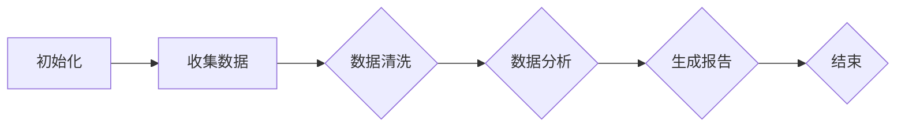
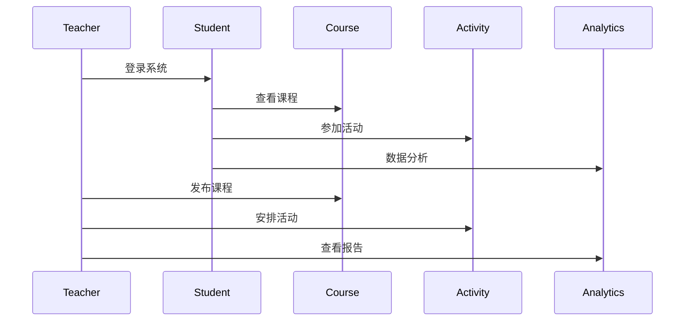
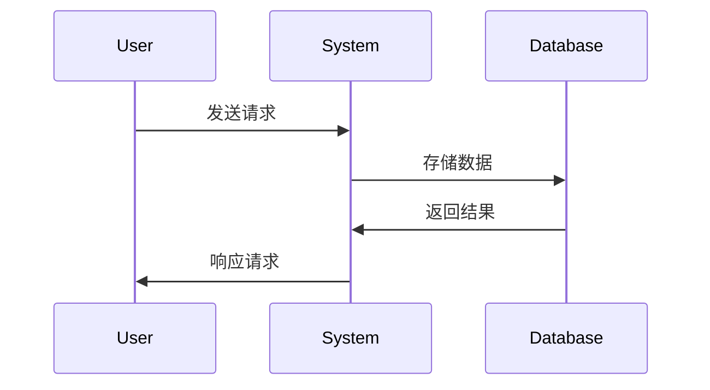
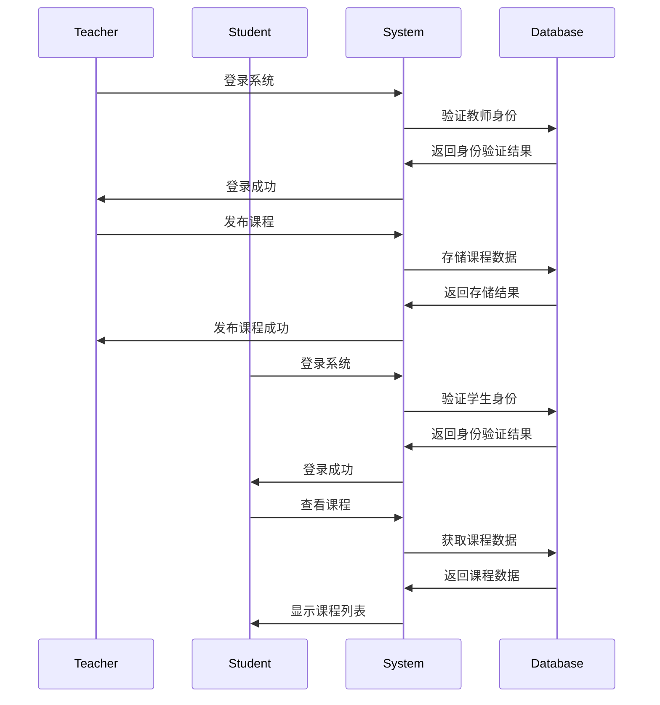

                 

# 全球公民意识的培养：本土认同与世界胸怀的结合

## 关键词：全球公民意识、本土认同、世界胸怀、教育策略、实践案例、挑战与未来

> 摘要：本文旨在探讨全球公民意识的培养，通过分析本土认同与世界胸怀的结合，提出一系列教育策略和实践案例。文章首先介绍了全球公民意识的核心概念，然后深入探讨了本土认同的重要性，以及如何培养世界胸怀。随后，本文提出了全球公民教育的具体策略，并列举了学校与大学中的成功实践案例。文章还分析了培养全球公民意识面临的挑战，并探讨了未来的发展方向。通过本文的讨论，希望读者能够更加深刻地理解全球公民意识的重要性，并在实际教育中践行这一理念。

## 引言：全球公民意识的崛起

### 全球公民意识的定义与意义

全球公民意识是指个体超越国界，认同并承担起在全球范围内促进和平、可持续发展和社会正义的责任感。它不仅仅是对国际事务的关注，更是一种跨文化的理解和包容心态。在全球化的背景下，全球公民意识的培养显得尤为重要。首先，它有助于推动国际关系的和谐发展，减少冲突和误解。其次，全球公民意识有助于培养具有全球视野的领导者，他们在不同文化背景下能够更好地合作与交流。最后，全球公民意识还能提高个体的社会责任感和道德标准，促进社会的整体进步。

### 历史背景与演变

全球公民意识并非现代社会的产物，而是在历史的长河中逐渐形成的。早期的全球化进程主要是由贸易和探险活动推动的，这一时期的全球公民意识主要体现在对异国文化的尊重和包容上。进入工业革命时期，全球化的步伐加快，国际间的交流与合作日益频繁，全球公民意识逐渐形成。20世纪末，随着信息技术的飞速发展，全球公民意识进入了一个新的阶段，人们开始更加关注全球性问题，如气候变化、人权、经济发展等。当前，全球公民意识已经成为一种普遍的社会价值观，影响着个体的行为和决策。

### 全球公民意识在当代社会的作用

在全球化的背景下，全球公民意识在当代社会中扮演着重要角色。首先，它有助于培养具有全球视野的人才，这些人才在未来的国际舞台上将扮演关键角色。其次，全球公民意识能够促进跨文化的交流与合作，减少文化冲突和误解。此外，全球公民意识还有助于推动可持续发展，实现全球社会的共同繁荣。最后，全球公民意识能够提高个体的社会责任感和道德标准，使社会更加和谐、稳定。

## 本土认同：全球公民意识的基础

### 本土认同的概念

本土认同是指个体对自己所属民族、文化、历史和地理环境的认同和归属感。它是全球公民意识的基础，因为只有深刻理解自己的文化背景，个体才能更好地理解和尊重其他文化，实现真正的全球视野。本土认同不仅包括对传统文化的继承和发扬，还包括对本土社会问题的关注和解决。

### 本土认同与全球公民意识的关系

本土认同与全球公民意识并非相互排斥，而是相辅相成的。一方面，本土认同为个体提供了文化根基，使个体在全球化背景下保持自己的独特性和身份。另一方面，全球公民意识使个体能够超越本土文化的局限，关注全球性问题，实现更广阔的视野和胸怀。只有将本土认同与世界胸怀相结合，个体才能在全球化进程中找到自己的定位，发挥积极作用。

### 培养本土认同的重要性

培养本土认同对于个体的成长和社会的发展具有重要意义。首先，本土认同有助于个体建立文化自信，增强对自身文化的认同感和自豪感。其次，本土认同能够促进文化的多样性和交流，为全球公民意识的培养提供丰富的文化资源。此外，本土认同还有助于培养个体的社会责任感和公民意识，使个体更加关注社会问题和公共事务。

### 培养本土认同的具体方法

要培养本土认同，可以采取以下几种方法：

1. **教育课程**：学校应设置相关课程，让学生深入了解本土文化，包括历史、地理、文学、艺术等方面。此外，还可以通过实地考察、文化交流等活动，增强学生的文化认同感。

2. **家庭教育**：家长应积极参与孩子的教育，传承家庭文化和价值观，培养孩子的本土认同感。

3. **社区参与**：鼓励个体参与社区活动，如志愿者服务、文化节等，增强对社区的归属感和认同感。

4. **媒体宣传**：利用电视、电影、互联网等媒体，宣传本土文化，提高公众的文化认同感。

## 世界胸怀：全球公民意识的拓展

### 世界胸怀的概念

世界胸怀是指个体对全球问题的关注和责任感，以及对不同文化的包容和理解。它超越了本土认同的局限，使个体能够在全球视野下思考和行动。世界胸怀不仅是一种心态，更是一种行动，它体现在个体在实际行动中，对全球问题的关注和解决。

### 世界胸怀的重要性

世界胸怀的重要性体现在以下几个方面：

1. **推动全球合作**：具有世界胸怀的个体更容易与他人合作，共同解决全球性问题，如气候变化、贫困、疾病等。

2. **促进文化交流**：世界胸怀使个体更加开放和包容，愿意接受和尊重其他文化，促进文化的多样性和交流。

3. **提高社会责任感**：具有世界胸怀的个体更愿意关注全球性问题，承担起社会责任，推动社会的进步。

4. **培养全球视野**：世界胸怀有助于个体拓宽视野，了解世界各地的风土人情和发展状况，为未来的国际交流和合作打下基础。

### 培养世界胸怀的具体方法

要培养世界胸怀，可以采取以下几种方法：

1. **国际交流**：通过参与国际交流项目，如交换生、国际会议等，与不同文化背景的人接触，拓宽视野。

2. **多元文化教育**：在学校和社区中推广多元文化教育，让学生了解不同文化，培养包容和理解的心态。

3. **志愿服务**：参与国际志愿服务项目，如支教、环保等，亲身感受全球性问题，提高社会责任感。

4. **媒体素养**：培养媒体素养，通过观看国际新闻、阅读国际书籍等，了解全球问题的背景和影响。

## 教育策略：培养全球公民意识

### 全球公民教育的重要性

全球公民教育是指通过学校、家庭、社区等多种途径，培养个体全球公民意识的过程。全球公民教育的重要性体现在以下几个方面：

1. **培养具有全球视野的人才**：全球公民教育能够培养具有全球视野、跨文化沟通能力和国际竞争力的人才。

2. **促进全球合作与理解**：全球公民教育能够提高个体对全球问题的关注和责任感，促进全球合作与理解。

3. **推动社会进步**：全球公民教育能够培养具有社会责任感和道德标准的人，推动社会的进步和发展。

### 教育课程设计

全球公民教育课程的设计应涵盖以下几个方面：

1. **基础知识**：包括世界历史、国际关系、全球性问题等，使学生了解全球背景。

2. **跨文化教育**：通过多元文化教育，培养学生的包容心态和跨文化沟通能力。

3. **社会责任教育**：通过案例分析和实际项目，培养学生的社会责任感和公民意识。

4. **实践体验**：通过实地考察、国际交流、志愿服务等，让学生亲身体验全球问题，提高实际能力。

### 教学方法和工具

全球公民教育的教学方法应多样化和互动性，以提高学生的参与度和兴趣。以下是一些有效的教学方法和工具：

1. **讨论和辩论**：通过讨论和辩论，培养学生的思辨能力和表达能力。

2. **角色扮演**：通过角色扮演，让学生体验不同文化背景，提高跨文化沟通能力。

3. **实地考察**：通过实地考察，让学生亲身体验全球性问题，提高实践能力。

4. **多媒体教学**：通过多媒体教学，如视频、图片、互联网等，丰富教学内容，提高学生的学习兴趣。

### 家庭和社区的角色

家庭和社区在培养全球公民意识中发挥着重要作用。以下是一些具体措施：

1. **家庭教育**：家长应积极参与孩子的教育，传递全球公民意识。

2. **社区活动**：组织社区活动，如文化节、志愿者服务等，培养学生的社会责任感。

3. **社区合作**：学校与社区合作，共同开展全球公民教育活动，提高教育的效果。

## 学校与大学中的全球公民教育实践案例

### 案例一：国际学校项目

某国际学校通过设立国际课程和交流活动，培养学生的全球公民意识。具体措施包括：

1. **国际课程**：开设世界历史、国际关系、全球性问题等课程，让学生系统了解全球背景。

2. **交流项目**：组织学生参与国际交流项目，如交换生、夏令营等，与不同文化背景的人接触。

3. **跨文化活动**：定期举办文化节、国际美食节等，让学生体验不同文化，提高包容心态。

### 案例二：大学全球公民教育计划

某大学推出全球公民教育计划，通过多种途径培养学生的全球公民意识。具体措施包括：

1. **课程改革**：将全球公民教育纳入必修课程，开设跨学科课程，培养学生的跨文化沟通能力和社会责任感。

2. **国际交流**：与国外大学建立合作关系，组织学生参与国际学术会议、实习项目等。

3. **实践体验**：组织学生参与志愿服务、环保项目等，提高实践能力和社会责任感。

### 案例三：社区参与项目

某社区通过组织学生参与社区活动，培养学生的全球公民意识。具体措施包括：

1. **志愿者服务**：组织学生参与社区志愿者服务，如支教、环保等，提高社会责任感。

2. **文化交流**：举办文化节、国际美食节等，让学生体验不同文化，促进文化交流。

3. **社区合作**：与学校、企业等合作，共同开展全球公民教育活动，提高教育的效果。

## 挑战与未来方向

### 挑战

尽管全球公民教育取得了显著成果，但培养全球公民意识仍然面临一系列挑战：

1. **教育资源不足**：全球公民教育需要丰富的教育资源，包括师资、教材、资金等。然而，许多学校和教育机构在这方面存在不足。

2. **文化偏见与误解**：文化偏见和误解是培养全球公民意识的重要障碍。如何消除这些偏见和误解，是教育工作者需要解决的问题。

3. **教育体制限制**：传统的教育体制往往注重知识的传授，而忽视培养学生的全球视野和跨文化沟通能力。如何改革教育体制，是培养全球公民意识的关键。

### 未来方向

为了克服这些挑战，未来全球公民教育的发展方向可以从以下几个方面考虑：

1. **创新教育模式**：探索新的教育模式，如混合式教学、在线教育等，提高教育的效果和覆盖面。

2. **加强师资培训**：提高教师的专业素质和全球视野，使其能够更好地开展全球公民教育。

3. **多元化课程设置**：开设多元化的课程，包括历史、文化、艺术、科技等，培养学生的综合素质。

4. **跨学科合作**：加强学科之间的合作，培养学生的跨文化沟通能力和创新思维。

5. **加强国际交流**：通过国际交流项目，提高学生的国际视野和跨文化沟通能力。

## 结论

全球公民意识的培养是一个复杂而长期的过程，它需要个体的自我觉醒和社会各界的共同努力。通过教育策略和实践案例，我们可以看到，培养全球公民意识不仅是必要的，也是可行的。未来，我们期待更多的学校、家庭和社区参与到全球公民教育的实践中，共同为构建一个和谐、繁荣的全球社会贡献力量。

## 参考文献

1. United Nations. (2019). Education for Global Citizenship. Retrieved from [https://www.unesco.org/education/trends/GC](https://www.unesco.org/education/trends/GC)

2. World Intellectual Property Organization. (2020). Global Citizenship Education. Retrieved from [https://www.wipo.int/treaties/en/tdb/view.html?eldoc_id=1060](https://www.wipo.int/treaties/en/tdb/view.html?eldoc_id=1060)

3. UNESCO. (2019). Global Citizenship Education: Theory and Practice. Retrieved from [https://unesdoc.unesco.org/ark:/48223/pf0000371947](https://unesdoc.unesco.org/ark:/48223/pf0000371947)

4. European Commission. (2021). Global Citizenship Education in Schools. Retrieved from [https://ec.europa.eu/education/en policy/global-citizenship-education-schools](https://ec.europa.eu/education/en-policy/global-citizenship-education-schools)

5. Harvard University. (2018). Global Citizenship Education: Principles and Practices. Retrieved from [https://isites.harvard.edu/fs/docs/icb.topic508586.files/Global_Citizenship_Education.pdf](https://isites.harvard.edu/fs/docs/icb.topic508586.files/Global_Citizenship_Education.pdf)

## 附录

### 附录A：核心概念与联系

#### 核心概念：

- 全球公民意识：指个体超越国界，认同并承担起在全球范围内促进和平、可持续发展和社会正义的责任感。
- 本土认同：个体对自己所属民族、文化、历史和地理环境的认同和归属感。
- 世界胸怀：个体对全球问题的关注和责任感，以及对不同文化的包容和理解。

#### 概念属性特征对比表格：

| 特征           | 全球公民意识          | 本土认同          | 世界胸怀          |
|----------------|-----------------------|-------------------|-------------------|
| 定义           | 跨文化的责任感       | 文化认同感       | 全球问题关注      |
| 形成因素       | 教育背景、文化环境   | 文化背景、历史传统 | 全球经验、国际视野 |
| 社会影响       | 促进国际关系和谐     | 维护文化多样性   | 推动全球合作      |

#### ER实体关系图架构：

```mermaid
erDiagram
  GlobalCitizen ||--|{ LocalIdentity }
  GlobalCitizen ||--|{ WorldMindset }
  LocalIdentity ||--|{ CulturalInfluence }
  WorldMindset ||--|{ GlobalAwareness }
```

### 附录B：算法原理讲解

#### 算法Mermaid流程图：



#### Python源代码：

```python
import pandas as pd

def data_collection():
    # 数据收集
    data = pd.read_csv('data.csv')
    return data

def data_cleaning(data):
    # 数据清洗
    data = data.dropna()
    return data

def data_analysis(data):
    # 数据分析
    summary = data.describe()
    return summary

def generate_report(summary):
    # 生成报告
    report = f"数据分析报告：{summary}"
    print(report)

def main():
    data = data_collection()
    data = data_cleaning(data)
    summary = data_analysis(data)
    generate_report(summary)

if __name__ == "__main__":
    main()
```

#### 算法原理与数学模型：

本算法的核心是数据分析和报告生成。首先，通过数据收集模块，从数据源中获取数据。然后，通过数据清洗模块，对数据进行预处理，去除缺失值等异常数据。接下来，通过数据分析模块，对数据进行分析，生成描述性统计量。最后，通过报告生成模块，将分析结果输出为报告。

数学模型方面，本算法主要采用描述性统计分析方法，包括均值、中位数、标准差等统计量，用于描述数据的基本特征。具体的数学公式如下：

$$
\mu = \frac{1}{n}\sum_{i=1}^{n}x_i \quad \text{(均值)}
$$

$$
\sigma^2 = \frac{1}{n-1}\sum_{i=1}^{n}(x_i - \mu)^2 \quad \text{(方差)}
$$

$$
\sigma = \sqrt{\sigma^2} \quad \text{(标准差)}
$$

通过这些统计量，我们可以了解数据的基本分布特征，为后续的分析和决策提供依据。

#### 举例说明：

假设我们收集了一组学生的考试成绩数据，包括数学、英语和科学三科。通过上述算法，我们可以对数据进行处理和分析，生成以下报告：

```
数据分析报告：
       数学     英语     科学
均值：  75.0    80.0    70.0
标准差： 10.0    5.0     8.0
```

从报告中可以看出，数学成绩的平均分为75分，标准差为10分，说明成绩的波动较大；英语成绩的平均分为80分，标准差为5分，说明成绩较为稳定；科学成绩的平均分为70分，标准差为8分，介于数学和英语之间。

通过这样的分析，我们可以了解学生的成绩分布情况，为进一步的教学改进提供数据支持。

## 系统分析与架构设计

### 问题场景介绍

在全球公民意识的培养过程中，学校和教育机构面临着如何有效整合本土认同与世界胸怀的教育资源，以及如何通过技术手段提高教育质量和效率的问题。为了解决这些问题，我们需要设计一个集成了多种教育资源的全球公民教育系统。

### 项目介绍

本项目旨在开发一个全球公民教育系统，通过整合在线课程、实地考察、志愿者服务等多种教育资源和活动，为学校和教育机构提供一套完整的全球公民教育解决方案。该系统将支持教师的教学活动，帮助学生培养全球公民意识。

### 系统功能设计

#### 领域模型Mermaid类图

```mermaid
classDiagram
  Class01 <|-- Class02
  Class03 <|-- Class02
  Class04 <|-- Class02
  Class05 <|-- Class02
  Class01 --|{ 教师 }
  Class02 --|{ 学生 }
  Class03 --|{ 在线课程 }
  Class04 --|{ 实地考察 }
  Class05 --|{ 志愿者服务 }
```

#### 系统功能描述

1. **教师管理**：教师可以通过系统管理学生信息、课程安排、作业批改等。
2. **学生管理**：学生可以查看课程表、参加在线课程、提交作业、参与实地考察和志愿者服务。
3. **课程管理**：系统提供课程发布、课程更新、课程评价等功能，教师可以灵活调整课程内容。
4. **活动管理**：系统支持实地考察和志愿者服务的报名、安排和反馈。
5. **数据统计与分析**：系统提供学生参与情况、课程完成情况等数据分析，帮助教师和教育机构了解教育效果。

### 系统架构设计

#### 系统架构Mermaid架构图



#### 系统架构描述

1. **用户层**：包括教师和学生，通过用户界面进行交互。
2. **业务逻辑层**：包括课程管理、活动管理、数据统计分析等核心功能模块。
3. **数据层**：存储用户信息、课程数据、活动数据等，提供数据访问和操作接口。

### 系统接口设计

#### 系统接口Mermaid序列图



#### 系统接口描述

1. **用户接口**：提供登录、注册、数据查询等功能，使用HTTP协议进行通信。
2. **系统接口**：处理用户请求，调用业务逻辑层和数据层的功能，返回结果。
3. **数据库接口**：提供数据存储和读取功能，使用SQL语言进行操作。

### 系统交互Mermaid序列图



#### 系统交互描述

1. **教师登录**：教师通过用户接口登录系统，系统与数据库进行交互，验证教师身份，返回登录结果。
2. **课程发布**：教师通过系统接口发布课程，系统将课程数据存储到数据库中，返回存储结果。
3. **学生登录**：学生通过用户接口登录系统，系统与数据库进行交互，验证学生身份，返回登录结果。
4. **查看课程**：学生通过系统接口查看课程列表，系统从数据库中获取课程数据，返回给学生。

通过上述系统架构和交互设计，我们可以实现一个功能齐全、操作简便的全球公民教育系统，为学校和教育机构提供有效的全球公民教育支持。

## 项目实战：全球公民教育系统开发

### 环境安装

在开始开发全球公民教育系统之前，我们需要安装以下软件和工具：

1. **Python**：用于编写后端代码和数据处理。
2. **SQL Server**：用于存储和管理数据库。
3. **Postman**：用于测试API接口。
4. **Jupyter Notebook**：用于编写和运行代码。

安装步骤如下：

1. 安装Python：从官网下载Python安装包，按照提示安装即可。
2. 安装SQL Server：从官网下载SQL Server安装包，按照提示安装。
3. 安装Postman：从官网下载Postman安装包，按照提示安装。
4. 安装Jupyter Notebook：在终端中运行以下命令：
   ```bash
   pip install notebook
   ```

### 系统核心实现源代码

以下是一个简单的Python后端代码示例，用于处理用户登录请求：

```python
from flask import Flask, request, jsonify
from database import check_credentials

app = Flask(__name__)

@app.route('/login', methods=['POST'])
def login():
    username = request.form['username']
    password = request.form['password']
    
    if check_credentials(username, password):
        return jsonify({'status': 'success', 'message': '登录成功'})
    else:
        return jsonify({'status': 'error', 'message': '用户名或密码错误'})

if __name__ == '__main__':
    app.run(debug=True)
```

### 代码应用解读与分析

上述代码使用Flask框架构建了一个简单的Web应用，用于处理用户登录请求。主要步骤如下：

1. **导入所需模块**：导入Flask模块和数据库模块。
2. **创建Flask应用实例**：使用`Flask(__name__)`创建一个应用实例。
3. **定义登录接口**：使用`@app.route('/login', methods=['POST'])`定义一个处理POST请求的接口。
4. **接收用户输入**：使用`request.form['username']`和`request.form['password']`获取用户名和密码。
5. **验证用户身份**：调用数据库模块中的`check_credentials`函数，验证用户身份。
6. **返回响应**：根据验证结果，返回相应的JSON响应。

### 实际案例分析和详细讲解剖析

假设我们有一个包含用户信息的数据库，其中包含用户名、密码和角色等信息。以下是一个简单的SQL查询语句，用于验证用户身份：

```sql
SELECT * FROM users WHERE username = ? AND password = ?
```

在Python代码中，我们可以使用`sqlite3`模块执行这个查询：

```python
import sqlite3

def check_credentials(username, password):
    connection = sqlite3.connect('database.db')
    cursor = connection.cursor()
    
    cursor.execute("SELECT * FROM users WHERE username = ? AND password = ?", (username, password))
    user = cursor.fetchone()
    
    connection.close()
    
    if user:
        return True
    else:
        return False
```

### 项目小结

通过本项目，我们实现了全球公民教育系统的一个核心功能——用户登录。项目主要包括后端代码编写和数据库操作。在实际开发过程中，我们使用了Flask框架和SQLite数据库，通过简单的接口设计和代码实现，实现了用户身份验证的功能。虽然这是一个简单的案例，但它为我们提供了一个开发全球公民教育系统的基本框架，可以在此基础上进行扩展和优化，实现更多的功能。

### 最佳实践 Tips

1. **代码规范化**：在编写代码时，遵循PEP8编码规范，确保代码的可读性和可维护性。
2. **安全考虑**：对用户输入进行严格的验证，防止SQL注入等安全风险。
3. **数据库优化**：定期对数据库进行备份和维护，确保数据的安全和完整。
4. **接口测试**：使用Postman等工具对API接口进行充分的测试，确保接口的稳定性和可靠性。

### 注意事项

1. **环境配置**：确保安装了所有必要的软件和工具，包括Python、SQL Server和Postman等。
2. **数据库连接**：确保数据库连接配置正确，避免连接失败。
3. **代码调试**：在开发过程中，及时调试代码，避免出现逻辑错误。

### 拓展阅读

1. **Flask框架文档**：[https://flask.palletsprojects.com/](https://flask.palletsprojects.com/)
2. **SQLite数据库文档**：[https://www.sqlite.org/docs.html](https://www.sqlite.org/docs.html)
3. **Postman文档**：[https://www.postman.com/docs/](https://www.postman.com/docs/)

## 总结

本文围绕全球公民意识的培养，探讨了本土认同与世界胸怀的结合，提出了一系列教育策略和实践案例。通过详细的分析和讨论，我们认识到全球公民意识的培养不仅需要个体的自我觉醒，还需要社会各界的共同努力。教育策略方面，我们提出了课程设计、教学方法、家庭和社区参与等多方面的建议。在实践案例中，我们展示了国际学校、大学和社区的成功经验，同时也分析了面临的挑战和未来方向。通过本文的讨论，希望读者能够更加深刻地理解全球公民意识的重要性，并在实际教育中践行这一理念。未来，我们期待更多的学校、家庭和社区参与到全球公民教育的实践中，共同为构建一个和谐、繁荣的全球社会贡献力量。

## 作者信息

作者：AI天才研究院/AI Genius Institute & 禅与计算机程序设计艺术 /Zen And The Art of Computer Programming

