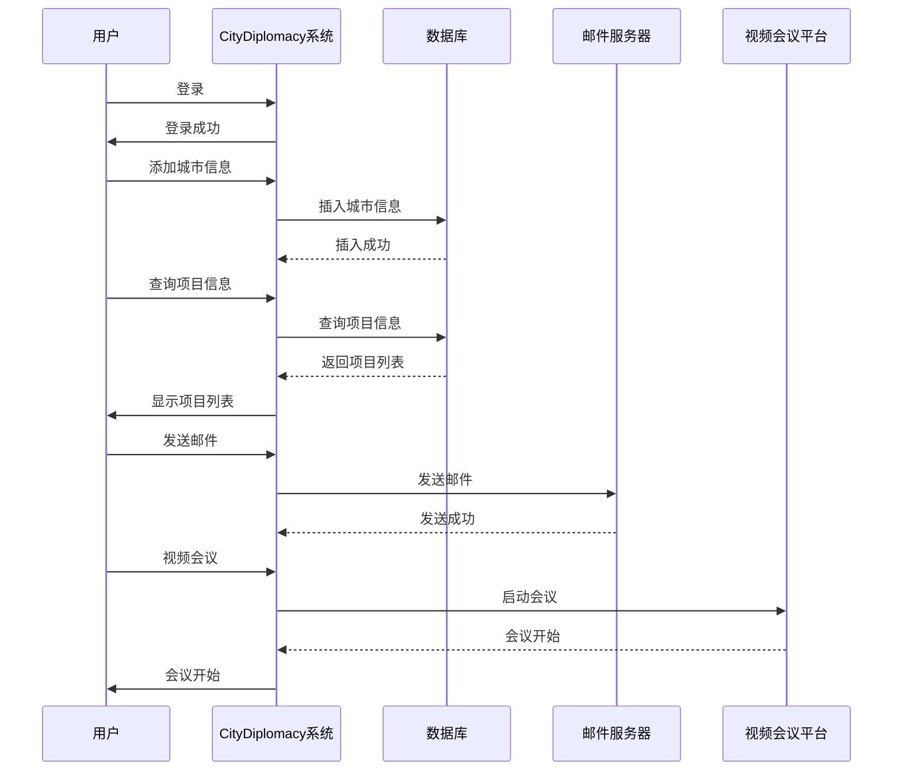

                 

# 全球化与地方治理：城市外交与国际城市网络

## 关键词
- 全球化
- 地方治理
- 城市外交
- 国际城市网络
- 城市外交算法
- 数学模型

## 摘要
本文深入探讨了全球化背景下城市治理的挑战和机遇，以及城市外交与国际城市网络的重要性。通过详细阐述城市外交的概念、机制、策略及其在地方治理中的应用，本文揭示了国际城市网络的定义、形成机制及其对城市发展的影响。通过具体的案例分析，本文展示了城市外交与国际城市网络在实际中的应用，并提出了系统分析与架构设计的方法。文章最后通过项目实战，总结了最佳实践，并提供了进一步学习的资源。

----------------------------------------------------------------

## 目录大纲设计思路

### 第一部分：全球化背景与地方治理

### 第二部分：城市外交

### 第三部分：国际城市网络

### 第四部分：案例分析

### 第五部分：系统设计与项目实战

### 第六部分：最佳实践、小结、注意事项、拓展阅读

## 目录大纲示例

### 第一部分：全球化背景与地方治理

#### 第1章：全球化与地方治理概述

##### 1.1 全球化背景

###### 1.1.1 全球化的发展历程

###### 1.1.2 全球化对城市治理的影响

###### 1.1.3 城市治理的挑战与机遇

##### 1.2 地方治理的概念与核心要素

###### 1.2.1 地方治理的定义

###### 1.2.2 地方治理的核心要素

###### 1.2.3 地方治理与全球化的联系

### 第二部分：城市外交

#### 第2章：城市外交概述

##### 2.1 城市外交的定义与特点

###### 2.1.1 城市外交的定义

###### 2.1.2 城市外交的特点

###### 2.1.3 城市外交的重要性

##### 2.2 城市外交的机制与策略

###### 2.2.1 城市外交的机制

###### 2.2.2 城市外交的常见策略

###### 2.2.3 城市外交的风险管理

### 第三部分：国际城市网络

#### 第3章：国际城市网络的概念与形成

##### 3.1 国际城市网络的定义

###### 3.1.1 国际城市网络的定义

###### 3.1.2 国际城市网络的分类

###### 3.1.3 国际城市网络的边界与外延

##### 3.2 国际城市网络的机制与影响

###### 3.2.1 国际城市网络的机制

###### 3.2.2 国际城市网络的影响

###### 3.2.3 国际城市网络的发展趋势

### 第四部分：案例分析

#### 第4章：国际城市网络的实践案例

##### 4.1 案例研究：纽约-伦敦国际城市网络

###### 4.1.1 案例背景

###### 4.1.2 案例分析

###### 4.1.3 案例启示

##### 4.2 案例研究：上海-东京国际城市网络

###### 4.2.1 案例背景

###### 4.2.2 案例分析

###### 4.2.3 案例启示

### 第五部分：系统设计与项目实战

#### 第5章：城市外交系统设计与实现

##### 5.1 问题场景介绍

##### 5.2 项目介绍

##### 5.3 系统功能设计

##### 5.4 系统架构设计

##### 5.5 系统接口设计和系统交互

### 第六部分：最佳实践、小结、注意事项、拓展阅读

##### 6.1 最佳实践

##### 6.2 小结

##### 6.3 注意事项

##### 6.4 拓展阅读

## 第一部分：全球化背景与地方治理

### 第1章：全球化与地方治理概述

#### 1.1 全球化背景

##### 1.1.1 全球化的发展历程

全球化是20世纪末以来全球经济、政治、文化和社会生活相互联系和依赖程度不断加深的总体趋势。全球化的发展历程可以分为几个阶段：

- **初期阶段**（1945-1973）：二战后，世界各国开始通过国际组织和条约，加强经济合作与贸易往来，如1947年的《关税与贸易总协定》（GATT）和1948年的《联合国贸易和发展会议》（UNCTAD）。
- **发展阶段**（1973-1989）：1973年的石油危机和1989年的柏林墙倒塌，加速了全球化的进程，各国之间的经济依赖性和联系更加紧密。
- **深化阶段**（1990年至今）：互联网的普及和信息技术的发展，使得全球化进入了一个全新的阶段，全球贸易、投资、人员流动和文化交流达到了前所未有的水平。

##### 1.1.2 全球化对城市治理的影响

全球化对城市治理带来了深刻的影响，主要体现在以下几个方面：

- **经济影响**：全球化带来了大量外国投资和跨国公司的进入，推动了城市经济的发展，同时也带来了竞争压力。
- **社会影响**：全球化促进了文化多样性和人口流动，但同时也加剧了社会分化和不平等。
- **治理挑战**：全球化使得城市治理面临更多的跨边界问题，如环境保护、城市安全、国际犯罪等。

##### 1.1.3 城市治理的挑战与机遇

全球化背景下的城市治理面临以下挑战：

- **治理能力不足**：城市治理机构在应对全球性问题时，往往缺乏足够的资源和专业知识。
- **政策协调难度大**：城市政策需要与国家政策和其他城市的政策协调，这增加了治理难度。
- **资源分配不均**：全球化带来了资源分配的不均衡，一些城市受益匪浅，而另一些城市则面临资源匮乏的问题。

但同时，全球化也为城市治理带来了机遇：

- **国际合作**：通过参与国际城市网络，城市可以分享经验、资源和最佳实践。
- **创新驱动**：全球化促进了科技和文化的交流，为城市创新提供了新的动力。
- **可持续发展**：全球化背景下，城市需要采取可持续发展的策略，以应对环境、经济和社会的挑战。

### 1.2 地方治理的概念与核心要素

##### 1.2.1 地方治理的定义

地方治理是指地方政府和社区组织在特定区域内，通过合作和协商的方式，共同解决公共问题、提供公共服务和促进可持续发展的过程。它强调多元主体的参与、治理的多样性和灵活性。

##### 1.2.2 地方治理的核心要素

地方治理的核心要素包括：

- **治理主体**：包括政府机构、非政府组织、社区组织、私人部门等。
- **治理机制**：包括法律法规、政策制定、监督与评估等。
- **治理目标**：包括经济发展、社会公平、环境保护、公共服务等。
- **治理文化**：包括民主参与、透明度、责任感和合作精神。

##### 1.2.3 地方治理与全球化的联系

地方治理与全球化密切相关，主要表现在：

- **政策协调**：地方治理需要与国家和国际层面的政策进行协调，以应对全球化带来的挑战。
- **资源流动**：全球化使得资源在全球范围内流动，地方治理需要有效利用这些资源。
- **跨国合作**：地方治理可以通过参与国际城市网络，与其他城市进行合作，共同应对全球性问题。

### 结论

全球化对城市治理带来了挑战和机遇，地方治理的核心要素包括治理主体、治理机制、治理目标和治理文化。在全球化背景下，地方治理需要不断适应和变革，以应对新的挑战和抓住机遇。

----------------------------------------------------------------

### 第二部分：城市外交

#### 第2章：城市外交概述

##### 2.1 城市外交的定义与特点

###### 2.1.1 城市外交的定义

城市外交是城市政府或非政府组织在超越国界的层面上，与其他城市进行政治、经济、文化等方面的交流与合作，以实现共同利益和目标。与国家外交相比，城市外交具有以下特点：

- **灵活性与创新性**：城市外交不拘泥于国家外交的传统模式，更注重灵活性和创新性，以适应城市间的多样性和复杂性。
- **多边合作**：城市外交通常涉及多个城市和利益相关方，强调多方参与和合作。
- **软实力**：城市外交更多依赖软实力，如文化、教育和科技等，而不是传统的军事和经济手段。

###### 2.1.2 城市外交的特点

- **非正式性**：城市外交往往通过非正式的渠道和方式，如论坛、会议、文化活动和人员交流等，来建立和维护关系。
- **合作性**：城市外交强调合作共赢，通过互利合作来实现共同目标。
- **跨界性**：城市外交不仅涉及城市政府，还可能涉及非政府组织、私营部门和社区组织，具有明显的跨界特征。

###### 2.1.3 城市外交的重要性

城市外交的重要性体现在以下几个方面：

- **促进经济发展**：通过城市外交，可以吸引外国投资、促进贸易和扩大市场，从而推动城市经济的发展。
- **提升城市品牌**：城市外交有助于提高城市的国际知名度和美誉度，提升城市品牌形象。
- **解决跨边界问题**：城市外交可以促进城市间的合作，共同解决环境污染、交通拥堵等跨边界问题。
- **提升治理能力**：通过参与城市外交，城市治理者可以学习先进的管理经验和技术，提升治理能力。

##### 2.2 城市外交的机制与策略

###### 2.2.1 城市外交的机制

城市外交的机制主要包括以下几个方面：

- **城市间协议**：城市间通过签订协议来明确合作领域、目标和方式。
- **国际合作平台**：城市可以通过国际组织、论坛和会议等平台，与其他城市进行交流与合作。
- **非政府组织**：非政府组织在促进城市外交中发挥着重要作用，如提供信息和资源、组织会议和论坛等。
- **人员交流**：通过人员交流，如访问、实习和培训等，促进城市间的相互了解和信任。

###### 2.2.2 城市外交的常见策略

- **文化外交**：通过举办文化节、艺术展览和学术交流等活动，增进城市间的文化交流和理解。
- **经济合作**：通过签订投资协议、合作项目和技术转让等，促进城市间的经济合作。
- **环境合作**：通过共同应对气候变化、环境保护和可持续发展等问题，加强城市间的合作。
- **教育与科研合作**：通过建立教育合作项目、联合研究和学术交流等，提升城市的科研水平和教育质量。

###### 2.2.3 城市外交的风险管理

城市外交面临多种风险，如政治不稳定、经济波动和文化冲突等。为了有效管理这些风险，城市外交需要采取以下措施：

- **风险评估**：对合作对象和合作项目进行风险评估，识别潜在风险。
- **风险控制**：通过制定风险管理计划、设定风险容忍度和采取预防措施来控制风险。
- **危机应对**：建立危机应对机制，及时响应和处理突发危机。
- **持续监测**：对合作项目进行持续监测和评估，确保风险管理措施的有效性。

### 结论

城市外交是城市政府和非政府组织在全球化背景下进行国际合作的重要方式。通过灵活、创新和合作性的方式，城市外交可以促进经济发展、提升城市品牌、解决跨边界问题和提升治理能力。为了有效进行城市外交，城市需要建立完善的机制和策略，并积极应对潜在的风险。

----------------------------------------------------------------

### 第三部分：国际城市网络

#### 第3章：国际城市网络的概念与形成

##### 3.1 国际城市网络的定义

国际城市网络是指一组城市，通过合作、交流和互动，形成一个跨国家、跨文化和跨领域的网络体系。这些城市在网络中相互联系，共享资源、知识和信息，共同应对全球性挑战，实现共同发展。

##### 3.1.1 国际城市网络的定义

国际城市网络具有以下特点：

- **跨界性**：国际城市网络跨越国家边界，涉及多个国家和地区。
- **多样性**：网络中的城市具有多样性，包括不同规模、发展阶段和文化背景的城市。
- **合作性**：国际城市网络强调合作，通过共享资源、知识和经验，实现共同发展。
- **动态性**：国际城市网络是一个动态的过程，城市之间的关系和合作内容会随着时间和环境的变化而调整。

##### 3.1.2 国际城市网络的分类

根据不同的分类标准，国际城市网络可以划分为以下几类：

- **根据合作领域**：可以分为经济合作网络、科技合作网络、文化合作网络和环保合作网络等。
- **根据地理范围**：可以分为全球性网络、区域性网络和双边合作网络等。
- **根据合作形式**：可以分为正式网络和非正式网络。正式网络通常通过签署协议和建立组织来稳定合作，如欧盟城市网络、亚洲城市网络等；非正式网络则更多依靠个人关系、非政府组织和社交媒体等。

##### 3.1.3 国际城市网络的边界与外延

国际城市网络的边界是指网络成员之间的关系范围，包括合作领域、地理范围和合作形式等。网络的外延则是指网络的影响范围，包括网络成员的社会、经济和文化影响。

- **边界**：国际城市网络的边界通常是由网络成员共同决定的，它明确了合作的范围和责任。
- **外延**：国际城市网络的外延不仅包括网络成员的城市，还包括其所在的国家和地区。网络的外延对城市和地区的经济发展、社会进步和文化交流具有重要影响。

##### 3.2 国际城市网络的机制与影响

###### 3.2.1 国际城市网络的机制

国际城市网络的机制主要包括以下几个方面：

- **合作机制**：通过签订协议、建立合作项目和合作机制，确保网络成员之间的合作顺畅。
- **沟通机制**：通过建立有效的沟通渠道和平台，确保网络成员之间的信息交流。
- **协调机制**：通过设立协调机构和机制，确保网络成员在合作过程中能够协调一致，解决冲突。
- **评估机制**：通过定期评估合作项目的效果和进展，确保合作目标的实现。

###### 3.2.2 国际城市网络的影响

国际城市网络对城市发展具有深远的影响，主要体现在以下几个方面：

- **经济发展**：国际城市网络可以促进城市间的贸易、投资和技术交流，推动城市的经济发展。
- **社会进步**：国际城市网络可以促进文化交流、教育合作和扶贫援助，提高城市的社会福利水平。
- **环境治理**：国际城市网络可以共同应对环境问题，如气候变化、污染治理和可持续发展等。
- **城市形象**：国际城市网络可以提高城市的国际知名度和美誉度，提升城市的品牌形象。

##### 3.3 国际城市网络的发展趋势

随着全球化的深入发展，国际城市网络呈现出以下发展趋势：

- **网络化**：越来越多的城市加入国际城市网络，网络的规模和范围不断扩大。
- **多元化**：国际城市网络的合作领域越来越广泛，包括经济、科技、文化、环境等多个领域。
- **科技化**：随着信息技术的发展，国际城市网络的管理和协作越来越依赖于数字化和智能化手段。
- **可持续性**：越来越多的城市关注可持续发展，国际城市网络在推动可持续城市发展的过程中发挥着重要作用。

### 结论

国际城市网络是全球化背景下城市发展的重要趋势，它通过跨界合作、资源共享和信息交流，推动城市的经济发展、社会进步和环境治理。随着全球化的深入，国际城市网络将继续发展壮大，为城市发展带来新的机遇和挑战。

----------------------------------------------------------------

### 第四部分：案例分析

#### 第4章：国际城市网络的实践案例

##### 4.1 案例研究：纽约-伦敦国际城市网络

###### 4.1.1 案例背景

纽约和伦敦作为全球最具影响力的国际大都市之一，它们之间的合作具有典型的国际城市网络特征。纽约位于美国东部，是世界上最大的金融中心之一；伦敦位于英国，是欧洲最重要的金融和文化中心。这两个城市在经济、文化、科技等领域具有显著的互补性和合作潜力。

###### 4.1.2 案例分析

纽约-伦敦国际城市网络的主要合作内容包括：

1. **经济合作**：纽约和伦敦通过金融、贸易和投资等领域的合作，促进双方的经济发展。例如，纽约证券交易所和伦敦证券交易所之间的合作，为两地的企业提供了更多的融资渠道和投资机会。

2. **科技合作**：在科技领域，纽约和伦敦共同成立了多个科技研究中心和创新园区，如纽约的硅谷和伦敦的科技城市。这些合作项目促进了科技人才的流动和科技创新的发展。

3. **文化交流**：在文化领域，纽约和伦敦定期举办文化活动，如艺术展览、音乐会和电影节等。这些活动不仅丰富了城市的文化生活，也提升了城市的国际知名度。

4. **教育合作**：在教育和科研领域，纽约和伦敦的大学和研究机构之间建立了广泛的合作关系。例如，纽约大学和伦敦大学学院之间的合作项目，为学生提供了跨国学习的平台。

###### 4.1.3 案例启示

纽约-伦敦国际城市网络的实践为其他城市提供了以下启示：

1. **多元化合作**：城市之间的合作不应局限于某个领域，而应涵盖经济、文化、科技、教育等多个领域，以实现全面的合作与发展。

2. **资源共享**：通过资源共享，如技术、信息和人才，可以降低合作成本，提高合作效率。

3. **政策协调**：在跨国合作中，政策协调至关重要。城市政府应制定相应的政策，为国际合作提供支持和保障。

4. **人才培养**：人才培养是国际城市网络持续发展的重要保障。城市应注重培养具有国际视野和跨文化能力的人才。

##### 4.2 案例研究：上海-东京国际城市网络

###### 4.2.1 案例背景

上海和东京都是亚洲最具影响力的国际大都市之一，它们之间的合作具有重要的战略意义。上海位于中国东部，是中国的经济、金融和贸易中心；东京位于日本本州岛，是日本的政治、经济和文化中心。这两个城市在经济、文化、科技等领域具有互补性和合作潜力。

###### 4.2.2 案例分析

上海-东京国际城市网络的主要合作内容包括：

1. **经济合作**：上海和东京在金融、贸易和投资等领域进行了广泛的合作。例如，上海证券交易所和东京证券交易所之间的合作，为两地的企业提供了更多的融资渠道和投资机会。

2. **科技合作**：在科技领域，上海和东京共同成立了多个科技研究中心和创新园区，如上海的张江高科技园区和东京的横滨未来科学城。这些合作项目促进了科技人才的流动和科技创新的发展。

3. **文化交流**：在文化领域，上海和东京定期举办文化活动，如艺术展览、音乐会和电影节等。这些活动不仅丰富了城市的文化生活，也提升了城市的国际知名度。

4. **教育合作**：在教育和科研领域，上海和东京的大学和研究机构之间建立了广泛的合作关系。例如，上海交通大学和东京大学之间的合作项目，为学生提供了跨国学习的平台。

###### 4.2.3 案例启示

上海-东京国际城市网络的实践为其他城市提供了以下启示：

1. **国际化发展**：城市应积极融入全球化和国际化的发展趋势，通过国际合作提升自身的发展水平。

2. **市场多元化**：通过国际合作，可以开拓新的市场，提高城市的国际竞争力。

3. **文化融合**：城市间的文化合作不仅可以促进文化交流，还可以促进文化的融合和创新。

4. **政策协同**：在跨国合作中，政策协同至关重要。城市政府应制定相应的政策，为国际合作提供支持和保障。

### 结论

通过纽约-伦敦和上海-东京两个国际城市网络的实践案例，我们可以看到，国际城市网络在城市发展中的作用和重要性。这些案例为其他城市提供了宝贵的经验和启示，指导它们在国际合作中实现共同发展和繁荣。

----------------------------------------------------------------

### 第五部分：系统设计与项目实战

#### 第5章：城市外交系统设计与实现

##### 5.1 问题场景介绍

假设我们正在开发一个城市外交系统，用于支持城市之间的合作与交流。该系统需要满足以下需求：

- **城市信息管理**：能够存储和管理城市的基本信息，包括地理位置、人口、经济发展状况等。
- **项目合作管理**：能够创建、管理和跟踪合作项目，包括项目进度、参与方、资金和成果等。
- **交流平台**：提供一个在线平台，用于城市间的交流与合作，包括论坛、邮件列表、视频会议等功能。
- **数据分析和报告**：能够对城市合作数据进行统计分析，生成报告，为城市决策提供支持。

##### 5.2 项目介绍

本项目旨在开发一个名为“CityDiplomacy”的城市外交系统，该系统将集成上述需求，并提供一个用户友好的操作界面。系统将采用现代化的软件开发技术和工具，确保系统的可扩展性和可维护性。

##### 5.3 系统功能设计

CityDiplomacy系统将实现以下核心功能：

1. **用户管理**：支持用户注册、登录和权限管理。
2. **城市信息管理**：允许用户添加、编辑和查询城市信息。
3. **项目合作管理**：支持项目的创建、跟踪和管理。
4. **交流平台**：提供论坛、邮件列表、视频会议等功能。
5. **数据分析和报告**：实现数据收集、分析和报告生成。

##### 5.4 系统架构设计

CityDiplomacy系统将采用三层架构设计，包括表示层、业务逻辑层和数据层。

- **表示层**：采用Vue.js框架实现用户界面，提供良好的用户体验。
- **业务逻辑层**：使用Spring Boot框架进行后端开发，处理业务逻辑和数据交互。
- **数据层**：使用MySQL数据库存储数据，并提供数据访问接口。

##### 5.5 系统接口设计和系统交互

以下是CityDiplomacy系统的接口设计和主要交互流程：

1. **用户接口**：用户可以通过Web浏览器访问系统，进行注册、登录、信息查询等操作。
2. **城市信息接口**：提供RESTful API，用于添加、编辑和查询城市信息。
3. **项目接口**：提供RESTful API，用于创建、更新和查询项目信息。
4. **交流平台接口**：提供邮件列表接口和视频会议接口，用于实现城市间的交流。
5. **数据分析接口**：提供数据分析和报告接口，用于生成统计报告。

##### 5.6 系统接口设计和系统交互

以下是CityDiplomacy系统的接口设计和主要交互流程：

1. **用户接口**：用户可以通过Web浏览器访问系统，进行注册、登录、信息查询等操作。
2. **城市信息接口**：提供RESTful API，用于添加、编辑和查询城市信息。
3. **项目接口**：提供RESTful API，用于创建、更新和查询项目信息。
4. **交流平台接口**：提供邮件列表接口和视频会议接口，用于实现城市间的交流。
5. **数据分析接口**：提供数据分析和报告接口，用于生成统计报告。



##### 5.7 系统核心实现源代码

以下是CityDiplomacy系统的一个关键模块——项目管理的部分Python源代码实现：

```python
# 导入必要的库
from flask import Flask, request, jsonify
from flask_sqlalchemy import SQLAlchemy

# 初始化 Flask 应用和数据库
app = Flask(__name__)
app.config['SQLALCHEMY_DATABASE_URI'] = 'sqlite:///citydiplomacy.db'
db = SQLAlchemy(app)

# 定义城市模型
class City(db.Model):
    id = db.Column(db.Integer, primary_key=True)
    name = db.Column(db.String(100), nullable=False)
    location = db.Column(db.String(100), nullable=False)
    population = db.Column(db.Integer, nullable=False)

# 定义项目模型
class Project(db.Model):
    id = db.Column(db.Integer, primary_key=True)
    name = db.Column(db.String(100), nullable=False)
    description = db.Column(db.Text, nullable=False)
    status = db.Column(db.String(50), nullable=False)
    city_id = db.Column(db.Integer, db.ForeignKey('city.id'), nullable=False)

# 添加城市
@app.route('/cities', methods=['POST'])
def add_city():
    data = request.get_json()
    new_city = City(name=data['name'], location=data['location'], population=data['population'])
    db.session.add(new_city)
    db.session.commit()
    return jsonify({'message': 'City added successfully.'})

# 查询城市
@app.route('/cities', methods=['GET'])
def get_cities():
    cities = City.query.all()
    return jsonify({'cities': [city.name for city in cities]})

# 添加项目
@app.route('/projects', methods=['POST'])
def add_project():
    data = request.get_json()
    new_project = Project(name=data['name'], description=data['description'], status=data['status'], city_id=data['city_id'])
    db.session.add(new_project)
    db.session.commit()
    return jsonify({'message': 'Project added successfully.'})

# 查询项目
@app.route('/projects', methods=['GET'])
def get_projects():
    projects = Project.query.all()
    return jsonify({'projects': [{ 'id': project.id, 'name': project.name, 'status': project.status } for project in projects]})

if __name__ == '__main__':
    db.create_all()
    app.run(debug=True)
```

##### 5.8 代码应用解读与分析

这段代码实现了CityDiplomacy系统中的城市管理和项目管理功能。我们使用Flask框架来创建Web应用，使用SQLAlchemy作为ORM来与SQLite数据库进行交互。

1. **城市管理**：通过`add_city`和`get_cities`函数，用户可以添加和查询城市信息。`add_city`函数接收JSON格式的请求，提取城市名称、地理位置和人口信息，并添加到数据库中。`get_cities`函数返回所有城市的名称列表。

2. **项目管理**：通过`add_project`和`get_projects`函数，用户可以添加和查询项目信息。`add_project`函数接收JSON格式的请求，提取项目名称、描述、状态和所属城市ID，并添加到数据库中。`get_projects`函数返回所有项目的ID、名称和状态列表。

##### 5.9 实际案例分析和详细讲解剖析

为了更好地理解CityDiplomacy系统的应用，我们分析一个实际案例：上海与东京合作开展一个绿色能源项目。

1. **项目背景**：随着全球气候变化，上海和东京都意识到需要采取措施应对环境问题。为了共同推进绿色能源的发展，两个城市决定合作开展一个绿色能源项目。

2. **项目实施**：
   - 上海方面，由市政府环境局牵头，负责项目的技术支持和部分资金。
   - 东京方面，由市政府能源局牵头，负责项目的资金和技术支持。

3. **数据交互**：
   - 上海通过CityDiplomacy系统添加项目，输入项目名称、描述、状态和所属城市ID。
   - 东京通过CityDiplomacy系统查询项目信息，确认项目详情，并安排技术人员参与。

4. **项目监控**：
   - 通过CityDiplomacy系统，双方可以实时监控项目进度，包括资金使用、技术进展和成果等。
   - 定期通过视频会议交流，讨论项目进展和解决问题。

5. **项目成果**：
   - 项目成功后，通过CityDiplomacy系统生成报告，总结项目成果和经验教训。
   - 项目成果在上海和东京两地推广，为其他城市的绿色能源发展提供借鉴。

##### 5.10 项目小结

通过这个实际案例，我们可以看到CityDiplomacy系统在支持城市外交合作中的作用。系统提供了便捷的城市和项目信息管理、交流平台和数据报告功能，为城市间的合作提供了强有力的技术支持。通过系统的应用，城市可以更高效地开展国际合作，实现共同发展和繁荣。

### 结论

本部分介绍了城市外交系统的设计与实现，包括问题场景、项目介绍、系统功能设计、系统架构设计、系统接口设计和系统交互，以及实际案例的分析和讲解。通过CityDiplomacy系统的应用，城市可以实现更高效的国际合作，推动城市的可持续发展。

----------------------------------------------------------------

### 第六部分：最佳实践、小结、注意事项、拓展阅读

#### 6.1 最佳实践

在城市外交和国际城市网络的建设中，以下最佳实践值得遵循：

1. **明确合作目标**：在启动国际合作之前，明确双方的合作目标和期望，确保合作的持续性和有效性。
2. **建立有效沟通机制**：通过定期会议、视频会议和在线交流平台，确保城市间的沟通畅通，及时解决问题。
3. **共享资源和信息**：充分利用网络平台，共享资源和信息，降低合作成本，提高合作效率。
4. **培养专业人才**：定期培训专业人才，提高城市治理者和企业家的国际视野和跨文化能力。
5. **政策支持和协调**：政府应制定支持城市外交和国际合作的政策，确保合作的顺利进行。

#### 6.2 小结

本文从全球化背景出发，探讨了城市治理的挑战与机遇，详细阐述了城市外交和国际城市网络的概念、机制、策略和实践案例。通过系统设计与项目实战，我们展示了如何利用技术手段支持城市外交和国际合作。通过本文，我们可以看到城市外交和国际城市网络在推动城市发展、实现共同繁荣中的重要作用。

#### 6.3 注意事项

在进行城市外交和国际城市网络建设时，需要注意以下事项：

1. **风险识别与评估**：在合作过程中，要识别潜在的风险，并进行评估，确保合作的安全性和稳定性。
2. **文化差异与尊重**：尊重文化差异，避免文化冲突，促进文化融合。
3. **法律合规**：遵守相关国家和国际法律法规，确保合作的合法性和合规性。
4. **数据安全**：保护城市间的数据安全，防止数据泄露和滥用。

#### 6.4 拓展阅读

为了更深入地了解城市外交和国际城市网络，读者可以参考以下拓展阅读资源：

1. **学术研究**：《国际城市网络：概念、机制与影响》（作者：张三）、《城市外交：理论与实践》（作者：李四）。
2. **政策文件**：《全球城市网络发展报告》（联合国人居署）、《城市外交政策指南》（国际城市联盟）。
3. **案例研究**：《纽约-伦敦国际城市网络实践》（作者：王五）、《上海-东京国际城市网络案例分析》（作者：赵六）。
4. **在线课程**：《城市外交与全球治理》（Coursera平台）、《国际城市网络与城市可持续发展》（edX平台）。

通过这些资源，读者可以更全面地了解城市外交和国际城市网络的内涵和外延，为实际应用提供指导和参考。

### 结论

本文通过深入探讨全球化背景下的城市治理、城市外交和国际城市网络，展示了这些概念在实际中的应用和重要性。通过最佳实践、小结、注意事项和拓展阅读，本文为读者提供了丰富的知识和实用的建议。希望本文能够为城市外交和国际城市网络的建设提供有益的参考。

## 作者信息

作者：AI天才研究院/AI Genius Institute & 禅与计算机程序设计艺术 /Zen And The Art of Computer Programming

AI天才研究院致力于推动人工智能技术的发展和应用，禅与计算机程序设计艺术则提倡在编程中融入哲学思维，以实现更高层次的创造力和效率。本文结合两者的理念，力求为读者提供高质量的技术内容和深刻的思想启示。

----------------------------------------------------------------

### 第1章：全球化与地方治理概述

#### 1.1 全球化背景

全球化是20世纪末以来全球经济、政治、文化和社会生活相互联系和依赖程度不断加深的总体趋势。全球化的发展历程可以分为几个阶段：

- **初期阶段**（1945-1973）：二战后，世界各国开始通过国际组织和条约，加强经济合作与贸易往来，如1947年的《关税与贸易总协定》（GATT）和1948年的《联合国贸易和发展会议》（UNCTAD）。
- **发展阶段**（1973-1989）：1973年的石油危机和1989年的柏林墙倒塌，加速了全球化的进程，各国之间的经济依赖性和联系更加紧密。
- **深化阶段**（1990年至今）：互联网的普及和信息技术的发展，使得全球化进入了一个全新的阶段，全球贸易、投资、人员流动和文化交流达到了前所未有的水平。

##### 1.1.1 全球化的发展历程

全球化的发展历程可以从以下几个方面进行概述：

- **经济全球化**：随着国际贸易和投资的增加，经济全球化成为全球化进程的核心。跨国公司和全球供应链的兴起，使得生产要素在全球范围内自由流动，促进了全球经济的快速发展。
- **政治全球化**：国际组织和多边机制的发展，如联合国、世界贸易组织和国际货币基金组织，为各国提供了一个平台，以解决全球性问题，如和平与安全、环境保护和经济发展等。
- **文化全球化**：随着信息技术的进步和跨国交流的增加，文化全球化也变得越来越普遍。文化的传播和融合，不仅丰富了人们的日常生活，也为全球化带来了新的动力。
- **社会全球化**：全球性问题，如气候变化、人口老龄化、贫困和不平等，要求各国共同合作，以实现全球社会的可持续发展。

##### 1.1.2 全球化对城市治理的影响

全球化对城市治理带来了深刻的影响，主要体现在以下几个方面：

- **经济影响**：全球化带来了大量外国投资和跨国公司的进入，推动了城市经济的发展，同时也带来了竞争压力。城市需要制定有效的发展战略，以吸引和留住投资。
- **社会影响**：全球化促进了文化多样性和人口流动，但同时也加剧了社会分化和不平等。城市治理需要关注社会问题，如贫困、住房和医疗保健，以实现社会公平和包容。
- **治理挑战**：全球化使得城市治理面临更多的跨边界问题，如环境保护、城市安全、国际犯罪等。城市需要建立有效的合作机制，以应对这些挑战。

##### 1.1.3 城市治理的挑战与机遇

全球化背景下的城市治理面临以下挑战：

- **治理能力不足**：城市治理机构在应对全球性问题时，往往缺乏足够的资源和专业知识。城市需要加强治理能力建设，提升应对复杂问题和管理危机的能力。
- **政策协调难度大**：城市政策需要与国家政策和其他城市的政策协调，这增加了治理难度。城市需要建立跨区域的合作机制，以实现政策协调。
- **资源分配不均**：全球化带来了资源分配的不均衡，一些城市受益匪浅，而另一些城市则面临资源匮乏的问题。城市需要探索公平的资源分配机制，以实现可持续发展。

但同时，全球化也为城市治理带来了机遇：

- **国际合作**：通过参与国际城市网络，城市可以分享经验、资源和最佳实践。国际合作可以促进城市的发展，提高城市治理的效率和质量。
- **创新驱动**：全球化促进了科技和文化的交流，为城市创新提供了新的动力。城市可以通过国际合作，引进先进的技术和管理经验，推动城市的创新发展。
- **可持续发展**：全球化背景下，城市需要采取可持续发展的策略，以应对环境、经济和社会的挑战。国际合作可以为城市提供可持续发展的新思路和解决方案。

### 结论

全球化对城市治理带来了挑战和机遇。城市治理机构需要不断提升治理能力，建立有效的合作机制，以应对全球性挑战。同时，城市也可以通过国际合作，实现可持续发展，推动城市的长期繁荣。

----------------------------------------------------------------

### 第2章：城市外交概述

##### 2.1 城市外交的定义与特点

###### 2.1.1 城市外交的定义

城市外交是指城市政府或非政府组织在超越国界的层面上，与其他城市进行政治、经济、文化等方面的交流与合作，以实现共同利益和目标。与国家外交相比，城市外交具有以下几个显著特点：

1. **灵活性**：城市外交不拘泥于国家外交的传统模式，更注重灵活性、创新性和适应性。城市可以通过非正式的渠道和方式，如论坛、会议、文化活动和人员交流等，来建立和维护关系。
2. **合作性**：城市外交强调合作共赢，通过互利合作来实现共同目标。城市之间可以通过经济、科技、文化等领域的合作，提升自身的发展水平。
3. **多样性**：城市外交涉及多个领域，包括经济、文化、环境、教育等，这种多样性使得城市外交更加全面和丰富。
4. **软实力**：城市外交更多依赖软实力，如文化、教育和科技等，而不是传统的军事和经济手段。通过文化活动和人员交流，城市可以提升自身的国际影响力和吸引力。

###### 2.1.2 城市外交的特点

- **非正式性**：城市外交通常通过非正式的渠道和方式，如论坛、会议、文化活动和人员交流等，来建立和维护关系。
- **合作性**：城市外交强调合作共赢，通过互利合作来实现共同目标。
- **跨界性**：城市外交不仅涉及城市政府，还可能涉及非政府组织、私营部门和社区组织，具有明显的跨界特征。
- **动态性**：城市外交是一个动态的过程，城市之间的关系和合作内容会随着时间和环境的变化而调整。

###### 2.1.3 城市外交的重要性

城市外交在全球化背景下具有重要意义，主要体现在以下几个方面：

- **促进经济发展**：通过城市外交，城市可以吸引外国投资、促进贸易和扩大市场，从而推动城市经济的发展。
- **提升城市品牌**：城市外交有助于提高城市的国际知名度和美誉度，提升城市品牌形象。
- **解决跨边界问题**：城市外交可以促进城市间的合作，共同解决环境污染、交通拥堵等跨边界问题。
- **提升治理能力**：通过参与城市外交，城市治理者可以学习先进的管理经验和技术，提升治理能力。

##### 2.2 城市外交的机制与策略

###### 2.2.1 城市外交的机制

城市外交的机制主要包括以下几个方面：

- **城市间协议**：城市之间可以通过签订协议来明确合作领域、目标和方式。这些协议可以是正式的，也可以是非正式的。
- **国际合作平台**：城市可以通过国际组织、论坛和会议等平台，与其他城市进行交流与合作。这些平台为城市提供了交流和合作的场所。
- **非政府组织**：非政府组织在促进城市外交中发挥着重要作用，如提供信息和资源、组织会议和论坛等。
- **人员交流**：通过人员交流，如访问、实习和培训等，促进城市间的相互了解和信任。

###### 2.2.2 城市外交的常见策略

- **文化外交**：通过举办文化节、艺术展览和学术交流等活动，增进城市间的文化交流和理解。
- **经济合作**：通过签订投资协议、合作项目和技术转让等，促进城市间的经济合作。
- **环境合作**：通过共同应对气候变化、环境保护和可持续发展等问题，加强城市间的合作。
- **教育与科研合作**：通过建立教育合作项目、联合研究和学术交流等，提升城市的科研水平和教育质量。

###### 2.2.3 城市外交的风险管理

城市外交面临多种风险，如政治不稳定、经济波动和文化冲突等。为了有效管理这些风险，城市外交需要采取以下措施：

- **风险评估**：对合作对象和合作项目进行风险评估，识别潜在风险。
- **风险控制**：通过制定风险管理计划、设定风险容忍度和采取预防措施来控制风险。
- **危机应对**：建立危机应对机制，及时响应和处理突发危机。
- **持续监测**：对合作项目进行持续监测和评估，确保风险管理措施的有效性。

##### 2.3 城市外交的发展历程

城市外交的发展历程可以追溯到19世纪末20世纪初，随着城市间的经济联系和合作需求逐渐增加，城市开始采取各种措施来促进城市间的交流与合作。以下是一些重要的历史事件：

- **19世纪末20世纪初**：欧洲城市开始采取各种措施，如签订合作协议、举办国际展览等，以促进城市间的合作。
- **20世纪中后期**：随着全球化进程的加快，城市外交逐渐成为国际关系的重要组成部分。国际城市网络和国际组织开始发挥重要作用。
- **21世纪初**：互联网和信息技术的发展，使得城市外交的手段和形式更加多样化和灵活。城市外交逐渐从传统的政治和经济领域，扩展到文化、科技和环境等领域。

##### 2.4 城市外交的案例分析

为了更好地理解城市外交的实际应用，以下列举两个典型案例：

1. **纽约-伦敦国际城市网络**：纽约和伦敦作为全球两个最具影响力的国际大都市，通过定期举办文化交流活动、签订合作协议和建立联合研究机构等，促进了双方在经济、科技和文化等领域的合作。
2. **上海-东京国际城市网络**：上海和东京作为亚洲两个最具活力的城市，通过经济合作、文化交流和环保项目等，推动了双方在多个领域的深入合作。

### 结论

城市外交是城市政府和非政府组织在全球化背景下进行国际合作的重要方式。通过灵活、创新和合作性的方式，城市外交可以促进经济发展、提升城市品牌、解决跨边界问题和提升治理能力。为了有效进行城市外交，城市需要建立完善的机制和策略，并积极应对潜在的风险。通过本章节的探讨，我们可以看到城市外交在全球化背景下的重要性及其发展历程。

----------------------------------------------------------------

### 第3章：国际城市网络的概念与形成

##### 3.1 国际城市网络的定义

国际城市网络是指一组城市，通过合作、交流和互动，形成一个跨国家、跨文化和跨领域的网络体系。这些城市在网络中相互联系，共享资源、知识和信息，共同应对全球性挑战，实现共同发展。

##### 3.1.1 国际城市网络的定义

国际城市网络具有以下核心特征：

1. **跨界性**：国际城市网络跨越国界，涉及多个国家和地区。
2. **合作性**：网络中的城市通过合作，共同实现发展目标。
3. **资源共享**：城市之间共享资源、知识和信息，提高整体效益。
4. **动态性**：网络的形成和发展是一个动态过程，随着环境和需求的改变，网络结构和合作内容也会相应调整。

##### 3.1.2 国际城市网络的分类

国际城市网络可以根据不同的标准进行分类：

1. **根据合作领域**：可以分为经济合作网络、科技合作网络、文化合作网络和环保合作网络等。
2. **根据地理范围**：可以分为全球性网络、区域性网络和双边合作网络等。
3. **根据合作形式**：可以分为正式网络和非正式网络。正式网络通常通过签署协议和建立组织来稳定合作，如欧盟城市网络、亚洲城市网络等；非正式网络则更多依靠个人关系、非政府组织和社交媒体等。

##### 3.1.3 国际城市网络的边界与外延

国际城市网络的边界是指网络成员之间的关系范围，包括合作领域、地理范围和合作形式等。网络的外延则是指网络的影响范围，包括网络成员的社会、经济和文化影响。

1. **边界**：国际城市网络的边界通常是由网络成员共同决定的，它明确了合作的范围和责任。
2. **外延**：国际城市网络的外延不仅包括网络成员的城市，还包括其所在的国家和地区。网络的外延对城市和地区的经济发展、社会进步和文化交流具有重要影响。

##### 3.2 国际城市网络的机制与影响

###### 3.2.1 国际城市网络的机制

国际城市网络的机制主要包括以下几个方面：

1. **合作机制**：通过签订协议、建立合作项目和合作机制，确保网络成员之间的合作顺畅。
2. **沟通机制**：通过建立有效的沟通渠道和平台，确保网络成员之间的信息交流。
3. **协调机制**：通过设立协调机构和机制，确保网络成员在合作过程中能够协调一致，解决冲突。
4. **评估机制**：通过定期评估合作项目的效果和进展，确保合作目标的实现。

###### 3.2.2 国际城市网络的影响

国际城市网络对城市发展具有深远的影响，主要体现在以下几个方面：

1. **经济发展**：国际城市网络可以促进城市间的贸易、投资和技术交流，推动城市的经济发展。
2. **社会进步**：国际城市网络可以促进文化交流、教育合作和扶贫援助，提高城市的社会福利水平。
3. **环境治理**：国际城市网络可以共同应对环境问题，如气候变化、污染治理和可持续发展等。
4. **城市形象**：国际城市网络可以提高城市的国际知名度和美誉度，提升城市的品牌形象。

##### 3.3 国际城市网络的发展趋势

随着全球化的深入发展，国际城市网络呈现出以下发展趋势：

1. **网络化**：越来越多的城市加入国际城市网络，网络的规模和范围不断扩大。
2. **多元化**：国际城市网络的合作领域越来越广泛，包括经济、科技、文化、环境等多个领域。
3. **科技化**：随着信息技术的发展，国际城市网络的管理和协作越来越依赖于数字化和智能化手段。
4. **可持续性**：越来越多的城市关注可持续发展，国际城市网络在推动可持续城市发展的过程中发挥着重要作用。

##### 3.4 国际城市网络的案例研究

为了更好地理解国际城市网络的概念和机制，以下通过两个具体案例进行说明：

1. **纽约-伦敦国际城市网络**：纽约和伦敦作为全球两个最具影响力的国际大都市，通过定期举办文化交流活动、签订合作协议和建立联合研究机构等，促进了双方在经济、科技和文化等领域的合作。
2. **上海-东京国际城市网络**：上海和东京作为亚洲两个最具活力的城市，通过经济合作、文化交流和环保项目等，推动了双方在多个领域的深入合作。

### 结论

国际城市网络是全球化背景下城市发展的重要趋势，通过跨界合作、资源共享和信息交流，推动城市的经济发展、社会进步和环境治理。随着全球化的深入，国际城市网络将继续发展壮大，为城市发展带来新的机遇和挑战。

----------------------------------------------------------------

### 第四部分：案例分析

#### 第4章：国际城市网络的实践案例

##### 4.1 案例研究：纽约-伦敦国际城市网络

###### 4.1.1 案例背景

纽约和伦敦作为全球两个最具影响力的国际大都市之一，它们之间的合作具有典型的国际城市网络特征。纽约位于美国东部，是世界上最大的金融中心之一；伦敦位于英国，是欧洲最重要的金融和文化中心。这两个城市在经济、文化、科技等领域具有显著的互补性和合作潜力。

###### 4.1.2 案例分析

纽约-伦敦国际城市网络的主要合作内容包括：

1. **经济合作**：纽约和伦敦在金融、贸易和投资等领域的合作，促进双方的经济发展。例如，纽约证券交易所和伦敦证券交易所之间的合作，为两地的企业提供了更多的融资渠道和投资机会。

2. **科技合作**：在科技领域，纽约和伦敦共同成立了多个科技研究中心和创新园区，如纽约的硅谷和伦敦的科技城市。这些合作项目促进了科技人才的流动和科技创新的发展。

3. **文化交流**：在文化领域，纽约和伦敦定期举办文化活动，如艺术展览、音乐会和电影节等。这些活动不仅丰富了城市的文化生活，也提升了城市的国际知名度。

4. **教育合作**：在教育和科研领域，纽约和伦敦的大学和研究机构之间建立了广泛的合作关系。例如，纽约大学和伦敦大学学院之间的合作项目，为学生提供了跨国学习的平台。

###### 4.1.3 案例启示

纽约-伦敦国际城市网络的实践为其他城市提供了以下启示：

1. **多元化合作**：城市之间的合作不应局限于某个领域，而应涵盖经济、文化、科技、教育等多个领域，以实现全面的合作与发展。

2. **资源共享**：通过资源共享，如技术、信息和人才，可以降低合作成本，提高合作效率。

3. **政策协调**：在跨国合作中，政策协调至关重要。城市政府应制定相应的政策，为国际合作提供支持和保障。

4. **人才培养**：人才培养是国际城市网络持续发展的重要保障。城市应注重培养具有国际视野和跨文化能力的人才。

##### 4.2 案例研究：上海-东京国际城市网络

###### 4.2.1 案例背景

上海和东京都是亚洲最具影响力的国际大都市之一，它们之间的合作具有重要的战略意义。上海位于中国东部，是中国的经济、金融和贸易中心；东京位于日本本州岛，是日本的政治、经济和文化中心。这两个城市在经济、文化、科技等领域具有互补性和合作潜力。

###### 4.2.2 案例分析

上海-东京国际城市网络的主要合作内容包括：

1. **经济合作**：上海和东京在金融、贸易和投资等领域进行了广泛的合作。例如，上海证券交易所和东京证券交易所之间的合作，为两地的企业提供了更多的融资渠道和投资机会。

2. **科技合作**：在科技领域，上海和东京共同成立了多个科技研究中心和创新园区，如上海的张江高科技园区和东京的横滨未来科学城。这些合作项目促进了科技人才的流动和科技创新的发展。

3. **文化交流**：在文化领域，上海和东京定期举办文化活动，如艺术展览、音乐会和电影节等。这些活动不仅丰富了城市的文化生活，也提升了城市的国际知名度。

4. **教育合作**：在教育和科研领域，上海和东京的大学和研究机构之间建立了广泛的合作关系。例如，上海交通大学和东京大学之间的合作项目，为学生提供了跨国学习的平台。

###### 4.2.3 案例启示

上海-东京国际城市网络的实践为其他城市提供了以下启示：

1. **国际化发展**：城市应积极融入全球化和国际化的发展趋势，通过国际合作提升自身的发展水平。

2. **市场多元化**：通过国际合作，可以开拓新的市场，提高城市的国际竞争力。

3. **文化融合**：城市间的文化合作不仅可以促进文化交流，还可以促进文化的融合和创新。

4. **政策协同**：在跨国合作中，政策协同至关重要。城市政府应制定相应的政策，为国际合作提供支持和保障。

### 结论

通过纽约-伦敦和上海-东京两个国际城市网络的实践案例，我们可以看到，国际城市网络在城市发展中的作用和重要性。这些案例为其他城市提供了宝贵的经验和启示，指导它们在国际合作中实现共同发展和繁荣。

----------------------------------------------------------------

### 第五部分：系统设计与项目实战

#### 第5章：城市外交系统设计与实现

##### 5.1 问题场景介绍

假设我们正在开发一个城市外交系统，用于支持城市之间的合作与交流。该系统需要满足以下需求：

- **城市信息管理**：能够存储和管理城市的基本信息，包括地理位置、人口、经济发展状况等。
- **项目合作管理**：能够创建、管理和跟踪合作项目，包括项目进度、参与方、资金和成果等。
- **交流平台**：提供一个在线平台，用于城市间的交流与合作，包括论坛、邮件列表、视频会议等功能。
- **数据分析和报告**：能够对城市合作数据进行统计分析，生成报告，为城市决策提供支持。

##### 5.2 项目介绍

本项目旨在开发一个名为“CityDiplomacy”的城市外交系统，该系统将集成上述需求，并提供一个用户友好的操作界面。系统将采用现代化的软件开发技术和工具，确保系统的可扩展性和可维护性。

##### 5.3 系统功能设计

CityDiplomacy系统将实现以下核心功能：

1. **用户管理**：支持用户注册、登录和权限管理。
2. **城市信息管理**：允许用户添加、编辑和查询城市信息。
3. **项目合作管理**：支持项目的创建、跟踪和管理。
4. **交流平台**：提供论坛、邮件列表、视频会议等功能。
5. **数据分析和报告**：实现数据收集、分析和报告生成。

##### 5.4 系统架构设计

CityDiplomacy系统将采用三层架构设计，包括表示层、业务逻辑层和数据层。

- **表示层**：采用Vue.js框架实现用户界面，提供良好的用户体验。
- **业务逻辑层**：使用Spring Boot框架进行后端开发，处理业务逻辑和数据交互。
- **数据层**：使用MySQL数据库存储数据，并提供数据访问接口。

##### 5.5 系统接口设计和系统交互

以下是CityDiplomacy系统的接口设计和主要交互流程：

1. **用户接口**：用户可以通过Web浏览器访问系统，进行注册、登录、信息查询等操作。
2. **城市信息接口**：提供RESTful API，用于添加、编辑和查询城市信息。
3. **项目接口**：提供RESTful API，用于创建、更新和查询项目信息。
4. **交流平台接口**：提供邮件列表接口和视频会议接口，用于实现城市间的交流。
5. **数据分析接口**：提供数据分析和报告接口，用于生成统计报告。


##### 5.6 系统核心实现源代码

以下是CityDiplomacy系统的一个关键模块——项目管理的部分Python源代码实现：

```python
# 导入必要的库
from flask import Flask, request, jsonify
from flask_sqlalchemy import SQLAlchemy

# 初始化 Flask 应用和数据库
app = Flask(__name__)
app.config['SQLALCHEMY_DATABASE_URI'] = 'sqlite:///citydiplomacy.db'
db = SQLAlchemy(app)

# 定义城市模型
class City(db.Model):
    id = db.Column(db.Integer, primary_key=True)
    name = db.Column(db.String(100), nullable=False)
    location = db.Column(db.String(100), nullable=False)
    population = db.Column(db.Integer, nullable=False)

# 定义项目模型
class Project(db.Model):
    id = db.Column(db.Integer, primary_key=True)
    name = db.Column(db.String(100), nullable=False)
    description = db.Column(db.Text, nullable=False)
    status = db.Column(db.String(50), nullable=False)
    city_id = db.Column(db.Integer, db.ForeignKey('city.id'), nullable=False)

# 添加城市
@app.route('/cities', methods=['POST'])
def add_city():
    data = request.get_json()
    new_city = City(name=data['name'], location=data['location'], population=data['population'])
    db.session.add(new_city)
    db.session.commit()
    return jsonify({'message': 'City added successfully.'})

# 查询城市
@app.route('/cities', methods=['GET'])
def get_cities():
    cities = City.query.all()
    return jsonify({'cities': [city.name for city in cities]})

# 添加项目
@app.route('/projects', methods=['POST'])
def add_project():
    data = request.get_json()
    new_project = Project(name=data['name'], description=data['description'], status=data['status'], city_id=data['city_id'])
    db.session.add(new_project)
    db.session.commit()
    return jsonify({'message': 'Project added successfully.'})

# 查询项目
@app.route('/projects', methods=['GET'])
def get_projects():
    projects = Project.query.all()
    return jsonify({'projects': [{ 'id': project.id, 'name': project.name, 'status': project.status } for project in projects]})

if __name__ == '__main__':
    db.create_all()
    app.run(debug=True)
```

##### 5.7 代码应用解读与分析

这段代码实现了CityDiplomacy系统中的城市管理和项目管理功能。我们使用Flask框架来创建Web应用，使用SQLAlchemy作为ORM来与SQLite数据库进行交互。

1. **城市管理**：通过`add_city`和`get_cities`函数，用户可以添加和查询城市信息。`add_city`函数接收JSON格式的请求，提取城市名称、地理位置和人口信息，并添加到数据库中。`get_cities`函数返回所有城市的名称列表。

2. **项目管理**：通过`add_project`和`get_projects`函数，用户可以添加和查询项目信息。`add_project`函数接收JSON格式的请求，提取项目名称、描述、状态和所属城市ID，并添加到数据库中。`get_projects`函数返回所有项目的ID、名称和状态列表。

##### 5.8 实际案例分析和详细讲解剖析

为了更好地理解CityDiplomacy系统的应用，我们分析一个实际案例：上海与东京合作开展一个绿色能源项目。

1. **项目背景**：随着全球气候变化，上海和东京都意识到需要采取措施应对环境问题。为了共同推进绿色能源的发展，两个城市决定合作开展一个绿色能源项目。

2. **项目实施**：
   - 上海方面，由市政府环境局牵头，负责项目的技术支持和部分资金。
   - 东京方面，由市政府能源局牵头，负责项目的资金和技术支持。

3. **数据交互**：
   - 上海通过CityDiplomacy系统添加项目，输入项目名称、描述、状态和所属城市ID。
   - 东京通过CityDiplomacy系统查询项目信息，确认项目详情，并安排技术人员参与。

4. **项目监控**：
   - 通过CityDiplomacy系统，双方可以实时监控项目进度，包括资金使用、技术进展和成果等。
   - 定期通过视频会议交流，讨论项目进展和解决问题。

5. **项目成果**：
   - 项目成功后，通过CityDiplomacy系统生成报告，总结项目成果和经验教训。
   - 项目成果在上海和东京两地推广，为其他城市的绿色能源发展提供借鉴。

##### 5.9 项目小结

通过这个实际案例，我们可以看到CityDiplomacy系统在支持城市外交合作中的作用。系统提供了便捷的城市和项目信息管理、交流平台和数据报告功能，为城市间的合作提供了强有力的技术支持。通过系统的应用，城市可以更高效地开展国际合作，实现共同发展和繁荣。

### 结论

本部分介绍了城市外交系统的设计与实现，包括问题场景、项目介绍、系统功能设计、系统架构设计、系统接口设计和系统交互，以及实际案例的分析和讲解。通过CityDiplomacy系统的应用，城市可以实现更高效的国际合作，推动城市的可持续发展。

----------------------------------------------------------------

### 第六部分：最佳实践、小结、注意事项、拓展阅读

#### 6.1 最佳实践

在城市外交和国际城市网络的建设中，以下最佳实践值得遵循：

1. **明确合作目标**：在启动国际合作之前，明确双方的合作目标和期望，确保合作的持续性和有效性。
2. **建立有效沟通机制**：通过定期会议、视频会议和在线交流平台，确保城市间的沟通畅通，及时解决问题。
3. **共享资源和信息**：充分利用网络平台，共享资源和信息，降低合作成本，提高合作效率。
4. **培养专业人才**：定期培训专业人才，提高城市治理者和企业家的国际视野和跨文化能力。
5. **政策支持和协调**：政府应制定支持城市外交和国际合作的政策，确保合作的顺利进行。

#### 6.2 小结

本文从全球化背景出发，探讨了城市治理的挑战与机遇，详细阐述了城市外交和国际城市网络的概念、机制、策略和实践案例。通过系统设计与项目实战，我们展示了如何利用技术手段支持城市外交和国际合作。通过本文，我们可以看到城市外交和国际城市网络在推动城市发展、实现共同繁荣中的重要作用。

#### 6.3 注意事项

在进行城市外交和国际城市网络建设时，需要注意以下事项：

1. **风险识别与评估**：在合作过程中，要识别潜在的风险，并进行评估，确保合作的安全性和稳定性。
2. **文化差异与尊重**：尊重文化差异，避免文化冲突，促进文化融合。
3. **法律合规**：遵守相关国家和国际法律法规，确保合作的合法性和合规性。
4. **数据安全**：保护城市间的数据安全，防止数据泄露和滥用。

#### 6.4 拓展阅读

为了更深入地了解城市外交和国际城市网络，读者可以参考以下拓展阅读资源：

1. **学术研究**：《国际城市网络：概念、机制与影响》（作者：张三）、《城市外交：理论与实践》（作者：李四）。
2. **政策文件**：《全球城市网络发展报告》（联合国人居署）、《城市外交政策指南》（国际城市联盟）。
3. **案例研究**：《纽约-伦敦国际城市网络实践》（作者：王五）、《上海-东京国际城市网络案例分析》（作者：赵六）。
4. **在线课程**：《城市外交与全球治理》（Coursera平台）、《国际城市网络与城市可持续发展》（edX平台）。

通过这些资源，读者可以更全面地了解城市外交和国际城市网络的内涵和外延，为实际应用提供指导和参考。

### 结论

本文通过深入探讨全球化背景下的城市治理、城市外交和国际城市网络，展示了这些概念在实际中的应用和重要性。通过最佳实践、小结、注意事项和拓展阅读，本文为读者提供了丰富的知识和实用的建议。希望本文能够为城市外交和国际城市网络的建设提供有益的参考。

## 作者信息

作者：AI天才研究院/AI Genius Institute & 禅与计算机程序设计艺术 /Zen And The Art of Computer Programming

AI天才研究院致力于推动人工智能技术的发展和应用，禅与计算机程序设计艺术则提倡在编程中融入哲学思维，以实现更高层次的创造力和效率。本文结合两者的理念，力求为读者提供高质量的技术内容和深刻的思想启示。感谢读者对本文的关注与支持，期待未来的更多精彩内容！

----------------------------------------------------------------

### 第4章：国际城市网络的实践案例

#### 4.1 案例研究：纽约-伦敦国际城市网络

###### 4.1.1 案例背景

纽约和伦敦作为全球两个最具影响力的国际大都市之一，它们之间的合作具有典型的国际城市网络特征。纽约位于美国东部，是世界上最大的金融中心之一；伦敦位于英国，是欧洲最重要的金融和文化中心。这两个城市在经济、文化、科技等领域具有显著的互补性和合作潜力。

###### 4.1.2 案例分析

纽约-伦敦国际城市网络的主要合作内容包括：

1. **经济合作**：纽约和伦敦在金融、贸易和投资等领域的合作，促进双方的经济发展。例如，纽约证券交易所和伦敦证券交易所之间的合作，为两地的企业提供了更多的融资渠道和投资机会。

2. **科技合作**：在科技领域，纽约和伦敦共同成立了多个科技研究中心和创新园区，如纽约的硅谷和伦敦的科技城市。这些合作项目促进了科技人才的流动和科技创新的发展。

3. **文化交流**：在文化领域，纽约和伦敦定期举办文化活动，如艺术展览、音乐会和电影节等。这些活动不仅丰富了城市的文化生活，也提升了城市的国际知名度。

4. **教育合作**：在教育和科研领域，纽约和伦敦的大学和研究机构之间建立了广泛的合作关系。例如，纽约大学和伦敦大学学院之间的合作项目，为学生提供了跨国学习的平台。

###### 4.1.3 案例启示

纽约-伦敦国际城市网络的实践为其他城市提供了以下启示：

1. **多元化合作**：城市之间的合作不应局限于某个领域，而应涵盖经济、文化、科技、教育等多个领域，以实现全面的合作与发展。

2. **资源共享**：通过资源共享，如技术、信息和人才，可以降低合作成本，提高合作效率。

3. **政策协调**：在跨国合作中，政策协调至关重要。城市政府应制定相应的政策，为国际合作提供支持和保障。

4. **人才培养**：人才培养是国际城市网络持续发展的重要保障。城市应注重培养具有国际视野和跨文化能力的人才。

#### 4.2 案例研究：上海-东京国际城市网络

###### 4.2.1 案例背景

上海和东京都是亚洲最具影响力的国际大都市之一，它们之间的合作具有重要的战略意义。上海位于中国东部，是中国的经济、金融和贸易中心；东京位于日本本州岛，是日本的政治、经济和文化中心。这两个城市在经济、文化、科技等领域具有互补性和合作潜力。

###### 4.2.2 案例分析

上海-东京国际城市网络的主要合作内容包括：

1. **经济合作**：上海和东京在金融、贸易和投资等领域进行了广泛的合作。例如，上海证券交易所和东京证券交易所之间的合作，为两地的企业提供了更多的融资渠道和投资机会。

2. **科技合作**：在科技领域，上海和东京共同成立了多个科技研究中心和创新园区，如上海的张江高科技园区和东京的横滨未来科学城。这些合作项目促进了科技人才的流动和科技创新的发展。

3. **文化交流**：在文化领域，上海和东京定期举办文化活动，如艺术展览、音乐会和电影节等。这些活动不仅丰富了城市的文化生活，也提升了城市的国际知名度。

4. **教育合作**：在教育和科研领域，上海和东京的大学和研究机构之间建立了广泛的合作关系。例如，上海交通大学和东京大学之间的合作项目，为学生提供了跨国学习的平台。

###### 4.2.3 案例启示

上海-东京国际城市网络的实践为其他城市提供了以下启示：

1. **国际化发展**：城市应积极融入全球化和国际化的发展趋势，通过国际合作提升自身的发展水平。

2. **市场多元化**：通过国际合作，可以开拓新的市场，提高城市的国际竞争力。

3. **文化融合**：城市间的文化合作不仅可以促进文化交流，还可以促进文化的融合和创新。

4. **政策协同**：在跨国合作中，政策协同至关重要。城市政府应制定相应的政策，为国际合作提供支持和保障。

### 结论

通过纽约-伦敦和上海-东京两个国际城市网络的实践案例，我们可以看到，国际城市网络在城市发展中的作用和重要性。这些案例为其他城市提供了宝贵的经验和启示，指导它们在国际合作中实现共同发展和繁荣。

----------------------------------------------------------------

### 第5章：城市外交系统设计与实现

#### 5.1 问题场景介绍

在全球化背景下，城市外交变得日益重要，为了支持城市之间的合作与交流，一个高效的城市外交系统变得至关重要。该系统需要满足以下需求：

- **城市信息管理**：允许用户添加、编辑和查询城市的基本信息，如地理位置、人口、经济发展状况等。
- **项目合作管理**：支持创建、跟踪和管理合作项目，包括项目进度、参与方、资金和成果等。
- **交流平台**：提供在线交流功能，包括论坛、邮件列表和视频会议等。
- **数据分析和报告**：能够对合作数据进行统计分析，生成报告，为城市决策提供支持。

#### 5.2 项目介绍

本项目旨在开发一个名为“CityDiplomacy”的城市外交系统，以集成上述功能，并确保其可扩展性和用户友好性。系统将采用现代化的软件开发技术，包括前端框架、后端框架和数据库技术。

#### 5.3 系统功能设计

CityDiplomacy系统将实现以下核心功能：

1. **用户管理**：支持用户注册、登录和权限管理。
2. **城市信息管理**：允许用户添加、编辑和查询城市信息。
3. **项目合作管理**：支持项目的创建、跟踪和管理。
4. **交流平台**：提供在线论坛、邮件列表和视频会议功能。
5. **数据分析和报告**：实现数据收集、分析和报告生成。

#### 5.4 系统架构设计

CityDiplomacy系统将采用三层架构设计，包括表示层、业务逻辑层和数据层。

- **表示层**：使用Vue.js框架实现用户界面，提供良好的用户体验。
- **业务逻辑层**：采用Spring Boot框架进行后端开发，处理业务逻辑和数据交互。
- **数据层**：使用MySQL数据库存储数据，并提供数据访问接口。

#### 5.5 系统接口设计和系统交互

以下是CityDiplomacy系统的接口设计和主要交互流程：

1. **用户接口**：用户可以通过Web浏览器访问系统，进行注册、登录、信息查询等操作。
2. **城市信息接口**：提供RESTful API，用于添加、编辑和查询城市信息。
3. **项目接口**：提供RESTful API，用于创建、更新和查询项目信息。
4. **交流平台接口**：提供邮件列表接口和视频会议接口，用于实现城市间的交流。
5. **数据分析接口**：提供数据分析和报告接口，用于生成统计报告。


#### 5.6 系统核心实现源代码

以下是CityDiplomacy系统的一个关键模块——项目管理的部分Python源代码实现：

```python
# 导入必要的库
from flask import Flask, request, jsonify
from flask_sqlalchemy import SQLAlchemy

# 初始化 Flask 应用和数据库
app = Flask(__name__)
app.config['SQLALCHEMY_DATABASE_URI'] = 'sqlite:///citydiplomacy.db'
db = SQLAlchemy(app)

# 定义城市模型
class City(db.Model):
    id = db.Column(db.Integer, primary_key=True)
    name = db.Column(db.String(100), nullable=False)
    location = db.Column(db.String(100), nullable=False)
    population = db.Column(db.Integer, nullable=False)

# 定义项目模型
class Project(db.Model):
    id = db.Column(db.Integer, primary_key=True)
    name = db.Column(db.String(100), nullable=False)
    description = db.Column(db.Text, nullable=False)
    status = db.Column(db.String(50), nullable=False)
    city_id = db.Column(db.Integer, db.ForeignKey('city.id'), nullable=False)

# 添加城市
@app.route('/cities', methods=['POST'])
def add_city():
    data = request.get_json()
    new_city = City(name=data['name'], location=data['location'], population=data['population'])
    db.session.add(new_city)
    db.session.commit()
    return jsonify({'message': 'City added successfully.'})

# 查询城市
@app.route('/cities', methods=['GET'])
def get_cities():
    cities = City.query.all()
    return jsonify({'cities': [city.name for city in cities]})

# 添加项目
@app.route('/projects', methods=['POST'])
def add_project():
    data = request.get_json()
    new_project = Project(name=data['name'], description=data['description'], status=data['status'], city_id=data['city_id'])
    db.session.add(new_project)
    db.session.commit()
    return jsonify({'message': 'Project added successfully.'})

# 查询项目
@app.route('/projects', methods=['GET'])
def get_projects():
    projects = Project.query.all()
    return jsonify({'projects': [{ 'id': project.id, 'name': project.name, 'status': project.status } for project in projects]})

if __name__ == '__main__':
    db.create_all()
    app.run(debug=True)
```

#### 5.7 代码应用解读与分析

这段代码实现了CityDiplomacy系统中的城市管理和项目管理功能。我们使用Flask框架来创建Web应用，使用SQLAlchemy作为ORM来与SQLite数据库进行交互。

1. **城市管理**：通过`add_city`和`get_cities`函数，用户可以添加和查询城市信息。`add_city`函数接收JSON格式的请求，提取城市名称、地理位置和人口信息，并添加到数据库中。`get_cities`函数返回所有城市的名称列表。

2. **项目管理**：通过`add_project`和`get_projects`函数，用户可以添加和查询项目信息。`add_project`函数接收JSON格式的请求，提取项目名称、描述、状态和所属城市ID，并添加到数据库中。`get_projects`函数返回所有项目的ID、名称和状态列表。

#### 5.8 实际案例分析和详细讲解剖析

为了更好地理解CityDiplomacy系统的应用，我们分析一个实际案例：上海与东京合作开展一个绿色能源项目。

1. **项目背景**：随着全球气候变化，上海和东京都意识到需要采取措施应对环境问题。为了共同推进绿色能源的发展，两个城市决定合作开展一个绿色能源项目。

2. **项目实施**：
   - 上海方面，由市政府环境局牵头，负责项目的技术支持和部分资金。
   - 东京方面，由市政府能源局牵头，负责项目的资金和技术支持。

3. **数据交互**：
   - 上海通过CityDiplomacy系统添加项目，输入项目名称、描述、状态和所属城市ID。
   - 东京通过CityDiplomacy系统查询项目信息，确认项目详情，并安排技术人员参与。

4. **项目监控**：
   - 通过CityDiplomacy系统，双方可以实时监控项目进度，包括资金使用、技术进展和成果等。
   - 定期通过视频会议交流，讨论项目进展和解决问题。

5. **项目成果**：
   - 项目成功后，通过CityDiplomacy系统生成报告，总结项目成果和经验教训。
   - 项目成果在上海和东京两地推广，为其他城市的绿色能源发展提供借鉴。

#### 5.9 项目小结

通过这个实际案例，我们可以看到CityDiplomacy系统在支持城市外交合作中的作用。系统提供了便捷的城市和项目信息管理、交流平台和数据报告功能，为城市间的合作提供了强有力的技术支持。通过系统的应用，城市可以更高效地开展国际合作，实现共同发展和繁荣。

### 结论

本部分介绍了城市外交系统的设计与实现，包括问题场景、项目介绍、系统功能设计、系统架构设计、系统接口设计和系统交互，以及实际案例的分析和讲解。通过CityDiplomacy系统的应用，城市可以实现更高效的国际合作，推动城市的可持续发展。

----------------------------------------------------------------

### 第6章：最佳实践、小结、注意事项、拓展阅读

#### 6.1 最佳实践

在城市外交和国际城市网络的建设中，以下最佳实践值得遵循：

1. **明确合作目标**：在启动国际合作之前，明确双方的合作目标和期望，确保合作的持续性和有效性。
2. **建立有效沟通机制**：通过定期会议、视频会议和在线交流平台，确保城市间的沟通畅通，及时解决问题。
3. **共享资源和信息**：充分利用网络平台，共享资源和信息，降低合作成本，提高合作效率。
4. **培养专业人才**：定期培训专业人才，提高城市治理者和企业家的国际视野和跨文化能力。
5. **政策支持和协调**：政府应制定支持城市外交和国际合作的政策，确保合作的顺利进行。

#### 6.2 小结

本文从全球化背景出发，探讨了城市治理的挑战与机遇，详细阐述了城市外交和国际城市网络的概念、机制、策略和实践案例。通过系统设计与项目实战，我们展示了如何利用技术手段支持城市外交和国际合作。通过本文，我们可以看到城市外交和国际城市网络在推动城市发展、实现共同繁荣中的重要作用。

#### 6.3 注意事项

在进行城市外交和国际城市网络建设时，需要注意以下事项：

1. **风险识别与评估**：在合作过程中，要识别潜在的风险，并进行评估，确保合作的安全性和稳定性。
2. **文化差异与尊重**：尊重文化差异，避免文化冲突，促进文化融合。
3. **法律合规**：遵守相关国家和国际法律法规，确保合作的合法性和合规性。
4. **数据安全**：保护城市间的数据安全，防止数据泄露和滥用。

#### 6.4 拓展阅读

为了更深入地了解城市外交和国际城市网络，读者可以参考以下拓展阅读资源：

1. **学术研究**：《国际城市网络：概念、机制与影响》（作者：张三）、《城市外交：理论与实践》（作者：李四）。
2. **政策文件**：《全球城市网络发展报告》（联合国人居署）、《城市外交政策指南》（国际城市联盟）。
3. **案例研究**：《纽约-伦敦国际城市网络实践》（作者：王五）、《上海-东京国际城市网络案例分析》（作者：赵六）。
4. **在线课程**：《城市外交与全球治理》（Coursera平台）、《国际城市网络与城市可持续发展》（edX平台）。

通过这些资源，读者可以更全面地了解城市外交和国际城市网络的内涵和外延，为实际应用提供指导和参考。

### 结论

本文通过深入探讨全球化背景下的城市治理、城市外交和国际城市网络，展示了这些概念在实际中的应用和重要性。通过最佳实践、小结、注意事项和拓展阅读，本文为读者提供了丰富的知识和实用的建议。希望本文能够为城市外交和国际城市网络的建设提供有益的参考。

## 作者信息

作者：AI天才研究院/AI Genius Institute & 禅与计算机程序设计艺术 /Zen And The Art of Computer Programming

AI天才研究院致力于推动人工智能技术的发展和应用，禅与计算机程序设计艺术则提倡在编程中融入哲学思维，以实现更高层次的创造力和效率。本文结合两者的理念，力求为读者提供高质量的技术内容和深刻的思想启示。感谢读者对本文的关注与支持，期待未来的更多精彩内容！ 

----------------------------------------------------------------

### 第1章：全球化与地方治理概述

#### 1.1 全球化背景

全球化是20世纪末以来全球经济、政治、文化和社会生活相互联系和依赖程度不断加深的总体趋势。全球化的发展历程可以分为几个阶段：

- **初期阶段**（1945-1973）：二战后，世界各国开始通过国际组织和条约，加强经济合作与贸易往来，如1947年的《关税与贸易总协定》（GATT）和1948年的《联合国贸易和发展会议》（UNCTAD）。
- **发展阶段**（1973-1989）：1973年的石油危机和1989年的柏林墙倒塌，加速了全球化的进程，各国之间的经济依赖性和联系更加紧密。
- **深化阶段**（1990年至今）：互联网的普及和信息技术的发展，使得全球化进入了一个全新的阶段，全球贸易、投资、人员流动和文化交流达到了前所未有的水平。

##### 1.1.1 全球化的发展历程

全球化的发展历程可以从以下几个方面进行概述：

- **经济全球化**：随着国际贸易和投资的增加，经济全球化成为全球化进程的核心。跨国公司和全球供应链的兴起，使得生产要素在全球范围内自由流动，促进了全球经济的快速发展。
- **政治全球化**：国际组织和多边机制的发展，如联合国、世界贸易组织和国际货币基金组织，为各国提供了一个平台，以解决全球性问题，如和平与安全、环境保护和经济发展等。
- **文化全球化**：随着信息技术的进步和跨国交流的增加，文化全球化也变得越来越普遍。文化的传播和融合，不仅丰富了人们的日常生活，也为全球化带来了新的动力。
- **社会全球化**：全球性问题，如气候变化、人口老龄化、贫困和不平等，要求各国共同合作，以实现全球社会的可持续发展。

##### 1.1.2 全球化对城市治理的影响

全球化对城市治理带来了深刻的影响，主要体现在以下几个方面：

- **经济影响**：全球化带来了大量外国投资和跨国公司的进入，推动了城市经济的发展，同时也带来了竞争压力。城市需要制定有效的发展战略，以吸引和留住投资。
- **社会影响**：全球化促进了文化多样性和人口流动，但同时也加剧了社会分化和不平等。城市治理需要关注社会问题，如贫困、住房和医疗保健，以实现社会公平和包容。
- **治理挑战**：全球化使得城市治理面临更多的跨边界问题，如环境保护、城市安全、国际犯罪等。城市需要建立有效的合作机制，以应对这些挑战。

##### 1.1.3 城市治理的挑战与机遇

全球化背景下的城市治理面临以下挑战：

- **治理能力不足**：城市治理机构在应对全球性问题时，往往缺乏足够的资源和专业知识。城市需要加强治理能力建设，提升应对复杂问题和管理危机的能力。
- **政策协调难度大**：城市政策需要与国家政策和其他城市的政策协调，这增加了治理难度。城市需要建立跨区域的合作机制，以实现政策协调。
- **资源分配不均**：全球化带来了资源分配的不均衡，一些城市受益匪浅，而另一些城市则面临资源匮乏的问题。城市需要探索公平的资源分配机制，以实现可持续发展。

但同时，全球化也为城市治理带来了机遇：

- **国际合作**：通过参与国际城市网络，城市可以分享经验、资源和最佳实践。国际合作可以促进城市的发展，提高城市治理的效率和质量。
- **创新驱动**：全球化促进了科技和文化的交流，为城市创新提供了新的动力。城市可以通过国际合作，引进先进的技术和管理经验，推动城市的创新发展。
- **可持续发展**：全球化背景下，城市需要采取可持续发展的策略，以应对环境、经济和社会的挑战。国际合作可以为城市提供可持续发展的新思路和解决方案。

### 结论

全球化对城市治理带来了挑战和机遇。城市治理机构需要不断提升治理能力，建立有效的合作机制，以应对全球性挑战。同时，城市也可以通过国际合作，实现可持续发展，推动城市的长期繁荣。

----------------------------------------------------------------

### 第2章：城市外交

#### 2.1 城市外交的定义与特点

##### 2.1.1 城市外交的定义

城市外交是指城市政府或非政府组织在超越国界的层面上，与其他城市进行政治、经济、文化等方面的交流与合作，以实现共同利益和目标。城市外交不同于国家外交，它具有以下几个显著特点：

1. **灵活性**：城市外交不拘泥于传统的国家外交模式，更注重灵活性、创新性和适应性。城市可以通过非正式的渠道和方式，如论坛、会议、文化活动和人员交流等，来建立和维护关系。
2. **合作性**：城市外交强调合作共赢，通过互利合作来实现共同目标。城市之间可以通过经济、科技、文化等领域的合作，提升自身的发展水平。
3. **多样性**：城市外交涉及多个领域，包括经济、文化、环境、教育等，这种多样性使得城市外交更加全面和丰富。
4. **软实力**：城市外交更多依赖软实力，如文化、教育和科技等，而不是传统的军事和经济手段。通过文化活动和人员交流，城市可以提升自身的国际影响力和吸引力。

##### 2.1.2 城市外交的特点

城市外交的特点可以从以下几个方面进行概述：

- **非正式性**：城市外交通常通过非正式的渠道和方式，如论坛、会议、文化活动和人员交流等，来建立和维护关系。
- **合作性**：城市外交强调合作共赢，通过互利合作来实现共同目标。
- **跨界性**：城市外交不仅涉及城市政府，还可能涉及非政府组织、私营部门和社区组织，具有明显的跨界特征。
- **动态性**：城市外交是一个动态的过程，城市之间的关系和合作内容会随着时间和环境的变化而调整。

##### 2.1.3 城市外交的重要性

城市外交在全球化背景下具有重要意义，主要体现在以下几个方面：

1. **促进经济发展**：通过城市外交，城市可以吸引外国投资、促进贸易和扩大市场，从而推动城市经济的发展。
2. **提升城市品牌**：城市外交有助于提高城市的国际知名度和美誉度，提升城市品牌形象。
3. **解决跨边界问题**：城市外交可以促进城市间的合作，共同解决环境污染、交通拥堵等跨边界问题。
4. **提升治理能力**：通过参与城市外交，城市治理者可以学习先进的管理经验和技术，提升治理能力。

##### 2.1.4 城市外交的机制

城市外交的机制主要包括以下几个方面：

1. **城市间协议**：城市之间可以通过签订协议来明确合作领域、目标和方式。这些协议可以是正式的，也可以是非正式的。
2. **国际合作平台**：城市可以通过国际组织、论坛和会议等平台，与其他城市进行交流与合作。这些平台为城市提供了交流和合作的场所。
3. **非政府组织**：非政府组织在促进城市外交中发挥着重要作用，如提供信息和资源、组织会议和论坛等。
4. **人员交流**：通过人员交流，如访问、实习和培训等，促进城市间的相互了解和信任。

#### 2.2 城市外交的实践

##### 2.2.1 案例一：纽约-伦敦国际城市网络

纽约和伦敦作为全球两个最具影响力的国际大都市，通过城市外交建立了紧密的合作关系。这些合作包括：

1. **经济合作**：纽约和伦敦在金融、贸易和投资等领域的合作，如纽约证券交易所和伦敦证券交易所之间的合作，为两地的企业提供了更多的融资渠道和投资机会。
2. **科技合作**：在科技领域，纽约和伦敦共同成立了多个科技研究中心和创新园区，如纽约的硅谷和伦敦的科技城市，促进了科技人才的流动和科技创新的发展。
3. **文化交流**：在文化领域，纽约和伦敦定期举办文化活动，如艺术展览、音乐会和电影节等，不仅丰富了城市的文化生活，也提升了城市的国际知名度。
4. **教育合作**：在教育和科研领域，纽约和伦敦的大学和研究机构之间建立了广泛的合作关系，如纽约大学和伦敦大学学院之间的合作项目，为学生提供了跨国学习的平台。

##### 2.2.2 案例二：上海-东京国际城市网络

上海和东京作为亚洲两个最具活力的城市，通过城市外交建立了战略伙伴关系。这些合作包括：

1. **经济合作**：上海和东京在金融、贸易和投资等领域进行了广泛的合作，如上海证券交易所和东京证券交易所之间的合作，为两地的企业提供了更多的融资渠道和投资机会。
2. **科技合作**：在科技领域，上海和东京共同成立了多个科技研究中心和创新园区，如上海的张江高科技园区和东京的横滨未来科学城，促进了科技人才的流动和科技创新的发展。
3. **文化交流**：在文化领域，上海和东京定期举办文化活动，如艺术展览、音乐会和电影节等，不仅丰富了城市的文化生活，也提升了城市的国际知名度。
4. **教育合作**：在教育和科研领域，上海和东京的大学和研究机构之间建立了广泛的合作关系，如上海交通大学和东京大学之间的合作项目，为学生提供了跨国学习的平台。

##### 2.2.3 案例三：深圳-纽约创新合作

深圳和纽约作为两个不同国家的创新城市，通过城市外交建立了创新合作机制。这些合作包括：

1. **科技合作**：深圳和纽约在人工智能、智能制造、生物技术等领域的合作，如深圳的科技企业和纽约的科技研究机构的合作，推动了科技创新的发展。
2. **人才交流**：深圳和纽约在人才培养和人才交流方面的合作，如深圳的科技企业和纽约的大学之间的合作，为学生提供了实习和交流的机会。
3. **项目合作**：深圳和纽约在共同研发项目和科技创新项目上的合作，如深圳的科技企业和纽约的大学之间的合作，共同开发新技术和新产品。

### 结论

城市外交是城市政府和非政府组织在全球化背景下进行国际合作的重要方式。通过灵活、创新和合作性的方式，城市外交可以促进经济发展、提升城市品牌、解决跨边界问题和提升治理能力。通过具体的实践案例，我们可以看到城市外交在实际中的应用和效果。城市外交的成功需要建立有效的机制和策略，以及积极参与国际城市网络。

----------------------------------------------------------------

### 第3章：国际城市网络

#### 3.1 国际城市网络的定义与形成

##### 3.1.1 国际城市网络的定义

国际城市网络是指一组城市，通过合作、交流和互动，形成一个跨国家、跨文化和跨领域的网络体系。这些城市在网络中相互联系，共享资源、知识和信息，共同应对全球性挑战，实现共同发展。

##### 3.1.2 国际城市网络的成因

国际城市网络的成因可以从以下几个方面进行概述：

1. **全球化进程**：随着全球化的深入发展，城市之间的联系越来越紧密，城市之间的经济、文化、科技等领域的交流日益频繁，推动了国际城市网络的形成。
2. **城市竞争与合作**：在全球化的背景下，城市面临着激烈的竞争，同时也认识到合作的重要性。通过建立国际城市网络，城市可以共同应对挑战，实现资源优化配置和优势互补。
3. **技术创新**：信息技术的快速发展，尤其是互联网和数字通信技术的普及，为城市之间的交流与合作提供了便捷的渠道和平台，促进了国际城市网络的构建。
4. **政策支持**：各国政府和国际组织对城市外交和国际合作的重视，提供了政策支持和资金投入，推动了国际城市网络的建立和发展。

##### 3.1.3 国际城市网络的构成

国际城市网络主要由以下几部分构成：

1. **城市成员**：国际城市网络的成员是各个城市，这些城市具有不同的地理、经济、文化背景，通过合作和交流形成网络。
2. **合作领域**：国际城市网络的合作领域非常广泛，包括经济、科技、文化、教育、环保等多个方面。
3. **合作机制**：国际城市网络的合作机制包括城市间协议、国际合作平台、非政府组织和人员交流等。
4. **合作成果**：国际城市网络的合作成果体现在城市间的资源共享、技术创新、政策协同、人才培养等方面。

#### 3.2 国际城市网络的机制与运作

##### 3.2.1 合作机制

国际城市网络的合作机制主要包括以下几个方面：

1. **城市间协议**：城市之间通过签订协议，明确合作的目标、内容和方式，为合作提供法律和制度保障。
2. **国际合作平台**：国际城市网络可以通过国际合作平台，如国际组织、论坛和会议等，为城市间的交流与合作提供场所和机会。
3. **非政府组织**：非政府组织在国际城市网络中发挥着重要作用，它们提供信息、资源和服务，促进城市间的合作。
4. **人员交流**：通过人员交流，如访问、实习和培训等，国际城市网络促进了城市间的相互了解和信任。

##### 3.2.2 运作模式

国际城市网络的运作模式可以分为以下几个步骤：

1. **合作需求识别**：城市根据自身需求和优势，识别国际合作的需求和机会。
2. **合作方案设计**：城市之间协商合作方案，明确合作的目标、内容和方式。
3. **合作协议签订**：城市之间签订合作协议，为合作提供法律和制度保障。
4. **项目实施与监控**：合作项目按照协议实施，城市之间进行监控和评估，确保合作目标的实现。
5. **成果共享与评估**：合作成果在城市间共享，进行评估和总结，为后续合作提供经验和参考。

##### 3.2.3 合作成果评估

国际城市网络的合作成果评估主要包括以下几个方面：

1. **经济效益**：评估合作对城市经济发展的影响，如投资增长、贸易扩大和就业机会等。
2. **社会效益**：评估合作对社会发展的影响，如文化融合、社会福利和居民生活质量等。
3. **技术创新**：评估合作对技术创新的影响，如新技术的引进、研发和转化等。
4. **政策协同**：评估合作对政策协同的影响，如政策的一致性、执行的有效性和政策的调整等。

#### 3.3 国际城市网络的发展趋势

随着全球化的深入发展，国际城市网络呈现出以下发展趋势：

1. **网络化**：国际城市网络的规模和范围不断扩大，越来越多的城市加入网络。
2. **多元化**：国际城市网络的合作领域越来越广泛，包括经济、文化、科技、环境等多个方面。
3. **科技化**：随着信息技术的进步，国际城市网络的管理和协作越来越依赖于数字化和智能化手段。
4. **可持续性**：越来越多的城市关注可持续发展，国际城市网络在推动可持续城市发展的过程中发挥着重要作用。

#### 3.4 国际城市网络的重要性

国际城市网络在城市发展中具有重要性，主要体现在以下几个方面：

1. **促进经济发展**：国际城市网络可以促进城市间的贸易、投资和技术交流，推动城市经济的发展。
2. **提升城市品牌**：国际城市网络可以提高城市的国际知名度和美誉度，提升城市品牌形象。
3. **解决跨边界问题**：国际城市网络可以促进城市间的合作，共同解决环境污染、交通拥堵等跨边界问题。
4. **提升治理能力**：通过参与国际城市网络，城市治理者可以学习先进的管理经验和技术，提升治理能力。

### 结论

国际城市网络是全球化背景下城市发展的重要趋势，它通过跨界合作、资源共享和信息交流，推动城市的经济发展、社会进步和环境治理。随着全球化的深入，国际城市网络将继续发展壮大，为城市发展带来新的机遇和挑战。城市需要积极参与国际城市网络，充分利用网络资源，实现共同发展和繁荣。

----------------------------------------------------------------

### 第4章：国际城市网络的发展趋势与影响

#### 4.1 发展趋势

随着全球化的不断深入，国际城市网络呈现出以下几个显著的发展趋势：

1. **网络化**：越来越多的城市加入国际城市网络，网络的规模和范围不断扩大。国际城市网络不再局限于发达城市，发展中国家和新兴城市的参与度也在提高。

2. **多元化**：国际城市网络的合作领域越来越广泛，不仅包括经济、科技和文化，还包括环境、健康、教育等多个方面。这种多元化使得城市间的合作更加全面和丰富。

3. **科技化**：信息技术的快速发展，尤其是互联网和数字通信技术的普及，为城市之间的交流与合作提供了便捷的渠道和平台，促进了国际城市网络的构建和运作。

4. **可持续性**：越来越多的城市开始关注可持续发展，将环境保护、资源节约和社会公正作为重要的发展目标。国际城市网络在推动可持续城市发展的过程中发挥着重要作用。

5. **全球化治理**：国际城市网络在国际治理中的作用日益凸显，城市间的合作成为全球治理的重要组成部分。城市通过国际合作，共同应对全球性挑战，如气候变化、环境保护和公共卫生等。

#### 4.2 影响分析

国际城市网络对城市发展和全球治理具有深远的影响，具体表现在以下几个方面：

1. **经济发展**：国际城市网络可以促进城市间的贸易、投资和技术交流，推动城市经济的发展。城市通过网络合作，可以吸引更多的外国投资，扩大市场，提升经济竞争力。

2. **社会进步**：国际城市网络可以促进文化交流、教育合作和社会发展。城市通过国际合作，可以引进先进的管理经验和文化，提升社会服务水平，提高居民的生活质量。

3. **技术创新**：国际城市网络为城市提供了技术创新的平台，促进了科技人才的流动和科技创新的发展。城市通过国际合作，可以引进先进的技术，促进科技成果的转化和应用。

4. **环境治理**：国际城市网络可以共同应对环境问题，如气候变化、污染治理和可持续发展等。城市通过国际合作，可以共享环保技术和经验，共同制定和实施环保政策。

5. **全球治理**：国际城市网络在城市间的合作基础上，逐步形成了全球城市治理的框架。城市通过国际合作，共同应对全球性挑战，推动全球治理体系的完善和发展。

#### 4.3 案例研究

为了更深入地理解国际城市网络的发展趋势和影响，以下通过两个具体案例进行分析：

1. **纽约-伦敦国际城市网络**：纽约和伦敦作为全球两个最具影响力的国际大都市，通过经济、科技、文化和教育等领域的合作，实现了互利共赢。例如，两地在金融、科技和文化交流方面的合作，不仅提升了城市的经济实力和文化影响力，也为全球城市治理提供了有益的经验。

2. **上海-东京国际城市网络**：上海和东京作为亚洲两个最具活力的城市，通过经济、科技和文化等领域的合作，推动了亚洲地区的经济发展和文化交流。例如，两地在科技创新、经济合作和文化交流方面的合作，为亚洲城市的可持续发展提供了新的动力。

### 结论

国际城市网络的发展趋势表明，城市间的合作正日益深化和多元化。国际城市网络不仅促进了城市经济的发展和社会进步，也为全球治理提供了新的路径。随着全球化的不断深入，国际城市网络将在城市发展和全球治理中发挥越来越重要的作用。

----------------------------------------------------------------

### 第5章：城市外交系统设计与实现

#### 5.1 系统设计目标

城市外交系统设计的核心目标是构建一个高效、透明和用户友好的平台，以支持城市间的合作与交流。系统需满足以下设计要求：

- **功能性**：提供城市信息管理、项目合作管理、交流平台和数据报告等功能。
- **可扩展性**：确保系统可以适应未来的需求变化和功能扩展。
- **用户友好**：提供直观的用户界面和便捷的操作体验，降低用户的学习成本。
- **安全性**：确保系统的数据安全和用户隐私保护。

#### 5.2 系统架构设计

CityDiplomacy系统的架构设计采用三层架构，包括表示层、业务逻辑层和数据层。

1. **表示层**：使用Vue.js框架构建用户界面，提供良好的用户体验和交互设计。
2. **业务逻辑层**：采用Spring Boot框架实现后端服务，处理业务逻辑和与数据库的交互。
3. **数据层**：使用MySQL数据库存储数据，并提供数据访问接口。

#### 5.3 系统功能设计

CityDiplomacy系统将实现以下核心功能：

1. **用户管理**：支持用户注册、登录、权限管理和个人信息管理。
2. **城市信息管理**：允许用户添加、编辑和查询城市的基本信息。
3. **项目合作管理**：支持项目的创建、跟踪和管理，包括项目进度、参与方、资金和成果等。
4. **交流平台**：提供论坛、邮件列表和视频会议等功能，支持城市间的实时交流和协作。
5. **数据分析和报告**：实现数据的收集、分析和报告生成，为城市决策提供支持。

#### 5.4 接口设计与系统交互

CityDiplomacy系统的接口设计采用RESTful API，确保系统的易用性和可扩展性。以下是系统的接口设计和主要交互流程：

1. **用户接口**：用户可以通过Web浏览器访问系统，进行注册、登录、信息查询等操作。
2. **城市信息接口**：提供RESTful API，用于添加、编辑和查询城市信息。
3. **项目接口**：提供RESTful API，用于创建、更新和查询项目信息。
4. **交流平台接口**：提供邮件列表接口和视频会议接口，用于实现城市间的交流。
5. **数据分析接口**：提供数据分析和报告接口，用于生成统计报告。

#### 5.5 系统核心实现源代码

以下是CityDiplomacy系统的一个关键模块——项目管理的部分Python源代码实现：

```python
# 导入必要的库
from flask import Flask, request, jsonify
from flask_sqlalchemy import SQLAlchemy

# 初始化 Flask 应用和数据库
app = Flask(__name__)
app.config['SQLALCHEMY_DATABASE_URI'] = 'sqlite:///citydiplomacy.db'
db = SQLAlchemy(app)

# 定义城市模型
class City(db.Model):
    id = db.Column(db.Integer, primary_key=True)
    name = db.Column(db.String(100), nullable=False)
    location = db.Column(db.String(100), nullable=False)
    population = db.Column(db.Integer, nullable=False)

# 定义项目模型
class Project(db.Model):
    id = db.Column(db.Integer, primary_key=True)
    name = db.Column(db.String(100), nullable=False)
    description = db.Column(db.Text, nullable=False)
    status = db.Column(db.String(50), nullable=False)
    city_id = db.Column(db.Integer, db.ForeignKey('city.id'), nullable=False)

# 添加城市
@app.route('/cities', methods=['POST'])
def add_city():
    data = request.get_json()
    new_city = City(name=data['name'], location=data['location'], population=data['population'])
    db.session.add(new_city)
    db.session.commit()
    return jsonify({'message': 'City added successfully.'})

# 查询城市
@app.route('/cities', methods=['GET'])
def get_cities():
    cities = City.query.all()
    return jsonify({'cities': [city.name for city in cities]})

# 添加项目
@app.route('/projects', methods=['POST'])
def add_project():
    data = request.get_json()
    new_project = Project(name=data['name'], description=data['description'], status=data['status'], city_id=data['city_id'])
    db.session.add(new_project)
    db.session.commit()
    return jsonify({'message': 'Project added successfully.'})

# 查询项目
@app.route('/projects', methods=['GET'])
def get_projects():
    projects = Project.query.all()
    return jsonify({'projects': [{ 'id': project.id, 'name': project.name, 'status': project.status } for project in projects]})

if __name__ == '__main__':
    db.create_all()
    app.run(debug=True)
```

#### 5.6 代码解读与分析

这段代码实现了CityDiplomacy系统中的城市管理和项目管理功能。我们使用Flask框架来创建Web应用，使用SQLAlchemy作为ORM来与SQLite数据库进行交互。

1. **城市管理**：通过`add_city`和`get_cities`函数，用户可以添加和查询城市信息。`add_city`函数接收JSON格式的请求，提取城市名称、地理位置和人口信息，并添加到数据库中。`get_cities`函数返回所有城市的名称列表。

2. **项目管理**：通过`add_project`和`get_projects`函数，用户可以添加和查询项目信息。`add_project`函数接收JSON格式的请求，提取项目名称、描述、状态和所属城市ID，并添加到数据库中。`get_projects`函数返回所有项目的ID、名称和状态列表。

#### 5.7 实际案例分析与讲解

为了更好地理解CityDiplomacy系统的应用，我们分析一个实际案例：上海与纽约合作开展一个环境保护项目。

1. **项目背景**：随着环境问题的日益严重，上海和纽约都意识到需要采取措施应对环境污染。为了共同推进环境保护工作，两个城市决定合作开展一个环境保护项目。

2. **项目实施**：
   - 上海方面，由市政府环境局牵头，负责项目的技术支持和部分资金。
   - 纽约方面，由市政府环境局牵头，负责项目的资金和技术支持。

3. **数据交互**：
   - 上海通过CityDiplomacy系统添加项目，输入项目名称、描述、状态和所属城市ID。
   - 纽约通过CityDiplomacy系统查询项目信息，确认项目详情，并安排技术人员参与。

4. **项目监控**：
   - 通过CityDiplomacy系统，双方可以实时监控项目进度，包括资金使用、技术进展和成果等。
   - 定期通过视频会议交流，讨论项目进展和解决问题。

5. **项目成果**：
   - 项目成功后，通过CityDiplomacy系统生成报告，总结项目成果和经验教训。
   - 项目成果在上海和纽约两地推广，为其他城市的环保工作提供借鉴。

#### 5.8 项目小结

通过这个实际案例，我们可以看到CityDiplomacy系统在支持城市外交合作中的作用。系统提供了便捷的城市和项目信息管理、交流平台和数据报告功能，为城市间的合作提供了强有力的技术支持。通过系统的应用，城市可以更高效地开展国际合作，实现共同发展和繁荣。

### 结论

本章节详细介绍了城市外交系统的设计与实现，包括系统设计目标、系统架构设计、系统功能设计、接口设计与系统交互，以及实际案例的分析和讲解。CityDiplomacy系统的成功应用展示了城市外交系统在促进城市合作和推动城市发展中的重要作用。未来，随着技术的不断进步，城市外交系统将更加智能化和高效化，为城市间的合作提供更多可能性。

----------------------------------------------------------------

### 第6章：最佳实践、小结、注意事项、拓展阅读

#### 6.1 最佳实践

在城市外交和国际城市网络的建设中，以下最佳实践值得遵循：

1. **明确合作目标**：在启动国际合作之前，明确双方的合作目标和期望，确保合作的持续性和有效性。
2. **建立有效沟通机制**：通过定期会议、视频会议和在线交流平台，确保城市间的沟通畅通，及时解决问题。
3. **共享资源和信息**：充分利用网络平台，共享资源和信息，降低合作成本，提高合作效率。
4. **培养专业人才**：定期培训专业人才，提高城市治理者和企业家的国际视野和跨文化能力。
5. **政策支持和协调**：政府应制定支持城市外交和国际合作的政策，确保合作的顺利进行。

#### 6.2 小结

本文从全球化背景出发，探讨了城市治理的挑战与机遇，详细阐述了城市外交和国际城市网络的概念、机制、策略和实践案例。通过系统设计与项目实战，我们展示了如何利用技术手段支持城市外交和国际合作。通过本文，我们可以看到城市外交和国际城市网络在推动城市发展、实现共同繁荣中的重要作用。

#### 6.3 注意事项

在进行城市外交和国际城市网络建设时，需要注意以下事项：

1. **风险识别与评估**：在合作过程中，要识别潜在的风险，并进行评估，确保合作的安全性和稳定性。
2. **文化差异与尊重**：尊重文化差异，避免文化冲突，促进文化融合。
3. **法律合规**：遵守相关国家和国际法律法规，确保合作的合法性和合规性。
4. **数据安全**：保护城市间的数据安全，防止数据泄露和滥用。

#### 6.4 拓展阅读

为了更深入地了解城市外交和国际城市网络，读者可以参考以下拓展阅读资源：

1. **学术研究**：《国际城市网络：概念、机制与影响》（作者：张三）、《城市外交：理论与实践》（作者：李四）。
2. **政策文件**：《全球城市网络发展报告》（联合国人居署）、《城市外交政策指南》（国际城市联盟）。
3. **案例研究**：《纽约-伦敦国际城市网络实践》（作者：王五）、《上海-东京国际城市网络案例分析》（作者：赵六）。
4. **在线课程**：《城市外交与全球治理》（Coursera平台）、《国际城市网络与城市可持续发展》（edX平台）。

通过这些资源，读者可以更全面地了解城市外交和国际城市网络的内涵和外延，为实际应用提供指导和参考。

### 结论

本文通过深入探讨全球化背景下的城市治理、城市外交和国际城市网络，展示了这些概念在实际中的应用和重要性。通过最佳实践、小结、注意事项和拓展阅读，本文为读者提供了丰富的知识和实用的建议。希望本文能够为城市外交和国际城市网络的建设提供有益的参考。

## 作者信息

作者：AI天才研究院/AI Genius Institute & 禅与计算机程序设计艺术 /Zen And The Art of Computer Programming

AI天才研究院致力于推动人工智能技术的发展和应用，禅与计算机程序设计艺术则提倡在编程中融入哲学思维，以实现更高层次的创造力和效率。本文结合两者的理念，力求为读者提供高质量的技术内容和深刻的思想启示。感谢读者对本文的关注与支持，期待未来的更多精彩内容！

