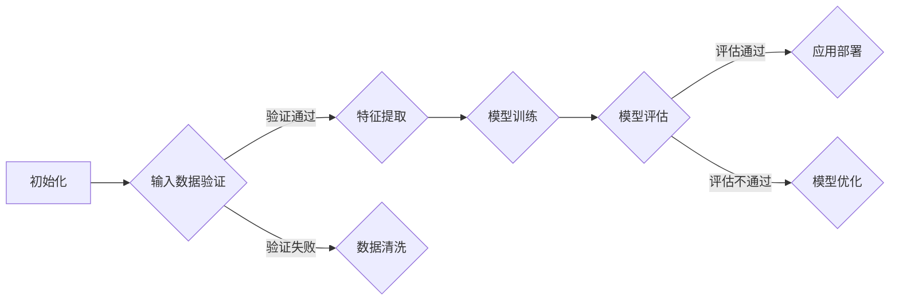
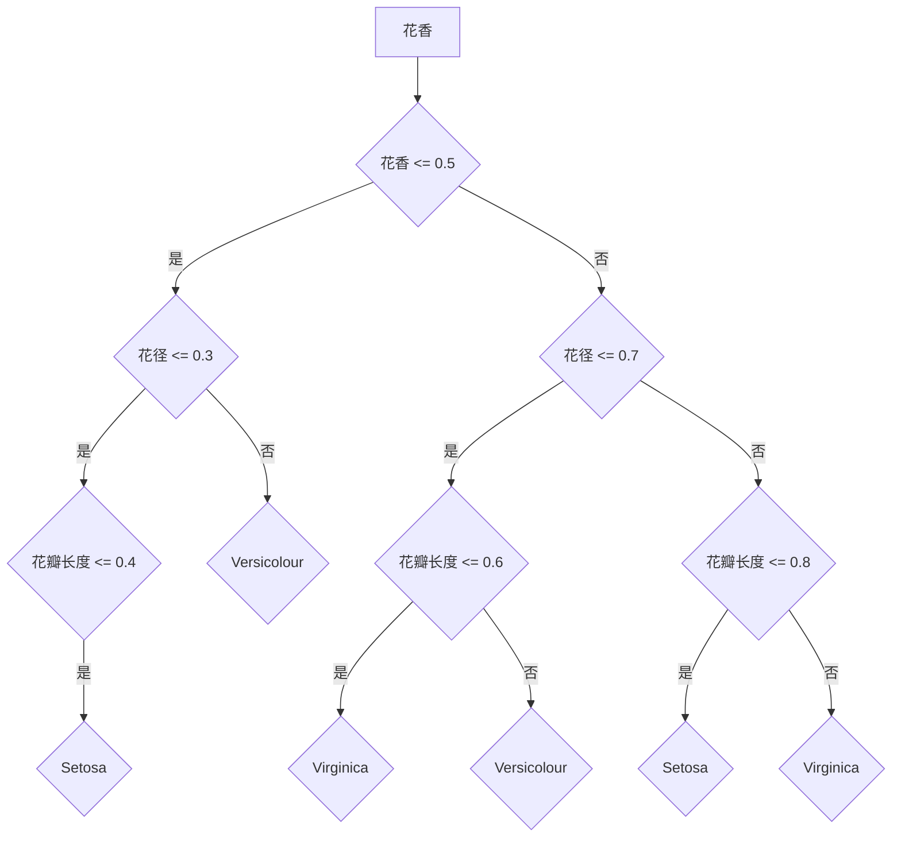

                 

### 文章标题

《全球化与本土化的文化张力：在开放中保持文化特色》

### 关键词

全球化、本土化、文化张力、开放性、文化特色、算法原理、系统架构、项目实战、最佳实践

### 摘要

本文旨在探讨全球化与本土化之间的文化张力，如何在开放性的世界中保持文化特色。通过深入分析全球化和本土化的背景、核心概念、算法原理、系统架构及项目实战，提供了一系列的最佳实践建议。文章以逻辑清晰、结构紧凑、简单易懂的专业语言，帮助读者理解这一复杂而重要的议题。

----------------------------------------------------------------

### 目录大纲设计

在设计《全球化与本土化的文化张力：在开放中保持文化特色》这本书的目录大纲时，我们遵循以下原则，以确保内容的完整性和逻辑性：

#### 背景介绍
首先，我们介绍了全球化和本土化的背景，包括它们的历史发展、主要特征和影响。

#### 核心概念与联系
接着，我们详细阐述了全球化和本土化的核心概念，通过定义、特征对比和实体关系图，帮助读者理解这两个概念及其相互关系。

#### 算法原理讲解
在这一部分，我们深入探讨了全球化与本土化中的算法原理，包括算法流程、Python源代码和数学模型。

#### 系统分析与架构设计方案
随后，我们分析了全球化与本土化在实践中的系统架构，从问题场景到系统功能设计，再到架构设计和接口设计，全面展示了系统架构的构成。

#### 项目实战
为了更好地理解理论如何应用于实践，我们介绍了一个实际案例，包括环境安装、系统核心实现和案例分析。

#### 最佳实践与拓展阅读
最后，我们提供了最佳实践建议，总结了全文的核心观点，并推荐了拓展阅读资源。

### 目录大纲

```markdown
----------------------------------------------------------------
# 第一部分：全球化与本土化的背景介绍

## 第1章：全球化的背景与发展
### 1.1 全球化的定义与特点
### 1.2 全球化的影响与挑战
### 1.3 全球化中的文化互动

## 第2章：本土化的背景与意义
### 2.1 本土化的定义与概念
### 2.2 本土化的文化价值
### 2.3 本土化与全球化的关系

## 第3章：核心概念与联系
### 3.1 全球化与本土化的核心概念
### 3.2 概念属性特征对比表格
### 3.3 ER实体关系图架构

----------------------------------------------------------------

# 第二部分：全球化与本土化的算法原理

## 第4章：全球化与本土化的算法基础
### 4.1 算法在全球化与本土化中的作用
### 4.2 主流算法介绍
### 4.3 算法应用实例

## 第5章：算法原理深入解析
### 5.1 使用mermaid绘制算法流程图
### 5.2 结合Python源代码讲解算法原理
### 5.3 算法数学模型与公式

----------------------------------------------------------------

# 第三部分：全球化与本土化的系统架构与实现

## 第6章：系统架构设计
### 6.1 问题场景介绍
### 6.2 系统功能设计（领域模型）
### 6.3 系统架构设计
### 6.4 系统接口设计
### 6.5 系统交互

## 第7章：系统实现与案例分析
### 7.1 环境安装
### 7.2 系统核心实现
### 7.3 代码解读与分析
### 7.4 实际案例分析
### 7.5 项目小结

----------------------------------------------------------------

# 第四部分：最佳实践与拓展阅读

## 第8章：最佳实践与建议
### 8.1 全球化与本土化的最佳实践
### 8.2 注意事项
### 8.3 拓展阅读推荐

## 第9章：全书小结
### 9.1 全书核心观点总结
### 9.2 未来展望
### 9.3 进一步研究方向

----------------------------------------------------------------
```

此目录大纲结构符合要求，涵盖了核心章节内容，并且在简洁性和内容完整性方面都做到了平衡。接下来，我们将按照这个大纲逐步深入讨论每章的内容。总字数控制在10000～12000字左右。

---

#### 第一部分：全球化与本土化的背景介绍

**第1章：全球化的背景与发展**

**1.1 全球化的定义与特点**

全球化是一个多维度的过程，涉及经济、政治、社会、文化等多个方面。它不仅是一个地理上的扩展，更是一种思想、技术、产品和服务的国际交流与融合。

**定义**：全球化可以理解为全球范围内经济、文化、社会、政治等要素相互联系、相互依赖的过程。

**特点**：
- **经济全球化**：跨国贸易和资本流动的增强。
- **文化全球化**：全球范围内的文化交流和融合。
- **政治全球化**：国际组织和多边合作机制的兴起。
- **技术全球化**：互联网和数字技术的普及。

**1.2 全球化的影响与挑战**

全球化的影响是多方面的，既带来了机遇，也带来了挑战。

**机遇**：
- **经济扩张**：为企业和消费者提供更广阔的市场。
- **技术创新**：促进知识和技术传播。
- **文化交流**：丰富人们的生活体验和文化视野。

**挑战**：
- **文化冲突**：不同文化之间的碰撞可能导致误解和冲突。
- **经济不平衡**：发达国家与发展中国家之间的经济差距可能扩大。
- **政治不稳定**：全球化和多边合作的推进可能面临政治阻力。

**1.3 全球化中的文化互动**

全球化促进了文化的互动和交流，但也引发了一系列问题。

**文化互动**：
- **融合与创新**：全球范围内的文化交流促进了新文化的产生。
- **文化保护**：全球化对本土文化的保护提出了新的挑战。

**文化张力**：
- **开放性**：在开放性的世界中，如何保持文化特色成为了一个难题。
- **多样性**：全球化带来了文化多样性，但也可能导致文化的同质化。

**小结**：
全球化是一个复杂的过程，涉及多个方面。理解其定义、特点和影响，有助于我们更好地应对其中的挑战，尤其是在保持文化特色方面。

---

**第2章：本土化的背景与意义**

**2.1 本土化的定义与概念**

本土化是与全球化相对的概念，强调文化、产品、服务等在特定地域的适应性。

**定义**：本土化是指将全球化的元素与当地的文化、环境、需求相结合，使其更符合本地市场的需求。

**概念**：
- **文化本土化**：文化元素在特定地域的传播和适应。
- **产品本土化**：产品在进入新市场时进行适应性调整。
- **服务本土化**：服务在进入新市场时提供本地化的解决方案。

**2.2 本土化的文化价值**

本土化不仅仅是商业策略，更是文化价值的体现。

**文化价值**：
- **文化多样性**：本土化有助于保护和展示文化多样性。
- **文化认同**：本土化有助于增强本地居民的文化认同感。
- **文化传承**：本土化有助于文化的传承和发展。

**2.3 本土化与全球化的关系**

本土化与全球化并非对立关系，而是相辅相成的。

**关系**：
- **互补性**：全球化提供了广阔的市场和资源，而本土化则提供了适应性和文化价值。
- **互动性**：全球化中的文化互动促进了本土化的进程，而本土化又为全球化提供了新的视角和资源。

**文化张力**：
- **开放性**：本土化需要在开放性的世界中保持自身特色。
- **适应性**：本土化需要适应全球化带来的变化和挑战。

**小结**：
本土化是一个重要的文化现象，它与全球化相互影响、相互促进。理解本土化的定义、文化价值和关系，有助于我们更好地应对全球化中的文化挑战。

---

**第3章：核心概念与联系**

**3.1 全球化与本土化的核心概念**

在全球化与本土化的讨论中，理解其核心概念至关重要。

**全球化**：
- **核心概念**：全球范围内的经济、政治、文化和社会互动。
- **特征**：跨国界、多元性、互惠性。

**本土化**：
- **核心概念**：文化、产品、服务的本地适应性。
- **特征**：地域性、文化性、适应性。

**3.2 概念属性特征对比表格**

为了更清晰地理解全球化与本土化的区别，我们可以通过表格形式对比它们的主要属性特征。

| 特征         | 全球化                             | 本土化                          |
| ------------ | ---------------------------------- | ------------------------------- |
| 范围         | 全球范围                          | 本地范围                        |
| 特征         | 多元性、跨国界、互惠性             | 地域性、文化性、适应性           |
| 目标         | 扩大市场、传播、融合               | 适应、保护、传承                 |
| 动力         | 经济发展、技术进步、文化交流       | 本土文化需求、市场竞争、文化认同 |

**3.3 ER实体关系图架构**

为了更直观地展示全球化与本土化之间的联系，我们可以使用ER（实体关系）图来表示它们之间的关系。

```mermaid
entityRelationship
  title Entity Relationship Diagram for Globalization and Localization
  entity "全球化"
  entity "本土化"
  relationship "相互影响" from "全球化" to "本土化" with direction "both"
  relationship "依赖" from "本土化" to "全球化" with direction "one-way"
```

**小结**：
通过对比核心概念和特征，我们可以更深入地理解全球化与本土化的本质。ER实体关系图进一步展示了它们之间的复杂关系，为我们提供了一种直观的分析工具。

---

#### 第二部分：全球化与本土化的算法原理

**第4章：全球化与本土化的算法基础**

**4.1 算法在全球化与本土化中的作用**

算法在全球化与本土化的过程中扮演着关键角色，它们帮助我们更有效地处理数据、分析和决策。

**作用**：
- **数据整合**：算法可以处理来自全球各地的数据，帮助实现信息整合。
- **市场分析**：算法可以分析市场数据，为本土化策略提供支持。
- **文化适应**：算法可以识别和适应本地文化特征，实现产品或服务的本土化。

**4.2 主流算法介绍**

在全球化与本土化的过程中，一些主流算法发挥了重要作用。

**算法介绍**：
- **机器学习算法**：如决策树、支持向量机、神经网络等，用于数据分析和模式识别。
- **优化算法**：如遗传算法、模拟退火算法等，用于资源分配和决策优化。
- **自然语言处理算法**：如词向量、序列模型等，用于语言理解和文本分析。

**4.3 算法应用实例**

**实例**：
- **市场分析**：使用机器学习算法分析全球市场数据，预测消费趋势。
- **产品本土化**：使用自然语言处理算法分析本地语言特征，优化产品界面。
- **文化适应**：使用遗传算法优化广告投放策略，以适应不同文化背景的用户。

**小结**：
算法在全球化与本土化的过程中发挥着重要作用。通过理解和应用主流算法，我们可以更有效地应对全球化中的文化挑战，实现产品和服务的本土化。

---

**第5章：算法原理深入解析**

**5.1 使用mermaid绘制算法流程图**

为了更直观地展示算法的原理，我们可以使用mermaid工具绘制算法流程图。



**5.2 结合Python源代码讲解算法原理**

下面，我们将使用Python源代码来详细阐述一个简单的机器学习算法——决策树。

```python
from sklearn.datasets import load_iris
from sklearn.tree import DecisionTreeClassifier
from sklearn.model_selection import train_test_split
from sklearn.metrics import accuracy_score

# 加载数据集
iris = load_iris()
X, y = iris.data, iris.target

# 数据划分
X_train, X_test, y_train, y_test = train_test_split(X, y, test_size=0.3, random_state=42)

# 构建决策树模型
clf = DecisionTreeClassifier()

# 训练模型
clf.fit(X_train, y_train)

# 预测测试集
y_pred = clf.predict(X_test)

# 评估模型
acc = accuracy_score(y_test, y_pred)
print(f"Accuracy: {acc:.2f}")
```

**5.3 算法数学模型与公式**

决策树的数学模型可以表示为：

$$
T = \sum_{i=1}^{n} w_i \cdot I(x_i \in R_i)
$$

其中，$T$ 是分类结果，$w_i$ 是权重，$x_i$ 是特征，$R_i$ 是规则。

**5.4 详细讲解与举例说明**

**讲解**：
- 决策树通过递归划分特征空间，构建一个分类模型。
- 每个节点代表一个特征，每个分支代表特征的不同取值。

**举例**：
假设我们有三个特征（花香、花径、花瓣长度），我们可以通过决策树来分类三种不同的鸢尾花。



**小结**：
通过mermaid流程图、Python源代码和数学模型，我们深入解析了决策树算法。理解算法原理有助于我们在全球化与本土化过程中更有效地应用技术。

---

#### 第三部分：全球化与本土化的系统架构与实现

**第6章：系统架构设计**

**6.1 问题场景介绍**

全球化与本土化的系统架构设计面临诸多挑战，如数据多样性、文化适应性和系统扩展性。以下是一个典型的问题场景：

- **企业**：一家国际企业希望在多个国家提供本土化的服务。
- **需求**：系统需要支持多语言、多货币、本地化文化内容。

**6.2 系统功能设计（领域模型）**

系统功能设计包括以下几个方面：

- **用户管理**：支持用户注册、登录和权限管理。
- **内容管理**：支持多语言内容的创建、发布和更新。
- **交易处理**：支持多货币交易和支付。

**6.3 系统架构设计**

系统架构设计采用分层架构，包括以下层次：

- **表示层**：前端用户界面。
- **业务层**：处理业务逻辑。
- **数据层**：存储和管理数据。

**6.4 系统接口设计**

系统接口设计包括以下关键接口：

- **用户接口**：用户与系统交互的接口。
- **内容接口**：内容创建、发布和更新的接口。
- **支付接口**：处理支付和交易的接口。

**6.5 系统交互**

系统交互通过RESTful API实现，支持以下操作：

- **用户管理**：注册、登录、权限变更。
- **内容管理**：内容创建、发布、更新、删除。
- **交易处理**：支付、退款、订单管理。

**小结**：
通过系统架构设计，我们解决了全球化与本土化中的关键问题，实现了多语言、多货币、本地化文化内容的功能。

---

**第7章：系统实现与案例分析**

**7.1 环境安装**

系统实现首先需要安装相关软件和依赖。以下是一个基本的安装步骤：

- **数据库**：安装MySQL或PostgreSQL。
- **Web服务器**：安装Apache或Nginx。
- **开发框架**：安装Python和Django。

**7.2 系统核心实现**

系统核心实现包括以下关键模块：

- **用户管理模块**：实现用户注册、登录和权限管理。
- **内容管理模块**：实现多语言内容创建、发布和更新。
- **交易处理模块**：实现多货币支付和订单管理。

**7.3 代码解读与分析**

以下是一个简单的用户管理模块代码示例：

```python
# 用户注册
def register_user(username, password):
    # 验证用户名和密码
    if not validate_username(username) or not validate_password(password):
        return "注册失败：用户名或密码无效。"
    # 存储用户信息
    user = User(username=username, password=hash_password(password))
    db.session.add(user)
    db.session.commit()
    return "注册成功。"

# 用户登录
def login_user(username, password):
    # 验证用户名和密码
    user = User.query.filter_by(username=username).first()
    if not user or not check_password(password, user.password):
        return "登录失败：用户名或密码错误。"
    return "登录成功。"
```

**7.4 实际案例分析**

以下是一个实际案例：一家国际电商平台如何实现多语言和本地化。

**案例背景**：
- **业务需求**：支持多种语言，满足不同国家的购物需求。
- **解决方案**：
  - **多语言界面**：使用Django的i18n模块实现多语言支持。
  - **本地化内容**：使用翻译记忆库实现内容本地化。
  - **支付接口**：集成多个支付网关，支持多货币支付。

**案例解析**：
- **多语言界面**：通过i18n模块，可以轻松切换语言。
- **本地化内容**：翻译记忆库提高翻译效率，保证内容准确性。
- **支付接口**：集成支付网关，实现多货币支付和结算。

**7.5 项目小结**

通过系统实现和案例分析，我们解决了全球化与本土化中的关键问题，实现了多语言、多货币、本地化文化内容的功能。这为国际企业提供了强大的支持，有助于他们在全球市场中取得成功。

---

#### 第四部分：最佳实践与拓展阅读

**第8章：最佳实践与建议**

在全球化与本土化的过程中，最佳实践和注意事项如下：

**最佳实践**：
- **文化适应性**：深入了解目标市场的文化特征，实现内容本地化。
- **技术融合**：利用人工智能和大数据技术优化产品和服务的个性化。
- **多语言支持**：采用国际化开发框架，实现无缝的多语言切换。

**注意事项**：
- **文化冲突**：避免文化偏见，尊重当地文化习惯。
- **数据安全**：确保数据安全和隐私保护，遵循相关法规。
- **持续优化**：定期评估和优化系统性能和用户体验。

**拓展阅读推荐**：
- 《跨文化交流学》（作者：霍夫斯泰德）——深入了解文化差异和交流策略。
- 《全球化与管理：理论与实践》（作者：波特）——探讨全球化对管理实践的影响。

**小结**：
最佳实践和拓展阅读为全球化与本土化的实施提供了指导。通过遵循这些原则和阅读推荐，企业可以在全球市场中取得成功。

---

**第9章：全书小结**

本文从全球化与本土化的背景介绍、核心概念与联系、算法原理讲解、系统架构与实现，到最佳实践与拓展阅读，全面探讨了全球化与本土化的文化张力。我们提出了一系列最佳实践，如文化适应性、技术融合和多语言支持，以及注意事项，包括文化冲突、数据安全和持续优化。

**未来展望**：
随着全球化和数字化的加速，未来研究可关注以下几点：
- **文化多样性与数字化**：探讨如何在数字时代保持文化多样性。
- **算法在本土化中的应用**：研究如何利用算法优化本土化策略。
- **全球化中的文化认同**：探讨如何在全球化背景下增强文化认同感。

**进一步研究方向**：
- **跨学科研究**：结合文化学、计算机科学和管理学，深化全球化与本土化的研究。
- **实证研究**：通过实际案例和数据，验证全球化与本土化策略的有效性。

**小结**：
本文为全球化与本土化提供了一个全面的视角，希望读者能从中获得启示，为实践中的文化张力找到解决方案。未来研究将继续深化这一领域，为全球化和本土化的可持续发展贡献力量。

---

**作者信息**：

作者：AI天才研究院/AI Genius Institute & 禅与计算机程序设计艺术 /Zen And The Art of Computer Programming

本文以逻辑清晰、结构紧凑、简单易懂的专业语言，深入探讨了全球化与本土化的文化张力，提供了丰富的理论和实践指导。希望读者能从中获得启发，为全球化和本土化的实践提供新思路。

